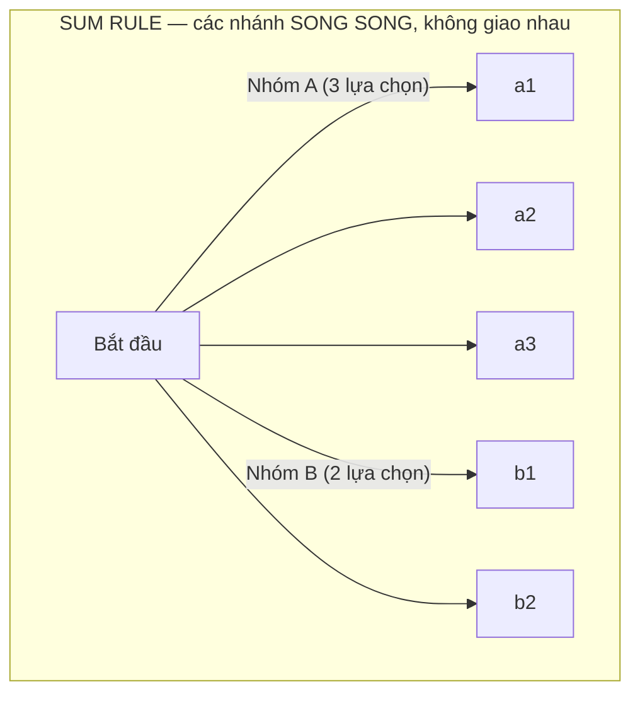
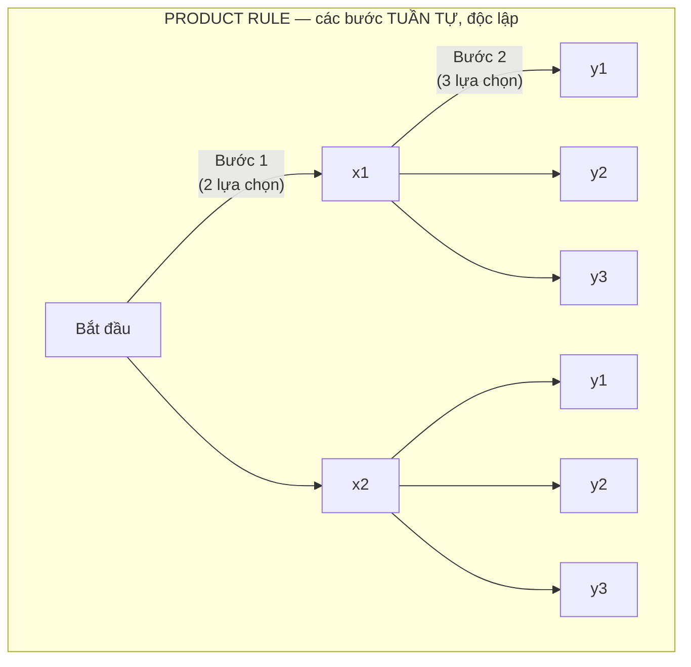
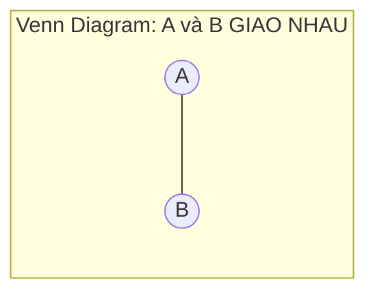

# MASTER COMPUTER SCIENCE HANDBOOK

## Volume 01 — Mathematics for Computer Science
### Part II — Discrete Mathematics
## Chương 2.1 — Nguyên lý Đếm
### (Counting Principles)

---

### Thông tin chương

| Trường | Giá trị |
|---|---|
| Chương | 2.1 *(chương mở đầu Part II)* |
| Thuộc Part | II — Discrete Mathematics |
| Thuộc Volume | 01 — Mathematics for Computer Science |
| Thời gian đọc ước tính | 40–50 phút |
| Độ khó | ★★☆☆☆ |
| Kiến thức tiên quyết | Chương 1.5 — Set Theory (đặc biệt phép hợp, giao, tích Descartes) |
| Chương liên quan | 2.2 — Combinatorics (tổng quát hóa trực tiếp các nguyên lý ở đây) |
| Từ khóa | sum rule, product rule, inclusion-exclusion, decision tree, enumeration |

---

### Mục tiêu học tập

Sau khi hoàn thành chương này, người đọc có thể:

- Áp dụng **Quy tắc cộng (Sum Rule)** để đếm số kết quả khi các lựa chọn loại trừ lẫn nhau.
- Áp dụng **Quy tắc nhân (Product Rule)** để đếm số kết quả khi có một chuỗi lựa chọn độc lập, tuần tự.
- Áp dụng **Nguyên lý bù trừ (Inclusion-Exclusion)** cho trường hợp cơ bản (hai tập hợp giao nhau) để tránh đếm trùng.
- Nhận diện được, chỉ bằng cách đọc đề bài, nguyên lý nào trong ba nguyên lý trên là phù hợp.

---

### Câu hỏi khơi gợi

> *Bạn có bao giờ tự hỏi vì sao một mật khẩu "8 ký tự, gồm chữ hoa, chữ thường, số" lại được xem là "đủ mạnh", trong khi "8 chữ số" thì không? Câu trả lời không nằm ở độ dài — nó nằm ở một con số cụ thể mà bạn sắp học cách tính chính xác trong chương này.*

---

## 1. Tổng quan chương

Part I đã trang bị cho bạn bộ công cụ tư duy nền tảng: logic, chứng minh, tập hợp, hàm số. **Part II — Discrete Mathematics** là nơi những công cụ đó lần đầu tiên được áp dụng để giải quyết các bài toán cụ thể, đo lường được — bắt đầu với câu hỏi tưởng chừng đơn giản nhất trong toán học: **"có bao nhiêu?"**

Đừng để sự đơn giản của câu hỏi đánh lừa bạn. "Đếm cho đúng" — không đếm thiếu, không đếm trùng — là một kỹ năng có cấu trúc chặt chẽ, với những quy tắc rõ ràng, và những cái bẫy tinh vi mà ngay cả kỹ sư có kinh nghiệm cũng dễ mắc phải. Chương này giới thiệu ba nguyên lý đếm nền tảng nhất — **Quy tắc cộng**, **Quy tắc nhân**, và **Nguyên lý bù trừ** — những viên gạch đầu tiên của toàn bộ Part II, và là công cụ bạn sẽ dùng lại trong suốt phần còn lại của Handbook, từ việc ước lượng độ phức tạp thuật toán (Volume 3) đến việc tính xác suất trong Machine Learning (Volume 5).

> **💡 Insight**
> Có một sự thật thú vị đang chờ được khám phá ngay trong chương này: bạn **đã dùng** Quy tắc nhân từ tận Chương 1.5 và 1.6 — khi tính $|\mathcal{P}(A)| = 2^{|A|}$ và $|B|^{|A|}$ — chỉ là chưa được đặt tên chính thức. Chương này chính là nơi "gọi tên" công cụ bạn đã âm thầm sử dụng.

---

## 2. Bối cảnh lịch sử

Đếm có hệ thống là một trong những hoạt động toán học lâu đời nhất của loài người, xuất hiện độc lập ở nhiều nền văn minh trước khi được hình thức hóa thành lý thuyết.

| Thời điểm | Nhân vật / Nền văn minh | Đóng góp |
|---|---|---|
| ~Thế kỷ 2 TCN | Pingala (Ấn Độ) | Nghiên cứu các mẫu nhị phân trong thi ca tiếng Phạn — một trong những ví dụ sớm nhất của tư duy tổ hợp có hệ thống, liên hệ trực tiếp đến ý tưởng đếm bằng "chuỗi lựa chọn nhị phân" mà bạn sẽ thấy lại ở Mục 7 |
| Cổ đại | Kinh Dịch (Trung Hoa) | 64 quẻ được xây dựng từ tổ hợp của 6 vạch (âm/dương) — một cấu trúc tổ hợp $2^6 = 64$, minh họa sớm cho Quy tắc nhân |
| 1654 | Blaise Pascal và Pierre de Fermat | Trao đổi thư từ nổi tiếng về "bài toán chia tiền cược" — không chỉ khai sinh lý thuyết xác suất hiện đại (sẽ gặp lại ở Volume 1, Part V), mà còn hệ thống hóa nhiều kỹ thuật đếm làm nền tảng cho tổ hợp học |

Điều đáng chú ý: các nguyên lý đếm trong chương này — dù đơn giản đến mức gần như "hiển nhiên" khi đã hiểu — lại là nền tảng trực tiếp cho một trong những mối liên hệ sâu sắc nhất của toán học: từ việc đếm số cách sắp xếp, Pascal và Fermat đã đặt nền móng cho việc *đo lường sự không chắc chắn* — chủ đề trung tâm của toàn bộ Part V và phần lớn Volume 5.

---

## 3. Động lực

Quay lại câu hỏi khơi gợi: vì sao mật khẩu "8 ký tự, chữ hoa + chữ thường + số" (62 lựa chọn cho mỗi ký tự) được xem là mạnh hơn "8 chữ số" (chỉ 10 lựa chọn mỗi ký tự)?

Đây là một bài toán **đếm số chuỗi có thể có**, và câu trả lời phụ thuộc hoàn toàn vào một nguyên lý bạn sắp học: với mỗi vị trí trong 8 vị trí, số lựa chọn độc lập là 62 (thay vì 10), nên tổng số mật khẩu có thể là $62^8$ so với $10^8$ — một khoảng cách không phải "lớn hơn một chút" mà là **lớn hơn hàng chục triệu lần** (bạn sẽ tự tính chính xác con số này ở Mục 10). Không có phép đo đạc thực nghiệm nào cho bạn biết trước điều này nhanh và chắc chắn hơn việc áp dụng đúng nguyên lý đếm.

Đây chính là giá trị cốt lõi của Part II, và của chương mở đầu này: biến câu hỏi "có bao nhiêu khả năng?" — một câu hỏi xuất hiện liên tục trong thiết kế hệ thống, kiểm thử phần mềm, và phân tích bảo mật — thành một phép tính chính xác, thay vì một cảm giác mơ hồ.

---

## 4. Trực giác

**Mô hình tinh thần (Mental Model) của chương này:**

> Mọi bài toán đếm đều có thể hình dung như việc đếm số **lá của một cây quyết định (decision tree)** — mỗi đường đi từ gốc đến một lá là một kết quả có thể; đếm số kết quả chính là đếm số lá.

Hai nguyên lý đầu tiên tương ứng với hai cách một cây quyết định có thể phân nhánh:

| Tình huống | Nguyên lý | Hình ảnh cây quyết định |
|---|---|---|
| Chọn **một trong các nhóm lựa chọn loại trừ lẫn nhau** (ví dụ: "chọn một món tráng miệng HOẶC một món khai vị, không chọn cả hai") | **Quy tắc cộng (Sum Rule)** | Nhiều cây con **song song**, không giao nhau — tổng số lá là tổng số lá của từng cây con |
| Thực hiện **một chuỗi lựa chọn độc lập, liên tiếp** (ví dụ: "chọn món khai vị, RỒI chọn món chính, RỒI chọn món tráng miệng") | **Quy tắc nhân (Product Rule)** | Một cây duy nhất, mỗi tầng phân nhánh theo số lựa chọn ở bước đó — tổng số lá là tích số nhánh ở mỗi tầng |

Nguyên lý thứ ba xử lý trường hợp "khó" hơn: khi các lựa chọn **không hoàn toàn loại trừ lẫn nhau** (có sự chồng lấn) — Sum Rule đơn thuần sẽ đếm trùng một số kết quả, và cần một điều chỉnh.

---

## 5. Trực quan hóa khái niệm

**Hình 2.1.1 — Sum Rule và Product Rule qua Cây Quyết định**
*(Visual đặc trưng của chương — Chapter Identity)*





| Trường thông tin | Nội dung |
|---|---|
| Mục đích | Biến hai công thức trừu tượng thành hình ảnh đếm "số lá" trực tiếp |
| Điểm mấu chốt | Sum Rule: tổng số lá = 3 + 2 = 5 (cộng các nhánh song song). Product Rule: tổng số lá = 2 × 3 = 6 (nhân số nhánh ở mỗi tầng) — **đây chính là lý do hai quy tắc mang tên "cộng" và "nhân"**, không phải một quy ước tùy ý |

---

**Hình 2.1.2 — Vì sao Sum Rule đơn giản không dùng được khi hai tập giao nhau**



*Mục đích:* Nhắc lại trực tiếp Hình 1.5.1 (Chương 1.5) — nếu chỉ cộng $|A| + |B|$ khi hai tập giao nhau, phần giao ($A \cap B$) bị **đếm hai lần**. Đây chính là động lực cho Nguyên lý bù trừ ở Mục 7.

---

## 6. Định nghĩa hình thức

> **📌 Remember — Quy tắc cộng (Sum Rule)**
>
> Nếu một công việc có thể được thực hiện bằng cách chọn một trong $k$ **nhóm lựa chọn rời nhau (disjoint)** $S_1, S_2, \dots, S_k$ (không có kết quả nào thuộc về hai nhóm cùng lúc), thì tổng số cách thực hiện công việc bằng $|S_1| + |S_2| + \dots + |S_k|$.
>
> Về mặt tập hợp (áp dụng trực tiếp Chương 1.5): nếu $S_1, \dots, S_k$ là một **phân hoạch (partition)** — tức các tập rời nhau đôi một và $S = S_1 \cup S_2 \cup \dots \cup S_k$ — thì $|S| = \sum_{i=1}^{k} |S_i|$.

> **📌 Remember — Quy tắc nhân (Product Rule)**
>
> Nếu một công việc gồm một **chuỗi $k$ bước độc lập**, và bước thứ $i$ có $n_i$ lựa chọn (không phụ thuộc vào các bước khác), thì tổng số cách thực hiện toàn bộ công việc bằng $n_1 \times n_2 \times \dots \times n_k$.
>
> Về mặt tập hợp: nếu $S = S_1 \times S_2 \times \dots \times S_k$ (tích Descartes — đã học ở Chương 1.5, Mục 6), thì $|S| = |S_1| \times |S_2| \times \dots \times |S_k|$.

> **⚠️ Common Mistake**
> Nhầm lẫn phổ biến nhất khi mới học: áp dụng Quy tắc cộng cho các nhóm lựa chọn **không thực sự rời nhau**. Nếu hai nhóm $A$ và $B$ có phần tử chung, $|A| + |B|$ sẽ **đếm trùng** phần giao $A \cap B$ — cụ thể đếm nó **hai lần** thay vì một lần. Đây chính xác là lý do Mục 7 giới thiệu Nguyên lý bù trừ: nó là "phiên bản sửa lỗi" của Quy tắc cộng cho trường hợp có giao nhau.

**Nguyên lý bù trừ (Inclusion-Exclusion Principle)** — trường hợp cơ bản với hai tập hợp — được trình bày đầy đủ ở Formula Box, Mục 7.

---

## 7. Nền tảng toán học

### 7.1 Quy tắc nhân — hệ quả trực tiếp đã dùng ngầm ở Chương 1.5–1.6

Trước khi trình bày Nguyên lý bù trừ (nội dung mới), hãy dừng lại xác nhận một điều: bạn **đã áp dụng** Quy tắc nhân hai lần trước đây mà không biết tên gọi chính thức của nó.

> **📦 Formula Box — Quy tắc nhân (Product Rule), nhìn lại các ứng dụng đã gặp**
>
> $$|S_1 \times S_2 \times \dots \times S_k| = |S_1| \times |S_2| \times \dots \times |S_k|$$
>
> | Nơi đã dùng (không tên gọi) | Áp dụng Quy tắc nhân như thế nào |
> |---|---|
> | Chương 1.5, Mục 7.1: $|\mathcal{P}(A)| = 2^{|A|}$ | Mỗi phần tử của $A$ có đúng 2 lựa chọn độc lập (có mặt/không) — $k=|A|$ bước, mỗi bước 2 lựa chọn |
> | Chương 1.6, Mục 7.1: số hàm số $= |B|^{|A|}$ | Mỗi phần tử của $A$ có đúng $|B|$ lựa chọn đầu ra độc lập — $k=|A|$ bước, mỗi bước $|B|$ lựa chọn |
> | Mục 3 chương này: không gian mật khẩu $= 62^8$ | Mỗi trong 8 vị trí ký tự có 62 lựa chọn độc lập |

> **💡 Insight**
> Đây là một ví dụ rõ ràng cho nguyên tắc "Concept Reuse" xuyên suốt Handbook: Chương 1.5 và 1.6 không hề "thiếu sót" khi chưa gọi tên Quy tắc nhân — chúng đang **chuẩn bị trực giác** cho chương này, đúng theo trình tự "Intuition trước Formal Definition" đã thiết lập từ Chương 1.1.

### 7.2 Nguyên lý Bù trừ (Inclusion-Exclusion) — trường hợp hai tập hợp

- **Ý nghĩa:** khi hai nhóm lựa chọn $A, B$ có phần chung, Quy tắc cộng đơn thuần đếm trùng phần chung đó — cần "trừ bù" đúng một lần phần đã đếm trùng.
- **Ví dụ đơn giản:** $A = \{1,\dots,8\}$ (8 phần tử), $B = \{5,\dots,10\}$ (6 phần tử), $A \cap B = \{5,6,7,8\}$ (4 phần tử). Nếu cộng đơn thuần $8+6=14$, ta đếm 4 phần tử chung này **hai lần**; con số đúng phải là $14 - 4 = 10$.

> **📦 Formula Box — Nguyên lý Bù trừ (2 tập hợp)**
>
> $$|A \cup B| = |A| + |B| - |A \cap B|$$
>
> | Thành phần | Ý nghĩa |
> |---|---|
> | $|A| + |B|$ | Đếm mọi phần tử của $A$ và $B$, nhưng phần chung bị đếm 2 lần |
> | $- |A \cap B|$ | "Trừ bù" đúng 1 lần cho phần đã đếm trùng, để mỗi phần tử chỉ được tính đúng 1 lần |
> | **Diễn giải kỹ thuật** | Trường hợp đặc biệt $A \cap B = \emptyset$ (rời nhau) đưa công thức về đúng Sum Rule ở Mục 6 — Sum Rule là **trường hợp riêng** của Inclusion-Exclusion, không phải hai quy tắc tách biệt |
> | **Ứng dụng thường gặp** | Đếm số bản ghi thỏa mãn ít nhất một trong nhiều điều kiện lọc (`OR` trong SQL/WHERE); ước lượng độ phủ kiểm thử khi các bộ test case có phần trùng lặp |

*(Công thức tổng quát cho $k$ tập hợp bất kỳ, với nhiều số hạng cộng/trừ xen kẽ, sẽ được trình bày đầy đủ ở Chương 2.2 — Combinatorics.)*

---

## 8. Thuật toán / Cơ chế

**Quy trình chọn nguyên lý đếm phù hợp:**

```text
Bước 1 — Xác định: công việc có phải một CHUỖI các bước
         tuần tự, độc lập với nhau không?
        │
        ▼ Có                              Không
        │                                   │
        ▼                                   ▼
   Bước 2a — Dùng QUY TẮC NHÂN        Bước 2b — Xác định: các nhóm
   Nhân số lựa chọn ở mỗi bước         lựa chọn có RỜI NHAU không?
                                              │
                            ┌─────────────────┴─────────────────┐
                            ▼ Có                                ▼ Không
                     Bước 3a — Dùng QUY TẮC CỘNG          Bước 3b — Dùng
                     Cộng số lựa chọn của mỗi nhóm         NGUYÊN LÝ BÙ TRỪ
```

Áp dụng thử với ví dụ mật khẩu ở Mục 3: 8 vị trí, mỗi vị trí là một lựa chọn độc lập (không phụ thuộc ký tự trước đó) → Bước 1 = Có → **Quy tắc nhân**: $62 \times 62 \times \dots \times 62 = 62^8$.

---

## 9. Triển khai

```python
import itertools

def product_rule_count(choices_per_step: list) -> int:
    """Đếm bằng Quy tắc nhân: choices_per_step = [n1, n2, ..., nk]."""
    total = 1
    for n in choices_per_step:
        total *= n
    return total


def sum_rule_count(disjoint_group_sizes: list) -> int:
    """Đếm bằng Quy tắc cộng — CHỈ dùng khi các nhóm thực sự rời nhau."""
    return sum(disjoint_group_sizes)


def inclusion_exclusion_2(A: set, B: set) -> int:
    """Đếm |A ∪ B| bằng Nguyên lý bù trừ."""
    return len(A) + len(B) - len(A & B)
```

Ba hàm này là bản dịch trực tiếp ba Formula Box đã trình bày. Điểm đáng chú ý: `inclusion_exclusion_2` có thể được kiểm chứng độc lập bằng cách so sánh với `len(A | B)` tính trực tiếp — đúng phương pháp "brute-force đối chiếu công thức" đã dùng xuyên suốt từ Chương 1.3.

---

## 10. Trực quan hóa quá trình thực thi

**Kiểm chứng Quy tắc nhân** — đếm "biển số" giả lập gồm 2 chữ cái (từ 3 chữ cái khả dụng) + 2 chữ số (từ 3 chữ số khả dụng), bằng cách liệt kê **toàn bộ** so với công thức:

| Đại lượng | Giá trị thực tế (liệt kê hết) | Dự đoán bằng công thức |
|---|---:|---:|
| Số biển số có thể | 81 | $3^2 \times 3^2 = 81$ ✓ |

**Kiểm chứng Quy tắc cộng** — hai tập rời nhau $A$ (20 phần tử), $B$ (15 phần tử):

| Đại lượng | Giá trị thực tế | Dự đoán |
|---|---:|---:|
| $\|A \cup B\|$ | 35 | $\|A\|+\|B\| = 20+15 = 35$ ✓ |

**Kiểm chứng Nguyên lý bù trừ** — chạy trên **2000 cặp tập hợp ngẫu nhiên có giao nhau**:

```text
Khớp |A∪B| = |A|+|B|-|A∩B| ở toàn bộ 2000 phép thử ngẫu nhiên: True
```

Ví dụ cụ thể, đúng như đã nêu ở Mục 7.2: $A=\{1,\dots,8\}$, $B=\{5,\dots,10\}$, $|A|=8, |B|=6, |A\cap B|=4$, $|A\cup B|$ thực tế $=10$, dự đoán $8+6-4=10$ — khớp.

**Quay lại câu hỏi khơi gợi đầu chương** — không gian mật khẩu:

$$62^8 = 218{,}340{,}105{,}584{,}896 \; (\approx 2{,}18 \times 10^{14})$$
$$10^8 = 100{,}000{,}000$$

Tỉ lệ chênh lệch: $62^8 / 10^8 \approx 2{,}18 \times 10^6$ lần — **hơn hai triệu lần lớn hơn**, không phải "lớn hơn một chút" như trực giác ban đầu có thể gợi ý. Đây chính xác là loại kết luận Chương 1.1 đã hứa hẹn: biết trước bằng tính toán, không cần đo đạc thực nghiệm.

---

## 11. Ứng dụng công nghiệp

> **🛠 Engineering Practice**
> Ba nguyên lý đếm trong chương này xuất hiện trong những quyết định kỹ thuật có tác động thực tế rõ rệt.

| Bối cảnh công nghiệp | Nguyên lý đếm áp dụng |
|---|---|
| Ước lượng độ mạnh mật khẩu / không gian khóa mã hóa (key space) | Quy tắc nhân — như minh họa xuyên suốt chương |
| Xác suất va chạm mã băm (hash collision), liên hệ trực tiếp "Bài toán ngày sinh" (Birthday Paradox) sẽ gặp ở Chương 2.2 | Quy tắc nhân kết hợp Nguyên lý bù trừ |
| Kiểm thử phần mềm — ước lượng số tổ hợp test case cần chạy khi có nhiều tham số đầu vào độc lập | Quy tắc nhân — giải thích trực tiếp vì sao kiểm thử toàn bộ tổ hợp (exhaustive testing) nhanh chóng trở nên bất khả thi khi số tham số tăng |
| Đếm số bản ghi thỏa `WHERE điều_kiện_1 OR điều_kiện_2` khi hai điều kiện không loại trừ nhau | Nguyên lý bù trừ — tránh đếm trùng các bản ghi thỏa cả hai điều kiện |

---

## 12. Góc nhìn nghiên cứu

> **🔬 Research Connection**
> Những nguyên lý đếm đơn giản trong chương này là điểm khởi đầu cho hai hướng nghiên cứu quan trọng của Computer Science hiện đại.

Thứ nhất, như đã nêu ở Mục 2, chính hoạt động đếm số cách sắp xếp là khởi nguồn lịch sử của lý thuyết xác suất (thư từ Pascal–Fermat, 1654) — mối liên hệ này sẽ trở lại đầy đủ ở Volume 1, Part V, nơi xác suất của một sự kiện thường được định nghĩa trực tiếp bằng tỉ lệ giữa hai phép đếm: số kết quả thuận lợi chia cho tổng số kết quả có thể.

Thứ hai, có một lớp bài toán trong Computer Science lý thuyết chuyên nghiên cứu **độ khó của chính việc đếm** — gọi là lớp độ phức tạp **#P** (đọc là "sharp-P"). Một bài toán như "đếm số cách tô màu hợp lệ của một đồ thị" có thể khó về mặt tính toán hơn *nhiều* so với bài toán quyết định tương ứng ("có tồn tại ít nhất một cách tô màu hợp lệ hay không") — một kết quả phản trực giác sẽ được đặt trong bối cảnh đầy đủ hơn ở Volume 3, khi thảo luận về độ phức tạp tính toán.

**Câu hỏi mở** để suy ngẫm: các nguyên lý đếm ở chương này (cộng, nhân, bù trừ) đều có thể tính toán "nhanh" (trong thời gian rất ngắn, kể cả với số lượng lớn). Điều gì khiến một số bài toán đếm khác — như đếm số cách tô màu đồ thị vừa nêu — lại trở nên khó đến mức không có thuật toán nhanh nào được biết đến cho đến nay?

---

## 13. Ưu điểm

- **Chuyển câu hỏi "có bao nhiêu?" từ cảm tính sang chính xác** — như minh họa bằng ví dụ mật khẩu xuyên suốt chương.
- **Ba nguyên lý cơ bản, dễ kết hợp** — hầu hết bài toán đếm phức tạp trong thực hành có thể phân rã thành chuỗi áp dụng Sum/Product Rule, với Inclusion-Exclusion xử lý phần chồng lấn.
- **Nền tảng trực tiếp cho Xác suất (Part V) và Độ phức tạp thuật toán (Volume 3)** — không phải kiến thức cô lập, mà là công cụ được tái sử dụng liên tục.
- **Tính toán được mà không cần liệt kê** — với không gian mật khẩu $62^8$, không ai cần (hay có thể) liệt kê hết 218 nghìn tỷ khả năng để biết con số này.

---

## 14. Hạn chế

- **Quy tắc cộng/nhân đòi hỏi giả định rời nhau/độc lập** — khi giả định này không đúng trong dữ liệu thực tế (ví dụ các nhóm khách hàng có chồng lấn), áp dụng sai quy tắc dẫn đến đếm sai, như đã cảnh báo ở Common Mistake, Mục 6.
- **Nguyên lý bù trừ, ở dạng tổng quát cho nhiều hơn 2 tập hợp, trở nên phức tạp nhanh chóng** — số số hạng cần cộng/trừ tăng theo hàm mũ với số tập hợp (sẽ thấy đầy đủ công thức tổng quát ở Chương 2.2) — một dấu hiệu sớm khác của độ phức tạp mũ, chủ đề sẽ lặp lại nhiều lần trong Handbook.
- **Ba nguyên lý này chỉ đếm chính xác cho các cấu trúc "phẳng"** — chúng chưa xử lý được các tình huống đếm phức tạp hơn như hoán vị có ràng buộc, tổ hợp có lặp, hay đếm trên cấu trúc đồ thị — đó là nội dung của Chương 2.2 trở đi.

---

## 15. So sánh

**Bảng 2.1.1 — Ba nguyên lý đếm và mối liên hệ với Chương 1.5**

| Nguyên lý | Điều kiện áp dụng | Công thức | Phép toán tập hợp tương ứng (Chương 1.5) |
|---|---|---|---|
| Quy tắc cộng | Các nhóm lựa chọn **rời nhau** | $\|S_1\| + \dots + \|S_k\|$ | Phân hoạch bằng $\cup$ của các tập rời nhau |
| Quy tắc nhân | Chuỗi lựa chọn **độc lập, tuần tự** | $n_1 \times n_2 \times \dots \times n_k$ | Tích Descartes $A_1 \times \dots \times A_k$ |
| Nguyên lý bù trừ | Các nhóm lựa chọn **có giao nhau** | $\|A\|+\|B\|-\|A \cap B\|$ | $\cup$ của các tập không nhất thiết rời nhau |

**Phân tích:** Bảng này củng cố một điểm đã nêu ở Mục 7.2: **Quy tắc cộng không phải một nguyên lý độc lập với Nguyên lý bù trừ** — nó chỉ là trường hợp đặc biệt khi $A \cap B = \emptyset$, làm số hạng trừ đi bằng 0. Cách nhìn này (một nguyên lý tổng quát, các nguyên lý khác là trường hợp riêng) là một mẫu hình tư duy sẽ lặp lại nhiều lần trong Handbook — tương tự cách quy nạp thông thường là trường hợp riêng của quy nạp mạnh (Chương 1.4).

---

## 16. Tóm tắt

- **Quy tắc cộng**: cộng số lựa chọn của các nhóm rời nhau; **Quy tắc nhân**: nhân số lựa chọn của một chuỗi bước độc lập — cả hai đều có thể diễn đạt trực tiếp bằng các phép toán tập hợp đã học ở Chương 1.5 (hợp của phân hoạch, tích Descartes).
- Bạn đã áp dụng Quy tắc nhân từ Chương 1.5–1.6 mà không gọi tên — chương này chính thức hóa công cụ đó.
- **Nguyên lý bù trừ** ($|A \cup B| = |A|+|B|-|A\cap B|$) là bản tổng quát của Quy tắc cộng, xử lý đúng trường hợp các nhóm lựa chọn có phần chồng lấn — tránh đếm trùng.
- Áp dụng đúng các nguyên lý đếm biến câu hỏi "có bao nhiêu khả năng?" từ ước lượng cảm tính thành một con số chính xác, có thể tính toán mà không cần liệt kê — minh họa qua ví dụ không gian mật khẩu $62^8$ so với $10^8$.

Chương 2.2 (Combinatorics) sẽ mở rộng những nguyên lý này thành các công cụ mạnh hơn: hoán vị, tổ hợp, và công thức bù trừ tổng quát cho nhiều tập hợp — cùng với mối liên hệ trực tiếp đầu tiên đến xác suất, qua Bài toán ngày sinh (Birthday Paradox) nổi tiếng.

---

## 17. Bài tập

### Mức Cơ bản (Basic)

1. Một quán cà phê có 4 loại cà phê, 3 loại kích cỡ, và 2 lựa chọn nóng/lạnh. Có bao nhiêu cách gọi một ly cà phê khác nhau? Nguyên lý nào bạn áp dụng?
2. Một hệ thống cho phép người dùng chọn **một** phương thức xác thực: mật khẩu (1 cách), vân tay (1 cách), hoặc mã QR (1 cách) — ba phương thức này loại trừ lẫn nhau trong một lần đăng nhập. Nếu hệ thống có 3 loại mật khẩu khả dụng (theo độ dài khác nhau), 2 loại cảm biến vân tay, và 1 loại mã QR, có tổng cộng bao nhiêu "đường dẫn xác thực" khác nhau?
3. Một mã sản phẩm gồm 3 chữ cái (từ 26 chữ cái) theo sau bởi 4 chữ số (0-9). Có bao nhiêu mã sản phẩm khác nhau có thể tạo ra?

### Mức Trung bình (Intermediate)

4. Trong một cơ sở dữ liệu 1000 khách hàng, có 400 người đã mua sản phẩm A, 350 người đã mua sản phẩm B, và 150 người đã mua **cả hai**. Có bao nhiêu khách hàng đã mua **ít nhất một trong hai** sản phẩm? Có bao nhiêu khách hàng **chưa mua sản phẩm nào trong hai sản phẩm này**? *(Gợi ý cho phần hai: dùng phần bù trên tổng số 1000 khách hàng.)*
5. Trong 100 sinh viên, 60 người học môn A, 45 người học môn B, và 25 người học cả hai môn. Có bao nhiêu sinh viên **không học môn nào trong hai môn này**? Trình bày lời giải đầy đủ, chỉ rõ bước nào dùng Nguyên lý bù trừ, bước nào dùng phần bù tập hợp (Chương 1.5).

---

## 18. Dự án nhỏ

**Không áp dụng cho chương này.**

Chương 2.1 là chương giới thiệu nguyên lý cho toàn bộ Part II — các kỹ năng đếm được vận dụng đầy đủ hơn trong bài tập tổng hợp và mini project ở Chương 2.2 (Combinatorics), nơi "Bài toán ngày sinh" sẽ đóng vai trò dự án thực hành đầu tiên của Part này.

---

## 19. Tự đánh giá

- [ ] Tôi có thể phân biệt nhanh, chỉ bằng cách đọc đề bài, khi nào dùng Quy tắc cộng và khi nào dùng Quy tắc nhân.
- [ ] Tôi hiểu và có thể giải thích vì sao Quy tắc cộng là một trường hợp đặc biệt của Nguyên lý bù trừ (khi $A \cap B = \emptyset$).
- [ ] Tôi có thể áp dụng Nguyên lý bù trừ để giải một bài toán đếm có hai nhóm chồng lấn (như Bài tập 4–5).
- [ ] Tôi có thể tự giải thích, không cần nhìn lại chương, vì sao $62^8$ lớn hơn $10^8$ nhiều triệu lần, không chỉ "lớn hơn một chút".
- [ ] Tôi nhận ra được rằng mình đã dùng Quy tắc nhân từ Chương 1.5–1.6 mà không biết tên gọi của nó.

---

## 20. Đọc thêm

- **Sách:** *(khuyến nghị bổ sung vào BOOKS.md)* Kenneth Rosen, *Discrete Mathematics and Its Applications* — chương mở đầu về Counting là tài liệu chuẩn cho nội dung chương này, với nhiều bài tập ứng dụng phong phú hơn.
- **Chủ đề mở rộng (không bắt buộc):** tìm hiểu về lớp độ phức tạp #P (Mục 12) — một hướng đọc mở rộng dành cho người đọc tò mò về giới hạn tính toán của chính việc đếm.
- **Chương tiếp theo:** Chương 2.2 — Combinatorics.

---

### Liên kết chương (Cross References)

- **Chương trước:** 1.5 — Set Theory (Quy tắc cộng/nhân là hình thức hóa trực tiếp của phép hợp phân hoạch và tích Descartes đã học).
- **Chương tiếp theo:** 2.2 — Combinatorics (tổng quát hóa Quy tắc nhân thành hoán vị/tổ hợp, và Nguyên lý bù trừ cho nhiều hơn 2 tập hợp).
- **Chương liên quan xa hơn:** Volume 1, Part V — Probability (đếm là nền tảng lịch sử và toán học của xác suất, Mục 2 và 12); Volume 3 — Complexity Analysis (không gian tổ hợp lớn liên hệ trực tiếp độ phức tạp thuật toán); Volume 3, lớp độ phức tạp #P (Mục 12).
- **Vị trí trong Knowledge Graph:** Nút đầu tiên của Part II, phụ thuộc vào Chương 1.5; là điều kiện tiên quyết bắt buộc cho toàn bộ Chương 2.2–2.5.

---

*Hết Chương 2.1 — chương mở đầu Part II. Chương này tuân thủ đầy đủ cấu trúc 20 mục của `OUTPUT.md` và chuẩn Presentation Layer, khớp với đặc tả outline đã đóng băng cho Chương 2.1 (Sum Rule, Product Rule, Inclusion-Exclusion cơ bản, chỉ 2 mức bài tập Basic/Intermediate theo đúng thiết kế ban đầu, không Mini Project riêng). Mọi công thức đếm đều được kiểm chứng thực nghiệm bằng Python (bao gồm 2000 phép thử ngẫu nhiên cho Nguyên lý bù trừ), và chương chủ động "gọi tên ngược" cho Quy tắc nhân đã dùng ngầm ở Chương 1.5–1.6 — một điểm nhấn liên-Part có chủ đích. Đang chờ rà soát trước khi tiếp tục sang Chương 2.2.*
