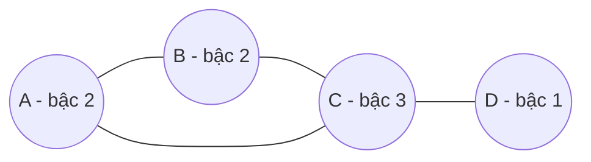

# MASTER COMPUTER SCIENCE HANDBOOK

## Volume 01 — Mathematics for Computer Science
### Part II — Discrete Mathematics
## Chương 2.3 — Đồ thị như một Cấu trúc Rời rạc
### (Graphs as Discrete Structures — Combinatorial Foundations)

---

### Thông tin chương

| Trường | Giá trị |
|---|---|
| Chương | 2.3 |
| Thuộc Part | II — Discrete Mathematics |
| Thuộc Volume | 01 — Mathematics for Computer Science |
| Thời gian đọc ước tính | 20–25 phút *(chương cố tình ngắn — xem Lưu ý phạm vi)* |
| Độ khó | ★☆☆☆☆ |
| Kiến thức tiên quyết | Chương 1.6 — Functions and Relations; Chương 2.2 — Combinatorics |
| Chương liên quan | **Volume 3, Part IV — Graph Algorithms** (toàn bộ nội dung thuật toán đồ thị được lùi lại đến đó) |
| Từ khóa | graph, vertex, edge, degree, handshake lemma |

---

### ⚠️ Lưu ý phạm vi (Scope Note) — đọc trước khi bắt đầu

Chương này **cố tình được thiết kế mỏng**. Nó chỉ trang bị từ vựng và trực giác đếm (combinatorial) tối thiểu về đồ thị — đủ để đọc hiểu các lập luận đếm liên quan đến cấu trúc đồ thị trong Handbook. Nó **không** trình bày: cách biểu diễn đồ thị trong bộ nhớ máy tính, các thuật toán duyệt đồ thị (BFS/DFS), đường đi ngắn nhất, cây khung nhỏ nhất, hay bất kỳ nội dung thuật toán nào khác. Toàn bộ nội dung đó được trình bày đầy đủ, chuyên sâu ở **Volume 3, Part IV — Graph Algorithms**, sau khi người đọc đã có nền tảng phân tích độ phức tạp thuật toán (Volume 3, Part I) cần thiết để học đồ thị một cách trọn vẹn.

> **💡 Insight**
> Đây không phải là sự thiếu sót — đây là quyết định thiết kế có chủ đích của Handbook. Đồ thị là một trong số ít khái niệm xuất hiện ở *cả* Volume 1 (góc nhìn toán học/đếm) *và* Volume 3 (góc nhìn thuật toán) — và việc tách bạch rõ ràng hai góc nhìn này giúp mỗi phần được trình bày đúng độ sâu cần thiết, không lẫn lộn.

---

### Mục tiêu học tập

Sau khi hoàn thành chương này, người đọc có thể:

- Định nghĩa đồ thị đơn (simple graph) bằng ngôn ngữ quan hệ đã học ở Chương 1.6.
- Tính **bậc (degree)** của một đỉnh, và áp dụng **Bổ đề Bắt tay (Handshake Lemma)**.
- Đọc hiểu các lập luận đếm cơ bản trên cấu trúc đồ thị, chuẩn bị nền tảng cho Volume 3.

---

## 1. Tổng quan chương

Đồ thị (graph) là một trong những cấu trúc rời rạc được dùng nhiều nhất trong Computer Science — từ mạng xã hội, bản đồ giao thông, đến kiến trúc mạng máy tính. Nhưng đồ thị có hai "cuộc đời" khác nhau trong Handbook này: một cuộc đời là đối tượng **toán học thuần túy**, nơi ta đếm, chứng minh các tính chất tổ hợp của nó (chương này); một cuộc đời khác là đối tượng **thuật toán**, nơi ta thiết kế các phương pháp xử lý nó hiệu quả (Volume 3). Chương này chỉ giới thiệu cuộc đời thứ nhất, ở mức tối thiểu — đúng như tinh thần Part II: xây dựng tư duy tổ hợp, chưa phải công cụ giải thuật.

---

## 2. Bối cảnh lịch sử

Lý thuyết đồ thị, với tư cách một nhánh toán học, có một câu chuyện khởi nguồn nổi tiếng và cụ thể hiếm có.

**Leonhard Euler (1736)** — nhà toán học đã gặp thoáng qua ở Chương 1.6 (người đưa ra ký hiệu $f(x)$) — giải quyết **Bài toán Bảy cây cầu Königsberg**: thành phố Königsberg có 7 cây cầu nối các khu vực đất qua sông; câu hỏi đặt ra là liệu có thể đi một tuyến đường qua **mỗi cây cầu đúng một lần** rồi quay về điểm xuất phát hay không. Euler chứng minh điều này là **không thể** — không phải bằng cách thử mọi tuyến đường, mà bằng một lập luận đếm thuần túy dựa trên bậc của các đỉnh (chính là nội dung Mục 7 của chương này). Công trình này thường được xem là khai sinh lý thuyết đồ thị như một nhánh toán học độc lập.

---

## 3. Động lực

Hãy xét một mạng xã hội đơn giản: mỗi người là một "đỉnh", mỗi kết bạn là một "cạnh" nối hai đỉnh. Câu hỏi tổ hợp tự nhiên: nếu bạn biết tổng số lượng kết bạn của *mọi người cộng lại*, bạn có suy ra được số lượng cặp bạn bè (số cạnh) mà không cần đếm từng cặp một không? Câu trả lời — có, và chính xác — là nội dung của Bổ đề Bắt tay, Mục 7.

---

## 4. Trực giác

**Mô hình tinh thần (Mental Model) của chương này:**

> Một đồ thị đơn giản là **các chấm (đỉnh) nối với nhau bằng các đường (cạnh)**. **Bậc** của một đỉnh là số đường nối vào nó — hình dung như số lượng "cái bắt tay" một người thực hiện trong một buổi tiệc.

Trực giác cho Bổ đề Bắt tay: mỗi cạnh (mỗi cái bắt tay) luôn liên quan đến **đúng hai** đỉnh — nên nếu bạn cộng dồn bậc của *mọi* đỉnh, mỗi cạnh sẽ được "đếm" đúng hai lần (một lần từ mỗi đầu mút của nó).

---

## 5. Trực quan hóa khái niệm

**Hình 2.3.1 — Một đồ thị đơn giản, có nhãn bậc**
*(Visual đặc trưng của chương — Chapter Identity; chỉ minh họa bậc, KHÔNG minh họa duyệt đồ thị)*



*Mục đích:* Minh họa trực tiếp khái niệm bậc — đếm số cạnh chạm vào mỗi đỉnh. Tổng bậc: $2+2+3+1=8$; số cạnh: 4 → $2 \times 4 = 8$, khớp Bổ đề Bắt tay.

---

## 6. Định nghĩa hình thức

> **📌 Remember — Đồ thị đơn (Simple Graph)**
>
> Một đồ thị đơn $G = (V, E)$ gồm một tập đỉnh $V$ (hữu hạn, khác rỗng) và một tập cạnh $E$, trong đó $E$ là một **quan hệ đối xứng, phản xạ-loại trừ trên $V$** (nhắc lại quan hệ từ Chương 1.6, Mục 6): mỗi cạnh là một tập con $\{u,v\} \subseteq V$ với $u \neq v$ (không có cạnh nối một đỉnh với chính nó, không có hai cạnh trùng nhau nối cùng một cặp đỉnh).
>
> **Bậc (Degree)** của đỉnh $v$, ký hiệu $\deg(v)$, là số cạnh có $v$ là một đầu mút.

*(Đồ thị có hướng, đồ thị có trọng số, và các biến thể khác sẽ được định nghĩa đầy đủ khi cần thiết, tại Volume 3, Part IV.)*

---

## 7. Nền tảng toán học

> **📦 Formula Box — Bổ đề Bắt tay (Handshake Lemma)**
>
> $$\sum_{v \in V} \deg(v) = 2|E|$$
>
> | Thành phần | Ý nghĩa |
> |---|---|
> | Vế trái | Tổng bậc của mọi đỉnh |
> | Vế phải | Hai lần số cạnh |
> | **Diễn giải kỹ thuật** | Áp dụng trực tiếp Quy tắc cộng (Chương 2.1): mỗi cạnh đóng góp đúng 1 vào bậc của mỗi đầu mút, tức đóng góp đúng 2 vào tổng bậc toàn đồ thị |
> | **Hệ quả trực tiếp** | Số đỉnh có bậc **lẻ** luôn là một số **chẵn** (vì tổng bậc luôn chẵn — một số chẵn không thể là tổng của một số lẻ các số lẻ) — chính là lập luận cốt lõi trong lời giải gốc của Euler cho Bài toán Bảy cây cầu |

---

## 8. Thuật toán / Cơ chế

**Không áp dụng — cố tình bỏ qua theo đúng phạm vi chương.**

Mọi nội dung về thuật toán trên đồ thị (duyệt đồ thị, tìm đường đi, xây dựng cây khung) được trình bày đầy đủ ở Volume 3, Part IV, sau khi người đọc có nền tảng phân tích độ phức tạp cần thiết (Volume 3, Part I). Việc trình bày thuật toán ở đây, trước khi có nền tảng đó, sẽ vi phạm nguyên tắc "không giới thiệu kiến thức trước điều kiện tiên quyết của nó" đã thiết lập xuyên suốt Handbook.

---

## 9. Triển khai

```python
def degree(vertex, edges):
    """Đếm bậc của một đỉnh — số cạnh có đỉnh này là đầu mút."""
    return sum(1 for (a, b) in edges if a == vertex or b == vertex)


def verify_handshake_lemma(vertices, edges):
    total_degree = sum(degree(v, edges) for v in vertices)
    return total_degree == 2 * len(edges)
```

Đoạn code này chỉ thực hiện **phép đếm tổ hợp** (đúng phạm vi chương) — không có bất kỳ logic duyệt đồ thị hay tìm đường nào.

---

## 10. Trực quan hóa quá trình thực thi

Kiểm chứng Bổ đề Bắt tay trên một đồ thị ngẫu nhiên (8 đỉnh, 10 cạnh):

```text
Bậc từng đỉnh: {0: 2, 1: 2, 2: 3, 3: 4, 4: 1, 5: 4, 6: 2, 7: 2}
Tổng bậc = 20    2×|E| = 20    khớp: True
Số đỉnh có bậc LẺ: 2 (một số chẵn, đúng như hệ quả ở Mục 7)
```

Kiểm chứng hệ quả "số đỉnh bậc lẻ luôn chẵn" trên **500 đồ thị ngẫu nhiên** với số đỉnh/cạnh khác nhau: **đúng ở toàn bộ 500 trường hợp**.

---

## 11. Ứng dụng công nghiệp

Khái niệm bậc và Bổ đề Bắt tay xuất hiện trong các ước lượng đếm nhanh trên dữ liệu mạng: ví dụ, tổng số kết nối (degree) trên toàn bộ người dùng của một mạng xã hội luôn gấp đôi tổng số quan hệ bạn bè (edges) — một phép kiểm tra tính nhất quán dữ liệu (data sanity check) rẻ và nhanh, không cần duyệt toàn bộ danh sách bạn bè.

*(Các ứng dụng công nghiệp sâu hơn — định tuyến mạng, phân tích cụm, thuật toán gợi ý dựa trên đồ thị — đòi hỏi nội dung thuật toán nằm ngoài phạm vi chương này, sẽ được trình bày ở Volume 3, Part IV và Volume 5, Part III.)*

---

## 12. Góc nhìn nghiên cứu

> **🔬 Research Connection**
> Lời giải của Euler cho Bài toán Bảy cây cầu không chỉ khai sinh lý thuyết đồ thị — nó là một trong những ví dụ sớm nhất và đẹp nhất về việc **chứng minh một điều không thể xảy ra** bằng lập luận đếm thuần túy (cùng tinh thần phi xây dựng đã gặp ở Nguyên lý Chuồng bồ câu, Chương 2.2), thay vì liệt kê thử mọi khả năng.

Lý thuyết đồ thị hiện đại đã phát triển xa hơn rất nhiều so với bài toán gốc của Euler — trở thành một trong những nhánh có ứng dụng rộng nhất của toán học rời rạc trong Computer Science, sẽ được khám phá đầy đủ ở Volume 3, Part IV.

---

## 13. Ưu điểm

- Cung cấp từ vựng tối thiểu, chính xác, để đọc hiểu các lập luận đếm liên quan đến đồ thị.
- Bổ đề Bắt tay là công cụ kiểm tra tính nhất quán dữ liệu cực nhanh, không cần thuật toán phức tạp.

---

## 14. Hạn chế

Đây chính là mục quan trọng nhất của chương: **chương này có phạm vi cố tình hẹp**. Nó không đủ để: biểu diễn đồ thị trong code một cách hiệu quả, thiết kế thuật toán duyệt/tìm đường, hay phân tích độ phức tạp của các thao tác trên đồ thị. Toàn bộ những nội dung đó thuộc về Volume 3, Part IV.

---

## 15. So sánh

**Bảng 2.3.1 — Ranh giới phạm vi: Chương này so với Volume 3, Part IV**

| Nội dung | Chương 2.3 (ở đây) | Volume 3, Part IV |
|---|---|---|
| Định nghĩa đồ thị, bậc | ✓ | (kế thừa) |
| Bổ đề Bắt tay, lập luận đếm | ✓ | (kế thừa) |
| Biểu diễn trong bộ nhớ (ma trận kề, danh sách kề) | ✗ | ✓ |
| Thuật toán duyệt (BFS, DFS) | ✗ | ✓ |
| Đường đi ngắn nhất, cây khung nhỏ nhất | ✗ | ✓ |

---

## 16. Tóm tắt

- Một **đồ thị đơn** $G=(V,E)$ là một tập đỉnh và một quan hệ đối xứng trên tập đỉnh đó (Chương 1.6).
- **Bổ đề Bắt tay**: $\sum \deg(v) = 2|E|$ — hệ quả trực tiếp của Quy tắc cộng (Chương 2.1), với hệ quả đẹp: số đỉnh bậc lẻ luôn là số chẵn.
- Chương này **cố tình dừng lại ở đây** — mọi nội dung thuật toán được lùi đến Volume 3, Part IV, đúng nguyên tắc tôn trọng thứ tự phụ thuộc kiến thức.

---

## 17. Bài tập

### Mức Cơ bản (Basic)

1. Cho đồ thị ở Hình 2.3.1. Liệt kê bậc của từng đỉnh, và xác nhận Bổ đề Bắt tay.

### Mức Trung bình (Intermediate)

2. Chứng minh: không thể tồn tại một đồ thị đơn có đúng 3 đỉnh, mỗi đỉnh bậc 3 riêng biệt là 1, 2, và 2 — sao cho tổng bậc là số lẻ. *(Gợi ý: áp dụng trực tiếp hệ quả ở Mục 7.)*

---

## 18. Dự án nhỏ

**Không áp dụng cho chương này — cố tình bỏ qua.**

Một dự án thực hành có ý nghĩa cho đồ thị đòi hỏi ít nhất một thuật toán duyệt hoặc xử lý cơ bản — vượt ngoài phạm vi cố tình hẹp của chương này. Dự án đồ thị đầu tiên của Handbook sẽ xuất hiện ở Volume 3, Part IV.

---

## 19. Tự đánh giá

- [ ] Tôi có thể định nghĩa đồ thị đơn bằng ngôn ngữ quan hệ đã học ở Chương 1.6.
- [ ] Tôi có thể tính bậc của từng đỉnh trong một đồ thị nhỏ, và xác nhận Bổ đề Bắt tay.
- [ ] Tôi hiểu rõ ranh giới phạm vi giữa chương này và Volume 3, Part IV (Bảng 2.3.1).

---

## 20. Đọc thêm

- **Sách:** *(khuyến nghị bổ sung vào BOOKS.md)* Kenneth Rosen, *Discrete Mathematics and Its Applications* — chương nhập môn lý thuyết đồ thị.
- **Chương tiếp theo (trong Volume này):** Chương 2.4 — Trees: A Mathematical Perspective.
- **Nội dung mở rộng đầy đủ:** Volume 3, Part IV — Graph Algorithms.

---

### Liên kết chương (Cross References)

- **Chương trước:** 2.2 — Combinatorics.
- **Chương tiếp theo:** 2.4 — Trees: A Mathematical Perspective (một trường hợp đặc biệt của đồ thị).
- **Chương liên quan xa hơn:** Volume 3, Part IV — Graph Algorithms (toàn bộ nội dung thuật toán, biểu diễn, duyệt đồ thị).
- **Vị trí trong Knowledge Graph:** Nút thứ ba của Part II — cố tình có "độ sâu" thấp nhất trong toàn bộ Volume 1, theo đúng quyết định biên tập đã chốt ở buổi Editorial Planning Review của Volume 1.

---

*Hết Chương 2.3. Chương này tuân thủ cấu trúc `OUTPUT.md`, nhưng áp dụng phạm vi cố tình hẹp theo đúng quyết định biên tập #4 đã chốt (tách biệt góc nhìn toán học/đếm của đồ thị khỏi góc nhìn thuật toán, dành riêng cho Volume 3, Part IV) — tránh trùng lặp nội dung giữa hai volume. Bổ đề Bắt tay được kiểm chứng thực nghiệm trên 500 đồ thị ngẫu nhiên. Không có Mini Project, không có bài tập mức Nâng cao/Nghiên cứu, đúng thiết kế ban đầu. Đang chờ rà soát trước khi tiếp tục sang Chương 2.4.*
