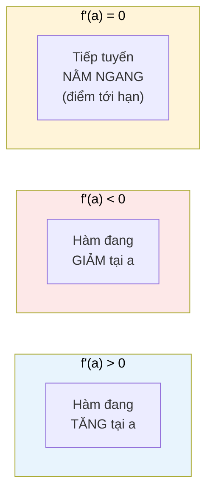

# MASTER COMPUTER SCIENCE HANDBOOK

## Volume 01 — Mathematics for Computer Science
### Part IV — Calculus
## Chương 4.3 — Đạo hàm
### (Derivatives)

---

### Thông tin chương

| Trường | Giá trị |
|---|---|
| Chương | 4.3 |
| Thuộc Part | IV — Calculus |
| Thuộc Volume | 01 — Mathematics for Computer Science |
| Thời gian đọc ước tính | 55–70 phút |
| Độ khó | ★★★☆☆ |
| Kiến thức tiên quyết | Chương 4.1 — Functions and Continuity; Chương 4.2 — Limits (đạo hàm được *định nghĩa bằng* giới hạn, không thể học chương này trước 4.2) |
| Chương liên quan | 4.4 — Partial Derivatives (mở rộng trực tiếp sang hàm nhiều biến); 4.5 — The Gradient; 4.6 — Optimization Foundations |
| Từ khóa | derivative, differentiability, tangent line, power rule, product rule, chain rule, higher-order derivative, numerical differentiation, automatic differentiation |

---

### Mục tiêu học tập

Sau khi hoàn thành chương này, người đọc có thể:

- Phát biểu định nghĩa hình thức của đạo hàm như một giới hạn, và giải thích ý nghĩa hình học (độ dốc tiếp tuyến) lẫn ý nghĩa vật lý (tốc độ thay đổi tức thời).
- Tính đạo hàm của các hàm số cơ bản và phức hợp bằng các quy tắc: hằng số, lũy thừa, tổng, tích, thương, và đặc biệt là **quy tắc chuỗi (chain rule)**.
- Giải thích chính xác vì sao tính khả vi (differentiability) là điều kiện *mạnh hơn* tính liên tục — dùng lại ví dụ ReLU đã gặp ở Chương 4.1.
- Phân biệt đạo hàm số học (numerical differentiation), đạo hàm ký hiệu (symbolic differentiation), và vi phân tự động (automatic differentiation) — ba cách khác nhau để "có được" đạo hàm trong thực hành kỹ thuật.
- Kết nối trực tiếp quy tắc chuỗi với thuật toán lan truyền ngược (backpropagation), nền tảng huấn luyện mọi mạng neural hiện đại.

---

### Câu hỏi khơi gợi

> *Khi PyTorch gọi `loss.backward()` để huấn luyện một mạng neural có hàng tỷ tham số, nó không hề "đoán" xem thay đổi tham số nào sẽ làm giảm loss — nó tính **chính xác** đạo hàm của loss theo từng tham số, bằng một quy tắc bạn đã học từ cấp 3 nhưng có lẽ chưa từng nghĩ tới việc áp dụng nó hàng tỷ lần liên tiếp, tự động, trong một phần nghìn giây: quy tắc chuỗi.*

---

## 1. Tổng quan chương

Đây là chương trung tâm của toàn bộ Part IV, và có thể nói, là một trong những chương quan trọng nhất của cả Volume 1 xét theo tần suất được tham chiếu ở các Volume sau. Mọi công cụ đã xây dựng ở Chương 4.1 (liên tục) và 4.2 (giới hạn) đều tồn tại vì một mục đích duy nhất: định nghĩa một cách chặt chẽ khái niệm **đạo hàm (derivative)** — công cụ đo "tốc độ thay đổi tức thời" của một hàm số.

Nếu Chương 4.2 là chương "khó nhất về mặt hình thức" của Part IV, thì chương này là chương **được sử dụng nhiều nhất trong thực hành**. Toàn bộ Part VII (Optimization for AI) — và do đó, toàn bộ cách một mạng neural học được từ dữ liệu — xây dựng trực tiếp trên chính định nghĩa và các quy tắc tính đạo hàm sẽ học ở đây.

> **💡 Insight**
> Nếu bạn từng đọc code PyTorch có `requires_grad=True` hoặc gọi `.backward()`, bạn đã dùng đạo hàm hàng ngày, dù chưa chắc đã nhìn thấy công thức $\lim_{h\to 0}$ đứng sau nó. Chương này mở "chiếc hộp đen" đó ra.

---

## 2. Bối cảnh lịch sử

| Thời điểm | Nhân vật | Đóng góp |
|---|---|---|
| 1665–1666 | Isaac Newton | Phát triển khái niệm "fluxion" (đạo hàm theo thời gian) để mô tả chuyển động — động lực chủ yếu từ Vật lý |
| 1670s | Gottfried Leibniz | Độc lập phát triển cùng ý tưởng, dùng ký hiệu $\dfrac{dy}{dx}$ vẫn còn dùng đến ngày nay — động lực chủ yếu từ hình học (độ dốc tiếp tuyến) |
| 1699–1716 | — | **Tranh chấp ưu tiên (priority dispute)** nổi tiếng giữa Newton và Leibniz — cả hai đều bị cáo buộc đạo ý tưởng của người kia, gây chia rẽ giới toán học Anh và lục địa châu Âu trong nhiều thập kỷ |
| 1797 | Joseph-Louis Lagrange | Đưa ra ký hiệu $f'(x)$ — gọn hơn, thường dùng trong Handbook này |
| 1823 | Augustin-Louis Cauchy | Định nghĩa đạo hàm một cách chặt chẽ bằng giới hạn (Mục 6) — hoàn thiện nền tảng logic mà Newton/Leibniz còn thiếu |

Điều thú vị: cả hai nhà toán học tiếp cận cùng một khái niệm từ hai hướng hoàn toàn khác nhau — Newton từ bài toán vật lý (vận tốc tức thời), Leibniz từ bài toán hình học (độ dốc đường cong) — nhưng đi đến **cùng một công thức toán học**. Đây là dấu hiệu cho thấy đạo hàm không phải một phát minh tùy tiện, mà là câu trả lời tất yếu cho một câu hỏi rất tự nhiên, xuất hiện độc lập từ nhiều góc nhìn khác nhau. Chúng ta sẽ thấy chính hai góc nhìn đó (vật lý và hình học) trong phần trực giác ở Mục 4.

---

## 3. Động lực

Xét bài toán huấn luyện một mô hình Machine Learning đơn giản: dự đoán giá nhà từ diện tích, dùng một tham số $w$ duy nhất, $\hat{y} = w \cdot x$. Hàm mất mát (loss function) đo sai số:

$$L(w) = (y - w \cdot x)^2$$

Câu hỏi trung tâm của việc huấn luyện: **nếu tăng $w$ lên một chút, $L$ sẽ tăng hay giảm, và tăng/giảm nhanh cỡ nào?** Nếu biết câu trả lời, ta có thể điều chỉnh $w$ theo hướng làm $L$ giảm — đây chính xác là ý tưởng của Gradient Descent (Part VII).

Câu hỏi "hàm thay đổi nhanh cỡ nào khi biến đầu vào thay đổi một chút" chính là câu hỏi mà đạo hàm trả lời — không phải một cách xấp xỉ, mà **chính xác tức thời**, tại đúng giá trị $w$ hiện tại. Đây là lý do đạo hàm, chứ không phải "thử tăng $w$ và xem điều gì xảy ra" (một cách tiếp cận chậm và kém chính xác hơn nhiều), là công cụ trung tâm của tối ưu hóa hiện đại.

---

## 4. Trực giác

**Mô hình tinh thần (Mental Model) của chương này:**

> Đạo hàm giống như **đồng hồ tốc độ (speedometer) trên xe hơi tại đúng một khoảnh khắc**. Vận tốc trung bình cả chuyến đi (quãng đường chia thời gian) là một con số hữu ích nhưng thô — nó không nói bạn đang đi nhanh cỡ nào **ngay bây giờ**. Đồng hồ tốc độ cho bạn con số đó, tại đúng khoảnh khắc kim đồng hồ đang chỉ — đó chính là đạo hàm của vị trí theo thời gian.

Hai cách hiểu song song, tương ứng đúng hai nguồn gốc lịch sử ở Mục 2:

| Góc nhìn | Ý nghĩa của đạo hàm $f'(a)$ |
|---|---|
| **Vật lý (Newton)** | Tốc độ thay đổi tức thời của $f$ tại điểm $a$ — nếu $f$ là vị trí theo thời gian, $f'$ là vận tốc |
| **Hình học (Leibniz)** | Độ dốc (slope) của đường thẳng **tiếp tuyến (tangent line)** với đồ thị $f$ tại điểm $(a, f(a))$ |

| Trực giác kỹ thuật bạn đã có | Khái niệm toán học tương ứng |
|---|---|
| Đồng hồ tốc độ xe hơi | Đạo hàm của vị trí theo thời gian (vận tốc tức thời) |
| `loss.backward()` trong PyTorch | Tính $\dfrac{\partial L}{\partial w}$ cho mọi tham số $w$ — đạo hàm riêng, sẽ học đầy đủ ở Chương 4.4 |
| Đường xu hướng (trend line) tiếp xúc một biểu đồ tại một điểm | Đường tiếp tuyến — chính là ý nghĩa hình học của $f'(a)$ |

---

## 5. Trực quan hóa khái niệm

**Hình 4.3.1 — Từ đường cát tuyến (secant line) đến đường tiếp tuyến (tangent line)**

```text
     f(x)                          f(x)                          f(x)
      │      ╱ cát tuyến            │    ╱ cát tuyến gần hơn       │   ─── tiếp tuyến
      │     ╱  (h lớn)              │   ╱   (h nhỏ hơn)            │  ╱  (h → 0)
      │    ╱                        │  ╱                           │ ╱
      │   ●  f(a+h)                 │ ●  f(a+h)                    │●  f(a) — điểm chạm
      │  ╱                          │╱                             │
      │ ●  f(a)                     ●  f(a)                        │
      └──┴────┴───── x              └──┴──┴─── x                   └──┴─── x
         a   a+h                       a  a+h                         a

  h lớn: cát tuyến           h nhỏ hơn: cát tuyến          h → 0: cát tuyến "trở
  chỉ xấp xỉ thô độ           gần hơn với hướng             thành" tiếp tuyến —
  dốc thật tại a               dốc thật tại a                 đây LÀ f'(a)
```

| Trường thông tin | Nội dung |
|---|---|
| Mục đích | Cho thấy trực quan quá trình giới hạn (Chương 4.2) "biến" một đường cát tuyến (nối hai điểm) thành đường tiếp tuyến (chạm một điểm) khi $h \to 0$ |
| Điểm mấu chốt | Độ dốc của đường cát tuyến nối $(a, f(a))$ và $(a+h, f(a+h))$ chính là $\dfrac{f(a+h)-f(a)}{h}$ — công thức này sẽ xuất hiện nguyên vẹn trong định nghĩa hình thức ở Mục 6 |

---

**Hình 4.3.2 — Đạo hàm dương, âm, và bằng không**



*Mục đích:* chuẩn bị trực tiếp cho Chương 4.6 — điều kiện $f'(a) = 0$ chính là điều kiện cần đầu tiên để tìm điểm cực trị (cực đại/cực tiểu) của một hàm số.

---

## 6. Định nghĩa hình thức

> **📌 Remember — Đạo hàm (Derivative)**
>
> Đạo hàm của hàm $f$ tại điểm $x=a$, ký hiệu $f'(a)$, được định nghĩa:
>
> $$f'(a) = \lim_{h \to 0} \frac{f(a+h) - f(a)}{h}$$
>
> nếu giới hạn này tồn tại (theo đúng định nghĩa $\varepsilon$–$\delta$ của Chương 4.2). Khi đó, ta nói $f$ **khả vi (differentiable)** tại $a$.

Quan sát then chốt: biểu thức $\dfrac{f(a+h)-f(a)}{h}$ luôn có dạng $\dfrac{0}{0}$ khi $h \to 0$ (tử số $f(a+h)-f(a) \to 0$ vì $f$ liên tục — Chương 4.1 — và mẫu số $h \to 0$ theo định nghĩa). Đây chính xác là **dạng vô định** đã học kỹ thuật xử lý ở Chương 4.2, Mục 7.2 — và kỹ thuật đó (nhân tử hóa, rút gọn trước khi lấy giới hạn) chính là cách các quy tắc đạo hàm ở Mục 7 được **chứng minh** ra.

**Đạo hàm cấp cao (Higher-order Derivatives):** đạo hàm của $f'$ gọi là **đạo hàm cấp hai**, ký hiệu $f''(x)$ hoặc $\dfrac{d^2f}{dx^2}$ — đo tốc độ thay đổi của chính tốc độ thay đổi (ví dụ: gia tốc là đạo hàm cấp hai của vị trí theo thời gian). Đạo hàm cấp hai sẽ quay lại ở Chương 4.6 khi phân biệt cực đại/cực tiểu.

> **📌 Remember — Khả vi kéo theo Liên tục (nhưng không ngược lại)**
>
> Nếu $f$ khả vi tại $a$, thì $f$ chắc chắn liên tục tại $a$. **Chiều ngược lại không đúng** — đây chính là bài học trung tâm đã hé lộ ở Chương 4.1, Mục 12: hàm $f(x) = |x|$ liên tục tại $x=0$, nhưng **không khả vi** tại đó, vì đường cát tuyến tiến từ trái cho độ dốc $-1$, còn từ phải cho độ dốc $+1$ — hai giới hạn một phía (Chương 4.2, Mục 6) khác nhau, nên giới hạn hai phía trong định nghĩa đạo hàm **không tồn tại**. Đây chính xác là lý do ReLU ($f(x)=\max(0,x)$) không khả vi tại $x=0$.

---

## 7. Nền tảng toán học

### 7.1 Các quy tắc tính đạo hàm cơ bản

> **📦 Formula Box — Quy tắc Đạo hàm cơ bản**
>
> | Quy tắc | Công thức | Ví dụ |
> |---|---|---|
> | Hằng số (Constant) | $\dfrac{d}{dx}[c] = 0$ | $\dfrac{d}{dx}[5] = 0$ |
> | Lũy thừa (Power Rule) | $\dfrac{d}{dx}[x^n] = n x^{n-1}$ | $\dfrac{d}{dx}[x^3] = 3x^2$ |
> | Tổng (Sum Rule) | $[f+g]' = f' + g'$ | $\dfrac{d}{dx}[x^2 + x] = 2x + 1$ |
> | Hằng số nhân | $[c \cdot f]' = c \cdot f'$ | $\dfrac{d}{dx}[5x^2] = 10x$ |
> | **Diễn giải kỹ thuật** | Power Rule là quy tắc dùng nhiều nhất — được chứng minh trực tiếp từ định nghĩa Mục 6 bằng khai triển nhị thức (binomial expansion) rồi rút gọn dạng vô định $\frac{0}{0}$ |
> | **Ứng dụng thường gặp** | Tính đạo hàm của mọi đa thức (polynomial) — nền tảng cho hầu hết hàm mất mát dạng bậc hai (như Mục 3) |

### 7.2 Quy tắc tích và quy tắc thương

> **📦 Formula Box — Quy tắc Tích và Thương**
>
> $$[f \cdot g]' = f' g + f g' \qquad\qquad \left[\frac{f}{g}\right]' = \frac{f'g - fg'}{g^2} \quad (g \neq 0)$$
>
> | Thành phần | Ý nghĩa |
> |---|---|
> | **Diễn giải kỹ thuật (Quy tắc Tích)** | Khi cả hai hàm $f$ và $g$ cùng thay đổi, tốc độ thay đổi của tích chịu ảnh hưởng từ **cả hai phía** — không đơn giản là $f' \cdot g'$ như nhiều người mới học nhầm tưởng |
> | **Ứng dụng thường gặp** | Đạo hàm hàm mất mát có dạng tích (ví dụ trong một số công thức regularization kết hợp nhiều thành phần) |

### 7.3 Quy tắc chuỗi (Chain Rule) — quy tắc quan trọng nhất cho AI

> **📦 Formula Box — Quy tắc Chuỗi (Chain Rule)**
>
> Nếu $y = f(g(x))$ (hàm hợp), thì:
>
> $$\frac{dy}{dx} = f'(g(x)) \cdot g'(x)$$
>
> | Thành phần | Ý nghĩa |
> |---|---|
> | $f'(g(x))$ | Tốc độ thay đổi của "lớp ngoài" $f$, đánh giá tại giá trị của "lớp trong" |
> | $g'(x)$ | Tốc độ thay đổi của "lớp trong" $g$ theo $x$ |
> | **Diễn giải kỹ thuật** | Nếu $x$ thay đổi một lượng nhỏ, nó làm $g$ thay đổi (theo tốc độ $g'$), và sự thay đổi đó của $g$ lại làm $f$ thay đổi (theo tốc độ $f'$) — hai tốc độ **nhân với nhau** vì chúng xảy ra nối tiếp |
> | **Ứng dụng thường gặp** | **Backpropagation** trong Deep Learning: một mạng neural là một chuỗi rất dài các hàm hợp (mỗi lớp là một hàm); quy tắc chuỗi cho phép tính đạo hàm của loss theo TRỌNG SỐ Ở LỚP ĐẦU TIÊN, dù loss được tính ở lớp cuối cùng, cách xa hàng chục/hàng trăm lớp |

> **💡 Insight**
> Một mạng neural $n$ lớp, về bản chất toán học, chỉ là $f_n(f_{n-1}(\dots f_1(x)\dots))$ — một hàm hợp rất dài. Backpropagation không phải một thuật toán "mới" tách biệt khỏi Giải tích cổ điển — nó chỉ là **áp dụng quy tắc chuỗi một cách có hệ thống, từ lớp cuối lùi về lớp đầu**, tận dụng việc tính toán trung gian được lưu lại để tránh tính lặp lại (một kỹ thuật gọi là "memoization", quen thuộc với bất kỳ ai học Dynamic Programming ở Volume 3).

### 7.4 Bảng đạo hàm hàm số thường gặp

| $f(x)$ | $f'(x)$ | Ghi chú |
|---|---|---|
| $e^x$ | $e^x$ | Hàm mũ tự nhiên — đạo hàm bằng chính nó, tính chất đặc biệt duy nhất trong số các hàm mũ |
| $\ln(x)$ | $\dfrac{1}{x}$ | Chỉ xác định với $x > 0$ |
| $\sin(x)$ | $\cos(x)$ | Chứng minh dùng trực tiếp giới hạn $\lim_{h\to 0}\frac{\sin h}{h}=1$ đã kiểm chứng ở Chương 4.2, Mục 10 |
| $\cos(x)$ | $-\sin(x)$ | — |
| $\sigma(x) = \dfrac{1}{1+e^{-x}}$ (Sigmoid) | $\sigma(x)\big(1-\sigma(x)\big)$ | Dạng đóng gọn — lý do sigmoid được ưa chuộng trong tính toán, xem Mục 11 |

---

## 8. Thuật toán / Cơ chế

**Ba cách "có được" đạo hàm trong thực hành kỹ thuật** — đây là điểm khác biệt quan trọng cần nắm rõ trước khi lập trình:

```text
1. ĐẠO HÀM SỐ HỌC (Numerical Differentiation)
   │
   ▼ Xấp xỉ trực tiếp định nghĩa Mục 6 bằng h hữu hạn nhỏ:
     f'(a) ≈ [f(a+h) - f(a)] / h        (forward difference)
     f'(a) ≈ [f(a+h) - f(a-h)] / (2h)   (central difference — chính xác hơn)
   │
   ▼ Ưu điểm: áp dụng được cho MỌI hàm, kể cả "hộp đen" không biết công thức
   ▼ Nhược điểm: có sai số xấp xỉ VÀ sai số làm tròn (Mục 9-10)

2. ĐẠO HÀM KÝ HIỆU (Symbolic Differentiation)
   │
   ▼ Áp dụng các quy tắc ở Mục 7 một cách hình thức trên biểu thức toán học
     (giống như bạn làm bằng tay, hoặc như sympy làm tự động)
   │
   ▼ Ưu điểm: kết quả CHÍNH XÁC tuyệt đối (không có sai số số học)
   ▼ Nhược điểm: biểu thức có thể "nổ" kích thước với hàm phức tạp
     (hiện tượng "expression swell")

3. VI PHÂN TỰ ĐỘNG (Automatic Differentiation — "Autograd")
   │
   ▼ Theo dõi MỌI phép toán cơ bản trong quá trình tính f(x),
     áp dụng quy tắc chuỗi (Mục 7.3) tự động cho từng phép toán,
     tính đạo hàm CHÍNH XÁC mà không cần "nổ" biểu thức
   │
   ▼ Đây là công nghệ đứng sau PyTorch, TensorFlow — không phải
     đạo hàm số học (có sai số), cũng không phải đạo hàm ký hiệu
     thuần túy (không hiệu quả) — mà là một kỹ thuật thứ ba
```

> **⚠️ Common Mistake**
> Một hiểu lầm rất phổ biến: `loss.backward()` trong PyTorch **không phải** là đạo hàm số học (không tính `(f(x+h)-f(x))/h`). Đây là **vi phân tự động (automatic differentiation)** — cho kết quả chính xác về mặt toán học (không có sai số xấp xỉ như Mục 9–10 sẽ minh họa), chỉ có sai số làm tròn số dấu phẩy động thông thường.

---

## 9. Triển khai

```python
def f(x):
    return x ** 3

def f_exact_derivative(x):
    """Đạo hàm chính xác, tính bằng tay dùng Power Rule (Mục 7.1): d/dx[x^3] = 3x^2."""
    return 3 * x ** 2


def forward_difference(f, x, h):
    """Đạo hàm số học — công thức sai phân tiến (forward difference)."""
    return (f(x + h) - f(x)) / h


def central_difference(f, x, h):
    """Đạo hàm số học — công thức sai phân trung tâm (central difference),
    chính xác hơn forward difference (sai số bậc h² thay vì bậc h)."""
    return (f(x + h) - f(x - h)) / (2 * h)
```

Hai hàm `forward_difference` và `central_difference` triển khai đúng nhánh "Đạo hàm số học" ở Mục 8. `central_difference` chính xác hơn vì nó tận dụng thông tin từ **cả hai phía** của điểm đang xét (tương tự cách Chương 4.2 dùng cả giới hạn trái và phải), khử được thành phần sai số bậc nhất mà `forward_difference` mắc phải.

---

## 10. Trực quan hóa quá trình thực thi

**So sánh sai số: $f(x) = x^3$ tại $x=2$, đạo hàm chính xác $f'(2) = 3(2)^2 = 12$:**

| $h$ | Forward Diff. | Central Diff. | Sai số Forward | Sai số Central |
|---:|---:|---:|---:|---:|
| 0.1 | 12.6100000000 | 12.0100000000 | $6.10 \times 10^{-1}$ | $1.00 \times 10^{-2}$ |
| 0.01 | 12.0601000000 | 12.0001000000 | $6.01 \times 10^{-2}$ | $1.00 \times 10^{-4}$ |
| 0.001 | 12.0060010000 | 12.0000010000 | $6.00 \times 10^{-3}$ | $1.00 \times 10^{-6}$ |
| 0.0001 | 12.0006000100 | 12.0000000100 | $6.00 \times 10^{-4}$ | $1.00 \times 10^{-8}$ |
| 0.00001 | 12.0000600003 | 12.0000000002 | $6.00 \times 10^{-5}$ | $2.12 \times 10^{-10}$ |

Quan sát rõ ràng: mỗi khi $h$ giảm 10 lần, sai số của `forward_difference` cũng giảm khoảng 10 lần (sai số bậc $h$), nhưng sai số của `central_difference` giảm khoảng **100 lần** (sai số bậc $h^2$) — xác nhận đúng lý thuyết đã nêu ở Mục 9.

**Nhưng $h$ càng nhỏ luôn tốt hơn?** — Kiểm tra với `central_difference` ở các giá trị $h$ cực nhỏ:

| $h$ | Central Diff. | Sai số |
|---:|---:|---:|
| $10^{-6}$ | 12.0000000008 | $7.89 \times 10^{-10}$ |
| $10^{-8}$ | 11.9999998827 | $1.17 \times 10^{-7}$ |
| $10^{-10}$ | 12.0000009929 | $9.93 \times 10^{-7}$ |
| $10^{-12}$ | 12.0010668070 | $1.07 \times 10^{-3}$ |
| $10^{-14}$ | 12.1236354289 | $1.24 \times 10^{-1}$ |
| $10^{-16}$ | 0.0000000000 | $1.20 \times 10^{1}$ |

> **⚠️ Common Mistake**
> Sai số **giảm dần rồi đột ngột tăng vọt** khi $h \to 10^{-16}$! Đây chính là hiện tượng **triệt tiêu chữ số có nghĩa (catastrophic cancellation)** đã cảnh báo trước ở Chương 4.2, Mục 3: khi $h$ quá nhỏ, $f(x+h)$ và $f(x-h)$ gần như bằng hệt nhau trên số dấu phẩy động 64-bit, và phép trừ chúng "xóa sạch" gần hết các chữ số có nghĩa còn lại. Bài học kỹ thuật quan trọng: đạo hàm số học có một **giá trị $h$ tối ưu** (thường quanh $10^{-5}$ đến $10^{-8}$ cho số dấu phẩy động 64-bit) — không phải "càng nhỏ càng tốt".

---

## 11. Ứng dụng công nghiệp

> **🛠 Engineering Practice**
> Quy tắc chuỗi (Mục 7.3) không chỉ là một công thức toán học — nó là thuật toán lõi vận hành mọi framework Deep Learning hiện đại.

| Bối cảnh công nghiệp | Vai trò của Đạo hàm |
|---|---|
| Backpropagation (PyTorch, TensorFlow, JAX) | Áp dụng có hệ thống quy tắc chuỗi qua toàn bộ kiến trúc mạng, từ lớp cuối lùi về lớp đầu (Mục 7.3, 8) |
| Sigmoid activation function | Đạo hàm dạng đóng $\sigma(x)(1-\sigma(x))$ (Mục 7.4) — tính toán rẻ vì tái sử dụng chính giá trị $\sigma(x)$ đã tính ở lượt truyền xuôi (forward pass) |
| Physics Engine trong Game Development | Vận tốc = đạo hàm vị trí theo thời gian; gia tốc = đạo hàm cấp hai (Mục 6) |
| Bộ điều khiển PID (Proportional-Integral-Derivative) trong Điều khiển tự động | Thành phần "D" (Derivative) phản ứng với **tốc độ thay đổi** của sai số, giúp hệ thống giảm dao động (overshoot) |
| Định giá phái sinh tài chính (Financial Derivatives Pricing) | Đại lượng "Delta" (độ nhạy giá quyền chọn theo giá tài sản cơ sở) chính là một đạo hàm riêng phần theo đúng nghĩa toán học |

---

## 12. Góc nhìn nghiên cứu

> **🔬 Research Connection**
> Bản thân thuật toán Backpropagation — một trong những kết quả có ảnh hưởng lớn nhất lịch sử AI — về bản chất toán học thuần túy chỉ là một ứng dụng có hệ thống của quy tắc chuỗi vừa học ở Mục 7.3.

Bài báo *Learning Representations by Back-Propagating Errors* (Rumelhart, Hinton, Williams, 1986 — xem PAPERS.md) không phát minh ra quy tắc chuỗi (đã có từ Leibniz, thế kỷ 17) — đóng góp mang tính cách mạng của bài báo là chứng minh rằng việc áp dụng quy tắc chuỗi **một cách có tổ chức, hiệu quả về mặt tính toán** (reverse-mode automatic differentiation, xem Mục 8) có thể huấn luyện được mạng neural nhiều lớp trong thực hành — một bước ngoặt khởi đầu cho làn sóng Deep Learning hiện đại.

**Hướng nghiên cứu mở, kết nối trực tiếp với Chương 4.1:** không phải mọi hàm mất mát hiện đại đều khả vi khắp nơi — ReLU (Chương 4.1, Mục 12) là ví dụ điển hình, không khả vi tại $x=0$. Vậy làm sao Backpropagation vẫn "hoạt động tốt" qua các lớp ReLU trong thực hành? Câu trả lời thực dụng: các framework chọn *một* giá trị hợp lý (thường là 0) cho đạo hàm tại đúng điểm không khả vi đó — về mặt lý thuyết thuần túy đây là một "subgradient" (đã nhắc ở Chương 4.1, Mục 12), không phải đạo hàm cổ điển theo đúng định nghĩa Mục 6. Nghiên cứu về **tối ưu hóa không mượt (non-smooth optimization)** tiếp tục nghiên cứu tính đúng đắn và giới hạn hội tụ của cách "vá" thực dụng này.

---

## 13. Ưu điểm

- **Công cụ chính xác tức thời** — thay vì phải "thử và sai" để biết hàm tăng/giảm nhanh cỡ nào, đạo hàm cho câu trả lời chính xác tại đúng một điểm.
- **Các quy tắc tính đạo hàm (Mục 7) có tính hệ thống, cơ giới hóa được** — đây là lý do máy tính có thể tính đạo hàm tự động (Automatic Differentiation, Mục 8), không cần con người can thiệp thủ công.
- **Quy tắc chuỗi mở rộng tự nhiên tới cấu trúc lồng nhau bất kỳ độ sâu** — chính là lý do mạng neural có thể sâu hàng trăm lớp mà vẫn huấn luyện được.
- **Ý nghĩa hình học và vật lý song song, bổ trợ nhau** — cùng một công thức toán học phục vụ được cả trực giác không gian (độ dốc) lẫn trực giác thời gian (tốc độ).

---

## 14. Hạn chế

> **⚠️ Common Mistake**
> Đảo ngược quan hệ Khả vi ⟹ Liên tục thành "Liên tục ⟹ Khả vi" là lỗi phổ biến bậc nhất khi học đạo hàm — Mục 6 đã chứng minh bằng ví dụ $|x|$ rằng chiều ngược lại **sai**.

- Đạo hàm số học (Mục 8–10) luôn có đánh đổi giữa sai số xấp xỉ (do $h$ hữu hạn) và sai số làm tròn (do $h$ quá nhỏ) — không tồn tại một $h$ "hoàn hảo" cho mọi hàm và mọi độ chính xác dấu phẩy động.
- Không phải mọi hàm quan trọng trong AI đều khả vi khắp nơi (ReLU tại $x=0$, hàm giá trị tuyệt đối trong một số hàm mất mát) — cần công cụ tổng quát hơn (subgradient) ngoài phạm vi chi tiết của Volume 1.
- Quy tắc tích và quy tắc thương (Mục 7.2) thường bị áp dụng sai bởi người mới học — nhầm lẫn $[fg]' = f'g'$ (sai) thay vì $[fg]'=f'g+fg'$ (đúng); luôn kiểm tra lại bằng cách thử một ví dụ số cụ thể nếu không chắc chắn.
- Đạo hàm chỉ đo hành vi **cục bộ (local)**, tại lân cận rất nhỏ của một điểm — nó **không** cho biết trực tiếp thông tin toàn cục (global), như liệu một điểm $f'(a)=0$ có phải cực tiểu *toàn cục* hay chỉ *địa phương* — câu hỏi này sẽ trở lại chi tiết ở Chương 4.6.

---

## 15. So sánh

**Bảng 4.3.1 — Ba phương pháp tính Đạo hàm trong Kỹ thuật**

| Đặc điểm | Numerical | Symbolic | Automatic (Autograd) |
|---|---|---|---|
| Độ chính xác | Xấp xỉ, có sai số (Mục 10) | Chính xác tuyệt đối | Chính xác (chỉ có sai số làm tròn thông thường) |
| Cần biết công thức $f$? | Không — chỉ cần đánh giá $f$ được | Có — cần biểu thức tường minh | Không — chỉ cần các phép toán cơ bản cấu thành $f$ |
| Hiệu quả với hàm phức tạp (nhiều lớp) | Chậm — cần đánh giá $f$ nhiều lần | Có thể "nổ" kích thước biểu thức | Hiệu quả cao — đây là lý do được chọn cho Deep Learning |
| Công cụ tiêu biểu | `scipy.optimize.approx_fprime` | `sympy` | PyTorch `autograd`, TensorFlow `GradientTape` |

**Phân tích:** Autograd không phải "nhanh hơn Symbolic vì kém chính xác hơn" — nó **chính xác ngang Symbolic**, chỉ khác ở cách tổ chức tính toán: thay vì xây một biểu thức đạo hàm khổng lồ rồi đánh giá, Autograd tính giá trị đạo hàm số **trực tiếp**, tận dụng lại các giá trị trung gian đã tính trong lượt truyền xuôi (forward pass) — đây là lý do nó vừa chính xác vừa hiệu quả, kết hợp ưu điểm của cả hai phương pháp còn lại.

---

## 16. Tóm tắt

- **Đạo hàm** $f'(a) = \lim_{h \to 0} \dfrac{f(a+h)-f(a)}{h}$ đo tốc độ thay đổi tức thời; ý nghĩa hình học là độ dốc tiếp tuyến, ý nghĩa vật lý là vận tốc tức thời.
- Các **quy tắc tính đạo hàm** (hằng số, lũy thừa, tổng, tích, thương) cơ giới hóa việc tính đạo hàm mà không cần quay lại định nghĩa giới hạn mỗi lần.
- **Quy tắc chuỗi** là quy tắc quan trọng nhất cho AI — nó là nền tảng toán học thuần túy của thuật toán Backpropagation.
- **Khả vi kéo theo liên tục, nhưng không ngược lại** — ReLU và $|x|$ là ví dụ kinh điển của hàm liên tục nhưng không khả vi tại một điểm.
- Có **ba cách khác nhau** để có được đạo hàm trong thực hành: Numerical (xấp xỉ, có sai số), Symbolic (chính xác nhưng có thể cồng kềnh), Automatic Differentiation (chính xác và hiệu quả — công nghệ đứng sau mọi framework Deep Learning hiện đại).

Chương 4.4 (Partial Derivatives) sẽ mở rộng chính xác định nghĩa và các quy tắc vừa học ở đây sang hàm nhiều biến — bước chuẩn bị trực tiếp cuối cùng trước khi định nghĩa Gradient ở Chương 4.5.

---

## 17. Bài tập

### Mức Cơ bản (Basic)

1. Tính đạo hàm của $f(x) = 4x^3 - 2x^2 + 7x - 1$ bằng Power Rule và Sum Rule (Mục 7.1).
2. Dùng Quy tắc Tích (Mục 7.2), tính đạo hàm của $f(x) = x^2 \cdot \sin(x)$.

### Mức Trung bình (Intermediate)

3. Dùng Quy tắc Chuỗi (Mục 7.3), tính đạo hàm của $f(x) = \sin(3x^2 + 1)$. Xác định rõ "lớp ngoài" và "lớp trong" trước khi áp dụng công thức.
4. Chứng minh rằng $f(x) = |x|$ không khả vi tại $x=0$, bằng cách tính riêng giới hạn trái và giới hạn phải của $\dfrac{f(0+h)-f(0)}{h}$ (dùng đúng kỹ thuật Chương 4.2, Mục 6).

### Mức Nâng cao (Advanced)

5. Dùng `central_difference` ở Mục 9, viết code kiểm chứng bằng số công thức đạo hàm sigmoid $\sigma'(x) = \sigma(x)(1-\sigma(x))$ (Mục 7.4) tại 3 giá trị $x$ khác nhau. So sánh kết quả số học với công thức đóng.
6. Cho $f(x) = e^{x^2}$. Áp dụng Quy tắc Chuỗi hai lần (lồng nhau) nếu cần, tính $f'(x)$ và $f''(x)$ (đạo hàm cấp hai, Mục 6).

### Mức Nghiên cứu (Research)

7. Tìm hiểu sơ lược sự khác biệt giữa **forward-mode** và **reverse-mode automatic differentiation**. Vì sao reverse-mode (chính là cơ chế của Backpropagation) hiệu quả hơn nhiều khi hàm có rất nhiều đầu vào (như trọng số mạng neural) nhưng chỉ có một đầu ra (loss scalar)?

---

## 18. Dự án nhỏ

**So sánh ba phương pháp tính Đạo hàm trên cùng một hàm**

- **Mục tiêu:** cài đặt và so sánh trực tiếp Numerical, Symbolic, và (nếu có điều kiện) Automatic Differentiation trên cùng một hàm phức hợp.
- **Yêu cầu:**
  - Chọn một hàm có ít nhất 3 lớp hợp thành (ví dụ $f(x) = \sin(e^{x^2})$).
  - Tính đạo hàm bằng `central_difference` (Mục 9), bằng `sympy.diff` (Symbolic), và bằng PyTorch tensor với `requires_grad=True` (Automatic).
  - So sánh cả ba kết quả tại 5 giá trị $x$ khác nhau; đo cả độ chính xác và thời gian chạy.
- **Công nghệ gợi ý:** Python, `sympy`, PyTorch (CPU đủ dùng cho bài tập này).
- **Kết quả kỳ vọng:** một bảng so sánh rõ ràng, xác nhận Symbolic và Automatic cho kết quả khớp nhau tuyệt đối, còn Numerical có sai số nhỏ đúng như phân tích ở Mục 10.
- **Mở rộng:** thử với một hàm có điểm không khả vi (như $|x|$) và quan sát mỗi phương pháp "xử lý" tình huống đó ra sao (Numerical vẫn cho một con số dù không hợp lệ về mặt lý thuyết; Symbolic có thể báo lỗi hoặc trả biểu thức không xác định; Automatic Differentiation thường trả một giá trị quy ước, xem Mục 12).

---

## 19. Tự đánh giá

- [ ] Tôi có thể phát biểu chính xác định nghĩa đạo hàm bằng giới hạn, không cần nhìn lại Mục 6.
- [ ] Tôi có thể áp dụng đúng Power Rule, Sum Rule, Product Rule, và đặc biệt là Chain Rule cho các hàm hợp đơn giản.
- [ ] Tôi có thể giải thích, bằng ví dụ cụ thể ($|x|$ hoặc ReLU), vì sao liên tục không kéo theo khả vi.
- [ ] Tôi hiểu sự khác biệt giữa Numerical, Symbolic, và Automatic Differentiation — không chỉ về mặt khái niệm mà cả về đánh đổi thực hành (Bảng 4.3.1).
- [ ] Tôi có thể giải thích, bằng lời của riêng mình, vì sao Backpropagation về bản chất chỉ là ứng dụng có hệ thống của Quy tắc Chuỗi.

Nếu Bài tập 3 (Chain Rule) vẫn còn khó khăn, đây là dấu hiệu quan trọng cần giải quyết **trước khi** sang Chương 4.4 — vì Chương 4.4 và 4.5 sẽ dùng Chain Rule liên tục, và toàn bộ ý nghĩa của Backpropagation (Volume 5–6) phụ thuộc hoàn toàn vào việc thành thạo quy tắc này.

---

## 20. Đọc thêm

- **Sách:** Gilbert Strang, *Calculus*, các chương về Đạo hàm — nhiều ví dụ trực quan về ý nghĩa hình học. *(Xem BOOKS.md — Volume 1.)*
- **Bài báo nền tảng:** Rumelhart, Hinton, Williams (1986), *Learning Representations by Back-Propagating Errors* — xem PAPERS.md, liên kết trực tiếp Mục 12.
- **Chủ đề mở rộng (không bắt buộc):** tìm đọc về "Dual Numbers" — một cấu trúc đại số đơn giản, đẹp, là nền tảng toán học cho forward-mode automatic differentiation (Bài tập 7).
- **Chương tiếp theo:** Chương 4.4 — Partial Derivatives and Multivariable Functions.

---

### Liên kết chương (Cross References)

- **Chương trước:** 4.2 — Limits (đạo hàm được định nghĩa trực tiếp bằng giới hạn dạng $\frac{0}{0}$, dùng nguyên vẹn kỹ thuật xử lý dạng vô định ở đó).
- **Chương tiếp theo:** 4.4 — Partial Derivatives and Multivariable Functions (mở rộng trực tiếp mọi quy tắc ở Mục 7 sang hàm nhiều biến).
- **Chương liên quan xa hơn:** 4.5 — The Gradient (gộp các đạo hàm riêng thành một vector); 4.6 — Optimization Foundations (điều kiện $f'(a)=0$, Hình 4.3.2); Volume 5–6 — Machine Learning & Deep Learning (Backpropagation, Mục 12, là ứng dụng trực tiếp của Chain Rule học ở đây).
- **Vị trí trong Knowledge Graph:** Nút thứ ba, trung tâm của Part IV — phụ thuộc trực tiếp vào Chương 4.2; là điều kiện tiên quyết bắt buộc cho toàn bộ phần còn lại của Part IV (4.4, 4.5, 4.6) và là chương được tham chiếu nhiều nhất từ các Volume sau.

---

*Hết Chương 4.3. Chương này tuân thủ đầy đủ cấu trúc 20 mục của `OUTPUT.md` và chuẩn Presentation Layer, là chương trung tâm của Part IV theo outline đã đóng băng ở `VOLUME_01_OUTLINE.md` và `V01_P04_OVERVIEW.md`. Toàn bộ bảng sai số ở Mục 10 (bao gồm minh chứng hiện tượng catastrophic cancellation) đã được kiểm chứng thực nghiệm bằng Python. Đang chờ rà soát trước khi tiếp tục sang Chương 4.4 — Partial Derivatives and Multivariable Functions.*
