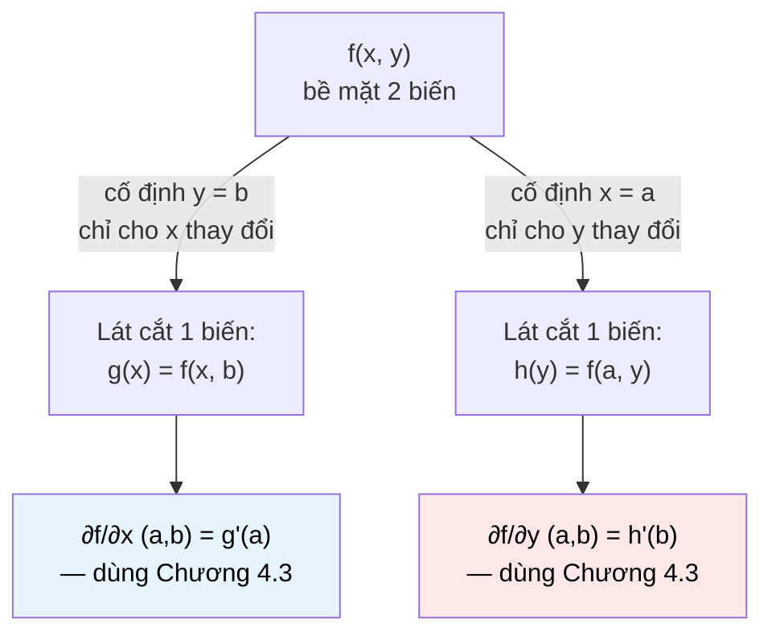

# MASTER COMPUTER SCIENCE HANDBOOK

## Volume 01 — Mathematics for Computer Science
### Part IV — Calculus
## Chương 4.4 — Hàm nhiều biến và Đạo hàm riêng
### (Multivariable Functions and Partial Derivatives)

---

### Thông tin chương

| Trường | Giá trị |
|---|---|
| Chương | 4.4 |
| Thuộc Part | IV — Calculus |
| Thuộc Volume | 01 — Mathematics for Computer Science |
| Thời gian đọc ước tính | 45–55 phút |
| Độ khó | ★★★☆☆ |
| Kiến thức tiên quyết | Chương 4.3 — Derivatives; Chương 3.1 — Vectors (Part III, cho ký hiệu điểm trong $\mathbb{R}^n$) |
| Chương liên quan | 4.5 — The Gradient (gộp toàn bộ đạo hàm riêng của chương này thành một vector duy nhất) |
| Từ khóa | multivariable function, level curve, contour plot, partial derivative, second-order partial derivative, mixed partial, Clairaut's theorem |

---

### Mục tiêu học tập

Sau khi hoàn thành chương này, người đọc có thể:

- Định nghĩa và trực quan hóa hàm nhiều biến $f: \mathbb{R}^n \to \mathbb{R}$, đặc biệt qua khái niệm đường mức (level curve).
- Định nghĩa hình thức **đạo hàm riêng (partial derivative)** như một đạo hàm một biến, với các biến còn lại giữ cố định.
- Tính đạo hàm riêng của các hàm nhiều biến cụ thể, tái sử dụng trực tiếp mọi quy tắc đã học ở Chương 4.3.
- Tính đạo hàm riêng cấp hai, bao gồm đạo hàm hỗn hợp (mixed partial), và phát biểu Định lý Clairaut.
- Giải thích vì sao đạo hàm riêng là bước chuẩn bị bắt buộc, trực tiếp cho khái niệm Gradient ở Chương 4.5.

---

### Câu hỏi khơi gợi

> *Một mạng neural với một triệu tham số có một triệu "hướng" để thay đổi. Khi huấn luyện, làm sao biết chính xác tham số thứ 573.221 nên tăng hay giảm, trong khi 999.999 tham số còn lại cũng đang thay đổi cùng lúc? Câu trả lời, hóa ra, đơn giản đến bất ngờ: giữ tất cả 999.999 tham số kia "đứng yên" trong đầu, và chỉ hỏi — đúng như Chương 4.3 đã dạy — "nếu MỖI MÌNH tham số này thay đổi một chút, loss thay đổi thế nào?"*

---

## 1. Tổng quan chương

Toàn bộ Chương 4.3 xây dựng khái niệm đạo hàm cho hàm **một biến** $f: \mathbb{R} \to \mathbb{R}$. Nhưng gần như mọi bài toán thực tế trong kỹ thuật và AI đều liên quan đến hàm **nhiều biến**: hàm mất mát của một mô hình phụ thuộc đồng thời vào hàng nghìn, hàng triệu tham số; nhiệt độ tại một điểm trên bản đồ phụ thuộc vào cả kinh độ lẫn vĩ độ; giá một căn nhà phụ thuộc vào diện tích, số phòng, vị trí, và nhiều yếu tố khác cùng lúc.

Tin tốt: không cần phát minh lại lý thuyết từ đầu. Chương này chỉ ra rằng cách xử lý hàm nhiều biến, ở mức độ "từng biến một", **chính xác là** những gì đã học ở Chương 4.3 — chỉ cần thêm một quy ước đơn giản: **giữ mọi biến khác cố định**, rồi áp dụng nguyên vẹn định nghĩa và các quy tắc đạo hàm cũ. Khái niệm mới duy nhất ở đây là tên gọi: **đạo hàm riêng (partial derivative)**.

Đây là chương "chuẩn bị vật liệu" cuối cùng trước khi Chương 4.5 gộp các đạo hàm riêng lại thành một đối tượng duy nhất, mạnh mẽ hơn: vector Gradient.

> **💡 Insight**
> Nếu bạn từng dùng thuật ngữ "giữ các biến khác không đổi" khi phân tích một hệ thống phức tạp (ví dụ "giữ nguyên các tham số khác, chỉ thay đổi learning rate") — bạn đã áp dụng chính xác tinh thần của đạo hàm riêng, chỉ chưa gọi tên toán học của nó.

---

## 2. Bối cảnh lịch sử

| Thời điểm | Nhân vật | Đóng góp |
|---|---|---|
| 1740s | Alexis Clairaut, Leonhard Euler | Phát triển độc lập các khái niệm ban đầu của Giải tích nhiều biến, ứng dụng cho cơ học chất lỏng và thiên văn học |
| 1740 | Alexis Clairaut | Chứng minh kết quả sau này mang tên ông — **Định lý Clairaut** (Mục 7.3): thứ tự lấy đạo hàm riêng hỗn hợp không quan trọng, với điều kiện các đạo hàm đó liên tục |
| Cuối thế kỷ 18 | Adrien-Marie Legendre | Giới thiệu ký hiệu $\partial$ ("d tròn" — curly d / partial symbol) để phân biệt đạo hàm riêng với đạo hàm thường $d$ |
| Đầu thế kỷ 19 | Carl Gustav Jacobi | Phổ biến rộng rãi ký hiệu $\partial$ và phát triển hệ thống lý thuyết đạo hàm riêng có tổ chức, đặt nền cho khái niệm Ma trận Jacobian (sẽ nhắc ở Mục 12) |

Động lực lịch sử của Giải tích nhiều biến chủ yếu đến từ **Vật lý** — đặc biệt là các phương trình mô tả chất lỏng, nhiệt, và sóng, nơi một đại lượng (như nhiệt độ, áp suất) phụ thuộc đồng thời vào nhiều biến không gian và thời gian. Cùng một bộ công cụ toán học đó, hơn 250 năm sau, trở thành nền tảng để mô tả cách một hàm mất mát phụ thuộc đồng thời vào hàng triệu tham số của một mạng neural — một minh chứng đẹp cho việc toán học được phát triển cho một mục đích có thể phục vụ những ứng dụng hoàn toàn không lường trước.

---

## 3. Động lực

Quay lại ví dụ hồi quy tuyến tính ở Chương 4.3, Mục 3, nhưng lần này với **hai** tham số thay vì một: dự đoán giá nhà từ diện tích, dùng $\hat{y} = w_1 x_1 + w_2 x_2 + b$ (với $x_1$ = diện tích, $x_2$ = số phòng). Hàm mất mát giờ đây phụ thuộc vào **ba** biến:

$$L(w_1, w_2, b) = (y - \hat{y})^2 = (y - w_1 x_1 - w_2 x_2 - b)^2$$

Khi huấn luyện, ta cần biết: nếu tăng $w_1$ một chút (giữ $w_2$ và $b$ cố định), $L$ thay đổi thế nào? Và tách biệt, nếu tăng $w_2$ một chút (giữ $w_1$ và $b$ cố định), $L$ thay đổi thế nào? Đây là **hai câu hỏi độc lập**, mỗi câu hỏi chỉ liên quan đến "độ nhạy" của $L$ theo đúng một biến — và đó chính xác là định nghĩa đạo hàm riêng.

Điều quan trọng cần nhấn mạnh: đạo hàm riêng theo $w_1$ **không quan tâm** $w_2$ thay đổi thế nào — nó chỉ trả lời câu hỏi "nếu $w_2$ và $b$ bị đóng băng hoàn toàn, và chỉ $w_1$ được phép nhích, điều gì xảy ra?" Đây là một sự đơn giản hóa có chủ đích, biến bài toán nhiều chiều phức tạp thành nhiều bài toán một chiều quen thuộc.

---

## 4. Trực giác

**Mô hình tinh thần (Mental Model) của chương này:**

> Hình dung đồ thị của một hàm hai biến $f(x,y)$ như một **ngọn núi** — với $x, y$ là tọa độ trên mặt đất, và $f(x,y)$ là độ cao tại điểm đó. Đạo hàm riêng $\dfrac{\partial f}{\partial x}$ tại một điểm trả lời: "**nếu tôi chỉ được phép bước theo hướng Đông–Tây (trục $x$)**, không được rẽ theo hướng Bắc–Nam, độ dốc dưới chân tôi là bao nhiêu?" Tương tự, $\dfrac{\partial f}{\partial y}$ hỏi cùng câu hỏi đó nhưng chỉ cho phép bước theo hướng Bắc–Nam.

Đây là lý do trực giác "giữ biến khác cố định" hoàn toàn tự nhiên: bạn đang đo độ dốc **dọc theo một trục duy nhất**, phớt lờ mọi hướng khác — giống hệt việc chỉ được đi theo đúng một hướng la bàn tại một thời điểm.

| Trực giác kỹ thuật bạn đã có | Khái niệm toán học tương ứng |
|---|---|
| "Giữ nguyên các tham số khác, chỉ thay đổi một tham số" khi debug hoặc tune hyperparameter | Chính xác là định nghĩa đạo hàm riêng — cô lập ảnh hưởng của một biến |
| Bản đồ thời tiết với các đường đẳng nhiệt (isotherm) — đường nối các điểm có cùng nhiệt độ | Đường mức (level curve) — Mục 5 |
| Biểu đồ địa hình (topographic map) với các đường đồng mức độ cao | Cùng khái niệm, áp dụng cho hàm độ cao $f(x,y)$ |

---

## 5. Trực quan hóa khái niệm

**Hình 4.4.1 — Hàm hai biến qua đường mức (Level Curves / Contour Plot)**

```text
                    y
                    │
              4 ─── ┤     ╭───╮
                    │    ╱ 25  ╲          Mỗi đường khép kín là một
              3 ─── ┤   │  ╭─╮  │          "đường mức" — tập hợp mọi
                    │   │ ╱16 ╲ │          điểm (x,y) có CÙNG giá trị
              2 ─── ┤   │ │ ╭╮│ │          f(x,y).
                    │   │ │ │9│││          Các đường mức gần nhau hơn
              1 ─── ┤   │ ╲ ╰╯╱ │          → hàm thay đổi nhanh hơn
                    │    ╲ 4  ╱            tại vùng đó (độ dốc lớn hơn)
              0 ─── ┼──── ╲──╱ ──── x
                    0   1   2   3   4

    Ví dụ: f(x,y) = x² + y² (đường mức là các đường tròn đồng tâm)
```

| Trường thông tin | Nội dung |
|---|---|
| Mục đích | Cho một cách trực quan hóa hàm hai biến trên mặt phẳng 2D (thay vì phải vẽ bề mặt 3D khó hình dung) — đúng tinh thần "Visualization First" của Handbook |
| Điểm mấu chốt | Đạo hàm riêng $\partial f/\partial x$ tại một điểm đo tốc độ "cắt ngang" các đường mức theo hướng trục $x$; nếu di chuyển **dọc theo** một đường mức, giá trị hàm không đổi — chi tiết này sẽ quan trọng khi Chương 4.5 giải thích hướng của Gradient |

---

**Hình 4.4.2 — Đạo hàm riêng như "lát cắt" một chiều qua bề mặt nhiều chiều**



*Mục đích:* nhấn mạnh thông điệp cốt lõi của chương — mỗi đạo hàm riêng chỉ đơn giản là "cắt" hàm nhiều biến thành một hàm một biến, rồi áp dụng nguyên vẹn Chương 4.3, không cần công cụ toán học mới.

---

## 6. Định nghĩa hình thức

> **📌 Remember — Đạo hàm riêng (Partial Derivative)**
>
> Cho hàm hai biến $f(x, y)$. **Đạo hàm riêng theo $x$** tại điểm $(a,b)$, ký hiệu $\dfrac{\partial f}{\partial x}(a,b)$ hoặc $f_x(a,b)$, được định nghĩa:
>
> $$\frac{\partial f}{\partial x}(a,b) = \lim_{h \to 0} \frac{f(a+h, b) - f(a, b)}{h}$$
>
> — tức là đạo hàm thông thường (Chương 4.3, Mục 6) của hàm một biến $g(x) := f(x, b)$ tại $x=a$, với $y=b$ **giữ cố định**. Tương tự, **đạo hàm riêng theo $y$**:
>
> $$\frac{\partial f}{\partial y}(a,b) = \lim_{h \to 0} \frac{f(a, b+h) - f(a, b)}{h}$$

Định nghĩa này mở rộng tự nhiên cho hàm $n$ biến $f(x_1, x_2, \dots, x_n)$: đạo hàm riêng theo $x_i$ giữ mọi biến $x_j$ ($j \neq i$) cố định.

> **💡 Insight**
> Vì định nghĩa Mục 6 chỉ là định nghĩa đạo hàm một biến (Chương 4.3, Mục 6) áp dụng lên hàm "lát cắt" $g(x) = f(x,b)$, **mọi quy tắc tính đạo hàm đã học ở Chương 4.3** — Power Rule, Product Rule, Chain Rule — áp dụng được **nguyên vẹn, không cần điều chỉnh gì**, miễn là nhớ coi các biến khác như hằng số trong lúc tính.

**Ký hiệu thay thế thường gặp:** $\dfrac{\partial f}{\partial x}$, $f_x$, $\partial_x f$ — Handbook ưu tiên dùng $\dfrac{\partial f}{\partial x}$ và $f_x$ tùy ngữ cảnh (ngắn gọn khi liệt kê nhiều đạo hàm riêng).

---

## 7. Nền tảng toán học

### 7.1 Ví dụ tính toán đầy đủ

Cho $f(x, y) = x^2 y + \sin(y)$. Tính $f_x$: coi $y$ là hằng số.

$$f_x = \frac{\partial}{\partial x}\left[x^2 y + \sin(y)\right] = y \cdot \frac{\partial}{\partial x}[x^2] + \frac{\partial}{\partial x}[\sin(y)] = y \cdot 2x + 0 = 2xy$$

Lưu ý: $\sin(y)$ bị coi là **hằng số** khi lấy đạo hàm theo $x$ (vì nó không chứa $x$) — đạo hàm của một hằng số luôn bằng 0 (Chương 4.3, Mục 7.1), đúng như quy tắc cũ.

Tính $f_y$: coi $x$ là hằng số.

$$f_y = \frac{\partial}{\partial y}\left[x^2 y + \sin(y)\right] = x^2 \cdot \frac{\partial}{\partial y}[y] + \frac{\partial}{\partial y}[\sin(y)] = x^2 \cdot 1 + \cos(y) = x^2 + \cos(y)$$

Ở đây $x^2$ đóng vai trò hằng số nhân (Chương 4.3, Mục 7.1 — "hằng số nhân").

### 7.2 Đạo hàm riêng cấp hai và Đạo hàm hỗn hợp

Giống hàm một biến có đạo hàm cấp hai (Chương 4.3, Mục 6), hàm nhiều biến có **bốn** đạo hàm riêng cấp hai (với hàm hai biến):

$$f_{xx} = \frac{\partial}{\partial x}\left(\frac{\partial f}{\partial x}\right), \quad f_{yy} = \frac{\partial}{\partial y}\left(\frac{\partial f}{\partial y}\right), \quad f_{xy} = \frac{\partial}{\partial y}\left(\frac{\partial f}{\partial x}\right), \quad f_{yx} = \frac{\partial}{\partial x}\left(\frac{\partial f}{\partial y}\right)$$

$f_{xy}$ và $f_{yx}$ gọi là **đạo hàm hỗn hợp (mixed partial derivatives)** — lấy đạo hàm riêng theo hai biến khác nhau, theo hai thứ tự khác nhau.

### 7.3 Định lý Clairaut (Clairaut's Theorem)

> **📦 Formula Box — Định lý Clairaut (Bình đẳng Đạo hàm hỗn hợp)**
>
> Nếu $f_{xy}$ và $f_{yx}$ đều liên tục trên một miền mở chứa điểm $(a,b)$, thì:
>
> $$f_{xy}(a,b) = f_{yx}(a,b)$$
>
> | Thành phần | Ý nghĩa |
> |---|---|
> | **Diễn giải kỹ thuật** | Thứ tự lấy đạo hàm riêng (theo $x$ trước rồi $y$, hay ngược lại) **không quan trọng**, miễn là các đạo hàm hỗn hợp liên tục — một điều kiện gần như luôn đúng với các hàm gặp trong kỹ thuật |
> | **Ứng dụng thường gặp** | Đơn giản hóa việc tính Ma trận Hessian (sẽ gặp ở Chương 4.6) — chỉ cần tính một trong hai đạo hàm hỗn hợp, biết chắc giá trị kia bằng nó |

**Kiểm chứng với ví dụ Mục 7.1:** $f_x = 2xy \Rightarrow f_{xy} = \dfrac{\partial}{\partial y}[2xy] = 2x$. Và $f_y = x^2+\cos(y) \Rightarrow f_{yx} = \dfrac{\partial}{\partial x}[x^2+\cos(y)] = 2x$. Hai kết quả trùng khớp — xác nhận Định lý Clairaut đúng với hàm này (như dự đoán, vì $f$ là hàm đa thức/lượng giác cơ bản, các đạo hàm hỗn hợp của nó chắc chắn liên tục).

---

## 8. Thuật toán / Cơ chế

**Thuật toán tính đạo hàm riêng bằng số (Numerical Partial Derivative)** — mở rộng trực tiếp `central_difference` (Chương 4.3, Mục 9), chỉ khác ở việc "đóng băng" các biến còn lại:

```text
Bước 1 — Nhận vào hàm f(x, y), điểm (a, b), bước nhảy nhỏ h
        │
        ▼
Bước 2 — Tính đạo hàm riêng theo x:
        ĐÓNG BĂNG y = b, chỉ nhích x quanh a:
        f_x(a,b) ≈ [f(a+h, b) - f(a-h, b)] / (2h)
        │
        ▼
Bước 3 — Tính đạo hàm riêng theo y:
        ĐÓNG BĂNG x = a, chỉ nhích y quanh b:
        f_y(a,b) ≈ [f(a, b+h) - f(a, b-h)] / (2h)
        │
        ▼
Bước 4 — Lặp lại Bước 2-3 độc lập cho mỗi biến nếu hàm có nhiều hơn 2 biến
```

> **💡 Insight**
> Bước 2 và Bước 3 hoàn toàn **độc lập** với nhau — có thể tính song song. Đây chính là lý do các framework Deep Learning có thể tính đạo hàm riêng theo hàng triệu tham số một cách hiệu quả trên GPU: mỗi đạo hàm riêng, về nguyên tắc, là một phép tính tách biệt.

---

## 9. Triển khai

```python
import math

def f(x, y):
    return x**2 * y + math.sin(y)

def fx_exact(x, y):
    """Đạo hàm riêng chính xác theo x, tính tay ở Mục 7.1: 2xy."""
    return 2 * x * y

def fy_exact(x, y):
    """Đạo hàm riêng chính xác theo y, tính tay ở Mục 7.1: x² + cos(y)."""
    return x**2 + math.cos(y)


def partial_x(f, x, y, h=1e-5):
    """Đạo hàm riêng theo x — đóng băng y, dùng central difference (Chương 4.3)."""
    return (f(x + h, y) - f(x - h, y)) / (2 * h)


def partial_y(f, x, y, h=1e-5):
    """Đạo hàm riêng theo y — đóng băng x, dùng central difference (Chương 4.3)."""
    return (f(x, y + h) - f(x, y - h)) / (2 * h)
```

Hai hàm `partial_x` và `partial_y` triển khai chính xác Bước 2 và Bước 3 của thuật toán Mục 8: mỗi hàm chỉ nhích **một** biến trong khi giữ biến kia cố định, tái sử dụng nguyên công thức `central_difference` từ Chương 4.3 — xác nhận lại thông điệp cốt lõi: đạo hàm riêng không cần công cụ số học mới.

---

## 10. Trực quan hóa quá trình thực thi

**Kiểm chứng $f(x,y) = x^2y + \sin(y)$ tại điểm $(2, 1)$:**

Giá trị chính xác (tính tay, Mục 7.1): $f_x(2,1) = 2(2)(1) = 4$, và $f_y(2,1) = 2^2 + \cos(1) = 4 + 0.540302\ldots = 4.540302\ldots$

| $h$ | $\partial f/\partial x$ (số học) | $\partial f/\partial y$ (số học) |
|---:|---:|---:|
| 0.1 | 4.00000000 | 4.53940225 |
| 0.01 | 4.00000000 | 4.54029330 |
| 0.001 | 4.00000000 | 4.54030222 |
| 0.0001 | 4.00000000 | 4.54030230 |
| 0.00001 | 4.00000000 | 4.54030231 |

```text
Giá trị chính xác:  fx = 4.0,  fy = 4.54030230586814
```

Hai quan sát đáng chú ý:

1. **$f_x$ khớp chính xác $4.0$ ngay từ $h=0.1$**, không cải thiện thêm khi $h$ giảm — điều này hợp lý vì $f_x = 2xy$ là hàm **tuyến tính theo $x$** khi $y$ cố định, nên `central_difference` (vốn chính xác tuyệt đối cho hàm bậc nhất và bậc hai, xem Chương 4.3 Mục 10) không có sai số xấp xỉ nào để giảm.
2. **$f_y$ hội tụ dần** về giá trị chính xác khi $h$ giảm, đúng hành vi điển hình đã thấy ở Chương 4.3, vì $\sin(y)$ không phải hàm bậc thấp.

---

## 11. Ứng dụng công nghiệp

> **🛠 Engineering Practice**
> Mọi hàm mất mát trong Machine Learning hiện đại là một hàm nhiều biến — thường là hàm của **hàng triệu** biến (một biến cho mỗi tham số mô hình). Đạo hàm riêng, dù được định nghĩa đơn giản, là nền tảng để xử lý quy mô đó.

| Bối cảnh công nghiệp | Vai trò của Đạo hàm riêng |
|---|---|
| Huấn luyện mạng neural | Mỗi trọng số $w_i$ có một đạo hàm riêng $\partial L/\partial w_i$ — tổng hợp tất cả tạo thành Gradient (Chương 4.5) |
| Bản đồ thời tiết, bản đồ địa hình | Đường đẳng nhiệt/đẳng cao chính là đường mức (Mục 5) của hàm nhiệt độ/độ cao hai biến |
| Kinh tế học — Lợi ích biên (Marginal Utility) | "Lợi ích biên của việc tiêu thụ thêm một đơn vị hàng hóa X, giữ nguyên lượng hàng hóa Y" chính xác là một đạo hàm riêng |
| Mô phỏng vật lý (nhiệt, chất lỏng, sóng) | Phương trình đạo hàm riêng (Partial Differential Equations — PDE) mô tả cách một đại lượng thay đổi theo cả không gian lẫn thời gian, dùng chính ký hiệu $\partial$ học ở đây |

---

## 12. Góc nhìn nghiên cứu

> **🔬 Research Connection**
> Khi hàm đầu ra không chỉ là một số thực mà là một **vector** (nhiều đầu ra cùng lúc), tập hợp toàn bộ đạo hàm riêng được tổ chức thành một cấu trúc lớn hơn: **Ma trận Jacobian**.

Nếu $f: \mathbb{R}^n \to \mathbb{R}^m$ (nhận $n$ đầu vào, trả về $m$ đầu ra — ví dụ một lớp trong mạng neural nhận vector đặc trưng và trả về vector kích hoạt), Ma trận Jacobian $J$ có kích thước $m \times n$, với phần tử $J_{ij} = \dfrac{\partial f_i}{\partial x_j}$ — đạo hàm riêng của đầu ra thứ $i$ theo đầu vào thứ $j$. Đây chính xác là cấu trúc dữ liệu mà mỗi lớp trong một mạng neural "truyền lại" cho lớp trước trong quá trình Backpropagation (đã giới thiệu ở Chương 4.3, Mục 12) — quy tắc chuỗi cho hàm nhiều biến, về bản chất, là **phép nhân các Ma trận Jacobian liên tiếp**.

Ma trận Hessian (sẽ định nghĩa đầy đủ ở Chương 4.6) — chứa toàn bộ đạo hàm riêng **cấp hai**, bao gồm cả đạo hàm hỗn hợp (Mục 7.2–7.3) — là công cụ trung tâm cho các phương pháp tối ưu hóa bậc hai (second-order optimization, ví dụ phương pháp Newton), một hướng nghiên cứu tích cực nhằm tăng tốc hội tụ so với Gradient Descent thuần túy (Part VII) bằng cách tận dụng thêm thông tin độ cong (curvature) của hàm mất mát.

---

## 13. Ưu điểm

- **Không cần lý thuyết mới** — mọi công cụ đã học ở Chương 4.3 áp dụng nguyên vẹn, chỉ cần quy ước "đóng băng" biến khác.
- **Tách bài toán nhiều chiều phức tạp thành nhiều bài toán một chiều quen thuộc** — mỗi đạo hàm riêng có thể tính (và trong thực hành, tính toán) độc lập.
- **Định lý Clairaut giảm một nửa khối lượng tính toán** cho đạo hàm hỗn hợp trong hầu hết trường hợp thực tế.
- **Là bước đệm trực tiếp, tự nhiên** sang khái niệm Gradient (Chương 4.5) — không có "khoảng trống" khái niệm nào cần lấp giữa hai chương.

---

## 14. Hạn chế

> **⚠️ Common Mistake**
> Quên "đóng băng" đúng biến là lỗi phổ biến nhất khi mới học — ví dụ khi tính $f_x$ của $f(x,y)=x^2y$, nhầm lẫn coi $y$ như một hàm của $x$ (rồi áp dụng Chain Rule sai chỗ) thay vì một hằng số cố định. Luôn tự hỏi: "biến nào đang được phép thay đổi? Mọi biến khác PHẢI được coi là hằng số tuyệt đối."

- Đạo hàm riêng, giống đạo hàm một biến (Chương 4.3, Mục 14), chỉ đo hành vi **cục bộ, theo đúng một hướng trục tọa độ** — nó **không** cho biết hàm thay đổi thế nào theo các hướng chéo (ví dụ đồng thời tăng cả $x$ lẫn $y$). Đây chính xác là hạn chế mà Gradient (Chương 4.5) sẽ khắc phục.
- Điều kiện của Định lý Clairaut (Mục 7.3) — đạo hàm hỗn hợp phải liên tục — không phải lúc nào cũng đúng; có (hiếm) trường hợp $f_{xy} \neq f_{yx}$ khi điều kiện liên tục bị vi phạm. Trong phạm vi Volume 1, các hàm gặp trong thực hành kỹ thuật hầu như luôn thỏa mãn điều kiện này.
- Với hàm rất nhiều biến (như hàng triệu tham số mạng neural), tính từng đạo hàm riêng bằng công thức số học (Mục 8–9) theo cách "brute-force" cực kỳ tốn kém — đây là động lực trực tiếp cho Automatic Differentiation (Chương 4.3, Mục 8), chứ không phải tính hàng triệu đạo hàm riêng độc lập bằng central difference.

---

## 15. So sánh

**Bảng 4.4.1 — Đạo hàm một biến vs. Đạo hàm riêng: điểm giống và khác**

| Đặc điểm | Đạo hàm một biến (Chương 4.3) | Đạo hàm riêng (chương này) |
|---|---|---|
| Số biến của hàm | Một biến: $f(x)$ | Nhiều biến: $f(x_1, \dots, x_n)$ |
| Định nghĩa | $\lim_{h\to 0} \frac{f(a+h)-f(a)}{h}$ | $\lim_{h\to 0} \frac{f(\dots,a_i+h,\dots)-f(\dots,a_i,\dots)}{h}$ — mọi biến khác cố định |
| Ý nghĩa hình học | Độ dốc tiếp tuyến của đường cong | Độ dốc tiếp tuyến **dọc theo một trục** của bề mặt nhiều chiều |
| Ký hiệu | $f'(x)$, $\dfrac{df}{dx}$ | $f_x$, $\dfrac{\partial f}{\partial x}$ (ký hiệu $\partial$ khác $d$ có chủ đích, Mục 2) |
| Quy tắc tính | Power, Product, Quotient, Chain Rule | **Y hệt** — chỉ áp dụng lên "lát cắt" một biến |

**Phân tích:** Bảng này xác nhận thông điệp trung tâm của toàn chương — sự khác biệt căn bản duy nhất giữa hai cột là **số lượng biến của hàm gốc**, không phải công cụ toán học được dùng. Ký hiệu $\partial$ thay vì $d$ tồn tại chính xác để nhắc người đọc: "hàm này có nhiều hơn một biến, và tôi đang cố tình chỉ xét một trong số đó."

---

## 16. Tóm tắt

- Một **hàm nhiều biến** $f(x_1, \dots, x_n)$ có thể trực quan hóa qua **đường mức (level curve)** — tập hợp điểm có cùng giá trị hàm.
- **Đạo hàm riêng** $\partial f/\partial x_i$ là đạo hàm một biến (Chương 4.3) của hàm "lát cắt" thu được bằng cách giữ mọi biến khác cố định — không cần lý thuyết toán học mới, chỉ cần một quy ước.
- **Đạo hàm hỗn hợp** ($f_{xy}$, $f_{yx}$) đo cách một đạo hàm riêng thay đổi theo biến còn lại; **Định lý Clairaut** đảm bảo $f_{xy} = f_{yx}$ khi cả hai liên tục.
- Đạo hàm riêng chỉ đo hành vi theo **từng trục riêng lẻ** — hạn chế này chính là động lực trực tiếp để Chương 4.5 định nghĩa Gradient, gộp toàn bộ đạo hàm riêng thành một vector duy nhất, mô tả đầy đủ hướng thay đổi của hàm trong không gian nhiều chiều.

Chương 4.5 (The Gradient) sẽ dùng trực tiếp mọi đạo hàm riêng vừa học để xây dựng vector $\nabla f = \left(\dfrac{\partial f}{\partial x_1}, \dots, \dfrac{\partial f}{\partial x_n}\right)$ — công cụ trung tâm của toàn bộ Part VII.

---

## 17. Bài tập

### Mức Cơ bản (Basic)

1. Cho $f(x,y) = 3x^2y^3 - 5x + 2y$. Tính $f_x$ và $f_y$.
2. Cho $f(x,y,z) = xyz + x^2$ (hàm ba biến). Tính $f_x$, $f_y$, và $f_z$.

### Mức Trung bình (Intermediate)

3. Cho $f(x,y) = e^{xy}$. Dùng Chain Rule (Chương 4.3, Mục 7.3), tính $f_x$ và $f_y$.
4. Cho $f(x,y) = x^3y^2$, tính cả bốn đạo hàm riêng cấp hai $f_{xx}, f_{yy}, f_{xy}, f_{yx}$. Xác nhận Định lý Clairaut đúng với hàm này.

### Mức Nâng cao (Advanced)

5. Dùng `partial_x` và `partial_y` ở Mục 9, viết code kiểm chứng bằng số kết quả Bài tập 3 tại điểm $(x,y) = (1, 2)$.
6. Giải thích bằng lời (không cần chứng minh hình thức đầy đủ) vì sao, về mặt trực giác, đạo hàm riêng "không đủ thông tin" để biết hàm thay đổi thế nào khi cả $x$ **và** $y$ cùng thay đổi đồng thời — dùng Hình 4.4.1 (đường mức) để minh họa.

### Mức Nghiên cứu (Research)

7. Tìm hiểu sơ lược khái niệm **đạo hàm theo hướng (directional derivative)** — tổng quát hóa đạo hàm riêng cho một hướng bất kỳ trong không gian nhiều chiều, không chỉ dọc theo các trục tọa độ. Dự đoán: Gradient (Chương 4.5) có liên hệ gì với đạo hàm theo hướng?

---

## 18. Dự án nhỏ

**Trực quan hóa Đường mức và Đạo hàm riêng**

- **Mục tiêu:** xây dựng công cụ nhận vào một hàm hai biến, vẽ contour plot (đường mức), và hiển thị trực quan giá trị đạo hàm riêng tại một điểm bất kỳ do người dùng chọn.
- **Yêu cầu:**
  - Vẽ contour plot của hàm (ví dụ $f(x,y) = x^2 + y^2$, hoặc một hàm phức tạp hơn như $f(x,y) = \sin(x)\cos(y)$).
  - Cho phép chọn một điểm $(a,b)$ bất kỳ, tính $f_x(a,b)$ và $f_y(a,b)$ bằng `partial_x`/`partial_y` (Mục 9).
  - Vẽ hai đường tiếp tuyến (một dọc theo lát cắt $x$, một dọc theo lát cắt $y$) tại điểm đó, minh họa trực quan Hình 4.4.2.
- **Công nghệ gợi ý:** Python, Matplotlib (`contour` hoặc `contourf`), NumPy.
- **Kết quả kỳ vọng:** một hình ảnh trực quan cho thấy rõ mối liên hệ giữa độ dốc đường mức và độ lớn đạo hàm riêng.
- **Mở rộng:** thử với một hàm có nhiều điểm cực trị (như $f(x,y) = \sin(x)\cos(y)$) và quan sát hình dạng đường mức quanh mỗi điểm — chuẩn bị trực giác cho khái niệm saddle point ở Chương 4.6.

---

## 19. Tự đánh giá

- [ ] Tôi có thể tính đạo hàm riêng của một hàm hai hoặc ba biến, áp dụng đúng quy tắc "đóng băng" các biến còn lại.
- [ ] Tôi có thể giải thích, không cần xem lại Mục 6, vì sao đạo hàm riêng chỉ là đạo hàm một biến áp dụng lên một "lát cắt" của hàm gốc.
- [ ] Tôi có thể tính đạo hàm riêng cấp hai, bao gồm cả đạo hàm hỗn hợp, và phát biểu chính xác Định lý Clairaut.
- [ ] Tôi hiểu tại sao đường mức (level curve) là công cụ hữu ích để trực quan hóa hàm nhiều biến trên mặt phẳng 2D.
- [ ] Tôi có thể giải thích bằng lời của riêng mình (Feynman Technique) vì sao đạo hàm riêng, dù hữu ích, chưa đủ để mô tả đầy đủ cách hàm thay đổi trong không gian nhiều chiều.

Nếu Bài tập 4 (đạo hàm cấp hai và Định lý Clairaut) vẫn còn khó khăn, nên ôn lại kỹ Mục 7.2–7.3 trước khi sang Chương 4.5 — Ma trận Hessian ở Chương 4.6 sẽ dùng lại trực tiếp toàn bộ bốn đạo hàm riêng cấp hai vừa học.

---

## 20. Đọc thêm

- **Sách:** Gilbert Strang, *Calculus*, chương về Hàm nhiều biến — nhiều minh họa trực quan về đường mức và bề mặt 3D. *(Xem BOOKS.md — Volume 1.)*
- **Chủ đề mở rộng (không bắt buộc):** tìm đọc giới thiệu ngắn gọn về Ma trận Jacobian (Mục 12) — cách tổ chức đạo hàm riêng cho hàm nhiều đầu ra, nền tảng trực tiếp của Backpropagation qua nhiều lớp.
- **Chương tiếp theo:** Chương 4.5 — The Gradient.

---

### Liên kết chương (Cross References)

- **Chương trước:** 4.3 — Derivatives (mọi quy tắc tính đạo hàm được tái sử dụng nguyên vẹn ở Mục 6–7); 3.1 — Vectors (Part III, cho ký hiệu điểm $(a,b) \in \mathbb{R}^2$).
- **Chương tiếp theo:** 4.5 — The Gradient (gộp toàn bộ đạo hàm riêng của chương này thành một vector $\nabla f$).
- **Chương liên quan xa hơn:** 4.6 — Optimization Foundations (Ma trận Hessian dùng đạo hàm riêng cấp hai, Mục 7.2); Volume 5–6 — Machine Learning & Deep Learning (Ma trận Jacobian, Mục 12, là nền tảng của Backpropagation qua các lớp có nhiều đầu ra).
- **Vị trí trong Knowledge Graph:** Nút thứ tư của Part IV, phụ thuộc trực tiếp vào Chương 4.3; là điều kiện tiên quyết bắt buộc, trực tiếp cho Chương 4.5 — không có khoảng trống khái niệm nào giữa hai chương.

---

*Hết Chương 4.4. Chương này tuân thủ đầy đủ cấu trúc 20 mục của `OUTPUT.md` và chuẩn Presentation Layer, tiếp nối trực tiếp Chương 4.3 theo outline đã đóng băng ở `VOLUME_01_OUTLINE.md` và `V01_P04_OVERVIEW.md`. Toàn bộ giá trị số ở Mục 10 đã được kiểm chứng thực nghiệm bằng Python, khớp chính xác với kết quả tính tay ở Mục 7.1. Đang chờ rà soát trước khi tiếp tục sang Chương 4.5 — The Gradient.*
