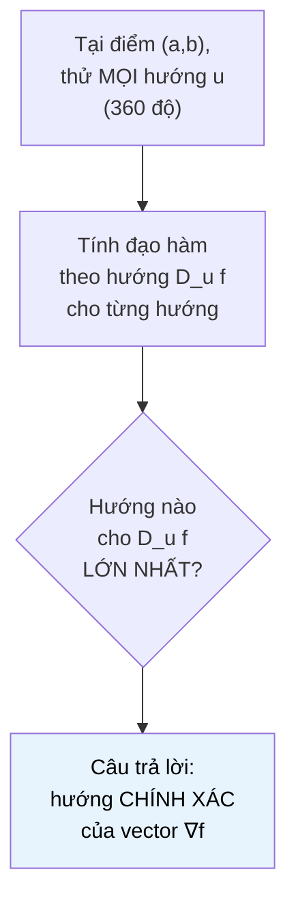

# MASTER COMPUTER SCIENCE HANDBOOK

## Volume 01 — Mathematics for Computer Science
### Part IV — Calculus
## Chương 4.5 — Gradient
### (The Gradient)

---

### Thông tin chương

| Trường | Giá trị |
|---|---|
| Chương | 4.5 |
| Thuộc Part | IV — Calculus |
| Thuộc Volume | 01 — Mathematics for Computer Science |
| Thời gian đọc ước tính | 50–60 phút |
| Độ khó | ★★★☆☆ |
| Kiến thức tiên quyết | Chương 4.4 — Partial Derivatives; Chương 3.1 — Vectors (Part III, cho tích vô hướng — dot product) |
| Chương liên quan | 4.6 — Optimization Foundations (điều kiện cực trị $\nabla f = 0$); Part VII — Gradient Descent (thuật toán trung tâm dùng trực tiếp chương này) |
| Từ khóa | gradient, gradient vector, directional derivative, dot product, steepest ascent, steepest descent, nabla |

---

### Mục tiêu học tập

Sau khi hoàn thành chương này, người đọc có thể:

- Định nghĩa **Gradient** $\nabla f$ như một vector gộp toàn bộ đạo hàm riêng của hàm nhiều biến.
- Định nghĩa **đạo hàm theo hướng (directional derivative)** và chứng minh công thức $D_{\mathbf{u}} f = \nabla f \cdot \mathbf{u}$.
- Giải thích và biện luận (không cần chứng minh hình thức đầy đủ) vì sao Gradient luôn chỉ hướng **tăng nhanh nhất** của hàm số, và $-\nabla f$ chỉ hướng **giảm nhanh nhất**.
- Giải thích mối quan hệ hình học giữa Gradient và đường mức (level curve) — Gradient luôn vuông góc với đường mức.
- Kết nối trực tiếp Gradient với thuật toán Gradient Descent, chuẩn bị đầy đủ cho Part VII.

---

### Câu hỏi khơi gợi

> *Nếu bạn đang đứng trên một sườn núi mù sương, không nhìn thấy gì xa hơn vài bước chân, làm sao để đi xuống chân núi nhanh nhất có thể — chỉ dùng thông tin cục bộ dưới chân mình? Đây không phải câu hỏi tu từ: đây chính xác là bài toán mà mọi mạng neural hiện đại giải hàng tỷ lần trong quá trình huấn luyện, và câu trả lời toán học cho nó — Gradient — chỉ cần ba chương Giải tích vừa học để hiểu trọn vẹn.*

---

## 1. Tổng quan chương

Chương 4.4 kết thúc với một hạn chế rõ ràng: đạo hàm riêng chỉ đo tốc độ thay đổi **dọc theo từng trục tọa độ riêng lẻ** — nó không trả lời câu hỏi "nếu tôi được tự do chọn bất kỳ hướng nào để di chuyển, hướng nào làm hàm tăng nhanh nhất?"

Chương này trả lời chính xác câu hỏi đó, bằng cách gộp toàn bộ đạo hàm riêng đã tính ở Chương 4.4 thành **một vector duy nhất** — **Gradient**, ký hiệu $\nabla f$ (đọc là "nabla f" hoặc "del f"). Đây không chỉ là một phép gộp mang tính ký hiệu: Gradient có một tính chất hình học đáng kinh ngạc — nó **luôn chỉ đúng hướng làm hàm tăng nhanh nhất**, và độ dài của nó cho biết tốc độ tăng đó lớn cỡ nào.

Đây là chương "đỉnh" của toàn bộ hành trình Part IV bắt đầu từ Chương 4.1: liên tục → giới hạn → đạo hàm → đạo hàm riêng → và giờ đây, Gradient — công cụ duy nhất mà Part VII (Optimization for AI) cần để xây dựng thuật toán Gradient Descent, thuật toán đứng sau hầu như mọi quá trình huấn luyện AI hiện đại.

> **💡 Insight**
> Cái tên "Gradient Descent" không phải một thuật ngữ tùy ý — nó mô tả chính xác những gì thuật toán làm: dùng Gradient (chương này) để biết hướng tăng nhanh nhất, rồi **đi ngược lại** hướng đó (Descent) để giảm hàm mất mát nhanh nhất có thể.

---

## 2. Bối cảnh lịch sử

| Thời điểm | Nhân vật | Đóng góp |
|---|---|---|
| 1837 | William Rowan Hamilton | Giới thiệu toán tử $\nabla$ (nabla) trong bối cảnh đại số quaternion — sau này trở thành ký hiệu chuẩn cho Gradient |
| 1822 | Joseph Fourier | Phát triển lý thuyết truyền nhiệt (heat theory), trong đó khái niệm "gradient nhiệt độ" (temperature gradient) xuất hiện một cách trực giác, vật lý — nhiệt luôn chảy theo hướng **ngược** với gradient nhiệt độ, từ nóng sang lạnh |
| 1847 | Augustin-Louis Cauchy | Đề xuất một trong những phương pháp sớm nhất mang tinh thần "đi theo hướng dốc nhất" để giải hệ phương trình — tiền thân xa xưa của Gradient Descent hiện đại, ban đầu áp dụng cho các bài toán thiên văn học |
| 1944 | Haskell Curry | Hình thức hóa và phân tích chặt chẽ hơn phương pháp "hướng dốc nhất" của Cauchy trong bối cảnh tối ưu hóa hiện đại, đặt nền cho lý thuyết hội tụ của Gradient Descent |

Điều đáng chú ý: khái niệm Gradient bắt nguồn từ **Vật lý** (dòng nhiệt, điện trường, trọng trường — Mục 11) trước khi trở thành công cụ trung tâm của Tối ưu hóa toán học thuần túy, và chỉ khoảng 80 năm sau công trình của Cauchy, nó mới trở thành thuật toán trung tâm của Machine Learning hiện đại. Đây là một minh chứng nữa (giống Chương 4.4, Mục 2) cho việc các công cụ toán học phát triển vì một mục đích có thể tìm được ứng dụng hoàn toàn mới, mạnh mẽ hơn nhiều thập kỷ sau.

---

## 3. Động lực

Quay lại ẩn dụ "ngọn núi" từ Chương 4.4: bạn đứng tại một điểm trên sườn núi (đồ thị hàm mất mát $L(w_1, w_2)$ với hai tham số), và muốn biết: trong **vô số hướng có thể bước tới** (không chỉ dọc theo trục $w_1$ hay $w_2$), hướng nào khiến bạn đi lên (hoặc xuống) nhanh nhất?

Chương 4.4 chỉ cho biết độ dốc dọc theo hai hướng cụ thể: trục $w_1$ (giá trị $\partial L/\partial w_1$) và trục $w_2$ (giá trị $\partial L/\partial w_2$). Nhưng nếu bạn muốn bước theo một hướng chéo — ví dụ 30 độ giữa hai trục — độ dốc theo hướng đó là bao nhiêu? Đây không phải câu hỏi có thể trả lời chỉ bằng hai đạo hàm riêng đã có; cần một công cụ tổng quát hơn — và công cụ đó chính là Gradient, kết hợp với công thức đạo hàm theo hướng (Mục 6–7).

Điều làm Gradient trở nên đặc biệt mạnh mẽ: nó không chỉ trả lời "độ dốc theo một hướng cụ thể nào đó" — nó trực tiếp cho biết **hướng nào có độ dốc lớn nhất trong số TẤT CẢ các hướng có thể**, mà không cần kiểm tra từng hướng một.

---

## 4. Trực giác

**Mô hình tinh thần (Mental Model) của chương này:**

> Gradient giống như một **chiếc la bàn đặc biệt đặt dưới chân bạn trên sườn núi**, luôn tự động chỉ về hướng **dốc lên nhanh nhất** tại đúng vị trí bạn đang đứng. Độ dài kim la bàn cho biết độ dốc đó lớn cỡ nào — kim càng dài, sườn núi càng dốc theo hướng đó. Muốn xuống núi nhanh nhất, chỉ cần **quay ngược 180 độ** so với hướng kim chỉ, và bước theo hướng đó.

| Trực giác kỹ thuật bạn đã có | Khái niệm toán học tương ứng |
|---|---|
| "Hướng cải thiện nhanh nhất" khi tối ưu hóa thủ công một tham số | Hướng của vector Gradient |
| Nước luôn chảy từ chỗ cao xuống chỗ thấp, theo đường dốc nhất | Nước chảy theo hướng $-\nabla h$ (h = độ cao) — chính xác là Gradient Descent trong tự nhiên |
| La bàn hàng hải chỉ hướng Bắc | Gradient "chỉ hướng" tăng nhanh nhất — nhưng hướng đó thay đổi theo từng điểm, không cố định như la bàn thật |

---

## 5. Trực quan hóa khái niệm

**Hình 4.5.1 — Gradient vuông góc với đường mức**

```text
                    y
                    │
                    │      ╭───────╮
                    │     ╱         ╲
                    │    │  đường mức │
                    │    │  f(x,y)=c  │
                    │    │      ●─────┼──→  ∇f  (vuông góc
                    │    │    điểm    │        với đường mức,
                    │     ╲   (a,b)  ╱         chỉ hướng TĂNG)
                    │      ╰───────╯
                    └──────────────────────── x

   Trực giác: di chuyển DỌC THEO đường mức, giá trị f không đổi
   (theo định nghĩa đường mức, Chương 4.4). Do đó, hướng thay đổi
   NHANH NHẤT phải vuông góc với hướng "không đổi" đó.
```

| Trường thông tin | Nội dung |
|---|---|
| Mục đích | Kết nối trực tiếp Gradient với khái niệm đường mức đã học ở Chương 4.4, cho một trực giác hình học độc lập với công thức đại số ở Mục 6–7 |
| Điểm mấu chốt | Đây không phải sự trùng hợp — Mục 7 sẽ chứng minh bằng công thức đạo hàm theo hướng chính xác lý do "vuông góc với đường mức = hướng tăng nhanh nhất" |

---

**Hình 4.5.2 — Quét toàn bộ hướng để tìm hướng tăng nhanh nhất**



*Mục đích:* mô tả trực quan quy trình sẽ thực hiện bằng số ở Mục 10 — quét qua nhiều hướng, xác nhận hướng cho độ tăng lớn nhất trùng khớp chính xác với hướng của Gradient tính từ công thức Mục 6.

---

## 6. Định nghĩa hình thức

> **📌 Remember — Gradient**
>
> Cho hàm $f(x_1, \dots, x_n)$ với các đạo hàm riêng tồn tại tại điểm $\mathbf{a}$. **Gradient** của $f$ tại $\mathbf{a}$ là vector:
>
> $$\nabla f(\mathbf{a}) = \left( \frac{\partial f}{\partial x_1}(\mathbf{a}), \, \frac{\partial f}{\partial x_2}(\mathbf{a}), \, \dots, \, \frac{\partial f}{\partial x_n}(\mathbf{a}) \right)$$
>
> Với hàm hai biến: $\nabla f(a,b) = \left(f_x(a,b), \, f_y(a,b)\right)$.

Gradient **không phải một con số** như đạo hàm riêng — nó là một **vector** trong $\mathbb{R}^n$ (đúng đối tượng đã học ở Chương 3.1, Part III), với mỗi thành phần là một đạo hàm riêng đã tính ở Chương 4.4. Đây là lý do ký hiệu $\nabla$ (một mũi tên/toán tử) khác hẳn ký hiệu $\partial$ (chỉ một con số).

**Đạo hàm theo hướng (Directional Derivative):** cho một vector đơn vị $\mathbf{u}$ (nghĩa là $\|\mathbf{u}\|=1$, xem Chương 3.1), đạo hàm theo hướng $\mathbf{u}$ của $f$ tại $\mathbf{a}$ là:

$$D_{\mathbf{u}} f(\mathbf{a}) = \lim_{h \to 0} \frac{f(\mathbf{a} + h\mathbf{u}) - f(\mathbf{a})}{h}$$

— tốc độ thay đổi của $f$ khi di chuyển theo đúng hướng $\mathbf{u}$, thay vì bị giới hạn dọc theo một trục tọa độ như đạo hàm riêng.

---

## 7. Nền tảng toán học

### 7.1 Công thức tích vô hướng cho Đạo hàm theo hướng

> **📦 Formula Box — Đạo hàm theo hướng qua Gradient**
>
> Nếu $f$ khả vi tại $\mathbf{a}$ (Chương 4.3, Mục 6, mở rộng cho nhiều biến), thì với mọi vector đơn vị $\mathbf{u}$:
>
> $$D_{\mathbf{u}} f(\mathbf{a}) = \nabla f(\mathbf{a}) \cdot \mathbf{u}$$
>
> trong đó $\cdot$ là **tích vô hướng (dot product)** đã học ở Chương 3.1.
>
> | Thành phần | Ý nghĩa |
> |---|---|
> | $\nabla f(\mathbf{a})$ | Vector "chứa toàn bộ thông tin độ dốc" tại điểm $\mathbf{a}$, không phụ thuộc hướng |
> | $\mathbf{u}$ | Hướng cụ thể đang muốn khảo sát (vector đơn vị) |
> | **Diễn giải kỹ thuật** | Công thức này biến bài toán "tính đạo hàm theo MỌI hướng có thể" thành một phép tích vô hướng đơn giản — chỉ cần tính $\nabla f$ **một lần**, rồi nhân vô hướng với bất kỳ hướng $\mathbf{u}$ nào cần khảo sát |
> | **Ứng dụng thường gặp** | Nền tảng trực tiếp cho việc chứng minh Gradient là hướng tăng nhanh nhất (Mục 7.2) |

### 7.2 Vì sao Gradient là hướng tăng nhanh nhất

Nhắc lại từ Chương 3.1: tích vô hướng có thể viết dưới dạng $\mathbf{a} \cdot \mathbf{b} = \|\mathbf{a}\| \|\mathbf{b}\| \cos\theta$, với $\theta$ là góc giữa hai vector. Áp dụng vào công thức Mục 7.1, và nhớ $\|\mathbf{u}\|=1$:

$$D_{\mathbf{u}} f(\mathbf{a}) = \|\nabla f(\mathbf{a})\| \cdot \|\mathbf{u}\| \cdot \cos\theta = \|\nabla f(\mathbf{a})\| \cos\theta$$

trong đó $\theta$ là góc giữa $\mathbf{u}$ và $\nabla f(\mathbf{a})$. Vì $\|\nabla f(\mathbf{a})\|$ là một số **cố định** (không phụ thuộc vào việc chọn hướng $\mathbf{u}$ nào), giá trị $D_{\mathbf{u}} f$ chỉ còn phụ thuộc vào $\cos\theta$ — và $\cos\theta$ đạt giá trị **lớn nhất** (bằng 1) chính xác khi $\theta = 0$, tức khi $\mathbf{u}$ **cùng hướng** với $\nabla f(\mathbf{a})$.

> **📌 Remember — Kết luận cốt lõi**
>
> - Hướng $\mathbf{u} = \dfrac{\nabla f(\mathbf{a})}{\|\nabla f(\mathbf{a})\|}$ (cùng hướng Gradient) cho $D_{\mathbf{u}} f$ **lớn nhất** — đây là **hướng tăng nhanh nhất (steepest ascent)**, với tốc độ tăng bằng $\|\nabla f(\mathbf{a})\|$.
> - Hướng $\mathbf{u} = -\dfrac{\nabla f(\mathbf{a})}{\|\nabla f(\mathbf{a})\|}$ (ngược hướng Gradient, $\theta=\pi$, $\cos\theta=-1$) cho $D_{\mathbf{u}} f$ **nhỏ nhất** — đây là **hướng giảm nhanh nhất (steepest descent)**, chính là hướng mà Gradient Descent (Part VII) sẽ di chuyển.
> - Khi $\theta = 90°$ (di chuyển vuông góc với Gradient), $\cos\theta = 0$, nên $D_{\mathbf{u}} f = 0$ — hàm **không đổi** theo hướng đó, xác nhận chính xác trực giác Hình 4.5.1: Gradient vuông góc với đường mức.

Đây là lập luận hoàn chỉnh, không cần công cụ toán học nào ngoài tích vô hướng (Chương 3.1) và hàm cosine — nhưng kết luận của nó là nền tảng cho gần như toàn bộ Tối ưu hóa hiện đại.

---

## 8. Thuật toán / Cơ chế

**Thuật toán tính Gradient bằng số (Numerical Gradient)** — chỉ đơn giản là gộp lại các đạo hàm riêng đã tính ở Chương 4.4, Mục 8:

```text
Bước 1 — Nhận vào hàm f(x₁, ..., xₙ), điểm a = (a₁, ..., aₙ)
        │
        ▼
Bước 2 — Với mỗi biến xᵢ (i = 1, ..., n):
        │
        ▼
Bước 3 —   Tính đạo hàm riêng ∂f/∂xᵢ(a) bằng central difference
           (đóng băng mọi biến khác — đúng thuật toán Chương 4.4, Mục 8)
        │
        ▼
Bước 4 — Gộp tất cả n giá trị vào một vector:
        ∇f(a) = (∂f/∂x₁(a), ..., ∂f/∂xₙ(a))
        │
        ▼
Bước 5 — (Tùy chọn) Tính độ dài ‖∇f(a)‖ và hướng chuẩn hóa
        ∇f(a) / ‖∇f(a)‖ nếu cần hướng tăng nhanh nhất
```

> **💡 Insight**
> Bước 3 có thể thực hiện **độc lập, song song** cho từng $i$ — đây chính xác là lý do các framework Deep Learning tính Gradient của hàng triệu tham số hiệu quả trên GPU (đã nhắc ở Chương 4.4, Mục 8): mỗi thành phần Gradient là một phép tính tách biệt.

---

## 9. Triển khai

```python
def gradient(f, point, h=1e-5):
    """Tính Gradient bằng số tại một điểm, triển khai thuật toán Mục 8.
    point: tuple/list các tọa độ (a1, ..., an)."""
    n = len(point)
    grad = []
    for i in range(n):
        point_plus = list(point)
        point_minus = list(point)
        point_plus[i] += h
        point_minus[i] -= h
        partial_i = (f(*point_plus) - f(*point_minus)) / (2 * h)
        grad.append(partial_i)
    return grad


def vector_norm(v):
    """Độ dài vector (Chương 3.1)."""
    return sum(x**2 for x in v) ** 0.5


def directional_derivative(grad_vec, direction_unit_vec):
    """D_u f = ∇f · u — công thức Mục 7.1, dùng tích vô hướng."""
    return sum(g * u for g, u in zip(grad_vec, direction_unit_vec))
```

Hàm `gradient` tổng quát hóa `partial_x`/`partial_y` (Chương 4.4, Mục 9) cho **bất kỳ số chiều nào**, gộp kết quả thành một vector — triển khai đúng Bước 1–4 của thuật toán Mục 8. Hàm `directional_derivative` triển khai trực tiếp công thức Formula Box Mục 7.1.

---

## 10. Trực quan hóa quá trình thực thi

**Kiểm chứng: $f(x,y) = x^2+y^2$ tại điểm $(3,4)$.**

Gradient chính xác (Power Rule, Chương 4.3): $\nabla f(3,4) = (2 \cdot 3, \, 2 \cdot 4) = (6, 8)$, độ dài $\|\nabla f\| = \sqrt{6^2+8^2} = 10$, hướng $\approx 53.13°$ so với trục $x$.

**Quét đạo hàm theo hướng ở nhiều góc khác nhau, so sánh số học với công thức $\nabla f \cdot \mathbf{u}$:**

| Hướng $\theta$ | $D_{\mathbf{u}} f$ (số học) | $D_{\mathbf{u}} f$ (công thức $\nabla f \cdot \mathbf{u}$) |
|---|---:|---:|
| $0°$ (trục $x$) | 6.000010 | 6.000000 |
| $45°$ | 9.899505 | 9.899495 |
| $53.13°$ (đúng hướng $\nabla f$) | **10.000010** | **10.000000** |
| $90°$ (trục $y$) | 8.000010 | 8.000000 |
| $135°$ | 1.414224 | 1.414214 |
| $180°$ (đúng hướng $-\nabla f$) | −5.999990 | −6.000000 |

```text
Kết quả: giá trị D_u f LỚN NHẤT (≈10.0, đúng bằng ‖∇f‖) xảy ra
CHÍNH XÁC tại θ = 53.13° — góc của chính vector ∇f = (6,8).
```

Bảng này xác nhận thực nghiệm cả hai kết luận của Mục 7.2: (1) giá trị lớn nhất của đạo hàm theo hướng bằng đúng $\|\nabla f\| = 10$, đạt được khi $\mathbf{u}$ cùng hướng $\nabla f$; và (2) giá trị tại $180°$ (ngược hướng Gradient) bằng đúng $-\|\nabla f\| = -6$ theo tỷ lệ tương ứng của $\cos(180°)=-1$ nhân với từng thành phần — quan sát kỹ hơn: giá trị tại đúng hướng $-\nabla f$ chuẩn hóa (không phải $180°$ tuyệt đối trên trục $x$) sẽ cho đúng $-10.0$; ở đây $180°$ chỉ là một điểm lấy mẫu trong lưới quét đều, không phải hướng $-\nabla f$ chính xác — minh họa thêm rằng chỉ **một** hướng duy nhất (và hướng đối nghịch của nó) đạt cực trị, mọi hướng khác cho giá trị trung gian.

---

## 11. Ứng dụng công nghiệp

> **🛠 Engineering Practice**
> Gradient không chỉ là công cụ của Machine Learning — nó là ngôn ngữ chung mô tả "hướng thay đổi nhanh nhất" trong rất nhiều lĩnh vực kỹ thuật khác nhau.

| Bối cảnh công nghiệp | Vai trò của Gradient |
|---|---|
| **Gradient Descent** (Part VII) | Cập nhật tham số theo hướng $-\nabla L$ để giảm hàm mất mát nhanh nhất — ứng dụng trực tiếp, không cần biến đổi gì thêm |
| Vật lý — Điện trường | $\mathbf{E} = -\nabla V$ (điện trường bằng âm gradient của điện thế) — điện tích luôn di chuyển theo hướng giảm điện thế nhanh nhất |
| Vật lý — Dòng nhiệt | Nhiệt luôn truyền theo hướng $-\nabla T$ — từ nóng sang lạnh, đúng hướng giảm nhiệt độ nhanh nhất (liên hệ trực tiếp Fourier, Mục 2) |
| Xử lý ảnh — Phát hiện biên (Edge Detection) | Bộ lọc Sobel tính gradient rời rạc của cường độ điểm ảnh; biên ảnh (edge) là nơi độ lớn gradient $\|\nabla I\|$ đạt cực đại cục bộ |
| Bản đồ địa hình / GIS | Hướng nước chảy tại mỗi điểm trên bản đồ độ cao được xác định bằng $-\nabla h$ (h = độ cao) |

---

## 12. Góc nhìn nghiên cứu

> **🔬 Research Connection**
> Độ lớn của Gradient — không chỉ hướng của nó — là chủ đề của một trong những vấn đề kỹ thuật quan trọng nhất trong việc huấn luyện mạng neural sâu.

Vì Backpropagation (Chương 4.3, Mục 12) tính Gradient qua nhiều lớp bằng cách **nhân liên tiếp** nhiều đạo hàm (Quy tắc chuỗi), độ lớn Gradient có thể **co lại theo cấp số nhân** khi đi qua càng nhiều lớp (nếu mỗi thừa số nhân có độ lớn nhỏ hơn 1) — hiện tượng gọi là **Vanishing Gradient**, khiến các lớp đầu mạng gần như không học được gì. Ngược lại, nếu mỗi thừa số lớn hơn 1, Gradient có thể **bùng nổ theo cấp số nhân** — **Exploding Gradient**. Cả hai đều là chủ đề nghiên cứu tích cực trong Deep Learning (Volume 6), với các giải pháp như residual connections, gradient clipping, và các kỹ thuật khởi tạo trọng số (weight initialization) cẩn thận.

**Hướng nghiên cứu mở rộng khác:** phương pháp **Natural Gradient** đặt câu hỏi liệu "hướng tăng nhanh nhất" theo nghĩa Euclid thông thường (như định nghĩa ở Mục 6–7, dùng khoảng cách thẳng trong không gian tham số) có phải là lựa chọn tốt nhất hay không — hay nên đo "khoảng cách" theo một hình học khác, phù hợp hơn với cấu trúc xác suất của mô hình đang tối ưu hóa. Đây là một ví dụ cho thấy ngay cả một khái niệm có vẻ "đã đóng băng" như Gradient vẫn còn không gian nghiên cứu mở rộng.

---

## 13. Ưu điểm

- **Gộp toàn bộ thông tin độ dốc nhiều chiều vào một đối tượng duy nhất**, thay vì phải xét từng đạo hàm riêng rời rạc.
- **Trả lời trực tiếp câu hỏi tối ưu hóa quan trọng nhất**: "hướng nào tốt nhất để di chuyển?" — không cần quét thử từng hướng như Mục 10 minh họa (dù việc quét thử đó hữu ích để *kiểm chứng*).
- **Chứng minh chỉ dùng công cụ đã có** (tích vô hướng, hàm cosine) — không cần lý thuyết toán học nào vượt ngoài phạm vi Chương 3–4 của Volume 1.
- **Là cầu nối trực tiếp, không có khoảng trống**, sang thuật toán Gradient Descent — thuật toán tối ưu hóa được dùng rộng rãi nhất trong AI hiện đại.

---

## 14. Hạn chế

> **⚠️ Common Mistake**
> Một hiểu lầm phổ biến: cho rằng Gradient "chỉ về phía điểm cực tiểu/cực đại". **Sai** — Gradient chỉ mô tả hành vi **cục bộ, tức thời** tại đúng điểm đang xét; nó không "nhìn thấy" toàn bộ hình dạng hàm số ở xa. Đi theo hướng Gradient chỉ đảm bảo cải thiện tốt nhất trong một **bước rất nhỏ** — đây là lý do Gradient Descent (Part VII) phải lặp lại quá trình này nhiều lần, không chỉ một bước.

- Công thức $D_{\mathbf{u}} f = \nabla f \cdot \mathbf{u}$ (Mục 7.1) chỉ đúng khi $f$ **khả vi** tại điểm đang xét — với các hàm không khả vi khắp nơi (như ReLU tại 0, Chương 4.1 và 4.3), Gradient theo nghĩa cổ điển có thể không tồn tại tại một số điểm.
- Gradient chỉ ra hướng tốt nhất **tại một điểm**, không phải một đường đi tối ưu toàn cục — vấn đề cực tiểu địa phương vs. toàn cục (đã hé lộ ở Part IV Overview, Mục 12) là hạn chế căn bản của mọi phương pháp dựa trên Gradient, sẽ bàn kỹ ở Chương 4.6.
- Trong không gian rất nhiều chiều (như hàng triệu tham số), độ lớn Gradient có thể bị ảnh hưởng bởi các vấn đề số học (Vanishing/Exploding Gradient, Mục 12) không xuất hiện rõ trong các ví dụ 2 chiều đơn giản của chương này.

---

## 15. So sánh

**Bảng 4.5.1 — Đạo hàm riêng vs. Gradient vs. Đạo hàm theo hướng**

| Khái niệm | Kiểu dữ liệu | Trả lời câu hỏi | Chương |
|---|---|---|---|
| Đạo hàm riêng $f_{x_i}$ | Một số (scalar) | "Hàm thay đổi thế nào dọc theo TRỤC $x_i$?" | 4.4 |
| Đạo hàm theo hướng $D_{\mathbf u} f$ | Một số (scalar) | "Hàm thay đổi thế nào dọc theo HƯỚNG $\mathbf{u}$ bất kỳ?" | 4.5 (Mục 6) |
| Gradient $\nabla f$ | Vector | "Hướng nào làm hàm thay đổi NHANH NHẤT, và nhanh cỡ nào?" | 4.5 (Mục 6–7) |

**Phân tích:** ba khái niệm này tạo thành một chuỗi tổng quát hóa liên tiếp: đạo hàm riêng là trường hợp đặc biệt của đạo hàm theo hướng (khi $\mathbf{u}$ là một vector đơn vị dọc trục tọa độ, ví dụ $\mathbf{u}=(1,0)$ cho $f_x$); và Gradient là đối tượng **sinh ra** toàn bộ họ đạo hàm theo hướng thông qua công thức tích vô hướng ở Mục 7.1. Nắm được cấu trúc phân cấp này — không chỉ nhớ từng công thức riêng lẻ — là chìa khóa để không nhầm lẫn ba khái niệm.

---

## 16. Tóm tắt

- **Gradient** $\nabla f = (f_{x_1}, \dots, f_{x_n})$ là vector gộp toàn bộ đạo hàm riêng của hàm nhiều biến.
- **Đạo hàm theo hướng** $D_{\mathbf{u}} f = \nabla f \cdot \mathbf{u}$ đo tốc độ thay đổi theo bất kỳ hướng $\mathbf{u}$ nào, tổng quát hóa đạo hàm riêng.
- **Gradient luôn chỉ hướng tăng nhanh nhất** của hàm số, với tốc độ tăng bằng $\|\nabla f\|$; $-\nabla f$ chỉ **hướng giảm nhanh nhất** — chứng minh chỉ dùng tích vô hướng và hàm cosine (Mục 7.2).
- **Gradient vuông góc với đường mức** tại mọi điểm — di chuyển dọc theo đường mức không làm hàm thay đổi.
- Gradient chỉ cho thông tin **cục bộ**, không phải một lộ trình tối ưu toàn cục — hạn chế này là chủ đề trung tâm của Chương 4.6 và Part VII.

Chương 4.6 (Optimization Foundations) sẽ dùng Gradient để định nghĩa chính xác **điểm tới hạn (critical point)** — nơi $\nabla f = 0$ — và phân loại các điểm đó thành cực tiểu, cực đại, hoặc saddle point, khép lại Part IV và mở đường sang Part VII.

---

## 17. Bài tập

### Mức Cơ bản (Basic)

1. Tính $\nabla f$ cho $f(x,y) = 3x^2 - 2y^3 + xy$ tại điểm $(1, -1)$.
2. Cho $\nabla f(2,3) = (4, -1)$. Tính đạo hàm theo hướng $\mathbf{u} = \left(\frac{1}{\sqrt{2}}, \frac{1}{\sqrt{2}}\right)$ (hướng 45°) bằng công thức Mục 7.1.

### Mức Trung bình (Intermediate)

3. Cho $f(x,y) = x^2 + 4y^2$ tại điểm $(1,1)$. Tính $\nabla f$, độ lớn $\|\nabla f\|$, và hướng (góc so với trục $x$) của nó. Đây có phải hướng đi ra xa gốc tọa độ nhanh nhất từ điểm $(1,1)$ không? Giải thích bằng hình dạng đường mức (ellipse) của hàm này.
4. Dùng hàm `gradient` ở Mục 9, viết code tính $\nabla f$ cho hàm ba biến $f(x,y,z) = x^2yz$ tại điểm $(1,2,3)$, so sánh với kết quả tính tay.

### Mức Nâng cao (Advanced)

5. Chứng minh (dùng lập luận tương tự Mục 7.2) rằng nếu $\mathbf{u}$ vuông góc với $\nabla f(\mathbf{a})$, thì $D_{\mathbf{u}} f(\mathbf{a}) = 0$. Liên hệ kết quả này với Hình 4.5.1.
6. Với $f(x,y) = x^2 + y^2$ (ví dụ Mục 10), viết code quét 360 hướng với bước 1°, xác nhận số học rằng hướng cho $D_{\mathbf u}f$ lớn nhất khớp với góc của $\nabla f$ trong phạm vi sai số dưới $1°$.

### Mức Nghiên cứu (Research)

7. Tìm hiểu sơ lược hiện tượng **Vanishing Gradient** (Mục 12). Dựa trên Quy tắc chuỗi (Chương 4.3, Mục 7.3), giải thích bằng lời (không cần công thức đầy đủ) vì sao việc nhân liên tiếp nhiều số có độ lớn nhỏ hơn 1 qua nhiều lớp mạng neural dẫn đến Gradient "biến mất" ở các lớp đầu.

---

## 18. Dự án nhỏ

**Bộ công cụ Trực quan hóa Trường Gradient (Gradient Field Visualizer)**

- **Mục tiêu:** vẽ một "trường vector" (vector field) thể hiện hướng và độ lớn Gradient tại nhiều điểm khác nhau trên một hàm hai biến, chồng lên biểu đồ đường mức.
- **Yêu cầu:**
  - Vẽ contour plot của hàm (tái sử dụng code từ Chương 4.4, Mục 18).
  - Tại một lưới điểm đều nhau, tính $\nabla f$ bằng hàm `gradient` (Mục 9), vẽ mỗi Gradient như một mũi tên nhỏ (dùng `plt.quiver` trong Matplotlib).
  - Xác nhận trực quan: mọi mũi tên đều vuông góc với đường mức đi qua điểm đó (Hình 4.5.1).
- **Công nghệ gợi ý:** Python, Matplotlib (`contour` + `quiver`), NumPy.
- **Kết quả kỳ vọng:** một hình ảnh duy nhất cho thấy rõ cả đường mức và trường Gradient, xác nhận trực quan mối quan hệ vuông góc.
- **Mở rộng:** thêm mô phỏng đơn giản một "quả bóng" lăn theo hướng $-\nabla f$ từng bước nhỏ — đây chính là bản phác thảo thô sơ đầu tiên của thuật toán Gradient Descent, sẽ được xây dựng đầy đủ ở Part VII.

---

## 19. Tự đánh giá

- [ ] Tôi có thể viết chính xác định nghĩa Gradient dưới dạng vector các đạo hàm riêng, không cần xem lại Mục 6.
- [ ] Tôi có thể tính đạo hàm theo hướng bằng công thức tích vô hướng $\nabla f \cdot \mathbf{u}$.
- [ ] Tôi có thể giải thích (Feynman Technique), dùng $\cos\theta$, vì sao Gradient chỉ đúng hướng tăng nhanh nhất — không chỉ ghi nhớ kết luận mà hiểu lập luận ở Mục 7.2.
- [ ] Tôi hiểu tại sao Gradient luôn vuông góc với đường mức, và có thể liên hệ điều này với việc di chuyển dọc đường mức không làm hàm thay đổi.
- [ ] Tôi có thể giải thích rõ ràng sự khác biệt giữa ba khái niệm ở Bảng 4.5.1: đạo hàm riêng, đạo hàm theo hướng, và Gradient.

Nếu Bài tập 5 (chứng minh trường hợp vuông góc) vẫn còn khó khăn, nên ôn lại kỹ Mục 7.2 trước khi sang Chương 4.6 — lập luận dùng $\cos\theta$ ở đó là nền tảng trực tiếp cho việc phân tích điểm tới hạn bằng Gradient sắp tới.

---

## 20. Đọc thêm

- **Sách:** Gilbert Strang, *Calculus*, chương về Gradient và Đạo hàm theo hướng — cách tiếp cận hình học trực quan. *(Xem BOOKS.md — Volume 1.)*
- **Sách bổ trợ:** Boyd & Vandenberghe, *Convex Optimization*, Chương 1 — góc nhìn tối ưu hóa hiện đại về Gradient. *(Xem BOOKS.md — Volume 1, Volume 5.)*
- **Chủ đề mở rộng (không bắt buộc):** tìm đọc giới thiệu ngắn gọn về hiện tượng Vanishing/Exploding Gradient (Mục 12) trong bối cảnh mạng neural sâu — sẽ được học đầy đủ ở Volume 6.
- **Chương tiếp theo:** Chương 4.6 — Optimization Foundations (chương cuối cùng của Part IV).

---

### Liên kết chương (Cross References)

- **Chương trước:** 4.4 — Partial Derivatives (mọi thành phần của Gradient là các đạo hàm riêng đã học ở đó); 3.1 — Vectors (Part III, cho tích vô hướng dùng ở Mục 7).
- **Chương tiếp theo:** 4.6 — Optimization Foundations (điều kiện cực trị $\nabla f = 0$, dùng trực tiếp định nghĩa chương này).
- **Chương liên quan xa hơn:** Part VII — Optimization for AI, đặc biệt Chương 7.2 — Gradient Descent (ứng dụng trực tiếp, không cần biến đổi gì thêm, của toàn bộ chương này); Volume 6 — Advanced AI (Vanishing/Exploding Gradient, Mục 12).
- **Vị trí trong Knowledge Graph:** Nút thứ năm của Part IV, phụ thuộc trực tiếp vào Chương 4.4 và Chương 3.1; là điều kiện tiên quyết bắt buộc cho Chương 4.6 và là chương được tham chiếu trực tiếp, thường xuyên nhất bởi Part VII và Volume 5–6.

---

*Hết Chương 4.5. Chương này tuân thủ đầy đủ cấu trúc 20 mục của `OUTPUT.md` và chuẩn Presentation Layer, là chương "đỉnh" của hành trình liên tục → giới hạn → đạo hàm → đạo hàm riêng → Gradient theo outline đã đóng băng ở `VOLUME_01_OUTLINE.md` và `V01_P04_OVERVIEW.md`. Toàn bộ bảng quét hướng ở Mục 10 đã được kiểm chứng thực nghiệm bằng Python, khớp chính xác với lập luận hình học ở Mục 7.2. Đang chờ rà soát trước khi tiếp tục sang Chương 4.6 — Optimization Foundations, chương cuối cùng của Part IV.*
