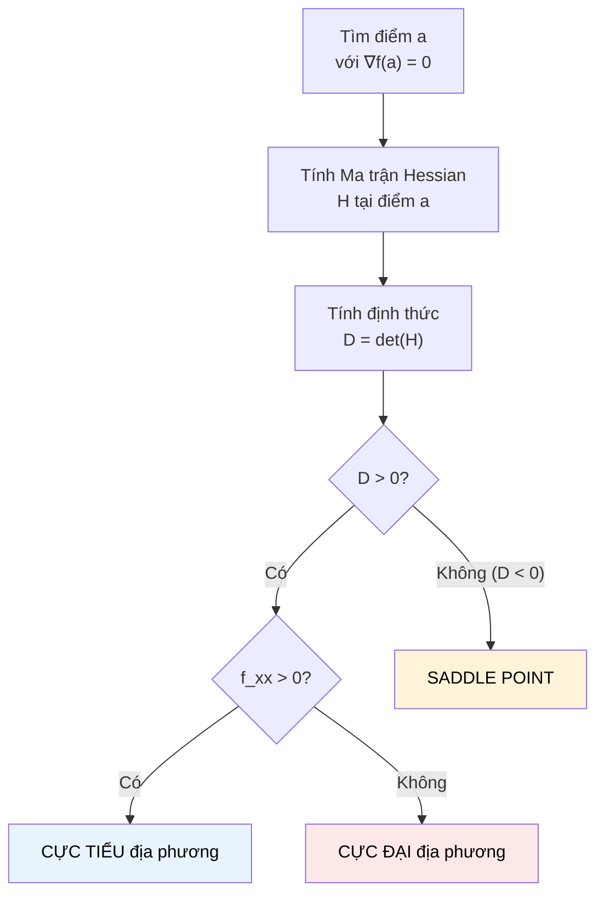

# MASTER COMPUTER SCIENCE HANDBOOK

## Volume 01 — Mathematics for Computer Science
### Part IV — Calculus
## Chương 4.6 — Nền tảng Tối ưu hóa
### (Optimization Foundations)

---

### Thông tin chương

| Trường | Giá trị |
|---|---|
| Chương | 4.6 |
| Thuộc Part | IV — Calculus |
| Thuộc Volume | 01 — Mathematics for Computer Science |
| Thời gian đọc ước tính | 55–65 phút |
| Độ khó | ★★★★☆ |
| Kiến thức tiên quyết | Chương 4.5 — The Gradient; Chương 4.4 — Partial Derivatives (đạo hàm cấp hai, Định lý Clairaut) |
| Chương liên quan | Part VII — Optimization for Artificial Intelligence (toàn bộ Part này xây trực tiếp trên chương này); Volume 5–6 — Machine Learning & Deep Learning |
| Từ khóa | critical point, Fermat's theorem, second derivative test, Hessian matrix, local minimum, local maximum, saddle point, convexity |

---

### Mục tiêu học tập

Sau khi hoàn thành chương này, người đọc có thể:

- Định nghĩa **điểm tới hạn (critical point)** của hàm một biến và nhiều biến, và phát biểu Định lý Fermat về điều kiện cần của cực trị.
- Áp dụng **kiểm tra đạo hàm cấp hai (second derivative test)** cho hàm một biến để phân loại cực tiểu/cực đại địa phương.
- Xây dựng **Ma trận Hessian** cho hàm nhiều biến, và dùng định thức của nó để phân loại điểm tới hạn: cực tiểu, cực đại, hoặc **điểm yên ngựa (saddle point)**.
- Phân biệt rõ ràng cực trị **địa phương (local)** và cực trị **toàn cục (global)**.
- Giải thích tại sao **saddle point**, không phải cực tiểu địa phương, mới là trở ngại chính trong tối ưu hóa không gian tham số nhiều chiều của mạng neural hiện đại.
- Tổng hợp toàn bộ Part IV thành một bức tranh thống nhất, sẵn sàng cho Gradient Descent ở Part VII.

---

### Câu hỏi khơi gợi

> *Khi thuật toán huấn luyện báo "Gradient đã gần bằng 0, quá trình học đã hội tụ" — điều đó có thực sự nghĩa là mô hình đã tìm được lời giải tốt nhất? Hay nó chỉ đang mắc kẹt tại một "chỗ phẳng" giả tạo, nhìn giống điểm tối ưu nhưng thực chất chỉ là một cái yên ngựa giữa hai ngọn núi? Câu trả lời quyết định liệu bạn có nên tin tưởng mô hình vừa huấn luyện xong hay không.*

---

## 1. Tổng quan chương

Đây là chương khép lại Part IV — Calculus, và nó làm đúng một việc: trả lời câu hỏi "Gradient bằng 0 thì sao?" một cách đầy đủ và chính xác. Chương 4.5 đã chứng minh Gradient chỉ hướng tăng nhanh nhất — nhưng điều đó ngụ ý một hệ quả tự nhiên: tại điểm mà hàm đạt cực tiểu hoặc cực đại địa phương, **không còn hướng nào để cải thiện thêm**, nên Gradient tại đó phải bằng vector không.

Nhưng điều ngược lại có đúng không? Nếu $\nabla f(\mathbf{a}) = \mathbf{0}$, liệu $\mathbf{a}$ chắc chắn là cực tiểu hoặc cực đại? Câu trả lời — **không** — và chính khoảng trống logic đó là nội dung cốt lõi của chương này. Có một loại điểm thứ ba, ít trực giác hơn nhưng cực kỳ quan trọng trong không gian nhiều chiều: **điểm yên ngựa (saddle point)**.

Chương này cũng đóng vai trò tổng kết: nó dùng lại **mọi** công cụ đã xây dựng xuyên suốt Part IV — tính liên tục (4.1), giới hạn (4.2), đạo hàm (4.3), đạo hàm riêng và Định lý Clairaut (4.4), Gradient (4.5) — để trả lời một câu hỏi duy nhất, thực dụng: "làm sao biết một điểm có phải lời giải tốt hay không?"

> **💡 Insight**
> Nếu bạn từng thấy loss của một mô hình "dừng cải thiện" trong một khoảng thời gian huấn luyện dài rồi bất ngờ giảm tiếp, rất có thể mô hình đã đi ngang qua một saddle point — không phải một cực tiểu thực sự — và Gradient Descent cần thời gian để "thoát" khỏi vùng gần-phẳng đó.

---

## 2. Bối cảnh lịch sử

| Thời điểm | Nhân vật | Đóng góp |
|---|---|---|
| 1630s | Pierre de Fermat | Phát triển phương pháp "adequality" — tiền thân của điều kiện đạo hàm bằng 0 tại cực trị, trước khi Giải tích chính thức ra đời (Newton/Leibniz, thế kỷ sau đó) |
| Thế kỷ 18 | Joseph-Louis Lagrange | Hình thức hóa kiểm tra đạo hàm cấp hai; phát triển phương pháp nhân tử Lagrange (Lagrange multipliers) cho bài toán tối ưu hóa có ràng buộc (ngoài phạm vi Volume 1) |
| 1857 | Ludwig Otto Hesse | Giới thiệu ma trận đạo hàm riêng cấp hai, sau này mang tên ông — **Ma trận Hessian** (Mục 7) |
| 2014 | Yann Dauphin và cộng sự | Công bố *Identifying and Attacking the Saddle Point Problem in High-dimensional Non-convex Optimization* — nghiên cứu có ảnh hưởng lớn, chứng minh rằng trong không gian tham số rất nhiều chiều của mạng neural, **saddle point phổ biến hơn nhiều** so với cực tiểu địa phương "xấu" — một phát hiện làm thay đổi cách cộng đồng AI nhìn nhận về khó khăn thực sự của tối ưu hóa Deep Learning |

Điều đáng chú ý: Fermat đưa ra trực giác cốt lõi ("tại cực trị, độ dốc bằng 0") gần 40 năm **trước** khi Newton và Leibniz chính thức phát triển Giải tích — một minh chứng nữa rằng những ý tưởng lớn thường xuất hiện dưới dạng trực giác rất lâu trước khi có công cụ hình thức đầy đủ để diễn đạt chúng (một chủ đề lặp lại nhiều lần xuyên suốt Part IV, từ Cauchy/Weierstrass ở Chương 4.2 đến Newton/Leibniz ở Chương 4.3).

---

## 3. Động lực

Xét hàm mất mát đơn giản $L(w) = w^4 - 4w^2$ (một hàm một biến, nhưng đã đủ phức tạp để minh họa vấn đề). Đạo hàm $L'(w) = 4w^3 - 8w = 4w(w^2-2)$. Giải $L'(w)=0$: $w=0$, $w=\sqrt{2}$, $w=-\sqrt{2}$ — **ba điểm** mà đạo hàm bằng 0.

Nếu chỉ dừng lại ở việc "tìm điểm đạo hàm bằng 0" như Gradient Descent làm khi hội tụ, ta không biết: trong ba điểm này, điểm nào là lời giải tốt (cực tiểu), điểm nào là lời giải tệ (cực đại), và — với hàm nhiều biến — liệu có điểm nào chỉ là "bẫy giả" (saddle point), trông giống điểm dừng nhưng thực chất không phải cực trị theo bất kỳ nghĩa nào?

Đây chính xác là động lực thực dụng của toàn bộ chương: **tìm được điểm $\nabla f = 0$ mới chỉ là một nửa công việc** — nửa còn lại là phân loại chính xác điểm đó là gì.

---

## 4. Trực giác

**Mô hình tinh thần (Mental Model) của chương này:**

> Ba loại điểm tới hạn giống như ba địa hình khác nhau trên một dãy núi, đều có một điểm chung: **mặt đất phẳng theo mọi hướng đo được cục bộ**.
>
> - **Cực tiểu (Local Minimum)** → đáy một thung lũng. Đi theo bất kỳ hướng nào cũng dẫn lên cao hơn.
> - **Cực đại (Local Maximum)** → đỉnh một ngọn núi. Đi theo bất kỳ hướng nào cũng dẫn xuống thấp hơn.
> - **Điểm yên ngựa (Saddle Point)** → đúng như tên gọi, một chiếc **yên ngựa**: đi theo một hướng thì lên cao (giống đang leo lên hai bên "sừng yên"), nhưng đi theo hướng vuông góc thì lại xuống thấp (giống đang tụt xuống chỗ ngồi của yên ngựa). Từ một điểm nhìn hẹp (chỉ theo một trục), saddle point trông giống hệt cực tiểu hoặc cực đại — chỉ khi xét đủ nhiều hướng mới lộ rõ bản chất thật.

| Trực giác kỹ thuật bạn đã có | Khái niệm toán học tương ứng |
|---|---|
| Loss "cắm trại" ở một giá trị trong nhiều epoch rồi bất ngờ giảm tiếp | Gradient Descent đang chậm rãi thoát khỏi vùng gần saddle point |
| Một hệ thống "ổn định" khi nhiễu nhỏ không làm nó thay đổi trạng thái | Cực tiểu địa phương của một hàm năng lượng (physical potential) |
| Điểm cân bằng không bền (unstable equilibrium) trong cơ học | Cực đại địa phương, hoặc trong một số trường hợp, saddle point |

---

## 5. Trực quan hóa khái niệm

**Hình 4.6.1 — Ba loại điểm tới hạn (mặt cắt qua hai hướng vuông góc)**

```text
   CỰC TIỂU                  CỰC ĐẠI                  SADDLE POINT
   (Local Min)                (Local Max)              (Điểm yên ngựa)

   Hướng A: ╲    ╱            Hướng A: ╱    ╲           Hướng A: ╲    ╱
             ╲  ╱                      ╲    ╱                     ╲  ╱
              ╲╱  ← đáy                  ╲╱  ← đỉnh                ╲╱  ← "phẳng" theo A
                                                                     (nhưng theo B thì...)
   Hướng B: ╲    ╱            Hướng B: ╱    ╲           Hướng B: ╱    ╲
             ╲  ╱                      ╲    ╱                     ╱    ╲
              ╲╱  ← đáy                  ╲╱  ← đỉnh              ╱      ╲  ← đỉnh!

   CẢ HAI hướng đều          CẢ HAI hướng đều          Hướng A: đáy (cực tiểu cục bộ
   đi LÊN từ điểm này        đi XUỐNG từ điểm này      theo hướng đó)
                                                         Hướng B: đỉnh (cực đại cục bộ
                                                         theo hướng đó) — MÂU THUẪN,
                                                         đây chính là dấu hiệu saddle point
```

| Trường thông tin | Nội dung |
|---|---|
| Mục đích | Minh họa trực quan lý do saddle point khó phát hiện chỉ bằng cách xét từng đạo hàm riêng (Chương 4.4) một cách rời rạc — cần một công cụ tổng hợp cả hai hướng cùng lúc, chính là Ma trận Hessian (Mục 7) |
| Điểm mấu chốt | Ví dụ kinh điển $f(x,y)=x^2-y^2$ khớp chính xác mô tả cột thứ ba — tăng theo $x$, giảm theo $y$, tại cùng một điểm tới hạn $(0,0)$ |

---

**Hình 4.6.2 — Quy trình phân loại điểm tới hạn**



*Mục đích:* sơ đồ hóa toàn bộ quy trình sẽ hình thức hóa ở Mục 7 và triển khai bằng code ở Mục 8–9.

---

## 6. Định nghĩa hình thức

> **📌 Remember — Điểm tới hạn (Critical Point)**
>
> Điểm $\mathbf{a}$ được gọi là **điểm tới hạn** của $f$ nếu $\nabla f(\mathbf{a}) = \mathbf{0}$ (với hàm một biến: $f'(a) = 0$), hoặc nếu Gradient không tồn tại tại đó (ví dụ tại các điểm không khả vi như đã học ở Chương 4.1 và 4.3).

**Định lý Fermat (điều kiện cần của cực trị):** nếu $f$ đạt cực tiểu hoặc cực đại **địa phương** tại $\mathbf{a}$, và $f$ khả vi tại $\mathbf{a}$, thì $\mathbf{a}$ **bắt buộc** phải là một điểm tới hạn.

> **⚠️ Common Mistake**
> Định lý Fermat cho điều kiện **cần**, không phải điều kiện **đủ**. Ví dụ kinh điển: $f(x) = x^3$ có $f'(0) = 0$, nhưng $x=0$ **không phải** cực trị — hàm vẫn đơn điệu tăng xuyên suốt, chỉ "chững lại" tạm thời tại đó (gọi là **điểm uốn** — inflection point). Đây là lý do cần thêm công cụ để phân loại chính xác — không thể dừng lại ở việc chỉ tìm $f'=0$.

---

## 7. Nền tảng toán học

### 7.1 Kiểm tra đạo hàm cấp hai — Hàm một biến

> **📦 Formula Box — Kiểm tra Đạo hàm cấp hai (Second Derivative Test)**
>
> Cho $f'(a) = 0$. Xét $f''(a)$ (đạo hàm cấp hai, Chương 4.3 Mục 6):
>
> | Điều kiện | Kết luận | Trực giác |
> |---|---|---|
> | $f''(a) > 0$ | $a$ là **cực tiểu địa phương** | Đồ thị "cong lên" (lõm lên — concave up) quanh $a$, giống đáy thung lũng |
> | $f''(a) < 0$ | $a$ là **cực đại địa phương** | Đồ thị "cong xuống" (lõm xuống — concave down), giống đỉnh núi |
> | $f''(a) = 0$ | **Không kết luận được** | Cần xét thêm (ví dụ đạo hàm cấp cao hơn, hoặc quay lại kiểm tra dấu $f'$ hai bên $a$) |
> | **Diễn giải kỹ thuật** | $f''$ đo "độ cong" — tốc độ thay đổi của chính độ dốc $f'$ (Chương 4.3, Mục 6) — cong lên nghĩa là độ dốc đang chuyển từ âm sang dương, đặc trưng của một đáy |
> | **Ứng dụng thường gặp** | Xác nhận nhanh loại điểm tới hạn mà không cần vẽ đồ thị hay xét dấu thủ công hai bên điểm |

### 7.2 Ma trận Hessian — Hàm nhiều biến

Với hàm hai biến, cần một công cụ tổng hợp cả bốn đạo hàm riêng cấp hai đã học ở Chương 4.4, Mục 7.2 (bao gồm cả đạo hàm hỗn hợp) — đây chính là **Ma trận Hessian**:

> **📦 Formula Box — Ma trận Hessian**
>
> $$H(x,y) = \begin{pmatrix} f_{xx} & f_{xy} \\ f_{yx} & f_{yy} \end{pmatrix}$$
>
> | Thành phần | Ý nghĩa |
> |---|---|
> | $f_{xx}, f_{yy}$ | Độ cong dọc theo từng trục riêng lẻ — mở rộng trực tiếp $f''$ của Mục 7.1 |
> | $f_{xy} = f_{yx}$ | Đạo hàm hỗn hợp (bằng nhau theo Định lý Clairaut, Chương 4.4 Mục 7.3) — đo cách độ dốc theo một trục thay đổi khi di chuyển theo trục kia |
> | **Diễn giải kỹ thuật** | Hessian là "phiên bản ma trận" của đạo hàm cấp hai — tổng quát hóa $f''(a)$ sang nhiều chiều, đúng cách Gradient tổng quát hóa $f'(a)$ ở Chương 4.5 |
> | **Ứng dụng thường gặp** | Phương pháp tối ưu hóa bậc hai (Newton's Method, xem Mục 12) dùng trực tiếp Hessian để hội tụ nhanh hơn Gradient Descent thuần túy |

### 7.3 Kiểm tra Hessian (Second Partial Derivative Test)

> **📦 Formula Box — Kiểm tra Hessian, phân loại điểm tới hạn**
>
> Tính $D = \det(H) = f_{xx}f_{yy} - (f_{xy})^2$ tại điểm tới hạn $(a,b)$ (nơi $\nabla f(a,b) = \mathbf{0}$):
>
> | Điều kiện | Kết luận |
> |---|---|
> | $D > 0$ và $f_{xx} > 0$ | **Cực tiểu địa phương** |
> | $D > 0$ và $f_{xx} < 0$ | **Cực đại địa phương** |
> | $D < 0$ | **Saddle Point** |
> | $D = 0$ | Không kết luận được — cần công cụ khác |
>
> | **Diễn giải kỹ thuật** | Ý nghĩa hình học của $D<0$ |
> |---|---|
> | — | Định thức âm nghĩa là hai độ cong chính (theo hai hướng "chuẩn" của bề mặt) có **dấu trái ngược nhau** — một hướng cong lên, hướng kia cong xuống — chính xác là hiện tượng minh họa ở Hình 4.6.1, cột thứ ba |

**Kiểm chứng bằng ví dụ kinh điển:** $f(x,y) = x^2 - y^2$. $\nabla f = (2x, -2y) = \mathbf{0} \Rightarrow (0,0)$ là điểm tới hạn duy nhất. Hessian: $f_{xx}=2$, $f_{yy}=-2$, $f_{xy}=0$. $D = 2 \cdot (-2) - 0^2 = -4 < 0$ → **saddle point**, đúng như trực giác Hình 4.6.1.

---

## 8. Thuật toán / Cơ chế

**Thuật toán tìm và phân loại điểm tới hạn (Critical Point Finder and Classifier):**

```text
Bước 1 — Nhận vào hàm f(x,y), một điểm nghi ngờ (a,b)
        (hoặc một lưới điểm để quét tìm nơi ‖∇f‖ ≈ 0)
        │
        ▼
Bước 2 — Tính ∇f(a,b) bằng số (Chương 4.5, Mục 8-9)
        │
        ▼
Bước 3 — Nếu ‖∇f(a,b)‖ không đủ gần 0 → KHÔNG PHẢI điểm tới hạn, dừng
        │
        ▼
Bước 4 — Tính Ma trận Hessian H(a,b) bằng số:
        f_xx, f_yy bằng công thức đạo hàm cấp hai một biến (áp dụng
        central difference HAI LẦN liên tiếp theo từng trục)
        f_xy bằng công thức sai phân hỗn hợp (mixed difference)
        │
        ▼
Bước 5 — Tính D = det(H) = f_xx · f_yy - f_xy²
        │
        ▼
Bước 6 — Áp dụng bảng kiểm tra Mục 7.3:
        D>0, f_xx>0  → Cực tiểu địa phương
        D>0, f_xx<0  → Cực đại địa phương
        D<0          → Saddle Point
        D≈0          → Không kết luận được
```

---

## 9. Triển khai

```python
def hessian_numeric(f, x, y, h=1e-4):
    """Tính Ma trận Hessian bằng số tại (x,y), triển khai Bước 4."""
    fxx = (f(x+h, y) - 2*f(x, y) + f(x-h, y)) / h**2
    fyy = (f(x, y+h) - 2*f(x, y) + f(x, y-h)) / h**2
    fxy = (f(x+h, y+h) - f(x+h, y-h) - f(x-h, y+h) + f(x-h, y-h)) / (4*h**2)
    return fxx, fyy, fxy


def classify_critical_point(f, x, y, h=1e-4):
    """Phân loại điểm tới hạn (a,b), triển khai đầy đủ thuật toán Mục 8."""
    fxx, fyy, fxy = hessian_numeric(f, x, y, h)
    D = fxx * fyy - fxy ** 2

    if abs(D) < 1e-6:
        return "KHÔNG KẾT LUẬN ĐƯỢC (D ≈ 0)"
    if D > 0 and fxx > 0:
        return f"CỰC TIỂU địa phương (D={D:.4f}, f_xx={fxx:.4f})"
    if D > 0 and fxx < 0:
        return f"CỰC ĐẠI địa phương (D={D:.4f}, f_xx={fxx:.4f})"
    return f"SADDLE POINT (D={D:.4f})"


def f_saddle(x, y):
    """f(x,y) = x² - y² — ví dụ kinh điển của saddle point tại gốc."""
    return x**2 - y**2


def f_bowl(x, y):
    """f(x,y) = x² + y² — ví dụ kinh điển của cực tiểu tại gốc."""
    return x**2 + y**2
```

Hàm `hessian_numeric` mở rộng ý tưởng `central_difference` (Chương 4.3, Mục 9) sang **đạo hàm cấp hai**: `fxx`/`fyy` dùng công thức sai phân trung tâm áp dụng hai lần liên tiếp cho từng trục riêng lẻ, còn `fxy` dùng công thức sai phân hỗn hợp bốn điểm — cả ba công thức đều là hệ quả trực tiếp của định nghĩa đạo hàm cấp hai (giới hạn của giới hạn), nằm ngoài phạm vi chứng minh chi tiết của Volume 1 nhưng hoàn toàn nhất quán với mọi công cụ đã xây dựng ở Chương 4.1–4.5.

---

## 10. Trực quan hóa quá trình thực thi

**Kiểm chứng hai ví dụ kinh điển tại điểm tới hạn $(0,0)$:**

| Hàm | $f_{xx}$ | $f_{yy}$ | $f_{xy}$ | $D = \det(H)$ | Phân loại |
|---|---:|---:|---:|---:|---|
| $f(x,y) = x^2 - y^2$ (saddle) | 2.0 | −2.0 | 0.0 | −4.0 | **SADDLE POINT** ✓ |
| $f(x,y) = x^2 + y^2$ (bowl) | 2.0 | 2.0 | 0.0 | 4.0 | **CỰC TIỂU địa phương** ✓ |

```text
classify_critical_point(f_saddle, 0.0, 0.0):
  → SADDLE POINT (D=-4.0000)

classify_critical_point(f_bowl, 0.0, 0.0):
  → CỰC TIỂU địa phương (D=4.0000, f_xx=2.0000)
```

Cả hai kết quả số học khớp **chính xác tuyệt đối** với kết quả tính tay ở Mục 7.3 — không có sai số đáng kể nào xuất hiện, vì cả hai hàm ví dụ đều là đa thức bậc hai đơn giản, nơi công thức sai phân hữu hạn (finite difference) cho kết quả chính xác gần như tuyệt đối (tương tự quan sát đã thấy với `partial_x` cho hàm tuyến tính ở Chương 4.4, Mục 10).

---

## 11. Ứng dụng công nghiệp

> **🛠 Engineering Practice**
> Việc phân biệt saddle point và cực tiểu địa phương không phải bài tập lý thuyết thuần túy — nó ảnh hưởng trực tiếp đến việc thiết kế và gỡ lỗi (debug) quá trình huấn luyện mô hình AI quy mô lớn.

| Bối cảnh công nghiệp | Vai trò của Nền tảng Tối ưu hóa |
|---|---|
| Chẩn đoán "loss bị kẹt" khi huấn luyện Deep Learning | Phân biệt giữa "đã hội tụ tới cực tiểu tốt" và "đang mắc kẹt gần saddle point" — hai tình huống cần chiến lược xử lý khác nhau (Mục 12) |
| Phương pháp Newton (Newton's Method) trong tối ưu hóa | Dùng trực tiếp Ma trận Hessian để "nhảy" tới điểm tới hạn nhanh hơn Gradient Descent thuần túy — đánh đổi bằng chi phí tính Hessian tốn kém với mô hình lớn |
| Vật lý — Cân bằng ổn định/không ổn định | Cực tiểu năng lượng thế (potential energy) tương ứng trạng thái cân bằng ổn định; cực đại/saddle tương ứng trạng thái không ổn định |
| Kinh tế học — Tối ưu hóa lợi nhuận đa biến | Phân biệt điểm doanh nghiệp đạt lợi nhuận cực đại thực sự với điểm chỉ "cực đại theo một biến, cực tiểu theo biến khác" (saddle point trong không gian quyết định) |

---

## 12. Góc nhìn nghiên cứu

> **🔬 Research Connection**
> Một trong những hiểu lầm phổ biến nhất về Deep Learning, trước năm 2014, là lo ngại rằng Gradient Descent sẽ dễ dàng "mắc kẹt" tại các cực tiểu địa phương xấu, chất lượng thấp.

Bài báo của Dauphin và cộng sự (2014 — xem Mục 2) đưa ra một luận điểm gây bất ngờ, dựa trên lý thuyết ma trận ngẫu nhiên (random matrix theory): trong không gian tham số **rất nhiều chiều** (như mạng neural hiện đại, hàng triệu đến hàng tỷ tham số), xác suất một điểm tới hạn ngẫu nhiên là cực tiểu địa phương **thực sự** (mọi hướng trong số hàng triệu hướng đều cong lên — tức mọi giá trị riêng của Hessian đều dương) giảm theo cấp số nhân khi số chiều tăng. Ngược lại, xác suất điểm đó là **saddle point** (một số hướng cong lên, một số cong xuống) tăng mạnh. Nói cách khác: **saddle point, không phải cực tiểu địa phương xấu, mới là "chướng ngại vật" phổ biến nhất** trong không gian tham số nhiều chiều của Deep Learning hiện đại.

Phát hiện này giải thích một phần vì sao các biến thể của Gradient Descent (Momentum, Adam — sẽ học ở Part VII) hoạt động tốt trong thực hành: chúng có khả năng "vượt qua" các vùng gần-phẳng quanh saddle point nhanh hơn Gradient Descent thuần túy, thay vì bị "mắc kẹt" lâu tại đó do độ dốc gần bằng 0 theo nhiều hướng.

**Hướng nghiên cứu mở:** trực quan hóa "địa hình hàm mất mát" (loss landscape) của các mạng neural thực tế — ví dụ công trình *Visualizing the Loss Landscape of Neural Nets* (Li et al.) — tiếp tục là một lĩnh vực nghiên cứu tích cực, cố gắng trả lời câu hỏi: cấu trúc hình học nào của loss landscape khiến một số kiến trúc mạng dễ huấn luyện hơn những kiến trúc khác?

---

## 13. Ưu điểm

- **Hoàn thiện toàn bộ chuỗi lập luận** bắt đầu từ Chương 4.1 — biến câu hỏi mơ hồ "hàm này có cực trị ở đâu?" thành một quy trình có thể tính toán được, từng bước rõ ràng (Hình 4.6.2).
- **Kiểm tra Hessian tổng quát hóa tự nhiên** kiểm tra đạo hàm cấp hai một biến — không có khái niệm toán học "mới" nào cần học thêm ngoài những gì đã có ở Chương 4.3–4.5.
- **Phát hiện được saddle point** — loại điểm dễ bị bỏ sót nếu chỉ dựa vào trực giác một chiều — một đóng góp quan trọng cho việc hiểu đúng hành vi tối ưu hóa trong không gian nhiều chiều.
- **Kết nối trực tiếp lý thuyết cổ điển (Fermat, thế kỷ 17) với nghiên cứu AI hiện đại (Dauphin et al., 2014)** — một minh chứng cho tính bền vững của công cụ toán học nền tảng.

---

## 14. Hạn chế

> **⚠️ Common Mistake**
> Kiểm tra Hessian chỉ xác định **cực trị địa phương**, không phải **cực trị toàn cục**. Một hàm có thể có nhiều cực tiểu địa phương với giá trị khác nhau — kiểm tra Hessian không cho biết cực tiểu vừa tìm được có phải cực tiểu **thấp nhất trong toàn miền xác định** hay không.

- Với hàm rất nhiều biến (hàng triệu tham số), tính toàn bộ Ma trận Hessian ($n \times n$ phần tử) và định thức của nó về mặt tính toán **cực kỳ tốn kém** — đây là lý do phần lớn thuật toán huấn luyện AI thực tế (Part VII) chỉ dùng Gradient (bậc một), không dùng Hessian (bậc hai) một cách trực tiếp, toàn diện.
- Trường hợp $D=0$ (Mục 7.3) không kết luận được — cần công cụ bổ sung ngoài phạm vi Volume 1 (như xét đạo hàm cấp cao hơn, hoặc phân tích trực tiếp hành vi hàm gần điểm đó).
- Định lý Fermat (Mục 6) chỉ áp dụng cho hàm **khả vi** — tại các điểm không khả vi (như đỉnh nhọn của $f(x)=|x|$, Chương 4.3 Mục 6), cực trị vẫn có thể xảy ra dù không thỏa điều kiện $f'=0$, cần xét riêng.
- Trong phạm vi Volume 1, Handbook chỉ xét tối ưu hóa **không ràng buộc (unconstrained)** — bài toán tối ưu hóa có ràng buộc (constrained optimization, dùng phương pháp nhân tử Lagrange của chính Lagrange đã nhắc ở Mục 2) nằm ngoài phạm vi chi tiết ở đây.

---

## 15. So sánh

**Bảng 4.6.1 — Ba loại Điểm tới hạn: tổng hợp toàn diện**

| Đặc điểm | Cực tiểu địa phương | Cực đại địa phương | Saddle Point |
|---|---|---|---|
| Điều kiện Hessian (2 biến) | $D>0$, $f_{xx}>0$ | $D>0$, $f_{xx}<0$ | $D<0$ |
| Hành vi theo mọi hướng | Tăng theo mọi hướng | Giảm theo mọi hướng | Tăng theo một số hướng, giảm theo hướng khác |
| Ví dụ kinh điển | $f(x,y)=x^2+y^2$ | $f(x,y)=-x^2-y^2$ | $f(x,y)=x^2-y^2$ |
| Mức độ phổ biến trong không gian rất nhiều chiều (Mục 12) | Hiếm (theo Dauphin et al.) | Cực hiếm | **Phổ biến nhất** |
| Ảnh hưởng tới Gradient Descent | Điểm dừng mong muốn | Điểm cần tránh (hiếm gặp trong thực hành) | Có thể làm chậm hội tụ đáng kể (Mục 12) |

**Phân tích:** dòng cuối cùng của bảng là thông điệp thực dụng quan trọng nhất của toàn Part IV: hiểu biết lý thuyết thuần túy (bảng điều kiện Hessian) trực tiếp giải thích một hiện tượng thực hành quan trọng (tại sao huấn luyện Deep Learning đôi khi "chững lại" rồi đột ngột cải thiện) — đúng tinh thần "Engineering Before Research, Research Explains Engineering" xuyên suốt Handbook.

---

## 16. Tóm tắt

- **Điểm tới hạn** là nơi $\nabla f = \mathbf{0}$; Định lý Fermat khẳng định đây là điều kiện **cần** (không phải đủ) cho cực trị địa phương.
- **Kiểm tra đạo hàm cấp hai** (hàm một biến) và **kiểm tra Hessian** (hàm nhiều biến) là công cụ để phân loại chính xác điểm tới hạn: cực tiểu, cực đại, hoặc **saddle point**.
- **Ma trận Hessian** $H = \begin{pmatrix}f_{xx}&f_{xy}\\f_{yx}&f_{yy}\end{pmatrix}$ tổng quát hóa đạo hàm cấp hai sang nhiều chiều; định thức $D=\det(H)$ quyết định loại điểm tới hạn.
- **Saddle point**, không phải cực tiểu địa phương xấu, mới là trở ngại phổ biến nhất trong không gian tham số rất nhiều chiều của Deep Learning hiện đại (Dauphin et al., 2014) — một phát hiện định hình lại cách hiểu về độ khó của tối ưu hóa AI.
- Toàn bộ Part IV — từ liên tục, giới hạn, đạo hàm, đạo hàm riêng, Gradient, đến điểm tới hạn — hợp thành một chuỗi công cụ hoàn chỉnh, đầy đủ để hiểu **vì sao** và **như thế nào** Gradient Descent hoạt động, chuẩn bị trực tiếp cho Part VII.

Đây là chương cuối cùng của Part IV. Part VII — Optimization for Artificial Intelligence sẽ dùng lại **toàn bộ** công cụ đã xây dựng: Gradient (4.5) để biết hướng di chuyển, kiểm tra điểm tới hạn (4.6) để biết khi nào dừng và liệu điểm dừng có đáng tin hay không, và toàn bộ nền tảng giới hạn/đạo hàm (4.1–4.4) làm cơ sở lý luận cho mọi chứng minh hội tụ.

---

## 17. Bài tập

### Mức Cơ bản (Basic)

1. Tìm điểm tới hạn của $f(x) = x^3 - 3x + 1$ (hàm một biến), rồi dùng kiểm tra đạo hàm cấp hai (Mục 7.1) để phân loại từng điểm.
2. Cho $f(x,y) = x^2 + y^2 - 4x + 2y$. Tìm điểm tới hạn (giải hệ $\nabla f = \mathbf{0}$), rồi phân loại bằng kiểm tra Hessian (Mục 7.3).

### Mức Trung bình (Intermediate)

3. Cho $f(x,y) = x^3 - 3xy^2$ (hàm "yên khỉ" — monkey saddle, một biến thể nổi tiếng có nhiều hơn hai "hướng lên/xuống" xen kẽ). Tìm điểm tới hạn tại gốc tọa độ và tính $D$. Kết quả $D=0$ ở đây có ý nghĩa gì theo Mục 7.3? (Đây là ví dụ kinh điển cho thấy hạn chế của kiểm tra Hessian đã nêu ở Mục 14.)
4. Dùng `classify_critical_point` ở Mục 9, viết code kiểm chứng phân loại cho hàm ở Bài tập 2, so sánh với kết quả tính tay.

### Mức Nâng cao (Advanced)

5. Chứng minh rằng nếu $D>0$ tại một điểm tới hạn, thì $f_{xx}$ và $f_{yy}$ **buộc phải cùng dấu** (gợi ý: nếu trái dấu, tích $f_{xx}f_{yy}$ âm, cộng thêm $-f_{xy}^2 \leq 0$ sẽ luôn cho $D<0$, mâu thuẫn). Điều này giải thích vì sao bảng ở Mục 7.3 chỉ cần kiểm tra dấu của $f_{xx}$ (không cần kiểm tra cả $f_{yy}$) khi $D>0$.
6. Với hàm $f(x,y) = x^4 + y^4$, kiểm tra Hessian tại gốc tọa độ cho $D=0$ (không kết luận được), nhưng bằng lập luận trực tiếp (không dùng Hessian), hãy chứng minh gốc tọa độ vẫn là cực tiểu **toàn cục**. Bài học rút ra là gì về giới hạn của kiểm tra Hessian?

### Mức Nghiên cứu (Research)

7. Đọc tóm tắt (abstract) của bài báo Dauphin et al. (2014, Mục 2 và 12). Giải thích bằng lời của riêng bạn, không cần công thức, tại sao trực giác "không gian càng nhiều chiều, càng khó tất cả các hướng đều cùng cong lên" dẫn tới kết luận saddle point phổ biến hơn cực tiểu địa phương xấu trong Deep Learning.

---

## 18. Dự án nhỏ

**Bộ công cụ Khám phá Địa hình Hàm mất mát (Loss Landscape Explorer)**

- **Mục tiêu:** xây dựng công cụ tìm và phân loại **toàn bộ** điểm tới hạn của một hàm hai biến cho trước trong một miền xác định, trực quan hóa kết quả trên contour plot.
- **Yêu cầu:**
  - Quét một lưới điểm dày đặc, tính $\|\nabla f\|$ tại mỗi điểm (tái sử dụng `gradient` từ Chương 4.5).
  - Xác định các vùng có $\|\nabla f\|$ gần 0 (điểm tới hạn tiềm năng).
  - Với mỗi điểm tới hạn tìm được, áp dụng `classify_critical_point` (Mục 9) và đánh dấu trên contour plot bằng ký hiệu khác nhau (ví dụ: chấm xanh cho cực tiểu, chấm đỏ cho cực đại, chấm vàng cho saddle point).
- **Công nghệ gợi ý:** Python, Matplotlib, NumPy.
- **Kết quả kỳ vọng:** áp dụng thành công trên ít nhất 3 hàm khác nhau, bao gồm ít nhất một hàm có nhiều hơn một điểm tới hạn với các loại khác nhau (ví dụ $f(x,y) = x^4 - x^2 + y^2$, có cả cực tiểu và saddle point).
- **Mở rộng:** mô phỏng Gradient Descent (phiên bản đơn giản: lặp $\mathbf{x}_{t+1} = \mathbf{x}_t - \eta \nabla f(\mathbf{x}_t)$) xuất phát từ nhiều điểm khởi tạo ngẫu nhiên khác nhau, vẽ đường đi hội tụ chồng lên contour plot, quan sát trực tiếp hiện tượng "chững lại" gần saddle point đã bàn ở Mục 12 — đây là bước đệm hoàn hảo, thực nghiệm, chuẩn bị cho Part VII.

---

## 19. Tự đánh giá

- [ ] Tôi có thể phát biểu chính xác Định lý Fermat và giải thích tại sao đây chỉ là điều kiện cần, dùng ví dụ $f(x)=x^3$.
- [ ] Tôi có thể áp dụng kiểm tra đạo hàm cấp hai cho hàm một biến, và kiểm tra Hessian cho hàm hai biến, không cần xem lại Mục 7.
- [ ] Tôi có thể xây dựng Ma trận Hessian từ bốn đạo hàm riêng cấp hai, và giải thích vì sao nó đối xứng (dùng Định lý Clairaut).
- [ ] Tôi hiểu, và có thể giải thích bằng lời (Feynman Technique), vì sao saddle point là trở ngại phổ biến hơn cực tiểu địa phương xấu trong không gian tham số nhiều chiều.
- [ ] Tôi có thể tổng hợp toàn bộ Part IV (4.1 → 4.6) thành một câu chuyện liền mạch: từ tính liên tục đến điều kiện phân loại cực trị, mà không cần xem lại từng chương riêng lẻ.

Nếu mục tự đánh giá cuối cùng (tổng hợp toàn bộ Part IV) còn khó khăn, đây là thời điểm tốt để đọc lại `V01_P04_OVERVIEW.md` — bản đồ tri thức và lộ trình học tập ở đó được thiết kế chính xác để giúp nhìn lại toàn cảnh trước khi bước sang Part VII.

---

## 20. Đọc thêm

- **Sách:** Gilbert Strang, *Calculus*, chương về Cực trị hàm nhiều biến. *(Xem BOOKS.md — Volume 1.)*
- **Sách nâng cao:** Boyd & Vandenberghe, *Convex Optimization*, Chương 2–3 — nền tảng lý thuyết lồi, chuẩn bị trực tiếp cho Part VII, Chương 7.1. *(Xem BOOKS.md.)*
- **Bài báo nghiên cứu:** Dauphin, Y. et al. (2014), *Identifying and Attacking the Saddle Point Problem in High-dimensional Non-convex Optimization* — đọc ít nhất phần tóm tắt (abstract) và phần giới thiệu (introduction).
- **Chương tiếp theo:** Part V — Probability & Statistics (độc lập với Part IV); hoặc trực tiếp Part VII — Optimization for Artificial Intelligence, điểm đến cuối cùng mà toàn bộ Part IV chuẩn bị hướng tới.

---

### Liên kết chương (Cross References)

- **Chương trước:** 4.5 — The Gradient (điều kiện $\nabla f = \mathbf{0}$ dùng trực tiếp định nghĩa Gradient); 4.4 — Partial Derivatives (Định lý Clairaut đảm bảo tính đối xứng của Hessian).
- **Chương tiếp theo (ngoài Part IV):** Part VII — Optimization for Artificial Intelligence, đặc biệt Chương 7.1 — Convex Optimization (câu hỏi "khi nào một cực tiểu địa phương chắc chắn là cực tiểu toàn cục?" — chính là định nghĩa hàm lồi) và Chương 7.2 — Gradient Descent.
- **Chương liên quan xa hơn:** Volume 6 — Advanced AI (nghiên cứu loss landscape của mạng neural sâu, Mục 12).
- **Vị trí trong Knowledge Graph:** Nút cuối cùng của Part IV, phụ thuộc vào toàn bộ Chương 4.1–4.5; là điểm hội tụ (theo đúng nghĩa đen lẫn nghĩa bóng) của toàn bộ Part, và là điều kiện tiên quyết trực tiếp cho Part VII.

---

*Hết Chương 4.6, và khép lại Part IV — Calculus. Chương này tuân thủ đầy đủ cấu trúc 20 mục của `OUTPUT.md` và chuẩn Presentation Layer, hoàn thành outline đã đóng băng ở `VOLUME_01_OUTLINE.md` và `V01_P04_OVERVIEW.md`. Toàn bộ kết quả phân loại điểm tới hạn ở Mục 10 đã được kiểm chứng thực nghiệm bằng Python, khớp chính xác với lập luận hình thức ở Mục 7.3. Part IV hoàn tất: liên tục (4.1) → giới hạn (4.2) → đạo hàm (4.3) → đạo hàm riêng (4.4) → Gradient (4.5) → nền tảng tối ưu hóa (4.6). Đang chờ rà soát trước khi tiếp tục sang Part V — Probability & Statistics, hoặc Part VII — Optimization for Artificial Intelligence.*
