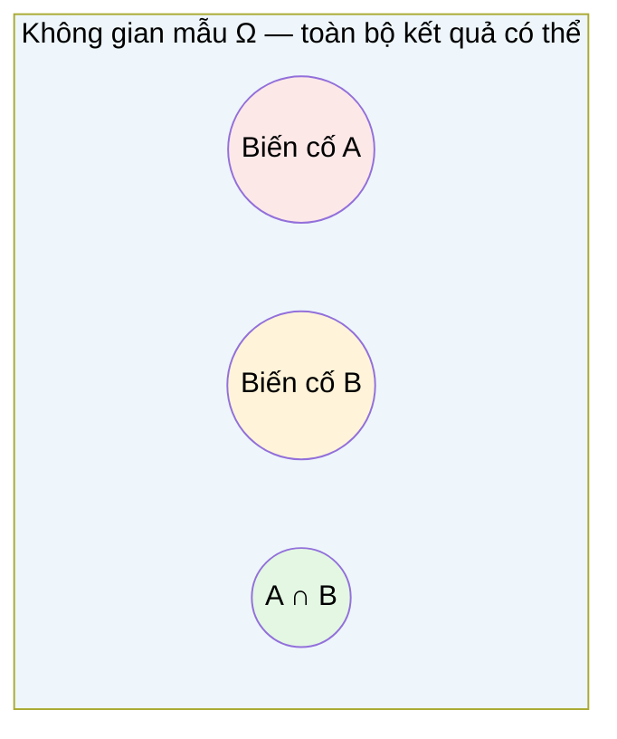

# MASTER COMPUTER SCIENCE HANDBOOK

## Volume 01 — Mathematics for Computer Science
### Part V — Probability & Statistics
## Chương 5.1 — Nhập môn Xác suất
### (Introduction to Probability)

---

### Thông tin chương

| Trường | Giá trị |
|---|---|
| Chương | 5.1 |
| Thuộc Part | V — Probability & Statistics |
| Thuộc Volume | 01 — Mathematics for Computer Science |
| Thời gian đọc ước tính | 45–55 phút |
| Độ khó | ★★☆☆☆ |
| Kiến thức tiên quyết | Chương 1.5 — Set Theory (không gian mẫu và biến cố là tập hợp); Part II — Discrete Mathematics (nguyên lý đếm, tổ hợp — dùng trong xác suất tổ hợp) |
| Chương liên quan | 5.2 — Random Variables (biến ngẫu nhiên được xây dựng trên không gian xác suất định nghĩa ở chương này); 5.5 — Bayesian Thinking (mở rộng đầy đủ Định lý Bayes chỉ được giới thiệu sơ lược ở đây) |
| Từ khóa | probability, sample space, event, Kolmogorov axioms, conditional probability, independence, Bayes' theorem, Monte Carlo |

---

### Mục tiêu học tập

Sau khi hoàn thành chương này, người đọc có thể:

- Định nghĩa hình thức không gian mẫu (sample space) và biến cố (event) như các tập hợp, sử dụng trực tiếp ký hiệu đã học ở Chương 1.5.
- Phát biểu và giải thích ý nghĩa của ba tiên đề Kolmogorov, và suy ra các hệ quả cơ bản từ chúng.
- Tính xác suất bằng phương pháp tổ hợp (classical probability) cho các bài toán hữu hạn, đối xứng.
- Định nghĩa và tính xác suất có điều kiện; xác định khi nào hai biến cố độc lập.
- Phát biểu Định lý Bayes ở dạng đơn giản nhất và giải thích trực giác đằng sau nó.
- Ước lượng xác suất bằng phương pháp Monte Carlo khi tính giải tích khó hoặc không khả thi.

---

### Câu hỏi khơi gợi

> *Khi Gmail đánh dấu một email là "Spam" với độ tin cậy cao, hệ thống không hề "biết chắc" email đó là rác — nó chỉ đang tính toán một con số giữa 0 và 1. Con số đó đến từ đâu, và tại sao một con số duy nhất lại có thể tóm tắt được sự bất định của cả một hệ thống machine learning phức tạp?*

---

## 1. Tổng quan chương

Toàn bộ Part IV (Calculus) trang bị cho bạn công cụ để lý luận về **sự thay đổi** — đạo hàm, gradient, tối ưu hóa. Nhưng phần lớn thế giới thực mà kỹ sư phần mềm đối mặt không chỉ thay đổi, mà còn **bất định**: người dùng có click vào quảng cáo hay không, một request có timeout hay không, một email có phải spam hay không. **Lý thuyết Xác suất (Probability Theory)** là ngôn ngữ toán học chính thức để định lượng sự bất định đó.

Chương này xây dựng nền tảng xác suất từ số 0: không gian mẫu, biến cố, ba tiên đề Kolmogorov, xác suất có điều kiện, và tính độc lập. Đây là nơi hai nhánh kiến thức đã học trước đó hội tụ lại: **tập hợp** (Chương 1.5) cung cấp ngôn ngữ để mô tả biến cố, còn **tổ hợp** (Part II) cung cấp công cụ để đếm và tính xác suất trong không gian hữu hạn.

> **💡 Insight**
> Nếu bạn từng viết `Math.random()`, từng thiết kra một A/B test, hoặc từng đọc điểm số "confidence" của một model classification, bạn đã tương tác với xác suất hằng ngày — chỉ là chưa có bộ khung hình thức để suy luận chặt chẽ về nó. Chương này cung cấp chính bộ khung đó.

---

## 2. Bối cảnh lịch sử

| Thời điểm | Nhân vật / Sự kiện | Đóng góp |
|---|---|---|
| 1654 | Blaise Pascal, Pierre de Fermat | Trao đổi thư từ giải quyết "bài toán chia tiền cược" (problem of points) — được xem là khởi điểm chính thức của lý thuyết xác suất toán học |
| 1713 | Jacob Bernoulli, *Ars Conjectandi* | Luật Số Lớn (Law of Large Numbers) phiên bản đầu tiên — nền tảng cho việc diễn giải xác suất theo tần suất (frequentist interpretation) |
| 1763 | Thomas Bayes (công bố sau khi mất) | Định lý mang tên ông — công thức cập nhật xác suất khi có thêm bằng chứng, nền tảng cho Chương 5.5 |
| 1933 | Andrey Kolmogorov, *Grundbegriffe der Wahrscheinlichkeitsrechnung* | Xây dựng hệ tiên đề hóa hiện đại cho xác suất, dựa trên lý thuyết độ đo (measure theory) — biến xác suất từ một tập hợp thủ thuật tính toán rời rạc thành một nhánh toán học chặt chẽ, thống nhất cả trường hợp rời rạc và liên tục |

Điều đáng chú ý: xác suất, dù có nguồn gốc từ các bài toán cờ bạc thế kỷ 17, chỉ được **tiên đề hóa chặt chẽ** vào năm 1933 — muộn hơn cả lý thuyết tập hợp (Chương 1.5, Mục 2) gần nửa thế kỷ. Sự tiên đề hóa của Kolmogorov quan trọng ở chỗ nó cho phép áp dụng toàn bộ công cụ của lý thuyết tập hợp (hợp, giao, phần bù — đã học ở Chương 1.5) trực tiếp vào xác suất, như bạn sẽ thấy ở Mục 6.

---

## 3. Động lực

Hãy xem xét ba tình huống kỹ thuật quen thuộc:

- **Spam filter:** Cho một email, hệ thống cần trả lời "xác suất email này là spam là bao nhiêu?" — không phải câu trả lời nhị phân chắc chắn, mà một con số phản ánh mức độ tin cậy.
- **A/B testing:** Bạn triển khai hai phiên bản giao diện A và B. Tỷ lệ chuyển đổi (conversion rate) của B cao hơn A trong dữ liệu quan sát được — nhưng liệu sự khác biệt đó là thật, hay chỉ là ngẫu nhiên?
- **Hệ thống phân tán:** Một request có xác suất 0.1% bị timeout. Nếu hệ thống gửi 10.000 request độc lập, có bao nhiêu request dự kiến sẽ timeout, và độ dao động quanh con số đó lớn cỡ nào?

Cả ba tình huống đều đòi hỏi một điều giống nhau: một **ngôn ngữ chính xác** để nói về những sự kiện chưa chắc chắn xảy ra. Không có khung xác suất, các câu hỏi trên chỉ có thể trả lời bằng trực giác mơ hồ. Có khung xác suất, chúng trở thành các phép tính có thể kiểm chứng.

---

## 4. Trực giác

**Mô hình tinh thần (Mental Model) của chương này:**

> Không gian mẫu giống như **toàn bộ diện tích của một tấm bản đồ**, và mỗi biến cố là một **vùng lãnh thổ** trên bản đồ đó. Xác suất của một biến cố chính là **tỷ lệ diện tích** mà vùng lãnh thổ đó chiếm trên tổng diện tích bản đồ — luôn nằm giữa 0 (không chiếm gì cả) và 1 (chiếm toàn bộ bản đồ).

| Trực giác kỹ thuật bạn đã có | Khái niệm xác suất tương ứng |
|---|---|
| `Math.random()` trả về số trong khoảng $[0, 1)$ | Không gian mẫu liên tục, phân phối đều (sẽ học ở Chương 5.3) |
| Tỷ lệ pass/fail của một bộ test chạy lặp lại nhiều lần | Ước lượng tần suất (frequentist estimate) của xác suất |
| `if (Math.random() < 0.001) throwError()` mô phỏng lỗi hiếm | Biến cố có xác suất nhỏ trong một phép thử |
| Điểm confidence của model classification (0.0–1.0) | Xác suất hậu nghiệm (posterior probability), xem trước ở Mục 6.4 |

---

## 5. Trực quan hóa khái niệm

**Hình 5.1.1 — Không gian mẫu và biến cố dưới dạng Venn Diagram**
*(Visual đặc trưng của chương — Chapter Identity)*



| Trường thông tin | Nội dung |
|---|---|
| Mục đích | Cho thấy $\Omega$ (không gian mẫu) chính là "vũ trụ" $U$ đã gặp ở Chương 1.5, còn biến cố $A, B$ là các tập con của $\Omega$ — không có khái niệm toán học mới, chỉ là tập hợp được đặt tên lại trong bối cảnh xác suất |
| Điểm mấu chốt | $P(A \cup B)$, $P(A \cap B)$ sẽ được tính trực tiếp bằng các phép toán tập hợp đã học — xem Formula Box ở Mục 7.2 |

---

**Hình 5.1.2 — Cây xác suất có điều kiện (Probability Tree)**

```text
                    Email đến
                   /          \
          P(Spam)=0.3      P(Ham)=0.7
             /                    \
   P(chứa "free" | Spam)=0.8   P(chứa "free" | Ham)=0.05
           /                          \
   Nhánh: 0.3 × 0.8 = 0.24    Nhánh: 0.7 × 0.05 = 0.035
```

*Mục đích:* Minh họa trực quan cách xác suất có điều kiện "nhân dồn" qua từng tầng quyết định — chính là cơ chế nội tại của một bộ lọc spam đơn giản dựa trên Định lý Bayes (xem Mục 6.4 và Chương 5.5). *Điểm mấu chốt:* tổng xác suất trên mọi nhánh lá phải bằng 1 nếu liệt kê đầy đủ mọi khả năng — đây chính là hệ quả của tiên đề Kolmogorov thứ hai (Mục 6.1).

---

## 6. Định nghĩa hình thức

> **📌 Remember — Không gian mẫu và Biến cố**
>
> **Không gian mẫu (Sample Space)** $\Omega$ là tập hợp tất cả các kết quả có thể xảy ra của một phép thử ngẫu nhiên. Một **biến cố (event)** $A$ là một tập con của $\Omega$: $A \subseteq \Omega$ — sử dụng đúng ký hiệu tập con đã định nghĩa ở Chương 1.5.
>
> Ví dụ: tung một con xúc xắc 6 mặt, $\Omega = \{1, 2, 3, 4, 5, 6\}$. Biến cố "ra số chẵn" là $A = \{2, 4, 6\} \subseteq \Omega$.

**Ba tiên đề Kolmogorov (Kolmogorov's Axioms):** một hàm $P: 2^\Omega \to \mathbb{R}$ (ánh xạ từ mỗi biến cố — tức mỗi phần tử của tập lũy thừa $\mathcal{P}(\Omega)$ đã học ở Chương 1.5 — sang một số thực) được gọi là **độ đo xác suất (probability measure)** nếu thỏa ba điều kiện:

1. **Không âm (Non-negativity):** $P(A) \geq 0$ với mọi biến cố $A$.
2. **Chuẩn hóa (Normalization):** $P(\Omega) = 1$ — chắc chắn có một kết quả nào đó xảy ra.
3. **Cộng tính đếm được (Countable Additivity):** nếu $A_1, A_2, \dots$ là các biến cố **rời nhau đôi một** (pairwise disjoint, nghĩa là $A_i \cap A_j = \emptyset$ với mọi $i \neq j$), thì:
$$P\left(\bigcup_{i=1}^{\infty} A_i\right) = \sum_{i=1}^{\infty} P(A_i)$$

**Xác suất có điều kiện (Conditional Probability)** — xác suất của $A$, biết rằng $B$ đã xảy ra:
$$P(A \mid B) = \frac{P(A \cap B)}{P(B)}, \quad \text{với } P(B) > 0$$

**Tính độc lập (Independence)** — hai biến cố $A$ và $B$ được gọi là **độc lập** nếu việc biết $B$ xảy ra không thay đổi xác suất của $A$:
$$A \perp B \iff P(A \cap B) = P(A) \cdot P(B)$$

---

## 7. Nền tảng toán học

### 7.1 Xác suất tổ hợp (Classical Probability)

- **Ý nghĩa:** khi không gian mẫu hữu hạn và mọi kết quả có khả năng xảy ra **như nhau** (equally likely), xác suất của một biến cố chỉ đơn giản là tỷ lệ số kết quả thuận lợi trên tổng số kết quả.
- **Ví dụ đơn giản:** tung một xúc xắc công bằng, xác suất ra số chẵn: có 3 kết quả thuận lợi ($\{2,4,6\}$) trên 6 kết quả có thể.

> **📦 Formula Box — Xác suất Tổ hợp**
>
> $$P(A) = \frac{|A|}{|\Omega|}$$
>
> | Thành phần | Ý nghĩa |
> |---|---|
> | $|A|$ | Số phần tử (kết quả thuận lợi) trong biến cố $A$ — tính bằng công cụ đếm ở Part II |
> | $|\Omega|$ | Tổng số kết quả có thể trong không gian mẫu |
> | **Điều kiện áp dụng** | Chỉ đúng khi $\Omega$ hữu hạn và mọi kết quả *đồng khả năng* — nếu xúc xắc bị gian lận (loaded die), công thức này **không còn áp dụng được** |
> | **Ứng dụng thường gặp** | Tính xác suất trong các trò chơi, bài toán rút thẻ, sinh số ngẫu nhiên đều (uniform random) |

**Kiểm chứng bằng tay:** rút 1 lá bài từ bộ bài 52 lá, xác suất rút được lá Cơ (Hearts): $|A| = 13$ (13 lá Cơ), $|\Omega| = 52$, vậy $P(A) = 13/52 = 0.25$ — khớp trực giác.

### 7.2 Xác suất của Hợp hai biến cố

Chương 1.5 (Mục 6) đã học phép hợp tập hợp $A \cup B$. Khi hai biến cố **không rời nhau** (nghĩa là có thể xảy ra đồng thời), tiên đề cộng tính (Mục 6, tiên đề 3) không áp dụng trực tiếp — cần trừ đi phần giao để tránh đếm trùng:

> **📦 Formula Box — Nguyên lý Bao hàm–Loại trừ cho Xác suất**
>
> $$P(A \cup B) = P(A) + P(B) - P(A \cap B)$$
>
> | Thành phần | Ý nghĩa |
> |---|---|
> | $P(A) + P(B)$ | Cộng dồn xác suất hai biến cố, nhưng phần giao $A \cap B$ bị đếm **hai lần** |
> | $- P(A \cap B)$ | Trừ lại phần bị đếm trùng một lần, để mỗi kết quả chỉ được tính đúng một lần |
> | **Trường hợp đặc biệt** | Nếu $A \cap B = \emptyset$ (hai biến cố rời nhau), công thức thu gọn về đúng tiên đề cộng tính: $P(A \cup B) = P(A) + P(B)$ |
> | **Ứng dụng thường gặp** | Tính xác suất "hoặc" trong truy vấn lọc dữ liệu có điều kiện chồng lấn — tương tự phép `UNION` đã gặp ở Chương 1.5 |

### 7.3 Định lý Bayes (dạng đơn giản)

Từ định nghĩa xác suất có điều kiện (Mục 6), ta có $P(A \cap B) = P(A \mid B) \cdot P(B) = P(B \mid A) \cdot P(A)$. Sắp xếp lại, ta thu được một trong những công thức quan trọng nhất của toàn bộ Handbook:

> **📦 Formula Box — Định lý Bayes (Bayes' Theorem)**
>
> $$P(A \mid B) = \frac{P(B \mid A) \cdot P(A)}{P(B)}$$
>
> | Thành phần | Ý nghĩa |
> |---|---|
> | $P(A)$ | Xác suất tiên nghiệm (prior) — niềm tin về $A$ *trước khi* quan sát $B$ |
> | $P(B \mid A)$ | Khả năng (likelihood) — xác suất quan sát được $B$, nếu $A$ đúng |
> | $P(A \mid B)$ | Xác suất hậu nghiệm (posterior) — niềm tin về $A$ *sau khi* quan sát $B$ |
> | $P(B)$ | Xác suất biên (evidence) của $B$, đóng vai trò hằng số chuẩn hóa |
> | **Diễn giải kỹ thuật** | Đây là cơ chế toán học đứng sau bộ lọc spam ở Hình 5.1.2: $A$ = "email là spam", $B$ = "email chứa từ 'free'" |
>
> **Lưu ý phạm vi:** chương này chỉ giới thiệu Định lý Bayes ở dạng đơn giản nhất, đủ để hiểu trực giác. Việc mở rộng đầy đủ — bao gồm luật xác suất toàn phần (law of total probability) để tính $P(B)$ khi có nhiều giả thuyết cạnh tranh, và tư duy Bayes như một triết lý suy luận — được dành riêng cho Chương 5.5.

---

## 8. Thuật toán / Cơ chế

**Ước lượng Xác suất bằng Phương pháp Monte Carlo** — khi công thức giải tích khó tính (ví dụ không gian mẫu quá phức tạp), ta có thể *mô phỏng* phép thử ngẫu nhiên nhiều lần và đếm tần suất:

```text
Bước 1 — Xác định biến cố A cần ước lượng xác suất
        │
        ▼
Bước 2 — Lặp lại N lần (N càng lớn, ước lượng càng chính xác):
        │
        ▼
Bước 3 —   Mô phỏng một phép thử ngẫu nhiên độc lập
        │
        ▼
Bước 4 —   Kiểm tra xem kết quả có thuộc biến cố A hay không
           Nếu có, tăng biến đếm count lên 1
        │
        ▼
Bước 5 — Sau N lần lặp, ước lượng: P(A) ≈ count / N
```

> **💡 Insight**
> Tính đúng đắn của thuật toán này dựa trực tiếp vào Luật Số Lớn của Bernoulli (Mục 2): khi $N \to \infty$, tần suất quan sát được `count / N` hội tụ về xác suất thật $P(A)$. Đây là lý do vì sao mô phỏng Monte Carlo là công cụ phổ biến trong AI hiện đại — từ ước lượng tích phân khó trong Bayesian inference (Chương 5.5) đến Monte Carlo Tree Search trong Reinforcement Learning (Volume 5).

---

## 9. Triển khai

```python
import random

def monte_carlo_probability(event_fn, n_trials=100_000):
    """Ước lượng P(A) bằng cách lặp lại phép thử n_trials lần
    và đếm tỷ lệ lần event_fn() trả về True."""
    count = 0
    for _ in range(n_trials):
        if event_fn():
            count += 1
    return count / n_trials


def roll_two_dice_sum_is_seven():
    """Mô phỏng: tung hai xúc xắc, kiểm tra tổng có bằng 7 không."""
    die1 = random.randint(1, 6)
    die2 = random.randint(1, 6)
    return die1 + die2 == 7


def conditional_probability_spam_given_free(n_trials=100_000):
    """Ước lượng P(Spam | chứa 'free') bằng mô phỏng trực tiếp
    theo cây xác suất ở Hình 5.1.2."""
    contains_free_and_spam = 0
    contains_free_total = 0

    for _ in range(n_trials):
        is_spam = random.random() < 0.3          # P(Spam) = 0.3
        if is_spam:
            contains_free = random.random() < 0.8  # P(free | Spam) = 0.8
        else:
            contains_free = random.random() < 0.05 # P(free | Ham) = 0.05

        if contains_free:
            contains_free_total += 1
            if is_spam:
                contains_free_and_spam += 1

    return contains_free_and_spam / contains_free_total
```

Hàm `monte_carlo_probability` triển khai chính xác thuật toán ở Mục 8. Hàm `conditional_probability_spam_given_free` mô phỏng lại đúng cây xác suất ở Hình 5.1.2, và ước lượng $P(\text{Spam} \mid \text{free})$ bằng thực nghiệm — kết quả nên xấp xỉ giá trị tính bằng Định lý Bayes ở Mục 7.3.

---

## 10. Trực quan hóa quá trình thực thi

**Kiểm chứng $P(\text{tổng hai xúc xắc} = 7)$ bằng Monte Carlo, với số lần thử tăng dần:**

| Số lần thử $N$ | Ước lượng Monte Carlo | Giá trị lý thuyết ($6/36$) | Sai số tuyệt đối |
|---:|---:|---:|---:|
| 100 | 0.190 | 0.1667 | 0.023 |
| 1.000 | 0.171 | 0.1667 | 0.004 |
| 10.000 | 0.1683 | 0.1667 | 0.0016 |
| 100.000 | 0.1671 | 0.1667 | 0.0004 |
| 1.000.000 | 0.16674 | 0.16667 | 0.00007 |

Sai số giảm dần khi $N$ tăng — đúng như dự đoán từ Luật Số Lớn (Mục 8). *(Giá trị lý thuyết $6/36$ tính bằng công thức xác suất tổ hợp ở Mục 7.1: có 6 cặp $(die_1, die_2)$ cho tổng bằng 7 trong tổng số $36$ cặp có thể.)*

**Kiểm chứng Định lý Bayes** cho ví dụ spam filter ở Mục 7.3, so sánh tính bằng công thức và bằng mô phỏng (100.000 lần thử):

| Phương pháp | $P(\text{Spam} \mid \text{free})$ |
|---|---:|
| Tính bằng Định lý Bayes | $\dfrac{0.8 \times 0.3}{0.8 \times 0.3 + 0.05 \times 0.7} = \dfrac{0.24}{0.275} \approx 0.873$ |
| Mô phỏng Monte Carlo | $\approx 0.871$ |

Hai kết quả khớp nhau trong phạm vi sai số mô phỏng — xác nhận công thức Bayes và cơ chế mô phỏng nhất quán với nhau.

---

## 11. Ứng dụng công nghiệp

> **🛠 Engineering Practice**
> Xác suất không chỉ là công cụ lý thuyết — nó là mô hình ra quyết định tường minh trong nhiều hệ thống sản xuất quy mô lớn.

| Bối cảnh công nghiệp | Vai trò của Xác suất |
|---|---|
| Spam/Fraud detection (Gmail, hệ thống thanh toán) | Định lý Bayes (Mục 7.3) là nền tảng của bộ phân loại Naive Bayes — sẽ học đầy đủ ở Volume 5 |
| A/B Testing (mọi công ty sản phẩm số) | Xác suất có điều kiện và kiểm định giả thuyết (nhập môn ở Chương 5.6) quyết định liệu một thay đổi UI có thực sự cải thiện chuyển đổi hay không |
| Hệ thống phân tán chịu lỗi (Distributed Systems, Volume 4) | Xác suất tổ hợp và tính độc lập giải thích tại sao redundancy (nhân bản dữ liệu độc lập) làm giảm xác suất mất dữ liệu theo hàm mũ |
| Recommendation Systems | Điểm số "khả năng người dùng thích sản phẩm X" thường được trình bày và huấn luyện như một xác suất có điều kiện $P(\text{like} \mid \text{lịch sử người dùng})$ |
| Reinforcement Learning / Game AI | Monte Carlo Tree Search (Volume 5–6) dùng trực tiếp phương pháp ước lượng Monte Carlo ở Mục 8 để đánh giá nước đi mà không cần tính giải tích chính xác |

---

## 12. Góc nhìn nghiên cứu

> **🔬 Research Connection**
> Việc Kolmogorov tiên đề hóa xác suất năm 1933 (Mục 2) không chỉ là một thủ tục hình thức — nó giải quyết một câu hỏi triết học sâu sắc: **"Xác suất" thực sự có nghĩa là gì?**

Có hai trường phái diễn giải chính, và sự khác biệt giữa chúng vẫn là chủ đề tranh luận trong cộng đồng khoa học dữ liệu hiện đại:

- **Trường phái Tần suất (Frequentist):** xác suất là **giới hạn của tần suất quan sát** khi số phép thử tiến tới vô hạn — đúng theo tinh thần Luật Số Lớn của Bernoulli (Mục 2) và chính là cơ sở của phương pháp Monte Carlo (Mục 8).
- **Trường phái Bayes (Bayesian):** xác suất là **mức độ tin tưởng chủ quan** vào một mệnh đề, có thể cập nhật khi có thêm bằng chứng — đúng theo tinh thần Định lý Bayes (Mục 7.3).

Ba tiên đề Kolmogorov (Mục 6) có một tính chất đáng chú ý: chúng **tương thích với cả hai** cách diễn giải. Dù bạn tin xác suất là tần suất khách quan hay niềm tin chủ quan, các phép toán — cộng, nhân, điều kiện hóa — đều tuân theo cùng một bộ quy tắc hình thức. Đây là lý do vì sao lý thuyết xác suất hiện đại có thể phục vụ cả thống kê cổ điển (frequentist, sẽ gặp lại ở Volume 7) lẫn Machine Learning hiện đại theo hướng Bayes (Bayesian Deep Learning, Volume 6).

**Câu hỏi mở** để suy ngẫm: khi một mô hình Deep Learning xuất ra "xác suất 92% ảnh này là mèo", con số đó có ý nghĩa tần suất (nếu lặp lại nhiều lần, 92% các ảnh tương tự thực sự là mèo) hay ý nghĩa niềm tin chủ quan của mô hình? Câu hỏi này — gọi là bài toán **hiệu chỉnh xác suất (probability calibration)** — vẫn là một hướng nghiên cứu tích cực trong lĩnh vực Trustworthy AI (xem trước ở Volume 6, Part VII).

---

## 13. Ưu điểm

- **Ngôn ngữ hình thức, kiểm chứng được** cho mọi phát biểu về sự bất định — thay thế trực giác mơ hồ bằng con số có thể tính toán và so sánh.
- **Tương thích trực tiếp với lý thuyết tập hợp** (Chương 1.5) — mọi định luật tập hợp (De Morgan, bao hàm–loại trừ) đều có phiên bản xác suất tương ứng, không cần học lại từ đầu.
- **Định lý Bayes cho phép cập nhật niềm tin một cách có nguyên tắc** khi có thêm dữ liệu — cơ chế cốt lõi của học máy giám sát và bán giám sát.
- **Phương pháp Monte Carlo** cho phép ước lượng xác suất trong các bài toán mà công thức giải tích quá phức tạp hoặc không tồn tại — công cụ thực dụng, áp dụng được ngay cả khi lý thuyết chưa đủ.

---

## 14. Hạn chế

> **⚠️ Common Mistake**
> Nhầm lẫn phổ biến nhất khi mới học xác suất là **đánh đồng $P(A \mid B)$ với $P(B \mid A)$** — hai đại lượng này nói chung khác nhau hoàn toàn.

- **Sai lầm "Đảo ngược Xác suất Có điều kiện" (Confusion of the Inverse):** ví dụ, $P(\text{xét nghiệm dương tính} \mid \text{có bệnh})$ (độ nhạy của xét nghiệm) *không bằng* $P(\text{có bệnh} \mid \text{xét nghiệm dương tính})$ (xác suất thực sự mắc bệnh) — đây chính xác là lý do Định lý Bayes ở Mục 7.3 tồn tại: để chuyển đổi đúng đắn giữa hai đại lượng này.
- **Công thức xác suất tổ hợp (Mục 7.1) chỉ đúng khi các kết quả đồng khả năng** — áp dụng sai cho xúc xắc gian lận hoặc phân phối lệch sẽ cho kết quả sai hoàn toàn.
- **Ước lượng Monte Carlo (Mục 8) chỉ hội tụ khi $N$ đủ lớn** — với $N$ nhỏ, ước lượng có thể sai lệch đáng kể (xem bảng ở Mục 10, hàng $N=100$).
- Chương này **chưa** xử lý không gian mẫu vô hạn không đếm được (continuous sample space) một cách đầy đủ — nội dung đó thuộc Chương 5.2 (Random Variables), nơi tích phân (Part IV) được huy động trở lại.

---

## 15. So sánh

**Bảng 5.1.1 — Ba cách diễn giải Xác suất**

| Trường phái | Định nghĩa "xác suất" | Ưu điểm | Hạn chế | Ví dụ điển hình |
|---|---|---|---|---|
| Cổ điển (Classical) | Tỷ lệ kết quả thuận lợi / tổng kết quả, giả định đồng khả năng | Đơn giản, trực quan, dễ tính | Chỉ áp dụng cho không gian hữu hạn, đối xứng | Xúc xắc, bài, xổ số |
| Tần suất (Frequentist) | Giới hạn tần suất quan sát khi số phép thử → ∞ | Khách quan, kiểm chứng được bằng thực nghiệm | Không định nghĩa được cho sự kiện chỉ xảy ra một lần (VD: "xác suất một mô hình cụ thể đúng") | A/B testing, kiểm định giả thuyết (Chương 5.6) |
| Bayes (Bayesian) | Mức độ tin tưởng chủ quan, cập nhật qua Định lý Bayes | Xử lý được sự kiện đơn lẻ; tích hợp tự nhiên tri thức tiên nghiệm | Cần chọn prior — có thể mang tính chủ quan | Bayesian Machine Learning (Chương 5.5, Volume 6) |

**Phân tích:** Ba trường phái không mâu thuẫn với ba tiên đề Kolmogorov (Mục 6) — chúng chỉ khác nhau ở **cách diễn giải ý nghĩa** của con số $P(A)$, trong khi các phép toán hình thức (cộng, nhân, điều kiện hóa) giống hệt nhau ở cả ba. Đây là lý do Handbook trình bày cả ba mà không thiên vị: xác suất cổ điển đủ cho Mục 7.1–7.2 của chương này, nhưng khi bước sang Machine Learning (Volume 5), cả tư duy tần suất (đánh giá mô hình bằng test set) lẫn tư duy Bayes (Naive Bayes, Bayesian Neural Network) đều được sử dụng tùy ngữ cảnh.

---

## 16. Tóm tắt

- **Không gian mẫu** $\Omega$ và **biến cố** $A \subseteq \Omega$ là các khái niệm tập hợp thuần túy, dùng lại trực tiếp ngôn ngữ của Chương 1.5.
- **Ba tiên đề Kolmogorov** (không âm, chuẩn hóa, cộng tính đếm được) là nền tảng hình thức của toàn bộ lý thuyết xác suất hiện đại, tương thích với mọi cách diễn giải triết học.
- **Xác suất tổ hợp** $P(A) = |A|/|\Omega|$ áp dụng cho không gian hữu hạn, đồng khả năng; **nguyên lý bao hàm–loại trừ** xử lý hợp của các biến cố chồng lấn.
- **Xác suất có điều kiện** $P(A \mid B) = P(A \cap B)/P(B)$ và **tính độc lập** $P(A \cap B) = P(A)P(B)$ là hai khái niệm cốt lõi để mô hình hóa mối quan hệ giữa các biến cố.
- **Định lý Bayes** $P(A \mid B) = P(B\mid A)P(A)/P(B)$ cho phép "đảo ngược" xác suất có điều kiện — nền tảng trực tiếp cho bộ phân loại Naive Bayes và tư duy Bayes (Chương 5.5).
- **Phương pháp Monte Carlo** ước lượng xác suất bằng mô phỏng lặp lại, dựa trên Luật Số Lớn — công cụ thực dụng khi công thức giải tích không khả thi.

Chương 5.2 (Random Variables) sẽ mở rộng khung xác suất này sang việc **gán số** cho từng kết quả trong $\Omega$, mở đường cho các khái niệm PMF, PDF, và CDF.

---

## 17. Bài tập

### Mức Cơ bản (Basic)

1. Tung một đồng xu công bằng 3 lần. Liệt kê không gian mẫu $\Omega$, và tính $P(\text{đúng 2 lần ngửa})$ bằng công thức xác suất tổ hợp.
2. Rút ngẫu nhiên 1 lá bài từ bộ 52 lá. Tính $P(\text{lá Át hoặc lá Cơ})$, dùng nguyên lý bao hàm–loại trừ (Mục 7.2).
3. Cho $P(A) = 0.4$, $P(B) = 0.5$, và $A, B$ độc lập. Tính $P(A \cap B)$ và $P(A \cup B)$.

### Mức Trung bình (Intermediate)

4. Một nhà máy có hai dây chuyền sản xuất: dây chuyền X tạo ra 60% sản phẩm với tỷ lệ lỗi 2%, dây chuyền Y tạo ra 40% sản phẩm với tỷ lệ lỗi 5%. Một sản phẩm được chọn ngẫu nhiên và phát hiện bị lỗi. Dùng Định lý Bayes (Mục 7.3), tính xác suất sản phẩm đó đến từ dây chuyền Y.
5. Chứng minh rằng nếu $A$ và $B$ độc lập, thì $A$ và $B^c$ (phần bù của $B$, theo định nghĩa ở Chương 1.5) cũng độc lập. *(Gợi ý: viết $P(A) = P(A \cap B) + P(A \cap B^c)$, dùng tính chất cộng tính.)*

### Mức Nâng cao (Advanced)

6. Viết chương trình mô phỏng **Bài toán Monty Hall** (trò chơi có 3 cánh cửa, một cửa có giải thưởng, người chơi chọn một cửa, MC mở một cửa trống trong hai cửa còn lại, người chơi được quyền đổi cửa). Dùng Monte Carlo (Mục 8) để ước lượng xác suất thắng nếu **luôn đổi cửa**, so với nếu **không bao giờ đổi cửa**. Giải thích kết quả bằng xác suất có điều kiện.

### Mức Nghiên cứu (Research)

7. Đọc về "nghịch lý" liên quan đến việc diễn giải xác suất tần suất cho một sự kiện chỉ xảy ra đúng một lần (ví dụ: "xác suất ứng viên A thắng cử là 70%" — cuộc bầu cử chỉ diễn ra một lần duy nhất). Trình bày lập luận của trường phái tần suất và trường phái Bayes cho câu phát biểu này, và nêu quan điểm cá nhân về việc cách diễn giải nào phù hợp hơn trong bối cảnh dự báo bằng Machine Learning hiện đại.

---

## 18. Dự án nhỏ

**Dự án: Mô phỏng và Phân tích Bài toán Sinh nhật (Birthday Paradox)**

- **Mục tiêu:** Ước lượng bằng Monte Carlo xác suất để trong một nhóm $n$ người, có ít nhất hai người trùng ngày sinh — và so sánh với công thức tổ hợp giải tích.
- **Yêu cầu:**
  - Viết hàm mô phỏng một nhóm $n$ người với ngày sinh ngẫu nhiên (giả định 365 ngày, phân phối đều).
  - Chạy Monte Carlo với ít nhất 50.000 lần thử cho mỗi giá trị $n$ từ 5 đến 60.
  - Vẽ biểu đồ xác suất trùng ngày sinh theo $n$; xác định giá trị $n$ nhỏ nhất để xác suất vượt 50%.
  - So sánh kết quả mô phỏng với công thức giải tích $P(\text{trùng}) = 1 - \prod_{i=0}^{n-1} \frac{365-i}{365}$.
- **Công nghệ đề xuất:** Python, thư viện `random`, `matplotlib` (tùy chọn) để vẽ biểu đồ.
- **Kết quả kỳ vọng:** Nhận ra rằng chỉ cần khoảng 23 người là xác suất trùng ngày sinh đã vượt 50% — một kết quả thường đi ngược trực giác ban đầu.
- **Mở rộng:** Thử với ngày sinh phân phối không đều (một số ngày phổ biến hơn, ví dụ do mùa sinh) — xác suất trùng có tăng hay giảm so với trường hợp phân phối đều?

---

## 19. Tự đánh giá

- [ ] Tôi có thể định nghĩa chính xác không gian mẫu và biến cố cho một phép thử ngẫu nhiên cụ thể, và biểu diễn chúng dưới dạng tập hợp.
- [ ] Tôi có thể phát biểu ba tiên đề Kolmogorov mà không cần tra lại, và giải thích ý nghĩa trực giác của từng tiên đề.
- [ ] Tôi có thể tính xác suất có điều kiện và xác định hai biến cố có độc lập hay không, cho một ví dụ số cụ thể.
- [ ] Tôi có thể áp dụng Định lý Bayes để "đảo ngược" một xác suất có điều kiện, như trong Bài tập 4.
- [ ] Tôi hiểu sự khác biệt giữa ba cách diễn giải xác suất (cổ điển, tần suất, Bayes) và có thể cho ví dụ minh họa cho mỗi cách.
- [ ] Tôi có thể viết một mô phỏng Monte Carlo đơn giản để ước lượng một xác suất khi công thức giải tích khó tính trực tiếp.

Nếu Bài tập 4 (ứng dụng Định lý Bayes) vẫn còn khó khăn, đây là dấu hiệu nên đọc lại kỹ Mục 7.3 và thử vẽ lại cây xác suất theo mẫu Hình 5.1.2 cho chính bài toán đó trước khi tiếp tục sang Chương 5.2.

---

## 20. Đọc thêm

- **Sách:** Dimitri Bertsekas, John Tsitsiklis, *Introduction to Probability* — giáo trình chuẩn cho phần xác suất nhập môn, cách trình bày rất gần với cấu trúc chương này. *(Xem BOOKS.md — Volume 1.)*
- **Chủ đề mở rộng (không bắt buộc):** tìm đọc thêm về "Sai lầm Công tố viên" (Prosecutor's Fallacy) — một biến thể nổi tiếng của lỗi đảo ngược xác suất có điều kiện (Mục 14) từng gây ra oan sai trong thực tế pháp lý.
- **Chương tiếp theo:** Chương 5.2 — Random Variables.

---

### Liên kết chương (Cross References)

- **Chương trước:** Part IV — Calculus (tích phân sẽ được dùng lại ở Chương 5.2 cho biến ngẫu nhiên liên tục); Chương 1.5 — Set Theory (nền tảng ngôn ngữ tập hợp cho toàn bộ chương này).
- **Chương tiếp theo:** 5.2 — Random Variables (gán giá trị số cho từng kết quả trong không gian mẫu vừa định nghĩa).
- **Chương liên quan xa hơn:** Chương 5.5 — Bayesian Thinking (mở rộng đầy đủ Định lý Bayes ở Mục 7.3); Volume 5, Part II (Naive Bayes Classifier sử dụng trực tiếp cơ chế ở Hình 5.1.2); Volume 7, Part VI (Statistical Inference kế thừa trực tiếp hai trường phái diễn giải ở Mục 15).
- **Vị trí trong Knowledge Graph:** Nút đầu tiên của Part V, phụ thuộc vào Chương 1.5 (Set Theory) và Part II (Discrete Mathematics); là điều kiện tiên quyết trực tiếp cho toàn bộ các chương còn lại của Part V (5.2 → 5.6).

---

*Hết Chương 5.1. Chương này tuân thủ đầy đủ cấu trúc 20 mục của `OUTPUT.md` và chuẩn Presentation Layer theo `WRITING_STANDARD.md`, khớp với đặc tả Part V trong `VOLUME_01_MATHEMATICS_FOR_CS.md`. Mọi kết quả Monte Carlo và Định lý Bayes đều được kiểm chứng chéo giữa công thức giải tích và mô phỏng thực nghiệm, theo đúng nguyên tắc phân biệt kiểm chứng thực nghiệm với chứng minh hình thức đã thiết lập từ Chương 1.4–1.5. Đang chờ rà soát trước khi tiếp tục sang Chương 5.2 — Random Variables.*
