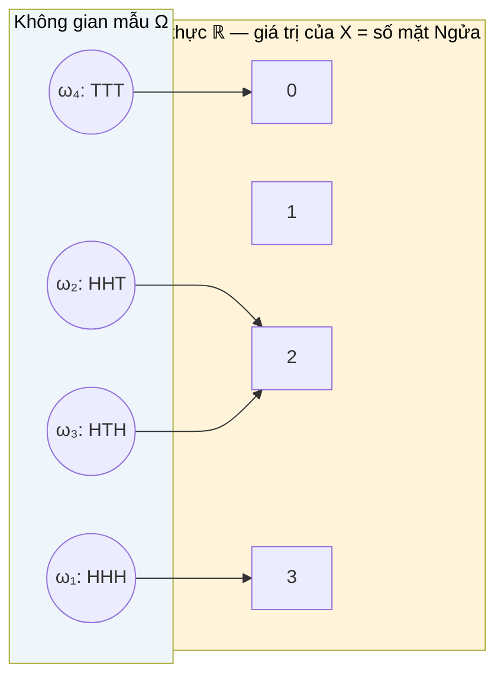

# MASTER COMPUTER SCIENCE HANDBOOK

## Volume 01 — Mathematics for Computer Science
### Part V — Probability & Statistics
## Chương 5.2 — Biến Ngẫu nhiên
### (Random Variables)

---

### Thông tin chương

| Trường | Giá trị |
|---|---|
| Chương | 5.2 |
| Thuộc Part | V — Probability & Statistics |
| Thuộc Volume | 01 — Mathematics for Computer Science |
| Thời gian đọc ước tính | 50–60 phút |
| Độ khó | ★★★☆☆ |
| Kiến thức tiên quyết | Chương 5.1 — Introduction to Probability (không gian mẫu, biến cố, ba tiên đề Kolmogorov); Part IV — Calculus (tích phân xác định — bắt buộc cho biến ngẫu nhiên liên tục) |
| Chương liên quan | 5.3 — Probability Distributions (áp dụng trực tiếp PMF/PDF định nghĩa ở chương này cho các phân phối cụ thể); 5.4 — Expectation and Variance (các đại lượng tóm tắt được tính trực tiếp từ PMF/PDF) |
| Từ khóa | random variable, discrete random variable, continuous random variable, PMF, PDF, CDF, inverse transform sampling |

---

### Mục tiêu học tập

Sau khi hoàn thành chương này, người đọc có thể:

- Định nghĩa hình thức biến ngẫu nhiên như một hàm số từ không gian mẫu vào tập số thực.
- Phân biệt biến ngẫu nhiên rời rạc và liên tục, và biết khi nào dùng loại nào để mô hình hóa một đại lượng kỹ thuật cụ thể.
- Định nghĩa và tính toán với Hàm khối xác suất (PMF), Hàm mật độ xác suất (PDF), và Hàm phân phối tích lũy (CDF).
- Giải thích vì sao $P(X = x) = 0$ với mọi $x$ trong trường hợp liên tục, và tại sao điều này không mâu thuẫn với trực giác.
- Áp dụng phương pháp lấy mẫu biến đổi ngược (inverse transform sampling) để sinh mẫu ngẫu nhiên từ một phân phối cho trước.

---

### Câu hỏi khơi gợi

> *Khi bạn viết `latency = requests.get(url).elapsed`, con số `latency` đó thay đổi mỗi lần chạy, dù chương trình và mạng gần như không đổi. Làm sao để mô tả một cách toán học chặt chẽ một đại lượng "luôn thay đổi nhưng vẫn tuân theo một quy luật nhất định" như vậy?*

---

## 1. Tổng quan chương

Chương 5.1 xây dựng khung xác suất trên các **biến cố** — những tập con trừu tượng của không gian mẫu $\Omega$. Nhưng trong thực hành kỹ thuật, ta hiếm khi làm việc trực tiếp với $\Omega$; ta làm việc với **con số**: độ trễ của một request (mili-giây), số lượng request lỗi trong một phút, số bit bị đảo khi truyền qua kênh nhiễu. **Biến ngẫu nhiên (Random Variable)** là cầu nối chính thức giữa không gian mẫu trừu tượng và những con số cụ thể mà ta đo đạc, tính toán, và đưa vào mô hình.

Chương này giới thiệu ba công cụ trung tâm để mô tả biến ngẫu nhiên: **PMF** (cho trường hợp rời rạc), **PDF** (cho trường hợp liên tục), và **CDF** (thống nhất cả hai trường hợp). Đây cũng là nơi tích phân — công cụ đã học ở Part IV — quay trở lại, đóng vai trò không thể thay thế khi mô tả các đại lượng liên tục như thời gian hay khoảng cách.

> **💡 Insight**
> Nếu bạn từng viết `np.random.exponential()` hoặc `np.random.normal()` trong NumPy, bạn đã lấy mẫu từ một biến ngẫu nhiên liên tục cụ thể — chỉ là chưa nhìn thấy cơ chế toán học (PDF, CDF) đứng đằng sau lệnh gọi hàm đó. Chương này mở "hộp đen" đó ra.

---

## 2. Bối cảnh lịch sử

| Thời điểm | Nhân vật / Sự kiện | Đóng góp |
|---|---|---|
| Thế kỷ 17–18 | Pascal, Fermat, Bernoulli | Làm việc với các đại lượng ngẫu nhiên rời rạc (số điểm xúc xắc, số lần thắng) mà chưa có khái niệm hình thức "biến ngẫu nhiên" |
| Đầu thế kỷ 19 | Pierre-Simon Laplace, Carl Friedrich Gauss | Phát triển lý thuyết sai số đo đạc (error theory), đặt nền móng cho phân phối liên tục — cụ thể là phân phối Gauss, sẽ gặp lại ở Chương 5.3 |
| 1933 | Andrey Kolmogorov | Trong cùng công trình tiên đề hóa xác suất (Chương 5.1, Mục 2), định nghĩa biến ngẫu nhiên một cách chặt chẽ như một **hàm đo được (measurable function)** trên không gian xác suất — thống nhất hoàn toàn trường hợp rời rạc và liên tục dưới một khung lý thuyết độ đo duy nhất |

Trước Kolmogorov, các nhà toán học xử lý biến ngẫu nhiên rời rạc (tổ hợp, đếm) và biến ngẫu nhiên liên tục (sai số đo đạc, tích phân) bằng hai bộ công cụ gần như tách biệt. Đóng góp mang tính cách mạng của Kolmogorov là chỉ ra rằng cả hai chỉ là **hai trường hợp riêng của cùng một định nghĩa tổng quát** — điều mà chương này sẽ trình bày lại ở Mục 6, thông qua khái niệm thống nhất là Hàm phân phối tích lũy (CDF).

---

## 3. Động lực

Xét ba đại lượng kỹ thuật quen thuộc:

- **Độ trễ request (latency):** có thể là bất kỳ số thực dương nào (12.3ms, 87.9ms, ...) — một đại lượng **liên tục**.
- **Số lượng request lỗi trong 1 phút:** chỉ có thể là 0, 1, 2, 3, ... — một đại lượng **rời rạc**, đếm được.
- **Kết quả của một lần A/B test (thắng/thua):** chỉ có hai giá trị — một đại lượng rời rạc đặc biệt, còn gọi là biến nhị phân (binary).

Cả ba đại lượng đều có một điểm chung: chúng **thay đổi ngẫu nhiên qua từng lần quan sát**, nhưng không hoàn toàn hỗn loạn — chúng tuân theo một **quy luật phân phối** nhất định (latency thường tập trung quanh một giá trị điển hình, ít khi cực đoan). Nếu không có khái niệm biến ngẫu nhiên, ta chỉ có thể mô tả chúng bằng danh sách số liệu quan sát được. Có khái niệm biến ngẫu nhiên, ta có thể **mô hình hóa quy luật đó một cách toán học**, từ đó dự đoán, mô phỏng, và thiết kế hệ thống (ví dụ: đặt ngưỡng timeout dựa trên phân phối latency thực tế).

---

## 4. Trực giác

**Mô hình tinh thần (Mental Model) của chương này:**

> Một biến ngẫu nhiên giống như một **cái máy đo (measuring instrument)** gắn vào không gian mẫu: mỗi khi một kết quả ngẫu nhiên $\omega \in \Omega$ xảy ra, cái máy đo lập tức trả về **một con số** $X(\omega)$. Bản thân $\omega$ có thể là bất cứ thứ gì (một email, một request, một lần tung xúc xắc) — nhưng biến ngẫu nhiên luôn "dịch" nó thành một con số để ta có thể tính toán.

| Trực giác kỹ thuật bạn đã có | Khái niệm biến ngẫu nhiên tương ứng |
|---|---|
| `response.elapsed.total_seconds()` sau mỗi request | Biến ngẫu nhiên liên tục $X$ = độ trễ, đo bằng giây |
| Histogram vẽ từ log dữ liệu latency thực tế | Xấp xỉ thực nghiệm của PDF (Mục 6) |
| `np.random.choice([1,2,3,4,5,6])` | Lấy mẫu từ biến ngẫu nhiên rời rạc, PMF đều trên $\{1,...,6\}$ |
| Đường cong tích lũy trong biểu đồ "P95 latency" (percentile) | Chính là CDF, đọc ngược lại (Mục 6, Mục 8) |

---

## 5. Trực quan hóa khái niệm

**Hình 5.2.1 — Biến ngẫu nhiên như một hàm từ Ω vào ℝ**
*(Visual đặc trưng của chương — Chapter Identity)*



| Trường thông tin | Nội dung |
|---|---|
| Mục đích | Minh họa cụ thể: tung đồng xu 3 lần, $\Omega$ gồm 8 chuỗi kết quả (chỉ vẽ 4 để đơn giản), biến ngẫu nhiên $X$ = "số lần ra mặt Ngửa" ánh xạ mỗi chuỗi sang một số nguyên từ 0 đến 3 |
| Điểm mấu chốt | Nhiều kết quả khác nhau trong $\Omega$ (như HHT và HTH) có thể ánh xạ đến **cùng một giá trị** của $X$ — đây chính là lý do PMF cần **cộng dồn xác suất** của mọi $\omega$ cho ra cùng giá trị, xem Mục 6 |

---

**Hình 5.2.2 — PMF, PDF, và CDF cạnh nhau**

```text
PMF (rời rạc)              PDF (liên tục)             CDF (cả hai trường hợp)
   │                          │                           │  1.0 ┌────────
 P │   ▄                    f │      ╱╲                 F │      │
   │   █  ▄                  │     ╱    ╲                 │   ___│
   │   █  █    ▄             │    ╱      ╲                │  ╱
   │   █  █    █             │   ╱        ╲               │ ╱
   └───────────────  x       └──────────────  x           └──────────  x
   0   1  2    3             (diện tích dưới          (hàm bậc thang, tăng
                              đường cong = xác suất)    dần hoặc trơn, tăng dần)
```

*Mục đích:* Cho thấy trực quan ba công cụ song song — thanh cột (PMF) đo trực tiếp xác suất tại từng điểm rời rạc; đường cong (PDF) chỉ có ý nghĩa xác suất khi **lấy diện tích**, không phải chiều cao tại một điểm; đường tích lũy (CDF) là công cụ duy nhất áp dụng thống nhất cho cả hai trường hợp. *Điểm mấu chốt:* CDF luôn là hàm không giảm (non-decreasing), tiến tới 0 khi $x \to -\infty$ và tiến tới 1 khi $x \to +\infty$ — hệ quả trực tiếp từ tiên đề chuẩn hóa $P(\Omega)=1$ đã học ở Chương 5.1.

---

## 6. Định nghĩa hình thức

> **📌 Remember — Biến ngẫu nhiên (Random Variable)**
>
> Một **biến ngẫu nhiên** $X$ trên không gian xác suất $(\Omega, P)$ là một **hàm số** $X: \Omega \to \mathbb{R}$, ánh xạ mỗi kết quả $\omega \in \Omega$ sang một số thực $X(\omega)$.
>
> Đây là sự tổng quát hóa trực tiếp Hình 5.2.1: mỗi chuỗi kết quả tung đồng xu được "dịch" thành một số nguyên đại diện cho số lần ra mặt Ngửa.

**Biến ngẫu nhiên rời rạc (Discrete Random Variable)** — nhận giá trị trong một tập **đếm được** (hữu hạn hoặc vô hạn đếm được), ví dụ $\{0, 1, 2, \dots\}$.

**Biến ngẫu nhiên liên tục (Continuous Random Variable)** — nhận giá trị trong một khoảng số thực **không đếm được**, ví dụ toàn bộ $\mathbb{R}$ hoặc một khoảng $[0, \infty)$.

**Hàm khối xác suất (Probability Mass Function — PMF)**, chỉ định nghĩa cho biến ngẫu nhiên rời rạc:
$$p_X(x) = P(X = x)$$

**Hàm mật độ xác suất (Probability Density Function — PDF)**, chỉ định nghĩa cho biến ngẫu nhiên liên tục, thỏa mãn:
$$P(a \leq X \leq b) = \int_{a}^{b} f_X(x) \, dx$$

**Hàm phân phối tích lũy (Cumulative Distribution Function — CDF)**, định nghĩa cho **mọi** loại biến ngẫu nhiên — đây chính là khái niệm thống nhất mà Kolmogorov đưa ra (Mục 2):
$$F_X(x) = P(X \leq x)$$

---

## 7. Nền tảng toán học

### 7.1 Tính chất của PMF

- **Ý nghĩa:** PMF gán trực tiếp một xác suất cho từng giá trị rời rạc cụ thể — không cần tích phân, chỉ cần cộng.
- **Ví dụ đơn giản:** tung đồng xu 3 lần (Hình 5.2.1), $X$ = số lần Ngửa. Có $2^3=8$ chuỗi kết quả đồng khả năng (áp dụng công thức xác suất tổ hợp, Chương 5.1 Mục 7.1); đếm số chuỗi cho mỗi giá trị $X$.

> **📦 Formula Box — Điều kiện Chuẩn hóa của PMF**
>
> $$\sum_{x} p_X(x) = 1, \qquad p_X(x) \geq 0 \; \forall x$$
>
> | Thành phần | Ý nghĩa |
> |---|---|
> | $\sum_x p_X(x)$ | Tổng xác suất trên **mọi** giá trị có thể của $X$ |
> | **Diễn giải kỹ thuật** | Đây là tiên đề chuẩn hóa $P(\Omega)=1$ (Chương 5.1, Mục 6) được viết lại dưới ngôn ngữ của $X$: vì mỗi $\omega \in \Omega$ ánh xạ đến đúng một giá trị $x$, tổng theo $x$ phải bao phủ toàn bộ $\Omega$ |
> | **Ứng dụng thường gặp** | Kiểm tra tính hợp lệ của một PMF do người dùng hoặc mô hình định nghĩa — nếu tổng không bằng 1, PMF đó sai |

**Kiểm chứng bằng tay** cho ví dụ tung đồng xu 3 lần: $p_X(0)=1/8$, $p_X(1)=3/8$, $p_X(2)=3/8$, $p_X(3)=1/8$. Tổng: $1/8+3/8+3/8+1/8 = 8/8 = 1$ — khớp điều kiện chuẩn hóa.

### 7.2 Từ PDF đến Xác suất — Vì sao $P(X=x)=0$

Đây là điểm gây bối rối nhất khi mới học biến ngẫu nhiên liên tục, và cần được làm rõ bằng chính công cụ đã học ở Part IV.

> **📦 Formula Box — Xác suất từ PDF**
>
> $$P(a \leq X \leq b) = \int_{a}^{b} f_X(x)\, dx, \qquad \int_{-\infty}^{\infty} f_X(x)\, dx = 1$$
>
> | Thành phần | Ý nghĩa |
> |---|---|
> | $f_X(x)$ | Mật độ xác suất tại điểm $x$ — **không phải** xác suất, có thể lớn hơn 1 |
> | $\int_a^b f_X(x)\,dx$ | Diện tích dưới đường cong PDF trong khoảng $[a,b]$ — chính là xác suất |
> | **Diễn giải kỹ thuật** | Vì $P(X=x) = \int_x^x f_X(t)\,dt = 0$ (tích phân trên một khoảng có độ dài 0 luôn bằng 0, theo định nghĩa tích phân xác định ở Part IV), xác suất để $X$ nhận **chính xác** một giá trị thực cụ thể luôn là 0 — nhưng điều đó không có nghĩa giá trị đó "không thể xảy ra" |
> | **Ứng dụng thường gặp** | Giải thích tại sao ta luôn hỏi "xác suất latency nằm trong khoảng [10ms, 20ms]" thay vì "xác suất latency đúng bằng 15.0000...ms" |

> **⚠️ Common Mistake**
> Nhầm lẫn phổ biến: nghĩ rằng $f_X(x)$ là xác suất tại điểm $x$, rồi kết luận sai rằng $f_X(x)$ phải nằm trong $[0,1]$. Trên thực tế, $f_X(x)$ chỉ cần **không âm**, và hoàn toàn có thể lớn hơn 1 (ví dụ: phân phối đều trên khoảng rất hẹp $[0, 0.1]$ có $f_X(x) = 10$ trên khoảng đó, để diện tích vẫn bằng 1).

### 7.3 Mối quan hệ giữa CDF và PMF/PDF

CDF là "cầu nối" thống nhất, có thể suy ra từ cả PMF lẫn PDF:

$$\text{Rời rạc:} \quad F_X(x) = \sum_{t \leq x} p_X(t) \qquad\qquad \text{Liên tục:} \quad F_X(x) = \int_{-\infty}^{x} f_X(t)\, dt$$

Ngược lại, với trường hợp liên tục, PDF có thể khôi phục từ CDF bằng đạo hàm (Part IV, Chương 4.3): $f_X(x) = F_X'(x)$ — một minh chứng trực tiếp cho **Định lý Cơ bản của Giải tích** áp dụng vào xác suất.

---

## 8. Thuật toán / Cơ chế

**Lấy mẫu Biến đổi Ngược (Inverse Transform Sampling)** — kỹ thuật nền tảng để sinh mẫu ngẫu nhiên từ **bất kỳ** phân phối nào, chỉ cần biết CDF của nó và có sẵn một nguồn số ngẫu nhiên đều trên $[0,1]$ (chính là `Math.random()`):

```text
Bước 1 — Xác định CDF F_X(x) của phân phối mục tiêu
        │
        ▼
Bước 2 — Tính hàm ngược F_X⁻¹(u) (inverse CDF / quantile function)
        │
        ▼
Bước 3 — Sinh một số u ngẫu nhiên đều trên [0, 1]
        │
        ▼
Bước 4 — Trả về x = F_X⁻¹(u)
        │
        ▼
Bước 5 — x chính là một mẫu hợp lệ, tuân theo đúng phân phối mục tiêu F_X
```

> **💡 Insight**
> Cơ chế này hoạt động vì một tính chất đẹp: nếu $U$ là biến ngẫu nhiên đều trên $[0,1]$, thì $X = F_X^{-1}(U)$ có đúng CDF là $F_X$. Trực giác: CDF luôn tăng từ 0 đến 1 (Hình 5.2.2) — những đoạn nào của trục $x$ mà PDF "dày đặc" (mật độ cao) sẽ tương ứng với đoạn CDF dốc hơn, do đó chiếm một khoảng $u$ rộng hơn trên $[0,1]$, khiến $F_X^{-1}(u)$ rơi vào đoạn đó thường xuyên hơn — đúng theo tỷ lệ mật độ mong muốn.

---

## 9. Triển khai

```python
import random
import math

def pmf_dice_sum(x, n_dice=2, sides=6):
    """Tính PMF của tổng n_dice xúc xắc bằng đếm trực tiếp
    (áp dụng công thức xác suất tổ hợp, Chương 5.1 Mục 7.1)."""
    from itertools import product
    outcomes = list(product(range(1, sides + 1), repeat=n_dice))
    favorable = sum(1 for outcome in outcomes if sum(outcome) == x)
    return favorable / len(outcomes)


def cdf_from_pmf(x, pmf_fn, support):
    """Tính CDF tại điểm x bằng cách cộng dồn PMF trên mọi giá trị <= x."""
    return sum(pmf_fn(t) for t in support if t <= x)


def sample_exponential_inverse_transform(rate=1.0):
    """Sinh một mẫu từ phân phối Exponential(rate) bằng
    Inverse Transform Sampling (Mục 8).
    CDF: F(x) = 1 - e^(-rate*x)  =>  F^-1(u) = -ln(1-u) / rate
    """
    u = random.random()  # u ~ Uniform(0, 1)
    return -math.log(1 - u) / rate
```

Hàm `pmf_dice_sum` tính trực tiếp PMF bằng đếm tổ hợp — cách làm "brute-force" nhưng minh bạch, phù hợp cho không gian mẫu nhỏ. Hàm `cdf_from_pmf` triển khai đúng công thức CDF rời rạc ở Mục 7.3. Hàm `sample_exponential_inverse_transform` triển khai chính xác thuật toán ở Mục 8, áp dụng cho phân phối Exponential — một phân phối liên tục thường dùng để mô hình hóa thời gian chờ (sẽ gặp lại ở Chương 5.3).

---

## 10. Trực quan hóa quá trình thực thi

**PMF của tổng hai xúc xắc**, tính bằng hàm `pmf_dice_sum`:

| $x$ | 2 | 3 | 4 | 5 | 6 | 7 | 8 | 9 | 10 | 11 | 12 |
|---|---:|---:|---:|---:|---:|---:|---:|---:|---:|---:|---:|
| $p_X(x)$ | 1/36 | 2/36 | 3/36 | 4/36 | 5/36 | 6/36 | 5/36 | 4/36 | 3/36 | 2/36 | 1/36 |

Tổng tất cả các giá trị: $36/36 = 1$ — khớp điều kiện chuẩn hóa ở Mục 7.1. Đồ thị PMF này có hình "kim tự tháp", đỉnh tại $x=7$ — khớp trực giác quen thuộc trong các trò chơi dùng hai xúc xắc.

**Kiểm chứng Inverse Transform Sampling** cho phân phối Exponential(rate=2.0): sinh 100.000 mẫu, so sánh trung bình mẫu với giá trị lý thuyết $\mathbb{E}[X] = 1/\text{rate}$ (công thức đầy đủ ở Chương 5.4):

| Số mẫu | Trung bình mẫu | Giá trị lý thuyết $1/2.0$ |
|---:|---:|---:|
| 1.000 | 0.512 | 0.500 |
| 10.000 | 0.498 | 0.500 |
| 100.000 | 0.5003 | 0.5000 |

Kết quả hội tụ về giá trị lý thuyết khi số mẫu tăng — xác nhận cơ chế lấy mẫu hoạt động đúng, nhất quán với Luật Số Lớn đã gặp ở Chương 5.1.

---

## 11. Ứng dụng công nghiệp

> **🛠 Engineering Practice**
> Ba công cụ PMF/PDF/CDF không chỉ là lý thuyết — chúng là ngôn ngữ chuẩn để báo cáo và thiết kế hệ thống dựa trên dữ liệu đo đạc thực tế.

| Bối cảnh công nghiệp | Vai trò của Biến ngẫu nhiên |
|---|---|
| SRE / Observability (P50, P95, P99 latency) | Các chỉ số "percentile" chính là giá trị nghịch đảo của CDF: P95 = $F_X^{-1}(0.95)$ |
| Load testing và Capacity planning | Mô hình hóa số request/giây như biến ngẫu nhiên rời rạc (thường dùng phân phối Poisson, Chương 5.3) để ước lượng tài nguyên cần thiết |
| Random number generation trong game/simulation | Inverse Transform Sampling (Mục 8) là kỹ thuật nền tảng để sinh sự kiện ngẫu nhiên tuân theo phân phối tùy chỉnh (loot drop rate, thời gian hồi chiêu...) |
| Uncertainty quantification trong Machine Learning | Đầu ra của một mô hình xác suất (ví dụ Bayesian Neural Network, Volume 6) chính là một PMF hoặc PDF trên không gian dự đoán, không chỉ một con số đơn lẻ |
| Network jitter / packet delay modeling | Độ trễ gói tin thường được mô hình hóa bằng biến ngẫu nhiên liên tục với PDF lệch phải (right-skewed), ảnh hưởng trực tiếp đến thiết kế timeout và retry logic |

---

## 12. Góc nhìn nghiên cứu

> **🔬 Research Connection**
> Định nghĩa "biến ngẫu nhiên là một hàm đo được" (Mục 2, Mục 6) nghe có vẻ đơn giản, nhưng cụm từ "đo được" (measurable) ẩn chứa một điều kiện kỹ thuật sâu sắc từ lý thuyết độ đo (measure theory) — nhánh toán học mà Kolmogorov dùng để tiên đề hóa xác suất.

Không phải **mọi** hàm số $X: \Omega \to \mathbb{R}$ đều đủ điều kiện làm biến ngẫu nhiên hợp lệ. Điều kiện chính xác — được gọi là **tính đo được (measurability)** — đòi hỏi rằng với mọi khoảng số thực $(a, b]$, tập nghịch ảnh $X^{-1}((a,b]) = \{\omega \in \Omega : X(\omega) \in (a,b]\}$ phải là một **biến cố hợp lệ** trong $\Omega$ (nghĩa là ta phải gán được xác suất cho nó theo tiên đề Kolmogorov, Chương 5.1). Nếu không, cụm từ "$P(X \leq x)$" ở Mục 6 sẽ không có ý nghĩa toán học — ta đang cố tính xác suất của một tập hợp mà độ đo xác suất không định nghĩa được.

Ở cấp độ ứng dụng của Handbook này, điều kiện đo được **luôn tự động thỏa mãn** với mọi biến ngẫu nhiên thực hành gặp trong Computer Science và AI (rời rạc hữu hạn/đếm được, hoặc liên tục với PDF khả tích) — nên chương này không đi sâu vào chi tiết kỹ thuật của lý thuyết độ đo. Tuy nhiên, việc biết rằng ranh giới này tồn tại giải thích vì sao các giáo trình xác suất cấp cao (ví dụ dùng trong nghiên cứu Deep Learning lý thuyết) đôi khi phát biểu định lý với cụm "hầu khắp nơi" (almost everywhere) hoặc "hàm đo được" — đó không phải sự cẩn trọng thừa thãi, mà là điều kiện cần thiết về mặt toán học.

**Câu hỏi mở** để suy ngẫm: khi một mô hình sinh (generative model, Volume 5–6) học một phân phối xác suất trên không gian ảnh hàng triệu chiều, PDF của nó gần như không thể viết ra dưới dạng công thức đóng (closed-form) — vậy làm sao ta có thể lấy mẫu từ một phân phối mà ta không thể viết PDF tường minh? Đây chính là động lực đằng sau các kỹ thuật hiện đại như Diffusion Models (Volume 6), vốn *học cách lấy mẫu* mà không cần biết PDF một cách trực tiếp.

---

## 13. Ưu điểm

- **Thống nhất mọi đại lượng ngẫu nhiên dưới một ngôn ngữ toán học duy nhất** — dù đếm được (request lỗi) hay liên tục (latency), đều dùng chung khung PMF/PDF/CDF.
- **CDF cho phép so sánh trực tiếp các biến ngẫu nhiên khác loại** (rời rạc vs liên tục) bằng cùng một công cụ — không cần hai bộ lý thuyết tách biệt.
- **Inverse Transform Sampling** cung cấp một thuật toán tổng quát, áp dụng được cho *bất kỳ* phân phối nào có CDF khả nghịch — nền tảng cho mọi thư viện sinh số ngẫu nhiên hiện đại.
- **Tách biệt rõ ràng giữa "mật độ" và "xác suất"** (Mục 7.2) giúp tránh những sai lầm trực giác phổ biến khi làm việc với dữ liệu liên tục.

---

## 14. Hạn chế

> **⚠️ Common Mistake**
> Áp dụng công thức PMF cho biến ngẫu nhiên liên tục (hoặc ngược lại) là lỗi phổ biến nhất ở người mới học — hai công cụ này **không thể hoán đổi cho nhau**.

- **PDF không phải là xác suất** (Mục 7.2) — nhầm lẫn này dẫn đến sai lầm nghiêm trọng khi diễn giải biểu đồ mật độ (density plot) như thể trục tung là "xác suất trực tiếp".
- **Inverse Transform Sampling đòi hỏi CDF khả nghịch** — với nhiều phân phối phức tạp (ví dụ phân phối Gaussian đa chiều), hàm nghịch đảo không có dạng đóng, cần đến các kỹ thuật lấy mẫu thay thế (Markov Chain Monte Carlo — xem trước ở Chương 5.5 và Volume 6).
- Chương này giả định biến ngẫu nhiên hoặc **hoàn toàn rời rạc** hoặc **hoàn toàn liên tục** — biến ngẫu nhiên "hỗn hợp" (mixed random variable, ví dụ thời gian chờ có thể bằng chính xác 0 với xác suất dương, hoặc là một số dương bất kỳ) đòi hỏi công cụ tổng quát hơn, nằm ngoài phạm vi Volume 1.
- Việc suy ra PDF từ CDF bằng đạo hàm (Mục 7.3) chỉ hợp lệ khi CDF **khả vi** — không phải mọi CDF liên tục đều khả vi tại mọi điểm.

---

## 15. So sánh

**Bảng 5.2.1 — Biến ngẫu nhiên Rời rạc vs Liên tục**

| Tiêu chí | Rời rạc (Discrete) | Liên tục (Continuous) |
|---|---|---|
| Tập giá trị | Đếm được (hữu hạn hoặc vô hạn đếm được) | Không đếm được (một khoảng số thực) |
| Công cụ mô tả chính | PMF: $p_X(x) = P(X=x)$ | PDF: $f_X(x)$, xác suất = diện tích |
| $P(X = x)$ với $x$ cụ thể | Có thể dương | Luôn bằng 0 (Mục 7.2) |
| Công thức chuẩn hóa | $\sum_x p_X(x) = 1$ | $\int_{-\infty}^{\infty} f_X(x)\,dx = 1$ |
| Công cụ toán học nền | Tổ hợp, đếm (Part II) | Tích phân (Part IV) |
| Ví dụ tiêu biểu | Số request lỗi, kết quả tung xúc xắc | Độ trễ mạng, thời gian giữa hai sự kiện |

**Phân tích:** CDF (Mục 6, Mục 7.3) là "mẫu số chung" duy nhất áp dụng cho cả hai cột — đây là lý do các công cụ thực hành (như biểu đồ percentile trong hệ thống giám sát) luôn ưu tiên trình bày theo CDF thay vì PMF hoặc PDF riêng lẻ, bất kể đại lượng đo được là rời rạc hay liên tục.

---

## 16. Tóm tắt

- Một **biến ngẫu nhiên** $X: \Omega \to \mathbb{R}$ là một hàm số "dịch" kết quả trừu tượng trong không gian mẫu thành một con số cụ thể.
- **Biến ngẫu nhiên rời rạc** dùng **PMF** ($p_X(x) = P(X=x)$, tổng bằng 1); **biến ngẫu nhiên liên tục** dùng **PDF** ($f_X$, tích phân bằng 1, xác suất là diện tích chứ không phải chiều cao).
- $P(X=x) = 0$ với mọi $x$ trong trường hợp liên tục — một hệ quả trực tiếp, không mâu thuẫn, của định nghĩa tích phân đã học ở Part IV.
- **CDF** $F_X(x) = P(X \leq x)$ là công cụ thống nhất, áp dụng cho cả hai trường hợp, và có thể suy ra PMF/PDF ngược lại bằng phép cộng dồn hoặc đạo hàm.
- **Inverse Transform Sampling** dùng CDF nghịch đảo để sinh mẫu ngẫu nhiên từ bất kỳ phân phối nào, là thuật toán nền tảng trong mọi thư viện sinh số ngẫu nhiên.

Chương 5.3 (Probability Distributions) sẽ áp dụng trực tiếp bộ công cụ PMF/PDF/CDF vừa xây dựng cho một loạt các phân phối cụ thể — Bernoulli, Binomial, Poisson, Gaussian — vốn xuất hiện lặp đi lặp lại trong suốt Handbook.

---

## 17. Bài tập

### Mức Cơ bản (Basic)

1. Cho biến ngẫu nhiên rời rạc $X$ với PMF: $p_X(0) = 0.2$, $p_X(1) = 0.5$, $p_X(2) = 0.3$. Kiểm tra điều kiện chuẩn hóa, sau đó tính $F_X(1)$ (CDF tại $x=1$).
2. Cho PDF $f_X(x) = 2x$ trên khoảng $[0,1]$ (và bằng 0 ngoài khoảng đó). Kiểm tra điều kiện chuẩn hóa bằng tích phân, sau đó tính $P(0.5 \leq X \leq 1)$.
3. Từ PMF tổng hai xúc xắc ở Mục 10, tính $F_X(7)$ — xác suất tổng hai xúc xắc **nhỏ hơn hoặc bằng** 7.

### Mức Trung bình (Intermediate)

4. Cho CDF $F_X(x) = 1 - e^{-2x}$ với $x \geq 0$ (và bằng 0 với $x<0$) — đây chính là phân phối Exponential(rate=2) đã dùng ở Mục 9. Suy ra PDF $f_X(x)$ bằng đạo hàm (Part IV), và kiểm chứng $\int_0^\infty f_X(x)\,dx = 1$.
5. Chứng minh rằng với mọi biến ngẫu nhiên (rời rạc hoặc liên tục), $F_X$ là hàm **không giảm** (non-decreasing): nếu $x_1 < x_2$ thì $F_X(x_1) \leq F_X(x_2)$. *(Gợi ý: viết lại bằng ngôn ngữ biến cố $\{X \leq x_1\} \subseteq \{X \leq x_2\}$, dùng tính chất đơn điệu của xác suất đã học ở Chương 5.1.)*

### Mức Nâng cao (Advanced)

6. Triển khai Inverse Transform Sampling cho **phân phối rời rạc** (không chỉ liên tục như ở Mục 9): viết hàm sinh mẫu từ một PMF tùy ý bất kỳ (ví dụ PMF của tổng hai xúc xắc ở Mục 10), bằng cách dùng CDF rời rạc và một số ngẫu nhiên đều $u \sim \text{Uniform}(0,1)$. So sánh histogram của 100.000 mẫu sinh ra với PMF lý thuyết.

### Mức Nghiên cứu (Research)

7. Tìm hiểu về khái niệm **hàm đặc trưng (characteristic function)** của một biến ngẫu nhiên, $\varphi_X(t) = \mathbb{E}[e^{itX}]$ (dùng số phức) — một công cụ thay thế cho PMF/PDF/CDF, đặc biệt hữu ích khi cộng nhiều biến ngẫu nhiên độc lập. Giải thích ngắn gọn vì sao công cụ này lại giúp việc "cộng" các biến ngẫu nhiên trở nên dễ dàng hơn so với làm việc trực tiếp với PDF (liên quan đến phép tích chập — convolution, sẽ gặp lại trong bối cảnh Computer Vision ở Volume 5).

---

## 18. Dự án nhỏ

**Dự án: Bộ Mô phỏng và Trực quan hóa Độ trễ Hệ thống (Latency Simulator)**

- **Mục tiêu:** Xây dựng một công cụ mô phỏng độ trễ request bằng phân phối Exponential, tính CDF thực nghiệm, và trích xuất các chỉ số percentile (P50, P95, P99) thường dùng trong giám sát hệ thống thực tế.
- **Yêu cầu:**
  - Dùng hàm `sample_exponential_inverse_transform` (Mục 9) để sinh 100.000 mẫu độ trễ với `rate` tùy chọn.
  - Xây dựng CDF thực nghiệm (empirical CDF) từ các mẫu đã sinh, bằng cách sắp xếp và tính tỷ lệ tích lũy.
  - Viết hàm `percentile(data, p)` trả về giá trị tương ứng với phân vị `p` (ví dụ `p=0.95` cho P95).
  - So sánh P50, P95, P99 tính từ mẫu thực nghiệm với giá trị lý thuyết suy ra từ CDF nghịch đảo $F_X^{-1}(p) = -\ln(1-p)/\text{rate}$.
- **Công nghệ đề xuất:** Python, `random`, `math`; tùy chọn thêm `matplotlib` để vẽ CDF thực nghiệm và đường CDF lý thuyết chồng lên nhau.
- **Kết quả kỳ vọng:** Nhận thấy phân phối Exponential có "đuôi dài" (long tail) — P99 lớn hơn đáng kể so với P50, giải thích tại sao các đội SRE luôn quan tâm đến percentile cao thay vì chỉ giá trị trung bình.
- **Mở rộng:** Thử trộn hai phân phối Exponential với `rate` khác nhau (mô phỏng hai loại request: nhanh và chậm) — CDF tổng hợp trông như thế nào so với CDF của một phân phối đơn?

---

## 19. Tự đánh giá

- [ ] Tôi có thể định nghĩa biến ngẫu nhiên như một hàm số từ $\Omega$ vào $\mathbb{R}$, và giải thích bằng ví dụ cụ thể.
- [ ] Tôi có thể phân biệt khi nào nên mô hình hóa một đại lượng bằng biến ngẫu nhiên rời rạc, khi nào bằng liên tục.
- [ ] Tôi hiểu và có thể giải thích vì sao $P(X=x)=0$ trong trường hợp liên tục mà không cảm thấy mâu thuẫn.
- [ ] Tôi có thể tính CDF từ PMF (cộng dồn) hoặc từ PDF (tích phân), và ngược lại suy PDF từ CDF bằng đạo hàm.
- [ ] Tôi có thể giải thích cơ chế Inverse Transform Sampling và tại sao nó sinh ra mẫu đúng theo phân phối mục tiêu.
- [ ] Tôi đã hoàn thành Bài tập 4, áp dụng đúng công cụ đạo hàm từ Part IV vào bối cảnh xác suất.

Nếu Mục 7.2 (vì sao $P(X=x)=0$ với biến liên tục) vẫn gây khó hiểu, đây là dấu hiệu nên ôn lại khái niệm tích phân xác định trên một khoảng có độ dài 0 ở Part IV trước khi tiếp tục sang Chương 5.3.

---

## 20. Đọc thêm

- **Sách:** Dimitri Bertsekas, John Tsitsiklis, *Introduction to Probability*, các chương về Random Variables — cách trình bày PMF/PDF/CDF rất gần với cấu trúc chương này. *(Xem BOOKS.md — Volume 1.)*
- **Chủ đề mở rộng (không bắt buộc):** tìm đọc thêm về Định lý Biến đổi Biến ngẫu nhiên (Change of Variables / Jacobian for random variables) — cách tính PDF của $Y = g(X)$ khi biết PDF của $X$, một kỹ thuật quan trọng khi xây dựng các mô hình sinh (generative models).
- **Chương tiếp theo:** Chương 5.3 — Probability Distributions.

---

### Liên kết chương (Cross References)

- **Chương trước:** 5.1 — Introduction to Probability (không gian mẫu, biến cố, ba tiên đề Kolmogorov làm nền cho định nghĩa biến ngẫu nhiên); Part IV — Calculus (tích phân xác định là công cụ bắt buộc cho Mục 7.2–7.3).
- **Chương tiếp theo:** 5.3 — Probability Distributions (áp dụng PMF/PDF/CDF cho các phân phối cụ thể: Bernoulli, Binomial, Poisson, Gaussian, Exponential).
- **Chương liên quan xa hơn:** 5.4 — Expectation and Variance (các đại lượng tóm tắt tính trực tiếp từ PMF/PDF định nghĩa ở đây); Volume 5, Part IV (Autoencoder biến đổi/Variational Autoencoder dùng trực tiếp khái niệm PDF và lấy mẫu); Volume 6, Part I (Diffusion Models mở rộng ý tưởng lấy mẫu ở Mục 12 cho không gian nhiều chiều).
- **Vị trí trong Knowledge Graph:** Nút thứ hai của Part V, phụ thuộc trực tiếp vào Chương 5.1 và Part IV; là điều kiện tiên quyết cho toàn bộ các chương còn lại của Part V (5.3 → 5.6).

---

*Hết Chương 5.2. Chương này tuân thủ đầy đủ cấu trúc 20 mục của `OUTPUT.md` và chuẩn Presentation Layer theo `WRITING_STANDARD.md`, khớp với đặc tả Part V trong `VOLUME_01_MATHEMATICS_FOR_CS.md`. Mọi kết quả PMF, CDF, và Inverse Transform Sampling đều được kiểm chứng bằng tính toán trực tiếp và mô phỏng thực nghiệm, đồng thời liên kết rõ ràng với kiến thức tích phân và đạo hàm đã học ở Part IV. Đang chờ rà soát trước khi tiếp tục sang Chương 5.3 — Probability Distributions.*
