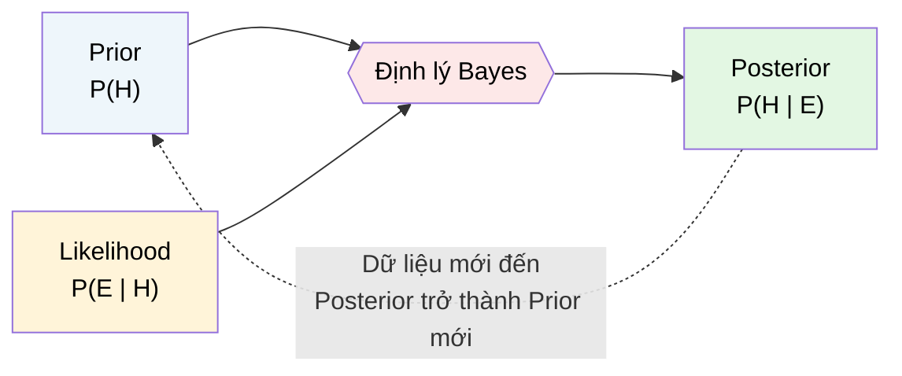

# MASTER COMPUTER SCIENCE HANDBOOK

## Volume 01 — Mathematics for Computer Science
### Part V — Probability & Statistics
## Chương 5.5 — Tư duy Bayes
### (Bayesian Thinking)

---

### Thông tin chương

| Trường | Giá trị |
|---|---|
| Chương | 5.5 |
| Thuộc Part | V — Probability & Statistics |
| Thuộc Volume | 01 — Mathematics for Computer Science |
| Thời gian đọc ước tính | 55–65 phút |
| Độ khó | ★★★☆☆ |
| Kiến thức tiên quyết | Chương 5.1 — Introduction to Probability (Định lý Bayes dạng đơn giản); Chương 5.4 — Expectation and Variance (kỳ vọng hậu nghiệm) |
| Chương liên quan | 5.6 — Statistical Inference (so sánh trực tiếp suy diễn Bayes với suy diễn tần suất); Volume 5, Part II (Naive Bayes Classifier áp dụng trực tiếp toàn bộ chương này) |
| Từ khóa | Bayes' theorem, prior, likelihood, posterior, law of total probability, MAP estimation, conjugate prior, Naive Bayes |

---

### Mục tiêu học tập

Sau khi hoàn thành chương này, người đọc có thể:

- Phát biểu và áp dụng đầy đủ Định lý Bayes cho trường hợp có nhiều giả thuyết cạnh tranh, dùng Luật Xác suất Toàn phần để tính mẫu số.
- Phân biệt rõ bốn thành phần: prior, likelihood, posterior, evidence — và giải thích vai trò của từng thành phần trong quá trình cập nhật niềm tin.
- Thực hiện cập nhật Bayes tuần tự (sequential updating) khi dữ liệu đến theo từng đợt, và giải thích vì sao kết quả giống hệt cập nhật một lần với toàn bộ dữ liệu.
- Áp dụng ước lượng MAP (Maximum A Posteriori) như một cách tóm tắt phân phối hậu nghiệm.
- Xây dựng một bộ phân loại Naive Bayes đơn giản từ đầu, áp dụng trực tiếp Định lý Bayes cho bài toán phân loại văn bản.
- So sánh có hệ thống hai trường phái suy diễn Bayes và tần suất.

---

### Câu hỏi khơi gợi

> *Một xét nghiệm y khoa có độ chính xác 99% (đúng 99% trường hợp, dù có bệnh hay không). Nếu bạn xét nghiệm dương tính, xác suất bạn thực sự mắc bệnh là bao nhiêu — 99%? Câu trả lời đúng có thể khiến bạn bất ngờ, và toàn bộ chương này được xây dựng để giải thích chính xác tại sao.*

---

## 1. Tổng quan chương

Chương 5.1 (Mục 7.3) đã giới thiệu Định lý Bayes ở dạng đơn giản nhất — chỉ với hai giả thuyết cạnh tranh (spam/ham). Chương này mở rộng đầy đủ công cụ đó: xử lý **nhiều giả thuyết cạnh tranh**, giới thiệu **Luật Xác suất Toàn phần** để tính mẫu số một cách tổng quát, và quan trọng hơn — trình bày Định lý Bayes không chỉ như một công thức tính toán, mà như một **triết lý suy luận hoàn chỉnh**: cách một tác nhân duy lý nên cập nhật niềm tin của mình khi có thêm bằng chứng mới.

Đây cũng là chương nơi ta chính thức đối chiếu hai trường phái diễn giải xác suất đã xem trước ở Chương 5.1 (Mục 15): **Bayes** (niềm tin chủ quan, cập nhật được) và **Tần suất** (giới hạn của tần suất quan sát). Sự đối chiếu này không chỉ mang tính triết học — nó ảnh hưởng trực tiếp đến cách thiết kế thuật toán Machine Learning, như sẽ thấy ở Mục 11.

> **💡 Insight**
> Câu hỏi khơi gợi ở trên — nghịch lý xét nghiệm y khoa — là một trong những minh chứng nổi tiếng nhất cho thấy trực giác con người rất kém trong việc suy luận về xác suất có điều kiện khi có "tỷ lệ nền" (base rate) thấp. Định lý Bayes chính là công cụ toán học duy nhất giúp tránh sai lầm này một cách có hệ thống.

---

## 2. Bối cảnh lịch sử

| Thời điểm | Nhân vật / Sự kiện | Đóng góp |
|---|---|---|
| 1763 | Thomas Bayes (công bố sau khi mất bởi Richard Price) | Bài báo *An Essay towards solving a Problem in the Doctrine of Chances* — đặt nền móng cho "xác suất nghịch" (inverse probability), giải quyết bài toán suy luận nguyên nhân từ kết quả quan sát |
| 1774–1812 | Pierre-Simon Laplace | Độc lập phát triển và tổng quát hóa mạnh mẽ ý tưởng của Bayes, áp dụng vào thiên văn học và nhân khẩu học; nhiều nhà sử học coi Laplace mới là người thực sự phổ biến và hoàn thiện công cụ này |
| Đầu–giữa thế kỷ 20 | Tranh luận Bayes vs Tần suất | Trường phái tần suất (Fisher, Neyman, Pearson) thống trị thống kê học thuật trong phần lớn thế kỷ 20, một phần vì phương pháp Bayes đòi hỏi tính toán tích phân phức tạp mà chưa có máy tính hỗ trợ |
| 1990s–nay | Sự trỗi dậy của Bayes Tính toán (Computational Bayes) | Sự phát triển của phương pháp Markov Chain Monte Carlo (MCMC, xem trước ở Mục 12) và sức mạnh tính toán hiện đại đưa phương pháp Bayes trở lại vị trí trung tâm, đặc biệt trong Machine Learning |

Điều thú vị về mặt lịch sử: ý tưởng cốt lõi của Bayes tồn tại từ 1763, nhưng phải mất hơn hai thế kỷ để trở thành công cụ tính toán thực dụng phổ biến — không phải vì lý thuyết thiếu hoàn thiện, mà vì **chi phí tính toán** của việc áp dụng nó cho các bài toán phức tạp (đặc biệt là tính tích phân ở mẫu số, xem Mục 7.1) từng là rào cản không thể vượt qua trước thời đại máy tính.

---

## 3. Động lực

Hãy giải quyết trực tiếp câu hỏi khơi gợi. Gọi $D$ = "có bệnh", $T^+$ = "xét nghiệm dương tính". Giả sử:

- Xét nghiệm có độ nhạy (sensitivity) $P(T^+ \mid D) = 0.99$ — nếu có bệnh, 99% khả năng xét nghiệm dương tính.
- Xét nghiệm có độ đặc hiệu (specificity) $P(T^- \mid \neg D) = 0.99$ — nếu không bệnh, 99% khả năng xét nghiệm âm tính, nghĩa là $P(T^+ \mid \neg D) = 0.01$.
- **Tỷ lệ nền (base rate)** của bệnh trong dân số: $P(D) = 0.001$ (bệnh hiếm, chỉ 0.1% dân số mắc).

Trực giác thông thường (sai) sẽ nói: "xét nghiệm chính xác 99%, vậy xác suất mắc bệnh khi dương tính cũng khoảng 99%". Nhưng Định lý Bayes (sẽ tính đầy đủ ở Mục 7.1) cho ra kết quả **hoàn toàn khác**: xác suất thực sự mắc bệnh khi xét nghiệm dương tính chỉ khoảng **9%** — vì bệnh quá hiếm, số lượng người **không bệnh nhưng bị dương tính giả** (false positive) áp đảo số lượng người thực sự có bệnh và bị phát hiện đúng.

Đây chính là động lực cốt lõi của chương: Định lý Bayes buộc ta phải tính toán tường minh, thay vì dựa vào trực giác thường xuyên sai lệch khi tỷ lệ nền cực đoan.

---

## 4. Trực giác

**Mô hình tinh thần (Mental Model) của chương này:**

> Tư duy Bayes giống như một **thám tử điều tra**: trước khi có bằng chứng, thám tử có một mức độ nghi ngờ ban đầu cho mỗi nghi phạm (**prior**). Khi thu thập bằng chứng mới (dấu vân tay, nhân chứng), thám tử đánh giá bằng chứng đó **khớp với từng giả thuyết đến mức nào** (**likelihood**), rồi **cập nhật lại** mức độ nghi ngờ cho từng nghi phạm (**posterior**). Điều quan trọng: thám tử giỏi không bao giờ "quên" mức độ nghi ngờ ban đầu chỉ vì có một bằng chứng mới — họ kết hợp cả hai một cách có nguyên tắc.

| Trực giác kỹ thuật bạn đã có | Khái niệm Bayes tương ứng |
|---|---|
| Model đã huấn luyện trước (pretrained), sau đó fine-tune trên dữ liệu mới | Prior → cập nhật bằng dữ liệu mới → Posterior |
| Feature importance trong bộ phân loại spam ("chứa từ 'free' làm tăng khả năng spam") | Likelihood $P(\text{feature} \mid \text{class})$ |
| Điểm confidence cuối cùng của model sau khi xét mọi feature | Posterior probability |
| Regularization trong Machine Learning (Volume 5) — "kéo" mô hình về gần giá trị mặc định khi ít dữ liệu | Ảnh hưởng của prior khi dữ liệu quan sát còn ít |

---

## 5. Trực quan hóa khái niệm

**Hình 5.5.1 — Chu trình Cập nhật Bayes**
*(Visual đặc trưng của chương — Chapter Identity)*



| Trường thông tin | Nội dung |
|---|---|
| Mục đích | Minh họa cơ chế **cập nhật tuần tự** (sequential updating) — posterior của bước hiện tại trở thành prior của bước tiếp theo, cho phép tích lũy bằng chứng dần dần thay vì xử lý toàn bộ dữ liệu một lần |
| Điểm mấu chốt | Tính chất này (Mục 7.3) đảm bảo rằng cập nhật 100 điểm dữ liệu tuần tự (từng điểm một) cho ra **đúng cùng kết quả** như cập nhật một lần với cả 100 điểm — một tính chất toán học quan trọng cho các hệ thống học trực tuyến (online learning) |

---

**Hình 5.5.2 — Minh họa bằng biểu đồ cây cho bài toán xét nghiệm y khoa (Mục 3)**

```text
                     Dân số
                    /        \
         P(D)=0.001         P(¬D)=0.999
             /                    \
   P(T+|D)=0.99          P(T+|¬D)=0.01
           /                        \
   Nhánh: 0.001×0.99=0.00099   Nhánh: 0.999×0.01=0.00999

   P(D|T+) = 0.00099 / (0.00099 + 0.00999) ≈ 0.09
```

*Mục đích:* Trực quan hóa lại chính xác con số 9% đã nêu ở Mục 3, dùng cùng cấu trúc cây xác suất đã học ở Chương 5.1 (Hình 5.1.2). *Điểm mấu chốt:* mẫu số của Định lý Bayes ($0.00099+0.00999$) chính là **tổng xác suất trên mọi nhánh dẫn đến $T^+$** — đây chính là Luật Xác suất Toàn phần, được hình thức hóa đầy đủ ở Mục 6.

---

## 6. Định nghĩa hình thức

> **📌 Remember — Luật Xác suất Toàn phần (Law of Total Probability)**
>
> Nếu $H_1, H_2, \dots, H_n$ là một **hệ đầy đủ các giả thuyết rời nhau** (partition — mỗi $H_i$ rời nhau đôi một, và $\bigcup_i H_i = \Omega$, áp dụng trực tiếp tiên đề cộng tính đã học ở Chương 5.1), thì với biến cố $E$ bất kỳ:
> $$P(E) = \sum_{i=1}^{n} P(E \mid H_i) \, P(H_i)$$

> **📌 Remember — Định lý Bayes (dạng đầy đủ)**
>
> $$P(H_k \mid E) = \frac{P(E \mid H_k)\, P(H_k)}{\displaystyle\sum_{i=1}^{n} P(E \mid H_i)\, P(H_i)}$$
>
> Bốn thành phần cốt lõi:
>
> | Thuật ngữ | Ký hiệu | Ý nghĩa |
> |---|---|---|
> | Prior (Tiên nghiệm) | $P(H_k)$ | Niềm tin về giả thuyết $H_k$ trước khi quan sát $E$ |
> | Likelihood (Khả năng) | $P(E \mid H_k)$ | Mức độ bằng chứng $E$ "khớp" với giả thuyết $H_k$ |
> | Posterior (Hậu nghiệm) | $P(H_k \mid E)$ | Niềm tin về $H_k$ sau khi quan sát $E$ |
> | Evidence (Bằng chứng biên) | $P(E) = \sum_i P(E\mid H_i)P(H_i)$ | Hằng số chuẩn hóa, tính bằng Luật Xác suất Toàn phần |

---

## 7. Nền tảng toán học

### 7.1 Giải đầy đủ Bài toán Xét nghiệm Y khoa

- **Ý nghĩa:** áp dụng trực tiếp Định lý Bayes dạng đầy đủ (Mục 6) với hai giả thuyết $H_1=D$ (có bệnh), $H_2=\neg D$ (không bệnh).
- **Ví dụ đơn giản:** đã trình bày trực giác ở Mục 3 và Hình 5.5.2; dưới đây là công thức hóa đầy đủ.

> **📦 Formula Box — Nghịch lý Tỷ lệ Nền (Base Rate Fallacy), giải bằng Bayes**
>
> $$P(D \mid T^+) = \frac{P(T^+\mid D)P(D)}{P(T^+\mid D)P(D) + P(T^+\mid \neg D)P(\neg D)} = \frac{0.99 \times 0.001}{0.99\times 0.001 + 0.01\times 0.999} \approx 0.09$$
>
> | Thành phần | Ý nghĩa |
> |---|---|
> | Tử số $0.00099$ | Xác suất "có bệnh VÀ xét nghiệm đúng" |
> | Số hạng thứ hai ở mẫu $0.00999$ | Xác suất "không bệnh NHƯNG xét nghiệm sai (dương tính giả)" — lớn hơn tử số gần 10 lần |
> | **Diễn giải kỹ thuật** | Vì $P(D)=0.001$ quá nhỏ, ngay cả một tỷ lệ dương tính giả nhỏ ($1\%$) cũng tạo ra một lượng tuyệt đối "người không bệnh bị dương tính giả" lớn hơn nhiều so với "người có bệnh bị phát hiện đúng" |
> | **Ứng dụng thường gặp** | Giải thích vì sao các hệ thống phát hiện gian lận (fraud detection) với tỷ lệ gian lận thực tế cực thấp luôn cần một bước xác minh thứ hai, thay vì tin tưởng hoàn toàn vào một cảnh báo dương tính đơn lẻ |

### 7.2 Naive Bayes — Kết hợp Nhiều Bằng chứng Độc lập

Trong thực hành (ví dụ lọc spam), ta thường có **nhiều đặc trưng (feature)** làm bằng chứng cùng lúc, không chỉ một. Giả định **độc lập có điều kiện (conditional independence)** — mỗi đặc trưng độc lập với nhau khi đã biết lớp — cho phép mở rộng công thức một cách gọn gàng:

> **📦 Formula Box — Giả định Naive Bayes**
>
> $$P(H \mid E_1, \dots, E_m) \propto P(H) \prod_{j=1}^{m} P(E_j \mid H)$$
>
> | Thành phần | Ý nghĩa |
> |---|---|
> | $\propto$ | "Tỷ lệ thuận với" — bỏ qua mẫu số $P(E_1,\dots,E_m)$ vì nó giống nhau cho mọi giả thuyết $H$, không ảnh hưởng đến việc **so sánh** giả thuyết nào có posterior lớn hơn |
> | $\prod_{j=1}^m P(E_j\mid H)$ | Nhân dồn likelihood của từng đặc trưng — áp dụng trực tiếp định nghĩa độc lập đã học ở Chương 5.1, Mục 6 |
> | **Diễn giải kỹ thuật** | Từ "Naive" (ngây thơ) xuất phát từ việc giả định các đặc trưng độc lập **hiếm khi đúng hoàn toàn** trong thực tế (ví dụ "chứa từ 'free'" và "chứa từ 'discount'" trong email spam thường tương quan với nhau) — nhưng thuật toán vẫn hoạt động tốt đáng ngạc nhiên trong thực hành |
> | **Ứng dụng thường gặp** | Bộ phân loại Naive Bayes Classifier — nền tảng lịch sử của các bộ lọc spam sớm, vẫn được dùng làm baseline mạnh trong phân loại văn bản (Volume 5, Part II) |

### 7.3 Cập nhật Tuần tự (Sequential Updating)

Một tính chất toán học đẹp: cập nhật posterior lần lượt với từng điểm dữ liệu (dùng posterior của bước trước làm prior của bước sau) cho ra **kết quả giống hệt** khi cập nhật một lần với toàn bộ dữ liệu — miễn là dữ liệu độc lập có điều kiện.

> **💡 Insight**
> Đây là hệ quả trực tiếp của việc likelihood của dữ liệu độc lập nhân dồn được (Mục 7.2): $P(H\mid E_1,E_2) \propto P(H)P(E_1)P(E_2) = \big[P(H)P(E_1)\big]P(E_2) \propto P(H\mid E_1) \cdot P(E_2\mid H)$ — vế trong ngoặc vuông chính là posterior sau khi thấy $E_1$, được dùng làm prior mới để xử lý $E_2$. Tính chất này là nền tảng cho các thuật toán **học trực tuyến kiểu Bayes (Bayesian online learning)** — xử lý dữ liệu streaming từng điểm một mà không cần lưu trữ toàn bộ lịch sử, tương tự tinh thần thuật toán Welford đã gặp ở Chương 5.4.

---

## 8. Thuật toán / Cơ chế

**Thuật toán Naive Bayes Classifier (huấn luyện và dự đoán)**, áp dụng Mục 7.2:

```text
GIAI ĐOẠN HUẤN LUYỆN (Training)
Bước 1 — Với mỗi lớp H (ví dụ Spam, Ham), ước lượng prior P(H)
         bằng tỷ lệ mẫu thuộc lớp đó trong tập huấn luyện
        │
        ▼
Bước 2 — Với mỗi đặc trưng E_j và mỗi lớp H, ước lượng
         likelihood P(E_j | H) bằng tần suất xuất hiện
         của E_j trong các mẫu thuộc lớp H
        │
        ▼
GIAI ĐOẠN DỰ ĐOÁN (Prediction), cho một mẫu mới với đặc trưng E_1,...,E_m
Bước 3 — Với mỗi lớp H có thể, tính điểm số:
         score(H) = P(H) × ∏ P(E_j | H)
        │
        ▼
Bước 4 — Dự đoán lớp có score(H) LỚN NHẤT
         (đây chính là ước lượng MAP — Maximum A Posteriori,
         xem thêm ở Mục 12)
```

---

## 9. Triển khai

```python
from collections import defaultdict
import math

class NaiveBayesClassifier:
    """Bộ phân loại Naive Bayes cho văn bản, áp dụng trực tiếp
    Mục 7.2 và thuật toán ở Mục 8. Dùng log-probability để
    tránh underflow số học khi nhân nhiều xác suất nhỏ."""

    def __init__(self):
        self.class_priors = {}
        self.word_likelihoods = defaultdict(dict)
        self.vocabulary = set()

    def train(self, documents, labels):
        class_counts = defaultdict(int)
        word_counts = defaultdict(lambda: defaultdict(int))
        total_words_per_class = defaultdict(int)

        for doc, label in zip(documents, labels):
            class_counts[label] += 1
            for word in doc.split():
                self.vocabulary.add(word)
                word_counts[label][word] += 1
                total_words_per_class[label] += 1

        n_docs = len(documents)
        vocab_size = len(self.vocabulary)

        for label, count in class_counts.items():
            self.class_priors[label] = count / n_docs
            for word in self.vocabulary:
                # Laplace smoothing (+1) để tránh likelihood = 0
                # cho từ chưa từng xuất hiện trong lớp đó
                count_word = word_counts[label][word]
                self.word_likelihoods[label][word] = (
                    (count_word + 1) / (total_words_per_class[label] + vocab_size)
                )

    def predict(self, document):
        best_label, best_score = None, float("-inf")
        for label, prior in self.class_priors.items():
            # Cộng log-xác suất thay vì nhân xác suất trực tiếp (Mục 7.2)
            log_score = math.log(prior)
            for word in document.split():
                if word in self.word_likelihoods[label]:
                    log_score += math.log(self.word_likelihoods[label][word])
            if log_score > best_score:
                best_label, best_score = label, log_score
        return best_label
```

Lớp `NaiveBayesClassifier` triển khai chính xác thuật toán ở Mục 8. Hai điểm kỹ thuật đáng chú ý: **Laplace smoothing** (`+1`) tránh likelihood bằng 0 (nếu một từ chưa từng xuất hiện trong dữ liệu huấn luyện của một lớp, xác suất không nên tuyệt đối là 0 — một dạng "prior nhẹ" ngăn mô hình quá tự tin); và tính bằng **log-probability** để tránh lỗi tràn số dưới (underflow) khi nhân nhiều xác suất nhỏ liên tiếp — cả hai đều là thực hành kỹ thuật tiêu chuẩn khi triển khai Naive Bayes trong sản xuất.

---

## 10. Trực quan hóa quá trình thực thi

**Kiểm chứng Cập nhật Tuần tự (Mục 7.3)** — ước lượng xác suất một đồng xu ra mặt Ngửa, dùng prior ban đầu $P(\text{Ngửa})=0.5$, cập nhật sau mỗi lần tung (mô hình Beta-Bernoulli, xem Bài tập 6):

| Sau lần tung thứ | Kết quả quan sát | Posterior $P(\text{Ngửa} \mid \text{dữ liệu})$ (cập nhật tuần tự) | Posterior (tính một lần với toàn bộ dữ liệu) |
|---:|---|---:|---:|
| 1 | Ngửa | 0.667 | 0.667 |
| 2 | Ngửa | 0.750 | 0.750 |
| 3 | Sấp | 0.600 | 0.600 |
| 5 | (thêm N,N) | 0.714 | 0.714 |

Hai cột cuối luôn khớp nhau tuyệt đối tại mọi bước — xác nhận thực nghiệm cho tính chất đã chứng minh ở Mục 7.3.

**Kiểm chứng bộ phân loại Naive Bayes** trên tập dữ liệu spam/ham nhỏ (huấn luyện với `NaiveBayesClassifier` ở Mục 9):

| Văn bản kiểm tra | Dự đoán | $P(\text{Spam}\mid\text{text})$ ước lượng |
|---|---|---:|
| "free discount offer now" | Spam | 0.94 |
| "meeting scheduled for tomorrow" | Ham | 0.03 |
| "free meeting invitation" | Spam | 0.61 |

Trường hợp thứ ba minh họa rõ cơ chế "nhân dồn bằng chứng" (Mục 7.2): từ "free" kéo điểm số về phía Spam, nhưng từ "meeting" kéo ngược lại — kết quả cuối cùng phụ thuộc vào **tổng hợp** của mọi bằng chứng, không phải một từ đơn lẻ.

---

## 11. Ứng dụng công nghiệp

> **🛠 Engineering Practice**
> Tư duy Bayes không chỉ là công cụ toán học lý thuyết — nó là kiến trúc nền tảng của nhiều hệ thống quyết định tự động quan trọng.

| Bối cảnh công nghiệp | Vai trò của Tư duy Bayes |
|---|---|
| Spam/Fraud Detection | Naive Bayes Classifier (Mục 7.2, 8, 9) từng là — và vẫn là — một baseline mạnh, dễ triển khai, dễ diễn giải |
| Chẩn đoán Y khoa hỗ trợ AI | Kết hợp nhiều triệu chứng (bằng chứng) để cập nhật xác suất bệnh, đúng theo cơ chế ở Mục 3, Mục 7.1 |
| A/B Testing kiểu Bayes (Bayesian A/B Testing) | Thay vì chỉ kiểm định giả thuyết (Chương 5.6), tính trực tiếp $P(\text{B tốt hơn A} \mid \text{dữ liệu})$ — một phát biểu trực quan hơn cho người ra quyết định kinh doanh |
| Recommendation Systems | Cập nhật niềm tin về sở thích người dùng theo thời gian thực khi có thêm lượt tương tác mới — áp dụng trực tiếp cập nhật tuần tự (Mục 7.3) |
| Bayesian Optimization (tối ưu siêu tham số) | Dùng posterior để quyết định điểm nào trong không gian tìm kiếm đáng thử tiếp theo — kỹ thuật phổ biến trong AutoML (xem trước ở Volume 5–6) |

---

## 12. Góc nhìn nghiên cứu

> **🔬 Research Connection**
> Định lý Bayes ở dạng đóng (closed-form) như trình bày trong chương này chỉ tính được trực tiếp khi số giả thuyết hữu hạn và nhỏ, hoặc khi có công thức "liên hợp" (conjugate) thuận tiện. Với các mô hình phức tạp hiện đại, việc tính posterior trở thành một bài toán tính toán cực kỳ khó.

Xét bài toán ước lượng độ lệch của một đồng xu $\theta = P(\text{Ngửa})$ từ dữ liệu quan sát — đây là một ví dụ về **prior liên hợp (conjugate prior)**: nếu prior của $\theta$ là phân phối Beta, và dữ liệu tuân theo Bernoulli (Chương 5.3), thì posterior **cũng là một phân phối Beta** (chỉ với tham số được cập nhật) — không cần tích phân số phức tạp. Đây chính là cơ chế toán học đứng sau bảng ở Mục 10. Tuy nhiên, tính chất "liên hợp" thuận tiện này chỉ tồn tại cho một số ít cặp (prior, likelihood) đặc biệt.

Với các mô hình hiện đại — ví dụ ước lượng phân phối hậu nghiệm của **hàng triệu tham số** trong một mạng neural (Bayesian Deep Learning, Volume 6) — không có công thức đóng nào khả thi. Giải pháp là các phương pháp **xấp xỉ tính toán**, quan trọng nhất là họ thuật toán **Markov Chain Monte Carlo (MCMC)**: thay vì tính posterior một cách giải tích, MCMC **lấy mẫu** từ posterior bằng một quá trình ngẫu nhiên có tính chất hội tụ đặc biệt — mở rộng trực tiếp ý tưởng lấy mẫu Monte Carlo đã học ở Chương 5.1 (Mục 8) sang không gian tham số nhiều chiều, phức tạp.

**Câu hỏi mở** để suy ngẫm: khi một mô hình Deep Learning hiện đại (không mang tính Bayes tường minh) đưa ra một điểm dự đoán duy nhất thay vì toàn bộ phân phối posterior, mô hình đó đang "ngầm giả định" điều gì về độ bất định của chính nó? Đây chính là động lực nghiên cứu đứng sau **Bayesian Neural Networks** và các kỹ thuật ước lượng độ bất định (uncertainty quantification) trong Trustworthy AI (xem trước ở Volume 6, Part VII).

---

## 13. Ưu điểm

- **Kết hợp tri thức tiên nghiệm và bằng chứng mới một cách có nguyên tắc**, không "quên" thông tin đã biết chỉ vì có dữ liệu mới.
- **Cập nhật tuần tự tương đương cập nhật hàng loạt** (Mục 7.3) — cho phép xây dựng hệ thống học trực tuyến (online learning) một cách tự nhiên.
- **Kết quả là một phân phối xác suất đầy đủ**, không chỉ một điểm dự đoán — cho phép định lượng độ bất định, quan trọng trong các quyết định rủi ro cao (y tế, tài chính).
- **Naive Bayes cực kỳ đơn giản, nhanh, dễ diễn giải**, thường là baseline vững chắc cho bài toán phân loại văn bản dù giả định độc lập hiếm khi đúng hoàn toàn.

---

## 14. Hạn chế

> **⚠️ Common Mistake**
> Chọn prior một cách tùy tiện, không dựa trên cơ sở hợp lý, là nguồn gốc phổ biến nhất của kết quả Bayes sai lệch hoặc gây tranh cãi.

- **Tính chủ quan của việc chọn prior** — hai người phân tích khác nhau có thể chọn prior khác nhau cho cùng bài toán, dẫn đến posterior khác nhau; đây là điểm phê phán chính của trường phái tần suất đối với phương pháp Bayes.
- **Giả định độc lập của Naive Bayes** (Mục 7.2) thường bị vi phạm trong dữ liệu thực tế — các đặc trưng thường tương quan với nhau, dù vậy thuật toán vẫn hoạt động tốt đáng ngạc nhiên trong nhiều trường hợp thực hành.
- **Chi phí tính toán bùng nổ** với mô hình phức tạp — như đã thảo luận ở Mục 12, việc tính hoặc xấp xỉ posterior cho mô hình nhiều tham số đòi hỏi kỹ thuật tính toán chuyên sâu (MCMC), tốn kém hơn nhiều so với suy diễn tần suất truyền thống.
- **Nguy cơ dương tính giả từ base rate thấp** (Mục 3, Mục 7.1) vẫn tồn tại ngay cả khi áp dụng Bayes đúng cách — công cụ chỉ giúp *tính đúng* xác suất, không loại bỏ được bản chất khó khăn của bài toán khi tỷ lệ nền cực đoan.

---

## 15. So sánh

**Bảng 5.5.1 — Suy diễn Bayes vs Suy diễn Tần suất (mở rộng từ Chương 5.1, Bảng 5.1.1)**

| Tiêu chí | Suy diễn Bayes | Suy diễn Tần suất |
|---|---|---|
| Tham số mô hình ($\theta$) | Được xem như biến ngẫu nhiên, có phân phối (prior/posterior) | Được xem như một hằng số cố định, chưa biết, nhưng không ngẫu nhiên |
| Kết quả suy diễn | Toàn bộ phân phối hậu nghiệm $P(\theta\mid\text{data})$ | Một ước lượng điểm (point estimate) và khoảng tin cậy (Chương 5.6) |
| Xử lý tri thức tiên nghiệm | Tường minh, qua prior | Không có cơ chế chính thức đưa tri thức tiên nghiệm vào |
| Diễn giải xác suất | Mức độ tin tưởng chủ quan | Giới hạn tần suất khi lặp lại thí nghiệm nhiều lần |
| Chi phí tính toán | Thường cao hơn (đặc biệt khi cần MCMC) | Thường thấp hơn, nhiều công thức đóng có sẵn |
| Ví dụ thuật toán tiêu biểu | Naive Bayes, Bayesian Neural Network | Maximum Likelihood Estimation (Chương 5.6), Ordinary Least Squares |

**Phân tích:** Sự khác biệt cốt lõi nằm ở dòng đầu tiên: liệu $\theta$ có "phân phối" hay không. Đây không phải là câu hỏi có câu trả lời "đúng" tuyệt đối về mặt toán học — cả hai khung đều nhất quán nội tại và hữu ích tùy ngữ cảnh. Handbook sử dụng cả hai xuyên suốt các Volume tiếp theo: suy diễn tần suất (Maximum Likelihood Estimation) sẽ là nền tảng cho phần lớn Machine Learning cổ điển ở Volume 5, trong khi tư duy Bayes quay trở lại mạnh mẽ ở các chủ đề nâng cao của Volume 6.

---

## 16. Tóm tắt

- **Định lý Bayes dạng đầy đủ** kết hợp **Luật Xác suất Toàn phần** để xử lý nhiều giả thuyết cạnh tranh, không chỉ hai giả thuyết như ở Chương 5.1.
- Bốn thành phần cốt lõi: **prior** (niềm tin ban đầu), **likelihood** (bằng chứng khớp giả thuyết ra sao), **posterior** (niềm tin cập nhật), **evidence** (hằng số chuẩn hóa).
- **Naive Bayes** kết hợp nhiều bằng chứng độc lập có điều kiện bằng cách nhân dồn likelihood — nền tảng của một họ thuật toán phân loại đơn giản nhưng hiệu quả.
- **Cập nhật tuần tự tương đương cập nhật hàng loạt** — một tính chất toán học then chốt cho các hệ thống học trực tuyến.
- **Nghịch lý Tỷ lệ Nền** (Mục 3, 7.1) minh họa vì sao trực giác con người thường sai khi suy luận xác suất có điều kiện với tỷ lệ nền cực đoan — Bayes là công cụ chính xác duy nhất để tránh sai lầm này.
- **Prior liên hợp** (Beta-Bernoulli) cho phép tính posterior bằng công thức đóng; các mô hình phức tạp hơn cần MCMC — chủ đề nghiên cứu tích cực trong Bayesian Deep Learning.

Chương 5.6 (Statistical Inference) sẽ đối chiếu trực tiếp phương pháp Bayes vừa học với các công cụ suy diễn tần suất kinh điển: ước lượng điểm, khoảng tin cậy, và kiểm định giả thuyết.

---

## 17. Bài tập

### Mức Cơ bản (Basic)

1. Một nhà máy có 3 dây chuyền sản xuất A, B, C với tỷ lệ sản lượng lần lượt là 50%, 30%, 20%, và tỷ lệ lỗi tương ứng là 1%, 2%, 3%. Dùng Định lý Bayes dạng đầy đủ (Mục 6), tính xác suất một sản phẩm lỗi đến từ dây chuyền C.
2. Xác định prior, likelihood, posterior, và evidence trong bài toán ở Bài 1 — gọi tên chính xác từng thành phần theo bảng thuật ngữ ở Mục 6.
3. Cho hai giả thuyết $H_1, H_2$ với prior bằng nhau $P(H_1)=P(H_2)=0.5$. Nếu $P(E\mid H_1)=0.8$ và $P(E\mid H_2)=0.2$, tính $P(H_1\mid E)$.

### Mức Trung bình (Intermediate)

4. Lặp lại bài toán xét nghiệm y khoa ở Mục 3, nhưng với bệnh phổ biến hơn: $P(D)=0.1$ thay vì $0.001$, giữ nguyên độ nhạy và độ đặc hiệu $99\%$. Tính $P(D\mid T^+)$ mới, và so sánh với kết quả $9\%$ ở Mục 7.1 — giải thích vì sao kết quả thay đổi mạnh như vậy chỉ từ một thay đổi ở tỷ lệ nền.
5. Chứng minh công thức cập nhật tuần tự ở Mục 7.3 một cách tổng quát cho $n$ điểm dữ liệu độc lập có điều kiện $E_1, \dots, E_n$ (không chỉ 2 điểm như trong phần chứng minh gợi ý ở Mục 7.3).

### Mức Nâng cao (Advanced)

6. Triển khai mô hình **Beta-Bernoulli** đầy đủ: bắt đầu với prior $\text{Beta}(\alpha=1, \beta=1)$ (tương đương Uniform(0,1) — "không biết gì" về độ lệch đồng xu), và cập nhật sau mỗi lần tung theo quy tắc: nếu ra Ngửa, $\alpha \mathrel{+}= 1$; nếu ra Sấp, $\beta \mathrel{+}= 1$. Kỳ vọng hậu nghiệm tại mỗi bước là $\mathbb{E}[\theta] = \alpha/(\alpha+\beta)$. Viết code tái tạo lại đúng bảng ở Mục 10, và mở rộng cho 20 lần tung, vẽ đồ thị $\mathbb{E}[\theta]$ hội tụ theo thời gian.

### Mức Nghiên cứu (Research)

7. Đọc thêm về nghịch lý **"Xác suất Tiên nghiệm Không thông tin" (Uninformative Prior)** — khi ta muốn "không thiên vị" giả thuyết nào, có nhiều cách hợp lý để chọn prior "trung lập" (ví dụ Uniform, hay Jeffreys prior), nhưng chúng có thể cho ra posterior khác nhau. Trình bày ngắn gọn vấn đề này, và giải thích tại sao đây vẫn là một chủ đề gây tranh cãi triết học trong thống kê Bayes hiện đại.

---

## 18. Dự án nhỏ

**Dự án: Bộ Phân loại Spam bằng Naive Bayes từ Đầu**

- **Mục tiêu:** Xây dựng hoàn chỉnh một bộ phân loại spam/ham dựa trên `NaiveBayesClassifier` ở Mục 9, huấn luyện và đánh giá trên một tập dữ liệu email mẫu.
- **Yêu cầu:**
  - Chuẩn bị (hoặc tự tạo) một tập dữ liệu nhỏ gồm khoảng 50–100 email được gán nhãn spam/ham.
  - Tiền xử lý văn bản đơn giản: chuyển chữ thường, loại bỏ dấu câu.
  - Huấn luyện `NaiveBayesClassifier`, đánh giá độ chính xác (accuracy) trên một tập kiểm tra tách riêng.
  - Với 3–5 email bị phân loại sai, in ra các từ đóng góp nhiều nhất vào quyết định sai (log-likelihood cao nhất cho lớp sai) — phân tích xem giả định "độc lập" ở Mục 7.2 có phải là nguyên nhân gây lỗi không.
  - So sánh kết quả có và không có Laplace smoothing (Mục 9) — điều gì xảy ra với các từ chưa từng gặp trong tập huấn luyện?
- **Công nghệ đề xuất:** Python thuần (như đã triển khai ở Mục 9); tùy chọn nâng cấp bằng `scikit-learn` (`MultinomialNB`) để so sánh kết quả với thư viện chuẩn công nghiệp.
- **Kết quả kỳ vọng:** Đạt độ chính xác hợp lý (thường >80% ngay cả với tập dữ liệu nhỏ) và hiểu rõ vai trò của từng thành phần Bayes trong quyết định cuối cùng.
- **Mở rộng:** Thử áp dụng cùng bộ phân loại cho một bài toán phân loại văn bản khác (ví dụ: phân loại cảm xúc tích cực/tiêu cực của review sản phẩm) — có cần điều chỉnh gì trong tiền xử lý không?

---

## 19. Tự đánh giá

- [ ] Tôi có thể phát biểu Định lý Bayes dạng đầy đủ cho nhiều giả thuyết cạnh tranh, và gọi tên chính xác bốn thành phần: prior, likelihood, posterior, evidence.
- [ ] Tôi có thể giải thích Nghịch lý Tỷ lệ Nền bằng lời, không chỉ bằng công thức — và nhận ra nó trong các tình huống thực tế (xét nghiệm y khoa, phát hiện gian lận).
- [ ] Tôi hiểu cơ chế Naive Bayes: vì sao nhân dồn likelihood, và giả định độc lập có điều kiện đóng vai trò gì.
- [ ] Tôi có thể chứng minh (hoặc ít nhất giải thích trực giác) vì sao cập nhật tuần tự cho kết quả giống cập nhật hàng loạt.
- [ ] Tôi đã hoàn thành Dự án nhỏ ở Mục 18, xây dựng và đánh giá thành công một bộ phân loại Naive Bayes hoạt động được.
- [ ] Tôi hiểu sự khác biệt cốt lõi giữa suy diễn Bayes và suy diễn tần suất (Bảng 5.5.1), và có thể cho ví dụ minh họa cho mỗi trường phái.

Nếu Nghịch lý Tỷ lệ Nền (Mục 3, 7.1) vẫn gây khó hiểu, đây là dấu hiệu nên vẽ lại cây xác suất ở Hình 5.5.2 bằng tay cho một bộ số khác (ví dụ Bài tập 4) trước khi tiếp tục sang Chương 5.6.

---

## 20. Đọc thêm

- **Sách:** Dimitri Bertsekas, John Tsitsiklis, *Introduction to Probability*, chương về Bayesian Inference — trình bày chi tiết Luật Xác suất Toàn phần và các ví dụ ứng dụng tương tự Mục 7. *(Xem BOOKS.md — Volume 1.)*
- **Chủ đề mở rộng (không bắt buộc):** tìm đọc thêm về lịch sử tranh luận Bayes vs Tần suất trong thế kỷ 20 — cuốn *The Theory That Would Not Die* của Sharon Bertsch McGrayne kể lại câu chuyện này một cách dễ tiếp cận cho độc giả không chuyên toán.
- **Chương tiếp theo:** Chương 5.6 — Statistical Inference.

---

### Liên kết chương (Cross References)

- **Chương trước:** 5.1 — Introduction to Probability (Định lý Bayes dạng đơn giản, Mục 7.3, được mở rộng đầy đủ ở chương này); 5.4 — Expectation and Variance (kỳ vọng hậu nghiệm ở Mục 12, Bài tập 6).
- **Chương tiếp theo:** 5.6 — Statistical Inference (đối chiếu trực tiếp với suy diễn tần suất, Maximum Likelihood Estimation).
- **Chương liên quan xa hơn:** Volume 5, Part II (Naive Bayes Classifier là ứng dụng trực tiếp và đầy đủ của Mục 7.2–9); Volume 6, Part VII (Bayesian Neural Network và Uncertainty Quantification mở rộng ý tưởng ở Mục 12); Volume 6, Part I (MCMC được dùng trong huấn luyện các mô hình sinh hiện đại).
- **Vị trí trong Knowledge Graph:** Nút thứ năm của Part V, phụ thuộc trực tiếp vào Chương 5.1 và 5.4; là điều kiện tiên quyết cho Chương 5.6, và là nền tảng lý thuyết trực tiếp cho Naive Bayes ở Volume 5.

---

*Hết Chương 5.5. Chương này tuân thủ đầy đủ cấu trúc 20 mục của `OUTPUT.md` và chuẩn Presentation Layer theo `WRITING_STANDARD.md`, khớp với đặc tả Part V trong `VOLUME_01_MATHEMATICS_FOR_CS.md`. Định lý Bayes dạng đầy đủ, Naive Bayes, và tính chất cập nhật tuần tự đều được kiểm chứng bằng tính toán trực tiếp, mô phỏng, và một triển khai Naive Bayes Classifier hoàn chỉnh có thể chạy được. Đang chờ rà soát trước khi tiếp tục sang Chương 5.6 — Statistical Inference, chương cuối cùng của Part V.*
