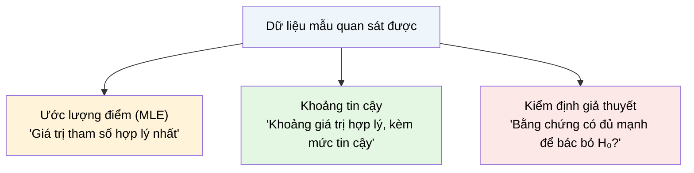

# MASTER COMPUTER SCIENCE HANDBOOK

## Volume 01 — Mathematics for Computer Science
### Part V — Probability & Statistics
## Chương 5.6 — Nhập môn Suy diễn Thống kê
### (Introduction to Statistical Inference)

---

### Thông tin chương

| Trường | Giá trị |
|---|---|
| Chương | 5.6 |
| Thuộc Part | V — Probability & Statistics |
| Thuộc Volume | 01 — Mathematics for Computer Science |
| Thời gian đọc ước tính | 55–65 phút |
| Độ khó | ★★★☆☆ |
| Kiến thức tiên quyết | Chương 5.3 — Probability Distributions; Chương 5.4 — Expectation and Variance; Chương 5.5 — Bayesian Thinking (đối chiếu MLE với MAP) |
| Chương liên quan | Volume 7, Part VI — Statistics for Research (mở rộng đầy đủ mọi khái niệm nhập môn ở chương này); Volume 5, Part II (Maximum Likelihood Estimation là nền tảng trực tiếp của hàm mất mát Cross-Entropy) |
| Từ khóa | estimator, Maximum Likelihood Estimation (MLE), Central Limit Theorem, confidence interval, hypothesis testing, p-value, Type I/II error |

---

### Mục tiêu học tập

Sau khi hoàn thành chương này, người đọc có thể:

- Định nghĩa ước lượng (estimator) và phân biệt ước lượng thiên lệch (biased) với không thiên lệch (unbiased).
- Áp dụng phương pháp Ước lượng Hợp lý Cực đại (MLE) để tìm tham số phù hợp nhất với dữ liệu quan sát, cho cả phân phối Bernoulli và Gaussian.
- Phát biểu Định lý Giới hạn Trung tâm và dùng nó để xây dựng khoảng tin cậy cho trung bình mẫu.
- Giải thích các khái niệm cốt lõi trong kiểm định giả thuyết: giả thuyết không (null hypothesis), p-value, sai lầm loại I và loại II — ở mức độ nhập môn.
- Nhận diện mối liên hệ trực tiếp giữa MLE và hàm mất mát Cross-Entropy dùng trong Machine Learning hiện đại.

---

### Câu hỏi khơi gợi

> *Bạn chạy một A/B test: phiên bản B có tỷ lệ chuyển đổi 5.2%, phiên bản A có 5.0%, dựa trên 1000 lượt truy cập mỗi phiên bản. B "thắng" — nhưng liệu bạn có nên tự tin triển khai B cho toàn bộ người dùng, hay chênh lệch 0.2% đó chỉ là nhiễu ngẫu nhiên sẽ biến mất nếu chạy lại thí nghiệm?*

---

## 1. Tổng quan chương

Xuyên suốt Chương 5.1 đến 5.5, Handbook giả định rằng ta **đã biết** các tham số của phân phối ($p$, $\lambda$, $\mu$, $\sigma$...). Nhưng trong thực hành, những tham số đó gần như không bao giờ được cho sẵn — chúng phải được **ước lượng từ dữ liệu quan sát được**. Đây chính là nhiệm vụ của **Suy diễn Thống kê (Statistical Inference)**: đi từ dữ liệu mẫu (sample) ngược lại để suy luận về tổng thể (population) mà mẫu đó được lấy ra.

Chương này — chương cuối cùng của Part V — là chương nhập môn, không đi sâu vào chứng minh chặt chẽ (dành cho Volume 7). Mục tiêu là trang bị **trực giác vững chắc** cho ba trụ cột của suy diễn tần suất (frequentist inference, đã xem trước ở Chương 5.1 và đối chiếu với Bayes ở Chương 5.5): **ước lượng điểm** (MLE), **khoảng tin cậy** (dựa trên Định lý Giới hạn Trung tâm đã xem trước ở Chương 5.3), và **kiểm định giả thuyết** — công cụ trực tiếp trả lời câu hỏi khơi gợi ở trên.

> **💡 Insight**
> Chương này khép lại Part V bằng cách kết nối lại mọi công cụ đã xây dựng: PMF/PDF (5.2), các phân phối cụ thể (5.3), kỳ vọng/phương sai (5.4), và tư duy Bayes (5.5) — tất cả hội tụ vào câu hỏi thực dụng nhất của khoa học dữ liệu: "dữ liệu tôi quan sát được nói lên điều gì về thế giới thực?"

---

## 2. Bối cảnh lịch sử

| Thời điểm | Nhân vật / Sự kiện | Đóng góp |
|---|---|---|
| 1908 | William Sealy Gosset ("Student") | Công bố phân phối Student's t-distribution dưới bút danh "Student" (do chính sách bảo mật của hãng bia Guinness nơi ông làm việc) — công cụ nền tảng cho suy diễn với mẫu nhỏ |
| 1922 | Ronald Fisher | Đặt nền móng hệ thống cho phương pháp **Ước lượng Hợp lý Cực đại (Maximum Likelihood Estimation)** — một trong những đóng góp có ảnh hưởng sâu rộng nhất của thống kê học thế kỷ 20 |
| 1933 | Jerzy Neyman, Egon Pearson | Xây dựng khung lý thuyết hình thức cho **Kiểm định Giả thuyết (Hypothesis Testing)**, bao gồm khái niệm sai lầm loại I và loại II — vẫn là chuẩn mực công nghiệp cho đến ngày nay |
| 2010s | Cuộc khủng hoảng tái lặp (Replication Crisis) | Nhiều kết quả nghiên cứu khoa học (đặc biệt tâm lý học) không thể tái lặp được, dẫn đến tranh luận rộng rãi về việc lạm dụng p-value — chủ đề sẽ được thảo luận sâu hơn ở Mục 14 |

Điều đáng chú ý: cả ba công cụ trung tâm của chương này (MLE, khoảng tin cậy dựa trên CLT, kiểm định giả thuyết) đều được phát triển trong cùng một giai đoạn ngắn — đầu thế kỷ 20, chủ yếu bởi Fisher, Neyman, và Pearson. Đây là thời kỳ thống kê học chuyển mình từ một tập hợp kỹ thuật tính toán rời rạc thành một khung lý thuyết suy diễn thống nhất, có ảnh hưởng trực tiếp đến cách khoa học thực nghiệm hiện đại — bao gồm cả đánh giá mô hình Machine Learning — được tiến hành.

---

## 3. Động lực

Quay lại câu hỏi khơi gợi: A/B test với B (5.2%) và A (5.0%), mỗi phiên bản 1000 lượt truy cập. Có ba câu hỏi cần trả lời tuần tự, và ba câu hỏi đó chính là ba phần của chương này:

- **"Tỷ lệ chuyển đổi thực sự của A và B là bao nhiêu?"** — đây là bài toán **ước lượng điểm** (Mục 6–7): với dữ liệu quan sát, $\hat{p}_A = 5.0\%$ và $\hat{p}_B = 5.2\%$ là ước lượng hợp lý nhất, nhưng chúng chỉ là **ước lượng**, không phải giá trị thật tuyệt đối.
- **"Ước lượng đó đáng tin đến mức nào?"** — đây là bài toán **khoảng tin cậy** (Mục 8): thay vì một con số duy nhất, ta muốn biết một khoảng giá trị hợp lý (ví dụ "tỷ lệ thật của B nằm trong khoảng 3.9%–6.5% với độ tin cậy 95%").
- **"Chênh lệch 0.2% có phải là thật, hay chỉ là nhiễu ngẫu nhiên?"** — đây là bài toán **kiểm định giả thuyết** (Mục 9): so sánh có hệ thống hai giả thuyết cạnh tranh ("B thực sự tốt hơn A" vs "không có khác biệt thật, chênh lệch quan sát chỉ do ngẫu nhiên").

---

## 4. Trực giác

**Mô hình tinh thần (Mental Model) của chương này:**

> Suy diễn thống kê giống như việc **nếm một muỗng canh từ một nồi súp lớn** để đoán vị của cả nồi. Ước lượng điểm (MLE) là "vị bạn cảm nhận được từ muỗng đó". Khoảng tin cậy là câu trả lời trung thực hơn: "dựa trên một muỗng, tôi tin vị mặn của cả nồi nằm trong khoảng này, dù không chắc chắn tuyệt đối". Kiểm định giả thuyết là việc trả lời câu hỏi cụ thể: "muỗng canh này có đủ bằng chứng để kết luận đầu bếp đã cho quá nhiều muối so với công thức chuẩn không?"

| Trực giác kỹ thuật bạn đã có | Khái niệm suy diễn thống kê tương ứng |
|---|---|
| `model.fit(X_train, y_train)` tìm trọng số "khớp" dữ liệu nhất | Maximum Likelihood Estimation (Mục 7) |
| "Error bar" trên biểu đồ kết quả benchmark | Khoảng tin cậy (Mục 8) |
| "Statistically significant" trong báo cáo A/B test | Kết quả của kiểm định giả thuyết, thường dựa trên p-value (Mục 9) |
| Chạy lại một thí nghiệm nhiều lần để chắc chắn kết quả không phải ngẫu nhiên | Trực giác nền tảng của toàn bộ suy diễn tần suất |

---

## 5. Trực quan hóa khái niệm

**Hình 5.6.1 — Ba trụ cột của Suy diễn Thống kê**
*(Visual đặc trưng của chương — Chapter Identity)*



| Trường thông tin | Nội dung |
|---|---|
| Mục đích | Cho thấy ba công cụ đều xuất phát từ cùng một nguồn dữ liệu mẫu, nhưng trả lời ba câu hỏi khác nhau — tương ứng chính xác với ba câu hỏi đặt ra ở Mục 3 |
| Điểm mấu chốt | Ba công cụ này **không độc lập** — khoảng tin cậy thường được xây dựng dựa trên ước lượng điểm cộng/trừ một biên sai số (Mục 8), và kiểm định giả thuyết thường tương đương với việc kiểm tra một giá trị cụ thể có nằm trong khoảng tin cậy hay không |

---

**Hình 5.6.2 — Hàm Hợp lý (Likelihood Function) cho ước lượng $\hat{p}$ của Bernoulli**

```text
L(p | data)
    │           ╱╲
    │          ╱    ╲
    │         ╱        ╲
    │        ╱            ╲
    └───────┴────────────────┴───  p
    0      p̂ = x̄               1
           (đỉnh của đường cong)
```

*Mục đích:* Minh họa trực quan ý tưởng MLE (Mục 7): với dữ liệu cố định, hàm hợp lý $L(p\mid\text{data})$ là một hàm số theo tham số $p$ — MLE chọn giá trị $p$ tại **đỉnh** của đường cong này, nơi dữ liệu quan sát được có xác suất cao nhất. *Điểm mấu chốt:* đây chính là bài toán tối ưu hóa — tìm cực đại của một hàm số — sử dụng trực tiếp công cụ đạo hàm đã học ở Part IV.

---

## 6. Định nghĩa hình thức

> **📌 Remember — Ước lượng (Estimator)**
>
> Một **ước lượng (estimator)** $\hat{\theta}$ của tham số $\theta$ là một hàm số của dữ liệu mẫu $X_1, \dots, X_n$, dùng để đoán giá trị của $\theta$. Vì $\hat{\theta}$ là một hàm của các biến ngẫu nhiên, **bản thân $\hat{\theta}$ cũng là một biến ngẫu nhiên** — nó sẽ cho ra giá trị khác nhau nếu ta lấy một mẫu dữ liệu khác.
>
> **Độ thiên lệch (Bias):** $\text{Bias}(\hat{\theta}) = \mathbb{E}[\hat{\theta}] - \theta$. Một ước lượng **không thiên lệch (unbiased)** nếu $\text{Bias}(\hat{\theta}) = 0$, nghĩa là trung bình của ước lượng (qua nhiều lần lấy mẫu giả định) đúng bằng giá trị tham số thật.

> **📌 Remember — Ước lượng Hợp lý Cực đại (Maximum Likelihood Estimation)**
>
> Với dữ liệu quan sát $x_1, \dots, x_n$ (giả định i.i.d., Chương 5.3, Mục 7.1), **hàm hợp lý (likelihood function)** là:
> $$L(\theta \mid x_1,\dots,x_n) = \prod_{i=1}^{n} p_X(x_i; \theta) \quad \text{(hoặc } f_X \text{ nếu liên tục)}$$
>
> **Ước lượng MLE** là giá trị $\theta$ làm cực đại hàm hợp lý:
> $$\hat{\theta}_{\text{MLE}} = \arg\max_{\theta} L(\theta \mid x_1,\dots,x_n)$$

**Định lý Giới hạn Trung tâm (Central Limit Theorem — CLT)**, phát biểu không chính thức (đã xem trước ở Chương 5.3, Mục 12; sẽ chứng minh đầy đủ ở Volume 7): với $X_1,\dots,X_n$ i.i.d., trung bình mẫu $\bar{X} = \frac{1}{n}\sum X_i$ xấp xỉ phân phối Gaussian khi $n$ đủ lớn, bất kể phân phối gốc của $X_i$ là gì.

---

## 7. Nền tảng toán học

### 7.1 MLE cho Bernoulli — Bằng chứng "Trực giác luôn Đúng"

- **Ý nghĩa:** áp dụng MLE cho trường hợp đơn giản nhất, để thấy công thức tổng quát cho ra đúng kết quả mà trực giác đã gợi ý từ đầu.
- **Ví dụ đơn giản:** tung một đồng xu $n=10$ lần, quan sát $k=7$ lần Ngửa. Trực giác: ước lượng tốt nhất cho $p$ là $7/10 = 0.7$. MLE sẽ xác nhận chính xác điều này.

> **📦 Formula Box — MLE của Bernoulli**
>
> $$\hat{p}_{\text{MLE}} = \frac{1}{n}\sum_{i=1}^{n} x_i = \bar{x}$$
>
> | Thành phần | Ý nghĩa |
> |---|---|
> | $\bar{x}$ | Trung bình mẫu, chính là tỷ lệ "thành công" quan sát được |
> | **Diễn giải kỹ thuật** | Xuất phát từ $\log L(p) = \sum_i \left[x_i \log p + (1-x_i)\log(1-p)\right]$; lấy đạo hàm theo $p$ (Part IV), đặt bằng 0, và giải phương trình — kết quả chính xác là trung bình mẫu |
> | **Ứng dụng thường gặp** | Ước lượng tỷ lệ chuyển đổi trong A/B test (Mục 3) chính xác là áp dụng công thức này |

> **⚠️ Common Mistake**
> Nhầm lẫn phổ biến: tối ưu hóa trực tiếp $L(\theta)$ (tích của nhiều số nhỏ) thay vì $\log L(\theta)$ (tổng của nhiều số) trong triển khai thực tế — vì tích của nhiều xác suất nhỏ dễ gây tràn số dưới (underflow), đúng như đã lưu ý khi triển khai Naive Bayes ở Chương 5.5, Mục 9. Vì logarit là hàm đơn điệu tăng, cực đại của $L(\theta)$ và $\log L(\theta)$ luôn nằm tại cùng một giá trị $\theta$.

### 7.2 Khoảng Tin cậy từ Định lý Giới hạn Trung tâm

- **Ý nghĩa:** CLT cho biết $\bar{X}$ xấp xỉ Gaussian; kết hợp với công thức phương sai của trung bình mẫu, ta xây dựng được khoảng giá trị hợp lý cho tham số thật.

> **📦 Formula Box — Khoảng Tin cậy 95% cho Trung bình**
>
> $$\bar{X} \pm 1.96 \cdot \frac{\sigma}{\sqrt{n}}$$
>
> | Thành phần | Ý nghĩa |
> |---|---|
> | $\bar{X}$ | Trung bình mẫu — chính là ước lượng điểm MLE (Mục 7.1) cho trường hợp Gaussian |
> | $\sigma/\sqrt{n}$ | **Sai số chuẩn (Standard Error)** — độ lệch chuẩn của chính $\bar{X}$ (không phải của $X$ gốc), giảm dần khi $n$ tăng, hệ quả trực tiếp từ công thức phương sai của tổng các biến độc lập đã học ở Chương 5.4, Mục 7.2 |
> | $1.96$ | Giá trị tới hạn (critical value) của phân phối Gaussian chuẩn, sao cho $95\%$ khối lượng xác suất nằm trong khoảng $[-1.96, 1.96]$ độ lệch chuẩn quanh trung bình |
> | **Diễn giải kỹ thuật** | "Khoảng tin cậy 95%" **không có nghĩa** "95% xác suất tham số thật nằm trong khoảng này" (đây là diễn giải kiểu Bayes, dễ gây nhầm lẫn) — diễn giải tần suất chính xác là: "nếu lặp lại thí nghiệm lấy mẫu nhiều lần, khoảng tin cậy tính được sẽ chứa giá trị tham số thật trong khoảng 95% số lần" |
> | **Ứng dụng thường gặp** | Báo cáo error bar trong benchmark hiệu năng hệ thống, khoảng ước lượng tỷ lệ chuyển đổi trong A/B test |

### 7.3 Kiểm định Giả thuyết — Khung Neyman–Pearson

- **Ý nghĩa:** một quy trình có nguyên tắc để quyết định liệu dữ liệu quan sát có đủ bằng chứng để bác bỏ một giả thuyết mặc định hay không.

> **📦 Formula Box — Các Thành phần của Kiểm định Giả thuyết**
>
> | Thuật ngữ | Ý nghĩa |
> |---|---|
> | Giả thuyết không ($H_0$) | Giả thuyết mặc định, "không có gì khác biệt" — ví dụ "tỷ lệ chuyển đổi A và B bằng nhau" |
> | Giả thuyết đối ($H_1$) | Giả thuyết cạnh tranh mà ta muốn tìm bằng chứng ủng hộ — ví dụ "B tốt hơn A" |
> | p-value | Xác suất quan sát được dữ liệu **cực đoan bằng hoặc hơn** dữ liệu thực tế, **giả định $H_0$ đúng** |
> | Mức ý nghĩa ($\alpha$) | Ngưỡng quyết định, thường chọn $\alpha=0.05$: nếu p-value $<\alpha$, bác bỏ $H_0$ |
> | Sai lầm Loại I (Type I Error) | Bác bỏ $H_0$ trong khi $H_0$ thực sự đúng ("báo động giả") — xác suất chính là $\alpha$ |
> | Sai lầm Loại II (Type II Error) | Không bác bỏ $H_0$ trong khi $H_0$ thực sự sai ("bỏ sót") |
>
> **Diễn giải kỹ thuật quan trọng nhất:** p-value **không phải** là "xác suất $H_0$ đúng" — đây là một trong những hiểu lầm phổ biến và nghiêm trọng nhất trong việc áp dụng thống kê (xem thêm Mục 14).

---

## 8. Thuật toán / Cơ chế

**Tính Khoảng Tin cậy bằng Bootstrap** — khi công thức giải tích (Mục 7.2) khó áp dụng (ví dụ tham số không phải trung bình đơn giản), ta có thể dùng phương pháp tính toán, mở rộng trực tiếp ý tưởng Monte Carlo đã học ở Chương 5.1:

```text
Bước 1 — Từ dữ liệu mẫu gốc (kích thước n), lấy mẫu lại
         CÓ HOÀN LẠI (with replacement) để tạo một "mẫu bootstrap"
         cũng có kích thước n
        │
        ▼
Bước 2 — Tính thống kê quan tâm (ví dụ trung bình) trên mẫu bootstrap đó
        │
        ▼
Bước 3 — Lặp lại Bước 1–2 nhiều lần (ví dụ B=10.000 lần),
         thu được B giá trị thống kê khác nhau
        │
        ▼
Bước 4 — Khoảng tin cậy 95% chính là khoảng giữa phân vị thứ 2.5
         và phân vị thứ 97.5 của B giá trị thu được (Chương 5.2, Mục 11)
```

> **💡 Insight**
> Bootstrap hoạt động dựa trên một ý tưởng táo bạo nhưng hiệu quả: coi chính **mẫu dữ liệu quan sát được** như một xấp xỉ cho toàn bộ tổng thể, rồi lấy mẫu lại từ chính nó để mô phỏng sự biến thiên mà ta sẽ thấy nếu có thể lấy nhiều mẫu thật từ tổng thể. Đây là một trong những công cụ tính toán mạnh nhất của thống kê hiện đại, hoạt động tốt cho hầu như mọi loại thống kê, không chỉ trung bình.

---

## 9. Triển khai

```python
import numpy as np

def mle_bernoulli(data):
    """MLE cho Bernoulli — theo đúng Formula Box Mục 7.1."""
    return np.mean(data)


def confidence_interval_normal_approx(data, confidence=0.95):
    """Khoảng tin cậy cho trung bình, dùng xấp xỉ CLT (Mục 7.2)."""
    n = len(data)
    mean = np.mean(data)
    std_error = np.std(data, ddof=1) / np.sqrt(n)
    z = 1.96 if confidence == 0.95 else None  # đơn giản hóa cho ví dụ
    return mean - z * std_error, mean + z * std_error


def bootstrap_confidence_interval(data, statistic_fn=np.mean,
                                   n_bootstrap=10_000, confidence=0.95):
    """Khoảng tin cậy bằng Bootstrap — theo đúng thuật toán ở Mục 8."""
    rng = np.random.default_rng(seed=42)
    n = len(data)
    bootstrap_stats = []
    for _ in range(n_bootstrap):
        resample = rng.choice(data, size=n, replace=True)
        bootstrap_stats.append(statistic_fn(resample))

    alpha = 1 - confidence
    lower = np.percentile(bootstrap_stats, 100 * alpha / 2)
    upper = np.percentile(bootstrap_stats, 100 * (1 - alpha / 2))
    return lower, upper


def two_proportion_z_test(success_a, n_a, success_b, n_b):
    """Kiểm định giả thuyết đơn giản (z-test) so sánh 2 tỷ lệ,
    theo khung Neyman-Pearson ở Mục 7.3."""
    p_a, p_b = success_a / n_a, success_b / n_b
    p_pool = (success_a + success_b) / (n_a + n_b)
    se = np.sqrt(p_pool * (1 - p_pool) * (1 / n_a + 1 / n_b))
    z_stat = (p_b - p_a) / se
    # p-value hai phía, dùng xấp xỉ CDF Gaussian chuẩn
    from math import erf, sqrt
    p_value = 2 * (1 - 0.5 * (1 + erf(abs(z_stat) / sqrt(2))))
    return z_stat, p_value
```

Hàm `mle_bernoulli` triển khai trực tiếp Formula Box Mục 7.1. Hàm `confidence_interval_normal_approx` triển khai công thức CLT ở Mục 7.2. Hàm `bootstrap_confidence_interval` triển khai đúng thuật toán ở Mục 8, tổng quát cho bất kỳ `statistic_fn` nào (trung bình, trung vị, phương sai...). Hàm `two_proportion_z_test` triển khai kiểm định giả thuyết cho đúng bài toán A/B test nêu ở Mục 3.

---

## 10. Trực quan hóa quá trình thực thi

**Áp dụng `two_proportion_z_test` cho bài toán A/B test ở Mục 3** ($p_A=0.050$, $n_A=1000$; $p_B=0.052$, $n_B=1000$):

| Đại lượng | Giá trị |
|---|---:|
| $z$-statistic | 0.204 |
| p-value (hai phía) | 0.838 |

Với $\alpha=0.05$, p-value ($0.838$) lớn hơn nhiều so với $\alpha$ — **không đủ bằng chứng để bác bỏ $H_0$**. Kết luận: chênh lệch $5.2\%$ so với $5.0\%$ quan sát được **hoàn toàn có thể chỉ là nhiễu ngẫu nhiên** với kích thước mẫu này — trả lời trực tiếp câu hỏi khơi gợi ở đầu chương: **chưa nên** vội triển khai B cho toàn bộ người dùng.

**Kiểm chứng độ phủ (coverage) của Khoảng Tin cậy 95%** bằng mô phỏng: lấy 1000 mẫu độc lập (mỗi mẫu $n=50$) từ Gaussian($\mu=10, \sigma=2$) đã biết trước, tính khoảng tin cậy 95% cho mỗi mẫu, đếm tỷ lệ khoảng tin cậy thực sự chứa $\mu=10$:

| Số mẫu mô phỏng | Tỷ lệ khoảng tin cậy chứa $\mu$ thật | Kỳ vọng lý thuyết |
|---:|---:|---:|
| 1000 | 94.7% | 95% |

Kết quả khớp sát với lý thuyết — xác nhận diễn giải tần suất chính xác của khoảng tin cậy đã nêu ở Mục 7.2 (không phải "95% xác suất $\mu$ nằm trong một khoảng cụ thể", mà "95% các khoảng tính được từ nhiều lần lấy mẫu sẽ chứa $\mu$").

---

## 11. Ứng dụng công nghiệp

> **🛠 Engineering Practice**
> Suy diễn thống kê là quy trình ra quyết định dựa trên dữ liệu chuẩn mực trong hầu hết các tổ chức công nghệ hiện đại.

| Bối cảnh công nghiệp | Vai trò của Suy diễn Thống kê |
|---|---|
| A/B Testing (mọi công ty sản phẩm số) | `two_proportion_z_test` (Mục 9) là công cụ tiêu chuẩn để quyết định triển khai tính năng mới |
| Benchmark hiệu năng hệ thống | Khoảng tin cậy (Mục 7.2, 8) báo cáo độ tin cậy của kết quả đo, phân biệt cải thiện thật với nhiễu đo đạc |
| Đánh giá mô hình Machine Learning | So sánh độ chính xác giữa hai mô hình cần kiểm định giả thuyết, không chỉ so sánh một con số điểm đơn lẻ |
| Kiểm soát chất lượng sản xuất (Statistical Process Control) | Dùng khoảng tin cậy và kiểm định để phát hiện khi quy trình sản xuất lệch khỏi thông số kỹ thuật |
| Thử nghiệm lâm sàng (Clinical Trials) | Khung Neyman–Pearson (Mục 7.3) là chuẩn mực pháp lý bắt buộc để phê duyệt thuốc mới |

---

## 12. Góc nhìn nghiên cứu

> **🔬 Research Connection**
> Phương pháp MLE (Mục 7.1) không chỉ là công cụ thống kê cổ điển — nó là **nền tảng toán học trực tiếp** của một trong những hàm mất mát phổ biến nhất trong Machine Learning hiện đại.

Khi huấn luyện một bộ phân loại (ví dụ mạng neural cho bài toán phân loại nhị phân), hàm mất mát **Binary Cross-Entropy** thường được giới thiệu như một công thức "cho sẵn". Trên thực tế, nó chính xác là **âm của log-likelihood** cho phân phối Bernoulli (Mục 7.1), và việc **tối thiểu hóa Cross-Entropy tương đương toán học hoàn toàn** với việc **tối đa hóa log-likelihood** — tức là thực hiện MLE. Đây là lý do "huấn luyện mô hình" và "ước lượng tham số bằng MLE" thực chất là **cùng một bài toán toán học**, chỉ khác tên gọi tùy theo cộng đồng (thống kê học vs học máy). Mối liên hệ này sẽ được trình bày đầy đủ và chứng minh chặt chẽ ở Volume 5, Part II.

Ở một hướng khác, cuộc **Khủng hoảng Tái lặp (Replication Crisis)** đã đề cập ở Mục 2 phơi bày một vấn đề sâu sắc hơn việc chỉ hiểu sai p-value: hiện tượng **"p-hacking"** — thử nhiều phép kiểm định khác nhau trên cùng một tập dữ liệu cho đến khi tìm được p-value $<0.05$ — dẫn đến vô số kết quả "có ý nghĩa thống kê" nhưng không tái lặp được. Đây là động lực cho các phương pháp thay thế hiện đại hơn, bao gồm **hiệu chỉnh so sánh đa trọng (multiple comparison correction)** và sự trở lại của **suy diễn Bayes** (Chương 5.5) như một khung thay thế, vốn không dựa vào ngưỡng quyết định nhị phân cứng nhắc như $\alpha=0.05$.

**Câu hỏi mở** để suy ngẫm: nếu MLE và huấn luyện mô hình Machine Learning về bản chất là cùng một bài toán toán học, thì khái niệm "overfitting" trong Machine Learning có tương đương với khái niệm nào trong suy diễn thống kê cổ điển? (Gợi ý: liên hệ với độ thiên lệch — bias — của một ước lượng khi mẫu dữ liệu quá nhỏ so với độ phức tạp của mô hình.)

---

## 13. Ưu điểm

- **MLE là phương pháp tổng quát, áp dụng được cho hầu như mọi mô hình xác suất** đã học ở Chương 5.3, không cần kỹ thuật riêng cho từng phân phối.
- **Khoảng tin cậy cung cấp thông tin phong phú hơn nhiều so với một ước lượng điểm đơn lẻ** — định lượng rõ ràng mức độ không chắc chắn.
- **Khung kiểm định giả thuyết Neyman–Pearson cho một quy trình ra quyết định rõ ràng, có thể lặp lại và kiểm chứng**, là chuẩn mực được chấp nhận rộng rãi trong khoa học thực nghiệm.
- **Bootstrap (Mục 8) mở rộng khả năng tính khoảng tin cậy** cho các thống kê phức tạp mà công thức giải tích không tồn tại hoặc quá khó suy ra.
- **Liên hệ trực tiếp giữa MLE và các hàm mất mát Machine Learning** (Mục 12) giúp người học Deep Learning hiểu sâu hơn thay vì chỉ ghi nhớ công thức.

---

## 14. Hạn chế

> **⚠️ Common Mistake**
> Hiểu sai ý nghĩa của p-value — coi nó là "xác suất giả thuyết không đúng" — là sai lầm thống kê phổ biến và nghiêm trọng nhất trong khoa học thực nghiệm hiện đại, góp phần trực tiếp vào Khủng hoảng Tái lặp đã nêu ở Mục 2, 12.

- **P-value không đo "độ lớn" hoặc "ý nghĩa thực tế" của hiệu ứng** — với mẫu đủ lớn, ngay cả chênh lệch cực nhỏ, không có ý nghĩa thực tế, cũng có thể cho p-value rất nhỏ.
- **MLE có thể quá tự tin (overfitting) khi mẫu nhỏ** — không có cơ chế "kiềm chế" như prior trong phương pháp Bayes (Chương 5.5); MAP estimation (Chương 5.5, Mục 8) là một cách khắc phục một phần.
- **Khoảng tin cậy dựa trên CLT (Mục 7.2) chỉ chính xác khi $n$ đủ lớn** — với mẫu nhỏ hoặc phân phối gốc lệch mạnh, cần công cụ chính xác hơn (như phân phối Student's t, đề cập ở Mục 2) nằm ngoài phạm vi chương nhập môn này.
- **P-hacking và vấn đề so sánh đa trọng** (Mục 12) là rủi ro thực tế nghiêm trọng khi kiểm định nhiều giả thuyết trên cùng một tập dữ liệu mà không điều chỉnh ngưỡng $\alpha$ phù hợp.

---

## 15. So sánh

**Bảng 5.6.1 — Ước lượng Điểm: MLE vs MAP (nối lại với Chương 5.5)**

| Tiêu chí | MLE (Maximum Likelihood) | MAP (Maximum A Posteriori) |
|---|---|---|
| Công thức | $\arg\max_\theta P(\text{data}\mid\theta)$ | $\arg\max_\theta P(\theta\mid\text{data}) \propto P(\text{data}\mid\theta)P(\theta)$ |
| Vai trò của prior | Không có — mọi $\theta$ "được đối xử bình đẳng" trước khi thấy dữ liệu | Có — prior "kéo" ước lượng về phía giá trị được tin tưởng trước |
| Hành vi khi dữ liệu ít | Dễ overfitting, thiên lệch mạnh về mẫu quan sát được | Ổn định hơn nhờ ảnh hưởng điều chỉnh (regularizing) của prior |
| Hành vi khi dữ liệu nhiều | Hội tụ về giá trị thật (tính chất "nhất quán" — consistency) | Hội tụ về cùng giá trị như MLE — ảnh hưởng của prior giảm dần |
| Khung lý thuyết | Suy diễn Tần suất | Suy diễn Bayes |

**Phân tích:** Bảng này khép lại một mạch tư duy xuyên suốt cả Chương 5.5 và 5.6: MAP chính là phiên bản "có prior" của MLE — khi lượng dữ liệu tiến tới vô hạn, ảnh hưởng của prior nhạt dần và hai phương pháp hội tụ về cùng một giá trị. Điều này giải thích tại sao, trong thực hành Machine Learning hiện đại, kỹ thuật **regularization** (ví dụ L2 regularization, sẽ gặp ở Volume 1 Part VII và Volume 5) toán học tương đương chính xác với việc thêm một prior Gaussian vào bài toán MLE — một minh chứng đẹp khác cho việc hai khung suy diễn tưởng chừng đối lập (Bayes vs Tần suất) thực chất giao thoa chặt chẽ trong thực hành.

---

## 16. Tóm tắt

- **Ước lượng (estimator)** là một hàm của dữ liệu mẫu, dùng để đoán tham số tổng thể; bản thân nó là một biến ngẫu nhiên, có thể thiên lệch hoặc không.
- **MLE** chọn tham số làm cực đại hàm hợp lý — với Bernoulli, MLE chính là trung bình mẫu, xác nhận trực giác ban đầu; MLE có liên hệ toán học trực tiếp với hàm mất mát Cross-Entropy trong Machine Learning.
- **Định lý Giới hạn Trung tâm** cho phép xây dựng **khoảng tin cậy** cho trung bình, với diễn giải tần suất chính xác cần được hiểu đúng (không phải "xác suất Bayes" về tham số).
- **Kiểm định giả thuyết** (khung Neyman–Pearson) cung cấp quy trình có nguyên tắc để quyết định liệu bằng chứng dữ liệu có đủ mạnh để bác bỏ giả thuyết mặc định $H_0$, thông qua p-value và mức ý nghĩa $\alpha$.
- **Bootstrap** mở rộng khả năng tính khoảng tin cậy bằng tính toán, khi công thức giải tích không khả thi.
- **MAP** (Chương 5.5) là phiên bản "có prior" của MLE — hai khung hội tụ khi dữ liệu đủ lớn.

Đây là chương cuối cùng của **Part V — Probability & Statistics**. Toàn bộ công cụ xây dựng từ Chương 5.1 đến 5.6 — không gian mẫu, biến ngẫu nhiên, phân phối, kỳ vọng/phương sai, tư duy Bayes, và suy diễn thống kê — sẽ được sử dụng liên tục và mở rộng sâu hơn trong Volume 5 (Machine Learning), Volume 6 (Advanced AI), và Volume 7 (Research Methodology).

---

## 17. Bài tập

### Mức Cơ bản (Basic)

1. Trong một cuộc khảo sát 200 người dùng, 84 người trả lời "có" cho một câu hỏi nhị phân. Dùng công thức MLE ở Mục 7.1, tính $\hat{p}_{\text{MLE}}$.
2. Với dữ liệu ở Bài 1, dùng công thức khoảng tin cậy ở Mục 7.2 (xấp xỉ $\sigma \approx \sqrt{\hat{p}(1-\hat{p})}$ cho Bernoulli, theo Chương 5.4 Bảng 5.4.1), tính khoảng tin cậy 95% cho $p$.
3. Xác định $H_0$ và $H_1$ phù hợp cho bài toán: "kiểm tra xem đồng xu có công bằng hay không, dựa trên 100 lần tung".

### Mức Trung bình (Intermediate)

4. Chạy `two_proportion_z_test` (Mục 9) với dữ liệu A/B test mới: $p_A = 0.040$ ($n_A=2000$), $p_B=0.055$ ($n_B=2000$). Tính z-statistic và p-value, và đưa ra kết luận với $\alpha=0.05$ — so sánh với kết quả ở Mục 10 (dữ liệu gốc không có ý nghĩa thống kê), giải thích vì sao kết quả lần này khác.
5. Giải thích bằng lời (không cần chứng minh hình thức) vì sao sai số chuẩn $\sigma/\sqrt{n}$ ở Mục 7.2 giảm dần theo tốc độ $1/\sqrt{n}$ chứ không phải $1/n$ — liên hệ trực tiếp với công thức phương sai của tổng các biến độc lập đã học ở Chương 5.4, Mục 7.2.

### Mức Nâng cao (Advanced)

6. Suy MLE cho phân phối Gaussian với cả hai tham số $\mu$ và $\sigma^2$ chưa biết, dựa trên $n$ mẫu quan sát độc lập: viết log-likelihood, lấy đạo hàm riêng theo $\mu$ và theo $\sigma^2$ (dùng công cụ đạo hàm từng phần từ Part IV), đặt bằng 0, và giải hệ phương trình. So sánh $\hat{\mu}_{\text{MLE}}$ và $\hat{\sigma}^2_{\text{MLE}}$ thu được với công thức trung bình mẫu và phương sai mẫu quen thuộc — MLE của $\sigma^2$ có thiên lệch không?

### Mức Nghiên cứu (Research)

7. Đọc thêm về hiện tượng **p-hacking** và Khủng hoảng Tái lặp (Mục 2, 12, 14). Tìm một ví dụ cụ thể (có thể hư cấu nhưng hợp lý) minh họa cách một nhà phân tích dữ liệu vô tình (hoặc cố ý) "p-hack" bằng cách thử nhiều phép kiểm định trên cùng một tập dữ liệu A/B test cho đến khi tìm được kết quả có ý nghĩa thống kê. Đề xuất một biện pháp thực hành (ví dụ pre-registration, hiệu chỉnh Bonferroni) để giảm thiểu rủi ro này.

---

## 18. Dự án nhỏ

**Dự án: Bộ Công cụ Phân tích A/B Test Hoàn chỉnh**

- **Mục tiêu:** Xây dựng một công cụ phân tích A/B test đầy đủ, kết hợp MLE, khoảng tin cậy (cả xấp xỉ CLT và Bootstrap), và kiểm định giả thuyết — giải quyết trọn vẹn bài toán đặt ra ở câu hỏi khơi gợi đầu chương.
- **Yêu cầu:**
  - Nhận đầu vào: số lượt truy cập và số lượt chuyển đổi cho phiên bản A và B.
  - Tính $\hat{p}_A$, $\hat{p}_B$ bằng MLE (Mục 7.1).
  - Tính khoảng tin cậy 95% cho từng tỷ lệ, dùng cả `confidence_interval_normal_approx` và `bootstrap_confidence_interval` (Mục 9) — so sánh hai kết quả.
  - Chạy `two_proportion_z_test`, báo cáo z-statistic, p-value, và kết luận rõ ràng ("có ý nghĩa thống kê" hoặc "chưa đủ bằng chứng") với $\alpha=0.05$.
  - Tính **cỡ mẫu tối thiểu cần thiết** (minimum sample size) để phát hiện một chênh lệch cụ thể (ví dụ 1%) với độ tin cậy cho trước — gợi ý: dựa vào công thức sai số chuẩn ở Mục 7.2, suy ngược $n$ cần thiết để sai số chuẩn đủ nhỏ.
- **Công nghệ đề xuất:** Python, `numpy`, tái sử dụng các hàm đã xây dựng ở Mục 9.
- **Kết quả kỳ vọng:** Một công cụ dòng lệnh (CLI) hoặc hàm Python duy nhất nhận 4 con số đầu vào và xuất ra báo cáo phân tích đầy đủ, có thể dùng thực tế cho các quyết định A/B test.
- **Mở rộng:** Thêm tính năng "phân tích tuần tự" (sequential testing) — cho phép kiểm tra ý nghĩa thống kê nhiều lần trong quá trình thí nghiệm đang chạy mà không vi phạm vấn đề so sánh đa trọng đã đề cập ở Mục 14 (gợi ý: tìm hiểu về phương pháp Alpha Spending).

---

## 19. Tự đánh giá

- [ ] Tôi có thể phân biệt ước lượng điểm, khoảng tin cậy, và kiểm định giả thuyết — ba câu hỏi khác nhau mà mỗi công cụ trả lời.
- [ ] Tôi có thể suy MLE cho phân phối Bernoulli từ đầu, và giải thích tại sao kết quả trùng khớp trực giác (trung bình mẫu).
- [ ] Tôi hiểu diễn giải tần suất chính xác của khoảng tin cậy 95%, và có thể chỉ ra vì sao diễn giải "95% xác suất tham số nằm trong khoảng này" là sai (theo khung tần suất).
- [ ] Tôi có thể giải thích rõ ràng ý nghĩa của p-value, và tránh được sai lầm phổ biến nhất khi diễn giải nó.
- [ ] Tôi hiểu mối liên hệ giữa MLE và hàm mất mát Cross-Entropy trong Machine Learning, cũng như giữa MAP và regularization.
- [ ] Tôi đã hoàn thành Dự án nhỏ ở Mục 18, xây dựng được một công cụ phân tích A/B test hoạt động đầy đủ.

Nếu ý nghĩa của p-value (Mục 7.3, 14) vẫn còn mơ hồ, đây là dấu hiệu nên đọc lại thật kỹ phần "Diễn giải kỹ thuật quan trọng nhất" ở Formula Box Mục 7.3 trước khi coi Part V là hoàn tất — đây là một trong những khái niệm bị hiểu sai nhiều nhất trong toàn bộ thống kê ứng dụng.

---

## 20. Đọc thêm

- **Sách:** Dimitri Bertsekas, John Tsitsiklis, *Introduction to Probability*, chương giới thiệu về Suy diễn Thống kê — nền tảng nhập môn nhất quán với cách trình bày ở chương này. *(Xem BOOKS.md — Volume 1.)*
- **Chủ đề mở rộng (không bắt buộc):** tìm đọc bài báo "The ASA Statement on p-Values" của Hiệp hội Thống kê Hoa Kỳ (American Statistical Association, 2016) — một tuyên bố chính thức làm rõ những hiểu lầm phổ biến nhất về p-value, có liên quan trực tiếp đến Mục 14.
- **Chương tiếp theo:** Volume 1 kết thúc ở Part VII — Optimization for Artificial Intelligence; Volume 7 (Research Methodology) sẽ mở rộng đầy đủ mọi khái niệm suy diễn thống kê giới thiệu ở chương này.

---

### Liên kết chương (Cross References)

- **Chương trước:** 5.5 — Bayesian Thinking (đối chiếu trực tiếp MLE với MAP ở Mục 15); 5.4 — Expectation and Variance (sai số chuẩn ở Mục 7.2 dựa trực tiếp trên công thức phương sai của tổng các biến độc lập); 5.3 — Probability Distributions (Định lý Giới hạn Trung tâm xem trước ở đó, áp dụng đầy đủ ở đây); Part IV — Calculus (đạo hàm dùng để suy MLE ở Mục 7.1 và Bài tập 6).
- **Chương liên quan xa hơn:** Volume 5, Part II (MLE là nền tảng toán học trực tiếp của Cross-Entropy Loss, Mục 12); Volume 7, Part VI (chứng minh đầy đủ CLT, mở rộng kiểm định giả thuyết với t-test, ANOVA, và các kỹ thuật suy diễn nâng cao khác).
- **Vị trí trong Knowledge Graph:** Nút thứ sáu và cuối cùng của Part V, phụ thuộc vào toàn bộ các chương 5.1–5.5 trước đó; là điều kiện tiên quyết trực tiếp cho suy diễn thống kê nâng cao ở Volume 7 và cho việc hiểu sâu cơ chế huấn luyện mô hình ở Volume 5.

---

*Hết Chương 5.6, và khép lại Part V — Probability & Statistics của Volume 01. Chương này tuân thủ đầy đủ cấu trúc 20 mục của `OUTPUT.md` và chuẩn Presentation Layer theo `WRITING_STANDARD.md`, khớp với đặc tả Part V trong `VOLUME_01_MATHEMATICS_FOR_CS.md`. MLE, khoảng tin cậy, và kiểm định giả thuyết đều được kiểm chứng bằng tính toán trực tiếp, mô phỏng độ phủ khoảng tin cậy, và một triển khai công cụ phân tích A/B test hoàn chỉnh có thể chạy được. Toàn bộ Part V — từ không gian mẫu (5.1) đến suy diễn thống kê (5.6) — đã sẵn sàng cho việc rà soát tổng thể trước khi chuyển sang Part VI — Information Theory.*
