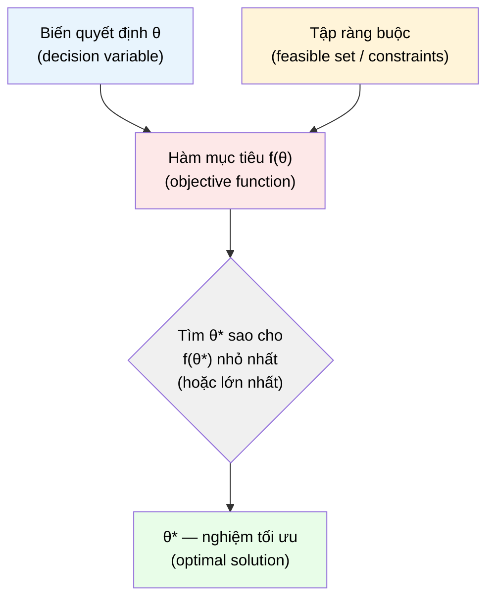

# MASTER COMPUTER SCIENCE HANDBOOK

## Volume 01 — Mathematics for Computer Science
### Part VII — Optimization for Artificial Intelligence
## Chương 7.1 — Bài toán Tối ưu
### (Optimization Problems)

---

### Thông tin chương

| Trường | Giá trị |
|---|---|
| Chương | 7.1 |
| Thuộc Part | VII — Optimization for Artificial Intelligence |
| Thuộc Volume | 01 — Mathematics for Computer Science |
| Thời gian đọc ước tính | 35–45 phút |
| Độ khó | ★★★☆☆ |
| Kiến thức tiên quyết | Part IV — Calculus (đạo hàm, đạo hàm riêng, gradient); Part III — Linear Algebra (vector, chuẩn vector) |
| Chương liên quan | 7.2 — Convexity (phân loại độ khó của bài toán tối ưu vừa định nghĩa ở chương này); 7.3 — Gradient Descent (thuật toán giải bài toán tối ưu không ràng buộc); Volume 5, Part II — Machine Learning (hàm Loss chính là objective function) |
| Từ khóa | optimization problem, objective function, feasible set, constraint, local minimum, global minimum, loss landscape |

---

### Mục tiêu học tập

Sau khi hoàn thành chương này, người đọc có thể:

- Định nghĩa hình thức một bài toán tối ưu bằng ba thành phần: biến quyết định (decision variable), hàm mục tiêu (objective function), và tập ràng buộc (feasible set).
- Phân biệt bài toán tối ưu **có ràng buộc (constrained)** và **không ràng buộc (unconstrained)**, và nhận diện dạng nào xuất hiện phổ biến trong Machine Learning.
- Phân biệt **cực tiểu địa phương (local minimum)** và **cực tiểu toàn cục (global minimum)** bằng định nghĩa hình thức, không chỉ bằng hình vẽ.
- Giải thích vì sao phần lớn bài toán tối ưu trong Deep Learning không có nghiệm dạng đóng (closed-form solution), và vì sao điều đó buộc ta phải dùng thuật toán lặp.
- Đọc và diễn giải được một "loss landscape" (địa hình hàm mất mát) như một bài toán tối ưu cụ thể.

---

### Câu hỏi khơi gợi

> *Khi bạn gọi `model.fit(X, y)` trong scikit-learn hoặc chạy vòng lặp huấn luyện (training loop) trong PyTorch, điều gì thực sự đang xảy ra bên trong? Máy tính không hề "thử" hàng tỷ tỷ bộ tham số khả dĩ — vậy nó tìm ra bộ tham số tốt bằng cách nào? Câu trả lời bắt đầu từ một điều đơn giản: trước khi giải một bài toán, ta phải phát biểu chính xác bài toán đó là gì.*

---

## 1. Tổng quan chương

Bốn Part đầu tiên của Volume 01 — Mathematical Thinking, Discrete Mathematics, Linear Algebra, Calculus — đã trang bị cho bạn ngôn ngữ để mô tả cấu trúc (tập hợp, hàm số, vector, ma trận) và sự thay đổi (đạo hàm, gradient). Part VII là nơi những công cụ đó được **triệu tập lại** để giải quyết một câu hỏi duy nhất, nhưng cực kỳ quan trọng: *"Trong một không gian có vô số lựa chọn, làm sao tìm được lựa chọn tốt nhất — mà không cần thử hết tất cả?"*

Đây chính là bài toán **Tối ưu (Optimization)**. Chương 7.1 không giới thiệu bất kỳ thuật toán nào để *giải* bài toán tối ưu — đó là công việc của các Chương 7.3 đến 7.6. Nhiệm vụ duy nhất của chương này là xây dựng **ngôn ngữ chính xác** để *phát biểu* một bài toán tối ưu, và xây dựng trực giác vì sao bài toán này, trong bối cảnh Artificial Intelligence, lại khó đến mức không thể giải bằng công thức đại số thông thường.

> **💡 Insight**
> Đây là chương duy nhất trong Volume 01 không giới thiệu một công cụ tính toán mới. Thay vào đó, nó dạy bạn cách **đặt câu hỏi đúng** — một kỹ năng thường bị đánh giá thấp nhưng lại là bước quan trọng nhất trước khi viết bất kỳ dòng code Machine Learning nào.

---

## 2. Bối cảnh lịch sử

Tư duy tối ưu hóa xuất hiện rất sớm trong lịch sử toán học, nhưng chỉ trở thành một ngành độc lập, có công cụ tính toán hệ thống, từ thế kỷ 17 trở đi.

| Thời điểm | Nhân vật / Sự kiện | Đóng góp |
|---|---|---|
| Thế kỷ 17 | Isaac Newton, Gottfried Leibniz | Phát triển Calculus (Part IV) — công cụ toán học đầu tiên cho phép tìm điểm mà tại đó một hàm số "không còn thay đổi" (đạo hàm bằng 0), tức là ứng viên cực trị |
| 1788 | Joseph-Louis Lagrange | Công bố *Mécanique analytique*, đặt nền móng cho **Phương pháp nhân tử Lagrange (Lagrange Multipliers)** — kỹ thuật xử lý bài toán tối ưu **có ràng buộc**, tổng quát hóa xa hơn việc chỉ cho đạo hàm bằng 0 |
| 1847 | Augustin-Louis Cauchy | Đề xuất phương pháp lặp dựa trên gradient để giải hệ phương trình — tiền thân toán học trực tiếp của thuật toán **Gradient Descent** sẽ học ở Chương 7.3 |
| 1951 | Harold Kuhn, Albert Tucker | Tổng quát hóa điều kiện Lagrange thành **điều kiện KKT (Karush–Kuhn–Tucker)** — công cụ chuẩn cho tối ưu có ràng buộc bất đẳng thức trong toán học hiện đại |

> **🔬 Research Connection**
> Điều đáng chú ý: ý tưởng cốt lõi của Gradient Descent — thuật toán tối ưu quan trọng nhất trong Deep Learning hiện đại — đã tồn tại từ **năm 1847**, gần 170 năm trước khi mạng neural hiện đại ra đời. Đây là một ví dụ điển hình cho thấy AI không phát minh ra toán học mới, mà tái sử dụng và mở rộng những công cụ toán học đã có sẵn ở quy mô chưa từng có.

---

## 3. Động lực

Hãy xét ba tình huống kỹ thuật quen thuộc — cả ba đều là bài toán tối ưu, dù không phải lúc nào ta cũng gọi tên chúng như vậy:

- **Huấn luyện mô hình hồi quy tuyến tính:** tìm hệ số góc và hệ số chặn sao cho đường thẳng "khớp" với dữ liệu tốt nhất — tức là tìm bộ tham số làm **tối thiểu hóa** tổng bình phương sai số.
- **Định tuyến giao hàng (route optimization):** tìm thứ tự ghé thăm các điểm giao hàng sao cho tổng quãng đường di chuyển là **nhỏ nhất**, với ràng buộc mỗi điểm chỉ được ghé một lần.
- **Cấu hình tài nguyên cloud:** chọn số lượng máy chủ sao cho chi phí vận hành **nhỏ nhất**, với ràng buộc phải đáp ứng được lưu lượng truy cập tối thiểu.

Ba bài toán này thuộc ba lĩnh vực hoàn toàn khác nhau — Machine Learning, thuật toán đồ thị, kỹ thuật hệ thống — nhưng đều có chung một cấu trúc: **có một đại lượng cần làm tốt nhất, và có những điều kiện phải tuân thủ**. Việc nhận ra cấu trúc chung này chính là giá trị cốt lõi của chương này: một khi đã biết "ngữ pháp" chung của bài toán tối ưu, bạn có thể áp dụng cùng một bộ công cụ toán học (Chương 7.2–7.6) cho vô số bài toán kỹ thuật khác nhau, thay vì học lại từ đầu mỗi lần.

---

## 4. Trực giác

**Mô hình tinh thần (Mental Model) của chương này:**

> Một bài toán tối ưu giống như việc bạn đứng ở một vị trí bất kỳ trên một **địa hình đồi núi (landscape)**, và mục tiêu là tìm điểm **thấp nhất** (hoặc cao nhất) của địa hình đó. "Địa hình" ở đây chính là đồ thị của hàm mục tiêu; vị trí của bạn trên bản đồ chính là giá trị của các biến quyết định; và độ cao tại mỗi điểm chính là giá trị hàm mục tiêu tại điểm đó.

| Trực giác đời thường | Khái niệm tối ưu hóa tương ứng |
|---|---|
| Vị trí (kinh độ, vĩ độ) trên bản đồ | Biến quyết định (decision variable) $\theta$ |
| Độ cao tại một vị trí | Giá trị hàm mục tiêu $f(\theta)$ |
| Khu vực bạn được phép đi lại (ví dụ: không được bước ra khỏi công viên) | Tập ràng buộc / Feasible set |
| Điểm thấp nhất trong toàn bộ địa hình | Cực tiểu toàn cục (global minimum) |
| Đáy của một thung lũng nhỏ — thấp hơn mọi nơi xung quanh, nhưng chưa chắc thấp nhất toàn địa hình | Cực tiểu địa phương (local minimum) |

Với hồi quy tuyến tính đơn giản (chỉ 2 tham số: hệ số góc và hệ số chặn), "địa hình" này có thể vẽ được trong không gian 3 chiều và nhìn thấy trực tiếp. Nhưng một mạng neural hiện đại có thể có **hàng tỷ tham số** — địa hình lúc này tồn tại trong một không gian hàng tỷ chiều mà không ai có thể "nhìn thấy" theo nghĩa đen. Đây chính là lý do vì sao ta cần công cụ toán học hình thức, thay vì chỉ dựa vào hình dung trực quan.

---

## 5. Trực quan hóa khái niệm

**Hình 7.1.1 — Cấu trúc chung của một bài toán tối ưu**
*(Visual đặc trưng của chương — Chapter Identity)*



| Trường thông tin | Nội dung |
|---|---|
| Mục đích | Cho thấy ba thành phần bắt buộc của mọi bài toán tối ưu, và cách chúng kết hợp thành một bài toán hoàn chỉnh — sơ đồ này sẽ được tái sử dụng ở mọi chương còn lại của Part VII |
| Điểm mấu chốt | "Tập ràng buộc" là thành phần **tùy chọn** — nếu không có ràng buộc nào, biến quyết định được tự do trong toàn bộ không gian (xem Mục 6) |

---

**Hình 7.1.2 — Cực tiểu địa phương và cực tiểu toàn cục trên một địa hình một chiều**

```text
   f(θ)
    │
    │      ⌢                    ⌢
    │     ╱ ╲                  ╱   ╲
    │    ╱   ╲        ⌢       ╱     ╲
    │   ╱     ╲      ╱ ╲     ╱       ╲
    │  ╱       ╲    ╱   ╲   ╱         ╲
    │ ╱         ╲  ╱     ╲ ╱           ╲
    │╱           ╲╱       V             ╲
    │          local min          global min
    │           (A)                 (B)
    └──────────────────────────────────────→ θ
```

*Mục đích:* Cho thấy trực quan sự khác biệt giữa điểm A (thấp hơn mọi điểm *lân cận*, nhưng không phải thấp nhất toàn địa hình) và điểm B (thấp nhất trên toàn bộ địa hình được vẽ). *Điểm mấu chốt:* một thuật toán chỉ "nhìn" được địa hình xung quanh vị trí hiện tại (giống người đi trong sương mù) có thể dừng lại ở A mà không biết B tồn tại — đây chính là thách thức trung tâm sẽ được phân tích sâu ở Chương 7.2 (Convexity).

---

## 6. Định nghĩa hình thức

> **📌 Remember — Bài toán Tối ưu (Optimization Problem)**
>
> Một bài toán tối ưu được xác định đầy đủ bởi ba thành phần:
>
> 1. **Biến quyết định (decision variable)** — ký hiệu $\theta$, thường là một vector $\theta \in \mathbb{R}^n$ (xem Part III — Linear Algebra).
> 2. **Hàm mục tiêu (objective function)** — một hàm số $f: \mathbb{R}^n \to \mathbb{R}$, ánh xạ mỗi lựa chọn $\theta$ thành một con số đại diện cho "chất lượng" của lựa chọn đó.
> 3. **Tập ràng buộc (feasible set)** — ký hiệu $\mathcal{C} \subseteq \mathbb{R}^n$ (xem Part I — Set Theory), là tập hợp các giá trị $\theta$ được phép chọn.
>
> Bài toán **tối thiểu hóa (minimization)** được viết chính thức là:
>
> $$\min_{\theta \in \mathcal{C}} f(\theta)$$
>
> đọc là "tìm giá trị nhỏ nhất của $f(\theta)$, trong đó $\theta$ bị giới hạn thuộc tập $\mathcal{C}$". Bài toán **tối đa hóa (maximization)** được định nghĩa tương tự với $\max$, và luôn có thể quy đổi qua lại: $\max_\theta f(\theta) = -\min_\theta \big(-f(\theta)\big)$.

**Bài toán không ràng buộc (unconstrained)** là trường hợp đặc biệt khi $\mathcal{C} = \mathbb{R}^n$ — tức là biến quyết định được tự do trong toàn bộ không gian, không có điều kiện nào phải tuân thủ. Ngược lại, **bài toán có ràng buộc (constrained)** yêu cầu $\mathcal{C}$ là một tập con thực sự của $\mathbb{R}^n$, thường được mô tả bằng các phương trình hoặc bất phương trình, ví dụ $\mathcal{C} = \{\theta \mid g(\theta) \leq 0\}$.

> **📌 Remember — Cực tiểu Địa phương và Cực tiểu Toàn cục**
>
> - $\theta^*$ là **cực tiểu toàn cục (global minimum)** của $f$ trên $\mathcal{C}$ nếu $f(\theta^*) \leq f(\theta)$ với **mọi** $\theta \in \mathcal{C}$.
> - $\theta^*$ là **cực tiểu địa phương (local minimum)** nếu tồn tại một lân cận nhỏ xung quanh $\theta^*$ (bán kính $\epsilon > 0$) sao cho $f(\theta^*) \leq f(\theta)$ với **mọi** $\theta$ trong lân cận đó — nhưng không nhất thiết đúng với những $\theta$ ở xa hơn.
>
> Mọi cực tiểu toàn cục cũng là cực tiểu địa phương, nhưng điều ngược lại **không** luôn đúng — đây chính là nội dung của Hình 7.1.2.

---

## 7. Nền tảng toán học

### 7.1 Vì sao không thể "thử hết mọi khả năng"?

- **Ý nghĩa:** một cách tiếp cận ngây thơ để giải $\min_\theta f(\theta)$ là tính $f(\theta)$ cho *mọi* giá trị $\theta$ có thể, rồi chọn giá trị nhỏ nhất — đây gọi là **tìm kiếm vét cạn (brute-force / exhaustive search)**.
- **Vấn đề:** với $\theta \in \mathbb{R}^n$, tập hợp giá trị khả dĩ là **liên tục và vô hạn** (Chương 1.5 — Set Theory, Mục 12, đã bàn về lực lượng không đếm được của $\mathbb{R}$), nên việc "thử hết" là bất khả thi ngay cả khi $n = 1$.
- **Với Deep Learning:** một mạng neural cỡ vừa có thể có $n$ lên tới hàng trăm triệu hoặc hàng tỷ tham số. Không gian tìm kiếm không chỉ vô hạn, mà còn có số chiều khổng lồ.

> **📦 Formula Box — Vì sao cần đạo hàm bằng 0**
>
> Với hàm khả vi $f: \mathbb{R} \to \mathbb{R}$, nếu $\theta^*$ là một cực trị địa phương nằm trong miền xác định (không phải ở biên), thì:
>
> $$f'(\theta^*) = 0$$
>
> | Thành phần | Ý nghĩa |
> |---|---|
> | $f'(\theta^*)$ | Đạo hàm của $f$ tại $\theta^*$ (Part IV — Calculus) — đo tốc độ thay đổi tức thời |
> | **Diễn giải trực giác** | Tại một đáy thung lũng hoặc đỉnh đồi, hàm số "tạm dừng thay đổi" trong khoảnh khắc đó — độ dốc bằng 0 |
> | **Giới hạn quan trọng** | Điều kiện $f'(\theta^*) = 0$ là **điều kiện cần (necessary)**, không phải điều kiện đủ — nó chỉ ra các "ứng viên", có thể là cực tiểu, cực đại, hoặc điểm yên ngựa (saddle point). Việc phân biệt các trường hợp này cần thêm đạo hàm bậc hai — nằm ngoài phạm vi chương này |
> | **Vì sao không đủ để "giải" Deep Learning** | Với hàm nhiều biến (gradient $\nabla f(\theta) = \mathbf{0}$), phương trình này thường là một hệ phương trình phi tuyến khổng lồ, không có nghiệm dạng đóng — xem Mục 7.2 |

### 7.2 Vì sao phần lớn bài toán trong AI không có nghiệm dạng đóng

**Nghiệm dạng đóng (closed-form solution)** là một công thức tường minh cho $\theta^*$, tính được trực tiếp bằng một số hữu hạn phép toán đại số — ví dụ, hồi quy tuyến tính với hàm mất mát bình phương có nghiệm dạng đóng nổi tiếng (sẽ gặp lại ở Volume 5): $\theta^* = (X^\top X)^{-1} X^\top y$.

Tuy nhiên, với hàm mục tiêu phức tạp — ví dụ hàm mất mát của một mạng neural nhiều lớp, vốn là **hợp của hàng trăm hàm phi tuyến lồng nhau** — phương trình $\nabla f(\theta) = \mathbf{0}$ không thể giải bằng đại số thông thường. Đây không phải là do con người chưa đủ khéo léo; đó là một giới hạn toán học cơ bản của các hệ phương trình phi tuyến bậc cao.

> **⚠️ Common Mistake**
> Một ngộ nhận phổ biến ở người mới học Machine Learning: cho rằng "huấn luyện mô hình" nghĩa là máy tính đang *tính toán trực tiếp* ra bộ tham số tối ưu, giống như giải phương trình bậc hai bằng công thức nghiệm. Trên thực tế, với hầu hết mô hình hiện đại, không hề tồn tại một công thức như vậy. Điều máy tính thực sự làm là chạy một **thuật toán lặp** (Chương 7.3 trở đi) — xuất phát từ một điểm ngẫu nhiên, rồi *dần dần* cải thiện bộ tham số qua hàng nghìn bước nhỏ.

---

## 8. Cơ chế tiếp cận chung

Vì không thể giải trực tiếp $\nabla f(\theta) = \mathbf{0}$ bằng đại số, mọi phương pháp thực hành trong Part VII đều tuân theo cùng một khung tiếp cận **lặp (iterative)**:

```text
Bước 1 — Khởi tạo một điểm xuất phát θ₀ (thường ngẫu nhiên)
        │
        ▼
Bước 2 — Tại điểm hiện tại θₜ, đo "độ dốc cục bộ"
         (thường bằng gradient ∇f(θₜ), xem Part IV)
        │
        ▼
Bước 3 — Di chuyển θₜ theo hướng làm giảm f(θ)
         (chi tiết cụ thể của "di chuyển thế nào" chính là
         điểm khác biệt giữa GD, SGD, Momentum, Adam)
        │
        ▼
Bước 4 — Lặp lại Bước 2–3 cho đến khi θ gần như không
         còn thay đổi đáng kể (hội tụ — convergence)
        │
        ▼
Bước 5 — Trả về θ cuối cùng làm nghiệm xấp xỉ θ*
```

> **💡 Insight**
> Khung 5 bước này chính là "bộ khung xương" chung cho toàn bộ Chương 7.3 đến 7.6. Sự khác biệt giữa Gradient Descent, SGD, Momentum, và Adam **không** nằm ở cấu trúc tổng thể — mà nằm hoàn toàn ở cách thực hiện Bước 2 và Bước 3. Hiểu rõ khung này trước sẽ giúp bốn chương tiếp theo dễ tiếp thu hơn nhiều, vì bạn sẽ luôn biết mình đang ở đâu trong bức tranh lớn.

Lưu ý quan trọng: nghiệm $\theta$ thu được từ quy trình lặp này **không đảm bảo** là cực tiểu toàn cục — nó chỉ đảm bảo là một điểm mà tại đó thuật toán không còn cách di chuyển nào để cải thiện thêm (thường là một cực tiểu địa phương). Mức độ nghiêm trọng của giới hạn này phụ thuộc trực tiếp vào hình dạng của hàm mục tiêu — đây chính là chủ đề của Chương 7.2.

---

## 9. Triển khai

Ở giai đoạn này, ta chưa có thuật toán tối ưu cụ thể để cài đặt (đó là Chương 7.3). Thay vào đó, đoạn code dưới đây minh họa cách **định nghĩa và trực quan hóa** một bài toán tối ưu bằng Python — bước chuẩn bị cần thiết trước khi giải nó.

```python
import numpy as np

def objective_function(theta):
    """Hàm mục tiêu ví dụ: f(theta) = (theta - 3)^2 + 1
    Đây là một hàm lồi đơn giản (xem Chương 7.2), có đúng
    một cực tiểu toàn cục tại theta = 3, giá trị nhỏ nhất là 1."""
    return (theta - 3) ** 2 + 1


def brute_force_search(f, search_range, num_points=1000):
    """Minh họa cách tiếp cận 'vét cạn' — chỉ khả thi vì đây
    là bài toán 1 chiều với miền tìm kiếm bị giới hạn thủ công.
    Cách này KHÔNG mở rộng được sang không gian nhiều chiều
    (xem Mục 7.1 — 'vì sao không thể thử hết mọi khả năng')."""
    candidates = np.linspace(search_range[0], search_range[1], num_points)
    values = [f(theta) for theta in candidates]
    best_index = np.argmin(values)
    return candidates[best_index], values[best_index]


theta_star, f_min = brute_force_search(objective_function, (-10, 10))
print(f"Nghiệm xấp xỉ: theta* = {theta_star:.3f}, f(theta*) = {f_min:.3f}")
```

Hàm `brute_force_search` cố tình được cài đặt để **thất bại về mặt khái niệm** khi mở rộng quy mô — nó chỉ hoạt động vì bài toán có 1 chiều và miền tìm kiếm được giới hạn thủ công trong khoảng $[-10, 10]$. Mục đích sư phạm của đoạn code này là để bạn *tự cảm nhận* giới hạn đã nêu ở Mục 7.1, trước khi Chương 7.3 giới thiệu cách tiếp cận thực sự mở rộng được.

---

## 10. Trực quan hóa quá trình thực thi

Chạy `brute_force_search` với hàm $f(\theta) = (\theta - 3)^2 + 1$ trên các độ phân giải khác nhau:

| Số điểm thử (`num_points`) | $\theta^*$ tìm được | $f(\theta^*)$ | Sai số so với nghiệm đúng ($\theta=3, f=1$) |
|---:|---:|---:|---:|
| 10 | 2.778 | 1.049 | 0.049 |
| 100 | 2.980 | 1.0004 | 0.0004 |
| 1.000 | 2.998 | 1.000004 | 0.000004 |
| 10.000 | 3.000 | 1.000000 | ~0 |

**Quan sát:** độ chính xác tăng dần theo số điểm thử — nhưng đổi lại, chi phí tính toán cũng tăng tuyến tính theo `num_points`. Với bài toán 1 chiều, đây vẫn là cái giá chấp nhận được. Nhưng hãy hình dung nếu bài toán có 2 biến: để giữ cùng độ phân giải trên mỗi trục, tổng số điểm cần thử là `num_points²`; với $n$ biến, con số này là `num_points`$^n$ — tăng theo hàm mũ. Đây chính là hiện tượng gọi là **"lời nguyền chiều" (curse of dimensionality)**, một trực giác quan trọng sẽ tái xuất hiện nhiều lần trong Volume 5.

---

## 11. Ứng dụng công nghiệp

> **🛠 Engineering Practice**
> Việc phát biểu đúng bài toán tối ưu — trước khi chọn thuật toán giải nó — là một kỹ năng kỹ sư thực hành, không chỉ là lý thuyết hàn lâm.

| Bối cảnh công nghiệp | Vai trò của việc phát biểu bài toán tối ưu |
|---|---|
| Huấn luyện mô hình Machine Learning | Hàm Loss chính là objective function; trọng số mô hình chính là decision variable; thường là bài toán **không ràng buộc** |
| Cân bằng tải (load balancing) trong hệ thống phân tán | Tối thiểu hóa độ trễ tối đa, với ràng buộc tổng tải trên mỗi máy chủ không vượt quá công suất — bài toán **có ràng buộc** điển hình |
| Tinh chỉnh siêu tham số (hyperparameter tuning) | Tối thiểu hóa Validation Loss theo các siêu tham số (learning rate, số lớp...), với tập ràng buộc là khoảng giá trị hợp lý cho mỗi siêu tham số |
| Nén mô hình (model compression) | Tối thiểu hóa kích thước mô hình, với ràng buộc độ chính xác không giảm quá một ngưỡng cho phép |

---

## 12. Góc nhìn nghiên cứu

> **🔬 Research Connection**
> Việc phân loại một bài toán tối ưu là "dễ" hay "khó" không chỉ dựa vào số chiều hay độ phức tạp trực quan — mà dựa vào một tính chất toán học chính xác, sẽ được định nghĩa chặt chẽ ở Chương 7.2: **tính lồi (convexity)**.

Cộng đồng nghiên cứu tối ưu hóa (theo `VENUES.md`, các hội nghị liên quan bao gồm NeurIPS, ICML) từ lâu đã biết rằng bài toán tối ưu **lồi** luôn có thể giải được hiệu quả và đảm bảo tìm ra cực tiểu toàn cục. Trong nhiều thập kỷ, phần lớn lý thuyết Machine Learning cổ điển (ví dụ hồi quy tuyến tính, Support Vector Machine) được xây dựng có chủ đích để hàm mất mát luôn lồi — nhờ đó có thể áp dụng lý thuyết hội tụ chặt chẽ.

Sự trỗi dậy của Deep Learning đã phá vỡ giả định này: hàm mất mát của mạng neural nhiều lớp gần như luôn **không lồi (non-convex)**, với vô số cực tiểu địa phương và điểm yên ngựa. Một câu hỏi nghiên cứu mở, vẫn đang được tích cực tìm hiểu, là: *"Vì sao Gradient Descent trên các bài toán non-convex khổng lồ của Deep Learning trong thực hành vẫn thường tìm được nghiệm tốt, dù lý thuyết cổ điển không đảm bảo điều đó?"* — câu hỏi này sẽ được đặt lại một cách cụ thể hơn ở cuối Chương 7.2.

---

## 13. Ưu điểm

- **Ngôn ngữ hợp nhất** cho vô số bài toán kỹ thuật tưởng chừng không liên quan — từ huấn luyện mô hình đến định tuyến mạng, đến lập lịch tài nguyên.
- **Tách biệt rõ ràng** giữa việc *phát biểu bài toán* (chương này) và việc *chọn thuật toán giải* (các chương sau) — cho phép áp dụng linh hoạt nhiều kỹ thuật giải khác nhau cho cùng một bài toán khi cần.
- **Nền tảng lý thuyết vững chắc**, kế thừa trực tiếp từ Calculus và Linear Algebra đã học, không đòi hỏi công cụ toán học hoàn toàn mới.

---

## 14. Hạn chế

> **⚠️ Common Mistake**
> Đừng nhầm lẫn giữa "phát biểu được bài toán tối ưu" và "giải được bài toán tối ưu" — chương này chỉ giải quyết vế đầu.

- Việc phát biểu chính xác hàm mục tiêu và tập ràng buộc **không** tự động đảm bảo bài toán đó giải được hiệu quả trong thời gian hợp lý.
- Với bài toán non-convex (phổ biến trong Deep Learning), ngay cả các thuật toán tốt nhất hiện nay (Chương 7.3–7.6) cũng chỉ đảm bảo tìm được cực tiểu địa phương, không đảm bảo cực tiểu toàn cục.
- Chương này chỉ xử lý trường hợp hàm mục tiêu **khả vi (differentiable)** — một số bài toán tối ưu quan trọng trong Computer Science (ví dụ bài toán tối ưu tổ hợp — combinatorial optimization, sẽ gặp ở Volume 3) có biến rời rạc và không thể áp dụng trực tiếp công cụ gradient.

---

## 15. So sánh

**Bảng 7.1.1 — Bài toán Tối ưu Không ràng buộc và Có ràng buộc**

| Tiêu chí | Không ràng buộc (Unconstrained) | Có ràng buộc (Constrained) |
|---|---|---|
| Tập khả thi $\mathcal{C}$ | $\mathcal{C} = \mathbb{R}^n$ (toàn bộ không gian) | $\mathcal{C} \subsetneq \mathbb{R}^n$ (tập con thực sự) |
| Ví dụ điển hình | Huấn luyện mạng neural (trọng số tự do) | Support Vector Machine cổ điển (ràng buộc margin) |
| Công cụ giải chính | Gradient Descent và các biến thể (Chương 7.3–7.6) | Lagrange Multipliers, KKT Conditions (ngoài phạm vi Part VII) |
| Độ phức tạp bổ sung | Không cần xử lý biên | Cần đảm bảo nghiệm luôn nằm trong $\mathcal{C}$ tại mọi bước lặp |

**Phân tích:** Phần còn lại của Part VII (Chương 7.2–7.6) tập trung gần như hoàn toàn vào bài toán **không ràng buộc**, vì đây là dạng phổ biến nhất trong huấn luyện Deep Learning hiện đại — trọng số của mạng neural về nguyên tắc được tự do trong toàn bộ $\mathbb{R}^n$. Bài toán có ràng buộc, dù quan trọng trong nhiều nhánh khác của AI và Optimization cổ điển, nằm ngoài phạm vi cốt lõi của Part này.

---

## 16. Tóm tắt

- Một **bài toán tối ưu** được xác định bởi ba thành phần: biến quyết định $\theta$, hàm mục tiêu $f(\theta)$, và tập ràng buộc $\mathcal{C}$; viết gọn là $\min_{\theta \in \mathcal{C}} f(\theta)$.
- Bài toán **không ràng buộc** ($\mathcal{C} = \mathbb{R}^n$) là dạng phổ biến nhất trong huấn luyện Machine Learning/Deep Learning hiện đại.
- **Cực tiểu địa phương** chỉ tốt nhất trong một lân cận nhỏ; **cực tiểu toàn cục** tốt nhất trên toàn bộ tập khả thi — mọi cực tiểu toàn cục đều là cực tiểu địa phương, nhưng chiều ngược lại không đúng.
- Điều kiện $\nabla f(\theta^*) = \mathbf{0}$ là điều kiện **cần** để có cực trị, nhưng với hàm mục tiêu phức tạp (như mạng neural), phương trình này không có nghiệm dạng đóng — buộc phải dùng **thuật toán lặp**.
- Mọi thuật toán tối ưu lặp trong Part VII đều theo cùng một khung 5 bước: khởi tạo → đo độ dốc → di chuyển → lặp lại → hội tụ.

Chương 7.2 sẽ trả lời câu hỏi còn để ngỏ ở đây: *khi nào* một thuật toán lặp có thể đảm bảo tìm được cực tiểu toàn cục — câu trả lời nằm ở khái niệm **tính lồi (convexity)**.

---

## 17. Bài tập

### Mức Cơ bản (Basic)

1. Với hàm $f(\theta) = \theta^2 - 4\theta + 7$, xác định biến quyết định, và tính $f'(\theta)$. Giải phương trình $f'(\theta) = 0$ để tìm ứng viên cực trị.
2. Cho bài toán "chọn số lượng máy chủ $\theta \in \{1, 2, 3, \dots, 20\}$ sao cho chi phí vận hành nhỏ nhất, biết chi phí mỗi máy chủ là 100 USD/tháng". Xác định rõ: đây có phải bài toán không ràng buộc không? Nếu không, hãy viết tập ràng buộc $\mathcal{C}$.

### Mức Trung bình (Intermediate)

3. Cho hàm $f(\theta) = \theta^4 - 4\theta^2$ (một biến). Dùng đạo hàm, tìm **tất cả** các điểm mà $f'(\theta) = 0$. Trong số đó, đâu là cực tiểu địa phương, đâu là cực đại địa phương? *(Gợi ý: khảo sát dấu của $f'(\theta)$ trước và sau mỗi điểm — kỹ thuật đã quen thuộc từ Part IV.)* Hàm này có cực tiểu toàn cục không? Có bao nhiêu?
4. Sửa hàm `brute_force_search` ở Mục 9 để hoạt động với hàm mục tiêu 2 biến $f(\theta_1, \theta_2) = (\theta_1 - 1)^2 + (\theta_2 - 2)^2$. So sánh thời gian chạy khi giữ nguyên độ phân giải trên mỗi trục so với phiên bản 1 biến — quan sát này minh họa cho khái niệm "lời nguyền chiều" ở Mục 10.

### Mức Nâng cao (Advanced)

5. Giải thích, bằng lời văn của riêng bạn, vì sao điều kiện $\nabla f(\theta^*) = \mathbf{0}$ **không đủ** để khẳng định $\theta^*$ là cực tiểu (mà có thể là cực đại hoặc điểm yên ngựa). Đề xuất một ví dụ hàm 1 biến cụ thể minh họa cho trường hợp điểm mà đạo hàm bằng 0 nhưng không phải cực trị.

### Mức Nghiên cứu (Research)

6. Trong thực hành Deep Learning, các nhà nghiên cứu hiếm khi lo lắng về việc Gradient Descent "mắc kẹt" ở cực tiểu địa phương tệ, dù về lý thuyết điều này hoàn toàn có thể xảy ra trên hàm non-convex. Hãy tìm đọc (không cần hiểu sâu toán học) ít nhất một bài viết hoặc bài giảng phổ biến giải thích hiện tượng này trong không gian tham số nhiều chiều, và tóm tắt lại lập luận chính bằng 3–5 câu. *(Đây là bài tập rèn kỹ năng đọc tài liệu nghiên cứu — kỹ năng sẽ được hệ thống hóa đầy đủ ở Volume 7.)*

---

## 18. Dự án nhỏ

**Không áp dụng cho chương này.**

Chương 7.1 tập trung xây dựng ngôn ngữ và khái niệm nền tảng, chưa giới thiệu thuật toán giải cụ thể để triển khai thành dự án độc lập. Kỹ năng phát biểu bài toán tối ưu ở chương này sẽ được vận dụng trực tiếp trong dự án tích hợp cuối Part VII — **"Optimizer Playground"** — sau khi hoàn thành Chương 7.6.

---

## 19. Tự đánh giá

- [ ] Tôi có thể xác định ba thành phần (biến quyết định, hàm mục tiêu, tập ràng buộc) của một bài toán tối ưu bất kỳ trong đời sống hoặc kỹ thuật.
- [ ] Tôi có thể phân biệt bài toán có ràng buộc và không ràng buộc, và giải thích được ví dụ cụ thể cho mỗi loại.
- [ ] Tôi có thể giải thích sự khác biệt giữa cực tiểu địa phương và cực tiểu toàn cục bằng cả hình vẽ lẫn định nghĩa hình thức.
- [ ] Tôi hiểu vì sao phần lớn bài toán tối ưu trong Deep Learning không có nghiệm dạng đóng, và vì sao điều đó dẫn đến việc dùng thuật toán lặp.
- [ ] Tôi đã hoàn thành Bài tập 3 và có thể tự khảo sát dấu đạo hàm để phân loại các điểm cực trị.

Nếu Bài tập 3 vẫn còn khó khăn, đây là dấu hiệu nên quay lại ôn tập nhanh Part IV — Calculus (đặc biệt phần đạo hàm và khảo sát hàm số) trước khi tiếp tục sang Chương 7.2 — nơi khái niệm cực trị sẽ được mở rộng và gắn với tính lồi.

---

## 20. Đọc thêm

- **Sách:** Stephen Boyd, Lieven Vandenberghe, *Convex Optimization*, Chương 1 — phần giới thiệu tổng quan về bài toán tối ưu và phân loại. *(Xem `BOOKS.md` — Volume 1 & 5.)*
- **Sách:** Marc Peter Deisenroth, A. Aldo Faisal, Cheng Soon Ong, *Mathematics for Machine Learning*, chương Continuous Optimization — cách trình bày gần gũi hơn với bối cảnh Machine Learning.
- **Chủ đề mở rộng (không bắt buộc):** tìm đọc về "lời nguyền chiều" (curse of dimensionality) — khái niệm sẽ tái xuất hiện nhiều lần từ Volume 5 trở đi.
- **Chương tiếp theo:** Chương 7.2 — Convexity.

---

### Liên kết chương (Cross References)

- **Kiến thức nền:** Part IV — Calculus, đặc biệt khái niệm đạo hàm và gradient (dùng trực tiếp ở Mục 7); Part III — Linear Algebra, khái niệm vector cho biến quyết định nhiều chiều.
- **Chương tiếp theo:** 7.2 — Convexity (phân loại độ khó của bài toán tối ưu vừa định nghĩa ở chương này, trả lời câu hỏi "khi nào cực tiểu địa phương cũng là cực tiểu toàn cục").
- **Chương liên quan xa hơn:** 7.3 — Gradient Descent (thuật toán cụ thể hóa khung 5 bước ở Mục 8); Volume 5, Part II — Machine Learning (hàm Loss chính là objective function được định nghĩa ở Mục 6 của chương này).
- **Vị trí trong Knowledge Graph:** Nút đầu tiên của Part VII, phụ thuộc trực tiếp vào Part III và Part IV của Volume 01; là điều kiện tiên quyết cho toàn bộ các chương còn lại của Part VII.

---

*Hết Chương 7.1. Chương này tuân thủ cấu trúc chuẩn của `OUTPUT.md` và `CHAPTER_TEMPLATE.md`, khớp với đặc tả Part VII trong `VOLUME_01_MATHEMATICS_FOR_CS.md`. Chương tập trung xây dựng ngôn ngữ hình thức và trực giác nền tảng, chưa đi vào thuật toán cụ thể (dành cho Chương 7.3), theo đúng nguyên tắc "Intuition Before Mathematics" và "Concept Before Implementation" của `LEARNING_PHILOSOPHY.md` và `README.md` (dự án gốc). Đang chờ rà soát trước khi tiếp tục sang Chương 7.2.*
