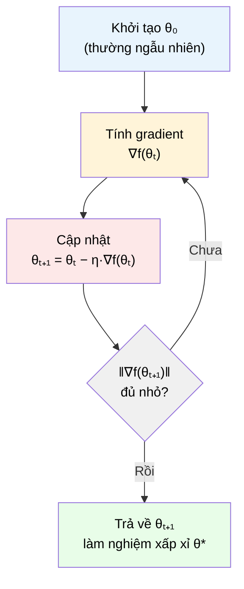

# MASTER COMPUTER SCIENCE HANDBOOK

## Volume 01 — Mathematics for Computer Science
### Part VII — Optimization for Artificial Intelligence
## Chương 7.3 — Gradient Descent
### (Thuật toán Hạ Gradient)

---

### Thông tin chương

| Trường | Giá trị |
|---|---|
| Chương | 7.3 |
| Thuộc Part | VII — Optimization for Artificial Intelligence |
| Thuộc Volume | 01 — Mathematics for Computer Science |
| Thời gian đọc ước tính | 45–55 phút |
| Độ khó | ★★★★☆ |
| Kiến thức tiên quyết | Chương 7.1 — Optimization Problems; Chương 7.2 — Convexity; Part IV — Calculus (đạo hàm, gradient, đạo hàm theo hướng); Part III — Linear Algebra (tích vô hướng, chuẩn vector) |
| Chương liên quan | 7.4 — Stochastic Gradient Descent (mở rộng trực tiếp thuật toán chương này cho dữ liệu lớn); 7.5 — Momentum (cải tiến trực tiếp trên công thức cập nhật của chương này); Volume 5, Part IV — Deep Learning (Backpropagation dùng Gradient Descent làm động cơ cập nhật trọng số) |
| Từ khóa | Gradient Descent, learning rate, steepest descent, convergence, update rule, iterative optimization |

---

### Mục tiêu học tập

Sau khi hoàn thành chương này, người đọc có thể:

- Suy luận công thức cập nhật của Gradient Descent trực tiếp từ định nghĩa đạo hàm theo hướng (directional derivative), không chỉ ghi nhớ công thức.
- Giải thích chính xác vì sao hướng **ngược với gradient** là hướng giảm nhanh nhất của hàm số tại một điểm.
- Phân tích ảnh hưởng của **learning rate** $\eta$ lên hành vi hội tụ: hội tụ chậm, hội tụ tốt, dao động, hoặc phân kỳ.
- Cài đặt thuật toán Gradient Descent từ đầu bằng Python (không dùng framework), áp dụng cho cả hàm một biến và hàm hai biến.
- Giải thích, dựa trên kiến thức Chương 7.2, khi nào Gradient Descent được đảm bảo hội tụ về cực tiểu toàn cục, và khi nào không có đảm bảo đó.

---

### Câu hỏi khơi gợi

> *Bạn đang đứng trên một ngọn đồi, trong sương mù dày đặc — chỉ nhìn thấy mặt đất ngay dưới chân, không nhìn được xa hơn. Bạn muốn xuống điểm thấp nhất càng nhanh càng tốt. Chiến lược hợp lý nhất tại mỗi bước là gì? Và nếu bạn bước những bước quá dài để "đi nhanh hơn", điều gì có thể xảy ra?*

---

## 1. Tổng quan chương

Chương 7.1 xây dựng khung 5 bước chung cho mọi thuật toán tối ưu lặp. Chương 7.2 cho ta biết khi nào một hàm mục tiêu "dễ tin tưởng" (lồi). Chương 7.3 giờ đây hiện thực hóa cụ thể Bước 2 và Bước 3 của khung đó bằng thuật toán quan trọng nhất trong toàn bộ Optimization hiện đại: **Gradient Descent (GD)**.

Đây là chương trung tâm của Part VII. Mọi thuật toán còn lại trong Part (SGD ở Chương 7.4, Momentum ở Chương 7.5, Adam ở Chương 7.6) đều là **biến thể hoặc cải tiến trực tiếp** của Gradient Descent — không phải các thuật toán độc lập. Vì vậy, hiểu thật chắc chắn cơ chế và giới hạn của GD ở chương này sẽ khiến ba chương còn lại trở nên dễ tiếp cận hơn nhiều: mỗi chương sau chỉ cần trả lời câu hỏi "GD ở chương này có vấn đề gì, và cải tiến này giải quyết vấn đề đó như thế nào?"

> **💡 Insight**
> Toàn bộ Deep Learning hiện đại — từ mạng neural nhỏ đến các mô hình ngôn ngữ lớn (Large Language Model) hàng tỷ tham số ở Volume 6 — về bản chất toán học đều được huấn luyện bằng một ý tưởng duy nhất: **lặp đi lặp lại việc di chuyển ngược hướng gradient**. Sự khác biệt giữa các hệ thống AI hiện đại chủ yếu nằm ở kiến trúc mô hình và các biến thể tinh vi của chính ý tưởng này, chứ không phải một nguyên lý tối ưu hoàn toàn khác.

---

## 2. Bối cảnh lịch sử

Chương 7.1 (Mục 2) đã nhắc đến mốc lịch sử quan trọng nhất của thuật toán này; chương này trình bày đầy đủ hơn hành trình từ ý tưởng toán học thuần túy đến công cụ trung tâm của AI hiện đại.

| Thời điểm | Nhân vật / Sự kiện | Đóng góp |
|---|---|---|
| 1847 | Augustin-Louis Cauchy | Đề xuất phương pháp lặp dựa trên đạo hàm để giải hệ phương trình phi tuyến — về mặt toán học, đây chính là Gradient Descent, dù Cauchy chưa dùng thuật ngữ này và chưa nhắm đến ứng dụng Machine Learning |
| 1960 | Bernard Widrow, Marcian Hoff | Phát triển thuật toán **LMS (Least Mean Squares)** cho mạng ADALINE — một trong những ứng dụng sớm nhất của ý tưởng cập nhật theo gradient để huấn luyện một hệ thống học máy đơn giản |
| 1986 | Rumelhart, Hinton, Williams | Công bố *Learning Representations by Back-Propagating Errors* (đã liệt kê trong `PAPERS.md`) — chứng minh Gradient Descent, kết hợp với thuật toán Backpropagation để tính gradient hiệu quả trên mạng nhiều lớp, có thể huấn luyện thành công mạng neural thực tế |
| Thập niên 2010–nay | Cộng đồng Deep Learning | Gradient Descent (và các biến thể ở Chương 7.4–7.6) trở thành **thuật toán huấn luyện mặc định** cho gần như mọi mô hình AI hiện đại, từ CNN, Transformer, đến các mô hình ngôn ngữ lớn |

> **🔬 Research Connection**
> Điều đáng suy ngẫm: Cauchy phát triển phương pháp này để giải các bài toán kỹ thuật cơ học vào thế kỷ 19, hoàn toàn không liên quan đến "trí tuệ nhân tạo" — khái niệm còn chưa tồn tại vào thời điểm đó. Việc một công cụ toán học thuần túy có thể "chờ đợi" gần 140 năm để tìm được ứng dụng mang tính cách mạng là một minh chứng cho giá trị lâu dài của toán học nền tảng — đúng tinh thần mà Volume 1 của Handbook này theo đuổi.

---

## 3. Động lực

Ở Chương 7.1 (Mục 7.1), ta đã thấy rằng phương trình $\nabla f(\theta) = \mathbf{0}$ — điều kiện cần để có cực trị — thường không giải được bằng đại số với các hàm mục tiêu phức tạp. Nhưng có một sự thật quan trọng: dù **không giải được phương trình này**, ta hoàn toàn **có thể tính được** giá trị $\nabla f(\theta)$ tại bất kỳ điểm $\theta$ cụ thể nào — đây chỉ đơn giản là tính đạo hàm riêng tại một điểm, một phép toán hoàn toàn khả thi kể cả với hàm phức tạp (Part IV — Calculus).

Gradient Descent khai thác chính xác sự bất đối xứng này: thay vì cố "giải" bài toán tối ưu bằng một bước đại số duy nhất (bất khả thi), nó dùng thông tin gradient **cục bộ** (khả thi) để quyết định bước di chuyển tiếp theo, rồi lặp lại hàng nghìn lần. Đây chính là ý tưởng "người đi trong sương mù" đã giới thiệu ở Chương 7.1 — giờ đây được hình thức hóa thành một thuật toán tường minh.

---

## 4. Trực giác

**Mô hình tinh thần (Mental Model) của chương này:**

> Bạn đứng trên một ngọn đồi trong sương mù, chỉ cảm nhận được độ dốc **ngay dưới chân**. Chiến lược hợp lý: cảm nhận hướng dốc xuống nhiều nhất tại vị trí hiện tại, bước một bước theo hướng đó, rồi lặp lại. Gradient Descent chính xác là hình thức hóa toán học của chiến lược này: **gradient $\nabla f(\theta)$ luôn chỉ về hướng tăng nhanh nhất**, nên đi ngược lại — theo hướng $-\nabla f(\theta)$ — chính là hướng giảm nhanh nhất tại điểm đó.

| Trực giác "người đi trong sương mù" | Khái niệm Gradient Descent |
|---|---|
| Cảm nhận độ dốc dưới chân | Tính $\nabla f(\theta_t)$ tại vị trí hiện tại |
| Xác định hướng dốc xuống nhiều nhất | Hướng $-\nabla f(\theta_t)$ |
| Độ dài mỗi bước chân | Learning rate $\eta$ |
| Bước đi | Cập nhật $\theta_{t+1} = \theta_t - \eta \nabla f(\theta_t)$ |
| Dừng lại khi mặt đất gần như bằng phẳng | Dừng khi $\|\nabla f(\theta_t)\|$ đủ nhỏ (hội tụ) |
| Bước chân quá ngắn — đi cả ngày không tới đáy | Learning rate quá nhỏ — hội tụ chậm |
| Bước chân quá dài — nhảy vọt qua đáy thung lũng, sang sườn đối diện | Learning rate quá lớn — dao động hoặc phân kỳ |

---

## 5. Trực quan hóa khái niệm

**Hình 7.3.1 — Vòng lặp Gradient Descent**
*(Visual đặc trưng của chương — Chapter Identity)*



| Trường thông tin | Nội dung |
|---|---|
| Mục đích | Cụ thể hóa khung 5 bước tổng quát ở Hình 8, Chương 7.1, thành vòng lặp chính xác của Gradient Descent |
| Điểm mấu chốt | Đây là phiên bản "cơ bản" nhất — Chương 7.4–7.6 sẽ chỉnh sửa **đúng khối "Tính gradient"** (7.4) và **khối "Cập nhật"** (7.5, 7.6), giữ nguyên toàn bộ cấu trúc vòng lặp còn lại |

---

**Hình 7.3.2 — Ảnh hưởng của Learning Rate đến hành vi hội tụ**

```text
  η QUÁ NHỎ              η VỪA PHẢI              η QUÁ LỚN

f(θ)                    f(θ)                    f(θ)
  │  •                     │  •                    │  •
  │   •                    │   ╲                    │    ╲
  │    •                   │    ╲                    │     ●───╮
  │     •                  │     ●                    │         ╲
  │      •                 │      ╲                    │          ●
  │       •  ...           │       ●                    │           ╲
  │        •  (rất chậm    │        ●  (hội tụ nhanh,    │            ●
  │         • mới tới      │         ●  ổn định)          │  (PHÂN KỲ —
  │          • đáy)        │        đáy                    │   càng lúc
  └──────────────→ θ       └──────────────→ θ              │   càng xa)
                                                            └──────────→ θ
```

*Mục đích:* Minh họa trực tiếp Bảng trực giác ở Mục 4 — cùng một hàm mục tiêu, cùng một điểm khởi tạo, nhưng ba giá trị $\eta$ khác nhau dẫn đến ba kết cục hoàn toàn khác nhau. *Điểm mấu chốt:* việc chọn $\eta$ không phải là chi tiết kỹ thuật phụ — nó quyết định trực tiếp thuật toán có thành công hay không, và sẽ được kiểm chứng bằng số liệu cụ thể ở Mục 10.

---

## 6. Định nghĩa hình thức

> **📌 Remember — Gradient Descent**
>
> Cho hàm mục tiêu khả vi $f: \mathbb{R}^n \to \mathbb{R}$ và một điểm khởi tạo $\theta_0 \in \mathbb{R}^n$. **Gradient Descent** là thuật toán lặp sinh ra dãy $\theta_0, \theta_1, \theta_2, \dots$ theo quy tắc cập nhật:
>
> $$\theta_{t+1} = \theta_t - \eta \cdot \nabla f(\theta_t)$$
>
> trong đó $\eta > 0$ là **learning rate (tốc độ học)** — một siêu tham số (hyperparameter) do người dùng chọn trước, kiểm soát độ dài mỗi bước cập nhật. Thuật toán dừng khi $\|\nabla f(\theta_t)\|$ nhỏ hơn một ngưỡng cho trước, hoặc khi đạt số bước lặp tối đa.

**Learning rate** không phải một tham số của mô hình (không được học từ dữ liệu) — nó là một **siêu tham số**, phải được chọn trước khi chạy thuật toán. Việc tinh chỉnh siêu tham số này (hyperparameter tuning, đã nhắc ở Chương 7.1, Mục 11) là một phần quan trọng của thực hành Machine Learning, sẽ được hệ thống hóa đầy đủ ở Volume 5.

---

## 7. Nền tảng toán học

### 7.1 Vì sao hướng ngược gradient là hướng giảm nhanh nhất

Đây là câu hỏi cốt lõi mà công thức cập nhật ở Mục 6 dựa vào — và nó có thể được suy luận chặt chẽ, không chỉ chấp nhận như một quy tắc cho sẵn.

Xét một hướng di chuyển bất kỳ, biểu diễn bằng vector đơn vị $d$ (tức $\|d\| = 1$, khái niệm chuẩn vector từ Part III). **Đạo hàm theo hướng (directional derivative)** của $f$ tại $\theta$ theo hướng $d$ — đo tốc độ thay đổi tức thời của $f$ khi di chuyển theo hướng $d$ — được tính bằng:

$$D_d f(\theta) = \nabla f(\theta) \cdot d$$

(tích vô hướng giữa gradient và hướng di chuyển — Part III, Mục Linear Transformations).

> **📦 Formula Box — Hướng giảm nhanh nhất (Steepest Descent Direction)**
>
> $$d^* = -\frac{\nabla f(\theta)}{\|\nabla f(\theta)\|} = \arg\min_{\|d\|=1} \; \nabla f(\theta) \cdot d$$
>
> | Thành phần | Ý nghĩa |
> |---|---|
> | $\nabla f(\theta) \cdot d$ | Tốc độ thay đổi của $f$ khi di chuyển theo hướng $d$ (đạo hàm theo hướng) |
> | **Diễn giải trực giác** | Theo bất đẳng thức Cauchy-Schwarz (Part III), tích vô hướng $\nabla f(\theta) \cdot d$ đạt giá trị **nhỏ nhất** (âm nhất — tức giảm nhanh nhất) khi $d$ ngược chiều hoàn toàn với $\nabla f(\theta)$ |
> | **Kết luận** | Trong số **mọi** hướng di chuyển khả dĩ tại điểm $\theta$, hướng $-\nabla f(\theta)$ (đã chuẩn hóa) là hướng làm $f$ giảm nhanh nhất — đây chính là lý do công thức cập nhật ở Mục 6 trừ đi gradient, không phải cộng vào hay dùng hướng bất kỳ khác |

> **💡 Insight**
> Đây là lần đầu tiên trong Handbook, một công thức được trình bày ở Mục 6 dưới dạng "quy tắc" (`📌 Remember`) sau đó được **suy luận lại từ đầu** bằng công cụ đã học (đạo hàm theo hướng, tích vô hướng, bất đẳng thức Cauchy-Schwarz). Đây chính là tinh thần "Concept Before Implementation" và "Intuition Before Mathematics" của `LEARNING_PHILOSOPHY.md`: bạn không chỉ *biết* công thức, mà *hiểu tại sao* nó phải như vậy.

### 7.2 Vai trò của Learning Rate trong hội tụ

Công thức cập nhật $\theta_{t+1} = \theta_t - \eta \nabla f(\theta_t)$ chỉ đảm bảo $f(\theta_{t+1}) < f(\theta_t)$ (tức là *có cải thiện*) khi $\eta$ đủ nhỏ — vì đạo hàm theo hướng ở Mục 7.1 chỉ là một **xấp xỉ cục bộ** (tuyến tính hóa) của hàm số tại $\theta_t$, chỉ chính xác trong một lân cận nhỏ.

> **⚠️ Common Mistake**
> Một ngộ nhận phổ biến: "learning rate càng lớn thì thuật toán càng nhanh tìm ra nghiệm". Điều này chỉ đúng trong một khoảng giá trị hợp lý. Vượt quá một ngưỡng nhất định, bước cập nhật sẽ "nhảy" ra khỏi vùng mà xấp xỉ tuyến tính còn chính xác, khiến giá trị hàm mục tiêu **tăng lên thay vì giảm** sau mỗi bước — đây chính là hiện tượng phân kỳ (divergence) minh họa ở Hình 7.3.2, cột bên phải, và sẽ được kiểm chứng bằng số liệu cụ thể ở Mục 10.

Với hàm lồi (Chương 7.2) có tính chất **gradient Lipschitz-liên tục** (một điều kiện kỹ thuật đảm bảo gradient không thay đổi quá đột ngột — nằm ngoài phạm vi tính toán chi tiết của Volume 1), lý thuyết Optimization chứng minh được: chọn $\eta$ đủ nhỏ theo một ngưỡng cụ thể sẽ đảm bảo Gradient Descent hội tụ về cực tiểu toàn cục. Đây chính là điểm mà kết quả của Chương 7.2 (Mục 7.1 — định lý cực tiểu địa phương = toàn cục cho hàm lồi) được sử dụng trực tiếp: **nếu hàm lồi, và $\eta$ được chọn hợp lý, GD được đảm bảo tìm ra nghiệm tốt nhất có thể** — không có yếu tố may rủi.

---

## 8. Thuật toán

```text
Thuật toán: Gradient Descent
Đầu vào:
  f       — hàm mục tiêu khả vi
  ∇f      — hàm tính gradient của f
  θ₀      — điểm khởi tạo
  η       — learning rate
  ε       — ngưỡng dừng (hội tụ)
  T_max   — số bước lặp tối đa

Đầu ra:
  θ — nghiệm xấp xỉ của bài toán tối ưu

────────────────────────────────────────
θ ← θ₀
for t = 1 to T_max:
    g ← ∇f(θ)                    # tính gradient tại điểm hiện tại
    if ‖g‖ < ε:                  # kiểm tra điều kiện hội tụ
        break
    θ ← θ − η · g                # bước cập nhật cốt lõi
return θ
────────────────────────────────────────
```

**Độ phức tạp mỗi bước lặp:** chi phí chủ yếu nằm ở việc tính $\nabla f(\theta)$ — với hàm mục tiêu của một mạng neural, đây chính là công việc của thuật toán Backpropagation (Volume 5), có độ phức tạp tỷ lệ thuận với số tham số của mô hình. Số bước lặp cần thiết để hội tụ phụ thuộc vào hình dạng hàm mục tiêu (Chương 7.2) và lựa chọn $\eta$ (Mục 7.2 ở trên) — không có công thức tổng quát cho mọi bài toán.

---

## 9. Triển khai

```python
import numpy as np


def gradient_descent(grad_f, theta0, lr, num_steps=200, tol=1e-8):
    """Cài đặt Gradient Descent từ đầu, không dùng framework.
    Trả về toàn bộ lịch sử theta để trực quan hóa đường đi hội tụ."""
    theta = np.array(theta0, dtype=float)
    history = [theta.copy()]
    for _ in range(num_steps):
        g = grad_f(theta)
        if np.linalg.norm(g) < tol:
            break
        theta = theta - lr * g
        history.append(theta.copy())
    return theta, np.array(history)


# --- Ví dụ 1: hàm một biến, tái sử dụng từ Chương 7.1 ---
def grad_convex_1d(theta):
    """f(theta) = (theta - 3)^2 + 1  ⟹  f'(theta) = 2(theta - 3)."""
    return 2 * (theta - 3)


# --- Ví dụ 2: hàm hai biến (dạng bát lồi) ---
def grad_convex_2d(theta):
    """f(theta1, theta2) = theta1^2 + 4*theta2^2
    ⟹ ∇f = [2*theta1, 8*theta2]."""
    return np.array([2 * theta[0], 8 * theta[1]])


theta_final, hist = gradient_descent(grad_convex_1d, theta0=[-8.0], lr=0.1)
print(f"1D — Nghiệm: theta* ≈ {theta_final[0]:.4f}, số bước: {len(hist)}")

theta_final_2d, hist_2d = gradient_descent(grad_convex_2d, theta0=[5.0, 5.0], lr=0.1)
print(f"2D — Nghiệm: theta* ≈ {theta_final_2d}, số bước: {len(hist_2d)}")
```

Hàm `gradient_descent` là cài đặt trực tiếp của thuật toán ở Mục 8, không thêm bất kỳ cải tiến nào (những cải tiến đó là nội dung Chương 7.4–7.6). Việc lưu lại `history` (toàn bộ lịch sử $\theta$) không cần thiết cho thuật toán hoạt động, nhưng cần thiết để trực quan hóa quá trình hội tụ — điều sẽ thực hiện ngay ở Mục 10.

---

## 10. Trực quan hóa quá trình thực thi

**Ảnh hưởng của learning rate trên hàm $f(\theta) = (\theta-3)^2+1$, khởi tạo $\theta_0 = -8$:**

| Learning rate $\eta$ | Giá trị $\theta$ sau 5 bước | Giá trị $\theta$ sau 50 bước | Kết luận |
|---:|---:|---:|---|
| 0.01 | -6.947 | -1.869 | Hội tụ, nhưng **rất chậm** — chưa gần đến $\theta^*=3$ sau 50 bước |
| 0.1 | 2.394 | 3.000 | Hội tụ **ổn định và nhanh** — gần như chính xác sau 50 bước |
| 0.5 | 3.000 | 3.000 | Hội tụ **ngay lập tức** (trường hợp đặc biệt của hàm bậc hai đơn giản này) |
| 1.05 | -104.626 | $-3.2 \times 10^{9}$ | **Phân kỳ** — $\theta$ dao động với biên độ tăng theo cấp số nhân, ngày càng rời xa nghiệm |

**Quan sát then chốt:** kết quả này khớp chính xác với dự đoán trực giác ở Hình 7.3.2 và cảnh báo ở Mục 7.2 — có một "vùng an toàn" của $\eta$ (ở đây khoảng $0 < \eta < 1$ với hàm cụ thể này), ngoài vùng đó thuật toán không còn cải thiện mà thực sự trở nên tệ hơn qua từng bước.

**Đường đi hội tụ trên hàm hai biến** $f(\theta_1, \theta_2) = \theta_1^2 + 4\theta_2^2$, khởi tạo $(5, 5)$, $\eta = 0.1$:

| Bước | $\theta_1$ | $\theta_2$ | $f(\theta)$ |
|---:|---:|---:|---:|
| 0 | 5.000 | 5.000 | 125.000 |
| 5 | 1.638 | 0.328 | 3.113 |
| 10 | 0.537 | 0.021 | 0.290 |
| 20 | 0.058 | 0.00009 | 0.0033 |

**Quan sát:** $\theta_2$ hội tụ **nhanh hơn nhiều** so với $\theta_1$ — vì hệ số $4$ trong $4\theta_2^2$ khiến gradient theo hướng $\theta_2$ lớn hơn, tạo ra bước di chuyển dài hơn theo hướng đó. Đây là dấu hiệu đầu tiên của một vấn đề quan trọng: khi các hướng khác nhau có "độ dốc" rất khác nhau (địa hình giống một thung lũng hẹp, dài), Gradient Descent cơ bản có xu hướng **dao động qua lại** thay vì đi thẳng đến đáy — chính là động lực trực tiếp cho Momentum ở Chương 7.5.

---

## 11. Ứng dụng công nghiệp

> **🛠 Engineering Practice**
> Gradient Descent (và các biến thể của nó) là động cơ cập nhật tham số cho hầu như mọi hệ thống AI được triển khai trong công nghiệp ngày nay.

| Bối cảnh công nghiệp | Vai trò của Gradient Descent |
|---|---|
| Huấn luyện mô hình Deep Learning (mọi framework: PyTorch, TensorFlow) | Là vòng lặp cốt lõi bên trong `optimizer.step()` — framework tự động tính gradient (qua Backpropagation) rồi áp dụng đúng công thức cập nhật ở Mục 6 |
| Hồi quy tuyến tính quy mô lớn | Khi dữ liệu quá lớn để dùng nghiệm dạng đóng ($\theta^* = (X^\top X)^{-1}X^\top y$ — tốn kém với ma trận khổng lồ), Gradient Descent là lựa chọn thực hành hiệu quả hơn |
| Hệ thống gợi ý (Recommendation Systems) | Huấn luyện các mô hình phân rã ma trận (matrix factorization) bằng cách tối thiểu hóa sai số dự đoán, dùng chính vòng lặp GD |
| Tinh chỉnh mô hình đã huấn luyện (fine-tuning) | Tiếp tục chạy Gradient Descent (thường với $\eta$ rất nhỏ) trên một mô hình đã có sẵn, để thích nghi với dữ liệu hoặc nhiệm vụ mới |

---

## 12. Góc nhìn nghiên cứu

> **🔬 Research Connection**
> Dù là thuật toán "cơ bản" nhất trong Part VII, câu hỏi *"tốc độ hội tụ của Gradient Descent phụ thuộc vào những yếu tố nào?"* vẫn là một chủ đề nghiên cứu lý thuyết phong phú.

Lý thuyết Optimization cổ điển (đối chiếu `VENUES.md` — thường xuất hiện tại STOC, FOCS, và các tạp chí Optimization chuyên ngành) chứng minh được: với hàm lồi có gradient Lipschitz-liên tục (Mục 7.2), Gradient Descent với learning rate cố định, chọn phù hợp, hội tụ với **tốc độ tuyến tính hoặc dưới tuyến tính** tùy điều kiện cụ thể của hàm mục tiêu — các kết quả định lượng chính xác đòi hỏi công cụ toán học vượt ngoài phạm vi Volume 1 (độ đo Lipschitz, hằng số điều kiện — condition number).

Trong bối cảnh Deep Learning hiện đại, câu hỏi trở nên khó hơn nhiều vì hàm mục tiêu **không lồi** (Chương 7.2, Mục 12) — lý thuyết hội tụ cổ điển không áp dụng trực tiếp. Nghiên cứu hiện đại về tốc độ hội tụ của GD trên hàm không lồi, đặc biệt trong không gian tham số hàng tỷ chiều của các mô hình ngôn ngữ lớn, vẫn là một hướng nghiên cứu tích cực — liên hệ trực tiếp với các giả thuyết đã nêu ở Chương 7.2, Mục 12.

---

## 13. Ưu điểm

- **Đơn giản về mặt khái niệm và cài đặt** — như thấy ở Mục 9, toàn bộ thuật toán chỉ cần vài dòng code, không đòi hỏi cấu trúc dữ liệu phức tạp.
- **Tổng quát** — áp dụng được cho bất kỳ hàm mục tiêu khả vi nào, không giới hạn ở một loại mô hình cụ thể.
- **Có nền tảng lý thuyết chắc chắn** với hàm lồi (Chương 7.2) — đảm bảo hội tụ về nghiệm tốt nhất, có thể chứng minh toán học.
- **Là nền tảng trực tiếp** cho mọi thuật toán tối ưu hiện đại dùng trong Deep Learning (Chương 7.4–7.6) — hiểu GD nghĩa là đã hiểu 80% cơ chế của các thuật toán phức tạp hơn.

---

## 14. Hạn chế

- **Nhạy cảm với learning rate** — như đã thấy ở Mục 10, việc chọn sai $\eta$ có thể khiến thuật toán hội tụ cực chậm hoặc phân kỳ hoàn toàn; không có công thức tổng quát để chọn $\eta$ tối ưu trước khi chạy thử.
- **Dao động trên địa hình "thung lũng hẹp"** (như minh họa ở Mục 10, ví dụ 2 biến) — đây là động lực trực tiếp dẫn đến Momentum (Chương 7.5).
- **Chi phí tính toán mỗi bước** có thể rất lớn nếu hàm mục tiêu (và gradient của nó) phức tạp — với dữ liệu huấn luyện khổng lồ, tính gradient trên **toàn bộ** dữ liệu ở mỗi bước (như định nghĩa ở Mục 6) trở nên không khả thi — đây chính là động lực cho Chương 7.4 (Stochastic Gradient Descent).
- **Không có đảm bảo hội tụ về cực tiểu toàn cục** trên hàm không lồi (Chương 7.2) — chỉ đảm bảo dừng lại ở một điểm mà gradient gần bằng không, có thể là cực tiểu địa phương "tệ" hoặc điểm yên ngựa.

---

## 15. So sánh

**Bảng 7.3.1 — Gradient Descent so với Tìm kiếm Vét cạn (Chương 7.1)**

| Tiêu chí | Brute-force Search (Chương 7.1, Mục 9) | Gradient Descent |
|---|---|---|
| Thông tin sử dụng mỗi bước | Không dùng cấu trúc hàm số — chỉ so sánh giá trị | Dùng gradient — thông tin về **hướng** cải thiện |
| Khả năng mở rộng theo số chiều | Tăng theo hàm mũ (`num_points`$^n$) — bất khả thi với $n$ lớn | Tăng tuyến tính theo $n$ (chi phí tính gradient) — khả thi với hàng tỷ tham số |
| Đảm bảo tìm nghiệm chính xác | Có, nếu độ phân giải đủ mịn (nhưng chi phí cực lớn) | Không đảm bảo tuyệt đối — phụ thuộc tính lồi (Chương 7.2) và learning rate |
| Yêu cầu về hàm mục tiêu | Chỉ cần tính được giá trị $f(\theta)$ | Cần $f$ khả vi, tính được $\nabla f(\theta)$ |

**Phân tích:** bảng này khép lại vòng lặp lý luận xuyên suốt từ Chương 7.1: brute-force là cách tiếp cận "ngây thơ" nhưng dễ hiểu, thất bại vì lời nguyền chiều; Gradient Descent trả giá bằng yêu cầu chặt hơn (hàm phải khả vi) để đổi lấy khả năng mở rộng đến quy mô của các mô hình AI hiện đại — đây chính là đánh đổi cốt lõi giải thích vì sao GD, chứ không phải brute-force, là nền tảng của AI hiện đại.

---

## 16. Tóm tắt

- **Gradient Descent** cập nhật tham số theo quy tắc $\theta_{t+1} = \theta_t - \eta \nabla f(\theta_t)$, lặp lại đến khi hội tụ.
- Hướng $-\nabla f(\theta)$ là hướng giảm nhanh nhất tại $\theta$ — kết quả suy ra trực tiếp từ đạo hàm theo hướng và bất đẳng thức Cauchy-Schwarz, không phải một quy tắc tùy ý.
- **Learning rate** $\eta$ kiểm soát độ dài bước cập nhật: quá nhỏ → hội tụ chậm; vừa phải → hội tụ tốt; quá lớn → dao động hoặc phân kỳ hoàn toàn — đã kiểm chứng bằng số liệu cụ thể ở Mục 10.
- Với hàm **lồi** (Chương 7.2) và learning rate chọn hợp lý, GD được đảm bảo hội tụ về cực tiểu toàn cục; với hàm không lồi, chỉ đảm bảo dừng ở điểm có gradient gần bằng không.
- GD cơ bản có hai hạn chế thực hành lớn: (1) chi phí tính gradient trên toàn bộ dữ liệu mỗi bước, và (2) dao động trên địa hình có độ dốc chênh lệch lớn giữa các hướng — hai vấn đề này lần lượt là động lực cho Chương 7.4 (SGD) và Chương 7.5 (Momentum).

Chương 7.4 sẽ giải quyết hạn chế đầu tiên: điều gì xảy ra khi tập dữ liệu huấn luyện lớn đến mức không thể tính gradient trên toàn bộ dữ liệu ở mỗi bước?

---

## 17. Bài tập

### Mức Cơ bản (Basic)

1. Với $f(\theta) = \theta^2$, viết ra công thức cập nhật Gradient Descent cụ thể (thay $\nabla f(\theta)$ bằng biểu thức tường minh). Tính tay 3 bước đầu tiên với $\theta_0 = 10$, $\eta = 0.2$.
2. Giải thích bằng lời (không cần công thức): vì sao learning rate được gọi là một "siêu tham số" (hyperparameter) chứ không phải một tham số thông thường của mô hình.

### Mức Trung bình (Intermediate)

3. Chạy lại code ở Mục 9 với hàm $f(\theta) = (\theta-3)^2+1$ và learning rate $\eta = 1.0$ chính xác (biên giới giữa hội tụ và phân kỳ đối với hàm bậc hai này). Quan sát điều gì xảy ra sau 20 bước? Giải thích hiện tượng này bằng lập luận từ Mục 7.2.
4. Sửa hàm `gradient_descent` ở Mục 9 để dừng sớm và in ra cảnh báo nếu phát hiện $f(\theta_{t+1}) > f(\theta_t)$ (dấu hiệu learning rate quá lớn). Kiểm thử với ít nhất 3 giá trị $\eta$ khác nhau.

### Mức Nâng cao (Advanced)

5. Áp dụng Gradient Descent lên hàm **không lồi** $f(\theta) = \theta^4 - 4\theta^2$ (từ Chương 7.1 và 7.2). Chạy thuật toán với hai điểm khởi tạo khác nhau: $\theta_0 = 0.5$ và $\theta_0 = -0.5$. So sánh hai nghiệm cuối cùng thu được — chúng có giống nhau không? Giải thích kết quả bằng cách liên hệ trực tiếp với Chương 7.2, Mục 15 (Bảng so sánh hàm lồi/không lồi, dòng "Vai trò của điểm khởi tạo").
6. Chứng minh hình thức: với $f(\theta) = a\theta^2 + b\theta + c$ (hàm bậc hai một biến, $a > 0$), Gradient Descent với learning rate $\eta$ hội tụ (không dao động, không phân kỳ) khi và chỉ khi $0 < \eta < \frac{1}{a}$. *(Gợi ý: viết tường minh công thức truy hồi cho $\theta_t$, biểu diễn $\theta_t - \theta^*$ dưới dạng $(1-2a\eta)^t (\theta_0 - \theta^*)$, rồi phân tích khi nào dãy này hội tụ về 0.)*

### Mức Nghiên cứu (Research)

7. Trong Mục 10, ví dụ hai biến cho thấy các hướng có "độ dốc" khác nhau khiến GD hội tụ không đều. Tìm đọc (mức phổ thông) về khái niệm **condition number** của một bài toán tối ưu bậc hai — con số này định lượng chính xác mức độ "thung lũng hẹp" của địa hình. Tóm tắt trong 3–4 câu: condition number liên hệ thế nào với tốc độ hội tụ của Gradient Descent?

---

## 18. Dự án nhỏ

**Trực quan hóa Đường đi Hội tụ của Gradient Descent**

- **Mục tiêu:** củng cố trực giác về ảnh hưởng của learning rate và hình dạng hàm mục tiêu lên hành vi hội tụ, thông qua trực quan hóa trực tiếp (không chỉ đọc bảng số liệu).
- **Yêu cầu:**
  1. Cài đặt lại hàm `gradient_descent` (Mục 9), lưu đầy đủ lịch sử $\theta$.
  2. Chọn ít nhất 3 hàm mục tiêu hai biến khác nhau: một hàm "bát tròn" (ví dụ $\theta_1^2+\theta_2^2$), một hàm "thung lũng hẹp" (ví dụ $\theta_1^2+20\theta_2^2$), và hàm không lồi $\theta^4-4\theta^2$ mở rộng tùy ý sang 2 biến.
  3. Vẽ đường đồng mức (contour plot, dùng `matplotlib`) của từng hàm, chồng lên đó đường đi thực tế của $\theta$ qua các bước lặp.
  4. Với mỗi hàm, thử ít nhất 3 giá trị learning rate khác nhau và so sánh trực quan.
- **Công cụ đề xuất:** Python, NumPy, Matplotlib (xem `TOOLS.md`).
- **Kết quả mong đợi:** một bộ hình ảnh trực quan cho thấy rõ ràng: (a) dao động trên địa hình thung lũng hẹp, (b) phân kỳ khi $\eta$ quá lớn, (c) nghiệm khác nhau tùy điểm khởi tạo trên hàm không lồi.
- **Mở rộng (tùy chọn):** dựng animation (dùng `matplotlib.animation`) cho thấy đường đi hội tụ diễn ra theo thời gian thực, thay vì chỉ vẽ tĩnh.

---

## 19. Tự đánh giá

- [ ] Tôi có thể viết chính xác công thức cập nhật của Gradient Descent, và giải thích ý nghĩa của từng thành phần.
- [ ] Tôi có thể tự suy luận (không cần tra cứu) vì sao hướng ngược gradient là hướng giảm nhanh nhất, dựa trên đạo hàm theo hướng và tích vô hướng.
- [ ] Tôi có thể dự đoán được (một cách định tính) hành vi hội tụ của GD khi thay đổi learning rate, và giải thích được nguyên nhân.
- [ ] Tôi đã cài đặt thành công Gradient Descent từ đầu bằng Python và kiểm chứng được kết quả khớp với dự đoán lý thuyết.
- [ ] Tôi có thể giải thích, dựa trên Chương 7.2, khi nào GD được đảm bảo hội tụ về cực tiểu toàn cục.
- [ ] Tôi đã hoàn thành Dự án nhỏ và tự quan sát được hiện tượng dao động trên địa hình thung lũng hẹp.

Nếu Bài tập 6 vẫn còn khó khăn, đây là dấu hiệu nên quay lại ôn tập dãy số và giới hạn ở Part IV — Calculus trước khi tiếp tục — kỹ thuật phân tích dãy truy hồi này sẽ xuất hiện lại (ở dạng phức tạp hơn) khi phân tích Momentum ở Chương 7.5.

---

## 20. Đọc thêm

- **Sách:** Stephen Boyd, Lieven Vandenberghe, *Convex Optimization*, Chương 9 — phân tích chi tiết các phương pháp giảm dốc (descent methods), bao gồm điều kiện hội tụ định lượng vượt ngoài phạm vi Volume 1.
- **Paper nền tảng:** Rumelhart, Hinton, Williams (1986), *Learning Representations by Back-Propagating Errors* — ứng dụng lịch sử của Gradient Descent kết hợp Backpropagation để huấn luyện mạng neural (xem `PAPERS.md`).
- **Chủ đề mở rộng (không bắt buộc):** tìm đọc về "learning rate schedules" (lịch trình thay đổi learning rate theo thời gian huấn luyện thay vì giữ cố định) — kỹ thuật thực hành phổ biến sẽ gặp lại ở Volume 5.
- **Chương tiếp theo:** Chương 7.4 — Stochastic Gradient Descent.

---

### Liên kết chương (Cross References)

- **Chương trước:** 7.1 — Optimization Problems (khung 5 bước tổng quát được cụ thể hóa thành thuật toán GD ở chương này); 7.2 — Convexity (điều kiện để GD được đảm bảo hội tụ về cực tiểu toàn cục, dùng trực tiếp ở Mục 7.2 và 12).
- **Chương tiếp theo:** 7.4 — Stochastic Gradient Descent (giải quyết hạn chế về chi phí tính gradient trên dữ liệu lớn, đã nêu ở Mục 14); 7.5 — Momentum (giải quyết hạn chế về dao động trên địa hình thung lũng hẹp, minh họa ở Mục 10).
- **Chương liên quan xa hơn:** Part III — Linear Algebra (tích vô hướng, chuẩn vector, bất đẳng thức Cauchy-Schwarz, dùng trực tiếp ở Mục 7.1); Part IV — Calculus (đạo hàm theo hướng); Volume 5, Part IV — Deep Learning (Backpropagation tính gradient cho GD trên mạng neural).
- **Vị trí trong Knowledge Graph:** Nút thứ ba của Part VII, phụ thuộc trực tiếp vào Chương 7.1 và 7.2; là điều kiện tiên quyết bắt buộc cho toàn bộ Chương 7.4–7.6, vốn đều là biến thể trực tiếp của thuật toán này.

---

*Hết Chương 7.3. Chương này tuân thủ cấu trúc chuẩn của `OUTPUT.md` và `CHAPTER_TEMPLATE.md`, khớp với đặc tả Part VII trong `VOLUME_01_MATHEMATICS_FOR_CS.md`. Đây là chương thuật toán trung tâm của Part VII nên được trang bị Mini Project riêng (khác với hai chương khái niệm 7.1–7.2), bên cạnh dự án tích hợp "Optimizer Playground" sẽ khép lại toàn Part ở Chương 7.6. Đang chờ rà soát trước khi tiếp tục sang Chương 7.4.*
