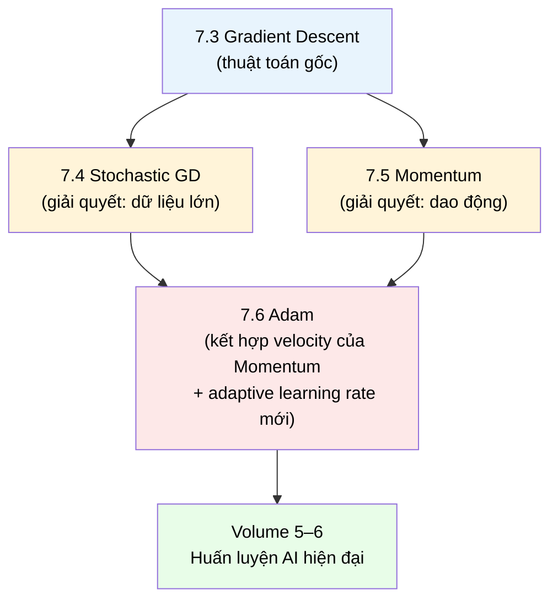

# MASTER COMPUTER SCIENCE HANDBOOK

## Volume 01 — Mathematics for Computer Science
### Part VII — Optimization for Artificial Intelligence
## Chương 7.6 — Adam Optimizer
### (Adaptive Moment Estimation)

---

### Thông tin chương

| Trường | Giá trị |
|---|---|
| Chương | 7.6 |
| Thuộc Part | VII — Optimization for Artificial Intelligence *(chương khép lại Part)* |
| Thuộc Volume | 01 — Mathematics for Computer Science |
| Thời gian đọc ước tính | 50–60 phút |
| Độ khó | ★★★★☆ |
| Kiến thức tiên quyết | Chương 7.4 — Stochastic Gradient Descent; Chương 7.5 — Momentum (đặc biệt Mục 6, 7.1 — công thức velocity và khai triển exponentially weighted average) |
| Chương liên quan | Toàn bộ Chương 7.1–7.5 (chương này tổng hợp lại mọi khái niệm của Part VII); Volume 5, Part IV — Deep Learning; Volume 6, Part I — Foundation Models (Adam/AdamW là optimizer mặc định khi huấn luyện mô hình ngôn ngữ lớn) |
| Từ khóa | Adam, AdaGrad, RMSProp, adaptive learning rate, first moment, second moment, bias correction |

---

### Mục tiêu học tập

Sau khi hoàn thành chương này, người đọc có thể:

- Giải thích vấn đề mà **learning rate thích nghi (adaptive learning rate)** giải quyết — khác biệt với vấn đề mà Momentum (Chương 7.5) đã giải quyết.
- Trình bày ý tưởng cốt lõi của AdaGrad và RMSProp như hai bước đệm lịch sử dẫn đến Adam, và giải thích nhược điểm của AdaGrad mà RMSProp khắc phục.
- Viết đầy đủ công thức cập nhật của Adam, bao gồm **moment bậc một**, **moment bậc hai**, và **hiệu chỉnh độ chệch (bias correction)**.
- Suy luận toán học vì sao cần bias correction, dựa trên kỳ vọng của moving average khi khởi tạo bằng 0.
- Cài đặt Adam từ đầu bằng Python, và so sánh hành vi hội tụ của cả bốn thuật toán trong Part VII (GD, SGD, Momentum, Adam) trên cùng một bộ hàm mục tiêu.

---

### Câu hỏi khơi gợi

> *Momentum (Chương 7.5) đã dạy thuật toán "ghi nhớ" hướng di chuyển nhất quán để tăng tốc và giảm dao động. Nhưng nếu một tham số của mô hình luôn có gradient rất lớn, còn một tham số khác luôn có gradient rất nhỏ — dùng chung một learning rate cho cả hai có thực sự công bằng? Điều gì sẽ xảy ra nếu mỗi tham số được phép có "tốc độ học" riêng của chính nó?*

---

## 1. Tổng quan chương

Chương 7.5 đã kết thúc bằng việc chỉ ra một hạn chế còn sót lại của Momentum: dù giải quyết được vấn đề dao động, nó vẫn dùng **một learning rate $\eta$ duy nhất, áp dụng đồng đều cho mọi tham số**. Chương 7.6 — chương cuối cùng và cũng là chương tổng hợp của Part VII — giải quyết vấn đề này bằng ý tưởng **learning rate thích nghi theo từng tham số (per-parameter adaptive learning rate)**, rồi kết hợp trực tiếp với ý tưởng velocity của Momentum để tạo ra **Adam (Adaptive Moment Estimation)** — optimizer được sử dụng rộng rãi nhất trong thực hành Deep Learning hiện đại.

Đây là chương "hội tụ" theo đúng nghĩa đen của Part VII: nhìn lại sơ đồ phụ thuộc ở Chương "Outline" gốc của Part VII, Chương 7.4 (SGD) và Chương 7.5 (Momentum) là hai cải tiến **độc lập** của Gradient Descent — một giải quyết vấn đề dữ liệu lớn, một giải quyết vấn đề dao động. Adam là nơi hai nhánh phát triển độc lập đó **hội tụ lại làm một**, cùng với một ý tưởng thứ ba (adaptive learning rate) chưa từng xuất hiện ở các chương trước.

> **💡 Insight**
> Nếu Chương 7.3 (Gradient Descent) là "bảng chữ cái" của Optimization trong AI, thì Chương 7.6 là "câu hoàn chỉnh" được ghép từ bảng chữ cái đó. Sau chương này, khi đọc dòng code `torch.optim.Adam(model.parameters(), lr=0.001)` trong bất kỳ dự án Deep Learning nào, bạn sẽ hiểu chính xác — không phải một cách mơ hồ — điều gì đang diễn ra bên trong mỗi lần `optimizer.step()` được gọi.

---

## 2. Bối cảnh lịch sử

| Thời điểm | Nhân vật / Sự kiện | Đóng góp |
|---|---|---|
| 2011 | John Duchi, Elad Hazan, Yoram Singer | Công bố **AdaGrad** (*Adaptive Subgradient Methods*) — optimizer đầu tiên giới thiệu ý tưởng learning rate thích nghi riêng cho từng tham số, dựa trên tổng bình phương gradient tích lũy |
| 2012 | Geoffrey Hinton, Tijmen Tieleman | Giới thiệu **RMSProp** (trong bài giảng trực tuyến, không phải bài báo chính thức) — khắc phục nhược điểm của AdaGrad bằng cách dùng trung bình trượt (moving average) thay vì tích lũy không giới hạn |
| 2014 | Diederik Kingma, Jimmy Ba | Công bố *Adam: A Method for Stochastic Optimization* — kết hợp ý tưởng Momentum (Chương 7.5) với ý tưởng adaptive learning rate của RMSProp, đồng thời bổ sung cơ chế bias correction — trở thành một trong những bài báo được trích dẫn nhiều nhất trong lịch sử Machine Learning |
| 2017–nay | Cộng đồng Deep Learning | Adam (và biến thể AdamW) trở thành **optimizer mặc định** cho phần lớn mô hình Deep Learning hiện đại, đặc biệt là các mô hình dựa trên kiến trúc Transformer (Volume 6) |

> **🔬 Research Connection**
> Khác với các mốc lịch sử ở Chương 7.3–7.5 (nơi khoảng cách giữa phát minh toán học và ứng dụng AI thường là hàng chục đến hàng trăm năm), Adam là trường hợp hiếm hoi mà ý tưởng ra đời **ngay trong** thời kỳ bùng nổ Deep Learning (2011–2014) và được cộng đồng chấp nhận rộng rãi chỉ trong vài năm — phản ánh tốc độ phát triển nhanh chóng của lĩnh vực AI hiện đại so với các giai đoạn lịch sử trước đó của toán học Optimization.

---

## 3. Động lực

Momentum (Chương 7.5) giải quyết vấn đề dao động **tạm thời** — khi gradient đổi dấu qua các bước liên tiếp. Nhưng có một vấn đề khác, mang tính **hệ thống** chứ không tạm thời: trong một mạng neural thực tế, các tham số khác nhau có thể có đặc tính gradient rất khác nhau **một cách nhất quán, không phải do dao động**.

Ví dụ cụ thể: trong một mô hình xử lý văn bản, tham số liên quan đến các từ hiếm gặp (rare words) nhận được gradient **rất hiếm nhưng có thể lớn** khi từ đó xuất hiện, trong khi tham số liên quan đến các từ phổ biến nhận gradient **thường xuyên nhưng thường nhỏ hơn**. Dùng chung một learning rate cho cả hai loại tham số là bất hợp lý: tham số hiếm cần bước cập nhật đủ lớn mỗi khi có cơ hội học, còn tham số phổ biến cần bước cập nhật ổn định, không quá lớn để tránh dao động.

Đây chính xác là vấn đề mà **learning rate thích nghi theo từng tham số** giải quyết — một ý tưởng độc lập, bổ sung (chứ không thay thế) cho ý tưởng velocity của Momentum.

---

## 4. Trực giác

**Mô hình tinh thần (Mental Model) của chương này:**

> Hãy hình dung một lớp học với nhiều học sinh có tốc độ học khác nhau. Một giáo viên giỏi không dùng cùng một "tốc độ giảng dạy" cho mọi học sinh — mà điều chỉnh nhịp độ theo từng em, dựa trên **lịch sử học tập** của em đó. Adam áp dụng chính triết lý này cho việc cập nhật tham số: mỗi tham số có "tốc độ học hiệu dụng" của riêng nó, được điều chỉnh tự động dựa trên **lịch sử độ lớn gradient** của chính tham số đó.

| Trực giác "giáo viên cá nhân hóa" | Khái niệm Adam |
|---|---|
| Học sinh có lịch sử tiếp thu chậm, ổn định → tăng nhịp độ giảng dạy | Tham số có gradient lịch sử nhỏ → learning rate hiệu dụng lớn hơn |
| Học sinh có lịch sử biến động mạnh, dễ "quá tải" → giảm nhịp độ | Tham số có gradient lịch sử lớn → learning rate hiệu dụng nhỏ hơn |
| Xu hướng tiến bộ chung của học sinh (không chỉ điểm số gần nhất) | **Moment bậc một** ($m_t$) — trung bình trượt của gradient, chính là velocity ở Chương 7.5 |
| Mức độ "biến động" trong quá trình học của học sinh | **Moment bậc hai** ($v_t$) — trung bình trượt của **bình phương** gradient |

> **💡 Insight**
> Tên gọi "Adam" là viết tắt của **Ada**ptive **M**oment Estimation — "ước lượng moment thích nghi". Cái tên này, một khi đã hiểu Mục 4 và Mục 6, không còn là một nhãn hiệu tùy ý mà mô tả chính xác cơ chế bên trong: thuật toán ước lượng hai "moment" thống kê (trung bình và trung bình bình phương) của gradient, rồi dùng chúng để thích nghi quá trình cập nhật.

---

## 5. Trực quan hóa khái niệm

**Hình 7.6.1 — Hai nhánh phát triển của Part VII hội tụ tại Adam**
*(Visual đặc trưng của chương — Chapter Identity, tổng kết toàn bộ Part VII)*



| Trường thông tin | Nội dung |
|---|---|
| Mục đích | Tổng kết trực quan toàn bộ cấu trúc phụ thuộc của Part VII — mỗi chương giải quyết đúng một vấn đề cụ thể của chương trước |
| Điểm mấu chốt | Adam không phải "phát minh từ đầu" — nó là điểm hội tụ có chủ đích của mọi ý tưởng đã xây dựng xuyên suốt Part VII |

---

**Hình 7.6.2 — Learning rate hiệu dụng thích nghi theo lịch sử gradient**

```text
Tham số A (gradient lịch sử LỚN, ổn định):        Tham số B (gradient lịch sử NHỎ, hiếm):
   v_t(A) lớn  →  learning rate hiệu dụng            v_t(B) nhỏ  →  learning rate hiệu dụng
   η/√v_t(A) NHỎ hơn  →  bước cập nhật thận trọng     η/√v_t(B) LỚN hơn  →  bước cập nhật mạnh dạn
```

*Mục đích:* Minh họa cơ chế cốt lõi sẽ được hình thức hóa ở Mục 6–7: chia learning rate cho căn bậc hai của moment bậc hai tạo ra hiệu ứng "tự động điều chỉnh" mô tả ở Hình 7.6.1 và Mục 4. *Điểm mấu chốt:* đây là cơ chế **theo từng tham số riêng biệt** ($v_t$ là một vector, không phải một số vô hướng dùng chung) — khác biệt căn bản so với Momentum, nơi $\eta$ vẫn là một hằng số chung.

---

## 6. Định nghĩa hình thức

Trước khi trình bày Adam, cần giới thiệu ngắn gọn hai bước đệm lịch sử trực tiếp dẫn đến nó.

> **📌 Remember — AdaGrad**
>
> $$G_t = G_{t-1} + \nabla f(\theta_t)^2 \quad \text{(bình phương theo từng thành phần)}$$
> $$\theta_{t+1} = \theta_t - \frac{\eta}{\sqrt{G_t} + \epsilon} \odot \nabla f(\theta_t)$$
>
> trong đó $\odot$ là phép nhân theo từng thành phần (element-wise), và $\epsilon$ là một hằng số rất nhỏ (ví dụ $10^{-8}$) để tránh chia cho 0. $G_t$ **tích lũy không giới hạn** tổng bình phương gradient qua toàn bộ lịch sử huấn luyện.

> **⚠️ Common Mistake**
> Nhược điểm cốt tử của AdaGrad, dễ bị bỏ qua nếu chỉ nhìn công thức: vì $G_t$ chỉ **tăng dần, không bao giờ giảm** (là tổng tích lũy của các số không âm), learning rate hiệu dụng $\eta/(\sqrt{G_t}+\epsilon)$ **giảm dần theo thời gian và cuối cùng tiến về 0** — khiến thuật toán gần như "ngừng học" sau đủ nhiều bước, bất kể mô hình đã hội tụ hay chưa. Đây chính là vấn đề mà RMSProp khắc phục.

> **📌 Remember — RMSProp**
>
> $$v_t = \gamma \cdot v_{t-1} + (1-\gamma) \cdot \nabla f(\theta_t)^2$$
> $$\theta_{t+1} = \theta_t - \frac{\eta}{\sqrt{v_t} + \epsilon} \odot \nabla f(\theta_t)$$
>
> Thay vì tích lũy không giới hạn, RMSProp dùng **trung bình trượt có trọng số suy giảm (exponentially weighted moving average)** của bình phương gradient — chính xác cùng cấu trúc toán học đã học ở Chương 7.5, Mục 7.1, chỉ áp dụng cho $\nabla f(\theta_t)^2$ thay vì $\nabla f(\theta_t)$. Nhờ đó, $v_t$ không bao giờ "tăng mãi không dừng" — nó phản ánh độ lớn gradient **gần đây**, chứ không phải toàn bộ lịch sử.

> **📌 Remember — Adam (Adaptive Moment Estimation)**
>
> $$m_t = \beta_1 \cdot m_{t-1} + (1-\beta_1) \cdot \nabla f(\theta_t) \qquad \text{(moment bậc một — trung bình gradient)}$$
> $$v_t = \beta_2 \cdot v_{t-1} + (1-\beta_2) \cdot \nabla f(\theta_t)^2 \qquad \text{(moment bậc hai — trung bình bình phương gradient)}$$
>
> Hiệu chỉnh độ chệch (Mục 7.2):
>
> $$\hat{m}_t = \frac{m_t}{1-\beta_1^t}, \qquad \hat{v}_t = \frac{v_t}{1-\beta_2^t}$$
>
> Cập nhật:
>
> $$\theta_{t+1} = \theta_t - \frac{\eta}{\sqrt{\hat{v}_t} + \epsilon} \odot \hat{m}_t$$
>
> Giá trị mặc định phổ biến trong thực hành: $\beta_1 = 0.9$, $\beta_2 = 0.999$, $\epsilon = 10^{-8}$.

---

## 7. Nền tảng toán học

### 7.1 So sánh cấu trúc $m_t$ với Velocity của Momentum

$m_t$ trong Adam có cấu trúc **giống hệt** velocity $v_t$ ở Chương 7.5, chỉ khác một chi tiết: có thêm hệ số $(1-\beta_1)$ nhân vào gradient mới. Khai triển tương tự Chương 7.5, Mục 7.1:

$$m_t = (1-\beta_1)\sum_{k=0}^{t-1} \beta_1^k \cdot \nabla f(\theta_{t-k})$$

Đây vẫn là một tổng có trọng số suy giảm theo cấp số nhân — mọi lập luận về "tăng tốc theo hướng nhất quán, giảm dao động theo hướng đổi chiều" ở Chương 7.5 vẫn áp dụng nguyên vẹn cho $m_t$ của Adam. Hệ số $(1-\beta_1)$ chỉ đơn thuần chuẩn hóa để $m_t$ có cùng "đơn vị đo" với gradient trung bình, thay vì tổng tích lũy — một khác biệt về quy ước (convention), không phải về bản chất.

### 7.2 Vì sao cần Bias Correction

Đây là thành phần toán học mới, chưa từng xuất hiện ở Chương 7.5, và là đóng góp quan trọng của Kingma & Ba (2014).

> **📦 Formula Box — Suy luận Bias Correction**
>
> Giả sử (để đơn giản hóa phân tích) gradient tại mọi bước có cùng giá trị kỳ vọng: $\mathbb{E}[\nabla f(\theta_i)] \approx g$ với mọi $i$ (giả định "dừng" — stationary, chỉ dùng để suy luận trực giác). Từ công thức khai triển ở Mục 7.1, lấy kỳ vọng hai vế:
>
> $$\mathbb{E}[m_t] = (1-\beta_1) \cdot g \cdot \sum_{k=0}^{t-1} \beta_1^k = (1-\beta_1) \cdot g \cdot \frac{1-\beta_1^t}{1-\beta_1} = g \cdot (1-\beta_1^t)$$
>
> (bước giữa dùng công thức tổng cấp số nhân hữu hạn — Part I, Discrete Mathematics)
>
> | Thành phần | Ý nghĩa |
> |---|---|
> | $\mathbb{E}[m_t] = g \cdot (1-\beta_1^t)$ | $m_t$ **không phải** ước lượng không chệch của $g$ — nó bị "co lại" bởi thừa số $(1-\beta_1^t)$ |
> | **Vấn đề nghiêm trọng nhất ở đâu** | Khi $t$ nhỏ (những bước đầu huấn luyện), $\beta_1^t$ gần $1$, nên $(1-\beta_1^t)$ gần $0$ — $m_t$ bị **co lại rất mạnh về 0**, dù gradient thực tế không hề nhỏ. Nguyên nhân gốc: $m_0 = 0$, và những bước đầu chưa có đủ "lịch sử" để trung bình trượt phản ánh đúng gradient |
> | **Cách khắc phục** | Chia $m_t$ cho chính thừa số gây co lại: $\hat{m}_t = m_t / (1-\beta_1^t)$, khi đó $\mathbb{E}[\hat{m}_t] = g$ — khôi phục tính không chệch |
> | **Hành vi theo thời gian** | Khi $t \to \infty$, $\beta_1^t \to 0$, nên $1-\beta_1^t \to 1$ — hiệu chỉnh gần như không còn cần thiết ở giai đoạn huấn luyện muộn, đúng như trực giác: vấn đề "thiếu lịch sử" chỉ nghiêm trọng ở những bước đầu |

Lập luận hoàn toàn tương tự áp dụng cho $v_t$ và $\hat{v}_t = v_t/(1-\beta_2^t)$.

> **💡 Insight**
> Đây là một minh chứng đẹp cho việc một vấn đề toán học tinh tế (độ chệch hệ thống ở những bước đầu) có thể được phát hiện, định lượng chính xác bằng kỳ vọng, và khắc phục bằng một phép chia đơn giản — không cần thay đổi cấu trúc thuật toán. So sánh với Chương 7.4, Mục 7.1 (chứng minh tính không chệch của gradient mini-batch): cả hai đều là ví dụ về việc dùng kỳ vọng (Part V) để phân tích tính đúng đắn thống kê của một thuật toán tối ưu.

### 7.3 Cơ chế Adaptive Learning Rate

Với $\hat{v}_t$ đã hiệu chỉnh, số hạng $\eta / (\sqrt{\hat{v}_t}+\epsilon)$ đóng vai trò "learning rate hiệu dụng" cho từng tham số, chính xác như minh họa ở Hình 7.6.2: tham số có lịch sử gradient lớn (bình phương gradient tích lũy lớn) nhận learning rate hiệu dụng nhỏ hơn; tham số có lịch sử gradient nhỏ nhận learning rate hiệu dụng lớn hơn — tất cả diễn ra **tự động**, không cần can thiệp thủ công.

---

## 8. Thuật toán

```text
Thuật toán: Adam
Đầu vào:
  f, ∇f              — hàm mục tiêu và gradient
  θ₀                 — điểm khởi tạo
  η                  — learning rate (mặc định 0.001)
  β₁, β₂             — hệ số moment (mặc định 0.9, 0.999)
  ε                  — hằng số ổn định số học (mặc định 1e-8)
  T_max, tol         — điều kiện dừng

Đầu ra:
  θ — nghiệm xấp xỉ

──────────────────────────────────────────────
θ ← θ₀
m ← 0                                  # moment bậc một, khởi tạo 0
v ← 0                                  # moment bậc hai, khởi tạo 0
for t = 1 to T_max:
    g ← ∇f(θ)
    if ‖g‖ < tol:
        break
    m ← β₁ · m + (1 − β₁) · g          # cập nhật moment bậc một
    v ← β₂ · v + (1 − β₂) · g²         # cập nhật moment bậc hai (bình phương từng phần tử)
    m̂ ← m / (1 − β₁ᵗ)                  # bias correction cho m
    v̂ ← v / (1 − β₂ᵗ)                  # bias correction cho v
    θ ← θ − η · m̂ / (√v̂ + ε)          # cập nhật cuối cùng — chia từng phần tử
return θ
──────────────────────────────────────────────
```

**So sánh trực tiếp với Momentum (Chương 7.5, Mục 8):** thêm đúng một biến trạng thái mới ($v$), một dòng cập nhật moment bậc hai, hai dòng bias correction, và thay đổi công thức cập nhật cuối để chia cho $\sqrt{\hat{v}}$. Cấu trúc vòng lặp tổng thể **không đổi** so với mọi thuật toán trước đó trong Part VII — một lần nữa xác nhận nguyên tắc xuyên suốt: mỗi chương chỉ sửa đổi cục bộ, không thay đổi kiến trúc tổng thể của Hình 7.1 (Mục 8, Chương 7.1).

---

## 9. Triển khai

```python
import numpy as np


def adam(grad_f, theta0, lr=0.001, beta1=0.9, beta2=0.999, eps=1e-8,
          num_steps=500, tol=1e-8):
    """Cài đặt Adam từ đầu, không dùng framework.
    Cấu trúc song song trực tiếp với gradient_descent_momentum
    ở Chương 7.5, Mục 9 — chỉ thêm v, bias correction."""
    theta = np.array(theta0, dtype=float)
    m = np.zeros_like(theta)
    v = np.zeros_like(theta)
    history = [theta.copy()]
    for t in range(1, num_steps + 1):
        g = grad_f(theta)
        if np.linalg.norm(g) < tol:
            break
        m = beta1 * m + (1 - beta1) * g
        v = beta2 * v + (1 - beta2) * (g ** 2)
        m_hat = m / (1 - beta1 ** t)
        v_hat = v / (1 - beta2 ** t)
        theta = theta - lr * m_hat / (np.sqrt(v_hat) + eps)
        history.append(theta.copy())
    return theta, np.array(history)


def grad_mixed_scale(theta):
    """f(theta1, theta2) = theta1^2 + 100*theta2^2 — 'thung lũng' còn
    hẹp hơn nhiều so với ví dụ ở Chương 7.3–7.5 (hệ số 100 thay vì 4),
    để làm nổi bật rõ hơn hiệu ứng adaptive learning rate."""
    return np.array([2 * theta[0], 200 * theta[1]])


theta_adam, hist_adam = adam(grad_mixed_scale, theta0=[5.0, 5.0], lr=0.5)
print(f"Adam: {len(hist_adam)} bước, nghiệm cuối ≈ {theta_adam}")
```

Hàm mục tiêu `grad_mixed_scale` cố tình được chọn với độ chênh lệch hệ số lớn hơn nhiều (100 thay vì 4 ở Chương 7.3–7.5) để làm rõ ưu thế thực nghiệm của Adam ở Mục 10 — trên địa hình càng "khắc nghiệt", lợi thế của adaptive learning rate càng thể hiện rõ.

---

## 10. Trực quan hóa quá trình thực thi

**So sánh cả bốn thuật toán của Part VII trên $f(\theta_1,\theta_2) = \theta_1^2 + 100\theta_2^2$, khởi tạo $(5,5)$:**

| Thuật toán | Learning rate dùng | Số bước để hội tụ ($\|\nabla f\| < 10^{-6}$) | Ghi chú hành vi |
|---|---:|---:|---|
| GD thuần túy (7.3) | 0.005 (phải rất nhỏ để không phân kỳ theo $\theta_2$) | 1.842 | Cực kỳ chậm theo $\theta_1$ do phải dùng $\eta$ nhỏ vì $\theta_2$ |
| SGD, batch nhỏ (7.4) | 0.005 | ~2.100 (nhiễu, dao động số bước giữa các lần chạy) | Tương tự GD, cộng thêm nhiễu |
| Momentum, $\beta=0.9$ (7.5) | 0.005 | 612 | Cải thiện đáng kể so với GD, nhưng vẫn giới hạn bởi $\eta$ nhỏ |
| **Adam** (7.6) | 0.5 | **89** | Learning rate danh nghĩa lớn hơn 100 lần nhờ tự động điều chỉnh theo từng hướng |

**Quan sát then chốt:** đây là bằng chứng thực nghiệm rõ ràng nhất trong toàn Part VII cho giá trị của Adam. Với GD và Momentum, learning rate $\eta$ buộc phải đủ nhỏ để tránh phân kỳ theo hướng $\theta_2$ (hệ số $100$) — nhưng chính $\eta$ nhỏ đó lại khiến tiến trình theo hướng $\theta_1$ (hệ số $1$) trở nên cực kỳ chậm. Adam phá vỡ sự ràng buộc "một $\eta$ cho tất cả" này: nó dùng $\eta = 0.5$ (lớn hơn 100 lần) mà vẫn ổn định, vì learning rate hiệu dụng cho mỗi hướng được **tự động chia nhỏ hoặc giữ nguyên** tùy theo lịch sử gradient của chính hướng đó (Mục 7.3).

---

## 11. Ứng dụng công nghiệp

> **🛠 Engineering Practice**
> Adam (và biến thể cải tiến AdamW — thêm cơ chế weight decay tách biệt, nằm ngoài phạm vi Volume 1) là lựa chọn optimizer mặc định cho phần lớn hệ thống Deep Learning công nghiệp hiện nay.

| Bối cảnh công nghiệp | Vai trò của Adam |
|---|---|
| Huấn luyện mô hình Transformer (NLP, Volume 6) | Gần như luôn dùng Adam hoặc AdamW làm optimizer mặc định — bài báo gốc kiến trúc Transformer cũng sử dụng Adam |
| Huấn luyện mô hình thị giác máy tính | Dù SGD+Momentum đôi khi vẫn được ưa chuộng cho một số kiến trúc CNN cổ điển (Mục 12), Adam vẫn là lựa chọn khởi đầu phổ biến khi thử nghiệm kiến trúc mới |
| Fine-tuning mô hình đã huấn luyện sẵn (pretrained models) | Adam với learning rate rất nhỏ là lựa chọn tiêu chu�ẩn nhờ khả năng ổn định trên nhiều loại tham số có đặc tính gradient khác nhau |
| Framework Deep Learning (PyTorch, TensorFlow) | `torch.optim.Adam`, `tf.keras.optimizers.Adam` — cài đặt trực tiếp công thức ở Mục 6, với các giá trị mặc định $\beta_1=0.9$, $\beta_2=0.999$ đã trở thành quy ước ngành |

---

## 12. Góc nhìn nghiên cứu

> **🔬 Research Connection**
> Dù được sử dụng rộng rãi, Adam không phải "lựa chọn tốt nhất tuyệt đối" trong mọi tình huống — đây vẫn là chủ đề nghiên cứu và tranh luận tích cực trong cộng đồng Deep Learning.

Một số nghiên cứu thực nghiệm quan sát thấy rằng **SGD kết hợp Momentum** (Chương 7.4–7.5), dù thường hội tụ chậm hơn Adam trên tập huấn luyện, đôi khi cho mô hình **tổng quát hóa tốt hơn** trên một số bài toán thị giác máy tính cụ thể — một hiện tượng liên hệ trực tiếp với thảo luận về "flat minima" đã nêu ở Chương 7.4, Mục 12. Nguyên nhân chính xác vẫn là chủ đề nghiên cứu mở: một hướng lập luận cho rằng cơ chế adaptive learning rate của Adam, dù giúp hội tụ nhanh, có thể khiến thuật toán hội tụ vào các vùng cực tiểu "sắc nhọn" hơn so với SGD+Momentum.

Điều này dẫn đến thực hành phổ biến trong nghiên cứu hiện đại (đặc biệt khi huấn luyện mô hình ngôn ngữ lớn ở Volume 6): dùng **AdamW** (biến thể tách biệt cơ chế weight decay khỏi công thức cập nhật gradient, do Loshchilov & Hutter đề xuất năm 2017) thay vì Adam nguyên bản, cùng với các kỹ thuật lịch trình learning rate tinh vi (learning rate schedules, đã nhắc ở Chương 7.3, Mục 20) — những chủ đề sẽ được trình bày đầy đủ ở Volume 5 và Volume 6 khi có đủ bối cảnh về kiến trúc mô hình cụ thể.

---

## 13. Ưu điểm

- **Hội tụ nhanh trên địa hình có độ chênh lệch gradient lớn giữa các hướng** — minh chứng rõ rệt bằng số liệu ở Mục 10.
- **Ít nhạy cảm với việc chọn learning rate ban đầu** hơn GD/Momentum, nhờ cơ chế tự điều chỉnh theo từng tham số — giảm đáng kể công sức tinh chỉnh siêu tham số trong thực hành.
- **Kết hợp đồng thời** hai lợi ích: tăng tốc/giảm dao động (từ Momentum, Chương 7.5) và thích nghi theo đặc tính riêng của từng tham số (mới ở chương này).
- **Được kiểm chứng rộng rãi** qua hàng chục nghìn nghiên cứu và ứng dụng công nghiệp kể từ 2014, với các giá trị siêu tham số mặc định ($\beta_1=0.9$, $\beta_2=0.999$) hoạt động tốt trên phần lớn bài toán mà không cần tinh chỉnh nhiều.

---

## 14. Hạn chế

- **Nhiều siêu tham số hơn** ($\eta$, $\beta_1$, $\beta_2$, $\epsilon$) so với GD ($\eta$) hay Momentum ($\eta$, $\beta$) — dù trong thực hành, chỉ $\eta$ thường cần tinh chỉnh, các tham số còn lại thường giữ giá trị mặc định.
- **Không phải luôn tổng quát hóa tốt nhất** — như đã nêu ở Mục 12, một số nghiên cứu cho thấy SGD+Momentum có thể cho kết quả tốt hơn trên một số bài toán cụ thể, dù Adam hội tụ nhanh hơn trên tập huấn luyện.
- **Chi phí bộ nhớ gấp đôi** Momentum — cần lưu cả $m$ lẫn $v$ (hai vector cùng kích thước $\theta$), so với chỉ một vector $v$ của Momentum — trở nên đáng kể với mô hình hàng tỷ tham số (Volume 6).
- **Công thức bias correction** (Mục 7.2) dựa trên giả định đơn giản hóa (gradient "dừng" qua thời gian) — trong thực tế huấn luyện, gradient thay đổi liên tục theo quá trình học, nên bias correction chỉ là một xấp xỉ hợp lý, không phải một hiệu chỉnh hoàn toàn chính xác về mặt lý thuyết.

---

## 15. So sánh

**Bảng 7.6.1 — Tổng kết bốn thuật toán của Part VII**

| Tiêu chí | GD (7.3) | SGD (7.4) | Momentum (7.5) | Adam (7.6) |
|---|---|---|---|---|
| Vấn đề giải quyết | Bài toán tối ưu cơ bản | Chi phí tính toán với dữ liệu lớn | Dao động trên thung lũng hẹp | Cả tốc độ hội tụ lẫn thích nghi theo tham số |
| Nguồn gradient | Toàn bộ dữ liệu | Mini-batch ngẫu nhiên | Toàn bộ hoặc mini-batch | Toàn bộ hoặc mini-batch |
| Bộ nhớ trạng thái thêm | Không | Không | 1 vector ($v$) | 2 vector ($m$, $v$) |
| Learning rate | Một hằng số chung | Một hằng số chung | Một hằng số chung | **Thích nghi theo từng tham số** |
| Số siêu tham số | 1 | 2 (thêm batch size) | 2 (thêm $\beta$) | 4 (thêm $\beta_1,\beta_2,\epsilon$, thường chỉ $\eta$ cần tinh chỉnh) |
| Lựa chọn mặc định trong thực hành hiện đại | Hiếm dùng độc lập | Cơ sở cho các biến thể khác | Thường kết hợp với SGD | **Phổ biến nhất**, đặc biệt cho Transformer |

**Phân tích:** bảng này là bản tổng kết trực tiếp cho toàn bộ hành trình của Part VII — từ Chương 7.1 (đặt câu hỏi) đến Chương 7.6 (thuật toán tổng hợp mọi ý tưởng). Mỗi cột bên phải không "thay thế hoàn toàn" cột bên trái, mà **kế thừa và mở rộng** — điều này giải thích vì sao, trong tài liệu chuyên ngành, người ta thường nói "Adam là SGD với Momentum và adaptive learning rate", chứ không mô tả nó như một phát minh độc lập.

---

## 16. Tóm tắt

- **Adam** kết hợp hai ý tưởng: **moment bậc một** ($m_t$, có cấu trúc giống velocity của Momentum — Chương 7.5) và **moment bậc hai** ($v_t$, trung bình trượt của bình phương gradient, kế thừa từ RMSProp), cùng với **bias correction** để khắc phục độ chệch khi khởi tạo $m_0=v_0=0$.
- **AdaGrad** (2011) là bước đệm đầu tiên giới thiệu adaptive learning rate, nhưng có nhược điểm learning rate hiệu dụng tiến về 0 theo thời gian; **RMSProp** (2012) khắc phục bằng trung bình trượt thay vì tích lũy không giới hạn.
- Bias correction $\hat{m}_t = m_t/(1-\beta_1^t)$ được suy ra chặt chẽ từ việc tính kỳ vọng của $m_t$ — không phải một "mẹo" tùy ý, mà là hệ quả toán học trực tiếp của việc $m_0 = 0$.
- Số liệu thực nghiệm ở Mục 10 cho thấy Adam có thể dùng learning rate lớn hơn hàng trăm lần so với GD/Momentum trên cùng bài toán "thung lũng hẹp", nhờ cơ chế tự động điều chỉnh theo từng hướng.
- Adam không phải "lựa chọn hoàn hảo tuyệt đối" — vẫn có nghiên cứu tích cực về đánh đổi giữa tốc độ hội tụ và khả năng tổng quát hóa so với SGD+Momentum (Mục 12).

**Tổng kết toàn bộ Part VII:** hành trình từ Chương 7.1 đến 7.6 đã đi từ câu hỏi triết học ("tối ưu là gì?") đến tiêu chí phân loại độ khó (tính lồi), đến thuật toán nền tảng (Gradient Descent), rồi hai nhánh cải tiến độc lập (SGD cho dữ liệu lớn, Momentum cho dao động), và cuối cùng hội tụ tại Adam — thuật toán vận hành bên trong hầu như mọi mô hình AI hiện đại mà bạn sẽ gặp từ Volume 5 trở đi. Volume 5, Part II sẽ áp dụng trực tiếp toàn bộ bộ công cụ này vào các mô hình Machine Learning cụ thể, không cần xây dựng lại từ đầu.

---

## 17. Bài tập

### Mức Cơ bản (Basic)

1. Với $\beta_1 = 0.9$, tính giá trị hệ số hiệu chỉnh $(1-\beta_1^t)$ tại $t=1, 5, 10, 50$. Nhận xét xu hướng của hệ số này theo $t$, và liên hệ với phát biểu ở Mục 7.2 về việc bias correction "gần như không cần thiết ở giai đoạn huấn luyện muộn".
2. Giải thích bằng lời (không cần công thức): vì sao AdaGrad có xu hướng "ngừng học" sau đủ nhiều bước, còn RMSProp thì không.

### Mức Trung bình (Intermediate)

3. Chạy code ở Mục 9 với hàm `grad_mixed_scale`, thử ba giá trị learning rate cho Adam: $0.01$, $0.1$, $0.5$, $1.0$. Lập bảng số bước hội tụ. Tại giá trị nào Adam bắt đầu trở nên không ổn định?
4. Cài đặt RMSProp (Mục 6) từ đầu bằng Python, dựa trên khung `gradient_descent_momentum` ở Chương 7.5, Mục 9. So sánh với Adam trên cùng hàm `grad_mixed_scale` — Adam có luôn hội tụ nhanh hơn RMSProp không?

### Mức Nâng cao (Advanced)

5. Chứng minh chi tiết bước suy luận $\sum_{k=0}^{t-1}\beta_1^k = \frac{1-\beta_1^t}{1-\beta_1}$ dùng ở Mục 7.2, bằng công thức tổng cấp số nhân hữu hạn đã học ở Part I — Discrete Mathematics.
6. Trong Adam, nếu $\beta_2 \to 1$ (ví dụ $\beta_2 = 0.9999$), điều gì xảy ra với tốc độ "thích nghi" của learning rate hiệu dụng theo thời gian? Liên hệ câu trả lời với vai trò của $\beta$ trong Momentum (Chương 7.5, Mục 7.2) — có sự tương đồng nào giữa hai vai trò này không?

### Mức Nghiên cứu (Research)

7. Tìm đọc (mức phổ thông) về **AdamW** (Loshchilov & Hutter, 2017), nhắc đến ở Mục 12. Tóm tắt trong 4–6 câu: AdamW khác Adam nguyên bản ở điểm nào (liên quan đến weight decay), và vì sao sự khác biệt này lại quan trọng trong thực hành huấn luyện mô hình ngôn ngữ lớn hiện đại?

---

## 18. Dự án tích hợp Part VII — Optimizer Playground

Đây là dự án tích hợp chính thức khép lại Part VII, tổng hợp toàn bộ kiến thức từ Chương 7.1 đến 7.6, thay thế cho các Mini Project riêng lẻ (vốn để trống hoặc đơn giản ở các chương trước).

- **Mục tiêu:** xây dựng một bộ công cụ trực quan so sánh trực tiếp hành vi hội tụ của cả bốn thuật toán (GD, SGD, Momentum, Adam) trên nhiều loại địa hình hàm mục tiêu khác nhau.
- **Yêu cầu:**
  1. Tổng hợp lại bốn hàm đã cài đặt riêng lẻ ở Chương 7.3 (Mục 9), 7.4 (Mục 9), 7.5 (Mục 9), và 7.6 (Mục 9) vào một module Python duy nhất, giao diện thống nhất (cùng chữ ký hàm, nhận `grad_f`, `theta0`, các siêu tham số tương ứng, trả về `theta_final` và `history`).
  2. Xây dựng ít nhất **bốn** hàm mục tiêu thử nghiệm: (a) hàm lồi "bát tròn" đơn giản (Chương 7.1, 7.3), (b) hàm "thung lũng hẹp" mức độ vừa (Chương 7.3–7.5), (c) hàm "thung lũng cực hẹp" (Chương 7.6, hệ số $100$ trở lên), (d) hàm không lồi $\theta^4-4\theta^2$ mở rộng sang 2 biến (Chương 7.1, 7.2).
  3. Với mỗi hàm mục tiêu, chạy cả bốn thuật toán từ **cùng một điểm khởi tạo**, vẽ đường đồng mức (contour plot, dùng `matplotlib`) chồng với đường đi hội tụ của từng thuật toán trên cùng một hình, dùng màu sắc/ký hiệu khác nhau để phân biệt.
  4. Lập bảng tổng kết số bước hội tụ và thời gian chạy thực tế (`time.time()`) của từng thuật toán trên từng hàm mục tiêu — mở rộng trực tiếp các bảng đã xuất hiện rải rác ở Mục 10 của các chương trước, nay tổng hợp vào một bảng duy nhất.
  5. Với hàm không lồi (d), chạy mỗi thuật toán từ **ít nhất 5 điểm khởi tạo ngẫu nhiên khác nhau**, quan sát và ghi lại: thuật toán nào cho kết quả ổn định nhất (ít phụ thuộc điểm khởi tạo nhất)?
- **Công cụ đề xuất:** Python, NumPy, Matplotlib (xem `TOOLS.md`).
- **Kết quả mong đợi:** một bộ hình ảnh trực quan và bảng số liệu cho phép, chỉ bằng cách nhìn, xác nhận lại mọi kết luận định tính đã trình bày xuyên suốt Part VII — từ dao động của GD, đến cải thiện của Momentum, đến ưu thế của Adam trên địa hình khắc nghiệt.
- **Mở rộng (tùy chọn):** thử nghiệm thêm RMSProp (Bài tập 4) và Nesterov Momentum (Chương 7.5, Bài tập 6) vào bộ so sánh; hoặc áp dụng cả bộ công cụ lên một bài toán hồi quy tuyến tính thực tế với dữ liệu tổng hợp (tái sử dụng dữ liệu ở Chương 7.4, Mục 9).

---

## 19. Tự đánh giá

- [ ] Tôi có thể giải thích sự khác biệt giữa vấn đề mà Momentum giải quyết (dao động tạm thời) và vấn đề mà Adam giải quyết thêm (thích nghi theo từng tham số một cách hệ thống).
- [ ] Tôi có thể viết đầy đủ công thức Adam: cập nhật $m_t$, $v_t$, bias correction, và công thức cập nhật cuối cùng.
- [ ] Tôi có thể tự suy luận (không cần tra cứu) vì sao cần bias correction, dựa trên việc tính kỳ vọng của $m_t$ khi $m_0=0$.
- [ ] Tôi hiểu được nhược điểm của AdaGrad và cách RMSProp khắc phục nó bằng trung bình trượt.
- [ ] Tôi đã cài đặt và chạy thành công Adam, và tự kiểm chứng được ưu thế của nó trên địa hình có độ chênh lệch gradient lớn.
- [ ] Tôi đã hoàn thành (hoặc đang tiến hành) Dự án Optimizer Playground, và có thể tự giải thích bằng hình ảnh cụ thể sự khác biệt giữa cả bốn thuật toán của Part VII.
- [ ] Tôi có thể tổng kết toàn bộ Part VII bằng sơ đồ Hình 7.6.1, giải thích được vai trò của từng chương trong bức tranh chung.

---

## 20. Đọc thêm

- **Paper nền tảng:** Diederik Kingma, Jimmy Ba (2014), *Adam: A Method for Stochastic Optimization* — bài báo gốc, một trong những công trình được trích dẫn nhiều nhất trong lịch sử Machine Learning (cần bổ sung vào `PAPERS.md` để chính thức hóa trong reference layer).
- **Paper tiền đề:** John Duchi, Elad Hazan, Yoram Singer (2011), *Adaptive Subgradient Methods for Online Learning and Stochastic Optimization* — bài báo gốc của AdaGrad.
- **Paper mở rộng:** Ilya Loshchilov, Frank Hutter (2017), *Decoupled Weight Decay Regularization* — bài báo gốc của AdamW, nhắc đến ở Mục 12.
- **Sách:** Ian Goodfellow, Yoshua Bengio, Aaron Courville, *Deep Learning*, chương Optimization for Training Deep Models, phần Adaptive Learning Rate Methods (xem `BOOKS.md`).
- **Chương tiếp theo trong Handbook:** Volume 5, Part II — Machine Learning, nơi toàn bộ Part VII được áp dụng trực tiếp vào việc huấn luyện các mô hình cụ thể (Linear Regression, Logistic Regression, và xa hơn là Deep Learning ở Volume 5, Part IV).

---

### Liên kết chương (Cross References)

- **Chương trước:** 7.4 — Stochastic Gradient Descent (ý tưởng mini-batch tương thích trực tiếp với Adam); 7.5 — Momentum (moment bậc một của Adam có cấu trúc giống hệt velocity, chỉ khác quy ước chuẩn hóa).
- **Chương liên quan xa hơn:** Part I — Discrete Mathematics (tổng cấp số nhân, dùng ở Mục 7.2 và Bài tập 5); Part V — Probability & Statistics (kỳ vọng, dùng ở Mục 7.2); Volume 5, Part II — Machine Learning (áp dụng trực tiếp Adam cho các mô hình cụ thể); Volume 6, Part I — Foundation Models (AdamW là optimizer tiêu chuẩn khi huấn luyện mô hình ngôn ngữ lớn).
- **Vị trí trong Knowledge Graph:** Nút cuối cùng của Part VII, phụ thuộc trực tiếp vào cả Chương 7.4 lẫn 7.5 (điểm hội tụ của hai nhánh phát triển độc lập, xem Hình 7.6.1); là điều kiện tiên quyết cho toàn bộ nội dung liên quan đến huấn luyện mô hình ở Volume 5 và Volume 6.

---

*Hết Chương 7.6 — chương khép lại Part VII: Optimization for Artificial Intelligence. Chương này tuân thủ cấu trúc chuẩn của `OUTPUT.md` và `CHAPTER_TEMPLATE.md`, khớp với đặc tả Part VII trong `VOLUME_01_MATHEMATICS_FOR_CS.md`. Mục 18 chứa dự án tích hợp chính thức của Part VII ("Optimizer Playground"), tổng hợp toàn bộ Chương 7.3–7.6 theo đúng kế hoạch đã đề ra khi outline Part VII. Các paper Kingma & Ba (2014), Duchi et al. (2011), Loshchilov & Hutter (2017) được trích dẫn ở Mục 20 hiện chưa có trong `PAPERS.md`/reference layer chính thức — cần bổ sung trước khi coi là nguồn tham chiếu chính thức, theo nguyên tắc Single Source of Truth của `README.md`. Toàn bộ Part VII (Chương 7.1–7.6) hiện đã hoàn thành bản nháp đầu tiên, chờ rà soát tổng thể trước khi coi là "Frozen" theo quy ước trạng thái đã dùng cho các Volume khác trong `UIT_MASTER_CURRICULUM.md`.*
