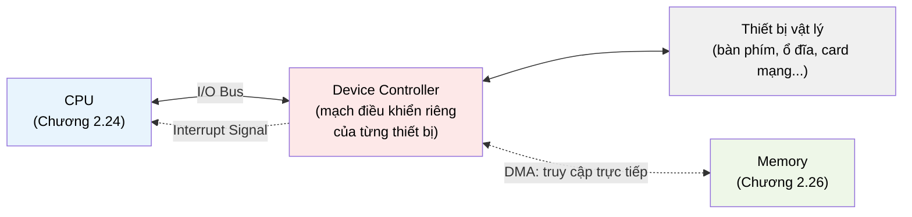

# MASTER COMPUTER SCIENCE HANDBOOK

## Volume 02 — Computer Science Foundations
### Part V — Computer Organization & Architecture
## Chương 2.28 — Input/Output Systems

---

### Thông tin chương

| Trường | Giá trị |
|---|---|
| Chương | 2.28 |
| Thuộc Part | V — Computer Organization & Architecture (chương cuối) |
| Thuộc Volume | 02 — Computer Science Foundations |
| Thời gian đọc ước tính | 45–55 phút |
| Độ khó | ★★★☆☆ |
| Kiến thức tiên quyết | Chương 2.22 — Tổng quan (đặc biệt Hình 2.22.2 — kiến trúc Von Neumann); Chương 2.24 — Datapath và Control Unit (khái niệm Control Signal) |
| Chương liên quan | Volume 2, Part VI — Operating Systems (Device Management sử dụng trực tiếp mọi khái niệm ở chương này) |
| Từ khóa | I/O, Polling, Interrupt, Interrupt Service Routine (ISR), DMA (Direct Memory Access), Device Controller, I/O Bus |

---

### Mục tiêu học tập

Sau khi hoàn thành chương này, người đọc có thể:

- Giải thích vị trí và vai trò của khối **I/O Devices** trong kiến trúc Von Neumann (đã xuất hiện từ Hình 2.22.2 nhưng chưa được giải thích).
- So sánh ba cơ chế giao tiếp CPU–thiết bị ngoại vi: **Polling**, **Interrupt-driven I/O**, và **DMA**.
- Mô tả chu trình xử lý một **Interrupt**, từ khi thiết bị phát tín hiệu đến khi CPU quay lại công việc đang dang dở.
- Tính toán định lượng chi phí CPU bị lãng phí trong cơ chế Polling, so sánh với chi phí của Interrupt.
- Nhận diện mối liên hệ trực tiếp giữa nội dung chương này và **Device Management** — chủ đề sẽ mở ra ở Part VI (Operating Systems).

---

### Câu hỏi khơi gợi

> *Khi bạn gõ một phím trên bàn phím, CPU đang bận xử lý hàng triệu lệnh khác của các chương trình khác — nó không hề "ngồi chờ" bạn gõ phím. Vậy làm sao CPU biết chính xác **thời điểm** một phím vừa được nhấn, mà không cần liên tục dừng lại để hỏi bàn phím "có ai vừa gõ không?" hàng tỷ lần mỗi giây?*

---

## 1. Tổng quan chương

Hình 2.22.2 (Chương 2.22) đã vẽ khối **I/O Devices** như một phần của kiến trúc Von Neumann ngay từ đầu Part V — nhưng suốt các Chương 2.23 đến 2.27, toàn bộ trọng tâm chỉ xoay quanh cách CPU xử lý lệnh (ISA, Datapath, Pipeline) và cách CPU truy cập dữ liệu nội bộ (Memory Hierarchy, Cache). Chương này, chương cuối cùng của Part V, quay lại và hoàn thiện khối còn thiếu: **CPU giao tiếp với thế giới bên ngoài — bàn phím, màn hình, ổ đĩa, card mạng — như thế nào?**

Đây cũng là chương bắc cầu trực tiếp sang Part VI (Operating Systems): mọi cơ chế I/O học ở đây đều được hệ điều hành sử dụng và quản lý thông qua **Device Driver** — phần mềm mà Chương 2.29 (Part VI) sẽ bắt đầu khảo sát.

> **💡 Insight**
> Ba cơ chế I/O trong chương này — Polling, Interrupt, DMA — thực chất là **ba câu trả lời khác nhau cho cùng một câu hỏi tổ chức**: "Ai chủ động khi có việc cần làm — bên hỏi liên tục, hay bên báo khi sẵn sàng?" Đây là câu hỏi thiết kế hệ thống sẽ lặp lại dưới nhiều tên gọi khác trong Handbook: so sánh Polling với Long Polling/WebSocket trong lập trình mạng, hay so sánh với mô hình Publish-Subscribe trong hệ thống phân tán (Volume 4).

---

## 2. Bối cảnh lịch sử

| Thời điểm | Sự kiện | Ý nghĩa |
|---|---|---|
| Những năm 1950s | Các hệ thống I/O sơ khai chủ yếu dùng **Polling** | CPU liên tục kiểm tra trạng thái thiết bị trong một vòng lặp — đơn giản nhưng cực kỳ lãng phí thời gian CPU (Mục 7) |
| Cuối 1950s | Cơ chế **Interrupt** được đưa vào các hệ thống thương mại | Cho phép thiết bị "chủ động báo" CPU khi sẵn sàng, thay vì CPU phải hỏi liên tục — một cải tiến mang tính bước ngoặt cho hiệu năng hệ thống |
| Thập niên 1960s | **DMA (Direct Memory Access)** xuất hiện | Cho phép thiết bị ngoại vi truyền dữ liệu trực tiếp vào/ra Memory **mà không cần CPU can thiệp từng byte** — giải phóng CPU khỏi cả việc di chuyển dữ liệu, không chỉ việc chờ đợi |

---

## 3. Động lực

Chương 2.26 giới thiệu **Memory Wall** — khoảng cách tốc độ giữa CPU và Memory. Đối với I/O, khoảng cách này còn lớn hơn nhiều bậc độ lớn: một CPU hiện đại thực hiện hàng tỷ lệnh mỗi giây, trong khi một thao tác trên bàn phím (con người gõ phím) chỉ diễn ra vài lần mỗi giây, và ngay cả các thiết bị lưu trữ nhanh cũng chậm hơn CPU đáng kể so với tốc độ truy cập Register hay Cache (Chương 2.27).

Nếu CPU dùng cách đơn giản nhất — liên tục hỏi "thiết bị đã sẵn sàng chưa?" trong một vòng lặp (Polling) — thì trong toàn bộ khoảng thời gian chờ đợi đó, CPU **hoàn toàn không làm được việc gì khác**. Đây chính xác là loại lãng phí tài nguyên đã gặp ở Chương 2.24 (Mục 3: các khối Datapath nhàn rỗi) nhưng ở quy mô nghiêm trọng hơn nhiều — không phải vài chu kỳ, mà có thể là hàng triệu chu kỳ lãng phí chỉ để chờ một sự kiện I/O chậm chạp.

---

## 4. Trực giác

**Mô hình tinh thần (Mental Model) của chương này:**

> Hãy tưởng tượng bạn đang chờ một món hàng giao đến (delivery). Có ba cách bạn có thể xử lý việc này:
>
> - **Polling:** cứ mỗi 30 giây, bạn dừng mọi việc đang làm, chạy ra cửa kiểm tra xem hàng đã đến chưa — dù phần lớn thời gian câu trả lời là "chưa".
> - **Interrupt:** bạn tiếp tục làm việc bình thường; khi hàng đến, người giao hàng **bấm chuông** — bạn chỉ dừng việc đang làm đúng lúc chuông reo, không phí thời gian kiểm tra vô ích.
> - **DMA:** bạn thuê hẳn một người quản gia — không chỉ báo khi hàng đến, mà còn tự tay mang hàng vào tận trong nhà, cất đúng chỗ, bạn hoàn toàn không cần can thiệp cho đến khi mọi thứ đã sẵn sàng dùng.

| Trực giác kỹ thuật bạn đã có | Khái niệm I/O tương ứng |
|---|---|
| Vòng lặp `while not ready: pass` liên tục kiểm tra một biến cờ (busy-waiting) | **Polling** |
| Event handler / callback (`onClick`, `addEventListener`) chỉ chạy khi có sự kiện | **Interrupt** và **Interrupt Service Routine (ISR)** |
| Sao chép file lớn "chạy nền" mà không làm đơ giao diện người dùng | **DMA** — CPU "giao việc" rồi tiếp tục làm việc khác |

---

## 5. Trực quan hóa khái niệm

**Hình 2.28.1 — So sánh Polling và Interrupt-driven I/O theo thời gian**
*(Visual đặc trưng của chương — Chapter Identity)*

```text
POLLING:
CPU:  [Việc A][Hỏi?][Việc A][Hỏi?][Việc A][Hỏi?][Việc A][Hỏi? → CÓ!][Xử lý I/O]
                ↑ lãng phí      ↑ lãng phí      ↑ lãng phí
             (thiết bị chưa sẵn sàng — CPU vẫn phải dừng lại kiểm tra)

INTERRUPT:
CPU:  [────────────── Việc A đang chạy liên tục ──────────────][Ngắt!][Xử lý I/O][Việc A tiếp tục]
Thiết bị:                                                        ↑
                                                    (chủ động báo hiệu đúng lúc sẵn sàng)
```

| Trường thông tin | Nội dung |
|---|---|
| Mục đích | Cho thấy trực quan sự khác biệt cốt lõi: Polling buộc CPU phải **chủ động dừng lại kiểm tra** nhiều lần (phần lớn vô ích), trong khi Interrupt để **thiết bị chủ động báo hiệu**, CPU chỉ dừng đúng một lần khi thực sự cần |
| Điểm mấu chốt | Trong sơ đồ Interrupt, "Việc A" chạy liên tục không gián đoạn — đây chính là điều làm nên hiệu năng vượt trội của Interrupt so với Polling, sẽ định lượng hóa ở Mục 7 |

---

**Hình 2.28.2 — Vị trí I/O trong kiến trúc Von Neumann, chi tiết hóa Hình 2.22.2**



*Mục đích:* hoàn thiện Hình 2.22.2 bằng cách phóng to khối "I/O Devices", cho thấy **Device Controller** — một mạch điều khiển riêng cho từng thiết bị — đóng vai trò trung gian giữa CPU và thiết bị vật lý. *Điểm mấu chốt:* đường nét đứt biểu diễn **DMA** cho thấy nó cho phép Device Controller giao tiếp **thẳng với Memory**, hoàn toàn bỏ qua CPU trong quá trình truyền dữ liệu — khác biệt căn bản so với Polling/Interrupt, vốn luôn cần CPU tham gia trực tiếp vào việc di chuyển từng đơn vị dữ liệu.

---

## 6. Định nghĩa hình thức

> **📌 Remember — Ba cơ chế giao tiếp I/O**
>
> | Cơ chế | Định nghĩa |
> |---|---|
> | **Polling** | CPU **chủ động** kiểm tra định kỳ trạng thái thiết bị (thông qua một thanh ghi trạng thái — status register), lặp lại cho đến khi thiết bị sẵn sàng |
> | **Interrupt-driven I/O** | Thiết bị **chủ động** gửi tín hiệu (Interrupt) đến CPU khi sẵn sàng; CPU tạm dừng công việc hiện tại, xử lý I/O, rồi quay lại |
> | **DMA (Direct Memory Access)** | Thiết bị (thông qua Device Controller) **tự truyền dữ liệu trực tiếp vào/ra Memory**, không cần CPU tham gia từng bước; CPU chỉ nhận Interrupt duy nhất một lần khi toàn bộ quá trình truyền hoàn tất |

> **📌 Remember — Interrupt Service Routine (ISR)**
>
> Đoạn chương trình đặc biệt được CPU thực thi ngay khi nhận một Interrupt — tương tự khái niệm **Control Unit sinh Control Signal theo Opcode** ở Chương 2.24, nhưng giờ "sự kiện kích hoạt" không phải một lệnh trong luồng chương trình bình thường, mà là một tín hiệu đến từ **bên ngoài** luồng thực thi hiện tại. Sau khi ISR hoàn tất, CPU khôi phục đúng trạng thái (giá trị PC, Register — Chương 2.24) trước khi Interrupt xảy ra, và tiếp tục công việc dang dở.

**Device Controller** — mạch điều khiển chuyên biệt gắn liền với từng loại thiết bị, đóng vai trò "phiên dịch" giữa giao thức nội bộ của CPU (đã học ở Chương 2.22–2.24) và đặc tính vật lý riêng của từng thiết bị (bàn phím, ổ đĩa...). Đây là lý do CPU không cần "biết" chi tiết kỹ thuật của hàng nghìn loại thiết bị ngoại vi khác nhau trên thị trường — một dạng tách biệt Architecture/Organization (Chương 2.22, Mục 6) áp dụng cho I/O.

---

## 7. Nền tảng toán học

> **📦 Formula Box — Chi phí CPU lãng phí trong Polling**
>
> $$T_{\text{lãng phí}} = N_{\text{poll}} \times T_{\text{poll}}$$
>
> | Thành phần | Ý nghĩa |
> |---|---|
> | $N_{\text{poll}}$ | Số lần CPU kiểm tra trạng thái **trước khi** thiết bị thực sự sẵn sàng (phụ thuộc tốc độ thiết bị và chu kỳ Polling) |
> | $T_{\text{poll}}$ | Thời gian một lần kiểm tra tốn (thường rất nhỏ — vài chu kỳ xung nhịp, theo Chương 2.22, Mục 7) |
> | $T_{\text{lãng phí}}$ | Tổng thời gian CPU **không làm việc hữu ích** khác, dù mỗi lần kiểm tra riêng lẻ rất nhanh |
> | **Diễn giải kỹ thuật** | Với thiết bị chậm (ví dụ chờ người dùng gõ phím, có thể mất hàng trăm triệu chu kỳ), $N_{\text{poll}}$ có thể cực lớn — khiến $T_{\text{lãng phí}}$ áp đảo hoàn toàn thời gian xử lý I/O thực sự, dù $T_{\text{poll}}$ mỗi lần rất nhỏ |
> | **So sánh với Interrupt** | Chi phí Interrupt gần như **không phụ thuộc** vào thời gian chờ — CPU không tốn chu kỳ nào trong lúc chờ, chỉ tốn một khoản chi phí cố định (context switch, đã nêu ở Mục 6) đúng một lần khi Interrupt thực sự xảy ra |

**Ví dụ kiểm chứng:** giả sử $T_{\text{poll}} = 2$ ns, và người dùng mất trung bình 200 ms để gõ phím tiếp theo. Nếu CPU polling mỗi 2 ns một lần: $N_{\text{poll}} \approx \dfrac{200\times10^{6}\text{ ns}}{2\text{ ns}} = 10^{8}$ lần kiểm tra — tức khoảng 100 triệu lần CPU dừng lại "hỏi" trong lúc chờ **một** lần gõ phím, gần như toàn bộ đều vô ích.

---

## 8. Thuật toán / Cơ chế

**Cơ chế xử lý một Interrupt** — mở rộng trực tiếp khái niệm Control Signal đã học ở Chương 2.24, áp dụng cho một "sự kiện" đến từ bên ngoài luồng lệnh bình thường:

```text
Bước 1 — CPU đang thực thi bình thường (Fetch-Decode-Execute,
         Chương 2.22, đang xử lý "Việc A" ở Hình 2.28.1)
        │
        ▼
Bước 2 — Thiết bị (qua Device Controller) gửi tín hiệu Interrupt
        │
        ▼
Bước 3 — CPU hoàn tất lệnh hiện tại đang thực thi (không ngắt
         giữa chừng một lệnh — đảm bảo tính toàn vẹn), rồi:
         LƯU trạng thái hiện tại (giá trị PC, Register —
         Chương 2.24) vào một vùng nhớ đặc biệt
        │
        ▼
Bước 4 — CPU chuyển PC sang địa chỉ của Interrupt Service
         Routine (ISR) tương ứng
        │
        ▼
Bước 5 — Thực thi ISR — xử lý dữ liệu I/O cần thiết
        │
        ▼
Bước 6 — KHÔI PHỤC trạng thái đã lưu ở Bước 3 (PC, Register)
        │
        ▼
Bước 7 — Tiếp tục "Việc A" đúng tại điểm đã dừng, như thể
         Interrupt chưa từng xảy ra
```

> **💡 Insight**
> Bước 3 và Bước 6 (lưu/khôi phục trạng thái) chính là **chi phí cố định** của Interrupt đã nhắc ở Mục 7 — không phụ thuộc vào việc CPU đã "chờ" bao lâu trước đó, chỉ phụ thuộc vào số lượng thanh ghi cần lưu (Register File, Chương 2.24, Hình 2.24.2). Đây là lý do Interrupt luôn hiệu quả hơn Polling khi thời gian chờ không thể đoán trước.

---

## 9. Triển khai

Mô phỏng và **đo lường trực tiếp** chi phí Polling so với Interrupt, cụ thể hóa Formula Box Mục 7 bằng số liệu thực nghiệm thay vì chỉ lý thuyết.

```python
def simulate_polling(device_ready_at_cycle, poll_cost=1):
    """Mô phỏng Polling: CPU kiểm tra mỗi chu kỳ,
    đúng cơ chế Hình 2.28.1 (trên)."""
    cycles_wasted = 0
    for cycle in range(device_ready_at_cycle):
        cycles_wasted += poll_cost   # mỗi lần hỏi đều tốn chi phí
    return cycles_wasted


def simulate_interrupt(context_switch_cost=20):
    """Mô phỏng Interrupt: CPU không tốn chu kỳ nào trong lúc chờ,
    chỉ tốn chi phí cố định khi Interrupt thực sự xảy ra
    (Bước 3, 6 ở Mục 8)."""
    return context_switch_cost


def compare(device_ready_at_cycle):
    polling_cost = simulate_polling(device_ready_at_cycle)
    interrupt_cost = simulate_interrupt()
    return {
        "device_ready_at_cycle": device_ready_at_cycle,
        "polling_cost": polling_cost,
        "interrupt_cost": interrupt_cost,
        "polling_lang_phi_gap_lan": (
            polling_cost / interrupt_cost if interrupt_cost else None
        ),
    }
```

---

## 10. Trực quan hóa quá trình thực thi

So sánh chi phí ở nhiều mức "thiết bị chậm" khác nhau, dùng trực tiếp `compare` ở Mục 9:

```python
for ready_cycle in [10, 1000, 100000]:
    result = compare(ready_cycle)
    print(result)
```

**Bảng kết quả:**

| Thiết bị sẵn sàng sau (chu kỳ) | Chi phí Polling | Chi phí Interrupt | Polling lãng phí gấp bao nhiêu lần |
|---:|---:|---:|---:|
| 10 | 10 | 20 | 0.5× (Polling *rẻ hơn* Interrupt ở trường hợp này!) |
| 1.000 | 1.000 | 20 | 50× |
| 100.000 | 100.000 | 20 | 5.000× |

> **⚠️ Common Mistake**
> Dòng đầu tiên của bảng trên là một chi tiết quan trọng thường bị bỏ sót: khi thiết bị **rất nhanh** (sẵn sàng gần như ngay lập tức), Polling thực ra **rẻ hơn** Interrupt, vì Interrupt luôn phải trả chi phí cố định cho việc lưu/khôi phục trạng thái (Mục 8), trong khi Polling gần như không phải chờ gì cả. Đây là lý do các hệ thống thực tế đôi khi vẫn dùng Polling có chủ đích cho các thiết bị cực nhanh — kết luận "Interrupt luôn tốt hơn Polling" là một sự đơn giản hóa quá mức.

---

## 11. Ứng dụng công nghiệp

> **🛠 Engineering Practice**
> Cả ba cơ chế I/O đều đang được sử dụng đồng thời trong một hệ thống máy tính hiện đại — không cơ chế nào "thay thế hoàn toàn" cơ chế còn lại.

| Bối cảnh công nghiệp | Liên hệ với nội dung chương |
|---|---|
| Bàn phím, chuột | Dùng **Interrupt** — thiết bị chậm, khó đoán thời điểm, đúng như phân tích ở Mục 7, 10 |
| Ổ cứng, SSD, card mạng khi truyền khối dữ liệu lớn | Dùng **DMA** — tránh CPU phải sao chép từng byte, đặc biệt quan trọng với dữ liệu dung lượng lớn |
| Vòng lặp trò chơi (game loop) kiểm tra trạng thái phím ở tần suất cao, cố định | Đôi khi cố ý dùng **Polling** — khi cần kiểm tra trạng thái đều đặn theo khung hình (frame), không phải theo sự kiện rời rạc |
| Chuẩn giao tiếp I/O hiện đại (NVMe cho SSD) | Kết hợp cả Interrupt và DMA ở mức độ tinh vi cao, tối ưu hóa cho thiết bị lưu trữ tốc độ cực cao — mở rộng trực tiếp các nguyên lý cơ bản đã học ở chương này |

---

## 12. Góc nhìn nghiên cứu

> **🔬 Research Connection**
> Cách hệ điều hành quản lý hàng trăm Interrupt đến từ hàng chục thiết bị khác nhau, đôi khi cùng lúc, là một bài toán điều phối phức tạp hơn nhiều so với ví dụ đơn giản ở Mục 8–10.

Khi nhiều thiết bị cùng gửi Interrupt gần như đồng thời, hệ thống cần một cơ chế xác định **thứ tự ưu tiên** (interrupt priority) — ví dụ Interrupt từ một cảm biến an toàn quan trọng cần được xử lý trước Interrupt từ việc gõ phím thông thường. Cơ chế và chính sách cụ thể để quản lý việc này — bao gồm khái niệm **Interrupt Controller**, khả năng "che" tạm thời một số loại Interrupt (interrupt masking) — là chủ đề sẽ được Part VI (Operating Systems) trình bày đầy đủ, khi bàn đến cách hệ điều hành điều phối tài nguyên hệ thống nói chung.

**Câu hỏi mở** để suy ngẫm: Formula Box Mục 7 cho thấy Polling có thể rẻ hơn Interrupt khi thiết bị rất nhanh (Mục 10). Trong các hệ thống mạng tốc độ cực cao hiện đại (ví dụ trung tâm dữ liệu xử lý hàng triệu gói tin mỗi giây), một số card mạng thực tế **chủ động chuyển sang dùng Polling** thay vì Interrupt trong điều kiện tải cao — hãy thử suy luận, dựa trên chính Formula Box Mục 7, tại sao lựa chọn này có thể hợp lý về mặt kỹ thuật.

---

## 13. Ưu điểm

- **Polling:** đơn giản để hiện thực, chi phí thấp khi thiết bị phản hồi rất nhanh (Mục 10).
- **Interrupt:** giải phóng CPU hoàn toàn trong lúc chờ, hiệu quả vượt trội với thiết bị chậm hoặc không thể đoán trước thời điểm sẵn sàng (Mục 7).
- **DMA:** giải phóng CPU khỏi cả việc di chuyển dữ liệu, không chỉ việc chờ đợi — quan trọng đặc biệt với khối lượng dữ liệu lớn (ổ đĩa, mạng).

---

## 14. Hạn chế

- **Polling** lãng phí tài nguyên CPU nghiêm trọng với thiết bị chậm — đã định lượng cụ thể ở Mục 7, 10 (lãng phí gấp hàng nghìn lần trong trường hợp thiết bị chậm).
- **Interrupt** có chi phí cố định cho mỗi lần xảy ra (lưu/khôi phục trạng thái, Mục 8) — nếu Interrupt xảy ra **quá thường xuyên** (ví dụ một thiết bị gửi hàng triệu Interrupt mỗi giây), tổng chi phí context switch có thể áp đảo, dẫn đến hiện tượng gọi là "interrupt storm" — một tình huống mà đôi khi chuyển tạm sang Polling (Mục 12) lại hợp lý hơn.
- **DMA** đòi hỏi phần cứng phức tạp hơn (Device Controller cần khả năng truy cập Memory trực tiếp — Hình 2.28.2), và đặt ra vấn đề mới: nếu cả CPU và một thiết bị DMA cùng truy cập Memory, ai được ưu tiên dùng Bus tại một thời điểm? Đây là biến thể mới của chính **Von Neumann Bottleneck** đã nêu từ Chương 2.22, Mục 14.

---

## 15. So sánh

**Bảng 2.28.1 — Ba cơ chế I/O**

| Tiêu chí | Polling | Interrupt-driven | DMA |
|---|---|---|---|
| Ai chủ động? | CPU (hỏi liên tục) | Thiết bị (báo khi sẵn sàng) | Thiết bị (tự truyền dữ liệu) |
| CPU có "chờ" không? | Có, chủ động chờ | Không — làm việc khác trong lúc chờ | Không, và cũng không cần tham gia di chuyển dữ liệu |
| Phù hợp nhất với | Thiết bị phản hồi cực nhanh, tần suất kiểm tra cố định (game loop) | Thiết bị chậm, thời điểm sẵn sàng khó đoán (bàn phím, chuột) | Truyền khối dữ liệu lớn (ổ đĩa, mạng) |
| Chi phí chính | $N_{\text{poll}} \times T_{\text{poll}}$ (Mục 7), có thể rất lớn | Chi phí cố định mỗi lần Interrupt | Chi phí thiết lập, cộng tranh chấp Bus với CPU |

**Phân tích:** giống mọi trade-off đã gặp xuyên suốt Part V, không cơ chế nào thắng tuyệt đối — hệ thống thực tế (Mục 11) phối hợp cả ba, chọn cơ chế phù hợp theo đặc tính từng thiết bị và điều kiện tải cụ thể (Mục 12).

---

## 16. Tóm tắt

- Chương này hoàn thiện khối **I/O Devices** trong kiến trúc Von Neumann đã vẽ từ Chương 2.22, thông qua **Device Controller** — mạch trung gian giữa CPU và thiết bị vật lý.
- **Polling** (CPU chủ động hỏi) và **Interrupt** (thiết bị chủ động báo) là hai triết lý đối lập; **DMA** giải quyết thêm bài toán di chuyển dữ liệu khối lớn mà không cần CPU can thiệp từng byte.
- **ISR** xử lý Interrupt bằng cách lưu/khôi phục trạng thái CPU (PC, Register — Chương 2.24), cho phép chương trình đang chạy tiếp tục như chưa từng bị gián đoạn.
- Formula Box $T_{\text{lãng phí}} = N_{\text{poll}} \times T_{\text{poll}}$ định lượng hóa lý do Interrupt thường (nhưng không phải luôn luôn) hiệu quả hơn Polling.
- Không có cơ chế nào thắng tuyệt đối — hệ thống thực tế phối hợp cả ba, tùy đặc tính thiết bị (Bảng 2.28.1).

**Chương này khép lại Part V.** Xuyên suốt bảy chương (2.22–2.28), Part V đã đi từ bức tranh tổng quan (2.22), qua đặc tả ISA (2.23), hiện thực Datapath/Control Unit (2.24), tối ưu hóa bằng Pipelining (2.25), giải quyết bài toán tốc độ bộ nhớ qua Memory Hierarchy (2.26) và Cache (2.27), và hoàn thiện bằng giao tiếp I/O (2.28) — đủ nền tảng phần cứng để Part VI (Operating Systems) có thể bắt đầu giải thích cách hệ điều hành quản lý và điều phối toàn bộ những tài nguyên vật lý này.

---

## 17. Bài tập

### Mức Cơ bản (Basic)

1. Giải thích bằng lời của riêng bạn sự khác biệt giữa Polling và Interrupt, dùng lại analogy "chờ giao hàng" ở Mục 4.
2. Liệt kê hai ví dụ thiết bị thực tế nên dùng Interrupt, và hai ví dụ nên cân nhắc dùng Polling, kèm lý do dựa trên Bảng 2.28.1.

### Mức Trung bình (Intermediate)

3. Áp dụng Formula Box Mục 7: nếu $T_{\text{poll}} = 5$ ns và thiết bị sẵn sàng sau trung bình $50.000$ chu kỳ kiểm tra, tính $T_{\text{lãng phí}}$. So sánh với chi phí Interrupt cố định giả định $= 100$ ns — cơ chế nào hiệu quả hơn trong trường hợp này?
4. Dùng `compare` ở Mục 9, tìm (bằng thử nghiệm hoặc suy luận) giá trị `device_ready_at_cycle` xấp xỉ mà tại đó chi phí Polling và Interrupt gần bằng nhau (với `poll_cost=1`, `context_switch_cost=20`).

### Mức Nâng cao (Advanced)

5. Mục 14 nêu vấn đề "tranh chấp Bus" giữa CPU và một thiết bị DMA. Dựa trên Hình 2.22.2 (Bus chung của kiến trúc Von Neumann) và Hình 2.28.2 (đường DMA nét đứt), hãy suy luận: nếu CPU đang cần đọc một lệnh từ Memory (giai đoạn IF, Chương 2.25) đúng lúc một thiết bị DMA cũng đang truyền dữ liệu vào Memory, điều gì có thể xảy ra? Đề xuất một nguyên tắc đơn giản để giải quyết xung đột này.

### Mức Nghiên cứu (Research)

6. Mục 12 đặt câu hỏi mở về việc một số card mạng tốc độ cao chủ động chuyển sang Polling khi tải lớn. Hãy phát triển lập luận riêng của bạn dựa trên Formula Box Mục 7: trong điều kiện nào (về tần suất gói tin đến) thì $N_{\text{poll}} \times T_{\text{poll}}$ có thể **nhỏ hơn** tổng chi phí xử lý hàng loạt Interrupt liên tục? Đây là câu hỏi mở, khuyến khích lập luận định lượng dù không cần số liệu chính xác từ tài liệu chuyên ngành.

---

## 18. Dự án nhỏ

**Dự án: I/O Cost Simulator — tìm điểm giao giữa Polling và Interrupt**

- **Mục tiêu:** củng cố Formula Box Mục 7 và trực giác ở Bài tập 4 bằng công cụ trực quan.
- **Yêu cầu:**
  1. Dùng lại `simulate_polling` và `simulate_interrupt` ở Mục 9.
  2. Viết một vòng lặp thử nhiều giá trị `device_ready_at_cycle` (ví dụ từ 1 đến 200, bước nhảy 1), tính chi phí Polling và Interrupt cho mỗi giá trị.
  3. Xác định chính xác giá trị `device_ready_at_cycle` đầu tiên mà tại đó chi phí Polling vượt qua chi phí Interrupt.
  4. In ra kết luận: "Với thiết bị sẵn sàng sau X chu kỳ trở lên, nên dùng Interrupt thay vì Polling."
- **Công nghệ đề xuất:** Python thuần.
- **Mở rộng (tùy chọn):** vẽ biểu đồ (dùng `matplotlib`, đã liệt kê ở `TOOLS.md`) thể hiện hai đường chi phí Polling và Interrupt cắt nhau tại điểm vừa tìm được.

---

## 19. Tự đánh giá

- [ ] Tôi có thể giải thích vai trò của Device Controller trong việc "phiên dịch" giữa CPU và thiết bị vật lý.
- [ ] Tôi có thể phân biệt rõ ràng Polling, Interrupt, và DMA — biết chính xác "ai chủ động" trong mỗi cơ chế.
- [ ] Tôi có thể mô tả đầy đủ 7 bước xử lý một Interrupt (Mục 8), đặc biệt giải thích rõ vai trò của việc lưu/khôi phục trạng thái CPU.
- [ ] Tôi có thể áp dụng Formula Box Mục 7 để tính toán và so sánh định lượng chi phí Polling với Interrupt.
- [ ] Tôi hiểu rằng Interrupt không phải luôn luôn tốt hơn Polling, và có thể giải thích trường hợp ngoại lệ đã nêu ở Mục 10.

Nếu Bài tập 5 (tranh chấp Bus giữa CPU và DMA) vẫn còn mơ hồ, đây là dấu hiệu tốt để chuyển tiếp sang Part VI — câu hỏi này chính là điểm khởi đầu tự nhiên cho khái niệm quản lý tài nguyên hệ thống của hệ điều hành.

---

## 20. Đọc thêm

- **Sách:** Randal E. Bryant, David R. O'Hallaron, *Computer Systems: A Programmer's Perspective* — phần hệ thống I/O (system-level I/O), liên hệ trực tiếp cách chương trình ứng dụng gọi đến các cơ chế I/O đã học ở chương này. *(Xem BOOKS.md.)*
- **Sách:** Andrew S. Tanenbaum, *Modern Operating Systems* — chương về Input/Output, mở rộng đầy đủ về Device Driver và Interrupt Controller, chủ đề trực tiếp của Part VI sắp tới. *(Xem BOOKS.md.)*
- **Chủ đề mở rộng (không bắt buộc):** tìm đọc về chuẩn **NVMe (Non-Volatile Memory Express)** — một ví dụ hiện đại, thực tế, kết hợp tinh vi cả Interrupt và DMA để tối ưu cho ổ cứng SSD tốc độ cao.
- **Chương tiếp theo:** Volume 2, Part VI — Operating Systems (bắt đầu bằng Chương 2.29, chủ đề Process — đơn vị công việc mà hệ điều hành quản lý trên nền tảng phần cứng vừa học suốt Part V).

---

### Liên kết chương (Cross References)

- **Chương trước:** 2.27 — Cache Memory (hoàn thiện phần lưu trữ/xử lý dữ liệu nội bộ; chương này chuyển sang giao tiếp với bên ngoài).
- **Chương tiếp theo:** Chương mở đầu Part VI — Operating Systems, sử dụng trực tiếp khái niệm Interrupt và ISR để giải thích cơ chế chuyển đổi ngữ cảnh (context switch) giữa các Process.
- **Chương liên quan xa hơn:** Chương 2.22, Hình 2.22.2 (khối I/O Devices được hoàn thiện chi tiết ở Hình 2.28.2 của chương này); Chương 2.24 (Register File, PC được lưu/khôi phục trong cơ chế ISR ở Mục 8); Chương 2.26 (Von Neumann Bottleneck tái xuất hiện dưới dạng tranh chấp Bus giữa CPU và DMA, Mục 14).
- **Vị trí trong Knowledge Graph:** Nút cuối cùng của Volume 2, Part V; phụ thuộc vào Chương 2.22 và 2.24; là điều kiện tiên quyết trực tiếp cho toàn bộ Part VI — Operating Systems.

---

*Hết Chương 2.28 — chương khép lại Volume 2, Part V — Computer Organization & Architecture. Chương này tuân thủ đầy đủ cấu trúc 20 mục của `OUTPUT.md` và chuẩn Presentation Layer của `WRITING_STANDARD.md`, khớp phong cách trình bày đã thiết lập xuyên suốt từ Chương 1.5 và toàn bộ Chương 2.22–2.27. Toàn bộ bảy chương của Part V (2.22–2.28) tạo thành một chuỗi phụ thuộc kiến thức liên tục, đúng theo Knowledge Dependency đã hoạch định ở giai đoạn outline. Đang chờ rà soát trước khi tiến hành Part VI — Operating Systems.*
