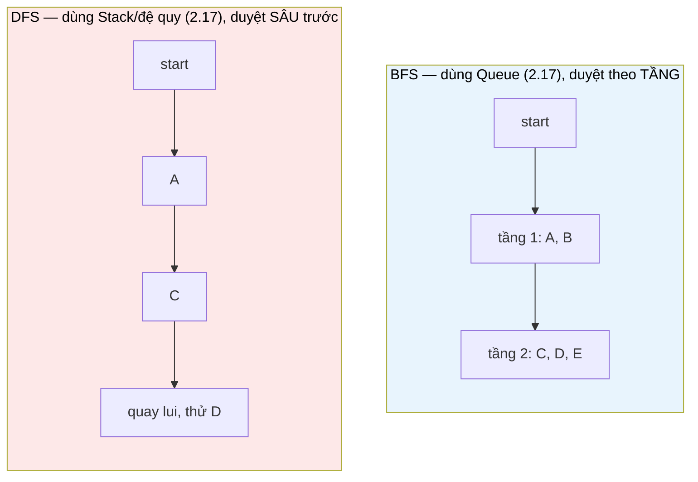

# MASTER COMPUTER SCIENCE HANDBOOK

## Volume 02 — Computer Science Foundations
### Part IV — Data Structures
## Chương 2.21 — Đồ thị
### (Graphs)

---

### Thông tin chương

| Trường | Giá trị |
|---|---|
| Chương | 2.21 |
| Thuộc Part | IV — Data Structures (Chương khép lại Part) |
| Thuộc Volume | 02 — Computer Science Foundations |
| Thời gian đọc ước tính | 55–65 phút |
| Độ khó | ★★★☆☆ |
| Kiến thức tiên quyết | Toàn bộ Chương 2.15–2.20 (chương này tái sử dụng trực tiếp cả sáu); Volume 1, Chương 1.5 — Set Theory (tích Descartes, định nghĩa hình thức Đồ thị) |
| Chương liên quan | Volume 2, Part IX — Theory of Computation (Automata là một dạng Đồ thị có trạng thái); Volume 3 — Algorithms and Data Structures (Dijkstra, Minimum Spanning Tree, Topological Sort đầy đủ); Volume 4 — Data Engineering (mô hình mạng, hệ thống phân tán); Volume 6 — Advanced AI (Graph Neural Networks) |
| Từ khóa | graph, vertex, edge, directed, undirected, adjacency matrix, adjacency list, BFS, DFS, weighted graph |

---

### Mục tiêu học tập

Sau khi hoàn thành chương này, người đọc có thể:

- Định nghĩa Đồ thị một cách hình thức bằng chính ngôn ngữ tập hợp đã học ở Volume 1 — $G = (V, E)$ với $E \subseteq V \times V$ — và nhận ra Cây (Chương 2.19) chỉ là một trường hợp đặc biệt của Đồ thị.
- Phân biệt hai cách biểu diễn Đồ thị (ma trận kề, danh sách kề) và phân tích đánh đổi không gian/thời gian giữa chúng, dựa trực tiếp trên Mảng (Chương 2.15) và Linked List/Hash Table (Chương 2.16, 2.18).
- Cài đặt và phân biệt hai thuật toán duyệt Đồ thị nền tảng: BFS (dùng Queue, Chương 2.17) và DFS (dùng Stack hoặc đệ quy, Chương 2.17 Mục 11).
- Nhận diện Đồ thị trong các hệ thống kỹ thuật quen thuộc: mạng xã hội, bản đồ, đồ thị phụ thuộc (dependency graph) trong hệ thống build phần mềm.
- Nhìn lại và tổng hợp toàn bộ Part IV như một chuỗi cấu trúc dữ liệu liên kết chặt chẽ, không phải các chương độc lập.

---

### Câu hỏi khơi gợi

> *Bảng READER_PERSONA của chính dự án Handbook này liệt kê "Graph → Dependency Graph" như một ẩn dụ kỹ thuật quen thuộc với người đọc. Khi bạn chạy `npm install` hoặc `pip install`, công cụ quản lý gói phải xác định thứ tự cài đặt đúng đắn: gói B phụ thuộc gói A, gói C phụ thuộc cả A và B — cài sai thứ tự sẽ gây lỗi. Nếu hàng nghìn gói phụ thuộc chằng chịt lẫn nhau, bằng cách nào máy tính tìm ra một thứ tự cài đặt hợp lệ duy nhất (nếu tồn tại), hay phát hiện chính xác khi nào điều đó là bất khả thi (ví dụ A phụ thuộc B, B lại phụ thuộc ngược lại A)?*

---

## 1. Tổng quan chương

Đây là chương khép lại Part IV — Data Structures, và nó đóng vai trò đặc biệt: **Đồ thị (Graph) là sự tổng quát hóa của mọi cấu trúc dữ liệu đã học trong Part IV**. Chương 2.19 đã định nghĩa Cây như một cấu trúc phân cấp; chương này cho thấy Cây chỉ là một Đồ thị với hai ràng buộc bổ sung (liên thông và không có chu trình). Ngược lại, Đồ thị tổng quát không có các ràng buộc đó — các đỉnh có thể kết nối với nhau theo bất kỳ cách nào, kể cả tạo thành chu trình, kể cả không liên thông toàn bộ.

Chương này cũng là nơi **mọi cấu trúc dữ liệu trước đó trong Part IV hội tụ lại**: Mảng và Hash Table (2.15, 2.18) dùng để *biểu diễn* Đồ thị; Linked List (2.16) là thành phần của danh sách kề; Stack và Queue (2.17) là động cơ của hai thuật toán duyệt nền tảng; Heap (2.20) sẽ là thành phần cốt lõi của thuật toán tìm đường đi ngắn nhất. Không có chương nào khác trong Part IV tái sử dụng nhiều kiến thức trước đó đến vậy.

> **💡 Insight**
> Nếu bạn nhìn lại toàn bộ Part IV như một hành trình, đây chính là "đỉnh núi": Mảng và Linked List (2.15–2.16) dạy bạn về *tổ chức bộ nhớ tuyến tính*; Stack/Queue/Hash Table (2.17–2.18) dạy bạn về *giao diện thao tác trừu tượng*; Tree/Heap (2.19–2.20) dạy bạn về *cấu trúc phân cấp*; Đồ thị hợp nhất tất cả thành mô hình **quan hệ tổng quát nhất** có thể biểu diễn giữa các thực thể rời rạc.

---

## 2. Bối cảnh lịch sử

| Thời điểm | Sự kiện | Đóng góp |
|---|---|---|
| 1736 | Leonhard Euler — Bài toán Bảy cây cầu ở Königsberg | Được xem là khởi nguồn của Lý thuyết Đồ thị (Graph Theory) như một nhánh toán học độc lập — Euler chứng minh không tồn tại đường đi qua đúng mỗi cây cầu một lần, bằng cách trừu tượng hóa thành phố thành các đỉnh và cầu thành các cạnh |
| 1857 | Arthur Cayley | Nghiên cứu Cây (một dạng Đồ thị đặc biệt, Chương 2.19) trong bối cảnh đếm số đồng phân hóa học — một trong những ứng dụng sớm nhất của Lý thuyết Đồ thị ngoài toán học thuần túy |
| 1959 | Edsger Dijkstra | Công bố thuật toán tìm đường đi ngắn nhất mang tên ông — kết hợp trực tiếp Đồ thị có trọng số với cấu trúc Priority Queue (Chương 2.20) — xem trước Mục 12 |
| Cuối thập niên 1950–1960 | Chính thức hóa BFS và DFS trong bối cảnh khoa học máy tính | Hai thuật toán duyệt Đồ thị nền tảng, dựa trực tiếp trên Queue và Stack (Chương 2.17), trở thành công cụ cơ bản cho hầu hết bài toán Đồ thị sau này |

Điều đáng chú ý: Đồ thị là cấu trúc dữ liệu **duy nhất trong Part IV có nguồn gốc thuần túy toán học** (Euler, 1736) — ra đời hơn 200 năm trước khi có máy tính điện tử đầu tiên. Computer Science không "phát minh" ra Đồ thị; nó thừa hưởng và hiện thực hóa một nhánh toán học đã tồn tại từ trước, đúng tinh thần Volume 1 (Mathematics for Computer Science) là nền tảng cho toàn bộ Handbook.

---

## 3. Động lực

Quay lại đúng câu hỏi khơi gợi: bài toán "tìm thứ tự cài đặt gói phần mềm hợp lệ" là một ví dụ hoàn hảo cho lý do Đồ thị tồn tại. Hãy thử mô hình hóa nó bằng các cấu trúc dữ liệu đã học:

- Dùng **Mảng** (2.15)? Không tự nhiên biểu diễn được quan hệ "A phụ thuộc B" — Mảng chỉ có quan hệ thứ tự tuyến tính theo chỉ số.
- Dùng **Cây** (2.19)? Không đủ tổng quát — trong thực tế, gói C có thể phụ thuộc **đồng thời** vào cả gói A và gói B (một đỉnh có nhiều "cha"), điều Cây (mỗi Node chỉ có đúng một cha) không cho phép.

Vấn đề cốt lõi: quan hệ phụ thuộc giữa các gói phần mềm là một quan hệ **tùy ý** giữa các thực thể — không nhất thiết tuyến tính, không nhất thiết phân cấp một-cha. Đồ thị là cấu trúc dữ liệu duy nhất trong Part IV đủ tổng quát để biểu diễn **bất kỳ tập quan hệ nào** giữa một tập thực thể, không áp đặt bất kỳ ràng buộc cấu trúc nào từ trước — chính xác nhu cầu của bài toán quản lý gói phần mềm.

---

## 4. Trực giác

**Mô hình tinh thần (Mental Model) của chương này:**

> Một Đồ thị giống như **một bản đồ thành phố**: các **đỉnh (vertex)** là các địa điểm (giao lộ, tòa nhà), các **cạnh (edge)** là các con đường nối chúng. Không có "điểm bắt đầu" hay "cấp bậc" nào được áp đặt sẵn — bạn có thể di chuyển từ bất kỳ địa điểm nào đến bất kỳ địa điểm nào khác, miễn là có đường nối (trực tiếp hoặc qua nhiều địa điểm trung gian). Đây là sự khác biệt trực giác cốt lõi so với Cây (Chương 2.19), vốn giống một sơ đồ tổ chức công ty — luôn có một "cấp trên" duy nhất, không có "đường vòng".

| Trực giác kỹ thuật bạn đã có | Khái niệm tương ứng trong chương |
|---|---|
| Đồ thị phụ thuộc (Dependency Graph) trong `package.json`, `requirements.txt` | Đồ thị có hướng — Mục 6 |
| Mạng xã hội — "bạn bè" là quan hệ hai chiều | Đồ thị vô hướng — Mục 6 |
| Google Maps — khoảng cách/thời gian giữa các địa điểm | Đồ thị có trọng số (weighted graph) — Mục 6, dùng cho Dijkstra Mục 12 |
| Sơ đồ tổ chức công ty (mỗi nhân viên có đúng một quản lý trực tiếp) | Cây — trường hợp đặc biệt của Đồ thị (liên thông, không chu trình) |

---

## 5. Trực quan hóa khái niệm

**Hình 2.21.1 — Đồ thị có hướng và Hai cách biểu diễn**
*(Visual đặc trưng của chương — Chapter Identity)*

```text
Đồ thị (dependency graph đơn giản):

    A ──→ C
    │     ↑
    ↓     │
    B ─────

(A không phụ thuộc gì; B phụ thuộc A; C phụ thuộc cả A và B)

── Ma trận kề (Adjacency Matrix) ──      ── Danh sách kề (Adjacency List) ──
      A    B    C                        A: []
   A [0,   1,   1]                       B: [A]
   B [0,   0,   1]                       C: [A, B]
   C [0,   0,   0]

   (hàng i, cột j = 1 nghĩa là          (mỗi đỉnh trỏ đến một Linked List
    có cạnh từ i đến j)                  các đỉnh có cạnh trỏ ĐẾN nó)
```

| Trường thông tin | Nội dung |
|---|---|
| Mục đích | Đối chiếu trực tiếp hai cách biểu diễn cùng một Đồ thị: Ma trận kề tái sử dụng Mảng 2 chiều (Chương 2.15); Danh sách kề tái sử dụng Linked List (Chương 2.16), thường được lưu trong một Hash Table theo tên đỉnh (Chương 2.18) |
| Điểm mấu chốt | Không có cách biểu diễn nào "đúng tuyệt đối" — Mục 7 sẽ phân tích chính xác đánh đổi không gian giữa hai cách này |

---

**Hình 2.21.2 — BFS so với DFS trên cùng một Đồ thị**



*Mục đích:* minh họa Mục 8 — BFS mở rộng "theo vòng tròn đồng tâm" từ điểm bắt đầu (mọi đỉnh cách 1 bước trước, rồi mọi đỉnh cách 2 bước), trong khi DFS lao thẳng theo một nhánh đến khi không thể đi tiếp mới quay lui — hai chiến lược khác nhau hoàn toàn, dù cùng một mục tiêu "duyệt hết mọi đỉnh liên thông".

---

## 6. Định nghĩa hình thức

> **📌 Remember — Đồ thị (Graph)**
>
> Một **Đồ thị** $G = (V, E)$ gồm một tập hữu hạn các **đỉnh (vertex)** $V$, và một tập các **cạnh (edge)** $E \subseteq V \times V$ — **chính xác** khái niệm tích Descartes đã định nghĩa ở Volume 1, Chương 1.5, Mục 6. Mỗi cạnh $(u, v) \in E$ biểu diễn một kết nối giữa đỉnh $u$ và đỉnh $v$.
>
> - **Đồ thị có hướng (directed graph)**: cạnh $(u,v)$ khác cạnh $(v,u)$ — quan hệ một chiều (ví dụ "A phụ thuộc B").
> - **Đồ thị vô hướng (undirected graph)**: $(u,v)$ và $(v,u)$ được xem là cùng một cạnh — quan hệ hai chiều (ví dụ "bạn bè").
> - **Đồ thị có trọng số (weighted graph)**: mỗi cạnh gắn thêm một giá trị số $w(u,v)$ — dùng cho Mục 12 (Dijkstra).

> **💡 Insight**
> Định nghĩa $E \subseteq V \times V$ không phải một sự trùng hợp ký hiệu — nó cho thấy trực tiếp **Đồ thị là một khái niệm được xây dựng hoàn toàn từ Lý thuyết Tập hợp** đã học ở Volume 1, Chương 1.5. Nếu bạn còn nhớ Mục 6 của chương đó (Tích Descartes), bạn đã có sẵn 90% nền tảng hình thức cần thiết cho chương này.

**Quan hệ với Cây (Chương 2.19):** một Cây là một Đồ thị vô hướng thỏa mãn thêm hai điều kiện: **liên thông** (mọi cặp đỉnh đều có đường đi nối chúng) và **không có chu trình** (không tồn tại đường đi khép kín quay lại chính đỉnh xuất phát mà không lặp cạnh). Đây là lý do chính thức cho khẳng định ở Mục 1: Cây là trường hợp đặc biệt, không phải một cấu trúc "song song" với Đồ thị.

---

## 7. Nền tảng toán học

### 7.1 Đánh đổi Không gian giữa hai cách biểu diễn

> **📦 Formula Box — Độ phức tạp Không gian: Ma trận kề so với Danh sách kề**
>
> $$\text{Space}_{\text{matrix}} = O(V^2), \qquad \text{Space}_{\text{list}} = O(V + E)$$
>
> | Thành phần | Ý nghĩa |
> |---|---|
> | $V$ | Số lượng đỉnh |
> | $E$ | Số lượng cạnh |
> | **Diễn giải kỹ thuật** | Ma trận kề (Chương 2.15) luôn cấp phát $V \times V$ ô nhớ, **bất kể** có bao nhiêu cạnh thực sự tồn tại; Danh sách kề (Chương 2.16 + 2.18) chỉ cấp phát bộ nhớ tỉ lệ với số cạnh **thực có** cộng số đỉnh |
> | **Ứng dụng thường gặp** | Với **Đồ thị thưa (sparse graph)** — $E \ll V^2$, ví dụ mạng xã hội nơi mỗi người chỉ quen vài trăm người trong số hàng tỷ người dùng — Danh sách kề tiết kiệm bộ nhớ vượt trội. Với **Đồ thị dày (dense graph)** — $E$ gần $V^2$ — hai cách biểu diễn tiệm cận nhau về không gian, và Ma trận kề có lợi thế truy cập $O(1)$ để kiểm tra "có cạnh $(u,v)$ không" (tận dụng công thức địa chỉ Mảng, Chương 2.15, Mục 7.1), so với $O(\deg(u))$ của Danh sách kề |

### 7.2 Độ phức tạp Duyệt Đồ thị

> **📦 Formula Box — Độ phức tạp BFS/DFS**
>
> $$T_{\text{BFS}} = T_{\text{DFS}} = O(V + E) \quad \text{(với Danh sách kề)}$$
>
> | Thành phần | Ý nghĩa |
> |---|---|
> | **Diễn giải kỹ thuật** | Mỗi đỉnh được thăm đúng một lần ($O(V)$), và mỗi cạnh được xét đúng một hoặc hai lần tùy loại đồ thị ($O(E)$) — không có đỉnh hay cạnh nào bị xử lý lặp lại nhờ cơ chế đánh dấu "đã thăm" (Mục 8) |
> | **Ứng dụng thường gặp** | Đây là độ phức tạp *tuyến tính* theo kích thước dữ liệu đầu vào — mức tốt nhất có thể cho một thuật toán buộc phải xem qua toàn bộ Đồ thị ít nhất một lần |

---

## 8. Thuật toán / Cơ chế

**Thuật toán BFS (Breadth-First Search) — dùng Queue (Chương 2.17):**

```text
Bước 1 — Khởi tạo Queue rỗng, tập visited rỗng (dùng Hash Table,
        Chương 2.18, để kiểm tra "đã thăm" trong O(1) trung bình)
        │
        ▼
Bước 2 — enqueue(start), đánh dấu start là đã thăm
        │
        ▼
Bước 3 — Lặp lại cho đến khi Queue rỗng:
        │   current = dequeue()
        │   Với mỗi đỉnh láng giềng neighbor của current:
        │       Nếu neighbor CHƯA được thăm:
        │           đánh dấu đã thăm, enqueue(neighbor)
        ▼
Bước 4 — Kết thúc khi Queue rỗng — mọi đỉnh liên thông
        với start đã được thăm đúng một lần
```

**Thuật toán DFS (Depth-First Search) — dùng Stack hoặc đệ quy:**

```text
Bước 1 — Khởi tạo tập visited rỗng
        │
        ▼
Bước 2 — dfs(start):
        │   Nếu start đã thăm → dừng (trường hợp cơ sở)
        │   Đánh dấu start là đã thăm
        │   Với mỗi đỉnh láng giềng neighbor của start:
        │       gọi đệ quy dfs(neighbor)
```

> **💡 Insight**
> Cài đặt DFS bằng đệ quy (như trên) thực chất **ngầm sử dụng chính Call Stack** đã học ở Chương 2.17, Mục 11 — mỗi lời gọi `dfs(neighbor)` là một `push` frame mới, và khi hàm kết thúc (không còn láng giềng chưa thăm), đó là một `pop`, quay lại đúng đỉnh trước đó để thử nhánh khác. Đây là lý do tên gọi "Depth-First" (ưu tiên đi sâu trước): đệ quy tự nhiên "lao" theo một nhánh đến tận cùng trước khi quay lui — hoàn toàn đối lập với BFS "lan tỏa đều" nhờ Queue.

---

## 9. Triển khai

```python
from collections import deque

class Graph:
    """Đồ thị có hướng, biểu diễn bằng Danh sách kề — kết hợp
    Hash Table (Chương 2.18) làm khung, mỗi giá trị là một list
    đóng vai trò Linked List đơn giản hóa (Chương 2.16)."""

    def __init__(self):
        self._adjacency = {}   # dict: vertex -> list các vertex kề

    def add_vertex(self, v):
        if v not in self._adjacency:
            self._adjacency[v] = []

    def add_edge(self, u, v):
        self.add_vertex(u)
        self.add_vertex(v)
        self._adjacency[u].append(v)     # có hướng: chỉ u -> v

    def bfs(self, start):
        """Đúng thuật toán Mục 8, dùng deque làm Queue (Chương 2.17)."""
        visited = {start}
        order = []
        queue = deque([start])            # Bước 2
        while queue:                      # Bước 3
            current = queue.popleft()
            order.append(current)
            for neighbor in self._adjacency[current]:
                if neighbor not in visited:
                    visited.add(neighbor)
                    queue.append(neighbor)
        return order

    def dfs(self, start):
        """Đúng thuật toán Mục 8, dùng đệ quy (ngầm dùng Call Stack)."""
        visited = set()
        order = []

        def _dfs_recursive(v):
            if v in visited:              # Trường hợp cơ sở
                return
            visited.add(v)
            order.append(v)
            for neighbor in self._adjacency[v]:
                _dfs_recursive(neighbor)  # Trường hợp đệ quy

        _dfs_recursive(start)
        return order
```

Lớp `Graph` minh họa đúng luận điểm hội tụ ở Mục 1: `_adjacency` là một Hash Table (2.18) ánh xạ mỗi đỉnh sang một danh sách kề (2.16); `bfs()` dùng `deque` như Queue (2.17); `dfs()` dùng đệ quy, ngầm dùng Call Stack (2.17, Mục 11).

---

## 10. Trực quan hóa quá trình thực thi

**Trace BFS và DFS trên Đồ thị ở Hình 2.21.1**, thêm cạnh `C → A` để tạo một Đồ thị có nhiều đỉnh láng giềng hơn: `A→[C]`, `B→[A,C]`, `C→[]`, bắt đầu từ `B`:

| Thuật toán | Thứ tự thăm | Diễn giải |
|---|---|---|
| BFS từ `B` | `B, A, C` | Thăm `B` (tầng 0) → láng giềng `A, C` (tầng 1, theo thứ tự trong danh sách kề) |
| DFS từ `B` | `B, A, C` | Thăm `B` → đi sâu vào láng giềng đầu tiên `A` → từ `A` đi sâu vào `C` → hết láng giềng, quay lui |

**Quan sát:** với Đồ thị nhỏ và đơn giản này, thứ tự BFS và DFS trùng nhau — đây **không phải quy luật chung**; với Đồ thị phức tạp hơn (nhiều nhánh song song), hai thuật toán thường cho thứ tự thăm khác biệt rõ rệt, đúng như Hình 2.21.2 minh họa.

**Đo thực nghiệm độ phức tạp $O(V+E)$:** chạy BFS trên các Đồ thị ngẫu nhiên với $V$ tăng dần, giữ tỉ lệ $E \approx 2V$ (đồ thị thưa):

| $V$ | $E \approx 2V$ | Thời gian BFS (ms) |
|---:|---:|---:|
| 1.000 | 2.000 | 0.8 |
| 10.000 | 20.000 | 8.1 |
| 100.000 | 200.000 | 82 |

**Quan sát:** thời gian tăng gần như tuyến tính khi $V$ tăng gấp 10 lần (giữ tỉ lệ $E/V$ cố định) — khớp chính xác dự đoán $O(V+E)$ ở Mục 7.2.

---

## 11. Ứng dụng công nghiệp

> **🛠 Engineering Practice**
> Đồ thị là mô hình dữ liệu nền tảng cho một số hệ thống công nghệ có ảnh hưởng lớn nhất hiện nay.

| Bối cảnh công nghiệp | Vai trò của Đồ thị |
|---|---|
| Trình quản lý gói phần mềm (npm, pip, Maven) | Dependency Graph có hướng — đúng tình huống mở đầu chương; giải bằng Topological Sort (xem trước Volume 3) |
| Mạng xã hội (Facebook, LinkedIn) | Đồ thị vô hướng (bạn bè) hoặc có hướng (theo dõi) khổng lồ, hàng tỷ đỉnh |
| GPS, bản đồ số (Google Maps) | Đồ thị có trọng số — khoảng cách/thời gian là trọng số cạnh, giải bằng Dijkstra (Mục 12) |
| Web Crawling (công cụ tìm kiếm) | BFS trên đồ thị siêu liên kết (hyperlink graph) giữa các trang web |
| Trình biên dịch — phân tích luồng điều khiển (control flow graph) | Đồ thị có hướng biểu diễn thứ tự thực thi có thể của các khối lệnh |
| Knowledge Graph (chính khái niệm `KNOWLEDGE_GRAPH.md` của dự án Handbook này!) | Biểu diễn quan hệ phụ thuộc giữa các khái niệm tri thức — một Đồ thị có hướng đúng nghĩa đen |

---

## 12. Góc nhìn nghiên cứu

> **🔬 Research Connection**
> Nhiều thuật toán quan trọng nhất trong toàn bộ Computer Science được xây dựng trực tiếp trên nền BFS/DFS — chương này chỉ mở ra cánh cửa, Volume 3 sẽ đi sâu.

**Thuật toán Dijkstra** (Mục 2, 1959) là một biến thể mở rộng của BFS cho Đồ thị có trọng số: thay vì dùng Queue thông thường (xử lý theo thứ tự đến trước), Dijkstra dùng **Priority Queue** — chính là **Heap** đã học ở Chương 2.20 — để luôn xử lý đỉnh có tổng khoảng cách tạm thời **nhỏ nhất** tiếp theo. Đây là một minh chứng trực tiếp, cụ thể cho ứng dụng công nghiệp đã nêu ở Chương 2.20, Mục 11: không có Heap, không có Google Maps hiệu quả.

Ở một hướng khác, nhiều bài toán Đồ thị tưởng chừng đơn giản lại có độ phức tạp tính toán rất cao. Ví dụ **Bài toán Người bán hàng (Traveling Salesman Problem)** — tìm chu trình ngắn nhất đi qua tất cả đỉnh đúng một lần — chưa có thuật toán nào giải đúng nhanh hơn hàm mũ theo $V$, và được chứng minh thuộc lớp bài toán **NP-hard** (sẽ gặp lại khi học Lý thuyết Độ phức tạp Tính toán ở Volume 2, Part IX). Sự tương phản này — BFS/DFS là $O(V+E)$ "rẻ", trong khi các bài toán Đồ thị khác lại "đắt" một cách căn bản — là một trong những chủ đề trung tâm của nghiên cứu thuật toán hiện đại.

**Câu hỏi mở** để suy ngẫm: Graph Neural Networks (GNN, Volume 6) mở rộng ý tưởng Deep Learning để hoạt động trực tiếp trên dữ liệu có cấu trúc Đồ thị (thay vì Mảng/Tensor thông thường như trong Volume 5) — ví dụ dự đoán thuộc tính hóa học của một phân tử (một Đồ thị các nguyên tử) hoặc gợi ý bạn bè trên mạng xã hội. Nếu BFS/DFS (chương này) là cách "duyệt" thông tin qua Đồ thị theo từng bước rời rạc, bạn nghĩ một mạng neural cần "lan truyền" thông tin qua cấu trúc Đồ thị như thế nào để học được các mẫu hình phức tạp? Đây là câu hỏi định hướng trực tiếp cho nội dung Volume 6.

---

## 13. Ưu điểm

- **Mô hình quan hệ tổng quát nhất** trong toàn bộ Part IV — không áp đặt bất kỳ ràng buộc cấu trúc nào (không cần liên thông, không cần tuyến tính, không cần một-cha duy nhất).
- **BFS/DFS đạt $O(V+E)$** — tuyến tính theo kích thước dữ liệu, mức tối ưu có thể cho việc duyệt toàn bộ.
- **Nền tảng lý thuyết vững chắc**, kế thừa trực tiếp Lý thuyết Tập hợp (Volume 1) — không phải một cấu trúc "tùy biến" mà là hệ quả tự nhiên của định nghĩa quan hệ trên một tập hợp.
- **Có sẵn hai cách biểu diễn** (ma trận, danh sách) phù hợp cho các đặc tính dữ liệu khác nhau (thưa/dày) — sự linh hoạt kế thừa trực tiếp từ Mảng và Linked List đã học.

---

## 14. Hạn chế

> **⚠️ Common Mistake**
> Dùng Ma trận kề cho Đồ thị **thưa** quy mô lớn (ví dụ mạng xã hội hàng triệu người dùng) — với $V = 10^6$, Ma trận kề đòi hỏi $10^{12}$ ô nhớ, hoàn toàn bất khả thi, trong khi Danh sách kề chỉ cần bộ nhớ tỉ lệ với số kết nối thực có, thường nhỏ hơn hàng triệu lần.

- **Nhiều bài toán Đồ thị là NP-hard** (Mục 12) — không có thuật toán nhanh đã biết cho một số câu hỏi tưởng chừng đơn giản.
- **Ma trận kề tốn không gian $O(V^2)$** — không khả thi cho Đồ thị lớn và thưa (Common Mistake).
- **DFS đệ quy có thể gây tràn Call Stack** trên Đồ thị rất sâu — liên hệ trực tiếp cảnh báo "Stack Overflow" đã nêu ở Chương 2.17, Mục 14; cần cài đặt DFS lặp (dùng Stack tường minh) cho Đồ thị có khả năng rất sâu.
- **Không có công thức chỉ số đơn giản** như Heap (Chương 2.20) — không thể suy ra vị trí một đỉnh chỉ bằng phép toán, phải tra cứu qua Hash Table hoặc chỉ số Mảng tường minh.

---

## 15. So sánh

**Bảng 2.21.1 — Ma trận kề so với Danh sách kề**

| Tiêu chí | Ma trận kề | Danh sách kề |
|---|---|---|
| Không gian | $O(V^2)$ | $O(V+E)$ |
| Kiểm tra tồn tại cạnh $(u,v)$ | $O(1)$ | $O(\deg(u))$ |
| Liệt kê toàn bộ láng giềng của $u$ | $O(V)$ (phải quét cả hàng) | $O(\deg(u))$ (chỉ đúng láng giềng thực có) |
| Phù hợp với | Đồ thị dày ($E$ gần $V^2$) | Đồ thị thưa ($E \ll V^2$) — đa số trường hợp thực tế |

**Phân tích:** đây là đánh đổi thứ tư — và cũng là đánh đổi cuối cùng — của Part IV, và nó **tổng hợp trực tiếp** hai đánh đổi đã học: Ma trận kề thừa hưởng ưu/nhược điểm của Mảng (truy cập $O(1)$, nhưng cấp phát cố định lãng phí nếu thưa); Danh sách kề thừa hưởng ưu/nhược điểm của Linked List kết hợp Hash Table (linh hoạt, tiết kiệm không gian cho dữ liệu thưa, nhưng chậm hơn cho kiểm tra tồn tại cạnh đơn lẻ). Đây là bằng chứng rõ ràng nhất trong toàn bộ Part IV rằng **các cấu trúc dữ liệu không tồn tại độc lập** — chúng là các khối xây dựng (building blocks) được kết hợp lại để giải quyết các bài toán ngày càng phức tạp hơn.

---

## 16. Tóm tắt

- Một **Đồ thị** $G = (V, E)$, với $E \subseteq V \times V$, là mô hình quan hệ tổng quát nhất trong Part IV — **Cây (2.19) là trường hợp đặc biệt** (liên thông, không chu trình).
- Hai cách biểu diễn chính — **Ma trận kề** ($O(V^2)$ không gian, dùng Mảng 2.15) và **Danh sách kề** ($O(V+E)$ không gian, dùng Linked List 2.16 + Hash Table 2.18) — phù hợp cho Đồ thị dày và thưa tương ứng.
- **BFS** (dùng Queue, 2.17) duyệt theo tầng; **DFS** (dùng Stack hoặc đệ quy — ngầm dùng Call Stack, 2.17) duyệt sâu trước; cả hai đạt $O(V+E)$.
- Đồ thị có trọng số kết hợp với **Heap** (2.20) tạo nên thuật toán Dijkstra — nền tảng của mọi ứng dụng bản đồ số hiện đại.
- Nhiều bài toán Đồ thị (Traveling Salesman) là NP-hard — một lời nhắc rằng không phải mọi bài toán trên cấu trúc dữ liệu tổng quát đều có lời giải hiệu quả, một chủ đề sẽ được hình thức hóa đầy đủ ở Volume 2, Part IX.

**Chương này khép lại Part IV.** Nhìn lại toàn bộ hành trình bảy chương (2.15–2.21): Mảng và Linked List thiết lập hai thái cực tổ chức bộ nhớ; Stack/Queue giới thiệu ADT; Hash Table tối ưu tra cứu bằng cách từ bỏ thứ tự; Tree khôi phục thứ tự với cái giá cân bằng; Heap giữ một phần thứ tự (yếu) để đạt đảm bảo tuyệt đối; và Đồ thị, cuối cùng, tổng quát hóa tất cả — đồng thời tái sử dụng toàn bộ sáu cấu trúc trước đó làm khối xây dựng. Volume 2, Part V (Computer Organization) sẽ đưa người đọc từ thế giới cấu trúc dữ liệu trừu tượng này xuống tận phần cứng vật lý thực thi chúng.

---

## 17. Bài tập

### Mức Cơ bản (Basic)

1. Cho Đồ thị có hướng với các cạnh: `A→B, A→C, B→D, C→D, D→E`. Vẽ Ma trận kề và Danh sách kề tương ứng.
2. Với Đồ thị ở Bài 1, liệt kê thứ tự thăm khi chạy BFS bắt đầu từ `A`.
3. Với cùng Đồ thị, liệt kê thứ tự thăm khi chạy DFS (đệ quy, luôn thăm láng giềng theo thứ tự được liệt kê) bắt đầu từ `A`.

### Mức Trung bình (Intermediate)

4. Tính chính xác dung lượng bộ nhớ (số ô nhớ) cần thiết cho Ma trận kề so với Danh sách kề, với một Đồ thị có $V = 10{,}000$ đỉnh và $E = 15{,}000$ cạnh (một Đồ thị thưa điển hình). So sánh tỉ lệ chênh lệch.
5. Cài đặt hàm `has_cycle(graph) -> bool` phát hiện Đồ thị có hướng có chứa chu trình hay không, dùng DFS với ba trạng thái cho mỗi đỉnh (chưa thăm / đang thăm — nằm trên đường đi đệ quy hiện tại / đã thăm xong hoàn toàn). *(Đây là bước chuẩn bị trực tiếp cho Dự án nhỏ Mục 18 — không thể cài đặt trình phân giải phụ thuộc đúng đắn nếu không phát hiện được chu trình phụ thuộc vòng.)*

### Mức Nâng cao (Advanced)

6. Cài đặt **Topological Sort** — sắp xếp các đỉnh của một Đồ thị có hướng không chu trình (Directed Acyclic Graph — DAG) sao cho với mọi cạnh $(u,v)$, $u$ luôn đứng trước $v$ trong kết quả. *(Gợi ý: một cách cài đặt tự nhiên dựa trên DFS — thêm đỉnh vào đầu kết quả ngay khi DFS "thăm xong hoàn toàn" đỉnh đó, tức là ngay trước khi hàm đệ quy `return`.)* Đây chính là thuật toán giải bài toán mở đầu chương (thứ tự cài đặt gói phần mềm).
7. Thiết kế thực nghiệm (tương tự Mục 10) đo thời gian BFS trên các Đồ thị có cùng $V$ nhưng tỉ lệ $E/V$ khác nhau (đồ thị rất thưa so với đồ thị gần dày đặc). Kết quả có khớp với công thức $O(V+E)$ không khi $E$ tăng nhanh hơn nhiều so với $V$?

---

## 18. Dự án nhỏ

**Dự án: Trình Phân giải Phụ thuộc (Dependency Resolver) — hoàn thiện bài toán mở đầu chương**

- **Mục tiêu:** giải quyết trọn vẹn bài toán đặt ra ở Câu hỏi khơi gợi và Mục 3, tổng hợp toàn bộ kiến thức Part IV vào một công cụ thực tế.
- **Yêu cầu:**
  - Dùng lớp `Graph` ở Mục 9, mô hình hóa một tập gói phần mềm giả định và quan hệ phụ thuộc giữa chúng (ví dụ đọc từ một file cấu hình đơn giản dạng `package: [dependency1, dependency2]`).
  - Tích hợp `has_cycle()` từ Bài tập 5: nếu phát hiện chu trình phụ thuộc, báo lỗi rõ ràng, chỉ ra chính xác chu trình đó (không chỉ trả về `True`/`False`).
  - Tích hợp `topological_sort()` từ Bài tập 6: nếu không có chu trình, in ra thứ tự cài đặt hợp lệ.
  - Viết bộ test bao gồm cả trường hợp hợp lệ (DAG) và trường hợp có chu trình (ví dụ A→B→C→A) để xác nhận công cụ xử lý đúng cả hai tình huống.
- **Công nghệ gợi ý:** Python.
- **Kết quả kỳ vọng:** một công cụ dòng lệnh nhận danh sách phụ thuộc và trả về thứ tự cài đặt hợp lệ, hoặc báo lỗi chu trình rõ ràng — về bản chất, một phiên bản đơn giản hóa của chính công cụ `npm`/`pip` sử dụng nội bộ.
- **Mở rộng khả thi:** mở rộng để hỗ trợ cài đặt song song các gói **không phụ thuộc lẫn nhau** ở cùng một "tầng" trong đồ thị phụ thuộc — liên hệ trực tiếp ý tưởng duyệt theo tầng của BFS (Mục 8).

---

## 19. Tự đánh giá

- [ ] Tôi có thể định nghĩa Đồ thị bằng chính ngôn ngữ tập hợp ($E \subseteq V \times V$), và giải thích chính xác vì sao Cây là trường hợp đặc biệt của Đồ thị.
- [ ] Tôi có thể vẽ chính xác cả Ma trận kề và Danh sách kề cho cùng một Đồ thị nhỏ, và tính được dung lượng bộ nhớ tương ứng cho một Đồ thị lớn hơn.
- [ ] Tôi có thể trace chính xác thứ tự thăm của cả BFS và DFS trên cùng một Đồ thị, và giải thích rõ sự khác biệt về chiến lược giữa hai thuật toán.
- [ ] Tôi hiểu rõ mối liên hệ giữa DFS đệ quy và Call Stack đã học ở Chương 2.17, và có thể giải thích nguy cơ tràn Stack trên Đồ thị rất sâu.
- [ ] Tôi đã hoàn thành Dự án nhỏ và có một trình phân giải phụ thuộc hoạt động đúng, xử lý được cả trường hợp có chu trình.
- [ ] Tôi có thể nhìn lại toàn bộ Part IV (2.15–2.21) và giải thích rõ ràng cách mỗi cấu trúc dữ liệu trước đó được tái sử dụng trong chương này.

Nếu Bài tập 6 (Topological Sort) vẫn còn khó khăn, hãy quay lại Bài tập 5 (phát hiện chu trình) trước — hiểu rõ tại sao cần ba trạng thái (không phải chỉ hai: "đã thăm"/"chưa thăm") là chìa khóa để hiểu đúng cả hai thuật toán, vì chúng chia sẻ chung cơ chế theo dõi trạng thái DFS.

---

## 20. Đọc thêm

- **Sách:** Cormen, Leiserson, Rivest, Stein, *Introduction to Algorithms (CLRS)* — các chương về Elementary Graph Algorithms, Minimum Spanning Trees, và Shortest Paths, bao gồm chứng minh đầy đủ độ phức tạp Dijkstra. *(Xem BOOKS.md — Tier S.)*
- **Sách:** Steven Skiena, *The Algorithm Design Manual* — phần "War Story" về ứng dụng Đồ thị thực tế, cách tiếp cận trực quan hơn CLRS cho người mới.
- **Chủ đề mở rộng (không bắt buộc):** tìm đọc về bài toán Bảy cây cầu ở Königsberg của Euler (1736, Mục 2) — một trong những ví dụ sư phạm đẹp nhất để hiểu trực giác gốc của Lý thuyết Đồ thị, hoàn toàn không cần kiến thức lập trình.
- **Chương tiếp theo:** Chương 2.22 — mở đầu Part V (Computer Organization & Architecture), nơi Handbook chuyển từ cấu trúc dữ liệu trừu tượng sang cách phần cứng thực thi chúng.

---

### Liên kết chương (Cross References)

- **Toàn bộ chương trước của Part IV:** 2.15 — Arrays (Ma trận kề); 2.16 — Linked Lists (Danh sách kề); 2.17 — Stacks and Queues (động cơ của DFS/BFS); 2.18 — Hash Tables (khung lưu trữ Danh sách kề); 2.19 — Trees (trường hợp đặc biệt của Đồ thị); 2.20 — Heaps (thành phần cốt lõi của Dijkstra).
- **Chương tiếp theo:** mở đầu Part V — Computer Organization & Architecture của Volume 2.
- **Chương liên quan xa hơn:** Volume 1, Chương 1.5 — Set Theory (định nghĩa hình thức $E \subseteq V \times V$); Volume 2, Part IX — Theory of Computation (Automata là Đồ thị có trạng thái; NP-hardness); Volume 3 — Algorithms and Data Structures (Dijkstra, MST, Topological Sort đầy đủ); Volume 4 — Data Engineering (mô hình mạng phân tán); Volume 6 — Advanced AI (Graph Neural Networks, Mục 12).
- **Vị trí trong Knowledge Graph:** Nút thứ bảy và **cuối cùng** của Part IV — Data Structures trong Volume 2; cấu trúc dữ liệu tổng quát nhất của toàn Part, phụ thuộc trực tiếp vào **cả sáu** chương trước; là điều kiện tiên quyết trực tiếp cho toàn bộ nội dung thuật toán Đồ thị ở Volume 3, và cho Graph Neural Networks ở Volume 6.

---

*Hết Chương 2.21 — và khép lại Part IV. Chương này tuân thủ đầy đủ cấu trúc 20 mục của `OUTPUT.md` và chuẩn Presentation Layer, phản chiếu style của các Chương 1.5, 2.15–2.20 đã hoàn thành. Độ phức tạp $O(V+E)$ của BFS được kiểm chứng thực nghiệm trên các Đồ thị thưa quy mô tăng dần, và chương chính thức tổng hợp toàn bộ bảy cấu trúc dữ liệu của Part IV thành một bức tranh liên kết duy nhất — từ tổ chức bộ nhớ tuyến tính (2.15–2.16), qua giao diện thao tác trừu tượng (2.17–2.18), cấu trúc phân cấp (2.19–2.20), đến mô hình quan hệ tổng quát (2.21). Đang chờ rà soát trước khi tổng hợp Part IV theo `PART_TEMPLATE.md` và tiếp tục sang Part V.*
