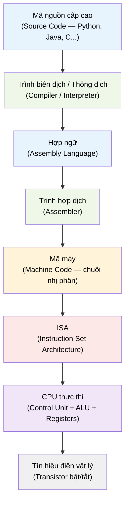

# MASTER COMPUTER SCIENCE HANDBOOK

## Volume 02 — Computer Science Foundations
### Part V — Computer Organization & Architecture
## Chương 2.22 — Từ Mã nguồn đến Phần cứng
### (Computer Organization and Architecture: An Overview)

---

### Thông tin chương

| Trường | Giá trị |
|---|---|
| Chương | 2.22 |
| Thuộc Part | V — Computer Organization & Architecture |
| Thuộc Volume | 02 — Computer Science Foundations |
| Thời gian đọc ước tính | 35–45 phút |
| Độ khó | ★★☆☆☆ |
| Kiến thức tiên quyết | Volume 1, Chương 1.1 (Turing Machine, tính toán được); Volume 2, Part II — Data Representation (đặc biệt Binary Number System) |
| Chương liên quan | 2.23 — Instruction Set Architecture (ISA); Volume 4, Part I — Computer Organization and Architecture (bản mở rộng nâng cao) |
| Từ khóa | Von Neumann Architecture, CPU, Control Unit, ALU, ISA, Fetch–Decode–Execute, Compiler, Assembly, Abstraction Layer |

---

### Mục tiêu học tập

Sau khi hoàn thành chương này, người đọc có thể:

- Mô tả đầy đủ chuỗi tầng trừu tượng (abstraction layers) từ mã nguồn cấp cao đến tín hiệu điện trong phần cứng.
- Phân biệt rõ ràng **Computer Organization** (cách hiện thực bên trong) và **Computer Architecture** (giao diện trừu tượng mà phần mềm nhìn thấy).
- Giải thích cấu trúc **Von Neumann Architecture** và vai trò của từng thành phần chính: CPU, Memory, Bus, I/O.
- Trình bày ở mức khái niệm chu trình **Fetch–Decode–Execute** mà mọi CPU hiện đại đều thực hiện.
- Giải thích vì sao một kỹ sư phần mềm — dù không viết trình biên dịch hay thiết kế chip — vẫn cần hiểu tầng phần cứng bên dưới.

---

### Câu hỏi khơi gợi

> *Khi bạn gõ `print("Hello, World")` trong Python rồi nhấn Enter, dòng chữ đó phải trải qua bao nhiêu "phép dịch" trước khi thực sự xuất hiện trên màn hình? Và tại sao, ở tầng thấp nhất, con chip đang thực thi chương trình của bạn **hoàn toàn không biết Python là gì** — nó chỉ biết bật và tắt hàng tỷ công tắc điện mỗi giây?*

---

## 1. Tổng quan chương

Volume 2 cho đến nay đã trang bị cho bạn ba khối kiến thức: cách **suy luận tính toán** (Part I), cách **biểu diễn dữ liệu** bằng bit (Part II), các **mô hình lập trình** (Part III), và cách **tổ chức dữ liệu** trong các cấu trúc như mảng, cây, đồ thị (Part IV). Tất cả những kiến thức đó đều nằm ở tầng phần mềm — nơi bạn thao tác với biến, hàm, đối tượng.

Part V đặt ra một câu hỏi khác hẳn: **những khái niệm đó thực sự "sống" ở đâu, dưới dạng vật lý nào, bên trong máy tính?** Một mảng (array) học ở Chương 2.4 (Part IV) không phải là một khái niệm trừu tượng lơ lửng — nó là một dải ô nhớ liên tiếp, mỗi ô có một địa chỉ nhị phân cụ thể. Chương này là điểm khởi đầu để trả lời câu hỏi đó, bằng cách vẽ ra toàn cảnh: **mã nguồn đi qua những tầng biến đổi nào để trở thành hành động vật lý trong một con chip silicon.**

> **💡 Insight**
> Đây là chương "bản đồ" (map chapter) — không đi sâu vào chi tiết kỹ thuật của bất kỳ thành phần nào. Các Chương 2.23 đến 2.28 sẽ lần lượt "phóng to" từng phần của bản đồ này: ISA, CPU, Pipelining, Memory Hierarchy, Cache, và I/O.

---

## 2. Bối cảnh lịch sử

| Thời điểm | Sự kiện / Nhân vật | Ý nghĩa |
|---|---|---|
| 1936 | Alan Turing — Turing Machine (đã học ở Chương 1.1) | Chứng minh cái gì là *tính toán được*, nhưng không mô tả cách xây dựng một cỗ máy thực tế hiệu quả |
| 1945 | John von Neumann — bản thảo *First Draft of a Report on the EDVAC* | Đề xuất **kiến trúc lưu trữ chương trình (stored-program architecture)**: chương trình và dữ liệu cùng nằm trong một bộ nhớ duy nhất — nền tảng của gần như mọi máy tính hiện đại |
| 1946 | ENIAC | Máy tính điện tử quy mô lớn đầu tiên, nhưng **chưa** theo kiến trúc lưu trữ chương trình — việc "lập trình lại" ENIAC đòi hỏi đấu nối lại dây vật lý, mất hàng ngày |
| 1947 | Transistor ra đời (Bell Labs) | Thay thế đèn chân không (vacuum tube), mở đường cho việc thu nhỏ và tăng độ tin cậy của CPU |
| Từ 1971 | Bộ vi xử lý (microprocessor) thương mại đầu tiên | Toàn bộ CPU được tích hợp trên một con chip duy nhất, đặt nền cho máy tính cá nhân |

Điểm mấu chốt lịch sử cho chương này là sự khác biệt giữa ENIAC và kiến trúc von Neumann: **trước 1945, "lập trình" một máy tính là một thao tác vật lý** (đấu dây). Ý tưởng của von Neumann — coi chương trình chỉ là một dạng dữ liệu khác, được lưu trong cùng bộ nhớ với dữ liệu thông thường — là bước ngoặt biến việc lập trình từ một công việc cơ khí thành một công việc **logic thuần túy**. Đây chính xác là lý do vì sao ngày nay bạn có thể viết code mà không cần cầm mỏ hàn.

---

## 3. Động lực

Xét một tình huống kỹ thuật quen thuộc: chương trình Python của bạn chạy chậm bất thường khi xử lý một mảng dữ liệu lớn, dù độ phức tạp thuật toán (Big-O, sẽ học ở Volume 3) đã tối ưu. Bạn thử duyệt mảng theo hai cách:

```python
# Cách A: duyệt theo hàng (row-major)
for i in range(rows):
    for j in range(cols):
        process(matrix[i][j])

# Cách B: duyệt theo cột (column-major)
for j in range(cols):
    for i in range(rows):
        process(matrix[i][j])
```

Về mặt thuật toán, hai đoạn code này **hoàn toàn tương đương** — cùng độ phức tạp $O(n^2)$. Nhưng trên thực tế, Cách A thường nhanh hơn đáng kể. Lý do nằm hoàn toàn ở tầng phần cứng: cách dữ liệu được sắp xếp trong bộ nhớ vật lý và cách CPU truy cập bộ nhớ đó (sẽ giải thích đầy đủ ở Chương 2.26 — Memory Hierarchy). Nếu không có bức tranh tổng thể về phần cứng, hiện tượng này sẽ mãi là một "điều kỳ lạ" thay vì một hệ quả có thể dự đoán và tận dụng được.

---

## 4. Trực giác

**Mô hình tinh thần (Mental Model) của chương này:**

> Máy tính giống như một **tòa nhà nhiều tầng phiên dịch**. Bạn nói chuyện ở tầng trên cùng bằng ngôn ngữ con người hóa (Python, `matrix[i][j]`). Mỗi tầng bên dưới dịch lại thông điệp đó sang một ngôn ngữ cụ thể hơn, kém trừu tượng hơn — cho đến khi xuống tầng trệt, nơi mọi thứ chỉ còn là điện áp cao/thấp trên hàng tỷ transistor. Không tầng nào "biết" nội dung ý nghĩa của tầng trên nó; mỗi tầng chỉ biết cách dịch đúng.

| Trực giác kỹ thuật bạn đã có | Khái niệm phần cứng tương ứng |
|---|---|
| Trình biên dịch/thông dịch (compiler/interpreter) báo lỗi cú pháp | Một trong các tầng dịch thuật trong Hình 2.22.1 |
| "Build" một dự án trước khi chạy | Quá trình biên dịch từ mã nguồn sang machine code |
| CPU usage 100% trong Task Manager | CPU đang liên tục thực hiện chu trình Fetch–Decode–Execute (Mục 8) |
| RAM đầy → chương trình chậm hẳn | Bộ nhớ chính (Main Memory) là tài nguyên vật lý hữu hạn (Chương 2.26) |

---

## 5. Trực quan hóa khái niệm

**Hình 2.22.1 — Các tầng trừu tượng từ Mã nguồn đến Phần cứng**
*(Visual đặc trưng của chương — Chapter Identity)*



| Trường thông tin | Nội dung |
|---|---|
| Mục đích | Cho người đọc một bản đồ toàn cảnh trước khi từng chương sau đi sâu vào từng tầng riêng lẻ |
| Điểm mấu chốt | Tầng **ISA** (khối F) là ranh giới quan trọng nhất: mọi thứ phía trên là phần mềm có thể thay đổi tự do; mọi thứ phía dưới là phần cứng cố định. ISA chính là "hợp đồng" giữa hai thế giới — nội dung trọng tâm của Chương 2.23 |

---

**Hình 2.22.2 — Kiến trúc Von Neumann**

```text
                    ┌─────────────────────────┐
                    │           CPU           │
                    │  ┌───────────────────┐  │
                    │  │   Control Unit    │  │
                    │  └─────────┬─────────┘  │
                    │  ┌─────────┴─────────┐  │
                    │  │        ALU        │  │
                    │  └─────────┬─────────┘  │
                    │  ┌─────────┴─────────┐  │
                    │  │     Registers     │  │
                    │  └───────────────────┘  │
                    └───────────┬─────────────┘
                                │  Bus
                                │  (địa chỉ, dữ liệu, điều khiển)
                    ┌───────────┴─────────────┐
                    │          Memory          │
                    │  (chứa CẢ chương trình   │
                    │   VÀ dữ liệu)             │
                    └───────────┬─────────────┘
                                │
                    ┌───────────┴─────────────┐
                    │      I/O Devices         │
                    │ (bàn phím, màn hình...)  │
                    └───────────────────────────┘
```

*Mục đích:* minh họa điểm cốt lõi của kiến trúc von Neumann — chương trình và dữ liệu cùng nằm trong một không gian Memory duy nhất, và CPU giao tiếp với Memory qua một Bus chung. *Điểm mấu chốt:* chính "Bus chung" này là nguồn gốc của một hạn chế nổi tiếng sẽ bàn ở Mục 14 — **Von Neumann Bottleneck**.

---

## 6. Định nghĩa hình thức

> **📌 Remember — Computer Organization vs Computer Architecture**
>
> - **Computer Architecture** là tập hợp các thuộc tính mà **lập trình viên nhìn thấy được** — tập lệnh (instruction set), số lượng thanh ghi, cách đánh địa chỉ bộ nhớ. Đây là "giao diện" (interface).
> - **Computer Organization** là cách các thuộc tính đó được **hiện thực vật lý bên trong** — cách ALU được xây dựng bằng cổng logic, cách Pipeline được thiết kế. Đây là "hiện thực" (implementation).
>
> Ví dụ: hai con chip có thể cùng một Architecture (cùng chạy được một chương trình x86) nhưng khác Organization hoàn toàn (một chip nhanh hơn nhờ pipeline sâu hơn, cache lớn hơn) — giống hệt quan hệ giữa một `interface` và các `class` hiện thực nó trong lập trình hướng đối tượng (Volume 2, Part III).

> **📌 Remember — Kiến trúc Von Neumann (Von Neumann Architecture)**
>
> Một mô hình tổ chức máy tính trong đó **chương trình (program) và dữ liệu (data) cùng được lưu trữ trong một bộ nhớ chung**, và CPU truy cập bộ nhớ đó qua một đường truyền dùng chung (bus) để lần lượt lấy lệnh và lấy dữ liệu. Bốn thành phần cốt lõi:
>
> | Thành phần | Vai trò |
> |---|---|
> | **Control Unit (CU)** | "Nhạc trưởng" — điều phối, giải mã lệnh, ra tín hiệu điều khiển |
> | **Arithmetic Logic Unit (ALU)** | Thực hiện các phép toán số học và logic |
> | **Registers** | Bộ nhớ cực nhanh, dung lượng cực nhỏ, nằm ngay trong CPU |
> | **Memory** | Lưu trữ cả chương trình lẫn dữ liệu, được truy cập qua Bus |

---

## 7. Nền tảng toán học

Chương này chưa đi vào các mô hình toán học phức tạp (dành cho Chương 2.24 — Datapath, và 2.27 — Cache). Tuy nhiên, một đại lượng định lượng cơ bản cần thiết lập ngay từ đầu là **tốc độ xung nhịp (clock speed)**, vì mọi thảo luận về hiệu năng CPU trong các chương sau đều quy về đại lượng này.

> **📦 Formula Box — Chu kỳ xung nhịp (Clock Cycle Time)**
>
> $$T = \frac{1}{f}$$
>
> | Thành phần | Ý nghĩa |
> |---|---|
> | $f$ | Tần số xung nhịp (clock frequency), đơn vị Hertz (Hz) — số "nhịp tim" CPU thực hiện trong một giây. Ví dụ: CPU 3 GHz nghĩa là $f = 3 \times 10^9$ Hz |
> | $T$ | Thời gian của một chu kỳ xung nhịp (giây) — khoảng thời gian nhỏ nhất mà CPU dùng làm đơn vị đồng bộ mọi hoạt động bên trong |
> | **Diễn giải kỹ thuật** | CPU không hoạt động "liên tục trôi chảy" mà theo từng nhịp rời rạc, giống một cái trống nhịp trong dàn nhạc — mỗi tầng của Control Unit, ALU chỉ "được phép" thực hiện một bước tại mỗi nhịp trống |
> | **Ứng dụng thường gặp** | Giải thích vì sao "CPU 3 GHz" không đồng nghĩa với "nhanh hơn CPU 2.5 GHz" một cách tuyệt đối — số lệnh hoàn thành mỗi chu kỳ (sẽ học ở Chương 2.24, 2.25) cũng quyết định hiệu năng thực tế |

**Ví dụ kiểm chứng:** với $f = 3\text{ GHz} = 3 \times 10^9$ Hz, ta có $T = \dfrac{1}{3\times10^9} \approx 0.33$ nanô giây — tức là CPU có thể thực hiện khoảng 3 tỷ nhịp trong một giây.

---

## 8. Thuật toán / Cơ chế

Chương này giới thiệu chu trình **Fetch–Decode–Execute** ở mức khái niệm — bản đồ tổng quát trước khi Chương 2.24 mổ xẻ chi tiết từng bước bằng sơ đồ Datapath.

```text
Bước 1 — FETCH (Lấy lệnh)
        CPU đọc lệnh tiếp theo từ Memory, dựa vào địa chỉ
        được lưu trong một thanh ghi đặc biệt gọi là
        Program Counter (PC)
        │
        ▼
Bước 2 — DECODE (Giải mã)
        Control Unit "dịch" chuỗi bit vừa lấy được thành
        một hành động cụ thể: đây là lệnh cộng? lệnh so sánh?
        lệnh đọc bộ nhớ?
        │
        ▼
Bước 3 — EXECUTE (Thực thi)
        ALU (nếu là phép toán) hoặc Control Unit (nếu là
        lệnh điều khiển) thực sự thực hiện hành động đó
        │
        ▼
Bước 4 — Cập nhật Program Counter, quay lại Bước 1
```

> **💡 Insight**
> Đây chính là "vòng lặp `while True`" cơ bản nhất trong toàn bộ ngành Computer Science — mọi CPU, từ vi điều khiển nhỏ nhất trong máy giặt đến siêu máy tính, về bản chất đều đang chạy đi chạy lại đúng bốn bước này, hàng tỷ lần mỗi giây. Chương 2.24 sẽ giải thích chính xác từng thành phần phần cứng nào tham gia vào mỗi bước.

---

## 9. Triển khai

Để cụ thể hóa Mục 8 mà chưa cần đến kiến thức phần cứng chi tiết, ta viết một "CPU đồ chơi" (toy CPU simulator) bằng Python — mô phỏng đúng bốn bước Fetch–Decode–Execute trên một tập lệnh cực kỳ đơn giản.

```python
def toy_cpu(program):
    """Mô phỏng chu trình Fetch-Decode-Execute trên một tập lệnh
    tối giản: LOAD, ADD, PRINT, HALT.
    'program' là danh sách các lệnh dạng (opcode, operand)."""
    accumulator = 0   # thanh ghi duy nhất của CPU đồ chơi này
    pc = 0            # Program Counter

    while True:
        # FETCH: lấy lệnh tại vị trí pc
        opcode, operand = program[pc]

        # DECODE + EXECUTE: giải mã và thực thi ngay trong cùng bước
        # (CPU đồ chơi đơn giản hóa, CPU thật tách hai bước này)
        if opcode == "LOAD":
            accumulator = operand
        elif opcode == "ADD":
            accumulator += operand
        elif opcode == "PRINT":
            print(f"Kết quả: {accumulator}")
        elif opcode == "HALT":
            break

        pc += 1  # cập nhật Program Counter, trỏ tới lệnh kế tiếp
```

Đoạn code này **không** phải một CPU thật, nhưng nó thể hiện đúng bản chất logic: một vòng lặp đọc lệnh tuần tự, giải mã opcode, và thực thi — chính là những gì mạch phần cứng thật làm bằng cổng logic thay vì câu lệnh `if/elif`.

---

## 10. Trực quan hóa quá trình thực thi

Chạy `toy_cpu` với chương trình sau — tính $2 + 3$ rồi in kết quả:

```python
program = [
    ("LOAD", 2),
    ("ADD", 3),
    ("PRINT", None),
    ("HALT", None),
]
toy_cpu(program)
```

**Bảng vết thực thi (execution trace):**

| pc | Lệnh (opcode, operand) | Hành động | Accumulator sau bước |
|---:|---|---|---:|
| 0 | (LOAD, 2) | Nạp giá trị 2 vào accumulator | 2 |
| 1 | (ADD, 3) | Cộng thêm 3 | 5 |
| 2 | (PRINT, None) | In `Kết quả: 5` | 5 |
| 3 | (HALT, None) | Dừng chương trình | 5 |

Kết quả in ra: `Kết quả: 5`. Bảng vết này chính là hình ảnh thu nhỏ, đơn giản hóa cực độ, của những gì đang diễn ra hàng tỷ lần mỗi giây bên trong CPU thật của máy bạn — chỉ khác là opcode thật không phải chuỗi `"LOAD"` mà là một mã nhị phân, và "accumulator" thật là một trong nhiều thanh ghi vật lý (Chương 2.24).

---

## 11. Ứng dụng công nghiệp

> **🛠 Engineering Practice**
> Sự phân tách Architecture / Organization (Mục 6) không phải lý thuyết suông — nó là lý do các dòng chip thương mại có thể cạnh tranh và tiến hóa song song.

| Bối cảnh công nghiệp | Liên hệ với nội dung chương |
|---|---|
| x86-64 (Intel, AMD) | Một **Architecture** (ISA) được nhiều công ty hiện thực bằng các **Organization** khác nhau — cùng chạy được phần mềm x86, nhưng thiết kế vi mạch bên trong khác biệt |
| ARM (Apple Silicon, chip di động) | Một ISA khác, thiết kế hướng tới tiết kiệm năng lượng — thường dùng trong laptop, điện thoại |
| RISC-V | ISA mã nguồn mở (open-source ISA) — minh chứng rằng ISA là một **đặc tả (specification)** công khai, tách biệt hoàn toàn khỏi việc ai hiện thực nó |
| Trình biên dịch đa nền tảng (`gcc`, `clang`) | Chính là "tầng B" trong Hình 2.22.1 — cùng một mã nguồn C có thể biên dịch ra machine code khác nhau tùy ISA đích |

---

## 12. Góc nhìn nghiên cứu

> **🔬 Research Connection**
> Kiến trúc von Neumann đã thống trị gần 80 năm — nhưng "thống trị" không có nghĩa là "duy nhất khả thi", và đây vẫn là một lĩnh vực nghiên cứu đang tiến hóa.

Bản thảo năm 1945 của John von Neumann (Mục 2) ban đầu chỉ là một tài liệu kỹ thuật nội bộ mô tả thiết kế cho máy EDVAC, nhưng ý tưởng "stored-program" trong đó đã trở thành giả định ngầm định của gần như toàn bộ ngành Computer Science trong nhiều thập kỷ — đến mức nhiều lập trình viên áp dụng nó mỗi ngày mà không biết đến nguồn gốc lịch sử.

Tuy nhiên, chính "Bus chung" mô tả ở Hình 2.22.2 là một giới hạn cấu trúc đã được nhận diện từ rất sớm (thuật ngữ **Von Neumann Bottleneck**, Mục 14) và tiếp tục thúc đẩy nhiều hướng nghiên cứu và công nghệ hiện đại nhằm giảm nhẹ hạn chế này — ví dụ như các tầng bộ nhớ đệm phức tạp (Chương 2.27 — Cache Memory) hay các kiến trúc song song (Volume 4). Ở quy mô xa hơn, các mô hình tính toán thay thế hoàn toàn kiến trúc von Neumann — như **điện toán neuromorphic** hay **điện toán lượng tử** — vẫn là hướng nghiên cứu mở, và Handbook này sẽ đề cập đến chúng như những chủ đề mở rộng trong tương lai (nằm ngoài phạm vi hiện tại của Volume 2 và Volume 4).

**Câu hỏi mở** để suy ngẫm: nếu chương trình và dữ liệu cùng nằm trong một bộ nhớ (Mục 6), điều gì sẽ xảy ra nếu một chương trình vô tình — hoặc cố ý — ghi đè lên chính vùng nhớ chứa mã lệnh của nó? *(Gợi ý: đây chính là nguồn gốc khái niệm về lỗ hổng bảo mật buffer overflow, một chủ đề sẽ được đề cập sâu hơn ở các Volume liên quan đến An toàn Hệ thống.)*

---

## 13. Ưu điểm

- **Đơn giản hóa thiết kế phần cứng** — dùng một loại bộ nhớ duy nhất cho cả chương trình và dữ liệu, thay vì hai hệ thống tách biệt.
- **Linh hoạt tối đa cho phần mềm** — chương trình có thể được nạp, thay đổi, hoặc tự sinh ra chương trình khác ngay trong bộ nhớ (nền tảng cho trình biên dịch, máy ảo, hệ điều hành).
- **Tầng ISA tạo ra sự tách biệt (decoupling)** rõ ràng giữa phần mềm và phần cứng — cùng một chương trình có thể chạy trên nhiều thế hệ chip khác nhau miễn là cùng ISA, y hệt lợi ích của một `interface` ổn định trong kỹ thuật phần mềm.

---

## 14. Hạn chế

> **⚠️ Common Mistake**
> Một ngộ nhận phổ biến ở người mới học là nghĩ rằng "CPU nhanh hơn" luôn đồng nghĩa với "chương trình chạy nhanh hơn tương ứng". Kiến trúc von Neumann cho thấy vì sao điều đó không đơn giản như vậy.

- **Von Neumann Bottleneck:** vì chương trình và dữ liệu dùng chung một Bus (Hình 2.22.2), CPU không thể đồng thời lấy lệnh tiếp theo *và* đọc/ghi dữ liệu — đây là một nút thắt cổ chai tốc độ đã được nhận diện từ sớm, và là động lực trực tiếp cho nhiều kỹ thuật sẽ học ở Chương 2.26–2.27 (Memory Hierarchy, Cache).
- Chương này trình bày mô hình Fetch–Decode–Execute (Mục 8) ở dạng **tuần tự, đơn giản hóa tối đa** — CPU thực tế không thực thi từng lệnh một cách tuần tự chậm rãi như vậy; các kỹ thuật như Pipelining (Chương 2.25) và các kỹ thuật nâng cao hơn (Volume 4) khiến bức tranh thực tế phức tạp hơn nhiều.

---

## 15. So sánh

**Bảng 2.22.1 — Kiến trúc Von Neumann và Kiến trúc Harvard**

| Tiêu chí | Von Neumann Architecture | Harvard Architecture |
|---|---|---|
| Bộ nhớ | Một bộ nhớ chung cho cả chương trình và dữ liệu | Hai bộ nhớ vật lý tách biệt: một cho chương trình, một cho dữ liệu |
| Bus | Một Bus dùng chung → có thể nghẽn (Mục 14) | Hai Bus độc lập → có thể lấy lệnh và đọc/ghi dữ liệu đồng thời |
| Độ phức tạp thiết kế | Đơn giản hơn | Phức tạp hơn, tốn phần cứng hơn |
| Ứng dụng tiêu biểu | Hầu hết máy tính đa dụng (PC, laptop, server) | Phổ biến trong vi điều khiển nhúng (embedded microcontroller), DSP |

**Phân tích:** không có kiến trúc nào "tốt hơn" tuyệt đối — đây là một đánh đổi kỹ thuật (trade-off) kinh điển giữa **đơn giản/linh hoạt** (Von Neumann) và **tốc độ/chuyên biệt** (Harvard), một mô-típ sẽ lặp lại liên tục trong suốt Handbook này (ví dụ: trade-off Space vs Time trong Volume 3). Trên thực tế, nhiều CPU hiện đại dùng mô hình **lai (Modified Harvard)** — tách Cache lệnh và Cache dữ liệu (Chương 2.27) trong khi vẫn dùng chung Main Memory theo kiểu von Neumann — kết hợp lợi ích của cả hai.

---

## 16. Tóm tắt

- Một chương trình trải qua nhiều **tầng trừu tượng** (Hình 2.22.1) từ mã nguồn cấp cao đến tín hiệu điện vật lý; tầng **ISA** là ranh giới quan trọng nhất giữa phần mềm và phần cứng.
- **Computer Architecture** (giao diện, những gì lập trình viên thấy) khác với **Computer Organization** (cách hiện thực vật lý bên trong) — giống quan hệ interface/implementation trong lập trình hướng đối tượng.
- **Kiến trúc Von Neumann** lưu chương trình và dữ liệu trong cùng một bộ nhớ, với bốn thành phần cốt lõi: Control Unit, ALU, Registers, Memory, giao tiếp qua Bus chung.
- CPU vận hành theo chu trình lặp **Fetch–Decode–Execute**, đồng bộ theo từng **chu kỳ xung nhịp** $T = 1/f$.
- Bus chung của kiến trúc von Neumann tạo ra **Von Neumann Bottleneck** — động lực trực tiếp cho các kỹ thuật Memory Hierarchy và Cache sẽ học ở các chương sau.

Chương 2.23 sẽ "phóng to" tầng ISA — ranh giới quan trọng nhất vừa xác định ở chương này — và giải thích chính xác một tập lệnh (instruction set) trông như thế nào.

---

## 17. Bài tập

### Mức Cơ bản (Basic)

1. Vẽ lại (bằng lời hoặc sơ đồ) chuỗi tầng trừu tượng từ mã nguồn đến phần cứng cho một chương trình viết bằng ngôn ngữ **thông dịch** (interpreted, ví dụ Python) — có gì khác so với Hình 2.22.1, vốn mô tả một ngôn ngữ **biên dịch** (compiled)?
2. Giải thích bằng lời của riêng bạn sự khác biệt giữa Computer Architecture và Computer Organization, dùng một ví dụ ngoài lĩnh vực máy tính (ví dụ: bản vẽ thiết kế một ngôi nhà so với việc thi công thực tế).

### Mức Trung bình (Intermediate)

3. Một CPU có tần số xung nhịp $f = 4.5$ GHz. Tính thời gian của một chu kỳ xung nhịp $T$ (theo nanô giây). Nếu một lệnh mất trung bình 4 chu kỳ để hoàn thành, ước lượng thời gian thực thi một lệnh.
4. Mở rộng `toy_cpu` ở Mục 9: thêm lệnh mới `SUB` (trừ operand khỏi accumulator). Viết lại bảng vết thực thi (như Mục 10) cho chương trình: `LOAD 10`, `SUB 4`, `PRINT`, `HALT`.

### Mức Nâng cao (Advanced)

5. Giải thích, dựa trên Hình 2.22.2 và Mục 14, tại sao việc tăng tần số xung nhịp $f$ của CPU **không** đảm bảo cải thiện hiệu năng theo cùng tỷ lệ nếu chương trình liên tục phải đọc/ghi bộ nhớ. *(Gợi ý: liên hệ tới khái niệm Von Neumann Bottleneck — bạn chưa cần công thức chính xác, chỉ cần lập luận định tính.)*

### Mức Nghiên cứu (Research)

6. Kiến trúc von Neumann giả định ngầm rằng việc phân biệt "đây là lệnh" và "đây là dữ liệu" hoàn toàn phụ thuộc vào **cách CPU diễn giải** một chuỗi bit tại một thời điểm, chứ không phải một thuộc tính cố định gắn liền với chuỗi bit đó. Hãy suy nghĩ (không cần lời giải hoàn chỉnh): thuộc tính này của kiến trúc von Neumann có thể tạo ra những rủi ro bảo mật nào? Bạn có thể tìm đọc thêm về khái niệm "buffer overflow" hoặc "code injection" như điểm khởi đầu.

---

## 18. Dự án nhỏ

**Dự án: Mở rộng CPU đồ chơi thành một máy tính bỏ túi mini**

- **Mục tiêu:** củng cố trực giác về chu trình Fetch–Decode–Execute (Mục 8–10) bằng cách tự tay mở rộng `toy_cpu`.
- **Yêu cầu:**
  1. Thêm các lệnh: `SUB`, `MUL`, `JUMP <vị_trí>` (nhảy Program Counter tới một vị trí bất kỳ thay vì chỉ +1).
  2. Viết một chương trình mẫu sử dụng `JUMP` để tạo một vòng lặp đơn giản (ví dụ: cộng dồn từ 1 đến 5).
  3. In ra bảng vết thực thi đầy đủ (giống Mục 10) cho chương trình đó.
- **Công nghệ đề xuất:** Python thuần, không cần thư viện ngoài.
- **Mở rộng (tùy chọn):** thêm một "bộ nhớ" thực sự (một `list` riêng biệt với `program`) để lệnh có thể đọc/ghi dữ liệu — đây chính là bước đệm trực tiếp cho khái niệm Memory sẽ học ở Chương 2.26.

---

## 19. Tự đánh giá

- [ ] Tôi có thể liệt kê đúng thứ tự các tầng trong Hình 2.22.1, và giải thích vai trò của từng tầng bằng lời của riêng mình.
- [ ] Tôi có thể phân biệt Computer Architecture và Computer Organization mà không cần nhìn lại định nghĩa.
- [ ] Tôi có thể vẽ lại (trên giấy) sơ đồ kiến trúc von Neumann và chỉ ra bốn thành phần cốt lõi.
- [ ] Tôi hiểu chu trình Fetch–Decode–Execute đủ rõ để giải thích nó cho một người chưa từng học Computer Science.
- [ ] Tôi có thể giải thích Von Neumann Bottleneck là gì và vì sao nó liên quan đến hiệu năng phần mềm thực tế.

Nếu Bài tập 5 vẫn còn mơ hồ, đây là dấu hiệu nên đọc lại Mục 14 trước khi sang Chương 2.23 — trực giác về "nghẽn cổ chai bộ nhớ" sẽ được dùng lại nhiều lần trong suốt Part V.

---

## 20. Đọc thêm

- **Sách:** Randal E. Bryant, David R. O'Hallaron, *Computer Systems: A Programmer's Perspective* — Chương mở đầu, phần trình bày trực quan các tầng trừu tượng từ mã nguồn đến phần cứng. *(Xem BOOKS.md — tài liệu tham khảo chính cho Volume 4 — Computer Systems.)*
- **Sách:** Andrew S. Tanenbaum, *Modern Operating Systems* — phần giới thiệu về kiến trúc máy tính, làm nền cho các khái niệm Process/Memory sẽ gặp lại ở Part VI. *(Xem BOOKS.md.)*
- **Chủ đề mở rộng (không bắt buộc):** tìm đọc bản thảo gốc *First Draft of a Report on the EDVAC* (John von Neumann, 1945) để thấy tận gốc cách ý tưởng "stored-program" được trình bày lần đầu tiên.
- **Chương tiếp theo:** Chương 2.23 — Instruction Set Architecture (ISA).

---

### Liên kết chương (Cross References)

- **Chương trước:** Volume 2, Part IV (Data Structures) — kết thúc tầng "phần mềm nhìn thấy dữ liệu"; chương này bắt đầu tầng "phần cứng lưu trữ dữ liệu vật lý".
- **Chương tiếp theo:** 2.23 — Instruction Set Architecture (ISA), phóng to tầng ranh giới quan trọng nhất đã xác định ở Hình 2.22.1.
- **Chương liên quan xa hơn:** Volume 4, Part I — Computer Organization and Architecture (bản mở rộng nâng cao: Pipeline sâu, Branch Prediction, Out-of-Order Execution, GPU); Volume 2, Part VI — Operating Systems (sử dụng trực tiếp khái niệm CPU/Memory vừa học để giải thích Process và Scheduling).
- **Vị trí trong Knowledge Graph:** Nút mở đầu của Volume 2, Part V; phụ thuộc vào Volume 1 (tính toán được) và Volume 2, Part II (biểu diễn nhị phân); là điều kiện tiên quyết trực tiếp cho toàn bộ các chương còn lại của Part V.

---

*Hết Chương 2.22. Chương này tuân thủ đầy đủ cấu trúc 20 mục của `OUTPUT.md` và chuẩn Presentation Layer của `WRITING_STANDARD.md`, khớp phong cách trình bày đã thiết lập ở Chương 1.5 (V01_P01_C05). Đây là chương "bản đồ" mở đầu Part V — không đi sâu chi tiết kỹ thuật, nhường việc đó cho các Chương 2.23–2.28. Đang chờ rà soát trước khi tiếp tục sang Chương 2.23.*
