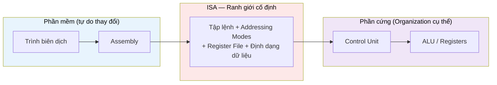

# MASTER COMPUTER SCIENCE HANDBOOK

## Volume 02 — Computer Science Foundations
### Part V — Computer Organization & Architecture
## Chương 2.23 — Instruction Set Architecture (ISA)

---

### Thông tin chương

| Trường | Giá trị |
|---|---|
| Chương | 2.23 |
| Thuộc Part | V — Computer Organization & Architecture |
| Thuộc Volume | 02 — Computer Science Foundations |
| Thời gian đọc ước tính | 45–55 phút |
| Độ khó | ★★★☆☆ |
| Kiến thức tiên quyết | Chương 2.22 — Tổng quan Computer Organization & Architecture; Volume 2, Part II — Data Representation (Binary Number System) |
| Chương liên quan | 2.24 — Tổ chức CPU: Datapath và Control Unit (sử dụng trực tiếp khái niệm ISA để giải thích cách CPU thực thi từng lệnh) |
| Từ khóa | ISA, Opcode, Operand, Addressing Mode, RISC, CISC, Register File, Instruction Format |

---

### Mục tiêu học tập

Sau khi hoàn thành chương này, người đọc có thể:

- Định nghĩa chính xác **Instruction Set Architecture (ISA)** và giải thích vai trò "hợp đồng" của nó giữa phần mềm và phần cứng (đã nêu ở Chương 2.22, Hình 2.22.1).
- Phân loại một tập lệnh thành ba nhóm chức năng: số học/logic, di chuyển dữ liệu, điều khiển luồng.
- Đọc và giải thích cấu trúc của một **Instruction Format** (opcode + operand).
- Nhận diện và áp dụng các **Addressing Mode** phổ biến: Immediate, Register, Direct, Base + Offset.
- So sánh triết lý thiết kế **RISC** và **CISC**, giải thích trade-off giữa hai hướng tiếp cận.
- Tự tay "lắp ráp" (assemble) và "giải mã" (decode) một lệnh máy đơn giản bằng tay và bằng code.

---

### Câu hỏi khơi gợi

> *Chương 2.22 nói rằng CPU "không biết Python là gì" — nó chỉ biết đọc các chuỗi bit. Nhưng làm sao một chuỗi bit như `0010000000000101` lại "biết" phải cộng hai số, chứ không phải trừ, hay nhảy tới một dòng lệnh khác? Ai là người quyết định "ý nghĩa" của từng bit trong chuỗi đó?*

---

## 1. Tổng quan chương

Chương 2.22 đã xác định ISA là ranh giới quan trọng nhất trong toàn bộ chuỗi tầng trừu tượng (Hình 2.22.1) — nơi phần mềm (có thể thay đổi tự do) gặp phần cứng (cố định trong silicon). Chương này "phóng to" đúng ranh giới đó.

Nếu Chương 2.22 trả lời câu hỏi *"CPU làm gì?"* (Fetch–Decode–Execute) ở mức khái niệm, thì chương này trả lời câu hỏi cụ thể hơn: **chính xác thì một "lệnh" trông như thế nào, và ai quy định ý nghĩa của nó?** Đây là kiến thức tiên quyết bắt buộc trước khi có thể hiểu chi tiết cơ chế Control Unit và ALU giải mã lệnh ở Chương 2.24.

> **💡 Insight**
> Nếu bạn từng đọc tài liệu API của một thư viện phần mềm — nơi liệt kê chính xác tên hàm, kiểu tham số, giá trị trả về — bạn đã quen với khái niệm ISA. Một ISA về bản chất là **tài liệu API của phần cứng**: nó liệt kê chính xác "phần cứng cung cấp những thao tác nào, và mỗi thao tác nhận tham số ra sao."

---

## 2. Bối cảnh lịch sử

| Thời điểm | Sự kiện | Ý nghĩa |
|---|---|---|
| Thập niên 1970 | Các ISA thương mại đầu tiên (ví dụ dòng x86 sơ khai) có xu hướng bổ sung ngày càng nhiều lệnh phức tạp | Mỗi lệnh cố gắng làm được nhiều việc hơn, để giảm số dòng assembly cần viết — tiền thân của triết lý **CISC** |
| Đầu thập niên 1980 | Nghiên cứu tại Berkeley và Stanford (dự án RISC, MIPS) | Đặt câu hỏi ngược lại: nếu phần lớn thời gian CPU chỉ dùng một tập nhỏ lệnh đơn giản, tại sao không thiết kế phần cứng tối ưu cho đúng tập lệnh đơn giản đó? → khởi nguồn triết lý **RISC** |
| Thập niên 1980–1990 | "Cuộc tranh luận RISC vs CISC" | Một trong những tranh luận kỹ thuật nổi tiếng nhất lịch sử kiến trúc máy tính, định hình lại cách thiết kế CPU thương mại trong nhiều thập kỷ (Mục 12, 15) |
| 2010 → nay | RISC-V — ISA mã nguồn mở | Minh chứng rằng ISA là một **đặc tả (specification)** hoàn toàn tách biệt khỏi việc hiện thực — bất kỳ ai cũng có thể thiết kế chip tuân theo đặc tả này mà không cần trả phí bản quyền |

---

## 3. Động lực

Giả sử bạn viết một hàm Python đơn giản:

```python
def add_and_double(a, b):
    return (a + b) * 2
```

Khi trình biên dịch (hoặc trình thông dịch, tùy runtime) xử lý hàm này, tại một thời điểm nào đó, phép cộng `a + b` phải được chuyển thành **một lệnh cụ thể mà CPU hiểu được** — ví dụ một lệnh `ADD` lấy hai giá trị từ hai thanh ghi, cộng lại, lưu kết quả vào thanh ghi thứ ba. Nhưng "một lệnh cụ thể mà CPU hiểu được" nghĩa là gì? Làm sao trình biên dịch biết chính xác dùng bao nhiêu bit để mã hóa lệnh `ADD`, và những bit nào chỉ định "cộng thanh ghi nào với thanh ghi nào"?

Câu trả lời: trình biên dịch **không tự quyết định** điều này — nó tra cứu một tài liệu đặc tả cố định, chính là **ISA** của CPU đích. Không có ISA, sẽ không có cách nào để hai bên (người viết trình biên dịch và người thiết kế chip) đồng thuận về ý nghĩa của một chuỗi bit.

---

## 4. Trực giác

**Mô hình tinh thần (Mental Model) của chương này:**

> Một ISA giống như **thực đơn cố định (fixed menu)** của một nhà hàng. Bạn (phần mềm) không thể gọi món tùy ý — bạn chỉ có thể chọn trong danh sách món ăn đã được liệt kê sẵn, mỗi món có mã số và cách gọi rõ ràng (opcode + operand). Đầu bếp (phần cứng) chỉ cần biết cách nấu đúng những món trong thực đơn đó — không cần biết ý định sâu xa của thực khách là gì.

| Trực giác kỹ thuật bạn đã có | Khái niệm ISA tương ứng |
|---|---|
| Tài liệu API (danh sách hàm, tham số, kiểu trả về) | ISA (danh sách lệnh, operand, hành vi) |
| Mã lỗi HTTP status code (200, 404, 500...) | Opcode — một mã số cố định gắn với một ý nghĩa cố định |
| Tham số hàm truyền theo giá trị vs theo tham chiếu | Addressing Mode (Mục 6) — cách một operand được "trỏ tới" giá trị thật |
| `interface` trong lập trình hướng đối tượng | ISA — giao diện cố định; nhiều CPU khác nhau (Organization) có thể cùng hiện thực một ISA |

---

## 5. Trực quan hóa khái niệm

**Hình 2.23.1 — Cấu trúc một Instruction Format điển hình**
*(Visual đặc trưng của chương — Chapter Identity)*

```text
   ┌──────────────┬──────────────────────────────────┐
   │    Opcode     │             Operand(s)            │
   │  (mã lệnh)    │      (toán hạng — dữ liệu hoặc     │
   │               │       địa chỉ liên quan)           │
   └──────────────┴──────────────────────────────────┘
        4 bit                     12 bit
        (ví dụ)                   (ví dụ)

   Ví dụ cụ thể:  0010  000000000101
                    ↑         ↑
                  "ADD"      giá trị 5
```

| Trường thông tin | Nội dung |
|---|---|
| Mục đích | Cho thấy trực quan rằng "một lệnh" không phải khái niệm mơ hồ — nó là một chuỗi bit có độ dài cố định, chia thành các trường (field) có ý nghĩa xác định trước |
| Điểm mấu chốt | Trường Opcode luôn nằm ở vị trí cố định — đây là lý do Control Unit (Chương 2.24) có thể "giải mã" lệnh chỉ bằng cách đọc đúng một số bit đầu tiên, không cần hiểu toàn bộ chuỗi bit |

---

**Hình 2.23.2 — ISA như ranh giới giữa Phần mềm và Phần cứng**



*Mục đích:* nhấn mạnh lại thông điệp cốt lõi từ Chương 2.22 — nhiều Organization khác nhau (Intel, AMD, các thế hệ chip khác nhau) có thể cùng hiện thực một ISA, miễn là tuân thủ đúng đặc tả ở khối trung tâm.

---

## 6. Định nghĩa hình thức

> **📌 Remember — Instruction Set Architecture (ISA)**
>
> **ISA** là đặc tả hình thức (formal specification) xác định toàn bộ những gì phần mềm có thể "thấy" và sử dụng ở tầng phần cứng, bao gồm:
>
> | Thành phần của ISA | Mô tả |
> |---|---|
> | **Tập lệnh (Instruction Set)** | Danh sách đầy đủ các lệnh mà CPU hỗ trợ, cùng ý nghĩa chính xác của từng lệnh |
> | **Instruction Format** | Cách một lệnh được mã hóa thành chuỗi bit (Hình 2.23.1) |
> | **Register File** | Số lượng và tên gọi các thanh ghi mà phần mềm có thể truy cập trực tiếp |
> | **Addressing Modes** | Các cách một operand có thể trỏ tới giá trị thật (Mục 6, bảng dưới) |
> | **Định dạng dữ liệu** | Các kiểu dữ liệu phần cứng hỗ trợ gốc (số nguyên, số thực dấu phẩy động...) |

**Phân loại lệnh theo chức năng** — hầu hết ISA hiện đại đều có ba nhóm lệnh cốt lõi:

| Nhóm lệnh | Chức năng | Ví dụ |
|---|---|---|
| **Arithmetic / Logic** | Thực hiện phép toán số học hoặc logic trên dữ liệu | `ADD`, `SUB`, `AND`, `OR` |
| **Data Transfer** | Di chuyển dữ liệu giữa Register và Memory | `LOAD`, `STORE` |
| **Control Flow** | Thay đổi thứ tự thực thi (không đi tuần tự +1 như Chương 2.22, Mục 8) | `JUMP`, `BRANCH`, `CALL` |

**Addressing Mode (Chế độ đánh địa chỉ)** — cách một operand trong Instruction Format được diễn giải để tìm ra giá trị thật cần dùng:

| Addressing Mode | Ý nghĩa | Ví dụ |
|---|---|---|
| **Immediate** | Operand chính là giá trị cần dùng, không cần tra cứu thêm | `LOAD #5` → nạp thẳng số 5 |
| **Register** | Operand chỉ định một thanh ghi chứa giá trị | `ADD R1, R2` → cộng giá trị đang có trong R1 và R2 |
| **Direct** | Operand là một địa chỉ bộ nhớ tuyệt đối, cần đọc bộ nhớ tại địa chỉ đó | `LOAD [1000]` → nạp giá trị tại địa chỉ 1000 |
| **Base + Offset** | Địa chỉ thật = giá trị trong một thanh ghi cơ sở (base) cộng với một độ lệch (offset) cố định | `LOAD [R1 + 4]` → truy cập ô nhớ cách R1 bốn đơn vị — nền tảng của việc truy cập mảng (Volume 2, Part IV) |

---

## 7. Nền tảng toán học

### 7.1 Không gian địa chỉ có thể biểu diễn

- **Ý nghĩa:** số bit dành cho trường địa chỉ trong Instruction Format quyết định trực tiếp CPU có thể "nhìn thấy" tối đa bao nhiêu ô nhớ khác nhau — áp dụng trực tiếp nguyên lý đã học ở Chương 1.5 (Mục 7.1, Tập lũy thừa): mỗi bit là một lựa chọn nhị phân độc lập.

> **📦 Formula Box — Không gian địa chỉ (Address Space)**
>
> $$N = 2^{k}$$
>
> | Thành phần | Ý nghĩa |
> |---|---|
> | $k$ | Số bit dành cho trường địa chỉ trong Instruction Format |
> | $N$ | Số ô nhớ tối đa có thể đánh địa chỉ (addressable memory locations) |
> | **Diễn giải kỹ thuật** | Đây chính là công thức $|\mathcal{P}(A)| = 2^{|A|}$ đã học ở Chương 1.5 áp dụng vào bối cảnh mới: mỗi tổ hợp bit là một địa chỉ duy nhất, giống mỗi tổ hợp bit trong tập lũy thừa là một tập con duy nhất |
> | **Ứng dụng thường gặp** | Giải thích trực tiếp vì sao các CPU "32-bit" chỉ đánh địa chỉ tối đa khoảng 4 tỷ ($2^{32}$) ô nhớ — giới hạn RAM tối đa mà một hệ thống 32-bit có thể sử dụng, dù RAM vật lý lắp vào máy lớn hơn |

**Ví dụ kiểm chứng:** với $k = 12$ bit (như Hình 2.23.1), $N = 2^{12} = 4096$ ô nhớ có thể đánh địa chỉ trực tiếp bằng trường operand đó.

### 7.2 Địa chỉ hiệu dụng trong chế độ Base + Offset

> **📦 Formula Box — Địa chỉ hiệu dụng (Effective Address)**
>
> $$EA = \text{Base} + \text{Offset}$$
>
> | Thành phần | Ý nghĩa |
> |---|---|
> | $\text{Base}$ | Giá trị đang lưu trong thanh ghi cơ sở — thường là địa chỉ bắt đầu của một cấu trúc dữ liệu (ví dụ: mảng) |
> | $\text{Offset}$ | Độ lệch cố định được mã hóa ngay trong lệnh |
> | $EA$ | Địa chỉ thật sự sẽ được dùng để truy cập Memory |
> | **Diễn giải kỹ thuật** | Đây chính xác là cơ chế phần cứng đứng sau cú pháp `matrix[i][j]` ở Chương 2.4 (Part IV) — trình biên dịch tính offset dựa trên chỉ số $i, j$ và kích thước phần tử, rồi phát ra một lệnh dùng Base + Offset addressing |

---

## 8. Thuật toán / Cơ chế

**Cơ chế giải mã Opcode (Opcode Decoding)** — cách Control Unit (sẽ chi tiết ở Chương 2.24) xác định một lệnh thuộc loại nào chỉ bằng cách đọc đúng số bit cố định đầu tiên:

```text
Bước 1 — Nhận vào chuỗi bit của lệnh, độ dài cố định (ví dụ 16 bit)
        │
        ▼
Bước 2 — Trích xuất đúng k bit đầu tiên (trường Opcode,
         ví dụ 4 bit đầu — xem Hình 2.23.1)
        │
        ▼
Bước 3 — Tra cứu bảng ánh xạ (opcode table) đã định nghĩa
         sẵn trong ISA: chuỗi bit này ứng với lệnh nào?
        │
        ▼
Bước 4 — Trích xuất các bit còn lại (trường Operand)
        │
        ▼
Bước 5 — Diễn giải Operand theo đúng Addressing Mode
         mà lệnh đó quy định (Mục 6)
```

> **💡 Insight**
> Cơ chế "đọc k bit đầu tiên để biết loại lệnh" chỉ khả thi vì **mọi lệnh trong ISA có độ dài cố định** (ít nhất trong các ISA kiểu RISC, xem Mục 15) — một quyết định thiết kế nghe đơn giản nhưng có ảnh hưởng sâu sắc đến tốc độ giải mã phần cứng, sẽ thấy rõ hơn ở Chương 2.24 và 2.25 (Pipelining).

---

## 9. Triển khai

Mở rộng trực tiếp `toy_cpu` ở Chương 2.22 (Mục 9): thay vì dùng tuple Python dễ đọc như `("LOAD", 2)`, ta xây dựng một **assembler** và **decoder** thật sự làm việc với chuỗi bit, đúng tinh thần Hình 2.23.1.

```python
# Bảng ánh xạ Opcode — chính là một phần của đặc tả ISA (Mục 6)
OPCODE_TABLE = {
    "HALT":  "0000",
    "LOAD":  "0001",
    "ADD":   "0010",
    "SUB":   "0011",
    "PRINT": "0100",
}
OPCODE_WIDTH = 4
OPERAND_WIDTH = 12


def assemble(mnemonic, operand=0):
    """Dịch một dòng assembly sang chuỗi bit 16-bit,
    đúng Instruction Format ở Hình 2.23.1."""
    opcode_bits = OPCODE_TABLE[mnemonic]
    operand_bits = format(operand, f"0{OPERAND_WIDTH}b")
    return opcode_bits + operand_bits


def decode(instruction_bits):
    """Giải mã ngược: chuỗi bit -> (mnemonic, operand),
    thực hiện đúng Bước 2-4 của cơ chế ở Mục 8."""
    opcode_bits = instruction_bits[:OPCODE_WIDTH]
    operand_bits = instruction_bits[OPCODE_WIDTH:]

    mnemonic = next(
        name for name, bits in OPCODE_TABLE.items()
        if bits == opcode_bits
    )
    operand = int(operand_bits, 2)
    return mnemonic, operand
```

Hai hàm này thể hiện đúng hai chiều của ISA: `assemble` đóng vai trò trình hợp dịch (assembler, tầng D trong Hình 2.22.1), còn `decode` đóng vai trò Control Unit ở tầng phần cứng — cả hai đều dựa trên **cùng một bảng đặc tả** `OPCODE_TABLE`, chính là hiện thân của khái niệm ISA như một "hợp đồng chung".

---

## 10. Trực quan hóa quá trình thực thi

Lắp ráp và giải mã lệnh `ADD` với operand `5`:

```python
bits = assemble("ADD", 5)
print(bits)               # 0010000000000101
print(decode(bits))       # ('ADD', 5)
```

**Bảng vết lắp ráp / giải mã:**

| Bước | Nội dung | Giá trị |
|---|---|---|
| Assembly gốc | `ADD 5` | — |
| Opcode tra bảng | `"ADD"` → | `0010` |
| Operand nhị phân (12 bit) | `5` → | `000000000101` |
| Chuỗi bit hoàn chỉnh | Ghép opcode + operand | `0010000000000101` |
| Giải mã lại — Opcode | 4 bit đầu | `0010` → tra bảng → `"ADD"` |
| Giải mã lại — Operand | 12 bit sau | `000000000101` → `int(..., 2)` → `5` |
| Kết quả giải mã | | `("ADD", 5)` |

Bảng này cho thấy `assemble` và `decode` là hai phép biến đổi **nghịch đảo hoàn hảo** của nhau — đúng như kỳ vọng, vì cả hai cùng tuân theo một đặc tả ISA duy nhất.

---

## 11. Ứng dụng công nghiệp

> **🛠 Engineering Practice**
> Sự khác biệt RISC/CISC (Mục 2, 15) không chỉ là lịch sử — nó vẫn định hình thị trường chip hiện nay.

| Bối cảnh công nghiệp | Liên hệ với nội dung chương |
|---|---|
| x86-64 (Intel, AMD) | ISA theo triết lý **CISC** — nhiều lệnh có độ dài thay đổi, một số lệnh thực hiện nhiều bước phức tạp trong một opcode duy nhất |
| ARM (Apple Silicon, chip di động), RISC-V | ISA theo triết lý **RISC** — lệnh có độ dài cố định, tập lệnh tối giản, đúng như giả định ở Mục 8 |
| Trình biên dịch (`gcc`, LLVM) | Có một "backend" riêng cho mỗi ISA đích — chính là bước "assemble" ở Mục 9, nhưng phức tạp hơn nhiều lần trong thực tế |
| Trình gỡ lỗi cấp thấp (`objdump`, `gdb`) | Thực hiện chính xác thao tác `decode` ở Mục 9 — dịch ngược mã máy đã biên dịch trở lại thành assembly để lập trình viên đọc được |

---

## 12. Góc nhìn nghiên cứu

> **🔬 Research Connection**
> Cuộc tranh luận RISC vs CISC (Mục 2) là một trong số ít cuộc tranh luận kỹ thuật trong Computer Science vừa mang tính học thuật sâu sắc, vừa có tác động thương mại trực tiếp và kéo dài hàng thập kỷ.

Lập luận cốt lõi phía RISC: nếu phần lớn thời gian thực thi thực tế của chương trình chỉ dùng một tập nhỏ các lệnh đơn giản (một quan sát thực nghiệm được gọi là **quy luật 80/20** trong bối cảnh sử dụng lệnh), thì việc đầu tư phần cứng để làm tập lệnh đơn giản đó chạy cực nhanh — thay vì hỗ trợ nhiều lệnh phức tạp hiếm khi dùng đến — sẽ mang lại hiệu năng tổng thể tốt hơn. Ngược lại, lập luận phía CISC nhấn mạnh rằng lệnh phức tạp giúp giảm số dòng assembly, từ đó giảm kích thước chương trình và số lần truy cập bộ nhớ để lấy lệnh — một lợi thế quan trọng khi bộ nhớ còn đắt đỏ và chậm.

Kết quả của cuộc tranh luận này, sau nhiều thập kỷ, không phải "một bên thắng tuyệt đối" mà là một sự **hội tụ thiết kế (design convergence)**: nhiều CPU hiện đại theo ISA CISC (như x86) trên thực tế dịch các lệnh CISC phức tạp thành các "vi lệnh" (micro-operations) đơn giản hơn ở tầng phần cứng bên trong trước khi thực thi — một hướng nghiên cứu và kỹ thuật sẽ được đề cập sâu hơn ở Volume 4.

**Câu hỏi mở** để suy ngẫm: nếu một ISA có thể được thiết kế lại từ đầu ngày hôm nay, không bị ràng buộc bởi tính tương thích ngược (backward compatibility) với hàng thập kỷ phần mềm cũ, nó nên trông như thế nào? *(Đây chính xác là câu hỏi mà dự án RISC-V — Mục 2 — đặt ra và đang tiếp tục phát triển.)*

---

## 13. Ưu điểm

- **Tách biệt hoàn toàn phần mềm khỏi chi tiết phần cứng** — trình biên dịch chỉ cần biết ISA, không cần biết CPU cụ thể nào sẽ chạy chương trình.
- **Cho phép nhiều Organization cạnh tranh trên cùng một Architecture** (đã nêu ở Chương 2.22, Mục 11) — thúc đẩy đổi mới trong khi vẫn giữ tương thích phần mềm.
- **Instruction Format có cấu trúc rõ ràng, có thể giải mã máy móc** (Mục 8) — nền tảng để Control Unit hoạt động chính xác và có thể phân tích được về mặt tốc độ.

---

## 14. Hạn chế

> **⚠️ Common Mistake**
> Người mới học thường nghĩ rằng "lệnh CPU" là một khái niệm mơ hồ, tương tự "câu lệnh" trong ngôn ngữ bậc cao. Trên thực tế, một lệnh CPU **không hề có ý nghĩa tự thân** — ý nghĩa của nó hoàn toàn phụ thuộc vào bảng tra cứu (`OPCODE_TABLE` ở Mục 9) đã được thống nhất trước, giữa nhà thiết kế ISA và nhà thiết kế phần cứng.

- **Tính tương thích ngược (backward compatibility)** là gánh nặng lớn: một khi ISA được công bố rộng rãi (như x86), việc thay đổi nó gần như bất khả thi vì sẽ phá vỡ hàng triệu chương trình đã biên dịch sẵn — đây là lý do nhiều ISA thương mại tồn tại "tầng vá" (compatibility layer) rất phức tạp theo thời gian.
- Với ISA kiểu CISC, lệnh có độ dài thay đổi khiến việc giải mã (Mục 8) khó dự đoán trước hơn nhiều so với RISC, ảnh hưởng trực tiếp đến khả năng thiết kế Pipeline hiệu quả (sẽ thấy rõ ở Chương 2.25).

---

## 15. So sánh

**Bảng 2.23.1 — Triết lý thiết kế RISC và CISC**

| Tiêu chí | RISC (Reduced Instruction Set Computer) | CISC (Complex Instruction Set Computer) |
|---|---|---|
| Số lượng lệnh | Ít, đơn giản | Nhiều, một số lệnh rất phức tạp |
| Độ dài lệnh | Cố định (ví dụ luôn 32 bit) | Thường thay đổi (ví dụ x86: 1–15 byte) |
| Số chu kỳ mỗi lệnh | Thường 1 chu kỳ cho phần lớn lệnh | Có thể nhiều chu kỳ cho một lệnh phức tạp |
| Gánh nặng | Đặt lên trình biên dịch (cần sinh nhiều lệnh đơn giản hơn) | Đặt lên phần cứng (mạch giải mã phức tạp hơn) |
| Ví dụ tiêu biểu | ARM, RISC-V, MIPS | x86 / x86-64 |

**Phân tích:** đây là một trade-off kinh điển khác giữa **độ phức tạp phần mềm** và **độ phức tạp phần cứng** — mô-típ đã gặp ở Bảng 2.22.1 (Von Neumann vs Harvard) và sẽ còn lặp lại xuyên suốt Handbook. Không có lựa chọn nào đúng tuyệt đối; lựa chọn phụ thuộc vào ràng buộc thực tế (tiêu thụ năng lượng, yêu cầu tương thích, mục tiêu hiệu năng).

---

## 16. Tóm tắt

- **ISA** là đặc tả hình thức về tập lệnh, Instruction Format, Register File, và Addressing Modes — "hợp đồng" cố định giữa phần mềm và phần cứng đã xác định ở Chương 2.22.
- Lệnh được phân thành ba nhóm chức năng: **Arithmetic/Logic**, **Data Transfer**, **Control Flow**.
- **Addressing Mode** quy định cách một Operand được diễn giải thành giá trị thật; **Base + Offset** là cơ chế phần cứng đứng sau việc truy cập phần tử mảng.
- Không gian địa chỉ tối đa tuân theo công thức $N = 2^k$ — cùng nguyên lý toán học với Tập lũy thừa (Chương 1.5).
- Cuộc tranh luận **RISC vs CISC** phản ánh một trade-off nền tảng giữa độ phức tạp phần mềm và phần cứng, vẫn định hình thị trường chip hiện nay (ARM/RISC-V vs x86).

Chương 2.24 sẽ dùng trực tiếp mọi khái niệm vừa học ở đây — Opcode, Operand, Register File — để mổ xẻ chính xác cách Control Unit và ALU cộng tác thực thi một lệnh, hoàn thiện bức tranh Fetch–Decode–Execute đã phác thảo ở Chương 2.22.

---

## 17. Bài tập

### Mức Cơ bản (Basic)

1. Với `OPCODE_TABLE` ở Mục 9, hãy tự tay (không dùng code) lắp ráp lệnh `SUB 3` thành chuỗi bit 16-bit đầy đủ, theo đúng Instruction Format ở Hình 2.23.1. *(Lưu ý: `SUB` chưa có trong bảng — hãy tự đề xuất một mã opcode 4-bit hợp lệ cho nó, đảm bảo không trùng với opcode đã có.)*
2. Giải thích bằng lời của riêng bạn tại sao ISA cần được xem là "cố định" trong khi Organization (Chương 2.22) có thể thay đổi tự do.

### Mức Trung bình (Intermediate)

3. Với trường Operand 12-bit như ở Hình 2.23.1, tính không gian địa chỉ tối đa $N$ theo Formula Box Mục 7.1. Nếu muốn CPU đánh địa chỉ được tối thiểu 1 triệu ô nhớ, trường Operand cần tối thiểu bao nhiêu bit?
4. Cho $\text{Base} = 2000$ (địa chỉ bắt đầu của một mảng số nguyên, mỗi phần tử chiếm 4 byte) và chỉ số truy cập $i = 6$. Áp dụng Formula Box Mục 7.2, tính địa chỉ hiệu dụng $EA$ của phần tử `array[6]`. *(Gợi ý: $\text{Offset} = i \times \text{kích thước phần tử}$.)*

### Mức Nâng cao (Advanced)

5. Mở rộng hàm `assemble`/`decode` ở Mục 9 để hỗ trợ thêm lệnh `JUMP` — một lệnh thuộc nhóm Control Flow (Mục 6). Operand của `JUMP` không phải một giá trị số học mà là **địa chỉ của lệnh tiếp theo cần nhảy tới**. Viết một đoạn chương trình assembly ngắn (dạng danh sách `(mnemonic, operand)`) minh họa cách `JUMP` thay đổi Program Counter so với hành vi mặc định "+1" đã học ở Chương 2.22.

### Mức Nghiên cứu (Research)

6. Tra cứu (qua sách hoặc tài liệu uy tín) số lượng lệnh xấp xỉ trong ISA của một CPU RISC hiện đại (ví dụ RISC-V RV32I) so với một CPU CISC (ví dụ x86-64). Từ số liệu tìm được, thảo luận: sự chênh lệch đó phản ánh điều gì về trade-off đã bàn ở Mục 15, và bạn nghĩ xu hướng thiết kế ISA trong tương lai (ví dụ cho chip AI chuyên dụng) sẽ nghiêng về phía nào? Đây là câu hỏi mở, không có đáp án duy nhất đúng.

---

## 18. Dự án nhỏ

**Dự án: Mini-Assembler và Mini-Disassembler hoàn chỉnh**

- **Mục tiêu:** củng cố toàn bộ Mục 6–10 bằng cách xây dựng một công cụ lắp ráp/giải mã có khả năng xử lý một chương trình nhiều dòng, không chỉ một lệnh đơn lẻ.
- **Yêu cầu:**
  1. Mở rộng `OPCODE_TABLE` (Mục 9) với đầy đủ các lệnh đã dùng ở Chương 2.22 và Bài tập 5 ở trên: `HALT, LOAD, ADD, SUB, PRINT, JUMP`.
  2. Viết hàm `assemble_program(lines)` nhận một danh sách các dòng assembly dạng `"ADD 5"`, trả về danh sách các chuỗi bit 16-bit tương ứng.
  3. Viết hàm `disassemble_program(bit_strings)` thực hiện chiều ngược lại — trả về danh sách các dòng assembly dễ đọc.
  4. Kiểm chứng: `disassemble_program(assemble_program(original_lines)) == original_lines`.
- **Công nghệ đề xuất:** Python thuần.
- **Mở rộng (tùy chọn):** tích hợp `assemble_program` với `toy_cpu` đã viết ở Chương 2.22 (Mục 18) để có một pipeline hoàn chỉnh: assembly → mã máy → thực thi.

---

## 19. Tự đánh giá

- [ ] Tôi có thể định nghĩa ISA và liệt kê đủ bốn thành phần chính của nó (Mục 6) mà không cần nhìn lại.
- [ ] Tôi có thể phân loại một lệnh bất kỳ vào một trong ba nhóm chức năng (Arithmetic/Logic, Data Transfer, Control Flow).
- [ ] Tôi có thể giải thích sự khác biệt giữa Immediate, Register, Direct, và Base + Offset addressing mode, kèm ví dụ cho mỗi loại.
- [ ] Tôi đã tự tay lắp ráp và giải mã ít nhất một lệnh bằng tay (Bài tập 1), không chỉ chạy code có sẵn.
- [ ] Tôi có thể tóm tắt trade-off cốt lõi giữa RISC và CISC bằng 2–3 câu, không cần liệt kê chi tiết kỹ thuật.

Nếu Bài tập 4 (địa chỉ hiệu dụng) vẫn còn khó, đây là dấu hiệu nên ôn lại Mục 6 (Addressing Mode) và Mục 7.2 trước khi sang Chương 2.24 — khái niệm Base + Offset sẽ quay lại trực tiếp khi bàn về cách CPU truy cập mảng và cấu trúc dữ liệu ở tầng phần cứng.

---

## 20. Đọc thêm

- **Sách:** Randal E. Bryant, David R. O'Hallaron, *Computer Systems: A Programmer's Perspective* — chương về biểu diễn máy (machine-level representation), trình bày chi tiết Instruction Format thực tế của x86-64. *(Xem BOOKS.md.)*
- **Sách:** Andrew S. Tanenbaum, *Modern Operating Systems* — phần cơ sở về kiến trúc máy tính, đối chiếu góc nhìn hệ điều hành với ISA. *(Xem BOOKS.md.)*
- **Chủ đề mở rộng (không bắt buộc):** tìm đọc đặc tả chính thức của **RISC-V RV32I Base Instruction Set** — một tài liệu công khai, tương đối ngắn gọn, là ví dụ thực tế rõ ràng nhất cho mọi khái niệm đã học ở chương này.
- **Chương tiếp theo:** Chương 2.24 — Tổ chức CPU: Datapath và Control Unit.

---

### Liên kết chương (Cross References)

- **Chương trước:** 2.22 — Tổng quan Computer Organization & Architecture (đã xác định ISA là ranh giới quan trọng nhất trong chuỗi tầng trừu tượng).
- **Chương tiếp theo:** 2.24 — Tổ chức CPU: Datapath và Control Unit (sử dụng trực tiếp Opcode, Operand, Register File vừa học để mô tả cơ chế phần cứng cụ thể).
- **Chương liên quan xa hơn:** Chương 1.5 — Set Theory (công thức $2^{|A|}$ tái sử dụng trực tiếp ở Mục 7.1); Volume 2, Part IV — Data Structures (Base + Offset addressing là cơ chế phần cứng đứng sau truy cập mảng); Volume 4, Part I — Computer Organization and Architecture (mở rộng sâu về vi lệnh, micro-operations trong CPU CISC hiện đại).
- **Vị trí trong Knowledge Graph:** Nút thứ hai của Volume 2, Part V; phụ thuộc trực tiếp vào Chương 2.22; là điều kiện tiên quyết bắt buộc cho toàn bộ các chương còn lại của Part V (2.24–2.28), vì mọi chương sau đều thao tác trên các khái niệm Opcode/Operand/Register đã định nghĩa ở đây.

---

*Hết Chương 2.23. Chương này tuân thủ đầy đủ cấu trúc 20 mục của `OUTPUT.md` và chuẩn Presentation Layer của `WRITING_STANDARD.md`, khớp phong cách trình bày đã thiết lập ở Chương 1.5 và Chương 2.22. Đang chờ rà soát trước khi tiếp tục sang Chương 2.24.*
