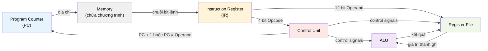

# MASTER COMPUTER SCIENCE HANDBOOK

## Volume 02 — Computer Science Foundations
### Part V — Computer Organization & Architecture
## Chương 2.24 — Tổ chức CPU: Datapath và Control Unit

---

### Thông tin chương

| Trường | Giá trị |
|---|---|
| Chương | 2.24 |
| Thuộc Part | V — Computer Organization & Architecture |
| Thuộc Volume | 02 — Computer Science Foundations |
| Thời gian đọc ước tính | 50–60 phút |
| Độ khó | ★★★☆☆ |
| Kiến thức tiên quyết | Chương 2.22 — Tổng quan Computer Organization & Architecture; Chương 2.23 — Instruction Set Architecture (ISA) |
| Chương liên quan | 2.25 — Pipelining: Nhập môn (chia nhỏ chính Datapath học ở chương này thành nhiều giai đoạn chạy song song) |
| Từ khóa | Datapath, Control Unit, Control Signal, Register File, Instruction Register (IR), Single-cycle, Multi-cycle, CPI |

---

### Mục tiêu học tập

Sau khi hoàn thành chương này, người đọc có thể:

- Liệt kê và mô tả vai trò của từng thành phần vật lý trong **Datapath**: Register File, ALU, Program Counter (PC), Instruction Register (IR), các đường Bus nội bộ.
- Giải thích cơ chế **Control Unit** sinh ra **Control Signal** dựa trên Opcode đã học ở Chương 2.23.
- Trace (dò vết) từng bước Fetch–Decode–Execute ở mức tín hiệu phần cứng cụ thể, thay vì mức khái niệm như Chương 2.22.
- Phân biệt thiết kế **Single-cycle Datapath** và **Multi-cycle Datapath**, giải thích trade-off giữa hai hướng.
- Áp dụng **phương trình hiệu năng CPU** (CPU Performance Equation) để tính thời gian thực thi một chương trình.

---

### Câu hỏi khơi gợi

> *Chương 2.23 cho thấy lệnh `ADD` được mã hóa thành chuỗi bit `0010000000000101`. Nhưng "giải mã" xong rồi thì sao? Bit `0010` đó phải "chạm" vào phần cứng vật lý nào để phép cộng thực sự xảy ra — và tại sao cùng một mạch ALU lại có thể thực hiện được cả `ADD` lẫn `SUB` mà không cần hai mạch riêng biệt?*

---

## 1. Tổng quan chương

Chương 2.22 giới thiệu chu trình Fetch–Decode–Execute như một "vòng lặp `while True`" ở mức khái niệm. Chương 2.23 định nghĩa chính xác **lệnh** là gì — một chuỗi bit có cấu trúc Opcode + Operand. Chương này khép lại bộ ba nền tảng của Part V bằng cách trả lời câu hỏi cuối cùng: **phần cứng vật lý nào thực sự thực hiện bốn bước đó?**

Đây là chương "kỹ thuật" nhất tính đến thời điểm này trong Part V — không còn dừng ở mô tả khái niệm mà đi vào **sơ đồ mạch dữ liệu (Datapath)** cụ thể: dữ liệu di chuyển qua những đường dây nào, dừng ở thanh ghi nào, và Control Unit "bật/tắt" những công tắc điều khiển nào tại mỗi chu kỳ xung nhịp.

> **💡 Insight**
> Nếu Chương 2.23 là "tài liệu API" của CPU, thì chương này là "source code hiện thực API đó". Cùng một ISA (API) có thể được hiện thực bằng nhiều Datapath (implementation) khác nhau — chính xác là sự phân biệt Architecture/Organization đã nêu ở Chương 2.22, Mục 6, giờ được cụ thể hóa bằng một ví dụ thực sự.

---

## 2. Bối cảnh lịch sử

| Thời điểm | Sự kiện | Ý nghĩa |
|---|---|---|
| Thập niên 1950s | Các thiết kế CPU sơ khai dùng mạch cứng (hardwired control) | Control Unit được xây dựng trực tiếp bằng cổng logic cố định cho từng lệnh |
| 1951 | Maurice Wilkes đề xuất khái niệm **Microprogramming (vi lập trình)** | Thay vì mạch cứng, Control Unit có thể được hiện thực bằng một "chương trình nhỏ" lưu trong bộ nhớ điều khiển — linh hoạt hơn, dễ sửa lỗi thiết kế hơn, đặt nền cho cách tiếp cận Multi-cycle Datapath (Mục 15) |
| Thập niên 1980s | Phong trào RISC (đã nêu ở Chương 2.23, Mục 2) | Ủng hộ quay lại **hardwired control** cho phần lớn lệnh đơn giản, vì tốc độ giải mã nhanh hơn microprogramming — một phần của lập luận RISC vs CISC |

---

## 3. Động lực

Ở Chương 2.22 (Mục 9), ta viết `toy_cpu` với một dòng code duy nhất xử lý mọi opcode:

```python
if opcode == "LOAD":
    accumulator = operand
elif opcode == "ADD":
    accumulator += operand
```

Đoạn code này **che giấu** một câu hỏi quan trọng: trên phần cứng thật, không hề có câu lệnh `if/elif` nào cả — không có "bộ xử lý trung tâm" nào đọc code Python và rẽ nhánh theo logic đó. Vậy điều gì, ở mức mạch điện, đóng vai trò tương đương với `if opcode == "ADD"`? Câu trả lời chính là **Control Unit**: một mạch logic tổ hợp (combinational logic) nhận Opcode làm đầu vào, và xuất ra một tập tín hiệu điều khiển (control signals) quyết định "đường đi" của dữ liệu qua Datapath tại chu kỳ đó — không có rẽ nhánh kiểu phần mềm, mà là routing dữ liệu vật lý qua các multiplexer.

---

## 4. Trực giác

**Mô hình tinh thần (Mental Model) của chương này:**

> Datapath giống như một **hệ thống đường ống nước với nhiều van (valve)**. Nước (dữ liệu) luôn có thể chảy qua mọi đường ống cùng lúc, nhưng chỉ những van được **mở đúng lúc** (control signal = 1) mới cho nước thực sự đi qua. Control Unit không "làm" phép tính — nó chỉ là người quyết định van nào mở, van nào đóng tại mỗi thời điểm, dựa vào Opcode đọc được.

| Trực giác kỹ thuật bạn đã có | Khái niệm Datapath tương ứng |
|---|---|
| Biến cục bộ trong một hàm | Thanh ghi trong Register File |
| `switch/case` chọn nhánh xử lý theo loại sự kiện | Control Unit chọn control signal theo Opcode |
| Hàm thuần túy nhận đầu vào, trả đầu ra, không side-effect | ALU — mạch tổ hợp thuần túy, không "nhớ" trạng thái |
| Biến toàn cục lưu vị trí hiện tại trong một trình duyệt file | Program Counter (PC) |

---

## 5. Trực quan hóa khái niệm

**Hình 2.24.1 — Sơ đồ Datapath tối giản cho ISA ở Chương 2.23**
*(Visual đặc trưng của chương — Chapter Identity)*



| Trường thông tin | Nội dung |
|---|---|
| Mục đích | Cụ thể hóa Hình 2.22.2 (kiến trúc Von Neumann tổng quát) thành một sơ đồ mạch dữ liệu chi tiết hơn, đủ để trace từng bước ở Mục 8–10 |
| Điểm mấu chốt | **Control Unit** (khối đỏ) không nằm trên đường đi chính của dữ liệu — nó chỉ quan sát Opcode và phát tín hiệu điều khiển tới các khối khác. Đây là điểm phân biệt quan trọng giữa "đường đi dữ liệu" (datapath) và "đường đi điều khiển" (control path) |

---

**Hình 2.24.2 — Register File: đọc và ghi**

```text
                    ┌─────────────────────────┐
     Địa chỉ đọc 1 ─►│                         │─► Giá trị thanh ghi 1
     Địa chỉ đọc 2 ─►│      Register File      │─► Giá trị thanh ghi 2
                     │   (mảng thanh ghi vật   │
     Địa chỉ ghi   ─►│    lý, ví dụ R0..R15)   │
     Dữ liệu ghi   ─►│                         │
     Write Enable  ─►│                         │
                     └─────────────────────────┘
```

*Mục đích:* cho thấy Register File có thể **đọc hai thanh ghi cùng lúc** (cần cho lệnh hai toán hạng như `ADD R1, R2`) nhưng chỉ **ghi một thanh ghi tại một thời điểm**, và việc ghi chỉ thực sự xảy ra khi tín hiệu `Write Enable` được Control Unit bật lên — một chi tiết tưởng nhỏ nhưng quan trọng để hiểu vì sao thứ tự các bước trong Mục 8 không thể đảo ngược tùy tiện.

---

## 6. Định nghĩa hình thức

> **📌 Remember — Datapath**
>
> **Datapath** là tập hợp toàn bộ phần cứng chịu trách nhiệm **xử lý và di chuyển dữ liệu** trong CPU: Register File, ALU, các đường Bus, các bộ dồn kênh (multiplexer). Datapath tự nó **không có khả năng ra quyết định** — nó chỉ thực hiện đúng những gì Control Unit chỉ định tại mỗi chu kỳ.

> **📌 Remember — Control Unit và Control Signal**
>
> **Control Unit** là mạch logic nhận Opcode (đã giải mã ở Chương 2.23, Mục 8) làm đầu vào, và sinh ra một tập **Control Signal** — các bit nhị phân điều khiển hành vi của từng thành phần Datapath tại chu kỳ hiện tại. Ví dụ điển hình:
>
> | Control Signal | Vai trò |
> |---|---|
> | `RegWrite` | Bật (1) nếu chu kỳ này cần ghi kết quả vào Register File |
> | `ALUOp` | Chỉ định ALU thực hiện phép toán nào (cộng, trừ, AND...) |
> | `PCSrc` | Chỉ định nguồn giá trị tiếp theo của PC — `PC + 1` (mặc định) hay giá trị Operand (nếu là lệnh `JUMP`, đã nêu ở Chương 2.23, Bài tập 5) |

**Instruction Register (IR)** — thanh ghi tạm giữ chuỗi bit của lệnh vừa được Fetch từ Memory, để Control Unit và Register File có thể "đọc" các trường Opcode/Operand từ đó trong suốt các bước Decode và Execute — tránh phải đọc lại Memory nhiều lần cho cùng một lệnh.

---

## 7. Nền tảng toán học

Trước Chương 2.24, các công thức trong Part V (Mục 7.1–7.2 ở Chương 2.23) chủ yếu mô tả **không gian** (bao nhiêu địa chỉ, bao nhiêu bit). Chương này giới thiệu công thức đầu tiên mô tả **thời gian** — nền tảng bắt buộc để so sánh định lượng Single-cycle và Multi-cycle Datapath ở Mục 15.

> **📦 Formula Box — Phương trình Hiệu năng CPU (CPU Performance Equation)**
>
> $$\text{CPU Time} = IC \times CPI \times T$$
>
> | Thành phần | Ý nghĩa |
> |---|---|
> | $IC$ | **Instruction Count** — tổng số lệnh mà chương trình thực thi (phụ thuộc thuật toán và trình biên dịch, không phụ thuộc phần cứng) |
> | $CPI$ | **Cycles Per Instruction** — số chu kỳ xung nhịp trung bình cần để hoàn thành một lệnh (phụ thuộc thiết kế Datapath — Mục 15) |
> | $T$ | Thời gian một chu kỳ xung nhịp, đã học ở Chương 2.22, Mục 7 ($T = 1/f$) |
> | **Diễn giải kỹ thuật** | Ba yếu tố này độc lập tương đối với nhau: $IC$ do lập trình viên/trình biên dịch quyết định (Volume 3 sẽ bàn về việc giảm $IC$ qua thuật toán tối ưu), còn $CPI$ và $T$ do kiến trúc phần cứng quyết định — và thường **đánh đổi lẫn nhau**, như sẽ thấy ở Mục 15 |
> | **Ứng dụng thường gặp** | Giải thích vì sao "CPU tần số cao hơn" ($T$ nhỏ hơn) không nhất thiết nhanh hơn nếu $CPI$ tăng lên bù lại — chính là lời giải thích định lượng cho câu hỏi đã đặt ra ở Bài tập 5, Chương 2.22 |

**Ví dụ kiểm chứng:** một chương trình có $IC = 1000$ lệnh, chạy trên CPU với $CPI = 4$ và $f = 2\text{ GHz}$ (tức $T = 0.5$ ns). Khi đó $\text{CPU Time} = 1000 \times 4 \times 0.5\text{ ns} = 2000\text{ ns} = 2\ \mu\text{s}$.

---

## 8. Thuật toán / Cơ chế

**Fetch–Decode–Execute ở mức tín hiệu Datapath** — phiên bản chi tiết hóa của Chương 2.22, Mục 8, áp dụng đúng sơ đồ Hình 2.24.1 và ISA đã định nghĩa ở Chương 2.23:

```text
Bước 1 — FETCH
        PC trỏ tới địa chỉ hiện tại trong Memory
        → Memory xuất ra chuỗi bit lệnh
        → Chuỗi bit được nạp vào Instruction Register (IR)
        │
        ▼
Bước 2 — DECODE
        Control Unit đọc 4 bit Opcode từ IR
        → Tra bảng nội bộ (tương đương OPCODE_TABLE, Chương 2.23)
        → Sinh ra tập Control Signal cho chu kỳ này
          (RegWrite? ALUOp = gì? PCSrc = gì?)
        │
        ▼
Bước 3 — EXECUTE
        Register File xuất giá trị các thanh ghi nguồn theo
        Operand đọc từ IR
        → ALU thực hiện phép toán được chỉ định bởi ALUOp
        → Nếu RegWrite = 1: kết quả được ghi trở lại
          Register File (Hình 2.24.2)
        │
        ▼
Bước 4 — CẬP NHẬT PC
        PCSrc quyết định giá trị PC kế tiếp:
          - mặc định: PC = PC + 1
          - nếu lệnh là JUMP: PC = Operand
        → Quay lại Bước 1
```

> **💡 Insight**
> So sánh trực tiếp với `toy_cpu` ở Chương 2.22: dòng code `if opcode == "ADD": accumulator += operand` giờ đây được "trải phẳng" thành ba hành động phần cứng tách biệt — Register File xuất giá trị, ALU cộng, Register File ghi lại — mỗi hành động do một Control Signal riêng điều khiển. Đây chính là lý do vì sao Chương 2.25 (Pipelining) có thể "cắt" quy trình này thành nhiều giai đoạn chạy song song: các hành động vốn đã tách biệt về mặt phần cứng ngay từ chương này.

---

## 9. Triển khai

Mô phỏng Datapath bằng Python, tách rõ **Control Unit** (sinh control signal) khỏi **Datapath** (dùng control signal để hành động) — đúng tinh thần Hình 2.24.1, thay vì gộp chung như `toy_cpu` ở Chương 2.22.

```python
def control_unit(opcode):
    """Tra bảng Opcode -> Control Signals, tương ứng khối
    Control Unit màu đỏ ở Hình 2.24.1."""
    table = {
        "0000": {"alu_op": None,  "reg_write": False, "pc_src": "next"},  # HALT
        "0001": {"alu_op": "MOV", "reg_write": True,  "pc_src": "next"},  # LOAD
        "0010": {"alu_op": "ADD", "reg_write": True,  "pc_src": "next"},  # ADD
        "0011": {"alu_op": "SUB", "reg_write": True,  "pc_src": "next"},  # SUB
        "0101": {"alu_op": None,  "reg_write": False, "pc_src": "jump"},  # JUMP
    }
    return table[opcode]


def alu(op, a, b):
    """Mạch tổ hợp thuần túy — không có trạng thái nội bộ,
    chỉ nhận đầu vào và trả đầu ra ngay lập tức."""
    if op == "MOV":
        return b
    if op == "ADD":
        return a + b
    if op == "SUB":
        return a - b
    return None


def run_datapath(instructions):
    """instructions: list các dict {'opcode': '0010', 'operand': 5}
    Mô phỏng đầy đủ 4 bước ở Mục 8, dùng một thanh ghi ACC duy nhất
    để đơn giản hóa Register File (Hình 2.24.2)."""
    pc = 0
    acc = 0
    trace = []

    while True:
        # BƯỚC 1 — FETCH
        ir = instructions[pc]

        # BƯỚC 2 — DECODE
        signals = control_unit(ir["opcode"])
        if signals["alu_op"] is None and signals["pc_src"] == "next":
            break  # gặp HALT

        # BƯỚC 3 — EXECUTE
        if signals["alu_op"] is not None:
            result = alu(signals["alu_op"], acc, ir["operand"])
            if signals["reg_write"]:
                acc = result

        trace.append({"pc": pc, "opcode": ir["opcode"], "acc_sau": acc})

        # BƯỚC 4 — CẬP NHẬT PC
        pc = ir["operand"] if signals["pc_src"] == "jump" else pc + 1

    return trace
```

Điểm khác biệt cốt lõi so với `toy_cpu` (Chương 2.22): hàm `control_unit` và `alu` **không biết gì về nhau** — chúng giao tiếp thuần túy qua `signals`, đúng mô hình tách bạch Control Path / Datapath ở Hình 2.24.1.

---

## 10. Trực quan hóa quá trình thực thi

Chạy `run_datapath` với chương trình tính $2 + 3$ (giống Chương 2.22, Mục 10), nay biểu diễn đúng dạng Opcode nhị phân từ Chương 2.23:

```python
program = [
    {"opcode": "0001", "operand": 2},   # LOAD 2
    {"opcode": "0010", "operand": 3},   # ADD 3
    {"opcode": "0000", "operand": 0},   # HALT
]
for step in run_datapath(program):
    print(step)
```

**Bảng vết thực thi ở mức Datapath:**

| pc | Opcode (IR) | Control Signals (`alu_op`, `reg_write`, `pc_src`) | ACC sau Execute |
|---:|---|---|---:|
| 0 | `0001` (LOAD) | `("MOV", True, "next")` | 2 |
| 1 | `0010` (ADD) | `("ADD", True, "next")` | 5 |
| 2 | `0000` (HALT) | `(None, False, "next")` | — (dừng) |

So với bảng vết ở Chương 2.22 (Mục 10), bảng này thêm hẳn một cột **Control Signals** — đây chính là thông tin "vô hình" mà `toy_cpu` phiên bản đầu tiên đã che giấu, giờ được phơi bày tường minh.

---

## 11. Ứng dụng công nghiệp

> **🛠 Engineering Practice**
> Lựa chọn Single-cycle hay Multi-cycle Datapath (Mục 15) không phải quyết định lý thuyết suông — nó ảnh hưởng trực tiếp đến diện tích chip, mức tiêu thụ năng lượng, và giá thành sản xuất.

| Bối cảnh công nghiệp | Liên hệ với nội dung chương |
|---|---|
| Vi điều khiển giá rẻ (embedded microcontroller) | Thường dùng thiết kế gần với Single-cycle — đơn giản, tiết kiệm diện tích chip, phù hợp ứng dụng không đòi hỏi hiệu năng cao |
| CPU thương mại hiện đại (Intel, AMD, ARM) | Không dùng thuần Single-cycle hay Multi-cycle đơn giản — mà dùng Pipelining (Chương 2.25) kết hợp nhiều kỹ thuật nâng cao (Volume 4) |
| Microcode trong CPU CISC (x86) | Hiện thân trực tiếp của ý tưởng Wilkes 1951 (Mục 2) — một lệnh CISC phức tạp được "dịch" thành chuỗi các vi lệnh đơn giản hơn để Datapath xử lý |
| Trình mô phỏng phần cứng (Verilog/VHDL simulator) | Công cụ chuyên nghiệp làm chính xác việc mà `run_datapath` ở Mục 9 làm ở quy mô đồ chơi — mô phỏng tín hiệu điều khiển theo từng chu kỳ trước khi sản xuất chip thật |

---

## 12. Góc nhìn nghiên cứu

> **🔬 Research Connection**
> Sự tách biệt Control Path / Datapath (Hình 2.24.1) là một trong những nguyên lý thiết kế có ảnh hưởng lâu dài nhất trong kiến trúc máy tính — nó cho phép hai đội kỹ sư phần cứng làm việc gần như độc lập trên hai phần của cùng một CPU.

Đề xuất microprogramming của Maurice Wilkes năm 1951 (Mục 2) ban đầu được xem như một giải pháp kỹ thuật thuần túy để đơn giản hóa việc thiết kế Control Unit. Nhưng nó có một hệ quả sâu xa hơn: một khi Control Unit được hiện thực bằng "chương trình" lưu trong bộ nhớ thay vì mạch cứng cố định, việc **sửa lỗi thiết kế** hoặc **thêm lệnh mới vào ISA** trở nên khả thi chỉ bằng cách cập nhật microcode — không cần thiết kế lại toàn bộ chip vật lý. Đây là tiền đề trực tiếp cho khả năng các CPU x86 hiện đại vẫn duy trì tương thích ngược với ISA hàng thập kỷ tuổi (đã nêu ở Chương 2.23, Mục 14) trong khi liên tục cải tiến phần cứng bên dưới.

**Câu hỏi mở** để suy ngẫm: nếu Control Unit có thể được "lập trình lại" thông qua microcode ngay cả sau khi chip đã được sản xuất, điều đó có ý nghĩa gì đối với khả năng vá lỗi bảo mật ở tầng phần cứng — một chủ đề đã bắt đầu được các nhà sản xuất CPU thương mại áp dụng thực tế trong những năm gần đây thông qua các bản cập nhật microcode?

---

## 13. Ưu điểm

- **Tách bạch rõ ràng giữa "làm gì" (Control) và "làm như thế nào" (Datapath)** — cho phép thay đổi một bên mà không cần thiết kế lại bên còn lại, tương tự nguyên tắc tách biệt logic nghiệp vụ khỏi luồng điều khiển trong kỹ thuật phần mềm.
- **ALU là một mạch tổ hợp thuần túy, tái sử dụng được cho nhiều Opcode khác nhau** (`ADD`, `SUB` dùng chung một mạch cộng/trừ vật lý) — tránh lãng phí diện tích chip cho các mạch trùng lặp chức năng.
- **Register File cho phép đọc đồng thời nhiều thanh ghi** (Hình 2.24.2), là điều kiện cần để thực thi các lệnh hai toán hạng trong một chu kỳ duy nhất.

---

## 14. Hạn chế

> **⚠️ Common Mistake**
> Người mới học thường hình dung Control Unit như một "bộ não nhỏ" bên trong CPU, có khả năng suy luận. Trên thực tế, Control Unit chỉ là một **bảng tra cứu tổ hợp** (như hàm `control_unit` ở Mục 9) — nó không "quyết định" theo nghĩa có suy luận, mà chỉ ánh xạ trực tiếp Opcode sang Control Signal đã được thiết kế sẵn.

- Thiết kế Datapath ở Mục 5–9 là **Single-cycle** đơn giản hóa — mọi lệnh, dù đơn giản (`ADD`) hay giả định phức tạp hơn, đều mất đúng một chu kỳ. Trong thực tế, nhiều lệnh cần nhiều chu kỳ để hoàn thành (ví dụ đọc/ghi Memory tốn thời gian hơn một phép ALU đơn thuần) — hạn chế này dẫn trực tiếp đến thiết kế Multi-cycle (Mục 15).
- Trace ở Mục 10 giả định các lệnh thực thi **hoàn toàn tuần tự, không chồng lấp** — CPU thật hiện đại hiếm khi hoạt động thuần túy như vậy; Chương 2.25 sẽ cho thấy vì sao giả định này có thể được phá vỡ để tăng hiệu năng.

---

## 15. So sánh

**Bảng 2.24.1 — Single-cycle Datapath và Multi-cycle Datapath**

| Tiêu chí | Single-cycle Datapath | Multi-cycle Datapath |
|---|---|---|
| Số chu kỳ mỗi lệnh ($CPI$) | Luôn = 1, kể cả lệnh đơn giản hay phức tạp | Thay đổi tùy lệnh — lệnh đơn giản có thể chỉ 1–2 chu kỳ, lệnh phức tạp (truy cập Memory) có thể 4–5 chu kỳ |
| Độ dài một chu kỳ ($T$) | Phải đủ dài để lệnh **chậm nhất** hoàn thành trong một chu kỳ — lãng phí thời gian cho lệnh nhanh | Có thể ngắn hơn, vì mỗi lệnh chỉ dùng đúng số chu kỳ cần thiết |
| Độ phức tạp phần cứng | Đơn giản hơn — không cần lưu trạng thái trung gian giữa các chu kỳ | Phức tạp hơn — cần thêm thanh ghi trung gian để lưu kết quả tạm thời giữa các chu kỳ |
| Áp dụng Formula Box Mục 7 | $CPI = 1$ cố định, nhưng $T$ lớn | $CPI$ thay đổi, nhưng $T$ nhỏ hơn |

**Phân tích:** đây là một ví dụ trực tiếp của Formula Box $\text{CPU Time} = IC \times CPI \times T$ — hai thiết kế đánh đổi giữa $CPI$ và $T$ theo hai hướng ngược nhau, và **CPU Time cuối cùng không đơn giản chỉ nhìn vào một trong hai đại lượng** để kết luận thiết kế nào nhanh hơn; cần tính tích số cụ thể. Đây cũng là lời giải thích định lượng đầy đủ cho hạn chế đã nêu ở Chương 2.22, Bài tập 5.

---

## 16. Tóm tắt

- **Datapath** là phần cứng xử lý/di chuyển dữ liệu (Register File, ALU, Bus); **Control Unit** là mạch tra cứu sinh **Control Signal** từ Opcode, điều khiển Datapath nhưng không tự "làm" phép tính.
- Fetch–Decode–Execute ở mức tín hiệu cụ thể hóa bốn bước của Chương 2.22 bằng các thành phần: **IR** (giữ lệnh), **Register File** (đọc/ghi thanh ghi), **ALU** (mạch tổ hợp thuần túy), và các Control Signal như `RegWrite`, `ALUOp`, `PCSrc`.
- **Phương trình Hiệu năng CPU** $\text{CPU Time} = IC \times CPI \times T$ là công cụ định lượng trung tâm để so sánh các thiết kế Datapath khác nhau.
- **Single-cycle** ($CPI=1$ cố định, $T$ lớn) và **Multi-cycle** ($CPI$ thay đổi, $T$ nhỏ) là hai điểm đối lập trong không gian thiết kế — không có lựa chọn thắng tuyệt đối, chỉ có đánh đổi.

Chương 2.25 sẽ đặt câu hỏi tiếp theo: nếu các bước Fetch, Decode, Execute vốn đã tách biệt về mặt phần cứng (Hình 2.24.1), tại sao không để CPU xử lý **nhiều lệnh cùng lúc**, mỗi lệnh ở một giai đoạn khác nhau — đó chính là ý tưởng cốt lõi của Pipelining.

---

## 17. Bài tập

### Mức Cơ bản (Basic)

1. Với bảng `control_unit` ở Mục 9, hãy tự tay (không chạy code) xác định bộ ba Control Signal `(alu_op, reg_write, pc_src)` cho lệnh có Opcode `"0011"` (SUB).
2. Giải thích bằng lời của riêng bạn tại sao ALU được mô tả là "mạch tổ hợp thuần túy, không có trạng thái nội bộ" — liên hệ với khái niệm hàm thuần túy (pure function) trong lập trình hàm (Volume 2, Part III) nếu bạn đã quen thuộc.

### Mức Trung bình (Intermediate)

3. Áp dụng Formula Box Mục 7: một chương trình có $IC = 500$ lệnh. Tính $\text{CPU Time}$ cho hai kịch bản:
   - CPU A: $CPI = 1$, $f = 1.5$ GHz.
   - CPU B: $CPI = 3$, $f = 3$ GHz.

   CPU nào thực thi chương trình này nhanh hơn?
4. Dùng `run_datapath` ở Mục 9 (hoặc tự trace bằng tay theo mẫu Mục 10), tạo bảng vết thực thi đầy đủ cho chương trình: `LOAD 10`, `SUB 4`, `SUB 2`, `HALT`.

### Mức Nâng cao (Advanced)

5. Bảng 2.24.1 nói rằng Multi-cycle Datapath "cần thêm thanh ghi trung gian để lưu kết quả tạm thời giữa các chu kỳ". Hãy suy luận: nếu một lệnh `LOAD` trong thiết kế Multi-cycle cần 2 chu kỳ (chu kỳ 1: tính địa chỉ; chu kỳ 2: đọc Memory và ghi vào Register File), kết quả của chu kỳ 1 (địa chỉ tính được) cần được lưu ở đâu để chu kỳ 2 có thể sử dụng? Đề xuất một thành phần phần cứng hợp lý.

### Mức Nghiên cứu (Research)

6. Đề xuất microprogramming của Wilkes (Mục 2, 12) cho phép "sửa lỗi thiết kế CPU sau khi đã sản xuất" thông qua cập nhật microcode. Hãy suy nghĩ (không cần lời giải hoàn chỉnh): điều này có những giới hạn gì? Có những loại lỗi phần cứng nào **không thể** sửa được chỉ bằng cách thay đổi microcode, cho dù Control Unit có linh hoạt đến đâu? *(Gợi ý: phân biệt lỗi ở tầng Control Path và lỗi ở tầng Datapath vật lý.)*

---

## 18. Dự án nhỏ

**Dự án: Datapath Simulator có Register File thật (nhiều thanh ghi)**

- **Mục tiêu:** vượt qua giới hạn "chỉ một thanh ghi ACC" của Mục 9, tiến gần hơn tới Register File thật ở Hình 2.24.2.
- **Yêu cầu:**
  1. Thay `acc` (một biến số) bằng `registers = {"R0": 0, "R1": 0, "R2": 0, "R3": 0}` (một Register File thật với 4 thanh ghi).
  2. Mở rộng Instruction Format: mỗi lệnh cần chỉ định **thanh ghi đích** và (với `ADD`/`SUB`) **hai thanh ghi nguồn** — ví dụ `{"opcode": "0010", "dest": "R0", "src1": "R1", "src2": "R2"}`.
  3. Viết lại `control_unit` và `run_datapath` để hoạt động với Register File nhiều thanh ghi này.
  4. Kiểm chứng bằng một chương trình nhỏ: nạp giá trị vào `R1` và `R2`, cộng chúng lại vào `R0`, in kết quả.
- **Công nghệ đề xuất:** Python thuần.
- **Mở rộng (tùy chọn):** thêm cột "Control Signals" đầy đủ vào bảng vết thực thi (giống Mục 10) để trực quan hóa toàn bộ quá trình.

---

## 19. Tự đánh giá

- [ ] Tôi có thể vẽ lại (trên giấy) sơ đồ Hình 2.24.1 và giải thích luồng dữ liệu qua từng khối.
- [ ] Tôi có thể phân biệt rõ vai trò của Control Path và Datapath — và giải thích tại sao ALU "không biết" nó đang cộng hay trừ cho đến khi nhận được `ALUOp` từ Control Unit.
- [ ] Tôi có thể áp dụng đúng Formula Box $\text{CPU Time} = IC \times CPI \times T$ để so sánh hai thiết kế CPU khác nhau (Bài tập 3).
- [ ] Tôi có thể giải thích trade-off cốt lõi giữa Single-cycle và Multi-cycle Datapath bằng 2–3 câu.
- [ ] Tôi hiểu tại sao Register File cần hỗ trợ đọc đồng thời nhiều thanh ghi nhưng chỉ ghi một thanh ghi tại một thời điểm.

Nếu Bài tập 3 (so sánh CPU A/B) vẫn còn khó, đây là dấu hiệu nên ôn lại Formula Box ở Mục 7 trước khi sang Chương 2.25 — phương trình hiệu năng CPU sẽ được dùng lại liên tục khi phân tích lợi ích của Pipelining.

---

## 20. Đọc thêm

- **Sách:** Randal E. Bryant, David R. O'Hallaron, *Computer Systems: A Programmer's Perspective* — các chương về kiến trúc xử lý (processor architecture), trình bày Datapath và Control Unit với sơ đồ chi tiết hơn nhiều so với phiên bản đơn giản hóa ở chương này. *(Xem BOOKS.md.)*
- **Sách:** Andrew S. Tanenbaum, *Modern Operating Systems* — phần cơ sở phần cứng, đối chiếu góc nhìn hệ điều hành với cơ chế CPU vừa học. *(Xem BOOKS.md.)*
- **Chủ đề mở rộng (không bắt buộc):** tìm đọc về khái niệm **microcode** trong các CPU x86 hiện đại và cách các bản cập nhật microcode được dùng để vá một số lỗ hổng bảo mật phần cứng nổi tiếng trong những năm gần đây.
- **Chương tiếp theo:** Chương 2.25 — Pipelining: Nhập môn.

---

### Liên kết chương (Cross References)

- **Chương trước:** 2.23 — Instruction Set Architecture (ISA) (Opcode, Operand, Register File được định nghĩa ở tầng đặc tả, nay được hiện thực hóa bằng phần cứng cụ thể).
- **Chương tiếp theo:** 2.25 — Pipelining: Nhập môn (chia nhỏ chính bốn bước Fetch–Decode–Execute vừa học ở chương này thành các giai đoạn (stage) chạy chồng lấp).
- **Chương liên quan xa hơn:** Chương 2.22 — Tổng quan Computer Organization & Architecture (công thức $T = 1/f$ được tái sử dụng trực tiếp trong Formula Box Mục 7); Volume 4, Part I (mở rộng sâu về Pipeline nâng cao, Out-of-Order Execution — các kỹ thuật vượt xa giả định "một lệnh, một luồng tuần tự" của chương này).
- **Vị trí trong Knowledge Graph:** Nút thứ ba của Volume 2, Part V; phụ thuộc trực tiếp vào Chương 2.22 và 2.23; là điều kiện tiên quyết bắt buộc cho Chương 2.25, vì Pipelining về bản chất là việc tổ chức lại chính các thành phần Datapath đã học ở đây.

---

*Hết Chương 2.24. Chương này tuân thủ đầy đủ cấu trúc 20 mục của `OUTPUT.md` và chuẩn Presentation Layer của `WRITING_STANDARD.md`, khớp phong cách trình bày đã thiết lập từ Chương 1.5, 2.22, và 2.23. Đang chờ rà soát trước khi tiếp tục sang Chương 2.25.*
