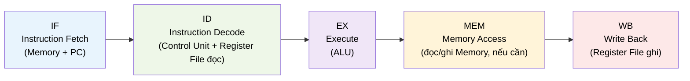

# MASTER COMPUTER SCIENCE HANDBOOK

## Volume 02 — Computer Science Foundations
### Part V — Computer Organization & Architecture
## Chương 2.25 — Pipelining: Nhập môn

---

### Thông tin chương

| Trường | Giá trị |
|---|---|
| Chương | 2.25 |
| Thuộc Part | V — Computer Organization & Architecture |
| Thuộc Volume | 02 — Computer Science Foundations |
| Thời gian đọc ước tính | 50–60 phút |
| Độ khó | ★★★☆☆ |
| Kiến thức tiên quyết | Chương 2.24 — Tổ chức CPU: Datapath và Control Unit (đặc biệt sơ đồ Datapath, Formula Box về CPU Performance Equation) |
| Chương liên quan | 2.26 — Memory Hierarchy; Volume 4, Part I (Pipeline nâng cao: Branch Prediction, Out-of-Order Execution) |
| Từ khóa | Pipelining, Pipeline Stage, Pipeline Register, Throughput, Hazard, Structural Hazard, Data Hazard, Control Hazard |

---

### Mục tiêu học tập

Sau khi hoàn thành chương này, người đọc có thể:

- Giải thích động lực của **Pipelining**: tăng thông lượng (throughput) bằng cách chồng lấp (overlap) việc thực thi nhiều lệnh.
- Mô tả mô hình **Pipeline 5 giai đoạn cổ điển**: IF – ID – EX – MEM – WB, và ánh xạ từng giai đoạn với các thành phần Datapath đã học ở Chương 2.24.
- Vẽ và đọc một **sơ đồ không gian-thời gian (space-time diagram)** thể hiện nhiều lệnh chồng lấp qua các chu kỳ.
- Áp dụng công thức **Speedup** để tính lợi ích định lượng của Pipelining so với thực thi tuần tự.
- Nhận diện ở mức khái niệm ba loại **Hazard**: Structural, Data, Control — và giải thích vì sao chúng làm giảm lợi ích lý thuyết của Pipelining.

---

### Câu hỏi khơi gợi

> *Chương 2.24 cho thấy Fetch, Decode, và Execute là ba hành động phần cứng tách biệt — mỗi hành động dùng một khối mạch riêng (Hình 2.24.1). Vậy tại sao lại phải đợi lệnh này Execute xong rồi mới Fetch lệnh tiếp theo? Trong lúc ALU đang bận cộng hai số của lệnh thứ nhất, khối Memory và IR đang... rảnh rỗi hay không?*

---

## 1. Tổng quan chương

Bảng vết thực thi ở Chương 2.24 (Mục 10) có một đặc điểm dễ bị bỏ qua: tại mỗi thời điểm, chỉ có **đúng một lệnh** đang "sống" trong Datapath. Trong khi ALU đang thực hiện phép `ADD` của lệnh thứ hai, khối Memory (dùng để Fetch) và Instruction Register hoàn toàn nhàn rỗi — chờ đến chu kỳ tiếp theo mới được dùng lại.

Chương này giới thiệu **Pipelining** — kỹ thuật tổ chức lại chính các thành phần Datapath đã học ở Chương 2.24, để trong khi lệnh thứ nhất đang ở giai đoạn Execute, lệnh thứ hai đã có thể bắt đầu giai đoạn Decode, và lệnh thứ ba đã có thể bắt đầu Fetch — tất cả diễn ra **trong cùng một chu kỳ xung nhịp**. Đây là chương giới thiệu (introductory) trong phạm vi Volume 2; các kỹ thuật Pipeline nâng cao hơn — Branch Prediction, Out-of-Order Execution — thuộc phạm vi Volume 4, Part I.

> **💡 Insight**
> Pipelining không làm cho **một lệnh đơn lẻ** chạy nhanh hơn — độ trễ (latency) để hoàn thành một lệnh riêng lẻ thực chất không đổi, thậm chí có thể tăng nhẹ. Thứ Pipelining cải thiện là **thông lượng (throughput)**: số lệnh hoàn thành *trung bình mỗi chu kỳ*, khi xét trên toàn bộ chương trình. Đây là một phân biệt quan trọng sẽ trở lại nhiều lần trong Handbook (ví dụ khi bàn về hệ thống phân tán ở Volume 4).

---

## 2. Bối cảnh lịch sử

| Thời điểm | Sự kiện | Ý nghĩa |
|---|---|---|
| 1959–1961 | Dự án IBM Stretch (IBM 7030) | Một trong những hệ thống thương mại đầu tiên áp dụng ý tưởng chồng lấp việc lấy lệnh và thực thi — tiền thân sơ khai của Pipelining |
| Thập niên 1980s | Các dự án RISC (đã nêu ở Chương 2.23, Mục 2) | Thiết kế lệnh có độ dài cố định, đơn giản của RISC hóa ra đặc biệt phù hợp để pipeline hiệu quả — một trong những lý do kỹ thuật củng cố lập luận RISC |
| 1990s trở đi | Pipeline ngày càng sâu hơn (nhiều giai đoạn hơn) trong CPU thương mại | Xu hướng "deep pipelining" nhằm tăng tần số xung nhịp tối đa — một hướng thiết kế có cả lợi ích lẫn giới hạn riêng (Mục 14) |

---

## 3. Động lực

Xét lại chính bảng vết ở Chương 2.24, Mục 10 — ba lệnh `LOAD`, `ADD`, `HALT` thực thi tuần tự, mỗi lệnh chiếm trọn một chu kỳ (Single-cycle Datapath). Tổng thời gian để hoàn thành 3 lệnh là 3 chu kỳ. Bây giờ hãy hình dung một chương trình thực tế với 1 triệu lệnh — trong suốt quá trình đó, tại bất kỳ thời điểm nào, phần lớn mạch Datapath (Hình 2.24.1) đều đang ở trạng thái nhàn rỗi, chỉ một khối đang thực sự hoạt động.

Đây chính xác là loại vấn đề "tài nguyên nhàn rỗi trong khi có công việc đang chờ" mà một kỹ sư phần mềm quen thuộc — ví dụ một máy chủ web xử lý từng request hoàn toàn tuần tự, chờ request A xử lý xong hoàn toàn rồi mới bắt đầu request B, dù CPU có nhiều lõi rảnh rỗi. Pipelining là câu trả lời phần cứng cho đúng loại vấn đề đó, xuất hiện từ rất sớm trong lịch sử kiến trúc máy tính.

---

## 4. Trực giác

**Mô hình tinh thần (Mental Model) của chương này — Analogy nổi tiếng trong lĩnh vực Kiến trúc Máy tính:**

> Hãy tưởng tượng bạn giặt bốn mẻ quần áo, mỗi mẻ cần trải qua bốn công đoạn: **Giặt (Wash) → Sấy (Dry) → Gấp (Fold) → Cất (Store)**, mỗi công đoạn mất 30 phút.
>
> - **Cách tuần tự (không pipeline):** giặt xong mẻ 1 toàn bộ 4 công đoạn (2 giờ), rồi mới bắt đầu mẻ 2. Tổng thời gian cho 4 mẻ: $4 \times 2 = 8$ giờ.
> - **Cách pipeline:** ngay khi mẻ 1 chuyển từ máy giặt sang máy sấy, bạn đã có thể cho mẻ 2 vào máy giặt — không cần chờ mẻ 1 hoàn tất toàn bộ quy trình. Máy giặt, máy sấy, bàn gấp, tủ cất hoạt động **song song trên các mẻ khác nhau** tại cùng một thời điểm.

Đây chính xác là những gì Datapath (Chương 2.24) làm với các lệnh: Memory (Fetch), Control Unit (Decode), ALU (Execute) đóng vai trò như máy giặt, máy sấy, bàn gấp — mỗi khối xử lý một "mẻ" (lệnh) khác nhau tại cùng một chu kỳ.

| Trực giác kỹ thuật bạn đã có | Khái niệm Pipelining tương ứng |
|---|---|
| CI/CD pipeline (build → test → deploy chạy chồng lấp cho nhiều commit) | Pipeline giai đoạn CPU (IF → ID → EX → MEM → WB) |
| Hàng đợi xử lý (queue) với nhiều worker song song | Nhiều lệnh "sống" đồng thời trong Datapath, mỗi lệnh ở một giai đoạn khác |
| Độ trễ (latency) vs Thông lượng (throughput) của một API | Latency một lệnh không đổi; throughput toàn chương trình tăng |

---

## 5. Trực quan hóa khái niệm

**Hình 2.25.1 — Sơ đồ Không gian-Thời gian (Space-Time Diagram) của Pipeline 5 giai đoạn**
*(Visual đặc trưng của chương — Chapter Identity)*

```text
Chu kỳ:        1     2     3     4     5     6     7
Lệnh 1:        IF    ID    EX    MEM   WB
Lệnh 2:              IF    ID    EX    MEM   WB
Lệnh 3:                    IF    ID    EX    MEM   WB
```

| Trường thông tin | Nội dung |
|---|---|
| Mục đích | Cho thấy trực quan cốt lõi của Pipelining: tại chu kỳ 3, cả ba lệnh đều đang "sống" trong Datapath cùng lúc, mỗi lệnh ở một giai đoạn khác nhau — không có xung đột vì mỗi giai đoạn dùng một phần phần cứng riêng biệt |
| Điểm mấu chốt | Lệnh 1 hoàn thành ở chu kỳ 5 (độ trễ không đổi so với thiết kế Multi-cycle 5 giai đoạn ở Chương 2.24), nhưng Lệnh 2 hoàn thành ở chu kỳ 6, Lệnh 3 ở chu kỳ 7 — **một lệnh hoàn thành mỗi chu kỳ**, thay vì mỗi 5 chu kỳ như thiết kế không pipeline |

---

**Hình 2.25.2 — Ánh xạ 5 giai đoạn Pipeline với Datapath đã học ở Chương 2.24**



*Mục đích:* chứng minh rằng 5 giai đoạn này **không phải khái niệm mới** — chúng chính là các thành phần đã xuất hiện ở Hình 2.24.1, chỉ được đặt tên tường minh và tách bạch rõ ràng thành các giai đoạn riêng biệt, ngăn cách bởi **Pipeline Register** (Mục 6).

---

## 6. Định nghĩa hình thức

> **📌 Remember — Pipelining**
>
> **Pipelining** là kỹ thuật tổ chức Datapath thành nhiều **giai đoạn (stage)** tuần tự, sao cho nhiều lệnh có thể được xử lý **chồng lấp (overlapped)** — mỗi lệnh ở một giai đoạn khác nhau tại cùng một chu kỳ xung nhịp — nhằm tăng **thông lượng (throughput)** của CPU mà không cần tăng tần số xung nhịp.

**5 giai đoạn Pipeline cổ điển** (đã ánh xạ ở Hình 2.25.2):

| Giai đoạn | Tên đầy đủ | Hành động |
|---|---|---|
| **IF** | Instruction Fetch | Lấy lệnh từ Memory theo địa chỉ PC |
| **ID** | Instruction Decode | Control Unit giải mã Opcode; Register File đọc thanh ghi nguồn |
| **EX** | Execute | ALU thực hiện phép toán |
| **MEM** | Memory Access | Đọc/ghi Memory (chỉ cần thiết với lệnh `LOAD`/`STORE`, các lệnh khác đi qua giai đoạn này mà không làm gì) |
| **WB** | Write Back | Ghi kết quả trở lại Register File |

> **📌 Remember — Pipeline Register**
>
> **Pipeline Register** là thanh ghi đặt **giữa hai giai đoạn liên tiếp**, có nhiệm vụ lưu giữ kết quả trung gian của giai đoạn trước để giai đoạn sau sử dụng ở chu kỳ tiếp theo — mà không làm ảnh hưởng đến lệnh khác đang ở giai đoạn trước đó. Đây là thành phần phần cứng khiến việc chồng lấp ở Hình 2.25.1 khả thi về mặt vật lý; không có Pipeline Register, dữ liệu của các lệnh khác nhau sẽ "va chạm" trên cùng một đường Bus.

**Hazard (Xung đột Pipeline)** — tình huống khiến chồng lấp lý tưởng ở Hình 2.25.1 bị gián đoạn, được phân thành ba loại:

| Loại Hazard | Nguyên nhân |
|---|---|
| **Structural Hazard** | Hai lệnh, ở hai giai đoạn khác nhau, cùng cần dùng **một khối phần cứng duy nhất** tại cùng một chu kỳ (ví dụ cùng cần truy cập Memory) |
| **Data Hazard** | Một lệnh cần dùng **kết quả của lệnh ngay trước nó**, nhưng kết quả đó chưa được ghi lại (WB) kịp lúc |
| **Control Hazard** | Lệnh rẽ nhánh (`JUMP`, đã học ở Chương 2.23) khiến CPU chưa biết chắc lệnh tiếp theo cần Fetch là lệnh nào |

---

## 7. Nền tảng toán học

### 7.1 Thời gian thực thi lý tưởng của Pipeline

- **Ý nghĩa:** với $n$ lệnh và pipeline $k$ giai đoạn, lệnh đầu tiên cần $k$ chu kỳ để "đi hết" pipeline; sau đó, mỗi chu kỳ tiếp theo hoàn thành thêm đúng một lệnh (như thấy ở Hình 2.25.1: lệnh 2 hoàn thành ở chu kỳ 6, lệnh 3 ở chu kỳ 7).

> **📦 Formula Box — Thời gian Pipeline lý tưởng (Ideal Pipeline Time)**
>
> $$T_{\text{pipeline}} = (k + n - 1) \times T$$
>
> | Thành phần | Ý nghĩa |
> |---|---|
> | $k$ | Số giai đoạn pipeline (ví dụ 5, theo Mục 6) |
> | $n$ | Tổng số lệnh của chương trình |
> | $T$ | Thời gian một chu kỳ xung nhịp, đã học ở Chương 2.22 |
> | **So sánh** | Không dùng pipeline (thực thi tuần tự hoàn toàn từng lệnh qua đủ $k$ giai đoạn): $T_{\text{tuần tự}} = n \times k \times T$ — chính là dạng đặc biệt của Formula Box CPU Performance Equation ở Chương 2.24 với $CPI = k$ |
> | **Diễn giải kỹ thuật** | Khi $n$ rất lớn (chương trình dài), $T_{\text{pipeline}} \approx n \times T$ — gần như mỗi lệnh chỉ tốn đúng 1 chu kỳ, tức $CPI \to 1$, so với $CPI = k$ nếu không pipeline |

### 7.2 Speedup lý thuyết

> **📦 Formula Box — Speedup của Pipelining**
>
> $$\text{Speedup} = \frac{T_{\text{tuần tự}}}{T_{\text{pipeline}}} = \frac{n \times k}{k + n - 1}$$
>
> | Thành phần | Ý nghĩa |
> |---|---|
> | **Diễn giải kỹ thuật** | Khi $n \to \infty$, Speedup $\to k$ — lợi ích tối đa về lý thuyết của Pipelining bằng **đúng số giai đoạn**. Với $n$ nhỏ, Speedup luôn nhỏ hơn $k$ đáng kể, vì "chi phí khởi động" (fill time — lấp đầy pipeline lần đầu) chiếm tỷ trọng lớn hơn tương đối |
> | **Ứng dụng thường gặp** | Giải thích vì sao pipeline càng sâu (nhiều giai đoạn hơn) càng có tiềm năng lợi ích lớn hơn về lý thuyết — nhưng đây chỉ là giới hạn trên (upper bound) lý tưởng; Mục 14 sẽ cho thấy Hazard khiến Speedup thực tế luôn thấp hơn |

**Ví dụ kiểm chứng:** với $k = 5$, $n = 100$ lệnh: $\text{Speedup} = \dfrac{100 \times 5}{5 + 100 - 1} = \dfrac{500}{104} \approx 4.81$ — gần với giới hạn lý thuyết $k=5$, nhưng chưa đạt tuyệt đối, đúng như dự đoán ở trên.

---

## 8. Thuật toán / Cơ chế

**Cơ chế chồng lấp trong Pipeline** — cách CPU quyết định, tại mỗi chu kỳ, mỗi lệnh đang ở pipeline nên "tiến" sang giai đoạn nào:

```text
Bước 1 — Tại mỗi chu kỳ xung nhịp mới:
        │
        ▼
Bước 2 — Với mỗi giai đoạn (WB, MEM, EX, ID, IF) —
         xử lý theo thứ tự NGƯỢC từ cuối về đầu:
        │
        ▼
Bước 3 —   Lệnh đang ở giai đoạn này "tiến" sang
           giai đoạn kế tiếp, dữ liệu được ghi vào
           Pipeline Register tương ứng (Mục 6)
        │
        ▼
Bước 4 —   Nếu đây là giai đoạn IF: một lệnh MỚI
           được Fetch, bắt đầu hành trình qua pipeline
        │
        ▼
Bước 5 — Lặp lại từ Bước 1 cho chu kỳ tiếp theo
```

> **💡 Insight**
> Việc xử lý các giai đoạn theo thứ tự **ngược từ cuối về đầu** (Bước 2) không phải chi tiết ngẫu nhiên — nó đảm bảo dữ liệu của giai đoạn sau được "chốt" vào Pipeline Register trước khi giai đoạn trước ghi đè dữ liệu mới lên cùng vị trí, tránh xung đột dữ liệu trong chính cơ chế mô phỏng (một vấn đề tương tự sẽ gặp lại khi học về concurrency ở Volume 4).

---

## 9. Triển khai

Mô phỏng Pipeline 5 giai đoạn bằng Python, tái sử dụng ý tưởng "mỗi lệnh mang theo trạng thái của chính nó qua từng giai đoạn" — đúng tinh thần Hình 2.25.1.

```python
STAGES = ["IF", "ID", "EX", "MEM", "WB"]


def run_pipeline(instructions):
    """Mô phỏng đơn giản hóa: không xét Hazard (Mục 6, 14),
    giả định pipeline luôn chảy trơn tru — đúng phạm vi
    'nhập môn' của chương này."""
    n = len(instructions)
    k = len(STAGES)
    total_cycles = k + n - 1
    # timeline[cycle][instruction_index] = tên giai đoạn hoặc None
    timeline = [[None] * n for _ in range(total_cycles)]

    for i in range(n):
        for stage_index, stage in enumerate(STAGES):
            cycle = i + stage_index  # lệnh i bắt đầu IF ở chu kỳ i
            timeline[cycle][i] = stage

    return timeline
```

Hàm này sinh ra chính xác cấu trúc của Hình 2.25.1 dưới dạng dữ liệu có thể in ra bảng — mỗi lệnh `i` bắt đầu giai đoạn IF ở chu kỳ `i` (đánh số từ 0), phản ánh đúng độ trễ khởi động một chu kỳ giữa các lệnh liên tiếp.

---

## 10. Trực quan hóa quá trình thực thi

Chạy `run_pipeline` với 3 lệnh (giống Hình 2.25.1):

```python
program = ["LOAD 2", "ADD 3", "HALT"]
timeline = run_pipeline(program)
for cycle, row in enumerate(timeline, start=1):
    print(f"Chu kỳ {cycle}: {row}")
```

**Bảng vết Pipeline (đầu ra khớp Hình 2.25.1):**

| Chu kỳ | Lệnh 1 (`LOAD`) | Lệnh 2 (`ADD`) | Lệnh 3 (`HALT`) |
|---:|:---:|:---:|:---:|
| 1 | IF | — | — |
| 2 | ID | IF | — |
| 3 | EX | ID | IF |
| 4 | MEM | EX | ID |
| 5 | WB | MEM | EX |
| 6 | — | WB | MEM |
| 7 | — | — | WB |

Áp dụng Formula Box Mục 7.1 để kiểm chứng: $k=5$, $n=3$ → $T_{\text{pipeline}} = (5+3-1) \times T = 7T$ — khớp chính xác với 7 chu kỳ trong bảng trên.

---

## 11. Ứng dụng công nghiệp

> **🛠 Engineering Practice**
> "Độ sâu pipeline" (pipeline depth — số giai đoạn $k$) là một thông số thiết kế thực tế mà các nhà sản xuất CPU công khai thảo luận, vì nó ảnh hưởng trực tiếp đến tần số xung nhịp tối đa có thể đạt được.

| Bối cảnh công nghiệp | Liên hệ với nội dung chương |
|---|---|
| CPU RISC thương mại đời đầu (theo mô hình MIPS cổ điển) | Thường dùng đúng 5 giai đoạn như Mục 6 — ví dụ kinh điển trong hầu hết giáo trình kiến trúc máy tính |
| CPU thương mại hiện đại (Intel, AMD, ARM) | Pipeline sâu hơn nhiều (hàng chục giai đoạn ở một số thiết kế) — cho phép tần số xung nhịp cao hơn, nhưng đánh đổi bằng chi phí Hazard lớn hơn (Mục 14) |
| Trình biên dịch tối ưu hóa (`gcc -O2`, LLVM) | Có thể sắp xếp lại thứ tự lệnh (instruction scheduling) để giảm thiểu Data Hazard, tận dụng tốt hơn pipeline của CPU đích |
| CI/CD pipeline phần mềm | Analogy trực tiếp đã nêu ở Mục 4 — nhiều commit được build/test/deploy chồng lấp, đúng nguyên lý thông lượng vs độ trễ |

---

## 12. Góc nhìn nghiên cứu

> **🔬 Research Connection**
> Ba loại Hazard ở Mục 6 không chỉ là khái niệm lý thuyết — chúng là động lực trực tiếp cho một trong những nhánh nghiên cứu kiến trúc máy tính sôi động nhất trong nhiều thập kỷ.

Ngay từ những thiết kế RISC 5-giai đoạn sơ khai (Mục 2), các nhà nghiên cứu đã nhận ra rằng lợi ích lý thuyết $k$ lần (Mục 7.2) hiếm khi đạt được trong thực tế, chính vì Hazard. Điều này dẫn đến hàng loạt kỹ thuật giảm nhẹ (mitigation techniques) được phát triển liên tục — từ các giải pháp đơn giản như **chèn "bong bóng" (pipeline bubble/stall)** để CPU tạm dừng một giai đoạn khi phát hiện Hazard, cho đến các kỹ thuật phức tạp hơn nhiều như dự đoán rẽ nhánh (Branch Prediction) và thực thi không theo thứ tự (Out-of-Order Execution) — cả hai đều nằm ngoài phạm vi giới thiệu của chương này, và sẽ được trình bày đầy đủ ở **Volume 4, Part I**.

**Câu hỏi mở** để suy ngẫm: Formula Box Mục 7.2 cho thấy Speedup lý thuyết tăng theo $k$ (số giai đoạn). Vậy tại sao các nhà thiết kế CPU không đơn giản là tăng $k$ lên vô hạn để đạt Speedup vô hạn? *(Gợi ý: liên hệ giữa số giai đoạn càng nhiều, xác suất một lệnh gặp phải một trong ba loại Hazard ở Mục 6 càng cao — đây chính là giới hạn thực tế mà Volume 4 sẽ phân tích định lượng đầy đủ hơn.)*

---

## 13. Ưu điểm

- **Tăng thông lượng** đáng kể mà không cần tăng tần số xung nhịp hay thay đổi ISA (Chương 2.23) — hoàn toàn nằm ở tầng Organization (Chương 2.22).
- **Tái sử dụng trực tiếp các thành phần Datapath đã có** (Hình 2.25.2) — không cần thiết kế phần cứng hoàn toàn mới, chỉ cần thêm Pipeline Register và tổ chức lại luồng điều khiển.
- **Mô hình mở rộng được** — nguyên lý chồng lấp tương tự (dù phức tạp hơn) tiếp tục là nền tảng cho các kỹ thuật hiệu năng cao hơn ở Volume 4.

---

## 14. Hạn chế

> **⚠️ Common Mistake**
> Một ngộ nhận phổ biến là nghĩ rằng "Pipeline 5 giai đoạn luôn nhanh gấp 5 lần". Formula Box Mục 7.2 đã cho thấy đây chỉ là **giới hạn trên lý thuyết**, đạt được khi $n \to \infty$ và **không có bất kỳ Hazard nào** — một điều kiện lý tưởng hiếm khi đúng hoàn toàn trong thực tế.

- **Structural Hazard** làm chậm pipeline nếu phần cứng không được thiết kế đủ dư thừa (ví dụ chỉ có một cổng truy cập Memory dùng chung cho cả IF và MEM).
- **Data Hazard** đặc biệt phổ biến trong code thực tế, vì phần lớn chương trình có các lệnh phụ thuộc kết quả của nhau liên tiếp (ví dụ `ADD` xong rồi `SUB` ngay dùng kết quả đó).
- **Control Hazard** do lệnh `JUMP`/rẽ nhánh gây ra vấn đề đặc biệt nghiêm trọng: CPU phải "đoán" lệnh tiếp theo cần Fetch trước khi biết chắc chắn kết quả rẽ nhánh — nếu đoán sai, toàn bộ công việc đã làm cho các lệnh sai phải bị hủy bỏ (một chi phí gọi là **pipeline flush**, sẽ phân tích định lượng ở Volume 4).
- Chương này **chưa** trình bày các giải pháp kỹ thuật cụ thể để xử lý Hazard (stall, forwarding, branch prediction) — đây là phạm vi mở rộng của Volume 4, Part I, nằm ngoài mục tiêu "nhập môn" của Volume 2.

---

## 15. So sánh

**Bảng 2.25.1 — Thực thi Tuần tự (Chương 2.24) và Thực thi Pipeline**

| Tiêu chí | Tuần tự (Multi-cycle, không pipeline) | Pipeline (5 giai đoạn) |
|---|---|---|
| $CPI$ lý tưởng | $k$ (bằng số giai đoạn, ví dụ 5) | Tiến gần $1$ khi $n$ lớn |
| Độ trễ (latency) một lệnh | $k \times T$ | $k \times T$ (không đổi!) |
| Thông lượng (throughput) | 1 lệnh mỗi $k$ chu kỳ | Gần 1 lệnh mỗi chu kỳ (lý tưởng) |
| Độ phức tạp phần cứng | Thấp hơn | Cao hơn — cần Pipeline Register, cơ chế xử lý Hazard |
| Rủi ro kỹ thuật | Không có Hazard (không chồng lấp) | Cần xử lý Structural/Data/Control Hazard |

**Phân tích:** điểm gây bất ngờ nhất trong bảng này thường là dòng "Độ trễ một lệnh" — Pipelining **không** làm một lệnh đơn lẻ hoàn thành nhanh hơn, nó chỉ cho phép nhiều lệnh chồng lấp để **thông lượng tổng thể** tăng lên. Đây là một minh họa cụ thể cho phân biệt Latency/Throughput đã nêu ở Mục 1 và Mục 4 — một cặp khái niệm sẽ còn xuất hiện xuyên suốt Handbook, đặc biệt ở Volume 4 (Distributed Systems, Cloud Computing).

---

## 16. Tóm tắt

- **Pipelining** chồng lấp việc thực thi nhiều lệnh bằng cách chia Datapath (Chương 2.24) thành các **giai đoạn** tách biệt (IF–ID–EX–MEM–WB), ngăn cách bởi **Pipeline Register**.
- Pipelining tăng **thông lượng**, nhưng **không** giảm **độ trễ** của một lệnh đơn lẻ — một phân biệt cốt lõi của chương này.
- Formula Box $\text{Speedup} = \dfrac{n \times k}{k+n-1}$ cho thấy lợi ích lý thuyết tối đa bằng số giai đoạn $k$, chỉ đạt được khi $n$ rất lớn và không có Hazard.
- Ba loại **Hazard** — Structural, Data, Control — là nguyên nhân khiến lợi ích thực tế luôn thấp hơn lý thuyết; các kỹ thuật xử lý cụ thể được để dành cho Volume 4.

Chương 2.26 chuyển hướng sang một nút thắt cổ chai khác đã được nhắc tới nhiều lần nhưng chưa giải quyết — **Von Neumann Bottleneck** (Chương 2.22, Mục 14) — bằng cách khảo sát **Memory Hierarchy**, câu trả lời kiến trúc cho vấn đề tốc độ truy cập bộ nhớ.

---

## 17. Bài tập

### Mức Cơ bản (Basic)

1. Vẽ lại (trên giấy) sơ đồ không gian-thời gian kiểu Hình 2.25.1 cho **4 lệnh** thay vì 3, sử dụng pipeline 5 giai đoạn. Lệnh thứ 4 hoàn thành ở chu kỳ nào?
2. Giải thích bằng lời của riêng bạn tại sao "độ trễ một lệnh không đổi" nhưng "thông lượng lại tăng" — dùng lại analogy giặt đồ ở Mục 4 nếu cần.

### Mức Trung bình (Intermediate)

3. Áp dụng Formula Box Mục 7.1 và 7.2: với pipeline $k=5$ giai đoạn và chương trình $n=20$ lệnh, tính $T_{\text{pipeline}}$ (theo đơn vị $T$) và Speedup so với thực thi tuần tự. So sánh kết quả Speedup này với giới hạn lý thuyết $k=5$ — gần hay xa?
4. Dùng `run_pipeline` ở Mục 9 (hoặc tự vẽ bằng tay), tạo bảng vết Pipeline đầy đủ cho chương trình 5 lệnh bất kỳ bạn tự đặt tên.

### Mức Nâng cao (Advanced)

5. Giả sử lệnh 2 trong một chương trình cần dùng **chính kết quả** mà lệnh 1 tạo ra (ví dụ lệnh 1 là `ADD` ghi vào một thanh ghi, lệnh 2 là `SUB` đọc thanh ghi đó ngay). Dựa vào bảng vết ở Mục 10 (Hình 2.25.1), tại chu kỳ nào lệnh 1 mới thực sự **ghi** kết quả vào Register File (giai đoạn WB)? Lệnh 2 cần **đọc** giá trị đó ở giai đoạn ID, vào chu kỳ nào? Từ đó, giải thích cụ thể vì sao đây là một ví dụ của **Data Hazard** đã định nghĩa ở Mục 6.

### Mức Nghiên cứu (Research)

6. Mục 12 đặt câu hỏi mở: tại sao không tăng số giai đoạn $k$ lên vô hạn? Hãy thử tự xây dựng lập luận định lượng đơn giản: nếu xác suất một lệnh bất kỳ gây ra Control Hazard (ví dụ vì là lệnh `JUMP`) là $p$, và mỗi Hazard khiến pipeline phải "xả" (flush) một số giai đoạn nhất định, hãy suy luận trực giác về việc pipeline càng sâu ($k$ càng lớn) thì chi phí trung bình của một lần flush có xu hướng thay đổi như thế nào. Đây là câu hỏi mở tính chất khám phá, không yêu cầu công thức chính xác.

---

## 18. Dự án nhỏ

**Dự án: Pipeline Visualizer có Hazard Detection cơ bản**

- **Mục tiêu:** mở rộng `run_pipeline` ở Mục 9 để phát hiện (không cần xử lý) Data Hazard đơn giản, củng cố Mục 6 và Bài tập 5.
- **Yêu cầu:**
  1. Định nghĩa chương trình đầu vào dưới dạng danh sách lệnh có kèm thông tin thanh ghi đích/nguồn, ví dụ: `[{"op": "ADD", "dest": "R1", "src": []}, {"op": "SUB", "dest": "R2", "src": ["R1"]}]`.
  2. Viết hàm `detect_data_hazard(instructions)` — với mỗi cặp lệnh liên tiếp, kiểm tra xem lệnh sau có `src` trùng với `dest` của lệnh ngay trước không.
  3. In ra cảnh báo dạng: `"Data Hazard: lệnh 2 (SUB) phụ thuộc lệnh 1 (ADD) qua thanh ghi R1"`.
- **Công nghệ đề xuất:** Python thuần.
- **Mở rộng (tùy chọn):** tích hợp kết quả `run_pipeline` (Mục 9) để đánh dấu trực tiếp trên bảng vết những ô chu kỳ có nguy cơ Hazard.

---

## 19. Tự đánh giá

- [ ] Tôi có thể vẽ một sơ đồ không gian-thời gian (Hình 2.25.1) cho một số lượng lệnh bất kỳ, không cần nhìn lại ví dụ.
- [ ] Tôi có thể giải thích rõ ràng sự khác biệt giữa Latency và Throughput trong bối cảnh Pipelining, và vì sao Pipelining chỉ cải thiện Throughput.
- [ ] Tôi có thể áp dụng đúng hai Formula Box ở Mục 7 để tính $T_{\text{pipeline}}$ và Speedup cho một bộ số liệu cụ thể.
- [ ] Tôi có thể định nghĩa và phân biệt Structural, Data, và Control Hazard, kèm ví dụ cho mỗi loại.
- [ ] Tôi hiểu vì sao chương này không đi sâu vào các giải pháp xử lý Hazard cụ thể, và biết rằng nội dung đó sẽ xuất hiện ở Volume 4.

Nếu Bài tập 5 (Data Hazard cụ thể) vẫn còn mơ hồ, đây là dấu hiệu nên ôn lại Hình 2.25.1 và Mục 6 trước khi sang Chương 2.26 — trực giác về việc "dữ liệu chưa sẵn sàng đúng lúc" sẽ quay lại dưới một hình thức khác khi bàn về độ trễ truy cập Memory.

---

## 20. Đọc thêm

- **Sách:** Randal E. Bryant, David R. O'Hallaron, *Computer Systems: A Programmer's Perspective* — phần trình bày Pipelining với sơ đồ chi tiết hơn, bao gồm cả các kỹ thuật xử lý Hazard cơ bản. *(Xem BOOKS.md.)*
- **Sách:** Andrew S. Tanenbaum, *Modern Operating Systems* — góc nhìn hệ điều hành về cách Pipeline ảnh hưởng đến việc chuyển đổi ngữ cảnh (context switch), một chủ đề của Part VI sắp tới. *(Xem BOOKS.md.)*
- **Chủ đề mở rộng (không bắt buộc):** tìm đọc khái niệm **pipeline bubble** (hay "stall") — giải pháp đơn giản nhất, dễ hình dung nhất để xử lý Hazard, là bước đệm tự nhiên trước khi tiếp cận các kỹ thuật nâng cao hơn ở Volume 4.
- **Chương tiếp theo:** Chương 2.26 — Memory Hierarchy.

---

### Liên kết chương (Cross References)

- **Chương trước:** 2.24 — Tổ chức CPU: Datapath và Control Unit (các thành phần Datapath ở đó nay được tổ chức lại thành các giai đoạn Pipeline).
- **Chương tiếp theo:** 2.26 — Memory Hierarchy (giải quyết trực tiếp Von Neumann Bottleneck đã nêu từ Chương 2.22, và liên quan chặt đến Structural/Data Hazard khi lệnh cần truy cập Memory ở giai đoạn MEM).
- **Chương liên quan xa hơn:** Chương 2.22, Mục 7 (công thức $T=1/f$ được dùng lại trong cả hai Formula Box của chương này); Volume 4, Part I (Branch Prediction, Out-of-Order Execution — giải pháp đầy đủ cho các Hazard mới chỉ được định nghĩa ở mức khái niệm tại đây).
- **Vị trí trong Knowledge Graph:** Nút thứ tư của Volume 2, Part V; phụ thuộc trực tiếp vào Chương 2.24; đặt nền khái niệm (nhưng không đi sâu kỹ thuật xử lý) cho toàn bộ nhánh nghiên cứu Pipeline nâng cao ở Volume 4.

---

*Hết Chương 2.25. Chương này tuân thủ đầy đủ cấu trúc 20 mục của `OUTPUT.md` và chuẩn Presentation Layer của `WRITING_STANDARD.md`, khớp phong cách trình bày đã thiết lập từ Chương 1.5, 2.22, 2.23, và 2.24. Đúng theo ranh giới phạm vi đã thống nhất giữa Volume 2 (nền tảng) và Volume 4 (nâng cao), chương này dừng lại ở mức giới thiệu Hazard khái niệm, không đi sâu kỹ thuật giải quyết. Đang chờ rà soát trước khi tiếp tục sang Chương 2.26.*
