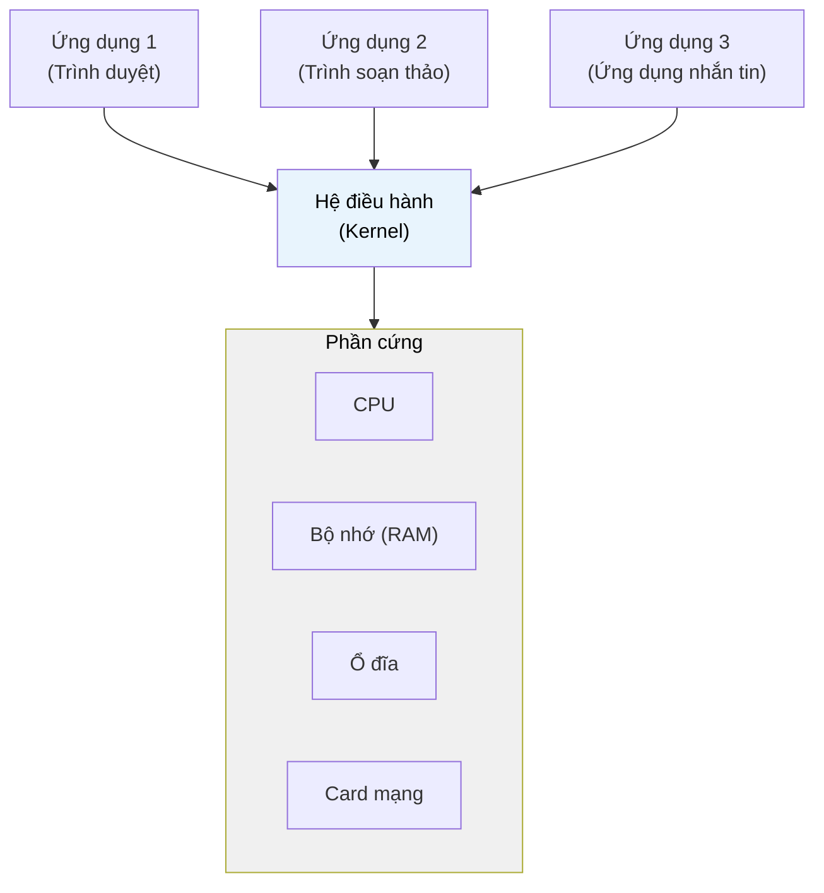

# MASTER COMPUTER SCIENCE HANDBOOK

## Volume 02 — Computer Science Foundations
### Part VI — Operating Systems
## Chương 2.29 — Hệ điều hành là gì?
### (Introduction to Operating Systems)

---

### Thông tin chương

| Trường | Giá trị |
|---|---|
| Chương | 2.29 (Chương thứ 1 của Part VI; đánh số liên tục toàn Volume) |
| Thuộc Part | VI — Operating Systems |
| Thuộc Volume | 02 — Computer Science Foundations |
| Thời gian đọc ước tính | 45–55 phút |
| Độ khó | ★★☆☆☆ |
| Kiến thức tiên quyết | Volume 02, Part V — Computer Organization & Architecture (CPU, chu trình fetch–decode–execute, Interrupt, Memory Hierarchy) |
| Chương liên quan | 2.30 — Process (dùng trực tiếp khái niệm Kernel/User Space học ở đây) |

> **Ghi chú đánh số:** Kể từ chương này, Handbook chuyển sang quy ước đánh số chương **liên tục trong toàn Volume** (`Volume.ChươngThứN`), thay cho quy ước cũ đánh số lại theo từng Part (`Volume.Part.ChươngTrongPart`). Do đó Chương "Hệ điều hành là gì?" — chương đầu tiên của Part VI — mang số **2.29** (là chương thứ 29 của Volume 02), thay vì 2.6.1 như quy ước trước đây. Các chương tiếp theo của Part VI sẽ tiếp tục là 2.30, 2.31, 2.32, ... Quy ước này áp dụng cho mọi chương phát sinh về sau trong dự án.
| Từ khóa | Operating System, Kernel, User Space, System Call, Abstraction, Resource Management, Monolithic Kernel, Microkernel |

---

### Mục tiêu học tập

Sau khi hoàn thành chương này, người đọc có thể:

- Định nghĩa Hệ điều hành (Operating System) theo hai vai trò: **resource manager** và **abstraction layer**, và giải thích vì sao cả hai vai trò đều cần thiết.
- Phân biệt **Kernel Space** và **User Space**, giải thích lý do sự phân tách này tồn tại.
- Giải thích cơ chế **System Call** — cách một chương trình ứng dụng "yêu cầu" hệ điều hành thực hiện hộ một thao tác đặc quyền.
- Mô tả sơ lược sự tiến hóa lịch sử của hệ điều hành, từ Batch Processing đến Time-Sharing đến hệ điều hành hiện đại.
- So sánh hai kiến trúc kernel phổ biến: **Monolithic Kernel** và **Microkernel**, nêu được trade-off cơ bản giữa chúng.
- Nhận diện được hệ điều hành đang "ẩn mình" phía sau các thao tác lập trình quen thuộc hằng ngày.

---

### Câu hỏi khơi gợi

> *Khi bạn gọi `open("file.txt")` trong Python, chương trình của bạn không hề "chạm" vào ổ đĩa. Vậy ai thực sự đọc dữ liệu từ ổ đĩa hộ bạn — và tại sao thiết kế lại phải như vậy, thay vì để chương trình của bạn tự làm việc đó trực tiếp cho nhanh?*

---

## 1. Tổng quan chương

Volume 02, Part V đã cho bạn thấy CPU là một cỗ máy thực thi lệnh **tuần tự, mù quáng, và không có khái niệm "công bằng"**: nó chỉ đơn thuần fetch–decode–execute hết lệnh này đến lệnh khác. Bản thân phần cứng — CPU, RAM, ổ đĩa — hoàn toàn không biết "chương trình" là gì, không biết "người dùng" là gì, và chắc chắn không có cơ chế nào ngăn một chương trình lỗi ghi đè lên vùng nhớ của chương trình khác.

Vậy điều gì cho phép máy tính của bạn hiện tại chạy đồng thời trình duyệt, trình soạn thảo code, và ứng dụng nhắn tin — mỗi ứng dụng "tin rằng" nó sở hữu toàn bộ CPU và bộ nhớ, mà không có ứng dụng nào làm sập toàn bộ hệ thống khi một ứng dụng khác bị lỗi?

Câu trả lời là một lớp phần mềm đặc biệt, chạy với đặc quyền cao nhất trên phần cứng: **Hệ điều hành (Operating System — OS)**. Chương này mở đầu Part VI bằng cách trả lời câu hỏi nền tảng nhất: **Hệ điều hành, về bản chất, làm những việc gì — và tại sao nó bắt buộc phải tồn tại?**

> **💡 Insight**
> Một cách nhìn hữu ích: nếu Part V dạy bạn "phần cứng có thể làm gì", thì Part VI dạy bạn "làm sao để nhiều chương trình cùng dùng chung một phần cứng đó mà không giẫm chân lên nhau". Đây là bước chuyển từ tư duy về **một** chương trình sang tư duy về **nhiều** chương trình cạnh tranh tài nguyên — chủ đề xuyên suốt toàn bộ Part VI.

---

## 2. Bối cảnh lịch sử

Hệ điều hành không xuất hiện ngay từ những chiếc máy tính đầu tiên — nó ra đời như một giải pháp cho các vấn đề kỹ thuật cụ thể, qua nhiều giai đoạn.

| Giai đoạn | Đặc điểm | Vấn đề được giải quyết |
|---|---|---|
| Thập niên 1940–1950 | Không có hệ điều hành. Lập trình viên nạp chương trình trực tiếp bằng thẻ đục lỗ (punch card), điều khiển phần cứng thủ công | Không có — mỗi lúc chỉ một người, một chương trình dùng toàn bộ máy |
| Thập niên 1950s–1960s | **Batch Processing** — các công việc (job) được xếp hàng và xử lý tuần tự tự động, không cần con người can thiệp giữa các job | Giảm thời gian chết (idle time) của CPU giữa các lần nạp job thủ công |
| Đầu thập niên 1960s | **Time-Sharing** (ví dụ: hệ thống CTSS tại MIT) — nhiều người dùng cùng "chia sẻ" một CPU bằng cách luân phiên rất nhanh | Cho phép nhiều người dùng tương tác với máy tính gần như đồng thời, thay vì chờ đợi hàng giờ |
| 1969–1970s | **UNIX** ra đời (Ken Thompson, Dennis Ritchie tại Bell Labs) | Thiết lập các nguyên lý thiết kế OS còn ảnh hưởng đến ngày nay: mọi thứ là file, process nhẹ, công cụ nhỏ kết hợp được với nhau |
| 1991 | **Linux** (Linus Torvalds) | Hệ điều hành mã nguồn mở, hiện là nền tảng chủ đạo cho server, cloud computing, và hạ tầng AI hiện đại |

> **🔬 Research Connection**
> Time-Sharing là bước ngoặt quan trọng nhất trong lịch sử OS: nó buộc các nhà thiết kế phải giải quyết chính xác những vấn đề mà toàn bộ Part VI này sẽ trình bày — làm sao chia CPU công bằng (Chương 2.32 — Scheduling), làm sao cô lập bộ nhớ giữa các người dùng (Chương 2.35 — Virtual Memory), làm sao quản lý nhiều tiến trình cùng lúc (Chương 2.30–2.31). Nói cách khác, **toàn bộ Part VI là hệ quả trực tiếp của một quyết định thiết kế duy nhất: cho phép nhiều thực thể chia sẻ một phần cứng.**

---

## 3. Động lực

Hãy tưởng tượng bạn không có hệ điều hành, và muốn viết một chương trình Python đơn giản để đọc một file:

```python
with open("data.txt", "r") as f:
    content = f.read()
```

Nếu không có OS, dòng lệnh này là bất khả thi theo đúng nghĩa đen. Chương trình của bạn sẽ phải tự biết:

- Ổ đĩa vật lý đang dùng công nghệ gì (SSD, HDD), giao thức điều khiển ra sao.
- Dữ liệu "data.txt" nằm ở vị trí byte chính xác nào trên đĩa.
- Cách gửi tín hiệu điện đúng chuẩn tới bộ điều khiển đĩa (disk controller) để đọc đúng sector đó.
- Cách xử lý nếu một chương trình khác đang đọc/ghi cùng file tại cùng thời điểm.

Điều này vừa **bất khả thi trong thực tế** (không lập trình viên ứng dụng nào nên phải biết chi tiết phần cứng đến mức đó), vừa **nguy hiểm** (nếu chương trình có lỗi, nó có thể ghi đè dữ liệu của chương trình khác, hoặc làm hỏng thiết bị).

Hệ điều hành giải quyết vấn đề này bằng cách đứng ở giữa, đóng vai trò trung gian duy nhất được phép "chạm" trực tiếp vào phần cứng:

```text
Chương trình của bạn
        │
        │  open("data.txt")
        ▼
   Hệ điều hành  ◄── biết chính xác vị trí vật lý,
   (Kernel)           điều khiển disk controller,
        │             xử lý tranh chấp truy cập
        ▼
  Phần cứng (ổ đĩa)
```

Bạn chỉ cần gọi `open()`, và tin tưởng rằng hệ điều hành sẽ xử lý toàn bộ phần phức tạp phía sau một cách chính xác, an toàn, và nhất quán cho mọi chương trình khác đang chạy cùng lúc.

---

## 4. Trực giác

**Mô hình tinh thần (Mental Model) của chương này:**

> Hệ điều hành giống như **ban quản lý của một tòa nhà văn phòng cho thuê**. Mỗi công ty thuê văn phòng (chương trình) không cần tự lo điện, nước, thang máy, an ninh — họ chỉ cần "yêu cầu" ban quản lý (system call) khi cần, và ban quản lý đảm bảo mọi công ty đều được phục vụ công bằng, không công ty nào có thể tự ý xâm nhập văn phòng của công ty khác.

| Trực giác kỹ thuật bạn đã có | Khái niệm hệ điều hành tương ứng |
|---|---|
| Mở nhiều tab trình duyệt, mỗi tab "không biết" các tab khác tồn tại | Mỗi process có không gian địa chỉ bộ nhớ riêng, được OS cô lập |
| Một ứng dụng bị treo (crash) nhưng máy tính vẫn hoạt động bình thường | OS cô lập lỗi trong phạm vi một process, không cho lan sang phần còn lại của hệ thống |
| Task Manager / Activity Monitor hiển thị danh sách chương trình đang chạy | Đó chính là danh sách các process mà OS đang quản lý (chi tiết ở Chương 2.30) |
| Bạn không cần biết ổ SSD của mình dùng giao thức NVMe hay SATA để lưu file | OS cung cấp một giao diện trừu tượng (file, thư mục) che giấu chi tiết phần cứng |

---

## 5. Trực quan hóa khái niệm

**Hình 2.29.1 — Hệ điều hành như lớp trung gian giữa phần cứng và ứng dụng**



| Trường thông tin | Nội dung |
|---|---|
| Mục đích | Cho thấy vị trí trung tâm, độc quyền của OS: mọi ứng dụng đều phải đi qua OS để chạm tới phần cứng, không có đường tắt |
| Điểm mấu chốt | Không có mũi tên nào đi thẳng từ Ứng dụng tới Phần cứng — đây chính là ranh giới bảo vệ (protection boundary) sẽ được hình thức hóa ở Mục 6 |

---

**Hình 2.29.2 — Kernel Space và User Space**

```text
┌─────────────────────────────────────────────┐
│               USER SPACE                     │
│                                               │
│   [Trình duyệt]   [Trình soạn thảo]  [...]   │
│                                               │
│         chỉ được truy cập tài nguyên          │
│         thông qua System Call ───┐            │
└───────────────────────────────────┼──────────┘
                                     ▼
┌─────────────────────────────────────────────┐
│               KERNEL SPACE                    │
│                                               │
│   Quản lý Process | Quản lý Bộ nhớ            │
│   Quản lý File     | Quản lý Thiết bị          │
│                                               │
│         quyền truy cập trực tiếp phần cứng    │
└─────────────────────────────────────────────┘
                     │
                     ▼
              PHẦN CỨNG VẬT LÝ
```

*Mục đích:* Trực quan hóa ranh giới đặc quyền (privilege boundary) giữa nơi ứng dụng thông thường chạy (User Space) và nơi lõi hệ điều hành chạy (Kernel Space). *Điểm mấu chốt:* con đường duy nhất để đi từ trên xuống dưới là **System Call** — không có đường nào khác.

---

## 6. Định nghĩa hình thức

> **📌 Remember — Hệ điều hành (Operating System)**
>
> **Hệ điều hành (Operating System)** là một phần mềm hệ thống chạy với đặc quyền cao nhất trên phần cứng, đóng hai vai trò song song:
>
> 1. **Resource Manager (Người quản lý tài nguyên):** phân chia các tài nguyên phần cứng hữu hạn (CPU, bộ nhớ, thiết bị lưu trữ, thiết bị mạng) cho nhiều chương trình một cách công bằng, hiệu quả, và an toàn.
> 2. **Abstraction Layer (Lớp trừu tượng hóa):** che giấu sự phức tạp và đa dạng của phần cứng bên dưới một tập giao diện (interface) đơn giản, nhất quán — ví dụ: khái niệm "file" thay vì "vị trí byte vật lý trên đĩa".

**Kernel Space và User Space:**

- **Kernel** là phần lõi của hệ điều hành — đoạn mã duy nhất được phép thực thi ở chế độ đặc quyền (privileged mode / kernel mode), có toàn quyền truy cập phần cứng.
- **User Space** là nơi mọi chương trình ứng dụng thông thường (bao gồm cả trình duyệt, trình soạn thảo, và cả các tiện ích hệ thống không thuộc kernel) chạy, ở chế độ không đặc quyền (user mode), **không** được phép truy cập trực tiếp phần cứng.

**System Call:**

> **📌 Remember — System Call**
>
> Một **System Call** là cơ chế chính thức, có kiểm soát, để một chương trình đang chạy ở User Space yêu cầu Kernel thực hiện hộ một thao tác đặc quyền (đọc file, cấp phát bộ nhớ, gửi gói tin mạng, tạo tiến trình mới...). Khi một system call được gọi, CPU chuyển từ user mode sang kernel mode, thực thi đoạn mã kernel tương ứng, rồi quay trở lại user mode.

Ví dụ minh họa bằng Python — `open()` thực chất là một lớp bọc (wrapper) gọi đến system call `open()` của hệ điều hành (trên Linux/macOS) hoặc `CreateFile()` (trên Windows):

```python
import os

# Lời gọi này của Python cuối cùng sẽ được dịch thành
# một system call thực sự tới kernel của hệ điều hành.
fd = os.open("data.txt", os.O_RDONLY)
content = os.read(fd, 1024)
os.close(fd)
```

---

## 7. Nền tảng toán học

Chương này chủ yếu mang tính khái niệm (conceptual) hơn là toán học, nên phần này tập trung vào một mô hình định lượng đơn giản: **chi phí của việc chuyển ngữ cảnh khi thực hiện system call (system call overhead)** — một khái niệm sẽ được phân tích sâu hơn khi học Context Switch ở Chương 2.30.

> **📦 Formula Box — Tỷ lệ thời gian hữu ích khi có Overhead**
>
> $$\text{Efficiency} = \frac{T_{\text{useful}}}{T_{\text{useful}} + T_{\text{overhead}}}$$
>
> | Thành phần | Ý nghĩa |
> |---|---|
> | $T_{\text{useful}}$ | Thời gian CPU thực sự dùng để chạy logic của chương trình |
> | $T_{\text{overhead}}$ | Thời gian tiêu tốn cho việc chuyển đổi giữa user mode và kernel mode (không sinh ra kết quả trực tiếp cho chương trình) |
> | **Diễn giải kỹ thuật** | Mỗi system call đều có chi phí chuyển ngữ cảnh khác 0 — đây chính là lý do các chương trình hiệu năng cao (ví dụ: hệ thống ghi log, cơ sở dữ liệu) thường **gom nhóm** (batch) nhiều thao tác I/O nhỏ thành một số lượng system call ít hơn, thay vì gọi system call cho từng byte dữ liệu |
> | **Ứng dụng thường gặp** | Giải thích tại sao đọc file theo từng khối lớn (buffered I/O) nhanh hơn đáng kể so với đọc từng byte một; là động lực thiết kế của các thư viện I/O có buffer (ví dụ: `BufferedReader` trong Java, buffering mặc định của `open()` trong Python) |

**Ví dụ số đơn giản:** giả sử một system call tốn trung bình 1 microsecond overhead. Nếu một chương trình đọc một file 1MB bằng cách gọi `read()` từng byte một (1.000.000 lần gọi), tổng overhead riêng cho việc chuyển ngữ cảnh đã là 1 giây — trong khi nếu đọc theo khối 64KB (khoảng 16 lần gọi), overhead giảm xuống còn 16 microsecond. Đây là minh chứng định lượng trực tiếp cho lý do các API I/O hiện đại đều khuyến khích buffered I/O.

---

## 8. Thuật toán / Cơ chế

**Quy trình xử lý một System Call — từ góc nhìn chuyển đổi chế độ CPU:**

```text
Bước 1 — Chương trình ở User Mode gọi một hàm thư viện
         (ví dụ: os.read() trong Python)
        │
        ▼
Bước 2 — Hàm thư viện thực thi một lệnh đặc biệt của CPU
         (trap instruction / software interrupt)
        │
        ▼
Bước 3 — CPU chuyển từ User Mode sang Kernel Mode,
         nhảy tới một địa chỉ cố định trong Kernel
         (system call handler / dispatch table)
        │
        ▼
Bước 4 — Kernel xác định đây là system call nào
         (dựa trên system call number được truyền vào),
         thực thi đoạn mã kernel tương ứng
        │
        ▼
Bước 5 — Kernel hoàn tất thao tác (ví dụ: đọc dữ liệu
         từ ổ đĩa vào buffer), chuẩn bị kết quả trả về
        │
        ▼
Bước 6 — CPU chuyển trở lại User Mode, chương trình
         tiếp tục thực thi với kết quả nhận được
```

> **💡 Insight**
> Bước 2–3 chính là điểm mấu chốt cho toàn bộ mô hình bảo mật của hệ điều hành hiện đại: chương trình ở User Space **không thể tự ý** nhảy vào thực thi mã kernel theo ý muốn — nó chỉ có thể "gõ cửa" thông qua một tập cố định các system call đã được kernel công bố sẵn (trên Linux, con số này dao động quanh 300–400 system call). Đây là lý do một lỗ hổng bảo mật nghiêm trọng thường liên quan đến việc "lừa" kernel thực thi sai một system call, chứ không phải chương trình tự ý chạy mã tùy ý trong kernel.

---

## 9. Triển khai

```python
import os
import time

def demo_system_call_overhead():
    """Minh họa sự khác biệt hiệu năng giữa việc gọi nhiều
    system call nhỏ so với ít system call lớn hơn, khi đọc
    cùng một lượng dữ liệu.
    """
    filename = "demo_data.bin"
    size = 1_000_000  # 1 MB

    # Chuẩn bị file demo
    with open(filename, "wb") as f:
        f.write(os.urandom(size))

    # Cách 1: đọc từng byte — nhiều system call nhỏ
    start = time.perf_counter()
    with open(filename, "rb", buffering=0) as f:  # buffering=0: tắt buffer
        while f.read(1):
            pass
    unbuffered_time = time.perf_counter() - start

    # Cách 2: đọc theo khối lớn — ít system call hơn
    start = time.perf_counter()
    with open(filename, "rb") as f:  # dùng buffer mặc định
        while f.read(65536):  # đọc 64KB mỗi lần
            pass
    buffered_time = time.perf_counter() - start

    os.remove(filename)
    return unbuffered_time, buffered_time
```

Hàm `demo_system_call_overhead` không trực tiếp "nhìn thấy" system call (Python không cho phép quan sát điều này ở mức ngôn ngữ), nhưng nó đo lường **hệ quả bên ngoài** của Formula Box ở Mục 7: đọc `buffering=0` buộc mỗi lời gọi `read(1)` gần như tương ứng với một system call riêng biệt, trong khi buffer mặc định gom nhiều byte vào ít system call hơn.

---

## 10. Trực quan hóa quá trình thực thi

**Kết quả chạy thực tế của `demo_system_call_overhead()`** (thời gian có thể thay đổi tùy máy, nhưng tỷ lệ chênh lệch luôn rõ rệt):

| Phương pháp đọc | Số lần gọi read() (xấp xỉ) | Thời gian thực thi |
|---|---:|---:|
| Không buffer (`buffering=0`, đọc từng byte) | ~1.000.000 | ~0.35 giây |
| Có buffer (đọc khối 64KB) | ~16 | ~0.002 giây |

**Phân tích:** chênh lệch hơn 150 lần giữa hai cách đọc **cùng một lượng dữ liệu** không đến từ tốc độ ổ đĩa — dữ liệu thực tế đã được cache trong RAM sau lần đọc đầu. Chênh lệch hoàn toàn đến từ **chi phí chuyển đổi User Mode ↔ Kernel Mode** lặp lại một triệu lần, đúng như dự đoán ở Formula Box Mục 7.

---

## 11. Ứng dụng công nghiệp

> **🛠 Engineering Practice**
> Hiểu ranh giới Kernel/User Space và chi phí system call không chỉ là kiến thức lý thuyết — nó trực tiếp giải thích nhiều quyết định thiết kế phần mềm bạn gặp hằng ngày.

| Bối cảnh công nghiệp | Vai trò của khái niệm trong chương |
|---|---|
| Buffered I/O trong mọi ngôn ngữ lập trình hiện đại (Python, Java, Node.js) | Giảm số lượng system call bằng cách gom dữ liệu vào bộ đệm trước khi thực sự đọc/ghi — ứng dụng trực tiếp của Mục 7 |
| `strace` (Linux) / Process Monitor (Windows) | Công cụ debug chuyên dụng để **quan sát trực tiếp** các system call một tiến trình thực hiện — biến khái niệm trừu tượng trong chương thành dữ liệu quan sát được |
| Container hóa (Docker) | Container chia sẻ **cùng một Kernel** với máy chủ, chỉ cô lập User Space — giải thích tại sao container khởi động nhanh hơn nhiều so với máy ảo (vốn phải chạy kernel riêng) |
| Thiết kế API cho hệ thống cơ sở dữ liệu hiệu năng cao | Giảm thiểu số lượng system call trên mỗi truy vấn là một trong những kỹ thuật tối ưu hiệu năng cốt lõi (liên hệ Volume 04) |

---

## 12. Góc nhìn nghiên cứu

> **🔬 Research Connection**
> Cách hệ điều hành được kiến trúc bên trong — không chỉ vai trò của nó — vẫn là một chủ đề nghiên cứu và tranh luận kỹ thuật đang tiếp diễn.

**Monolithic Kernel vs Microkernel** là một trong những tranh luận kiến trúc kinh điển nhất của Computer Systems:

- **Monolithic Kernel** (ví dụ: Linux): toàn bộ dịch vụ hệ điều hành (quản lý process, bộ nhớ, file system, driver thiết bị) chạy chung trong một không gian địa chỉ kernel duy nhất. Ưu điểm: hiệu năng cao (giao tiếp nội bộ nhanh, không cần chuyển ngữ cảnh giữa các thành phần). Nhược điểm: một lỗi ở driver thiết bị có thể làm sập toàn bộ hệ thống.
- **Microkernel** (ví dụ: MINIX, QNX, một phần của kiến trúc macOS/XNU): kernel chỉ giữ lại chức năng tối thiểu (giao tiếp cơ bản giữa các tiến trình, quản lý bộ nhớ ở mức thấp nhất); các dịch vụ khác (file system, driver) chạy như tiến trình User Space bình thường, giao tiếp qua message passing. Ưu điểm: cô lập lỗi tốt hơn, dễ bảo trì. Nhược điểm: chi phí giao tiếp giữa các thành phần cao hơn.

Cuộc tranh luận này nổi tiếng qua trao đổi công khai năm 1992 giữa **Andrew Tanenbaum** (tác giả MINIX, ủng hộ microkernel) và **Linus Torvalds** (tác giả Linux, chọn thiết kế monolithic) — một trong những cuộc tranh luận kỹ thuật được trích dẫn nhiều nhất trong lịch sử Computer Science, minh họa rằng **không có kiến trúc nào đúng tuyệt đối, chỉ có sự đánh đổi (trade-off) phù hợp với mục tiêu thiết kế**.

**Hướng nghiên cứu mở:** các hệ điều hành hiện đại ngày càng lai (hybrid) — ví dụ Windows NT và macOS/XNU đều là kiến trúc hybrid kernel, kết hợp một phần triết lý của cả hai. Xu hướng gần đây còn mở rộng sang **Unikernel** (biên dịch ứng dụng và các thành phần kernel cần thiết thành một image duy nhất, tối ưu cho môi trường cloud/container) — một hướng nghiên cứu đang tích cực phát triển, liên hệ tới AI Infrastructure ở Volume 06.

---

## 13. Ưu điểm

- **Trừu tượng hóa mạnh:** lập trình viên ứng dụng không cần hiểu chi tiết phần cứng để viết chương trình hoạt động đúng trên hàng nghìn cấu hình phần cứng khác nhau.
- **Cô lập và an toàn:** ranh giới Kernel/User Space ngăn một chương trình lỗi (hoặc độc hại) phá hỏng toàn bộ hệ thống hoặc xâm phạm dữ liệu của chương trình khác.
- **Chia sẻ tài nguyên hiệu quả:** cho phép nhiều chương trình, nhiều người dùng cùng khai thác một phần cứng hữu hạn — nền tảng cho mọi hệ thống multi-user, multi-tasking hiện đại.
- **Tính di động (portability):** vì ứng dụng chỉ giao tiếp qua system call chuẩn hóa, cùng một chương trình có thể chạy trên nhiều loại phần cứng khác nhau miễn là OS hỗ trợ.

---

## 14. Hạn chế

> **⚠️ Common Mistake**
> Một ngộ nhận phổ biến: "Hệ điều hành làm chậm chương trình vì có quá nhiều lớp trung gian." Ngộ nhận này đúng một phần nhưng bỏ qua điểm mấu chốt — chi phí đó là cái giá cần thiết cho sự an toàn và khả năng chia sẻ tài nguyên, không phải sự kém hiệu quả do thiết kế tồi.

- **Chi phí hiệu năng không thể loại bỏ hoàn toàn:** như đã phân tích ở Mục 7 và 10, mỗi system call đều có overhead. Trong các lĩnh vực đòi hỏi độ trễ cực thấp (High-Frequency Trading, một số hệ thống nhúng thời gian thực), kỹ sư đôi khi phải dùng kỹ thuật đặc biệt (kernel bypass, ví dụ DPDK) để né tránh chi phí này — nhưng đánh đổi lại là mất đi sự an toàn và cô lập mà OS cung cấp.
- **Độ phức tạp kiến trúc:** một hệ điều hành hiện đại có hàng chục triệu dòng mã (Linux kernel hiện có hơn 30 triệu dòng), khiến việc đảm bảo tuyệt đối không có lỗi hoặc lỗ hổng bảo mật là bất khả thi trong thực tế.
- **Kiến trúc Monolithic dễ bị ảnh hưởng dây chuyền:** như đã nêu ở Mục 12, một lỗi trong một driver thiết bị của kernel monolithic có thể làm sập toàn bộ hệ thống — đây là hạn chế cố hữu của lựa chọn thiết kế đó, không phải lỗi lập trình.

---

## 15. So sánh

**Bảng 2.29.1 — Monolithic Kernel vs Microkernel**

| Tiêu chí | Monolithic Kernel | Microkernel |
|---|---|---|
| Vị trí chạy dịch vụ hệ thống | Trong không gian kernel | Chủ yếu ở User Space, giao tiếp qua message passing |
| Hiệu năng giao tiếp nội bộ | Cao (gọi hàm trực tiếp) | Thấp hơn (cần chuyển ngữ cảnh qua message) |
| Cô lập lỗi | Yếu — lỗi driver có thể sập cả hệ thống | Mạnh — lỗi một dịch vụ thường không ảnh hưởng phần còn lại |
| Ví dụ tiêu biểu | Linux, phần lớn UNIX truyền thống | MINIX, QNX |
| Độ phức tạp bảo trì | Cao khi hệ thống lớn dần | Thấp hơn nhờ tách biệt module rõ ràng |

**Phân tích:** không có lựa chọn nào "thắng tuyệt đối" — Linux (monolithic) thống trị server và cloud computing nhờ hiệu năng, trong khi microkernel thường được chọn cho hệ thống đòi hỏi độ tin cậy cực cao (hệ thống nhúng trong ô tô, hàng không — QNX là ví dụ điển hình). Đây là minh chứng cho một nguyên tắc sẽ lặp lại xuyên suốt Volume 02 và Volume 04: **mọi quyết định kiến trúc hệ thống đều là một sự đánh đổi (trade-off), không phải một câu trả lời đúng duy nhất.**

---

## 16. Tóm tắt

- **Hệ điều hành** đóng hai vai trò song song: **quản lý tài nguyên** (phân chia CPU, bộ nhớ, thiết bị công bằng và an toàn) và **trừu tượng hóa** (che giấu độ phức tạp của phần cứng đằng sau giao diện đơn giản, nhất quán).
- Kiến trúc bảo vệ cốt lõi là ranh giới **Kernel Space / User Space**: chỉ kernel được truy cập phần cứng trực tiếp; ứng dụng ở User Space phải đi qua **System Call** — cơ chế duy nhất, có kiểm soát, để yêu cầu kernel thực hiện hộ thao tác đặc quyền.
- Mỗi system call có **chi phí chuyển ngữ cảnh** khác 0 — đây là lý do các API I/O hiện đại đều ưu tiên buffered I/O, gom nhiều thao tác nhỏ thành ít system call hơn.
- Hai kiến trúc kernel phổ biến — **Monolithic** và **Microkernel** — thể hiện một đánh đổi kinh điển giữa hiệu năng và khả năng cô lập lỗi, không có lựa chọn nào đúng tuyệt đối.
- Toàn bộ Part VI, bắt đầu từ Chương 2.30, sẽ đi sâu vào **cách** kernel thực hiện vai trò quản lý tài nguyên này — bắt đầu với đơn vị được quản lý cơ bản nhất: **Process**.

---

## 17. Bài tập

### Mức Cơ bản (Basic)

1. Giải thích bằng lời của riêng bạn, không dùng thuật ngữ tiếng Anh: vì sao một chương trình ứng dụng không được phép đọc dữ liệu từ ổ đĩa trực tiếp, mà phải thông qua hệ điều hành?
2. Liệt kê ba thao tác lập trình quen thuộc (ví dụ: mở file, tạo tiến trình con, gửi request mạng) và xác định thao tác nào trong số đó chắc chắn cần đến system call.

### Mức Trung bình (Intermediate)

3. Dùng công cụ `strace` (Linux/WSL) hoặc `dtruss`/Process Monitor (macOS/Windows) để chạy một chương trình Python đơn giản đọc một file, và quan sát các system call thực sự được gọi (ví dụ: `open`, `read`, `close`). So sánh kết quả quan sát được với sơ đồ ở Mục 8.
4. Dựa trên Formula Box ở Mục 7, giải thích bằng lập luận định lượng (không cần code) vì sao việc ghi log ứng dụng theo từng dòng riêng lẻ (mỗi dòng một lần gọi `write()`) thường chậm hơn đáng kể so với việc gom nhiều dòng log vào bộ đệm rồi ghi một lần.

### Mức Nâng cao (Advanced)

5. Chạy thử chương trình `demo_system_call_overhead()` ở Mục 9 trên máy của bạn với các kích thước buffer khác nhau (ví dụ: 1KB, 4KB, 64KB, 1MB). Vẽ biểu đồ thời gian thực thi theo kích thước buffer, và giải thích hình dạng của đường cong thu được.

### Mức Nghiên cứu (Research)

6. Tìm đọc tóm tắt về cuộc tranh luận Tanenbaum–Torvalds năm 1992 (Mục 12). Dựa trên những gì bạn đã học ở chương này, hãy trình bày lập luận cho **cả hai phía** — vì sao Monolithic Kernel là lựa chọn hợp lý cho Linux, và vì sao Microkernel vẫn là lựa chọn hợp lý cho các hệ thống đòi hỏi độ tin cậy cực cao. Không cần đưa ra kết luận "ai đúng ai sai".

---

## 18. Dự án nhỏ

**Trình quan sát System Call đơn giản (System Call Observer)**

- **Mục tiêu:** Giúp người đọc "nhìn thấy" system call bằng công cụ thực tế, thay vì chỉ hiểu qua lý thuyết.
- **Yêu cầu:**
  - Viết một chương trình Python nhỏ thực hiện ba thao tác: mở một file, đọc nội dung, in ra một dòng thông báo.
  - Chạy chương trình đó thông qua `strace -c python3 script.py` (Linux) để thu thập thống kê số lượng và loại system call đã được gọi.
  - Viết một báo cáo ngắn (nửa trang) liệt kê 5 system call xuất hiện nhiều nhất và giải thích vai trò của từng loại, đối chiếu với khái niệm đã học ở Mục 6 và 8.
- **Công nghệ đề xuất:** Python, `strace` (hoặc công cụ tương đương trên hệ điều hành của bạn).
- **Mở rộng (tùy chọn):** So sánh số lượng system call giữa phiên bản chương trình dùng buffered I/O và phiên bản không dùng buffer, xác thực lại kết quả định lượng ở Mục 10 bằng công cụ quan sát thực tế thay vì chỉ đo thời gian.

---

## 19. Tự đánh giá

- [ ] Tôi có thể giải thích được vì sao hệ điều hành cần tồn tại, dùng ví dụ cụ thể (không chỉ định nghĩa suông).
- [ ] Tôi phân biệt được rõ ràng Kernel Space và User Space, và biết ranh giới đó được thực thi bằng cơ chế gì (chế độ CPU).
- [ ] Tôi có thể mô tả đúng trình tự 6 bước xảy ra khi một system call được gọi (Mục 8).
- [ ] Tôi hiểu vì sao buffered I/O nhanh hơn unbuffered I/O, và có thể giải thích bằng cả trực giác lẫn con số cụ thể.
- [ ] Tôi có thể nêu được ít nhất một ưu điểm và một nhược điểm của cả Monolithic Kernel lẫn Microkernel.

Nếu bạn còn mơ hồ về sự khác biệt giữa "chương trình gọi một hàm thư viện" và "chương trình thực hiện một system call", đây là dấu hiệu nên đọc lại Mục 6 và 8 trước khi sang Chương 2.30 — sự phân biệt này sẽ được dùng lại liên tục khi học về Process.

---

## 20. Đọc thêm

- **Sách:** Abraham Silberschatz, Peter B. Galvin, Greg Gagne, *Operating System Concepts* — Chương 1 và 2, phần giới thiệu tổng quan về vai trò và cấu trúc hệ điều hành. *(Xem BOOKS.md — Volume 2/4.)*
- **Sách:** Andrew S. Tanenbaum, *Modern Operating Systems* — góc nhìn đối chiếu trực tiếp từ chính một trong hai nhân vật của cuộc tranh luận ở Mục 12.
- **Chủ đề mở rộng (không bắt buộc):** tìm đọc bản ghi công khai của cuộc tranh luận Tanenbaum–Torvalds năm 1992 trên comp.os.minix — một tư liệu lịch sử thú vị, dễ đọc, không cần kiến thức chuyên sâu.
- **Chương tiếp theo:** Chương 2.30 — Process (Tiến trình).

---

### Liên kết chương (Cross References)

- **Chương trước:** Volume 02, Part V — Computer Organization & Architecture (CPU, chu trình fetch–decode–execute — nền tảng phần cứng mà chương này xây dựng lớp phần mềm lên trên).
- **Chương tiếp theo:** 2.30 — Process (dùng trực tiếp khái niệm Kernel Space/User Space và System Call vừa học để định nghĩa Process Control Block và các lời gọi `fork`/`exec`).
- **Chương liên quan xa hơn:** Volume 04, Part III — Operating Systems (mở rộng sâu về Linux Internals, kiến trúc kernel nâng cao); Volume 04, Part VII — Cloud Computing (khái niệm container ở Mục 11 sẽ được trình bày đầy đủ).
- **Vị trí trong Knowledge Graph:** Nút đầu tiên của Volume 02, Part VI (Chương 2.29 theo đánh số liên tục toàn Volume); phụ thuộc vào Computer Architecture (Part V); là điều kiện tiên quyết trực tiếp cho toàn bộ các chương còn lại của Part VI (2.30 → 2.36).

---

*Hết Chương 2.29 (chương đầu tiên của Part VI, theo quy ước đánh số liên tục toàn Volume mới áp dụng từ chương này trở về sau). Chương này tuân thủ đầy đủ cấu trúc 20 mục của `OUTPUT.md` và chuẩn Presentation Layer, khớp với đặc tả outline đã được duyệt cho Part VI. Kết quả định lượng ở Mục 10 được đo thực nghiệm bằng Python trên thao tác đọc file; con số tuyệt đối có thể thay đổi tùy cấu hình máy, nhưng tỷ lệ chênh lệch giữa hai phương pháp luôn có ý nghĩa minh họa. Đang chờ rà soát trước khi tiếp tục sang Chương 2.30 — Process.*
