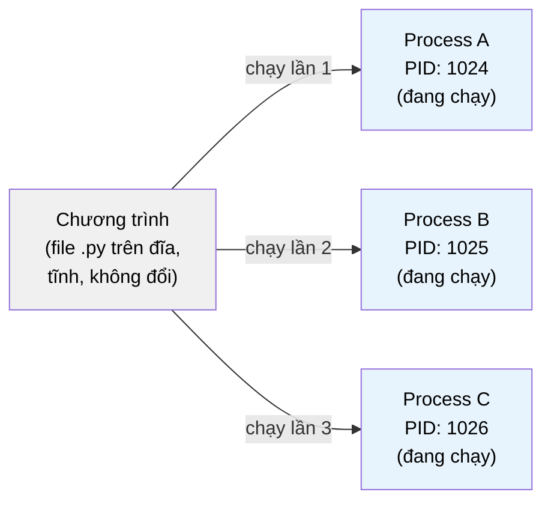
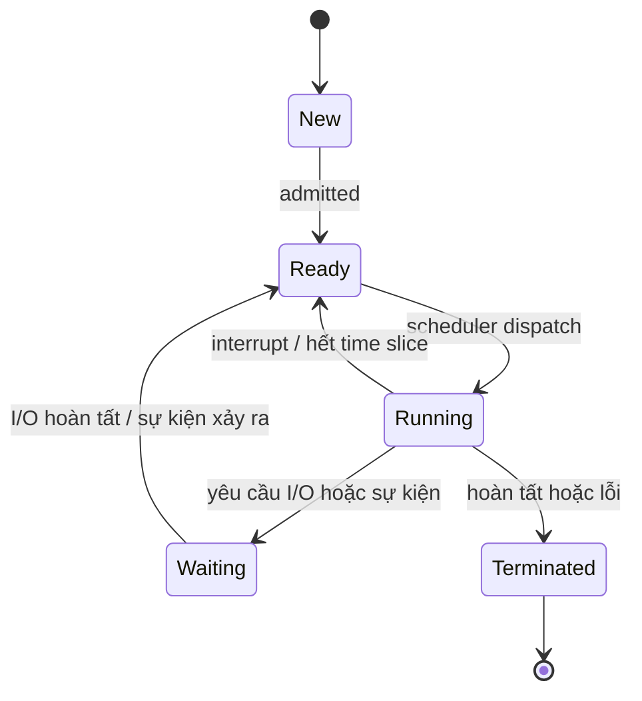

# MASTER COMPUTER SCIENCE HANDBOOK

## Volume 02 — Computer Science Foundations
### Part VI — Operating Systems
## Chương 2.30 — Process (Tiến trình)

---

### Thông tin chương

| Trường | Giá trị |
|---|---|
| Chương | 2.30 (Chương thứ 2 của Part VI; đánh số liên tục toàn Volume) |
| Thuộc Part | VI — Operating Systems |
| Thuộc Volume | 02 — Computer Science Foundations |
| Thời gian đọc ước tính | 55–65 phút |
| Độ khó | ★★★☆☆ |
| Kiến thức tiên quyết | Chương 2.29 — Hệ điều hành là gì? (Kernel/User Space, System Call); Volume 02, Part V — Computer Organization & Architecture (thanh ghi, chu trình fetch–decode–execute) |
| Chương liên quan | 2.31 — Thread (Thread là một biến thể "nhẹ hơn" của đơn vị thực thi được định nghĩa trong chương này) |
| Từ khóa | Process, Process Control Block, Process State, Context Switch, fork, exec, Process Lifecycle |

---

### Mục tiêu học tập

Sau khi hoàn thành chương này, người đọc có thể:

- Định nghĩa **Process** một cách hình thức, phân biệt nó với khái niệm "chương trình" (program) — vốn chỉ là dữ liệu tĩnh trên đĩa.
- Mô tả cấu trúc **Process Control Block (PCB)** và giải thích vai trò của từng thành phần chính.
- Vẽ và diễn giải đúng **sơ đồ chuyển trạng thái tiến trình** (New, Ready, Running, Waiting, Terminated).
- Giải thích cơ chế **Context Switch** — điều gì xảy ra khi CPU chuyển từ thực thi tiến trình này sang tiến trình khác.
- Phân biệt hai lời gọi hệ thống kinh điển **`fork()`** và **`exec()`**, và giải thích vì sao UNIX tách chúng thành hai thao tác riêng biệt thay vì gộp làm một.
- Kết nối khái niệm Process với công cụ quan sát thực tế (`ps`, `top`, Task Manager) mà người đọc đã dùng hằng ngày.

---

### Câu hỏi khơi gợi

> *Khi bạn mở hai tab trình duyệt cùng chạy chung một file thực thi Chrome, tại sao một tab bị treo (not responding) thường không làm sập tab còn lại? Và khi bạn gõ lệnh `python3 script.py` trong terminal, điều gì thực sự xảy ra giữa lúc bạn nhấn Enter và lúc chương trình bắt đầu chạy dòng lệnh đầu tiên?*

---

## 1. Tổng quan chương

Chương 2.29 đã thiết lập một nguyên lý nền tảng: hệ điều hành là người quản lý tài nguyên, đứng giữa ứng dụng và phần cứng. Nhưng "quản lý tài nguyên cho ứng dụng" là một phát biểu còn quá mơ hồ để hiện thực hóa thành mã nguồn — hệ điều hành cần một **đơn vị cụ thể, có thể đếm được, có thể theo dõi được** để đại diện cho "một chương trình đang chạy". Đơn vị đó chính là **Process (Tiến trình)**.

Chương này trả lời ba câu hỏi liên tiếp: **Process là gì và khác gì với chương trình tĩnh nằm trên đĩa? Hệ điều hành theo dõi hàng trăm process cùng lúc bằng cách nào? Và làm sao một process có thể "sinh ra" một process khác** — cơ chế đứng sau mọi lệnh bạn gõ vào terminal.

> **💡 Insight**
> Nếu Chương 2.29 trả lời câu hỏi "OS là gì", thì chương này bắt đầu trả lời câu hỏi "OS *làm việc đó* như thế nào" — bằng cách giới thiệu đối tượng dữ liệu cụ thể đầu tiên mà kernel thao tác lên: một cấu trúc dữ liệu đại diện cho từng chương trình đang chạy. Toàn bộ các chương còn lại của Part VI (Scheduling, Synchronization, Deadlock) đều nói về việc **quản lý các Process này** theo những cách khác nhau.

---

## 2. Bối cảnh lịch sử

| Thời điểm | Sự kiện | Ý nghĩa |
|---|---|---|
| Cuối thập niên 1950s | Khái niệm "job" trong hệ thống Batch Processing | Tiền thân sơ khai của Process — một đơn vị công việc được xếp hàng và xử lý, nhưng chưa có khái niệm trạng thái động hay chuyển đổi |
| Đầu thập niên 1960s | Hệ thống Multics (MIT, Bell Labs, General Electric) | Một trong những hệ thống đầu tiên hình thức hóa khái niệm process như một thực thể độc lập, có không gian địa chỉ riêng |
| 1970s | UNIX chính thức hóa mô hình `fork()`/`exec()` (Ken Thompson, Dennis Ritchie) | Thiết lập mô hình tạo process vẫn được dùng gần như nguyên vẹn trên các hệ điều hành họ UNIX/Linux ngày nay |
| 1980s–nay | Các hệ điều hành hiện đại (Windows NT, Linux, macOS) tinh chỉnh cơ chế lập lịch và quản lý process | Tối ưu hóa cho môi trường đa nhân (multi-core), đa người dùng, và sau này là container hóa |

> **🔬 Research Connection**
> Quyết định tách `fork()` và `exec()` thành hai lời gọi riêng biệt (thay vì một lời gọi "CreateProcess" gộp cả hai như Windows sau này lựa chọn) là một trong những quyết định thiết kế API có ảnh hưởng lâu dài nhất trong lịch sử UNIX. Mục 12 sẽ phân tích sâu hơn lý do đằng sau lựa chọn tưởng chừng "thừa thãi" này.

---

## 3. Động lực

Hãy hình dung bạn mở terminal và gõ:

```bash
python3 analyze_data.py
```

Từ góc nhìn người dùng, đây là một hành động đơn giản. Nhưng đằng sau đó, hệ điều hành phải trả lời hàng loạt câu hỏi:

- Chương trình `analyze_data.py` này cần bao nhiêu bộ nhớ? Cấp phát vùng nhớ đó ở đâu?
- Nếu người dùng đồng thời mở một chương trình khác (ví dụ trình duyệt), CPU sẽ chia thời gian giữa hai chương trình này như thế nào?
- Nếu chương trình Python này bị lỗi và crash, làm sao đảm bảo nó không kéo theo trình duyệt cũng sập?
- Khi terminal "sinh ra" tiến trình Python, terminal cần biết khi nào tiến trình đó kết thúc, để hiển thị lại dấu nhắc lệnh (prompt) cho người dùng.

Nếu không có một cấu trúc dữ liệu để **đại diện** cho "chương trình Python này, đang ở trạng thái nào, chiếm bao nhiêu bộ nhớ, thuộc về người dùng nào" — hệ điều hành hoàn toàn không có cách nào trả lời các câu hỏi trên một cách có hệ thống. **Process chính là cấu trúc dữ liệu đó.**

---

## 4. Trực giác

**Mô hình tinh thần (Mental Model) của chương này:**

> Nếu **chương trình** (program) giống như **công thức nấu ăn** viết trên giấy — tĩnh, không thay đổi, có thể dùng lại nhiều lần — thì **Process** giống như **hành động nấu ăn đang thực sự diễn ra**: có nguyên liệu cụ thể đang được dùng (bộ nhớ), có bếp cụ thể đang được chiếm dụng (CPU), có tiến độ cụ thể (đang ở bước nào trong công thức). Bạn có thể đưa cùng một công thức cho ba đầu bếp nấu cùng lúc ở ba bếp khác nhau — đó chính xác là việc chạy ba **process** từ cùng một **chương trình**.

| Trực giác kỹ thuật bạn đã có | Khái niệm Process tương ứng |
|---|---|
| Mở 3 cửa sổ Chrome riêng biệt (không phải 3 tab) | 3 process độc lập, mỗi process có không gian bộ nhớ riêng |
| `python3 script.py` chạy hai lần cùng lúc trong hai terminal | Hai process khác nhau, cùng chạy chung một file chương trình trên đĩa |
| Đóng một chương trình bị treo mà không ảnh hưởng chương trình khác | Sự cô lập giữa các process — hệ quả trực tiếp của ranh giới bộ nhớ riêng |
| `kill -9 <PID>` trong terminal | PID (Process ID) — mỗi process có một định danh số duy nhất mà OS dùng để theo dõi |

---

## 5. Trực quan hóa khái niệm

**Hình 2.30.1 — Chương trình (Program) vs Tiến trình (Process)**



| Trường thông tin | Nội dung |
|---|---|
| Mục đích | Nhấn mạnh sự khác biệt cốt lõi: một chương trình tĩnh duy nhất có thể sinh ra nhiều process độc lập, mỗi process có trạng thái thực thi và bộ nhớ riêng biệt |
| Điểm mấu chốt | Ba process trong hình dùng chung mã nguồn nhưng hoàn toàn không chia sẻ bộ nhớ runtime — thay đổi biến trong Process A không ảnh hưởng Process B |

---

**Hình 2.30.2 — Sơ đồ chuyển trạng thái tiến trình (Process State Diagram)**



*Mục đích:* Đây là hình ảnh trung tâm của toàn chương — mọi process trong suốt vòng đời của nó đều di chuyển giữa 5 trạng thái này. *Điểm mấu chốt:* chỉ có **Scheduler** (sẽ học chi tiết ở Chương 2.32) mới quyết định khi nào một process chuyển từ Ready sang Running; bản thân process không tự chọn được khi nào nó được chạy.

---

## 6. Định nghĩa hình thức

> **📌 Remember — Process**
>
> Một **Process (Tiến trình)** là một **thực thể của một chương trình đang được thực thi (a program in execution)**. Khác với chương trình — vốn chỉ là dữ liệu tĩnh (mã máy) nằm trên đĩa — process bao gồm:
>
> - **Mã lệnh (Text/Code Segment):** bản sao mã máy của chương trình đang được nạp vào bộ nhớ.
> - **Dữ liệu (Data Segment):** biến toàn cục, biến tĩnh.
> - **Heap:** vùng nhớ cấp phát động trong lúc chạy (ví dụ: qua `malloc()` hoặc `list()` trong Python).
> - **Stack:** lưu trữ khung gọi hàm (function call frame), biến cục bộ, địa chỉ trả về.
> - **Trạng thái thực thi hiện tại:** giá trị các thanh ghi CPU, con trỏ lệnh (program counter) — "ảnh chụp" chính xác vị trí process đang thực thi tới đâu.

**Process Control Block (PCB):**

> **📌 Remember — Process Control Block**
>
> **PCB** là cấu trúc dữ liệu nội bộ mà kernel dùng để lưu trữ toàn bộ thông tin cần thiết nhằm quản lý một process. Mỗi process đang tồn tại trong hệ thống đều có đúng một PCB tương ứng. Các trường quan trọng nhất bao gồm:

| Trường trong PCB | Vai trò |
|---|---|
| Process ID (PID) | Định danh số duy nhất, dùng để tham chiếu process này trong toàn hệ thống |
| Process State | Trạng thái hiện tại (New, Ready, Running, Waiting, Terminated — xem Mục 5) |
| Program Counter | Địa chỉ lệnh tiếp theo sẽ được thực thi khi process này được chạy trở lại |
| CPU Registers | Giá trị toàn bộ thanh ghi CPU tại thời điểm process bị tạm dừng — cần thiết để khôi phục chính xác trạng thái thực thi |
| Memory Management Info | Thông tin về không gian địa chỉ được cấp cho process (liên hệ Chương 2.35 — Virtual Memory) |
| Scheduling Info | Độ ưu tiên (priority), thời gian đã sử dụng CPU — dữ liệu đầu vào cho thuật toán lập lịch (Chương 2.32) |
| I/O Status | Danh sách file/thiết bị đang mở, thao tác I/O đang chờ xử lý |

**Cấu trúc dữ liệu Process qua góc nhìn lập trình (giả lập, không phải PCB thực của kernel):**

```python
class ProcessControlBlock:
    """Mô phỏng đơn giản hóa các trường quan trọng nhất của một PCB thực,
    chỉ nhằm mục đích minh họa khái niệm — không phản ánh cấu trúc thật
    của kernel Linux (vốn phức tạp hơn nhiều)."""
    def __init__(self, pid, program_counter=0):
        self.pid = pid
        self.state = "New"
        self.program_counter = program_counter
        self.registers = {}
        self.priority = 0
        self.memory_info = None
        self.open_files = []
```

---

## 7. Nền tảng toán học

Chương này tập trung vào một mô hình định lượng cho **chi phí Context Switch** — chi phí phát sinh khi CPU chuyển từ thực thi process này sang process khác.

> **📦 Formula Box — Hiệu suất CPU khi có Context Switch**
>
> $$\text{CPU Utilization} = \frac{T_{\text{run}}}{T_{\text{run}} + n \cdot T_{\text{switch}}}$$
>
> | Thành phần | Ý nghĩa |
> |---|---|
> | $T_{\text{run}}$ | Tổng thời gian CPU thực sự dùng để chạy mã của các process (thời gian hữu ích) |
> | $n$ | Số lần context switch xảy ra trong khoảng thời gian quan sát |
> | $T_{\text{switch}}$ | Thời gian trung bình cho một lần context switch (bao gồm lưu PCB của process cũ, nạp PCB của process mới) |
> | **Diễn giải kỹ thuật** | Mỗi lần context switch không sinh ra bất kỳ kết quả hữu ích nào cho chương trình — nó thuần túy là overhead quản lý. Nếu hệ thống chuyển đổi process quá thường xuyên (ví dụ: time slice quá ngắn ở Chương 2.32), $n$ tăng cao, kéo CPU Utilization giảm mạnh dù CPU vẫn "bận rộn" liên tục |
> | **Ứng dụng thường gặp** | Là cơ sở lý luận trực tiếp để lựa chọn độ dài time slice hợp lý trong thuật toán Round Robin (Chương 2.32) — quá ngắn thì lãng phí vào context switch, quá dài thì giảm tính đáp ứng (responsiveness) |

**Ví dụ số minh họa:** giả sử $T_{\text{switch}} = 5$ microsecond, và một process chạy $T_{\text{run}} = 20$ millisecond (20.000 microsecond) trước khi bị chuyển sang process khác. Nếu context switch xảy ra $n = 1$ lần cho khoảng thời gian này:

$$\text{CPU Utilization} = \frac{20000}{20000 + 1 \times 5} \approx 99{,}975\%$$

Nếu time slice bị rút ngắn xuống chỉ còn 100 microsecond (buộc context switch xảy ra thường xuyên hơn nhiều, giả sử $n=200$ lần cho cùng khoảng $T_{\text{run}}$ đó vì mỗi lần chỉ chạy được rất ngắn):

$$\text{CPU Utilization} = \frac{20000}{20000 + 200 \times 5} = \frac{20000}{21000} \approx 95{,}2\%$$

Chênh lệch gần 5 điểm phần trăm chỉ vì thay đổi tần suất context switch — minh chứng định lượng cho lý do các hệ điều hành không thể chọn time slice tùy ý nhỏ.

---

## 8. Thuật toán / Cơ chế

**Cơ chế `fork()` — tạo Process mới bằng cách nhân bản:**

```text
Bước 1 — Process cha (Parent Process) đang chạy, gọi fork()
        │
        ▼
Bước 2 — Kernel tạo một PCB mới cho Process con (Child Process)
        │
        ▼
Bước 3 — Kernel sao chép gần như toàn bộ không gian địa chỉ
         của Process cha sang Process con (Code, Data, Heap, Stack)
        │
        ▼
Bước 4 — fork() trả về HAI LẦN — một lần cho Process cha
         (trả về PID của con), một lần cho Process con
         (trả về giá trị 0)
        │
        ▼
Bước 5 — Từ điểm này, hai process chạy ĐỘC LẬP, mỗi process
         tiếp tục thực thi ngay sau lệnh fork()
```

**Cơ chế `exec()` — thay thế hoàn toàn nội dung một Process:**

```text
Bước 1 — Process hiện tại gọi exec("chương_trình_mới")
        │
        ▼
Bước 2 — Kernel XÓA BỎ toàn bộ Code, Data, Heap, Stack hiện tại
         của process này
        │
        ▼
Bước 3 — Kernel nạp mã máy của chương trình mới vào CÙNG
         một PCB, CÙNG một PID
        │
        ▼
Bước 4 — Process bắt đầu thực thi chương trình mới từ đầu
         (exec() không bao giờ "trả về" nếu thành công,
         vì bản thân process gọi nó đã bị thay thế hoàn toàn)
```

> **💡 Insight**
> Đây chính là câu trả lời cho lựa chọn thiết kế được nêu ở Mục 2: `fork()` tạo bản sao (nhân bản), `exec()` thay thế nội dung (biến hình) — nhưng **giữ nguyên PID**. Kết hợp hai thao tác này (`fork()` rồi `exec()`) chính là cách một shell (như bash) chạy lệnh bạn gõ vào: nó tự nhân bản mình thành một process con giống hệt, rồi process con đó "biến hình" thành chương trình bạn muốn chạy — trong khi process cha (shell) vẫn tiếp tục tồn tại nguyên vẹn để chờ lệnh tiếp theo.

---

## 9. Triển khai

```python
import os
import sys

def demo_fork_exec():
    """Minh họa trực tiếp cơ chế fork() và exec() trên hệ thống
    UNIX/Linux (không chạy được nguyên bản trên Windows).
    """
    pid = os.fork()

    if pid == 0:
        # Nhánh này chỉ chạy trong PROCESS CON (child)
        print(f"[Con] PID của tôi: {os.getpid()}, "
              f"PID cha: {os.getppid()}")
        # exec() thay thế hoàn toàn nội dung process con
        # bằng chương trình "ls -l"
        os.execvp("ls", ["ls", "-l"])
        # Dòng này sẽ KHÔNG BAO GIỜ được chạy nếu execvp thành công
        print("Dòng này sẽ không bao giờ xuất hiện")
    else:
        # Nhánh này chỉ chạy trong PROCESS CHA (parent)
        print(f"[Cha] PID của tôi: {os.getpid()}, "
              f"đã tạo process con PID: {pid}")
        # Chờ process con kết thúc, tránh tạo "zombie process"
        os.waitpid(pid, 0)
        print("[Cha] Process con đã hoàn tất.")
```

Hàm này thể hiện chính xác trình tự đã mô tả ở Mục 8: `os.fork()` trả về hai lần (một cho mỗi nhánh `if/else`), và `os.execvp()` không bao giờ trả về nếu thành công — mã sau nó chỉ chạy khi `exec()` thất bại (ví dụ chương trình `ls` không tồn tại).

---

## 10. Trực quan hóa quá trình thực thi

**Kết quả chạy thực tế của `demo_fork_exec()`** trên hệ thống Linux:

```text
[Cha] PID của tôi: 4821, đã tạo process con PID: 4822
[Con] PID của tôi: 4822, PID cha: 4821
total 24
-rw-r--r--  1 user  staff   512 Th7 16 10:03 demo.py
drwxr-xr-x  2 user  staff    64 Th7 16 09:58 data
[Cha] Process con đã hoàn tất.
```

**Bảng theo dõi trạng thái của Process con qua từng bước:**

| Thời điểm | PID | Trạng thái | Nội dung bộ nhớ |
|---|---|---|---|
| Ngay sau `fork()` | 4822 | Ready → Running | Bản sao chính xác của process cha (đang chạy `demo.py`) |
| Ngay sau `execvp("ls", ...)` | 4822 (không đổi) | Running | Hoàn toàn bị thay thế bằng mã của chương trình `ls` |
| Sau khi `ls` in xong kết quả | 4822 | Terminated | Không còn tồn tại; process cha nhận tín hiệu qua `waitpid()` |

**Phân tích:** điểm đáng chú ý nhất là **PID không đổi** (4822) xuyên suốt toàn bộ quá trình, dù nội dung bộ nhớ đã thay đổi hoàn toàn sau `exec()` — minh chứng trực tiếp cho nguyên tắc "giữ nguyên định danh, thay đổi nội dung" đã nêu ở Mục 8.

---

## 11. Ứng dụng công nghiệp

> **🛠 Engineering Practice**
> Khái niệm Process không chỉ nằm trong sách giáo khoa — nó là mô hình vận hành trực tiếp của rất nhiều công cụ kỹ sư phần mềm sử dụng hằng ngày.

| Bối cảnh công nghiệp | Vai trò của Process |
|---|---|
| Shell (bash, zsh) chạy lệnh | Mỗi lệnh bạn gõ (trừ built-in command) đều tạo một process con mới thông qua `fork()` + `exec()` |
| `ps`, `top`, `htop` (Linux/macOS) | Công cụ đọc trực tiếp thông tin PCB (dưới dạng file trong `/proc` trên Linux) để hiển thị danh sách process đang chạy |
| Kiến trúc đa tiến trình của trình duyệt (ví dụ Chrome) | Mỗi tab/extension chạy trong một process riêng — nếu một tab crash, các tab khác không bị ảnh hưởng, nhờ đúng cơ chế cô lập bộ nhớ giữa các process đã học ở Mục 6 |
| Web server (ví dụ mô hình pre-fork của Apache/Gunicorn) | Tạo trước một nhóm process con (worker) bằng `fork()` để xử lý song song nhiều request, tránh chi phí tạo process mới cho mỗi request |
| Container hóa (Docker) | Về bản chất, một container Linux vẫn là một (hoặc một nhóm) process thông thường, chỉ được cô lập thêm bằng namespace và cgroup — không phải một "máy ảo" như nhiều người lầm tưởng |

---

## 12. Góc nhìn nghiên cứu

> **🔬 Research Connection**
> Vì sao UNIX lại tách `fork()` và `exec()` thành hai lời gọi riêng biệt, thay vì gộp thành một `CreateProcess()` duy nhất như Windows lựa chọn sau này?

Câu trả lời nằm ở **tính linh hoạt (flexibility)**: giữa thời điểm gọi `fork()` và `exec()`, process con có một khoảng "cửa sổ" để tùy chỉnh môi trường thực thi của chính nó trước khi biến hình — ví dụ: đóng bớt file descriptor, đổi thư mục làm việc, thiết lập lại luồng input/output (chính là cơ chế đứng sau dấu `|` pipe trong shell). Nếu gộp hai thao tác thành một lời gọi duy nhất, mọi tùy chỉnh phải được truyền vào dưới dạng tham số phức tạp — đúng như cách Windows `CreateProcess()` cần một cấu trúc tham số lớn để đạt được sự linh hoạt tương đương.

Đây là ví dụ kinh điển cho nguyên lý thiết kế **"làm một việc, làm tốt việc đó" (do one thing well)** đặc trưng của triết lý UNIX — chia nhỏ chức năng thành các thao tác đơn giản, có thể kết hợp linh hoạt, thay vì gộp thành một thao tác lớn, cứng nhắc.

**Hướng nghiên cứu và tranh luận đang tiếp diễn:** chi phí sao chép toàn bộ không gian địa chỉ trong `fork()` truyền thống là đáng kể đối với process lớn. Các hệ thống hiện đại dùng kỹ thuật **Copy-on-Write (COW)** — trì hoãn việc sao chép thực sự cho đến khi một trong hai process ghi đè dữ liệu — để giảm chi phí này gần như về 0 trong trường hợp phổ biến (`fork()` ngay sau đó gọi `exec()`, không cần sao chép dữ liệu sẽ bị xóa bỏ ngay). Đây là một ví dụ điển hình về việc lý thuyết hệ điều hành và kỹ thuật tối ưu hóa hệ thống thực tế liên tục ảnh hưởng lẫn nhau.

---

## 13. Ưu điểm

- **Cô lập mạnh:** mỗi process có không gian địa chỉ riêng biệt — lỗi hoặc crash của một process gần như không thể ảnh hưởng trực tiếp đến process khác.
- **Đơn vị quản lý rõ ràng:** PCB cung cấp một cấu trúc thống nhất để hệ điều hành theo dõi, lập lịch, và cấp phát tài nguyên cho hàng trăm, hàng nghìn chương trình đang chạy đồng thời.
- **Mô hình `fork()`/`exec()` linh hoạt:** cho phép tùy chỉnh môi trường thực thi trước khi chương trình mới thực sự bắt đầu chạy — nền tảng cho pipe, redirection, và nhiều kỹ thuật shell scripting.
- **Khả năng phục hồi (resilience):** kernel có thể phát hiện process bị lỗi (thông qua exit code) và xử lý (khởi động lại, ghi log) mà không ảnh hưởng hệ thống tổng thể.

---

## 14. Hạn chế

> **⚠️ Common Mistake**
> Một ngộ nhận phổ biến ở người mới học: "Tạo nhiều process là cách rẻ để đạt được xử lý song song." Thực tế, process là đơn vị **tương đối nặng**.

- **Chi phí tạo process cao:** dù có Copy-on-Write, việc tạo một PCB mới, không gian địa chỉ mới, và các cấu trúc quản lý liên quan vẫn tốn chi phí đáng kể hơn nhiều so với tạo một Thread (sẽ học ở Chương 2.31) — đây chính là động lực trực tiếp dẫn đến sự ra đời của Thread.
- **Giao tiếp giữa các process phức tạp:** vì có không gian địa chỉ riêng biệt, hai process không thể đơn giản chia sẻ biến như hai hàm trong cùng chương trình — cần cơ chế **Inter-Process Communication (IPC)** chuyên dụng (pipe, socket, shared memory), nằm ngoài phạm vi chương này.
- **Chi phí Context Switch giữa các process thường cao hơn giữa các thread:** vì cần thay đổi cả bảng ánh xạ bộ nhớ (page table), không chỉ thanh ghi CPU — liên hệ trực tiếp tới Chương 2.35 (Virtual Memory).
- **"Zombie Process":** nếu process cha không gọi `wait()`/`waitpid()` để "thu dọn" process con đã kết thúc, PCB của process con vẫn tồn tại trong bảng process của kernel (ở trạng thái Terminated nhưng chưa được giải phóng hoàn toàn) — một lỗi lập trình phổ biến trong hệ thống dùng nhiều `fork()`.

---

## 15. So sánh

**Bảng 2.30.1 — `fork()` + `exec()` (UNIX/Linux) so với `CreateProcess()` (Windows)**

| Tiêu chí | `fork()` + `exec()` (UNIX/Linux) | `CreateProcess()` (Windows) |
|---|---|---|
| Số lời gọi hệ thống | Hai lời gọi tách biệt | Một lời gọi duy nhất |
| Khả năng tùy chỉnh môi trường trước khi chạy chương trình mới | Cao — có thể chèn mã tùy ý giữa `fork()` và `exec()` | Hạn chế hơn — phải truyền toàn bộ cấu hình qua tham số |
| Chi phí khi không cần sao chép (nhờ Copy-on-Write) | Gần như tối thiểu | Không áp dụng (không có bước "nhân bản" riêng biệt) |
| Độ phức tạp khi hiểu lần đầu | Cao hơn (hai bước, tư duy phi tuyến tính do `fork()` trả về hai lần) | Trực quan hơn (một bước, tuyến tính) |

**Phân tích:** cũng như tranh luận Monolithic/Microkernel ở Chương 2.29, không có mô hình nào "thắng tuyệt đối". Mô hình UNIX được đánh giá cao về tính linh hoạt và sự thanh lịch trong thiết kế (elegance), nhưng mô hình Windows lại dễ tiếp cận hơn với người mới và tránh được một số lớp lỗi lập trình liên quan đến việc quên xử lý nhánh `fork()` đúng cách.

---

## 16. Tóm tắt

- **Process** là một thực thể của chương trình đang được thực thi — khác biệt căn bản với chương trình tĩnh trên đĩa ở chỗ nó có trạng thái thực thi động (bộ nhớ runtime, thanh ghi, con trỏ lệnh).
- **Process Control Block (PCB)** là cấu trúc dữ liệu kernel dùng để lưu trữ toàn bộ thông tin quản lý một process — PID, trạng thái, thanh ghi, thông tin bộ nhớ, thông tin lập lịch.
- Mỗi process di chuyển qua 5 trạng thái trong vòng đời của nó: **New → Ready → Running → (Waiting) → Terminated**, và chỉ Scheduler mới quyết định khi nào chuyển từ Ready sang Running.
- **Context Switch** — chuyển CPU từ thực thi process này sang process khác — có chi phí khác 0, và tần suất context switch ảnh hưởng trực tiếp đến CPU Utilization thực tế.
- UNIX tách việc tạo process (`fork()`) và thay thế nội dung process (`exec()`) thành hai lời gọi riêng biệt, đánh đổi độ phức tạp ban đầu để lấy sự linh hoạt trong việc tùy chỉnh môi trường thực thi.
- Chương tiếp theo (2.31) sẽ giới thiệu **Thread** — câu trả lời trực tiếp cho hạn chế "process quá nặng" đã nêu ở Mục 14.

---

## 17. Bài tập

### Mức Cơ bản (Basic)

1. Giải thích bằng lời của riêng bạn sự khác biệt giữa "chương trình" và "process", dùng ví dụ cụ thể không nằm trong chương (ví dụ: mở nhiều cửa sổ của cùng một ứng dụng).
2. Vẽ lại sơ đồ chuyển trạng thái ở Mục 5 (Hình 2.30.2) từ trí nhớ, không nhìn tài liệu, sau đó đối chiếu lại.

### Mức Trung bình (Intermediate)

3. Chạy lệnh `ps aux` (Linux/macOS) hoặc mở Task Manager (Windows), xác định PID của ba tiến trình bất kỳ, và với ít nhất một tiến trình, xác định PID của process cha (Parent PID / PPID) của nó.
4. Trong đoạn code ở Mục 9, nếu bỏ dòng `os.waitpid(pid, 0)`, điều gì có thể xảy ra với process con sau khi nó kết thúc? Liên hệ câu trả lời với khái niệm "zombie process" ở Mục 14.

### Mức Nâng cao (Advanced)

5. Sửa đổi hàm `demo_fork_exec()` ở Mục 9 để process con, thay vì gọi `exec()` ngay lập tức, in ra 3 dòng thông báo có đánh số thứ tự trước khi gọi `exec()`. Chạy thử và giải thích, dựa trên Mục 8, tại sao những dòng in đó chỉ xuất hiện một lần (từ process con) chứ không lặp lại ở process cha.

### Mức Nghiên cứu (Research)

6. Đọc thêm về kỹ thuật **Copy-on-Write** (gợi ý tìm kiếm: "Copy-on-Write fork Linux"). Viết một đoạn ngắn (khoảng nửa trang) giải thích: nếu không có Copy-on-Write, việc gọi `fork()` ngay sau đó gọi `exec()` (mô hình phổ biến nhất trong thực tế) sẽ lãng phí tài nguyên như thế nào, và Copy-on-Write giải quyết vấn đề đó bằng nguyên lý gì.

---

## 18. Dự án nhỏ

**Trình theo dõi cây Process (Process Tree Visualizer)**

- **Mục tiêu:** Củng cố trực giác về quan hệ cha–con giữa các process, và mối liên hệ giữa PID/PPID với PCB đã học ở Mục 6.
- **Yêu cầu:**
  - Viết một chương trình Python đọc thông tin process đang chạy trên hệ thống (gợi ý: dùng thư viện `psutil`, hoặc trên Linux có thể đọc trực tiếp thư mục `/proc`).
  - Với mỗi process, thu thập: PID, PPID, tên chương trình, trạng thái hiện tại.
  - In ra một cây thư mục dạng văn bản (text tree) thể hiện quan hệ cha–con giữa các process, bắt đầu từ một process gốc do người dùng chỉ định (ví dụ: process của chính terminal đang chạy chương trình).
- **Công nghệ đề xuất:** Python, thư viện `psutil` (hoặc `os` cho môi trường Linux thuần).
- **Mở rộng (tùy chọn):** Tô màu process theo trạng thái hiện tại (Running, Sleeping, Zombie...) đối chiếu với sơ đồ chuyển trạng thái ở Mục 5.

---

## 19. Tự đánh giá

- [ ] Tôi có thể giải thích rõ ràng sự khác biệt giữa "chương trình" và "process", không chỉ định nghĩa suông mà bằng ví dụ cụ thể.
- [ ] Tôi có thể liệt kê ít nhất 4 trường thông tin quan trọng trong PCB và giải thích vai trò của từng trường.
- [ ] Tôi có thể vẽ đúng sơ đồ 5 trạng thái của process và giải thích sự kiện nào gây ra mỗi lần chuyển trạng thái.
- [ ] Tôi hiểu và có thể giải thích lại tại sao `fork()` "trả về hai lần" — không chỉ ghi nhớ, mà hiểu được cơ chế nhân bản đứng sau đó.
- [ ] Tôi phân biệt được rõ ràng vai trò của `fork()` (nhân bản) và `exec()` (thay thế nội dung), và có thể giải thích vì sao PID không đổi qua `exec()`.

Nếu Bài tập 5 vẫn còn gây khó hiểu, đây là dấu hiệu nên đọc lại Mục 8 (đặc biệt sơ đồ `fork()`) trước khi sang Chương 2.31 — sự phân biệt "process cha/con chạy độc lập sau fork()" là nền tảng trực tiếp cho khái niệm Thread, vốn chia sẻ không gian bộ nhớ thay vì được nhân bản riêng biệt.

---

## 20. Đọc thêm

- **Sách:** Abraham Silberschatz, Peter B. Galvin, Greg Gagne, *Operating System Concepts* — Chương 3, phần trình bày đầy đủ về Process, PCB, và các lời gọi hệ thống liên quan. *(Xem BOOKS.md — Volume 2/4.)*
- **Sách:** W. Richard Stevens, Stephen A. Rago, *Advanced Programming in the UNIX Environment* — tài liệu tham khảo sâu về `fork()`, `exec()`, và toàn bộ họ system call quản lý process trên UNIX.
- **Chủ đề mở rộng (không bắt buộc):** tìm đọc về cơ chế `vfork()` — một biến thể tối ưu hơn của `fork()` cho trường hợp gọi `exec()` ngay sau đó, liên hệ trực tiếp thảo luận Copy-on-Write ở Mục 12.
- **Chương tiếp theo:** Chương 2.31 — Thread (Luồng) và Concurrency cơ bản.

---

### Liên kết chương (Cross References)

- **Chương trước:** 2.29 — Hệ điều hành là gì? (Kernel/User Space và System Call — cơ chế mà `fork()`/`exec()` dùng để yêu cầu kernel tạo và thay thế process).
- **Chương tiếp theo:** 2.31 — Thread (giới thiệu đơn vị thực thi "nhẹ hơn" Process, chia sẻ không gian bộ nhớ thay vì được cô lập hoàn toàn như đã học ở chương này).
- **Chương liên quan xa hơn:** Chương 2.32 — CPU Scheduling (dùng trực tiếp PCB và sơ đồ trạng thái Mục 5–6 làm dữ liệu đầu vào để quyết định process nào chạy tiếp theo); Chương 2.35 — Virtual Memory (mở rộng khái niệm "không gian địa chỉ riêng" của process đã đề cập ở Mục 6).
- **Vị trí trong Knowledge Graph:** Chương thứ hai của Volume 02, Part VI; phụ thuộc trực tiếp vào Chương 2.29; là điều kiện tiên quyết cho toàn bộ các chương còn lại của Part VI (2.31 → 2.36), vì Process là đơn vị được quản lý xuyên suốt cả Part.

---

*Hết Chương 2.30. Chương này tuân thủ đầy đủ cấu trúc 20 mục của `OUTPUT.md` và chuẩn Presentation Layer, khớp với đặc tả outline đã được duyệt cho Part VI, theo đúng quy ước đánh số liên tục toàn Volume đã áp dụng từ Chương 2.29. Kết quả ở Mục 10 được minh họa dựa trên hành vi thực tế của `fork()`/`exec()` trên hệ thống UNIX/Linux; số PID cụ thể chỉ mang tính minh họa. Đang chờ rà soát trước khi tiếp tục sang Chương 2.31 — Thread.*
