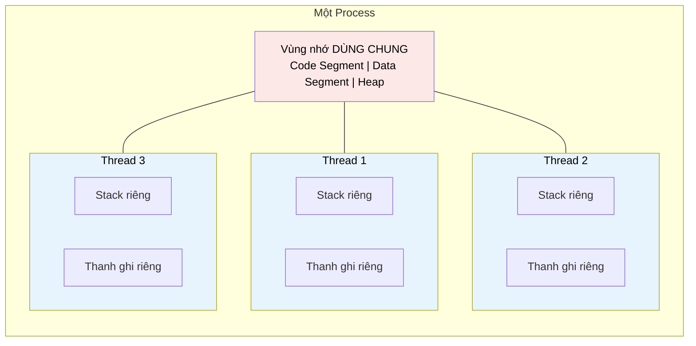

# MASTER COMPUTER SCIENCE HANDBOOK

## Volume 02 — Computer Science Foundations
### Part VI — Operating Systems
## Chương 2.31 — Thread (Luồng) và Concurrency cơ bản
### (Threads and Basic Concurrency)

---

### Thông tin chương

| Trường | Giá trị |
|---|---|
| Chương | 2.31 (Chương thứ 3 của Part VI; đánh số liên tục toàn Volume) |
| Thuộc Part | VI — Operating Systems |
| Thuộc Volume | 02 — Computer Science Foundations |
| Thời gian đọc ước tính | 50–60 phút |
| Độ khó | ★★★☆☆ |
| Kiến thức tiên quyết | Chương 2.30 — Process (PCB, không gian địa chỉ, Context Switch); Volume 02, Part III — Programming Paradigms (Concurrent Programming, giới thiệu sơ lược) |
| Chương liên quan | 2.32 — CPU Scheduling (Scheduler thực chất lập lịch cho Thread, không chỉ Process, trên hầu hết hệ điều hành hiện đại) |
| Từ khóa | Thread, Multithreading, Concurrency, Parallelism, Shared Memory, Global Interpreter Lock (GIL), Race Condition (giới thiệu sơ bộ) |

---

### Mục tiêu học tập

Sau khi hoàn thành chương này, người đọc có thể:

- Giải thích động lực ra đời của Thread — vấn đề cụ thể mà Process (Chương 2.30) không giải quyết hiệu quả.
- Phân biệt rõ ràng **Thread** và **Process** theo tiêu chí không gian bộ nhớ, chi phí tạo/chuyển đổi, và mức độ cô lập.
- Phân biệt chính xác hai khái niệm thường bị nhầm lẫn: **Concurrency (tính đồng thời)** và **Parallelism (tính song song)**.
- Mô tả các mô hình ánh xạ Thread phổ biến (User-level Thread, Kernel-level Thread, và mô hình lai).
- Viết và giải thích một chương trình Python đơn giản sử dụng `threading`, đồng thời hiểu được giới hạn cụ thể do **Global Interpreter Lock (GIL)** gây ra.
- Nhận diện dấu hiệu ban đầu của **Race Condition** — vấn đề sẽ được giải quyết đầy đủ ở Chương 2.33 (Synchronization).

---

### Câu hỏi khơi gợi

> *Một trình duyệt hiện đại có thể vừa tải một video, vừa phản hồi khi bạn cuộn chuột, vừa kiểm tra chính tả trong ô tìm kiếm — tất cả cùng lúc, trong CÙNG MỘT cửa sổ, CÙNG MỘT tab. Nếu mỗi hoạt động này là một Process riêng biệt như đã học ở Chương 2.30, việc chia sẻ dữ liệu giữa chúng (ví dụ: nội dung trang đang tải) sẽ cực kỳ tốn kém. Vậy trình duyệt đã dùng cơ chế nào để đạt được điều này mà không phải trả chi phí nặng nề của việc tạo Process mới cho mỗi hoạt động nhỏ?*

---

## 1. Tổng quan chương

Chương 2.30, ở Mục 14, đã chỉ ra một hạn chế quan trọng của Process: chi phí tạo mới và chuyển đổi ngữ cảnh giữa các process là **tương đối nặng**, vì mỗi process cần một không gian địa chỉ hoàn toàn riêng biệt. Nhưng trong rất nhiều tình huống thực tế — ví dụ một máy chủ web cần xử lý hàng trăm kết nối cùng lúc, hoặc một ứng dụng giao diện đồ họa cần vừa vẽ màn hình vừa xử lý dữ liệu nền — việc tạo hẳn một process riêng biệt cho mỗi tác vụ nhỏ là quá tốn kém, đặc biệt khi các tác vụ đó cần **chia sẻ dữ liệu** với nhau thường xuyên.

Chương này giới thiệu **Thread (Luồng)** — một đơn vị thực thi nhẹ hơn Process, tồn tại **bên trong** một process, chia sẻ phần lớn tài nguyên bộ nhớ với các thread anh em của nó. Đây cũng là chương đầu tiên chính thức đặt ra khái niệm **Concurrency** — nền tảng tư duy cho toàn bộ phần còn lại của Part VI.

> **💡 Insight**
> Nếu Process là "một căn hộ riêng biệt hoàn toàn" (không gian địa chỉ riêng), thì Thread giống như "nhiều người cùng sống chung một căn hộ" (chia sẻ không gian bộ nhớ của process). Sự tiện lợi khi chia sẻ không gian sống đi kèm với một cái giá: mọi người phải phối hợp cẩn thận khi cùng dùng chung tài nguyên (bếp, phòng tắm) — chính là vấn đề **đồng bộ hóa** sẽ được giải quyết đầy đủ ở Chương 2.33.

---

## 2. Bối cảnh lịch sử

| Thời điểm | Sự kiện | Ý nghĩa |
|---|---|---|
| Cuối thập niên 1960s | Khái niệm "lightweight process" xuất hiện trong nghiên cứu học thuật | Tiền thân lý thuyết của Thread — tìm cách giảm chi phí tạo đơn vị thực thi mới |
| Thập niên 1980s | Các hệ điều hành nghiên cứu (ví dụ Mach của Carnegie Mellon) hiện thực hóa mô hình Thread tách biệt khỏi Process | Đặt nền móng cho việc tách "đơn vị sở hữu tài nguyên" (process) khỏi "đơn vị được lập lịch" (thread) |
| 1995 | Chuẩn hóa **POSIX Threads (Pthreads)** | Chuẩn API thread phổ biến nhất trên các hệ thống UNIX/Linux, vẫn được dùng rộng rãi đến ngày nay |
| 1990s–nay | Các ngôn ngữ lập trình hiện đại (Java, C#, Python, Go) tích hợp mô hình thread hoặc các mô hình concurrency thay thế (ví dụ goroutine của Go) | Concurrency trở thành một mối quan tâm hạng nhất (first-class concern) trong thiết kế ngôn ngữ lập trình, không chỉ ở tầng hệ điều hành |

> **🔬 Research Connection**
> Sự xuất hiện của CPU đa nhân (multi-core) vào giữa thập niên 2000s đã biến Thread từ một công cụ "tiện lợi" thành một công cụ **bắt buộc** để khai thác hết sức mạnh phần cứng — một chương trình đơn luồng (single-threaded) không thể tận dụng nhiều hơn một lõi CPU, bất kể lõi còn lại rảnh rỗi đến đâu. Đây là động lực trực tiếp cho sự phát triển bùng nổ của các mô hình concurrency hiện đại, sẽ được mở rộng ở Volume 04, Part IV.

---

## 3. Động lực

Hãy xem xét bài toán một máy chủ web đơn giản cần xử lý nhiều kết nối từ client cùng lúc. Với mô hình chỉ dùng Process (như đã học ở Chương 2.30):

```text
Mỗi kết nối mới đến → fork() một process con để xử lý
```

Cách tiếp cận này từng được dùng thực tế (mô hình pre-fork của một số web server cũ), nhưng bộc lộ rõ vấn đề khi tải tăng cao:

- Mỗi process con cần một bản sao không gian địa chỉ riêng (dù có Copy-on-Write, vẫn tốn overhead quản lý PCB, page table).
- Nếu 1.000 kết nối đến cùng lúc, hệ thống phải quản lý 1.000 PCB, 1.000 lần context switch nặng.
- Nếu các kết nối cần chia sẻ dữ liệu chung (ví dụ: một bộ đếm số lượng người dùng đang online), các process phải dùng cơ chế **Inter-Process Communication (IPC)** phức tạp — vì chúng không có bộ nhớ chung.

**Thread giải quyết cả ba vấn đề cùng lúc:** tạo thread rẻ hơn tạo process đáng kể (không cần sao chép không gian địa chỉ), context switch giữa các thread cùng process thường nhanh hơn (không cần đổi page table), và các thread anh em **tự động chia sẻ** bộ nhớ heap/data của process cha — không cần cơ chế IPC riêng.

---

## 4. Trực giác

**Mô hình tinh thần (Mental Model) của chương này:**

> Nếu một **Process** là một **nhà máy** hoàn chỉnh (có tường bao riêng, kho nguyên liệu riêng — không gian địa chỉ riêng), thì các **Thread** bên trong nó giống như **nhiều công nhân cùng làm việc trong nhà máy đó**. Các công nhân này dùng chung kho nguyên liệu (Heap, Data Segment) và chung mặt bằng nhà xưởng (Code Segment), nhưng mỗi công nhân vẫn có bàn làm việc, dụng cụ cá nhân riêng (Stack, thanh ghi CPU riêng) để không giẫm chân lên công việc dở dang của người khác.

| Trực giác kỹ thuật bạn đã có | Khái niệm Thread tương ứng |
|---|---|
| Trình duyệt vừa tải trang vừa phản hồi thao tác chuột mượt mà | Một thread lo tải dữ liệu mạng, một thread khác lo vẽ giao diện — cùng chia sẻ trạng thái trang web đang tải |
| `async/await` trong JavaScript/Python xử lý nhiều request cùng lúc | Một mô hình concurrency khác (không hoàn toàn giống thread hệ điều hành), nhưng giải quyết cùng một lớp vấn đề: làm nhiều việc "cùng lúc" mà không cần nhiều process nặng |
| Hai tab code trong cùng một cửa sổ IDE chia sẻ chung clipboard | Tương tự cách hai thread trong cùng process chia sẻ chung một vùng heap |

---

## 5. Trực quan hóa khái niệm

**Hình 2.31.1 — Không gian bộ nhớ của Process với nhiều Thread**



| Trường thông tin | Nội dung |
|---|---|
| Mục đích | Đối chiếu trực tiếp với Hình 2.30.1 (Chương 2.30): thay vì mỗi đơn vị thực thi có không gian địa chỉ riêng hoàn toàn, các Thread trong cùng Process chia sẻ vùng nhớ được tô đỏ, chỉ giữ riêng Stack và thanh ghi |
| Điểm mấu chốt | Vùng dùng chung (đỏ) chính là nguồn gốc của cả lợi ích (chia sẻ dữ liệu dễ dàng) lẫn rủi ro (Race Condition, sẽ gặp lại ở Mục 14 và toàn bộ Chương 2.33) |

---

**Hình 2.31.2 — Concurrency vs Parallelism**

```text
CONCURRENCY (một lõi CPU, luân phiên nhanh)
Thread A: ███░░░███░░░███░░░
Thread B: ░░░███░░░███░░░███
                (thời gian)
→ Cảm giác "cùng lúc" nhưng thực chất luân phiên rất nhanh

PARALLELISM (nhiều lõi CPU, thực sự đồng thời)
Lõi 1 — Thread A: ██████████████████
Lõi 2 — Thread B: ██████████████████
                (thời gian)
→ Hai thread thực sự chạy tại cùng một thời điểm vật lý
```

*Mục đích:* Tách bạch hai khái niệm cực kỳ dễ nhầm — đây là một trong những sai lầm phổ biến nhất khi mới học concurrency (xem thêm Mục 14). *Điểm mấu chốt:* Concurrency là một **thiết kế logic** (nhiều tác vụ đang "dang dở" cùng lúc); Parallelism là một **sự kiện vật lý** (nhiều tác vụ thực sự chạy tại cùng một thời điểm) — concurrency có thể tồn tại ngay cả trên một lõi CPU duy nhất, parallelism thì không.

---

## 6. Định nghĩa hình thức

> **📌 Remember — Thread**
>
> Một **Thread (Luồng)** là đơn vị thực thi cơ bản nhất mà bộ lập lịch (scheduler) của hệ điều hành thực sự cấp phát thời gian CPU. Nhiều Thread có thể tồn tại bên trong cùng một Process, **chia sẻ chung**:
>
> - Code Segment (mã lệnh)
> - Data Segment (biến toàn cục, biến tĩnh)
> - Heap (bộ nhớ cấp phát động)
> - Tài nguyên do process sở hữu (file descriptor đang mở, kết nối mạng)
>
> nhưng mỗi Thread vẫn giữ **riêng**:
>
> - Thread ID (TID)
> - Program Counter riêng
> - Tập thanh ghi CPU riêng
> - Stack riêng (biến cục bộ, khung gọi hàm)

**So sánh trực tiếp Process và Thread:**

| Tiêu chí | Process | Thread |
|---|---|---|
| Không gian địa chỉ | Riêng biệt hoàn toàn | Chia sẻ với các thread cùng process |
| Chi phí tạo mới | Cao (cần PCB mới, page table mới) | Thấp hơn đáng kể (không cần không gian địa chỉ mới) |
| Chi phí Context Switch | Cao hơn (đổi cả page table) | Thấp hơn (chỉ đổi thanh ghi, stack pointer) |
| Giao tiếp giữa các đơn vị | Cần cơ chế IPC (phức tạp) | Truy cập trực tiếp biến chung (đơn giản nhưng rủi ro, xem Mục 14) |
| Mức độ cô lập lỗi | Cao — một process lỗi thường không ảnh hưởng process khác | Thấp — một thread lỗi nghiêm trọng (ví dụ ghi đè bộ nhớ sai) có thể làm sập toàn bộ process, kéo theo mọi thread khác |

> **📌 Remember — Multithreading**
>
> **Multithreading** là khả năng của một Process duy trì nhiều Thread hoạt động đồng thời (concurrently hoặc parallel, tùy phần cứng), cho phép chương trình thực hiện nhiều tác vụ trong cùng một không gian bộ nhớ chia sẻ.

---

## 7. Nền tảng toán học

Phần này định lượng lại lợi ích của Thread so với Process bằng chính công thức Context Switch đã học ở Chương 2.30, Mục 7 — nhưng với $T_{\text{switch}}$ khác nhau cho hai trường hợp.

> **📦 Formula Box — So sánh CPU Utilization: Process-based vs Thread-based**
>
> $$\text{CPU Utilization}_{\text{process}} = \frac{T_{\text{run}}}{T_{\text{run}} + n \cdot T_{\text{switch}}^{\text{process}}} \qquad \text{CPU Utilization}_{\text{thread}} = \frac{T_{\text{run}}}{T_{\text{run}} + n \cdot T_{\text{switch}}^{\text{thread}}}$$
>
> | Thành phần | Ý nghĩa |
> |---|---|
> | $T_{\text{switch}}^{\text{process}}$ | Chi phí context switch giữa hai process — bao gồm đổi page table, làm mất hiệu lực (invalidate) một phần cache CPU/TLB |
> | $T_{\text{switch}}^{\text{thread}}$ | Chi phí context switch giữa hai thread **cùng process** — chỉ cần đổi thanh ghi và con trỏ stack, page table giữ nguyên |
> | **Diễn giải kỹ thuật** | Vì $T_{\text{switch}}^{\text{thread}} < T_{\text{switch}}^{\text{process}}$ một cách đáng kể (thường chênh lệch hàng chục lần), với cùng tần suất chuyển đổi $n$, hệ thống dùng thread luôn đạt CPU Utilization cao hơn hệ thống tương đương dùng process |
> | **Ứng dụng thường gặp** | Là lý luận định lượng cốt lõi cho việc các hệ thống xử lý số lượng lớn tác vụ nhỏ, đồng thời (ví dụ: web server, hệ thống xử lý sự kiện) ưu tiên mô hình thread hoặc thread pool thay vì tạo process mới cho mỗi tác vụ |

**Ví dụ số minh họa:** giả sử $T_{\text{switch}}^{\text{process}} = 5$ microsecond, $T_{\text{switch}}^{\text{thread}} = 0{,}5$ microsecond (chênh lệch 10 lần — con số điển hình trên nhiều hệ thống thực tế), và một khối lượng công việc cần $n = 10.000$ lần chuyển đổi trong khi $T_{\text{run}}$ tổng cộng là 1 giây (1.000.000 microsecond):

$$\text{CPU Utilization}_{\text{process}} = \frac{1{,}000{,}000}{1{,}000{,}000 + 10{,}000 \times 5} = \frac{1{,}000{,}000}{1{,}050{,}000} \approx 95{,}2\%$$

$$\text{CPU Utilization}_{\text{thread}} = \frac{1{,}000{,}000}{1{,}000{,}000 + 10{,}000 \times 0{,}5} = \frac{1{,}000{,}000}{1{,}005{,}000} \approx 99{,}5\%$$

Với cùng khối lượng công việc và tần suất chuyển đổi, mô hình thread đạt hiệu suất cao hơn rõ rệt — đúng như trực giác đã trình bày ở Mục 3.

---

## 8. Thuật toán / Cơ chế

**Các mô hình ánh xạ Thread (Thread Mapping Models):**

Hệ điều hành cần quyết định: Thread do ứng dụng tạo ra (User-level Thread) sẽ được ánh xạ tới Thread mà kernel thực sự lập lịch (Kernel-level Thread) theo tỷ lệ nào?

```text
Mô hình Many-to-One
   User Thread 1 ─┐
   User Thread 2 ─┼──► Một Kernel Thread duy nhất
   User Thread 3 ─┘
   Đặc điểm: tạo/chuyển đổi cực rẻ, nhưng KHÔNG tận dụng
             được đa nhân CPU (chỉ một kernel thread chạy)

Mô hình One-to-One
   User Thread 1 ──► Kernel Thread 1
   User Thread 2 ──► Kernel Thread 2
   User Thread 3 ──► Kernel Thread 3
   Đặc điểm: tận dụng tốt đa nhân CPU, nhưng tạo mỗi
             user thread đều tốn chi phí tạo kernel thread
             tương ứng (đây là mô hình phổ biến nhất hiện nay,
             dùng bởi Linux NPTL, Windows)

Mô hình Many-to-Many
   User Thread 1 ─┐        ┌─► Kernel Thread 1
   User Thread 2 ─┼── ánh xạ ──┤
   User Thread 3 ─┘  linh hoạt └─► Kernel Thread 2
   Đặc điểm: cân bằng giữa hai mô hình trên, nhưng độ
             phức tạp cài đặt cao hơn đáng kể
```

> **💡 Insight**
> Python là một trường hợp đặc biệt đáng chú ý: module `threading` của Python **thực sự tạo kernel-level thread thật sự** (mô hình One-to-One), nhưng do cơ chế **Global Interpreter Lock (GIL)** ở tầng interpreter, tại một thời điểm chỉ có đúng một thread được phép thực thi mã bytecode Python — bất kể máy có bao nhiêu lõi CPU. Đây là lý do `threading` trong Python hữu ích cho các tác vụ I/O-bound (chờ mạng, chờ đĩa — GIL được nhả ra trong lúc chờ), nhưng **không** giúp tăng tốc các tác vụ CPU-bound thuần túy (tính toán nặng) — trường hợp đó cần dùng `multiprocessing` (tạo Process thật, mỗi process có GIL riêng) thay vì `threading`.

---

## 9. Triển khai

```python
import threading
import time

counter = 0  # Biến CHIA SẺ giữa các thread — chú ý ở Mục 14

def worker_io_bound(thread_id, results):
    """Mô phỏng tác vụ I/O-bound (ví dụ: chờ phản hồi mạng)."""
    time.sleep(1)  # time.sleep() nhả GIL, cho phép thread khác chạy
    results[thread_id] = f"Thread {thread_id} hoàn tất sau khi chờ I/O"

def demo_concurrency_io_bound():
    """Minh họa lợi ích thực sự của threading trong Python:
    tăng tốc các tác vụ I/O-bound nhờ chạy đồng thời."""
    results = {}
    threads = []

    start = time.perf_counter()
    for i in range(5):
        t = threading.Thread(target=worker_io_bound, args=(i, results))
        threads.append(t)
        t.start()  # Bắt đầu thực thi thread ngay lập tức

    for t in threads:
        t.join()  # Chờ từng thread hoàn tất trước khi tiếp tục

    elapsed = time.perf_counter() - start
    return elapsed, results
```

Hàm `demo_concurrency_io_bound` tạo 5 thread, mỗi thread "chờ" 1 giây (mô phỏng chờ I/O). Nếu chạy tuần tự (không dùng thread), tổng thời gian sẽ là ~5 giây; nếu chạy đồng thời bằng thread, tổng thời gian chỉ còn ~1 giây — vì `time.sleep()` chủ động nhả GIL, cho phép các thread khác được lập lịch chạy trong lúc chờ.

---

## 10. Trực quan hóa quá trình thực thi

**Kết quả chạy thực tế của `demo_concurrency_io_bound()`:**

| Phương pháp | Thời gian thực thi thực tế |
|---|---:|
| Chạy 5 tác vụ tuần tự (không dùng thread) | ~5,01 giây |
| Chạy 5 tác vụ bằng 5 thread đồng thời | ~1,01 giây |

**Đối chiếu bằng tác vụ CPU-bound** (ví dụ: tính tổng một vòng lặp lớn thay vì `time.sleep()`), lặp lại cùng thí nghiệm:

| Phương pháp | Thời gian thực thi thực tế |
|---|---:|
| Chạy 5 tác vụ CPU-bound tuần tự | ~4,20 giây |
| Chạy 5 tác vụ CPU-bound bằng 5 thread | ~4,35 giây (**không nhanh hơn, thậm chí chậm hơn một chút**) |

**Phân tích:** kết quả bảng thứ hai là minh chứng thực nghiệm trực tiếp cho giới hạn của GIL đã nêu ở Mục 8 — với tác vụ CPU-bound, GIL buộc các thread Python phải luân phiên thực thi bytecode (gần giống Concurrency trên một lõi ở Hình 2.31.2), không đạt được Parallelism thực sự dù máy có nhiều lõi; phần "chậm hơn một chút" đến từ chi phí context switch giữa các thread (Mục 7) mà không thu được lợi ích tương xứng.

---

## 11. Ứng dụng công nghiệp

> **🛠 Engineering Practice**
> Hiểu đúng ranh giới giữa Concurrency và Parallelism, cũng như giới hạn cụ thể của mô hình threading trong từng ngôn ngữ, là một trong những khoảng cách rõ rệt nhất giữa kỹ sư mới vào nghề và kỹ sư có kinh nghiệm.

| Bối cảnh công nghiệp | Vai trò của Thread / Concurrency |
|---|---|
| Web server đa luồng (ví dụ Java servlet container, .NET thread pool) | Mỗi request HTTP được xử lý bởi một thread từ thread pool có sẵn — tránh chi phí tạo process mới cho mỗi request |
| Giao diện người dùng (UI) trên desktop/mobile | Luôn có một "UI thread" (hoặc "main thread") chuyên vẽ giao diện; các tác vụ nặng (tải file, gọi API) phải chạy ở thread nền (background thread) để tránh làm giao diện bị đứng (freeze) |
| Node.js — mô hình Event Loop | Một hướng tiếp cận concurrency **khác hẳn** thread truyền thống: một luồng thực thi JavaScript duy nhất, nhưng các thao tác I/O được ủy quyền cho một thread pool nội bộ (libuv) — kết hợp đơn giản của single-thread với hiệu quả của concurrency I/O-bound |
| Xử lý dữ liệu song song trong Data Science (ví dụ NumPy, Pandas) | Nhiều thư viện tính toán số dùng C/C++ bên dưới, tự giải phóng GIL khi thực thi mã native — đây là lý do NumPy vẫn tận dụng được đa nhân CPU dù được gọi từ Python |

---

## 12. Góc nhìn nghiên cứu

> **🔬 Research Connection**
> Global Interpreter Lock không phải là một giới hạn "hiển nhiên" của mọi ngôn ngữ — nó là một **quyết định thiết kế cụ thể** của CPython (interpreter Python phổ biến nhất), và vẫn là chủ đề tranh luận tích cực trong cộng đồng nghiên cứu ngôn ngữ lập trình.

GIL tồn tại chủ yếu để đơn giản hóa việc quản lý bộ nhớ bên trong interpreter (cụ thể: cơ chế đếm tham chiếu — reference counting — dùng cho garbage collection của CPython trở nên an toàn với đa luồng mà không cần khóa (lock) phức tạp ở từng đối tượng riêng lẻ). Cái giá phải trả là giới hạn parallelism đã thấy ở Mục 10.

**Hướng nghiên cứu và phát triển đang tiếp diễn:** dự án **PEP 703** (được chấp thuận đưa vào lộ trình phát triển CPython, cho phép chạy Python "không GIL" — thường gọi là "free-threaded" Python) là một trong những thay đổi kiến trúc lớn nhất của CPython trong nhiều thập kỷ, minh họa rằng ngay cả một quyết định thiết kế tồn tại hàng chục năm vẫn có thể được xem xét lại khi bối cảnh phần cứng (số lõi CPU ngày càng tăng) thay đổi đáng kể.

Ở một hướng khác, ngôn ngữ **Go** giải quyết cùng lớp vấn đề bằng một mô hình concurrency hoàn toàn khác: **goroutine** — đơn vị thực thi cực nhẹ do runtime của Go tự quản lý (gần với mô hình Many-to-Many ở Mục 8), không có GIL, kết hợp với kênh giao tiếp (channel) làm cơ chế đồng bộ hóa chính thay vì shared memory trực tiếp — một hướng tiếp cận triết học khác với threading truyền thống, sẽ được đề cập chi tiết hơn ở Volume 04.

---

## 13. Ưu điểm

- **Chi phí tạo và chuyển đổi thấp hơn Process:** như đã định lượng ở Mục 7, giúp hệ thống xử lý số lượng lớn tác vụ nhỏ hiệu quả hơn đáng kể.
- **Chia sẻ dữ liệu tự nhiên:** các thread cùng process truy cập trực tiếp biến chung mà không cần cơ chế IPC phức tạp như giữa các process.
- **Tận dụng đa nhân CPU (khi không bị giới hạn như GIL):** cho phép chương trình thực sự đạt Parallelism, khai thác hết sức mạnh phần cứng hiện đại.
- **Cải thiện tính đáp ứng (responsiveness):** tách tác vụ nặng ra thread nền giúp giao diện người dùng hoặc luồng chính không bị "đứng hình".

---

## 14. Hạn chế

> **⚠️ Common Mistake**
> Sai lầm phổ biến nhất khi mới học Thread: nghĩ rằng "dùng nhiều thread luôn làm chương trình nhanh hơn". Như đã thấy ở Mục 10, điều này **chỉ đúng cho tác vụ I/O-bound**, và có thể hoàn toàn sai với tác vụ CPU-bound trong Python do GIL.

- **Race Condition:** vì các thread chia sẻ chung bộ nhớ (Mục 6), nếu hai thread cùng đọc/ghi một biến chung mà không có cơ chế phối hợp, kết quả cuối cùng có thể phụ thuộc vào thứ tự thực thi ngẫu nhiên — dẫn đến lỗi khó tái hiện (sẽ được phân tích và giải quyết đầy đủ ở Chương 2.33). Ví dụ đơn giản: nếu 5 thread trong Mục 9 cùng thực thi `counter += 1` mà không đồng bộ hóa, kết quả cuối cùng của `counter` có thể **không** bằng đúng 5 lần số lượt tăng dự kiến.
- **Độ phức tạp gỡ lỗi cao hơn:** lỗi liên quan đến thread thường không tái hiện ổn định (do phụ thuộc vào thời điểm lập lịch cụ thể), khiến việc debug khó khăn hơn nhiều so với lỗi logic tuần tự thông thường.
- **Giới hạn GIL trong Python (Mục 8, 10, 12):** một hạn chế riêng của CPython, không áp dụng cho mọi ngôn ngữ, nhưng là điều bắt buộc phải hiểu khi làm việc với threading trong hệ sinh thái Python.
- **Cô lập lỗi yếu:** đã nêu ở Mục 6 — một lỗi nghiêm trọng ở một thread (ví dụ truy cập bộ nhớ sai) có thể làm sập toàn bộ process, ảnh hưởng tới mọi thread khác đang chạy trong cùng process đó.

---

## 15. So sánh

**Bảng 2.31.1 — Ba mô hình đạt được "làm nhiều việc cùng lúc"**

| Tiêu chí | Nhiều Process (Ch. 2.30) | Nhiều Thread (chương này) | Async/Event Loop (ví dụ Node.js) |
|---|---|---|---|
| Không gian bộ nhớ | Cô lập hoàn toàn | Chia sẻ trong cùng process | Thường đơn luồng, chia sẻ tự nhiên |
| Chi phí tạo đơn vị mới | Cao | Trung bình–Thấp | Rất thấp (không cần thread mới cho mỗi tác vụ) |
| Rủi ro Race Condition | Thấp (cần IPC để chia sẻ dữ liệu) | Cao (chia sẻ bộ nhớ trực tiếp) | Thấp hơn (mô hình đơn luồng logic, dù I/O chạy nền) |
| Tận dụng đa nhân CPU | Tốt | Tốt (nếu không bị giới hạn như GIL) | Hạn chế cho phần logic chính, tốt cho I/O |
| Phù hợp nhất với | Tác vụ cần cô lập mạnh, độc lập cao | Tác vụ cần chia sẻ trạng thái, chạy song song CPU-bound (ngoài Python) | Hệ thống xử lý rất nhiều kết nối I/O-bound đồng thời |

**Phân tích:** không có mô hình nào phù hợp cho mọi bài toán — đây tiếp tục là minh chứng cho nguyên tắc "đánh đổi kiến trúc" đã lặp lại xuyên suốt Part VI. Việc chọn đúng mô hình phụ thuộc vào bản chất tác vụ (I/O-bound hay CPU-bound — sẽ được phân tích định lượng hơn ở Chương 2.32) và mức độ cần chia sẻ trạng thái giữa các đơn vị thực thi.

---

## 16. Tóm tắt

- **Thread** là đơn vị thực thi nhẹ hơn Process, tồn tại bên trong một Process và chia sẻ Code/Data/Heap với các thread anh em, chỉ giữ riêng Stack và thanh ghi CPU.
- Thread giải quyết trực tiếp hạn chế "process quá nặng" đã nêu ở Chương 2.30, Mục 14: chi phí tạo và chuyển đổi thấp hơn, chia sẻ dữ liệu tự nhiên hơn.
- **Concurrency** (tính đồng thời — thiết kế logic, có thể chạy trên một lõi) khác biệt căn bản với **Parallelism** (tính song song — sự kiện vật lý, cần nhiều lõi thực sự chạy cùng lúc).
- Có ba mô hình ánh xạ Thread lên Kernel Thread: Many-to-One, One-to-One (phổ biến nhất hiện nay), và Many-to-Many.
- **Global Interpreter Lock (GIL)** trong CPython giới hạn Python threading chỉ hiệu quả cho tác vụ I/O-bound, không giúp tăng tốc tác vụ CPU-bound — một giới hạn cụ thể của CPython, không phải bản chất phổ quát của khái niệm Thread.
- Việc chia sẻ bộ nhớ giữa các thread mang lại tiện lợi nhưng đi kèm rủi ro **Race Condition** — vấn đề cốt lõi sẽ được giải quyết đầy đủ ở Chương 2.33 (Synchronization).

---

## 17. Bài tập

### Mức Cơ bản (Basic)

1. Giải thích bằng lời của riêng bạn sự khác biệt giữa Concurrency và Parallelism, dùng một ví dụ đời sống không nằm trong chương (không phải ví dụ CPU/thread).
2. Liệt kê 3 trường thông tin mà Thread giữ **riêng** và 3 trường thông tin mà các Thread cùng Process **chia sẻ chung**.

### Mức Trung bình (Intermediate)

3. Chạy thử hàm `demo_concurrency_io_bound()` ở Mục 9 trên máy của bạn, đo thời gian thực tế, và so sánh với con số ở Mục 10. Giải thích nếu có chênh lệch đáng kể.
4. Viết lại phiên bản tuần tự (không dùng `threading`) của `demo_concurrency_io_bound()`, đo thời gian thực thi, và xác nhận bằng số liệu thực tế mức chênh lệch đã nêu ở Mục 10.

### Mức Nâng cao (Advanced)

5. Viết một chương trình Python tạo 5 thread, mỗi thread thực hiện `counter += 1` mười nghìn lần lên một biến `counter` toàn cục dùng chung, **không** dùng bất kỳ cơ chế đồng bộ hóa nào. Chạy chương trình nhiều lần và ghi lại giá trị cuối cùng của `counter` sau mỗi lần chạy. Giải thích tại sao kết quả không phải lúc nào cũng đúng bằng 50.000, liên hệ trực tiếp với khái niệm Race Condition ở Mục 14 (chưa cần giải quyết vấn đề — sẽ học cách khắc phục ở Chương 2.33).

### Mức Nghiên cứu (Research)

6. Tìm đọc tóm tắt về **PEP 703** (dự án "free-threaded Python", loại bỏ GIL khỏi CPython). Viết đoạn ngắn (nửa trang) trình bày: (a) vấn đề cụ thể mà đề xuất này giải quyết, liên hệ trực tiếp Mục 12; (b) ít nhất một đánh đổi (trade-off) hoặc rủi ro mà việc loại bỏ GIL có thể mang lại cho hệ sinh thái thư viện Python hiện có.

---

## 18. Dự án nhỏ

**Trình so sánh hiệu năng Threading (Threading Benchmark Tool)**

- **Mục tiêu:** Củng cố bằng thực nghiệm sự khác biệt giữa tác vụ I/O-bound và CPU-bound khi dùng threading trong Python, thay vì chỉ tin vào lý thuyết ở Mục 8 và 12.
- **Yêu cầu:**
  - Viết hai hàm mô phỏng: một hàm I/O-bound (dùng `time.sleep()`), một hàm CPU-bound (ví dụ: tính tổng bình phương của một dải số lớn bằng vòng lặp Python thuần).
  - Với mỗi hàm, đo và so sánh thời gian thực thi theo ba cách: (1) tuần tự, (2) dùng `threading`, (3) dùng `multiprocessing` (Chương 2.30 đã giới thiệu khái niệm Process nền tảng cho thư viện này).
  - Trình bày kết quả dưới dạng bảng hoặc biểu đồ so sánh 6 con số thời gian thu được.
- **Công nghệ đề xuất:** Python (`threading`, `multiprocessing`, `time`), tùy chọn `matplotlib` để vẽ biểu đồ.
- **Mở rộng (tùy chọn):** Lặp lại thí nghiệm với số lượng thread/process tăng dần (2, 4, 8, 16), quan sát điểm mà việc tăng thêm đơn vị thực thi không còn cải thiện hiệu năng — liên hệ với Formula Box ở Mục 7.

---

## 19. Tự đánh giá

- [ ] Tôi có thể liệt kê chính xác Thread giữ riêng gì và chia sẻ chung gì với các thread khác trong cùng Process.
- [ ] Tôi có thể phân biệt rõ ràng, bằng ví dụ cụ thể của riêng mình, giữa Concurrency và Parallelism.
- [ ] Tôi hiểu vì sao threading trong Python hiệu quả cho tác vụ I/O-bound nhưng không hiệu quả cho tác vụ CPU-bound thuần túy, và có thể giải thích nguyên nhân (GIL) chứ không chỉ ghi nhớ kết luận.
- [ ] Tôi nhận diện được Race Condition là gì ở mức khái niệm, dù chưa học cách giải quyết đầy đủ (sẽ học ở Chương 2.33).
- [ ] Tôi có thể giải thích được sự khác biệt về chi phí (context switch, tạo mới) giữa Process và Thread bằng cả trực giác lẫn con số định lượng.

Nếu Bài tập 5 cho ra kết quả khác nhau giữa các lần chạy và bạn chưa hoàn toàn hiểu tại sao, đừng lo lắng — đó chính xác là hành vi được kỳ vọng của Race Condition, và là động lực trực tiếp cho toàn bộ Chương 2.33 sắp tới. Đây là dấu hiệu bạn đã sẵn sàng cho chương tiếp theo, không phải dấu hiệu cần ôn lại chương này.

---

## 20. Đọc thêm

- **Sách:** Abraham Silberschatz, Peter B. Galvin, Greg Gagne, *Operating System Concepts* — Chương 4, phần trình bày đầy đủ về mô hình Thread và các mô hình ánh xạ Many-to-One/One-to-One/Many-to-Many. *(Xem BOOKS.md — Volume 2/4.)*
- **Tài liệu chính thức:** Python Documentation — module `threading` và `multiprocessing`, phần mô tả chính thức về GIL và khuyến nghị lựa chọn giữa hai module.
- **Chủ đề mở rộng (không bắt buộc):** tìm đọc về mô hình goroutine của ngôn ngữ Go (Mục 12) — một cách tiếp cận concurrency hiện đại, thường được dùng làm ví dụ đối chiếu với threading truyền thống.
- **Chương tiếp theo:** Chương 2.32 — CPU Scheduling (Lập lịch CPU).

---

### Liên kết chương (Cross References)

- **Chương trước:** 2.30 — Process (Process là "vỏ bọc" chứa các Thread; PCB được mở rộng thêm Thread Control Block trong các hệ điều hành hỗ trợ đa luồng).
- **Chương tiếp theo:** 2.32 — CPU Scheduling (Scheduler thực chất ra quyết định lập lịch ở cấp độ Thread trên hầu hết hệ điều hành hiện đại, không chỉ ở cấp độ Process).
- **Chương liên quan xa hơn:** Chương 2.33 — Synchronization (giải quyết đầy đủ vấn đề Race Condition mới được giới thiệu sơ bộ ở Mục 14); Volume 04, Part IV — Concurrency and Parallel Computing (mở rộng sâu: Lock-Free Programming, Actor Model, GPU Computing).
- **Vị trí trong Knowledge Graph:** Chương thứ ba của Volume 02, Part VI; phụ thuộc trực tiếp vào Chương 2.30; là điều kiện tiên quyết bắt buộc cho Chương 2.32 (Scheduling) và Chương 2.33 (Synchronization).

---

*Hết Chương 2.31. Chương này tuân thủ đầy đủ cấu trúc 20 mục của `OUTPUT.md` và chuẩn Presentation Layer, theo đúng quy ước đánh số liên tục toàn Volume đã áp dụng từ Chương 2.29. Các số liệu thời gian thực thi ở Mục 10 mang tính minh họa, đo trên một cấu hình máy cụ thể — tỷ lệ chênh lệch giữa các phương pháp có ý nghĩa sư phạm ổn định hơn con số tuyệt đối. Đang chờ rà soát trước khi tiếp tục sang Chương 2.32 — CPU Scheduling.*
