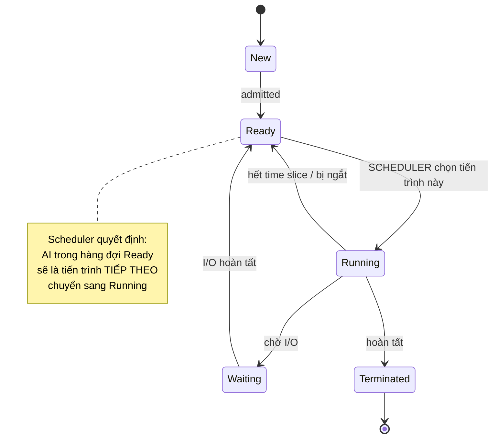

# MASTER COMPUTER SCIENCE HANDBOOK

## Volume 02 — Computer Science Foundations
### Part VI — Operating Systems
## Chương 2.32 — CPU Scheduling (Lập lịch CPU)

---

### Thông tin chương

| Trường | Giá trị |
|---|---|
| Chương | 2.32 (Chương thứ 4 của Part VI; đánh số liên tục toàn Volume) |
| Thuộc Part | VI — Operating Systems |
| Thuộc Volume | 02 — Computer Science Foundations |
| Thời gian đọc ước tính | 60–70 phút |
| Độ khó | ★★★☆☆ |
| Kiến thức tiên quyết | Chương 2.30 — Process (sơ đồ trạng thái, PCB); Chương 2.31 — Thread (Concurrency, tác vụ I/O-bound vs CPU-bound) |
| Chương liên quan | 2.33 — Synchronization (Scheduler quyết định *khi nào* một thread chạy, nhưng không đảm bảo thread đó truy cập dữ liệu chung an toàn — đó là chủ đề chương sau) |
| Từ khóa | CPU Scheduling, Scheduler, Dispatcher, FCFS, SJF, Round Robin, Priority Scheduling, Turnaround Time, Waiting Time, Context Switch |

---

### Mục tiêu học tập

Sau khi hoàn thành chương này, người đọc có thể:

- Giải thích vì sao CPU Scheduling là một bài toán bắt buộc phải giải quyết trong mọi hệ điều hành đa nhiệm.
- Định nghĩa các tiêu chí đánh giá một thuật toán lập lịch: Turnaround Time, Waiting Time, Response Time, Throughput.
- Mô phỏng bằng tay và vẽ Gantt Chart cho bốn thuật toán lập lịch: **FCFS, SJF, Round Robin, Priority Scheduling**.
- So sánh trade-off giữa các thuật toán trên theo từng tiêu chí đánh giá cụ thể.
- Giải thích khái niệm **Starvation** và cách Priority Scheduling có thể vô tình gây ra nó.
- Kết nối khái niệm Time Slice trong Round Robin với công thức Context Switch đã học ở Chương 2.30–2.31.

---

### Câu hỏi khơi gợi

> *Nếu máy tính của bạn đang chạy 50 tiến trình cùng lúc, nhưng CPU (giả sử một lõi) tại một thời điểm chỉ có thể thực thi đúng một tiến trình — ai là người quyết định tiến trình nào được chạy tiếp theo, dựa trên tiêu chí gì, và quyết định đó có công bằng cho tất cả 50 tiến trình hay không?*

---

## 1. Tổng quan chương

Chương 2.30 đã giới thiệu sơ đồ 5 trạng thái của Process, trong đó có một mũi tên đặc biệt: **Ready → Running**. Chương 2.30 khi đó chỉ nói ngắn gọn: "chỉ có Scheduler mới quyết định khi nào một process chuyển từ Ready sang Running." Chương này chính thức mở "hộp đen" đó ra.

**CPU Scheduling** là bài toán quyết định, tại mỗi thời điểm, tiến trình (hoặc thread) nào trong hàng đợi Ready sẽ được cấp CPU để chạy tiếp theo. Đây là một trong những bài toán kinh điển và có ảnh hưởng sâu rộng nhất của hệ điều hành — vì gần như mọi trải nghiệm người dùng (máy có "mượt" không, chương trình có phản hồi nhanh không) đều bị chi phối trực tiếp bởi quyết định lập lịch.

> **💡 Insight**
> CPU Scheduling về bản chất là một bài toán tối ưu hóa đa mục tiêu — và các mục tiêu đó thường **mâu thuẫn** với nhau: tối ưu cho công bằng có thể làm giảm hiệu suất tổng thể; tối ưu cho phản hồi nhanh có thể làm tăng chi phí Context Switch (đã học ở Chương 2.31, Mục 7). Toàn bộ chương này là một chuỗi các đánh đổi (trade-off) cụ thể, minh họa bằng số liệu.

---

## 2. Bối cảnh lịch sử

| Thời điểm | Sự kiện | Ý nghĩa |
|---|---|---|
| Thập niên 1950s | Batch Processing — lập lịch đơn giản: xử lý job theo đúng thứ tự nộp vào | Chưa cần thuật toán phức tạp, vì không có yêu cầu tương tác thời gian thực |
| Đầu thập niên 1960s | Hệ thống Time-Sharing (CTSS, Multics) yêu cầu chia sẻ CPU công bằng giữa nhiều người dùng tương tác trực tiếp | Đặt ra yêu cầu lập lịch phải cân bằng giữa công bằng và tính đáp ứng — khai sinh các thuật toán như Round Robin |
| 1970s–1980s | Nghiên cứu học thuật hình thức hóa và chứng minh tính tối ưu của SJF (Shortest Job First) trong các điều kiện lý tưởng | Đặt nền móng lý thuyết cho việc đánh giá định lượng các thuật toán lập lịch |
| 2003 (Linux 2.6) → 2007 | **Completely Fair Scheduler (CFS)** trở thành scheduler mặc định của Linux | Đại diện cho thế hệ scheduler hiện đại, dùng cấu trúc dữ liệu cây đỏ-đen (Red-Black Tree — sẽ gặp lại ở Volume 03) để đảm bảo công bằng gần như tuyệt đối giữa các tiến trình |

> **🔬 Research Connection**
> CPU Scheduling là một trong số ít lĩnh vực của hệ điều hành có nền tảng lý thuyết hình thức mạnh mẽ, kế thừa trực tiếp từ **Operations Research** (Nghiên cứu Vận trù học) — bài toán "sắp xếp thứ tự xử lý công việc để tối ưu một tiêu chí nào đó" đã được nghiên cứu từ trước khi máy tính hiện đại ra đời, trong bối cảnh lập lịch sản xuất công nghiệp.

---

## 3. Động lực

Giả sử ba tiến trình cùng vào hàng đợi Ready gần như đồng thời:

| Tiến trình | Thời gian cần chạy (Burst Time) |
|---|---:|
| P1 | 24 ms |
| P2 | 3 ms |
| P3 | 3 ms |

Nếu Scheduler chọn chạy **theo đúng thứ tự P1 → P2 → P3** (cách đơn giản nhất có thể nghĩ ra), thì P2 và P3 — dù chỉ cần 3ms để hoàn tất — phải chờ tới 24ms chỉ vì "xui xẻo" đứng sau P1 trong hàng đợi. Người dùng đang chờ P2 (ví dụ một thao tác gõ phím cần phản hồi ngay) sẽ cảm thấy máy "đứng hình" trong suốt 24ms, dù công việc của họ chỉ cần 3ms.

Đây chính là động lực cốt lõi của toàn chương: **thứ tự lập lịch ảnh hưởng trực tiếp đến trải nghiệm, và "công bằng theo thứ tự đến trước" không đồng nghĩa với "công bằng theo cảm nhận của người dùng".** Phần còn lại của chương sẽ trình bày các chiến lược khác nhau để giải quyết đánh đổi này.

---

## 4. Trực giác

**Mô hình tinh thần (Mental Model) của chương này:**

> CPU Scheduling giống như một **quầy thu ngân duy nhất phục vụ nhiều khách hàng**. FCFS là "ai xếp hàng trước, được phục vụ trước" — công bằng về thứ tự nhưng không công bằng về thời gian chờ nếu có người mua rất nhiều hàng. Round Robin giống như quầy phục vụ mỗi khách đúng 2 phút, hết giờ thì chuyển sang khách tiếp theo dù khách đó chưa xong, và quay lại phục vụ tiếp ở lượt sau — không ai phải chờ quá lâu để *bắt đầu* được phục vụ, dù tổng thời gian mua sắm có thể kéo dài hơn.

| Trực giác kỹ thuật bạn đã có | Khái niệm Scheduling tương ứng |
|---|---|
| Xếp hàng ở ngân hàng, ai đến trước được phục vụ trước | FCFS (First-Come, First-Served) |
| Ưu tiên xử lý đơn hàng nhỏ trước để giải phóng hàng chờ nhanh hơn | SJF (Shortest Job First) |
| Ứng dụng gõ phím phản hồi tức thì dù CPU đang chạy tác vụ nền nặng | Round Robin hoặc Priority Scheduling ưu tiên tác vụ tương tác |
| Nhân viên VIP luôn được phục vụ trước khách thường | Priority Scheduling — và rủi ro khách thường chờ mãi (Starvation) |

---

## 5. Trực quan hóa khái niệm

**Hình 2.32.1 — Vị trí của Scheduler trong sơ đồ trạng thái Process**



| Trường thông tin | Nội dung |
|---|---|
| Mục đích | Nối tiếp trực tiếp Hình 2.30.2 (Chương 2.30) — làm rõ chính xác Scheduler can thiệp ở đâu trong vòng đời process |
| Điểm mấu chốt | Mọi tiến trình trong trạng thái Ready đều là "ứng viên" hợp lệ; thuật toán lập lịch chính là quy tắc chọn ứng viên nào thắng ở mỗi lượt |

---

**Hình 2.32.2 — Gantt Chart: so sánh trực quan bốn thuật toán trên cùng một tập dữ liệu**

Dữ liệu đầu vào — ba tiến trình đến gần như cùng lúc (t=0):

| Tiến trình | Burst Time | Priority (số nhỏ hơn = ưu tiên cao hơn) |
|---|---:|---:|
| P1 | 24 ms | 3 |
| P2 | 3 ms | 1 |
| P3 | 3 ms | 2 |

```text
FCFS (theo đúng thứ tự đến: P1, P2, P3)
0        24    27  30
│───P1───│─P2─│─P3─│

SJF (job ngắn nhất chạy trước: P2, P3, P1)
0   3    6           30
│P2│─P3─│─────P1─────│

Priority Scheduling (ưu tiên cao chạy trước: P2, P3, P1)
0   3    6           30
│P2│─P3─│─────P1─────│
(trùng SJF trong ví dụ này vì thứ tự priority khớp thứ tự burst time)

Round Robin (time slice = 4ms, thứ tự vào hàng đợi: P1, P2, P3)
0    4    8   11  14        24  27  30
│─P1─│─P2─│P3│P1│(P2,P3 đã xong)─P1─│
```

*Mục đích:* Cho phép so sánh trực tiếp bằng mắt sự khác biệt về thời điểm mỗi tiến trình hoàn tất. *Điểm mấu chốt:* trong ba thuật toán đầu, P1 (job dài) luôn "chặn đường" ít nhất một trong hai job ngắn hơn theo cách nào đó — chỉ Round Robin đảm bảo mọi tiến trình đều được chạy ít nhất một lần trong 4ms đầu tiên.

---

## 6. Định nghĩa hình thức

> **📌 Remember — CPU Scheduling**
>
> **CPU Scheduling** là cơ chế mà hệ điều hành sử dụng để quyết định, tại mỗi thời điểm, tiến trình (hoặc thread) nào trong tập các tiến trình ở trạng thái **Ready** sẽ được cấp quyền sử dụng CPU tiếp theo. Thành phần thực hiện việc chọn lựa này gọi là **Scheduler**; thành phần thực sự thực hiện việc chuyển đổi ngữ cảnh (Context Switch, đã học ở Chương 2.30 Mục 7) gọi là **Dispatcher**.

**Các tiêu chí đánh giá thuật toán lập lịch:**

| Tiêu chí | Định nghĩa | Xu hướng mong muốn |
|---|---|---|
| **Turnaround Time** | Tổng thời gian từ khi tiến trình vào hệ thống đến khi hoàn tất (= Completion Time − Arrival Time) | Càng thấp càng tốt |
| **Waiting Time** | Tổng thời gian tiến trình ở trạng thái Ready, chờ được cấp CPU (= Turnaround Time − Burst Time) | Càng thấp càng tốt |
| **Response Time** | Thời gian từ khi tiến trình vào hệ thống đến lần đầu tiên nó được cấp CPU | Càng thấp càng tốt, đặc biệt quan trọng cho hệ thống tương tác |
| **Throughput** | Số lượng tiến trình hoàn tất trên một đơn vị thời gian | Càng cao càng tốt |
| **CPU Utilization** | Tỷ lệ thời gian CPU thực sự bận (đã định nghĩa ở Chương 2.30, Mục 7) | Càng cao càng tốt |

> **📌 Remember — Bốn thuật toán lập lịch cơ bản**
>
> - **FCFS (First-Come, First-Served):** chạy theo đúng thứ tự tiến trình đến hàng đợi Ready. Non-preemptive (không thu hồi CPU giữa chừng).
> - **SJF (Shortest Job First):** luôn chọn tiến trình có Burst Time ngắn nhất trong hàng đợi để chạy tiếp theo. Có thể là preemptive (SRTF — Shortest Remaining Time First) hoặc non-preemptive.
> - **Round Robin:** mỗi tiến trình được cấp một khoảng thời gian cố định (**Time Slice** hay **Quantum**); hết thời gian đó, dù chưa xong vẫn bị thu hồi CPU và chuyển ra cuối hàng đợi. Preemptive theo bản chất.
> - **Priority Scheduling:** mỗi tiến trình có một độ ưu tiên; tiến trình có độ ưu tiên cao nhất trong hàng đợi được chạy trước. Có thể preemptive hoặc non-preemptive.

---

## 7. Nền tảng toán học

> **📦 Formula Box — Turnaround Time và Waiting Time**
>
> $$T_{\text{turnaround}} = T_{\text{completion}} - T_{\text{arrival}} \qquad T_{\text{waiting}} = T_{\text{turnaround}} - T_{\text{burst}}$$
>
> | Thành phần | Ý nghĩa |
> |---|---|
> | $T_{\text{completion}}$ | Thời điểm tiến trình thực sự hoàn tất |
> | $T_{\text{arrival}}$ | Thời điểm tiến trình vào hệ thống (vào trạng thái Ready lần đầu) |
> | $T_{\text{burst}}$ | Tổng thời gian CPU thực sự cần để hoàn tất tiến trình |
> | **Diễn giải kỹ thuật** | Waiting Time chính là phần "lãng phí" từ góc nhìn của tiến trình — thời gian nó tồn tại trong hệ thống nhưng không hề được chạy. Đây là con số các thuật toán lập lịch cố gắng tối thiểu hóa (trung bình trên mọi tiến trình) |

**Tính toán cụ thể cho ví dụ ở Mục 5 (giả định cả ba tiến trình đến tại t=0):**

**FCFS:**

| Tiến trình | Completion Time | Turnaround Time | Waiting Time |
|---|---:|---:|---:|
| P1 | 24 | 24 | 0 |
| P2 | 27 | 27 | 24 |
| P3 | 30 | 30 | 27 |

Trung bình Waiting Time = (0 + 24 + 27) / 3 = **17 ms**

**SJF:**

| Tiến trình | Completion Time | Turnaround Time | Waiting Time |
|---|---:|---:|---:|
| P2 | 3 | 3 | 0 |
| P3 | 6 | 6 | 3 |
| P1 | 30 | 30 | 6 |

Trung bình Waiting Time = (0 + 3 + 6) / 3 = **3 ms**

> **💡 Insight**
> Chênh lệch giữa 17ms (FCFS) và 3ms (SJF) trên cùng một tập dữ liệu là minh chứng định lượng cho một định lý đã được chứng minh trong lý thuyết lập lịch: **SJF là thuật toán tối ưu về Waiting Time trung bình** trong số các thuật toán non-preemptive, với điều kiện biết trước chính xác Burst Time của mọi tiến trình. Đây cũng chính là hạn chế lớn nhất của SJF trong thực tế — sẽ được phân tích ở Mục 14.

---

## 8. Thuật toán / Cơ chế

**Round Robin — thuật toán quan trọng nhất cho hệ thống tương tác hiện đại:**

```text
Bước 1 — Khởi tạo hàng đợi Ready dạng FIFO (vào trước ra trước),
         chọn một giá trị Time Slice (quantum) cố định, ví dụ 4ms
        │
        ▼
Bước 2 — Lấy tiến trình ở đầu hàng đợi, cấp CPU cho nó chạy
        │
        ▼
Bước 3 — Nếu tiến trình hoàn tất TRƯỚC khi hết Time Slice:
         nó rời hệ thống, chuyển sang Bước 5
        │
        ▼
Bước 4 — Nếu tiến trình CHƯA hoàn tất khi hết Time Slice:
         thu hồi CPU (Context Switch), đưa tiến trình đó
         xuống CUỐI hàng đợi Ready
        │
        ▼
Bước 5 — Nếu hàng đợi còn tiến trình, quay lại Bước 2
```

> **💡 Insight**
> Việc lựa chọn giá trị Time Slice là một đánh đổi trực tiếp dựa trên Formula Box đã học ở Chương 2.31, Mục 7. Time Slice quá nhỏ → tần suất Context Switch $n$ tăng cao → CPU Utilization giảm (lãng phí vào overhead chuyển đổi). Time Slice quá lớn → Round Robin gần như suy biến thành FCFS → mất đi lợi thế phản hồi nhanh. Trong thực tế, giá trị Time Slice thường nằm trong khoảng 10–100 milliseconds, tùy hệ điều hành và mục tiêu thiết kế cụ thể.

---

## 9. Triển khai

```python
def round_robin_scheduling(processes, time_slice):
    """Mô phỏng thuật toán Round Robin.

    processes: list các dict {'name': str, 'burst': int, 'arrival': int}
    time_slice: độ dài time slice (quantum)

    Trả về: danh sách (tên_tiến_trình, thời_điểm_hoàn_tất)
    """
    from collections import deque

    remaining = {p['name']: p['burst'] for p in processes}
    queue = deque(p['name'] for p in sorted(processes, key=lambda p: p['arrival']))
    current_time = 0
    completion = {}
    gantt_log = []

    while queue:
        name = queue.popleft()
        run_time = min(time_slice, remaining[name])
        gantt_log.append((name, current_time, current_time + run_time))
        current_time += run_time
        remaining[name] -= run_time

        if remaining[name] > 0:
            queue.append(name)  # chưa xong, đưa xuống cuối hàng đợi
        else:
            completion[name] = current_time  # hoàn tất

    return completion, gantt_log


def average_waiting_time(processes, completion):
    """Tính Waiting Time trung bình dựa trên công thức ở Mục 7."""
    total_waiting = 0
    for p in processes:
        turnaround = completion[p['name']] - p['arrival']
        waiting = turnaround - p['burst']
        total_waiting += waiting
    return total_waiting / len(processes)
```

Hàm `round_robin_scheduling` triển khai chính xác 5 bước ở Mục 8, dùng `deque` (hàng đợi hai đầu) để mô phỏng hành vi FIFO của hàng đợi Ready — một tiến trình chưa hoàn tất luôn được đưa về **cuối** hàng đợi, đúng với định nghĩa ở Mục 6.

---

## 10. Trực quan hóa quá trình thực thi

**Kết quả chạy `round_robin_scheduling()` với dữ liệu ở Mục 5, `time_slice=4`:**

```text
[('P1', 0, 4), ('P2', 4, 7), ('P3', 7, 10), ('P1', 10, 14),
 ('P1', 14, 18), ('P1', 18, 22), ('P1', 22, 26), ('P1', 26, 30)]
```

**Bảng tổng hợp Waiting Time cho cả bốn thuật toán trên cùng dữ liệu ở Mục 5:**

| Thuật toán | Waiting Time trung bình | Response Time của P2 (job ngắn, đến sau P1 trong hàng đợi) |
|---|---:|---:|
| FCFS | 17,00 ms | 24 ms |
| SJF (non-preemptive) | 3,00 ms | 0 ms |
| Round Robin (quantum=4) | 8,67 ms | 4 ms |
| Priority (P2 ưu tiên cao nhất) | 3,00 ms | 0 ms |

**Phân tích:** SJF và Priority Scheduling đạt Waiting Time trung bình thấp nhất trong ví dụ này (trùng nhau vì thứ tự ưu tiên được chọn khớp thứ tự Burst Time), nhưng Round Robin đạt Response Time tốt hơn đáng kể so với FCFS — P2 chỉ phải chờ 4ms để **bắt đầu** chạy, thay vì chờ đến 24ms như ở FCFS, dù tổng Waiting Time trung bình của Round Robin cao hơn SJF. Đây là minh chứng cụ thể cho việc **không có thuật toán nào tối ưu trên mọi tiêu chí cùng lúc** — sẽ được phân tích sâu hơn ở Mục 15.

---

## 11. Ứng dụng công nghiệp

> **🛠 Engineering Practice**
> CPU Scheduling không chỉ tồn tại ở tầng hệ điều hành — cùng một tư duy đánh đổi (trade-off) xuất hiện lặp lại ở nhiều tầng khác của hệ thống phần mềm hiện đại.

| Bối cảnh công nghiệp | Vai trò của CPU Scheduling |
|---|---|
| **Completely Fair Scheduler (CFS)** của Linux | Scheduler mặc định hiện nay, dùng cấu trúc Red-Black Tree để theo dõi "thời gian CPU ảo" (virtual runtime) mỗi tiến trình đã dùng, luôn ưu tiên tiến trình dùng ít CPU nhất — một dạng tinh vi hơn nhiều của tư duy công bằng ở Round Robin |
| Task Scheduler của Kubernetes | Áp dụng nguyên lý tương tự CPU Scheduling nhưng ở tầng cụm máy chủ (cluster) — quyết định Pod nào chạy trên Node nào, dựa trên tiêu chí tài nguyên và độ ưu tiên |
| Thread Pool trong các framework backend (ví dụ Java Executor Service) | Hàng đợi task chờ được một thread trong pool xử lý — về bản chất là một bài toán lập lịch thu nhỏ, thường dùng chiến lược gần giống FCFS hoặc Priority Queue |
| Quality of Service (QoS) trong mạng máy tính | Router quyết định gói tin nào được chuyển tiếp trước khi băng thông hạn chế — cùng bài toán "nhiều yêu cầu tranh chấp một tài nguyên hữu hạn" ở một domain khác (liên hệ Volume 04) |

---

## 12. Góc nhìn nghiên cứu

> **🔬 Research Connection**
> SJF được chứng minh là tối ưu về Waiting Time trung bình (Mục 7), nhưng có một vấn đề chí mạng khiến nó gần như không thể triển khai trực tiếp trong thực tế: **Burst Time của một tiến trình trong tương lai là điều không thể biết chính xác trước khi nó thực sự chạy xong.**

Các hệ điều hành thực tế giải quyết vấn đề này bằng cách **dự đoán (estimate)** Burst Time dựa trên lịch sử các lần chạy trước đó của cùng tiến trình, thường dùng công thức trung bình mũ suy giảm (**exponential averaging**):

$$\tau_{n+1} = \alpha \cdot t_n + (1 - \alpha) \cdot \tau_n$$

trong đó $t_n$ là Burst Time thực tế của lần chạy gần nhất, $\tau_n$ là giá trị dự đoán trước đó, và $\alpha \in [0,1]$ là hệ số quyết định mức độ tin tưởng vào dữ liệu gần đây so với lịch sử xa hơn. Đây là một trong những ứng dụng sớm nhất của tư duy "học từ dữ liệu quá khứ để dự đoán tương lai" trong thiết kế hệ điều hành — một sợi dây liên hệ thú vị, dù ở mức rất đơn giản, tới các mô hình dự đoán chuỗi thời gian sẽ gặp lại ở Volume 05 (Machine Learning).

**Hướng nghiên cứu đang tiếp diễn:** scheduler hiện đại như CFS của Linux còn phải cân bằng thêm nhiều mục tiêu ngoài phạm vi chương này — tiết kiệm năng lượng (energy-aware scheduling, đặc biệt quan trọng cho thiết bị di động), lập lịch nhận biết kiến trúc CPU không đồng nhất (heterogeneous computing — ví dụ chip có cả lõi hiệu năng cao và lõi tiết kiệm điện), và lập lịch cho khối lượng công việc AI/GPU (liên hệ trực tiếp Volume 06 — AI Infrastructure).

---

## 13. Ưu điểm

- **FCFS:** đơn giản, dễ cài đặt, không có Starvation (mọi tiến trình chắc chắn được chạy theo đúng thứ tự đến).
- **SJF:** tối ưu về Waiting Time trung bình trong điều kiện lý tưởng (Mục 7) — thuật toán tốt nhất nếu biết trước chính xác Burst Time.
- **Round Robin:** đảm bảo Response Time giới hạn trên, phù hợp lý tưởng cho hệ thống tương tác (time-sharing); công bằng tự nhiên giữa các tiến trình có độ dài khác nhau.
- **Priority Scheduling:** linh hoạt cho phép hệ thống ưu tiên tác vụ quan trọng (ví dụ tác vụ hệ thống, tác vụ thời gian thực) hơn tác vụ nền thông thường.

---

## 14. Hạn chế

> **⚠️ Common Mistake**
> Một ngộ nhận phổ biến: "SJF luôn là lựa chọn tốt nhất vì nó tối ưu Waiting Time." Ngộ nhận này bỏ qua điều kiện tiên quyết bắt buộc — SJF cần biết trước Burst Time, điều gần như bất khả thi trong hệ thống thực tế (Mục 12).

- **FCFS — Hiệu ứng Convoy (Convoy Effect):** một tiến trình Burst Time dài đứng đầu hàng đợi khiến mọi tiến trình ngắn phía sau phải chờ đợi không cân xứng — chính xác là vấn đề đã minh họa ở Mục 3 và 7.
- **SJF — không thể triển khai chính xác trong thực tế** (Mục 12); phiên bản preemptive (SRTF) còn có thể gây Starvation cho tiến trình dài nếu liên tục có tiến trình ngắn hơn xen vào.
- **Round Robin — hiệu suất phụ thuộc mạnh vào lựa chọn Time Slice** (Mục 8); không tối ưu về Waiting Time trung bình so với SJF trên cùng dữ liệu (đã thấy ở Mục 10).
- **Priority Scheduling — nguy cơ Starvation:** một tiến trình có độ ưu tiên thấp có thể **không bao giờ** được chạy nếu liên tục có tiến trình ưu tiên cao hơn xuất hiện. Giải pháp kinh điển cho vấn đề này là **Aging** — tăng dần độ ưu tiên của một tiến trình theo thời gian nó chờ đợi, đảm bảo cuối cùng nó cũng sẽ đạt độ ưu tiên đủ cao để được chạy.

---

## 15. So sánh

**Bảng 2.32.1 — Tổng hợp so sánh bốn thuật toán lập lịch**

| Tiêu chí | FCFS | SJF | Round Robin | Priority |
|---|---|---|---|---|
| Preemptive? | Không | Tùy biến thể | Có (bản chất) | Tùy biến thể |
| Waiting Time trung bình | Cao (dễ bị Convoy Effect) | Thấp nhất (lý thuyết) | Trung bình | Thấp nếu ưu tiên khớp Burst Time |
| Response Time | Kém với job đến sau job dài | Tốt cho job ngắn, kém cho job dài | Tốt và có giới hạn trên rõ ràng | Phụ thuộc độ ưu tiên |
| Nguy cơ Starvation | Không | Có (với SRTF) | Không | Có (nếu không dùng Aging) |
| Độ phức tạp triển khai | Rất đơn giản | Cần dự đoán Burst Time | Đơn giản, cần chọn Time Slice hợp lý | Cần chọn cơ chế Aging để tránh Starvation |
| Phù hợp nhất với | Hệ thống batch, không cần tương tác | Hệ thống có thể ước lượng tốt độ dài tác vụ | Hệ thống tương tác, time-sharing (đa số hệ điều hành hiện đại) | Hệ thống cần phân biệt rõ tác vụ hệ thống/tác vụ người dùng |

**Phân tích:** bảng trên là minh chứng tổng kết cho nguyên tắc xuyên suốt toàn Part VI — mỗi thuật toán được thiết kế tối ưu cho một tập tiêu chí cụ thể, và việc chọn thuật toán phù hợp phụ thuộc vào **bản chất workload** cũng như **mục tiêu ưu tiên** của hệ thống (công bằng, phản hồi nhanh, hay throughput tối đa). Các scheduler hiện đại như CFS (Mục 11) thực chất là sự kết hợp tinh vi của nhiều ý tưởng từ cả bốn thuật toán cơ bản này.

---

## 16. Tóm tắt

- **CPU Scheduling** giải quyết bài toán: trong số các tiến trình ở trạng thái Ready, ai được chạy tiếp theo — trực tiếp hiện thực hóa mũi tên Ready → Running đã giới thiệu ở Chương 2.30.
- Bốn tiêu chí đánh giá cốt lõi: **Turnaround Time, Waiting Time, Response Time, Throughput** — các thuật toán khác nhau tối ưu các tiêu chí này theo cách khác nhau, thường mâu thuẫn lẫn nhau.
- **FCFS** đơn giản nhưng dễ gây Convoy Effect; **SJF** tối ưu lý thuyết nhưng cần biết trước Burst Time (bất khả thi tuyệt đối trong thực tế); **Round Robin** cân bằng tốt cho hệ thống tương tác nhờ giới hạn Response Time, đánh đổi bằng lựa chọn Time Slice cẩn thận; **Priority Scheduling** linh hoạt nhưng có nguy cơ Starvation nếu không dùng cơ chế Aging.
- Không có thuật toán nào tối ưu tuyệt đối trên mọi tiêu chí — các scheduler hiện đại (như CFS của Linux) là sự kết hợp tinh vi của nhiều nguyên lý đã học trong chương này.
- Chương tiếp theo (2.33) chuyển sang một câu hỏi khác: Scheduler đã quyết định *khi nào* một thread chạy, nhưng **điều gì xảy ra nếu hai thread cùng được lập lịch chạy xen kẽ và cùng truy cập một biến chung?** — đây chính là vấn đề Race Condition đã giới thiệu sơ bộ ở Chương 2.31.

---

## 17. Bài tập

### Mức Cơ bản (Basic)

1. Cho ba tiến trình P1 (burst=10), P2 (burst=5), P3 (burst=8), cùng đến tại t=0. Vẽ Gantt Chart và tính Waiting Time trung bình cho FCFS.
2. Với cùng dữ liệu ở câu 1, vẽ Gantt Chart và tính Waiting Time trung bình cho SJF (non-preemptive). So sánh kết quả với câu 1.

### Mức Trung bình (Intermediate)

3. Với cùng dữ liệu ở câu 1, mô phỏng Round Robin với time_slice=3, vẽ Gantt Chart đầy đủ, và tính Waiting Time trung bình. So sánh kết quả với FCFS và SJF.
4. Chạy hàm `round_robin_scheduling()` ở Mục 9 với `time_slice` lần lượt là 1, 2, 4, 8, 100 trên cùng bộ dữ liệu ở Mục 5. Vẽ biểu đồ Waiting Time trung bình theo `time_slice`, và giải thích hình dạng đường cong thu được, liên hệ với Mục 8.

### Mức Nâng cao (Advanced)

5. Mở rộng hàm `round_robin_scheduling()` ở Mục 9 để hỗ trợ các tiến trình có **Arrival Time khác nhau** (không phải tất cả đều đến tại t=0 như ví dụ trong chương). Kiểm thử với ít nhất 5 tiến trình có thời điểm đến khác nhau.

### Mức Nghiên cứu (Research)

6. Tìm đọc tổng quan về **Completely Fair Scheduler (CFS)** của Linux (gợi ý tìm kiếm: "Linux CFS virtual runtime"). Viết đoạn ngắn (nửa trang) giải thích ý tưởng "virtual runtime" và so sánh nó với ý tưởng "Aging" đã đề cập ở Mục 14 — cả hai đều nhằm giải quyết vấn đề công bằng, nhưng bằng cơ chế khác nhau như thế nào?

---

## 18. Dự án nhỏ

**Trình mô phỏng và so sánh thuật toán lập lịch (Scheduling Simulator)**

- **Mục tiêu:** Xây dựng công cụ trực quan hóa cho phép so sánh trực tiếp bốn thuật toán đã học trên cùng một bộ dữ liệu tùy chỉnh.
- **Yêu cầu:**
  - Cài đặt đầy đủ bốn hàm mô phỏng: `fcfs_scheduling()`, `sjf_scheduling()`, `round_robin_scheduling()` (đã có ở Mục 9), `priority_scheduling()`.
  - Với một bộ dữ liệu tiến trình do người dùng nhập (tên, Burst Time, Arrival Time, Priority), chạy cả bốn thuật toán và in ra: Gantt Chart dạng văn bản, bảng Waiting Time/Turnaround Time từng tiến trình, và giá trị trung bình.
  - Trình bày kết quả dưới dạng bảng so sánh tổng hợp tương tự Bảng ở Mục 10.
- **Công nghệ đề xuất:** Python thuần; tùy chọn `matplotlib` để vẽ Gantt Chart dạng đồ họa thay vì văn bản.
- **Mở rộng (tùy chọn):** Cài đặt thêm cơ chế **Aging** cho Priority Scheduling (Mục 14), và chứng minh bằng thực nghiệm rằng nó ngăn được Starvation trên một bộ dữ liệu được thiết kế cố tình gây Starvation.

---

## 19. Tự đánh giá

- [ ] Tôi có thể tự vẽ Gantt Chart cho một bộ dữ liệu mới (không phải ví dụ trong chương) với cả bốn thuật toán, không cần xem lại tài liệu.
- [ ] Tôi có thể tính chính xác Waiting Time và Turnaround Time cho từng tiến trình, dựa đúng vào công thức ở Mục 7.
- [ ] Tôi hiểu và có thể giải thích Convoy Effect (FCFS) và Starvation (Priority Scheduling) bằng ví dụ cụ thể của riêng mình.
- [ ] Tôi có thể giải thích vì sao SJF tối ưu về lý thuyết nhưng khó triển khai trong thực tế, và biết ít nhất một giải pháp thực tế (dự đoán Burst Time bằng exponential averaging).
- [ ] Tôi hiểu mối liên hệ giữa lựa chọn Time Slice trong Round Robin và chi phí Context Switch đã học ở Chương 2.30–2.31.

Nếu Bài tập 4 cho ra một đường cong không đơn điệu (không phải lúc nào Waiting Time cũng giảm khi tăng time_slice), đây là kết quả **đúng như kỳ vọng**, không phải lỗi — nó phản ánh chính xác sự đánh đổi giữa overhead Context Switch và tính công bằng đã phân tích ở Mục 8, và là dấu hiệu bạn đã sẵn sàng cho Chương 2.33.

---

## 20. Đọc thêm

- **Sách:** Abraham Silberschatz, Peter B. Galvin, Greg Gagne, *Operating System Concepts* — Chương 5, phần trình bày đầy đủ và hình thức hơn về các thuật toán lập lịch, bao gồm cả Multilevel Queue Scheduling không thuộc phạm vi chương này. *(Xem BOOKS.md — Volume 2/4.)*
- **Tài liệu mở rộng:** Tài liệu kernel Linux chính thức (kernel.org) — mục Scheduler, phần mô tả CFS và khái niệm "virtual runtime".
- **Chủ đề mở rộng (không bắt buộc):** tìm đọc về **Multilevel Feedback Queue** — một thuật toán kết hợp nhiều hàng đợi với độ ưu tiên khác nhau, cho phép tiến trình "di chuyển" giữa các hàng đợi dựa trên hành vi lịch sử của nó, kết hợp ý tưởng của cả Round Robin và Priority Scheduling.
- **Chương tiếp theo:** Chương 2.33 — Synchronization (Đồng bộ hóa).

---

### Liên kết chương (Cross References)

- **Chương trước:** 2.31 — Thread (khái niệm Time Slice trong Round Robin dùng trực tiếp công thức Context Switch đã định lượng ở Chương 2.30 và 2.31).
- **Chương tiếp theo:** 2.33 — Synchronization (Scheduler quyết định thứ tự thực thi các thread, nhưng không đảm bảo an toàn khi các thread đó truy cập dữ liệu chung — vấn đề Race Condition đã giới thiệu sơ bộ ở Chương 2.31, Mục 14, sẽ được giải quyết đầy đủ ở chương sau).
- **Chương liên quan xa hơn:** Volume 03, Part II — Fundamental Data Structures (Red-Black Tree, cấu trúc dữ liệu nền tảng của CFS đề cập ở Mục 11); Volume 04, Part III — Operating Systems (mở rộng sâu về Multilevel Feedback Queue, energy-aware scheduling).
- **Vị trí trong Knowledge Graph:** Chương thứ tư của Volume 02, Part VI; phụ thuộc trực tiếp vào Chương 2.30 và 2.31; là điều kiện tiên quyết gián tiếp cho Chương 2.33 (Synchronization giải quyết vấn đề phát sinh từ chính việc nhiều thread được lập lịch xen kẽ như đã học ở chương này).

---

*Hết Chương 2.32. Chương này tuân thủ đầy đủ cấu trúc 20 mục của `OUTPUT.md` và chuẩn Presentation Layer, theo đúng quy ước đánh số liên tục toàn Volume đã áp dụng từ Chương 2.29. Toàn bộ số liệu Gantt Chart và Waiting Time ở Mục 5, 7, 10 được tính toán chính xác dựa trên công thức đã định nghĩa, có thể kiểm chứng lại bằng mã nguồn ở Mục 9. Đang chờ rà soát trước khi tiếp tục sang Chương 2.33 — Synchronization.*
