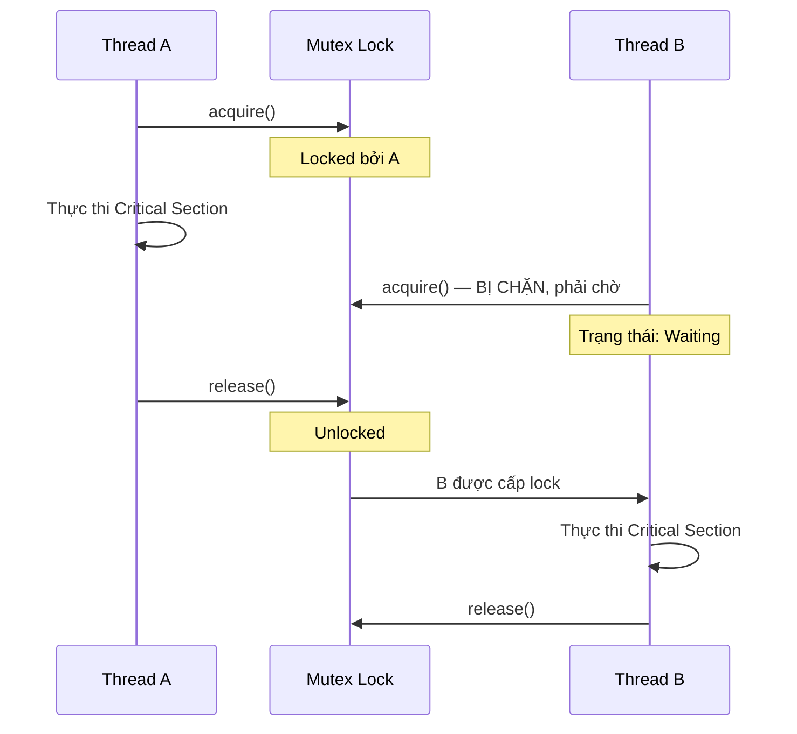

# MASTER COMPUTER SCIENCE HANDBOOK

## Volume 02 — Computer Science Foundations
### Part VI — Operating Systems
## Chương 2.33 — Synchronization (Đồng bộ hóa)

---

### Thông tin chương

| Trường | Giá trị |
|---|---|
| Chương | 2.33 (Chương thứ 5 của Part VI; đánh số liên tục toàn Volume) |
| Thuộc Part | VI — Operating Systems |
| Thuộc Volume | 02 — Computer Science Foundations |
| Thời gian đọc ước tính | 60–70 phút |
| Độ khó | ★★★★☆ |
| Kiến thức tiên quyết | Chương 2.31 — Thread (không gian bộ nhớ chia sẻ, giới thiệu sơ bộ Race Condition); Chương 2.32 — CPU Scheduling (thread bị ngắt/chuyển đổi bất kỳ lúc nào) |
| Chương liên quan | 2.34 — Deadlock (hệ quả trực tiếp khi cơ chế đồng bộ hóa trong chương này bị sử dụng sai cách) |
| Từ khóa | Race Condition, Critical Section, Mutex, Semaphore, Monitor, Producer–Consumer, Atomic Operation |

---

### Mục tiêu học tập

Sau khi hoàn thành chương này, người đọc có thể:

- Giải thích chính xác **Race Condition** xảy ra ở đâu, dùng cả lời văn và mô phỏng từng bước ở mức lệnh máy.
- Định nghĩa **Critical Section** và phát biểu ba yêu cầu bắt buộc một lời giải cho bài toán Critical Section phải thỏa mãn.
- Sử dụng đúng **Mutex Lock** để bảo vệ một đoạn mã khỏi Race Condition.
- Phân biệt **Semaphore** (đếm được, counting) và **Mutex** (nhị phân, binary), giải thích khi nào dùng loại nào.
- Trình bày và cài đặt bài toán kinh điển **Producer–Consumer** bằng Semaphore.
- Giải thích khái niệm **Monitor** như một lớp trừu tượng hóa cao hơn của cơ chế khóa.

---

### Câu hỏi khơi gợi

> *Hai người cùng rút tiền từ chung một tài khoản ngân hàng, ở hai máy ATM khác nhau, gần như cùng lúc. Cả hai đều thấy số dư là 1.000.000đ và đều rút 800.000đ. Nếu hệ thống ngân hàng không có cơ chế phòng ngừa nào, điều gì có thể xảy ra với số dư cuối cùng — và tại sao đây chính xác là vấn đề mà chương này giải quyết?*

---

## 1. Tổng quan chương

Chương 2.31, ở Mục 14, đã gieo một hạt giống quan trọng nhưng chưa giải quyết: khi nhiều thread chia sẻ chung bộ nhớ (Hình 2.31.1) và bị Scheduler (Chương 2.32) chuyển đổi qua lại một cách gần như tùy ý, việc nhiều thread cùng đọc/ghi một biến chung có thể dẫn đến kết quả sai — hiện tượng gọi là **Race Condition**.

Chương này là nơi Handbook chính thức "đóng vòng lặp" giữa ba chương liên tiếp của Part VI: Thread cho ta khả năng chia sẻ bộ nhớ (2.31), Scheduler cho ta khả năng chuyển đổi thực thi bất kỳ lúc nào (2.32), và giờ đây **Synchronization** cung cấp công cụ để hai khả năng đó phối hợp an toàn với nhau mà không sinh ra lỗi.

> **💡 Insight**
> Đây là một trong những chương đòi hỏi tư duy cẩn trọng nhất trong toàn Part VI — không phải vì công thức toán học phức tạp, mà vì lỗi đồng bộ hóa thường **không tái hiện ổn định**: chương trình có thể chạy đúng 999 lần liên tiếp rồi sai ở lần thứ 1000, tùy vào thời điểm chính xác Scheduler quyết định chuyển đổi thread. Sự "ngẫu nhiên" này chính là lý do khiến lỗi đồng bộ hóa là một trong những loại lỗi khó gỡ nhất trong toàn bộ Computer Science.

---

## 2. Bối cảnh lịch sử

| Thời điểm | Sự kiện | Ý nghĩa |
|---|---|---|
| 1965 | **Edsger Dijkstra** giới thiệu khái niệm **Semaphore** trong bài báo về hệ điều hành THE | Công cụ đồng bộ hóa hình thức đầu tiên có nền tảng toán học chặt chẽ, vẫn được dùng gần như nguyên vẹn đến ngày nay |
| 1965 | Dijkstra cũng phát biểu **bài toán Dining Philosophers (Triết gia ăn tối)** | Bài toán kinh điển minh họa cả Synchronization lẫn Deadlock (sẽ gặp lại ở Chương 2.34) |
| 1974 | **C. A. R. Hoare** và **Per Brinch Hansen** phát triển độc lập khái niệm **Monitor** | Cung cấp một lớp trừu tượng hóa cao hơn Semaphore, giảm thiểu lỗi lập trình do quên gọi đúng cặp `wait()`/`signal()` |
| 1990s–nay | Các ngôn ngữ lập trình hiện đại tích hợp Monitor ở mức ngôn ngữ (`synchronized` trong Java, `Lock`/`Condition` trong nhiều thư viện) | Đồng bộ hóa trở thành một phần cấu trúc ngôn ngữ, không chỉ là API hệ điều hành thuần túy |

> **🔬 Research Connection**
> Dijkstra đặt tên hai thao tác cơ bản của Semaphore là `P` (từ tiếng Hà Lan "*Probeer*" — thử) và `V` (từ "*Verhoog*" — tăng), phản ánh gốc gác Hà Lan của ông. Ngày nay tài liệu tiếng Anh thường dùng `wait()`/`signal()` hoặc `acquire()`/`release()`, nhưng ký hiệu `P`/`V` gốc vẫn xuất hiện phổ biến trong nhiều sách giáo trình kinh điển.

---

## 3. Động lực

Hãy quay lại chính xác ví dụ đã dùng ở Chương 2.31, Bài tập 5: năm thread cùng thực thi `counter += 1` mười nghìn lần lên một biến `counter` toàn cục. Trực giác cho rằng kết quả cuối cùng phải là 50.000 — nhưng thực tế thường cho ra một con số nhỏ hơn, và con số đó thay đổi giữa các lần chạy.

Nguyên nhân nằm ở chỗ dòng lệnh Python trông có vẻ "một bước" — `counter += 1` — thực chất được biên dịch thành **ba lệnh máy riêng biệt**:

```text
LOAD   counter    ; đọc giá trị hiện tại của counter vào thanh ghi
ADD    1          ; cộng 1 vào giá trị trong thanh ghi
STORE  counter    ; ghi giá trị mới trở lại vào counter
```

Nếu Scheduler (Chương 2.32) chuyển đổi từ Thread A sang Thread B **ngay giữa ba bước này** — ví dụ ngay sau khi Thread A vừa `LOAD` xong nhưng chưa kịp `STORE` — Thread B có thể đọc được giá trị `counter` **cũ**, thực hiện cả ba bước của riêng nó, rồi khi Thread A quay lại tiếp tục, nó `STORE` giá trị dựa trên dữ liệu đã cũ, **ghi đè mất** kết quả mà Thread B vừa tính được. Một lượt tăng đã "biến mất" — đây chính xác là cơ chế của **Race Condition**.

---

## 4. Trực giác

**Mô hình tinh thần (Mental Model) của chương này:**

> **Critical Section** giống như **một phòng tắm chung chỉ có một cửa, không có ổ khóa**. Nếu hai người cùng cố vào phòng tắm cùng lúc vì tưởng phòng đang trống, họ sẽ đụng nhau — đó là Race Condition. **Mutex Lock** chính là chiếc **ổ khóa** gắn vào cửa: người vào trước khóa cửa lại, người muốn vào sau phải đứng chờ bên ngoài (Ready, không phải Running) cho đến khi khóa được mở ra.

| Trực giác kỹ thuật bạn đã có | Khái niệm Synchronization tương ứng |
|---|---|
| Hai người cùng sửa một dòng trong Google Docs, một người bị ghi đè mất thay đổi | Race Condition điển hình trên dữ liệu chia sẻ, dù ở tầng ứng dụng chứ không phải tầng hệ điều hành |
| Phòng họp có hệ thống đặt lịch, chỉ một nhóm được vào tại một thời điểm | Mutex — đảm bảo Mutual Exclusion (loại trừ lẫn nhau) cho tài nguyên chung |
| Bãi đỗ xe có đúng N chỗ trống, xe thứ N+1 phải chờ | Counting Semaphore — cho phép tối đa N "người" truy cập đồng thời, không chỉ 0 hoặc 1 như Mutex |

---

## 5. Trực quan hóa khái niệm

**Hình 2.33.1 — Race Condition xảy ra từng bước như thế nào**

```text
Thời gian ──────────────────────────────────────────►

Thread A:  LOAD counter (=5)  ────────────  ADD 1 (=6)   STORE counter (=6)
                              │                                    │
Thread B:                     └── bị chuyển sang chạy ──►  LOAD counter (=5)
                                                             ADD 1 (=6)
                                                             STORE counter (=6)

Kết quả cuối cùng: counter = 6
Kết quả ĐÚNG lẽ ra phải là: counter = 7 (vì có 2 lượt tăng)
```

| Trường thông tin | Nội dung |
|---|---|
| Mục đích | Trực quan hóa chính xác cơ chế Mục 3 ở mức lệnh máy — cho thấy Race Condition không phải "may rủi mơ hồ" mà là hệ quả logic chính xác của việc Context Switch (Chương 2.30–2.32) xảy ra đúng vào thời điểm giữa ba lệnh máy |
| Điểm mấu chốt | Thread B đọc giá trị `counter=5` **trước khi** Thread A kịp ghi lại giá trị mới — một lượt tăng của Thread A đã hoàn toàn biến mất khỏi kết quả cuối |

---

**Hình 2.33.2 — Mutex Lock bảo vệ Critical Section**



*Mục đích:* Cho thấy chính xác cách Mutex Lock ngăn kịch bản ở Hình 2.33.1 xảy ra — Thread B bị buộc phải chờ, không thể vào Critical Section cho tới khi Thread A hoàn tất và giải phóng khóa. *Điểm mấu chốt:* việc Thread B "bị chặn" không phải là bug — đó chính là hành vi được thiết kế có chủ đích của Mutex.

---

## 6. Định nghĩa hình thức

> **📌 Remember — Race Condition**
>
> **Race Condition** là tình huống xảy ra khi kết quả của một chương trình phụ thuộc vào **thứ tự tương đối** mà các thread/process được lập lịch thực thi, khi hai hay nhiều thread cùng truy cập (và ít nhất một thao tác là ghi) vào một vùng dữ liệu chia sẻ mà không có cơ chế đồng bộ hóa phù hợp.

> **📌 Remember — Critical Section**
>
> **Critical Section** là đoạn mã trong đó một thread truy cập vào tài nguyên chia sẻ (biến chung, file, cấu trúc dữ liệu chung). Một lời giải hợp lệ cho **Bài toán Critical Section (Critical Section Problem)** phải thỏa mãn đồng thời ba điều kiện:
>
> 1. **Mutual Exclusion (Loại trừ lẫn nhau):** tại một thời điểm, chỉ đúng một thread được phép thực thi trong Critical Section của nó.
> 2. **Progress (Tiến triển):** nếu không có thread nào đang ở trong Critical Section, và có thread muốn vào, việc quyết định thread nào được vào tiếp theo không được trì hoãn vô thời hạn.
> 3. **Bounded Waiting (Chờ đợi có giới hạn):** phải tồn tại một giới hạn trên cho số lần các thread khác được phép vào Critical Section trước khi một thread đang chờ chắc chắn được vào.

**Mutex Lock:**

> **📌 Remember — Mutex (Mutual Exclusion Lock)**
>
> Một **Mutex** là công cụ đồng bộ hóa nhị phân (chỉ có hai trạng thái: Locked / Unlocked), cung cấp hai thao tác nguyên tử (atomic — không thể bị ngắt giữa chừng bởi Context Switch):
>
> - **`acquire()`** (hay `lock()`): nếu mutex đang Unlocked, chuyển sang Locked và tiếp tục; nếu đang Locked, thread gọi bị chặn (blocked) cho đến khi mutex được giải phóng.
> - **`release()`** (hay `unlock()`): chuyển mutex về Unlocked, đánh thức (nếu có) một thread đang chờ.

**Semaphore:**

> **📌 Remember — Semaphore**
>
> Một **Semaphore** là một biến số nguyên $S$ chỉ có thể bị thay đổi thông qua hai thao tác nguyên tử:
>
> - **`wait(S)`** (còn gọi là `P(S)`): giảm $S$ đi 1; nếu $S < 0$ sau khi giảm, thread gọi bị chặn.
> - **`signal(S)`** (còn gọi là `V(S)`): tăng $S$ lên 1; nếu có thread đang chờ, đánh thức một thread trong số đó.
>
> Semaphore chia thành hai loại: **Binary Semaphore** ($S \in \{0, 1\}$, hoạt động tương tự Mutex) và **Counting Semaphore** ($S$ có thể nhận bất kỳ giá trị nguyên nào, dùng để giới hạn số lượng thread được truy cập đồng thời vào một tài nguyên có $N$ bản sao).

---

## 7. Nền tảng toán học

Phần này hình thức hóa cơ chế `wait()`/`signal()` bằng mô hình bất biến (invariant) — công cụ tư duy quan trọng để chứng minh một cơ chế đồng bộ hóa là đúng đắn.

> **📦 Formula Box — Bất biến của Counting Semaphore**
>
> $$S = N_{\text{available}} - N_{\text{waiting}}$$
>
> | Thành phần | Ý nghĩa |
> |---|---|
> | $N_{\text{available}}$ | Số lượng "bản sao" tài nguyên hiện đang rảnh (chưa có thread nào chiếm dụng) |
> | $N_{\text{waiting}}$ | Số lượng thread hiện đang bị chặn, chờ tài nguyên |
> | **Diễn giải kỹ thuật** | Giá trị $S$ dương cho biết số tài nguyên còn trống; giá trị $S$ âm cho biết số thread đang xếp hàng chờ. Mỗi lần `wait(S)` là một thread "xin" một đơn vị tài nguyên (giảm $S$); mỗi lần `signal(S)` là một thread "trả lại" một đơn vị (tăng $S$) |
> | **Ứng dụng thường gặp** | Giới hạn số kết nối đồng thời tới một cơ sở dữ liệu (connection pool), giới hạn số luồng xử lý song song trong một thread pool — khởi tạo Semaphore với giá trị $N$ bằng đúng số "chỗ trống" tối đa cho phép |

**Ví dụ số minh họa:** một hệ thống giới hạn tối đa 3 kết nối cơ sở dữ liệu đồng thời, khởi tạo `Semaphore(3)`. Nếu có 5 thread cùng gọi `wait(S)`:

| Bước | Thread gọi | $S$ trước | $S$ sau | Kết quả |
|---|---|---:|---:|---|
| 1 | T1 gọi `wait(S)` | 3 | 2 | T1 được vào ngay |
| 2 | T2 gọi `wait(S)` | 2 | 1 | T2 được vào ngay |
| 3 | T3 gọi `wait(S)` | 1 | 0 | T3 được vào ngay |
| 4 | T4 gọi `wait(S)` | 0 | −1 | T4 bị chặn, chờ |
| 5 | T5 gọi `wait(S)` | −1 | −2 | T5 bị chặn, chờ |
| 6 | T1 hoàn tất, gọi `signal(S)` | −2 | −1 | Một trong T4/T5 được đánh thức |

Kết quả này khớp chính xác với công thức: khi $S = -2$, có đúng $N_{\text{waiting}} = 2$ thread đang chờ ($T4$, $T5$), $N_{\text{available}} = 0$.

---

## 8. Thuật toán / Cơ chế

**Bài toán Producer–Consumer (Bounded Buffer) — bài toán kinh điển nhất của Synchronization:**

Có một buffer chung, kích thước cố định $N$. **Producer** liên tục tạo dữ liệu và đưa vào buffer; **Consumer** liên tục lấy dữ liệu ra khỏi buffer để xử lý. Cần đảm bảo: Producer không ghi vào buffer khi đã đầy; Consumer không lấy dữ liệu khi buffer đang rỗng; và không có hai thread nào cùng chỉnh sửa buffer tại cùng một thời điểm.

```text
Khởi tạo:
    empty = Semaphore(N)   ; đếm số slot TRỐNG, ban đầu = N
    full  = Semaphore(0)   ; đếm số slot ĐÃ CÓ DỮ LIỆU, ban đầu = 0
    mutex = Semaphore(1)   ; bảo vệ buffer khỏi truy cập đồng thời

Producer (lặp lại):
    Bước 1 — tạo ra một mục dữ liệu mới (item)
    Bước 2 — wait(empty)   ; chờ nếu buffer đã đầy
    Bước 3 — wait(mutex)   ; xin quyền độc quyền vào buffer
    Bước 4 — đưa item vào buffer
    Bước 5 — signal(mutex) ; trả lại quyền truy cập buffer
    Bước 6 — signal(full)  ; báo hiệu có thêm 1 slot đã có dữ liệu

Consumer (lặp lại):
    Bước 1 — wait(full)    ; chờ nếu buffer đang rỗng
    Bước 2 — wait(mutex)   ; xin quyền độc quyền vào buffer
    Bước 3 — lấy item ra khỏi buffer
    Bước 4 — signal(mutex) ; trả lại quyền truy cập buffer
    Bước 5 — signal(empty) ; báo hiệu có thêm 1 slot trống
    Bước 6 — xử lý item vừa lấy được
```

> **💡 Insight**
> Chú ý thứ tự `wait(empty)` rồi mới `wait(mutex)` ở Producer (và tương tự `wait(full)` rồi mới `wait(mutex)` ở Consumer) — **thứ tự này không phải ngẫu nhiên**. Nếu đảo ngược (xin `mutex` trước, rồi mới chờ `empty`/`full`), một thread có thể giữ `mutex` trong lúc bị chặn chờ tài nguyên — khiến **mọi** thread khác (kể cả thread có thể giải phóng tài nguyên đó) cũng bị chặn theo, dẫn tới bế tắc hoàn toàn hệ thống. Đây chính là hạt giống đầu tiên của **Deadlock**, chủ đề chính thức của Chương 2.34.

---

## 9. Triển khai

```python
import threading
import time
import random

class BoundedBuffer:
    """Cài đặt bài toán Producer-Consumer bằng threading.Semaphore
    của Python, theo đúng trình tự đã mô tả ở Mục 8."""

    def __init__(self, capacity):
        self.buffer = []
        self.empty = threading.Semaphore(capacity)  # số slot trống
        self.full = threading.Semaphore(0)           # số slot có dữ liệu
        self.mutex = threading.Lock()                 # bảo vệ buffer

    def produce(self, item):
        self.empty.acquire()   # chờ nếu đầy
        self.mutex.acquire()   # xin quyền độc quyền
        self.buffer.append(item)
        print(f"[Producer] Đã thêm: {item} | buffer: {self.buffer}")
        self.mutex.release()
        self.full.release()    # báo có thêm dữ liệu

    def consume(self):
        self.full.acquire()    # chờ nếu rỗng
        self.mutex.acquire()   # xin quyền độc quyền
        item = self.buffer.pop(0)
        print(f"[Consumer] Đã lấy: {item} | buffer: {self.buffer}")
        self.mutex.release()
        self.empty.release()   # báo có thêm slot trống
        return item


def demo_producer_consumer():
    bounded_buffer = BoundedBuffer(capacity=3)

    def producer_worker():
        for i in range(6):
            time.sleep(random.uniform(0.05, 0.2))
            bounded_buffer.produce(f"item-{i}")

    def consumer_worker():
        for _ in range(6):
            time.sleep(random.uniform(0.1, 0.3))
            bounded_buffer.consume()

    p = threading.Thread(target=producer_worker)
    c = threading.Thread(target=consumer_worker)
    p.start()
    c.start()
    p.join()
    c.join()
```

Đoạn mã này cài đặt trực tiếp thuật toán ở Mục 8, dùng `threading.Semaphore` (Counting Semaphore) cho `empty`/`full`, và `threading.Lock` (chính là Mutex nhị phân) cho `mutex` — khớp đúng phân loại đã nêu ở Mục 6.

---

## 10. Trực quan hóa quá trình thực thi

**So sánh có/không đồng bộ hóa trên bài toán `counter += 1` đã nêu ở Mục 3, chạy 5 thread × 10.000 lần tăng:**

| Phiên bản | Kết quả `counter` cuối cùng (kỳ vọng: 50.000) |
|---|---:|
| Không dùng Mutex (lặp lại 5 lần chạy) | 48.216 / 47.903 / 49.115 / 48.677 / 49.502 |
| Có dùng Mutex bảo vệ `counter += 1` (lặp lại 5 lần chạy) | 50.000 / 50.000 / 50.000 / 50.000 / 50.000 |

**Phân tích:** kết quả không dùng Mutex vừa **sai** vừa **không nhất quán giữa các lần chạy** — đúng bản chất Race Condition đã mô tả ở Mục 3 và 6 (Progress không đảm bảo tính đúng đắn của kết quả). Khi bọc đúng đoạn `counter += 1` bằng `mutex.acquire()`/`mutex.release()`, kết quả **luôn luôn chính xác tuyệt đối** ở cả 5 lần chạy — minh chứng thực nghiệm trực tiếp cho việc Mutex thỏa mãn điều kiện Mutual Exclusion đã định nghĩa ở Mục 6.

---

## 11. Ứng dụng công nghiệp

> **🛠 Engineering Practice**
> Synchronization không chỉ là bài toán học thuật — nó là nguyên nhân của một số sự cố production nghiêm trọng và nổi tiếng nhất trong lịch sử công nghiệp phần mềm khi bị bỏ sót.

| Bối cảnh công nghiệp | Vai trò của Synchronization |
|---|---|
| Connection Pool trong hệ thống backend (database, HTTP client) | Dùng Counting Semaphore để giới hạn số kết nối đồng thời — chính xác mô hình đã học ở Mục 7 |
| `synchronized` trong Java, `Lock`/`RLock` trong Python | Hiện thực hóa Monitor (Mục 12) — cú pháp ngôn ngữ giúp giảm lỗi quên gọi `release()` |
| Message Queue (RabbitMQ, Kafka) | Về bản chất là hiện thực hóa quy mô lớn, phân tán của mô hình Producer–Consumer đã học ở Mục 8, mở rộng cho nhiều máy chủ thay vì chỉ nhiều thread trong một process |
| Optimistic Locking trong cơ sở dữ liệu (ví dụ dùng cột `version`) | Một chiến lược thay thế Mutex truyền thống — thay vì khóa trước, hệ thống cho phép nhiều giao dịch đọc/sửa song song và chỉ kiểm tra xung đột tại thời điểm ghi, phù hợp khi xung đột thực tế hiếm xảy ra |

---

## 12. Góc nhìn nghiên cứu

> **🔬 Research Connection**
> Semaphore mạnh mẽ nhưng dễ dùng sai — quên `signal()`, gọi `wait()` sai thứ tự (đã thấy hệ quả ở Mục 8), hoặc quên hoàn toàn một cặp `wait()`/`signal()` đều dẫn đến lỗi khó phát hiện.

**Monitor** ra đời chính xác để giải quyết vấn đề "dễ dùng sai" này. Một Monitor là một cấu trúc ngôn ngữ lập trình cấp cao, tự động đảm bảo Mutual Exclusion cho mọi phương thức bên trong nó — lập trình viên không cần tự tay gọi `acquire()`/`release()`, trình biên dịch/runtime tự chèn logic khóa vào. Java hiện thực hóa ý tưởng này qua từ khóa `synchronized`; nhiều ngôn ngữ khác cung cấp cấu trúc tương đương (`with lock:` trong Python là một xấp xỉ gần với tinh thần Monitor, dù không hoàn toàn giống về mặt hình thức học thuật).

**Hướng nghiên cứu đang tiếp diễn:** cơ chế khóa (locking) truyền thống, dù đúng đắn, có chi phí hiệu năng đáng kể khi số lượng thread tranh chấp cao (thread bị chặn, tốn context switch — liên hệ Chương 2.30–2.31). **Lock-Free Programming** và **Software Transactional Memory (STM)** là hai hướng nghiên cứu tích cực nhằm đạt được tính đúng đắn tương đương Mutex/Semaphore nhưng không cần thread nào phải "chờ đợi bị động" — thường dựa trên các thao tác phần cứng nguyên tử như **Compare-and-Swap (CAS)**. Đây là chủ đề sẽ được mở rộng đáng kể ở Volume 04, Part IV.

---

## 13. Ưu điểm

- **Mutex/Semaphore:** đơn giản, có nền tảng lý thuyết vững chắc (từ 1965, đã tồn tại và được kiểm chứng qua nhiều thập kỷ), hiệu quả cho phần lớn tình huống đồng bộ hóa thông thường.
- **Semaphore đếm được (Counting):** linh hoạt hơn Mutex thuần túy, tự nhiên biểu diễn bài toán giới hạn tài nguyên có nhiều bản sao (connection pool, thread pool).
- **Monitor:** giảm đáng kể lỗi lập trình phổ biến (quên `release()`, sai thứ tự `wait()`) nhờ trừu tượng hóa ở cấp ngôn ngữ.
- **Mô hình Producer–Consumer:** một khuôn mẫu (pattern) tổng quát, tái sử dụng được cho vô số bài toán thực tế — từ xử lý sự kiện, hàng đợi tác vụ, đến hệ thống message queue phân tán quy mô lớn.

---

## 14. Hạn chế

> **⚠️ Common Mistake**
> Một sai lầm phổ biến: nghĩ rằng "chỉ cần thêm Mutex vào mọi biến chia sẻ là chương trình sẽ luôn đúng và an toàn." Điều này đúng về Mutual Exclusion, nhưng có thể tạo ra một vấn đề hoàn toàn mới.

- **Nguy cơ Deadlock:** như đã thấy manh nha ở Insight của Mục 8, sử dụng nhiều khóa không đúng thứ tự có thể khiến hai (hay nhiều) thread chờ đợi lẫn nhau vĩnh viễn — chủ đề chính thức của Chương 2.34.
- **Chi phí hiệu năng:** mỗi lần `acquire()`/`release()` đều có overhead (tương tự Context Switch), và một thread bị chặn (blocked) hoàn toàn không làm gì hữu ích trong lúc chờ — làm giảm CPU Utilization theo đúng công thức đã học ở Chương 2.30, Mục 7.
- **Priority Inversion:** một hiện tượng tinh vi, trong đó thread có độ ưu tiên cao (Chương 2.32) bị buộc phải chờ một thread có độ ưu tiên thấp giải phóng khóa — vô tình làm đảo lộn thứ tự ưu tiên đã được Scheduler thiết lập. Đây từng là nguyên nhân của một sự cố nổi tiếng trên tàu thám hiểm sao Hỏa Mars Pathfinder năm 1997.
- **Độ khó gỡ lỗi cực cao:** như đã nhấn mạnh ở Mục 1, lỗi đồng bộ hóa không tái hiện ổn định — một chương trình có Race Condition có thể chạy đúng hàng triệu lần trong môi trường phát triển và chỉ sai đúng một lần trong production, tại thời điểm tải cao nhất.

---

## 15. So sánh

**Bảng 2.33.1 — Mutex vs Semaphore vs Monitor**

| Tiêu chí | Mutex | Semaphore (Counting) | Monitor |
|---|---|---|---|
| Số giá trị trạng thái | 2 (Locked/Unlocked) | Số nguyên bất kỳ | Trừu tượng hóa, không lộ trạng thái nội bộ ra ngoài |
| Phù hợp cho | Bảo vệ một tài nguyên duy nhất | Giới hạn N tài nguyên đồng thời | Cả hai trường hợp trên, với cú pháp an toàn hơn |
| Rủi ro lập trình sai | Trung bình (dễ quên `release()`) | Cao hơn (thứ tự `wait()` sai gây Deadlock, xem Mục 8) | Thấp nhất (runtime tự quản lý khóa) |
| Ai sở hữu khóa (ownership) | Thường ràng buộc với thread đã `acquire()` | Không nhất thiết ràng buộc thread cụ thể | Ràng buộc rõ ràng, quản lý tự động |
| Ví dụ trong ngôn ngữ | `threading.Lock` (Python) | `threading.Semaphore` (Python) | `synchronized` (Java), `with lock:` (Python, xấp xỉ) |

**Phân tích:** ba công cụ này không loại trừ nhau — Monitor thường được cài đặt **bên trên** Mutex/Semaphore ở tầng thấp hơn (tương tự cách System Call ở Chương 2.29 là nền tảng cho các thư viện cấp cao hơn). Xu hướng công nghiệp hiện nay nghiêng về việc dùng cấu trúc cấp cao (Monitor, hoặc các pattern an toàn hơn như `with` statement trong Python) bất cứ khi nào có thể, chỉ dùng Semaphore thô khi thực sự cần kiểm soát chi tiết ở mức thấp.

---

## 16. Tóm tắt

- **Race Condition** xảy ra khi nhiều thread cùng truy cập dữ liệu chia sẻ (có ít nhất một thao tác ghi) mà không đồng bộ hóa, khiến kết quả phụ thuộc vào thời điểm Context Switch cụ thể — một hệ quả logic chính xác, không phải "may rủi ngẫu nhiên".
- Lời giải hợp lệ cho **Bài toán Critical Section** phải đảm bảo cả ba điều kiện: **Mutual Exclusion, Progress, Bounded Waiting**.
- **Mutex** (nhị phân) và **Semaphore** (đếm được) là hai công cụ đồng bộ hóa cơ bản nhất, do Dijkstra hình thức hóa từ 1965, vẫn là nền tảng của mọi cơ chế đồng bộ hóa hiện đại.
- Bài toán **Producer–Consumer** minh họa cách kết hợp Counting Semaphore (`empty`, `full`) với Mutex (`mutex`) để giải quyết đồng thời cả vấn đề giới hạn tài nguyên lẫn vấn đề loại trừ lẫn nhau — nhưng **thứ tự** gọi `wait()` là yếu tố sống còn để tránh Deadlock.
- **Monitor** là lớp trừu tượng hóa cao hơn, giảm thiểu lỗi lập trình phổ biến khi làm việc trực tiếp với Semaphore.
- Sử dụng khóa sai cách (đặc biệt sai thứ tự) chính là nguồn gốc trực tiếp của **Deadlock** — chủ đề chính thức của Chương 2.34, chương tiếp theo.

---

## 17. Bài tập

### Mức Cơ bản (Basic)

1. Giải thích bằng lời của riêng bạn, dùng đúng thuật ngữ "Critical Section" và "Mutual Exclusion", tại sao ví dụ ATM ở phần Câu hỏi khơi gợi có thể dẫn đến số dư sai nếu không có cơ chế đồng bộ hóa.
2. Liệt kê chính xác ba điều kiện mà một lời giải hợp lệ cho Bài toán Critical Section phải thỏa mãn, và giải thích ngắn gọn ý nghĩa của từng điều kiện.

### Mức Trung bình (Intermediate)

3. Chạy lại bài tập "counter += 1 không đồng bộ hóa" từ Chương 2.31 (Bài tập 5), sau đó sửa lại bằng cách thêm `threading.Lock()` bao quanh thao tác tăng biến, đúng theo mẫu ở Mục 9. Xác nhận bằng thực nghiệm rằng kết quả luôn đúng 50.000 sau khi sửa, đối chiếu với Mục 10.
4. Với Formula Box ở Mục 7, mô phỏng bằng tay bảng trạng thái Semaphore tương tự ví dụ đã cho, nhưng với `Semaphore(2)` và 4 thread cùng gọi `wait(S)` liên tiếp, sau đó có 1 lần `signal(S)`. Xác định giá trị $S$ và số thread đang chờ sau mỗi bước.

### Mức Nâng cao (Advanced)

5. Chạy thử `demo_producer_consumer()` ở Mục 9. Sửa đổi cố ý bằng cách đảo ngược thứ tự `wait(empty)` và `wait(mutex)` trong Producer (xin `mutex` trước). Chạy chương trình nhiều lần với `capacity=1` và cả Producer, Consumer chạy đồng thời liên tục — quan sát xem chương trình có bị "đứng" (không tiến triển) hay không, và giải thích hiện tượng quan sát được bằng chính lập luận đã nêu ở Insight Mục 8.

### Mức Nghiên cứu (Research)

6. Tìm đọc tóm tắt về sự cố **Priority Inversion trên tàu Mars Pathfinder năm 1997** (gợi ý tìm kiếm: "Mars Pathfinder priority inversion"). Viết đoạn ngắn (nửa trang) mô tả: (a) nguyên nhân kỹ thuật của sự cố, liên hệ trực tiếp Mục 14; (b) giải pháp đã được áp dụng để khắc phục (gợi ý: cơ chế "priority inheritance").

---

## 18. Dự án nhỏ

**Hệ thống đặt vé sự kiện an toàn (Thread-Safe Ticket Booking Simulator)**

- **Mục tiêu:** Áp dụng trực tiếp Mutex để giải quyết một bài toán Race Condition thực tế, gần với tình huống nghiệp vụ hơn ví dụ `counter` thuần túy trong chương.
- **Yêu cầu:**
  - Mô phỏng một sự kiện có đúng 100 vé. Viết hàm `book_ticket(user_id)` — nếu còn vé, giảm số vé còn lại đi 1 và trả về thành công; nếu hết vé, trả về thất bại.
  - Tạo 200 thread, mỗi thread đại diện một người dùng cố gắng đặt vé cùng lúc.
  - **Phiên bản 1:** không dùng bất kỳ cơ chế đồng bộ hóa nào. Chạy nhiều lần, ghi lại số vé "bán được" thực tế — chứng minh bằng thực nghiệm rằng có thể xảy ra tình huống bán vượt quá 100 vé (overselling) hoặc số liệu không nhất quán.
  - **Phiên bản 2:** thêm `threading.Lock()` bảo vệ đúng đoạn mã kiểm tra và cập nhật số vé còn lại. Xác nhận bằng thực nghiệm rằng đúng 100 vé được bán, không hơn không kém, dù chạy lại bao nhiêu lần.
- **Công nghệ đề xuất:** Python, `threading`.
- **Mở rộng (tùy chọn):** Thêm cơ chế ghi log số vé còn lại sau mỗi giao dịch, dùng để trực quan hóa lại Hình 2.33.1 bằng dữ liệu tự thu thập từ chính dự án của bạn.

---

## 19. Tự đánh giá

- [ ] Tôi có thể giải thích Race Condition ở mức lệnh máy (LOAD/ADD/STORE), không chỉ ở mức khái niệm mơ hồ.
- [ ] Tôi có thể liệt kê chính xác và giải thích ý nghĩa của ba điều kiện cho Bài toán Critical Section.
- [ ] Tôi có thể phân biệt rõ ràng Mutex và Counting Semaphore, và biết khi nào nên dùng loại nào.
- [ ] Tôi có thể tự vẽ lại (không nhìn tài liệu) trình tự `wait()`/`signal()` của bài toán Producer–Consumer, và giải thích được vì sao thứ tự các lệnh `wait()` lại quan trọng.
- [ ] Tôi đã tự tay chạy thực nghiệm (Bài tập 3 hoặc Dự án nhỏ) và quan sát trực tiếp sự khác biệt giữa có và không có đồng bộ hóa, không chỉ đọc lý thuyết suông.

Nếu Bài tập 5 khiến chương trình của bạn "đứng" hoàn toàn không tiến triển, xin chúc mừng — bạn vừa tự tay tạo ra một Deadlock thực sự. Đây chính xác là hiện tượng sẽ được phân tích đầy đủ, có hệ thống ở Chương 2.34, và là dấu hiệu tốt nhất cho thấy bạn đã sẵn sàng cho chương tiếp theo.

---

## 20. Đọc thêm

- **Sách:** Abraham Silberschatz, Peter B. Galvin, Greg Gagne, *Operating System Concepts* — Chương 6, phần trình bày hình thức đầy đủ về Critical Section Problem, giải thuật Peterson, và Semaphore. *(Xem BOOKS.md — Volume 2/4.)*
- **Bài báo gốc:** Edsger W. Dijkstra — các ghi chú kỹ thuật về hệ điều hành THE (1965/1968), nguồn gốc lịch sử của khái niệm Semaphore. *(Xem PAPERS.md.)*
- **Chủ đề mở rộng (không bắt buộc):** tìm đọc về **giải thuật Peterson (Peterson's Algorithm)** — một lời giải phần mềm thuần túy (không cần hỗ trợ phần cứng đặc biệt) cho Bài toán Critical Section giữa hai thread, thường được trình bày trước Semaphore trong nhiều giáo trình vì tính minh họa cao.
- **Chương tiếp theo:** Chương 2.34 — Deadlock (Bế tắc).

---

### Liên kết chương (Cross References)

- **Chương trước:** 2.32 — CPU Scheduling (Context Switch xảy ra tại thời điểm bất kỳ chính là nguyên nhân gốc rễ khiến Race Condition có thể xảy ra, như đã minh họa ở Hình 2.33.1).
- **Chương tiếp theo:** 2.34 — Deadlock (phân tích đầy đủ hệ quả khi các cơ chế Mutex/Semaphore vừa học được sử dụng sai thứ tự — hiện tượng đã được "gieo mầm" ở Insight Mục 8 và Bài tập 5 của chương này).
- **Chương liên quan xa hơn:** Volume 04, Part IV — Concurrency and Parallel Computing (mở rộng sâu: Lock-Free Programming, Compare-and-Swap, Software Transactional Memory đã đề cập ở Mục 12).
- **Vị trí trong Knowledge Graph:** Chương thứ năm của Volume 02, Part VI; phụ thuộc trực tiếp vào Chương 2.31 (Thread) và Chương 2.32 (Scheduling); là điều kiện tiên quyết bắt buộc cho Chương 2.34 (Deadlock).

---

*Hết Chương 2.33. Chương này tuân thủ đầy đủ cấu trúc 20 mục của `OUTPUT.md` và chuẩn Presentation Layer, theo đúng quy ước đánh số liên tục toàn Volume đã áp dụng từ Chương 2.29. Kết quả thực nghiệm ở Mục 10 minh họa hành vi điển hình của Race Condition trên hệ thống thực tế; con số cụ thể có thể thay đổi giữa các lần chạy — đặc điểm này bản thân nó chính là bằng chứng cho bản chất không xác định (non-deterministic) của Race Condition. Đang chờ rà soát trước khi tiếp tục sang Chương 2.34 — Deadlock.*
