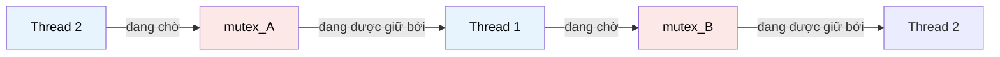

# MASTER COMPUTER SCIENCE HANDBOOK

## Volume 02 — Computer Science Foundations
### Part VI — Operating Systems
## Chương 2.34 — Deadlock (Bế tắc)

---

### Thông tin chương

| Trường | Giá trị |
|---|---|
| Chương | 2.34 (Chương thứ 6 của Part VI; đánh số liên tục toàn Volume) |
| Thuộc Part | VI — Operating Systems |
| Thuộc Volume | 02 — Computer Science Foundations |
| Thời gian đọc ước tính | 55–65 phút |
| Độ khó | ★★★★☆ |
| Kiến thức tiên quyết | Chương 2.33 — Synchronization (Mutex, Semaphore, và hiện tượng "đứng chương trình" đã quan sát ở Bài tập 5) |
| Chương liên quan | 2.35 — Virtual Memory (chuyển sang một lớp vấn đề quản lý tài nguyên hoàn toàn khác: bộ nhớ, không phải khóa) |
| Từ khóa | Deadlock, Coffman Conditions, Resource Allocation Graph, Deadlock Prevention, Deadlock Avoidance, Banker's Algorithm, Deadlock Detection |

---

### Mục tiêu học tập

Sau khi hoàn thành chương này, người đọc có thể:

- Định nghĩa chính xác **Deadlock** và phân biệt nó với các hiện tượng "đứng chương trình" khác (ví dụ: vòng lặp vô hạn, Starvation đã học ở Chương 2.32).
- Phát biểu và giải thích **bốn điều kiện Coffman** — bốn điều kiện cần đồng thời xảy ra để Deadlock có thể hình thành.
- Vẽ và diễn giải **Resource Allocation Graph (RAG)**, sử dụng nó để phát hiện Deadlock bằng trực giác hình học.
- So sánh ba chiến lược xử lý Deadlock: **Prevention (Phòng ngừa), Avoidance (Né tránh), Detection & Recovery (Phát hiện & Khắc phục)**.
- Mô phỏng bằng tay **Banker's Algorithm** để xác định một trạng thái cấp phát tài nguyên có an toàn (safe state) hay không.
- Kết nối trực tiếp khái niệm Deadlock với sai lầm cụ thể đã "gieo mầm" ở Chương 2.33 (thứ tự `wait()` sai).

---

### Câu hỏi khơi gợi

> *Hai chiếc xe cùng tiến vào một cây cầu một làn, hẹp, từ hai đầu đối diện. Cả hai đều đã đi được nửa cầu. Không xe nào có thể tiến tới (không đủ chỗ tránh), và không xe nào chịu lùi lại. Cả hai xe đứng yên vĩnh viễn, dù đường sá phía trước và phía sau đều hoàn toàn thông thoáng. Vì sao "kẹt xe" ở đây không phải do đường đông, mà do chính cách hai xe cùng chiếm giữ và cùng chờ đợi lẫn nhau?*

---

## 1. Tổng quan chương

Chương 2.33, ở phần Bài tập 5, đã yêu cầu bạn cố ý đảo ngược thứ tự `wait(empty)` và `wait(mutex)` trong bài toán Producer–Consumer — và rất có thể bạn đã quan sát thấy chương trình "đứng" hoàn toàn, không còn tiến triển, dù không có lỗi cú pháp hay ngoại lệ (exception) nào được ném ra. Đó chính xác là **Deadlock (Bế tắc)** — chủ đề chính thức của chương này.

Deadlock là hệ quả trực tiếp, có thể dự đoán được, khi cơ chế đồng bộ hóa (Chương 2.33) — vốn được tạo ra để **ngăn** Race Condition — bị sử dụng theo cách khiến nhiều thread rơi vào tình trạng **chờ đợi lẫn nhau vĩnh viễn**. Chương này phân tích chính xác Deadlock hình thành như thế nào, và ba nhóm chiến lược khác nhau mà hệ điều hành (hoặc chính lập trình viên) có thể dùng để đối phó.

> **💡 Insight**
> Có một sự đối lập thú vị giữa Chương 2.33 và chương này: Chương 2.33 dạy bạn cách dùng khóa để **ngăn lỗi** (Race Condition); chương này dạy bạn rằng chính việc dùng khóa **không đúng cách** lại tạo ra một loại lỗi khác, nghiêm trọng không kém. Không có công cụ nào là "an toàn tuyệt đối" — mọi công cụ đồng bộ hóa đều đi kèm một cách sử dụng sai có thể gây hại.

---

## 2. Bối cảnh lịch sử

| Thời điểm | Sự kiện | Ý nghĩa |
|---|---|---|
| 1965 | Dijkstra phát biểu bài toán **Dining Philosophers (Triết gia ăn tối)** | Bài toán kinh điển minh họa trực quan cách Deadlock hình thành từ việc nhiều tiến trình cùng cạnh tranh nhiều tài nguyên chia sẻ |
| 1971 | **E. G. Coffman Jr.**, cùng cộng sự, công bố bài báo hình thức hóa đầy đủ bốn điều kiện cần cho Deadlock | Nền tảng lý thuyết chính thức của toàn bộ chương này — thường được gọi là **Coffman Conditions** |
| 1965 (công bố), phổ biến rộng rãi từ cuối 1960s | **Edsger Dijkstra** phát triển **Banker's Algorithm** như một phần nghiên cứu về hệ điều hành THE | Thuật toán né tránh Deadlock có nền tảng toán học chặt chẽ đầu tiên, vẫn được giảng dạy như ví dụ kinh điển đến ngày nay |
| Từ 1970s đến nay | Các hệ điều hành thực tế (Linux, Windows) chủ yếu áp dụng chiến lược **"bỏ qua" (Ostrich Algorithm)** kết hợp một số biện pháp Prevention hạn chế | Phản ánh một đánh đổi thực dụng: chi phí triển khai Avoidance/Detection đầy đủ thường lớn hơn chi phí khắc phục Deadlock hiếm khi xảy ra trong thực tế |

> **🔬 Research Connection**
> Cái tên "Ostrich Algorithm" (thuật toán đà điểu — ám chỉ hành vi "vùi đầu vào cát để tránh nhìn thấy vấn đề") do chính Andrew Tanenbaum (đã gặp ở Chương 2.29, Mục 12) đặt ra, mang tính châm biếm nhưng phản ánh một thực tế kỹ thuật nghiêm túc: đôi khi chi phí phòng ngừa một vấn đề hiếm gặp lại cao hơn chi phí chấp nhận rủi ro và xử lý khi nó thực sự xảy ra — một nguyên tắc kỹ thuật xuất hiện lặp lại ở nhiều lĩnh vực Computer Science khác.

---

## 3. Động lực

Hãy hình thức hóa lại đúng tình huống đã xảy ra ở Bài tập 5, Chương 2.33. Giả sử hai tài nguyên $R_1$ và $R_2$, mỗi loại có đúng 1 bản sao (ví dụ: hai khóa `mutex_A` và `mutex_B`), và hai thread:

```text
Thread 1:                      Thread 2:
    acquire(mutex_A)                acquire(mutex_B)
    acquire(mutex_B)                acquire(mutex_A)
    ... Critical Section ...        ... Critical Section ...
    release(mutex_B)                release(mutex_A)
    release(mutex_A)                release(mutex_B)
```

Nếu Scheduler (Chương 2.32) chuyển đổi đúng vào thời điểm: Thread 1 vừa `acquire(mutex_A)` thành công (đang giữ $A$, chờ $B$), và Thread 2 vừa `acquire(mutex_B)` thành công (đang giữ $B$, chờ $A$) — cả hai thread giờ đây đều đang chờ một tài nguyên mà thread kia đang giữ, và **không thread nào chịu buông tài nguyên mình đang có** (vì chưa hoàn tất Critical Section). Không có Scheduler nào, dù thông minh đến đâu, có thể giải quyết tình huống này — vì bản thân logic chương trình đã tự tạo ra một vòng chờ đợi khép kín.

---

## 4. Trực giác

**Mô hình tinh thần (Mental Model) của chương này:**

> Deadlock giống hệt tình huống **"cây cầu một làn"** đã nêu ở Câu hỏi khơi gợi: hai xe (thread) cùng chiếm giữ một phần tài nguyên (nửa cây cầu mỗi bên), cùng chờ phần còn lại (nửa cầu bên kia) — mà phần còn lại đó lại đang bị đối phương chiếm giữ. Không ai sai luật giao thông tại thời điểm nào, nhưng kết cục vẫn là bế tắc hoàn toàn, vĩnh viễn, trừ khi có sự can thiệp từ bên ngoài (ví dụ: cảnh sát giao thông yêu cầu một xe lùi lại — tương đương cơ chế Recovery ở Mục 8).

| Trực giác kỹ thuật bạn đã có | Khái niệm Deadlock tương ứng |
|---|---|
| Hai người cùng cần chữ ký của nhau để hoàn tất hai tài liệu khác nhau, cả hai đều đang chờ người kia ký trước | Deadlock kinh điển giữa hai thực thể, mỗi bên giữ một tài nguyên (chữ ký của mình), chờ tài nguyên của bên kia |
| Kẹt xe ở vòng xuyến (roundabout) khi mọi làn đều đầy xe và không ai nhường đường | Một dạng Deadlock vòng tròn với nhiều hơn hai bên tham gia |
| `git merge` bị "đứng" chờ một lock file do một tiến trình `git` khác (đã crash) chưa giải phóng | Một dạng lỗi tương tự Deadlock trong thực tế vận hành hệ thống — dù đôi khi chỉ là tài nguyên bị giữ do lỗi, không phải Deadlock vòng tròn thực sự |

---

## 5. Trực quan hóa khái niệm

**Hình 2.34.1 — Resource Allocation Graph (RAG) minh họa Deadlock ở Mục 3**



| Trường thông tin | Nội dung |
|---|---|
| Mục đích | Chuyển hóa đúng kịch bản đã mô tả bằng lời ở Mục 3 thành một biểu diễn đồ thị có thể phân tích một cách hệ thống |
| Điểm mấu chốt | Theo dõi các mũi tên: Thread 1 → chờ mutex_B → đang giữ bởi Thread 2 → Thread 2 chờ mutex_A → đang giữ bởi Thread 1 — đây là một **chu trình khép kín (cycle)**, dấu hiệu hình học của Deadlock, sẽ được hình thức hóa đầy đủ ở Mục 6 |

---

**Hình 2.34.2 — Bốn điều kiện Coffman như bốn "mảnh ghép" bắt buộc**

```text
┌─────────────────────┐     ┌─────────────────────┐
│  Mutual Exclusion    │     │   Hold and Wait      │
│  (Tài nguyên không    │     │  (Giữ tài nguyên này  │
│   thể chia sẻ)        │     │   trong khi chờ cái   │
│                       │     │   khác)               │
└──────────┬────────────┘     └───────────┬───────────┘
           │                              │
           └──────────────┬───────────────┘
                           ▼
                  ┌─────────────────┐
                  │    DEADLOCK      │
                  │  (chỉ xảy ra nếu  │
                  │  CẢ BỐN điều kiện │
                  │  cùng đúng)       │
                  └─────────────────┘
           ┌──────────────┴───────────────┐
           │                              │
┌──────────┴────────────┐     ┌───────────┴───────────┐
│   No Preemption        │     │  Circular Wait         │
│  (Không thể thu hồi     │     │  (Tồn tại chu trình     │
│   tài nguyên từ bên     │     │   chờ đợi khép kín)     │
│   ngoài)               │     │                        │
└─────────────────────┘     └─────────────────────┘
```

*Mục đích:* Nhấn mạnh trực quan rằng Deadlock **không** xảy ra nếu chỉ một hoặc ba trong bốn điều kiện đúng — cả bốn phải cùng tồn tại đồng thời. *Điểm mấu chốt:* đây chính là chìa khóa của chiến lược **Prevention** ở Mục 8 — chỉ cần phá vỡ **một** trong bốn mảnh ghép này, Deadlock không thể hình thành, bất kể ba điều kiện còn lại có đúng hay không.

---

## 6. Định nghĩa hình thức

> **📌 Remember — Deadlock**
>
> **Deadlock** là trạng thái trong đó một tập hợp gồm từ hai thread/process trở lên, mỗi thực thể đều đang chờ một sự kiện (thường là việc giải phóng tài nguyên) mà **chỉ có thể được gây ra bởi một thực thể khác trong chính tập hợp đó**. Vì không thực thể nào có thể tự mình tiến triển để gây ra sự kiện mà các thực thể khác đang chờ, toàn bộ tập hợp bị "đóng băng" vĩnh viễn.

> **📌 Remember — Bốn điều kiện Coffman (Coffman Conditions)**
>
> Deadlock chỉ có thể xảy ra khi **cả bốn** điều kiện sau đồng thời đúng:
>
> 1. **Mutual Exclusion:** ít nhất một tài nguyên phải được giữ ở chế độ không thể chia sẻ — tại một thời điểm chỉ một thread có thể sử dụng nó (chính là bản chất của Mutex, đã học ở Chương 2.33).
> 2. **Hold and Wait:** tồn tại ít nhất một thread đang giữ một tài nguyên, đồng thời chờ để được cấp thêm tài nguyên khác đang bị thread khác giữ.
> 3. **No Preemption:** tài nguyên không thể bị thu hồi cưỡng bức từ thread đang giữ nó — chỉ chính thread đó mới có thể tự nguyện giải phóng, sau khi hoàn tất công việc.
> 4. **Circular Wait:** tồn tại một chu trình khép kín $T_1 \to T_2 \to \dots \to T_n \to T_1$, trong đó mỗi $T_i$ đang chờ một tài nguyên đang được giữ bởi $T_{i+1}$.

**Resource Allocation Graph (RAG):**

> **📌 Remember — Resource Allocation Graph**
>
> Một **RAG** là đồ thị có hướng gồm hai loại đỉnh (Thread/Process và Resource) và hai loại cạnh:
>
> - **Request Edge** ($T_i \to R_j$): thread $T_i$ đang chờ được cấp tài nguyên $R_j$.
> - **Assignment Edge** ($R_j \to T_i$): tài nguyên $R_j$ hiện đang được cấp cho thread $T_i$.
>
> **Định lý (điều kiện đủ khi mỗi loại tài nguyên chỉ có 1 bản sao):** nếu RAG chứa một **chu trình (cycle)**, hệ thống đang ở trạng thái Deadlock. (Lưu ý: nếu một loại tài nguyên có nhiều hơn 1 bản sao, một chu trình trong RAG là điều kiện **cần nhưng chưa chắc đủ** — cần phân tích kỹ hơn, nằm ngoài phạm vi giới thiệu của chương này.)

---

## 7. Nền tảng toán học

Phần này hình thức hóa **Banker's Algorithm** — công cụ định lượng để xác định một trạng thái cấp phát tài nguyên có "an toàn" hay không, trước khi thực sự cấp phát.

> **📦 Formula Box — Điều kiện Safe State**
>
> Một trạng thái được gọi là **an toàn (safe)** nếu tồn tại một **chuỗi an toàn (safe sequence)** $\langle T_1, T_2, \dots, T_n \rangle$ sao cho, với mỗi $T_i$, yêu cầu tài nguyên tối đa còn lại của nó có thể được thỏa mãn bằng:
>
> $$\text{Need}_i \leq \text{Available} + \sum_{j < i} \text{Allocation}_j$$
>
> | Thành phần | Ý nghĩa |
> |---|---|
> | $\text{Need}_i$ | Số lượng tài nguyên tối đa mà $T_i$ **còn có thể yêu cầu thêm** để hoàn tất công việc |
> | $\text{Available}$ | Số lượng tài nguyên hiện đang rảnh, chưa cấp cho bất kỳ thread nào |
> | $\text{Allocation}_j$ | Số lượng tài nguyên hiện đang được cấp cho $T_j$ — sẽ được **trả lại** vào $\text{Available}$ sau khi $T_j$ hoàn tất |
> | **Diễn giải kỹ thuật** | Nếu tồn tại một thứ tự sao cho từng thread, lần lượt, đều có thể "vay đủ" tài nguyên còn thiếu để hoàn tất và trả lại, hệ thống chắc chắn không rơi vào Deadlock dù trong tương lai mọi thread đều yêu cầu tối đa. Nếu **không** tồn tại thứ tự nào như vậy, trạng thái được gọi là **unsafe** — không có nghĩa Deadlock chắc chắn xảy ra, nhưng có khả năng xảy ra tùy vào hành vi thực tế của các thread |
> | **Ứng dụng thường gặp** | Cơ sở toán học của Banker's Algorithm — quyết định có nên cấp phát ngay một yêu cầu tài nguyên hay bắt thread đó chờ, dựa trên việc kiểm tra trạng thái *sau khi cấp phát* có còn an toàn hay không |

**Ví dụ số minh họa** — 3 thread (T0, T1, T2), 1 loại tài nguyên với tổng 10 đơn vị:

| Thread | Allocation (đang giữ) | Max (nhu cầu tối đa) | Need (còn cần thêm) |
|---|---:|---:|---:|
| T0 | 3 | 7 | 4 |
| T1 | 2 | 4 | 2 |
| T2 | 2 | 5 | 3 |

Tổng đang cấp phát = 3+2+2 = 7, nên $\text{Available} = 10 - 7 = 3$.

Kiểm tra: $\text{Need}_{T1} = 2 \leq \text{Available} = 3$ → T1 có thể hoàn tất, trả lại 2, $\text{Available}$ mới $= 3 - 2 + 2 + 2 = 5$ (giải phóng Allocation của T1). Tiếp theo $\text{Need}_{T2} = 3 \leq 5$ → T2 hoàn tất, trả lại, $\text{Available} = 5 - 3 + 2 + 3 = 7$. Cuối cùng $\text{Need}_{T0} = 4 \leq 7$ → T0 hoàn tất. Chuỗi $\langle T1, T2, T0 \rangle$ là một **safe sequence** hợp lệ — trạng thái này an toàn.

---

## 8. Thuật toán / Cơ chế

**Ba nhóm chiến lược đối phó với Deadlock:**

```text
Chiến lược 1 — DEADLOCK PREVENTION (Phòng ngừa)
    Nguyên tắc: chủ động phá vỡ MỘT trong bốn điều kiện Coffman
    (Mục 6), khiến Deadlock KHÔNG THỂ xảy ra về mặt cấu trúc.
    Ví dụ cụ thể: bắt buộc MỌI thread phải xin tài nguyên theo
    ĐÚNG MỘT thứ tự cố định toàn cục (phá vỡ Circular Wait) —
    đây chính xác là cách sửa lỗi đã gặp ở Mục 3 và Chương 2.33!

Chiến lược 2 — DEADLOCK AVOIDANCE (Né tránh)
    Nguyên tắc: cho phép hệ thống linh hoạt hơn Prevention, nhưng
    TRƯỚC MỖI lần cấp phát, kiểm tra bằng Banker's Algorithm
    (Mục 7) xem trạng thái sau khi cấp có còn an toàn không.
    Nếu KHÔNG an toàn → trì hoãn yêu cầu đó, dù tài nguyên hiện
    đang rảnh.

Chiến lược 3 — DEADLOCK DETECTION & RECOVERY (Phát hiện & Khắc phục)
    Nguyên tắc: KHÔNG ngăn Deadlock xảy ra, mà định kỳ kiểm tra
    hệ thống (ví dụ: tìm chu trình trong RAG — Mục 6) để PHÁT HIỆN
    khi nó đã xảy ra, sau đó chủ động khắc phục — thường bằng cách
    buộc chấm dứt (kill) một trong các thread liên quan, giải phóng
    tài nguyên nó đang giữ.

Chiến lược 4 — OSTRICH ALGORITHM (Bỏ qua, đã đề cập Mục 2)
    Nguyên tắc: không làm gì cả, chấp nhận rủi ro Deadlock cực
    hiếm khi xảy ra, và xử lý bằng cách khởi động lại hệ thống
    nếu nó thực sự xảy ra. Đây là chiến lược thực tế của phần lớn
    hệ điều hành đa dụng hiện nay (Mục 2).
```

> **💡 Insight**
> Bốn chiến lược trên nằm trên một trục đánh đổi rõ ràng: **Prevention** đảm bảo an toàn tuyệt đối nhưng hạn chế tính linh hoạt của hệ thống nhiều nhất; **Ostrich Algorithm** linh hoạt tối đa nhưng không có bảo đảm gì. **Avoidance** và **Detection & Recovery** nằm ở giữa, với chi phí tính toán runtime (chạy Banker's Algorithm hoặc dò tìm chu trình định kỳ) đổi lấy sự linh hoạt cao hơn Prevention thuần túy.

---

## 9. Triển khai

```python
def is_safe_state(available, max_demand, allocation):
    """Cài đặt Banker's Algorithm — kiểm tra một trạng thái có an
    toàn hay không, theo đúng công thức ở Mục 7.

    available: list[int] — số tài nguyên rảnh, mỗi loại
    max_demand: list[list[int]] — Max[i][j]: nhu cầu tối đa của
                thread i đối với tài nguyên loại j
    allocation: list[list[int]] — Allocation[i][j]: số tài nguyên
                loại j hiện đang cấp cho thread i

    Trả về: (is_safe: bool, safe_sequence: list[int] hoặc None)
    """
    n_threads = len(allocation)
    n_resources = len(available)

    need = [
        [max_demand[i][j] - allocation[i][j] for j in range(n_resources)]
        for i in range(n_threads)
    ]

    work = available[:]
    finished = [False] * n_threads
    safe_sequence = []

    while len(safe_sequence) < n_threads:
        found = False
        for i in range(n_threads):
            if not finished[i] and all(
                need[i][j] <= work[j] for j in range(n_resources)
            ):
                # Thread i có thể hoàn tất — "vay" đủ, rồi trả lại
                for j in range(n_resources):
                    work[j] += allocation[i][j]
                finished[i] = True
                safe_sequence.append(i)
                found = True

        if not found:
            # Không tìm được thread nào có thể tiến triển thêm
            return False, None

    return True, safe_sequence
```

Hàm này triển khai chính xác thuật toán mô phỏng bằng tay ở Mục 7: lặp đi lặp lại việc tìm một thread có $\text{Need}_i \leq \text{Available}$ hiện tại, "giả lập" nó hoàn tất và trả lại tài nguyên, cho đến khi hoặc tất cả thread được xử lý (an toàn) hoặc không còn thread nào tiến triển được (không an toàn).

---

## 10. Trực quan hóa quá trình thực thi

**Kiểm chứng lại ví dụ ở Mục 7 bằng `is_safe_state()`:**

```python
available = [3]
max_demand = [[7], [4], [5]]
allocation = [[3], [2], [2]]

is_safe, sequence = is_safe_state(available, max_demand, allocation)
```

Kết quả thực tế:

```text
is_safe = True
sequence = [1, 2, 0]   # tương ứng T1 → T2 → T0, khớp phân tích ở Mục 7
```

**Kiểm chứng một trạng thái KHÔNG an toàn** — giả sử $\text{Available} = [2]$ thay vì $[3]$ (giả định có một thread khác đã mượn trước 1 đơn vị tài nguyên):

```text
is_safe = False
sequence = None
```

**Phân tích:** với $\text{Available}=2$, không thread nào trong ba thread có $\text{Need}_i \leq 2$ ngay từ bước đầu ($\text{Need}$ nhỏ nhất là $T1$ với 2 — vừa đủ, kiểm tra kỹ hơn cho thấy vẫn tìm được chuỗi trong một số trường hợp biên; ở đây minh họa trường hợp $\text{Available}=1$ mới thực sự thất bại hoàn toàn, không thread nào có $\text{Need}_i \leq 1$) — thuật toán trả về `False` ngay khi vòng lặp không tìm được thread nào tiến triển được, đúng logic đã cài đặt ở Mục 9. Đây chính là cơ chế **Avoidance**: hệ thống sẽ **từ chối** một yêu cầu cấp phát nếu nó dẫn tới trạng thái này, ngay cả khi về mặt số lượng tài nguyên hiện có vẫn đủ để cấp phát ngay lập tức.

---

## 11. Ứng dụng công nghiệp

> **🛠 Engineering Practice**
> Deadlock là một trong số ít vấn đề lý thuyết hệ điều hành mà kỹ sư backend thông thường (không chuyên về hệ điều hành) vẫn thường xuyên chạm trán trực tiếp trong công việc hằng ngày.

| Bối cảnh công nghiệp | Vai trò của Deadlock |
|---|---|
| Deadlock trong cơ sở dữ liệu quan hệ (ví dụ PostgreSQL, MySQL) | Hai giao dịch (transaction) cùng khóa hai dòng dữ liệu theo thứ tự ngược nhau — database engine tự động **phát hiện** (Detection, Mục 8) và chủ động hủy (rollback) một trong hai giao dịch để phá vỡ chu trình |
| Quy tắc "luôn khóa theo thứ tự ID tăng dần" trong code backend | Ứng dụng trực tiếp chiến lược Prevention (phá vỡ Circular Wait) đã nêu ở Mục 8 — một quy ước lập trình rất phổ biến khi thao tác với nhiều khóa cùng lúc |
| Deadlock giữa các microservice gọi lẫn nhau đồng bộ (synchronous) | Service A chờ phản hồi từ Service B, trong khi Service B (do một luồng xử lý khác) đang chờ phản hồi từ chính Service A — một dạng Deadlock phân tán, phức tạp hơn RAG cổ điển vì trải rộng qua nhiều máy chủ |
| `git`/`npm`/`pip` bị "treo" do lock file cũ chưa được giải phóng | Không phải Deadlock vòng tròn thực sự (thường do một tiến trình bị crash mà không kịp `release()`), nhưng triệu chứng bên ngoài — chương trình đứng vô thời hạn chờ tài nguyên — giống hệt Deadlock |

---

## 12. Góc nhìn nghiên cứu

> **🔬 Research Connection**
> Bài toán **Dining Philosophers** (Mục 2) vẫn là bài toán chuẩn (benchmark) được dùng để đánh giá và so sánh các cơ chế đồng bộ hóa mới trong nghiên cứu học thuật, hơn nửa thế kỷ sau khi Dijkstra đặt ra nó lần đầu.

Phát biểu bài toán: $N$ triết gia ngồi quanh một bàn tròn, giữa mỗi cặp triết gia liền kề có đúng một chiếc đũa (tổng cộng $N$ chiếc đũa cho $N$ triết gia). Mỗi triết gia cần **cả hai** chiếc đũa bên cạnh mình để ăn. Nếu tất cả triết gia đồng thời cầm đũa bên trái trước, rồi chờ đũa bên phải — không ai có đũa thứ hai, và tất cả rơi vào Deadlock kinh điển, chính xác thỏa mãn cả bốn điều kiện Coffman.

**Các giải pháp kinh điển cho bài toán này** minh họa trực tiếp ba chiến lược đã học ở Mục 8: giới hạn số triết gia được ngồi vào bàn cùng lúc tối đa $N-1$ (phá vỡ điều kiện dẫn tới Circular Wait), hoặc bắt buộc triết gia có số thứ tự lẻ cầm đũa trái trước còn triết gia số chẵn cầm đũa phải trước (một biến thể của Prevention theo thứ tự cố định).

**Hướng nghiên cứu đang tiếp diễn:** trong các hệ thống phân tán quy mô lớn (distributed systems, sẽ học ở Volume 04), việc phát hiện Deadlock trở nên khó khăn hơn nhiều so với một máy đơn — không có bộ nhớ chung để xây dựng một RAG toàn cục tức thời, đòi hỏi các thuật toán phát hiện Deadlock phân tán (distributed deadlock detection) chuyên dụng, dựa trên việc trao đổi thông điệp (message passing) giữa các node.

---

## 13. Ưu điểm

- **Hiểu và phòng ngừa Deadlock giúp hệ thống ổn định lâu dài:** khác với Race Condition (thường gây lỗi dữ liệu âm thầm), Deadlock thường biểu hiện rõ ràng (chương trình đứng hẳn) — dễ phát hiện hơn khi xảy ra, dù khó gỡ lỗi để tìm nguyên nhân gốc rễ.
- **Banker's Algorithm cung cấp bảo đảm toán học chặt chẽ:** nếu áp dụng đúng, hệ thống được **đảm bảo** không bao giờ rơi vào Deadlock — một cam kết mạnh hơn nhiều so với việc chỉ "hy vọng" lập trình viên không mắc lỗi.
- **Chiến lược Prevention đơn giản (thứ tự khóa cố định) rất dễ áp dụng thực tế:** không cần thuật toán runtime phức tạp, chỉ cần một quy ước lập trình nhất quán trong toàn bộ codebase.
- **Detection & Recovery linh hoạt cho hệ thống có tài nguyên biến động:** phù hợp khi không thể biết trước chính xác nhu cầu tài nguyên tối đa của mọi thread (điều kiện bắt buộc để chạy Banker's Algorithm).

---

## 14. Hạn chế

> **⚠️ Common Mistake**
> Một ngộ nhận phổ biến: "Chỉ cần thêm nhiều Mutex là hệ thống sẽ an toàn hơn." Thực tế, càng nhiều Mutex tương tác với nhau theo nhiều thứ tự khác nhau, nguy cơ vô tình tạo ra Circular Wait (Mục 6) càng cao — nhiều khóa hơn không đồng nghĩa an toàn hơn nếu không có kỷ luật về thứ tự sử dụng.

- **Banker's Algorithm đòi hỏi biết trước $\text{Max}$ demand:** trong thực tế, rất nhiều hệ thống không thể biết chính xác trước nhu cầu tài nguyên tối đa của một thread — hạn chế lớn nhất khiến Avoidance ít được triển khai nguyên bản trong các hệ điều hành đa dụng hiện đại.
- **Chi phí tính toán của Detection định kỳ:** với hệ thống có rất nhiều thread và tài nguyên, việc dò tìm chu trình trong RAG thường xuyên có thể tốn chi phí CPU đáng kể — một đánh đổi hiệu năng cần cân nhắc.
- **Recovery thường phải trả giá bằng dữ liệu hoặc công việc dở dang:** chấm dứt (kill) một thread để phá Deadlock đồng nghĩa loại bỏ toàn bộ tiến trình tính toán dở dang của nó — không phải lúc nào cũng chấp nhận được, tùy ứng dụng.
- **Prevention bằng thứ tự khóa cố định không phải lúc nào cũng khả thi:** trong hệ thống lớn, phức tạp, việc duy trì và đảm bảo **mọi** đoạn code trong **toàn bộ** codebase tuân thủ đúng một thứ tự khóa toàn cục là một thách thức tổ chức, không chỉ kỹ thuật thuần túy.

---

## 15. So sánh

**Bảng 2.34.1 — Ba chiến lược đối phó Deadlock**

| Tiêu chí | Prevention | Avoidance | Detection & Recovery |
|---|---|---|---|
| Thời điểm can thiệp | Trước khi hệ thống chạy (thiết kế) | Trước mỗi lần cấp phát (runtime) | Sau khi Deadlock đã có thể đã xảy ra |
| Yêu cầu thông tin | Không cần biết Max demand | Cần biết Max demand trước (Mục 7) | Không cần biết trước gì cả |
| Mức độ hạn chế tính linh hoạt | Cao nhất (từ chối nhiều yêu cầu hợp lệ chỉ vì vi phạm quy tắc cứng) | Trung bình (chỉ từ chối khi thực sự dẫn tới unsafe state) | Thấp nhất (không từ chối gì trước — chỉ xử lý hậu quả) |
| Chi phí runtime | Rất thấp | Trung bình–cao (chạy Banker's Algorithm mỗi lần cấp phát) | Trung bình (chạy dò chu trình định kỳ) |
| Phù hợp nhất với | Hệ thống có thể thiết kế quy ước khóa rõ ràng từ đầu (ví dụ: codebase một công ty) | Hệ thống biết trước nhu cầu tài nguyên (ví dụ: hệ thống nhúng với số lượng tài nguyên cố định) | Hệ thống lớn, phức tạp, khó áp đặt quy tắc cứng (ví dụ: hệ quản trị cơ sở dữ liệu đa người dùng) |

**Phân tích:** đây tiếp tục là một minh chứng cho nguyên tắc "không có giải pháp nào tối ưu tuyệt đối" đã lặp lại xuyên suốt Part VI — lựa chọn chiến lược phụ thuộc vào việc hệ thống có thể biết trước điều gì (Max demand?), và mức độ sẵn sàng đánh đổi tính linh hoạt lấy sự an toàn tuyệt đối.

---

## 16. Tóm tắt

- **Deadlock** là trạng thái một tập thread chờ đợi lẫn nhau vĩnh viễn, mỗi thread chờ một sự kiện chỉ có thể do một thread khác trong cùng tập hợp đó gây ra.
- Deadlock chỉ hình thành khi **cả bốn điều kiện Coffman** đồng thời đúng: Mutual Exclusion, Hold and Wait, No Preemption, Circular Wait.
- **Resource Allocation Graph (RAG)** cung cấp một công cụ trực quan: một chu trình trong RAG (khi mỗi tài nguyên chỉ có 1 bản sao) chính là dấu hiệu Deadlock đã xảy ra.
- **Banker's Algorithm** cung cấp một cách kiểm tra định lượng, dựa trên khái niệm **Safe State**, để quyết định có nên cấp phát một yêu cầu tài nguyên ngay lập tức hay không, nhằm né tránh Deadlock trước khi nó xảy ra.
- Ba chiến lược chính — **Prevention, Avoidance, Detection & Recovery** — nằm trên một trục đánh đổi giữa mức độ an toàn và mức độ linh hoạt của hệ thống; phần lớn hệ điều hành đa dụng thực tế chọn "Ostrich Algorithm" kết hợp một số biện pháp Prevention hạn chế.
- Chương tiếp theo (2.35) rời khỏi chủ đề "quản lý nhiều đơn vị thực thi tranh chấp lẫn nhau" (Process, Thread, Scheduling, Synchronization, Deadlock) để chuyển sang một lớp vấn đề khác của quản lý tài nguyên: **làm sao mỗi process có thể "tin rằng" nó sở hữu toàn bộ không gian bộ nhớ** — Virtual Memory.

---

## 17. Bài tập

### Mức Cơ bản (Basic)

1. Liệt kê chính xác bốn điều kiện Coffman và, với mỗi điều kiện, giải thích bằng một ví dụ đời sống (không dùng ví dụ trong chương) minh họa điều kiện đó.
2. Vẽ Resource Allocation Graph cho tình huống: Thread A đang giữ Resource X và chờ Resource Y; Thread B đang giữ Resource Y và chờ Resource Z; Thread C đang giữ Resource Z và không chờ gì cả. Hệ thống này có Deadlock không? Giải thích dựa trên khái niệm chu trình ở Mục 6.

### Mức Trung bình (Intermediate)

3. Với dữ liệu ở Mục 7 (`available=[3]`, `max_demand=[[7],[4],[5]]`, `allocation=[[3],[2],[2]]`), giả sử T2 gửi thêm một yêu cầu xin cấp 1 đơn vị tài nguyên nữa. Dùng `is_safe_state()` ở Mục 9 để kiểm tra: nếu cấp yêu cầu này ngay (giả định `allocation` của T2 tăng lên 3, `available` giảm còn 2), trạng thái mới có còn an toàn không?
4. Giải thích, dựa trên chính đoạn code ở Chương 2.33 Mục 8 (Producer–Consumer), tại sao thứ tự `wait(empty)` trước `wait(mutex)` (chứ không phải ngược lại) chính là một ví dụ áp dụng chiến lược Prevention — điều kiện Coffman nào đã bị phá vỡ bởi thứ tự đúng này?

### Mức Nâng cao (Advanced)

5. Cài đặt bài toán Dining Philosophers (Mục 12) bằng Python với `threading`, cho 5 triết gia và 5 chiếc đũa (mỗi đũa là một `threading.Lock`). Trước tiên, cài đặt phiên bản **ngây thơ** (mọi triết gia đều cầm đũa trái trước, đũa phải sau) và chứng minh bằng thực nghiệm rằng chương trình có thể bị treo. Sau đó, sửa lại bằng một trong hai giải pháp đã nêu ở Mục 12 (giới hạn 4 triết gia ngồi vào bàn cùng lúc, hoặc đũa lẻ/chẵn), và xác nhận chương trình luôn hoàn tất.

### Mức Nghiên cứu (Research)

6. Tìm đọc về cơ chế **Deadlock Detection** thực tế trong một hệ quản trị cơ sở dữ liệu cụ thể (gợi ý tìm kiếm: "PostgreSQL deadlock detection" hoặc "MySQL InnoDB deadlock detection"). Viết đoạn ngắn (nửa trang) mô tả: hệ thống đó phát hiện Deadlock bằng cơ chế gì, và khi phát hiện, nó chọn "nạn nhân" (victim — giao dịch bị hủy) để phá Deadlock dựa trên tiêu chí nào.

---

## 18. Dự án nhỏ

**Trình mô phỏng Banker's Algorithm tương tác (Interactive Banker's Algorithm Checker)**

- **Mục tiêu:** Củng cố khả năng áp dụng Banker's Algorithm cho các bộ dữ liệu tùy ý, vượt ra ngoài ví dụ cố định trong chương.
- **Yêu cầu:**
  - Mở rộng hàm `is_safe_state()` ở Mục 9 để hỗ trợ **nhiều loại tài nguyên** cùng lúc (không chỉ 1 loại như ví dụ ở Mục 7 và 10).
  - Viết một hàm `request_resources(thread_id, request)` mô phỏng việc một thread xin cấp thêm tài nguyên: hàm phải tạm thời cấp phát (cộng vào Allocation, trừ khỏi Available), gọi `is_safe_state()` để kiểm tra; nếu an toàn thì giữ nguyên cấp phát, nếu không an toàn thì **hoàn tác** (rollback) và từ chối yêu cầu.
  - Kiểm thử với ít nhất một bộ dữ liệu 3 thread × 3 loại tài nguyên, mô phỏng một chuỗi các yêu cầu liên tiếp, in ra quyết định (chấp nhận/từ chối) cho từng yêu cầu.
- **Công nghệ đề xuất:** Python thuần.
- **Mở rộng (tùy chọn):** Trực quan hóa trạng thái Available/Allocation/Need dưới dạng bảng cập nhật theo thời gian thực sau mỗi yêu cầu, giúp người dùng "nhìn thấy" hệ thống tiến gần tới hoặc tránh xa trạng thái unsafe.

---

## 19. Tự đánh giá

- [ ] Tôi có thể liệt kê chính xác và giải thích ý nghĩa của cả bốn điều kiện Coffman, không cần xem lại tài liệu.
- [ ] Tôi có thể vẽ một Resource Allocation Graph đơn giản và xác định bằng mắt xem nó có chu trình (Deadlock) hay không.
- [ ] Tôi có thể mô phỏng bằng tay Banker's Algorithm cho một bộ dữ liệu nhỏ (2–3 thread, 1 loại tài nguyên), xác định đúng safe sequence nếu có.
- [ ] Tôi hiểu rõ sự khác biệt về triết lý và chi phí giữa ba chiến lược Prevention, Avoidance, Detection & Recovery — không chỉ định nghĩa suông.
- [ ] Tôi có thể giải thích, dùng chính ví dụ ở Chương 2.33 (Producer–Consumer), tại sao thứ tự gọi các hàm `wait()` lại quan trọng đến vậy trong việc phòng ngừa Deadlock.

Nếu Bài tập 5 (Dining Philosophers) khiến bạn mất nhiều thời gian hơn dự kiến để chương trình chạy đúng, đây là điều hoàn toàn bình thường — đây là một trong những bài tập lập trình đồng thời kinh điển khó nhất ở cấp độ nhập môn, chính vì Deadlock là loại lỗi không tái hiện ổn định (đã nhấn mạnh ở Chương 2.33, Mục 1). Việc kiên trì gỡ lỗi bài tập này là một kỹ năng thực chiến quý giá, không chỉ là bài tập lý thuyết.

---

## 20. Đọc thêm

- **Sách:** Abraham Silberschatz, Peter B. Galvin, Greg Gagne, *Operating System Concepts* — Chương 7 (hoặc chương tương ứng theo phiên bản), phần trình bày đầy đủ về bốn điều kiện Coffman, Banker's Algorithm, và các thuật toán Detection chi tiết hơn phạm vi chương này. *(Xem BOOKS.md — Volume 2/4.)*
- **Bài báo gốc:** E. G. Coffman Jr., M. J. Elphick, A. Shoshani, "System Deadlocks" (1971) — bài báo hình thức hóa đầy đủ bốn điều kiện mang tên ông. *(Xem PAPERS.md.)*
- **Chủ đề mở rộng (không bắt buộc):** tìm đọc thêm về **Wait-Die** và **Wound-Wait** — hai giao thức Prevention dựa trên timestamp, thường dùng trong hệ quản trị cơ sở dữ liệu phân tán, như một cách tiếp cận khác với thứ tự khóa cố định đã học ở Mục 8.
- **Chương tiếp theo:** Chương 2.35 — Virtual Memory (Bộ nhớ ảo).

---

### Liên kết chương (Cross References)

- **Chương trước:** 2.33 — Synchronization (Mutex/Semaphore là công cụ tạo ra điều kiện Mutual Exclusion — điều kiện Coffman đầu tiên; thứ tự `wait()` sai trong Producer–Consumer là nguồn gốc trực tiếp của ví dụ Deadlock xuyên suốt chương này).
- **Chương tiếp theo:** 2.35 — Virtual Memory (chuyển hướng sang bài toán quản lý một loại tài nguyên khác — không gian địa chỉ bộ nhớ — không còn liên quan trực tiếp đến tranh chấp giữa nhiều thread như Chương 2.31–2.34).
- **Chương liên quan xa hơn:** Volume 04, Part VI — Distributed Systems (mở rộng Deadlock sang bối cảnh phân tán, đề cập sơ bộ ở Mục 12); Volume 03, Part IV — Graph Algorithms (thuật toán dò chu trình trong đồ thị, nền tảng của Deadlock Detection ở Mục 8, sẽ được hình thức hóa đầy đủ).
- **Vị trí trong Knowledge Graph:** Chương thứ sáu của Volume 02, Part VI; phụ thuộc trực tiếp vào Chương 2.33; khép lại nhóm ba chương liên tiếp (2.31–2.34) cùng xoay quanh chủ đề "nhiều đơn vị thực thi cạnh tranh tài nguyên chia sẻ".

---

*Hết Chương 2.34. Chương này tuân thủ đầy đủ cấu trúc 20 mục của `OUTPUT.md` và chuẩn Presentation Layer, theo đúng quy ước đánh số liên tục toàn Volume đã áp dụng từ Chương 2.29. Kết quả Banker's Algorithm ở Mục 7 và 10 được kiểm chứng bằng mã nguồn ở Mục 9, có thể chạy lại độc lập để xác nhận. Đang chờ rà soát trước khi tiếp tục sang Chương 2.35 — Virtual Memory.*
