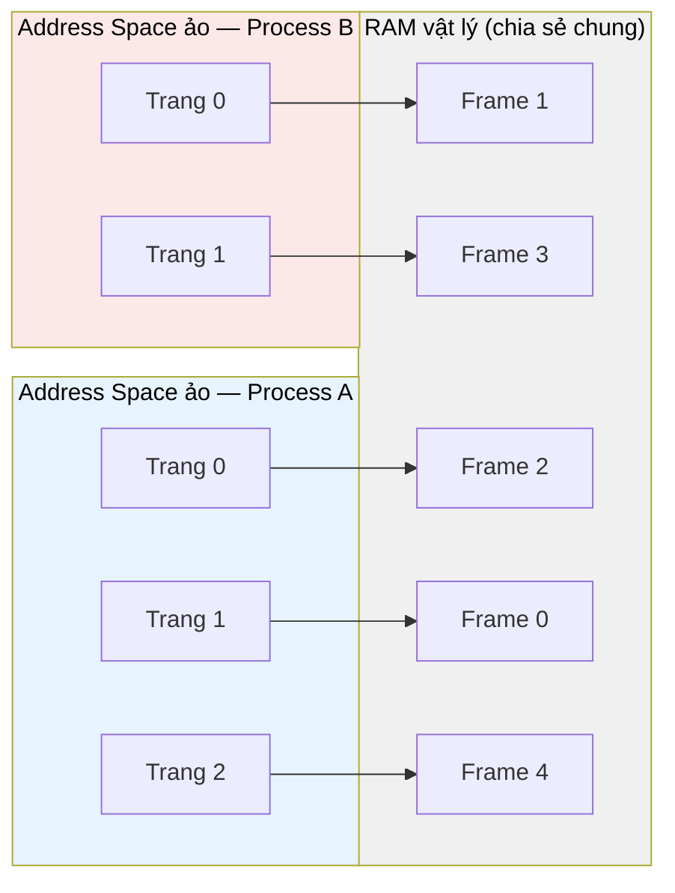
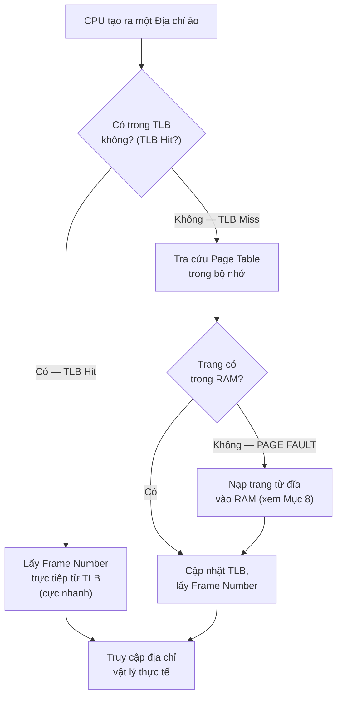

# MASTER COMPUTER SCIENCE HANDBOOK

## Volume 02 — Computer Science Foundations
### Part VI — Operating Systems
## Chương 2.35 — Virtual Memory (Bộ nhớ ảo)

---

### Thông tin chương

| Trường | Giá trị |
|---|---|
| Chương | 2.35 (Chương thứ 7 của Part VI; đánh số liên tục toàn Volume) |
| Thuộc Part | VI — Operating Systems |
| Thuộc Volume | 02 — Computer Science Foundations |
| Thời gian đọc ước tính | 60–70 phút |
| Độ khó | ★★★★☆ |
| Kiến thức tiên quyết | Chương 2.30 — Process (không gian địa chỉ riêng biệt của mỗi process); Volume 02, Part V — Computer Organization & Architecture (Memory Hierarchy, Cache — đặc biệt phần bàn về tốc độ truy cập RAM vs ổ đĩa) |
| Chương liên quan | 2.36 — File Systems (Virtual Memory và File System cùng là hai cơ chế quản lý "không gian lưu trữ", chỉ khác nhau về tính bền vững — persistence) |
| Từ khóa | Virtual Memory, Address Space, Paging, Page Table, Translation Lookaside Buffer (TLB), Page Fault, Page Replacement, LRU, FIFO |

---

### Mục tiêu học tập

Sau khi hoàn thành chương này, người đọc có thể:

- Giải thích động lực ra đời của Virtual Memory — vấn đề cụ thể nào khiến việc cho phép process truy cập trực tiếp bộ nhớ vật lý trở nên bất khả thi.
- Định nghĩa **Address Space**, **Paging**, **Page Table**, và mô tả cơ chế dịch địa chỉ ảo sang địa chỉ vật lý.
- Giải thích vai trò của **Translation Lookaside Buffer (TLB)** như một lớp cache cho Page Table, liên hệ trực tiếp với Memory Hierarchy đã học ở Part V.
- Định nghĩa **Page Fault** và mô tả đầy đủ trình tự xử lý khi nó xảy ra.
- So sánh và mô phỏng bằng tay ba thuật toán thay trang: **FIFO, LRU, Optimal**.
- Kết nối Virtual Memory với hiện tượng thực tế "mỗi process tưởng mình sở hữu toàn bộ RAM" — một trong những ảo giác được thiết kế có chủ đích quan trọng nhất của hệ điều hành hiện đại.

---

### Câu hỏi khơi gợi

> *Máy tính của bạn có 16GB RAM vật lý, nhưng bạn có thể mở đồng thời một trình duyệt (dùng 4GB), một IDE (dùng 3GB), một công cụ chỉnh sửa video (dùng 6GB), và hàng chục tiến trình hệ thống khác — tổng cộng có thể vượt xa 16GB nếu cộng dồn "không gian địa chỉ" mà mỗi chương trình nghĩ rằng nó có quyền sử dụng. Vậy điều gì ngăn hệ thống sụp đổ khi tổng nhu cầu bộ nhớ "danh nghĩa" vượt xa dung lượng RAM vật lý thực có?*

---

## 1. Tổng quan chương

Chương 2.30, Mục 6, đã mô tả Process như một thực thể sở hữu "không gian địa chỉ" riêng — nhưng chưa giải thích chính xác không gian đó tồn tại như thế nào trên phần cứng. Nếu mỗi process thực sự được cấp một vùng RAM vật lý cố định, liên tục, thì hai vấn đề nghiêm trọng sẽ phát sinh ngay lập tức: (1) tổng dung lượng RAM vật lý là hữu hạn, không thể chia đều cho hàng trăm process cùng lúc; (2) một process không thể biết trước chính xác nó sẽ cần bao nhiêu bộ nhớ, khiến việc cấp phát cố định trở nên vừa lãng phí vừa thiếu linh hoạt.

Chương này giới thiệu **Virtual Memory (Bộ nhớ ảo)** — cơ chế cho phép mỗi process "tin rằng" nó sở hữu một không gian địa chỉ liên tục, rộng lớn (thường lớn hơn nhiều RAM vật lý thực có), trong khi hệ điều hành, phối hợp với phần cứng chuyên dụng, âm thầm ánh xạ ảo giác đó vào những mảnh RAM vật lý thực sự — không nhất thiết liên tục, và không nhất thiết luôn nằm trong RAM.

> **💡 Insight**
> Virtual Memory là một trong những ví dụ thanh lịch nhất của nguyên lý **trừu tượng hóa (abstraction)** đã được thiết lập từ Chương 2.29: giống như System Call che giấu phần cứng cụ thể phía sau một giao diện đơn giản, Virtual Memory che giấu **sự khan hiếm và phân mảnh** của RAM vật lý phía sau một ảo giác về không gian địa chỉ liên tục, gần như vô hạn, dành riêng cho mỗi process.

---

## 2. Bối cảnh lịch sử

| Thời điểm | Sự kiện | Ý nghĩa |
|---|---|---|
| Cuối thập niên 1950s | Hệ thống **Atlas** tại Đại học Manchester (Anh) giới thiệu khái niệm bộ nhớ ảo đầu tiên | Giải quyết bài toán thực tế: chương trình lớn hơn RAM vật lý (khi đó cực kỳ hạn chế) vẫn có thể chạy được |
| Thập niên 1960s | Khái niệm **Paging** được hình thức hóa và áp dụng rộng rãi trong các hệ thống Time-Sharing (liên hệ Chương 2.29, Mục 2) | Kết hợp trực tiếp với nhu cầu cô lập bộ nhớ giữa nhiều người dùng cùng chia sẻ một máy tính |
| Thập niên 1970s–1980s | Virtual Memory trở thành tính năng chuẩn trong hầu hết hệ điều hành đa nhiệm, được hỗ trợ trực tiếp bởi phần cứng (Memory Management Unit — MMU) | Đánh dấu sự chuyển dịch từ giải pháp phần mềm thuần túy sang sự hợp tác chặt chẽ phần cứng–phần mềm |
| 1990s–nay | Các CPU hiện đại tích hợp TLB nhiều cấp, hỗ trợ trang có kích thước lớn (Huge Pages) để giảm overhead dịch địa chỉ cho ứng dụng dùng nhiều bộ nhớ (ví dụ: cơ sở dữ liệu, huấn luyện mô hình AI) | Phản ánh nhu cầu tối ưu hiệu năng Virtual Memory cho khối lượng công việc hiện đại, liên hệ trực tiếp Volume 06 — AI Infrastructure |

> **🔬 Research Connection**
> Atlas được xây dựng trong bối cảnh RAM vật lý cực kỳ đắt đỏ và khan hiếm (chỉ vài chục kilobyte), khiến việc chạy chương trình lớn hơn RAM là một nhu cầu cấp thiết, không phải một tiện ích tùy chọn. Điều thú vị là gần bảy thập kỷ sau, động lực cốt lõi đó vẫn còn nguyên giá trị ở một quy mô hoàn toàn khác: các mô hình AI hiện đại (Volume 06) thường xuyên yêu cầu bộ nhớ GPU vượt xa dung lượng vật lý có sẵn, dẫn đến các kỹ thuật "bộ nhớ ảo cho GPU" (ví dụ: gradient checkpointing, model offloading) — về bản chất triết học là cùng một bài toán mà Atlas từng giải quyết, chỉ khác ở tầng phần cứng.

---

## 3. Động lực

Hãy xem xét cụ thể điều gì xảy ra nếu **không có** Virtual Memory, và mỗi process được cấp trực tiếp một vùng địa chỉ RAM vật lý cố định:

- **Vấn đề phân mảnh (Fragmentation):** nếu Process A (cần 200MB) và Process B (cần 150MB) cùng chạy, rồi Process A kết thúc, để lại một "lỗ trống" 200MB. Nếu Process C sau đó cần 250MB, nó không thể dùng lỗ trống 200MB đó dù tổng RAM trống trên toàn hệ thống hoàn toàn đủ — vì lỗ trống này không liên tục với bất kỳ vùng trống nào khác.
- **Vấn đề bảo mật và cô lập:** nếu process biết địa chỉ RAM vật lý trực tiếp, không có gì ngăn nó (do lỗi lập trình hoặc cố ý) truy cập vào vùng nhớ đang thuộc về process khác.
- **Vấn đề giới hạn cứng:** một chương trình không thể chạy nếu kích thước của nó (cộng dồn Code, Data, Stack, Heap) vượt quá dung lượng RAM vật lý còn trống tại thời điểm đó — dù ổ đĩa còn hàng trăm GB trống.

**Virtual Memory giải quyết cả ba vấn đề cùng lúc:** bằng cách chèn thêm một tầng gián tiếp (indirection) — mỗi process chỉ thấy **địa chỉ ảo (virtual address)** liên tục, riêng biệt hoàn toàn với process khác; hệ điều hành và phần cứng chịu trách nhiệm ánh xạ linh hoạt các địa chỉ ảo đó tới bất kỳ vị trí RAM vật lý còn trống nào (giải quyết Fragmentation), đồng thời có thể "mượn tạm" không gian ổ đĩa khi RAM vật lý không đủ (giải quyết giới hạn cứng).

---

## 4. Trực giác

**Mô hình tinh thần (Mental Model) của chương này:**

> Virtual Memory giống như hệ thống **đánh số nhà theo khu quy hoạch, không theo vị trí xây dựng thực tế**. Bạn nhận được "địa chỉ nhà" logic (ví dụ: Căn hộ 305, Tòa B) — một con số ổn định, dễ nhớ, không đổi. Nhưng vị trí xây dựng vật lý thực sự của căn hộ đó (tọa độ GPS cụ thể) có thể thay đổi hoàn toàn nếu tòa nhà được quy hoạch lại, miễn là có một "bản đồ" (Page Table) luôn cập nhật để bưu tá (CPU) tìm đúng vị trí thực khi cần giao hàng.

| Trực giác kỹ thuật bạn đã có | Khái niệm Virtual Memory tương ứng |
|---|---|
| Mỗi ứng dụng trong Task Manager hiển thị mức dùng "Memory" khác nhau, độc lập nhau | Mỗi process có Address Space ảo riêng biệt, không nhìn thấy bộ nhớ của process khác |
| Máy tính "đơ" và ổ đĩa kêu liên tục khi mở quá nhiều ứng dụng cùng lúc dù RAM còn hiển thị "đủ" | Hiện tượng **Thrashing** — hệ thống liên tục hoán đổi trang giữa RAM và đĩa (sẽ nhắc lại ở Mục 14) |
| Chương trình 64-bit có thể "khai báo" dùng tới hàng terabyte bộ nhớ dù máy chỉ có 16GB RAM | Không gian địa chỉ ảo (Address Space) lớn hơn nhiều RAM vật lý thực có — đúng bản chất "ảo" của Virtual Memory |

---

## 5. Trực quan hóa khái niệm

**Hình 2.35.1 — Ánh xạ từ Address Space ảo của nhiều Process vào RAM vật lý chung**



| Trường thông tin | Nội dung |
|---|---|
| Mục đích | Cho thấy trực tiếp: dù Process A và Process B đều "thấy" Address Space của mình bắt đầu từ Trang 0 liên tục, các trang đó thực chất nằm **rải rác, xen kẽ nhau** trong cùng một vùng RAM vật lý chung |
| Điểm mấu chốt | Trang 0 của Process A và Trang 0 của Process B trỏ tới hai Frame vật lý hoàn toàn khác nhau (F2 và F1) — đây chính xác là cơ chế cô lập bộ nhớ giữa các process đã "hứa hẹn" từ Chương 2.30, giờ được giải thích đầy đủ |

---

**Hình 2.35.2 — Trình tự dịch địa chỉ ảo sang địa chỉ vật lý qua Page Table và TLB**



*Mục đích:* Trình bày đầy đủ toàn bộ hành trình một địa chỉ ảo phải trải qua trước khi CPU thực sự chạm được vào dữ liệu. *Điểm mấu chốt:* nhánh **TLB Hit** (bên trái) là con đường phổ biến nhất trong thực tế (hơn 95% số lần truy cập trên hệ thống điển hình) và cực nhanh; nhánh **Page Fault** (phải, dưới cùng) là con đường hiếm gặp nhưng chi phí cực cao — sẽ được định lượng ở Mục 7.

---

## 6. Định nghĩa hình thức

> **📌 Remember — Virtual Memory và Address Space**
>
> **Virtual Memory** là kỹ thuật quản lý bộ nhớ trong đó mỗi process được cấp một **Address Space (Không gian địa chỉ) ảo** riêng biệt, liên tục về mặt logic, độc lập với cách bộ nhớ vật lý thực sự được tổ chức. Hệ điều hành, với sự hỗ trợ của phần cứng **Memory Management Unit (MMU)**, chịu trách nhiệm dịch (translate) mỗi địa chỉ ảo mà process sử dụng thành địa chỉ vật lý tương ứng trong RAM — trong suốt (transparent) hoàn toàn đối với chương trình đang chạy.

**Paging:**

> **📌 Remember — Paging**
>
> **Paging** là cơ chế phổ biến nhất để hiện thực Virtual Memory: chia Address Space ảo thành các khối có kích thước cố định gọi là **Page (Trang)** (thường 4KB), và chia RAM vật lý thành các khối cùng kích thước gọi là **Frame (Khung)**. Mỗi Page của một process được ánh xạ tới đúng một Frame bất kỳ trong RAM — không cần các Page liên tiếp nhau về mặt logic phải nằm ở các Frame liên tiếp nhau về mặt vật lý (giải quyết trực tiếp vấn đề Fragmentation ở Mục 3).

**Page Table:**

> **📌 Remember — Page Table**
>
> **Page Table** là cấu trúc dữ liệu (mỗi process có một bảng riêng, được lưu trong PCB — liên hệ Chương 2.30, Mục 6) ánh xạ từ **Page Number** (số hiệu trang ảo) sang **Frame Number** (số hiệu khung vật lý tương ứng). Mỗi mục (entry) trong bảng còn chứa các bit trạng thái quan trọng, đặc biệt là **Valid bit** — cho biết trang đó hiện có đang thực sự nằm trong RAM hay không.

**TLB và Page Fault:**

> **📌 Remember — Translation Lookaside Buffer (TLB)**
>
> **TLB** là một bộ nhớ đệm (cache) tốc độ cực cao, nằm ngay trong CPU, lưu trữ các ánh xạ Page Number → Frame Number được sử dụng gần đây nhất — đóng vai trò tương tự Cache đã học ở Part V, nhưng dành riêng cho việc tăng tốc bước dịch địa chỉ, tránh phải tra cứu Page Table (nằm trong RAM, chậm hơn) cho mỗi lần truy cập bộ nhớ.

> **📌 Remember — Page Fault**
>
> **Page Fault** là một ngoại lệ phần cứng (hardware exception, hoạt động tương tự cơ chế trap của System Call ở Chương 2.29, Mục 8) được kích hoạt khi CPU cố truy cập một trang có **Valid bit = 0** — nghĩa là trang đó hiện không nằm trong RAM (có thể chưa từng được nạp, hoặc đã bị đẩy ra đĩa trước đó). Kernel phải xử lý Page Fault bằng cách nạp trang cần thiết từ đĩa vào RAM trước khi chương trình có thể tiếp tục.

---

## 7. Nền tảng toán học

> **📦 Formula Box — Effective Memory Access Time (EMAT)**
>
> $$\text{EMAT} = h \cdot t_{\text{TLB\_hit}} + (1-h) \cdot t_{\text{TLB\_miss}}$$
>
> | Thành phần | Ý nghĩa |
> |---|---|
> | $h$ | **TLB Hit Ratio** — tỷ lệ phần trăm lần truy cập bộ nhớ mà ánh xạ cần thiết đã có sẵn trong TLB |
> | $t_{\text{TLB\_hit}}$ | Thời gian truy cập khi TLB Hit — gồm thời gian tra TLB (cực nhanh) cộng thời gian truy cập RAM thực tế |
> | $t_{\text{TLB\_miss}}$ | Thời gian truy cập khi TLB Miss — gồm thời gian tra Page Table trong RAM (thêm một lần truy cập RAM) cộng thời gian truy cập RAM thực tế |
> | **Diễn giải kỹ thuật** | Vì $t_{\text{TLB\_miss}} > t_{\text{TLB\_hit}}$ (thường gấp đôi, do cần thêm một lượt truy cập RAM để tra Page Table), Hit Ratio $h$ càng gần 1 thì EMAT càng gần với $t_{\text{TLB\_hit}}$ — đây là lý do các chương trình có "tính cục bộ tham chiếu" tốt (locality of reference, sẽ gặp lại khi học về Cache ở Part V) chạy nhanh hơn đáng kể |
> | **Ứng dụng thường gặp** | Cơ sở định lượng cho việc thiết kế cấu trúc dữ liệu và thuật toán "thân thiện với bộ nhớ" (cache-friendly, memory-friendly) — một chủ đề kỹ thuật quan trọng khi tối ưu hiệu năng phần mềm |

**Ví dụ số minh họa:** giả sử $t_{\text{TLB\_hit}} = 100$ns, $t_{\text{TLB\_miss}} = 200$ns (gấp đôi, do thêm một lần truy cập RAM):

- Với $h = 0{,}98$ (98% — điển hình cho chương trình có tính cục bộ tốt): $\text{EMAT} = 0{,}98 \times 100 + 0{,}02 \times 200 = 98 + 4 = 102$ns.
- Với $h = 0{,}80$ (80% — chương trình truy cập bộ nhớ phân tán, kém cục bộ): $\text{EMAT} = 0{,}80 \times 100 + 0{,}20 \times 200 = 80 + 40 = 120$ns.

Chênh lệch gần 18% chỉ từ việc Hit Ratio giảm từ 98% xuống 80% — và đây còn **chưa** tính đến chi phí cực lớn của Page Fault thực sự (khi trang phải nạp lại từ đĩa, có thể chậm hơn hàng nghìn đến hàng triệu lần so với truy cập RAM, tùy loại thiết bị lưu trữ).

---

## 8. Thuật toán / Cơ chế

**Trình tự xử lý một Page Fault:**

```text
Bước 1 — CPU tạo địa chỉ ảo, tra TLB → TLB Miss
        │
        ▼
Bước 2 — Tra Page Table → phát hiện Valid bit = 0 (Page Fault!)
        │
        ▼
Bước 3 — CPU kích hoạt trap, chuyển quyền điều khiển cho Kernel
         (cơ chế tương tự System Call — Chương 2.29, Mục 8)
        │
        ▼
Bước 4 — Kernel kiểm tra: đây có phải truy cập hợp lệ không?
         (nếu process cố truy cập vùng nhớ không thuộc về nó →
         Segmentation Fault, chương trình bị chấm dứt)
        │
        ▼
Bước 5 — Nếu hợp lệ: Kernel tìm một Frame trống trong RAM.
         Nếu RAM đã đầy, phải chọn một trang hiện có để
         "đẩy ra" (evict) — đây chính là lúc thuật toán
         THAY TRANG (Page Replacement) được gọi tới
        │
        ▼
Bước 6 — Kernel nạp trang cần thiết từ đĩa vào Frame vừa chọn,
         cập nhật Page Table (Valid bit = 1, ghi đúng Frame Number)
        │
        ▼
Bước 7 — Kernel khôi phục lại lệnh đã gây ra Page Fault,
         CPU thực thi lại lệnh đó — lần này TLB/Page Table
         đã có ánh xạ hợp lệ, truy cập thành công
```

**Ba thuật toán thay trang cơ bản (áp dụng ở Bước 5 khi RAM đầy):**

- **FIFO (First-In, First-Out):** đẩy ra trang đã nằm trong RAM **lâu nhất**, bất kể trang đó có đang được dùng thường xuyên hay không.
- **LRU (Least Recently Used):** đẩy ra trang **lâu nhất chưa được truy cập gần đây** — dựa trên giả định hợp lý rằng trang không được dùng gần đây thì cũng ít khả năng cần dùng ngay sắp tới.
- **Optimal (OPT):** đẩy ra trang sẽ **không được dùng đến lâu nhất trong tương lai** — thuật toán lý thuyết, cho kết quả tốt nhất có thể, nhưng đòi hỏi biết trước tương lai (tương tự vai trò lý thuyết của SJF ở Chương 2.32, Mục 12) nên không thể triển khai trực tiếp trong thực tế, chỉ dùng làm chuẩn so sánh (benchmark).

---

## 9. Triển khai

```python
def fifo_page_replacement(reference_string, n_frames):
    """Mô phỏng thuật toán FIFO Page Replacement.

    reference_string: list[int] — dãy các page number được
                       truy cập theo thứ tự thời gian
    n_frames: int — số Frame vật lý có sẵn

    Trả về: số lượng Page Fault xảy ra
    """
    from collections import deque

    frames = deque(maxlen=n_frames)
    frame_set = set()
    page_faults = 0

    for page in reference_string:
        if page not in frame_set:
            page_faults += 1
            if len(frames) == n_frames:
                oldest = frames.popleft()
                frame_set.remove(oldest)
            frames.append(page)
            frame_set.add(page)
        # Nếu page đã có trong frame_set: TLB/Page Table Hit,
        # không cần làm gì thêm (đặc điểm riêng của FIFO —
        # khác LRU, thứ tự không đổi ngay cả khi trang được
        # truy cập lại)

    return page_faults


def lru_page_replacement(reference_string, n_frames):
    """Mô phỏng thuật toán LRU Page Replacement."""
    frames = []  # phần tử cuối = mới dùng gần đây nhất
    page_faults = 0

    for page in reference_string:
        if page in frames:
            frames.remove(page)   # cập nhật vị trí "gần đây nhất"
            frames.append(page)
        else:
            page_faults += 1
            if len(frames) == n_frames:
                frames.pop(0)      # loại bỏ trang lâu nhất chưa dùng
            frames.append(page)

    return page_faults
```

Hai hàm này cài đặt chính xác định nghĩa ở Mục 8: `fifo_page_replacement` dùng `deque` để luôn loại bỏ trang được nạp **sớm nhất**, bất kể tần suất sử dụng; `lru_page_replacement` chủ động di chuyển một trang lên "gần đây nhất" mỗi khi nó được truy cập lại, đảm bảo trang bị loại bỏ luôn là trang ở đầu danh sách — lâu nhất chưa được dùng đến.

---

## 10. Trực quan hóa quá trình thực thi

**So sánh ba thuật toán trên cùng một chuỗi tham chiếu trang (reference string), với 3 Frame:**

Chuỗi tham chiếu: `[7, 0, 1, 2, 0, 3, 0, 4, 2, 3, 0, 3, 2]`

| Thuật toán | Số Page Fault |
|---|---:|
| FIFO | 9 |
| LRU | 8 |
| Optimal | 6 |

**Chi tiết diễn biến của FIFO (một đoạn minh họa, 3 Frame):**

```text
Trang:    7   0   1   2   0   3   0   4   2   3   0   3   2
Frame 1:  7   7   7   2   2   2   2   4   4   4   0   0   0
Frame 2:      0   0   0   0   0   0   0   2   2   2   2   2
Frame 3:          1   1   1   3   3   3   3   3   3   3   3
Fault?    F   F   F   F       F       F   F   F   F
```

**Phân tích:** kết quả khẳng định đúng thứ tự đã dự đoán ở Mục 8 — Optimal luôn cho số Page Fault **thấp nhất hoặc bằng** (6, làm chuẩn lý thuyết), LRU thường tốt hơn FIFO (8 so với 9) vì nó phản ứng với hành vi truy cập thực tế thay vì chỉ dựa vào thứ tự nạp vào. Đáng chú ý: FIFO có một hiện tượng phản trực giác nổi tiếng gọi là **Belady's Anomaly** — tăng số Frame đôi khi lại làm **tăng** số Page Fault thay vì giảm, một điều không bao giờ xảy ra với LRU hay Optimal — minh chứng cho việc FIFO, dù đơn giản nhất, có hành vi kém dự đoán được nhất trong ba thuật toán.

---

## 11. Ứng dụng công nghiệp

> **🛠 Engineering Practice**
> Virtual Memory là một trong những cơ chế "vô hình" nhất của hệ điều hành — kỹ sư phần mềm hiếm khi tương tác trực tiếp với nó, nhưng hiểu về nó giải thích rất nhiều hành vi hiệu năng khó lý giải nếu chỉ nhìn ở tầng ứng dụng.

| Bối cảnh công nghiệp | Vai trò của Virtual Memory |
|---|---|
| `mmap()` trong lập trình hệ thống (Linux/UNIX) | Cho phép ánh xạ trực tiếp một file trên đĩa vào Address Space ảo của process, tận dụng chính cơ chế Paging đã học để đọc/ghi file như thể nó là một mảng trong bộ nhớ |
| Swap Space / Page File (Windows) | Vùng đĩa dành riêng để lưu các trang bị đẩy ra khi RAM vật lý không đủ — hiện thực hóa trực tiếp Bước 5 ở Mục 8 |
| Copy-on-Write (đã gặp ở Chương 2.30, Mục 12) | Một ứng dụng tinh vi của Paging: hai process (cha/con sau `fork()`) có thể tạm thời **cùng trỏ tới chung một Frame vật lý**, chỉ thực sự sao chép khi một trong hai bên ghi đè dữ liệu |
| Container hóa (Docker, đã gặp ở Chương 2.29–2.30) | Mỗi container vẫn có Page Table riêng (qua cơ chế namespace của Linux), duy trì cô lập bộ nhớ dù chia sẻ chung Kernel |
| Đào tạo mô hình AI với dữ liệu/tham số vượt VRAM GPU | Các kỹ thuật như "Unified Memory" (CUDA) hoặc "gradient checkpointing" là biến thể hiện đại của tư duy Virtual Memory, áp dụng cho bộ nhớ GPU thay vì RAM CPU — liên hệ trực tiếp Volume 06 |

---

## 12. Góc nhìn nghiên cứu

> **🔬 Research Connection**
> Sự đánh đổi giữa kích thước Page và hiệu năng hệ thống vẫn là một chủ đề nghiên cứu và kỹ thuật tích cực, đặc biệt trong bối cảnh khối lượng dữ liệu ngày càng lớn của các ứng dụng hiện đại.

Page có kích thước nhỏ (ví dụ 4KB truyền thống) giúp giảm **lãng phí nội bộ** (internal fragmentation — khi một process chỉ cần một phần nhỏ của trang cuối cùng nhưng vẫn phải chiếm trọn cả trang), nhưng lại làm **tăng số lượng entry trong Page Table**, kéo theo TLB phải quản lý nhiều ánh xạ hơn cho cùng một lượng bộ nhớ, làm giảm Hit Ratio $h$ đã học ở Mục 7 đối với các ứng dụng dùng rất nhiều bộ nhớ.

**Huge Pages** (Linux) hoặc **Large Pages** (Windows) — thường 2MB hoặc 1GB thay vì 4KB — là giải pháp kỹ thuật cho vấn đề này, đặc biệt phổ biến trong các hệ thống cơ sở dữ liệu hiệu năng cao và các framework huấn luyện mô hình AI quy mô lớn, nơi việc giảm số lượng TLB Miss mang lại lợi ích hiệu năng đáng kể, đánh đổi bằng việc chấp nhận lãng phí nội bộ lớn hơn cho mỗi trang.

**Hướng nghiên cứu đang tiếp diễn:** trong bối cảnh các mô hình ngôn ngữ lớn (Large Language Models — Volume 06) đòi hỏi lượng bộ nhớ khổng lồ, các kỹ thuật quản lý bộ nhớ mới như **PagedAttention** (được đề xuất trong hệ thống phục vụ mô hình vLLM) áp dụng trực tiếp tư duy Paging đã học trong chương này — chia bộ nhớ dùng cho cơ chế Attention (Volume 06) thành các "trang" nhỏ, quản lý linh hoạt tương tự Page Table — một minh chứng ấn tượng cho việc các nguyên lý hệ điều hành cổ điển từ thập niên 1960 vẫn tiếp tục truyền cảm hứng cho các hệ thống AI tiên tiến nhất hiện nay.

---

## 13. Ưu điểm

- **Cô lập bộ nhớ mạnh mẽ:** mỗi process có Address Space ảo riêng, không thể vô tình (hay cố ý) truy cập bộ nhớ của process khác — nền tảng bảo mật cơ bản của hệ điều hành đa nhiệm hiện đại.
- **Giải quyết Fragmentation:** Paging cho phép các Page của một process nằm rải rác ở bất kỳ Frame vật lý nào, loại bỏ hoàn toàn vấn đề "lỗ trống không liên tục" đã nêu ở Mục 3.
- **Cho phép chạy chương trình lớn hơn RAM vật lý:** thông qua cơ chế Page Fault và Swap, hệ thống có thể "mượn" không gian đĩa để mở rộng bộ nhớ khả dụng, dù chậm hơn RAM đáng kể.
- **Đơn giản hóa việc cấp phát bộ nhớ cho lập trình viên ứng dụng:** lập trình viên không cần quan tâm vị trí vật lý chính xác của dữ liệu, chỉ làm việc với địa chỉ ảo logic, nhất quán.

---

## 14. Hạn chế

> **⚠️ Common Mistake**
> Một ngộ nhận phổ biến: "Máy tính báo còn nhiều dung lượng ổ đĩa trống nghĩa là không cần lo về bộ nhớ." Thực tế, Swap Space chỉ là biện pháp **khắc phục tạm thời** — truy cập đĩa chậm hơn RAM hàng nghìn lần (thậm chí với SSD hiện đại), nên lạm dụng Swap luôn gây ra sụt giảm hiệu năng nghiêm trọng.

- **Thrashing:** hiện tượng xảy ra khi hệ thống dành phần lớn thời gian xử lý Page Fault (liên tục nạp/đẩy trang ra vào RAM) thay vì thực sự thực thi công việc hữu ích — thường xảy ra khi tổng nhu cầu bộ nhớ của các process đang chạy vượt quá xa RAM vật lý thực có. Đây là hệ quả trực tiếp, cực đoan của EMAT tăng cao đã phân tích ở Mục 7.
- **Chi phí Page Fault cực lớn:** như đã nêu ở Mục 7, một Page Fault thực sự (cần đọc từ đĩa) có thể chậm hơn một lần truy cập RAM thông thường tới hàng nghìn lần — đây là lý do các hệ thống hiệu năng cao cố gắng tối thiểu hóa Page Fault bằng mọi giá.
- **Belady's Anomaly (FIFO):** như đã minh họa ở Mục 10, việc tăng số Frame đôi khi phản tác dụng với FIFO — một hành vi phản trực giác khiến việc "cứ thêm RAM là sẽ nhanh hơn" không phải lúc nào cũng đúng tuyệt đối trong lý thuyết, dù trong thực tế hiếm gặp.
- **Optimal không thể triển khai thực tế:** đòi hỏi biết trước tương lai — chỉ có giá trị làm chuẩn so sánh lý thuyết, tương tự vai trò của SJF ở Chương 2.32.

---

## 15. So sánh

**Bảng 2.35.1 — FIFO vs LRU vs Optimal**

| Tiêu chí | FIFO | LRU | Optimal |
|---|---|---|---|
| Cơ sở quyết định loại bỏ | Thời điểm nạp vào RAM (cũ nhất) | Thời điểm truy cập gần nhất (lâu nhất chưa dùng) | Thời điểm sẽ dùng lại trong tương lai (xa nhất) |
| Cần biết trước tương lai? | Không | Không | Có (không khả thi thực tế) |
| Độ phức tạp cài đặt | Rất đơn giản | Trung bình (cần theo dõi thứ tự truy cập) | Không thể cài đặt thực tế, chỉ mô phỏng để so sánh |
| Hiệu quả thực tế (số Page Fault) | Thường kém nhất trong ba | Thường gần với Optimal | Tốt nhất tuyệt đối (theo định nghĩa) |
| Hiện tượng đặc biệt | Có thể gặp Belady's Anomaly | Không gặp Belady's Anomaly | Dùng làm chuẩn lý thuyết (benchmark) |

**Phân tích:** đây là một minh chứng khác cho mô hình tư duy đã lặp lại nhiều lần trong Part VI (SJF ở Chương 2.32, giờ là Optimal Page Replacement): thuật toán tối ưu về lý thuyết thường đòi hỏi thông tin tương lai không thể có được trong thực tế, buộc hệ thống thực tế phải dùng các **xấp xỉ (approximation)** hợp lý như LRU — cân bằng giữa chất lượng quyết định và tính khả thi triển khai.

---

## 16. Tóm tắt

- **Virtual Memory** cho phép mỗi process sở hữu một Address Space ảo riêng biệt, liên tục về logic, được hệ điều hành và phần cứng (MMU) ánh xạ linh hoạt vào RAM vật lý — giải quyết đồng thời vấn đề Fragmentation, cô lập bộ nhớ, và giới hạn dung lượng RAM vật lý.
- **Paging** chia Address Space thành các Page cố định, ánh xạ tới Frame vật lý thông qua **Page Table**; **TLB** đóng vai trò cache tăng tốc bước dịch địa chỉ này, với hiệu năng định lượng được qua công thức **EMAT**.
- **Page Fault** xảy ra khi truy cập một trang chưa nằm trong RAM, kích hoạt trình tự xử lý gồm cả việc gọi thuật toán **Page Replacement** nếu RAM đã đầy.
- Ba thuật toán thay trang — **FIFO, LRU, Optimal** — thể hiện đúng mô hình đánh đổi giữa tính khả thi và chất lượng quyết định đã gặp nhiều lần trong Part VI, với LRU là lựa chọn xấp xỉ thực tế phổ biến nhất.
- **Thrashing** là hệ quả cực đoan khi hệ thống dành quá nhiều thời gian xử lý Page Fault thay vì công việc hữu ích — hồi chuông cảnh báo rằng RAM vật lý đã thực sự không đủ, không phải vấn đề có thể giải quyết chỉ bằng thuật toán thay trang tốt hơn.
- Chương tiếp theo (2.36), chương cuối của Part VI, chuyển sang **File Systems** — một cơ chế quản lý "không gian lưu trữ" có nhiều điểm tương đồng khái niệm với Virtual Memory (cả hai đều giải quyết bài toán ánh xạ và tổ chức không gian), nhưng khác biệt cốt lõi ở tính **bền vững (persistence)**.

---

## 17. Bài tập

### Mức Cơ bản (Basic)

1. Giải thích bằng lời của riêng bạn sự khác biệt giữa "Address Space ảo" và "RAM vật lý", dùng ví dụ Hình 2.35.1 hoặc một ví dụ tương tự của riêng bạn.
2. Với chuỗi tham chiếu trang `[1, 2, 3, 1, 2, 4, 1, 2, 3, 4]` và 3 Frame, mô phỏng bằng tay thuật toán FIFO, đếm số Page Fault.

### Mức Trung bình (Intermediate)

3. Với cùng dữ liệu ở câu 2, mô phỏng bằng tay thuật toán LRU. So sánh số Page Fault với kết quả FIFO ở câu 2.
4. Dùng Formula Box ở Mục 7, tính EMAT cho hai trường hợp: $h=0{,}99$ và $h=0{,}90$, với $t_{\text{TLB\_hit}}=80$ns và $t_{\text{TLB\_miss}}=250$ns. Giải thích ý nghĩa thực tế của mức chênh lệch thu được.

### Mức Nâng cao (Advanced)

5. Chạy hai hàm `fifo_page_replacement()` và `lru_page_replacement()` ở Mục 9 với chuỗi tham chiếu ở Mục 10, thử với số Frame lần lượt là 1, 2, 3, 4, 5. Vẽ biểu đồ số Page Fault theo số Frame cho cả hai thuật toán. Nếu quan sát thấy FIFO có Belady's Anomaly (số Page Fault tăng khi số Frame tăng ở một đoạn nào đó), hãy chỉ ra chính xác đoạn đó.

### Mức Nghiên cứu (Research)

6. Tìm đọc tóm tắt về **PagedAttention** trong hệ thống vLLM (gợi ý tìm kiếm: "PagedAttention vLLM memory management"). Viết đoạn ngắn (nửa trang) giải thích: (a) vấn đề cụ thể mà kỹ thuật này giải quyết trong việc phục vụ mô hình ngôn ngữ lớn; (b) điểm tương đồng cụ thể giữa PagedAttention và cơ chế Paging đã học ở Mục 6 của chương này.

---

## 18. Dự án nhỏ

**Trình mô phỏng và so sánh thuật toán thay trang (Page Replacement Simulator)**

- **Mục tiêu:** Xây dựng công cụ trực quan hóa toàn diện cho phép so sánh FIFO, LRU, và Optimal trên cùng một bộ dữ liệu tùy chỉnh.
- **Yêu cầu:**
  - Hoàn thiện thêm hàm `optimal_page_replacement(reference_string, n_frames)` (chưa có ở Mục 9) — với mỗi lần cần loại bỏ trang, tìm trang trong RAM mà **lần xuất hiện tiếp theo trong chuỗi tham chiếu là xa nhất** (hoặc không bao giờ xuất hiện lại).
  - Với một chuỗi tham chiếu trang do người dùng nhập, chạy cả ba thuật toán và in ra: trạng thái Frame sau mỗi bước (tương tự bảng minh họa ở Mục 10), tổng số Page Fault, và Fault Ratio (= số Page Fault / độ dài chuỗi tham chiếu).
  - Vẽ biểu đồ so sánh số Page Fault của ba thuật toán theo số lượng Frame thay đổi từ 1 đến 6.
- **Công nghệ đề xuất:** Python thuần; tùy chọn `matplotlib` để vẽ biểu đồ.
- **Mở rộng (tùy chọn):** Cài đặt thêm thuật toán **Second-Chance (Clock Algorithm)** — một xấp xỉ phổ biến của LRU, có chi phí cài đặt thấp hơn đáng kể, thường được dùng trong các hệ điều hành thực tế thay vì LRU thuần túy (vốn tốn chi phí theo dõi thứ tự truy cập chính xác).

---

## 19. Tự đánh giá

- [ ] Tôi có thể giải thích rõ ràng, với ví dụ cụ thể, vì sao Virtual Memory là cần thiết — không chỉ định nghĩa suông mà hiểu đúng ba vấn đề nó giải quyết (Mục 3).
- [ ] Tôi có thể mô tả chính xác trình tự 7 bước xử lý một Page Fault, từ TLB Miss đến khi chương trình tiếp tục chạy.
- [ ] Tôi có thể mô phỏng bằng tay cả FIFO và LRU trên một chuỗi tham chiếu trang mới (không phải ví dụ trong chương), và tính đúng số Page Fault.
- [ ] Tôi hiểu và có thể tính toán EMAT dựa trên TLB Hit Ratio, và giải thích ý nghĩa thực tế của việc tối ưu tính cục bộ tham chiếu.
- [ ] Tôi có thể giải thích hiện tượng Thrashing là gì, và phân biệt nó với việc chỉ đơn giản "máy chạy chậm vì nhiều chương trình".

Nếu Bài tập 5 cho ra một đoạn Belady's Anomaly rõ ràng ở FIFO, đây là một phát hiện thú vị đáng ghi nhớ — không phải lỗi trong mã nguồn của bạn, mà là một tính chất toán học đã được chứng minh và ghi nhận chính thức của thuật toán FIFO, khác biệt căn bản với LRU và Optimal.

---

## 20. Đọc thêm

- **Sách:** Abraham Silberschatz, Peter B. Galvin, Greg Gagne, *Operating System Concepts* — Chương 9 và 10 (hoặc chương tương ứng theo phiên bản), trình bày đầy đủ về Paging, Segmentation, và các thuật toán thay trang nâng cao hơn phạm vi chương này (Second-Chance, Aging cho Page Replacement). *(Xem BOOKS.md — Volume 2/4.)*
- **Bài báo/tài liệu mở rộng:** Kaiokendev/vLLM team — tài liệu kỹ thuật về PagedAttention (Mục 12), một ví dụ hiện đại và trực quan cho việc áp dụng lại nguyên lý Paging cổ điển.
- **Chủ đề mở rộng (không bắt buộc):** tìm đọc về **Segmentation** — một cơ chế quản lý bộ nhớ thay thế Paging, chia Address Space theo các đơn vị logic có kích thước thay đổi (ví dụ: Code Segment, Stack Segment) thay vì các Page có kích thước cố định; nhiều hệ thống hiện đại kết hợp cả hai (Segmented Paging).
- **Chương tiếp theo:** Chương 2.36 — File Systems (Hệ thống tệp).

---

### Liên kết chương (Cross References)

- **Chương trước:** 2.34 — Deadlock (khép lại nhóm chương về quản lý nhiều đơn vị thực thi cạnh tranh; chương này mở đầu một nhóm nhỏ khác trong Part VI, tập trung vào quản lý không gian lưu trữ).
- **Chương tiếp theo:** 2.36 — File Systems (mở rộng khái niệm "ánh xạ và tổ chức không gian" vừa học sang bối cảnh lưu trữ bền vững trên đĩa, thay vì bộ nhớ tạm thời trong RAM).
- **Chương liên quan xa hơn:** Volume 02, Part V — Computer Organization & Architecture (Memory Hierarchy, Cache — nền tảng trực tiếp cho khái niệm TLB ở Mục 6–7); Volume 06, Part I — Foundation Models (PagedAttention, đề cập ở Mục 12, là ứng dụng hiện đại trực tiếp của Paging).
- **Vị trí trong Knowledge Graph:** Chương thứ bảy của Volume 02, Part VI; phụ thuộc trực tiếp vào Chương 2.30 (khái niệm Address Space của Process) và kiến thức Memory Hierarchy từ Part V; là điều kiện tiên quyết mềm cho Chương 2.36 (File Systems).

---

*Hết Chương 2.35. Chương này tuân thủ đầy đủ cấu trúc 20 mục của `OUTPUT.md` và chuẩn Presentation Layer, theo đúng quy ước đánh số liên tục toàn Volume đã áp dụng từ Chương 2.29. Kết quả mô phỏng Page Replacement ở Mục 9–10 có thể kiểm chứng lại độc lập bằng mã nguồn cung cấp; số liệu EMAT ở Mục 7 mang tính minh họa, dựa trên các giá trị điển hình thường gặp trong tài liệu tham khảo, không phải số đo trên một hệ thống cụ thể. Đang chờ rà soát trước khi tiếp tục sang Chương 2.36 — File Systems.*
