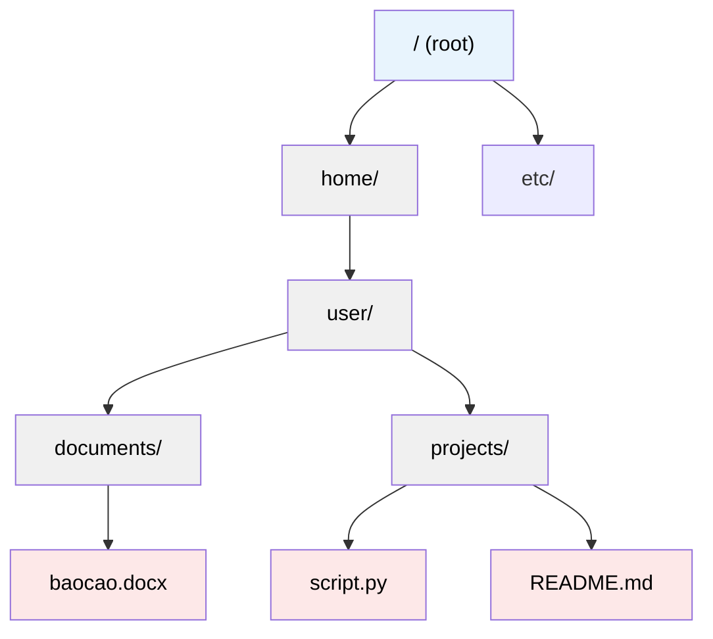

# MASTER COMPUTER SCIENCE HANDBOOK

## Volume 02 — Computer Science Foundations
### Part VI — Operating Systems
## Chương 2.36 — File Systems (Hệ thống tệp)

---

### Thông tin chương

| Trường | Giá trị |
|---|---|
| Chương | 2.36 (Chương thứ 8 và cuối cùng của Part VI; đánh số liên tục toàn Volume) |
| Thuộc Part | VI — Operating Systems |
| Thuộc Volume | 02 — Computer Science Foundations |
| Thời gian đọc ước tính | 55–65 phút |
| Độ khó | ★★★☆☆ |
| Kiến thức tiên quyết | Chương 2.29 — Hệ điều hành là gì? (System Call, đặc biệt `open()`/`read()`); Chương 2.35 — Virtual Memory (khái niệm ánh xạ và tổ chức không gian bằng cấu trúc dữ liệu) |
| Chương liên quan | Volume 02, Part VII — Database Systems (File System là nền tảng lưu trữ vật lý mà mọi hệ quản trị cơ sở dữ liệu được xây dựng lên trên) |
| Từ khóa | File System, File, Directory, inode, File Allocation, Contiguous Allocation, Linked Allocation, Indexed Allocation, ext4, NTFS |

---

### Mục tiêu học tập

Sau khi hoàn thành chương này, người đọc có thể:

- Giải thích vì sao dữ liệu cần một cơ chế tổ chức bền vững (persistent) riêng biệt, khác với Virtual Memory (Chương 2.35) vốn chỉ tồn tại tạm thời.
- Định nghĩa **File** và **Directory** dưới góc nhìn hình thức của hệ điều hành, phân biệt với góc nhìn "biểu tượng trên màn hình" quen thuộc.
- So sánh ba phương pháp cấp phát không gian lưu trữ cho file: **Contiguous, Linked, Indexed Allocation**.
- Giải thích cấu trúc **inode** và vai trò của nó trong việc tách biệt tên file khỏi dữ liệu thực tế.
- Kết nối khái niệm File System với các hệ thống thực tế (ext4, NTFS) ở mức tổng quan, không đi sâu triển khai.
- Nhìn lại và tổng kết toàn bộ Part VI — thấy được cách 8 chương liên kết thành một câu chuyện thống nhất về quản lý tài nguyên.

---

### Câu hỏi khơi gợi

> *Khi bạn xóa một file lớn (ví dụ 10GB) khỏi ổ cứng, thao tác đó gần như diễn ra ngay lập tức — chỉ mất chưa đến một giây. Nhưng khi bạn sao chép cùng file đó, thao tác lại mất nhiều phút. Nếu việc xóa "phải" liên quan đến việc dọn dẹp 10GB dữ liệu thực sự, tại sao nó lại nhanh hơn hàng trăm lần so với việc tạo ra 10GB dữ liệu mới?*

---

## 1. Tổng quan chương

Chương 2.35 đã giải quyết bài toán tổ chức bộ nhớ **tạm thời (volatile)** — Virtual Memory biến mất hoàn toàn khi tắt máy hoặc khi process kết thúc. Nhưng phần lớn dữ liệu con người thực sự quan tâm — ảnh, tài liệu, mã nguồn, cơ sở dữ liệu — cần tồn tại **bền vững (persistent)**, sống sót qua việc tắt máy, khởi động lại, hay thậm chí thay đổi phần cứng. Đây là vai trò của **File System (Hệ thống tệp)** — chương cuối cùng của Part VI, và cũng là chương khép lại toàn bộ hành trình từ Chương 2.29 đến đây.

Chương này trả lời câu hỏi: **hệ điều hành tổ chức không gian lưu trữ bền vững (ổ cứng, SSD) như thế nào, để bạn có thể gọi `open("myfile.txt")` — chính lời gọi đã xuất hiện lần đầu ở Chương 2.29 — và nhận được đúng nội dung mong muốn, một cách nhanh chóng, đáng tin cậy, dù dữ liệu vật lý có thể nằm rải rác khắp nơi trên đĩa?**

> **💡 Insight**
> Có một sự tương đồng cấu trúc thú vị giữa chương này và Chương 2.35: cả hai đều giải quyết bài toán "ánh xạ một định danh logic (địa chỉ ảo / tên file) tới một vị trí vật lý cụ thể (Frame RAM / khối dữ liệu trên đĩa)". Sự khác biệt cốt lõi duy nhất là **tính bền vững** — và chính sự khác biệt tưởng nhỏ này lại kéo theo hàng loạt yêu cầu thiết kế hoàn toàn khác nhau, như bạn sẽ thấy trong chương này.

---

## 2. Bối cảnh lịch sử

| Thời điểm | Sự kiện | Ý nghĩa |
|---|---|---|
| Đầu thập niên 1960s | Các hệ thống Batch Processing sơ khai lưu dữ liệu trực tiếp trên băng từ (magnetic tape), truy cập tuần tự | Chưa có khái niệm "file" như một đơn vị trừu tượng độc lập với thiết bị lưu trữ vật lý |
| 1965 | Hệ thống Multics giới thiệu khái niệm **cấu trúc thư mục phân cấp (hierarchical directory structure)** | Đặt nền móng cho mô hình thư mục lồng nhau vẫn được dùng gần như nguyên vẹn đến ngày nay |
| 1970s | UNIX chính thức hóa triết lý **"mọi thứ đều là file" (everything is a file)**, cùng cấu trúc **inode** | Một trong những quyết định thiết kế có ảnh hưởng sâu rộng nhất lịch sử hệ điều hành — thiết bị, pipe, socket đều được truy cập qua cùng giao diện file |
| 2001 (Windows), 2008 (ext4 chính thức trong Linux kernel) | Các File System hiện đại như NTFS, ext4 tích hợp **journaling** — ghi nhật ký thao tác trước khi thực sự thay đổi dữ liệu | Cải thiện đáng kể khả năng phục hồi sau sự cố mất điện hoặc crash hệ thống giữa chừng một thao tác ghi |

> **🔬 Research Connection**
> Triết lý "mọi thứ đều là file" của UNIX là một ví dụ kinh điển của tư duy trừu tượng hóa nhất quán: thay vì có API riêng biệt cho từng loại thiết bị (máy in, ổ đĩa, mạng), UNIX cung cấp **một** giao diện chung (`open`, `read`, `write`, `close` — đã gặp từ Chương 2.29) cho gần như mọi tài nguyên I/O. Đây chính là lý do vì sao cùng bốn system call cơ bản đó có thể dùng để đọc một file văn bản, ghi dữ liệu ra máy in, hay giao tiếp qua socket mạng.

---

## 3. Động lực

Hãy hình dung một ổ cứng chỉ đơn thuần là một dãy các khối (block) được đánh số liên tục, ví dụ từ block 0 đến block 999.999. Nếu không có File System, để lưu một file, bạn phải tự nhớ chính xác: file bắt đầu ở block nào, dài bao nhiêu block, và các block đó — nếu không liên tục — nằm ở những vị trí cụ thể nào.

Điều này gần như bất khả thi ở quy mô thực tế vì ba lý do:

- **Không có tên gợi nhớ:** "block 4829 đến 5103" không có ý nghĩa gì với con người, so với "báo_cáo_quý_3.docx".
- **Phân mảnh không tránh khỏi:** giống hệt vấn đề Fragmentation đã gặp ở Chương 2.35, Mục 3 — khi file bị xóa rồi tạo mới liên tục, không gian trống trên đĩa dần trở nên rời rạc, khiến một file mới khó có được một dải block liên tục đủ lớn.
- **Không có cơ chế bảo vệ hay tổ chức:** không có khái niệm thư mục để nhóm file liên quan, không có quyền truy cập để ngăn người dùng khác đọc/ghi file của bạn.

**File System giải quyết cả ba vấn đề:** cung cấp tên file dễ nhớ, cấu trúc thư mục để tổ chức, cơ chế cấp phát linh hoạt không đòi hỏi block liên tục, và (ở các hệ thống hiện đại) quyền truy cập để bảo vệ dữ liệu.

---

## 4. Trực giác

**Mô hình tinh thần (Mental Model) của chương này:**

> File System giống như **mục lục và hệ thống định vị của một thư viện khổng lồ**. Bạn không cần biết chính xác cuốn sách "Lược sử thời gian" nằm ở kệ nào, tầng nào — bạn chỉ cần tra mục lục (tương đương thư mục/tên file), mục lục đó chỉ ra vị trí chính xác (tương đương inode/con trỏ tới dữ liệu). Khi một cuốn sách được "trả về kho" (xóa file), thủ thư chỉ cần xóa mục lục — không cần thực sự đốt cuốn sách hay dọn kệ ngay lập tức, đó là lý do "xóa" luôn nhanh hơn "sao chép" như đã nêu ở Câu hỏi khơi gợi.

| Trực giác kỹ thuật bạn đã có | Khái niệm File System tương ứng |
|---|---|
| Xóa file vào Thùng rác rồi "Xóa vĩnh viễn" (Empty Trash) mất thêm thời gian đáng kể lần thứ hai | Lần đầu chỉ xóa mục lục (nhanh); lần "xóa vĩnh viễn" thực sự mới giải phóng và ghi đè không gian lưu trữ |
| Tạo shortcut/symbolic link trỏ tới một file mà không tạo bản sao dữ liệu | Nhiều tên file (đường dẫn) có thể cùng trỏ tới một inode duy nhất — sẽ gặp lại ở Mục 6 |
| File bị phân mảnh khiến ổ cứng HDD (không phải SSD) chạy chậm, cần "chống phân mảnh" (defragment) | Hệ quả trực tiếp của Linked/Indexed Allocation khi không gian trống bị phân mảnh theo thời gian, sẽ phân tích ở Mục 8 |

---

## 5. Trực quan hóa khái niệm

**Hình 2.36.1 — Cấu trúc thư mục phân cấp (Hierarchical Directory Structure)**



| Trường thông tin | Nội dung |
|---|---|
| Mục đích | Minh họa mô hình tổ chức đã được Multics đặt nền móng từ 1965 (Mục 2) — mỗi Directory (nút xanh xám) chỉ là một loại File đặc biệt, chứa danh sách ánh xạ tên → vị trí của các mục con |
| Điểm mấu chốt | Một đường dẫn như `/home/user/documents/baocao.docx` thực chất là một chuỗi các lượt tra cứu liên tiếp qua nhiều Directory — không phải một phép tra cứu "một bước" |

---

**Hình 2.36.2 — Ba phương pháp cấp phát không gian file trên đĩa**

```text
CONTIGUOUS ALLOCATION (Cấp phát liên tục)
Block:  [10][11][12][13][14][15][16][17][18][19]
File A:  ███ ███ ███              (block 10-12, liên tục)
File B:              ███ ███      (block 14-15, liên tục)
→ Đọc nhanh (tuần tự), nhưng dễ phân mảnh khi file thay đổi kích thước

LINKED ALLOCATION (Cấp phát liên kết)
File A: Block 10 ──► Block 15 ──► Block 12 ──► NULL
        (mỗi block chứa thêm con trỏ trỏ tới block tiếp theo)
→ Không cần liên tục, nhưng truy cập ngẫu nhiên (random access) chậm
   vì phải "đi bộ" qua từng con trỏ tuần tự

INDEXED ALLOCATION (Cấp phát chỉ mục)
File A: [Index Block] ──► trỏ tới: Block 10, Block 15, Block 12
        (một block riêng chỉ chứa danh sách con trỏ)
→ Không cần liên tục, VÀ hỗ trợ truy cập ngẫu nhiên nhanh
   (tra index block một lần, biết ngay vị trí bất kỳ block nào)
```

*Mục đích:* So sánh trực quan ba chiến lược giải quyết cùng một bài toán: lưu một file có thể không nằm gọn trong các block liên tục. *Điểm mấu chốt:* Indexed Allocation (dưới cùng) chính là nguyên lý nền tảng của **inode** sẽ định nghĩa ở Mục 6 — gần như mọi File System hiện đại (ext4, NTFS) đều dựa trên biến thể của phương pháp này.

---

## 6. Định nghĩa hình thức

> **📌 Remember — File và Directory**
>
> Một **File** là một tập hợp thông tin có liên quan, được đặt tên, lưu trữ trên thiết bị lưu trữ bền vững. Dưới góc nhìn hệ điều hành, một file chỉ là một chuỗi byte thô — File System **không** quan tâm ý nghĩa nội dung bên trong (văn bản, hình ảnh, mã nguồn) mà chỉ quản lý vị trí và metadata của nó.
>
> Một **Directory (Thư mục)** là một loại File đặc biệt, nội dung của nó chỉ là một danh sách ánh xạ **tên** sang **định danh** (thường là số hiệu inode — xem bên dưới) của các file/thư mục con.

**inode:**

> **📌 Remember — inode**
>
> **inode** (index node) là cấu trúc dữ liệu, mỗi file (hoặc thư mục) trên các File System họ UNIX (ext4 và tương tự) đều có đúng một inode tương ứng, lưu trữ:
>
> - Metadata: kích thước file, quyền truy cập (permissions), thời điểm tạo/sửa đổi gần nhất, chủ sở hữu.
> - Con trỏ trỏ tới các block dữ liệu thực tế trên đĩa (theo mô hình Indexed Allocation ở Hình 2.36.2).
> - **Không** lưu tên file — tên file chỉ tồn tại trong Directory Entry (mục trong thư mục cha), trỏ tới số hiệu inode tương ứng.

> **💡 Insight**
> Việc tách tên file khỏi inode chính là câu trả lời đầy đủ cho Câu hỏi khơi gợi đầu chương và Mục 4: xóa file (thông thường) chỉ đơn giản là xóa Directory Entry (mục ánh xạ tên → inode) và giảm bộ đếm tham chiếu (reference count) của inode đó. Nếu reference count về 0 (không còn tên nào trỏ tới nó nữa), **lúc đó** hệ điều hành mới thực sự đánh dấu các block dữ liệu là "trống, có thể ghi đè" — nhưng **không xóa nội dung ngay lập tức**. Đây cũng chính là lý do kỹ thuật vì sao các công cụ phục hồi dữ liệu (data recovery) đôi khi vẫn khôi phục được file "đã xóa", miễn là dữ liệu vật lý chưa bị ghi đè bởi thao tác khác.

---

## 7. Nền tảng toán học

Phần này định lượng hiệu năng đọc file theo phương pháp cấp phát, dựa trên số lần truy cập đĩa (disk I/O) cần thiết — đơn vị chi phí có ý nghĩa nhất trong bối cảnh này, do một lần truy cập đĩa vật lý (đặc biệt HDD) chậm hơn nhiều lần một lần truy cập RAM (đã có nền tảng định lượng ở Chương 2.35, Mục 7).

> **📦 Formula Box — Số lần truy cập đĩa để đọc block thứ $k$ của một file**
>
> $$\text{Disk Accesses}_{\text{Contiguous}}(k) = 1 \qquad \text{Disk Accesses}_{\text{Linked}}(k) = k \qquad \text{Disk Accesses}_{\text{Indexed}}(k) = 2$$
>
> | Thành phần | Ý nghĩa |
> |---|---|
> | $k$ | Vị trí thứ tự của block cần đọc trong file (block đầu tiên là $k=1$) |
> | **Contiguous** | Vì các block liên tục, biết block bắt đầu và $k$ là đủ để tính trực tiếp địa chỉ vật lý — luôn đúng 1 lần truy cập |
> | **Linked** | Phải "đi bộ" tuần tự qua $k-1$ con trỏ trước đó để tới được block thứ $k$ — chi phí tăng tuyến tính theo $k$, cực kỳ bất lợi cho truy cập ngẫu nhiên vào block ở cuối file dài |
> | **Indexed** | Luôn đúng 2 lần: một lần đọc Index Block để lấy địa chỉ, một lần đọc chính block dữ liệu — chi phí **không đổi** (constant), bất kể $k$ lớn đến đâu |

**Ví dụ số minh họa:** để đọc block thứ 1.000 của một file (giả sử một file dữ liệu lớn):

- Contiguous: 1 lần truy cập đĩa.
- Linked: 1.000 lần truy cập đĩa (!) — hoàn toàn không khả thi cho truy cập ngẫu nhiên.
- Indexed: 2 lần truy cập đĩa — không phụ thuộc block thứ mấy.

Chênh lệch 500 lần giữa Indexed và Linked ở ví dụ này là minh chứng định lượng trực tiếp cho lý do gần như không có File System hiện đại nào dùng thuần túy Linked Allocation cho truy cập ngẫu nhiên — dù về mặt lý thuyết nó giải quyết trọn vẹn vấn đề Fragmentation.

---

## 8. Thuật toán / Cơ chế

**Trình tự phân giải một đường dẫn (path resolution) — ví dụ `/home/user/documents/baocao.docx`:**

```text
Bước 1 — Bắt đầu từ inode của thư mục gốc "/" (thường có số
         hiệu cố định, ví dụ inode số 2 trên nhiều hệ thống ext4)
        │
        ▼
Bước 2 — Đọc nội dung thư mục "/" (chính nó cũng là một file,
         theo định nghĩa ở Mục 6), tìm mục có tên "home"
        │
        ▼
Bước 3 — Mục "home" trỏ tới một số hiệu inode khác — đọc
         inode đó, xác nhận đây là một thư mục, đọc nội dung
        │
        ▼
Bước 4 — Lặp lại chính xác Bước 2-3 cho "user", rồi "documents"
        │
        ▼
Bước 5 — Trong thư mục "documents", tìm mục "baocao.docx",
         lấy số hiệu inode tương ứng — ĐÂY LÀ inode của
         chính file cần mở
        │
        ▼
Bước 6 — Đọc inode của "baocao.docx", lấy danh sách con trỏ
         tới các block dữ liệu thực tế (theo Indexed Allocation,
         Mục 6-7) — sẵn sàng để đọc/ghi nội dung file
```

> **💡 Insight**
> Trình tự 6 bước này giải thích trực tiếp vì sao đường dẫn **càng sâu** (càng nhiều cấp thư mục lồng nhau) thì việc mở file lần đầu **càng chậm** hơn một chút — mỗi cấp thư mục đòi hỏi ít nhất một lần đọc inode và nội dung thư mục tương ứng. Trong thực tế, hệ điều hành giảm thiểu chi phí này bằng một lớp cache riêng cho kết quả phân giải đường dẫn gần đây (dentry cache trên Linux) — cùng một tư duy "cache để tránh tra cứu lặp lại" đã gặp ở TLB (Chương 2.35, Mục 6).

---

## 9. Triển khai

```python
class SimpleInode:
    """Mô phỏng đơn giản hóa một inode, chỉ nhằm minh họa khái
    niệm — không phản ánh cấu trúc inode thực tế phức tạp hơn
    nhiều của ext4."""
    def __init__(self, inode_id, is_directory=False):
        self.inode_id = inode_id
        self.is_directory = is_directory
        self.size = 0
        self.data_blocks = []      # danh sách block chứa dữ liệu
        self.link_count = 0        # số Directory Entry trỏ tới inode này
        # Chỉ có ý nghĩa nếu is_directory=True:
        self.entries = {}          # {tên: inode_id}


class SimpleFileSystem:
    """Mô phỏng đơn giản hóa việc phân giải đường dẫn và xóa file,
    minh họa trực tiếp cơ chế ở Mục 6 và Mục 8."""

    def __init__(self):
        self.inodes = {}
        root = SimpleInode(inode_id=0, is_directory=True)
        self.inodes[0] = root
        self._next_id = 1

    def create_file(self, parent_inode_id, name):
        new_id = self._next_id
        self._next_id += 1
        new_inode = SimpleInode(inode_id=new_id)
        new_inode.link_count = 1
        self.inodes[new_id] = new_inode
        self.inodes[parent_inode_id].entries[name] = new_id
        return new_id

    def resolve_path(self, path):
        """Triển khai chính xác 6 bước ở Mục 8."""
        current = self.inodes[0]  # bắt đầu từ root
        parts = [p for p in path.split("/") if p]
        for part in parts:
            if part not in current.entries:
                raise FileNotFoundError(f"Không tìm thấy: {part}")
            current = self.inodes[current.entries[part]]
        return current

    def delete_file(self, parent_inode_id, name):
        """Minh họa Insight ở Mục 6: xóa chỉ giảm link_count,
        KHÔNG xóa ngay dữ liệu thực tế."""
        inode_id = self.inodes[parent_inode_id].entries.pop(name)
        target = self.inodes[inode_id]
        target.link_count -= 1
        if target.link_count == 0:
            print(f"inode {inode_id}: link_count=0, "
                  f"block dữ liệu được đánh dấu TRỐNG (chưa xóa nội dung)")
        else:
            print(f"inode {inode_id}: vẫn còn {target.link_count} "
                  f"tên khác trỏ tới, dữ liệu KHÔNG bị ảnh hưởng")
```

Đoạn mã này cài đặt trực tiếp hai khái niệm cốt lõi của chương: `resolve_path()` triển khai đúng 6 bước ở Mục 8, còn `delete_file()` minh họa chính xác cơ chế `link_count` đã giải thích ở Insight Mục 6 — tách biệt hoàn toàn việc "xóa tên" khỏi việc "xóa dữ liệu thực sự".

---

## 10. Trực quan hóa quá trình thực thi

**Kết quả chạy thực tế minh họa cơ chế `link_count`:**

```python
fs = SimpleFileSystem()
file_id = fs.create_file(parent_inode_id=0, name="baocao.docx")
fs.inodes[0].entries["baocao_link.docx"] = file_id
fs.inodes[file_id].link_count = 2  # giờ có 2 tên cùng trỏ tới 1 inode

fs.delete_file(0, "baocao.docx")
fs.delete_file(0, "baocao_link.docx")
```

Kết quả in ra:

```text
inode 1: vẫn còn 1 tên khác trỏ tới, dữ liệu KHÔNG bị ảnh hưởng
inode 1: link_count=0, block dữ liệu được đánh dấu TRỐNG (chưa xóa nội dung)
```

**Phân tích:** kết quả xác nhận chính xác cơ chế đã mô tả — chỉ khi **cả hai** tên (`baocao.docx` và `baocao_link.docx`) đều bị xóa, `link_count` mới về 0 và inode 1 mới thực sự được đánh dấu để tái sử dụng. Đây là minh chứng thực nghiệm trực tiếp cho khái niệm **hard link** trong các hệ thống UNIX/Linux thực tế — nhiều tên file khác nhau có thể an toàn cùng trỏ tới một inode, và dữ liệu chỉ thực sự "biến mất" khi không còn tên nào tham chiếu tới nó.

---

## 11. Ứng dụng công nghiệp

> **🛠 Engineering Practice**
> Hiểu cơ chế File System giúp giải thích nhiều hành vi hệ thống mà kỹ sư phần mềm thường gặp nhưng ít khi truy nguyên tới tận gốc rễ.

| Bối cảnh công nghiệp | Vai trò của File System |
|---|---|
| Symbolic Link (`ln -s`) vs Hard Link (`ln`) trong UNIX/Linux | Symbolic Link là một file riêng biệt chứa **đường dẫn văn bản** trỏ tới file khác (có inode riêng); Hard Link là hai tên cùng trỏ **chung một inode** — đúng cơ chế `link_count` vừa minh họa ở Mục 9-10 |
| Journaling File System (ext4, NTFS) | Ghi lại ý định thay đổi (ví dụ: "sắp cập nhật inode X, block Y") vào một nhật ký trước khi thực sự thực hiện — nếu hệ thống crash giữa chừng, có thể "phát lại" hoặc hủy bỏ thao tác dở dang khi khởi động lại, tránh dữ liệu bị hỏng ở trạng thái nửa vời |
| Object Storage (Amazon S3 và tương tự) | Một mô hình lưu trữ khác biệt căn bản — không có cấu trúc thư mục phân cấp thực sự (Mục 5) mà dùng một không gian tên (namespace) phẳng, với "đường dẫn" chỉ là một chuỗi ký tự trong tên đối tượng, không phải cây thư mục thực — một thiết kế đánh đổi để dễ mở rộng quy mô hơn (liên hệ Volume 04) |
| `df` và `du` (Linux) cho ra kết quả khác nhau | `df` đọc thông tin cấp phát ở tầng File System (bao gồm cả block đã cấp cho file đã xóa nhưng còn tiến trình giữ file descriptor mở); `du` cộng dồn kích thước file thực tế nhìn thấy qua cấu trúc thư mục — chênh lệch giữa hai lệnh là dấu hiệu kinh điển của "deleted but still open file", một tình huống vận hành thực tế phổ biến |

---

## 12. Góc nhìn nghiên cứu

> **🔬 Research Connection**
> Sự trỗi dậy của thiết bị lưu trữ thể rắn (SSD) so với đĩa từ (HDD) truyền thống đã và đang định hình lại nhiều giả định thiết kế File System vốn được tối ưu cho đặc tính vật lý hoàn toàn khác của HDD.

Các thuật toán cấp phát file truyền thống (Mục 5, 7) được thiết kế với một giả định ngầm quan trọng: HDD có **chi phí seek time** đáng kể (đầu đọc/ghi vật lý cần di chuyển để tới đúng vị trí trên đĩa xoay), khiến việc giữ dữ liệu **liên tục** (Contiguous) mang lại lợi ích hiệu năng rõ rệt. SSD, không có bộ phận cơ học chuyển động, có thời gian truy cập gần như đồng đều (uniform) tới mọi vị trí — làm giảm đáng kể lợi thế của Contiguous Allocation, đồng thời đặt ra các vấn đề tối ưu hóa hoàn toàn mới, đặc biệt liên quan đến **wear leveling** (phân bổ đều số lần ghi trên các cell nhớ, vì mỗi cell SSD chỉ chịu được một số lần ghi hữu hạn — một ràng buộc vật lý không tồn tại với HDD).

**Hướng nghiên cứu đang tiếp diễn:** các File System hiện đại chuyên biệt cho SSD (ví dụ F2FS — Flash-Friendly File System) thiết kế lại từ đầu chiến lược cấp phát và ghi dữ liệu để tối ưu cho đặc tính vật lý riêng của flash memory, minh họa một nguyên tắc quan trọng sẽ lặp lại nhiều lần trong Volume 04: **thuật toán tối ưu luôn phụ thuộc vào mô hình chi phí phần cứng cụ thể bên dưới, và mô hình đó có thể thay đổi hoàn toàn khi công nghệ phần cứng tiến hóa.**

---

## 13. Ưu điểm

- **Trừu tượng hóa mạnh:** người dùng và lập trình viên làm việc với tên file, đường dẫn thân thiện, hoàn toàn không cần biết vị trí vật lý dữ liệu nằm ở đâu trên đĩa.
- **inode + Indexed Allocation giải quyết trọn vẹn Fragmentation:** không đòi hỏi block liên tục, đồng thời vẫn giữ chi phí truy cập ngẫu nhiên ở mức hằng số (2 lần truy cập đĩa, theo Mục 7) — kết hợp ưu điểm của cả Contiguous lẫn Linked mà không thừa kế nhược điểm của chúng.
- **Tách biệt tên và dữ liệu (qua inode):** cho phép các tính năng mạnh mẽ như Hard Link, và giúp thao tác xóa/đổi tên trở nên cực nhanh (chỉ thao tác trên Directory Entry, không đụng vào dữ liệu thực).
- **Journaling** (ở các File System hiện đại): tăng đáng kể độ tin cậy trước sự cố mất điện hoặc crash hệ thống giữa chừng một thao tác ghi.

---

## 14. Hạn chế

> **⚠️ Common Mistake**
> Một ngộ nhận phổ biến: "Xóa file nghĩa là dữ liệu đã biến mất vĩnh viễn ngay lập tức." Như đã chứng minh ở Mục 6, 9, 10 — điều này chỉ đúng sau khi `link_count` về 0 **và** các block đó thực sự bị ghi đè bởi dữ liệu khác; đây là lý do các công cụ khôi phục dữ liệu vẫn có thể hoạt động, và cũng là lý do các tổ chức xử lý dữ liệu nhạy cảm cần quy trình "xóa an toàn" (secure delete/shredding) chuyên dụng thay vì chỉ xóa thông thường.

- **Chi phí phân giải đường dẫn tăng theo độ sâu:** như đã phân tích ở Insight Mục 8, cấu trúc thư mục càng sâu, chi phí mở file lần đầu (chưa có cache) càng cao.
- **Linked Allocation không phù hợp truy cập ngẫu nhiên:** đã định lượng rõ ràng ở Mục 7 — chi phí tăng tuyến tính theo vị trí block cần đọc, khiến nó gần như không được dùng thuần túy trong thực tế hiện đại.
- **Journaling có chi phí hiệu năng:** việc ghi nhật ký trước khi thực hiện thao tác thực tế đồng nghĩa mỗi lần ghi dữ liệu tốn ít nhất hai lần ghi vật lý — một đánh đổi giữa độ tin cậy và hiệu năng thuần túy.
- **Giả định thiết kế cũ không còn tối ưu cho SSD:** như đã thảo luận ở Mục 12, nhiều chiến lược cấp phát kinh điển được tối ưu cho đặc tính vật lý của HDD, cần thiết kế lại đáng kể để phù hợp với flash memory hiện đại.

---

## 15. So sánh

**Bảng 2.36.1 — Ba phương pháp cấp phát: tổng hợp so sánh**

| Tiêu chí | Contiguous | Linked | Indexed |
|---|---|---|---|
| Yêu cầu block liên tục? | Có (nhược điểm chính) | Không | Không |
| Chi phí truy cập tuần tự (đọc lần lượt từ đầu) | Rất thấp | Thấp | Thấp–trung bình (qua Index Block) |
| Chi phí truy cập ngẫu nhiên (block thứ $k$ bất kỳ) | Hằng số — 1 lần (Mục 7) | Tuyến tính — $k$ lần (Mục 7) | Hằng số — 2 lần (Mục 7) |
| Rủi ro Fragmentation | Cao | Không | Không |
| Overhead lưu trữ thêm | Không đáng kể | Một con trỏ mỗi block | Một Index Block mỗi file |
| Ứng dụng thực tế phổ biến | CD-ROM, một số hệ thống chỉ đọc (read-only) | Hiếm dùng thuần túy trong hệ thống hiện đại | Nền tảng của hầu hết File System hiện đại (ext4, NTFS, qua inode hoặc cấu trúc tương đương) |

**Phân tích:** kết quả này một lần nữa xác nhận mô hình tư duy xuyên suốt Part VI — Indexed Allocation "thắng" không phải vì nó đơn giản nhất (Contiguous đơn giản hơn), mà vì nó đạt được **sự cân bằng tốt nhất** giữa các tiêu chí quan trọng nhất trong bối cảnh sử dụng thực tế (truy cập ngẫu nhiên thường xuyên, tránh Fragmentation) — đúng tinh thần "không có giải pháp tối ưu tuyệt đối, chỉ có giải pháp phù hợp nhất với bối cảnh" đã lặp lại từ Chương 2.29 đến đây.

---

## 16. Tóm tắt

- **File System** giải quyết bài toán tổ chức không gian lưu trữ **bền vững**, khác biệt cốt lõi với Virtual Memory (Chương 2.35) — vốn chỉ tổ chức bộ nhớ **tạm thời**.
- **File** là chuỗi byte có tên; **Directory** là một loại File đặc biệt chứa ánh xạ tên → inode; **inode** tách biệt hoàn toàn tên file khỏi vị trí dữ liệu vật lý thực tế, mang lại nhiều lợi ích quan trọng (Hard Link, xóa/đổi tên nhanh).
- Ba phương pháp cấp phát — **Contiguous, Linked, Indexed** — thể hiện đúng mô hình đánh đổi quen thuộc; **Indexed Allocation** (nền tảng của inode) là lựa chọn thống trị trong các File System hiện đại nhờ cân bằng tốt giữa chống Fragmentation và chi phí truy cập ngẫu nhiên hằng số.
- Việc xóa file thông thường chỉ giảm `link_count` và xóa Directory Entry — **không** xóa ngay dữ liệu vật lý, giải thích cả tốc độ xóa nhanh lẫn khả năng khôi phục dữ liệu đã xóa.
- **Journaling** cải thiện độ tin cậy trước sự cố hệ thống, đánh đổi bằng chi phí ghi dữ liệu tăng thêm.

**Tổng kết Part VI:** hành trình từ Chương 2.29 đến 2.36 đã đi từ câu hỏi nền tảng nhất ("OS là gì?") qua đơn vị quản lý cơ bản (Process, Thread), cơ chế phân phối CPU (Scheduling), cơ chế phối hợp an toàn (Synchronization) và hệ quả khi phối hợp sai (Deadlock), rồi tới hai cơ chế quản lý không gian song song — tạm thời (Virtual Memory) và bền vững (File Systems). Mọi chương đều xoay quanh một câu hỏi lặp lại dưới nhiều hình thức: **"tài nguyên hữu hạn, nhiều bên cùng cần — hệ điều hành phân chia và tổ chức điều đó như thế nào, một cách công bằng, an toàn, và hiệu quả?"**

---

## 17. Bài tập

### Mức Cơ bản (Basic)

1. Giải thích bằng lời của riêng bạn sự khác biệt giữa "File" và "Directory" theo định nghĩa hình thức ở Mục 6 — tại sao Directory được xem là "một loại File đặc biệt" thay vì một khái niệm hoàn toàn tách biệt?
2. Với dữ liệu ở Hình 2.36.2, tính số lần truy cập đĩa cần thiết để đọc block cuối cùng (block thứ 3) của File A theo cả ba phương pháp Contiguous, Linked, Indexed, dựa trên Formula Box ở Mục 7.

### Mức Trung bình (Intermediate)

3. Chạy thử `SimpleFileSystem` ở Mục 9 với một cấu trúc thư mục lồng nhau ít nhất 3 cấp (ví dụ tương tự Hình 2.36.1). Gọi `resolve_path()` và đếm thủ công số lần cấu trúc dữ liệu `entries` bị tra cứu — đối chiếu con số đó với 6 bước đã mô tả ở Mục 8.
4. Trên hệ thống Linux/macOS của bạn, tạo một file, tạo thêm một hard link tới file đó (`ln original.txt hardlink.txt`), sau đó chạy `ls -li original.txt hardlink.txt`. Quan sát cột đầu tiên (số inode) — xác nhận cả hai file có **cùng** số inode, đúng như cơ chế đã minh họa ở Mục 9-10.

### Mức Nâng cao (Advanced)

5. Mở rộng `SimpleFileSystem` ở Mục 9 để hỗ trợ **Symbolic Link** (khác với Hard Link): thêm một loại inode mới lưu một chuỗi đường dẫn (thay vì trỏ trực tiếp), và cập nhật `resolve_path()` để khi gặp Symbolic Link, tiếp tục phân giải đường dẫn được lưu trong đó. Kiểm thử với trường hợp Symbolic Link trỏ tới một file không tồn tại (broken link) — chương trình của bạn xử lý tình huống này như thế nào?

### Mức Nghiên cứu (Research)

6. Tìm đọc tổng quan về **F2FS (Flash-Friendly File System)** (gợi ý tìm kiếm: "F2FS design SSD"). Viết đoạn ngắn (nửa trang) trình bày: (a) ít nhất một điểm khác biệt thiết kế cụ thể so với các File System truyền thống được tối ưu cho HDD như đã học trong chương; (b) liên hệ với khái niệm "wear leveling" đã đề cập ở Mục 12.

---

## 18. Dự án nhỏ

**Trình khám phá File System (Mini File System Explorer)**

- **Mục tiêu:** Củng cố hiểu biết về cấu trúc thư mục phân cấp và inode bằng cách xây dựng một công cụ thực tế thao tác trên hệ thống file thật (chỉ đọc, không ghi/xóa để đảm bảo an toàn).
- **Yêu cầu:**
  - Viết một chương trình Python duyệt đệ quy (recursive) một thư mục thật trên máy của bạn (dùng thư viện `os` hoặc `pathlib`), in ra cấu trúc cây tương tự Hình 2.36.1.
  - Với mỗi file, in kèm: kích thước, số inode (dùng `os.stat().st_ino` trên Linux/macOS), và số hard link hiện có (`os.stat().st_nlink`).
  - Xác định và liệt kê riêng các file có `st_nlink > 1` — đây chính là các file có nhiều tên (hard link) cùng trỏ tới một inode, đúng khái niệm đã học ở Mục 6, 9, 10.
- **Công nghệ đề xuất:** Python, thư viện `os`/`pathlib`.
- **Mở rộng (tùy chọn):** So sánh kết quả `du -sh` (Linux/macOS) với tổng kích thước file bạn tự tính được từ chương trình — nếu có chênh lệch, điều tra nguyên nhân (gợi ý: sparse file, hoặc file đã xóa nhưng vẫn có tiến trình giữ mở, liên hệ Mục 11).

---

## 19. Tự đánh giá

- [ ] Tôi có thể giải thích rõ ràng sự khác biệt giữa File (chuỗi byte có tên) và Directory (danh sách ánh xạ tên → inode), không nhầm lẫn hai khái niệm.
- [ ] Tôi hiểu và có thể giải thích tại sao inode tách tên file khỏi dữ liệu thực tế, và hệ quả trực tiếp của việc tách biệt đó (Hard Link, tốc độ xóa/đổi tên).
- [ ] Tôi có thể so sánh chính xác ba phương pháp cấp phát (Contiguous, Linked, Indexed) theo cả tiêu chí Fragmentation lẫn chi phí truy cập ngẫu nhiên định lượng được.
- [ ] Tôi có thể mô tả đúng 6 bước phân giải một đường dẫn, và giải thích vì sao đường dẫn sâu hơn có chi phí tra cứu cao hơn.
- [ ] Nhìn lại toàn bộ Part VI, tôi có thể tóm tắt trong 2-3 câu cách 8 chương (2.29–2.36) liên kết với nhau thành một câu chuyện thống nhất về quản lý tài nguyên của hệ điều hành.

Nếu câu hỏi tự đánh giá cuối cùng khiến bạn phải dừng lại suy nghĩ khá lâu, đây là một dấu hiệu tốt — nó cho thấy bạn đang thực sự xây dựng một mô hình kiến thức liên kết (đúng triết lý LEARNING_PHILOSOPHY.md của Handbook), chứ không chỉ ghi nhớ rời rạc từng chương độc lập.

---

## 20. Đọc thêm

- **Sách:** Abraham Silberschatz, Peter B. Galvin, Greg Gagne, *Operating System Concepts* — Chương 11 và 12 (hoặc chương tương ứng theo phiên bản), trình bày đầy đủ về File System Interface và File System Implementation, bao gồm các chi tiết về Free Space Management không thuộc phạm vi chương này. *(Xem BOOKS.md — Volume 2/4.)*
- **Tài liệu mở rộng:** Tài liệu chính thức của ext4 (kernel.org) — mô tả chi tiết cấu trúc inode thực tế, phức tạp hơn đáng kể so với `SimpleInode` minh họa ở Mục 9.
- **Chủ đề mở rộng (không bắt buộc):** tìm đọc về **Free Space Management** — cách File System theo dõi block nào đang trống, đang dùng (thường qua bitmap hoặc linked list các block trống), một mảnh ghép quan trọng không được trình bày chi tiết trong chương này.
- **Chương tiếp theo:** Volume 02, Part VII — Database Systems, sẽ xây dựng trực tiếp trên khái niệm lưu trữ bền vững vừa học ở chương này, mở rộng sang mô hình quan hệ (Relational Model), giao dịch (Transaction), và tính chất ACID.

---

### Liên kết chương (Cross References)

- **Chương trước:** 2.35 — Virtual Memory (cùng chủ đề "ánh xạ và tổ chức không gian", nhưng khác biệt cốt lõi ở tính bền vững — File System giữ dữ liệu qua lần tắt máy, Virtual Memory thì không).
- **Chương tiếp theo (Part mới):** Volume 02, Part VII — Database Systems (Chương đầu tiên của Part VII sẽ dùng trực tiếp khái niệm lưu trữ bền vững, block, và inode vừa học để giải thích cách một hệ quản trị cơ sở dữ liệu tổ chức dữ liệu trên đĩa).
- **Chương liên quan xa hơn:** Chương 2.29 — Hệ điều hành là gì? (system call `open`/`read`/`write` được giới thiệu lần đầu ở đó nay được giải thích đầy đủ cơ chế đứng sau); Volume 04, Part VI — Distributed Systems (mở rộng khái niệm File System sang bối cảnh phân tán, nhiều máy chủ — ví dụ Hadoop Distributed File System).
- **Vị trí trong Knowledge Graph:** Chương thứ tám và cũng là chương cuối cùng của Volume 02, Part VI; phụ thuộc trực tiếp vào Chương 2.29 (System Call) và Chương 2.35 (tư duy ánh xạ không gian); khép lại toàn bộ Part VI, mở đường trực tiếp cho Part VII — Database Systems.

---

*Hết Chương 2.36 — chương cuối cùng của Part VI: Operating Systems. Chương này tuân thủ đầy đủ cấu trúc 20 mục của `OUTPUT.md` và chuẩn Presentation Layer, theo đúng quy ước đánh số liên tục toàn Volume đã áp dụng từ Chương 2.29. Toàn bộ Part VI (Chương 2.29–2.36) đã trình bày một hành trình liền mạch từ khái niệm hệ điều hành cơ bản nhất đến các cơ chế quản lý tài nguyên phức tạp nhất — Process, Thread, Scheduling, Synchronization, Deadlock, Virtual Memory, và File Systems. Đang chờ rà soát trước khi tiếp tục sang Part VII — Database Systems.*
