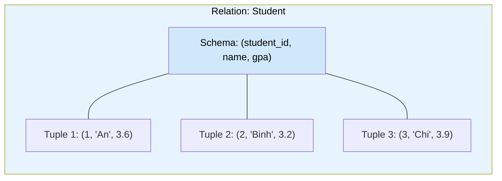

# MASTER COMPUTER SCIENCE HANDBOOK

## Volume 02 — Computer Science Foundations
### Part VII — Database Systems
## Chương 7.1 — Mô hình Quan hệ
### (Relational Model)

---

### Thông tin chương

| Trường | Giá trị |
|---|---|
| Chương | 7.1 |
| Thuộc Part | VII — Database Systems |
| Thuộc Volume | 02 — Computer Science Foundations |
| Thời gian đọc ước tính | 50–60 phút |
| Độ khó | ★★★☆☆ |
| Kiến thức tiên quyết | Volume 1, Chương 1.5 — Set Theory (quan hệ như tập con của tích Descartes); Volume 1, Chương 1.6 — Functions and Relations; Volume 2, Part IV — Data Structures (khái niệm bảng, khóa) |
| Chương liên quan | 7.2 — SQL (ánh xạ trực tiếp các phép toán đại số quan hệ ở chương này thành cú pháp SQL); 7.3 — Transactions and ACID |
| Từ khóa | relation, tuple, schema, primary key, foreign key, candidate key, relational algebra, selection, projection, join, normalization |

---

### Mục tiêu học tập

Sau khi hoàn thành chương này, người đọc có thể:

- Định nghĩa hình thức khái niệm **Relation (Quan hệ)** bằng ngôn ngữ lý thuyết tập hợp đã học ở Chương 1.5–1.6, thay vì chỉ hiểu "bảng" một cách trực giác.
- Phân biệt và xác định đúng **Candidate Key, Primary Key, Foreign Key** trong một schema cụ thể.
- Thực hiện ba phép toán nền tảng của **Đại số Quan hệ (Relational Algebra)**: Selection ($\sigma$), Projection ($\pi$), và Join ($\bowtie$).
- Giải thích vì sao **Chuẩn hóa (Normalization)** giúp loại bỏ dư thừa dữ liệu, và áp dụng được ba dạng chuẩn đầu tiên (1NF, 2NF, 3NF) lên một schema chưa chuẩn hóa.
- Nhận diện mối liên hệ trực tiếp giữa Đại số Quan hệ và ngôn ngữ SQL — nền tảng cho toàn bộ Chương 7.2.

---

### Câu hỏi khơi gợi

> *Khi bạn viết một câu lệnh `SELECT name FROM users WHERE age > 18`, bạn có bao giờ tự hỏi: câu lệnh này thực chất đang thực hiện phép toán gì, theo nghĩa toán học? Và tại sao gần như mọi hệ quản trị cơ sở dữ liệu quan hệ trên thế giới — từ PostgreSQL, MySQL đến Oracle — đều "hiểu" cùng một tập phép toán nền tảng, dù cú pháp SQL của chúng có thể khác nhau đôi chút?*

---

## 1. Tổng quan chương

Ở Chương 1.5 (Volume 1), bạn đã học rằng một **quan hệ (relation)** giữa hai tập hợp $A$ và $B$ là một tập con của tích Descartes $A \times B$. Chương này lấy chính định nghĩa toán học đó làm nền tảng để xây dựng **Mô hình Quan hệ (Relational Model)** — mô hình dữ liệu thống trị ngành công nghiệp phần mềm trong hơn năm mươi năm, và vẫn là lựa chọn mặc định cho phần lớn hệ thống backend hiện nay.

Mô hình Quan hệ trả lời một câu hỏi kỹ thuật cốt lõi: **làm sao biểu diễn dữ liệu có cấu trúc theo một cách vừa đơn giản để con người hiểu, vừa chặt chẽ để máy tính suy luận và tối ưu hóa được?** Câu trả lời của Edgar F. Codd — một bảng dữ liệu chẳng qua là một tập hợp các bộ (tuple), và các thao tác trên dữ liệu chẳng qua là các phép toán tập hợp — hóa ra vừa đơn giản đến bất ngờ, vừa đủ mạnh để xây dựng ngôn ngữ SQL mà bạn dùng hằng ngày.

Chương này là nền tảng lý thuyết cho toàn bộ Part VII: mọi khái niệm ở các chương sau — SQL (7.2), Transaction (7.3), Index (7.4), Query Optimization (7.5) — đều được xây dựng trên đúng mô hình được hình thức hóa ở đây.

> **💡 Insight**
> Nếu Chương 1.5 dạy bạn "tập hợp là gì", thì chương này cho bạn thấy: **toàn bộ ngành công nghiệp cơ sở dữ liệu quan hệ trị giá hàng trăm tỷ đô la được xây dựng trên đúng một ý tưởng toán học từ Volume 1** — chỉ là được đặt tên lại và tối ưu hóa để chạy trên phần cứng thực tế.

---

## 2. Bối cảnh lịch sử

| Thời điểm | Nhân vật / Sự kiện | Đóng góp |
|---|---|---|
| Trước 1970 | Hệ thống Hierarchical Database, Network Database (IBM IMS, CODASYL) | Dữ liệu được truy xuất theo con trỏ (pointer) và cấu trúc phân cấp cố định — muốn thay đổi cách truy vấn phải thay đổi cả cấu trúc lưu trữ vật lý |
| 1970 | Edgar F. Codd (IBM Research) | Công bố bài báo *A Relational Model of Data for Large Shared Data Banks* — đề xuất tách biệt hoàn toàn mô hình logic (dữ liệu được nhìn thấy như thế nào) khỏi mô hình vật lý (dữ liệu được lưu trữ như thế nào) |
| 1974 | Donald Chamberlin, Raymond Boyce (IBM) | Phát triển SEQUEL — tiền thân trực tiếp của SQL, hiện thực hóa Đại số Quan hệ của Codd thành một ngôn ngữ truy vấn thực dụng |
| 1979 | Oracle (khi đó là Relational Software Inc.) | Ra mắt hệ quản trị cơ sở dữ liệu quan hệ thương mại đầu tiên |
| 1986 | ANSI | Chuẩn hóa SQL thành tiêu chuẩn quốc gia (sau đó là ISO) — đảm bảo tính tương thích tương đối giữa các hệ quản trị khác nhau |

Đóng góp lớn nhất của Codd không nằm ở việc phát minh ra một cấu trúc dữ liệu mới, mà ở **tuyên bố mang tính triết học**: người dùng cơ sở dữ liệu không nên cần biết dữ liệu được lưu trữ vật lý như thế nào (dùng cấu trúc gì, con trỏ nào) để truy vấn nó — họ chỉ cần biết cấu trúc logic. Đây chính là nguyên tắc **tách biệt mối quan tâm (separation of concerns)** mà bạn đã quen thuộc trong kỹ thuật phần mềm hiện đại, áp dụng cho dữ liệu từ 1970.

---

## 3. Động lực

Hãy hình dung bạn đang thiết kế backend cho một hệ thống quản lý khóa học — tương tự cấu trúc `COURSE_SCHEMA.md` mà chính dự án Handbook này đang sử dụng. Bạn cần lưu trữ: sinh viên, khóa học, và việc sinh viên nào đăng ký khóa học nào.

Nếu không có mô hình quan hệ, một cách tiếp cận "ngây thơ" là nhét mọi thứ vào một cấu trúc lồng nhau — ví dụ một tài liệu JSON khổng lồ, mỗi sinh viên chứa danh sách khóa học đã đăng ký kèm toàn bộ thông tin chi tiết khóa học đó. Vấn đề nảy sinh ngay lập tức:

- Nếu 200 sinh viên cùng đăng ký một khóa học, tên khóa học và mô tả khóa học sẽ bị **lặp lại 200 lần**. Khi giảng viên đổi tên khóa học, bạn phải cập nhật đúng 200 chỗ — nếu bỏ sót một chỗ, dữ liệu trở nên **không nhất quán (inconsistent)**.
- Muốn trả lời câu hỏi "khóa học nào có nhiều sinh viên đăng ký nhất?", bạn phải quét toàn bộ cấu trúc lồng nhau một cách thủ công, không có phép toán chuẩn nào hỗ trợ.

Mô hình Quan hệ giải quyết cả hai vấn đề bằng cách **tách dữ liệu thành các bảng độc lập, kết nối với nhau qua khóa (key)**, và cung cấp một tập phép toán chuẩn (Đại số Quan hệ) để tổ hợp lại các bảng đó theo bất kỳ cách nào cần thiết — đây chính là nội dung cốt lõi của chương này.

---

## 4. Trực giác

**Mô hình tinh thần (Mental Model) của chương này:**

> Một **Relation** giống như một **bảng tính Excel có kỷ luật nghiêm ngặt**: mỗi cột có một kiểu dữ liệu cố định và một tên duy nhất; mỗi hàng là một bản ghi độc lập; và quan trọng nhất — **không có hai hàng nào giống hệt nhau**, đúng như một tập hợp không cho phép phần tử trùng lặp (Chương 1.5).

| Trực giác kỹ thuật bạn đã có | Khái niệm quan hệ tương ứng |
|---|---|
| Một bảng (table) trong SQL | Relation |
| Một hàng (row) trong bảng | Tuple (bộ) |
| Một cột (column) trong bảng | Attribute (thuộc tính) |
| Danh sách tên cột và kiểu dữ liệu | Schema |
| Trường `id` không được trùng lặp, không được rỗng | Primary Key |
| Trường `user_id` trong bảng `orders` trỏ về bảng `users` | Foreign Key |

---

## 5. Trực quan hóa khái niệm

**Hình 7.1.1 — Cấu trúc một Relation**
*(Visual đặc trưng của chương — Chapter Identity)*



| Trường thông tin | Nội dung |
|---|---|
| Mục đích | Cho thấy trực tiếp một Relation gồm hai phần tách biệt: **Schema** (cấu trúc, cố định) và **tập hợp các Tuple** (dữ liệu, thay đổi theo thời gian) |
| Điểm mấu chốt | Ba tuple trong hình là ba phần tử của **một tập hợp** — không có thứ tự cố định giữa chúng, và không thể có hai tuple giống hệt nhau (xem Mục 6) |

---

**Hình 7.1.2 — Foreign Key kết nối hai Relation**

```text
Relation: Student                    Relation: Enrollment
┌────────────┬──────┐                ┌────────────┬───────────┐
│ student_id │ name │                │ student_id │ course_id │
│    (PK)    │      │                │   (FK)     │   (FK)    │
├────────────┼──────┤                ├────────────┼───────────┤
│     1      │ An   │◄───────────────│     1      │    C101   │
│     2      │ Binh │◄───────────────│     1      │    C102   │
│     3      │ Chi  │◄───────────────│     2      │    C101   │
└────────────┴──────┘                └────────────┴───────────┘
```

*Mục đích:* Minh họa vì sao tách bảng lại giải quyết được vấn đề dư thừa dữ liệu nêu ở Mục 3 — tên sinh viên "An" chỉ được lưu **đúng một lần** trong `Student`, dù An đăng ký nhiều khóa học. *Điểm mấu chốt:* mỗi giá trị `student_id` trong `Enrollment` **phải tồn tại** trong `Student` — đây chính là ràng buộc toàn vẹn tham chiếu (referential integrity) sẽ định nghĩa hình thức ở Mục 6.

---

## 6. Định nghĩa hình thức

> **📌 Remember — Relation (Quan hệ)**
>
> Cho một tập các thuộc tính $A_1, A_2, \dots, A_n$, mỗi thuộc tính $A_i$ có một **miền giá trị (domain)** $D_i$. Một **Relation** $R$ trên các thuộc tính đó là một tập con của tích Descartes:
>
> $$R \subseteq D_1 \times D_2 \times \dots \times D_n$$
>
> Mỗi phần tử $r \in R$ là một **bộ (tuple)** có dạng $r = (v_1, v_2, \dots, v_n)$ với $v_i \in D_i$.
>
> Vì $R$ là một **tập hợp** (Chương 1.5), hai hệ quả bắt buộc phải đúng:
> - Không có hai tuple nào giống hệt nhau trong $R$.
> - Thứ tự các tuple trong $R$ không có ý nghĩa.

Đây chính xác là mở rộng $n$-ngôi (n-ary) của định nghĩa quan hệ hai ngôi đã học ở Chương 1.6 — thay vì chỉ có $A \times B$ (2 thuộc tính), một Relation trong cơ sở dữ liệu tổng quát hóa lên $n$ thuộc tính bất kỳ.

**Schema** của $R$, ký hiệu $R(A_1, A_2, \dots, A_n)$, là danh sách tên và kiểu dữ liệu của các thuộc tính — phần **cấu trúc**, không đổi theo thời gian. Tập hợp các tuple thực tế tại một thời điểm gọi là **Instance** (hoặc **State**) của Relation — phần **dữ liệu**, thay đổi liên tục.

**Các loại khóa (Key):**

| Thuật ngữ | Định nghĩa |
|---|---|
| **Superkey** | Một tập thuộc tính $K \subseteq \{A_1, \dots, A_n\}$ sao cho không tồn tại hai tuple nào có cùng giá trị trên $K$ |
| **Candidate Key** | Một Superkey **tối thiểu** — không thể loại bỏ bất kỳ thuộc tính nào mà vẫn giữ được tính chất Superkey |
| **Primary Key** | Một Candidate Key được **chọn** làm định danh chính thức cho Relation (mỗi Relation có đúng một Primary Key) |
| **Foreign Key** | Một tập thuộc tính trong Relation $R_1$ có giá trị phải khớp với Primary Key của một Relation $R_2$ (có thể là chính $R_1$) |

> **⚠️ Common Mistake**
> Nhầm lẫn giữa Candidate Key và Primary Key. Một bảng có thể có **nhiều** Candidate Key (ví dụ bảng `Student` có thể dùng cả `student_id` lẫn `email` làm định danh duy nhất), nhưng chỉ **một** trong số đó được chọn làm Primary Key — phần còn lại thường được đánh dấu là **Unique Key** (ràng buộc duy nhất nhưng không phải khóa chính).

**Ràng buộc toàn vẹn tham chiếu (Referential Integrity):** nếu thuộc tính $F$ trong $R_1$ là Foreign Key tham chiếu đến Primary Key của $R_2$, thì mọi giá trị của $F$ xuất hiện trong $R_1$ (khác NULL) **phải** tồn tại như một giá trị Primary Key trong $R_2$. Đây chính là ràng buộc được minh họa ở Hình 7.1.2.

---

## 7. Nền tảng toán học

### 7.1 Đại số Quan hệ — Selection ($\sigma$)

- **Ý nghĩa:** lọc ra các tuple thỏa mãn một điều kiện, giữ nguyên toàn bộ thuộc tính.
- **Ký hiệu:** $\sigma_{\text{điều kiện}}(R)$.
- **Ví dụ đơn giản:** lấy các sinh viên có GPA lớn hơn 3.5 từ Relation `Student` ở Hình 7.1.1.

> **📦 Formula Box — Phép Selection**
>
> $$\sigma_{\theta}(R) = \{ t \in R \mid \theta(t) \text{ đúng} \}$$
>
> | Thành phần | Ý nghĩa |
> |---|---|
> | $R$ | Relation đầu vào |
> | $\theta$ | Vị từ (predicate) điều kiện lọc — chính là khái niệm predicate đã học ở Chương 1.3 |
> | **Diễn giải kỹ thuật** | Selection tương ứng trực tiếp với mệnh đề `WHERE` trong SQL (Chương 7.2) |
> | **Ứng dụng thường gặp** | Lọc bản ghi theo điều kiện nghiệp vụ, ví dụ `gpa > 3.5` |

### 7.2 Đại số Quan hệ — Projection ($\pi$)

- **Ý nghĩa:** chọn ra một tập con các thuộc tính, loại bỏ các thuộc tính còn lại.
- **Ký hiệu:** $\pi_{A_1, \dots, A_k}(R)$.

> **📦 Formula Box — Phép Projection**
>
> $$\pi_{A_1,\dots,A_k}(R) = \{ (t.A_1, \dots, t.A_k) \mid t \in R \}$$
>
> | Thành phần | Ý nghĩa |
> |---|---|
> | $A_1, \dots, A_k$ | Tập con thuộc tính cần giữ lại |
> | **Diễn giải kỹ thuật** | Tương ứng trực tiếp với danh sách cột sau `SELECT` trong SQL |
> | **Chú ý quan trọng** | Vì kết quả vẫn phải là một **tập hợp** (Mục 6), nếu phép chiếu tạo ra hai tuple giống hệt nhau, chúng sẽ tự động được gộp thành một — khác với SQL tiêu chuẩn, vốn mặc định giữ trùng lặp trừ khi dùng `DISTINCT` (điểm khác biệt sẽ giải thích rõ ở Chương 7.2) |

### 7.3 Đại số Quan hệ — Join ($\bowtie$)

- **Ý nghĩa:** kết hợp hai Relation dựa trên điều kiện khớp giá trị giữa các thuộc tính — chính là phép toán giải quyết bài toán ở Hình 7.1.2.

> **📦 Formula Box — Phép Natural Join**
>
> $$R \bowtie S = \{ t \mid \exists\, r \in R, \exists\, s \in S,\ t \text{ là hợp của } r \text{ và } s,\ r.A = s.A \text{ với mọi thuộc tính chung } A \}$$
>
> | Thành phần | Ý nghĩa |
> |---|---|
> | $R, S$ | Hai Relation đầu vào (ví dụ `Student` và `Enrollment`) |
> | Thuộc tính chung $A$ | Thuộc tính xuất hiện trong schema của cả $R$ và $S$ (thường là cặp Primary Key – Foreign Key) |
> | **Diễn giải kỹ thuật** | Natural Join có thể được xây dựng như tổ hợp của Selection và tích Descartes: $R \bowtie S = \pi_{\dots}(\sigma_{r.A = s.A}(R \times S))$ — cho thấy Join **không phải phép toán nguyên thủy độc lập**, mà là một phép toán dẫn xuất từ Selection, Projection, và tích Descartes (Chương 1.5) |
> | **Ứng dụng thường gặp** | Kết hợp dữ liệu sinh viên với dữ liệu đăng ký khóa học để trả lời "sinh viên An đã đăng ký những khóa nào?" |

> **💡 Insight**
> Việc Join có thể được **xây dựng lại** từ Selection, Projection, và tích Descartes là một minh chứng cho nguyên tắc thiết kế tối giản: Codd không cần định nghĩa hàng chục phép toán rời rạc, mà chỉ cần một bộ nhỏ phép toán nguyên thủy — mọi truy vấn phức tạp, kể cả những câu lệnh SQL nhiều JOIN lồng nhau ở Chương 7.2, đều có thể quy về tổ hợp của các phép toán cơ bản này.

---

## 8. Thuật toán / Cơ chế

**Quy trình Chuẩn hóa (Normalization)** — quy trình biến đổi một schema chưa tốt thành một schema giảm thiểu dư thừa, đi qua ba dạng chuẩn đầu tiên:

```text
Bước 1 — Kiểm tra 1NF (First Normal Form)
        │  Mọi thuộc tính chỉ chứa giá trị đơn (atomic),
        │  không chứa danh sách hay cấu trúc lồng nhau
        ▼
Bước 2 — Nếu vi phạm 1NF: tách thuộc tính đa trị
        │  thành một Relation con riêng biệt
        ▼
Bước 3 — Kiểm tra 2NF (Second Normal Form)
        │  Mọi thuộc tính không khóa phải phụ thuộc hàm
        │  vào TOÀN BỘ Candidate Key, không phải một phần
        ▼
Bước 4 — Nếu vi phạm 2NF: tách thuộc tính chỉ phụ thuộc
        │  một phần khóa thành Relation con riêng
        ▼
Bước 5 — Kiểm tra 3NF (Third Normal Form)
        │  Không có thuộc tính không khóa nào phụ thuộc
        │  hàm vào một thuộc tính không khóa khác
        ▼
Bước 6 — Nếu vi phạm 3NF: tách thuộc tính phụ thuộc bắc cầu
        │  (transitive dependency) thành Relation con riêng
        ▼
Bước 7 — Schema đạt 3NF: mỗi bảng mô tả đúng MỘT thực thể,
           dữ liệu không dư thừa
```

> **💡 Insight**
> Ba dạng chuẩn không phải quy tắc tùy tiện — mỗi dạng chuẩn loại bỏ **một loại dư thừa cụ thể**, tương ứng trực tiếp với vấn đề đã nêu ở Mục 3: 1NF loại bỏ cấu trúc lồng nhau; 2NF và 3NF loại bỏ tình huống một giá trị (như tên khóa học) bị lặp lại ở nhiều hàng.

---

## 9. Triển khai

```python
from dataclasses import dataclass
from typing import Callable

Tuple_ = tuple  # tránh trùng tên với kiểu dữ liệu tuple của Python

def selection(relation: set[Tuple_], predicate: Callable[[Tuple_], bool]) -> set[Tuple_]:
    """Phép Selection (σ): giữ lại các tuple thỏa mãn predicate."""
    return {t for t in relation if predicate(t)}


def projection(relation: set[Tuple_], indices: list[int]) -> set[Tuple_]:
    """Phép Projection (π): chỉ giữ lại các thuộc tính ở vị trí `indices`.
    Vì kết quả là set, các tuple trùng lặp sau khi chiếu sẽ tự động gộp lại
    — đúng tính chất của Relation là một tập hợp (Mục 6)."""
    return {tuple(t[i] for i in indices) for t in relation}


def natural_join(r: set[Tuple_], s: set[Tuple_],
                  r_key_idx: int, s_key_idx: int) -> set[Tuple_]:
    """Phép Natural Join (⋈) đơn giản hóa: khớp r[r_key_idx] == s[s_key_idx]."""
    result = set()
    for r_tuple in r:
        for s_tuple in s:
            if r_tuple[r_key_idx] == s_tuple[s_key_idx]:
                result.add(r_tuple + s_tuple)
    return result
```

Ba hàm trên triển khai trực tiếp ba Formula Box ở Mục 7 — dùng kiểu dữ liệu `set` của Python một cách cố ý, vì nó phản ánh chính xác bản chất toán học của Relation (không trùng lặp, không thứ tự) đã định nghĩa ở Mục 6.

---

## 10. Trực quan hóa quá trình thực thi

**Kiểm chứng bằng dữ liệu cụ thể**, dùng lại ví dụ ở Hình 7.1.1 và 7.1.2:

```text
Student = {
    (1, 'An', 3.6),
    (2, 'Binh', 3.2),
    (3, 'Chi', 3.9)
}

Enrollment = {
    (1, 'C101'),
    (1, 'C102'),
    (2, 'C101')
}
```

**Bước 1 — Selection:** `σ(gpa > 3.5)(Student)`

```text
Kết quả: { (1, 'An', 3.6), (3, 'Chi', 3.9) }
```

**Bước 2 — Projection:** `π(name)(Student)`

```text
Kết quả: { ('An',), ('Binh',), ('Chi',) }
```

**Bước 3 — Natural Join:** `Student ⋈ Enrollment` (khớp `student_id`)

| student_id | name | gpa | student_id | course_id |
|---|---|---|---|---|
| 1 | An | 3.6 | 1 | C101 |
| 1 | An | 3.6 | 1 | C102 |
| 2 | Binh | 3.2 | 2 | C101 |

Quan sát: sinh viên An xuất hiện **hai lần** trong kết quả Join — mỗi lần ứng với một khóa học đã đăng ký. Đây chính xác là lý do Join có thể sinh ra nhiều tuple hơn số tuple gốc, khác với Selection (chỉ có thể giảm hoặc giữ nguyên số tuple) và Projection (có thể giảm do gộp trùng lặp).

---

## 11. Ứng dụng công nghiệp

> **🛠 Engineering Practice**
> Mô hình Quan hệ không chỉ là lý thuyết — nó là mô hình dữ liệu mặc định của phần lớn hệ thống backend hiện đại.

| Bối cảnh công nghiệp | Vai trò của Mô hình Quan hệ |
|---|---|
| ORM (Object-Relational Mapping) — ví dụ Prisma, SQLAlchemy, Hibernate | Tự động sinh SQL dựa trên schema Relation; các quan hệ `1-1`, `1-n`, `n-n` trong ORM ánh xạ trực tiếp từ Primary Key/Foreign Key ở Mục 6 |
| Thiết kế database cho hệ thống thương mại điện tử | Tách `users`, `products`, `orders`, `order_items` thành các Relation riêng biệt, kết nối bằng Foreign Key — đúng nguyên tắc giảm dư thừa nêu ở Mục 3 |
| Migration tool (Flyway, Alembic, Prisma Migrate) | Quản lý sự thay đổi của **Schema** theo thời gian — tách biệt rõ khỏi Instance (dữ liệu thực tế), đúng như phân biệt ở Mục 6 |
| Data Warehouse, hệ thống báo cáo | Query Optimizer (sẽ học ở Chương 7.5) dựa trên chính các phép toán Đại số Quan hệ ở Mục 7 để chọn kế hoạch thực thi hiệu quả |

---

## 12. Góc nhìn nghiên cứu

> **🔬 Research Connection**
> Bài báo gốc của Codd (1970) không chỉ định nghĩa mô hình dữ liệu — nó còn đặt nền móng cho một hướng nghiên cứu kéo dài hơn nửa thế kỷ: làm sao tối ưu hóa việc thực thi các phép toán đại số quan hệ trên dữ liệu ở quy mô cực lớn.

Ý tưởng cốt lõi của Codd — tách mô hình logic khỏi cách lưu trữ vật lý — cho phép các thế hệ hệ quản trị cơ sở dữ liệu sau này liên tục cải tiến **cách thực thi** (thuật toán Join, cấu trúc Index ở Chương 7.4, chiến lược tối ưu hóa ở Chương 7.5) mà không cần thay đổi **cách người dùng viết truy vấn**. Đây là một minh chứng kinh điển cho giá trị của trừu tượng hóa (abstraction) trong thiết kế hệ thống.

**Hướng nghiên cứu hiện tại** mở rộng trực tiếp từ mô hình này: NewSQL (kết hợp tính nhất quán của RDBMS với khả năng mở rộng ngang của NoSQL), và các hệ thống phân tán như Google Spanner cố gắng giữ ngữ nghĩa quan hệ đầy đủ (bao gồm Transaction, sẽ học ở Chương 7.3) trên hạ tầng phân tán toàn cầu — chủ đề sẽ được đào sâu ở Volume 4.

**Câu hỏi mở** để suy ngẫm: mô hình Quan hệ giả định dữ liệu có cấu trúc cố định, biết trước (schema-first). Điều gì xảy ra khi dữ liệu có cấu trúc thay đổi liên tục, không đồng nhất giữa các bản ghi? Đây chính là động lực dẫn đến NoSQL — chủ đề của Chương 7.6.

---

## 13. Ưu điểm

- **Nền tảng toán học chặt chẽ** — mọi truy vấn đều có thể được suy luận, chứng minh tương đương, và tối ưu hóa một cách hình thức, không phụ thuộc vào cách lập trình viên "đoán" cách viết truy vấn hiệu quả.
- **Tách biệt logic khỏi vật lý** — thay đổi cách lưu trữ (thêm Index, đổi cấu trúc file) không làm thay đổi cách viết truy vấn.
- **Giảm dư thừa dữ liệu một cách có hệ thống** thông qua Chuẩn hóa (Mục 8) — giảm nguy cơ dữ liệu không nhất quán.
- **Tập phép toán tối giản nhưng đủ mạnh** (Selection, Projection, Join) — mọi truy vấn phức tạp đều có thể quy về tổ hợp của một số ít phép toán nguyên thủy.

---

## 14. Hạn chế

> **⚠️ Common Mistake**
> Chuẩn hóa quá mức (over-normalization) không phải lúc nào cũng tốt — mỗi lần tách bảng đồng nghĩa với việc mỗi truy vấn đọc dữ liệu liên quan sẽ cần thêm một phép Join, vốn có chi phí tính toán không nhỏ (sẽ phân tích Big-O đầy đủ ở Chương 7.4–7.5).

- **Yêu cầu schema cố định trước (schema-first)** — không phù hợp với dữ liệu có cấu trúc thay đổi liên tục hoặc không đồng nhất (ví dụ: log sự kiện với các trường khác nhau tùy loại sự kiện).
- **Chi phí Join tăng theo số bảng cần kết hợp** — hệ thống có nhiều truy vấn phức tạp, nhiều Join lồng nhau, có thể gặp vấn đề hiệu năng nếu không được tối ưu hóa (Chương 7.5) hoặc lập chỉ mục đúng cách (Chương 7.4).
- **Khó mở rộng theo chiều ngang (horizontal scaling)** một cách tự nhiên như một số mô hình NoSQL — vì các ràng buộc toàn vẹn tham chiếu (Mục 6) và Transaction (Chương 7.3) trở nên phức tạp hơn nhiều khi dữ liệu phân tán trên nhiều máy chủ.

---

## 15. So sánh

**Bảng 7.1.1 — Đại số Quan hệ tương ứng với cú pháp SQL (xem trước Chương 7.2)**

| Phép toán Đại số Quan hệ | Ký hiệu | Mệnh đề SQL tương ứng |
|---|---|---|
| Selection | $\sigma_\theta(R)$ | `WHERE` |
| Projection | $\pi_{A_1,\dots}(R)$ | Danh sách cột sau `SELECT` |
| Natural Join | $R \bowtie S$ | `JOIN ... ON ...` |
| Tích Descartes | $R \times S$ | `CROSS JOIN` |
| Hợp (Union, Chương 1.5) | $R \cup S$ | `UNION` |

**Phân tích:** Bảng này không phải một sự trùng hợp về mặt cú pháp — như đã chỉ ra ở Mục 7, mỗi mệnh đề SQL được **thiết kế có chủ đích** để ánh xạ trực tiếp tới một phép toán đại số quan hệ. Đây là lý do vì sao việc học Đại số Quan hệ trước khi học SQL (đúng thứ tự của Part VII) giúp người đọc hiểu **ý nghĩa hình thức** đằng sau mỗi câu lệnh, thay vì chỉ ghi nhớ cú pháp — nguyên tắc "trực giác trước, hình thức sau" của `LEARNING_PHILOSOPHY.md` được áp dụng ngược lại ở đây: nắm hình thức trước sẽ giúp cú pháp SQL ở Chương 7.2 trở nên hiển nhiên thay vì phải học vẹt.

---

## 16. Tóm tắt

- Một **Relation** là một tập con của tích Descartes $D_1 \times \dots \times D_n$ — mở rộng trực tiếp khái niệm quan hệ đã học ở Chương 1.5–1.6 lên $n$ thuộc tính; vì là tập hợp, không có tuple trùng lặp và không có thứ tự.
- **Candidate Key** là Superkey tối thiểu; **Primary Key** là Candidate Key được chọn làm định danh chính thức; **Foreign Key** tạo liên kết giữa các Relation, ràng buộc bởi tính toàn vẹn tham chiếu.
- Ba phép toán nền tảng của **Đại số Quan hệ** — Selection ($\sigma$), Projection ($\pi$), Join ($\bowtie$) — là nền tảng hình thức cho mọi câu lệnh SQL sẽ học ở Chương 7.2 (Bảng 7.1.1).
- **Chuẩn hóa** (1NF, 2NF, 3NF) là quy trình có hệ thống để loại bỏ dư thừa dữ liệu, nhưng đánh đổi bằng chi phí Join tăng lên — một trade-off kỹ thuật sẽ được phân tích định lượng ở Chương 7.4–7.5.
- Mô hình Quan hệ mạnh về tính nhất quán và khả năng suy luận hình thức, nhưng có hạn chế về tính linh hoạt của schema và khả năng mở rộng ngang — động lực trực tiếp dẫn đến NoSQL (Chương 7.6).

Chương 7.2 (SQL) sẽ hiện thực hóa toàn bộ các phép toán đại số quan hệ vừa học ở chương này thành một ngôn ngữ truy vấn thực dụng, có thể chạy trực tiếp trên PostgreSQL hoặc MySQL.

---

## 17. Bài tập

### Mức Cơ bản (Basic)

1. Cho Relation `Book(book_id, title, author, price)`. Xác định một Candidate Key hợp lý. Có thể có nhiều hơn một Candidate Key không? Giải thích.
2. Với dữ liệu `Student` và `Enrollment` ở Mục 10, tính $\pi_{\text{course\_id}}(\text{Enrollment})$ bằng tay.

### Mức Trung bình (Intermediate)

3. Cho schema chưa chuẩn hóa: `Order(order_id, customer_name, customer_email, product_list)`, trong đó `product_list` chứa nhiều sản phẩm dạng chuỗi phân tách bởi dấu phẩy. Áp dụng quy trình ở Mục 8 để đưa schema này về 3NF. Vẽ sơ đồ các bảng kết quả.
4. Chứng minh bằng ví dụ cụ thể (phản chứng) rằng phép Join **không** phải lúc nào cũng thỏa tính chất giao hoán về mặt thứ tự cột kết quả — dù về mặt tập hợp (nội dung), $R \bowtie S$ và $S \bowtie R$ chứa cùng thông tin. *(Gợi ý: liên hệ lại Mục 6 — Relation là tập hợp, không có thứ tự tuple, nhưng thứ tự thuộc tính trong tuple kết quả có thể khác nhau tùy cách triển khai.)*

### Mức Nâng cao (Advanced)

5. Viết lại hàm `natural_join` ở Mục 9 để hỗ trợ Join trên **nhiều thuộc tính khớp** cùng lúc (composite key), thay vì chỉ một thuộc tính đơn như hiện tại.
6. Cho ba Relation `Student`, `Course`, `Enrollment` (với `Enrollment` chứa `student_id` và `course_id` là Foreign Key kép). Viết biểu thức đại số quan hệ (dùng $\sigma, \pi, \bowtie$) để trả lời: "Tên các sinh viên có GPA trên 3.5 đã đăng ký khóa học 'C101'."

### Mức Nghiên cứu (Research)

7. Bài báo gốc của Codd (1970) đề xuất Đại số Quan hệ như một "chuẩn tối thiểu về sức mạnh biểu đạt" (minimum expressive power) cho ngôn ngữ truy vấn cơ sở dữ liệu — khái niệm này sau đó được hình thức hóa thành **Relational Completeness**. Tìm hiểu định nghĩa của Relational Completeness và giải thích tại sao SQL (Chương 7.2) được xem là "quan hệ đầy đủ" (relationally complete). *(Đây là bài tập mang tính khám phá, không kỳ vọng lời giải đầy đủ ở lần đọc đầu tiên.)*

---

## 18. Dự án nhỏ

**Đề bài:** Thiết kế schema quan hệ (trên giấy hoặc dùng công cụ vẽ ERD) cho một hệ thống thư viện nhỏ, gồm tối thiểu ba Relation: `Book`, `Member`, `Loan` (bản ghi mượn sách).

**Yêu cầu:**

- Xác định rõ Primary Key và Foreign Key cho từng Relation.
- Đảm bảo schema đạt 3NF (áp dụng quy trình ở Mục 8).
- Viết bằng tay (không cần chạy) ba biểu thức đại số quan hệ: (1) tìm sách đang được mượn quá hạn; (2) tìm thành viên đang mượn nhiều hơn 3 cuốn sách; (3) liệt kê tên sách và tên người mượn cho mọi lượt mượn hiện tại (yêu cầu Join hai lần).

**Mở rộng (tùy chọn):** Triển khai schema này thực tế bằng SQLite hoặc PostgreSQL — sẽ dùng lại trực tiếp ở Mini Project của Chương 7.2.

---

## 19. Tự đánh giá

- [ ] Tôi có thể định nghĩa Relation bằng ngôn ngữ tích Descartes, và giải thích vì sao Relation không thể chứa hai tuple giống hệt nhau.
- [ ] Tôi có thể phân biệt rõ ràng Candidate Key, Primary Key, và Foreign Key trên một schema cụ thể, không chỉ ghi nhớ định nghĩa.
- [ ] Tôi có thể thực hiện bằng tay ba phép toán Selection, Projection, Join trên một tập dữ liệu nhỏ, giống ví dụ ở Mục 10.
- [ ] Tôi có thể giải thích vì sao chuẩn hóa giảm dư thừa dữ liệu, và mô tả được đánh đổi (trade-off) giữa chuẩn hóa và chi phí Join.
- [ ] Tôi hiểu được mối liên hệ ở Bảng 7.1.1 giữa đại số quan hệ và SQL — đây là điều kiện tiên quyết quan trọng nhất cho Chương 7.2.

Nếu Bài tập 4 hoặc 6 vẫn còn khó khăn, nên quay lại ôn Mục 7 (đặc biệt phần Natural Join) trước khi sang Chương 7.2 — kỹ năng "tư duy bằng đại số quan hệ trước khi viết SQL" sẽ được sử dụng lặp lại xuyên suốt phần còn lại của Part VII.

---

## 20. Đọc thêm

- **Sách:** Silberschatz, Korth, Sudarshan, *Database System Concepts* — Chương 2 (Relational Model), Chương 6–7 (Relational Algebra và Normalization). *(Xem `BOOKS.md` — Volume 4.)*
- **Paper nền tảng:** Edgar F. Codd (1970), *A Relational Model of Data for Large Shared Data Banks*. *(Xem `PAPERS.md`.)*
- **Chủ đề mở rộng (không bắt buộc):** tìm đọc về Relational Completeness và Tuple Relational Calculus — một cách hình thức hóa thay thế cho Đại số Quan hệ, dựa trên logic vị từ (liên hệ trực tiếp Chương 1.3).
- **Chương tiếp theo:** Chương 7.2 — SQL.

---

### Liên kết chương (Cross References)

- **Chương trước (khác Part):** Volume 1, Chương 1.5–1.6 — Set Theory, Functions and Relations (nền tảng hình thức trực tiếp cho định nghĩa Relation ở Mục 6).
- **Chương tiếp theo:** 7.2 — SQL (hiện thực hóa toàn bộ Đại số Quan hệ ở chương này thành ngôn ngữ truy vấn thực hành, xem Bảng 7.1.1).
- **Chương liên quan xa hơn:** 7.3 — Transactions and ACID (thao tác trên Relation trong môi trường nhiều người dùng đồng thời); 7.4 — Indexing (tối ưu hóa vật lý cho các phép toán ở Mục 7); Volume 4 — Distributed Systems (mở rộng mô hình quan hệ ra hệ thống phân tán).
- **Vị trí trong Knowledge Graph:** Nút đầu tiên của Volume 2, Part VII; phụ thuộc trực tiếp vào Volume 1, Chương 1.5–1.6; là điều kiện tiên quyết cho toàn bộ các chương còn lại của Part VII.

---

*Hết Chương 7.1. Chương này tuân thủ cấu trúc 20 mục của `OUTPUT.md` và chuẩn Presentation Layer của `WRITING_STANDARD.md`, nhất quán với văn phong trình bày đã thiết lập ở Chương 1.5 (`V01_P01_C05`). Đang chờ rà soát trước khi tiếp tục sang Chương 7.2 — SQL.*
