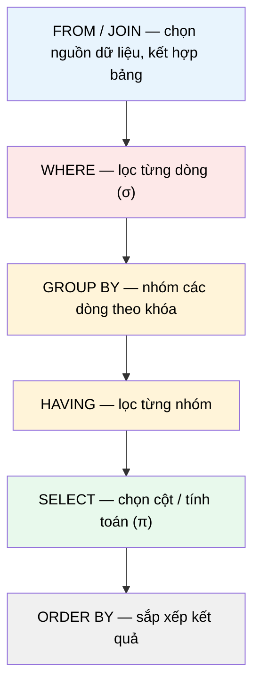

# MASTER COMPUTER SCIENCE HANDBOOK

## Volume 02 — Computer Science Foundations
### Part VII — Database Systems
## Chương 7.2 — SQL
### (Structured Query Language)

---

### Thông tin chương

| Trường | Giá trị |
|---|---|
| Chương | 7.2 |
| Thuộc Part | VII — Database Systems |
| Thuộc Volume | 02 — Computer Science Foundations |
| Thời gian đọc ước tính | 60–75 phút |
| Độ khó | ★★★☆☆ |
| Kiến thức tiên quyết | Chương 7.1 — Relational Model (đặc biệt Mục 6–7: Schema, Key, Đại số Quan hệ); Volume 1, Chương 1.5 — Set Theory (phép Hợp/Giao/Hiệu) |
| Chương liên quan | 7.3 — Transactions and ACID (câu lệnh SQL bên trong một giao dịch); 7.4 — Indexing (chỉ mục ảnh hưởng trực tiếp đến tốc độ thực thi câu lệnh SQL) |
| Từ khóa | DDL, DML, DQL, SELECT, JOIN, GROUP BY, aggregate function, subquery, UNION, INTERSECT, EXCEPT |

---

### Mục tiêu học tập

Sau khi hoàn thành chương này, người đọc có thể:

- Phân biệt ba nhóm lệnh SQL: **DDL** (định nghĩa cấu trúc), **DML** (thao tác dữ liệu), và **DQL** (truy vấn dữ liệu).
- Viết thành thạo câu lệnh `SELECT` kết hợp `WHERE`, `ORDER BY`, `GROUP BY`, `HAVING`, và giải thích ý nghĩa hình thức của từng mệnh đề dựa trên Đại số Quan hệ đã học ở Chương 7.1.
- Viết đúng bốn loại `JOIN` (`INNER`, `LEFT`, `RIGHT`, `FULL`) và giải thích sự khác biệt bằng ví dụ dữ liệu cụ thể.
- Sử dụng **Subquery** (truy vấn con) trong `WHERE`, `FROM`, và mệnh đề `SELECT`.
- Áp dụng đúng ba phép toán tập hợp `UNION`, `INTERSECT`, `EXCEPT`, liên hệ trực tiếp với phép Hợp/Giao/Hiệu đã học ở Chương 1.5.
- Nhận diện được các lỗi phổ biến khi viết SQL, đặc biệt liên quan đến `NULL` và `GROUP BY`.

---

### Câu hỏi khơi gợi

> *Vì sao câu lệnh `SELECT DISTINCT name FROM student WHERE gpa > 3.5` lại đọc gần như một câu tiếng Anh bình thường, trong khi hầu hết ngôn ngữ lập trình khác đòi hỏi bạn phải viết vòng lặp, điều kiện, biến tạm? Và điều gì xảy ra "phía sau" khi bạn nhấn Enter — cơ sở dữ liệu thực sự làm gì với câu lệnh khai báo (declarative) đó?*

---

## 1. Tổng quan chương

Chương 7.1 đã xây dựng nền tảng toán học: Relation, Key, và ba phép toán cốt lõi của Đại số Quan hệ — Selection ($\sigma$), Projection ($\pi$), Join ($\bowtie$). Chương này hiện thực hóa toàn bộ nền tảng đó thành **SQL (Structured Query Language)** — ngôn ngữ mà gần như mọi kỹ sư phần mềm trên thế giới đều chạm tới, dù họ làm backend, data engineering, hay phân tích dữ liệu.

Điều khiến SQL đặc biệt so với các ngôn ngữ lập trình bạn đã quen thuộc (JavaScript, Python, Java) là tính chất **khai báo (declarative)**: bạn mô tả **bạn muốn gì** (ví dụ: "tên các sinh viên có GPA trên 3.5"), chứ không mô tả **cách lấy nó** (không cần viết vòng lặp, không cần tự quản lý bộ nhớ tạm). Việc "cách lấy nó như thế nào" được giao hoàn toàn cho **Query Optimizer** của hệ quản trị cơ sở dữ liệu — chủ đề sẽ đào sâu ở Chương 7.5.

Chương này cũng là nơi Bảng 7.1.1 ở chương trước — bảng ánh xạ Đại số Quan hệ sang cú pháp SQL — được mở rộng đầy đủ và áp dụng thực hành trên các ví dụ cụ thể.

> **💡 Insight**
> SQL không phải một "ngoại lệ đặc biệt" cần học thuộc lòng cú pháp — nó là **bản dịch trực tiếp** của Đại số Quan hệ sang một ngôn ngữ gần với tiếng Anh tự nhiên. Nếu bạn đã hiểu vững Mục 7 của Chương 7.1, phần lớn cú pháp SQL trong chương này sẽ trở nên **hiển nhiên** thay vì phải ghi nhớ máy móc.

---

## 2. Bối cảnh lịch sử

| Thời điểm | Nhân vật / Sự kiện | Đóng góp |
|---|---|---|
| 1970 | Edgar F. Codd | Công bố Mô hình Quan hệ (Chương 7.1) — nhưng chưa đề xuất một ngôn ngữ truy vấn cụ thể |
| 1974 | Donald Chamberlin, Raymond Boyce (IBM) | Thiết kế SEQUEL (Structured English Query Language) — hiện thực hóa Đại số Quan hệ của Codd thành cú pháp gần tiếng Anh tự nhiên |
| 1979 | Oracle | SQL (đổi tên từ SEQUEL vì lý do bản quyền) được thương mại hóa lần đầu trong hệ quản trị cơ sở dữ liệu Oracle |
| 1986 | ANSI, sau đó ISO (1987) | SQL trở thành chuẩn quốc tế — SQL-86, sau đó liên tục cập nhật (SQL-92, SQL:1999 bổ sung Recursive Query, SQL:2003 bổ sung Window Function...) |
| Hiện tại | PostgreSQL, MySQL, SQL Server, Oracle, SQLite... | Mỗi hệ quản trị hiện thực hóa chuẩn SQL với một số phần mở rộng riêng (dialect), nhưng phần cốt lõi (được trình bày trong chương này) tương thích cao giữa các hệ |

Một điểm thú vị về mặt thiết kế ngôn ngữ: Chamberlin và Boyce cố tình thiết kế SQL để đọc **gần với câu tiếng Anh** (`SELECT ... FROM ... WHERE ...`) nhằm giúp cả những người không chuyên lập trình (như nhân viên kinh doanh, nhà phân tích) cũng có thể truy vấn dữ liệu trực tiếp — một mục tiêu thiết kế khác biệt hẳn so với các ngôn ngữ lập trình mệnh lệnh (imperative) cùng thời.

---

## 3. Động lực

Quay lại ví dụ hệ thống sinh viên–khóa học ở Chương 7.1. Giả sử bạn cần trả lời câu hỏi nghiệp vụ: *"Liệt kê tên và email của các sinh viên đã đăng ký ít nhất 3 khóa học, sắp xếp theo số khóa học đăng ký giảm dần."*

Nếu không có SQL, bạn buộc phải tự viết logic bằng ngôn ngữ lập trình thông thường: đọc toàn bộ bảng `Enrollment` vào bộ nhớ, tự đếm số lần xuất hiện của mỗi `student_id`, tự lọc những sinh viên có số đếm $\geq 3$, tự nối (join) với bảng `Student` để lấy tên và email, rồi tự sắp xếp kết quả. Đây là hàng chục dòng code, dễ sai sót, và **hoàn toàn không tận dụng được** các tối ưu hóa mà hệ quản trị cơ sở dữ liệu đã xây dựng sẵn (Index ở Chương 7.4, Query Optimizer ở Chương 7.5).

Với SQL, toàn bộ yêu cầu trên được diễn đạt trong một câu lệnh duy nhất:

```sql
SELECT s.name, s.email, COUNT(e.course_id) AS num_courses
FROM Student s
JOIN Enrollment e ON s.student_id = e.student_id
GROUP BY s.student_id, s.name, s.email
HAVING COUNT(e.course_id) >= 3
ORDER BY num_courses DESC;
```

Chương này giải thích chi tiết ý nghĩa của từng mệnh đề trong câu lệnh trên.

---

## 4. Trực giác

**Mô hình tinh thần (Mental Model) của chương này:**

> Một câu lệnh `SELECT` giống như một **dây chuyền lắp ráp (assembly line)**: dữ liệu đi vào từ `FROM`, bị lọc bớt ở `WHERE`, được nhóm lại ở `GROUP BY`, bị lọc tiếp ở `HAVING`, rồi được "cắt gọt" thành các cột cần thiết ở `SELECT`, và cuối cùng được sắp xếp ở `ORDER BY`. Mỗi trạm trên dây chuyền tương ứng với đúng một phép toán đại số quan hệ đã học ở Chương 7.1.

| Trực giác kỹ thuật bạn đã có | Khái niệm SQL tương ứng |
|---|---|
| `array.filter(x => x.gpa > 3.5)` | `WHERE gpa > 3.5` |
| `array.map(x => x.name)` | `SELECT name` |
| `array.reduce(...)` để nhóm theo khóa rồi đếm | `GROUP BY ... COUNT(...)` |
| Kết hợp hai mảng dựa trên khóa chung (như `Array.prototype.find` lồng vòng lặp) | `JOIN ... ON ...` |
| `new Set([...a, ...b])` | `UNION` |

---

## 5. Trực quan hóa khái niệm

**Hình 7.2.1 — Thứ tự xử lý logic của câu lệnh SELECT**
*(Visual đặc trưng của chương — Chapter Identity)*



| Trường thông tin | Nội dung |
|---|---|
| Mục đích | Cho thấy **thứ tự xử lý logic** (logical order) của các mệnh đề SQL — khác với thứ tự **viết cú pháp** (`SELECT` được viết đầu tiên nhưng được xử lý gần cuối) |
| Điểm mấu chốt | Đây chính là lý do vì sao `WHERE` **không thể** dùng kết quả của hàm tổng hợp (`COUNT`, `SUM`) — vì `WHERE` chạy trước `GROUP BY`, trong khi `HAVING` chạy sau nên dùng được (xem Mục 6 và cảnh báo ở Mục 6.4) |

---

**Hình 7.2.2 — Bốn loại JOIN qua Venn Diagram**

```text
INNER JOIN                LEFT JOIN                 FULL OUTER JOIN
   (A ∩ B)                 (toàn bộ A, khớp B)         (A ∪ B)

  ┌───┬───┐                ┌───┬───┐                ┌───┬───┐
  │ A │▓▓▓│ B               │▓▓▓│▓▓▓│ B               │▓▓▓│▓▓▓│ B
  └───┴───┘                └───┴───┘                └───┴───┘
   chỉ phần giao          toàn bộ A + phần giao      toàn bộ A + toàn bộ B
```

*Mục đích:* Đối chiếu trực tiếp với Hình 1.5.1 (Venn Diagram cho phép toán tập hợp, Chương 1.5) — bốn loại JOIN thực chất là bốn cách khác nhau để xử lý phần dữ liệu "không khớp" giữa hai bảng. *Điểm mấu chốt:* `INNER JOIN` tương ứng chính xác với Natural Join $\bowtie$ đã định nghĩa ở Chương 7.1, Mục 7.3 — các loại `OUTER JOIN` là phần mở rộng để giữ lại dữ liệu không khớp, điền `NULL` vào chỗ trống.

---

## 6. Định nghĩa hình thức

SQL được chia thành ba nhóm lệnh chính:

> **📌 Remember — Ba nhóm lệnh SQL**
>
> - **DDL (Data Definition Language):** định nghĩa cấu trúc — `CREATE TABLE`, `ALTER TABLE`, `DROP TABLE`. Tương ứng với việc định nghĩa **Schema** ở Chương 7.1.
> - **DML (Data Manipulation Language):** thay đổi dữ liệu — `INSERT`, `UPDATE`, `DELETE`. Tương ứng với việc thay đổi **Instance** của Relation.
> - **DQL (Data Query Language):** truy vấn dữ liệu — chủ yếu là `SELECT`. Đây là trọng tâm của chương này, vì nó hiện thực hóa trực tiếp Đại số Quan hệ.

### 6.1 Cú pháp DDL cơ bản

```sql
CREATE TABLE Student (
    student_id INT PRIMARY KEY,
    name       VARCHAR(100) NOT NULL,
    email      VARCHAR(100) UNIQUE,
    gpa        DECIMAL(3,2)
);

CREATE TABLE Enrollment (
    student_id INT REFERENCES Student(student_id),
    course_id  VARCHAR(10),
    PRIMARY KEY (student_id, course_id)
);
```

Chú ý: `PRIMARY KEY`, `REFERENCES`, `UNIQUE` là hiện thân trực tiếp của Primary Key, Foreign Key, và Candidate Key đã định nghĩa hình thức ở Chương 7.1, Mục 6.

### 6.2 Cú pháp DML cơ bản

```sql
INSERT INTO Student (student_id, name, email, gpa)
VALUES (1, 'An', 'an@example.com', 3.6);

UPDATE Student SET gpa = 3.8 WHERE student_id = 1;

DELETE FROM Student WHERE student_id = 1;
```

### 6.3 Cú pháp SELECT tổng quát

```sql
SELECT [DISTINCT] danh_sách_cột
FROM bảng_1 [JOIN bảng_2 ON điều_kiện]
[WHERE điều_kiện_lọc_dòng]
[GROUP BY danh_sách_cột_nhóm]
[HAVING điều_kiện_lọc_nhóm]
[ORDER BY danh_sách_cột [ASC|DESC]];
```

Đây chính là hiện thực hóa đầy đủ của Hình 7.2.1: mỗi phần trong ngoặc vuông là một trạm tùy chọn trên dây chuyền xử lý.

### 6.4 NULL — giá trị đặc biệt

> **⚠️ Common Mistake**
> `NULL` không phải là "giá trị bằng 0" hay "chuỗi rỗng" — nó biểu diễn **sự vắng mặt của giá trị**. Vì vậy, `NULL = NULL` cho kết quả `NULL` (không phải `TRUE`), và mọi so sánh với `NULL` trong `WHERE` đều bị loại bỏ khỏi kết quả trừ khi dùng `IS NULL` hoặc `IS NOT NULL`. Đây là lỗi phổ biến nhất với người mới học SQL: viết `WHERE email != 'x@y.com'` và ngạc nhiên khi các dòng có `email IS NULL` biến mất khỏi kết quả một cách "âm thầm" — không có lỗi cú pháp nào được báo, chỉ là kết quả sai lệch.

---

## 7. Nền tảng toán học

### 7.1 SELECT–FROM–WHERE như tổ hợp Đại số Quan hệ

- **Ý nghĩa:** một câu lệnh SQL cơ bản là tổ hợp trực tiếp của Selection và Projection đã học ở Chương 7.1.
- **Ví dụ đơn giản:** `SELECT name FROM Student WHERE gpa > 3.5` tương ứng với $\pi_{\text{name}}(\sigma_{\text{gpa} > 3.5}(\text{Student}))$.

> **📦 Formula Box — Ánh xạ SELECT sang Đại số Quan hệ**
>
> $$\text{SELECT } A_1,\dots,A_k \text{ FROM } R \text{ WHERE } \theta \;\equiv\; \pi_{A_1,\dots,A_k}\big(\sigma_{\theta}(R)\big)$$
>
> | Thành phần | Ý nghĩa |
> |---|---|
> | $\sigma_\theta(R)$ | Thực hiện **trước** — lọc dòng theo `WHERE`, đúng thứ tự logic ở Hình 7.2.1 |
> | $\pi_{A_1,\dots,A_k}$ | Thực hiện **sau** — chọn cột theo `SELECT` |
> | **Diễn giải kỹ thuật** | Đây là lý do thứ tự viết cú pháp (`SELECT` trước `WHERE`) và thứ tự xử lý thực tế (`WHERE` trước `SELECT`) không giống nhau — một nguồn nhầm lẫn phổ biến |
> | **Ứng dụng thường gặp** | Giải thích trực tiếp lỗi ở Mục 6.4: vì `WHERE` xử lý trước, các bí danh (alias) được đặt tên trong `SELECT` chưa tồn tại khi `WHERE` chạy, nên không thể dùng trong `WHERE` |

### 7.2 GROUP BY và Aggregate Function

- **Ý nghĩa:** `GROUP BY` chia Relation thành các **phân hoạch (partition)** rời nhau dựa trên giá trị của cột nhóm, sau đó áp dụng một hàm tổng hợp (aggregate function) lên từng phân hoạch.

> **📦 Formula Box — GROUP BY như phân hoạch tập hợp**
>
> Cho Relation $R$ và thuộc tính nhóm $A$, `GROUP BY A` tạo ra các nhóm:
>
> $$R = G_1 \cup G_2 \cup \dots \cup G_m, \quad G_i \cap G_j = \emptyset \text{ với } i \neq j$$
>
> trong đó mỗi $G_i$ chứa toàn bộ tuple có cùng giá trị thuộc tính $A$.
>
> | Thành phần | Ý nghĩa |
> |---|---|
> | $G_1, \dots, G_m$ | Các nhóm rời nhau — chính là khái niệm **phân hoạch tập hợp (set partition)**, một mở rộng trực tiếp từ Chương 1.5 |
> | **Diễn giải kỹ thuật** | `HAVING` lọc trên **từng nhóm** $G_i$ (sau khi đã áp dụng hàm tổng hợp), trong khi `WHERE` lọc trên **từng tuple** trước khi nhóm — đây là lý do hình thức cho quy tắc ở Mục 6.4 |
> | **Ứng dụng thường gặp** | `COUNT`, `SUM`, `AVG`, `MIN`, `MAX` — mỗi hàm nhận một nhóm $G_i$ làm đầu vào, trả về một giá trị duy nhất |

### 7.3 Subquery như phép hợp thành hàm

- **Ý nghĩa:** một Subquery (truy vấn con) là một biểu thức Đại số Quan hệ được dùng làm **đầu vào** cho một biểu thức khác — tương tự hợp thành hàm (function composition) trong toán học.

```sql
-- Sinh viên có GPA cao hơn GPA trung bình toàn trường
SELECT name FROM Student
WHERE gpa > (SELECT AVG(gpa) FROM Student);
```

Biểu thức trên tương ứng với $\pi_{\text{name}}\big(\sigma_{\text{gpa} > \text{avg}(\pi_{\text{gpa}}(\text{Student}))}(\text{Student})\big)$ — Subquery bên trong được **tính trước**, kết quả của nó trở thành một hằng số dùng trong điều kiện Selection bên ngoài.

---

## 8. Thuật toán / Cơ chế

**Quy trình xử lý logic của một câu lệnh `SELECT`** (mở rộng chi tiết từ Hình 7.2.1):

```text
Bước 1 — FROM: xác định (các) bảng nguồn
        │
        ▼
Bước 2 — JOIN: kết hợp các bảng nguồn theo điều kiện ON
        │       (thực hiện Natural Join / Outer Join, xem Hình 7.2.2)
        ▼
Bước 3 — WHERE: lọc từng dòng của kết quả JOIN (phép σ)
        │
        ▼
Bước 4 — GROUP BY: chia kết quả đã lọc thành các nhóm rời nhau
        │
        ▼
Bước 5 — Áp dụng Aggregate Function (COUNT, SUM, AVG...) trên từng nhóm
        │
        ▼
Bước 6 — HAVING: lọc các nhóm dựa trên kết quả tổng hợp ở Bước 5
        │
        ▼
Bước 7 — SELECT: chọn cột / biểu thức cần trả về (phép π)
        │
        ▼
Bước 8 — DISTINCT (nếu có): loại bỏ dòng trùng lặp
        │
        ▼
Bước 9 — ORDER BY: sắp xếp kết quả cuối cùng
        │
        ▼
Bước 10 — LIMIT (nếu có): giới hạn số dòng trả về
```

> **💡 Insight**
> Đây là quy trình **logic** — hệ quản trị cơ sở dữ liệu thực tế **không nhất thiết** thực thi tuần tự đúng như trên. Query Optimizer (Chương 7.5) có thể sắp xếp lại thứ tự thực thi vật lý (ví dụ: áp dụng `WHERE` trước cả `JOIN` nếu điều kiện chỉ liên quan một bảng) miễn là kết quả cuối cùng **tương đương về mặt logic**. Đây chính là giá trị của việc tách biệt mô hình logic khỏi cách thực thi vật lý — nguyên tắc thiết kế cốt lõi của Codd đã nêu ở Chương 7.1, Mục 2.

---

## 9. Triển khai

```python
import sqlite3

# Kết nối tới một cơ sở dữ liệu SQLite trong bộ nhớ (chỉ để minh họa)
conn = sqlite3.connect(":memory:")
cur = conn.cursor()

# --- DDL: định nghĩa schema, tương ứng Mục 6.1 ---
cur.execute("""
    CREATE TABLE Student (
        student_id INTEGER PRIMARY KEY,
        name       TEXT NOT NULL,
        gpa        REAL
    )
""")
cur.execute("""
    CREATE TABLE Enrollment (
        student_id INTEGER REFERENCES Student(student_id),
        course_id  TEXT
    )
""")

# --- DML: thêm dữ liệu, tương ứng Mục 6.2 ---
students = [(1, 'An', 3.6), (2, 'Binh', 3.2), (3, 'Chi', 3.9)]
enrollments = [(1, 'C101'), (1, 'C102'), (2, 'C101')]
cur.executemany("INSERT INTO Student VALUES (?, ?, ?)", students)
cur.executemany("INSERT INTO Enrollment VALUES (?, ?)", enrollments)

# --- DQL: truy vấn tổng hợp, tương ứng Mục 3 ---
cur.execute("""
    SELECT s.name, COUNT(e.course_id) AS num_courses
    FROM Student s
    JOIN Enrollment e ON s.student_id = e.student_id
    GROUP BY s.student_id, s.name
    HAVING COUNT(e.course_id) >= 1
    ORDER BY num_courses DESC
""")
for row in cur.fetchall():
    print(row)
```

Đoạn code trên chạy được trực tiếp (SQLite tích hợp sẵn trong thư viện chuẩn Python), minh họa đầy đủ ba nhóm lệnh DDL/DML/DQL đã định nghĩa ở Mục 6, dùng chính dữ liệu ví dụ từ Chương 7.1, Mục 10.

---

## 10. Trực quan hóa quá trình thực thi

**Chạy đoạn code ở Mục 9, kết quả thực tế:**

```text
('An', 2)
('Binh', 1)
```

**Diễn giải từng bước theo quy trình ở Mục 8:**

| Bước | Trạng thái trung gian |
|---|---|
| FROM + JOIN | 3 dòng: (An,C101), (An,C102), (Binh,C101) — giống Bảng Join ở Chương 7.1, Mục 10 |
| WHERE | Không có `WHERE` trong câu lệnh này — giữ nguyên 3 dòng |
| GROUP BY student_id | 2 nhóm: {An: 2 dòng}, {Binh: 1 dòng} |
| COUNT(course_id) | An → 2, Binh → 1 |
| HAVING >= 1 | Cả hai nhóm đều thỏa, giữ nguyên |
| SELECT name, COUNT | ('An', 2), ('Binh', 1) |
| ORDER BY num_courses DESC | ('An', 2) đứng trước ('Binh', 1) |

Bảng trên cho thấy trực tiếp cách quy trình 10 bước ở Mục 8 áp dụng lên một ví dụ cụ thể, từng bước một.

---

## 11. Ứng dụng công nghiệp

> **🛠 Engineering Practice**
> SQL là kỹ năng nền tảng gần như bắt buộc cho mọi vai trò liên quan đến dữ liệu trong ngành công nghiệp phần mềm.

| Bối cảnh công nghiệp | Vai trò của SQL |
|---|---|
| Backend API (REST, GraphQL) | Mọi request đọc/ghi dữ liệu cuối cùng đều chuyển thành câu lệnh SQL, dù trực tiếp hay thông qua ORM |
| Business Intelligence / Data Analytics | Câu lệnh `GROUP BY` kết hợp `JOIN` nhiều bảng (Mục 7.2, Mục 8) là công cụ chính để tạo báo cáo doanh thu, phân tích hành vi người dùng |
| Data Warehouse (Snowflake, BigQuery, Redshift) | Sử dụng phương ngữ SQL mở rộng, nhưng cốt lõi vẫn dựa trên đúng quy trình xử lý logic ở Mục 8 |
| Phỏng vấn kỹ thuật (technical interview) | SQL là một trong những kỹ năng được kiểm tra phổ biến nhất cho vị trí Backend Engineer và Data Engineer |

---

## 12. Góc nhìn nghiên cứu

> **🔬 Research Connection**
> SQL, dù đã hơn 50 năm tuổi, vẫn là chủ đề nghiên cứu tích cực — đặc biệt ở khía cạnh **tối ưu hóa thực thi truy vấn phức tạp trên dữ liệu quy mô lớn**.

Các câu lệnh SQL hiện đại đã mở rộng rất xa so với phiên bản gốc thời Chamberlin và Boyce (1974): **Window Function** (SQL:2003) cho phép tính toán tổng hợp mà không cần `GROUP BY` gộp dòng; **Common Table Expression — CTE** (`WITH ... AS`) cho phép viết truy vấn đệ quy, dùng để xử lý dữ liệu dạng cây/đồ thị (ví dụ: tổ chức nhân sự phân cấp) — chủ đề sẽ liên hệ lại khi học Graph Algorithms ở Volume 3.

**Hướng nghiên cứu hiện tại:** tối ưu hóa SQL trên hệ thống phân tán (distributed SQL), nơi một câu `JOIN` đơn giản có thể yêu cầu di chuyển dữ liệu giữa hàng trăm máy chủ — bài toán trọng tâm của các hệ thống như Google Spanner, CockroachDB, sẽ được phân tích sâu ở Volume 4. Ngoài ra, sự trỗi dậy của Large Language Model đã mở ra hướng nghiên cứu **Text-to-SQL** — dịch tự động ngôn ngữ tự nhiên thành câu lệnh SQL chính xác, một bài toán sẽ được đề cập lại ở Volume 6 (Generative AI).

---

## 13. Ưu điểm

- **Tính khai báo (declarative)** — người viết mô tả kết quả mong muốn, không cần tự cài đặt thuật toán truy xuất; hệ quản trị tự do lựa chọn cách thực thi hiệu quả nhất (liên hệ Mục 8, Insight).
- **Cú pháp gần ngôn ngữ tự nhiên**, dễ đọc và dễ bảo trì hơn nhiều so với việc viết logic truy xuất dữ liệu thủ công bằng ngôn ngữ lập trình mệnh lệnh.
- **Nền tảng lý thuyết chặt chẽ** (Đại số Quan hệ, Chương 7.1) cho phép các hệ quản trị khác nhau tối ưu hóa cùng một câu lệnh theo những cách khác nhau mà vẫn đảm bảo kết quả đúng.
- **Được chuẩn hóa quốc tế (ANSI/ISO)** — kỹ năng SQL có thể chuyển giao gần như nguyên vẹn giữa các hệ quản trị khác nhau.

---

## 14. Hạn chế

> **⚠️ Common Mistake**
> Nhầm lẫn giữa `WHERE` và `HAVING` là lỗi phổ biến bậc nhất: dùng `WHERE COUNT(*) > 3` sẽ báo lỗi cú pháp ở hầu hết hệ quản trị, vì tại thời điểm `WHERE` chạy (Bước 3, Mục 8), phép tổng hợp `COUNT` chưa được tính — phải dùng `HAVING COUNT(*) > 3` (Bước 6).

- **Không phù hợp để biểu diễn logic điều khiển phức tạp** (vòng lặp, đệ quy tổng quát) — dù CTE đệ quy (Mục 12) giải quyết được một phần, SQL vẫn chủ yếu là ngôn ngữ hướng tập hợp, không phải ngôn ngữ mệnh lệnh tổng quát.
- **Ngữ nghĩa `NULL` gây nhầm lẫn** (Mục 6.4) — là nguồn lỗi phổ biến ngay cả với lập trình viên có kinh nghiệm.
- **Sự khác biệt giữa các phương ngữ (dialect)** — dù cốt lõi được chuẩn hóa, các hàm nâng cao (xử lý ngày giờ, chuỗi, JSON) khác nhau đáng kể giữa PostgreSQL, MySQL, SQL Server, đòi hỏi phải tra cứu tài liệu riêng cho từng hệ.

---

## 15. So sánh

**Bảng 7.2.1 — Bốn loại JOIN: hành vi với dữ liệu không khớp**

| Loại JOIN | Giữ dòng không khớp ở bảng trái? | Giữ dòng không khớp ở bảng phải? | Tương ứng Đại số Quan hệ |
|---|---|---|---|
| `INNER JOIN` | Không | Không | $R \bowtie S$ (Chương 7.1, Mục 7.3) |
| `LEFT JOIN` | Có (điền `NULL`) | Không | Mở rộng của $\bowtie$, không có ký hiệu chuẩn trong Đại số Quan hệ cơ bản |
| `RIGHT JOIN` | Không | Có (điền `NULL`) | Tương đương `LEFT JOIN` với thứ tự bảng đảo ngược |
| `FULL OUTER JOIN` | Có | Có | Hợp của `LEFT JOIN` và `RIGHT JOIN` |

**Phân tích:** `INNER JOIN` là phép toán duy nhất trong bảng có nền tảng trực tiếp từ Đại số Quan hệ gốc của Codd (Chương 7.1) — các phép `OUTER JOIN` là **mở rộng thực dụng** được bổ sung vào SQL để giải quyết nhu cầu thực tế: "tôi muốn thấy tất cả sinh viên, kể cả những sinh viên chưa đăng ký khóa học nào." Nếu dùng `INNER JOIN` cho câu hỏi này, những sinh viên chưa đăng ký sẽ **biến mất hoàn toàn** khỏi kết quả — một lỗi nghiệp vụ tinh vi, dễ bỏ sót khi kiểm thử với dữ liệu mẫu đầy đủ nhưng gây sai lệch nghiêm trọng trên dữ liệu thực tế có nhiều giá trị thiếu.

---

## 16. Tóm tắt

- SQL gồm ba nhóm lệnh: **DDL** (định nghĩa Schema), **DML** (thay đổi Instance), **DQL** (truy vấn) — ánh xạ trực tiếp tới các khái niệm đã học ở Chương 7.1.
- Câu lệnh `SELECT` được xử lý theo một **thứ tự logic cố định** (Hình 7.2.1, Mục 8): `FROM/JOIN → WHERE → GROUP BY → HAVING → SELECT → ORDER BY` — khác với thứ tự viết cú pháp, và là nguồn gốc của nhiều lỗi phổ biến (Mục 6.4, Mục 14).
- `SELECT ... WHERE ...` là hiện thực trực tiếp của tổ hợp Projection và Selection ($\pi \circ \sigma$); `GROUP BY` tương ứng với phân hoạch tập hợp thành các nhóm rời nhau.
- Bốn loại `JOIN` xử lý khác nhau đối với dữ liệu không khớp giữa hai bảng (Bảng 7.2.1); chỉ `INNER JOIN` tương ứng trực tiếp với Natural Join của Codd, các `OUTER JOIN` là mở rộng thực dụng.
- `NULL` biểu diễn sự vắng mặt giá trị, có ngữ nghĩa logic ba trị (three-valued logic) khác với `TRUE`/`FALSE` thông thường — nguồn lỗi phổ biến cần đặc biệt cẩn trọng.

Chương 7.3 (Transactions and ACID) sẽ đặt các câu lệnh DML vừa học ở chương này (`INSERT`, `UPDATE`, `DELETE`) vào bối cảnh nhiều người dùng truy cập đồng thời — nơi thứ tự và tính nguyên tử của các thao tác trở thành vấn đề sống còn.

---

## 17. Bài tập

### Mức Cơ bản (Basic)

1. Viết câu lệnh `SELECT` lấy tên và GPA của các sinh viên có GPA trong khoảng từ 3.0 đến 3.8 (bao gồm hai đầu), sắp xếp theo GPA giảm dần.
2. Cho hai bảng `Student` và `Enrollment` như ở Mục 9, viết câu lệnh đếm số sinh viên **chưa đăng ký** bất kỳ khóa học nào. *(Gợi ý: cần dùng `LEFT JOIN` kết hợp `IS NULL`, xem Bảng 7.2.1.)*

### Mức Trung bình (Intermediate)

3. Viết lại câu lệnh ở Mục 3 (Động lực) nhưng bổ sung thêm điều kiện: chỉ tính các khóa học có mã bắt đầu bằng `'C1'`. Điều kiện này nên đặt ở `WHERE` hay `HAVING`? Giải thích dựa trên quy trình ở Mục 8.
4. Dùng Subquery, viết câu lệnh tìm sinh viên có GPA **cao nhất** trong toàn bộ bảng `Student`, không dùng `ORDER BY ... LIMIT 1`. *(Gợi ý: dùng `MAX()` trong subquery, tương tự ví dụ ở Mục 7.3.)*

### Mức Nâng cao (Advanced)

5. Cho hai bảng `Student_2023` và `Student_2024` (cùng schema), viết ba câu lệnh dùng `UNION`, `INTERSECT`, `EXCEPT` lần lượt để tìm: (a) toàn bộ sinh viên xuất hiện ở ít nhất một trong hai năm; (b) sinh viên có mặt ở cả hai năm; (c) sinh viên chỉ có ở 2023 nhưng không có ở 2024. Liên hệ trực tiếp với phép Hợp/Giao/Hiệu ở Chương 1.5, Mục 6.
6. Giải thích bằng ví dụ dữ liệu cụ thể: tại sao `COUNT(*)` và `COUNT(column_name)` có thể trả về kết quả khác nhau khi `column_name` chứa giá trị `NULL`.

### Mức Nghiên cứu (Research)

7. Tìm hiểu về **Window Function** (`OVER (PARTITION BY ...)`) — điểm khác biệt cốt lõi giữa Window Function và `GROUP BY` là gì, về mặt số dòng kết quả trả về? Viết một ví dụ minh họa cụ thể so sánh hai cách tiếp cận cho cùng một bài toán (ví dụ: xếp hạng sinh viên theo GPA trong từng lớp mà vẫn giữ nguyên toàn bộ số dòng gốc).

---

## 18. Dự án nhỏ

**Đề bài:** Dựa trên schema thư viện đã thiết kế ở Mini Project của Chương 7.1 (`Book`, `Member`, `Loan`), triển khai thực tế bằng SQLite hoặc PostgreSQL.

**Yêu cầu:**

- Viết đầy đủ câu lệnh DDL để tạo ba bảng, đảm bảo đúng Primary Key/Foreign Key.
- Chèn tối thiểu 10 bản ghi mẫu cho mỗi bảng bằng DML.
- Viết 5 câu truy vấn DQL, bắt buộc bao gồm: một câu dùng `JOIN`, một câu dùng `GROUP BY` + `HAVING`, một câu dùng Subquery, và một câu dùng `LEFT JOIN` để tìm dữ liệu "thiếu" (ví dụ: sách chưa từng được mượn).

**Mở rộng (tùy chọn):** Đo thời gian thực thi (`EXPLAIN ANALYZE` nếu dùng PostgreSQL) cho một truy vấn phức tạp trên tập dữ liệu lớn hơn (ví dụ 10.000 bản ghi được sinh ngẫu nhiên) — kết quả này sẽ được phân tích sâu hơn ở Chương 7.5.

---

## 19. Tự đánh giá

- [ ] Tôi có thể phân biệt rõ ràng DDL, DML, DQL và nêu ví dụ cho mỗi nhóm.
- [ ] Tôi có thể giải thích thứ tự xử lý logic của một câu `SELECT` phức tạp (Hình 7.2.1) mà không cần tra cứu lại.
- [ ] Tôi có thể viết đúng bốn loại JOIN và giải thích sự khác biệt bằng một ví dụ dữ liệu cụ thể có dòng không khớp.
- [ ] Tôi hiểu vì sao `WHERE` không dùng được với hàm tổng hợp nhưng `HAVING` thì được — không chỉ ghi nhớ quy tắc, mà hiểu lý do hình thức (Mục 7.2).
- [ ] Tôi có thể giải thích ngữ nghĩa của `NULL` và tránh được lỗi phổ biến liên quan đến nó (Mục 6.4).
- [ ] Tôi đã hoàn thành Mini Project ở Mục 18 và chạy được ít nhất một truy vấn có Subquery.

Nếu Bài tập 5 (UNION/INTERSECT/EXCEPT) còn khó khăn, nên quay lại ôn nhanh Chương 1.5, Mục 6 (các phép toán tập hợp) trước khi tiếp tục — sự tương ứng giữa hai chương này là nền tảng cho việc hiểu SQL một cách hệ thống thay vì ghi nhớ rời rạc.

---

## 20. Đọc thêm

- **Sách:** Silberschatz, Korth, Sudarshan, *Database System Concepts* — Chương 3–5 (SQL cơ bản đến nâng cao). *(Xem `BOOKS.md` — Volume 4.)*
- **Tài liệu chính thức:** Tài liệu SQL của PostgreSQL (`https://www.postgresql.org/docs/`) — tham khảo chuẩn cho phần lớn ví dụ trong chương này.
- **Chủ đề mở rộng (không bắt buộc):** tìm đọc về Common Table Expression (CTE) đệ quy — công cụ mạnh để xử lý dữ liệu dạng cây/đồ thị bằng SQL thuần, sẽ hữu ích khi học Graph Algorithms ở Volume 3.
- **Chương tiếp theo:** Chương 7.3 — Transactions and ACID.

---

### Liên kết chương (Cross References)

- **Chương trước:** 7.1 — Relational Model (nền tảng Đại số Quan hệ cho toàn bộ cú pháp SQL trong chương này, đặc biệt Bảng 7.1.1 và Mục 7).
- **Chương tiếp theo:** 7.3 — Transactions and ACID (đặt các câu lệnh DML vào bối cảnh nhiều người dùng đồng thời).
- **Chương liên quan xa hơn:** 7.4 — Indexing (tốc độ thực thi các câu SELECT trong chương này phụ thuộc trực tiếp vào chỉ mục); 7.5 — Query Optimization (cách hệ quản trị thực thi câu lệnh SQL không nhất thiết theo đúng thứ tự logic ở Mục 8).
- **Vị trí trong Knowledge Graph:** Nút thứ hai của Volume 2, Part VII; phụ thuộc trực tiếp vào Chương 7.1; là điều kiện tiên quyết cho toàn bộ các chương thực hành còn lại của Part VII.

---

*Hết Chương 7.2. Chương này tuân thủ cấu trúc 20 mục của `OUTPUT.md` và chuẩn Presentation Layer của `WRITING_STANDARD.md`, nhất quán với văn phong đã thiết lập ở Chương 7.1 và Chương 1.5 (`V01_P01_C05`). Đang chờ rà soát trước khi tiếp tục sang Chương 7.3 — Transactions and ACID.*
