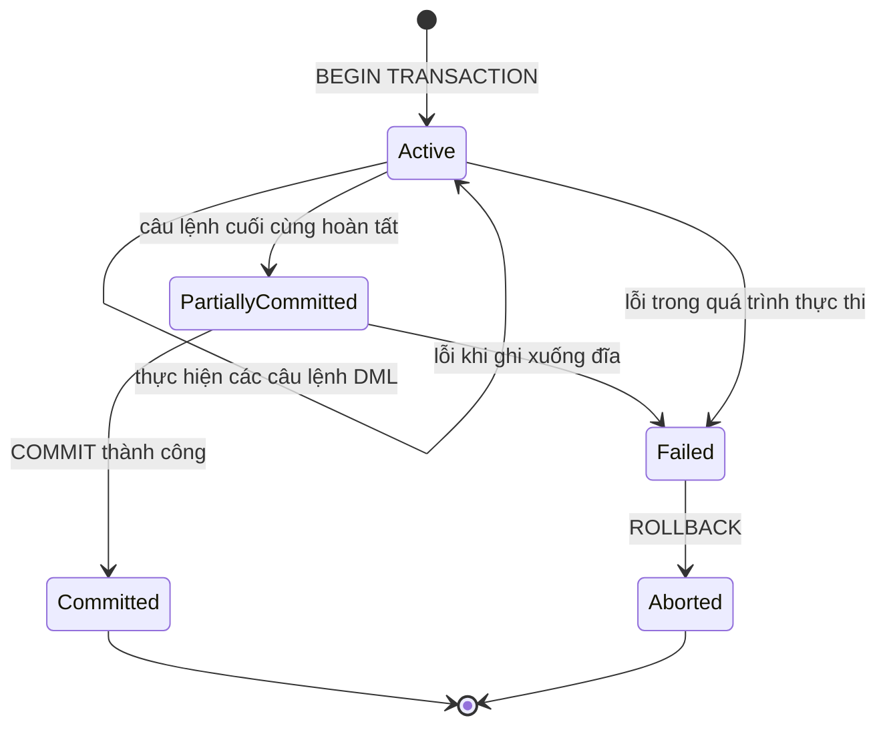

# MASTER COMPUTER SCIENCE HANDBOOK

## Volume 02 — Computer Science Foundations
### Part VII — Database Systems
## Chương 7.3 — Giao dịch và ACID
### (Transactions and ACID)

---

### Thông tin chương

| Trường | Giá trị |
|---|---|
| Chương | 7.3 |
| Thuộc Part | VII — Database Systems |
| Thuộc Volume | 02 — Computer Science Foundations |
| Thời gian đọc ước tính | 55–70 phút |
| Độ khó | ★★★★☆ |
| Kiến thức tiên quyết | Chương 7.2 — SQL (đặc biệt các lệnh DML: `INSERT`, `UPDATE`, `DELETE`); Volume 2, Part VI — Operating Systems (Process, Concurrency, Synchronization) |
| Chương liên quan | 7.4 — Indexing (khóa trên index ảnh hưởng trực tiếp đến Isolation); Volume 4 — Distributed Systems (Transaction phân tán, Consensus) |
| Từ khóa | transaction, ACID, atomicity, consistency, isolation, durability, isolation level, dirty read, lost update, phantom read, locking |

---

### Mục tiêu học tập

Sau khi hoàn thành chương này, người đọc có thể:

- Định nghĩa **Transaction** một cách hình thức, và giải thích vì sao cần nhóm nhiều thao tác DML thành một đơn vị duy nhất.
- Giải thích chi tiết bốn tính chất **ACID** (Atomicity, Consistency, Isolation, Durability), kèm ví dụ kỹ thuật cụ thể cho từng tính chất.
- Nhận diện ba loại **Concurrency Anomaly** phổ biến: Dirty Read, Lost Update, Phantom Read.
- Phân biệt bốn **Isolation Level** chuẩn SQL (`READ UNCOMMITTED`, `READ COMMITTED`, `REPEATABLE READ`, `SERIALIZABLE`) và biết mỗi mức ngăn được những anomaly nào.
- Giải thích cơ chế **Locking** cơ bản (Shared Lock, Exclusive Lock) và mối liên hệ với Isolation Level.
- Đưa ra quyết định kỹ thuật hợp lý về việc chọn Isolation Level phù hợp cho một tình huống nghiệp vụ cụ thể.

---

### Câu hỏi khơi gợi

> *Khi bạn chuyển khoản 1 triệu đồng từ tài khoản A sang tài khoản B, hệ thống ngân hàng phải thực hiện ít nhất hai thao tác: trừ tiền ở A, cộng tiền ở B. Điều gì xảy ra nếu server bị mất điện đột ngột **ngay giữa hai thao tác đó** — sau khi đã trừ tiền ở A nhưng chưa kịp cộng vào B? Và điều gì xảy ra nếu, cùng lúc đó, một giao dịch khác đang đọc số dư tài khoản A để tính lãi suất?*

---

## 1. Tổng quan chương

Chương 7.2 đã trang bị cho bạn khả năng viết các câu lệnh `INSERT`, `UPDATE`, `DELETE` để thay đổi dữ liệu. Nhưng trong thực tế, một thao tác nghiệp vụ hiếm khi chỉ gồm **một** câu lệnh SQL đơn lẻ — chuyển khoản ngân hàng cần ít nhất hai câu `UPDATE`; đặt hàng trực tuyến cần một `INSERT` vào bảng đơn hàng và một `UPDATE` giảm số lượng tồn kho. Chương này giải quyết câu hỏi: **làm sao đảm bảo một nhóm nhiều thao tác được xem là "tất cả hoặc không gì cả", ngay cả khi có sự cố hệ thống hoặc nhiều người dùng truy cập đồng thời?**

Câu trả lời là khái niệm **Transaction (Giao dịch)**, cùng bốn tính chất đảm bảo tính đúng đắn của nó — được gói gọn trong từ viết tắt nổi tiếng **ACID**. Đây là một trong những đóng góp quan trọng nhất của lý thuyết cơ sở dữ liệu cho toàn ngành công nghiệp phần mềm, và là chủ đề mà gần như mọi hệ thống backend nghiêm túc — từ ngân hàng đến thương mại điện tử — đều phải hiểu đúng.

Chương này cũng là nơi kiến thức về **Concurrency** và **Synchronization** đã học ở Volume 2, Part VI (Operating Systems) quay trở lại trong một bối cảnh cụ thể: thay vì đồng bộ hóa nhiều luồng (thread) truy cập bộ nhớ chung, ở đây chúng ta đồng bộ hóa nhiều Transaction truy cập dữ liệu chung.

> **💡 Insight**
> ACID không phải bốn khái niệm độc lập ngẫu nhiên được ghép lại — chúng là **bốn câu trả lời cho bốn câu hỏi thất bại khác nhau**: Atomicity trả lời "điều gì xảy ra nếu giao dịch bị dừng giữa chừng?"; Consistency trả lời "điều gì xảy ra nếu dữ liệu vi phạm ràng buộc nghiệp vụ?"; Isolation trả lời "điều gì xảy ra nếu nhiều giao dịch chạy cùng lúc?"; Durability trả lời "điều gì xảy ra nếu hệ thống mất điện ngay sau khi giao dịch hoàn tất?". Hiểu ACID theo bốn câu hỏi này dễ nhớ hơn nhiều so với học thuộc bốn cái tên.

---

## 2. Bối cảnh lịch sử

| Thời điểm | Nhân vật / Sự kiện | Đóng góp |
|---|---|---|
| Thập niên 1970 | Jim Gray (IBM) | Đặt nền móng lý thuyết cho khái niệm Transaction trong hệ thống cơ sở dữ liệu, đặc biệt về khôi phục sau sự cố (recovery) và điều khiển tương tranh (concurrency control) |
| 1981 | Jim Gray | Công bố bài báo *The Transaction Concept: Virtues and Limitations* — hình thức hóa các thuộc tính cần thiết của một Transaction đáng tin cậy |
| 1983 | Theo Härder, Andreas Reuter | Đặt tên chính thức cho từ viết tắt **ACID** trong bài báo *Principles of Transaction-Oriented Database Recovery*, hệ thống hóa bốn tính chất đã được thực hành rời rạc trước đó |
| 1990s–nay | Các hệ quản trị thương mại (Oracle, DB2, SQL Server, PostgreSQL) | Hiện thực hóa đầy đủ ACID với các cơ chế Locking, Multi-Version Concurrency Control (MVCC), Write-Ahead Logging (WAL) |

Jim Gray sau này nhận **Giải thưởng Turing năm 1998** — giải thưởng cao quý nhất trong ngành Khoa học Máy tính — chính vì những đóng góp nền tảng cho lý thuyết Transaction, cho thấy tầm quan trọng của chủ đề tưởng chừng "chỉ là kỹ thuật thực hành" này đối với cả ngành khoa học lý thuyết.

---

## 3. Động lực

Hãy quay lại tình huống chuyển khoản ở phần Câu hỏi khơi gợi. Nếu bạn viết trực tiếp hai câu lệnh SQL độc lập, không có bất kỳ cơ chế bảo vệ nào:

```sql
UPDATE Account SET balance = balance - 1000000 WHERE account_id = 'A';
-- ⚡ Giả sử server mất điện NGAY TẠI ĐÂY
UPDATE Account SET balance = balance + 1000000 WHERE account_id = 'B';
```

Nếu sự cố xảy ra đúng vào thời điểm được đánh dấu, tài khoản A đã bị trừ 1 triệu đồng, nhưng tài khoản B chưa từng nhận được số tiền đó. **1 triệu đồng biến mất khỏi hệ thống** — không phải do lỗi logic nghiệp vụ, mà do thiếu một cơ chế đảm bảo "hai thao tác này phải cùng thành công hoặc cùng thất bại".

Tình huống thứ hai, tinh vi hơn: giả sử không có sự cố hệ thống, nhưng có **hai giao dịch chạy đồng thời** — một giao dịch đang chuyển khoản từ A sang B, một giao dịch khác đang đọc số dư của A để hiển thị cho người dùng. Nếu giao dịch đọc xảy ra đúng vào khoảnh khắc giữa hai câu `UPDATE` ở trên, người dùng sẽ thấy một số dư **chưa từng thực sự tồn tại một cách ổn định** — tiền đã bị trừ khỏi A nhưng hệ thống vẫn đang ở trạng thái trung gian.

Cả hai vấn đề trên — sự cố giữa chừng, và truy cập đồng thời — chính là động lực trực tiếp cho khái niệm Transaction và ACID.

---

## 4. Trực giác

**Mô hình tinh thần (Mental Model) của chương này:**

> Một **Transaction** giống như một **hợp đồng "tất cả hoặc không gì cả" (all-or-nothing contract)**: hoặc toàn bộ các điều khoản (thao tác) trong hợp đồng được thực hiện đầy đủ, hoặc hợp đồng bị hủy hoàn toàn như chưa từng tồn tại — không có trạng thái "thực hiện một nửa".

| Trực giác kỹ thuật bạn đã có | Khái niệm Transaction tương ứng |
|---|---|
| `try { ... } catch { rollback all changes }` trong lập trình mệnh lệnh | `BEGIN TRANSACTION ... COMMIT / ROLLBACK` |
| Git commit — một tập thay đổi được ghi nhận cùng lúc, hoặc không ghi nhận gì | Atomicity |
| Mutex/Lock trong lập trình đa luồng (Volume 2, Part VI) | Locking để đảm bảo Isolation |
| Ghi log trước khi thực hiện thao tác nguy hiểm, để có thể khôi phục | Write-Ahead Logging, đảm bảo Durability |

---

## 5. Trực quan hóa khái niệm

**Hình 7.3.1 — Vòng đời của một Transaction**
*(Visual đặc trưng của chương — Chapter Identity)*



| Trường thông tin | Nội dung |
|---|---|
| Mục đích | Cho thấy Transaction chỉ có **hai kết cục hợp lệ**: `Committed` (thành công hoàn toàn) hoặc `Aborted` (thất bại hoàn toàn, mọi thay đổi bị hoàn tác) — không có trạng thái trung gian nào được phép "lộ ra" cho các Transaction khác |
| Điểm mấu chốt | Trạng thái `PartiallyCommitted` là trạng thái **nội bộ**, tồn tại trong khoảnh khắc rất ngắn — đây chính là nơi Atomicity (Mục 6) phải đảm bảo: nếu sự cố xảy ra trong `PartiallyCommitted`, hệ thống bắt buộc quay về `Aborted`, không được để lại kết quả nửa vời |

---

**Hình 7.3.2 — Ba loại Concurrency Anomaly**

```text
DIRTY READ                    LOST UPDATE                    PHANTOM READ

T1: UPDATE x=100               T1: đọc x=50      T2: đọc x=50    T1: SELECT COUNT(*)
T2:        SELECT x  → 100     T1: ghi x=60                     T1: ...(đang xử lý)...
T1: ROLLBACK (x quay về 50)                      T2: ghi x=70    T2: INSERT một dòng mới
                                → mất cập nhật    T1: SELECT COUNT(*) → khác lần trước
                                của T1!
```

*Mục đích:* Minh họa cụ thể ba tình huống lỗi khi nhiều Transaction chạy đồng thời mà không được kiểm soát đúng mức. *Điểm mấu chốt:* mỗi anomaly là hệ quả của việc **Isolation không đủ mạnh** — Mục 7 sẽ định nghĩa hình thức từng loại, Mục 8 sẽ giải thích Isolation Level nào ngăn được anomaly nào.

---

## 6. Định nghĩa hình thức

> **📌 Remember — Transaction**
>
> Một **Transaction** là một chuỗi các thao tác đọc/ghi trên cơ sở dữ liệu, được xem là **một đơn vị công việc duy nhất (single unit of work)**. Một Transaction kết thúc bằng một trong hai lệnh:
> - `COMMIT` — xác nhận toàn bộ thay đổi là vĩnh viễn.
> - `ROLLBACK` — hủy toàn bộ thay đổi, đưa dữ liệu về trạng thái trước khi Transaction bắt đầu.

**Bốn tính chất ACID:**

| Tính chất | Định nghĩa hình thức | Câu hỏi thất bại tương ứng |
|---|---|---|
| **Atomicity** (Tính nguyên tử) | Mọi thao tác trong Transaction hoặc **đều được thực hiện**, hoặc **không thao tác nào được thực hiện** — không tồn tại trạng thái thực hiện một phần | "Điều gì xảy ra nếu hệ thống dừng giữa chừng?" |
| **Consistency** (Tính nhất quán) | Một Transaction chuyển cơ sở dữ liệu từ một trạng thái **hợp lệ** (thỏa mọi ràng buộc: Primary Key, Foreign Key, `CHECK`, ràng buộc nghiệp vụ) sang một trạng thái hợp lệ khác | "Điều gì xảy ra nếu dữ liệu vi phạm ràng buộc?" |
| **Isolation** (Tính cô lập) | Kết quả của việc thực thi đồng thời nhiều Transaction phải **tương đương** với kết quả của việc thực thi chúng **tuần tự theo một thứ tự nào đó** (tính chất gọi là **Serializability**) | "Điều gì xảy ra nếu nhiều Transaction chạy cùng lúc?" |
| **Durability** (Tính bền vững) | Khi một Transaction đã `COMMIT`, thay đổi của nó phải **tồn tại vĩnh viễn**, ngay cả khi hệ thống gặp sự cố (mất điện, crash) ngay sau đó | "Điều gì xảy ra nếu hệ thống mất điện ngay sau COMMIT?" |

> **⚠️ Common Mistake**
> Nhầm lẫn Consistency trong ACID với Consistency trong định lý CAP (sẽ gặp ở Volume 4). Consistency trong ACID nói về việc **duy trì ràng buộc dữ liệu** (ví dụ: tổng số dư không đổi sau chuyển khoản); Consistency trong CAP nói về việc **mọi bản sao dữ liệu phân tán nhìn thấy cùng một giá trị tại cùng thời điểm** — hai khái niệm liên quan nhưng không đồng nhất, và việc dùng chung một tên gọi là nguồn nhầm lẫn phổ biến trong ngành.

**Ba loại Concurrency Anomaly** (minh họa ở Hình 7.3.2):

- **Dirty Read:** một Transaction $T_2$ đọc dữ liệu do $T_1$ ghi nhưng **chưa `COMMIT`**. Nếu $T_1$ sau đó `ROLLBACK`, $T_2$ đã đọc phải dữ liệu "không bao giờ thực sự tồn tại".
- **Lost Update:** hai Transaction cùng đọc một giá trị, cùng tính toán dựa trên giá trị đó, rồi cùng ghi lại — kết quả ghi của Transaction chạy sau **ghi đè hoàn toàn** lên kết quả của Transaction chạy trước, khiến cập nhật của Transaction đầu bị "mất" một cách âm thầm.
- **Phantom Read:** một Transaction thực hiện cùng một truy vấn hai lần, nhưng lần thứ hai trả về **tập dòng khác** (do một Transaction khác đã `INSERT` hoặc `DELETE` dòng thỏa điều kiện đó ở giữa hai lần truy vấn).

---

## 7. Nền tảng toán học

### 7.1 Serializability như định nghĩa hình thức của Isolation

- **Ý nghĩa:** Isolation không có nghĩa là "các Transaction chạy tuần tự" (điều này quá chậm để chấp nhận trong thực tế) — mà có nghĩa là **kết quả cuối cùng phải giống như thể chúng đã chạy tuần tự**.

> **📦 Formula Box — Serializable Schedule**
>
> Một **Schedule** $S$ (thứ tự xen kẽ các thao tác đọc/ghi của nhiều Transaction) được gọi là **Serializable** nếu tồn tại một thứ tự tuần tự $T_{i_1}, T_{i_2}, \dots, T_{i_n}$ của các Transaction sao cho:
>
> $$\text{kết quả}(S) = \text{kết quả}(T_{i_1} \to T_{i_2} \to \dots \to T_{i_n})$$
>
> | Thành phần | Ý nghĩa |
> |---|---|
> | $S$ | Lịch thực thi thực tế, trong đó các thao tác của nhiều Transaction có thể xen kẽ nhau về thời gian |
> | $T_{i_1} \to \dots \to T_{i_n}$ | Một thứ tự tuần tự **giả định** — không nhất thiết là thứ tự bắt đầu thực tế của các Transaction |
> | **Diễn giải kỹ thuật** | Hệ quản trị **được phép** cho các Transaction chạy xen kẽ (để tận dụng song song hóa, tăng hiệu năng), miễn là kết quả cuối cùng không thể phân biệt được với một cách sắp xếp tuần tự nào đó |
> | **Ứng dụng thường gặp** | Là tiêu chuẩn lý thuyết mà mức cô lập `SERIALIZABLE` (Mục 8) cố gắng đảm bảo đầy đủ; các mức thấp hơn chấp nhận đánh đổi một phần tính chất này để đổi lấy hiệu năng |

> **💡 Insight**
> Serializability là một khái niệm **thuần túy về kết quả**, không quy định **cách** hệ quản trị đạt được nó. Hai kỹ thuật phổ biến để đạt Serializability là **Locking** (Mục 8) và **Multi-Version Concurrency Control — MVCC** (dùng nhiều phiên bản dữ liệu, mỗi Transaction nhìn thấy một "ảnh chụp" nhất quán tại thời điểm bắt đầu) — PostgreSQL chủ yếu dùng MVCC, trong khi các hệ thống cũ hơn thường dùng Locking thuần túy.

---

## 8. Thuật toán / Cơ chế

**Bốn mức Isolation Level chuẩn SQL**, từ yếu nhất đến mạnh nhất:

```text
READ UNCOMMITTED
        │  Không ngăn Dirty Read
        │  (hiếm khi dùng trong thực tế)
        ▼
READ COMMITTED
        │  Ngăn Dirty Read
        │  Vẫn có thể xảy ra Lost Update, Phantom Read
        │  (mức mặc định của PostgreSQL, Oracle, SQL Server)
        ▼
REPEATABLE READ
        │  Ngăn Dirty Read và Lost Update
        │  Vẫn có thể xảy ra Phantom Read ở một số hệ quản trị
        │  (mức mặc định của MySQL/InnoDB)
        ▼
SERIALIZABLE
        │  Ngăn cả ba loại anomaly
        │  Đảm bảo Serializability đầy đủ (Mục 7.1)
        │  Chi phí hiệu năng cao nhất, tỷ lệ giao dịch bị
        │  từ chối/thử lại (retry) cao hơn
        ▼
```

> **📌 Remember — Nguyên tắc chung**
> Mức Isolation càng cao → càng ít Anomaly xảy ra → nhưng **thông lượng (throughput)** của hệ thống càng giảm, vì Transaction phải chờ đợi lẫn nhau nhiều hơn (thông qua Locking hoặc bị buộc `ROLLBACK` và thử lại). Đây là một **đánh đổi (trade-off)** kỹ thuật kinh điển, tương tự đánh đổi giữa chuẩn hóa và chi phí Join đã gặp ở Chương 7.1.

**Cơ chế Locking cơ bản:**

- **Shared Lock (S-Lock):** nhiều Transaction có thể cùng giữ Shared Lock trên một dữ liệu để **đọc** đồng thời, nhưng không Transaction nào được phép ghi trong lúc đó.
- **Exclusive Lock (X-Lock):** chỉ một Transaction được giữ Exclusive Lock để **ghi**; không Transaction nào khác (kể cả đọc) được truy cập dữ liệu đó cho đến khi lock được giải phóng.

```text
Bước 1 — T1 muốn đọc dòng x → xin Shared Lock trên x
        │
        ▼
Bước 2 — T2 muốn đọc dòng x → xin Shared Lock trên x
        │  (được phép, vì Shared Lock không xung đột với Shared Lock)
        ▼
Bước 3 — T3 muốn ghi dòng x → xin Exclusive Lock trên x
        │  (bị CHẶN, phải chờ T1 và T2 giải phóng Shared Lock)
        ▼
Bước 4 — T1, T2 COMMIT hoặc ROLLBACK → giải phóng Shared Lock
        │
        ▼
Bước 5 — T3 nhận được Exclusive Lock → tiến hành ghi
```

---

## 9. Triển khai

```python
import sqlite3

conn = sqlite3.connect("bank.db")
cur = conn.cursor()
cur.execute("CREATE TABLE IF NOT EXISTS Account (id TEXT PRIMARY KEY, balance INTEGER)")
cur.execute("INSERT OR REPLACE INTO Account VALUES ('A', 5000000), ('B', 2000000)")
conn.commit()


def transfer(conn, from_id: str, to_id: str, amount: int) -> bool:
    """Chuyển khoản trong một Transaction — minh họa Atomicity.
    Nếu bất kỳ bước nào thất bại, toàn bộ thay đổi bị ROLLBACK."""
    try:
        cur = conn.cursor()
        # BEGIN TRANSACTION được sqlite3 tự động quản lý khi gọi execute lần đầu
        cur.execute("SELECT balance FROM Account WHERE id = ?", (from_id,))
        balance = cur.fetchone()[0]

        if balance < amount:
            raise ValueError("Số dư không đủ — vi phạm ràng buộc Consistency")

        cur.execute("UPDATE Account SET balance = balance - ? WHERE id = ?",
                    (amount, from_id))
        cur.execute("UPDATE Account SET balance = balance + ? WHERE id = ?",
                    (amount, to_id))

        conn.commit()  # Atomicity: cả hai UPDATE cùng có hiệu lực
        return True

    except Exception as e:
        conn.rollback()  # Atomicity: hoàn tác toàn bộ nếu có lỗi
        print(f"Giao dịch thất bại, đã ROLLBACK: {e}")
        return False


transfer(conn, "A", "B", 1000000)
```

Hàm `transfer` minh họa trực tiếp Atomicity (Mục 6): khối `try/except` đảm bảo hai câu `UPDATE` luôn cùng thành công (`commit()`) hoặc cùng bị hủy (`rollback()`) — không có khả năng chỉ một trong hai câu lệnh có hiệu lực, giải quyết đúng vấn đề nêu ở Mục 3.

---

## 10. Trực quan hóa quá trình thực thi

**Kịch bản Lost Update, dùng dữ liệu ví dụ ở Mục 9:**

| Thời điểm | Transaction T1 (rút tiền) | Transaction T2 (cộng lãi) | Giá trị `balance` thực tế |
|---|---|---|---|
| $t_1$ | Đọc `balance` = 5.000.000 | | 5.000.000 |
| $t_2$ | | Đọc `balance` = 5.000.000 | 5.000.000 |
| $t_3$ | Tính: 5.000.000 − 1.000.000 = 4.000.000 | | 5.000.000 |
| $t_4$ | Ghi `balance` = 4.000.000, COMMIT | | **4.000.000** |
| $t_5$ | | Tính: 5.000.000 + 50.000 = 5.050.000 (dựa trên giá trị đọc ở $t_2$, đã lỗi thời) | 4.000.000 |
| $t_6$ | | Ghi `balance` = 5.050.000, COMMIT | **5.050.000** ← sai! |

**Phân tích:** Kết quả đúng lẽ ra phải là $5.000.000 - 1.000.000 + 50.000 = 4.050.000$, nhưng kết quả thực tế là $5.050.000$ — **thao tác rút tiền của T1 đã hoàn toàn biến mất**, vì T2 tính toán dựa trên giá trị đọc từ **trước** khi T1 ghi, rồi ghi đè lên kết quả của T1. Đây chính là Lost Update đã định nghĩa ở Mục 6 — và mức `READ COMMITTED` (mặc định ở nhiều hệ quản trị) **không** đủ để ngăn tình huống này; cần `REPEATABLE READ` trở lên (Mục 8).

---

## 11. Ứng dụng công nghiệp

> **🛠 Engineering Practice**
> Hiểu đúng ACID và Isolation Level là kỹ năng phân biệt rõ giữa một kỹ sư backend mới vào nghề và một kỹ sư có kinh nghiệm xử lý hệ thống chịu tải cao.

| Bối cảnh công nghiệp | Vai trò của Transaction/ACID |
|---|---|
| Hệ thống thanh toán, ngân hàng | Yêu cầu Atomicity và Durability tuyệt đối — mất giao dịch hoặc nhân đôi giao dịch đều gây hậu quả tài chính nghiêm trọng |
| Hệ thống đặt vé, thương mại điện tử (flash sale) | Cần xử lý đúng Lost Update khi hàng nghìn người dùng cùng cố mua một sản phẩm số lượng có hạn — thường dùng `SELECT ... FOR UPDATE` (Exclusive Lock tường minh) hoặc cơ chế Optimistic Locking |
| Hệ thống đặt chỗ (đặt phòng khách sạn, đặt bàn) | Rủi ro Phantom Read: kiểm tra "còn phòng trống" và đặt phòng phải nằm trong cùng một Transaction ở mức `SERIALIZABLE` để tránh hai khách cùng đặt trùng một phòng |
| Microservices với Saga Pattern | Khi Transaction trải rộng qua nhiều service (không thể dùng ACID Transaction cổ điển), cần các kỹ thuật thay thế như Saga, Two-Phase Commit — sẽ đào sâu ở Volume 4 |

---

## 12. Góc nhìn nghiên cứu

> **🔬 Research Connection**
> Bài báo của Härder và Reuter (1983) không chỉ đặt tên cho ACID — nó còn mở ra một hướng nghiên cứu kéo dài đến ngày nay: làm sao đạt được các tính chất ACID với chi phí hiệu năng thấp nhất có thể.

Kỹ thuật **Multi-Version Concurrency Control (MVCC)**, được dùng rộng rãi trong PostgreSQL và nhiều hệ quản trị hiện đại, là một hướng nghiên cứu quan trọng: thay vì dùng Locking (khiến Transaction phải chờ đợi lẫn nhau), MVCC cho phép mỗi Transaction đọc một "ảnh chụp" (snapshot) nhất quán của dữ liệu tại thời điểm bắt đầu, giảm đáng kể tình trạng nghẽn (contention) giữa các Transaction đọc và ghi.

**Hướng nghiên cứu hiện tại:** mở rộng ACID Transaction ra hệ thống phân tán — nơi dữ liệu nằm trên nhiều máy chủ khác nhau, và việc đảm bảo Atomicity đòi hỏi các giao thức phức tạp như **Two-Phase Commit (2PC)** hoặc thuật toán đồng thuận (consensus) như **Paxos**, **Raft** (đã có trong `SCIENTISTS.md` — Leslie Lamport). Đây là chủ đề trọng tâm của Volume 4, Part VI (Distributed Systems), và cũng là lĩnh vực nghiên cứu tích cực tại các venue như SIGMOD, VLDB, OSDI.

---

## 13. Ưu điểm

- **Đảm bảo tính đúng đắn dữ liệu một cách hình thức**, ngay cả trong điều kiện có sự cố hệ thống hoặc truy cập đồng thời cao — không cần lập trình viên tự tay xử lý từng tình huống lỗi.
- **Serializability (Mục 7.1)** cho phép lập trình viên **suy nghĩ đơn giản** — cứ viết logic như thể Transaction của mình chạy một mình — trong khi hệ quản trị tự đảm bảo an toàn khi có nhiều Transaction chạy song song.
- **Isolation Level linh hoạt** — cho phép đánh đổi có chủ đích giữa độ an toàn và hiệu năng, tùy theo yêu cầu nghiệp vụ cụ thể (Mục 8).
- **Được chuẩn hóa rộng rãi** — khái niệm Transaction và ACID áp dụng nhất quán trên hầu hết hệ quản trị cơ sở dữ liệu quan hệ.

---

## 14. Hạn chế

> **⚠️ Common Mistake**
> Cho rằng mức `SERIALIZABLE` luôn là lựa chọn "an toàn nhất nên luôn dùng". Trong thực tế, `SERIALIZABLE` có thể khiến nhiều Transaction bị hệ quản trị **chủ động hủy** (abort) để tránh vi phạm Serializability, buộc ứng dụng phải có logic thử lại (retry) — nếu không xử lý đúng, người dùng có thể gặp lỗi ngẫu nhiên khó tái hiện.

- **Chi phí hiệu năng tăng theo mức Isolation** — hệ thống cần thông lượng cực cao thường phải chấp nhận mức thấp hơn (`READ COMMITTED`) và tự xử lý một số anomaly ở tầng ứng dụng.
- **Không mở rộng tự nhiên ra hệ thống phân tán** — Locking và MVCC được thiết kế cho một cơ sở dữ liệu tập trung; khi dữ liệu trải rộng trên nhiều máy chủ, chi phí giao tiếp mạng để đảm bảo ACID tăng vọt (Mục 12).
- **Deadlock** — khi hai Transaction cùng chờ lock của nhau (T1 chờ lock mà T2 đang giữ, T2 chờ lock mà T1 đang giữ), hệ thống rơi vào bế tắc; hầu hết hệ quản trị phải chủ động phát hiện và hủy một trong hai Transaction để giải quyết — khái niệm Deadlock này đã gặp ở dạng tổng quát hơn tại Volume 2, Part VI (Operating Systems).

---

## 15. So sánh

**Bảng 7.3.1 — Isolation Level và các Anomaly được ngăn chặn**

| Isolation Level | Dirty Read | Lost Update | Phantom Read |
|---|---|---|---|
| `READ UNCOMMITTED` | Có thể xảy ra | Có thể xảy ra | Có thể xảy ra |
| `READ COMMITTED` | Được ngăn | Có thể xảy ra | Có thể xảy ra |
| `REPEATABLE READ` | Được ngăn | Được ngăn | Có thể xảy ra (tùy hệ quản trị) |
| `SERIALIZABLE` | Được ngăn | Được ngăn | Được ngăn |

**Phân tích:** Bảng này là công cụ ra quyết định kỹ thuật quan trọng nhất của chương — khi thiết kế một tính năng, kỹ sư cần tự hỏi "tình huống lỗi nào (Mục 6) có thể xảy ra và gây hậu quả nghiêm trọng cho nghiệp vụ này?" rồi chọn Isolation Level thấp nhất **vừa đủ** để ngăn đúng những anomaly đó — không nhất thiết luôn chọn `SERIALIZABLE`, vì điều đó đánh đổi hiệu năng không cần thiết cho những tính năng ít nhạy cảm (ví dụ: đếm lượt xem bài viết không cần `SERIALIZABLE`, nhưng xử lý thanh toán thì cần cân nhắc nghiêm túc).

---

## 16. Tóm tắt

- Một **Transaction** là một chuỗi thao tác được xem là một đơn vị duy nhất, kết thúc bằng `COMMIT` (thành công) hoặc `ROLLBACK` (hủy hoàn toàn) — không có trạng thái trung gian được phép lộ ra ngoài (Hình 7.3.1).
- **ACID** gồm bốn tính chất, mỗi tính chất trả lời một câu hỏi thất bại riêng: **Atomicity** (dừng giữa chừng), **Consistency** (vi phạm ràng buộc), **Isolation** (truy cập đồng thời), **Durability** (mất điện sau COMMIT).
- **Isolation** được định nghĩa hình thức bằng **Serializability**: kết quả thực thi đồng thời phải tương đương một thứ tự tuần tự nào đó (Mục 7.1).
- Ba loại **Concurrency Anomaly** — Dirty Read, Lost Update, Phantom Read — xảy ra khi Isolation không đủ mạnh; bốn **Isolation Level** chuẩn SQL ngăn chặn các anomaly này ở các mức độ khác nhau (Bảng 7.3.1), đánh đổi trực tiếp với hiệu năng hệ thống.
- **Locking** (Shared/Exclusive Lock) là một trong hai kỹ thuật chính (cùng MVCC) để hiện thực hóa Isolation trong thực tế.

Chương 7.4 (Indexing) sẽ cho thấy cách các cấu trúc chỉ mục tương tác trực tiếp với cơ chế Locking vừa học ở chương này — ví dụ, khóa trên một dòng dữ liệu thường thực chất là khóa trên một mục trong Index, ảnh hưởng đến việc những Transaction nào bị chặn lẫn nhau.

---

## 17. Bài tập

### Mức Cơ bản (Basic)

1. Giải thích bằng lời (không cần code) vì sao thao tác "đặt vé xem phim" cần được bọc trong một Transaction, nêu rõ tính chất ACID nào bị vi phạm nếu không dùng Transaction.
2. Cho ví dụ cụ thể (khác ví dụ ngân hàng đã dùng trong chương) minh họa Dirty Read gây hậu quả nghiêm trọng trong thực tế.

### Mức Trung bình (Intermediate)

3. Dựa trên bảng dữ liệu ở Mục 10 (kịch bản Lost Update), hãy mô tả lại kịch bản đó nếu hệ thống dùng mức Isolation `REPEATABLE READ` thay vì `READ COMMITTED`. Giải thích Transaction nào sẽ bị chặn hoặc bị buộc `ROLLBACK`, dựa trên Bảng 7.3.1.
4. Sửa hàm `transfer()` ở Mục 9 để bổ sung kiểm tra ràng buộc Consistency: số dư sau khi trừ không được âm — hiện tại đã có kiểm tra này, hãy viết thêm một Unit Test bằng Python xác nhận rằng khi số dư không đủ, `balance` của cả hai tài khoản **không thay đổi gì** sau khi gọi hàm.

### Mức Nâng cao (Advanced)

5. Thiết kế (mô tả bằng lời, không cần code đầy đủ) cơ chế **Optimistic Locking** cho bài toán "flash sale" (Mục 11) — trong đó thay vì khóa dòng dữ liệu ngay khi đọc, hệ thống kiểm tra dữ liệu chưa bị thay đổi bởi Transaction khác **tại thời điểm ghi**. So sánh ưu/nhược điểm với Pessimistic Locking (dùng `SELECT ... FOR UPDATE`) trong bối cảnh có hàng chục nghìn người dùng cùng cố mua một sản phẩm.
6. Vẽ sơ đồ minh họa một tình huống **Deadlock** cụ thể giữa hai Transaction (tương tự cách trình bày ở Mục 8), và đề xuất một cách để hệ thống hoặc lập trình viên tránh được deadlock đó.

### Mức Nghiên cứu (Research)

7. Tìm hiểu về **Snapshot Isolation** — mức Isolation dựa trên MVCC (Mục 12) mà một số hệ quản trị (như PostgreSQL) dùng khi khai báo `SERIALIZABLE` hoặc `REPEATABLE READ`. Giải thích tại sao Snapshot Isolation **không hoàn toàn tương đương** với Serializable theo định nghĩa hình thức ở Mục 7.1, dù tên gọi và hành vi bên ngoài rất gần nhau (đây là một điểm gây nhầm lẫn nổi tiếng trong tài liệu học thuật về cơ sở dữ liệu).

---

## 18. Dự án nhỏ

**Đề bài:** Mở rộng schema thư viện (Chương 7.1–7.2) để hỗ trợ nghiệp vụ mượn sách với ràng buộc: một cuốn sách chỉ có thể được mượn bởi một thành viên tại một thời điểm.

**Yêu cầu:**

- Viết hàm `borrow_book(member_id, book_id)` bằng Python + SQLite (hoặc PostgreSQL), bọc trong một Transaction, đảm bảo Atomicity: kiểm tra sách còn trống và tạo bản ghi `Loan` phải cùng thành công hoặc cùng thất bại.
- Mô phỏng tình huống hai Transaction cùng cố mượn một cuốn sách gần như đồng thời (dùng `threading` trong Python để chạy song song), quan sát xem hệ thống có cho phép cả hai cùng mượn thành công một cuốn sách hay không — nếu có, đây là dấu hiệu Isolation chưa đủ mạnh.
- Sửa lỗi (nếu phát hiện) bằng cách nâng Isolation Level hoặc dùng khóa tường minh (`SELECT ... FOR UPDATE` nếu dùng PostgreSQL).

---

## 19. Tự đánh giá

- [ ] Tôi có thể giải thích từng chữ cái trong ACID bằng một câu hỏi thất bại cụ thể, không chỉ định nghĩa suông.
- [ ] Tôi có thể phân biệt rõ ba loại Concurrency Anomaly (Dirty Read, Lost Update, Phantom Read) và cho ví dụ dữ liệu cụ thể cho mỗi loại.
- [ ] Tôi có thể tra Bảng 7.3.1 và giải thích được vì sao một Isolation Level cụ thể ngăn được (hoặc không ngăn được) một anomaly cụ thể.
- [ ] Tôi hiểu được đánh đổi giữa Isolation Level và hiệu năng, và có thể đưa ra quyết định hợp lý cho một tình huống nghiệp vụ cụ thể.
- [ ] Tôi đã hoàn thành Dự án nhỏ ở Mục 18 và tự quan sát được một tình huống Lost Update hoặc Race Condition thực tế.

Nếu Bài tập 5 hoặc 7 vẫn còn khó khăn, nên quay lại ôn Mục 7–8 trước khi tiếp tục — khả năng phân tích một Schedule cụ thể theo Serializability là kỹ năng nền tảng, sẽ được dùng lại khi học Distributed Transaction ở Volume 4.

---

## 20. Đọc thêm

- **Sách:** Silberschatz, Korth, Sudarshan, *Database System Concepts* — Chương 14–17 (Transactions, Concurrency Control, Recovery). *(Xem `BOOKS.md` — Volume 4.)*
- **Paper nền tảng:** Härder, Reuter (1983), *Principles of Transaction-Oriented Database Recovery* — bài báo đặt tên cho ACID.
- **Chủ đề mở rộng (không bắt buộc):** tìm đọc về Multi-Version Concurrency Control (MVCC) trong tài liệu chính thức của PostgreSQL — cách tiếp cận thực tế phổ biến nhất hiện nay để hiện thực hóa Isolation.
- **Chương tiếp theo:** Chương 7.4 — Indexing.

---

### Liên kết chương (Cross References)

- **Chương trước:** 7.2 — SQL (các lệnh DML được bọc trong Transaction ở chương này); Volume 2, Part VI — Operating Systems (Concurrency, Synchronization, Deadlock — nền tảng trực tiếp cho Mục 7–8).
- **Chương tiếp theo:** 7.4 — Indexing (cơ chế khóa trên dòng dữ liệu thường thực chất là khóa trên mục Index).
- **Chương liên quan xa hơn:** Volume 4, Part VI — Distributed Systems (Two-Phase Commit, Paxos, Raft — mở rộng ACID Transaction ra hệ thống phân tán).
- **Vị trí trong Knowledge Graph:** Nút thứ ba của Volume 2, Part VII; phụ thuộc trực tiếp vào Chương 7.2 và kiến thức Concurrency ở Part VI; là điều kiện tiên quyết quan trọng cho các hệ thống backend xử lý dữ liệu nhạy cảm ở các Volume sau.

---

*Hết Chương 7.3. Chương này tuân thủ cấu trúc 20 mục của `OUTPUT.md` và chuẩn Presentation Layer của `WRITING_STANDARD.md`, nhất quán với văn phong đã thiết lập ở Chương 7.1–7.2 và Chương 1.5 (`V01_P01_C05`). Đang chờ rà soát trước khi tiếp tục sang Chương 7.4 — Indexing.*
