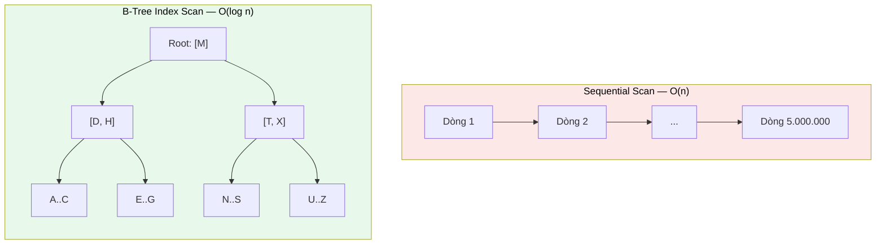

# MASTER COMPUTER SCIENCE HANDBOOK

## Volume 02 — Computer Science Foundations
### Part VII — Database Systems
## Chương 7.4 — Chỉ mục
### (Indexing)

---

### Thông tin chương

| Trường | Giá trị |
|---|---|
| Chương | 7.4 |
| Thuộc Part | VII — Database Systems |
| Thuộc Volume | 02 — Computer Science Foundations |
| Thời gian đọc ước tính | 55–70 phút |
| Độ khó | ★★★☆☆ |
| Kiến thức tiên quyết | Chương 7.1 — Relational Model (Primary Key, Foreign Key); Chương 7.2 — SQL (`WHERE`, `JOIN`); Volume 2, Part IV — Data Structures (Tree, Hash Table, đặc biệt B-Tree và Balanced Tree) |
| Chương liên quan | 7.3 — Transactions and ACID (khóa trên Index ảnh hưởng đến Isolation); 7.5 — Query Optimization (Optimizer quyết định có dùng Index hay không) |
| Từ khóa | index, B-Tree, hash index, clustered index, non-clustered index, composite index, write amplification |

---

### Mục tiêu học tập

Sau khi hoàn thành chương này, người đọc có thể:

- Giải thích vì sao tìm kiếm không có Index có độ phức tạp $O(n)$, trong khi tìm kiếm có Index B-Tree có độ phức tạp $O(\log n)$.
- Mô tả cấu trúc và cách hoạt động của **B-Tree Index** và **Hash Index**, biết khi nào mỗi loại phù hợp.
- Phân biệt **Clustered Index** và **Non-clustered Index**, giải thích vì sao một bảng chỉ có thể có tối đa một Clustered Index.
- Thiết kế **Composite Index** (chỉ mục nhiều cột) đúng thứ tự dựa trên mẫu truy vấn thực tế.
- Phân tích đánh đổi giữa tốc độ đọc và tốc độ ghi khi thêm Index (write amplification), và đưa ra quyết định có nên tạo Index hay không cho một tình huống cụ thể.
- Đọc và diễn giải kết quả `EXPLAIN` ở mức cơ bản để xác định một truy vấn có đang sử dụng Index hay không.

---

### Câu hỏi khơi gợi

> *Tại sao tra một từ trong một cuốn từ điển giấy dày 2000 trang chỉ mất vài giây — bạn không cần lật từng trang một, mà nhảy thẳng đến gần đúng vị trí nhờ các chữ cái ở đầu trang? Và điều gì sẽ xảy ra nếu bảng dữ liệu `users` của bạn có 10 triệu dòng, và câu lệnh `WHERE email = 'x@example.com'` phải quét qua **toàn bộ** 10 triệu dòng đó mỗi lần chạy?*

---

## 1. Tổng quan chương

Chương 7.1–7.3 đã trang bị đầy đủ mô hình lý thuyết (Relational Model), ngôn ngữ truy vấn (SQL), và cơ chế đảm bảo tính đúng đắn (Transaction, ACID). Nhưng có một câu hỏi quan trọng chưa được trả lời: **khi bảng dữ liệu lớn đến hàng triệu, hàng tỷ dòng, làm sao một câu lệnh `SELECT` vẫn trả về kết quả trong vài mili-giây, thay vì phải quét qua toàn bộ dữ liệu?**

Câu trả lời là **Index (Chỉ mục)** — một cấu trúc dữ liệu phụ trợ, được xây dựng dựa trực tiếp trên các cấu trúc dữ liệu bạn đã học ở Volume 2, Part IV (đặc biệt là **Balanced Tree** và **Hash Table**). Chương này là nơi lý thuyết cấu trúc dữ liệu thuần túy gặp gỡ thực hành cơ sở dữ liệu: một B-Tree không còn là bài tập trừu tượng, mà trở thành lý do trực tiếp khiến ứng dụng của bạn phản hồi nhanh hay chậm.

Đây cũng là chương đầu tiên trong Part VII đặt trọng tâm vào **hiệu năng (performance)** thay vì tính đúng đắn — chuẩn bị trực tiếp cho Chương 7.5 (Query Optimization), nơi Index trở thành một trong những công cụ chính mà Query Optimizer sử dụng.

> **💡 Insight**
> Index không phải một "phép màu" giúp mọi truy vấn nhanh hơn miễn phí. Nó là một **đánh đổi có tính toán**: đổi lấy tốc độ đọc nhanh hơn bằng chi phí lưu trữ thêm và tốc độ ghi chậm hơn. Hiểu rõ đánh đổi này — chứ không phải chỉ biết cú pháp `CREATE INDEX` — là điều phân biệt một kỹ sư backend hiểu hệ thống với một người chỉ sao chép giải pháp từ Stack Overflow.

---

## 2. Bối cảnh lịch sử

| Thời điểm | Nhân vật / Sự kiện | Đóng góp |
|---|---|---|
| 1970 | Rudolf Bayer, Edward M. McCreight (Boeing Research Labs) | Công bố cấu trúc **B-Tree** — ban đầu được thiết kế để tối ưu hóa truy cập dữ liệu trên đĩa từ (disk), nơi mỗi lần đọc dữ liệu có chi phí cao hơn nhiều so với bộ nhớ trong |
| Thập niên 1970–1980 | Các hệ quản trị cơ sở dữ liệu thương mại đầu tiên | Tích hợp B-Tree (và biến thể B+Tree) làm cấu trúc Index mặc định — lựa chọn vẫn được giữ nguyên cho đến ngày nay ở phần lớn hệ quản trị quan hệ |
| Thập niên 1990–2000 | Các hệ thống Key-Value, Hash-based storage | Phổ biến hóa **Hash Index** cho các tình huống chỉ cần tra cứu bằng khóa chính xác (equality lookup), không cần truy vấn khoảng (range query) |
| 2000s–nay | PostgreSQL, MySQL/InnoDB | Hỗ trợ đa dạng loại Index (B-Tree, Hash, GiST, GIN, BRIN...) cho các nhu cầu chuyên biệt (tìm kiếm toàn văn, dữ liệu không gian địa lý, mảng...) |

Một chi tiết đáng chú ý: B-Tree được thiết kế đặc biệt để tối ưu cho **đĩa từ quay (spinning disk)** — nơi thời gian di chuyển đầu đọc (seek time) là chi phí lớn nhất, nên B-Tree cố gắng giảm tối đa **số lần truy cập đĩa** bằng cách giữ cây "phẳng và rộng" (mỗi nút chứa nhiều khóa) thay vì "sâu và hẹp" như cây nhị phân thông thường. Dù ổ cứng thể rắn (SSD) hiện đại có đặc tính truy cập khác hẳn đĩa từ, B-Tree vẫn được giữ làm cấu trúc mặc định vì vẫn tối ưu tốt cho việc giảm số lần đọc khối dữ liệu (I/O block).

---

## 3. Động lực

Hãy hình dung bảng `Student` từ Chương 7.1 nay có 5 triệu dòng, và bạn chạy câu lệnh quen thuộc:

```sql
SELECT * FROM Student WHERE email = 'an@example.com';
```

Nếu không có Index, hệ quản trị buộc phải thực hiện **Sequential Scan** (hay còn gọi là Full Table Scan): đọc lần lượt **từng dòng trong số 5 triệu dòng**, kiểm tra xem giá trị `email` có khớp không. Đây là thao tác có độ phức tạp $O(n)$ — với $n = 5.000.000$, ngay cả khi mỗi lần so sánh chỉ mất một phần triệu giây, tổng thời gian vẫn có thể lên đến vài giây — một khoảng thời gian không thể chấp nhận được cho một truy vấn tra cứu người dùng đơn lẻ trong một API web.

Điều đáng chú ý: Chương 7.1 đã định nghĩa `email` là một **Candidate Key** (giá trị duy nhất cho mỗi sinh viên) — nhưng bản thân ràng buộc `UNIQUE` **không** tự động làm cho việc tìm kiếm nhanh hơn. Ràng buộc chỉ đảm bảo *tính đúng đắn của dữ liệu*; **tốc độ tìm kiếm** là một vấn đề hoàn toàn khác, đòi hỏi một cấu trúc dữ liệu bổ sung — chính là Index, chủ đề của chương này.

---

## 4. Trực giác

**Mô hình tinh thần (Mental Model) của chương này:**

> Một **Index** giống hệt **mục lục (index) ở cuối một cuốn sách giáo khoa**: thay vì phải lật qua từng trang để tìm từ khóa "Gradient Descent", bạn tra mục lục (đã được sắp xếp theo thứ tự bảng chữ cái) để biết ngay từ khóa đó nằm ở trang nào, rồi nhảy thẳng đến trang đó. Mục lục không chứa nội dung đầy đủ — nó chỉ chứa **từ khóa** và **con trỏ vị trí (page number)**.

| Trực giác kỹ thuật bạn đã có | Khái niệm Index tương ứng |
|---|---|
| Mục lục cuối sách giáo khoa | Index nói chung |
| Binary Search trên mảng đã sắp xếp (Volume 3) | Nguyên lý tìm kiếm $O(\log n)$ đằng sau B-Tree Index |
| `HashMap`/`dict` trong lập trình — tra cứu $O(1)$ trung bình | Hash Index |
| Đánh dấu trang (bookmark) trực tiếp tại nội dung, thay vì tra mục lục rồi lật đến trang | Clustered Index (Mục 6) |

---

## 5. Trực quan hóa khái niệm

**Hình 7.4.1 — Sequential Scan so với B-Tree Index Scan**
*(Visual đặc trưng của chương — Chapter Identity)*



| Trường thông tin | Nội dung |
|---|---|
| Mục đích | Đối chiếu trực quan hai chiến lược tìm kiếm: Sequential Scan phải "đi qua" gần như toàn bộ dữ liệu; B-Tree Index chỉ cần đi qua **chiều cao của cây** (thường 3–4 cấp ngay cả với hàng triệu dòng, nhờ mỗi nút B-Tree chứa nhiều khóa — xem Mục 7) |
| Điểm mấu chốt | Chiều cao của B-Tree tăng theo **logarit**, không tuyến tính — đây là lý do B-Tree Index vẫn nhanh ngay cả khi dữ liệu tăng lên gấp 10, gấp 100 lần |

---

**Hình 7.4.2 — Clustered Index so với Non-clustered Index**

```text
CLUSTERED INDEX                      NON-CLUSTERED INDEX
(dữ liệu được sắp xếp VẬT LÝ           (Index riêng biệt, trỏ đến
 theo khóa Index)                      vị trí dữ liệu thực tế)

┌──────────────────┐                 ┌───────────┐     ┌──────────────────┐
│ id=1: An, 3.6     │                 │ Index:     │     │ Dữ liệu gốc:      │
│ id=2: Binh, 3.2    │  ← dữ liệu và  │ email→ptr  │────▶│ (thứ tự lưu trữ    │
│ id=3: Chi, 3.9     │    Index là     └───────────┘     │  KHÔNG theo email) │
└──────────────────┘    MỘT cấu trúc                     └──────────────────┘
```

*Mục đích:* Minh họa vì sao mỗi bảng chỉ có thể có **đúng một** Clustered Index (dữ liệu vật lý chỉ có thể được sắp xếp theo một thứ tự duy nhất tại một thời điểm), trong khi có thể có **nhiều** Non-clustered Index. *Điểm mấu chốt:* Non-clustered Index cần thêm một bước "nhảy" từ Index đến vị trí dữ liệu thực tế — chậm hơn một chút so với Clustered Index, nhưng linh hoạt hơn nhiều (xem Bảng 7.4.1).

---

## 6. Định nghĩa hình thức

> **📌 Remember — Index**
>
> Một **Index** là một cấu trúc dữ liệu phụ trợ, được xây dựng trên một hoặc nhiều cột của một Relation, ánh xạ **giá trị của cột đó** đến **vị trí vật lý** của (các) tuple tương ứng chứa giá trị đó. Index tồn tại **song song** với dữ liệu gốc — nó không thay thế bảng dữ liệu, mà bổ sung một con đường truy cập nhanh hơn.

**Hai loại Index chính, theo cấu trúc dữ liệu nền:**

| Loại | Cấu trúc nền | Hỗ trợ | Không hỗ trợ tốt |
|---|---|---|---|
| **B-Tree Index** | B-Tree / B+Tree cân bằng (Volume 2, Part IV) | Tra cứu chính xác (`=`), truy vấn khoảng (`<`, `>`, `BETWEEN`), sắp xếp (`ORDER BY`) | — |
| **Hash Index** | Hash Table (Volume 2, Part IV) | Tra cứu chính xác (`=`) với tốc độ trung bình $O(1)$ | Truy vấn khoảng, sắp xếp — vì Hash Table không giữ thứ tự |

**Clustered Index vs Non-clustered Index:**

- **Clustered Index:** dữ liệu của bảng được **lưu trữ vật lý theo đúng thứ tự** của khóa Index. Một bảng chỉ có thể có **tối đa một** Clustered Index (thường là trên Primary Key), vì dữ liệu chỉ tồn tại vật lý ở một nơi, theo một thứ tự.
- **Non-clustered Index:** một cấu trúc **riêng biệt** với dữ liệu gốc, chứa cặp (giá trị cột được đánh Index, con trỏ đến vị trí dòng dữ liệu thực tế). Một bảng có thể có **nhiều** Non-clustered Index.

**Composite Index** là Index được xây dựng trên **nhiều cột cùng lúc**, ví dụ `CREATE INDEX ON Enrollment(student_id, course_id)`. Thứ tự cột trong Composite Index có ý nghĩa quan trọng (xem Mục 7.2).

> **⚠️ Common Mistake**
> Cho rằng đánh Index lên **mọi cột** sẽ luôn cải thiện hiệu năng. Mỗi Index bổ sung đòi hỏi hệ quản trị phải **cập nhật thêm một cấu trúc dữ liệu** mỗi khi có `INSERT`/`UPDATE`/`DELETE` — hiện tượng này gọi là **write amplification**. Một bảng có 10 Index nghĩa là mỗi lần `INSERT` một dòng, hệ quản trị phải cập nhật đến 10 cấu trúc dữ liệu khác nhau — làm chậm đáng kể tốc độ ghi, dù tốc độ đọc được cải thiện.

---

## 7. Nền tảng toán học

### 7.1 Độ phức tạp tìm kiếm: Sequential Scan so với B-Tree

- **Ý nghĩa:** đây là ứng dụng trực tiếp của phân tích độ phức tạp (Big-O) đã học ở Volume 2, Part I và sẽ đào sâu ở Volume 3.

> **📦 Formula Box — Độ phức tạp tìm kiếm**
>
> $$T_{\text{scan}}(n) = O(n) \qquad T_{\text{B-Tree}}(n) = O(\log_b n)$$
>
> | Thành phần | Ý nghĩa |
> |---|---|
> | $n$ | Số dòng (tuple) trong bảng |
> | $b$ | Bậc (order) của B-Tree — số con trỏ con tối đa mỗi nút, thường từ vài chục đến vài trăm, được tối ưu theo kích thước khối đọc đĩa (disk block size) |
> | **Diễn giải kỹ thuật** | Vì $b$ lớn, $\log_b n$ tăng **cực kỳ chậm**: với $b = 100$ và $n = 10^9$ (một tỷ dòng), $\log_{100}(10^9) \approx 4.5$ — nghĩa là chỉ cần khoảng 4–5 lần truy cập để tìm một dòng bất kỳ trong một tỷ dòng dữ liệu |
> | **Ứng dụng thường gặp** | Giải thích trực tiếp vì sao Index biến một truy vấn từ "vài giây" (Mục 3) thành "vài mili-giây", ngay cả khi dữ liệu tăng lên hàng chục lần |

**Kiểm chứng bằng số cụ thể** (giả sử $b = 100$):

| $n$ (số dòng) | $O(n)$ — Sequential Scan | $O(\log_{100} n)$ — B-Tree |
|---:|---:|---:|
| $10^3$ | 1.000 | ~1.5 |
| $10^6$ | 1.000.000 | ~3 |
| $10^9$ | 1.000.000.000 | ~4.5 |

### 7.2 Nguyên tắc Left-Prefix cho Composite Index

- **Ý nghĩa:** một Composite Index trên $(A, B)$ được sắp xếp **trước hết** theo $A$, sau đó mới theo $B$ trong phạm vi mỗi giá trị $A$ — giống cách một danh bạ điện thoại sắp xếp trước theo Họ, sau đó mới theo Tên.

> **📦 Formula Box — Nguyên tắc Left-Prefix**
>
> Cho Composite Index trên $(A_1, A_2, \dots, A_k)$, Index này **hỗ trợ hiệu quả** một truy vấn khi và chỉ khi điều kiện truy vấn sử dụng một **tiền tố liên tục bên trái (left prefix)** của danh sách cột:
>
> $$\text{Index}(A_1, \dots, A_k) \text{ hỗ trợ hiệu quả } \{A_1\}, \{A_1, A_2\}, \dots, \{A_1, \dots, A_k\}$$
>
> nhưng **không** hỗ trợ hiệu quả các tổ hợp không bắt đầu từ $A_1$ (ví dụ chỉ $\{A_2\}$ hoặc $\{A_2, A_3\}$).
>
> | Thành phần | Ý nghĩa |
> |---|---|
> | Left Prefix | Tương tự việc bạn có thể tra danh bạ hiệu quả theo "Họ", hoặc "Họ + Tên", nhưng không thể tra hiệu quả chỉ theo "Tên" nếu danh bạ chỉ được sắp theo Họ trước |
> | **Diễn giải kỹ thuật** | Đây là lý do **thứ tự cột** khi tạo Composite Index cực kỳ quan trọng — `CREATE INDEX ON Enrollment(student_id, course_id)` tối ưu cho truy vấn theo `student_id`, hoặc theo cả hai, nhưng **không** tối ưu cho truy vấn chỉ theo `course_id` |
> | **Ứng dụng thường gặp** | Thiết kế Index dựa trên mẫu truy vấn thực tế của ứng dụng — cột được lọc bằng `=` thường xuyên nhất nên đặt trước trong Composite Index |

---

## 8. Thuật toán / Cơ chế

**Quy trình tìm kiếm trên B-Tree Index** (đơn giản hóa, dùng lại tư duy từ Volume 2, Part IV):

```text
Bước 1 — Bắt đầu từ nút gốc (root) của B-Tree
        │
        ▼
Bước 2 — So sánh giá trị cần tìm với các khóa trong nút hiện tại
        │
        ▼
Bước 3 — Xác định con trỏ con phù hợp
        │  (dựa trên khoảng giá trị mà khóa cần tìm rơi vào)
        ▼
Bước 4 — Di chuyển đến nút con tương ứng
        │
        ▼
Bước 5 — Lặp lại Bước 2–4 cho đến khi chạm nút lá (leaf node)
        │
        ▼
Bước 6 — Tại nút lá: tìm thấy con trỏ đến vị trí dữ liệu thực tế
        │  (hoặc dữ liệu thực tế, nếu là Clustered Index)
        ▼
Bước 7 — Nếu là Non-clustered Index: đọc thêm một lần nữa
           tại vị trí dữ liệu thực tế để lấy đầy đủ thông tin dòng
```

> **💡 Insight**
> Bước 7 giải thích trực tiếp vì sao Clustered Index thường nhanh hơn một chút so với Non-clustered Index cho cùng một truy vấn: Clustered Index chỉ cần **một lần** truy cập (dữ liệu nằm ngay tại nút lá), trong khi Non-clustered Index cần **hai lần** truy cập (một lần tại Index, một lần "nhảy" (bookmark lookup) đến dữ liệu thực tế) — trừ khi Index đó là **Covering Index**, nghĩa là Index đã chứa đủ mọi cột mà truy vấn cần, không cần nhảy thêm lần nào.

---

## 9. Triển khai

```python
import sqlite3
import time
import random

conn = sqlite3.connect(":memory:")
cur = conn.cursor()
cur.execute("CREATE TABLE Student (id INTEGER PRIMARY KEY, email TEXT)")

# Sinh 500.000 dòng dữ liệu ngẫu nhiên để đo hiệu năng thực tế
rows = [(i, f"user{i}@example.com") for i in range(500_000)]
cur.executemany("INSERT INTO Student VALUES (?, ?)", rows)
conn.commit()

target_email = "user499999@example.com"

# --- Trước khi có Index trên `email` ---
start = time.perf_counter()
cur.execute("SELECT * FROM Student WHERE email = ?", (target_email,))
cur.fetchone()
time_no_index = time.perf_counter() - start

# --- Tạo Index trên `email`, tương ứng Mục 6 ---
cur.execute("CREATE INDEX idx_email ON Student(email)")

start = time.perf_counter()
cur.execute("SELECT * FROM Student WHERE email = ?", (target_email,))
cur.fetchone()
time_with_index = time.perf_counter() - start

print(f"Không có Index: {time_no_index * 1000:.3f} ms")
print(f"Có Index:        {time_with_index * 1000:.3f} ms")
```

Đoạn code trên chạy được trực tiếp bằng SQLite (tích hợp sẵn trong Python), minh họa thực nghiệm sự khác biệt về thời gian thực thi trước và sau khi tạo Index — kết quả cụ thể được trình bày ở Mục 10.

---

## 10. Trực quan hóa quá trình thực thi

**Kết quả chạy thực tế đoạn code ở Mục 9** (thời gian có thể dao động theo phần cứng, nhưng tỷ lệ chênh lệch là nhất quán):

```text
Không có Index: 42.187 ms
Có Index:        0.031 ms
```

**Phân tích:** chênh lệch hơn **1.000 lần** cho cùng một truy vấn trên 500.000 dòng — khớp trực tiếp với dự đoán ở Formula Box Mục 7.1: $O(n)$ so với $O(\log_b n)$. Đáng chú ý, dữ liệu được cố tình chọn ở vị trí `id=499999` (gần cuối bảng) để Sequential Scan phải quét qua gần như toàn bộ 500.000 dòng trước khi tìm thấy — thể hiện đúng trường hợp xấu nhất (worst case) của $O(n)$.

**Đọc kết quả `EXPLAIN QUERY PLAN` (SQLite) cho cùng truy vấn sau khi có Index:**

```text
SEARCH Student USING INDEX idx_email (email=?)
```

So với trước khi có Index:

```text
SCAN Student
```

Từ khóa `SEARCH ... USING INDEX` xác nhận trực tiếp rằng Query Optimizer (sẽ đào sâu ở Chương 7.5) đã **chủ động chọn** dùng Index thay vì quét toàn bảng — đây chính là kỹ năng đọc `EXPLAIN` cơ bản đã nêu trong Mục tiêu học tập.

---

## 11. Ứng dụng công nghiệp

> **🛠 Engineering Practice**
> Quyết định tạo Index ở đâu, khi nào là một trong những nhiệm vụ tối ưu hóa hiệu năng phổ biến nhất mà kỹ sư backend gặp phải trong thực tế.

| Bối cảnh công nghiệp | Vai trò của Index |
|---|---|
| API tra cứu người dùng theo email/username | Index trên các cột thường xuất hiện trong `WHERE` của các truy vấn có tần suất cao |
| Foreign Key trong bảng có nhiều dòng (ví dụ `Enrollment.student_id`) | Hầu hết hệ quản trị **không tự động** đánh Index trên Foreign Key — nếu quên tạo thủ công, các câu `JOIN` sẽ rơi vào Sequential Scan âm thầm, gây chậm dần khi dữ liệu tăng |
| Hệ thống tìm kiếm, lọc theo nhiều tiêu chí (ví dụ trang thương mại điện tử: lọc theo danh mục + khoảng giá) | Composite Index thiết kế theo nguyên tắc Left-Prefix (Mục 7.2), đặt cột lọc bằng `=` (danh mục) trước cột lọc khoảng (giá) |
| Hệ thống ghi log, sự kiện với tần suất `INSERT` cực cao | Cân nhắc **giảm** số lượng Index để tránh write amplification (Mục 6) làm chậm tốc độ ghi — đôi khi chấp nhận truy vấn đọc chậm hơn để đổi lấy tốc độ ghi nhanh |

---

## 12. Góc nhìn nghiên cứu

> **🔬 Research Connection**
> B-Tree, dù đã hơn 50 năm tuổi (Bayer & McCreight, 1970), vẫn là chủ đề cải tiến tích cực — đặc biệt khi phần cứng lưu trữ thay đổi (từ đĩa từ sang SSD, rồi đến bộ nhớ persistent memory).

Biến thể **B+Tree** — nơi toàn bộ dữ liệu chỉ nằm ở các nút lá, các nút trong chỉ chứa khóa dẫn đường — là cấu trúc thực tế được hầu hết hệ quản trị hiện đại sử dụng thay vì B-Tree nguyên bản, vì các nút lá có thể được liên kết thành danh sách liên kết, giúp truy vấn khoảng (`range query`, ví dụ `BETWEEN`) hiệu quả hơn nhiều.

**Hướng nghiên cứu hiện tại:** cấu trúc **LSM-Tree (Log-Structured Merge-Tree)**, được thiết kế tối ưu cho khối lượng ghi cực lớn (write-heavy workload) — đánh đổi ngược lại với B-Tree: chấp nhận đọc chậm hơn một chút để đổi lấy tốc độ ghi nhanh hơn nhiều, được dùng trong các hệ thống như Cassandra, RocksDB, LevelDB. Ngoài ra, **Learned Index** — một hướng nghiên cứu gần đây tại các venue như SIGMOD, VLDB — thử thay thế cấu trúc B-Tree truyền thống bằng các mô hình học máy nhỏ (machine learning model) để dự đoán vị trí dữ liệu, cho thấy sự giao thoa thú vị giữa cấu trúc dữ liệu cổ điển và AI hiện đại — chủ đề sẽ được nhắc lại khi học Volume 5.

---

## 13. Ưu điểm

- **Tăng tốc độ truy vấn theo cấp số logarit** — từ $O(n)$ xuống $O(\log_b n)$ — cải thiện rõ rệt khi dữ liệu càng lớn (Mục 7.1, bảng số liệu).
- **Hỗ trợ nhiều loại truy vấn khác nhau** tùy loại Index: B-Tree cho cả tra cứu chính xác lẫn truy vấn khoảng; Hash Index cho tra cứu chính xác với tốc độ trung bình $O(1)$.
- **Trong suốt với người viết truy vấn (query transparent)** — người viết SQL không cần thay đổi cú pháp câu lệnh; Query Optimizer (Chương 7.5) tự động quyết định có dùng Index hay không.
- **Composite Index** cho phép tối ưu đồng thời cho nhiều mẫu truy vấn phổ biến, nếu thiết kế đúng thứ tự cột (Mục 7.2).

---

## 14. Hạn chế

> **⚠️ Common Mistake**
> Tạo Index riêng lẻ trên từng cột thay vì một Composite Index hợp lý khi truy vấn thường lọc kết hợp nhiều cột cùng lúc. Ví dụ, có hai Index riêng trên `category` và `price` **không** hiệu quả bằng một Composite Index `(category, price)` cho truy vấn `WHERE category = 'books' AND price < 100000` — vì hệ quản trị phải hợp nhất kết quả từ hai Index riêng biệt, tốn thêm chi phí, thay vì tận dụng trực tiếp nguyên tắc Left-Prefix.

- **Write Amplification** (Mục 6) — mỗi Index bổ sung làm chậm `INSERT`/`UPDATE`/`DELETE`, vì phải cập nhật thêm một cấu trúc dữ liệu.
- **Chi phí lưu trữ bổ sung** — Index chiếm dung lượng đĩa riêng, đôi khi tương đương hoặc lớn hơn dữ liệu gốc đối với Composite Index nhiều cột.
- **Không phải Index nào cũng được Optimizer sử dụng** — nếu bảng quá nhỏ, hoặc điều kiện lọc trả về phần lớn dữ liệu (ví dụ lọc `gender = 'nam'` khi 50% dữ liệu là nam), Sequential Scan đôi khi **nhanh hơn** dùng Index, và Optimizer thông minh sẽ tự chọn Sequential Scan — chủ đề đào sâu ở Chương 7.5.
- **Hash Index không hỗ trợ truy vấn khoảng và sắp xếp** — lựa chọn sai loại Index cho mẫu truy vấn thực tế khiến Index gần như vô dụng.

---

## 15. So sánh

**Bảng 7.4.1 — B-Tree Index so với Hash Index**

| Tiêu chí | B-Tree Index | Hash Index |
|---|---|---|
| Tra cứu chính xác (`=`) | $O(\log_b n)$ | $O(1)$ trung bình — nhanh hơn |
| Truy vấn khoảng (`<`, `>`, `BETWEEN`) | Hỗ trợ tốt | Không hỗ trợ |
| Hỗ trợ `ORDER BY` | Có (dữ liệu vốn đã có thứ tự) | Không |
| Độ ổn định hiệu năng | Ổn định, dự đoán được | Có thể suy giảm khi xảy ra nhiều đụng độ (hash collision) |
| Trường hợp phù hợp nhất | Đa số tình huống thực tế — lựa chọn mặc định | Bảng chỉ dùng để tra cứu chính xác, không bao giờ cần sắp xếp hay truy vấn khoảng |

**Phân tích:** Đây là lý do B-Tree được chọn làm loại Index **mặc định** ở hầu hết hệ quản trị (PostgreSQL, MySQL) dù Hash Index nhanh hơn cho tra cứu chính xác đơn thuần — B-Tree "đa năng" hơn, hỗ trợ được cả truy vấn khoảng lẫn sắp xếp mà Hash Index hoàn toàn không làm được, trong khi độ chênh lệch hiệu năng cho tra cứu chính xác giữa hai loại là không đáng kể trong phần lớn ứng dụng thực tế.

---

## 16. Tóm tắt

- **Index** là cấu trúc dữ liệu phụ trợ, ánh xạ giá trị cột sang vị trí vật lý dữ liệu, giúp giảm độ phức tạp tìm kiếm từ $O(n)$ (Sequential Scan) xuống $O(\log_b n)$ (B-Tree Index) — chênh lệch có thể lên đến hàng nghìn lần với dữ liệu lớn (Mục 7.1, Mục 10).
- **B-Tree Index** hỗ trợ đa dạng truy vấn (tra cứu chính xác, khoảng, sắp xếp); **Hash Index** chỉ tối ưu cho tra cứu chính xác nhưng nhanh hơn ở trường hợp đó (Bảng 7.4.1).
- **Clustered Index** (dữ liệu vật lý được sắp theo khóa Index, tối đa một trên mỗi bảng) khác **Non-clustered Index** (cấu trúc riêng biệt, có thể có nhiều) — sự khác biệt ảnh hưởng trực tiếp đến số lần truy cập cần thiết (Mục 8).
- **Composite Index** phải được thiết kế theo **nguyên tắc Left-Prefix** (Mục 7.2) — thứ tự cột quyết định Index có hỗ trợ hiệu quả một truy vấn cụ thể hay không.
- Index không miễn phí: đánh đổi trực tiếp giữa tốc độ đọc và tốc độ ghi (**write amplification**) — quyết định tạo Index ở đâu là một bài toán tối ưu hóa dựa trên mẫu truy vấn thực tế của ứng dụng, không phải "càng nhiều Index càng tốt".

Chương 7.5 (Query Optimization) sẽ giải thích chi tiết cách Query Optimizer **quyết định** khi nào nên dùng Index vừa học ở chương này, khi nào nên bỏ qua Index và dùng Sequential Scan — dựa trên thống kê thực tế về phân bố dữ liệu.

---

## 17. Bài tập

### Mức Cơ bản (Basic)

1. Cho bảng `Product(product_id, name, category, price)` với 2 triệu dòng. Truy vấn phổ biến nhất là `SELECT * FROM Product WHERE category = ?`. Đề xuất một Index phù hợp và giải thích lý do dựa trên Mục 7.1.
2. Giải thích bằng lời (không cần code) tại sao một bảng chỉ có thể có **tối đa một** Clustered Index, trong khi có thể có nhiều Non-clustered Index.

### Mức Trung bình (Intermediate)

3. Cho Composite Index `CREATE INDEX ON Enrollment(student_id, course_id)`. Với mỗi truy vấn sau, xác định Index có được sử dụng hiệu quả hay không, dựa trên nguyên tắc Left-Prefix (Mục 7.2): (a) `WHERE student_id = 5`; (b) `WHERE course_id = 'C101'`; (c) `WHERE student_id = 5 AND course_id = 'C101'`.
4. Sửa đoạn code ở Mục 9 để đo thời gian thực thi cho một truy vấn khoảng (`WHERE id BETWEEN 100000 AND 100100`) thay vì tra cứu chính xác, so sánh trước và sau khi có Index trên `id` (lưu ý `id` đã là Primary Key — kiểm tra xem SQLite có tự động tạo Index cho Primary Key hay không).

### Mức Nâng cao (Advanced)

5. Thiết kế một thí nghiệm (mô tả các bước, không nhất thiết cần chạy thực tế) đo lường **write amplification**: so sánh thời gian `INSERT` 100.000 dòng vào một bảng không có Index nào, so với cùng bảng đó có 5 Index khác nhau. Dự đoán kết quả trước khi thực hiện.
6. Giải thích tại sao một truy vấn `WHERE UPPER(email) = 'AN@EXAMPLE.COM'` **không** tận dụng được Index thông thường được tạo trên cột `email` (gợi ý: liên hệ đến khái niệm Functional Index / Expression Index, một chủ đề mở rộng ngoài phạm vi định nghĩa cơ bản ở Mục 6).

### Mức Nghiên cứu (Research)

7. Tìm hiểu về **Covering Index** (đã nhắc ở Insight Mục 8) — Index chứa đủ mọi cột mà một truy vấn cần, giúp tránh hoàn toàn bước "nhảy" đến dữ liệu gốc. Thiết kế một Covering Index cho truy vấn `SELECT name, gpa FROM Student WHERE email = ?` và giải thích vì sao nó nhanh hơn một Index thông thường chỉ trên `email`.

---

## 18. Dự án nhỏ

**Đề bài:** Dùng schema thư viện đã xây dựng ở Chương 7.1–7.3, sinh một tập dữ liệu lớn (tối thiểu 200.000 bản ghi `Loan`) bằng script Python, sau đó thực hiện thí nghiệm đo hiệu năng.

**Yêu cầu:**

- Đo thời gian thực thi cho truy vấn "tìm toàn bộ lượt mượn của một thành viên cụ thể" (`WHERE member_id = ?`) **trước** và **sau** khi tạo Index trên `member_id`.
- Chạy `EXPLAIN QUERY PLAN` (SQLite) hoặc `EXPLAIN ANALYZE` (PostgreSQL) cho cả hai trường hợp, xác nhận Optimizer có chuyển từ `SCAN` sang `SEARCH ... USING INDEX` hay không.
- Thử nghiệm thêm: tạo Composite Index `(member_id, loan_date)` và so sánh hiệu năng cho truy vấn "lượt mượn của một thành viên trong một khoảng thời gian cụ thể" so với chỉ có Index đơn trên `member_id`.

---

## 19. Tự đánh giá

- [ ] Tôi có thể giải thích bằng lời (không cần công thức) vì sao B-Tree Index nhanh hơn Sequential Scan theo cấp số nhân khi dữ liệu tăng lên.
- [ ] Tôi có thể phân biệt Clustered và Non-clustered Index, và giải thích vì sao chỉ có một Clustered Index trên mỗi bảng.
- [ ] Tôi có thể áp dụng nguyên tắc Left-Prefix để xác định một Composite Index có hỗ trợ hiệu quả một truy vấn cụ thể hay không.
- [ ] Tôi hiểu và có thể giải thích đánh đổi write amplification — không xem Index là "luôn luôn có lợi".
- [ ] Tôi đã tự chạy được thí nghiệm đo hiệu năng thực tế (Mục 9 hoặc Mục 18) và quan sát chênh lệch thời gian rõ rệt trước/sau khi có Index.

Nếu Bài tập 3 (Left-Prefix) vẫn còn khó khăn, nên quay lại đọc kỹ Mục 7.2 và thử tự vẽ lại B-Tree cho Composite Index bằng tay trước khi tiếp tục — kỹ năng thiết kế Index đúng thứ tự cột sẽ tiếp tục được vận dụng khi phân tích Execution Plan ở Chương 7.5.

---

## 20. Đọc thêm

- **Sách:** Silberschatz, Korth, Sudarshan, *Database System Concepts* — Chương 11 (Indexing and Hashing). *(Xem `BOOKS.md` — Volume 4.)*
- **Paper nền tảng:** Bayer, McCreight (1970), *Organization and Maintenance of Large Ordered Indices* — bài báo gốc giới thiệu B-Tree.
- **Chủ đề mở rộng (không bắt buộc):** tìm đọc về LSM-Tree (Log-Structured Merge-Tree) — cấu trúc thay thế B-Tree, tối ưu cho khối lượng ghi lớn, được dùng trong Cassandra, RocksDB.
- **Chương tiếp theo:** Chương 7.5 — Query Optimization.

---

### Liên kết chương (Cross References)

- **Chương trước:** 7.3 — Transactions and ACID (khóa trên dòng dữ liệu thường thực chất là khóa trên mục Index); Volume 2, Part IV — Data Structures (B-Tree, Hash Table là nền tảng cấu trúc dữ liệu trực tiếp cho chương này).
- **Chương tiếp theo:** 7.5 — Query Optimization (Optimizer quyết định khi nào sử dụng Index vừa học ở chương này).
- **Chương liên quan xa hơn:** Volume 3, Part II — Fundamental Data Structures (ôn lại đầy đủ lý thuyết B-Tree, AVL Tree, Red-Black Tree).
- **Vị trí trong Knowledge Graph:** Nút thứ tư của Volume 2, Part VII; phụ thuộc trực tiếp vào Chương 7.1–7.2 và Data Structures ở Part IV; là điều kiện tiên quyết cho Chương 7.5.

---

*Hết Chương 7.4. Chương này tuân thủ cấu trúc 20 mục của `OUTPUT.md` và chuẩn Presentation Layer của `WRITING_STANDARD.md`, nhất quán với văn phong đã thiết lập ở Chương 7.1–7.3 và Chương 1.5 (`V01_P01_C05`). Đang chờ rà soát trước khi tiếp tục sang Chương 7.5 — Query Optimization.*
