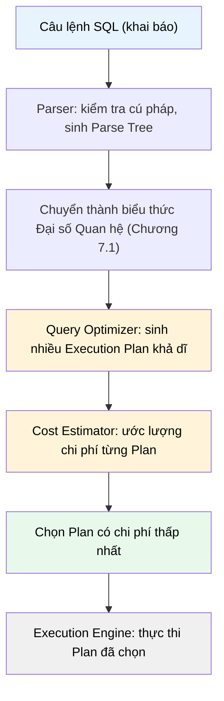

# MASTER COMPUTER SCIENCE HANDBOOK

## Volume 02 — Computer Science Foundations
### Part VII — Database Systems
## Chương 7.5 — Tối ưu hóa Truy vấn
### (Query Optimization)

---

### Thông tin chương

| Trường | Giá trị |
|---|---|
| Chương | 7.5 |
| Thuộc Part | VII — Database Systems |
| Thuộc Volume | 02 — Computer Science Foundations |
| Thời gian đọc ước tính | 55–65 phút |
| Độ khó | ★★★★☆ |
| Kiến thức tiên quyết | Chương 7.1 — Relational Model (Đại số Quan hệ); Chương 7.2 — SQL; Chương 7.4 — Indexing (B-Tree, chi phí Sequential Scan vs Index Scan) |
| Chương liên quan | 7.6 — NoSQL Overview; Volume 3, Part I — Algorithmic Thinking (phân tích độ phức tạp, đã dùng lại ở đây) |
| Từ khóa | query execution plan, query optimizer, cost-based optimization, EXPLAIN, join order, cardinality estimation |

---

### Mục tiêu học tập

Sau khi hoàn thành chương này, người đọc có thể:

- Giải thích vì sao SQL là ngôn ngữ **khai báo (declarative)**, và vai trò của Query Optimizer trong việc chuyển một câu lệnh khai báo thành một **Query Execution Plan** cụ thể.
- Mô tả nguyên lý **Cost-based Optimization**: Optimizer ước lượng chi phí của nhiều kế hoạch thực thi khả dĩ và chọn kế hoạch rẻ nhất.
- Đọc và diễn giải kết quả `EXPLAIN` / `EXPLAIN ANALYZE` để xác định loại quét (Scan), loại Join, và chi phí ước tính của một truy vấn.
- Giải thích vì sao **thứ tự thực hiện JOIN** ảnh hưởng lớn đến hiệu năng, và cách Optimizer chọn thứ tự tối ưu.
- Xác định khi nào Sequential Scan thực sự **nhanh hơn** Index Scan, dựa trên khái niệm **Selectivity**.
- Nhận diện các tình huống Optimizer chọn kế hoạch không tối ưu, và biết cách cung cấp thêm thông tin (thống kê, gợi ý) để cải thiện.

---

### Câu hỏi khơi gợi

> *Ở Chương 7.4, bạn đã thấy Index giúp một truy vấn nhanh hơn 1.000 lần. Vậy tại sao đôi khi, dù đã tạo Index đúng cách, một truy vấn `SELECT * FROM Student WHERE gender = 'nam'` (khi 50% sinh viên là nam) vẫn chạy chậm hơn nếu ép hệ quản trị dùng Index, so với việc để nó tự quét toàn bảng? Điều gì khiến "công cụ nhanh hơn" đôi khi lại tạo ra kết quả chậm hơn?*

---

## 1. Tổng quan chương

Chương 7.2 đã nhấn mạnh: SQL là ngôn ngữ **khai báo** — bạn mô tả *kết quả mong muốn*, không mô tả *cách lấy nó*. Chương này giải thích **ai** chịu trách nhiệm quyết định "cách lấy nó", và **quyết định đó được đưa ra như thế nào**: đó chính là **Query Optimizer**, một trong những thành phần phức tạp và được nghiên cứu kỹ lưỡng nhất trong bất kỳ hệ quản trị cơ sở dữ liệu nào.

Chương này tổng hợp trực tiếp mọi kiến thức đã học trong Part VII: Đại số Quan hệ (7.1) cung cấp các phép toán nguyên thủy mà Optimizer sắp xếp lại; SQL (7.2) là ngôn ngữ đầu vào cần được "dịch"; Transaction (7.3) đặt ràng buộc về tính đúng đắn mà mọi kế hoạch thực thi phải tôn trọng; Index (7.4) là một trong những công cụ chính mà Optimizer cân nhắc sử dụng.

Hiểu được nguyên lý hoạt động của Query Optimizer — dù không cần tự cài đặt một cái — là kỹ năng phân biệt giữa một kỹ sư chỉ biết viết SQL đúng cú pháp, và một kỹ sư có thể **chẩn đoán và khắc phục** khi một truy vấn chạy chậm trong hệ thống thực tế.

> **💡 Insight**
> Query Optimizer về bản chất đang giải một **bài toán tối ưu hóa tổ hợp (combinatorial optimization)**: với một câu lệnh SQL phức tạp, có thể có **hàng nghìn cách khác nhau** để sắp xếp thứ tự Join, chọn loại Scan, chọn thuật toán Join — và Optimizer phải chọn ra phương án tốt nhất trong một khoảng thời gian rất ngắn (thường dưới vài mili-giây), mà không có đủ thời gian thử hết mọi khả năng. Đây chính là một ứng dụng thực tế của tư duy thuật toán bạn sẽ học sâu hơn ở Volume 3.

---

## 2. Bối cảnh lịch sử

| Thời điểm | Nhân vật / Sự kiện | Đóng góp |
|---|---|---|
| Cuối 1970s | Nhóm nghiên cứu System R tại IBM (bao gồm Patricia Selinger) | Xây dựng System R — hệ quản trị nghiên cứu đầu tiên hiện thực hóa mô hình quan hệ của Codd một cách đầy đủ, bao gồm cả một Query Optimizer thực thụ |
| 1979 | Patricia Selinger và cộng sự | Công bố bài báo *Access Path Selection in a Relational Database Management System* — đặt nền móng cho **Cost-based Optimization**, kỹ thuật vẫn được dùng rộng rãi cho đến ngày nay |
| 1980s–1990s | Các hệ quản trị thương mại | Tích hợp Cost-based Optimizer làm thành phần lõi, liên tục cải tiến khả năng ước lượng chi phí (cardinality estimation), sắp xếp thứ tự Join |
| Hiện tại | PostgreSQL, Oracle, SQL Server... | Optimizer hiện đại kết hợp thống kê chi tiết về phân bố dữ liệu (histogram), machine learning trong một số hệ thống nghiên cứu, để ước lượng chi phí chính xác hơn |

Đóng góp của Selinger đặc biệt quan trọng vì bà không chỉ đề xuất **ý tưởng** ước lượng chi phí, mà còn giải quyết bài toán thực dụng: làm sao tìm được kế hoạch gần-tối-ưu trong một không gian tìm kiếm khổng lồ (số cách sắp xếp Join tăng theo giai thừa số bảng) mà không cần duyệt hết mọi khả năng — bằng cách sử dụng **quy hoạch động (Dynamic Programming)**, khái niệm bạn sẽ học chính thức ở Volume 3.

---

## 3. Động lực

Xem xét câu lệnh sau, kết hợp ba bảng:

```sql
SELECT s.name, c.title
FROM Student s
JOIN Enrollment e ON s.student_id = e.student_id
JOIN Course c ON e.course_id = c.course_id
WHERE s.gpa > 3.5;
```

Về mặt **kết quả**, không quan trọng bạn nối `Student` với `Enrollment` trước rồi mới nối với `Course`, hay làm theo thứ tự khác — kết quả cuối cùng giống hệt nhau (Join có tính kết hợp — associative). Nhưng về mặt **hiệu năng**, thứ tự này có thể tạo ra chênh lệch **hàng trăm lần**.

Ví dụ: nếu `Student` có 5 triệu dòng nhưng chỉ 10.000 dòng thỏa `gpa > 3.5`, trong khi `Enrollment` có 50 triệu dòng — thực hiện lọc `WHERE gpa > 3.5` **trước**, rồi mới Join với `Enrollment` (chỉ cần tìm 10.000 sinh viên tương ứng trong 50 triệu dòng, dùng Index) sẽ nhanh hơn rất nhiều so với việc Join toàn bộ `Student` với `Enrollment` trước (tạo ra một bảng trung gian khổng lồ) rồi mới lọc.

**Ai quyết định thứ tự này?** Không phải người viết SQL — bởi SQL là khai báo, không chỉ định thứ tự thực thi. Chính Query Optimizer phải tự phân tích và chọn thứ tự tối ưu — đây là động lực trực tiếp cho toàn bộ chương này.

---

## 4. Trực giác

**Mô hình tinh thần (Mental Model) của chương này:**

> Query Optimizer giống như một **hệ thống định vị GPS**: bạn chỉ khai báo điểm đến (kết quả truy vấn mong muốn), không cần biết đường nào để đi. GPS tự ước lượng "chi phí" (thời gian, khoảng cách) của nhiều tuyến đường khả dĩ, rồi chọn tuyến rẻ nhất — đôi khi tuyến "trông có vẻ ngắn hơn trên bản đồ" (dùng Index) thực ra chậm hơn tuyến "trông dài hơn" (Sequential Scan) nếu có tắc đường (dữ liệu không chọn lọc — xem Mục 7.2).

| Trực giác kỹ thuật bạn đã có | Khái niệm Query Optimization tương ứng |
|---|---|
| GPS ước lượng thời gian di chuyển của nhiều tuyến đường trước khi chọn | Cost-based Optimization |
| Compiler tối ưu hóa code trước khi sinh mã máy, không thay đổi ý nghĩa chương trình | Query Optimizer biến đổi kế hoạch thực thi, không thay đổi kết quả logic |
| Chọn thuật toán sắp xếp khác nhau tùy kích thước dữ liệu (Insertion Sort cho mảng nhỏ, Quick Sort cho mảng lớn) | Optimizer chọn thuật toán Join khác nhau tùy kích thước bảng (Mục 8) |

---

## 5. Trực quan hóa khái niệm

**Hình 7.5.1 — Từ câu lệnh SQL khai báo đến Execution Plan cụ thể**
*(Visual đặc trưng của chương — Chapter Identity)*



| Trường thông tin | Nội dung |
|---|---|
| Mục đích | Cho thấy toàn bộ hành trình từ một câu SQL khai báo đến một kế hoạch thực thi cụ thể, vật lý — quá trình mà người viết SQL hoàn toàn không nhìn thấy trừ khi chủ động dùng `EXPLAIN` |
| Điểm mấu chốt | Bước D–E–F chính là "bộ não" của Optimizer — nơi diễn ra bài toán tối ưu hóa tổ hợp đã nhắc ở Mục 1, và là trọng tâm của Mục 7–8 |

---

**Hình 7.5.2 — So sánh chi phí hai Execution Plan cho cùng một truy vấn**

```text
Plan A: Join Student trước, lọc WHERE sau      Plan B: Lọc WHERE trước, Join sau

   Join (5tr × 50tr dòng)                          σ(gpa > 3.5) trên Student
        │                                                   │ (10.000 dòng)
        ▼                                                    ▼
   σ(gpa > 3.5)                                    Index Join với Enrollment
        │                                                   │
        ▼                                                    ▼
  Chi phí ước tính: RẤT CAO                        Chi phí ước tính: THẤP
  (phải Join toàn bộ trước khi lọc)                (chỉ Join 10.000 dòng đã lọc)
```

*Mục đích:* Minh họa cụ thể tình huống ở Mục 3 — hai Plan cho **cùng một kết quả logic** nhưng chi phí thực thi chênh lệch lớn. *Điểm mấu chốt:* Optimizer sẽ chọn Plan B nếu ước lượng chi phí của nó chính xác — nhưng nếu ước lượng sai (Mục 14), Optimizer có thể chọn nhầm Plan A.

---

## 6. Định nghĩa hình thức

> **📌 Remember — Query Execution Plan**
>
> Một **Query Execution Plan** (hay **Query Plan**) là một cây các toán tử vật lý (physical operator) — mỗi toán tử tương ứng với một phép toán Đại số Quan hệ đã học ở Chương 7.1, nhưng được gắn thêm một **thuật toán thực thi cụ thể**. Ví dụ, phép Join logic ($\bowtie$) có thể được hiện thực bằng nhiều thuật toán vật lý khác nhau: **Nested Loop Join**, **Hash Join**, **Merge Join** (Mục 8).

> **📌 Remember — Query Optimizer**
>
> **Query Optimizer** là thành phần của hệ quản trị cơ sở dữ liệu chịu trách nhiệm: (1) sinh ra một tập hợp các Query Plan khả dĩ, tương đương nhau về mặt kết quả logic; (2) ước lượng **chi phí (cost)** của từng Plan; (3) chọn Plan có chi phí thấp nhất để thực thi. Phương pháp này gọi là **Cost-based Optimization (CBO)**.

**Selectivity (Độ chọn lọc):**

> **📌 Remember — Selectivity**
>
> **Selectivity** của một điều kiện lọc là tỷ lệ số dòng thỏa điều kiện trên tổng số dòng của bảng:
>
> $$\text{Selectivity}(\theta) = \frac{|\sigma_\theta(R)|}{|R|}$$
>
> Selectivity càng **thấp** (điều kiện lọc ra càng ít dòng) thì dùng Index càng có lợi. Selectivity càng **cao** (điều kiện gần như không lọc bớt gì, ví dụ `gender = 'nam'` khi 50% dữ liệu thỏa) thì Sequential Scan thường **rẻ hơn** Index Scan.

> **⚠️ Common Mistake**
> Cho rằng "có Index thì Optimizer chắc chắn sẽ dùng Index". Optimizer luôn ước lượng chi phí của **cả hai** phương án (Sequential Scan và Index Scan) rồi chọn phương án rẻ hơn — đây chính là câu trả lời cho Câu hỏi khơi gợi ở đầu chương: với Selectivity cao (50% dữ liệu thỏa điều kiện), việc "nhảy" qua Index rồi "nhảy" ngược lại dữ liệu gốc (Non-clustered Index, Chương 7.4 Mục 8) cho **từng dòng trong số một nửa bảng** thường tốn kém hơn việc quét tuần tự toàn bảng một lượt.

---

## 7. Nền tảng toán học

### 7.1 Công thức chi phí đơn giản hóa cho Sequential Scan và Index Scan

- **Ý nghĩa:** Optimizer cần một cách định lượng để so sánh hai chiến lược, không chỉ dựa vào trực giác.

> **📦 Formula Box — Ước lượng chi phí I/O (đơn giản hóa)**
>
> $$\text{Cost}_{\text{scan}} = B(R) \qquad \text{Cost}_{\text{index}} = h + \text{Selectivity}(\theta) \times |R|$$
>
> | Thành phần | Ý nghĩa |
> |---|---|
> | $B(R)$ | Số khối đĩa (block) cần đọc để quét toàn bộ bảng $R$ — thường tỷ lệ thuận với $|R|$ |
> | $h$ | Chiều cao của B-Tree Index (Chương 7.4, Mục 7.1) — chi phí "đi xuống" cây để tìm điểm bắt đầu |
> | $\text{Selectivity}(\theta) \times |R|$ | Số dòng thỏa điều kiện — với Non-clustered Index, mỗi dòng này cần thêm một lần "nhảy" đến dữ liệu gốc (Chương 7.4, Mục 8) |
> | **Diễn giải kỹ thuật** | Khi Selectivity tiến gần 1 (điều kiện gần như không lọc gì), $\text{Cost}_{\text{index}}$ tiến gần $h + |R|$ — **lớn hơn** $\text{Cost}_{\text{scan}} = B(R)$, vì mỗi lần nhảy tốn nhiều hơn một lần đọc tuần tự |
> | **Ứng dụng thường gặp** | Đây là công thức (đơn giản hóa) mà các Optimizer thực tế dùng làm nền tảng để quyết định chọn Scan hay Index — giải thích chính xác hiện tượng ở Câu hỏi khơi gợi và Hình 7.5.2 |

### 7.2 Số lượng thứ tự Join khả dĩ

- **Ý nghĩa:** giải thích vì sao bài toán chọn thứ tự Join là một bài toán tổ hợp khó, cần thuật toán thông minh chứ không thể thử hết mọi khả năng khi số bảng lớn.

> **📦 Formula Box — Số cách sắp xếp thứ tự Join**
>
> Với $n$ bảng cần Join, số thứ tự Join khả dĩ (chưa tính các thuật toán Join khác nhau cho mỗi cặp) là:
>
> $$n!$$
>
> | Thành phần | Ý nghĩa |
> |---|---|
> | $n!$ | Giai thừa — với $n=5$ bảng, có $5! = 120$ thứ tự; với $n=10$, có $10! \approx 3.6$ triệu thứ tự |
> | **Diễn giải kỹ thuật** | Với truy vấn Join nhiều bảng (phổ biến trong báo cáo phân tích dữ liệu phức tạp), việc thử **mọi** thứ tự là bất khả thi về mặt thời gian — Optimizer dùng **Quy hoạch động (Dynamic Programming)** để tránh tính toán lặp lại, giảm đáng kể số phương án cần đánh giá (Mục 8) |
> | **Ứng dụng thường gặp** | Giải thích trực tiếp vì sao các truy vấn Join rất nhiều bảng (>10 bảng) đôi khi khiến bản thân **quá trình lập kế hoạch** (không phải quá trình thực thi) trở nên chậm — một số hệ quản trị chuyển sang thuật toán heuristic (gần đúng) khi số bảng vượt ngưỡng nhất định |

---

## 8. Thuật toán / Cơ chế

**Ba thuật toán Join vật lý phổ biến**, mỗi thuật toán phù hợp với một tình huống dữ liệu khác nhau:

```text
Nested Loop Join
        │  Với mỗi dòng của bảng ngoài (outer), quét bảng trong (inner)
        │  để tìm dòng khớp
        │  → Phù hợp: một trong hai bảng rất nhỏ, hoặc có Index tốt
        │    trên bảng trong (giảm "quét" thành "tra cứu" O(log n))
        ▼
Hash Join
        │  Xây dựng Hash Table (Volume 2, Part IV) trên bảng nhỏ hơn,
        │  sau đó quét bảng lớn hơn và tra cứu trong Hash Table
        │  → Phù hợp: cả hai bảng lớn, không có Index phù hợp,
        │    điều kiện Join là đẳng thức (=)
        ▼
Merge Join
        │  Yêu cầu cả hai bảng đã được SẮP XẾP theo cột Join
        │  (hoặc dùng Index B-Tree vốn đã có thứ tự — Chương 7.4)
        │  Duyệt đồng thời cả hai bảng, giống thuật toán Merge
        │  trong Merge Sort (sẽ học ở Volume 3)
        │  → Phù hợp: dữ liệu đã sắp xếp sẵn, hoặc kết quả cần
        │    sắp xếp theo cột Join (tận dụng luôn cho ORDER BY)
```

**Quy trình Cost-based Optimization tổng quát:**

```text
Bước 1 — Parser chuyển câu SQL thành biểu thức Đại số Quan hệ
        │
        ▼
Bước 2 — Sinh nhiều Logical Plan tương đương (áp dụng các quy tắc
        │  biến đổi đại số: đẩy Selection xuống trước Join, v.v.)
        ▼
Bước 3 — Với mỗi Logical Plan, sinh các Physical Plan khả dĩ
        │  (chọn thuật toán Join, chọn Scan hay Index cho từng bảng)
        ▼
Bước 4 — Ước lượng Cardinality (số dòng ước tính) và Selectivity
        │  cho từng bước trung gian, dựa trên thống kê đã thu thập
        ▼
Bước 5 — Tính tổng chi phí ước tính cho từng Physical Plan
        │  (dùng công thức tương tự Formula Box Mục 7.1)
        ▼
Bước 6 — Dùng Quy hoạch động để tránh tính toán lặp lại các
        │  Plan con giống nhau, chọn Plan tổng có chi phí thấp nhất
        ▼
Bước 7 — Execution Engine thực thi Plan đã chọn, trả về kết quả
```

> **💡 Insight**
> Bước 4 — ước lượng Cardinality — là bước **dễ sai nhất** trong toàn bộ quy trình, vì nó dựa trên **thống kê đã thu thập trước đó** (histogram phân bố giá trị), không phải dữ liệu thời gian thực. Nếu thống kê lỗi thời (ví dụ bảng vừa tăng đột biến số dòng nhưng chưa chạy lại lệnh cập nhật thống kê như `ANALYZE`), Optimizer có thể ước lượng sai và chọn nhầm Plan — đây là nguyên nhân phổ biến nhất của tình huống "truy vấn đột nhiên chạy chậm" trong hệ thống thực tế (Mục 14).

---

## 9. Triển khai

```python
import sqlite3

conn = sqlite3.connect(":memory:")
cur = conn.cursor()

cur.execute("CREATE TABLE Student (id INTEGER PRIMARY KEY, gender TEXT, gpa REAL)")
# Sinh dữ liệu: 50% nam, 50% nữ — Selectivity cao cho điều kiện gender='nam'
rows = [(i, 'nam' if i % 2 == 0 else 'nu', 2.0 + (i % 20) / 10) for i in range(200_000)]
cur.executemany("INSERT INTO Student VALUES (?, ?, ?)", rows)
cur.execute("CREATE INDEX idx_gender ON Student(gender)")
cur.execute("CREATE INDEX idx_gpa ON Student(gpa)")
conn.commit()


def explain(query: str, params: tuple = ()):
    cur.execute("EXPLAIN QUERY PLAN " + query, params)
    for row in cur.fetchall():
        print(row[-1])


print("--- Điều kiện Selectivity CAO (gender='nam', ~50% dữ liệu) ---")
explain("SELECT * FROM Student WHERE gender = ?", ("nam",))

print("\n--- Điều kiện Selectivity THẤP (gpa > 3.9, ít dòng thỏa) ---")
explain("SELECT * FROM Student WHERE gpa > 3.9")
```

Đoạn code trên cố tình tạo Index trên **cả hai** cột `gender` (Selectivity cao — 50% dữ liệu thỏa) và `gpa` (Selectivity thấp hơn nhiều với điều kiện `> 3.9`), để quan sát Optimizer quyết định khác nhau như thế nào cho từng trường hợp, minh họa trực tiếp nguyên lý ở Mục 6.

---

## 10. Trực quan hóa quá trình thực thi

**Kết quả chạy thực tế đoạn code ở Mục 9** (SQLite; các hệ quản trị khác có thể ra quyết định khác nhau tùy Optimizer, nhưng nguyên lý giống nhau):

```text
--- Điều kiện Selectivity CAO (gender='nam', ~50% dữ liệu) ---
SCAN Student

--- Điều kiện Selectivity THẤP (gpa > 3.9, ít dòng thỏa) ---
SEARCH Student USING INDEX idx_gpa (gpa>?)
```

**Phân tích:** dù **cả hai** cột đều có Index, Optimizer **chủ động bỏ qua** Index trên `gender` (Selectivity ≈ 0.5, chi phí Index Scan theo Formula Box Mục 7.1 gần bằng hoặc vượt chi phí Sequential Scan) nhưng **sử dụng** Index trên `gpa` (Selectivity thấp hơn nhiều, chỉ những sinh viên GPA rất cao mới thỏa điều kiện `> 3.9`). Đây là bằng chứng thực nghiệm trực tiếp cho nguyên lý Cost-based Optimization: **sự tồn tại của Index không đảm bảo nó sẽ được dùng** — quyết định phụ thuộc vào Selectivity thực tế của điều kiện lọc.

---

## 11. Ứng dụng công nghiệp

> **🛠 Engineering Practice**
> Đọc hiểu `EXPLAIN` là một trong những kỹ năng chẩn đoán hiệu năng thực dụng và giá trị nhất mà một kỹ sư backend có thể sở hữu.

| Bối cảnh công nghiệp | Vai trò của Query Optimization |
|---|---|
| Chẩn đoán API chậm (slow query) trong hệ thống production | Chạy `EXPLAIN ANALYZE` để so sánh chi phí **ước tính** với chi phí **thực tế** — chênh lệch lớn thường là dấu hiệu thống kê lỗi thời (Mục 8, Insight) |
| Data Warehouse xử lý truy vấn phân tích phức tạp | Truy vấn thường Join hàng chục bảng — hiểu về thứ tự Join (Mục 7.2) giúp viết truy vấn hoặc thiết kế schema hỗ trợ Optimizer tốt hơn |
| Tinh chỉnh hiệu năng (performance tuning) trước khi lên production | Chủ động chạy `ANALYZE` (hoặc lệnh tương đương) để cập nhật thống kê sau khi nạp lượng lớn dữ liệu mới, tránh Optimizer ra quyết định dựa trên thông tin cũ |
| Thiết kế truy vấn cho API có độ trễ thấp (low-latency) | Ưu tiên viết truy vấn với điều kiện Selectivity thấp trước (lọc mạnh sớm), giúp Optimizer dễ dàng chọn Plan hiệu quả hơn |

---

## 12. Góc nhìn nghiên cứu

> **🔬 Research Connection**
> Bài báo của Selinger và cộng sự (1979) không chỉ giải quyết một bài toán kỹ thuật cụ thể — nó thiết lập một **mô hình tư duy** (ước lượng chi phí, tìm kiếm trong không gian lời giải) vẫn là nền tảng của mọi Query Optimizer hiện đại, hơn 45 năm sau.

Hạn chế lớn nhất của Cost-based Optimization cổ điển là sự phụ thuộc vào **ước lượng Cardinality chính xác** (Mục 8, Insight) — khi các bảng có mối tương quan phức tạp giữa các cột (ví dụ: `city = 'Ho Chi Minh'` và `phone_prefix = '028'` gần như luôn đi cùng nhau), các Optimizer cổ điển thường **đánh giá sai** Selectivity kết hợp, dẫn đến chọn nhầm Plan.

**Hướng nghiên cứu hiện tại:** **Learned Query Optimizer** — sử dụng mô hình học máy để ước lượng Cardinality chính xác hơn dựa trên phân bố dữ liệu thực tế và lịch sử truy vấn, thay vì chỉ dựa vào histogram tĩnh; đây là một hướng nghiên cứu tích cực tại các venue như SIGMOD, VLDB gần đây, và là một ví dụ khác (cùng Learned Index ở Chương 7.4) về sự giao thoa giữa cơ sở dữ liệu truyền thống và AI hiện đại — chủ đề sẽ được đào sâu ở Volume 5–6.

---

## 13. Ưu điểm

- **Tách biệt hoàn toàn logic khỏi thực thi vật lý** — người viết SQL không cần hiểu B-Tree, Hash Table, hay thuật toán Join để viết truy vấn đúng; Optimizer tự động chọn cách thực thi hiệu quả nhất có thể.
- **Tự động thích nghi với sự thay đổi dữ liệu** — cùng một câu SQL có thể được thực thi theo những Plan khác nhau tùy vào lượng dữ liệu và phân bố dữ liệu hiện tại, không cần lập trình viên viết lại truy vấn.
- **Cost-based Optimization dựa trên nền tảng toán học định lượng** (Mục 7), không phải phỏng đoán chủ quan — cho phép cải tiến liên tục qua nhiều thế hệ hệ quản trị.
- **`EXPLAIN` cung cấp khả năng quan sát (observability)** trực tiếp vào quyết định của Optimizer, hỗ trợ chẩn đoán và tinh chỉnh hiệu năng hệ thống thực tế.

---

## 14. Hạn chế

> **⚠️ Common Mistake**
> Tin tưởng tuyệt đối vào Optimizer mà không bao giờ kiểm tra `EXPLAIN`. Optimizer là một hệ thống **ước lượng**, không phải một hệ thống biết trước tương lai — khi thống kê lỗi thời, khi có tương quan phức tạp giữa các cột (Mục 12), hoặc khi truy vấn quá phức tạp (nhiều Join, Mục 7.2), Optimizer hoàn toàn có thể chọn nhầm Plan, đôi khi làm truy vấn chậm hơn hàng trăm lần so với Plan tối ưu thực sự.

- **Chi phí ước lượng có thể sai** khi thống kê lỗi thời hoặc dữ liệu có tương quan phức tạp (Mục 8, Mục 12).
- **Không gian tìm kiếm bùng nổ tổ hợp** với truy vấn nhiều bảng (Mục 7.2) — Optimizer phải dùng heuristic khi vượt ngưỡng, có thể bỏ lỡ Plan tối ưu toàn cục.
- **Thời gian lập kế hoạch (planning time)** bản thân nó cũng tốn chi phí — với truy vấn rất phức tạp, đôi khi chi phí lập kế hoạch chiếm tỷ trọng đáng kể so với chi phí thực thi.
- **Optimizer khác nhau giữa các hệ quản trị** — cùng một câu SQL có thể được tối ưu hóa khác nhau đáng kể trên PostgreSQL so với MySQL, đòi hỏi kỹ sư phải hiểu đặc thù của hệ quản trị đang sử dụng.

---

## 15. So sánh

**Bảng 7.5.1 — Ba thuật toán Join vật lý**

| Thuật toán | Yêu cầu | Độ phức tạp (đơn giản hóa) | Phù hợp nhất khi |
|---|---|---|---|
| Nested Loop Join | Không yêu cầu đặc biệt | $O(|R| \times |S|)$ nếu không có Index; $O(|R| \times \log|S|)$ nếu có Index trên $S$ | Một bảng rất nhỏ, hoặc có Index tốt trên bảng trong |
| Hash Join | Điều kiện Join là đẳng thức (`=`) | $O(|R| + |S|)$ trung bình | Cả hai bảng lớn, không có Index sẵn phù hợp |
| Merge Join | Cả hai bảng đã sắp xếp theo cột Join | $O(|R| + |S|)$ nếu đã sắp xếp sẵn | Dữ liệu vốn đã có thứ tự (ví dụ nhờ Clustered Index, Chương 7.4) |

**Phân tích:** không có thuật toán Join nào "luôn tốt nhất" — đây chính là lý do Optimizer cần **cân nhắc chi phí cho từng tình huống cụ thể** (Mục 8) thay vì áp dụng một chiến lược cố định. Một kỹ sư hiểu Bảng 7.5.1 có thể **dự đoán trước** Optimizer sẽ chọn thuật toán nào khi nhìn vào kích thước và cấu trúc Index của hai bảng cần Join, từ đó thiết kế schema và Index hỗ trợ đúng chiến lược mong muốn.

---

## 16. Tóm tắt

- **Query Optimizer** chuyển một câu SQL khai báo thành một **Query Execution Plan** cụ thể, bằng cách sinh nhiều Plan khả dĩ, ước lượng chi phí từng Plan (**Cost-based Optimization**), và chọn Plan rẻ nhất (Hình 7.5.1).
- **Selectivity** — tỷ lệ dòng thỏa điều kiện lọc — là yếu tố quyết định Optimizer chọn Sequential Scan hay Index Scan; Selectivity cao thường khiến Sequential Scan rẻ hơn, dù đã có Index sẵn (Mục 6, Mục 10).
- Thứ tự thực hiện **JOIN** ảnh hưởng lớn đến hiệu năng dù không ảnh hưởng đến kết quả logic; số thứ tự khả dĩ tăng theo giai thừa ($n!$), buộc Optimizer dùng Quy hoạch động thay vì duyệt toàn bộ (Mục 7.2).
- Ba thuật toán Join vật lý — **Nested Loop, Hash Join, Merge Join** — mỗi loại phù hợp với một tình huống dữ liệu khác nhau (Bảng 7.5.1).
- `EXPLAIN` / `EXPLAIN ANALYZE` là công cụ quan sát trực tiếp quyết định của Optimizer — kỹ năng đọc hiểu công cụ này là nền tảng để chẩn đoán và khắc phục truy vấn chậm trong hệ thống thực tế.

Chương 7.6 (NoSQL Overview) sẽ mở rộng góc nhìn: các hệ thống NoSQL thường **hy sinh** một phần khả năng tối ưu hóa truy vấn tự động (vì không có Đại số Quan hệ đầy đủ làm nền tảng) để đổi lấy khả năng mở rộng ngang tốt hơn — một đánh đổi kiến trúc sẽ được phân tích kỹ ở chương tiếp theo.

---

## 17. Bài tập

### Mức Cơ bản (Basic)

1. Giải thích bằng lời sự khác biệt giữa **Logical Plan** và **Physical Plan** trong quy trình ở Mục 8.
2. Cho một bảng `Order` với 10 triệu dòng, trong đó cột `status` chỉ có 3 giá trị có thể (`pending`, `completed`, `cancelled`), phân bố gần như đều nhau. Dự đoán Optimizer có dùng Index trên `status` cho truy vấn `WHERE status = 'cancelled'` hay không, giải thích dựa trên Selectivity (Mục 6).

### Mức Trung bình (Intermediate)

3. Chạy đoạn code ở Mục 9, thử thêm một điều kiện lọc với Selectivity trung bình (ví dụ `gpa > 3.0`, ước tính khoảng 50% dữ liệu thỏa) — quan sát Optimizer chọn Scan hay Index, và giải thích kết quả.
4. Cho ba bảng `A` (100 dòng), `B` (1 triệu dòng), `C` (1 triệu dòng), cần Join cả ba. Đề xuất thứ tự Join hợp lý (dựa trên Mục 3 và Hình 7.5.2) và giải thích lý do bằng lời, không cần chạy thực tế.

### Mức Nâng cao (Advanced)

5. Thiết kế một thí nghiệm: tạo một bảng lớn, cố tình làm cho thống kê của hệ quản trị (PostgreSQL) trở nên lỗi thời (thêm một lượng lớn dữ liệu mới mà không chạy `ANALYZE`), sau đó so sánh `EXPLAIN` (kế hoạch ước tính) với `EXPLAIN ANALYZE` (thực thi thực tế). Ghi nhận chênh lệch giữa số dòng ước tính và số dòng thực tế.
6. Giải thích tại sao Merge Join có thể **nhanh hơn** Hash Join khi dữ liệu đã được sắp xếp sẵn (ví dụ thông qua Clustered Index, Chương 7.4), ngay cả khi độ phức tạp lý thuyết của cả hai đều là $O(|R|+|S|)$ (gợi ý: so sánh về chi phí hằng số ẩn — constant factor — và chi phí bộ nhớ cần dùng để xây Hash Table).

### Mức Nghiên cứu (Research)

7. Đọc tóm tắt (abstract) của một bài báo về Learned Query Optimizer (Mục 12). So sánh cách tiếp cận này với Cost-based Optimization cổ điển của Selinger (1979): điểm khác biệt cốt lõi là gì, và những rủi ro nào (ví dụ: khả năng diễn giải — interpretability) mà cách tiếp cận dựa trên machine learning có thể mang lại so với phương pháp cổ điển?

---

## 18. Dự án nhỏ

**Đề bài:** Dùng dữ liệu thư viện đã xây dựng xuyên suốt Part VII (Chương 7.1–7.4), thực hiện một buổi "chẩn đoán hiệu năng" có hệ thống.

**Yêu cầu:**

- Viết 3 truy vấn có độ phức tạp tăng dần: (a) một truy vấn đơn giản trên một bảng; (b) một truy vấn Join hai bảng; (c) một truy vấn Join ba bảng kèm `GROUP BY`.
- Với mỗi truy vấn, chạy `EXPLAIN QUERY PLAN` (SQLite) hoặc `EXPLAIN ANALYZE` (PostgreSQL), ghi lại loại Scan/Join được chọn.
- Với truy vấn (c), thử thay đổi thứ tự viết `JOIN` trong câu SQL (dù về logic không ảnh hưởng kết quả) — quan sát xem Optimizer có tự động sắp xếp lại thứ tự thực thi thực tế hay không, hay bị ảnh hưởng bởi thứ tự viết.
- Viết một đoạn tổng kết ngắn: với dữ liệu và Index hiện tại, truy vấn nào có nguy cơ chậm nhất khi dữ liệu tăng lên 100 lần, và đề xuất cải thiện (thêm Index, viết lại điều kiện lọc...).

---

## 19. Tự đánh giá

- [ ] Tôi có thể giải thích vai trò của Query Optimizer trong việc chuyển SQL khai báo thành kế hoạch thực thi cụ thể.
- [ ] Tôi có thể giải thích khái niệm Selectivity và dự đoán được khi nào Optimizer sẽ chọn Sequential Scan thay vì Index Scan.
- [ ] Tôi hiểu vì sao thứ tự Join ảnh hưởng đến hiệu năng dù không ảnh hưởng đến kết quả logic, và vì sao việc tìm thứ tự tối ưu là một bài toán tổ hợp khó.
- [ ] Tôi có thể phân biệt ba thuật toán Join vật lý (Nested Loop, Hash, Merge) và biết tình huống nào phù hợp với thuật toán nào.
- [ ] Tôi đã tự chạy `EXPLAIN` trên ít nhất một truy vấn thực tế (Mục 9 hoặc Mục 18) và diễn giải đúng kết quả.

Nếu Bài tập 4 (thứ tự Join ba bảng) vẫn còn khó khăn, nên quay lại ôn Mục 3 và Hình 7.5.2 trước khi tiếp tục — khả năng "đọc" một tình huống dữ liệu và dự đoán chiến lược tối ưu là kỹ năng tổng hợp toàn bộ Part VII, sẽ tiếp tục hữu ích khi làm việc với dữ liệu quy mô lớn ở Volume 4.

---

## 20. Đọc thêm

- **Sách:** Silberschatz, Korth, Sudarshan, *Database System Concepts* — Chương 12–13 (Query Processing, Query Optimization). *(Xem `BOOKS.md` — Volume 4.)*
- **Paper nền tảng:** Patricia Selinger và cộng sự (1979), *Access Path Selection in a Relational Database Management System* — bài báo đặt nền móng Cost-based Optimization.
- **Chủ đề mở rộng (không bắt buộc):** tìm đọc tài liệu chính thức của PostgreSQL về `EXPLAIN` (`https://www.postgresql.org/docs/current/using-explain.html`) — hướng dẫn thực hành đọc hiểu Execution Plan chi tiết.
- **Chương tiếp theo:** Chương 7.6 — NoSQL Overview.

---

### Liên kết chương (Cross References)

- **Chương trước:** 7.4 — Indexing (Index là một trong những công cụ chính mà Optimizer cân nhắc, Mục 6–7); 7.1 — Relational Model (Đại số Quan hệ là nền tảng cho Logical Plan, Hình 7.5.1).
- **Chương tiếp theo:** 7.6 — NoSQL Overview (các hệ thống NoSQL thường đánh đổi khả năng tối ưu hóa tự động để lấy khả năng mở rộng ngang).
- **Chương liên quan xa hơn:** Volume 3, Part I — Algorithmic Thinking (phân tích độ phức tạp, Quy hoạch động — nền tảng trực tiếp cho Mục 7–8); Volume 3, Part III — Algorithm Design Paradigms (Dynamic Programming đầy đủ).
- **Vị trí trong Knowledge Graph:** Nút thứ năm của Volume 2, Part VII; tổng hợp trực tiếp Chương 7.1, 7.2, và 7.4; là điều kiện tiên quyết cho việc vận hành hệ thống cơ sở dữ liệu hiệu năng cao ở các Volume sau.

---

*Hết Chương 7.5. Chương này tuân thủ cấu trúc 20 mục của `OUTPUT.md` và chuẩn Presentation Layer của `WRITING_STANDARD.md`, nhất quán với văn phong đã thiết lập ở Chương 7.1–7.4 và Chương 1.5 (`V01_P01_C05`). Đang chờ rà soát trước khi tiếp tục sang Chương 7.6 — NoSQL Overview.*
