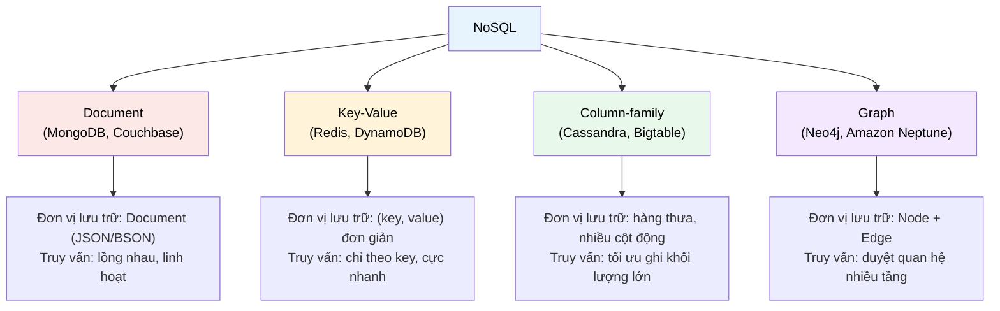

# MASTER COMPUTER SCIENCE HANDBOOK

## Volume 02 — Computer Science Foundations
### Part VII — Database Systems
## Chương 7.6 — Tổng quan NoSQL
### (NoSQL Overview)

---

### Thông tin chương

| Trường | Giá trị |
|---|---|
| Chương | 7.6 |
| Thuộc Part | VII — Database Systems (chương cuối cùng) |
| Thuộc Volume | 02 — Computer Science Foundations |
| Thời gian đọc ước tính | 50–60 phút |
| Độ khó | ★★★☆☆ |
| Kiến thức tiên quyết | Chương 7.1 — Relational Model; Chương 7.3 — Transactions and ACID; Chương 7.4 — Indexing |
| Chương liên quan | Volume 4, Part VI — Distributed Systems (CAP Theorem, Consensus đầy đủ); Volume 4, Part VII — Cloud Computing |
| Từ khóa | NoSQL, document database, key-value store, column-family, graph database, CAP theorem, horizontal scaling |

---

### Mục tiêu học tập

Sau khi hoàn thành chương này, người đọc có thể:

- Giải thích động lực ra đời của NoSQL, xuất phát từ giới hạn mở rộng ngang (horizontal scaling) của mô hình quan hệ đã học ở Chương 7.1.
- Phân biệt bốn nhóm mô hình dữ liệu NoSQL chính: **Document**, **Key-Value**, **Column-family**, **Graph** — biết đặc điểm và trường hợp sử dụng phù hợp của mỗi loại.
- Phát biểu **CAP Theorem** ở mức giới thiệu, giải thích ý nghĩa trực giác của ba tính chất Consistency, Availability, Partition Tolerance.
- So sánh mô hình Quan hệ và các mô hình NoSQL trên các tiêu chí: schema, khả năng mở rộng, tính nhất quán, độ phức tạp truy vấn.
- Đưa ra quyết định kỹ thuật có cơ sở về việc chọn giữa cơ sở dữ liệu quan hệ và một loại NoSQL cụ thể cho một bài toán thực tế.

---

### Câu hỏi khơi gợi

> *Facebook, với hàng tỷ người dùng và hàng nghìn tỷ tin nhắn, không lưu trữ toàn bộ dữ liệu trong một cơ sở dữ liệu quan hệ duy nhất chạy trên một máy chủ. Vậy hệ thống lưu trữ dữ liệu ở quy mô đó trông như thế nào — và tại sao mô hình bảng có Schema chặt chẽ mà bạn vừa thành thạo ở Chương 7.1–7.5 lại không phải lựa chọn phù hợp nhất cho mọi bài toán?*

---

## 1. Tổng quan chương

Xuyên suốt Chương 7.1–7.5, bạn đã xây dựng một nền tảng vững chắc về Mô hình Quan hệ: Schema chặt chẽ, ACID đảm bảo tính đúng đắn tuyệt đối, Index và Query Optimizer tối ưu hóa truy vấn phức tạp. Đây là một hệ thống được thiết kế cực kỳ tốt cho **một lớp bài toán cụ thể**: dữ liệu có cấu trúc rõ ràng, biết trước, và độ chính xác giao dịch là ưu tiên hàng đầu.

Nhưng có một lớp bài toán khác, nơi các giả định nền tảng của Mô hình Quan hệ trở thành **rào cản** thay vì lợi thế: dữ liệu khối lượng khổng lồ (hàng tỷ bản ghi), cấu trúc thay đổi liên tục, cần mở rộng trên hàng nghìn máy chủ, và đôi khi sẵn sàng đánh đổi một phần tính nhất quán tuyệt đối để đổi lấy tốc độ và khả năng chịu lỗi. **NoSQL** (thường được hiểu là "Not Only SQL") là tập hợp các mô hình dữ liệu được thiết kế riêng cho lớp bài toán này.

Là chương khép lại Part VII, chương này không dạy một mô hình dữ liệu chi tiết như các chương trước, mà tập trung vào **tư duy lựa chọn**: khi nào Mô hình Quan hệ là lựa chọn đúng, khi nào NoSQL — và loại NoSQL nào — là lựa chọn phù hợp hơn. Đây cũng là chương bắc cầu trực tiếp sang Volume 4 (Distributed Systems, Cloud Computing), nơi các khái niệm được giới thiệu sơ lược ở đây sẽ được đào sâu đầy đủ.

> **💡 Insight**
> NoSQL không phải "phiên bản nâng cấp" thay thế cho cơ sở dữ liệu quan hệ — nó là một **tập hợp đánh đổi khác**. Mọi nguyên tắc thiết kế tốt bạn đã học ở Chương 7.1 (chuẩn hóa, ràng buộc toàn vẹn, ACID) không hề "sai" — chúng chỉ tối ưu cho một bối cảnh khác với bối cảnh mà nhiều hệ thống NoSQL nhắm tới.

---

## 2. Bối cảnh lịch sử

| Thời điểm | Nhân vật / Sự kiện | Đóng góp |
|---|---|---|
| Đầu–giữa 2000s | Google | Xuất bản các bài báo về **Bigtable** (2006) — hệ thống lưu trữ Column-family quy mô lớn cho các sản phẩm như Google Search, Gmail |
| 2007 | Amazon | Xuất bản bài báo **Dynamo** — hệ thống Key-Value phân tán, ưu tiên tính sẵn sàng (Availability) cao, chấp nhận nhất quán cuối cùng (eventual consistency) |
| 2009 | Cộng đồng mã nguồn mở | Thuật ngữ "NoSQL" được phổ biến rộng rãi tại các buổi gặp mặt cộng đồng, ban đầu chỉ đơn giản mang nghĩa "không dùng SQL" |
| 2009–2012 | MongoDB, Cassandra, Redis, Neo4j... | Hàng loạt hệ thống NoSQL mã nguồn mở ra đời, mỗi hệ thống tối ưu cho một mô hình dữ liệu và một bộ đánh đổi CAP khác nhau (Mục 7) |

Cả Bigtable và Dynamo đều xuất phát từ nhu cầu thực tế cực đoan: Google và Amazon vận hành hệ thống ở quy mô mà một cơ sở dữ liệu quan hệ chạy trên một hoặc vài máy chủ đơn giản là **không thể đáp ứng** — không phải vì mô hình quan hệ "kém", mà vì các giả định về Transaction toàn cục và Schema cố định trở nên cực kỳ tốn kém khi phải phối hợp giữa hàng nghìn máy chủ phân tán trên toàn cầu.

---

## 3. Động lực

Hãy hình dung bạn xây dựng một hệ thống ghi log sự kiện (event logging) cho một ứng dụng di động — mỗi sự kiện có thể có cấu trúc khác nhau tùy loại: sự kiện "đăng nhập" có trường `username`, `device_type`; sự kiện "mua hàng" có trường `product_id`, `amount`, `currency`; sự kiện "lỗi ứng dụng" có trường `error_code`, `stack_trace`.

Nếu dùng Mô hình Quan hệ đúng chuẩn (Chương 7.1), bạn phải chọn một trong hai cách tiếp cận không thoải mái:

- Tạo một bảng riêng cho mỗi loại sự kiện — số lượng bảng tăng liên tục khi có loại sự kiện mới, và các truy vấn tổng hợp trên toàn bộ log (ví dụ: "đếm tổng số sự kiện trong 1 giờ qua") phải `UNION` rất nhiều bảng.
- Tạo một bảng chung với rất nhiều cột `NULL` (mỗi loại sự kiện chỉ dùng một số cột) — vi phạm trực tiếp nguyên tắc chuẩn hóa đã học ở Chương 7.1, Mục 8, và gây lãng phí không gian lưu trữ.

Ngoài vấn đề cấu trúc, hệ thống log này còn cần ghi **hàng trăm nghìn sự kiện mỗi giây** — vượt xa khả năng ghi của một máy chủ cơ sở dữ liệu quan hệ đơn lẻ, dù đã tối ưu Index (Chương 7.4) tốt đến đâu. Đây chính là hai động lực song song dẫn đến NoSQL: **cấu trúc dữ liệu linh hoạt** và **khả năng mở rộng ngang**.

---

## 4. Trực giác

**Mô hình tinh thần (Mental Model) của chương này:**

> Nếu Mô hình Quan hệ giống một **bảng tính Excel có kỷ luật nghiêm ngặt** (Chương 7.1, Mục 4), thì các mô hình NoSQL giống như **các loại "hộp lưu trữ" chuyên biệt khác nhau**: Document Database giống một tủ hồ sơ chứa các tài liệu độc lập, mỗi tài liệu có thể có cấu trúc riêng; Key-Value Store giống một tủ có khóa số, mỗi ngăn chỉ tra cứu bằng đúng một mã số; Column-family giống một cuốn sổ ghi chép cực rộng nhưng thưa (mỗi hàng có thể dùng cột khác nhau); Graph Database giống một sơ đồ tư duy, nơi mối quan hệ giữa các đối tượng quan trọng ngang với bản thân đối tượng.

| Trực giác kỹ thuật bạn đã có | Mô hình NoSQL tương ứng |
|---|---|
| `JSON.stringify()` một object phức tạp, lồng nhau | Document Database (MongoDB) |
| `dict`/`HashMap` — tra cứu theo khóa, không cần biết cấu trúc giá trị | Key-Value Store (Redis) |
| Bảng tính có hàng nghìn cột nhưng mỗi hàng chỉ điền một số cột | Column-family (Cassandra) |
| Sơ đồ tổ chức công ty, mạng xã hội — quan trọng là **quan hệ giữa các nút** | Graph Database (Neo4j) |

---

## 5. Trực quan hóa khái niệm

**Hình 7.6.1 — Bốn mô hình dữ liệu NoSQL chính**
*(Visual đặc trưng của chương — Chapter Identity)*



| Trường thông tin | Nội dung |
|---|---|
| Mục đích | Cho thấy bốn nhánh chính của NoSQL không phải các biến thể của cùng một ý tưởng, mà là **bốn mô hình dữ liệu độc lập**, mỗi mô hình tối ưu cho một dạng truy cập dữ liệu khác nhau |
| Điểm mấu chốt | Việc chọn sai nhóm mô hình (ví dụ dùng Key-Value cho bài toán cần duyệt quan hệ nhiều tầng) thường tệ hơn nhiều so với việc "không dùng NoSQL" — vì mỗi mô hình hy sinh những khả năng truy vấn khác để đổi lấy tốc độ ở đúng một dạng truy cập |

---

**Hình 7.6.2 — CAP Theorem: tam giác đánh đổi**

```text
                    Consistency (C)
                   (mọi node thấy cùng
                    một giá trị)
                        ▲
                       ╱ ╲
                      ╱   ╲
                     ╱     ╲
                    ╱   ✕   ╲   ← không thể đạt cả 3
                   ╱         ╲     khi có Partition
                  ╱           ╲
      Availability ◄───────────► Partition Tolerance (P)
           (A)                   (chịu được mất kết nối
     (luôn phản hồi)               giữa các node)
```

*Mục đích:* Giới thiệu trực quan CAP Theorem — sẽ được định nghĩa hình thức ở Mục 7 và đào sâu đầy đủ ở Volume 4. *Điểm mấu chốt:* trong một hệ thống phân tán thực tế, Partition (mất kết nối tạm thời giữa các máy chủ) **chắc chắn** sẽ xảy ra — do đó lựa chọn thực sự chỉ nằm giữa ưu tiên Consistency hay ưu tiên Availability khi Partition xảy ra, không phải "chọn 2 trong 3" một cách tự do như hình tam giác gợi ý ban đầu.

---

## 6. Định nghĩa hình thức

> **📌 Remember — Bốn nhóm mô hình dữ liệu NoSQL**
>
> - **Document Database:** lưu trữ dữ liệu dưới dạng **Document** (thường là JSON/BSON) — mỗi Document là một cấu trúc lồng nhau, tự chứa (self-contained), không bắt buộc có Schema cố định trước (schema-less hoặc schema-flexible). Ví dụ tiêu biểu: MongoDB.
> - **Key-Value Store:** lưu trữ dữ liệu dưới dạng cặp $(key, value)$ đơn giản — hệ thống chỉ hiểu $key$, xem $value$ như một khối dữ liệu không cấu trúc (opaque blob). Truy vấn duy nhất được tối ưu là tra cứu chính xác theo $key$. Ví dụ tiêu biểu: Redis, Amazon DynamoDB.
> - **Column-family Store:** mở rộng khái niệm bảng, nhưng cho phép mỗi hàng có **tập cột khác nhau** (dữ liệu thưa — sparse), tối ưu cho việc ghi khối lượng cực lớn và truy vấn theo phạm vi khóa hàng. Ví dụ tiêu biểu: Apache Cassandra, Google Bigtable.
> - **Graph Database:** mô hình hóa dữ liệu dưới dạng **Node** (đối tượng) và **Edge** (quan hệ giữa các đối tượng, có thể mang thuộc tính) — tối ưu cho truy vấn duyệt qua nhiều tầng quan hệ (ví dụ: "bạn của bạn của bạn"), điều mà Mô hình Quan hệ xử lý kém hiệu quả vì cần nhiều lần Join liên tiếp (Chương 7.2, Mục 15). Ví dụ tiêu biểu: Neo4j.

**CAP Theorem (giới thiệu sơ bộ):**

> **📌 Remember — CAP Theorem**
>
> Trong một hệ thống dữ liệu phân tán, khi xảy ra **Network Partition** (một phần hệ thống bị mất kết nối với phần còn lại), hệ thống chỉ có thể đảm bảo **tối đa hai** trong ba tính chất sau tại cùng một thời điểm:
>
> - **Consistency (C):** mọi node đều trả về giá trị mới nhất, giống nhau, cho cùng một dữ liệu.
> - **Availability (A):** mọi request đều nhận được phản hồi (không bị timeout hay lỗi), dù phản hồi đó có thể không phải giá trị mới nhất.
> - **Partition Tolerance (P):** hệ thống vẫn tiếp tục hoạt động dù có sự cố mất kết nối giữa các node.
>
> Vì Partition Tolerance gần như **bắt buộc** phải có trong bất kỳ hệ thống phân tán thực tế nào (mất kết nối mạng là điều không thể loại bỏ hoàn toàn), lựa chọn thực dụng thường rút gọn thành: khi có Partition, ưu tiên **Consistency** (hệ thống CP) hay ưu tiên **Availability** (hệ thống AP)?

> **⚠️ Common Mistake**
> Hiểu CAP Theorem theo nghĩa "chọn tùy ý 2 trong 3, giống chọn 2 món trong thực đơn". Trong thực tế, Partition **không phải một lựa chọn thiết kế** — nó là một hiện tượng chắc chắn xảy ra trong hệ thống phân tán. CAP Theorem thực chất nói về việc: **khi** Partition xảy ra (không phải "nếu"), hệ thống phải chọn giữa từ chối phục vụ một số request (ưu tiên C) hay chấp nhận trả về dữ liệu có thể chưa cập nhật (ưu tiên A). Chương này chỉ giới thiệu khái niệm này ở mức trực giác; định nghĩa hình thức đầy đủ và các mô hình nhất quán trung gian (eventual consistency, causal consistency) sẽ được trình bày kỹ ở Volume 4.

---

## 7. Nền tảng toán học

### 7.1 So sánh Selectivity của Join Quan hệ và Graph Traversal

- **Ý nghĩa:** giải thích bằng phân tích độ phức tạp vì sao Graph Database vượt trội hơn Mô hình Quan hệ cho bài toán duyệt quan hệ nhiều tầng.

> **📦 Formula Box — Chi phí truy vấn "bạn của bạn" theo hai mô hình**
>
> Với Mô hình Quan hệ, tìm "bạn của bạn của bạn" (3 tầng quan hệ) của một người dùng cần **3 lần Join liên tiếp** trên bảng `Friendship`:
>
> $$\text{Cost}_{\text{relational}} \approx k \times (\bowtie)^3, \quad k = \text{chi phí trung bình mỗi lần Join}$$
>
> Với Graph Database, cùng truy vấn chỉ cần **duyệt trực tiếp các Edge** từ Node xuất phát, không cần phép Join nào — vì quan hệ đã được lưu trữ vật lý dưới dạng con trỏ trực tiếp giữa các Node:
>
> $$\text{Cost}_{\text{graph}} \approx O(\text{số Node lân cận tại mỗi tầng})$$
>
> | Thành phần | Ý nghĩa |
> |---|---|
> | $(\bowtie)^3$ | Ba lần Join liên tiếp — mỗi lần Join có chi phí riêng (Chương 7.5, Mục 7.2), và **chi phí tăng nhanh** khi số tầng quan hệ tăng, vì bảng trung gian sau mỗi lần Join có thể phình to đáng kể |
> | Con trỏ trực tiếp trong Graph | Quan hệ được "vật chất hóa" sẵn trong cấu trúc lưu trữ — duyệt qua Edge có chi phí gần như hằng số cho mỗi bước, không phụ thuộc vào tổng kích thước dữ liệu |
> | **Diễn giải kỹ thuật** | Đây là lý do các bài toán mạng xã hội, hệ thống gợi ý dựa trên quan hệ, hay phát hiện gian lận (fraud detection — dựa trên chuỗi giao dịch liên kết) thường chọn Graph Database thay vì Mô hình Quan hệ khi độ sâu quan hệ cần truy vấn tăng lên |

---

## 8. Thuật toán / Cơ chế

**Quy trình quyết định chọn mô hình dữ liệu** cho một bài toán mới:

```text
Bước 1 — Dữ liệu có cấu trúc cố định, biết trước, và ít thay đổi không?
        │
        ├── CÓ → Cân nhắc mạnh Mô hình Quan hệ (Chương 7.1)
        │
        └── KHÔNG → tiếp tục Bước 2
        ▼
Bước 2 — Ứng dụng có yêu cầu Transaction ACID nghiêm ngặt
        │  trên nhiều bản ghi cùng lúc không? (ví dụ: tài chính)
        │
        ├── CÓ → Ưu tiên mạnh Mô hình Quan hệ, dù có thể kết hợp
        │        thêm NoSQL cho các phần dữ liệu khác của hệ thống
        │
        └── KHÔNG → tiếp tục Bước 3
        ▼
Bước 3 — Truy vấn chủ yếu là gì?
        │
        ├── Tra cứu theo khóa đơn giản, cực nhanh, cực nhiều
        │   (caching, session storage) → Key-Value Store
        │
        ├── Lưu trữ tài liệu tự chứa, cấu trúc thay đổi theo
        │   loại bản ghi (log sự kiện, catalog sản phẩm đa dạng)
        │   → Document Database
        │
        ├── Ghi khối lượng cực lớn, truy vấn theo phạm vi
        │   khóa hàng (time-series, IoT sensor data)
        │   → Column-family Store
        │
        └── Duyệt quan hệ nhiều tầng là trọng tâm bài toán
            (mạng xã hội, gợi ý, phát hiện gian lận)
            → Graph Database
```

> **💡 Insight**
> Quy trình trên không phải một cây quyết định "chọn một và chỉ một" — nhiều hệ thống thực tế ở quy mô lớn dùng **kết hợp nhiều mô hình** (polyglot persistence): ví dụ, một sàn thương mại điện tử có thể dùng Mô hình Quan hệ cho đơn hàng và thanh toán (cần ACID), Document Database cho catalog sản phẩm (cấu trúc đa dạng), Key-Value Store cho giỏ hàng tạm thời và cache (tốc độ), và Graph Database cho hệ thống gợi ý sản phẩm (dựa trên quan hệ mua hàng/xem hàng).

---

## 9. Triển khai

```python
# Minh họa khác biệt cấu trúc dữ liệu: Document (schema-flexible)
# so với Relational (schema-first, Chương 7.1)

# --- Cách biểu diễn kiểu Document, giống MongoDB ---
event_login = {
    "event_type": "login",
    "username": "an",
    "device_type": "mobile",
    "timestamp": "2026-01-15T10:00:00Z"
}

event_purchase = {
    "event_type": "purchase",
    "product_id": "P123",
    "amount": 250000,
    "currency": "VND",
    "timestamp": "2026-01-15T10:05:00Z"
}

# Hai "document" có cấu trúc HOÀN TOÀN KHÁC NHAU nhưng có thể
# nằm chung trong một collection — điều KHÔNG THỂ với một bảng
# quan hệ chuẩn hóa đúng 3NF (Chương 7.1, Mục 8), minh họa trực
# tiếp vấn đề nêu ở Mục 3.

events = [event_login, event_purchase]


def count_by_type(events: list[dict]) -> dict:
    """Minh họa một truy vấn tổng hợp đơn giản trên dữ liệu
    dạng Document — tương tự GROUP BY ở Chương 7.2, nhưng không
    cần Schema cố định trước."""
    counts: dict[str, int] = {}
    for e in events:
        t = e["event_type"]
        counts[t] = counts.get(t, 0) + 1
    return counts


print(count_by_type(events))
```

Đoạn code minh họa trực tiếp đặc điểm cốt lõi của Document Database (Mục 6): hai "document" trong cùng một tập hợp có thể có cấu trúc hoàn toàn khác nhau — trái ngược với yêu cầu Schema cố định của Mô hình Quan hệ đã học ở Chương 7.1.

---

## 10. Trực quan hóa quá trình thực thi

**So sánh trực quan cách biểu diễn cùng một bài toán (log sự kiện, Mục 3) theo hai mô hình:**

**Cách tiếp cận Quan hệ (chuẩn hóa đúng 3NF):**

| Bảng | Cột |
|---|---|
| `LoginEvent` | event_id, username, device_type, timestamp |
| `PurchaseEvent` | event_id, product_id, amount, currency, timestamp |
| `ErrorEvent` | event_id, error_code, stack_trace, timestamp |

→ Truy vấn "tổng số sự kiện trong 1 giờ qua" cần `UNION` ba bảng trở lên, và **mỗi loại sự kiện mới phát sinh cần một bảng mới** cùng với việc cập nhật code ứng dụng.

**Cách tiếp cận Document:**

```json
[
  {"event_type": "login", "username": "an", "device_type": "mobile", "timestamp": "..."},
  {"event_type": "purchase", "product_id": "P123", "amount": 250000, "timestamp": "..."},
  {"event_type": "error", "error_code": "E500", "stack_trace": "...", "timestamp": "..."}
]
```

→ Một truy vấn duy nhất (`db.events.count()`) đếm được tổng số sự kiện bất kể loại; thêm loại sự kiện mới **không đòi hỏi thay đổi cấu trúc lưu trữ**, chỉ cần thêm document với các trường phù hợp.

**Phân tích:** kết quả này khớp trực tiếp với động lực đã nêu ở Mục 3 — với dữ liệu có cấu trúc thay đổi liên tục theo loại bản ghi, mô hình Document loại bỏ hoàn toàn chi phí quản lý schema mà cách tiếp cận quan hệ đòi hỏi, đổi lại phải chấp nhận ít ràng buộc toàn vẹn hơn ở tầng cơ sở dữ liệu (ràng buộc, nếu cần, phải được xử lý ở tầng ứng dụng).

---

## 11. Ứng dụng công nghiệp

> **🛠 Engineering Practice**
> Hầu hết hệ thống backend quy mô lớn hiện đại không dùng "chỉ một" loại cơ sở dữ liệu — quyết định chọn công nghệ đúng cho từng thành phần là một kỹ năng kiến trúc quan trọng.

| Bối cảnh công nghiệp | Vai trò của NoSQL |
|---|---|
| Session storage, cache (ví dụ giỏ hàng tạm thời) | Redis (Key-Value) — tốc độ tra cứu cực nhanh, dữ liệu thường có thời gian sống ngắn (TTL) |
| Catalog sản phẩm thương mại điện tử với thuộc tính đa dạng theo ngành hàng | MongoDB (Document) — mỗi loại sản phẩm (quần áo, điện tử, sách) có tập thuộc tính khác nhau |
| Hệ thống ghi log, telemetry, IoT sensor data | Cassandra/Bigtable (Column-family) — tối ưu cho khối lượng ghi cực lớn, dữ liệu dạng chuỗi thời gian |
| Hệ thống gợi ý, mạng xã hội, phát hiện gian lận tài chính | Neo4j (Graph) — truy vấn "khoảng cách quan hệ" hiệu quả hơn nhiều lần Join liên tiếp (Mục 7.1) |

---

## 12. Góc nhìn nghiên cứu

> **🔬 Research Connection**
> Nghiên cứu về hệ thống dữ liệu phân tán không dừng lại ở việc "chọn CP hay AP" — hướng đi hiện đại tìm cách **thu hẹp khoảng cách** giữa hai lựa chọn tưởng như đối lập này.

Bài báo Bigtable (Google, 2006) và Dynamo (Amazon, 2007) đặt nền móng cho hai triết lý thiết kế khác nhau: Bigtable thiên về nhất quán mạnh trong phạm vi một hàng dữ liệu; Dynamo thiên về tính sẵn sàng cao, chấp nhận nhất quán cuối cùng (eventual consistency). Cả hai đều ảnh hưởng sâu sắc đến gần như toàn bộ hệ sinh thái NoSQL hiện nay.

**Hướng nghiên cứu hiện tại:** **NewSQL** — nỗ lực xây dựng hệ thống vừa có khả năng mở rộng ngang như NoSQL, vừa giữ được Transaction ACID đầy đủ như Mô hình Quan hệ (Chương 7.3), tiêu biểu là Google Spanner (dùng đồng hồ nguyên tử — TrueTime — để đạt nhất quán mạnh trên quy mô toàn cầu) và CockroachDB. Đây là một trong những hướng nghiên cứu tích cực nhất trong lĩnh vực hệ thống phân tán hiện nay, sẽ được trình bày đầy đủ ở Volume 4, cùng với định nghĩa hình thức chính xác của CAP Theorem (Gilbert & Lynch, 2002) và các mô hình nhất quán trung gian.

---

## 13. Ưu điểm

- **Khả năng mở rộng ngang tự nhiên** — hầu hết hệ thống NoSQL được thiết kế từ đầu để phân tán dữ liệu trên nhiều máy chủ, không cần các kỹ thuật phức tạp như trong hệ quản trị quan hệ truyền thống.
- **Schema linh hoạt** — phù hợp với dữ liệu có cấu trúc thay đổi thường xuyên, không cần biết trước toàn bộ cấu trúc dữ liệu (Mục 3, Mục 9–10).
- **Hiệu năng vượt trội cho đúng mẫu truy vấn được tối ưu** — Key-Value cho tra cứu theo khóa, Graph cho duyệt quan hệ nhiều tầng (Mục 7.1), mỗi mô hình đạt hiệu năng cao hơn hẳn Mô hình Quan hệ khi dùng đúng bài toán.
- **Phù hợp tự nhiên với kiến trúc microservices** — mỗi service có thể chọn loại cơ sở dữ liệu phù hợp nhất với dữ liệu và mẫu truy cập riêng (polyglot persistence, Mục 8).

---

## 14. Hạn chế

> **⚠️ Common Mistake**
> Chọn NoSQL chỉ vì "nghe nói nó nhanh hơn" hoặc "các công ty lớn đều dùng NoSQL", mà không phân tích kỹ mẫu truy vấn thực tế của ứng dụng. Nhiều hệ thống với dữ liệu có cấu trúc rõ ràng, khối lượng vừa phải, và cần Transaction chính xác (ví dụ: hệ thống quản lý nội bộ doanh nghiệp) sẽ hoạt động **tốt hơn** với Mô hình Quan hệ — việc "dùng NoSQL cho mọi thứ" thường tạo ra hệ thống phức tạp hơn cần thiết mà không thu được lợi ích tương xứng.

- **Thường hy sinh một phần tính nhất quán mạnh (strong consistency)** để đổi lấy tính sẵn sàng và khả năng mở rộng (CAP Theorem, Mục 6).
- **Thiếu (hoặc hạn chế) hỗ trợ Transaction ACID đa bản ghi** — nhiều hệ thống NoSQL chỉ đảm bảo ACID trong phạm vi một document/một hàng, không phải trên nhiều bản ghi cùng lúc như Mô hình Quan hệ (Chương 7.3).
- **Không có Đại số Quan hệ chuẩn hóa và Query Optimizer tổng quát** như Mô hình Quan hệ (Chương 7.5) — truy vấn phức tạp (đặc biệt cần kết hợp dữ liệu từ nhiều "bảng"/collection khác nhau) thường phải xử lý thủ công ở tầng ứng dụng.
- **Schema linh hoạt là con dao hai lưỡi** — thiếu ràng buộc ở tầng cơ sở dữ liệu dễ dẫn đến dữ liệu không nhất quán về cấu trúc theo thời gian nếu không có kỷ luật thiết kế nghiêm túc ở tầng ứng dụng.

---

## 15. So sánh

**Bảng 7.6.1 — Mô hình Quan hệ so với bốn nhóm NoSQL**

| Tiêu chí | Relational | Document | Key-Value | Column-family | Graph |
|---|---|---|---|---|---|
| Schema | Cố định, chặt chẽ | Linh hoạt | Không có (opaque) | Bán cấu trúc, thưa | Node/Edge có thuộc tính |
| Mở rộng ngang | Khó, cần kỹ thuật phức tạp | Tốt | Rất tốt | Rất tốt | Trung bình–Khó |
| Transaction ACID đa bản ghi | Đầy đủ (Chương 7.3) | Hạn chế | Thường không | Thường không | Tùy hệ thống |
| Truy vấn phức tạp (JOIN nhiều bảng) | Rất mạnh (Chương 7.2, 7.5) | Hạn chế | Không hỗ trợ | Hạn chế | Rất mạnh cho quan hệ |
| Trường hợp phù hợp nhất | Dữ liệu có cấu trúc, cần chính xác giao dịch | Dữ liệu bán cấu trúc, thay đổi thường xuyên | Cache, session, tra cứu tốc độ cao | Ghi khối lượng lớn, time-series | Dữ liệu trọng tâm là quan hệ |

**Phân tích:** không có dòng nào trong bảng này "toàn diện vượt trội" — đây chính là bản chất của việc thiết kế hệ thống: mọi lựa chọn công nghệ đều là một **đánh đổi có chủ đích**, dựa trên đặc điểm dữ liệu và mẫu truy cập cụ thể của bài toán, không phải dựa trên xu hướng công nghệ. Kỹ năng quan trọng nhất mà chương này (và toàn Part VII) muốn trang bị không phải "thuộc lòng cú pháp của một hệ quản trị cụ thể", mà là **khả năng phân tích bài toán và chọn đúng công cụ** — đúng theo nguyên tắc "Engineering Before Research" của toàn bộ Handbook.

---

## 16. Tóm tắt

- **NoSQL** ra đời từ nhu cầu xử lý dữ liệu khối lượng lớn, cấu trúc linh hoạt, và khả năng mở rộng ngang — những đặc điểm mà Mô hình Quan hệ (Chương 7.1) không tối ưu, dù không hề "sai" trong bối cảnh phù hợp của nó.
- Bốn nhóm mô hình NoSQL chính: **Document** (cấu trúc tự chứa, linh hoạt), **Key-Value** (tra cứu theo khóa, cực nhanh), **Column-family** (ghi khối lượng lớn, dữ liệu thưa), **Graph** (tối ưu duyệt quan hệ nhiều tầng — Mục 7.1).
- **CAP Theorem** (giới thiệu sơ bộ): khi Network Partition xảy ra trong hệ thống phân tán, phải chọn ưu tiên **Consistency** hay **Availability** — không thể có cả hai tuyệt đối cùng lúc; định nghĩa hình thức đầy đủ sẽ ở Volume 4.
- Quyết định chọn mô hình dữ liệu nên dựa trên **phân tích mẫu truy vấn thực tế** (Mục 8), không dựa trên xu hướng — nhiều hệ thống thực tế kết hợp nhiều mô hình (**polyglot persistence**) cho các thành phần khác nhau.
- Bảng 7.6.1 tổng kết đánh đổi cốt lõi: không có mô hình nào toàn diện vượt trội, chỉ có mô hình **phù hợp hơn** cho từng bài toán cụ thể.

Chương này khép lại Part VII — Database Systems. Volume 4 (Data Engineering and Computer Systems) sẽ đào sâu đầy đủ các khái niệm mới được giới thiệu ở đây: định nghĩa hình thức CAP Theorem, các mô hình nhất quán (consistency model), Distributed Transaction, và kiến trúc hệ thống dữ liệu quy mô lớn trong môi trường Cloud.

---

## 17. Bài tập

### Mức Cơ bản (Basic)

1. Cho bốn tình huống: (a) hệ thống giỏ hàng tạm thời cho website thương mại điện tử; (b) hệ thống quản lý hồ sơ bệnh án với yêu cầu chính xác giao dịch cao; (c) hệ thống ghi log truy cập API với hàng triệu bản ghi mỗi ngày; (d) hệ thống gợi ý bạn bè trên mạng xã hội. Với mỗi tình huống, đề xuất mô hình dữ liệu phù hợp nhất (Relational, Document, Key-Value, Column-family, hoặc Graph) và giải thích ngắn gọn.
2. Giải thích bằng lời sự khác biệt cốt lõi giữa "schema-first" (Mô hình Quan hệ) và "schema-flexible" (Document Database).

### Mức Trung bình (Intermediate)

3. Dựa trên ví dụ log sự kiện ở Mục 3, 9, 10 — thiết kế một schema quan hệ chuẩn hóa đầy đủ (theo phương pháp Chương 7.1, Mục 8) cho ba loại sự kiện đã nêu, sau đó viết một câu SQL dùng `UNION` (Chương 7.2, Mục 7.3) để đếm tổng số sự kiện trong 1 giờ qua trên cả ba bảng. So sánh độ phức tạp của cách tiếp cận này với cách tiếp cận Document ở Mục 10.
4. Giải thích bằng ví dụ cụ thể (không cần trích dẫn bài báo) tại sao đảm bảo Availability cao trong khi vẫn giữ Consistency mạnh tuyệt đối là **không thể** khi một phần hệ thống bị mất kết nối mạng — liên hệ trực tiếp định nghĩa CAP Theorem ở Mục 6.

### Mức Nâng cao (Advanced)

5. Thiết kế (mô tả bằng lời, không cần code đầy đủ) một kiến trúc **polyglot persistence** (Mục 8, Insight) cho một sàn thương mại điện tử: liệt kê ít nhất ba thành phần dữ liệu khác nhau (ví dụ: đơn hàng, catalog sản phẩm, giỏ hàng, gợi ý sản phẩm) và đề xuất mô hình dữ liệu phù hợp cho mỗi thành phần, kèm lý do.
6. Cho một bài toán mạng xã hội với 100 triệu người dùng, mỗi người có trung bình 200 bạn bè. So sánh (bằng phân tích độ phức tạp, dựa trên Formula Box Mục 7.1) chi phí của truy vấn "tìm bạn chung giữa hai người dùng" khi dùng Mô hình Quan hệ (bảng `Friendship` với Join) so với khi dùng Graph Database.

### Mức Nghiên cứu (Research)

7. Tìm hiểu sơ lược về Google Spanner (nhắc ở Mục 12) — hệ thống được mô tả là "NewSQL", cố gắng kết hợp ưu điểm của cả Mô hình Quan hệ (ACID, Chương 7.3) và NoSQL (mở rộng ngang toàn cầu). Giải thích ngắn gọn công nghệ **TrueTime** (đồng hồ nguyên tử kết hợp GPS) đóng vai trò gì trong việc giúp Spanner đạt được nhất quán mạnh trên quy mô toàn cầu — đây là bài tập mang tính khám phá, chuẩn bị trước cho nội dung Volume 4.

---

## 18. Dự án nhỏ

**Đề bài:** Thiết kế (trên giấy, không bắt buộc triển khai) hệ thống lưu trữ dữ liệu cho một ứng dụng đặt đồ ăn trực tuyến, tích hợp cả kiến thức Mô hình Quan hệ (Chương 7.1–7.5) và NoSQL (chương này).

**Yêu cầu:**

- Liệt kê tối thiểu bốn loại dữ liệu cần lưu trữ: người dùng và đơn hàng (cần chính xác giao dịch); catalog nhà hàng và món ăn (cấu trúc đa dạng theo loại hình ẩm thực); vị trí tài xế giao hàng theo thời gian thực (cập nhật liên tục, tra cứu theo khóa); lịch sử đặt hàng để gợi ý món ăn (dựa trên quan hệ người dùng – món ăn – nhà hàng).
- Với mỗi loại dữ liệu, chọn mô hình phù hợp (Relational/Document/Key-Value/Column-family/Graph) và giải thích lý do dựa trên quy trình quyết định ở Mục 8.
- Vẽ sơ đồ tổng thể kiến trúc (dùng Mermaid hoặc mô tả bằng lời) cho thấy các thành phần dữ liệu khác nhau tương tác với nhau như thế nào trong cùng một hệ thống.

**Mở rộng (tùy chọn):** Triển khai thực tế phần "catalog nhà hàng và món ăn" bằng MongoDB (nếu có điều kiện cài đặt), so sánh trải nghiệm thiết kế schema với cách đã làm ở Chương 7.1 Mini Project.

---

## 19. Tự đánh giá

- [ ] Tôi có thể giải thích động lực ra đời của NoSQL mà không chỉ dựa vào "nó nhanh hơn" — mà dựa trên phân tích cụ thể về cấu trúc dữ liệu và khả năng mở rộng.
- [ ] Tôi có thể phân biệt bốn nhóm mô hình NoSQL và cho ví dụ trường hợp sử dụng phù hợp cho từng nhóm.
- [ ] Tôi hiểu ý nghĩa trực giác của CAP Theorem — đặc biệt vì sao Partition Tolerance không phải một lựa chọn tùy ý mà là một thực tế cần chấp nhận trong hệ thống phân tán.
- [ ] Tôi có thể phân tích một bài toán thực tế và đề xuất mô hình dữ liệu phù hợp, có giải thích rõ ràng dựa trên mẫu truy vấn — không chọn theo xu hướng.
- [ ] Tôi đã hoàn thành Dự án nhỏ ở Mục 18, thể hiện được tư duy polyglot persistence cho một hệ thống có nhiều loại dữ liệu khác nhau.

Nếu Bài tập 6 (so sánh Graph và Relational cho bài toán mạng xã hội) vẫn còn khó khăn, nên quay lại ôn Mục 7.1 và Chương 7.2, Mục 15 (đánh đổi khi Join nhiều lần) trước khi tiếp tục — đây là ví dụ kinh điển nhất để hiểu tại sao mô hình dữ liệu phù hợp lại quan trọng hơn "một công cụ vạn năng".

---

## 20. Đọc thêm

- **Sách:** Martin Kleppmann, *Designing Data-Intensive Applications* — tài liệu tham khảo toàn diện nhất về đánh đổi giữa các mô hình dữ liệu hiện đại, bao gồm cả Relational lẫn NoSQL. *(Xem `BOOKS.md` — Volume 4.)*
- **Paper nền tảng:** Chang và cộng sự (Google, 2006), *Bigtable: A Distributed Storage System for Structured Data*; DeCandia và cộng sự (Amazon, 2007), *Dynamo: Amazon's Highly Available Key-value Store*.
- **Chủ đề mở rộng (không bắt buộc):** tìm đọc bài báo gốc của Eric Brewer về CAP Theorem, và bài báo chứng minh hình thức của Seth Gilbert và Nancy Lynch (2002) — sẽ là tài liệu nền tảng khi học đầy đủ ở Volume 4.
- **Phần tiếp theo:** Volume 2, Part VIII — Computer Networks (giao tiếp giữa ứng dụng và các hệ thống cơ sở dữ liệu vừa học qua giao thức mạng); Volume 4 — Data Engineering and Computer Systems (đào sâu Distributed Systems, CAP Theorem hình thức, NewSQL).

---

### Liên kết chương (Cross References)

- **Chương trước:** 7.5 — Query Optimization; 7.1 — Relational Model (đối trọng trực tiếp xuyên suốt chương này, đặc biệt Bảng 7.6.1); 7.3 — Transactions and ACID (đối chiếu mức độ hỗ trợ Transaction giữa các mô hình).
- **Phần tiếp theo trong Handbook:** Volume 2, Part VIII — Computer Networks; Volume 4, Part VI — Distributed Systems (CAP Theorem hình thức, Consensus, Distributed Transaction); Volume 4, Part VII — Cloud Computing.
- **Vị trí trong Knowledge Graph:** Nút cuối cùng của Volume 2, Part VII; tổng hợp và đối chiếu với toàn bộ Chương 7.1–7.5; là điểm khởi đầu cho các chủ đề hệ thống phân tán sẽ được đào sâu ở Volume 4.

---

*Hết Chương 7.6, khép lại Part VII — Database Systems. Chương này tuân thủ cấu trúc 20 mục của `OUTPUT.md` và chuẩn Presentation Layer của `WRITING_STANDARD.md`, nhất quán với văn phong đã thiết lập xuyên suốt Chương 7.1–7.5 và Chương 1.5 (`V01_P01_C05`). Toàn bộ Part VII (6 chương) đã hoàn thành theo outline đã được duyệt; đang chờ rà soát tổng thể trước khi biên soạn Part Summary hoặc chuyển sang Part VIII — Computer Networks.*
