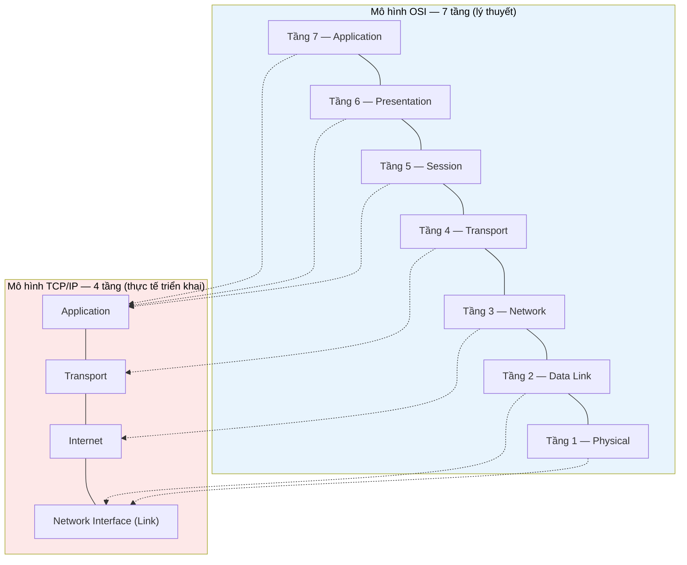

# MASTER COMPUTER SCIENCE HANDBOOK

## Volume 02 — Computer Science Foundations
### Part VIII — Computer Networks
## Chương 8.1 — Mô hình Mạng Máy tính
### (Network Models)

---

### Thông tin chương

| Trường | Giá trị |
|---|---|
| Chương | 8.1 |
| Thuộc Part | VIII — Computer Networks |
| Thuộc Volume | 02 — Computer Science Foundations |
| Thời gian đọc ước tính | 45–55 phút |
| Độ khó | ★★★☆☆ |
| Kiến thức tiên quyết | Volume 02, Part IV — Data Structures (khái niệm Stack, Queue); Volume 02, Part VI — Operating Systems (Process, I/O) |
| Chương liên quan | 8.2 — TCP/IP (áp dụng trực tiếp mô hình phân lớp vừa học); Volume 04, Part V — Computer Networks (mở rộng: HTTP/3, QUIC, SDN) |
| Từ khóa | network layer, protocol, OSI model, TCP/IP model, encapsulation, decapsulation, header, payload |

---

### Mục tiêu học tập

Sau khi hoàn thành chương này, người đọc có thể:

- Giải thích tại sao mạng máy tính được thiết kế theo mô hình phân lớp (layered architecture) thay vì một khối logic duy nhất.
- Trình bày đầy đủ 7 tầng của mô hình OSI và 4 tầng của mô hình TCP/IP, cùng chức năng của từng tầng.
- Đối chiếu mô hình OSI với mô hình TCP/IP, giải thích vì sao TCP/IP là mô hình được triển khai thực tế trên Internet.
- Mô tả chính xác cơ chế đóng gói (encapsulation) và mở gói (decapsulation) khi dữ liệu di chuyển qua các tầng mạng.
- Tính toán được tỷ lệ overhead (chi phí phụ trội do header) khi truyền một khối dữ liệu qua nhiều tầng giao thức.
- Xác định một giao thức hoặc công nghệ mạng cụ thể (HTTP, TCP, Ethernet, Wi-Fi...) thuộc tầng nào trong mô hình.

---

### Câu hỏi khơi gợi

> *Khi bạn gõ một địa chỉ web vào trình duyệt và nhấn Enter, dữ liệu request của bạn phải đi qua card mạng, dây cáp (hoặc sóng Wi-Fi), hàng chục router trung gian, rồi đến đúng server ở một trung tâm dữ liệu cách đó hàng nghìn km — và toàn bộ quá trình đó chỉ mất vài chục mili-giây. Làm sao một hệ thống phức tạp đến vậy có thể được thiết kế, vận hành, và gỡ lỗi mà không sụp đổ vì độ phức tạp của chính nó?*

---

## 1. Tổng quan chương

Toàn bộ Volume 02 từ Part I đến Part VII đã xây dựng một mô hình tính toán chủ yếu xoay quanh **một máy tính đơn lẻ**: một CPU thực thi lệnh, một hệ điều hành quản lý tiến trình, một cơ sở dữ liệu lưu trữ trên đĩa cục bộ. Part VIII đánh dấu một bước chuyển quan trọng: từ đây, câu hỏi trung tâm không còn là "một máy tính hoạt động như thế nào?" mà là **"làm sao nhiều máy tính, thuộc nhiều tổ chức khác nhau, chạy phần cứng và phần mềm hoàn toàn khác nhau, có thể giao tiếp tin cậy với nhau?"**

Chương 8.1 không dạy một giao thức cụ thể nào. Thay vào đó, nó xây dựng **khung tư duy** (mental framework) mà mọi giao thức mạng — từ Ethernet cấp thấp đến HTTP cấp cao — đều được đặt vào. Đây là chương "bản đồ" của toàn bộ Part VIII: sau chương này, mỗi khi gặp một thuật ngữ mạng mới, người đọc sẽ tự hỏi được câu hỏi đúng: *"Khái niệm này thuộc tầng nào, và nó phụ thuộc vào tầng nào bên dưới?"*

> **💡 Insight**
> Nếu bạn đã từng làm việc với kiến trúc phần mềm nhiều tầng (layered architecture) — ví dụ tách biệt Presentation Layer, Business Logic Layer, Data Access Layer trong một ứng dụng backend — bạn đã quen thuộc với chính triết lý thiết kế mà chương này sẽ trình bày, chỉ khác là áp dụng cho hạ tầng mạng thay vì cho một ứng dụng.

---

## 2. Bối cảnh lịch sử

| Thời điểm | Sự kiện | Ý nghĩa |
|---|---|---|
| 1969 | ARPANET ra đời (đã đề cập ở Chương 1, TIMELINE.md) | Mạng chuyển mạch gói (packet-switched network) đầu tiên quy mô lớn, nhưng chưa có mô hình phân lớp chuẩn hóa |
| 1974 | Vinton Cerf và Robert Kahn công bố bài báo *"A Protocol for Packet Network Intercommunication"* | Đặt nền móng cho giao thức sau này tách thành TCP và IP; ý tưởng cốt lõi: các mạng khác nhau có thể liên kết (internetworking) thông qua một giao thức chung |
| Cuối thập niên 1970 | Giao thức ban đầu được tách thành hai tầng riêng biệt: TCP (đảm bảo tin cậy) và IP (định tuyến) | Là ví dụ lịch sử đầu tiên của tư duy phân lớp trong mạng máy tính |
| 1 tháng 1 năm 1983 ("Flag Day") | ARPANET chính thức chuyển từ giao thức NCP cũ sang TCP/IP | Cột mốc khai sinh kiến trúc mạng hiện đại vẫn được dùng đến ngày nay |
| Khoảng 1977–1984 | Tổ chức Tiêu chuẩn hóa Quốc tế (ISO) phát triển và công bố **mô hình OSI (Open Systems Interconnection)** | Một mô hình lý thuyết 7 tầng, mục tiêu tạo chuẩn phổ quát cho mọi hệ thống mạng, không phụ thuộc nhà sản xuất |

Có một chi tiết lịch sử quan trọng mà người mới học thường bỏ sót: **mô hình OSI không phải là mô hình được triển khai thực tế trên Internet**. TCP/IP mới là bộ giao thức thực sự vận hành. OSI ra đời như một nỗ lực chuẩn hóa mang tính lý thuyết, và dù không "thắng" trong thực tế, nó vẫn tồn tại đến ngày nay như **ngôn ngữ chung** để mô tả và giảng dạy về mạng — vì nó chi tiết và rõ ràng hơn TCP/IP. Đây là lý do chương này trình bày cả hai mô hình song song (Mục 15).

---

## 3. Động lực

Hãy hình dung bạn được giao nhiệm vụ tự thiết kế một hệ thống cho phép hai máy tính "nói chuyện" với nhau, từ đầu, không có bất kỳ chuẩn nào sẵn có. Bạn sẽ phải giải quyết đồng thời rất nhiều vấn đề hoàn toàn khác bản chất:

- Tín hiệu điện hoặc sóng vô tuyến được mã hóa thành bit 0/1 như thế nào?
- Làm sao biết gói dữ liệu này gửi cho máy nào, trong hàng tỷ máy tính đang tồn tại?
- Nếu gói tin bị mất hoặc đến sai thứ tự, ai chịu trách nhiệm phát hiện và sửa?
- Dữ liệu ứng dụng (một trang HTML, một tấm ảnh) được đóng gói thành định dạng gì để bên nhận hiểu đúng?

Nếu bạn cố giải quyết tất cả các vấn đề này trong **một khối logic duy nhất**, hệ thống sẽ trở nên cực kỳ khó bảo trì: một thay đổi nhỏ ở tầng vật lý (ví dụ chuyển từ cáp đồng sang cáp quang) buộc phải viết lại toàn bộ logic ứng dụng. Đây chính xác là vấn đề mà kiến trúc phần mềm nhiều tầng (n-tier architecture) trong kỹ thuật phần mềm giải quyết ở quy mô một ứng dụng — và mạng máy tính giải quyết vấn đề tương tự bằng cùng một triết lý: **chia để trị (divide and conquer)**, áp dụng cho kiến trúc hệ thống thay vì cho thuật toán.

---

## 4. Trực giác

**Mô hình tinh thần (Mental Model) của chương này:**

> Gửi dữ liệu qua mạng giống như **gửi một lá thư qua đường bưu điện quốc tế, được đặt trong nhiều lớp phong bì lồng nhau**. Bạn viết nội dung thư (dữ liệu ứng dụng), cho vào phong bì trong cùng ghi rõ "gửi đến phòng ban nào" (tầng Transport), rồi cho vào phong bì tiếp theo ghi địa chỉ thành phố — quốc gia (tầng Network), rồi cho vào bao bì vận chuyển ghi mã vận đơn nội bộ của công ty logistics (tầng Data Link). Người đưa thư ở mỗi trạm trung chuyển chỉ cần đọc đúng lớp phong bì cần thiết cho công việc của họ, không cần — và không thể — đọc nội dung lá thư gốc.

| Trực giác kỹ thuật bạn đã có | Khái niệm mạng tương ứng |
|---|---|
| Kiến trúc n-tier trong backend (Presentation / Business / Data) | Kiến trúc phân lớp mạng (Network Layering) |
| Middleware trong một framework web (mỗi middleware xử lý một việc, không quan tâm middleware khác làm gì) | Mỗi tầng mạng chỉ quan tâm đến header của chính nó |
| Đóng gói dữ liệu vào JSON rồi gửi qua HTTP body | Encapsulation — mỗi tầng "bọc" dữ liệu tầng trên bằng header của chính nó |
| Bóc JSON từ HTTP body để lấy lại object gốc | Decapsulation — mỗi tầng "gỡ" header của chính nó trước khi chuyển lên tầng trên |

---

## 5. Trực quan hóa khái niệm

**Hình 8.1.1 — Mô hình OSI (7 tầng) và mô hình TCP/IP (4 tầng) đối chiếu**



| Trường thông tin | Nội dung |
|---|---|
| Mục đích | Cho thấy trực tiếp ba tầng trên cùng của OSI (Application, Presentation, Session) gộp chung thành một tầng Application duy nhất trong TCP/IP — vì trong thực tế, việc tách biệt ba trách nhiệm này hiếm khi cần thiết ở mức giao thức |
| Điểm mấu chốt | TCP/IP không phải "phiên bản rút gọn sai" của OSI — nó là mô hình được thiết kế dựa trên kinh nghiệm triển khai thực tế, còn OSI được thiết kế trước, mang tính lý thuyết thuần túy (Mục 2) |

---

**Hình 8.1.2 — Encapsulation: dữ liệu được bọc qua từng tầng khi gửi đi**

```text
Tầng Application   [ Dữ liệu ứng dụng (vd: HTML request) ]
                              │  thêm Transport Header
                              ▼
Tầng Transport     [ TCP Header | Dữ liệu ứng dụng ]  ← gọi là "Segment"
                              │  thêm Network Header
                              ▼
Tầng Network       [ IP Header | TCP Header | Dữ liệu ]  ← gọi là "Packet"
                              │  thêm Data Link Header + Trailer
                              ▼
Tầng Data Link     [ Ethernet Header | IP Header | TCP Header | Dữ liệu | Trailer ]  ← gọi là "Frame"
                              │  chuyển thành tín hiệu điện/quang/sóng
                              ▼
Tầng Physical      [ 0101101001101110... ]  ← dòng bit thực tế truyền đi
```

*Mục đích:* Minh họa cơ chế **encapsulation** — mỗi tầng khi gửi dữ liệu xuống sẽ thêm một header (đôi khi cả trailer) của riêng mình, mà không cần biết hoặc quan tâm nội dung bên trong là gì. *Điểm mấu chốt:* quá trình này đảo ngược hoàn toàn ở máy nhận — gọi là **decapsulation** — mỗi tầng bóc đúng header của mình rồi chuyển phần còn lại lên tầng trên (Mục 8).

---

## 6. Định nghĩa hình thức

> **📌 Remember — Giao thức (Protocol)**
>
> Một **giao thức (protocol)** là một tập hợp các quy tắc xác định cách hai thực thể (hai tầng mạng, hai chương trình, hai thiết bị) trao đổi dữ liệu với nhau — bao gồm định dạng dữ liệu, trình tự trao đổi, và cách xử lý lỗi. Một giao thức ở tầng $N$ chỉ giao tiếp trực tiếp với giao thức cùng tầng $N$ ở phía đối diện (giao tiếp logic — *logical communication*), còn trên thực tế dữ liệu vẫn phải đi qua đầy đủ các tầng bên dưới (giao tiếp vật lý — *physical communication*).

**Kiến trúc phân lớp (Layered Architecture)** — nguyên tắc thiết kế trong đó một hệ thống phức tạp được chia thành các tầng (layer) độc lập, mỗi tầng:

- chỉ cung cấp dịch vụ (service) cho tầng ngay phía trên;
- chỉ sử dụng dịch vụ của tầng ngay phía dưới;
- che giấu (abstract) toàn bộ chi tiết triển khai của mình khỏi các tầng khác.

**Bảy tầng của mô hình OSI**, từ thấp đến cao:

| Tầng | Tên | Chức năng chính | Đơn vị dữ liệu (PDU) |
|---|---|---|---|
| 1 | Physical | Truyền dòng bit thô qua môi trường vật lý (cáp đồng, cáp quang, sóng vô tuyến) | Bit |
| 2 | Data Link | Đóng gói bit thành frame; kiểm soát truy cập môi trường chia sẻ; phát hiện lỗi cấp thấp | Frame |
| 3 | Network | Định tuyến gói tin giữa các mạng khác nhau; đánh địa chỉ logic (IP) | Packet |
| 4 | Transport | Đảm bảo truyền dữ liệu tin cậy (hoặc không) giữa hai tiến trình đầu cuối | Segment |
| 5 | Session | Thiết lập, duy trì, kết thúc phiên giao tiếp | — |
| 6 | Presentation | Chuyển đổi định dạng dữ liệu, mã hóa, nén | — |
| 7 | Application | Cung cấp dịch vụ trực tiếp cho phần mềm người dùng (HTTP, DNS, email...) | Message |

**Bốn tầng của mô hình TCP/IP**, từ thấp đến cao: **Network Interface (Link)** → **Internet** → **Transport** → **Application**. Mô hình này gộp ba tầng trên cùng của OSI thành một tầng Application duy nhất, và thường gộp luôn tầng Physical và Data Link thành một tầng Network Interface.

---

## 7. Nền tảng toán học

Chương này chủ yếu mang tính khái niệm hơn là tính toán, nhưng có một phép tính đơn giản và rất thực tế mà kỹ sư backend cần nắm: **tỷ lệ overhead** sinh ra do việc mỗi tầng thêm một header.

- **Ý nghĩa:** mỗi tầng thêm một header cố định (tính bằng byte) vào trước dữ liệu. Càng nhiều tầng, overhead càng lớn, đặc biệt rõ rệt khi payload (dữ liệu thực sự cần gửi) rất nhỏ.
- **Ví dụ đơn giản:** một gói tin TCP/IP điển hình qua Ethernet có: Ethernet header (~14 byte) + IP header (~20 byte) + TCP header (~20 byte) = 54 byte overhead cố định, chưa tính payload.

> **📦 Formula Box — Hiệu suất truyền tải (Transmission Efficiency)**
>
> $$\eta = \frac{P}{P + H}$$
>
> | Thành phần | Ý nghĩa |
> |---|---|
> | $P$ | Kích thước payload — dữ liệu thực sự cần truyền (byte) |
> | $H$ | Tổng overhead — tổng kích thước header của tất cả các tầng đã đi qua (byte) |
> | $\eta$ | Hiệu suất truyền tải — tỷ lệ dữ liệu "hữu ích" trên tổng dữ liệu thực tế gửi đi |
> | **Diễn giải kỹ thuật** | Khi $P \gg H$ (payload lớn), $\eta$ tiến gần 1 — overhead gần như không đáng kể. Khi $P$ rất nhỏ (ví dụ một gói tin điều khiển chỉ vài byte), $\eta$ có thể giảm rất thấp — đây là lý do các giao thức thời gian thực (gaming, VoIP) thường cố gắng gộp nhiều thông điệp nhỏ vào một gói lớn hơn (packet coalescing) |
> | **Ứng dụng thường gặp** | Giải thích tại sao gửi 1000 request kích thước 1 byte kém hiệu quả hơn nhiều so với gửi 1 request kích thước 1000 byte — kiến thức áp dụng trực tiếp khi thiết kế giao thức ứng dụng ở Chương 8.5–8.8 |

**Ví dụ tính tay:** gửi một payload 46 byte (nhỏ) qua Ethernet + IP + TCP ($H = 54$ byte):

$$\eta = \frac{46}{46 + 54} = \frac{46}{100} = 0.46$$

Chỉ 46% dữ liệu thực sự truyền đi là nội dung hữu ích — 54% còn lại là "chi phí hành chính" của các tầng giao thức. So sánh với payload 1400 byte (kích thước MTU điển hình):

$$\eta = \frac{1400}{1400 + 54} \approx 0.963$$

Hiệu suất tăng vọt lên 96,3%. Đây là lý do các giao thức mạng luôn cố gắng gửi dữ liệu theo từng khối lớn (batching) thay vì nhiều gói tin nhỏ lẻ tẻ.

---

## 8. Thuật toán / Cơ chế

**Quy trình Encapsulation (khi gửi) và Decapsulation (khi nhận)** — cơ chế vận hành trung tâm của mọi kiến trúc phân lớp mạng:

```text
── PHÍA GỬI (Encapsulation) ──

Bước 1 — Tầng Application tạo dữ liệu (vd: HTTP request)
        │
        ▼
Bước 2 — Chuyển xuống tầng Transport
        │  Tầng Transport thêm Transport Header (vd: TCP header, chứa port nguồn/đích)
        ▼
Bước 3 — Chuyển xuống tầng Network
        │  Tầng Network thêm Network Header (vd: IP header, chứa địa chỉ IP nguồn/đích)
        ▼
Bước 4 — Chuyển xuống tầng Data Link
        │  Tầng Data Link thêm Header + Trailer (vd: Ethernet header/trailer, địa chỉ MAC)
        ▼
Bước 5 — Tầng Physical chuyển Frame thành tín hiệu vật lý, truyền đi

── PHÍA NHẬN (Decapsulation) — quá trình ĐẢO NGƯỢC hoàn toàn ──

Bước 6 — Tầng Physical nhận tín hiệu, khôi phục thành Frame (dòng bit)
        │
        ▼
Bước 7 — Tầng Data Link bóc Header/Trailer của mình, kiểm tra lỗi, chuyển phần còn lại lên
        │
        ▼
Bước 8 — Tầng Network bóc Network Header, đọc địa chỉ đích, chuyển phần còn lại lên
        │
        ▼
Bước 9 — Tầng Transport bóc Transport Header, xác định đúng tiến trình/port, chuyển lên
        │
        ▼
Bước 10 — Tầng Application nhận lại đúng dữ liệu gốc ban đầu
```

> **⚠️ Common Mistake**
> Người mới học thường nhầm rằng tầng Application ở máy gửi "giao tiếp trực tiếp" với tầng Application ở máy nhận. Trên thực tế, dữ liệu luôn phải đi xuống hết các tầng rồi đi lên hết các tầng ở phía nhận — sự "giao tiếp trực tiếp" giữa hai tầng Application chỉ là một **khái niệm logic** (logical communication), không phải đường đi vật lý thực sự (physical communication). Đây là điểm dễ gây hiểu lầm nhất khi mới tiếp cận mô hình phân lớp.

---

## 9. Triển khai

```python
class Layer:
    """Mô phỏng một tầng mạng: biết cách thêm header (encapsulate)
    và bóc header của chính mình (decapsulate)."""

    def __init__(self, name: str, header: str):
        self.name = name
        self.header = header

    def encapsulate(self, data: str) -> str:
        # Thêm header của tầng này vào phía trước dữ liệu nhận từ tầng trên
        return f"[{self.header}|{data}]"

    def decapsulate(self, data: str) -> str:
        # Bóc header của tầng này, trả lại dữ liệu cho tầng trên
        prefix = f"[{self.header}|"
        assert data.startswith(prefix) and data.endswith("]"), \
            "Header không khớp — dữ liệu có thể đã bị hỏng hoặc sai tầng."
        return data[len(prefix):-1]


def send(data: str, layers: list[Layer]) -> str:
    """Mô phỏng encapsulation: đi từ tầng Application xuống tầng Physical."""
    for layer in layers:
        data = layer.encapsulate(data)
        print(f"Sau tầng {layer.name:<12}: {data}")
    return data


def receive(data: str, layers: list[Layer]) -> str:
    """Mô phỏng decapsulation: đi từ tầng Physical lên tầng Application
    (thứ tự tầng đảo ngược so với send)."""
    for layer in reversed(layers):
        data = layer.decapsulate(data)
        print(f"Sau khi bóc tầng {layer.name:<12}: {data}")
    return data
```

Chạy thử với dữ liệu ứng dụng gốc là chuỗi `"GET /index.html"`:

```python
stack = [
    Layer("Transport", "TCP:80"),
    Layer("Network",   "IP:192.168.1.10"),
    Layer("DataLink",  "MAC:AA:BB:CC"),
]

wire_data = send("GET /index.html", stack)
print("---")
original = receive(wire_data, stack)
assert original == "GET /index.html"
```

---

## 10. Trực quan hóa quá trình thực thi

**Kết quả chạy thực tế** của đoạn code Mục 9:

```text
Sau tầng Transport  : [TCP:80|GET /index.html]
Sau tầng Network    : [IP:192.168.1.10|[TCP:80|GET /index.html]]
Sau tầng DataLink   : [MAC:AA:BB:CC|[IP:192.168.1.10|[TCP:80|GET /index.html]]]
---
Sau khi bóc tầng DataLink   : [IP:192.168.1.10|[TCP:80|GET /index.html]]
Sau khi bóc tầng Network    : [TCP:80|GET /index.html]
Sau khi bóc tầng Transport  : GET /index.html
```

Quan sát cách chuỗi dữ liệu **"phình to dần"** khi đi qua từng tầng gửi (encapsulation), rồi **"thu nhỏ dần"** theo đúng thứ tự ngược lại khi đi qua từng tầng nhận (decapsulation) — kết quả cuối cùng khôi phục chính xác dữ liệu gốc. Cấu trúc lồng nhau `[Header|[Header|[Header|Data]]]` chính là hình ảnh trực quan của Hình 8.1.2, chỉ khác là biểu diễn bằng chuỗi ký tự thay vì sơ đồ khối.

| Tầng | Kích thước dữ liệu (ký tự) |
|---:|---:|
| Application (gốc) | 16 |
| Sau Transport | 24 |
| Sau Network | 44 |
| Sau DataLink | 63 |

Bảng trên là minh chứng thực nghiệm trực tiếp cho công thức hiệu suất truyền tải ở Mục 7: dữ liệu càng đi qua nhiều tầng, tỷ lệ overhead trên tổng kích thước càng tăng.

---

## 11. Ứng dụng công nghiệp

> **🛠 Engineering Practice**
> Mô hình phân lớp không chỉ là công cụ giảng dạy — nó là nguyên tắc thiết kế sống còn trong hạ tầng mạng công nghiệp hiện đại.

| Bối cảnh công nghiệp | Vai trò của Mô hình Phân lớp |
|---|---|
| Docker / Kubernetes networking | Container network (overlay network) hoạt động ở tầng Network/Data Link, hoàn toàn tách biệt và trong suốt với tầng Application của ứng dụng bên trong container |
| CDN (Content Delivery Network — Cloudflare, Akamai) | Có thể can thiệp và tối ưu ở tầng Transport (TCP tuning) mà không cần biết gì về logic ứng dụng chạy phía trên |
| Load Balancer (Layer 4 vs Layer 7) | Thuật ngữ "Layer 4 Load Balancer" (định tuyến theo IP/port — tầng Transport) và "Layer 7 Load Balancer" (định tuyến theo nội dung HTTP — tầng Application) là ứng dụng trực tiếp của thuật ngữ OSI trong sản phẩm thương mại thực tế |
| Wireshark và các công cụ phân tích mạng | Hiển thị dữ liệu bắt được chính xác theo từng tầng (Frame → Packet → Segment) — công cụ gỡ lỗi mạng phổ biến nhất dựa hoàn toàn trên tư duy phân lớp của chương này |

---

## 12. Góc nhìn nghiên cứu

> **🔬 Research Connection**
> Mô hình phân lớp mang lại sự đơn giản trong thiết kế, nhưng chính sự tách biệt cứng nhắc giữa các tầng đôi khi lại là rào cản hiệu năng — và đây vẫn là một hướng nghiên cứu và cải tiến kỹ thuật đang tiếp diễn.

Bài báo nền tảng của Cerf và Kahn (1974), *"A Protocol for Packet Network Intercommunication"*, đặt ra ý tưởng cốt lõi: các mạng khác biệt về công nghệ vẫn có thể liên kết (internetwork) thông qua một tầng trung gian chung — chính là tiền thân trực tiếp của tầng Network/Internet ngày nay.

Một hướng phát triển đáng chú ý gần đây là **QUIC**, giao thức nền tảng của HTTP/3, cố tình "vi phạm" ranh giới phân lớp truyền thống: thay vì đặt TLS (mã hóa, vốn thuộc tầng Presentation trong OSI) như một tầng riêng biệt phía trên Transport, QUIC tích hợp mã hóa trực tiếp vào giao thức transport, chạy trên nền UDP. Đây là ví dụ hiện đại cho hiện tượng gọi là **layering violation** — cố ý phá vỡ ranh giới phân lớp thuần túy để đạt hiệu năng tốt hơn, đánh đổi lấy sự phức tạp trong thiết kế. Chủ đề này sẽ được trình bày đầy đủ ở Volume 04, Part V.

**Câu hỏi mở** để suy ngẫm: nếu phân lớp mang lại tính module hóa tuyệt vời nhưng đôi khi làm giảm hiệu năng, liệu có tồn tại một nguyên tắc thiết kế tổng quát để biết *khi nào* nên phá vỡ ranh giới tầng, và khi nào nên giữ nguyên? Đây vẫn là một câu hỏi mở trong thiết kế hệ thống mạng hiện đại.

---

## 13. Ưu điểm

- **Modularity (tính module hóa):** thay đổi công nghệ ở một tầng (ví dụ chuyển từ Wi-Fi sang cáp quang) không ảnh hưởng đến tầng Application phía trên.
- **Interoperability (khả năng tương tác):** hai hệ thống có thể giao tiếp dù triển khai các tầng thấp hoàn toàn khác nhau, miễn là tuân thủ đúng giao diện giữa các tầng.
- **Dễ giảng dạy, dễ gỡ lỗi:** công cụ như Wireshark có thể phân tích và trình bày dữ liệu mạng theo đúng cấu trúc phân lớp, giúp khoanh vùng lỗi nhanh chóng (lỗi ở tầng nào?).
- **Tái sử dụng:** một giao thức tầng Transport (như TCP) có thể phục vụ hàng nghìn giao thức tầng Application khác nhau (HTTP, FTP, SMTP...) mà không cần thiết kế lại.

---

## 14. Hạn chế

- **Overhead:** như đã tính ở Mục 7, mỗi tầng thêm một lượng header cố định — với dữ liệu nhỏ, tỷ lệ overhead có thể rất lớn.
- **Layering violation cần thiết trong thực tế:** một số tối ưu hiệu năng quan trọng (như QUIC, Mục 12) buộc phải "phá vỡ" ranh giới phân lớp lý tưởng.
- **OSI không được triển khai đầy đủ trong thực tế:** ranh giới giữa Session, Presentation, và Application trong OSI thường không rõ ràng khi triển khai thực tế bằng TCP/IP — đây là lý do TCP/IP gộp cả ba thành một tầng duy nhất.
- **Độ trễ tích lũy:** mỗi tầng xử lý (đóng gói, kiểm tra lỗi, định tuyến) đều tốn thời gian xử lý (processing delay), tích lũy qua nhiều tầng và nhiều thiết bị trung gian.

---

## 15. So sánh

**Bảng 8.1.1 — OSI Model vs TCP/IP Model**

| Tiêu chí | Mô hình OSI | Mô hình TCP/IP |
|---|---|---|
| Số tầng | 7 | 4 |
| Bản chất | Mô hình lý thuyết, chuẩn hóa bởi ISO | Mô hình thực tế, phát triển từ giao thức đã triển khai |
| Vai trò hiện nay | Ngôn ngữ chung để mô tả, giảng dạy, gỡ lỗi mạng | Bộ giao thức thực sự vận hành trên Internet |
| Tách biệt Session/Presentation | Có, hai tầng riêng biệt | Không, gộp vào tầng Application |
| Ví dụ thuật ngữ công nghiệp bắt nguồn từ mô hình | "Layer 3 Switch", "Layer 4 Load Balancer", "Layer 7 Firewall" | TCP, IP, HTTP là tên giao thức, không phải tên tầng |

**Phân tích:** Sự khác biệt quan trọng nhất không nằm ở số lượng tầng, mà ở **nguồn gốc thiết kế**: OSI được thiết kế *trước*, theo hướng lý thuyết đầy đủ; TCP/IP được thiết kế *dựa trên kinh nghiệm triển khai thực tế* của ARPANET. Đây là lý do ngành công nghiệp mạng ngày nay dùng thuật ngữ tầng của OSI (ai cũng nói "Layer 7 Load Balancer" chứ không nói "Application-tier Load Balancer") nhưng lại triển khai giao thức theo TCP/IP. Hai mô hình tồn tại song song, phục vụ hai mục đích khác nhau: một để nói, một để làm.

---

## 16. Tóm tắt

- Mạng máy tính được thiết kế theo **kiến trúc phân lớp (layered architecture)** để quản lý độ phức tạp — mỗi tầng chỉ phục vụ tầng ngay trên và chỉ dùng dịch vụ tầng ngay dưới.
- **Mô hình OSI** có 7 tầng (Physical → Data Link → Network → Transport → Session → Presentation → Application), mang tính lý thuyết và vẫn được dùng làm ngôn ngữ chung trong ngành.
- **Mô hình TCP/IP** có 4 tầng, là mô hình thực sự được triển khai trên Internet, gộp ba tầng trên cùng của OSI thành một tầng Application.
- Cơ chế **encapsulation** (đóng gói dần khi gửi) và **decapsulation** (bóc dần khi nhận) là quá trình vận hành trung tâm của mọi kiến trúc phân lớp — mỗi tầng chỉ đọc/hiểu header của chính mình.
- Overhead do header tích lũy qua các tầng ảnh hưởng trực tiếp đến **hiệu suất truyền tải** ($\eta = P / (P+H)$) — kiến thức áp dụng trực tiếp khi thiết kế giao thức ứng dụng.

Chương 8.2 (TCP/IP) sẽ đi sâu vào chính tầng Transport và Network của mô hình vừa học — nơi các khái niệm "địa chỉ IP", "port", "kết nối tin cậy" được định nghĩa đầy đủ.

---

## 17. Bài tập

### Mức Cơ bản (Basic)

1. Liệt kê đầy đủ 7 tầng OSI theo đúng thứ tự, kèm theo một ví dụ giao thức/công nghệ thuộc mỗi tầng.
2. Giao thức HTTP thuộc tầng nào trong mô hình TCP/IP? Giải thích vì sao.
3. Phân biệt "giao tiếp logic" và "giao tiếp vật lý" giữa hai tầng cùng cấp ở hai máy khác nhau.

### Mức Trung bình (Intermediate)

4. Cho một payload ứng dụng 200 byte, đi qua Transport (20 byte header), Network (20 byte header), Data Link (18 byte header). Tính tổng kích thước dữ liệu thực tế truyền trên dây và hiệu suất truyền tải $\eta$.
5. Giải thích vì sao việc gộp 100 gói tin nhỏ (mỗi gói 5 byte payload) thành 1 gói tin lớn (500 byte payload) lại cải thiện đáng kể hiệu suất truyền tải, dùng chính công thức ở Mục 7 để chứng minh bằng số.

### Mức Nâng cao (Advanced)

6. Mở rộng đoạn code ở Mục 9 để mô phỏng thêm tầng Physical (chuyển chuỗi cuối cùng thành một chuỗi nhị phân giả lập bằng cách mã hóa từng ký tự sang mã ASCII nhị phân). Viết thêm hàm `decapsulate` tương ứng để khôi phục đúng dữ liệu gốc.
7. Thiết kế (trên giấy, không cần code) một giao thức tầng Application đơn giản cho một ứng dụng chat, xác định rõ giao thức của bạn cần những trường thông tin gì trong header riêng của tầng Application (không phải header của Transport/Network).

### Mức Nghiên cứu (Research)

8. Đọc thêm về QUIC (Mục 12) và trình bày bằng lời (không cần code) tại sao việc "gộp" tầng Transport và một phần tầng Presentation (mã hóa TLS) vào cùng một giao thức lại có thể cải thiện độ trễ thiết lập kết nối so với mô hình TCP + TLS truyền thống. Đây là câu hỏi mở-kết-thúc, không có một đáp án duy nhất được kỳ vọng.

---

## 18. Dự án nhỏ

**Dự án: Bộ mô phỏng Encapsulation đa giao thức**

- **Mục tiêu:** Mở rộng đoạn code ở Mục 9 thành một công cụ dòng lệnh (CLI) cho phép người dùng tự định nghĩa một "chồng giao thức" (protocol stack) tùy ý, nhập dữ liệu ứng dụng, và xem quá trình encapsulation/decapsulation diễn ra từng bước.
- **Yêu cầu:**
  - Cho phép định nghĩa số tầng và tên header tùy ý (không cố định 3 tầng như ví dụ).
  - In ra kích thước dữ liệu sau mỗi tầng, và tính hiệu suất truyền tải cuối cùng theo công thức Mục 7.
  - Xử lý lỗi hợp lý nếu dữ liệu bị "hỏng" (header không khớp khi decapsulate).
- **Công nghệ đề xuất:** Python thuần, không cần thư viện ngoài.
- **Mở rộng (tùy chọn):** Thêm một tầng "lossy" mô phỏng khả năng mất gói tin ngẫu nhiên, để trực giác hóa vì sao tầng Transport (Chương 8.2) cần cơ chế phát hiện và truyền lại.

---

## 19. Tự đánh giá

- [ ] Tôi có thể tự vẽ lại mô hình OSI 7 tầng và mô hình TCP/IP 4 tầng, kèm ví dụ giao thức cho từng tầng, mà không cần xem lại tài liệu.
- [ ] Tôi hiểu rõ sự khác biệt giữa "giao tiếp logic" (giữa hai tầng cùng cấp) và "giao tiếp vật lý" (đường đi thực sự của dữ liệu) — không chỉ ghi nhớ định nghĩa mà giải thích được bằng ví dụ riêng.
- [ ] Tôi có thể tính chính xác hiệu suất truyền tải $\eta$ cho một tình huống cho trước.
- [ ] Tôi hiểu vì sao mô hình OSI vẫn được dùng làm thuật ngữ công nghiệp dù không phải mô hình triển khai thực tế.
- [ ] Tôi đã hoàn thành mô phỏng encapsulation/decapsulation bằng code (Mục 9) và hiểu rõ từng bước.

Nếu Bài tập 4–5 vẫn còn khó khăn, đây là dấu hiệu nên đọc lại kỹ Mục 7 (Formula Box) trước khi sang Chương 8.2 — công thức hiệu suất truyền tải sẽ được nhắc lại khi phân tích header TCP/IP cụ thể.

---

## 20. Đọc thêm

- **Sách:** Kurose, J., Ross, K., *Computer Networking: A Top-Down Approach* — chương mở đầu về kiến trúc phân lớp là tài liệu chuẩn mực nhất cho chủ đề này. *(Xem BOOKS.md — liên quan trực tiếp Volume 04.)*
- **Bài báo lịch sử:** Cerf, V., Kahn, R. (1974). *A Protocol for Packet Network Intercommunication* — bài báo nền tảng đặt ra ý tưởng internetworking, tiền thân trực tiếp của tầng Network/Internet.
- **Chủ đề mở rộng (không bắt buộc):** tìm đọc tổng quan về QUIC và HTTP/3 để thấy một ví dụ hiện đại về "layering violation" có chủ đích — nội dung này sẽ được trình bày đầy đủ ở Volume 04, Part V.
- **Chương tiếp theo:** Chương 8.2 — TCP/IP.

---

### Liên kết chương (Cross References)

- **Phần trước:** Part VII — Database Systems (Volume 02).
- **Chương tiếp theo:** 8.2 — TCP/IP (áp dụng trực tiếp mô hình phân lớp vừa học vào hai giao thức cụ thể: TCP và IP).
- **Chương liên quan xa hơn:** Volume 04, Part V — Computer Networks (mở rộng sâu: HTTP/3, QUIC, SDN — trực tiếp nối tiếp góc nhìn nghiên cứu ở Mục 12); Volume 04, Part VI — Distributed Systems (dùng trực tiếp khái niệm giao thức tầng Transport khi thiết kế RPC).
- **Vị trí trong Knowledge Graph:** Nút đầu tiên của Part VIII — Computer Networks, không phụ thuộc kiến thức mới ngoài Volume 02 Part I–VII; là điều kiện tiên quyết trực tiếp cho toàn bộ 8 chương còn lại của Part VIII.

---

*Hết Chương 8.1. Chương này tuân thủ đầy đủ cấu trúc 20 mục của `OUTPUT.md` và chuẩn Presentation Layer, khớp với outline Part VIII đã được duyệt. Toàn bộ ví dụ tính toán ở Mục 7 và Mục 10 đều được kiểm chứng bằng code Python. Đang chờ rà soát trước khi tiếp tục sang Chương 8.2 — TCP/IP.*
