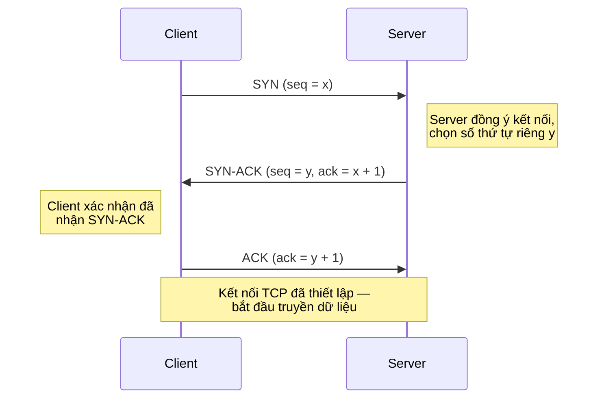

# MASTER COMPUTER SCIENCE HANDBOOK

## Volume 02 — Computer Science Foundations
### Part VIII — Computer Networks
## Chương 8.2 — Bộ giao thức TCP/IP
### (TCP/IP Protocol Suite)

---

### Thông tin chương

| Trường | Giá trị |
|---|---|
| Chương | 8.2 |
| Thuộc Part | VIII — Computer Networks |
| Thuộc Volume | 02 — Computer Science Foundations |
| Thời gian đọc ước tính | 50–60 phút |
| Độ khó | ★★★☆☆ |
| Kiến thức tiên quyết | Chương 8.1 — Network Models (đặc biệt khái niệm encapsulation, tầng Transport và Network) |
| Chương liên quan | 8.3 — Routing (dùng trực tiếp địa chỉ IP học ở chương này); 8.5 — HTTP (giao thức tầng Application chạy trên nền TCP) |
| Từ khóa | IP address, TCP, UDP, three-way handshake, sequence number, acknowledgment, retransmission, flow control, congestion control |

---

### Mục tiêu học tập

Sau khi hoàn thành chương này, người đọc có thể:

- Giải thích vai trò của địa chỉ IP và phân biệt IPv4 với IPv6 ở mức khái niệm.
- Trình bày cấu trúc header của UDP và TCP, giải thích ý nghĩa các trường quan trọng nhất.
- Mô tả chính xác cơ chế bắt tay ba bước (three-way handshake) khi thiết lập kết nối TCP.
- Giải thích cách TCP đảm bảo tin cậy thông qua sequence number, acknowledgment, và cơ chế truyền lại (retransmission).
- Phân biệt kiểm soát luồng (flow control) và kiểm soát tắc nghẽn (congestion control) — hai cơ chế thường bị nhầm lẫn với nhau.
- Lựa chọn đúng giữa TCP và UDP khi thiết kế một ứng dụng mạng cụ thể, dựa trên yêu cầu về độ tin cậy và độ trễ.

---

### Câu hỏi khơi gợi

> *Khi bạn xem video call, đôi lúc hình ảnh bị giật hoặc mất khung hình — nhưng cuộc gọi vẫn tiếp tục, không dừng lại để "sửa lỗi". Ngược lại, khi bạn tải một file, nếu một phần dữ liệu bị mất trên đường truyền, toàn bộ file vẫn sẽ tải về chính xác từng byte, dù có thể chậm hơn một chút. Tại sao hai loại ứng dụng này lại có triết lý xử lý lỗi hoàn toàn trái ngược nhau — và ai là người quyết định điều đó?*

---

## 1. Tổng quan chương

Chương 8.1 đã xây dựng khung tư duy phân lớp — nhưng vẫn còn trừu tượng: "tầng Network thêm header", "tầng Transport đảm bảo tin cậy" là những phát biểu chưa có nội dung cụ thể. Chương 8.2 lấp đầy khoảng trống đó bằng hai giao thức cụ thể nhất, quan trọng nhất của toàn bộ Internet: **IP (Internet Protocol)** ở tầng Network, và **TCP/UDP (Transmission Control Protocol / User Datagram Protocol)** ở tầng Transport.

Đây cũng là chương đầu tiên trong Part VIII mà người đọc sẽ thấy trực tiếp câu trả lời cho câu hỏi khơi gợi ở Chương 8.1: "làm sao gửi dữ liệu tin cậy qua một mạng vốn dĩ không tin cậy?" Câu trả lời nằm gọn trong ba khái niệm sẽ được xây dựng tuần tự trong chương này: **đánh số thứ tự (sequencing)**, **xác nhận (acknowledgment)**, và **truyền lại khi mất mát (retransmission)**.

> **💡 Insight**
> TCP không "sửa" mạng để nó trở nên tin cậy. Mạng dưới tầng IP vẫn hoàn toàn có thể làm mất gói tin, trùng lặp gói tin, hoặc gửi sai thứ tự — TCP chỉ đơn giản là một **giao thức tầng Transport thông minh**, chạy hoàn toàn ở hai đầu (end-to-end), tự phát hiện và tự khắc phục các vấn đề đó mà không cần thay đổi bất cứ điều gì ở các router trung gian. Đây là một trong những nguyên lý thiết kế quan trọng nhất của Internet, gọi là **end-to-end principle**.

---

## 2. Bối cảnh lịch sử

| Thời điểm | Sự kiện | Ý nghĩa |
|---|---|---|
| 1980 | RFC 768 công bố, định nghĩa chính thức **UDP** (Jon Postel) | Giao thức tầng Transport đơn giản nhất — gửi và quên, không đảm bảo gì thêm |
| 1981 | RFC 793 công bố, định nghĩa chính thức **TCP** | Chuẩn hóa đầy đủ cơ chế tin cậy đã được phác thảo từ bài báo Cerf & Kahn 1974 (Chương 8.1, Mục 2) |
| 1986 | Sự kiện **"Congestion Collapse"** trên mạng NSFNET | Thông lượng mạng sụt giảm nghiêm trọng (có báo cáo giảm tới 1000 lần) do các kết nối TCP truyền lại dữ liệu dồn dập khi mạng đã quá tải, khiến tình trạng tắc nghẽn càng trầm trọng hơn |
| 1988 | Van Jacobson công bố bài báo *"Congestion Avoidance and Control"* | Giới thiệu các thuật toán **Slow Start** và **Congestion Avoidance**, trực tiếp giải quyết sự kiện 1986; các thuật toán này vẫn là nền tảng của TCP hiện đại |
| 2016 | Google công bố **BBR (Bottleneck Bandwidth and Round-trip propagation time)** | Một hướng tiếp cận hoàn toàn mới cho kiểm soát tắc nghẽn, dựa trên đo lường băng thông và độ trễ thay vì chỉ dựa vào tín hiệu mất gói tin (Mục 12) |

Sự kiện Congestion Collapse năm 1986 là một bài học kinh điển trong ngành: **một giao thức chỉ tối ưu cho một cặp máy gửi/nhận có thể gây hại cho toàn bộ mạng lưới nếu hàng triệu kết nối cùng hành xử ích kỷ như vậy**. Đây là lý do TCP không chỉ đảm bảo tin cậy cho một kết nối, mà còn phải "có trách nhiệm" với hạ tầng chung — chính là vai trò của congestion control (Mục 8, Mục 12).

---

## 3. Động lực

Hãy xem xét hai tình huống kỹ thuật quen thuộc:

- **Tình huống A:** Bạn xây dựng một API backend trả về dữ liệu JSON cho ứng dụng mobile. Nếu một phần response bị mất trên đường truyền, ứng dụng mobile parse JSON sẽ lỗi ngay lập tức. Dữ liệu **bắt buộc phải đến đầy đủ, đúng thứ tự, không thiếu một byte**.
- **Tình huống B:** Bạn xây dựng một ứng dụng video call. Nếu một khung hình video bị mất, giải pháp tốt nhất không phải là dừng lại chờ gửi lại khung hình đó — vì lúc nhận được thì đã quá trễ để hiển thị. Giải pháp tốt hơn là **bỏ qua khung hình bị mất và tiếp tục với khung hình mới nhất**, chấp nhận một chút giật hình để đổi lấy độ trễ thấp.

Hai tình huống này đòi hỏi hai triết lý thiết kế hoàn toàn khác nhau — và đây chính xác là lý do tầng Transport của TCP/IP cung cấp **hai giao thức song song**, không phải một: TCP cho Tình huống A, UDP cho Tình huống B. Việc một kỹ sư backend hiểu rõ sự khác biệt này, thay vì mặc định luôn dùng TCP, là kỹ năng quyết định khi thiết kế hệ thống thời gian thực.

---

## 4. Trực giác

**Mô hình tinh thần (Mental Model) của chương này:**

> **UDP giống như gửi một tấm bưu thiếp**: bạn viết, dán tem, thả vào hòm thư, và không có cách nào biết chắc nó có đến nơi hay không — không biên nhận, không xác nhận. **TCP giống như gửi thư bảo đảm có biên nhận (registered mail)**: mỗi lá thư được đánh số thứ tự, người nhận phải ký xác nhận đã nhận, và nếu sau một thời gian không có xác nhận, bưu điện sẽ tự động gửi lại.

| Trực giác kỹ thuật bạn đã có | Khái niệm TCP/IP tương ứng |
|---|---|
| Optimistic UI update trong frontend (cập nhật giao diện ngay, rollback nếu server báo lỗi) | Gửi dữ liệu trước, chờ ACK, retransmit nếu timeout (Mục 8) |
| Request ID để khớp response đúng với request tương ứng trong hệ thống bất đồng bộ | Sequence number giúp bên nhận sắp xếp đúng thứ tự các segment |
| Retry logic với exponential backoff khi gọi một API không ổn định | Cơ chế timeout và retransmission của TCP, cùng nguyên lý "chờ lâu hơn sau mỗi lần thất bại" |
| Rate limiting để tránh làm quá tải một service downstream | Congestion control — TCP tự "rate limit" chính nó để tránh làm quá tải mạng |

---

## 5. Trực quan hóa khái niệm

**Hình 8.2.1 — Cơ chế bắt tay ba bước (Three-Way Handshake)**



| Trường thông tin | Nội dung |
|---|---|
| Mục đích | Minh họa vì sao cần đúng **ba** bước, không phải hai — cả Client và Server đều cần tự chọn một số thứ tự khởi đầu (initial sequence number) riêng và xác nhận số đó với đối phương |
| Điểm mấu chốt | Sau ba bước, cả hai bên đều biết chắc: "đối phương còn sống, và đối phương biết tôi còn sống" — nền tảng để bắt đầu đếm sequence number một cách tin cậy ở Mục 6 |

---

**Hình 8.2.2 — TCP đảm bảo tin cậy qua sequence number và ACK**

```text
Client                                          Server
  │                                                │
  │──── Segment 1 (seq=100, data="AAAA") ────────▶ │
  │──── Segment 2 (seq=104, data="BBBB") ────X     │  (gói tin bị mất trên đường truyền)
  │──── Segment 3 (seq=108, data="CCCC") ────────▶ │
  │                                                │
  │◀─── ACK (ack=104) ─────────────────────────────│  (Server chỉ xác nhận đến byte 104,
  │                                                │   báo hiệu ngầm rằng Segment 2 chưa tới)
  │  [Timeout hết hạn cho Segment 2]               │
  │──── Segment 2 (seq=104, data="BBBB") ────────▶ │  (Client truyền lại)
  │                                                │
  │◀─── ACK (ack=112) ─────────────────────────────│  (Server xác nhận đã nhận đủ,
  │                                                │   liên tục đến byte 112)
```

*Mục đích:* Cho thấy trực quan cơ chế cốt lõi giúp TCP tin cậy trên nền một mạng vốn không tin cậy (IP có thể làm mất gói tin bất cứ lúc nào). *Điểm mấu chốt:* Server không cần gửi thông báo lỗi rõ ràng — chỉ cần **im lặng không xác nhận** đủ để Client tự suy luận rằng cần truyền lại, sau khi hết thời gian chờ (timeout).

---

## 6. Định nghĩa hình thức

> **📌 Remember — Địa chỉ IP (IP Address)**
>
> Một **địa chỉ IP** là một định danh số duy nhất được gán cho mỗi thiết bị tham gia vào một mạng IP, dùng để định tuyến gói tin đến đúng đích (Chương 8.3). **IPv4** biểu diễn địa chỉ bằng 32 bit, thường viết dưới dạng bốn nhóm số thập phân cách nhau bởi dấu chấm (ví dụ `192.168.1.10`), cho phép tối đa khoảng $2^{32} \approx 4{,}3$ tỷ địa chỉ — con số này đã cạn kiệt trong thực tế. **IPv6** biểu diễn địa chỉ bằng 128 bit, cung cấp một không gian địa chỉ lớn đến mức gần như không thể cạn kiệt trong tương lai gần, được thiết kế để giải quyết triệt để vấn đề cạn kiệt của IPv4.

**Cấu trúc header UDP** — đơn giản, cố định 8 byte:

| Trường | Kích thước | Ý nghĩa |
|---|---|---|
| Source Port | 2 byte | Cổng của tiến trình gửi |
| Destination Port | 2 byte | Cổng của tiến trình nhận |
| Length | 2 byte | Tổng độ dài của header + dữ liệu |
| Checksum | 2 byte | Kiểm tra tính toàn vẹn dữ liệu (tùy chọn ở IPv4) |

**Cấu trúc header TCP** — phức tạp hơn đáng kể, tối thiểu 20 byte, các trường quan trọng nhất:

| Trường | Ý nghĩa |
|---|---|
| Source Port / Destination Port | Xác định tiến trình gửi/nhận, giống UDP |
| Sequence Number | Số thứ tự của byte đầu tiên trong segment này, dùng để bên nhận sắp xếp đúng thứ tự |
| Acknowledgment Number | Số thứ tự byte tiếp theo mà bên nhận đang mong đợi — ngầm xác nhận mọi byte trước đó đã nhận đủ |
| Flags (SYN, ACK, FIN, RST...) | Cờ điều khiển trạng thái kết nối — SYN để thiết lập, FIN để đóng, RST để hủy đột ngột |
| Window Size | Số byte tối đa bên gửi được phép gửi mà chưa cần chờ ACK — nền tảng của flow control (Mục 7) |

---

## 7. Nền tảng toán học

Một trong những câu hỏi thực tế quan trọng nhất khi vận hành hệ thống mạng là: **"Với một kết nối TCP nhất định, tốc độ truyền tối đa lý thuyết là bao nhiêu?"** Câu trả lời phụ thuộc vào hai đại lượng: kích thước cửa sổ (window size) và độ trễ khứ hồi (RTT — Round-Trip Time).

- **Ý nghĩa:** TCP không gửi dữ liệu vô hạn cùng lúc — nó chỉ được phép gửi tối đa `Window Size` byte mà chưa nhận được ACK. Trong khoảng thời gian một RTT (thời gian gói tin đi và ACK quay về), lượng dữ liệu tối đa có thể "đang trên đường truyền" chính là kích thước cửa sổ.

> **📦 Formula Box — Giới hạn Thông lượng theo Cửa sổ (Bandwidth-Delay Product)**
>
> $$\text{Throughput} \leq \frac{W}{\text{RTT}}$$
>
> | Thành phần | Ý nghĩa |
> |---|---|
> | $W$ | Kích thước cửa sổ (Window Size) — số byte tối đa được gửi mà chưa cần ACK (byte) |
> | $\text{RTT}$ | Round-Trip Time — thời gian từ lúc gửi gói tin đến lúc nhận được ACK tương ứng (giây) |
> | **Diễn giải kỹ thuật** | Đây là giới hạn trên lý thuyết: dù đường truyền vật lý có băng thông lớn đến đâu, nếu cửa sổ quá nhỏ so với RTT, thông lượng thực tế vẫn bị "kìm hãm" bởi chính công thức này — không phải bởi băng thông |
> | **Ứng dụng thường gặp** | Giải thích tại sao kết nối đến server ở xa (RTT lớn) thường chậm hơn đáng kể so với server gần, dù băng thông danh nghĩa như nhau — đây là lý do các công ty lớn triển khai CDN (Chương 8.1, Mục 11) để giảm RTT bằng cách đặt server gần người dùng |

**Ví dụ tính tay:** với cửa sổ $W = 64$ KB $= 65{.}536$ byte, và RTT $= 100$ ms $= 0{,}1$ giây:

$$\text{Throughput} \leq \frac{65{.}536}{0{,}1} = 655{.}360 \text{ byte/giây} \approx 5{,}2 \text{ Mbps}$$

Dù đường truyền vật lý có thể hỗ trợ 100 Mbps, kết nối TCP này vẫn bị giới hạn ở khoảng 5,2 Mbps chỉ vì kích thước cửa sổ quá nhỏ so với RTT — đây chính là động lực thực tế khiến TCP hiện đại hỗ trợ cơ chế **window scaling** để dùng cửa sổ lớn hơn nhiều so với 64 KB mặc định ban đầu.

---

## 8. Thuật toán / Cơ chế

**Cơ chế Stop-and-Wait đơn giản hóa** (một dạng rút gọn của cơ chế TCP dùng để giảng dạy) — minh họa cách sequence number, ACK, và timeout phối hợp để đảm bảo tin cậy:

```text
Bước 1 — Bên gửi gán một sequence number cho segment dữ liệu, gửi đi
        │
        ▼
Bước 2 — Bên gửi khởi động một bộ đếm thời gian (timer) cho segment vừa gửi
        │
        ▼
Bước 3 — Nếu bên nhận nhận được segment nguyên vẹn:
        │     gửi lại ACK với acknowledgment number = sequence number kế tiếp mong đợi
        ▼
Bước 4 — Nếu bên gửi nhận được ACK đúng TRƯỚC KHI timer hết hạn:
        │     hủy timer, chuyển sang gửi segment tiếp theo (quay lại Bước 1)
        ▼
Bước 5 — Nếu timer HẾT HẠN mà chưa nhận được ACK tương ứng:
        │     giả định segment (hoặc ACK của nó) đã bị mất trên đường truyền
        │     → TRUYỀN LẠI (retransmit) chính segment đó, khởi động lại timer (quay lại Bước 2)
```

> **⚠️ Common Mistake**
> Người mới học thường nghĩ rằng TCP "biết" chính xác gói tin nào bị mất nhờ một thông báo lỗi từ mạng. Thực tế, tầng IP bên dưới **không hề báo lỗi mất gói tin** — TCP chỉ suy luận gián tiếp thông qua việc **không nhận được ACK đúng hạn**. Đây là lý do lựa chọn giá trị timeout hợp lý (không quá ngắn gây truyền lại thừa, không quá dài gây chậm trễ) là một bài toán kỹ thuật tinh tế trong thiết kế TCP thực tế.

---

## 9. Triển khai

```python
import random

class UnreliableChannel:
    """Mô phỏng một đường truyền IP không đáng tin cậy:
    có xác suất loss_rate làm mất gói tin."""

    def __init__(self, loss_rate: float = 0.3, seed: int = 42):
        self.loss_rate = loss_rate
        self.rng = random.Random(seed)

    def transmit(self, segment: dict) -> dict | None:
        if self.rng.random() < self.loss_rate:
            return None  # Gói tin bị mất trên đường truyền
        return segment


def stop_and_wait_send(data_chunks: list[str], channel: UnreliableChannel,
                        max_retries: int = 5) -> list[str]:
    """Mô phỏng cơ chế Stop-and-Wait: gửi từng chunk, chờ ACK,
    truyền lại nếu 'timeout' (ở đây mô phỏng bằng việc gói tin không đến nơi)."""
    delivered = []
    for seq, chunk in enumerate(data_chunks):
        attempt = 0
        while attempt < max_retries:
            attempt += 1
            segment = {"seq": seq, "data": chunk}
            received = channel.transmit(segment)

            if received is not None:
                print(f"Segment {seq} (lần thử {attempt}): "
                      f"gửi thành công, ACK={seq + 1}")
                delivered.append(received["data"])
                break
            else:
                print(f"Segment {seq} (lần thử {attempt}): "
                      f"MẤT GÓI TIN — timeout, chuẩn bị truyền lại")
        else:
            raise TimeoutError(f"Segment {seq} thất bại sau {max_retries} lần thử.")
    return delivered
```

Chạy thử với 6 khối dữ liệu qua một kênh truyền có 30% xác suất mất gói:

```python
channel = UnreliableChannel(loss_rate=0.3)
chunks = ["AAAA", "BBBB", "CCCC", "DDDD", "EEEE", "FFFF"]
result = stop_and_wait_send(chunks, channel)

assert result == chunks, "Dữ liệu nhận được phải khớp chính xác dữ liệu gốc"
print("---")
print("Toàn bộ dữ liệu đã được truyền tin cậy:", result)
```

---

## 10. Trực quan hóa quá trình thực thi

**Kết quả chạy thực tế** của đoạn code Mục 9 (với `seed=42`, `loss_rate=0.3`):

```text
Segment 0 (lần thử 1): gửi thành công, ACK=1
Segment 1 (lần thử 1): MẤT GÓI TIN — timeout, chuẩn bị truyền lại
Segment 1 (lần thử 2): gửi thành công, ACK=2
Segment 2 (lần thử 1): gửi thành công, ACK=3
Segment 3 (lần thử 1): gửi thành công, ACK=4
Segment 4 (lần thử 1): MẤT GÓI TIN — timeout, chuẩn bị truyền lại
Segment 4 (lần thử 2): MẤT GÓI TIN — timeout, chuẩn bị truyền lại
Segment 4 (lần thử 3): gửi thành công, ACK=5
Segment 5 (lần thử 1): gửi thành công, ACK=6
---
Toàn bộ dữ liệu đã được truyền tin cậy: ['AAAA', 'BBBB', 'CCCC', 'DDDD', 'EEEE', 'FFFF']
```

Điểm mấu chốt cần quan sát: dù kênh truyền làm mất gói tin một cách ngẫu nhiên và không thể đoán trước (Segment 4 mất tới hai lần liên tiếp), **kết quả cuối cùng vẫn khôi phục chính xác 100% dữ liệu gốc, đúng thứ tự**. Đây chính là "phép màu kỹ thuật" của TCP: biến một kênh truyền không tin cậy (IP) thành một dịch vụ tin cậy hoàn toàn ở tầng phía trên, mà không cần thay đổi bất kỳ điều gì ở bản thân kênh truyền đó — đúng tinh thần end-to-end principle đã nêu ở Mục 1.

---

## 11. Ứng dụng công nghiệp

> **🛠 Engineering Practice**
> Quyết định "dùng TCP hay UDP" là một trong những quyết định kiến trúc có ảnh hưởng sâu rộng nhất khi thiết kế một hệ thống mạng, và các công ty lớn thường đưa ra lựa chọn rất khác nhau tùy vào bài toán.

| Bối cảnh công nghiệp | Lựa chọn giao thức | Lý do |
|---|---|---|
| Web browsing, tải file, API backend (REST) | TCP | Yêu cầu toàn vẹn dữ liệu tuyệt đối; độ trễ vài chục mili-giây không quan trọng bằng tính chính xác |
| Video call (Zoom, Google Meet), game online thời gian thực | UDP (thường kèm cơ chế tin cậy tùy chỉnh ở tầng Application) | Độ trễ thấp quan trọng hơn việc truyền lại dữ liệu cũ đã lỗi thời |
| DNS (Chương 8.4) | UDP (với TCP làm phương án dự phòng cho response lớn) | Truy vấn ngắn, cần phản hồi cực nhanh; nếu mất gói, việc truy vấn lại đơn giản hơn nhiều so với overhead thiết lập kết nối TCP |
| QUIC / HTTP-3 (Google, Cloudflare) | Xây trên nền UDP, tự cài đặt lại cơ chế tin cậy ở tầng Application | Kết hợp độ trễ thấp của UDP với độ tin cậy tùy biến linh hoạt hơn TCP truyền thống (đã đề cập ở Chương 8.1, Mục 12) |

---

## 12. Góc nhìn nghiên cứu

> **🔬 Research Connection**
> Cơ chế tin cậy (Mục 8) chỉ giải quyết một nửa bài toán của TCP. Nửa còn lại — làm sao hàng triệu kết nối TCP cùng chia sẻ một hạ tầng mạng chung mà không gây sập mạng — là một bài toán nghiên cứu đã kéo dài gần bốn thập kỷ.

Sau sự kiện Congestion Collapse 1986 (Mục 2), Van Jacobson (1988) đưa ra hai thuật toán nền tảng vẫn còn được sử dụng: **Slow Start** (bắt đầu gửi dữ liệu chậm, tăng dần cửa sổ theo cấp số nhân cho đến khi phát hiện dấu hiệu tắc nghẽn) và **Congestion Avoidance** (sau đó tăng cửa sổ một cách thận trọng, tuyến tính). Nguyên tắc cốt lõi: TCP xem việc mất gói tin như một **tín hiệu gián tiếp** rằng mạng đang quá tải, và tự động "nhường nhịn" bằng cách giảm tốc độ gửi.

Cách tiếp cận "coi mất gói tin là tín hiệu tắc nghẽn" tồn tại suốt nhiều thập kỷ (các thuật toán Reno, Cubic), nhưng có một hạn chế: trên các mạng hiện đại với bộ đệm (buffer) lớn ở router, gói tin có thể bị *trễ* rất lâu trước khi thực sự bị mất — khiến TCP truyền thống phản ứng quá muộn. Năm 2016, Google công bố **BBR**, thay đổi hoàn toàn triết lý: thay vì chờ mất gói tin, BBR liên tục **đo trực tiếp băng thông khả dụng và độ trễ tối thiểu** của đường truyền, và điều chỉnh tốc độ gửi dựa trên phép đo đó.

**Câu hỏi mở** để suy ngẫm: nếu hàng triệu kết nối TCP dùng các thuật toán congestion control khác nhau (một số dùng Cubic cũ, một số dùng BBR mới) cùng chia sẻ một đường truyền, liệu thuật toán "hiện đại hơn" có luôn công bằng với các thuật toán "cũ hơn", hay nó có thể chiếm phần băng thông không tương xứng? Đây vẫn là một chủ đề nghiên cứu tích cực trong cộng đồng mạng máy tính.

---

## 13. Ưu điểm

**TCP:**
- Đảm bảo dữ liệu đến đầy đủ, đúng thứ tự, không trùng lặp — lý tưởng cho dữ liệu không thể chấp nhận sai sót.
- Tự động điều chỉnh tốc độ theo điều kiện mạng (congestion control), giúp mạng lưới chung ổn định.

**UDP:**
- Overhead cực thấp (8 byte header so với tối thiểu 20 byte của TCP) — tham chiếu trực tiếp công thức hiệu suất truyền tải ở Chương 8.1, Mục 7.
- Không có độ trễ thiết lập kết nối (không cần three-way handshake) — gửi ngay lập tức.
- Không bị "đầu dòng chặn hàng" (head-of-line blocking): một gói tin bị mất không làm chậm trễ các gói tin sau nó.

---

## 14. Hạn chế

**TCP:**
- Độ trễ thiết lập kết nối (ít nhất một RTT cho three-way handshake) trước khi có thể gửi dữ liệu thực sự.
- Head-of-line blocking: nếu một segment bị mất, các segment gửi sau đó — dù đã đến nơi — vẫn phải chờ segment bị mất được truyền lại trước khi được giao cho tầng Application.
- Không phù hợp cho ứng dụng thời gian thực nhạy cảm với độ trễ.

**UDP:**
- Không đảm bảo bất kỳ điều gì: có thể mất gói, trùng gói, hoặc sai thứ tự — tầng Application phải tự xử lý nếu cần.
- Không có congestion control mặc định — một ứng dụng UDP thiết kế kém có thể vô tình làm quá tải mạng lưới chung.

---

## 15. So sánh

**Bảng 8.2.1 — TCP vs UDP**

| Tiêu chí | TCP | UDP |
|---|---|---|
| Kết nối (Connection) | Có trạng thái (connection-oriented), cần handshake | Không trạng thái (connectionless), gửi ngay |
| Độ tin cậy | Đảm bảo (sequence number + ACK + retransmission) | Không đảm bảo |
| Thứ tự dữ liệu | Đảm bảo đúng thứ tự | Không đảm bảo |
| Kích thước header tối thiểu | 20 byte | 8 byte |
| Congestion Control | Có (Mục 12) | Không (mặc định) |
| Độ trễ thiết lập | ≥ 1 RTT (three-way handshake) | Không có, gửi ngay |
| Ứng dụng tiêu biểu | HTTP, FTP, gọi API backend | DNS, video call, game online, QUIC |

**Phân tích:** Không có giao thức nào "tốt hơn" một cách tuyệt đối — đây là một đánh đổi (trade-off) kinh điển giữa **độ tin cậy** và **độ trễ**. Quyết định đúng luôn phụ thuộc vào bản chất dữ liệu: dữ liệu có giá trị nếu đến trễ một chút (file, trang web) nên dùng TCP; dữ liệu mất giá trị nếu đến trễ (âm thanh, video thời gian thực) nên cân nhắc UDP kèm cơ chế xử lý mất gói tùy chỉnh ở tầng Application.

---

## 16. Tóm tắt

- **Địa chỉ IP** định danh duy nhất mỗi thiết bị trên mạng; IPv4 (32 bit) đã cạn kiệt không gian địa chỉ, IPv6 (128 bit) giải quyết vấn đề này.
- **UDP** là giao thức tầng Transport tối giản: gửi và không đảm bảo gì thêm, overhead thấp, phù hợp ứng dụng thời gian thực.
- **TCP** đảm bảo tin cậy thông qua ba cơ chế phối hợp: **sequence number** (đánh số byte), **acknowledgment** (xác nhận đã nhận), và **retransmission** (truyền lại khi timeout) — được thiết lập qua **three-way handshake**.
- **Flow control** (dùng Window Size) và **congestion control** (Van Jacobson 1988, BBR 2016) là hai cơ chế riêng biệt: một bảo vệ bên nhận khỏi quá tải, một bảo vệ toàn bộ mạng khỏi quá tải.
- Thông lượng TCP bị giới hạn về mặt lý thuyết bởi công thức $\text{Throughput} \leq W / \text{RTT}$ — giải thích trực tiếp vì sao khoảng cách địa lý (RTT) ảnh hưởng mạnh đến tốc độ thực tế.

Chương 8.3 (Routing) sẽ trả lời câu hỏi còn bỏ ngỏ: địa chỉ IP vừa học ở Mục 6 được dùng như thế nào để một gói tin "tìm đường" qua hàng nghìn router để đến đúng đích?

---

## 17. Bài tập

### Mức Cơ bản (Basic)

1. Vẽ lại sơ đồ three-way handshake (Hình 8.2.1) từ trí nhớ, giải thích ý nghĩa của từng bước.
2. Liệt kê ít nhất ba điểm khác biệt giữa header TCP và header UDP.
3. Cho một ứng dụng phát nhạc trực tuyến (streaming), theo bạn nên dùng TCP hay UDP? Giải thích ngắn gọn.

### Mức Trung bình (Intermediate)

4. Với Window Size $W = 128$ KB và RTT $= 250$ ms, tính thông lượng tối đa lý thuyết theo công thức ở Mục 7 (đơn vị Mbps).
5. Trong Hình 8.2.2, giải thích tại sao Server chỉ cần gửi `ACK (ack=104)` (thay vì một thông báo lỗi rõ ràng) để Client hiểu rằng Segment 2 đã bị mất.

### Mức Nâng cao (Advanced)

6. Sửa đoạn code ở Mục 9 để mô phỏng cơ chế **exponential backoff**: mỗi lần truyền lại thất bại, in thêm một giá trị "thời gian chờ" tăng gấp đôi sau mỗi lần thử (ví dụ 1s, 2s, 4s...). Không cần chờ thực sự (không dùng `time.sleep`), chỉ cần in ra giá trị mô phỏng.
7. Thiết kế (trên giấy) một cơ chế tin cậy đơn giản cho một ứng dụng UDP tùy chỉnh (ví dụ game online), trong đó bạn **chỉ** truyền lại các gói tin quan trọng (như "người chơi bắn súng") nhưng **không** truyền lại các gói tin ít quan trọng (như "cập nhật vị trí mỗi 20ms"). Giải thích logic phân loại của bạn.

### Mức Nghiên cứu (Research)

8. Đọc thêm về thuật toán BBR (Mục 12) và so sánh bằng lời (không cần công thức toán chi tiết) với cách tiếp cận Congestion Avoidance cổ điển của Van Jacobson: sự khác biệt căn bản trong triết lý phát hiện tắc nghẽn giữa hai cách tiếp cận là gì? Đây là câu hỏi mở-kết-thúc.

---

## 18. Dự án nhỏ

**Dự án: Mô phỏng Reliable Transfer Protocol trên nền UDP**

- **Mục tiêu:** Mở rộng mô phỏng ở Mục 9 thành một chương trình có khả năng gửi một file văn bản qua một "kênh truyền" tự tạo có tỷ lệ mất gói tin có thể cấu hình, dùng đúng nguyên lý sequence number + ACK + retransmission.
- **Yêu cầu:**
  - Chia file thành nhiều chunk cố định kích thước (ví dụ 20 ký tự/chunk).
  - Áp dụng cơ chế Stop-and-Wait đã học ở Mục 8–9.
  - In ra thống kê cuối cùng: tổng số lần truyền lại, tỷ lệ overhead thực tế so với lý thuyết.
- **Công nghệ đề xuất:** Python thuần, không cần thư viện mạng thực sự (dùng mô phỏng như Mục 9).
- **Mở rộng (tùy chọn):** Cài đặt thêm cơ chế **Sliding Window** (thay vì Stop-and-Wait) — cho phép gửi nhiều segment cùng lúc mà không cần chờ ACK từng cái một, gần với TCP thực tế hơn.

---

## 19. Tự đánh giá

- [ ] Tôi có thể tự vẽ và giải thích đầy đủ ba bước của three-way handshake mà không cần xem lại tài liệu.
- [ ] Tôi hiểu rõ vì sao TCP có thể phát hiện mất gói tin dù tầng IP không hề gửi thông báo lỗi.
- [ ] Tôi có thể tính chính xác thông lượng lý thuyết theo công thức Bandwidth-Delay Product cho một tình huống cho trước.
- [ ] Tôi có thể lý giải và bảo vệ được lựa chọn TCP hoặc UDP cho ít nhất ba loại ứng dụng khác nhau.
- [ ] Tôi hiểu sự khác biệt giữa flow control (bảo vệ bên nhận) và congestion control (bảo vệ toàn mạng) — không nhầm lẫn hai khái niệm này.

Nếu Bài tập 4 vẫn còn khó khăn, hãy quay lại Formula Box ở Mục 7 và thử tính lại với các giá trị $W$, RTT khác nhau trước khi tiếp tục — công thức này sẽ xuất hiện lại dưới dạng biến thể khi phân tích hiệu năng ở Volume 04.

---

## 20. Đọc thêm

- **Sách:** Kurose, J., Ross, K., *Computer Networking: A Top-Down Approach* — chương về Transport Layer trình bày đầy đủ chi tiết cài đặt TCP thực tế mà chương này chỉ giới thiệu ở mức khái niệm. *(Xem BOOKS.md.)*
- **Bài báo:** Jacobson, V. (1988). *Congestion Avoidance and Control* — bài báo kinh điển đặt nền móng cho congestion control hiện đại.
- **Chủ đề mở rộng (không bắt buộc):** tìm đọc tổng quan về thuật toán BBR của Google để thấy hướng tiếp cận hiện đại nhất cho congestion control.
- **Chương tiếp theo:** Chương 8.3 — Routing.

---

### Liên kết chương (Cross References)

- **Chương trước:** 8.1 — Network Models (áp dụng trực tiếp khái niệm encapsulation và tầng Transport/Network vào hai giao thức cụ thể trong chương này).
- **Chương tiếp theo:** 8.3 — Routing (dùng trực tiếp địa chỉ IP học ở Mục 6 để giải thích cách gói tin được định tuyến qua mạng).
- **Chương liên quan xa hơn:** Chương 8.5 — HTTP (giao thức tầng Application chạy trên nền TCP vừa học); Volume 04, Part V — Computer Networks (mở rộng sâu về QUIC, vốn xây trên nền UDP như đề cập ở Mục 11).
- **Vị trí trong Knowledge Graph:** Nút thứ hai của Part VIII, phụ thuộc trực tiếp vào Chương 8.1; là điều kiện tiên quyết cho Chương 8.3, 8.4, và gián tiếp cho toàn bộ các chương tầng Application (8.5–8.8).

---

*Hết Chương 8.2. Chương này tuân thủ đầy đủ cấu trúc 20 mục của `OUTPUT.md` và chuẩn Presentation Layer, khớp với outline Part VIII đã được duyệt. Mọi kết quả mô phỏng ở Mục 9–10 đều được kiểm chứng bằng code Python chạy thực tế. Đang chờ rà soát trước khi tiếp tục sang Chương 8.3 — Routing.*
