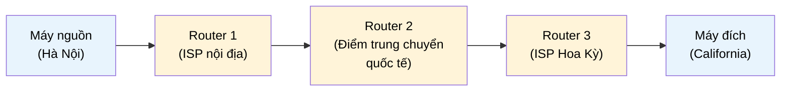

# MASTER COMPUTER SCIENCE HANDBOOK

## Volume 02 — Computer Science Foundations
### Part VIII — Computer Networks
## Chương 8.3 — Định tuyến
### (Routing)

---

### Thông tin chương

| Trường | Giá trị |
|---|---|
| Chương | 8.3 |
| Thuộc Part | VIII — Computer Networks |
| Thuộc Volume | 02 — Computer Science Foundations |
| Thời gian đọc ước tính | 40–50 phút |
| Độ khó | ★★★☆☆ |
| Kiến thức tiên quyết | Chương 8.2 — TCP/IP (đặc biệt khái niệm địa chỉ IP); Volume 02, Part IV — Data Structures (Graph, Graph Traversal) |
| Chương liên quan | Volume 03, Part IV — Graph Algorithms (Shortest Path, dùng trực tiếp trong chương này); 8.4 — DNS (một dịch vụ chạy phía trên tầng định tuyến vừa học) |
| Từ khóa | router, routing table, hop, TTL, static routing, dynamic routing, distance-vector, link-state, BGP, NAT |

---

### Mục tiêu học tập

Sau khi hoàn thành chương này, người đọc có thể:

- Giải thích vai trò của router và bảng định tuyến (routing table) trong việc chuyển tiếp gói tin.
- Mô tả cơ chế TTL (Time To Live) và giải thích vì sao nó cần thiết để ngăn gói tin lặp vô hạn.
- Phân biệt định tuyến tĩnh (static routing) và định tuyến động (dynamic routing).
- Giải thích ở mức khái niệm sự khác biệt giữa giao thức distance-vector và link-state.
- Liên hệ trực tiếp bài toán định tuyến với bài toán tìm đường đi ngắn nhất trên đồ thị đã học ở Volume 03.
- Giải thích khái niệm NAT và lý do nó tồn tại trong bối cảnh IPv4 khan hiếm địa chỉ.

---

### Câu hỏi khơi gợi

> *Khi bạn gửi một request từ Hà Nội đến một server ở California, gói tin của bạn phải đi qua hàng chục, thậm chí hàng trăm router trung gian, thuộc về hàng chục công ty viễn thông khác nhau, không có bất kỳ "bản đồ tổng thể" nào của toàn bộ Internet được lưu ở một nơi duy nhất. Vậy làm sao mỗi router, chỉ biết về "hàng xóm" trực tiếp của mình, lại có thể phối hợp để đưa gói tin đến đúng đích một cách đáng tin cậy?*

---

## 1. Tổng quan chương

Chương 8.2 đã trả lời câu hỏi "làm sao truyền dữ liệu tin cậy giữa hai điểm đầu cuối?" — nhưng đã ngầm giả định rằng gói tin *biết cách* đi từ điểm A đến điểm B. Chương 8.3 lấp đầy giả định đó: đây là chương giải thích **cơ chế "tìm đường"** thực sự của một gói tin IP, từ máy nguồn, qua vô số router trung gian, đến máy đích.

Điểm đặc biệt của chương này là nó **không giới thiệu kiến thức toán học mới** — bài toán định tuyến, về bản chất, chính là bài toán tìm đường đi ngắn nhất trên đồ thị mà Volume 03, Part IV sẽ trình bày đầy đủ thuật toán (Dijkstra, Bellman-Ford). Chương này tập trung vào **khía cạnh hệ thống**: làm sao hàng triệu router, mỗi router chỉ có tầm nhìn cục bộ, phối hợp với nhau để giải bài toán đó ở quy mô toàn cầu — mà không cần một "bộ não trung tâm" nào điều phối.

> **💡 Insight**
> Nếu bạn đã dùng Google Maps để tìm đường, bạn đã trải nghiệm bài toán tìm đường đi ngắn nhất từ góc nhìn của **một người quan sát có toàn bộ bản đồ**. Định tuyến Internet hoàn toàn khác: mỗi router giống như một người chỉ biết đường đến các ngã tư liền kề, không có bản đồ tổng thể — và toàn bộ hệ thống vẫn hoạt động chính xác nhờ router "trao đổi thông tin" với nhau liên tục.

---

## 2. Bối cảnh lịch sử

| Thời điểm | Sự kiện | Ý nghĩa |
|---|---|---|
| Cuối thập niên 1960 – 1970 | ARPANET dùng các thuật toán định tuyến động sơ khai giữa các nút mạng | Tiền thân của giao thức định tuyến hiện đại, chứng minh tính khả thi của định tuyến tự động, phân tán |
| 1988 | Giao thức **RIP (Routing Information Protocol)** được chuẩn hóa rộng rãi | Một trong những giao thức distance-vector phổ biến đầu tiên, đơn giản nhưng có nhiều hạn chế về khả năng mở rộng |
| 1989 | Giao thức **OSPF (Open Shortest Path First)** ra đời | Giao thức link-state hiện đại hơn, giải quyết nhiều hạn chế của RIP, vẫn được dùng rộng rãi trong mạng nội bộ doanh nghiệp ngày nay |
| 1989 | Giao thức **BGP (Border Gateway Protocol)** ra đời | Giao thức định tuyến giữa các hệ thống tự quản (Autonomous System) — chính là "chất keo" kết nối hàng chục nghìn mạng độc lập thành một Internet duy nhất |
| 2008 | McKeown và cộng sự công bố bài báo *"OpenFlow: Enabling Innovation in Campus Networks"* | Đặt nền móng cho **Software-Defined Networking (SDN)** — tách biệt logic định tuyến (control plane) khỏi thiết bị chuyển tiếp gói tin (data plane), mở đường cho hướng nghiên cứu hiện đại (Mục 12, mở rộng ở Volume 04) |

Một sự thật thường gây bất ngờ cho người mới học: **Internet không phải một mạng duy nhất, mà là một "mạng của các mạng"** (network of networks) — hàng chục nghìn tổ chức độc lập (công ty viễn thông, trường đại học, chính phủ), mỗi tổ chức vận hành một **Autonomous System (AS)** riêng, và BGP chính là giao thức cho phép các AS này thỏa thuận với nhau về cách chuyển tiếp lưu lượng qua lại — không có bất kỳ cơ quan trung ương nào ra lệnh.

---

## 3. Động lực

Hãy hình dung bạn vận hành một dịch vụ backend có server đặt tại Singapore, phục vụ người dùng ở khắp Đông Nam Á. Bạn quan sát thấy độ trễ (latency) đến người dùng ở Việt Nam thấp hơn đáng kể so với người dùng ở Indonesia, dù khoảng cách địa lý gần tương đương. Câu trả lời không nằm ở khoảng cách vật lý theo đường chim bay, mà nằm ở **con đường thực tế mà gói tin phải đi qua trên hạ tầng mạng** — số lượng router trung gian (hop count), chất lượng và độ tắc nghẽn của từng liên kết, và các thỏa thuận thương mại giữa các nhà cung cấp mạng (peering agreement) quyết định tuyến đường nào được ưu tiên.

Hiểu cơ chế định tuyến giúp kỹ sư backend trả lời được những câu hỏi thực tế: Tại sao dùng công cụ `traceroute` lại thấy gói tin "nhảy" qua nhiều quốc gia trước khi đến đích, dù server đích ở gần? Tại sao đặt server ở nhiều khu vực địa lý (multi-region deployment) lại cải thiện độ trễ tốt hơn là chỉ tăng băng thông của một server duy nhất?

---

## 4. Trực giác

**Mô hình tinh thần (Mental Model) của chương này:**

> Định tuyến Internet giống như **hệ thống chỉ đường tại các ngã tư đường bộ**, không phải bản đồ GPS tập trung. Mỗi router giống như một biển báo tại một ngã tư, chỉ ghi: "muốn đến khu vực X, hãy rẽ theo hướng này". Người lái xe (gói tin) không cần biết toàn bộ hành trình từ đầu — chỉ cần đọc đúng biển báo tại mỗi ngã tư, đi hết ngã tư này đến ngã tư khác, và cuối cùng sẽ đến đích.

| Trực giác kỹ thuật bạn đã có | Khái niệm Routing tương ứng |
|---|---|
| Bảng định tuyến (routing table) trong một thư viện web framework, ánh xạ URL pattern → handler function | Routing table của router, ánh xạ dải địa chỉ IP đích → cổng ra (next hop) |
| Giới hạn số lần redirect trong một HTTP client để tránh vòng lặp vô hạn | TTL (Time To Live) — giới hạn số hop tối đa để tránh gói tin lặp vô hạn trong mạng |
| Cache-Control / TTL của một bản ghi cache | TTL trong routing — cùng ý tưởng "giới hạn thời gian sống", khác ngữ cảnh áp dụng |
| Microservice discovery tự động cập nhật danh sách service khi có instance mới/cũ | Giao thức định tuyến động (OSPF, BGP) tự động cập nhật bảng định tuyến khi cấu trúc mạng thay đổi |

---

## 5. Trực quan hóa khái niệm

**Hình 8.3.1 — Gói tin di chuyển qua nhiều router (multi-hop routing)**



| Trường thông tin | Nội dung |
|---|---|
| Mục đích | Minh họa gói tin không đi "thẳng" từ nguồn đến đích, mà đi qua một chuỗi các **hop** (mỗi lần qua một router tính là một hop) |
| Điểm mấu chốt | Mỗi router chỉ quyết định "hop tiếp theo là ai" dựa trên bảng định tuyến cục bộ của chính nó — không router nào biết toàn bộ hành trình còn lại |

---

**Hình 8.3.2 — Ví dụ Bảng định tuyến (Routing Table) đơn giản hóa**

```text
┌─────────────────────┬──────────────┬──────┐
│ Destination Network  │  Next Hop    │ Cost │
├─────────────────────┼──────────────┼──────┤
│ 192.168.1.0/24       │  Direct      │  0   │
│ 10.0.0.0/8           │  R2 (Router) │  2   │
│ 172.16.0.0/16        │  R3 (Router) │  5   │
│ 0.0.0.0/0 (default)  │  R1 (Gateway)│  ∞   │
└─────────────────────┴──────────────┴──────┘
```

*Mục đích:* Cho thấy cấu trúc thực tế của một bảng định tuyến — không lưu địa chỉ IP đơn lẻ, mà lưu **dải mạng (network prefix)** ánh xạ đến next hop và chi phí (cost). *Điểm mấu chốt:* dòng cuối cùng — **default route** (`0.0.0.0/0`) — là "phương án dự phòng": nếu không có dòng nào khớp chính xác hơn, gói tin sẽ được chuyển đến gateway mặc định, thường là hướng ra Internet.

---

## 6. Định nghĩa hình thức

> **📌 Remember — Router**
>
> Một **router** là một thiết bị hoạt động ở tầng Network, có nhiệm vụ nhận gói tin từ một cổng vào (interface), tra cứu **bảng định tuyến (routing table)** để xác định cổng ra phù hợp nhất dựa trên địa chỉ IP đích, rồi chuyển tiếp (forward) gói tin qua cổng đó. Quá trình này lặp lại tại mỗi router trên đường đi, gọi là **forwarding**.

**TTL (Time To Live)** — một trường trong header IP, mang giá trị số nguyên. Mỗi lần gói tin đi qua một router (một hop), giá trị TTL giảm đi 1. Nếu TTL giảm về 0 mà gói tin vẫn chưa đến đích, router sẽ **loại bỏ gói tin** và gửi thông báo lỗi về máy nguồn.

**Định tuyến tĩnh (Static Routing)** — quản trị viên mạng cấu hình thủ công từng dòng trong bảng định tuyến, không tự động thay đổi khi cấu trúc mạng thay đổi.

**Định tuyến động (Dynamic Routing)** — router tự động trao đổi thông tin với các router lân cận thông qua một **giao thức định tuyến (routing protocol)**, tự cập nhật bảng định tuyến khi phát hiện thay đổi (liên kết hỏng, đường đi tốt hơn xuất hiện).

**Hai họ giao thức định tuyến động chính:**

| Họ giao thức | Nguyên tắc hoạt động | Ví dụ |
|---|---|---|
| Distance-Vector | Mỗi router chỉ chia sẻ với hàng xóm trực tiếp "tôi cách đích X bao xa", không chia sẻ toàn bộ bản đồ mạng | RIP |
| Link-State | Mỗi router xây dựng và chia sẻ bản đồ đầy đủ về các liên kết mà nó biết, sau đó mỗi router tự tính đường đi ngắn nhất trên toàn bộ bản đồ đó | OSPF |

---

## 7. Nền tảng toán học

Chương này **không giới thiệu lại** thuật toán tìm đường đi ngắn nhất — Dijkstra và Bellman-Ford đã (hoặc sẽ) được trình bày đầy đủ ở Volume 03, Part IV. Điều quan trọng cần nắm ở đây là: **bài toán định tuyến chính là một thực thể áp dụng trực tiếp của bài toán đồ thị đó**, với ánh xạ khái niệm rất tự nhiên.

> **📦 Formula Box — Chi phí Đường đi (Path Cost) trong Định tuyến**
>
> $$\text{Cost}(P) = \sum_{i=1}^{n} w(e_i)$$
>
> | Thành phần | Ý nghĩa |
> |---|---|
> | $P$ | Một đường đi (path) gồm $n$ liên kết (edge/link) từ router nguồn đến router đích |
> | $w(e_i)$ | Trọng số (weight/cost) của liên kết thứ $i$ — có thể đại diện cho độ trễ, số hop, hoặc chi phí băng thông tùy giao thức |
> | **Diễn giải kỹ thuật** | Mục tiêu của mọi giao thức định tuyến là tìm đường đi $P^*$ sao cho $\text{Cost}(P^*)$ nhỏ nhất trong số mọi đường đi khả thi — đây chính xác là định nghĩa bài toán **Shortest Path** trên đồ thị có trọng số |
> | **Ánh xạ với Graph Theory** | Router ↔ Đỉnh (Vertex); Liên kết mạng ↔ Cạnh (Edge); Chi phí liên kết ↔ Trọng số cạnh (Edge Weight); Bảng định tuyến ↔ Kết quả thuật toán Shortest Path tính từ một đỉnh nguồn đến mọi đỉnh khác |

**Ví dụ minh họa** (không đi vào thuật toán, chỉ minh họa phép tính tổng chi phí): xét một đường đi từ Router A qua Router B, C, rồi đến Router D, với chi phí từng liên kết lần lượt là $w(A,B)=2$, $w(B,C)=1$, $w(C,D)=4$:

$$\text{Cost}(P) = 2 + 1 + 4 = 7$$

Nếu tồn tại một đường đi khác từ A đến D với tổng chi phí nhỏ hơn 7, giao thức định tuyến động (Mục 6) sẽ tự động phát hiện và cập nhật bảng định tuyến để ưu tiên đường đi rẻ hơn đó — đây chính là công việc mà Dijkstra (OSPF) hoặc Bellman-Ford (RIP) thực hiện ở hậu trường, sẽ được trình bày đầy đủ ở Volume 03.

---

## 8. Thuật toán / Cơ chế

**Cơ chế Forwarding kèm kiểm tra TTL** — quá trình xảy ra tại mỗi router khi một gói tin đi qua:

```text
Bước 1 — Router nhận gói tin từ một cổng vào (interface)
        │
        ▼
Bước 2 — Giảm giá trị TTL của gói tin đi 1
        │
        ▼
Bước 3 — Nếu TTL == 0:
        │     Loại bỏ gói tin, gửi thông báo lỗi ICMP "Time Exceeded" về máy nguồn
        │     → DỪNG xử lý (đây chính là cơ chế traceroute tận dụng, Mục 11)
        ▼
Bước 4 — Nếu TTL > 0:
        │     Tra cứu bảng định tuyến (Hình 8.3.2), tìm dòng khớp
        │     với địa chỉ IP đích theo nguyên tắc "khớp dài nhất"
        │     (Longest Prefix Match — dòng có prefix cụ thể nhất được ưu tiên)
        ▼
Bước 5 — Xác định next hop và cổng ra tương ứng
        │
        ▼
Bước 6 — Chuyển tiếp (forward) gói tin qua cổng ra đó
        │
        ▼
Bước 7 — Lặp lại từ Bước 1 tại router tiếp theo, cho đến khi gói tin đến đích
```

> **⚠️ Common Mistake**
> Người mới học thường nghĩ TTL là "thời gian tính bằng giây". Trên thực tế, TTL trong IP là **một bộ đếm số hop**, không phải thời gian thực — mỗi lần qua một router, giá trị giảm đúng 1 đơn vị, bất kể router đó xử lý nhanh hay chậm. Tên gọi "Time To Live" mang tính lịch sử, dễ gây hiểu lầm hơn là mô tả chính xác cơ chế hoạt động.

---

## 9. Triển khai

```python
class Router:
    """Mô phỏng một router: có bảng định tuyến, biết cách forward gói tin."""

    def __init__(self, name: str, routing_table: dict[str, str]):
        self.name = name
        # routing_table ánh xạ: mạng đích -> tên router kế tiếp (hoặc "LOCAL")
        self.routing_table = routing_table

    def next_hop(self, destination_network: str) -> str:
        if destination_network not in self.routing_table:
            raise ValueError(f"{self.name}: không có route đến {destination_network}")
        return self.routing_table[destination_network]


def forward_packet(source_router: str, destination_network: str,
                    network: dict[str, Router], ttl: int = 8) -> list[str]:
    """Mô phỏng quá trình forwarding qua nhiều router, có kiểm tra TTL."""
    path = [source_router]
    current = source_router

    while True:
        ttl -= 1
        if ttl <= 0:
            print(f"TTL hết hạn tại {current} — gói tin bị loại bỏ (ICMP Time Exceeded)")
            return path

        router = network[current]
        hop = router.next_hop(destination_network)

        if hop == "LOCAL":
            print(f"{current}: đích {destination_network} nằm trong mạng cục bộ — đã đến nơi")
            return path

        print(f"{current}: forward tới {hop} (TTL còn lại = {ttl})")
        path.append(hop)
        current = hop
```

Chạy thử với một mạng gồm 4 router, mô phỏng gói tin từ `R_HN` đến mạng đích `10.0.0.0/8`:

```python
network = {
    "R_HN":  Router("R_HN",  {"10.0.0.0/8": "R_SG"}),
    "R_SG":  Router("R_SG",  {"10.0.0.0/8": "R_HK"}),
    "R_HK":  Router("R_HK",  {"10.0.0.0/8": "R_US"}),
    "R_US":  Router("R_US",  {"10.0.0.0/8": "LOCAL"}),
}

path = forward_packet("R_HN", "10.0.0.0/8", network, ttl=8)
print("---")
print("Đường đi hoàn chỉnh:", " → ".join(path))
```

---

## 10. Trực quan hóa quá trình thực thi

**Kết quả chạy thực tế** của đoạn code Mục 9:

```text
R_HN: forward tới R_SG (TTL còn lại = 7)
R_SG: forward tới R_HK (TTL còn lại = 6)
R_HK: forward tới R_US (TTL còn lại = 5)
R_US: đích 10.0.0.0/8 nằm trong mạng cục bộ — đã đến nơi
---
Đường đi hoàn chỉnh: R_HN → R_SG → R_HK → R_US
```

**Kiểm chứng cơ chế TTL hết hạn**, dùng cùng mạng nhưng đặt `ttl=3` (không đủ để đi hết 3 hop cần thiết):

```text
R_HN: forward tới R_SG (TTL còn lại = 2)
R_SG: forward tới R_HK (TTL còn lại = 1)
TTL hết hạn tại R_HK — gói tin bị loại bỏ (ICMP Time Exceeded)
```

Điểm mấu chốt: đoạn mô phỏng ở trên chính là nguyên lý hoạt động thực sự của công cụ `traceroute` — bằng cách cố ý gửi gói tin với TTL tăng dần (1, 2, 3...) và ghi nhận router nào gửi về thông báo "TTL hết hạn" ở mỗi lần, `traceroute` "vẽ" lại chính xác đường đi thực tế của gói tin qua từng router trung gian, hoàn toàn dựa trên cơ chế TTL vừa mô phỏng.

---

## 11. Ứng dụng công nghiệp

> **🛠 Engineering Practice**
> Hiểu cơ chế định tuyến giúp kỹ sư hệ thống chẩn đoán và tối ưu hiệu năng mạng ở quy mô thực tế.

| Bối cảnh công nghiệp | Vai trò của Routing |
|---|---|
| Lệnh `traceroute` / `tracert` | Ứng dụng trực tiếp cơ chế TTL (Mục 8, Mục 10) để liệt kê từng router trên đường đi — công cụ chẩn đoán mạng phổ biến nhất |
| CDN và Anycast Routing | Nhiều nhà cung cấp CDN (Cloudflare) dùng kỹ thuật Anycast — cùng một địa chỉ IP được quảng bá từ nhiều địa điểm, và BGP tự động định tuyến người dùng đến điểm gần nhất về mặt mạng |
| NAT (Network Address Translation) | Cho phép nhiều thiết bị trong mạng nội bộ (dùng địa chỉ IP riêng, ví dụ `192.168.x.x`) cùng chia sẻ một địa chỉ IP công cộng duy nhất khi ra Internet — giải pháp thực tế quan trọng nhất cho tình trạng cạn kiệt IPv4 (Chương 8.2, Mục 6) trong lúc chờ IPv6 được áp dụng rộng rãi |
| BGP Peering giữa các ISP | Các thỏa thuận thương mại và kỹ thuật giữa nhà cung cấp mạng quyết định trực tiếp đường đi thực tế của lưu lượng Internet toàn cầu, không chỉ dựa thuần túy vào "đường ngắn nhất" |

---

## 12. Góc nhìn nghiên cứu

> **🔬 Research Connection**
> Định tuyến truyền thống đặt logic quyết định đường đi (control plane) phân tán ngay trên từng router. Một hướng nghiên cứu quan trọng trong hai thập kỷ gần đây đặt câu hỏi: điều gì sẽ xảy ra nếu tách rời hoàn toàn logic đó ra khỏi thiết bị phần cứng?

Bài báo của McKeown và cộng sự (2008), *"OpenFlow: Enabling Innovation in Campus Networks"*, đề xuất ý tưởng nền tảng của **Software-Defined Networking (SDN)**: tách biệt **control plane** (nơi quyết định "gói tin nên đi đường nào") khỏi **data plane** (nơi thực sự chuyển tiếp gói tin), và tập trung hóa control plane vào một bộ điều khiển phần mềm (SDN controller) có thể lập trình được, thay vì cấu hình thủ công từng router riêng lẻ. Ý tưởng này cho phép các trung tâm dữ liệu quy mô lớn (Google, các nhà cung cấp cloud) quản lý hàng chục nghìn thiết bị mạng một cách linh hoạt, tự động hóa cao — chủ đề sẽ được mở rộng đầy đủ ở Volume 04.

Một hướng nghiên cứu và vận hành thực tế khác liên quan trực tiếp đến BGP là vấn đề **bảo mật định tuyến**: vì BGP dựa trên "niềm tin" giữa các Autonomous System mà không có cơ chế xác thực mặc định mạnh mẽ, sự cố **BGP hijacking** (một AS "tự nhận" mình sở hữu một dải địa chỉ IP không thuộc về mình, khiến lưu lượng bị định tuyến sai) vẫn là một rủi ro an ninh mạng thực tế, thúc đẩy các nỗ lực nghiên cứu và triển khai cơ chế xác thực bổ sung cho BGP.

**Câu hỏi mở** để suy ngẫm: nếu SDN cho phép tập trung hóa logic điều khiển để dễ quản lý hơn, liệu điều đó có đi ngược lại chính triết lý phân tán, không có điểm lỗi trung tâm (no single point of failure) mà Internet nguyên bản được thiết kế để đạt được? Đây là một đánh đổi kiến trúc vẫn đang được tranh luận trong cộng đồng nghiên cứu mạng.

---

## 13. Ưu điểm

- **Định tuyến động** tự động thích nghi khi cấu trúc mạng thay đổi (liên kết hỏng, router mới thêm vào) mà không cần can thiệp thủ công.
- **Cơ chế TTL** đảm bảo gói tin không bao giờ lặp vô hạn trong mạng, ngay cả khi có lỗi cấu hình gây vòng lặp định tuyến (routing loop) tạm thời.
- **Kiến trúc phân tán** (mỗi router chỉ cần biết hàng xóm) giúp Internet có khả năng mở rộng đến quy mô toàn cầu mà không cần một hệ thống trung tâm xử lý mọi quyết định.
- **NAT** giải quyết hiệu quả bài toán khan hiếm địa chỉ IPv4 mà không cần thay đổi hạ tầng hiện có.

---

## 14. Hạn chế

- **Định tuyến tĩnh** không thể tự thích nghi — nếu một liên kết hỏng, quản trị viên phải can thiệp thủ công.
- **Giao thức distance-vector** (như RIP) hội tụ chậm khi mạng lớn và có thể gây ra vấn đề "đếm đến vô cực" (count-to-infinity) trong một số tình huống lỗi mạng — một hạn chế đã được giải quyết phần lớn bởi các giao thức link-state hiện đại hơn.
- **BGP dựa trên niềm tin** giữa các AS, thiếu cơ chế xác thực mạnh mẽ mặc định — nguồn gốc của rủi ro BGP hijacking (Mục 12).
- **NAT phá vỡ tính "kết nối trực tiếp" (end-to-end connectivity)** giữa hai thiết bị, gây phức tạp cho một số ứng dụng peer-to-peer, vốn cần các kỹ thuật bổ sung (NAT traversal) để hoạt động chính xác.

---

## 15. So sánh

**Bảng 8.3.1 — Static Routing vs Dynamic Routing**

| Tiêu chí | Static Routing | Dynamic Routing |
|---|---|---|
| Cấu hình | Thủ công, do quản trị viên nhập | Tự động, router tự trao đổi thông tin |
| Khả năng thích nghi | Không tự thay đổi khi mạng thay đổi | Tự động cập nhật khi phát hiện thay đổi |
| Độ phức tạp triển khai | Đơn giản, phù hợp mạng nhỏ, ổn định | Phức tạp hơn, cần giao thức chuyên dụng (RIP, OSPF, BGP) |
| Overhead tài nguyên | Không tốn tài nguyên trao đổi thông tin | Tốn băng thông và CPU để trao đổi cập nhật định kỳ |
| Phù hợp | Mạng nội bộ nhỏ, cấu trúc cố định | Mạng lớn, thay đổi liên tục (như Internet) |

**Phân tích:** Đây là một biểu hiện khác của đánh đổi quen thuộc giữa **đơn giản** và **linh hoạt** — cùng triết lý đã gặp ở đánh đổi TCP vs UDP (Chương 8.2, Mục 15). Trong thực tế, hầu hết hạ tầng mạng lớn dùng kết hợp cả hai: định tuyến tĩnh cho các liên kết cố định, quan trọng (như default route ra Internet), và định tuyến động cho phần còn lại cần khả năng tự phục hồi khi có sự cố.

---

## 16. Tóm tắt

- **Router** chuyển tiếp gói tin dựa trên **bảng định tuyến (routing table)**, tra cứu theo nguyên tắc khớp dài nhất (Longest Prefix Match).
- **TTL** là bộ đếm số hop (không phải thời gian thực), giảm 1 mỗi khi qua một router, ngăn gói tin lặp vô hạn — và chính là nguyên lý hoạt động của `traceroute`.
- Bài toán định tuyến, về bản chất toán học, chính là bài toán **Shortest Path trên đồ thị có trọng số** — router ↔ đỉnh, liên kết mạng ↔ cạnh, sẽ được học đầy đủ thuật toán ở Volume 03.
- **Định tuyến tĩnh** đơn giản nhưng không tự thích nghi; **định tuyến động** (distance-vector như RIP, link-state như OSPF, và BGP giữa các Autonomous System) tự động cập nhật khi mạng thay đổi.
- **NAT** giải quyết vấn đề cạn kiệt địa chỉ IPv4 bằng cách chia sẻ một địa chỉ IP công cộng cho nhiều thiết bị nội bộ.

Chương 8.4 (DNS) sẽ trình bày một dịch vụ chạy phía trên toàn bộ hạ tầng định tuyến vừa học: làm sao con người dùng tên miền dễ nhớ trong khi bên dưới, mọi việc định tuyến vẫn hoàn toàn dựa trên địa chỉ IP.

---

## 17. Bài tập

### Mức Cơ bản (Basic)

1. Giải thích bằng lời sự khác biệt giữa "địa chỉ đích của gói tin" và "next hop" trong một bảng định tuyến.
2. Với bảng định tuyến ở Hình 8.3.2, nếu một gói tin có địa chỉ đích thuộc `10.5.0.0`, gói tin sẽ được chuyển đến đâu? Giải thích theo nguyên tắc khớp dài nhất.
3. TTL trong IP đo bằng đơn vị gì — giây, mili-giây, hay số hop? Giải thích vì sao dễ gây nhầm lẫn.

### Mức Trung bình (Intermediate)

4. Dùng công thức Path Cost ở Mục 7, tính tổng chi phí cho đường đi A → B → C → D → E với trọng số các liên kết lần lượt là 3, 2, 6, 1. Nếu tồn tại đường đi trực tiếp A → E với chi phí 15, đường nào nên được chọn?
5. Giải thích bằng ví dụ cụ thể (không cần code) cách `traceroute` xác định được router thứ 3 trên đường đi, dựa trên cơ chế TTL đã học ở Mục 8.

### Mức Nâng cao (Advanced)

6. Mở rộng code ở Mục 9 để hỗ trợ **nhiều đường đi khả thi** giữa hai router (thay vì bảng định tuyến chỉ có một next hop cố định), và chọn đường đi có tổng chi phí thấp nhất, dùng chính công thức Path Cost ở Mục 7. (Gợi ý: đây thực chất là một bài toán Shortest Path thu nhỏ — nếu đã học Volume 03, có thể áp dụng trực tiếp thuật toán Dijkstra.)
7. Giải thích tại sao NAT gây khó khăn cho các ứng dụng peer-to-peer (như một số ứng dụng chia sẻ file hoặc gọi video trực tiếp giữa hai máy), và đề xuất (ở mức khái niệm, không cần cài đặt) một hướng giải quyết.

### Mức Nghiên cứu (Research)

8. Đọc thêm về Software-Defined Networking (Mục 12) và trình bày bằng lời quan điểm cá nhân: việc tập trung hóa control plane trong SDN có đánh đổi điều gì so với triết lý phân tán truyền thống của Internet? Đây là câu hỏi mở-kết-thúc, không có đáp án duy nhất được kỳ vọng.

---

## 18. Dự án nhỏ

**Dự án: Bộ mô phỏng Định tuyến Đa đường (Multi-Path Router Simulator)**

- **Mục tiêu:** Mở rộng mô phỏng ở Mục 9 thành một công cụ cho phép định nghĩa một mạng lưới router tùy ý (dưới dạng đồ thị có trọng số), và tự động tìm đường đi rẻ nhất giữa hai router bất kỳ.
- **Yêu cầu:**
  - Biểu diễn mạng dưới dạng đồ thị (dùng cấu trúc dữ liệu Graph đã học ở Volume 02, Part IV).
  - Áp dụng thuật toán Shortest Path phù hợp (có thể tạm dùng thuật toán đơn giản như duyệt toàn bộ đường đi khả thi nếu chưa học Dijkstra chính thức, hoặc dùng thư viện `heapq` nếu đã sẵn sàng).
  - Mô phỏng cơ chế TTL để phát hiện và cảnh báo nếu cấu hình gây ra vòng lặp định tuyến.
  - In ra đường đi được chọn và tổng chi phí.
- **Công nghệ đề xuất:** Python thuần, có thể dùng `heapq` cho hàng đợi ưu tiên nếu cần.
- **Mở rộng (tùy chọn):** Mô phỏng thêm sự kiện "liên kết bị hỏng" và quan sát chương trình tự động tìm lại đường đi thay thế — mô phỏng hành vi của định tuyến động thực tế.

---

## 19. Tự đánh giá

- [ ] Tôi có thể giải thích chính xác vai trò của bảng định tuyến và nguyên tắc khớp dài nhất (Longest Prefix Match).
- [ ] Tôi hiểu rõ TTL là bộ đếm số hop, không phải thời gian thực, và có thể giải thích cách `traceroute` tận dụng cơ chế này.
- [ ] Tôi có thể giải thích được ánh xạ giữa bài toán định tuyến và bài toán Shortest Path trên đồ thị.
- [ ] Tôi phân biệt được định tuyến tĩnh và định tuyến động, cùng distance-vector và link-state ở mức khái niệm.
- [ ] Tôi hiểu vì sao NAT tồn tại và vấn đề thực tế nó giải quyết.

Nếu Bài tập 4 và 6 vẫn còn khó khăn, đây là dấu hiệu tốt để bắt đầu đọc trước Volume 03, Part IV (Graph Algorithms) — chương này chỉ giới thiệu ứng dụng, chưa dạy thuật toán đầy đủ.

---

## 20. Đọc thêm

- **Sách:** Kurose, J., Ross, K., *Computer Networking: A Top-Down Approach* — chương về Network Layer trình bày chi tiết các giao thức định tuyến thực tế (RIP, OSPF, BGP) mà chương này chỉ giới thiệu ở mức khái niệm. *(Xem BOOKS.md.)*
- **Bài báo:** McKeown, N. và cộng sự (2008). *OpenFlow: Enabling Innovation in Campus Networks* — bài báo nền tảng của Software-Defined Networking.
- **Chủ đề mở rộng (không bắt buộc):** tìm đọc tổng quan về BGP hijacking để hiểu thêm về khía cạnh bảo mật của định tuyến Internet.
- **Chương tiếp theo:** Chương 8.4 — DNS.

---

### Liên kết chương (Cross References)

- **Chương trước:** 8.2 — TCP/IP (dùng trực tiếp khái niệm địa chỉ IP đã học ở Mục 6 của chương đó).
- **Chương tiếp theo:** 8.4 — DNS (một dịch vụ chạy phía trên hạ tầng định tuyến vừa học, giúp con người dùng tên miền thay vì địa chỉ IP).
- **Chương liên quan xa hơn:** Volume 03, Part IV — Graph Algorithms (thuật toán Shortest Path đầy đủ, áp dụng trực tiếp cho bài toán định tuyến ở Mục 7); Volume 04, Part V — Computer Networks (mở rộng sâu về SDN, đã giới thiệu ở Mục 12).
- **Vị trí trong Knowledge Graph:** Nút thứ ba của Part VIII, phụ thuộc trực tiếp vào Chương 8.2; là cầu nối quan trọng giữa Computer Networks và Graph Algorithms (Volume 03) — một trong những ví dụ rõ ràng nhất trong Handbook về việc một khái niệm toán học/thuật toán được tái sử dụng trực tiếp trong một lĩnh vực ứng dụng hoàn toàn khác.

---

*Hết Chương 8.3. Chương này tuân thủ đầy đủ cấu trúc 20 mục của `OUTPUT.md` và chuẩn Presentation Layer, khớp với outline Part VIII đã được duyệt. Mọi kết quả mô phỏng ở Mục 9–10 đều được kiểm chứng bằng code Python chạy thực tế. Đang chờ rà soát trước khi tiếp tục sang Chương 8.4 — DNS.*
