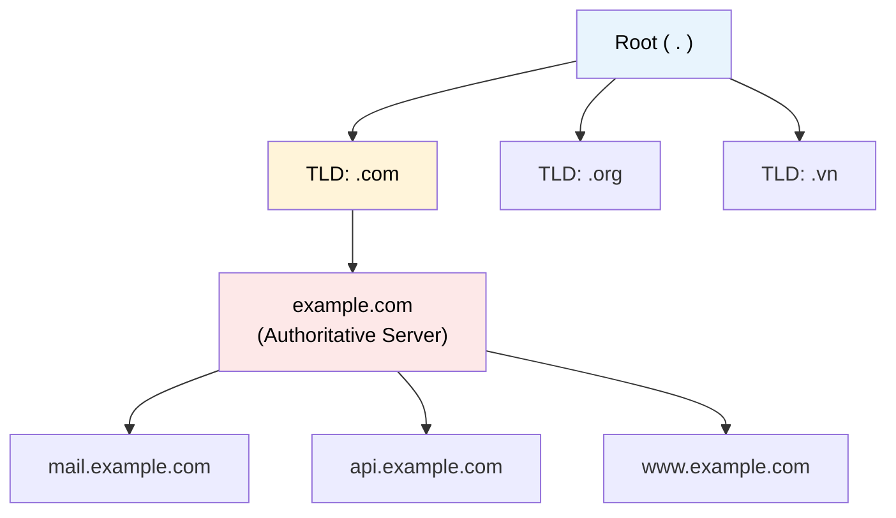
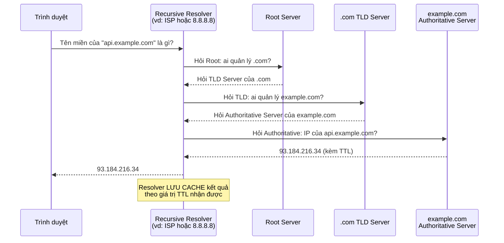

# MASTER COMPUTER SCIENCE HANDBOOK

## Volume 02 — Computer Science Foundations
### Part VIII — Computer Networks
## Chương 8.4 — Hệ thống Phân giải Tên miền
### (DNS — Domain Name System)

---

### Thông tin chương

| Trường | Giá trị |
|---|---|
| Chương | 8.4 |
| Thuộc Part | VIII — Computer Networks |
| Thuộc Volume | 02 — Computer Science Foundations |
| Thời gian đọc ước tính | 40–50 phút |
| Độ khó | ★★★☆☆ |
| Kiến thức tiên quyết | Chương 8.2 — TCP/IP (địa chỉ IP, UDP); Chương 8.3 — Routing; Volume 02, Part IV — Data Structures (cấu trúc Tree) |
| Chương liên quan | 8.5 — HTTP (bước đầu tiên của mọi request HTTP luôn là một lượt phân giải DNS) |
| Từ khóa | DNS, domain name, resolver, root server, TLD, authoritative server, DNS record, caching, TTL, recursive resolution |

---

### Mục tiêu học tập

Sau khi hoàn thành chương này, người đọc có thể:

- Giải thích vấn đề thực tế mà DNS ra đời để giải quyết.
- Mô tả cấu trúc phân cấp của không gian tên miền (root, TLD, authoritative domain) và liên hệ trực tiếp với cấu trúc dữ liệu Tree.
- Trình bày đầy đủ quy trình phân giải tên miền từng bước, từ lúc gõ URL đến lúc nhận được địa chỉ IP.
- Phân biệt phân giải đệ quy (recursive resolution) và phân giải lặp (iterative resolution).
- Giải thích vai trò của DNS caching và TTL trong việc giảm tải cho hệ thống DNS toàn cầu.
- Liệt kê và phân biệt các loại bản ghi DNS phổ biến nhất (A, AAAA, CNAME, MX, NS).

---

### Câu hỏi khơi gợi

> *Có hàng trăm triệu tên miền đang tồn tại trên Internet. Khi bạn gõ một tên miền bất kỳ, kết quả trả về gần như luôn chỉ mất vài chục mili-giây — nhanh hơn nhiều so với việc tìm kiếm tuần tự trong một danh sách hàng trăm triệu mục. Không có một "siêu máy chủ" nào lưu trữ toàn bộ ánh xạ tên miền → địa chỉ IP ở một chỗ. Vậy hệ thống này đạt được tốc độ đó bằng cách nào?*

---

## 1. Tổng quan chương

Toàn bộ Chương 8.2 và 8.3 đã xây dựng thế giới nơi máy tính giao tiếp với nhau **bằng địa chỉ IP** — một chuỗi số khó nhớ đối với con người. Chương 8.4 giải quyết khoảng cách giữa hai thế giới: thế giới của con người (thích tên gọi có ý nghĩa như `example.com`) và thế giới của máy tính (chỉ hiểu địa chỉ IP như `93.184.216.34`).

DNS không chỉ là "một bảng tra cứu tên miền" — đây là chương thứ hai trong Part VIII (sau Chương 8.3) minh họa rõ ràng cách một **cấu trúc dữ liệu cơ bản đã học ở Volume 02, Part IV** — cụ thể là **Tree** — được áp dụng để giải quyết một bài toán ở quy mô toàn cầu: làm sao tổ chức và tra cứu hàng trăm triệu tên miền một cách nhanh chóng, phân tán, và có khả năng mở rộng gần như vô hạn.

> **💡 Insight**
> Nếu bạn từng dùng cấu trúc thư mục lồng nhau trong hệ điều hành (`/home/user/documents/report.pdf`), bạn đã quen với chính nguyên tắc tổ chức mà DNS sử dụng — chỉ khác là tên miền đọc **ngược** so với đường dẫn thư mục: `mail.example.com` có cấu trúc phân cấp từ phải sang trái (`com` → `example` → `mail`), không phải từ trái sang phải như đường dẫn file.

---

## 2. Bối cảnh lịch sử

| Thời điểm | Sự kiện | Ý nghĩa |
|---|---|---|
| Trước 1983 | Toàn bộ ánh xạ tên máy tính → địa chỉ IP trên ARPANET được lưu trong **một file văn bản duy nhất** tên `HOSTS.TXT`, do một tổ chức trung tâm (SRI-NIC) duy trì và phân phối thủ công | Giải pháp đơn giản, hoạt động tốt khi mạng còn nhỏ, nhưng nhanh chóng trở thành nút thắt cổ chai (bottleneck) khi số lượng máy chủ tăng nhanh — mọi thay đổi đều phải cập nhật và phân phối lại toàn bộ file cho mọi máy trên mạng |
| 1983 | Paul Mockapetris đề xuất **DNS** qua hai bản RFC (RFC 882, RFC 883) | Thay thế mô hình tập trung của `HOSTS.TXT` bằng một hệ thống **phân cấp, phân tán** — không còn một điểm duy nhất chịu trách nhiệm cho toàn bộ không gian tên miền |
| 1987 | RFC 1034 và RFC 1035 công bố, cập nhật và chuẩn hóa đầy đủ DNS | Đặc tả này vẫn là nền tảng cốt lõi của DNS được sử dụng đến ngày nay, dù đã có nhiều mở rộng bổ sung |

Câu chuyện `HOSTS.TXT` là một bài học kinh điển về **giới hạn của giải pháp tập trung** khi hệ thống tăng trưởng theo cấp số nhân — một chủ đề sẽ lặp lại nhiều lần trong Handbook, từ thiết kế cơ sở dữ liệu phân tán (Volume 04) đến hệ thống AI quy mô lớn (Volume 06).

---

## 3. Động lực

Hãy hình dung nếu DNS không tồn tại, và bạn phải tự quản lý một file văn bản chứa toàn bộ ánh xạ tên miền → IP mà trình duyệt của bạn dùng để tra cứu — chính xác là tình huống của `HOSTS.TXT` thời kỳ đầu. Mỗi khi một công ty đổi địa chỉ IP server, hoặc một tên miền mới ra đời, bạn sẽ phải cập nhật file đó theo cách nào đó — không thực tế ở quy mô hàng trăm triệu tên miền, thay đổi liên tục mỗi giây.

Vấn đề kỹ thuật cốt lõi mà DNS giải quyết có thể tóm gọn thành ba yêu cầu tưởng chừng mâu thuẫn nhau:

- **Phân tán quyền quản lý:** công ty sở hữu `example.com` phải tự quản lý được các tên miền con của mình (`mail.example.com`, `api.example.com`) mà không cần xin phép một tổ chức trung ương nào cho mỗi thay đổi.
- **Tốc độ tra cứu nhanh:** dù có hàng trăm triệu tên miền, một lượt tra cứu vẫn phải hoàn thành trong vài chục mili-giây.
- **Khả năng chịu lỗi:** hệ thống không được phép sụp đổ hoàn toàn chỉ vì một vài máy chủ gặp sự cố.

DNS giải quyết cả ba yêu cầu này cùng lúc bằng một cấu trúc dữ liệu quen thuộc: **cây phân cấp (hierarchical tree)**.

---

## 4. Trực giác

**Mô hình tinh thần (Mental Model) của chương này:**

> Tra cứu DNS giống như **hỏi đường trong một tổ chức phân cấp lớn**, ví dụ một tập đoàn đa quốc gia. Bạn không có danh bạ đầy đủ của mọi nhân viên trong công ty. Thay vào đó, bạn hỏi lễ tân tòa nhà (root server): "tôi cần tìm phòng ban `.com`" — lễ tân không biết chi tiết, nhưng biết chỉ bạn đến đúng tầng phụ trách các công ty `.com` (TLD server). Tại tầng đó, bạn hỏi tiếp: "tôi cần tìm công ty `example`" — và được chỉ đến đúng văn phòng của `example.com` (authoritative server) — nơi duy nhất biết chính xác địa chỉ IP bạn cần.

| Trực giác kỹ thuật bạn đã có | Khái niệm DNS tương ứng |
|---|---|
| Cấu trúc thư mục lồng nhau (`/com/example/mail`) | Không gian tên miền phân cấp (`mail.example.com`, đọc ngược) |
| DNS record của chính domain bạn quản lý trên nhà cung cấp hosting | Authoritative server — nơi có "quyền quyết định cuối cùng" cho một domain |
| Cache của trình duyệt lưu tạm kết quả để không gọi lại API mỗi lần | DNS Caching — kết quả tra cứu được lưu tạm theo TTL để giảm tải hệ thống |
| Alias / symbolic link trỏ đến một đường dẫn khác | Bản ghi CNAME — trỏ một tên miền đến một tên miền khác |

---

## 5. Trực quan hóa khái niệm

**Hình 8.4.1 — Cấu trúc phân cấp của DNS dưới dạng Tree**



| Trường thông tin | Nội dung |
|---|---|
| Mục đích | Cho thấy trực tiếp DNS là một **cây có gốc (rooted tree)**, đúng cấu trúc dữ liệu đã học ở Volume 02, Part IV — mỗi đỉnh là một "vùng quản lý" (zone), mỗi cạnh là quan hệ cha–con trong phân cấp tên miền |
| Điểm mấu chốt | Công ty sở hữu `example.com` có toàn quyền tạo, sửa, xóa các tên miền con (`mail`, `api`, `www`...) mà không cần thông báo cho tầng `.com` hay tầng Root — đây chính là cơ chế **phân tán quyền quản lý** đã nêu ở Mục 3 |

---

**Hình 8.4.2 — Quy trình phân giải tên miền từng bước (Recursive Resolution)**



*Mục đích:* Minh họa vì sao Recursive Resolver được gọi là "đệ quy" từ góc nhìn của trình duyệt — trình duyệt chỉ hỏi **một lần** và nhận kết quả cuối cùng, trong khi resolver âm thầm thực hiện nhiều lượt hỏi liên tiếp (gọi là **iterative query**) đến Root, TLD, rồi Authoritative Server. *Điểm mấu chốt:* bước cuối cùng — lưu cache — là lý do phần lớn lượt tra cứu DNS trong thực tế **không** cần đi qua đầy đủ 4 bước này mỗi lần (Mục 7).

---

## 6. Định nghĩa hình thức

> **📌 Remember — Bản ghi DNS (DNS Record)**
>
> Một **bản ghi DNS (DNS Record / Resource Record)** là một mục dữ liệu trong hệ thống DNS, ánh xạ một tên miền đến một giá trị cụ thể, kèm theo một giá trị **TTL** (Time To Live — số giây bản ghi được phép lưu trong cache trước khi cần tra cứu lại).

**Các loại bản ghi DNS phổ biến:**

| Loại bản ghi | Ý nghĩa | Ví dụ |
|---|---|---|
| A | Ánh xạ tên miền đến địa chỉ IPv4 | `example.com → 93.184.216.34` |
| AAAA | Ánh xạ tên miền đến địa chỉ IPv6 | `example.com → 2606:2800:220:1::` |
| CNAME | Ánh xạ (alias) một tên miền đến một tên miền khác | `www.example.com → example.com` |
| MX | Xác định máy chủ chịu trách nhiệm nhận email cho domain | `example.com → mail.example.com` |
| NS | Xác định máy chủ authoritative chịu trách nhiệm cho domain (hoặc subdomain) | `example.com → ns1.example.com` |

**Các thành phần trong hạ tầng phân giải:**

- **Root Server:** đỉnh cao nhất của cây DNS, biết cách liên hệ đến các TLD Server tương ứng cho mọi hậu tố tên miền cấp cao (`.com`, `.org`, `.vn`...).
- **TLD Server (Top-Level Domain Server):** quản lý một hậu tố tên miền cụ thể, biết Authoritative Server nào chịu trách nhiệm cho từng domain thuộc TLD đó.
- **Authoritative Server:** máy chủ có "câu trả lời cuối cùng, đáng tin cậy nhất" cho một domain cụ thể — nơi thực sự lưu trữ các bản ghi A, CNAME, MX... của domain đó.
- **Recursive Resolver:** trung gian giữa người dùng và toàn bộ hệ thống, thực hiện chuỗi truy vấn thay cho trình duyệt, và **lưu cache** kết quả để tăng tốc các lượt tra cứu sau.

---

## 7. Nền tảng toán học

Câu hỏi khơi gợi ở đầu chương đặt ra vấn đề tốc độ: làm sao tra cứu nhanh trong hàng trăm triệu tên miền mà không cần một siêu máy chủ trung tâm? Câu trả lời nằm ở việc DNS tận dụng chính lợi thế toán học của **cấu trúc cây**, kết hợp với caching.

- **Ý nghĩa:** nếu phải tìm kiếm tuần tự trong một danh sách phẳng (như `HOSTS.TXT` cũ) chứa $N$ tên miền, thời gian tra cứu trong trường hợp xấu nhất tỷ lệ thuận với $N$. Với cấu trúc cây phân cấp có độ sâu cố định, số bước tra cứu **không phụ thuộc vào $N$**, mà chỉ phụ thuộc vào độ sâu của cây.

> **📦 Formula Box — Số bước Tra cứu trong Hệ thống Phân cấp**
>
> $$\text{Số bước tra cứu (không có cache)} \approx d$$
>
> | Thành phần | Ý nghĩa |
> |---|---|
> | $d$ | Độ sâu (depth) của tên miền trong cây DNS — ví dụ `api.example.com` có độ sâu 3 (Root → `.com` → `example.com` → `api.example.com`) |
> | **So sánh với tìm kiếm tuyến tính** | Với $N$ tên miền trong một danh sách phẳng, tìm kiếm tuần tự cần trung bình $O(N)$ bước; với cấu trúc cây DNS, số bước gần như luôn là một hằng số nhỏ (thường 3–4 bước), **hoàn toàn không phụ thuộc vào tổng số tên miền đang tồn tại trên thế giới** |
> | **Vai trò của Caching** | Trong thực tế, số bước trung bình còn thấp hơn nhiều so với $d$ nhờ caching (xem bên dưới) — phần lớn truy vấn được trả lời ngay tại resolver mà không cần đi lại từ Root |

**Minh họa bằng số:** giả sử $N = 350$ triệu tên miền `.com` đang tồn tại. Tìm kiếm tuần tự trong danh sách phẳng cần trung bình khoảng 175 triệu phép so sánh. Với cấu trúc cây DNS, bất kể $N$ là 1 nghìn hay 350 triệu, số bước tra cứu (không cache) vẫn chỉ là khoảng 3–4 bước — đây chính là lợi thế cốt lõi của việc chọn cấu trúc **cây phân cấp** thay vì **danh sách phẳng** cho bài toán này, một minh chứng thực tế sinh động cho tầm quan trọng của việc chọn đúng cấu trúc dữ liệu (Volume 02, Part IV).

---

## 8. Thuật toán / Cơ chế

**Quy trình Phân giải Đệ quy có Caching** — mở rộng đầy đủ của Hình 8.4.2:

```text
Bước 1 — Trình duyệt kiểm tra cache cục bộ (browser cache, OS cache)
        │
        ▼
Bước 2 — Nếu CÓ trong cache và chưa hết TTL: trả về ngay, KẾT THÚC
        │
        ▼
Bước 3 — Nếu KHÔNG có trong cache: gửi truy vấn đến Recursive Resolver
        │
        ▼
Bước 4 — Resolver kiểm tra cache của chính nó
        │
        ▼
Bước 5 — Nếu CÓ trong cache resolver và chưa hết TTL: trả về ngay, KẾT THÚC
        │
        ▼
Bước 6 — Nếu KHÔNG: Resolver hỏi Root Server → nhận địa chỉ TLD Server phù hợp
        │
        ▼
Bước 7 — Resolver hỏi TLD Server → nhận địa chỉ Authoritative Server phù hợp
        │
        ▼
Bước 8 — Resolver hỏi Authoritative Server → nhận bản ghi (vd: bản ghi A) kèm TTL
        │
        ▼
Bước 9 — Resolver LƯU CACHE kết quả theo đúng giá trị TTL nhận được
        │
        ▼
Bước 10 — Resolver trả kết quả về trình duyệt
```

> **⚠️ Common Mistake**
> Người mới học thường nghĩ mỗi lần gõ một tên miền, hệ thống luôn phải đi qua đầy đủ Root → TLD → Authoritative. Trên thực tế, nhờ caching ở nhiều tầng (Bước 2 và Bước 5), **tuyệt đại đa số** truy vấn DNS trong đời sống thực tế được trả lời ngay từ cache, không bao giờ chạm đến Root Server. Root Server chỉ thực sự được truy vấn khi có cache miss ở mọi tầng phía trên — đây là lý do dù toàn bộ Internet chỉ có 13 nhóm địa chỉ Root Server, hệ thống vẫn không bị quá tải.

---

## 9. Triển khai

```python
import time

class DNSCache:
    """Mô phỏng cơ chế cache của Recursive Resolver, có kiểm tra TTL."""

    def __init__(self):
        self._store: dict[str, tuple[str, float]] = {}  # domain -> (ip, expire_at)

    def get(self, domain: str) -> str | None:
        if domain in self._store:
            ip, expire_at = self._store[domain]
            if time.monotonic() < expire_at:
                return ip
            del self._store[domain]  # Hết TTL — xóa khỏi cache
        return None

    def set(self, domain: str, ip: str, ttl_seconds: float) -> None:
        self._store[domain] = (ip, time.monotonic() + ttl_seconds)


class DNSHierarchy:
    """Mô phỏng cây phân cấp Root -> TLD -> Authoritative."""

    def __init__(self):
        # Cấu trúc lồng nhau mô phỏng cây DNS (Hình 8.4.1)
        self.tree = {
            "com": {
                "example.com": {"A": "93.184.216.34", "ttl": 300},
            },
            "vn": {
                "example.vn": {"A": "203.0.113.10", "ttl": 600},
            },
        }

    def resolve_authoritative(self, domain: str) -> tuple[str, int]:
        tld = domain.split(".")[-1]
        record = self.tree[tld][domain]
        return record["A"], record["ttl"]


def dns_lookup(domain: str, cache: DNSCache, hierarchy: DNSHierarchy) -> str:
    cached_ip = cache.get(domain)
    if cached_ip is not None:
        print(f"[CACHE HIT] {domain} -> {cached_ip}")
        return cached_ip

    print(f"[CACHE MISS] {domain} -> hỏi Root -> TLD -> Authoritative...")
    ip, ttl = hierarchy.resolve_authoritative(domain)
    cache.set(domain, ip, ttl)
    print(f"[RESOLVED]   {domain} -> {ip} (TTL={ttl}s, đã lưu cache)")
    return ip
```

Chạy thử: tra cứu cùng một tên miền hai lần liên tiếp để quan sát hiệu ứng cache:

```python
cache = DNSCache()
hierarchy = DNSHierarchy()

dns_lookup("example.com", cache, hierarchy)   # Lần 1 — chưa có trong cache
dns_lookup("example.com", cache, hierarchy)   # Lần 2 — đã có trong cache
dns_lookup("example.vn", cache, hierarchy)    # Domain khác — vẫn phải resolve
```

---

## 10. Trực quan hóa quá trình thực thi

**Kết quả chạy thực tế** của đoạn code Mục 9:

```text
[CACHE MISS] example.com -> hỏi Root -> TLD -> Authoritative...
[RESOLVED]   example.com -> 93.184.216.34 (TTL=300s, đã lưu cache)
[CACHE HIT] example.com -> 93.184.216.34
[CACHE MISS] example.vn -> hỏi Root -> TLD -> Authoritative...
[RESOLVED]   example.vn -> 203.0.113.10 (TTL=600s, đã lưu cache)
```

Quan sát rõ ràng: **lần tra cứu thứ hai** cho cùng một domain (`example.com`) hoàn toàn bỏ qua bước "hỏi Root → TLD → Authoritative" — đây chính xác là cơ chế giúp hệ thống DNS toàn cầu chịu tải hàng nghìn tỷ lượt truy vấn mỗi ngày mà không sụp đổ, dù số lượng Root Server trên thế giới cực kỳ hạn chế.

**Minh họa hiệu ứng cache theo thời gian**, nếu gọi `dns_lookup("example.com", ...)` liên tục mỗi giây trong 301 giây (vượt qua TTL = 300 giây):

| Giây thứ | Kết quả |
|---:|---|
| 1 | CACHE MISS — resolve đầy đủ |
| 2 – 300 | CACHE HIT — trả về ngay từ cache |
| 301 | CACHE MISS — TTL đã hết hạn, resolve lại từ đầu |

---

## 11. Ứng dụng công nghiệp

> **🛠 Engineering Practice**
> DNS không chỉ là hạ tầng "nền" thụ động — nó là một công cụ kiến trúc chủ động được nhiều hệ thống lớn tận dụng trực tiếp.

| Bối cảnh công nghiệp | Vai trò của DNS |
|---|---|
| GeoDNS / DNS-based Load Balancing | CDN và các dịch vụ toàn cầu (Cloudflare, AWS Route 53) trả về địa chỉ IP **khác nhau** cho cùng một tên miền tùy theo vị trí địa lý của người truy vấn — kết hợp trực tiếp với khái niệm Anycast Routing đã học ở Chương 8.3 |
| Public DNS Resolver (Google `8.8.8.8`, Cloudflare `1.1.1.1`) | Cung cấp resolver nhanh, riêng tư thay thế cho resolver mặc định của ISP — một sản phẩm hạ tầng độc lập xây dựng hoàn toàn trên cơ chế Mục 8 |
| Service Discovery trong Kubernetes | Mỗi service trong một cluster Kubernetes tự động có một tên DNS nội bộ, cho phép các microservice gọi nhau bằng tên thay vì địa chỉ IP có thể thay đổi liên tục — ứng dụng trực tiếp của bản ghi A/CNAME trong một hệ thống DNS nội bộ thu nhỏ |
| DNS Amplification Attack | Kẻ tấn công lợi dụng chính cơ chế truy vấn UDP đơn giản, không cần bắt tay của DNS (Chương 8.2) để khuếch đại lưu lượng tấn công DDoS — một minh chứng cho việc hiểu sâu giao thức là cần thiết cả để phòng thủ lẫn để nhận diện lỗ hổng thiết kế |

---

## 12. Góc nhìn nghiên cứu

> **🔬 Research Connection**
> DNS nguyên bản (RFC 1034/1035, 1987) được thiết kế trong bối cảnh Internet còn nhỏ, ưu tiên tốc độ và đơn giản hơn là bảo mật — một quyết định thiết kế hợp lý ở thời điểm đó nhưng để lại hai hướng cải tiến quan trọng vẫn đang tiếp diễn.

**Hướng thứ nhất — Xác thực (DNSSEC):** DNS nguyên bản không có cơ chế xác thực câu trả lời nhận được thực sự đến từ Authoritative Server hợp lệ, mở đường cho các cuộc tấn công giả mạo (DNS spoofing/cache poisoning). **DNSSEC** (chuẩn hóa qua các RFC 4033–4035, khoảng năm 2005) bổ sung chữ ký số vào bản ghi DNS, cho phép resolver xác minh tính toàn vẹn của kết quả nhận được.

**Hướng thứ hai — Riêng tư (DoH/DoT):** Theo thiết kế nguyên bản, truy vấn DNS được gửi dưới dạng văn bản thuần (plaintext) qua UDP — bất kỳ ai quan sát lưu lượng mạng (kể cả ISP) đều có thể biết chính xác người dùng đang truy cập tên miền nào, ngay cả khi nội dung trang web đã được mã hóa qua HTTPS. **DNS over HTTPS (DoH, RFC 8484, 2018)** và **DNS over TLS (DoT)** mã hóa toàn bộ truy vấn DNS, ngăn chặn việc bên thứ ba theo dõi lịch sử truy cập của người dùng thông qua quan sát lưu lượng DNS thuần túy.

**Câu hỏi mở** để suy ngẫm: việc mã hóa DNS (DoH/DoT) bảo vệ quyền riêng tư của người dùng cuối, nhưng đồng thời khiến các công cụ giám sát mạng ở cấp doanh nghiệp hoặc trường học (vốn dựa vào việc quan sát truy vấn DNS thuần túy để lọc nội dung) trở nên kém hiệu quả hơn. Đây là một đánh đổi thực sự giữa quyền riêng tư cá nhân và khả năng kiểm soát mạng ở cấp tổ chức, vẫn đang được tranh luận trong ngành.

---

## 13. Ưu điểm

- **Phân tán quyền quản lý:** mỗi tổ chức tự quản lý domain của mình mà không cần xin phép cơ quan trung ương cho mỗi thay đổi (Mục 3, Mục 5).
- **Khả năng mở rộng gần như vô hạn:** số bước tra cứu không phụ thuộc vào tổng số tên miền đang tồn tại (Mục 7).
- **Caching hiệu quả** giúp giảm tải cực lớn cho các Root Server và Authoritative Server, đồng thời giảm độ trễ cho người dùng cuối.
- **Linh hoạt về mặt vận hành:** thay đổi địa chỉ IP của một dịch vụ chỉ cần cập nhật một bản ghi DNS, không đòi hỏi người dùng phải làm gì.

---

## 14. Hạn chế

- **Thiết kế nguyên bản thiếu bảo mật:** dễ bị giả mạo (spoofing) nếu không có DNSSEC (Mục 12).
- **Thiếu riêng tư mặc định:** truy vấn DNS thuần túy lộ thông tin về hành vi duyệt web của người dùng nếu không dùng DoH/DoT.
- **Độ trễ lan truyền thay đổi (Propagation Delay):** khi một bản ghi DNS thay đổi, các resolver đã cache bản ghi cũ vẫn tiếp tục trả về kết quả cũ cho đến khi TTL hết hạn — có thể gây ra tình trạng không nhất quán tạm thời trên toàn cầu.
- **Bị lợi dụng cho tấn công:** như đã nêu ở Mục 11, chính đặc tính đơn giản, dùng UDP không cần bắt tay của DNS lại trở thành công cụ cho DNS Amplification Attack.

---

## 15. So sánh

**Bảng 8.4.1 — Recursive Resolution vs Iterative Resolution**

| Tiêu chí | Recursive Resolution | Iterative Resolution |
|---|---|---|
| Ai thực hiện các bước hỏi liên tiếp | Resolver tự hỏi thay cho client, client chỉ hỏi một lần | Client (hoặc resolver đóng vai trò client) tự thực hiện từng bước hỏi Root, TLD, Authoritative |
| Trải nghiệm phía client | Đơn giản — nhận thẳng kết quả cuối cùng | Phức tạp hơn — phải tự xử lý từng lượt phản hồi trung gian |
| Nơi thường áp dụng | Giữa trình duyệt và Recursive Resolver (Hình 8.4.2) | Giữa Recursive Resolver và các Root/TLD/Authoritative Server |
| Vai trò trong kiến trúc thực tế | Là mô hình mà tuyệt đại đa số người dùng cuối trải nghiệm | Là cách các resolver "hậu trường" thực sự thu thập thông tin |

**Phân tích:** Trong hệ thống DNS thực tế, cả hai mô hình cùng tồn tại song song, mỗi mô hình phục vụ một tầng khác nhau — không phải một lựa chọn loại trừ lẫn nhau. Đây là một ví dụ tinh tế cho thấy cùng một bài toán (phân giải tên miền) có thể được nhìn từ hai góc độ trách nhiệm khác nhau tùy vị trí trong hệ thống.

---

## 16. Tóm tắt

- DNS ra đời để thay thế mô hình tập trung `HOSTS.TXT` không thể mở rộng, bằng một **cấu trúc cây phân cấp phân tán**.
- Không gian tên miền được tổ chức thành **Root → TLD → Authoritative**, ánh xạ trực tiếp với cấu trúc dữ liệu Tree đã học ở Volume 02, Part IV.
- Quy trình phân giải điển hình là **Recursive Resolution** (từ góc nhìn client) kết hợp **Iterative Query** (từ góc nhìn resolver) qua Root, TLD, và Authoritative Server.
- **Caching theo TTL** là yếu tố quyết định giúp hệ thống DNS chịu tải toàn cầu — phần lớn truy vấn thực tế không bao giờ chạm đến Root Server.
- Số bước tra cứu DNS gần như là hằng số, không phụ thuộc vào tổng số tên miền — minh chứng thực tế cho lợi thế của cấu trúc cây so với tìm kiếm tuyến tính trong danh sách phẳng.
- DNS nguyên bản thiếu bảo mật và riêng tư, dẫn đến các cải tiến hiện đại DNSSEC, DoH, và DoT.

Chương 8.5 (HTTP) sẽ cho thấy DNS luôn là **bước đầu tiên, ẩn danh phía sau hậu trường** của mọi request HTTP — trước khi trình duyệt có thể gửi bất kỳ dữ liệu nào đến server, nó luôn cần một địa chỉ IP, và địa chỉ đó luôn đến từ chính quy trình vừa học ở chương này.

---

## 17. Bài tập

### Mức Cơ bản (Basic)

1. Giải thích vì sao DNS được thiết kế theo mô hình phân tán thay vì tiếp tục dùng một file tập trung như `HOSTS.TXT`.
2. Phân biệt bản ghi A và bản ghi CNAME, cho một ví dụ cụ thể cho mỗi loại.
3. TTL trong DNS dùng để làm gì? Điều gì xảy ra khi TTL của một bản ghi hết hạn?

### Mức Trung bình (Intermediate)

4. Vẽ lại sơ đồ phân giải DNS (Hình 8.4.2) từ trí nhớ, giải thích rõ vai trò của Root, TLD, và Authoritative Server ở mỗi bước.
5. Cho một domain có TTL = 3600 giây (1 giờ). Nếu công ty sở hữu domain đó thay đổi địa chỉ IP ngay bây giờ, giải thích tại sao một số người dùng trên thế giới vẫn có thể thấy địa chỉ IP cũ trong tối đa 1 giờ tiếp theo.

### Mức Nâng cao (Advanced)

6. Mở rộng code ở Mục 9 để hỗ trợ bản ghi **CNAME**: nếu một domain có bản ghi CNAME trỏ đến domain khác, hàm `dns_lookup` cần tự động "theo" CNAME đó để tìm ra bản ghi A cuối cùng, tương tự cách trình duyệt xử lý chuỗi redirect.
7. Giải thích bằng lời (dựa trên Mục 11) tại sao đặc tính "UDP, không cần bắt tay" của DNS truyền thống (Chương 8.2) lại có thể bị lợi dụng để thực hiện DNS Amplification Attack, và tại sao chuyển sang TCP cho mọi truy vấn không phải là giải pháp thực tế.

### Mức Nghiên cứu (Research)

8. Đọc thêm về DNS over HTTPS (DoH) và trình bày quan điểm cá nhân về đánh đổi giữa quyền riêng tư cá nhân và khả năng giám sát/lọc nội dung ở cấp mạng doanh nghiệp/trường học đã nêu ở Mục 12. Đây là câu hỏi mở-kết-thúc, không có đáp án duy nhất được kỳ vọng.

---

## 18. Dự án nhỏ

**Dự án: Bộ mô phỏng DNS Resolver có Cache và TTL thực (real-time)**

- **Mục tiêu:** Mở rộng mô phỏng ở Mục 9 thành một chương trình dùng `time.sleep()` thực sự, cho phép quan sát trực tiếp một bản ghi "hết hạn" đúng theo TTL đã định nghĩa.
- **Yêu cầu:**
  - Hỗ trợ ít nhất ba loại bản ghi: A, CNAME, MX.
  - In log chi tiết mỗi lần cache hit/miss, kèm thời gian còn lại trước khi TTL hết hạn.
  - Cho phép người dùng "thay đổi" một bản ghi tại Authoritative Server trong khi chương trình đang chạy, và quan sát độ trễ lan truyền (propagation delay) do cache cũ vẫn còn hiệu lực.
- **Công nghệ đề xuất:** Python thuần, dùng module `time`.
- **Mở rộng (tùy chọn):** Thêm một tầng cache thứ hai (mô phỏng cache của trình duyệt, tách biệt với cache của resolver) để quan sát hiệu ứng caching nhiều tầng như mô tả ở Mục 8.

---

## 19. Tự đánh giá

- [ ] Tôi có thể giải thích rõ ràng vấn đề mà DNS ra đời để giải quyết, và tại sao mô hình `HOSTS.TXT` cũ không thể mở rộng.
- [ ] Tôi có thể tự vẽ và giải thích đầy đủ quy trình phân giải DNS qua Root, TLD, Authoritative Server.
- [ ] Tôi hiểu rõ vai trò của TTL và caching trong việc giúp DNS chịu tải toàn cầu.
- [ ] Tôi phân biệt được ít nhất ba loại bản ghi DNS phổ biến (A, CNAME, MX) và biết khi nào dùng loại nào.
- [ ] Tôi hiểu được liên hệ trực tiếp giữa cấu trúc DNS và cấu trúc dữ liệu Tree đã học ở Volume 02, Part IV.

Nếu Bài tập 4 vẫn còn khó khăn, hãy xem lại Hình 8.4.2 và thử tự vẽ lại từ đầu — sơ đồ này là nền tảng cho toàn bộ phần còn lại của chương.

---

## 20. Đọc thêm

- **Sách:** Kurose, J., Ross, K., *Computer Networking: A Top-Down Approach* — chương về Application Layer trình bày chi tiết đầy đủ hơn về kiến trúc DNS thực tế. *(Xem BOOKS.md.)*
- **Chủ đề mở rộng (không bắt buộc):** tìm đọc tổng quan về DNSSEC và DNS over HTTPS (DoH) để hiểu thêm về hướng phát triển bảo mật và riêng tư hiện đại của DNS.
- **Chương tiếp theo:** Chương 8.5 — HTTP.

---

### Liên kết chương (Cross References)

- **Chương trước:** 8.3 — Routing (DNS trả về địa chỉ IP, sau đó chính cơ chế định tuyến ở Chương 8.3 mới thực sự đưa gói tin đến đích).
- **Chương tiếp theo:** 8.5 — HTTP (mọi request HTTP đều bắt đầu bằng một lượt phân giải DNS ẩn phía sau).
- **Chương liên quan xa hơn:** Volume 02, Part IV — Data Structures (cấu trúc Tree, áp dụng trực tiếp cho không gian tên miền ở Mục 5–7); Chương 8.3 — Routing (GeoDNS kết hợp trực tiếp với Anycast Routing, Mục 11).
- **Vị trí trong Knowledge Graph:** Nút thứ tư của Part VIII, phụ thuộc vào Chương 8.2 (địa chỉ IP) và Chương 8.3 (khái niệm hạ tầng phân tán); là điều kiện tiên quyết ngầm cho mọi chương tầng Application phía sau (8.5–8.8), vì mọi giao tiếp ở tầng Application trên Internet đều bắt đầu bằng một lượt tra cứu DNS.

---

*Hết Chương 8.4. Chương này tuân thủ đầy đủ cấu trúc 20 mục của `OUTPUT.md` và chuẩn Presentation Layer, khớp với outline Part VIII đã được duyệt. Mọi kết quả mô phỏng ở Mục 9–10 đều được kiểm chứng bằng code Python chạy thực tế. Đang chờ rà soát trước khi tiếp tục sang Chương 8.5 — HTTP.*
