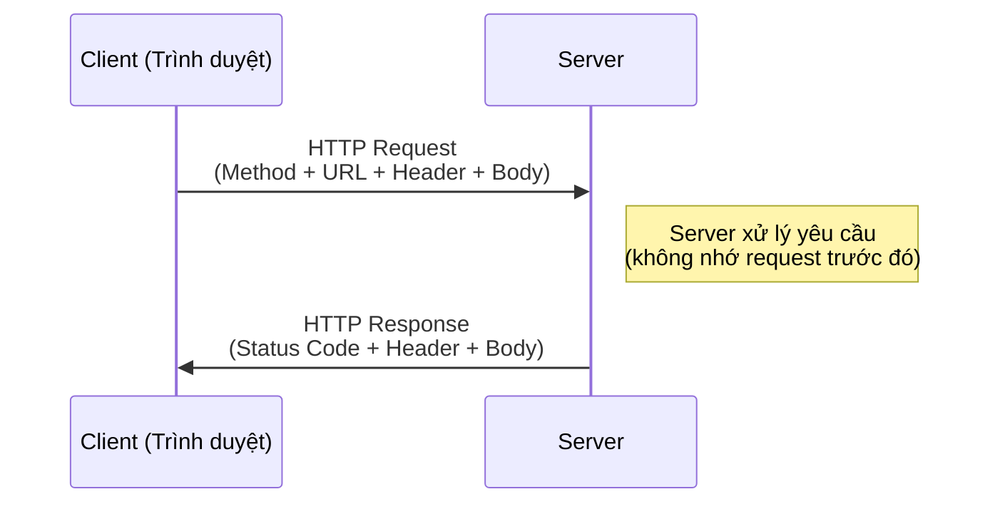

# MASTER COMPUTER SCIENCE HANDBOOK

## Volume 02 — Computer Science Foundations
### Part VIII — Computer Networks
## Chương 8.5 — Giao thức HTTP
### (HTTP — HyperText Transfer Protocol)

---

### Thông tin chương

| Trường | Giá trị |
|---|---|
| Chương | 8.5 |
| Thuộc Part | VIII — Computer Networks |
| Thuộc Volume | 02 — Computer Science Foundations |
| Thời gian đọc ước tính | 50–60 phút |
| Độ khó | ★★★☆☆ |
| Kiến thức tiên quyết | Chương 8.2 — TCP/IP (TCP, head-of-line blocking); Chương 8.4 — DNS |
| Chương liên quan | 8.6 — REST (kiến trúc xây dựng trực tiếp trên nền HTTP); 8.7 — WebSocket (giao thức "nâng cấp" từ chính một HTTP request) |
| Từ khóa | HTTP request, HTTP response, method, status code, header, statelessness, HTTP/1.1, HTTP/2, multiplexing, TLS, HTTPS |

---

### Mục tiêu học tập

Sau khi hoàn thành chương này, người đọc có thể:

- Giải thích mô hình request-response và tính chất stateless của HTTP.
- Đọc và phân tích chính xác cấu trúc một HTTP request và HTTP response thực tế.
- Phân loại và giải thích ý nghĩa các nhóm mã trạng thái HTTP (1xx–5xx).
- Giải thích cơ chế cookie và session, và cách chúng "vá" tính chất stateless của HTTP.
- So sánh HTTP/1.1 và HTTP/2, giải thích cơ chế multiplexing giải quyết vấn đề gì.
- Giải thích ở mức khái niệm vai trò của TLS trong HTTPS, không đi sâu vào mật mã học.

---

### Câu hỏi khơi gợi

> *Mỗi khi bạn tải một trang web hiện đại, trình duyệt thường phải tải hàng chục, thậm chí hàng trăm tài nguyên khác nhau — HTML, CSS, JavaScript, hình ảnh, font chữ. Nếu mỗi tài nguyên đòi hỏi một kết nối TCP riêng biệt (kèm theo three-way handshake đã học ở Chương 8.2), tại sao trang web hiện đại vẫn tải nhanh, thay vì chậm chạp vì hàng trăm lượt bắt tay liên tiếp?*

---

## 1. Tổng quan chương

Ba chương trước (8.2, 8.3, 8.4) đã xây dựng toàn bộ hạ tầng "phía dưới": làm sao truyền dữ liệu tin cậy (TCP), làm sao gói tin tìm đường (Routing), và làm sao chuyển tên miền dễ nhớ thành địa chỉ IP (DNS). Chương 8.5 là chương đầu tiên của Part VIII bước hẳn lên **tầng Application** — nơi phần lớn lập trình viên backend và frontend thực sự làm việc hằng ngày.

HTTP (HyperText Transfer Protocol) là giao thức tầng Application phổ biến nhất của Web hiện đại. Chương này xây dựng nền tảng đầy đủ về HTTP trước khi Chương 8.6 (REST) trình bày một **phong cách kiến trúc** cụ thể được xây dựng trên nền giao thức này — điều quan trọng cần phân biệt ngay từ đầu: **HTTP là một giao thức, REST là một kiến trúc sử dụng giao thức đó**.

> **💡 Insight**
> Nếu bạn đã từng gọi một hàm và nhận về giá trị trả về (return value), bạn đã có trực giác chính xác về mô hình HTTP: gửi một **request** (giống như gọi hàm với tham số) và nhận về một **response** (giống như giá trị trả về) — chỉ khác là "hàm" ở đây chạy trên một máy tính hoàn toàn khác, cách xa hàng nghìn km.

---

## 2. Bối cảnh lịch sử

| Thời điểm | Sự kiện | Ý nghĩa |
|---|---|---|
| 1989 | Tim Berners-Lee đề xuất World Wide Web (đã đề cập ở TIMELINE.md) | Đặt nền móng khái niệm cho siêu văn bản (hypertext) liên kết qua mạng, tiền thân trực tiếp của HTTP |
| 1991 | **HTTP/0.9** ra đời | Phiên bản cực kỳ đơn giản — chỉ hỗ trợ method `GET`, không có header, không có mã trạng thái, mỗi request chỉ trả về nội dung HTML thuần |
| 1996 | **HTTP/1.0** được công bố (RFC 1945) | Bổ sung header, mã trạng thái, hỗ trợ nhiều loại nội dung (không chỉ HTML); tuy nhiên mỗi request vẫn cần một kết nối TCP riêng, đóng lại ngay sau khi hoàn thành |
| 1997–1999 | **HTTP/1.1** ra đời (RFC 2068, sau đó RFC 2616) | Bổ sung **persistent connection** (giữ kết nối TCP để dùng lại cho nhiều request), pipelining, và nhiều cải tiến khác — trở thành chuẩn thống trị Web trong gần hai thập kỷ |
| 2015 | **HTTP/2** được chuẩn hóa, dựa trên giao thức thử nghiệm SPDY của Google | Chuyển sang định dạng nhị phân (binary framing), giới thiệu **multiplexing** — giải quyết triệt để vấn đề đặt ra ở câu hỏi khơi gợi đầu chương (Mục 9–10) |

Điểm đáng chú ý: dù trải qua hơn ba thập kỷ phát triển, **mô hình cơ bản của HTTP — request đi, response về, không lưu trạng thái — gần như không thay đổi**. Những cải tiến qua các phiên bản chủ yếu nhắm vào **hiệu năng truyền tải** (Mục 9), không thay đổi triết lý cốt lõi.

---

## 3. Động lực

Hãy hình dung bạn thiết kế một API backend đơn giản cho ứng dụng thương mại điện tử. Khi người dùng nhấn "Thêm vào giỏ hàng", trình duyệt cần gửi thông tin sản phẩm đến server và nhận về xác nhận. Điều gì sẽ xảy ra nếu không có một chuẩn giao tiếp chung?

- Server không biết trình duyệt đang yêu cầu **loại hành động** gì — thêm mới, cập nhật, hay xóa?
- Server không có cách chuẩn để báo hiệu "yêu cầu thành công" khác với "yêu cầu thất bại vì lỗi phía client" khác với "server đang gặp sự cố".
- Mỗi framework, mỗi công ty sẽ tự phát minh một định dạng riêng — không có khả năng tương tác (interoperability) giữa các hệ thống khác nhau.

HTTP giải quyết toàn bộ những vấn đề này bằng một **chuẩn chung, đơn giản, dựa trên văn bản** (ít nhất ở các phiên bản đầu) mà bất kỳ hệ thống nào, viết bằng bất kỳ ngôn ngữ nào, cũng có thể hiểu và tuân theo.

---

## 4. Trực giác

**Mô hình tinh thần (Mental Model) của chương này:**

> HTTP giống như một cuộc trò chuyện tại **quầy phục vụ nhà hàng theo mẫu chuẩn**: khách hàng (client) đưa ra một yêu cầu theo đúng mẫu ("Tôi muốn — GET — món phở"), nhân viên (server) xử lý và trả lời cũng theo đúng mẫu ("200 OK — đây là phở của bạn" hoặc "404 Not Found — nhà hàng hết món này"). Quan trọng nhất: **nhân viên không nhớ bạn là ai giữa hai lần gọi món** — mỗi yêu cầu là một giao dịch hoàn toàn độc lập, đây chính là tính chất **stateless**.

| Trực giác kỹ thuật bạn đã có | Khái niệm HTTP tương ứng |
|---|---|
| Gọi hàm với tham số, nhận giá trị trả về | HTTP Request (kèm method, tham số) → HTTP Response |
| Exception/Error code trong lập trình (phân biệt lỗi do người gọi hay do hệm thống) | Mã trạng thái HTTP: 4xx (lỗi phía client) vs 5xx (lỗi phía server) |
| Token xác thực (JWT) lưu ở phía client để "nhớ" người dùng qua nhiều request | Cookie/Session — cơ chế "vá" tính chất stateless của HTTP (Mục 6) |
| Connection Pooling trong thư viện database client | Persistent Connection của HTTP/1.1 — tái sử dụng kết nối TCP thay vì mở mới mỗi lần |

---

## 5. Trực quan hóa khái niệm

**Hình 8.5.1 — Mô hình Request–Response của HTTP**



| Trường thông tin | Nội dung |
|---|---|
| Mục đích | Minh họa mô hình giao tiếp đơn giản nhất của HTTP — một request luôn đi kèm đúng một response |
| Điểm mấu chốt | Ghi chú "server không nhớ request trước đó" chính là tính chất **stateless** — nền tảng lý thuyết quan trọng nhất của HTTP, sẽ quay lại đầy đủ ở Chương 8.6 khi bàn về ràng buộc kiến trúc REST |

---

**Hình 8.5.2 — Cấu trúc một HTTP Request thực tế**

```text
GET /api/products/42 HTTP/1.1          ← Request Line: Method + Path + Version
Host: example.com                       ← Header: domain đích (dùng cho Virtual Hosting)
User-Agent: Mozilla/5.0                 ← Header: thông tin trình duyệt
Accept: application/json                ← Header: định dạng phản hồi mong muốn
Authorization: Bearer eyJhbGc...        ← Header: thông tin xác thực
                                         ← Dòng trống — ngăn cách Header và Body
(Body — thường rỗng với GET)
```

**Hình 8.5.3 — Cấu trúc một HTTP Response thực tế**

```text
HTTP/1.1 200 OK                         ← Status Line: Version + Status Code + Reason Phrase
Content-Type: application/json          ← Header: định dạng dữ liệu trả về
Content-Length: 87                      ← Header: kích thước body (byte)
Cache-Control: max-age=3600             ← Header: hướng dẫn cache

{"id": 42, "name": "Áo thun", "price": 199000}   ← Body
```

*Mục đích:* Cho thấy trực tiếp cấu trúc văn bản dễ đọc của HTTP/1.1 — chính đặc tính "con người đọc được" này là lý do HTTP dễ debug hơn nhiều giao thức nhị phân khác. *Điểm mấu chốt:* Header và Body luôn được ngăn cách bởi đúng một dòng trống — một quy tắc phân tích cú pháp (parsing) đơn giản nhưng cực kỳ quan trọng.

---

## 6. Định nghĩa hình thức

> **📌 Remember — Tính chất Stateless**
>
> HTTP là một giao thức **không lưu trạng thái (stateless)**: mỗi request được xử lý hoàn toàn độc lập, server không tự động "nhớ" bất kỳ thông tin nào từ các request trước đó của cùng một client. Nếu ứng dụng cần "ghi nhớ" người dùng qua nhiều request (ví dụ trạng thái đăng nhập), cơ chế đó phải được xây dựng thêm ở tầng trên bằng **Cookie** và **Session**: server gửi kèm một Cookie chứa định danh phiên (session ID) trong response, trình duyệt tự động đính kèm lại Cookie đó ở mọi request tiếp theo, cho phép server "nhận ra" client dù bản thân giao thức HTTP không hề lưu trạng thái.

**HTTP Method** — xác định loại hành động của request:

| Method | Ý nghĩa | Idempotent? |
|---|---|---|
| GET | Lấy dữ liệu, không thay đổi trạng thái server | Có |
| POST | Tạo mới một tài nguyên | Không |
| PUT | Cập nhật toàn bộ một tài nguyên (hoặc tạo mới nếu chưa tồn tại) | Có |
| PATCH | Cập nhật một phần tài nguyên | Không (thường) |
| DELETE | Xóa một tài nguyên | Có |

*(Idempotent — tính chất "gọi nhiều lần cho cùng kết quả như gọi một lần" — sẽ được dùng lại làm nền tảng khi thiết kế REST API ở Chương 8.6.)*

**Nhóm mã trạng thái HTTP (Status Code):**

| Nhóm | Ý nghĩa | Ví dụ |
|---|---|---|
| 1xx | Thông tin — yêu cầu đang được xử lý | 100 Continue |
| 2xx | Thành công | 200 OK, 201 Created, 204 No Content |
| 3xx | Chuyển hướng | 301 Moved Permanently, 304 Not Modified |
| 4xx | Lỗi phía Client | 400 Bad Request, 401 Unauthorized, 404 Not Found |
| 5xx | Lỗi phía Server | 500 Internal Server Error, 503 Service Unavailable |

---

## 7. Nền tảng toán học

Câu hỏi khơi gợi đầu chương đặt ra một vấn đề định lượng cụ thể: nếu một trang web cần tải $N$ tài nguyên, chi phí thiết lập kết nối ảnh hưởng thế nào đến tổng thời gian tải trang?

- **Ý nghĩa:** dưới HTTP/1.1, trình duyệt thường giới hạn số kết nối TCP đồng thời đến cùng một domain (thường khoảng 6 kết nối). Nếu có nhiều tài nguyên hơn số kết nối cho phép, các tài nguyên còn lại phải **xếp hàng chờ** một kết nối rảnh.

> **📦 Formula Box — Số Vòng Tải cần thiết dưới HTTP/1.1**
>
> $$R = \left\lceil \frac{N}{C} \right\rceil$$
>
> | Thành phần | Ý nghĩa |
> |---|---|
> | $N$ | Tổng số tài nguyên cần tải (file CSS, JS, ảnh...) |
> | $C$ | Số kết nối TCP đồng thời tối đa cho phép đến cùng một domain (thường ~6 với HTTP/1.1) |
> | $R$ | Số "vòng" tải cần thiết — mỗi vòng tải tối đa $C$ tài nguyên song song |
> | **Diễn giải kỹ thuật** | Với HTTP/2, nhờ cơ chế **multiplexing** (Mục 9), $C$ về lý thuyết không còn là giới hạn cứng — nhiều tài nguyên có thể truyền xen kẽ trên **cùng một kết nối TCP duy nhất**, khiến công thức trên gần như không còn áp dụng |
> | **Ứng dụng thường gặp** | Giải thích lý do các kỹ thuật tối ưu hiệu năng web cũ (như "domain sharding" — chia nhỏ tài nguyên ra nhiều subdomain để lách giới hạn $C$) trở nên không cần thiết, thậm chí phản tác dụng, khi chuyển sang HTTP/2 |

**Ví dụ tính tay:** một trang web cần tải $N = 60$ tài nguyên, với $C = 6$ (giới hạn HTTP/1.1 điển hình):

$$R = \left\lceil \frac{60}{6} \right\rceil = 10 \text{ vòng tải}$$

Nếu mỗi vòng tải mất trung bình 50ms (bao gồm cả độ trễ RTT), tổng thời gian tải riêng cho việc thiết lập lần lượt các vòng đã tốn khoảng 500ms — chưa kể chính nội dung dữ liệu. Đây chính là động lực kỹ thuật thực sự đằng sau việc phát triển HTTP/2 (Mục 9).

---

## 8. Thuật toán / Cơ chế

**Vòng đời đầy đủ của một HTTP Request** — tổng hợp toàn bộ kiến thức từ các chương trước của Part VIII:

```text
Bước 1 — Trình duyệt phân giải tên miền thành địa chỉ IP
        │     (Chương 8.4 — DNS: kiểm tra cache trước, nếu miss thì
        │      thực hiện Recursive Resolution qua Root → TLD → Authoritative)
        ▼
Bước 2 — Thiết lập kết nối TCP đến địa chỉ IP vừa nhận được
        │     (Chương 8.2 — TCP: Three-Way Handshake SYN → SYN-ACK → ACK)
        ▼
Bước 3 — Nếu dùng HTTPS: thực hiện TLS Handshake
        │     (trao đổi khóa mã hóa, xác thực chứng chỉ server — Mục 12)
        ▼
Bước 4 — Trình duyệt gửi HTTP Request (Hình 8.5.2) qua kết nối vừa thiết lập
        │     (gói tin thực sự được đưa đến đích nhờ Chương 8.3 — Routing)
        ▼
Bước 5 — Server xử lý request, tạo HTTP Response (Hình 8.5.3)
        │
        ▼
Bước 6 — Server gửi Response về Client qua cùng kết nối TCP
        │
        ▼
Bước 7 — Nếu HTTP/1.1 dùng Persistent Connection: giữ kết nối TCP để tái
        │     sử dụng cho request tiếp theo, tránh lặp lại Bước 2–3
        ▼
Bước 8 — Trình duyệt render nội dung nhận được (HTML/CSS/JS/hình ảnh...)
```

> **⚠️ Common Mistake**
> Người mới học thường nghĩ HTTP là "toàn bộ những gì xảy ra" khi tải một trang web. Trên thực tế, như sơ đồ trên cho thấy, HTTP chỉ là **Bước 4–6** — phần nổi dễ thấy nhất. Ba chương trước của Part VIII (DNS, TCP, Routing) đều là các bước bắt buộc, âm thầm xảy ra **trước khi** một byte dữ liệu HTTP nào thực sự được gửi đi. Đây là lý do Part VIII được thiết kế theo đúng trình tự 8.1 → 8.5: mỗi chương là một lớp nền tảng cho chương tiếp theo.

---

## 9. Triển khai

```python
class HTTPRequest:
    """Mô phỏng cấu trúc một HTTP Request (Hình 8.5.2)."""

    def __init__(self, method: str, path: str, headers: dict[str, str],
                 body: str = ""):
        self.method = method
        self.path = path
        self.headers = headers
        self.body = body

    def to_raw(self) -> str:
        lines = [f"{self.method} {self.path} HTTP/1.1"]
        lines += [f"{k}: {v}" for k, v in self.headers.items()]
        lines.append("")  # Dòng trống ngăn cách Header và Body
        lines.append(self.body)
        return "\n".join(lines)


class HTTPServer:
    """Mô phỏng một server xử lý request theo mô hình stateless:
    mỗi request được xử lý ĐỘC LẬP, không lưu lại lịch sử."""

    def __init__(self):
        self.routes: dict[tuple[str, str], callable] = {}

    def route(self, method: str, path: str):
        def decorator(handler):
            self.routes[(method, path)] = handler
            return handler
        return decorator

    def handle(self, request: HTTPRequest) -> tuple[int, str]:
        key = (request.method, request.path)
        if key not in self.routes:
            return 404, "Not Found"
        return self.routes[key](request)


def multiplex_simulation(resources: list[str], max_connections: int) -> int:
    """Mô phỏng số vòng tải cần thiết dưới HTTP/1.1 (Mục 7)."""
    import math
    return math.ceil(len(resources) / max_connections)
```

Chạy thử với một server mô phỏng đơn giản, và tính số vòng tải theo công thức Mục 7:

```python
server = HTTPServer()

@server.route("GET", "/api/products/42")
def get_product(request: HTTPRequest) -> tuple[int, str]:
    return 200, '{"id": 42, "name": "Ao thun", "price": 199000}'

req = HTTPRequest("GET", "/api/products/42", {"Host": "example.com"})
status, body = server.handle(req)
print(f"Status: {status}, Body: {body}")

# Kiểm chứng công thức Mục 7
resources = [f"file_{i}.js" for i in range(60)]
rounds = multiplex_simulation(resources, max_connections=6)
print(f"Số vòng tải cần thiết dưới HTTP/1.1: {rounds}")
```

---

## 10. Trực quan hóa quá trình thực thi

**Kết quả chạy thực tế** của đoạn code Mục 9:

```text
Status: 200, Body: {"id": 42, "name": "Ao thun", "price": 199000}
Số vòng tải cần thiết dưới HTTP/1.1: 10
```

**Minh họa trực quan sự khác biệt giữa HTTP/1.1 và HTTP/2** khi tải cùng 12 tài nguyên với $C = 6$:

```text
── HTTP/1.1 (giới hạn 6 kết nối song song, cần 2 vòng) ──

Vòng 1:  [res1][res2][res3][res4][res5][res6]  ← 6 kết nối TCP riêng biệt
Vòng 2:  [res7][res8][res9][res10][res11][res12]

── HTTP/2 (multiplexing trên 1 kết nối TCP duy nhất) ──

Kết nối duy nhất: [res1|res2|res3|res4|...|res12]  ← xen kẽ (interleaved) trên 1 luồng
```

Bảng tổng hợp thời gian ước lượng (giả định mỗi vòng/luồng tốn 50ms thiết lập, không tính thời gian truyền dữ liệu thực tế):

| Giao thức | Số vòng/luồng cần thiết | Thời gian thiết lập ước lượng |
|---|---:|---:|
| HTTP/1.1 (12 resource, C=6) | 2 vòng | ~100ms |
| HTTP/2 (multiplexing) | 1 luồng duy nhất | ~50ms |

---

## 11. Ứng dụng công nghiệp

> **🛠 Engineering Practice**
> HTTP là giao thức mà hầu như mọi kỹ sư phần mềm hiện đại tương tác hằng ngày, dù trực tiếp hay gián tiếp qua framework.

| Bối cảnh công nghiệp | Vai trò của HTTP |
|---|---|
| REST API (mọi framework backend hiện đại — Express, Django, Spring Boot) | Toàn bộ được xây dựng trực tiếp trên method và status code đã học ở Mục 6 (mở rộng đầy đủ ở Chương 8.6) |
| CDN Caching (Cloudflare, Fastly, Akamai) | Header `Cache-Control`, `ETag`, mã trạng thái `304 Not Modified` (Mục 6) là cơ chế cốt lõi giúp CDN quyết định khi nào phục vụ nội dung từ cache thay vì gọi lại origin server |
| API Gateway và Load Balancer | Có thể định tuyến request dựa trên method, path, hoặc header HTTP — đây chính là "Layer 7 Load Balancer" đã đề cập ở Chương 8.1, Mục 11 |
| Trình duyệt hiện đại (Chrome, Firefox) | Tự động thương lượng (negotiate) giữa HTTP/1.1 và HTTP/2 với server thông qua cơ chế ALPN trong TLS Handshake (Mục 8, Bước 3), hoàn toàn trong suốt với người dùng cuối |

---

## 12. Góc nhìn nghiên cứu

> **🔬 Research Connection**
> Sự phát triển của HTTP qua các phiên bản là một chuỗi liên tục các nỗ lực tối ưu hiệu năng, mỗi lần giải quyết đúng nút thắt cổ chai của phiên bản trước.

**HTTP/2 và Multiplexing:** vấn đề head-of-line blocking đã được giới thiệu ở tầng TCP (Chương 8.2, Mục 14) hóa ra vẫn tồn tại ở tầng Application dưới HTTP/1.1: dù có persistent connection, các request trên cùng một kết nối vẫn phải xử lý **tuần tự**. HTTP/2 giải quyết vấn đề này ở tầng Application bằng multiplexing — nhiều luồng (stream) dữ liệu được xen kẽ trên cùng một kết nối TCP.

**TLS (Transport Layer Security):** HTTPS về bản chất là HTTP chạy phía trên một lớp mã hóa TLS. TLS Handshake (Mục 8, Bước 3) cho phép client và server thỏa thuận một khóa mã hóa chung một cách an toàn, ngay cả khi có kẻ nghe lén toàn bộ quá trình trao đổi — nguyên lý mật mã học chi tiết đằng sau cơ chế này thuộc phạm vi Volume 04 (Cybersecurity, mở rộng), chương này chỉ giới thiệu **vai trò** của TLS trong chuỗi Bước 8.

**Giới hạn còn lại — Head-of-Line Blocking ở tầng TCP:** dù HTTP/2 giải quyết head-of-line blocking ở tầng Application, vấn đề vẫn tồn tại ở tầng Transport bên dưới — nếu một segment TCP bị mất (Chương 8.2, Mục 8), toàn bộ các luồng HTTP/2 đang multiplex trên kết nối đó vẫn phải chờ segment đó được truyền lại, dù bản thân các luồng khác không liên quan. Đây chính là động lực nghiên cứu trực tiếp dẫn đến **QUIC và HTTP/3** — thay thế hoàn toàn TCP bằng một giao thức xây trên nền UDP, giải quyết triệt để vấn đề này. Chủ đề này sẽ được trình bày đầy đủ ở Volume 04, Part V.

**Câu hỏi mở** để suy ngẫm: mỗi lần một nút thắt cổ chai hiệu năng được giải quyết ở một tầng (HTTP/1.1 → HTTP/2 giải quyết ở Application), nút thắt tiếp theo lại lộ ra ở tầng bên dưới (TCP head-of-line blocking). Liệu đây là một quy luật tất yếu của hệ thống phân lớp (Chương 8.1), hay chỉ là đặc thù riêng của lịch sử phát triển Web?

---

## 13. Ưu điểm

- **Đơn giản, dễ đọc (đặc biệt HTTP/1.1):** định dạng văn bản thuần giúp debug dễ dàng bằng công cụ như `curl` hoặc DevTools của trình duyệt.
- **Chuẩn phổ quát:** được hỗ trợ bởi hầu như mọi ngôn ngữ lập trình, framework, và thiết bị — nền tảng cho khả năng tương tác của toàn bộ Web.
- **Mã trạng thái chuẩn hóa:** giúp client xử lý lỗi một cách nhất quán, không cần "đoán" ý nghĩa response.
- **HTTP/2 cải thiện hiệu năng đáng kể** thông qua multiplexing và nén header (HPACK), mà không cần thay đổi logic ứng dụng phía trên.

---

## 14. Hạn chế

- **Stateless đòi hỏi cơ chế bổ sung** (cookie/session) để xây dựng ứng dụng có trạng thái — thêm độ phức tạp và các vấn đề bảo mật liên quan (session hijacking).
- **Head-of-line blocking vẫn tồn tại ở tầng TCP** dù đã có HTTP/2 (Mục 12) — chỉ được giải quyết triệt để bởi HTTP/3.
- **Overhead header** trong HTTP/1.1 có thể đáng kể với các request nhỏ, lặp lại nhiều header giống nhau (được cải thiện bằng nén HPACK trong HTTP/2).
- **Không phù hợp giao tiếp hai chiều liên tục** — mô hình request-response thuần túy không phù hợp cho ứng dụng thời gian thực (giải quyết ở Chương 8.7 — WebSocket).

---

## 15. So sánh

**Bảng 8.5.1 — HTTP/1.1 vs HTTP/2**

| Tiêu chí | HTTP/1.1 | HTTP/2 |
|---|---|---|
| Định dạng dữ liệu | Văn bản thuần (plaintext) | Nhị phân (binary framing) |
| Số kết nối TCP cần thiết cho nhiều tài nguyên | Nhiều kết nối song song (giới hạn ~6/domain) | Một kết nối duy nhất, đa luồng (multiplexing) |
| Nén Header | Không | Có (HPACK) |
| Head-of-line blocking tầng Application | Có | Đã giải quyết |
| Head-of-line blocking tầng Transport (TCP) | Có | Vẫn còn tồn tại (Mục 12) |
| Độ dễ debug thủ công | Cao (đọc trực tiếp bằng mắt) | Thấp hơn (cần công cụ giải mã binary) |

**Phân tích:** HTTP/2 không thay đổi *ngữ nghĩa* của HTTP (vẫn dùng method, status code, header y hệt) — nó chỉ thay đổi *cách truyền tải* các khái niệm đó hiệu quả hơn. Đây là một ví dụ đẹp về nguyên tắc phân lớp (Chương 8.1): cải tiến ở "cách đóng gói" mà không cần viết lại logic ứng dụng phía trên vốn đã quen thuộc với hàng triệu lập trình viên.

---

## 16. Tóm tắt

- HTTP hoạt động theo mô hình **request-response**, **stateless** — mỗi request được xử lý độc lập, không có bộ nhớ giữa các lần gọi.
- **Cookie/Session** là cơ chế bổ sung ở tầng trên để "vá" tính stateless khi ứng dụng cần ghi nhớ trạng thái người dùng.
- HTTP Method (GET, POST, PUT, PATCH, DELETE) và Status Code (1xx–5xx) tạo thành một ngôn ngữ chuẩn hóa cho giao tiếp Client–Server.
- Vòng đời một request HTTP thực chất là **tổng hợp của toàn bộ Part VIII**: DNS (8.4) → TCP Handshake (8.2) → TLS Handshake → HTTP Request/Response → Routing (8.3) ở mọi bước.
- **HTTP/2** giải quyết vấn đề giới hạn kết nối song song của HTTP/1.1 bằng **multiplexing**, nhưng vẫn còn head-of-line blocking ở tầng TCP — động lực trực tiếp cho HTTP/3 (Volume 04).

Chương 8.6 (REST) sẽ trình bày cách các nguyên tắc HTTP vừa học được kết hợp thành một **phong cách kiến trúc** hoàn chỉnh để thiết kế API — không chỉ dùng đúng cú pháp HTTP, mà dùng đúng *triết lý* của nó.

---

## 17. Bài tập

### Mức Cơ bản (Basic)

1. Giải thích tính chất stateless của HTTP bằng lời của riêng bạn, kèm một ví dụ thực tế minh họa vì sao cần Cookie/Session để "vá" tính chất này.
2. Phân loại các mã trạng thái sau vào đúng nhóm (1xx–5xx) và giải thích ý nghĩa: `201`, `403`, `500`, `301`.
3. Method HTTP nào phù hợp nhất để "xóa một sản phẩm khỏi giỏ hàng"? Giải thích lựa chọn.

### Mức Trung bình (Intermediate)

4. Với $N = 24$ tài nguyên và giới hạn kết nối $C = 6$, tính số vòng tải cần thiết dưới HTTP/1.1 theo công thức Mục 7. Nếu chuyển sang HTTP/2, số vòng tải lý thuyết là bao nhiêu?
5. Vẽ lại vòng đời đầy đủ của một HTTP request (Mục 8) từ trí nhớ, chỉ rõ bước nào tương ứng với kiến thức của chương nào trong Part VIII.

### Mức Nâng cao (Advanced)

6. Mở rộng lớp `HTTPServer` ở Mục 9 để hỗ trợ middleware — một hàm chạy trước mọi handler, ví dụ để kiểm tra header `Authorization` và trả về `401 Unauthorized` nếu thiếu.
7. Giải thích tại sao head-of-line blocking ở tầng TCP (Chương 8.2, Mục 14) vẫn ảnh hưởng đến HTTP/2 dù HTTP/2 đã giải quyết head-of-line blocking ở tầng Application — dùng chính kiến trúc phân lớp học ở Chương 8.1 để lý giải.

### Mức Nghiên cứu (Research)

8. Đọc thêm về HTTP/3 và QUIC (đã giới thiệu ở Mục 12), trình bày bằng lời tại sao việc chuyển từ TCP sang UDP làm nền tảng lại có thể giải quyết triệt để vấn đề head-of-line blocking ở tầng Transport. Đây là câu hỏi mở-kết-thúc, chuẩn bị kiến thức nền cho Volume 04.

---

## 18. Dự án nhỏ

**Dự án: HTTP Server Tối giản từ Raw Socket**

- **Mục tiêu:** Xây dựng một HTTP server tối giản bằng thư viện `socket` chuẩn của Python (không dùng framework như Flask/FastAPI), tự phân tích cú pháp (parse) HTTP request thô và tự tạo HTTP response thô, để hiểu rõ những gì framework thường "che giấu".
- **Yêu cầu:**
  - Lắng nghe kết nối TCP trên một cổng cụ thể (ví dụ 8080).
  - Tự phân tích Request Line và Header từ dữ liệu thô nhận được (đúng cấu trúc Hình 8.5.2).
  - Hỗ trợ ít nhất 2 route với các method khác nhau (GET, POST).
  - Tự tạo và gửi lại Response đúng cấu trúc (Hình 8.5.3), kèm mã trạng thái phù hợp.
- **Công nghệ đề xuất:** Python thuần, module `socket`.
- **Mở rộng (tùy chọn):** Thêm cơ chế đo thời gian xử lý mỗi request và log lại, để tự trải nghiệm khái niệm "middleware" đã đề cập ở Bài tập 6.

---

## 19. Tự đánh giá

- [ ] Tôi có thể giải thích rõ tính chất stateless của HTTP và cách Cookie/Session giải quyết vấn đề đó.
- [ ] Tôi có thể tự đọc và phân tích một HTTP request/response thực tế (ví dụ từ DevTools trình duyệt), xác định đúng method, status code, và các header quan trọng.
- [ ] Tôi hiểu rõ sự khác biệt về cơ chế giữa HTTP/1.1 và HTTP/2, đặc biệt là multiplexing.
- [ ] Tôi có thể vẽ lại toàn bộ vòng đời một HTTP request, liên kết đúng với kiến thức từ Chương 8.2–8.4.
- [ ] Tôi hiểu vai trò của TLS trong HTTPS ở mức khái niệm, dù chưa cần hiểu chi tiết mật mã học.

Nếu Bài tập 7 vẫn còn khó khăn, hãy quay lại đọc kỹ Mục 12 và Chương 8.1 — đây là một trong những câu hỏi tổng hợp khó nhất của toàn Part VIII, đòi hỏi liên kết kiến thức từ nhiều chương.

---

## 20. Đọc thêm

- **Sách:** Kurose, J., Ross, K., *Computer Networking: A Top-Down Approach* — chương về Application Layer trình bày đầy đủ hơn cơ chế cache và cookie trong thực tế. *(Xem BOOKS.md.)*
- **Chủ đề mở rộng (không bắt buộc):** tìm đọc tổng quan về cơ chế nén header HPACK trong HTTP/2, và so sánh với QPACK trong HTTP/3.
- **Chương tiếp theo:** Chương 8.6 — REST.

---

### Liên kết chương (Cross References)

- **Chương trước:** 8.4 — DNS (bước đầu tiên bắt buộc trước mọi HTTP request, Mục 8 Bước 1).
- **Chương tiếp theo:** 8.6 — REST (kiến trúc xây dựng trực tiếp trên các nguyên tắc HTTP vừa học: method, status code, statelessness).
- **Chương liên quan xa hơn:** 8.7 — WebSocket (giao thức khởi tạo bằng chính một HTTP request đặc biệt — "HTTP Upgrade"); Volume 04, Part V — Computer Networks (HTTP/3 và QUIC, mở rộng trực tiếp góc nhìn nghiên cứu ở Mục 12).
- **Vị trí trong Knowledge Graph:** Nút thứ năm của Part VIII, tổng hợp trực tiếp kiến thức từ Chương 8.2 (TCP), 8.3 (Routing), và 8.4 (DNS); là điều kiện tiên quyết trực tiếp cho toàn bộ ba chương còn lại của Part VIII (8.6, 8.7, 8.8).

---

*Hết Chương 8.5. Chương này tuân thủ đầy đủ cấu trúc 20 mục của `OUTPUT.md` và chuẩn Presentation Layer, khớp với outline Part VIII đã được duyệt. Mọi kết quả mô phỏng ở Mục 9–10 đều được kiểm chứng bằng code Python chạy thực tế. Đang chờ rà soát trước khi tiếp tục sang Chương 8.6 — REST.*
