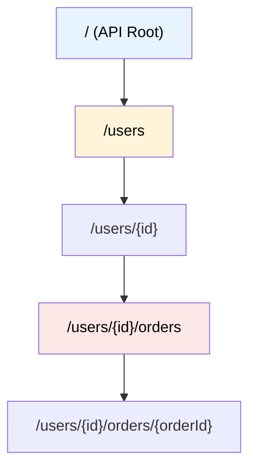

# MASTER COMPUTER SCIENCE HANDBOOK

## Volume 02 — Computer Science Foundations
### Part VIII — Computer Networks
## Chương 8.6 — Kiến trúc REST
### (REST — Representational State Transfer)

---

### Thông tin chương

| Trường | Giá trị |
|---|---|
| Chương | 8.6 |
| Thuộc Part | VIII — Computer Networks |
| Thuộc Volume | 02 — Computer Science Foundations |
| Thời gian đọc ước tính | 45–55 phút |
| Độ khó | ★★★☆☆ |
| Kiến thức tiên quyết | Chương 8.5 — HTTP (method, status code, statelessness) |
| Chương liên quan | 8.8 — RPC (một phong cách kiến trúc thay thế, đối chiếu trực tiếp ở Mục 15) |
| Từ khóa | REST, resource, URI, representation, statelessness, cacheability, uniform interface, HATEOAS, idempotency |

---

### Mục tiêu học tập

Sau khi hoàn thành chương này, người đọc có thể:

- Giải thích REST là một **phong cách kiến trúc** (architectural style), không phải một giao thức hay một chuẩn kỹ thuật cụ thể.
- Trình bày đầy đủ các ràng buộc kiến trúc (constraint) định nghĩa REST, đặc biệt là Uniform Interface.
- Thiết kế URI (định danh tài nguyên) đúng nguyên tắc REST — dùng danh từ, tổ chức phân cấp, không dùng động từ trong đường dẫn.
- Nhận diện và tránh các lỗi thiết kế REST API phổ biến.
- So sánh REST với các phong cách thiết kế API khác (RPC-style, GraphQL) và biết khi nào nên chọn cách tiếp cận nào.

---

### Câu hỏi khơi gợi

> *Rất nhiều API được gọi là "REST API" trong thực tế thực chất chỉ dùng đúng cú pháp HTTP (GET, POST, JSON) mà không tuân thủ triết lý REST thực sự — Roy Fielding, người đặt ra khái niệm REST, từng công khai chỉ trích nhiều API tự nhận là "RESTful" nhưng vi phạm chính những nguyên tắc ông đề ra. Vậy điều gì thực sự phân biệt một API "dùng HTTP" với một API "tuân thủ REST"?*

---

## 1. Tổng quan chương

Chương 8.5 đã trang bị đầy đủ công cụ cú pháp của HTTP: method, status code, header. Nhưng biết cú pháp không đồng nghĩa với biết **thiết kế tốt**. Chương 8.6 chuyển từ câu hỏi "HTTP hoạt động thế nào?" sang câu hỏi mang tính kiến trúc hơn: **"Làm sao tổ chức một tập hợp API nhất quán, dễ đoán, dễ mở rộng, sử dụng đúng những gì HTTP đã cung cấp sẵn?"**

Đây là điểm khác biệt quan trọng cần nắm ngay từ đầu chương: **HTTP là một giao thức tầng Application** (Chương 8.5); **REST là một phong cách kiến trúc** (architectural style) mô tả cách sử dụng giao thức đó một cách nhất quán. Một API có thể dùng HTTP mà hoàn toàn không tuân thủ REST (ví dụ phong cách RPC-style ở Chương 8.8), và ngược lại, các nguyên tắc REST về lý thuyết có thể áp dụng cho giao thức khác HTTP — dù trong thực tế, REST và HTTP gần như luôn đi đôi với nhau.

> **💡 Insight**
> Nếu bạn từng thấy một codebase có các function tên `getUserData()`, `updateUserData()`, `deleteUserRecord()` — và một codebase khác có một class `User` với các method chuẩn hóa `get()`, `update()`, `delete()` — bạn đã trực giác thấy đúng sự khác biệt giữa "API tùy tiện" và "API có kiến trúc nhất quán". REST áp dụng chính triết lý đó cho thiết kế API qua mạng: tài nguyên (resource) là danh từ, HTTP method là "hành động chuẩn hóa" áp dụng lên danh từ đó.

---

## 2. Bối cảnh lịch sử

| Thời điểm | Sự kiện | Ý nghĩa |
|---|---|---|
| 2000 | Roy Fielding công bố luận án tiến sĩ *"Architectural Styles and the Design of Network-based Software Architectures"* tại Đại học California, Irvine — Chương 5 định nghĩa REST | Fielding là một trong những tác giả chính của đặc tả HTTP/1.1 (RFC 2616, Chương 8.5, Mục 2) — REST ra đời không phải như một phát minh mới, mà như một **sự khái quát hóa** những nguyên tắc thiết kế đã làm cho Web mở rộng thành công đến quy mô toàn cầu |
| Giữa thập niên 2000 | REST bắt đầu được ngành công nghiệp áp dụng rộng rãi thay thế các chuẩn phức tạp hơn như SOAP | Đơn giản hơn, tận dụng trực tiếp HTTP thay vì định nghĩa một tầng giao thức riêng phía trên |
| Khoảng 2008 | Leonard Richardson đề xuất **Richardson Maturity Model** — một mô hình phân loại 4 cấp độ (0–3) đánh giá mức độ một API thực sự tuân thủ REST | Cung cấp một thước đo thực tế để phân biệt API "chỉ dùng HTTP" (cấp 0) với API tuân thủ đầy đủ Uniform Interface bao gồm cả HATEOAS (cấp 3) — mô hình này sẽ được dùng lại ở Mục 15 |

Một chi tiết quan trọng thường bị bỏ qua: **REST không phải là một chuẩn (standard) được một tổ chức nào ban hành**, khác với HTTP (có RFC chính thức) hay TCP/IP (có RFC chính thức). REST là một **tập hợp nguyên tắc thiết kế** được Fielding hệ thống hóa từ quan sát thực tế về lý do Web mở rộng thành công — đây là lý do có nhiều cách hiểu và áp dụng REST khác nhau trong thực tế, và cũng là lý do khái niệm "RESTful" thường bị dùng sai (Mục 14).

---

## 3. Động lực

Hãy hình dung hai đội kỹ sư backend cùng thiết kế API cho một hệ thống quản lý sản phẩm, nhưng theo hai phong cách khác nhau.

**Đội A** thiết kế các endpoint như sau:

```text
POST /getAllProducts
POST /getProductById
POST /createNewProduct
POST /removeProductFromCatalog
POST /updateProductPrice
```

**Đội B** thiết kế theo REST:

```text
GET    /products           (lấy danh sách)
GET    /products/{id}      (lấy một sản phẩm)
POST   /products           (tạo mới)
DELETE /products/{id}      (xóa)
PATCH  /products/{id}       (cập nhật một phần, ví dụ giá)
```

Đội A phải **đặt tên và tài liệu hóa (document) từng endpoint riêng lẻ** — với 10 loại tài nguyên khác nhau, cần khoảng 50 endpoint tên gọi tùy ý, không ai đoán trước được. Đội B chỉ cần định nghĩa **một URI duy nhất cho mỗi loại tài nguyên** (`/products`, `/orders`, `/users`...), và tái sử dụng đúng 5 method HTTP chuẩn cho mọi tài nguyên — bất kỳ ai quen thuộc với REST đều có thể **đoán đúng** cấu trúc API của Đội B mà không cần đọc tài liệu chi tiết. Đây chính là giá trị cốt lõi mà REST mang lại: **tính nhất quán và khả năng dự đoán được (predictability)** ở quy mô lớn.

---

## 4. Trực giác

**Mô hình tinh thần (Mental Model) của chương này:**

> Thiết kế REST API giống như **tổ chức một thư viện theo mã số phân loại sách (call number)**, thay vì đặt tên riêng cho từng hành động. Bạn không có các quầy riêng biệt tên "Quầy Mượn Sách Khoa Học", "Quầy Trả Sách Văn Học" — bạn có **một hệ thống định danh tài nguyên duy nhất** (mã số sách) và **một tập hành động chuẩn hóa** áp dụng cho mọi cuốn sách: mượn, trả, gia hạn, tra cứu. Tài nguyên (cuốn sách) là danh từ; hành động (mượn/trả) không đổi bất kể loại tài nguyên nào.

| Trực giác kỹ thuật bạn đã có | Khái niệm REST tương ứng |
|---|---|
| Class trong OOP có các method chuẩn hóa (`get`, `set`, `delete`) áp dụng cho mọi instance | Resource (danh từ) + HTTP Method (hành động chuẩn hóa) thay vì một hàm riêng cho mỗi hành động |
| Đường dẫn file trong hệ thống tệp phân cấp (`/home/user/documents`) | URI phân cấp thể hiện quan hệ giữa các tài nguyên (`/users/42/orders/7`) |
| Interface chuẩn hóa trong lập trình hướng đối tượng (mọi class implement cùng interface có thể dùng chung logic gọi) | Uniform Interface — nguyên tắc quan trọng nhất của REST (Mục 6) |
| Immutable data structure — không thay đổi trạng thái ẩn, mọi thao tác đều tường minh | Statelessness — mỗi request REST tự chứa đủ thông tin cần thiết, kế thừa trực tiếp từ HTTP (Chương 8.5) |

---

## 5. Trực quan hóa khái niệm

**Hình 8.6.1 — Thiết kế URI phân cấp cho tài nguyên có quan hệ lồng nhau**



| Trường thông tin | Nội dung |
|---|---|
| Mục đích | Minh họa cách URI thể hiện trực tiếp **quan hệ sở hữu** giữa các tài nguyên — một đơn hàng (order) luôn thuộc về một người dùng (user) cụ thể, và cấu trúc đường dẫn phản ánh đúng quan hệ đó |
| Điểm mấu chốt | Cấu trúc này chính là một **cây (tree)**, cùng nguyên lý tổ chức đã gặp ở DNS (Chương 8.4) — một minh chứng khác cho việc cấu trúc dữ liệu Tree xuất hiện lặp lại xuyên suốt các chủ đề khác nhau của Computer Science |

---

**Hình 8.6.2 — Cùng một Resource, khác Method, khác Hành động**

```text
Resource:  /products/42

┌────────┬──────────────────────────────────┬──────────────────┐
│ Method │ Hành động                        │ Status Code       │
├────────┼──────────────────────────────────┼──────────────────┤
│ GET    │ Lấy thông tin sản phẩm 42         │ 200 OK             │
│ PUT    │ Thay thế toàn bộ sản phẩm 42      │ 200 OK             │
│ PATCH  │ Cập nhật một phần (vd: giá)       │ 200 OK             │
│ DELETE │ Xóa sản phẩm 42                   │ 204 No Content     │
└────────┴──────────────────────────────────┴──────────────────┘
```

*Mục đích:* Minh họa trực tiếp triết lý cốt lõi của REST: **một URI, nhiều method, mỗi method một hành động chuẩn hóa** — trái ngược hoàn toàn với cách tiếp cận "một endpoint cho mỗi hành động" ở Mục 3. *Điểm mấu chốt:* Method không đổi ý nghĩa dù áp dụng cho tài nguyên nào — `DELETE` trên `/products/42` và `DELETE` trên `/users/7` luôn mang cùng một ngữ nghĩa "xóa tài nguyên này", đây chính là bản chất của Uniform Interface.

---

## 6. Định nghĩa hình thức

> **📌 Remember — Sáu Ràng buộc Kiến trúc REST**
>
> REST được Fielding định nghĩa bằng một tập hợp **ràng buộc kiến trúc (architectural constraints)**, không phải bằng một danh sách tính năng. Một hệ thống chỉ được xem là tuân thủ REST đầy đủ khi thỏa mãn tất cả các ràng buộc sau:

| Ràng buộc | Ý nghĩa |
|---|---|
| **Client–Server** | Tách biệt rõ ràng trách nhiệm giữa client (giao diện, trải nghiệm người dùng) và server (lưu trữ dữ liệu, logic nghiệp vụ) — cho phép hai phía phát triển độc lập |
| **Statelessness** | Mỗi request phải tự chứa đầy đủ thông tin cần thiết để server xử lý, server không lưu trạng thái phiên làm việc của client giữa các request — kế thừa trực tiếp từ HTTP (Chương 8.5, Mục 6) |
| **Cacheability** | Mỗi response phải khai báo rõ ràng có thể được cache hay không (qua header như `Cache-Control`), giúp giảm số lượt gọi không cần thiết đến server |
| **Uniform Interface** | Ràng buộc quan trọng nhất, gồm 4 nguyên tắc con: (1) định danh tài nguyên qua URI, (2) thao tác tài nguyên qua representation (thường là JSON), (3) message tự mô tả (self-descriptive — header `Content-Type` cho biết cách hiểu body), (4) HATEOAS (Hypermedia As The Engine Of Application State — response chứa sẵn các đường dẫn liên quan, giúp client "khám phá" API mà không cần biết trước toàn bộ cấu trúc) |
| **Layered System** | Client không cần biết nó đang giao tiếp trực tiếp với server gốc hay qua một tầng trung gian (load balancer, cache, API gateway) — hệ quả trực tiếp của kiến trúc phân lớp đã học ở Chương 8.1 |
| **Code on Demand** *(tùy chọn)* | Server có thể mở rộng chức năng client bằng cách gửi kèm mã thực thi được (ví dụ JavaScript) — ràng buộc duy nhất không bắt buộc trong sáu ràng buộc |

**Tính chất Idempotency** *(nhắc lại từ Chương 8.5, Mục 6)* — một thao tác được gọi là **idempotent** nếu gọi nhiều lần liên tiếp cho kết quả cuối cùng giống hệt gọi một lần. Đây là kiến thức nền tảng để thiết kế API REST an toàn: `PUT` và `DELETE` phải là idempotent (xóa một tài nguyên đã xóa vẫn nên trả về trạng thái nhất quán, không gây lỗi hệ thống), trong khi `POST` (tạo mới) thường không idempotent — gọi `POST` hai lần có thể tạo ra hai tài nguyên khác nhau.

---

## 7. Nền tảng toán học

Mục 3 đã minh họa bằng ví dụ trực quan sự khác biệt về độ phức tạp giữa hai phong cách thiết kế API. Mục này hình thức hóa quan sát đó bằng một phép so sánh định lượng đơn giản.

- **Ý nghĩa:** với phong cách RPC-style (Đội A ở Mục 3), số lượng endpoint cần định nghĩa và ghi nhớ tăng theo **tích số** giữa số loại tài nguyên và số hành động trên mỗi tài nguyên. Với REST, số lượng URI gốc chỉ tăng theo **số loại tài nguyên**, vì hành động được tái sử dụng qua HTTP method cố định.

> **📦 Formula Box — Độ phức tạp Bề mặt API (API Surface Complexity)**
>
> $$E_{\text{RPC}} = R \times A \qquad \text{so với} \qquad E_{\text{REST}} = R$$
>
> | Thành phần | Ý nghĩa |
> |---|---|
> | $R$ | Số loại tài nguyên (resource) trong hệ thống — ví dụ `products`, `users`, `orders` |
> | $A$ | Số hành động (action) trung bình áp dụng cho mỗi tài nguyên — ví dụ lấy, tạo, sửa, xóa, tìm kiếm |
> | $E_{\text{RPC}}$ | Số endpoint cần đặt tên và ghi nhớ riêng biệt dưới phong cách RPC-style |
> | $E_{\text{REST}}$ | Số URI gốc cần định nghĩa dưới REST — vì hành động tái sử dụng qua method HTTP cố định (thường 5 method: GET, POST, PUT, PATCH, DELETE), không tính vào $E_{\text{REST}}$ |
> | **Diễn giải kỹ thuật** | REST không "làm ít việc hơn" — cùng $R \times A$ tổ hợp hành động vẫn tồn tại và được hỗ trợ đầy đủ, nhưng độ phức tạp **cần ghi nhớ và tài liệu hóa tường minh** giảm từ $O(R \times A)$ xuống $O(R)$ nhờ tận dụng ngữ nghĩa chuẩn hóa sẵn có của HTTP method |

**Ví dụ tính tay:** hệ thống có $R = 15$ loại tài nguyên, mỗi tài nguyên trung bình có $A = 5$ hành động (lấy danh sách, lấy một, tạo, sửa, xóa):

$$E_{\text{RPC}} = 15 \times 5 = 75 \text{ endpoint cần đặt tên riêng biệt}$$

$$E_{\text{REST}} = 15 \text{ URI gốc}$$

Với 75 endpoint, phong cách RPC-style đòi hỏi ghi nhớ 75 tên gọi tùy ý (`getUserOrders`, `cancelOrder`, `refundOrder`...); với REST, chỉ cần ghi nhớ 15 URI và **một quy tắc chung duy nhất** về ý nghĩa của 5 HTTP method — đây chính là lợi thế về khả năng mở rộng nhận thức (cognitive scalability) mà REST mang lại khi hệ thống phát triển lớn dần.

---

## 8. Thuật toán / Cơ chế

**Quy trình Thiết kế một REST API** — không phải một thuật toán tính toán, mà một quy trình thiết kế có hệ thống:

```text
Bước 1 — Xác định danh sách TÀI NGUYÊN (resource) trong hệ thống
        │     Luôn là DANH TỪ, số nhiều: "products", "orders", không phải
        │     "getProduct" hay "createOrder"
        ▼
Bước 2 — Xác định quan hệ PHÂN CẤP giữa các tài nguyên (nếu có)
        │     Ví dụ: một order luôn thuộc một user
        │     → /users/{id}/orders (Hình 8.6.1)
        ▼
Bước 3 — Với mỗi tài nguyên, ánh xạ hành động nghiệp vụ sang ĐÚNG HTTP Method
        │     Lấy danh sách → GET /resource
        │     Lấy một       → GET /resource/{id}
        │     Tạo mới       → POST /resource
        │     Cập nhật toàn bộ → PUT /resource/{id}
        │     Cập nhật một phần → PATCH /resource/{id}
        │     Xóa           → DELETE /resource/{id}
        ▼
Bước 4 — Xác định Status Code phù hợp cho từng trường hợp thành công/lỗi
        │     (dùng đúng bảng đã học ở Chương 8.5, Mục 6 — không phải
        │      lúc nào cũng trả về 200 dù có lỗi, xem Mục 14)
        ▼
Bước 5 — Đảm bảo mỗi Response tự mô tả đầy đủ (self-descriptive)
        │     Header Content-Type chính xác, body chứa mọi thông tin
        │     client cần mà không cần "đoán" hoặc dựa vào trạng thái ẩn
        ▼
Bước 6 — (Nếu hướng tới REST cấp độ cao nhất) Bổ sung liên kết HATEOAS
        │     Response trả về kèm các URI liên quan, giúp client
        │     "khám phá" các hành động khả dụng tiếp theo
```

> **⚠️ Common Mistake**
> Lỗi phổ biến nhất khi thiết kế REST API là **đặt động từ vào URI**: `/getUser`, `/deleteProduct`, `/api/updateOrderStatus`. Đây là dấu hiệu rõ ràng nhất của một API "dùng HTTP nhưng không tuân thủ REST" — bản thân HTTP Method đã là động từ (GET, DELETE, PATCH); lặp lại động từ trong URI vừa dư thừa, vừa phá vỡ nguyên tắc "URI định danh tài nguyên, không mô tả hành động" ở Mục 6.

---

## 9. Triển khai

```python
class RESTResource:
    """Mô phỏng một tài nguyên REST đơn giản, lưu trong bộ nhớ,
    hỗ trợ đầy đủ CRUD đúng ngữ nghĩa HTTP Method (Mục 6, 8)."""

    def __init__(self, name: str):
        self.name = name
        self._store: dict[int, dict] = {}
        self._next_id = 1

    def list_all(self) -> tuple[int, list[dict]]:
        return 200, list(self._store.values())

    def get(self, resource_id: int) -> tuple[int, dict | None]:
        if resource_id not in self._store:
            return 404, None
        return 200, self._store[resource_id]

    def create(self, data: dict) -> tuple[int, dict]:
        # POST không idempotent — mỗi lần gọi tạo một bản ghi MỚI
        item = {"id": self._next_id, **data}
        self._store[self._next_id] = item
        self._next_id += 1
        return 201, item

    def replace(self, resource_id: int, data: dict) -> tuple[int, dict]:
        # PUT idempotent — gọi nhiều lần cùng data cho cùng kết quả
        item = {"id": resource_id, **data}
        self._store[resource_id] = item
        return 200, item

    def delete(self, resource_id: int) -> tuple[int, None]:
        # DELETE idempotent — xóa cái đã xóa vẫn trả về trạng thái nhất quán
        self._store.pop(resource_id, None)
        return 204, None
```

Chạy thử để kiểm chứng ngữ nghĩa CRUD và tính idempotent:

```python
products = RESTResource("products")

status, item = products.create({"name": "Ao thun", "price": 199000})
print(f"POST  -> {status}, {item}")

status, item = products.get(1)
print(f"GET   -> {status}, {item}")

status, item = products.replace(1, {"name": "Ao thun", "price": 179000})
print(f"PUT   -> {status}, {item}")

status, _ = products.delete(1)
print(f"DELETE (lần 1) -> {status}")

status, _ = products.delete(1)  # Kiểm chứng idempotency
print(f"DELETE (lần 2, đã xóa rồi) -> {status}")

status, item = products.get(1)
print(f"GET (sau khi xóa) -> {status}, {item}")
```

---

## 10. Trực quan hóa quá trình thực thi

**Kết quả chạy thực tế** của đoạn code Mục 9:

```text
POST  -> 201, {'id': 1, 'name': 'Ao thun', 'price': 199000}
GET   -> 200, {'id': 1, 'name': 'Ao thun', 'price': 199000}
PUT   -> 200, {'id': 1, 'name': 'Ao thun', 'price': 179000}
DELETE (lần 1) -> 204
DELETE (lần 2, đã xóa rồi) -> 204
GET (sau khi xóa) -> 404, None
```

Ba quan sát quan trọng cần rút ra:

1. **`POST` trả về `201 Created`**, không phải `200 OK` — đúng nguyên tắc Mục 8, Bước 4: status code phải phản ánh chính xác điều đã xảy ra (tạo mới, không chỉ "thành công chung chung").
2. **`DELETE` gọi hai lần liên tiếp đều trả về `204`**, không có lần nào báo lỗi — minh chứng thực nghiệm cho tính chất **idempotent** đã định nghĩa ở Mục 6: gọi nhiều lần cho kết quả cuối cùng (tài nguyên không tồn tại) giống hệt gọi một lần.
3. **`GET` sau khi xóa trả về `404`**, không phải một object rỗng hay `null` lẫn trong response `200` — status code tự nó đã mang đủ thông tin, đúng nguyên tắc "self-descriptive message" của Uniform Interface.

---

## 11. Ứng dụng công nghiệp

> **🛠 Engineering Practice**
> Phần lớn API công khai (public API) của các công ty công nghệ lớn được thiết kế theo — hoặc gần với — các nguyên tắc REST, dù mức độ tuân thủ đầy đủ (đặc biệt HATEOAS) khác nhau đáng kể giữa các công ty.

| Bối cảnh công nghiệp | Vai trò của REST |
|---|---|
| API thanh toán, API mạng xã hội, API nền tảng đám mây | Hầu hết cung cấp tài liệu API theo cấu trúc resource + method rõ ràng, giúp lập trình viên bên thứ ba tích hợp nhanh chóng nhờ tính dự đoán được (Mục 3) |
| API Gateway (Kong, AWS API Gateway) | Định tuyến, giới hạn tần suất gọi (rate limiting), và xác thực dựa trực tiếp trên cấu trúc resource + method của REST |
| OpenAPI / Swagger | Chuẩn tài liệu hóa API phổ biến nhất hiện nay được thiết kế xoay quanh mô hình tư duy REST — resource, method, status code, request/response schema |
| Microservices Architecture | Giao tiếp giữa các service thường dùng REST cho các thao tác đồng bộ đơn giản, kết hợp với RPC (Chương 8.8) cho giao tiếp nội bộ hiệu năng cao hơn |

---

## 12. Góc nhìn nghiên cứu

> **🔬 Research Connection**
> Luận án của Fielding (2000) không chỉ đề xuất REST như một "công thức thiết kế API" — nó là một nghiên cứu học thuật nghiêm túc về **các phong cách kiến trúc phần mềm phân tán (network-based software architectural styles)** nói chung, trong đó REST chỉ là một trường hợp cụ thể được đề xuất như phong cách phù hợp nhất cho Web.

Một phát hiện quan trọng từ nghiên cứu thực tế áp dụng REST là: **rất ít API tự nhận "RESTful" thực sự đạt cấp độ cao nhất của Richardson Maturity Model** (Mục 2) — cụ thể là ràng buộc HATEOAS (Mục 6) thường bị bỏ qua hoàn toàn trong thực tế, vì nó đòi hỏi client phải được thiết kế để "khám phá" API động thay vì mã hóa cứng (hardcode) đường dẫn — một cách tiếp cận phức tạp hơn đáng kể so với lợi ích thường thấy trong các hệ thống quy mô vừa và nhỏ.

Chính khoảng cách giữa REST lý tưởng và REST triển khai thực tế đã thúc đẩy các hướng thiết kế API thay thế. Năm 2015, Facebook công bố **GraphQL** — giải quyết trực tiếp hai vấn đề mà REST thường gặp: **over-fetching** (client nhận về nhiều dữ liệu hơn cần thiết vì response REST cố định cấu trúc) và **under-fetching** (client phải gọi nhiều request REST liên tiếp để lấy đủ dữ liệu cho một màn hình, ví dụ lấy user rồi lấy orders của user đó). GraphQL cho phép client tự định nghĩa chính xác cấu trúc dữ liệu cần trả về trong một request duy nhất.

**Câu hỏi mở** để suy ngẫm: nếu HATEOAS — một ràng buộc cốt lõi của REST theo đúng định nghĩa của Fielding — hiếm khi được triển khai đầy đủ trong thực tế, liệu phần lớn "REST API" mà ngành công nghiệp đang dùng có thực sự là REST theo đúng nghĩa học thuật, hay chỉ là "HTTP API có cấu trúc tốt"? Sự khác biệt này có quan trọng trong thực hành kỹ thuật hay chỉ là vấn đề thuật ngữ?

---

## 13. Ưu điểm

- **Tính nhất quán và dự đoán được:** một khi hiểu quy tắc REST, lập trình viên có thể "đoán" cấu trúc API mới mà không cần đọc tài liệu chi tiết (Mục 3, Mục 7).
- **Tận dụng tối đa hạ tầng HTTP có sẵn:** cache (Cacheability), status code, method — không cần phát minh lại các khái niệm này.
- **Phân tách rõ ràng client/server:** cho phép hai đội phát triển độc lập miễn là tuân thủ đúng hợp đồng API (contract).
- **Dễ tích hợp với công cụ hạ tầng chuẩn:** load balancer, CDN, API Gateway đều hiểu và tối ưu tốt cho các request REST tuân thủ chuẩn HTTP.

---

## 14. Hạn chế

> **⚠️ Common Mistake**
> Ba lỗi thiết kế REST phổ biến nhất trong thực tế: (1) **dùng động từ trong URI** (đã nêu ở Mục 8); (2) **luôn trả về `200 OK`** ngay cả khi có lỗi, nhồi thông tin lỗi vào body — phá vỡ nguyên tắc self-descriptive message; (3) **REST API "có trạng thái"** — vô tình lưu session ở phía server giữa các request, vi phạm trực tiếp ràng buộc Statelessness (Mục 6).

- **Over-fetching / Under-fetching:** cấu trúc response cố định của REST không linh hoạt cho mọi nhu cầu hiển thị dữ liệu khác nhau (Mục 12).
- **HATEOAS hiếm khi được triển khai đầy đủ:** khiến nhiều API tự nhận "REST" thực chất chỉ đạt cấp độ thấp của Richardson Maturity Model.
- **Không tối ưu cho giao tiếp thời gian thực:** vẫn dựa trên mô hình request-response của HTTP (Chương 8.5), không phù hợp cho luồng dữ liệu liên tục — giải quyết ở Chương 8.7 (WebSocket).
- **Nhiều round-trip cho dữ liệu có quan hệ phức tạp:** ví dụ cần 3 request REST riêng biệt để lấy đủ dữ liệu user + orders + order items.

---

## 15. So sánh

**Bảng 8.6.1 — REST vs RPC-style vs GraphQL**

| Tiêu chí | REST | RPC-style | GraphQL |
|---|---|---|---|
| Đơn vị thiết kế | Tài nguyên (resource) | Hành động (action/procedure) | Schema kiểu dữ liệu (type) |
| Số endpoint | Nhiều, theo tài nguyên | Nhiều, theo hành động (Mục 7) | Thường chỉ một endpoint duy nhất |
| Client chọn dữ liệu trả về | Không — cấu trúc cố định theo server | Không | Có — client tự định nghĩa trường cần lấy |
| Tận dụng HTTP cache | Tốt (dùng trực tiếp cơ chế cache HTTP) | Kém — thường dùng `POST` cho mọi request | Kém — cùng lý do như RPC-style |
| Độ phức tạp học/áp dụng | Trung bình | Thấp (trực quan, dễ bắt đầu) | Cao hơn (cần học schema, resolver) |
| Phù hợp | API công khai, tài nguyên rõ ràng | Giao tiếp nội bộ giữa service (Chương 8.8) | Ứng dụng cần linh hoạt dữ liệu hiển thị, nhiều client khác nhau (web/mobile) |

**Phân tích:** Không có phong cách nào chiến thắng tuyệt đối. REST tối ưu cho **tính nhất quán và khả năng cache**; RPC-style tối ưu cho **hiệu năng giao tiếp nội bộ đơn giản, trực tiếp** (Chương 8.8 sẽ trình bày kỹ hơn); GraphQL tối ưu cho **tính linh hoạt của dữ liệu trả về**. Lựa chọn đúng luôn phụ thuộc vào bài toán cụ thể: một API công khai, được nhiều bên thứ ba tích hợp, thường phù hợp với REST hơn; giao tiếp nội bộ hiệu năng cao giữa các microservice thường phù hợp RPC hơn.

---

## 16. Tóm tắt

- **REST là một phong cách kiến trúc**, không phải giao thức — được Fielding hệ thống hóa từ luận án tiến sĩ năm 2000, khái quát hóa các nguyên tắc giúp Web mở rộng thành công.
- REST được định nghĩa bằng **sáu ràng buộc kiến trúc**: Client-Server, Statelessness, Cacheability, Uniform Interface, Layered System, và Code on Demand (tùy chọn) — trong đó Uniform Interface là quan trọng nhất.
- Nguyên tắc thiết kế cốt lõi: **URI là danh từ định danh tài nguyên, HTTP Method là hành động chuẩn hóa** — không lặp lại động từ trong URI.
- REST giảm độ phức tạp bề mặt API từ $O(R \times A)$ (phong cách RPC-style) xuống $O(R)$, nhờ tái sử dụng ngữ nghĩa method HTTP cố định.
- Rất ít API thực tế đạt cấp độ REST đầy đủ (đặc biệt HATEOAS) — khoảng cách giữa lý thuyết và thực hành đã thúc đẩy các hướng thay thế như GraphQL.

Chương 8.7 (WebSocket) sẽ trình bày giải pháp cho chính hạn chế đã nêu ở Mục 14: khi mô hình request-response của REST/HTTP không còn phù hợp cho giao tiếp thời gian thực.

---

## 17. Bài tập

### Mức Cơ bản (Basic)

1. Chỉ ra lỗi thiết kế trong các URI sau và sửa lại theo đúng nguyên tắc REST: `/getUserById?id=5`, `/deleteOrder/12`, `/api/createNewProduct`.
2. Với tài nguyên `comments` thuộc về một `post` cụ thể, thiết kế URI phân cấp phù hợp để lấy danh sách comment của post đó.
3. Giải thích tại sao `DELETE` nên là idempotent, dùng chính định nghĩa ở Mục 6.

### Mức Trung bình (Intermediate)

4. Với $R = 8$ loại tài nguyên và trung bình $A = 6$ hành động mỗi tài nguyên, tính $E_{\text{RPC}}$ và $E_{\text{REST}}$ theo công thức Mục 7. Chênh lệch này có ý nghĩa gì khi một đội kỹ thuật gồm 20 lập trình viên cùng làm việc trên hệ thống?
5. Cho một API trả về `200 OK` cho mọi request, kể cả khi tài nguyên không tồn tại (trả về `{"error": "not found"}` trong body). Giải thích đây là vi phạm nguyên tắc REST nào, và đề xuất cách sửa.

### Mức Nâng cao (Advanced)

6. Mở rộng lớp `RESTResource` ở Mục 9 để hỗ trợ `PATCH` (cập nhật một phần, khác với `PUT` thay thế toàn bộ) — đảm bảo `PATCH` chỉ cập nhật các trường được cung cấp, giữ nguyên các trường còn lại.
7. Thiết kế (trên giấy) một API REST đầy đủ cho một hệ thống blog đơn giản, gồm tài nguyên `posts` và `comments` có quan hệ lồng nhau, liệt kê đầy đủ URI, method, và status code dự kiến cho mỗi thao tác.

### Mức Nghiên cứu (Research)

8. Đọc thêm về HATEOAS và Richardson Maturity Model (Mục 2, Mục 12), sau đó trình bày quan điểm cá nhân: liệu HATEOAS có thực sự cần thiết cho phần lớn API thực tế, hay là một lý tưởng học thuật ít giá trị thực hành? Đây là câu hỏi mở-kết-thúc, không có đáp án duy nhất được kỳ vọng.

---

## 18. Dự án nhỏ

**Dự án: REST API hoàn chỉnh cho Hệ thống Quản lý Công việc (Task Manager)**

- **Mục tiêu:** Mở rộng `RESTResource` ở Mục 9 (hoặc dùng lại `HTTPServer` ở Chương 8.5, Mục 9) để xây dựng một REST API hoàn chỉnh cho tài nguyên `tasks`.
- **Yêu cầu:**
  - Hỗ trợ đầy đủ CRUD: `GET /tasks`, `GET /tasks/{id}`, `POST /tasks`, `PUT /tasks/{id}`, `PATCH /tasks/{id}`, `DELETE /tasks/{id}`.
  - Trả về đúng status code cho từng trường hợp (201 khi tạo, 404 khi không tìm thấy, 204 khi xóa thành công).
  - Đảm bảo tính idempotent cho `PUT` và `DELETE`, kiểm chứng bằng test tương tự Mục 10.
  - Bổ sung một trường quan hệ, ví dụ mỗi `task` thuộc về một `project` — thiết kế URI phân cấp phù hợp (`/projects/{id}/tasks`).
- **Công nghệ đề xuất:** Python thuần, có thể kết hợp với `HTTPServer` từ Chương 8.5 để có một API thực sự chạy qua HTTP.
- **Mở rộng (tùy chọn):** Thêm một trường `_links` vào response, chứa URI của các tài nguyên liên quan (ví dụ link đến `project` cha) — trải nghiệm thực tế nguyên tắc HATEOAS đã học ở Mục 6.

---

## 19. Tự đánh giá

- [ ] Tôi có thể giải thích rõ ràng sự khác biệt giữa "HTTP" (giao thức) và "REST" (kiến trúc) mà không nhầm lẫn hai khái niệm.
- [ ] Tôi có thể liệt kê và giải thích đầy đủ sáu ràng buộc kiến trúc REST.
- [ ] Tôi có thể tự thiết kế URI đúng nguyên tắc REST cho một hệ thống tài nguyên có quan hệ lồng nhau.
- [ ] Tôi hiểu và có thể giải thích tính chất idempotent, phân biệt được method nào idempotent và method nào không.
- [ ] Tôi có thể chỉ ra ít nhất ba lỗi thiết kế REST phổ biến và cách sửa chúng.

Nếu Bài tập 7 vẫn còn khó khăn, hãy quay lại Mục 8 (Quy trình Thiết kế REST API) và làm theo từng bước một cách tuần tự trước khi cố gắng thiết kế toàn bộ API cùng lúc.

---

## 20. Đọc thêm

- **Nguồn gốc:** Fielding, R. (2000). *Architectural Styles and the Design of Network-based Software Architectures* (Luận án Tiến sĩ, UC Irvine) — Chương 5 là nguồn tham khảo chính thức và duy nhất định nghĩa REST.
- **Sách:** Kurose, J., Ross, K., *Computer Networking: A Top-Down Approach* — phần thảo luận về kiến trúc ứng dụng Web hiện đại. *(Xem BOOKS.md.)*
- **Chủ đề mở rộng (không bắt buộc):** tìm đọc tổng quan về Richardson Maturity Model để tự đánh giá mức độ REST của các API bạn đã từng làm việc cùng.
- **Chương tiếp theo:** Chương 8.7 — WebSocket.

---

### Liên kết chương (Cross References)

- **Chương trước:** 8.5 — HTTP (REST là phong cách kiến trúc xây dựng trực tiếp trên method và status code đã học ở chương đó).
- **Chương tiếp theo:** 8.7 — WebSocket (giải pháp cho hạn chế "không phù hợp giao tiếp thời gian thực" đã nêu ở Mục 14).
- **Chương liên quan xa hơn:** 8.8 — RPC (phong cách kiến trúc thay thế, đối chiếu trực tiếp ở Bảng 8.6.1); Chương 8.4 — DNS (cấu trúc URI phân cấp ở Hình 8.6.1 cùng nguyên lý Tree với DNS).
- **Vị trí trong Knowledge Graph:** Nút thứ sáu của Part VIII, phụ thuộc trực tiếp vào Chương 8.5; là một trong ba "phong cách giao tiếp tầng Application" được đối chiếu ở Chương 8.9 (cùng WebSocket và RPC).

---

*Hết Chương 8.6. Chương này tuân thủ đầy đủ cấu trúc 20 mục của `OUTPUT.md` và chuẩn Presentation Layer, khớp với outline Part VIII đã được duyệt. Mọi kết quả mô phỏng ở Mục 9–10 đều được kiểm chứng bằng code Python chạy thực tế. Đang chờ rà soát trước khi tiếp tục sang Chương 8.7 — WebSocket.*
