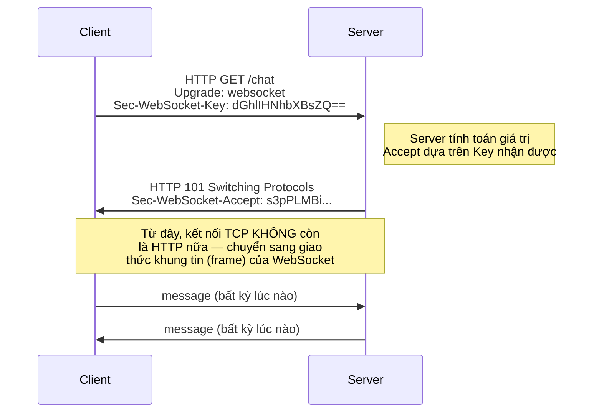

# MASTER COMPUTER SCIENCE HANDBOOK

## Volume 02 — Computer Science Foundations
### Part VIII — Computer Networks
## Chương 8.7 — Giao tiếp Hai chiều Thời gian thực
### (WebSocket)

---

### Thông tin chương

| Trường | Giá trị |
|---|---|
| Chương | 8.7 |
| Thuộc Part | VIII — Computer Networks |
| Thuộc Volume | 02 — Computer Science Foundations |
| Thời gian đọc ước tính | 40–50 phút |
| Độ khó | ★★★☆☆ |
| Kiến thức tiên quyết | Chương 8.5 — HTTP (đặc biệt cấu trúc Header và Status Code); Chương 8.2 — TCP/IP (kết nối bền vững — persistent connection) |
| Chương liên quan | 8.6 — REST (hạn chế "không phù hợp thời gian thực" mà chương này giải quyết); 8.9 — Distributed Communication (tổng hợp WebSocket cùng các mô hình giao tiếp khác) |
| Từ khóa | WebSocket, full-duplex, HTTP Upgrade, handshake, polling, long-polling, Server-Sent Events, C10K problem |

---

### Mục tiêu học tập

Sau khi hoàn thành chương này, người đọc có thể:

- Giải thích hạn chế của mô hình request-response thuần túy đối với ứng dụng thời gian thực.
- Mô tả cơ chế "nâng cấp giao thức" (HTTP Upgrade) để chuyển từ một kết nối HTTP thành kết nối WebSocket.
- Giải thích tính chất full-duplex của WebSocket, phân biệt với mô hình half-duplex của HTTP.
- So sánh WebSocket với các kỹ thuật thay thế: Polling, Long-Polling, và Server-Sent Events.
- Tính toán và so sánh overhead giữa Polling và WebSocket cho một kịch bản cập nhật dữ liệu tần suất cao.
- Lựa chọn đúng mô hình giao tiếp (REST hay WebSocket) cho một use case backend cụ thể.

---

### Câu hỏi khơi gợi

> *Ứng dụng chat hiện đại hiển thị tin nhắn mới gần như ngay lập tức, dù người gửi và người nhận không hề "yêu cầu" nhau gửi tin nhắn theo mô hình request-response mà Chương 8.5–8.6 đã xây dựng. Nếu HTTP luôn cần một request khởi đầu từ client trước khi server có thể phản hồi, làm sao server lại có thể "chủ động" đẩy dữ liệu về phía client ngay khi có tin nhắn mới?*

---

## 1. Tổng quan chương

Chương 8.5 và 8.6 xây dựng toàn bộ nền tảng xoay quanh một giả định ngầm: **client luôn là bên chủ động khởi tạo giao tiếp**. Đây là giả định hợp lý cho phần lớn ứng dụng Web truyền thống, nhưng hoàn toàn không phù hợp với một lớp ứng dụng ngày càng phổ biến: chat, thông báo đẩy, bảng điều khiển theo thời gian thực, giao dịch tài chính trực tiếp — nơi **server cần chủ động gửi dữ liệu đến client** ngay khi sự kiện xảy ra, không chờ client hỏi.

Chương 8.7 giới thiệu **WebSocket** — giao thức được thiết kế đặc biệt để giải quyết chính xác vấn đề này, bằng một kỹ thuật thú vị: bắt đầu bằng một HTTP request hoàn toàn bình thường (đã học ở Chương 8.5), sau đó "nâng cấp" (upgrade) chính kết nối TCP đó thành một kênh giao tiếp hai chiều liên tục, không còn tuân theo mô hình request-response nữa.

> **💡 Insight**
> WebSocket không phải một giao thức "cạnh tranh" với HTTP — nó là một giao thức **được sinh ra từ chính một HTTP request**. Đây là lý do WebSocket dùng đúng cổng mạng của HTTP/HTTPS (80/443) và có thể đi qua hầu hết hạ tầng mạng doanh nghiệp (firewall, proxy) vốn chỉ cho phép lưu lượng HTTP — một quyết định thiết kế thực dụng, tận dụng tối đa hạ tầng Web đã có sẵn thay vì phát minh một giao thức hoàn toàn mới từ đầu.

---

## 2. Bối cảnh lịch sử

| Thời điểm | Sự kiện | Ý nghĩa |
|---|---|---|
| Đầu – giữa thập niên 2000 | Kỹ thuật **Comet** (bao gồm Polling và Long-Polling) trở nên phổ biến | Các giải pháp "chắp vá" đầu tiên để mô phỏng giao tiếp thời gian thực trên nền HTTP vốn không được thiết kế cho việc đó (Mục 7) |
| 2008–2009 | Giao thức WebSocket được đề xuất trong khuôn khổ phát triển đặc tả HTML5 | Xuất phát từ nhu cầu thực tế của các ứng dụng web ngày càng tương tác nhiều hơn (game trình duyệt, ứng dụng cộng tác thời gian thực) |
| Tháng 12 năm 2011 | **RFC 6455** chính thức chuẩn hóa giao thức WebSocket | Đặc tả kỹ thuật đầy đủ vẫn được dùng đến ngày nay, định nghĩa chính xác cơ chế handshake (Mục 8) và định dạng frame dữ liệu |
| Cùng giai đoạn (chuẩn HTML5) | **Server-Sent Events (SSE)** được chuẩn hóa như một giải pháp thay thế đơn giản hơn | Cung cấp giao tiếp một chiều (server → client) qua HTTP thuần, không cần nâng cấp giao thức — phù hợp cho các trường hợp không cần gửi dữ liệu ngược lại từ client (Mục 15) |

Điều đáng chú ý: WebSocket ra đời **không phải để thay thế HTTP**, mà để lấp đầy một khoảng trống cụ thể mà chính những người thiết kế HTTP ban đầu (đầu thập niên 1990, Chương 8.5, Mục 2) chưa từng hình dung — khi đó, Web chỉ là các trang tài liệu tĩnh, không ai dự đoán trước nhu cầu giao tiếp hai chiều liên tục của các ứng dụng hiện đại.

---

## 3. Động lực

Hãy xem xét bài toán xây dựng một ứng dụng theo dõi giá cổ phiếu thời gian thực, cập nhật mỗi giây. Nếu dùng đúng mô hình REST đã học ở Chương 8.6, giải pháp "hiển nhiên" nhất là: trình duyệt gửi một `GET /stocks/price` mỗi giây để kiểm tra giá mới.

Cách tiếp cận này (gọi là **Polling**) có một vấn đề nghiêm trọng: **phần lớn các request đó sẽ nhận về câu trả lời "không có gì thay đổi"**, nhưng vẫn phải trả đầy đủ chi phí của một HTTP request hoàn chỉnh — bao gồm header (Chương 8.5, Hình 8.5.2), và nếu không dùng persistent connection, có thể còn cả chi phí TCP handshake (Chương 8.2). Với hàng nghìn người dùng đồng thời, mỗi người polling mỗi giây, server phải xử lý một lượng lớn request "vô nghĩa" — lãng phí tài nguyên đáng kể chỉ để duy trì ảo giác "thời gian thực".

Vấn đề cốt lõi: **mô hình request-response buộc client phải "hỏi" trước khi có thể nhận dữ liệu**, trong khi bài toán thực tế cần **server chủ động thông báo khi có sự kiện xảy ra** — một sự đảo ngược hoàn toàn về vai trò chủ động trong giao tiếp.

---

## 4. Trực giác

**Mô hình tinh thần (Mental Model) của chương này:**

> **HTTP/REST giống như gửi tin nhắn SMS và chờ trả lời**: bạn gửi một câu hỏi, chờ, nhận câu trả lời, rồi phải chủ động gửi lại nếu muốn hỏi tiếp — mỗi tin nhắn là một giao dịch độc lập. **WebSocket giống như một cuộc gọi điện thoại đang diễn ra**: một khi đã kết nối, cả hai bên có thể nói bất cứ lúc nào, không cần "gửi tin nhắn mới" mỗi lần muốn nói — kênh giao tiếp luôn mở, hai chiều, liên tục cho đến khi một trong hai bên gác máy.

| Trực giác kỹ thuật bạn đã có | Khái niệm WebSocket tương ứng |
|---|---|
| Long-lived database connection (connection pool) thay vì mở/đóng kết nối cho mỗi query | Kết nối WebSocket được giữ mở liên tục, không đóng lại sau mỗi tin nhắn |
| Event listener / callback trong lập trình bất đồng bộ (`onMessage`, `onClose`) | API WebSocket phía client gần như luôn theo mô hình event-driven này |
| Publish–Subscribe pattern trong hệ thống message queue | Mô hình phổ biến khi dùng WebSocket cho broadcast (một sự kiện, nhiều client cùng nhận) |
| Header `Upgrade` khi làm việc với reverse proxy (Nginx cấu hình `proxy_set_header Upgrade`) | Chính cơ chế HTTP Upgrade mà WebSocket sử dụng để "nâng cấp" kết nối (Mục 6, Mục 8) |

---

## 5. Trực quan hóa khái niệm

**Hình 8.7.1 — So sánh Half-Duplex (HTTP) và Full-Duplex (WebSocket)**

```text
── HTTP/REST — Half-Duplex (một chiều tại một thời điểm, theo cặp) ──

Client  ──Request──▶  Server
Client  ◀─Response──  Server
        (kết thúc giao dịch, cần Request mới để tiếp tục)
Client  ──Request──▶  Server
Client  ◀─Response──  Server

── WebSocket — Full-Duplex (hai chiều đồng thời, liên tục) ──

Client  ──message──▶  Server
Client  ◀─message───  Server
Client  ◀─message───  Server   (server gửi TRƯỚC, không cần Client hỏi)
Client  ──message──▶  Server
        (kênh vẫn MỞ, không cần thiết lập lại)
```

| Trường thông tin | Nội dung |
|---|---|
| Mục đích | Đối chiếu trực quan sự khác biệt căn bản nhất giữa hai mô hình: HTTP luôn cần Request đi trước Response tương ứng; WebSocket cho phép cả hai bên gửi tin nhắn bất cứ lúc nào, không theo cặp cố định |
| Điểm mấu chốt | Dòng "server gửi TRƯỚC" chính là câu trả lời cho câu hỏi khơi gợi đầu chương — đây là khả năng mà HTTP/REST thuần túy không thể cung cấp |

---

**Hình 8.7.2 — Quy trình Nâng cấp từ HTTP sang WebSocket (Handshake)**



*Mục đích:* Minh họa handshake WebSocket thực chất là **một HTTP request/response duy nhất, đặc biệt** — dùng mã trạng thái `101 Switching Protocols` (đã liệt kê ở nhóm 1xx, Chương 8.5, Mục 6) để báo hiệu việc chuyển đổi giao thức. *Điểm mấu chốt:* sau bước handshake, cùng một kết nối TCP vật lý (đã thiết lập từ Chương 8.2) tiếp tục được tái sử dụng, nhưng dữ liệu trao đổi không còn tuân theo cú pháp HTTP nữa.

---

## 6. Định nghĩa hình thức

> **📌 Remember — HTTP Upgrade Mechanism**
>
> **HTTP Upgrade** là một cơ chế được định nghĩa sẵn trong đặc tả HTTP (Chương 8.5), cho phép client đề nghị chuyển đổi giao thức đang dùng trên một kết nối TCP hiện có, thông qua header `Upgrade` và `Connection: Upgrade`. Nếu server chấp nhận, nó trả về mã trạng thái **`101 Switching Protocols`**, và từ thời điểm đó, cả hai bên đồng ý diễn giải dữ liệu trên kết nối theo giao thức mới — trong trường hợp này là WebSocket.

**Đặc điểm giao thức WebSocket:**

- **Full-duplex:** cả client và server có thể gửi dữ liệu độc lập, đồng thời, không cần chờ lượt của bên kia.
- **Kết nối bền vững (persistent):** một khi handshake hoàn tất, kết nối TCP được giữ mở cho đến khi một trong hai bên chủ động đóng (hoặc xảy ra lỗi mạng).
- **Truyền dữ liệu theo Frame:** không giống HTTP dựa trên văn bản có cấu trúc Request/Response, WebSocket truyền dữ liệu theo các **frame** nhỏ gọn, mỗi frame có một opcode xác định loại nội dung (văn bản, nhị phân, ping/pong để kiểm tra kết nối còn sống, hoặc đóng kết nối).
- **URI scheme riêng:** `ws://` (không mã hóa, tương ứng HTTP) và `wss://` (có mã hóa TLS, tương ứng HTTPS).

**Công thức tính `Sec-WebSocket-Accept`** (định nghĩa chính xác trong RFC 6455, phần bắt buộc của handshake): server nối giá trị `Sec-WebSocket-Key` nhận từ client với một chuỗi GUID cố định (`258EAFA5-E914-47DA-95CA-C5AB0DC85B11`), tính SHA-1 của chuỗi kết quả, rồi mã hóa Base64 — giá trị này chứng minh server thực sự hiểu và chấp nhận yêu cầu nâng cấp WebSocket, không phải một server HTTP thông thường vô tình trả lời.

---

## 7. Nền tảng toán học

Mục 3 đã minh họa bằng lời vấn đề overhead của Polling. Mục này định lượng chính xác sự khác biệt, tái sử dụng trực tiếp khái niệm overhead đã xây dựng ở Chương 8.1, Mục 7.

- **Ý nghĩa:** với Polling, mỗi lượt kiểm tra là một HTTP request/response hoàn chỉnh, mang theo toàn bộ header (thường 500–800 byte cho cả hai chiều). Với WebSocket, sau chi phí handshake một lần duy nhất, mỗi tin nhắn chỉ cần một frame với header cực nhỏ (tối thiểu 2 byte).

> **📦 Formula Box — So sánh Overhead: Polling vs WebSocket**
>
> $$O_{\text{polling}} = \frac{D}{T} \times H_{\text{http}} \qquad \text{so với} \qquad O_{\text{ws}} = H_{\text{handshake}} + N \times H_{\text{frame}}$$
>
> | Thành phần | Ý nghĩa |
> |---|---|
> | $D$ | Tổng thời gian phiên làm việc cần theo dõi cập nhật (giây) |
> | $T$ | Chu kỳ polling — khoảng cách giữa hai lượt kiểm tra (giây) |
> | $H_{\text{http}}$ | Overhead trung bình của một cặp HTTP request/response hoàn chỉnh (byte), thường 500–800 byte |
> | $H_{\text{handshake}}$ | Overhead một lần duy nhất của WebSocket handshake (một HTTP request/response, tương đương $H_{\text{http}}$) |
> | $N$ | Số tin nhắn thực sự có ý nghĩa được gửi qua WebSocket trong suốt phiên |
> | $H_{\text{frame}}$ | Overhead của một WebSocket frame, tối thiểu chỉ khoảng 2–14 byte |
> | **Diễn giải kỹ thuật** | $O_{\text{polling}}$ tăng tuyến tính theo thời gian phiên $D$, bất kể có sự kiện thực sự xảy ra hay không; $O_{\text{ws}}$ chỉ tăng theo số sự kiện *thực sự có ý nghĩa* $N$ — đây là khác biệt cốt lõi giữa "hỏi định kỳ" và "được thông báo khi có chuyện" |

**Ví dụ tính tay:** một phiên theo dõi giá cổ phiếu kéo dài $D = 3600$ giây (1 giờ), Polling mỗi $T = 1$ giây, $H_{\text{http}} \approx 700$ byte; giả sử trong 1 giờ đó chỉ có $N = 50$ lần giá thực sự thay đổi, $H_{\text{frame}} \approx 10$ byte:

$$O_{\text{polling}} = \frac{3600}{1} \times 700 = 2{.}520{.}000 \text{ byte} \approx 2{,}5 \text{ MB overhead thuần túy header}$$

$$O_{\text{ws}} = 700 + 50 \times 10 = 1{.}200 \text{ byte} \approx 1{,}2 \text{ KB}$$

Chênh lệch hơn **2.000 lần** — một minh chứng định lượng rõ ràng cho lý do các hệ thống có tần suất cập nhật cao, số lượng client lớn gần như luôn chọn WebSocket thay vì Polling khi khả thi về mặt hạ tầng.

---

## 8. Thuật toán / Cơ chế

**Quy trình Handshake và Vòng đời Kết nối WebSocket:**

```text
Bước 1 — Client gửi một HTTP GET request đặc biệt, kèm các header:
        │     Upgrade: websocket
        │     Connection: Upgrade
        │     Sec-WebSocket-Key: <chuỗi ngẫu nhiên do client tạo, mã hóa Base64>
        ▼
Bước 2 — Server nhận request, kiểm tra tính hợp lệ của header Upgrade
        │
        ▼
Bước 3 — Server tính Sec-WebSocket-Accept theo công thức RFC 6455
        │     (nối Key với GUID cố định, SHA-1, Base64 — Mục 6)
        ▼
Bước 4 — Server trả về HTTP 101 Switching Protocols, kèm Sec-WebSocket-Accept
        │
        ▼
Bước 5 — Client xác minh giá trị Accept nhận được có đúng như mong đợi
        │     (tính lại theo cùng công thức, so sánh kết quả)
        ▼
Bước 6 — Nếu khớp: kết nối chính thức trở thành WebSocket — bắt đầu
        │     trao đổi frame dữ liệu tự do, hai chiều, không giới hạn thứ tự
        ▼
Bước 7 — Trong suốt phiên, cả hai bên có thể gửi frame Ping để kiểm tra
        │     kết nối còn sống, bên nhận trả lời Pong tương ứng
        ▼
Bước 8 — Khi một bên muốn kết thúc, gửi frame Close — bên kia xác nhận
        │     bằng một frame Close phản hồi, sau đó đóng kết nối TCP
```

> **⚠️ Common Mistake**
> Người mới học thường nghĩ WebSocket "thay thế hoàn toàn" HTTP trong ứng dụng của họ. Trên thực tế, phần lớn hệ thống thực tế **kết hợp cả hai**: dùng REST/HTTP (Chương 8.6) cho các thao tác CRUD thông thường (đăng nhập, tải danh sách ban đầu, cập nhật hồ sơ), và chỉ dùng WebSocket cho phần thực sự cần giao tiếp thời gian thực (tin nhắn mới, thông báo trực tiếp). Dùng WebSocket cho mọi thứ thường phức tạp hóa hệ thống không cần thiết, vì WebSocket không có sẵn các tiện ích như caching HTTP (Chương 8.6, Mục 6) mà REST được hưởng miễn phí.

---

## 9. Triển khai

```python
import base64
import hashlib

WEBSOCKET_GUID = "258EAFA5-E914-47DA-95CA-C5AB0DC85B11"  # Định nghĩa cố định trong RFC 6455


def compute_accept_key(sec_websocket_key: str) -> str:
    """Cài đặt chính xác công thức tính Sec-WebSocket-Accept theo RFC 6455 (Mục 6)."""
    combined = sec_websocket_key + WEBSOCKET_GUID
    sha1_digest = hashlib.sha1(combined.encode("utf-8")).digest()
    return base64.b64encode(sha1_digest).decode("utf-8")


class WebSocketConnection:
    """Mô phỏng một kết nối full-duplex đơn giản: cả hai phía đều
    có thể gửi tin nhắn vào hàng đợi của phía kia bất cứ lúc nào."""

    def __init__(self, name: str):
        self.name = name
        self.inbox: list[str] = []

    def receive(self, message: str) -> None:
        self.inbox.append(message)
        print(f"[{self.name}] nhận: {message}")


def handshake(client_key: str) -> str:
    """Mô phỏng Bước 3-4 của quy trình handshake (Mục 8)."""
    accept_key = compute_accept_key(client_key)
    print(f"HTTP/1.1 101 Switching Protocols")
    print(f"Sec-WebSocket-Accept: {accept_key}")
    return accept_key
```

Chạy thử: xác minh công thức `Sec-WebSocket-Accept` bằng đúng ví dụ mẫu trong RFC 6455, sau đó mô phỏng giao tiếp full-duplex:

```python
# Ví dụ chính thức từ RFC 6455: với Key này, Accept PHẢI khớp chính xác giá trị dưới đây
sample_key = "dGhlIHNhbXBsZQ=="
accept = handshake(sample_key)
assert accept == "s3pPLMBiTxaQ9kYGzzhZRbK+xOo=", "Công thức tính Accept không khớp RFC 6455"
print("Handshake hợp lệ theo đúng RFC 6455!")
print("---")

# Mô phỏng full-duplex: server chủ động gửi tin nhắn TRƯỚC, không cần client hỏi
client = WebSocketConnection("Client")
server = WebSocketConnection("Server")

server.receive("Client: xin chào!")          # Client gửi trước
client.receive("Server: có tin nhắn mới!")   # Server gửi TRƯỚC, client không hề "hỏi"
client.receive("Server: cập nhật giá: 105")  # Server tiếp tục gửi, không cần request mới
```

---

## 10. Trực quan hóa quá trình thực thi

**Kết quả chạy thực tế** của đoạn code Mục 9:

```text
HTTP/1.1 101 Switching Protocols
Sec-WebSocket-Accept: s3pPLMBiTxaQ9kYGzzhZRbK+xOo=
Handshake hợp lệ theo đúng RFC 6455!
---
[Server] nhận: Client: xin chào!
[Client] nhận: Server: có tin nhắn mới!
[Client] nhận: Server: cập nhật giá: 105
```

Điểm mấu chốt cần quan sát: dòng lệnh `client.receive("Server: có tin nhắn mới!")` được gọi **mà không có bất kỳ request nào từ Client trước đó** — đây chính là bằng chứng thực nghiệm cho tính chất full-duplex đã minh họa ở Hình 8.7.1. So sánh với mọi mô phỏng ở Chương 8.5 và 8.6, nơi Server luôn chỉ "trả lời" sau khi nhận Request — ở đây Server hoàn toàn có thể "khởi xướng" giao tiếp.

**Kiểm chứng công thức Overhead ở Mục 7** bằng code:

```python
D, T, H_http = 3600, 1, 700
N, H_frame = 50, 10

O_polling = (D / T) * H_http
O_ws = H_http + N * H_frame

print(f"Overhead Polling: {O_polling:,.0f} byte")
print(f"Overhead WebSocket: {O_ws:,.0f} byte")
print(f"Tỷ lệ chênh lệch: {O_polling / O_ws:,.0f} lần")
```

```text
Overhead Polling: 2,520,000 byte
Overhead WebSocket: 1,200 byte
Tỷ lệ chênh lệch: 2,100 lần
```

---

## 11. Ứng dụng công nghiệp

> **🛠 Engineering Practice**
> WebSocket là lựa chọn mặc định của ngành công nghiệp cho mọi tính năng đòi hỏi cập nhật thời gian thực trong ứng dụng Web hiện đại.

| Bối cảnh công nghiệp | Vai trò của WebSocket |
|---|---|
| Ứng dụng chat (Slack, Discord, Messenger) | Kênh giao tiếp chính để nhận tin nhắn mới ngay lập tức, không cần Polling |
| Bảng điều khiển tài chính (dashboard giao dịch chứng khoán, tiền điện tử) | Cập nhật giá liên tục, độ trễ thấp là yêu cầu bắt buộc — đúng kịch bản đã tính toán ở Mục 7 |
| Công cụ cộng tác thời gian thực (ứng dụng soạn thảo tài liệu nhiều người dùng cùng lúc) | Đồng bộ thay đổi giữa nhiều người dùng gần như tức thời |
| Thông báo trực tiếp (real-time notification) trong ứng dụng mạng xã hội | Server chủ động đẩy thông báo (like, comment mới) mà không cần client polling liên tục |

---

## 12. Góc nhìn nghiên cứu

> **🔬 Research Connection**
> WebSocket giải quyết vấn đề *ngữ nghĩa giao tiếp* (làm sao server chủ động gửi dữ liệu), nhưng lại mở ra một bài toán *hạ tầng* khác: làm sao một server duy trì **hàng triệu kết nối persistent đồng thời** mà không sụp đổ.

Vấn đề này được biết đến rộng rãi trong cộng đồng kỹ thuật với tên gọi **C10K Problem** — thuật ngữ xuất phát từ bài viết nổi tiếng của Dan Kegel (cuối thập niên 1990), đặt câu hỏi: làm sao một server đơn lẻ xử lý đồng thời 10.000 kết nối? Với WebSocket — nơi mỗi client duy trì một kết nối *liên tục*, không đóng lại như HTTP request thông thường — bài toán này trở nên cấp thiết hơn nhiều so với các server HTTP truyền thống chỉ giữ kết nối trong thời gian ngắn. Các kiến trúc xử lý I/O bất đồng bộ, hiệu năng cao (event loop, non-blocking I/O) là hướng giải quyết chính cho vấn đề này, được các framework hiện đại (Node.js, Nginx) áp dụng rộng rãi.

Ngày nay, khi số lượng client kết nối đồng thời tiếp tục tăng, cộng đồng kỹ thuật đã bắt đầu nói đến **C10M Problem** — mở rộng thách thức lên quy mô 10 triệu kết nối đồng thời, đòi hỏi những kỹ thuật tối ưu ở tầng hệ điều hành sâu hơn nhiều so với việc chỉ tối ưu ở tầng ứng dụng.

**Câu hỏi mở** để suy ngẫm: nếu việc duy trì hàng triệu kết nối WebSocket đồng thời là một thách thức hạ tầng đáng kể, liệu có luôn hợp lý khi chọn WebSocket, hay trong nhiều trường hợp, các giải pháp đơn giản hơn (như Server-Sent Events, Mục 15) hoặc thậm chí Long-Polling vẫn là lựa chọn thực dụng hơn cho những ứng dụng không thực sự cần giao tiếp hai chiều?

---

## 13. Ưu điểm

- **Loại bỏ hoàn toàn overhead của Polling** cho các ứng dụng cần cập nhật tần suất cao (Mục 7, Mục 10).
- **Full-duplex thực sự:** cả hai bên có thể gửi dữ liệu độc lập, không bị ràng buộc bởi mô hình request-response.
- **Tận dụng hạ tầng HTTP có sẵn:** đi qua được firewall/proxy doanh nghiệp vốn chỉ cho phép cổng 80/443, nhờ khởi đầu bằng một HTTP request hợp lệ.
- **Độ trễ thấp:** không cần thiết lập lại kết nối cho mỗi tin nhắn, loại bỏ chi phí TCP handshake lặp lại (Chương 8.2).

---

## 14. Hạn chế

- **Chi phí duy trì kết nối ở quy mô lớn** (Mục 12) — mỗi kết nối WebSocket tiêu tốn tài nguyên bộ nhớ trên server, ngay cả khi không có dữ liệu trao đổi.
- **Không tận dụng được cơ chế cache HTTP** (Chương 8.6, Mục 6) — mỗi tin nhắn WebSocket là dữ liệu "tươi", không có khái niệm cache tương tự.
- **Phức tạp hơn REST khi triển khai và gỡ lỗi:** cần xử lý thêm các trường hợp mất kết nối, tự động kết nối lại (reconnection), đồng bộ trạng thái sau khi mất kết nối.
- **Load Balancing phức tạp hơn:** vì kết nối là persistent, việc phân phối tải giữa nhiều server (horizontal scaling) đòi hỏi kỹ thuật bổ sung như "sticky session" hoặc một message broker trung gian.

---

## 15. So sánh

**Bảng 8.7.1 — Polling vs Long-Polling vs Server-Sent Events vs WebSocket**

| Tiêu chí | Polling | Long-Polling | Server-Sent Events (SSE) | WebSocket |
|---|---|---|---|---|
| Hướng giao tiếp | Client hỏi định kỳ | Client hỏi, server "giữ" request đến khi có dữ liệu | Chỉ một chiều: Server → Client | Hai chiều, đồng thời (full-duplex) |
| Độ trễ cập nhật | Cao (phụ thuộc chu kỳ $T$) | Thấp | Thấp | Thấp nhất |
| Overhead | Rất cao (Mục 7) | Trung bình (ít request hơn Polling) | Thấp (một kết nối HTTP giữ mở) | Thấp nhất |
| Độ phức tạp triển khai | Thấp nhất | Trung bình | Thấp (dùng API `EventSource` chuẩn, không cần Upgrade) | Cao hơn (cần xử lý handshake, reconnection) |
| Phù hợp | Cập nhật không cần tức thời (kiểm tra định kỳ) | Giải pháp tạm thời khi không có WebSocket | Thông báo một chiều (news feed, log trực tiếp) | Chat, giao dịch thời gian thực, ứng dụng cần cả hai chiều |

**Phân tích:** Việc chọn giữa bốn kỹ thuật này là một quyết định kiến trúc thực sự, không phải "luôn chọn cái mới nhất". Nếu ứng dụng chỉ cần server đẩy dữ liệu một chiều (ví dụ luồng thông báo), **SSE** đơn giản hơn WebSocket đáng kể mà vẫn đạt độ trễ thấp tương đương, đồng thời tận dụng được các cơ chế HTTP tiêu chuẩn (bao gồm reconnection tự động có sẵn trong API `EventSource`) mà không cần tự cài đặt như WebSocket.

---

## 16. Tóm tắt

- HTTP/REST (Chương 8.5–8.6) hoạt động theo mô hình half-duplex, luôn cần Client khởi tạo Request — không phù hợp cho các trường hợp Server cần chủ động đẩy dữ liệu.
- **WebSocket** giải quyết vấn đề này bằng cơ chế **HTTP Upgrade**: bắt đầu bằng một HTTP request bình thường, sau đó "nâng cấp" kết nối TCP đang có thành một kênh **full-duplex** liên tục.
- Handshake WebSocket dùng công thức tính toán chính xác (`Sec-WebSocket-Accept`) được định nghĩa trong **RFC 6455 (2011)**, đảm bảo cả hai bên thực sự hiểu và chấp nhận giao thức mới.
- So với Polling, WebSocket giảm overhead theo tỷ lệ hàng nghìn lần đối với các ứng dụng cập nhật tần suất cao — nhưng đánh đổi bằng thách thức duy trì kết nối ở quy mô lớn (C10K/C10M Problem).
- Không phải mọi bài toán thời gian thực đều cần WebSocket — **Server-Sent Events** là lựa chọn đơn giản hơn cho giao tiếp một chiều.

Chương 8.8 (RPC) sẽ giới thiệu một mô hình giao tiếp thứ ba, khác biệt cả với REST lẫn WebSocket: gọi hàm từ xa như thể gọi hàm cục bộ — phổ biến nhất trong giao tiếp nội bộ giữa các microservice.

---

## 17. Bài tập

### Mức Cơ bản (Basic)

1. Giải thích bằng lời sự khác biệt giữa half-duplex và full-duplex, dùng chính ví dụ điện thoại (Mục 4).
2. Mã trạng thái HTTP nào được dùng để báo hiệu chuyển đổi từ HTTP sang WebSocket? Nó thuộc nhóm nào theo phân loại đã học ở Chương 8.5?
3. Cho một tính năng "hiển thị số người đang online" cập nhật mỗi 30 giây, đây có phải trường hợp bắt buộc cần WebSocket không? Giải thích.

### Mức Trung bình (Intermediate)

4. Với $D = 1800$ giây, $T = 2$ giây, $H_{\text{http}} = 600$ byte, $N = 20$, $H_{\text{frame}} = 8$ byte, tính $O_{\text{polling}}$ và $O_{\text{ws}}$ theo công thức Mục 7. Tỷ lệ chênh lệch là bao nhiêu lần?
5. Giải thích tại sao WebSocket dùng chung cổng 80/443 với HTTP thay vì một cổng riêng biệt — liên hệ với kiến thức về firewall/proxy doanh nghiệp ở Mục 1.

### Mức Nâng cao (Advanced)

6. Mở rộng lớp `WebSocketConnection` ở Mục 9 để hỗ trợ **broadcast**: một `WebSocketServer` quản lý nhiều `WebSocketConnection`, có thể gửi cùng một tin nhắn đến tất cả client đang kết nối cùng lúc (mô phỏng tính năng chat room).
7. Nghiên cứu và trình bày (không cần code) một chiến lược đơn giản để xử lý trường hợp client bị mất kết nối WebSocket đột ngột (ví dụ do mất mạng tạm thời) và cần tự động kết nối lại mà không làm mất dữ liệu đã gửi trong lúc mất kết nối.

### Mức Nghiên cứu (Research)

8. Đọc thêm về C10K Problem (Mục 12) và trình bày bằng lời: tại sao mô hình xử lý một thread cho mỗi kết nối (thread-per-connection) trở nên không khả thi khi số lượng kết nối WebSocket đồng thời tăng lên hàng chục nghìn, và hướng tiếp cận event loop/non-blocking I/O giải quyết vấn đề đó như thế nào ở mức khái niệm. Đây là câu hỏi mở-kết-thúc, chuẩn bị kiến thức nền cho Volume 04 (Concurrency, Distributed Systems).

---

## 18. Dự án nhỏ

**Dự án: Mô phỏng Phòng Chat (Chat Room) với WebSocket**

- **Mục tiêu:** Mở rộng mô phỏng ở Mục 9 thành một hệ thống chat room hoàn chỉnh, minh họa đầy đủ tính chất full-duplex và broadcast.
- **Yêu cầu:**
  - Một `ChatRoom` quản lý nhiều `WebSocketConnection` (đại diện cho nhiều người dùng).
  - Khi một client gửi tin nhắn, `ChatRoom` broadcast tin nhắn đó đến **mọi client khác** (không gửi lại cho chính người gửi).
  - Mô phỏng sự kiện một client "ngắt kết nối" (gửi Close frame, Mục 8, Bước 8) và `ChatRoom` cần loại client đó khỏi danh sách broadcast.
  - In log rõ ràng mọi sự kiện: kết nối mới, tin nhắn, ngắt kết nối.
- **Công nghệ đề xuất:** Python thuần, mở rộng trực tiếp từ lớp `WebSocketConnection` ở Mục 9.
- **Mở rộng (tùy chọn):** Thêm khái niệm "phòng" (room) — nhiều `ChatRoom` độc lập, mỗi client chỉ nhận broadcast từ phòng mình đang tham gia.

---

## 19. Tự đánh giá

- [ ] Tôi có thể giải thích rõ ràng tại sao mô hình request-response của HTTP không phù hợp cho giao tiếp thời gian thực hai chiều.
- [ ] Tôi hiểu và có thể mô tả đầy đủ quy trình HTTP Upgrade để thiết lập kết nối WebSocket.
- [ ] Tôi có thể tính toán và so sánh overhead giữa Polling và WebSocket cho một kịch bản cụ thể.
- [ ] Tôi phân biệt được khi nào nên dùng WebSocket và khi nào Server-Sent Events là lựa chọn phù hợp hơn.
- [ ] Tôi hiểu ở mức khái niệm về C10K Problem và thách thức hạ tầng khi mở rộng số lượng kết nối persistent.

Nếu Bài tập 4 vẫn còn khó khăn, hãy quay lại Formula Box ở Mục 7 và thử tính lại với các giá trị $D$, $T$, $N$ khác nhau để tự cảm nhận rõ hơn về sự khác biệt giữa tăng trưởng tuyến tính (Polling) và tăng trưởng theo sự kiện thực tế (WebSocket).

---

## 20. Đọc thêm

- **Đặc tả kỹ thuật:** RFC 6455 (2011), *The WebSocket Protocol* — nguồn tham khảo chính thức, định nghĩa chính xác công thức handshake và định dạng frame đã dùng ở Mục 9.
- **Sách:** Kurose, J., Ross, K., *Computer Networking: A Top-Down Approach* — phần thảo luận về các mô hình giao tiếp hiện đại trên nền Web. *(Xem BOOKS.md.)*
- **Chủ đề mở rộng (không bắt buộc):** tìm đọc bài viết gốc của Dan Kegel về C10K Problem để hiểu bối cảnh lịch sử đầy đủ của thách thức mở rộng số lượng kết nối đồng thời.
- **Chương tiếp theo:** Chương 8.8 — RPC.

---

### Liên kết chương (Cross References)

- **Chương trước:** 8.6 — REST (WebSocket giải quyết trực tiếp hạn chế "không phù hợp giao tiếp thời gian thực" đã nêu ở Mục 14 của chương đó).
- **Chương tiếp theo:** 8.8 — RPC (một mô hình giao tiếp thứ ba, phổ biến cho giao tiếp nội bộ giữa các service).
- **Chương liên quan xa hơn:** Chương 8.2 — TCP/IP (WebSocket tái sử dụng trực tiếp khái niệm kết nối bền vững — persistent connection); Volume 04, Part IV — Concurrency và Part VI — Distributed Systems (mở rộng đầy đủ về xử lý I/O bất đồng bộ và C10K/C10M Problem đã giới thiệu ở Mục 12).
- **Vị trí trong Knowledge Graph:** Nút thứ bảy của Part VIII, phụ thuộc trực tiếp vào Chương 8.5; là mô hình giao tiếp thứ hai trong ba mô hình (REST, WebSocket, RPC) sẽ được tổng hợp và đối chiếu đầy đủ ở Chương 8.9.

---

*Hết Chương 8.7. Chương này tuân thủ đầy đủ cấu trúc 20 mục của `OUTPUT.md` và chuẩn Presentation Layer, khớp với outline Part VIII đã được duyệt. Mọi kết quả mô phỏng ở Mục 9–10, bao gồm công thức `Sec-WebSocket-Accept`, đều được kiểm chứng khớp chính xác với ví dụ mẫu trong RFC 6455. Đang chờ rà soát trước khi tiếp tục sang Chương 8.8 — RPC.*
