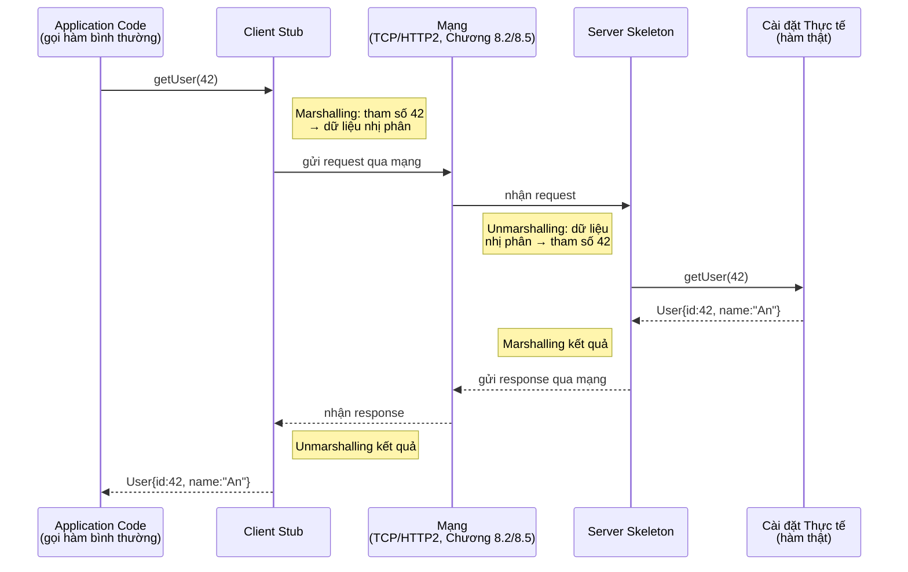

# MASTER COMPUTER SCIENCE HANDBOOK

## Volume 02 — Computer Science Foundations
### Part VIII — Computer Networks
## Chương 8.8 — Gọi hàm từ xa
### (RPC — Remote Procedure Call)

---

### Thông tin chương

| Trường | Giá trị |
|---|---|
| Chương | 8.8 |
| Thuộc Part | VIII — Computer Networks |
| Thuộc Volume | 02 — Computer Science Foundations |
| Thời gian đọc ước tính | 45–55 phút |
| Độ khó | ★★★☆☆ |
| Kiến thức tiên quyết | Chương 8.5 — HTTP; Chương 8.6 — REST (đối chiếu trực tiếp ở Mục 15) |
| Chương liên quan | 8.9 — Distributed Communication (tổng hợp RPC cùng REST và WebSocket) |
| Từ khóa | RPC, stub, skeleton, marshalling, serialization, IDL, gRPC, Protocol Buffers, SOAP |

---

### Mục tiêu học tập

Sau khi hoàn thành chương này, người đọc có thể:

- Giải thích ý tưởng cốt lõi của RPC: gọi một hàm chạy trên máy khác như thể gọi hàm cục bộ.
- Mô tả vai trò của stub, skeleton, và quá trình marshalling/unmarshalling trong một lời gọi RPC.
- Giải thích vai trò của Interface Definition Language (IDL) trong việc đảm bảo hai bên giao tiếp đúng "hợp đồng" dữ liệu.
- So sánh RPC (đặc biệt gRPC) với REST, xác định khi nào nên chọn cách tiếp cận nào.
- Giải thích ưu thế hiệu năng của serialization nhị phân (như Protocol Buffers) so với JSON dạng văn bản.

---

### Câu hỏi khơi gợi

> *Khi hai microservice trong cùng một hệ thống backend cần giao tiếp với nhau hàng chục nghìn lần mỗi giây — không phải giao tiếp với trình duyệt của người dùng cuối — thiết kế API theo phong cách REST (vốn tối ưu cho khả năng cache và tính người-đọc-được) có còn là lựa chọn tốt nhất? Hay tồn tại một mô hình giao tiếp khác, được thiết kế riêng cho giao tiếp máy-với-máy ở tần suất cao?*

---

## 1. Tổng quan chương

Chương 8.6 đã trình bày REST như một phong cách kiến trúc tối ưu cho **API công khai, hướng tài nguyên, cần khả năng cache**. Chương 8.7 giải quyết bài toán **giao tiếp thời gian thực, hai chiều**. Chương 8.8 khép lại bộ ba mô hình giao tiếp tầng Application của Part VIII bằng một triết lý hoàn toàn khác: thay vì nghĩ về "tài nguyên" (REST) hay "kênh dữ liệu liên tục" (WebSocket), **RPC (Remote Procedure Call)** đưa giao tiếp mạng về đúng thứ mà mọi lập trình viên đã quen thuộc từ ngày đầu học lập trình: **gọi hàm**.

Ý tưởng của RPC đơn giản đến mức gây bất ngờ: nếu gọi một hàm cục bộ trông như `getUser(42)`, tại sao gọi một hàm chạy trên máy khác lại không thể có cú pháp gần như y hệt? RPC theo đuổi mục tiêu **che giấu (abstract) toàn bộ sự phức tạp của mạng** — serialize dữ liệu, gửi qua mạng, chờ phản hồi, deserialize kết quả — đằng sau một lời gọi hàm trông hoàn toàn bình thường.

> **💡 Insight**
> RPC không phải một ý tưởng mới xuất hiện cùng thời với microservices hiện đại — nó là một trong những ý tưởng **lâu đời nhất** của hệ phân tán, có trước cả REST (Chương 8.6, ra đời năm 2000) hơn một thập kỷ rưỡi. gRPC (Google, 2015) không phải "phát minh lại RPC", mà là một **cài đặt hiện đại** của một ý tưởng đã tồn tại từ giữa thập niên 1980, kết hợp với những công cụ mới: HTTP/2 (Chương 8.5) và một định dạng serialization nhị phân hiệu quả.

---

## 2. Bối cảnh lịch sử

| Thời điểm | Sự kiện | Ý nghĩa |
|---|---|---|
| 1984 | Andrew Birrell và Bruce Nelson (Xerox PARC) công bố bài báo *"Implementing Remote Procedure Calls"* | Bài báo nền tảng, hệ thống hóa đầy đủ khái niệm RPC — bao gồm chính các thuật ngữ stub, marshalling vẫn được dùng đến ngày nay (Mục 6) |
| Thập niên 1980 | **Sun RPC** (còn gọi là ONC RPC) trở nên phổ biến, dùng định dạng serialization **XDR (External Data Representation)** | Một trong những cài đặt RPC thực tế quy mô lớn đầu tiên, ảnh hưởng đến nhiều hệ thống phân tán thời kỳ đầu (bao gồm cả giao thức chia sẻ file NFS) |
| 1998–2000 | **SOAP** (Simple Object Access Protocol) ra đời, dựa trên XML, thường đi kèm **WSDL** (Web Services Description Language) làm IDL | Một làn sóng RPC "hạng nặng" phổ biến trong doanh nghiệp cuối thập niên 1990 – đầu 2000, trước khi REST (Chương 8.6, năm 2000) dần thay thế nhờ tính đơn giản hơn |
| 2008 | Google mã nguồn mở **Protocol Buffers** — định dạng serialization nhị phân, nhỏ gọn, có schema tường minh | Thành phần cốt lõi sau này được dùng làm nền tảng serialization cho gRPC |
| 2015 | Google công bố **gRPC**, xây dựng trên nền HTTP/2 (Chương 8.5) và Protocol Buffers | Cài đặt RPC hiện đại được áp dụng rộng rãi nhất hiện nay cho giao tiếp nội bộ giữa microservice |

Một quan sát lịch sử thú vị: **RPC và REST không phát triển theo một đường thẳng "cái sau thay thế cái trước"**. RPC ra đời trước, thống trị giai đoạn đầu của hệ phân tán và Web Service doanh nghiệp (SOAP); REST sau đó trở thành lựa chọn ưu tiên cho API công khai vì sự đơn giản; và gần đây, RPC (dưới hình thái gRPC) đã "trở lại" mạnh mẽ cho một ngữ cảnh cụ thể — giao tiếp nội bộ hiệu năng cao giữa các microservice — nơi những ưu điểm ban đầu của RPC (Mục 13) trở nên quan trọng hơn những ưu điểm của REST.

---

## 3. Động lực

Hãy hình dung một hệ thống microservice gồm hàng chục service nội bộ, gọi nhau hàng chục nghìn lần mỗi giây — ví dụ service `OrderService` cần gọi `InventoryService` để kiểm tra tồn kho trước khi xác nhận đơn hàng. Đây là giao tiếp **máy-với-máy hoàn toàn nội bộ**, không có trình duyệt, không cần khả năng cache HTTP, không cần con người đọc trực tiếp dữ liệu trao đổi.

Trong ngữ cảnh này, một số ưu điểm cốt lõi của REST (Chương 8.6) trở nên **kém quan trọng hơn nhiều**:

- Không cần URI dễ đọc, dễ đoán cho con người — chỉ có code gọi code.
- Không cần tận dụng cache HTTP — dữ liệu tồn kho thay đổi liên tục, không phù hợp cache.
- Định dạng JSON dạng văn bản (dùng phổ biến với REST) tốn nhiều byte hơn cần thiết và chậm hơn để parse so với định dạng nhị phân, ở tần suất hàng chục nghìn lời gọi mỗi giây, khác biệt này tích lũy thành chi phí hạ tầng đáng kể.

Ngược lại, điều thực sự quan trọng trong ngữ cảnh này là: **tốc độ**, **type safety** (đảm bảo cả hai phía đồng ý chính xác về cấu trúc dữ liệu), và **trải nghiệm lập trình gần với gọi hàm cục bộ nhất có thể**. Đây chính xác là những gì RPC được thiết kế để tối ưu ngay từ đầu.

---

## 4. Trực giác

**Mô hình tinh thần (Mental Model) của chương này:**

> RPC giống như việc **gọi điện thoại qua một phiên dịch viên vô hình**: bạn nói ("gọi hàm `getUser(42)`") bằng đúng ngôn ngữ lập trình quen thuộc, và có một "phiên dịch viên" (client stub) âm thầm dịch câu nói đó thành một gói tin gửi qua mạng, chờ phản hồi, dịch ngược kết quả trở lại thành giá trị trả về — bạn hoàn toàn không nhận ra có một cuộc gọi mạng thực sự đã xảy ra ở giữa.

| Trực giác kỹ thuật bạn đã có | Khái niệm RPC tương ứng |
|---|---|
| Interface trong lập trình hướng đối tượng — định nghĩa hợp đồng (contract) trước khi cài đặt | Interface Definition Language (IDL) — định nghĩa hợp đồng giữa client và server trước khi sinh code (Mục 6) |
| Design Pattern Proxy — một object "giả" đứng trung gian, chuyển tiếp lời gọi đến object thật | Client Stub — chính là một Proxy Pattern áp dụng cho giao tiếp qua mạng |
| Serialize một object thành JSON để lưu vào database hoặc gửi qua API | Marshalling — quá trình chuyển đổi tham số hàm thành dữ liệu có thể truyền qua mạng |
| Code generation từ schema (ví dụ sinh TypeScript type từ OpenAPI spec) | Trình biên dịch IDL (như `protoc` của Protocol Buffers) tự sinh code stub/skeleton từ file định nghĩa |

---

## 5. Trực quan hóa khái niệm

**Hình 8.8.1 — Kiến trúc Stub/Skeleton của một lời gọi RPC**



| Trường thông tin | Nội dung |
|---|---|
| Mục đích | Minh họa "ảo giác gọi hàm cục bộ" mà RPC tạo ra — `Application Code` chỉ thấy một lời gọi hàm và một giá trị trả về, hoàn toàn không "nhìn thấy" quá trình mạng phức tạp diễn ra ở giữa |
| Điểm mấu chốt | **Client Stub** và **Server Skeleton** là hai nửa đối xứng của cùng một cơ chế — mỗi bên chỉ cần biết cách marshalling/unmarshalling đúng theo hợp đồng đã thỏa thuận trước (IDL, Mục 6), không cần biết chi tiết cài đặt của bên còn lại |

---

**Hình 8.8.2 — So sánh Overhead Serialization: JSON (văn bản) vs Protocol Buffers (nhị phân)**

```text
── JSON (thường dùng với REST) ──
{"id":42,"name":"An","active":true}
 └─ 36 ký tự, MỌI tên trường ("id", "name", "active") đều
    được lặp lại nguyên văn trong MỖI thông điệp

── Protocol Buffers (nhị phân, dùng với gRPC) ──
[field 1: varint 42] [field 2: string "An"] [field 3: bool true]
 └─ Tên trường KHÔNG được gửi — chỉ gửi SỐ THỨ TỰ trường
    (đã thỏa thuận trước qua file .proto, xem Mục 6),
    giúp giảm đáng kể số byte cần truyền
```

*Mục đích:* Minh họa trực quan lý do serialization nhị phân thường nhỏ gọn hơn: JSON phải lặp lại tên trường dạng văn bản trong mọi thông điệp, trong khi Protocol Buffers chỉ cần một số nguyên nhỏ đại diện cho trường đó, vì cả hai bên đã biết trước ý nghĩa của từng số nhờ file `.proto` chung. *Điểm mấu chốt:* càng gửi nhiều thông điệp (đúng ngữ cảnh microservice tần suất cao ở Mục 3), khác biệt tích lũy về băng thông và tốc độ parse càng trở nên đáng kể.

---

## 6. Định nghĩa hình thức

> **📌 Remember — Các thành phần của một hệ thống RPC**
>
> - **Stub (Client Stub):** một đoạn code chạy ở phía client, có giao diện (interface) giống hệt hàm thật, nhưng bên trong thực chất thực hiện marshalling tham số và gửi request qua mạng, thay vì thực thi logic thật.
> - **Skeleton (Server Skeleton / Server Stub):** đoạn code tương ứng ở phía server, nhận request qua mạng, unmarshalling tham số, gọi đến hàm cài đặt thật, rồi marshalling kết quả để gửi trả về.
> - **Marshalling (và ngược lại, Unmarshalling):** quá trình chuyển đổi tham số/kết quả hàm (dữ liệu trong bộ nhớ) thành một định dạng có thể truyền qua mạng (chuỗi byte), và ngược lại.
> - **IDL (Interface Definition Language):** một ngôn ngữ trung lập, độc lập với ngôn ngữ lập trình, dùng để định nghĩa "hợp đồng" — tên hàm, kiểu tham số, kiểu giá trị trả về — mà cả client và server đều phải tuân theo. Với gRPC, IDL là **Protocol Buffers** (file `.proto`); với SOAP (Mục 2), IDL là **WSDL**.

**Ví dụ một định nghĩa IDL đơn giản (cú pháp Protocol Buffers):**

```protobuf
service UserService {
  rpc GetUser (GetUserRequest) returns (User);
}

message GetUserRequest {
  int32 id = 1;
}

message User {
  int32 id = 1;
  string name = 2;
  bool active = 3;
}
```

Từ định nghĩa này, một công cụ sinh code (như `protoc`) tự động tạo ra Client Stub và Server Skeleton bằng ngôn ngữ lập trình mong muốn (Python, Java, Go...) — lập trình viên không cần tự viết logic marshalling/unmarshalling bằng tay, giảm đáng kể khả năng sai sót giữa hai phía.

---

## 7. Nền tảng toán học

Mục 5 (Hình 8.8.2) đã minh họa trực quan sự khác biệt về kích thước giữa JSON và một định dạng nhị phân kiểu Protocol Buffers. Mục này định lượng đơn giản hóa nguyên nhân của sự khác biệt đó.

- **Ý nghĩa:** với $k$ trường dữ liệu trong một thông điệp, JSON tốn thêm chi phí cho **tên trường dạng văn bản** ở mỗi thông điệp; định dạng nhị phân theo kiểu Protocol Buffers thay tên trường bằng một **số thứ tự (field number)** nhỏ gọn, độ dài gần như cố định.

> **📦 Formula Box — Overhead Tên trường tích lũy qua N Thông điệp**
>
> $$\text{Overhead}_{\text{JSON}} = N \times \sum_{i=1}^{k} |\text{tên trường}_i| \qquad \text{so với} \qquad \text{Overhead}_{\text{binary}} \approx N \times k \times c$$
>
> | Thành phần | Ý nghĩa |
> |---|---|
> | $N$ | Tổng số thông điệp được trao đổi |
> | $k$ | Số trường dữ liệu trong mỗi thông điệp |
> | $|\text{tên trường}_i|$ | Độ dài (byte) của tên trường thứ $i$ khi biểu diễn dạng văn bản (ví dụ `"active"` chiếm 8 byte kể cả dấu ngoặc kép) |
> | $c$ | Chi phí trung bình cho một field tag nhị phân — thường chỉ 1 byte cho các trường có số thứ tự nhỏ |
> | **Diễn giải kỹ thuật** | Vì $\text{Overhead}_{\text{JSON}}$ phụ thuộc vào **độ dài tên trường thực tế** (thường vài ký tự đến vài chục ký tự) trong khi $\text{Overhead}_{\text{binary}}$ gần như là hằng số nhỏ mỗi trường, chênh lệch càng lớn khi tên trường càng dài và số lượng thông điệp $N$ càng lớn — đúng kịch bản giao tiếp nội bộ tần suất cao đã nêu ở Mục 3 |

**Ví dụ minh họa** (số liệu mang tính minh họa nguyên lý, không phải benchmark chính thức): với thông điệp có $k = 3$ trường tên `id`, `name`, `active` (tổng độ dài tên trường dạng văn bản, kể cả dấu ngoặc kép và dấu hai chấm, khoảng 24 byte), gửi $N = 1{.}000{.}000$ thông điệp:

$$\text{Overhead}_{\text{JSON}} \approx 1{.}000{.}000 \times 24 = 24 \text{ triệu byte} \approx 24 \text{ MB chỉ riêng cho tên trường}$$

$$\text{Overhead}_{\text{binary}} \approx 1{.}000{.}000 \times 3 \times 1 = 3 \text{ triệu byte} \approx 3 \text{ MB}$$

Chênh lệch 8 lần **chỉ riêng cho phần overhead tên trường** — chưa kể tốc độ parse văn bản (JSON) vốn cũng chậm hơn đáng kể so với đọc trực tiếp cấu trúc nhị phân đã biết trước schema. Đây là lý do định lượng cho lựa chọn thiết kế của gRPC.

---

## 8. Thuật toán / Cơ chế

**Vòng đời một lời gọi RPC**, mở rộng chi tiết Hình 8.8.1:

```text
Bước 1 — Application code gọi hàm qua Client Stub, cú pháp giống hệt
        │     gọi hàm cục bộ: result = stub.getUser(42)
        ▼
Bước 2 — Client Stub thực hiện MARSHALLING: chuyển tham số (42)
        │     thành dữ liệu nhị phân theo đúng định nghĩa IDL (Mục 6)
        ▼
Bước 3 — Client Stub gửi dữ liệu qua mạng đến Server
        │     (thường qua HTTP/2 với gRPC — tái sử dụng Chương 8.5)
        ▼
Bước 4 — Server Skeleton nhận dữ liệu, thực hiện UNMARSHALLING
        │     ngược lại thành tham số (42) đúng kiểu dữ liệu gốc
        ▼
Bước 5 — Server Skeleton gọi đến hàm CÀI ĐẶT THẬT: getUser(42)
        │
        ▼
Bước 6 — Hàm thật thực thi logic nghiệp vụ, trả về kết quả
        │     (ví dụ User{id:42, name:"An", active:true})
        ▼
Bước 7 — Server Skeleton MARSHALLING kết quả thành dữ liệu nhị phân
        │
        ▼
Bước 8 — Gửi kết quả qua mạng trở về Client
        │
        ▼
Bước 9 — Client Stub UNMARSHALLING kết quả, trả về đúng kiểu dữ liệu
        │     cho Application code — hoàn tất "ảo giác gọi hàm cục bộ"
```

> **⚠️ Common Mistake**
> Người mới học RPC thường quên rằng, dù cú pháp trông giống hệt gọi hàm cục bộ, **một lời gọi RPC có thể thất bại theo những cách mà một lời gọi hàm cục bộ không bao giờ gặp phải**: mất kết nối mạng, timeout, server quá tải. Đây được gọi là vấn đề **"Fallacies of Distributed Computing"** (những ngộ nhận về hệ phân tán) — lập trình viên phải luôn xử lý các trường hợp lỗi mạng khi dùng RPC, dù cú pháp che giấu sự phức tạp đó rất tốt. Đối xử với một lời gọi RPC y hệt một lời gọi hàm cục bộ (ví dụ không bao giờ bắt exception mạng) là một lỗi thiết kế nghiêm trọng.

---

## 9. Triển khai

```python
import json


class RemoteObjectProxy:
    """Mô phỏng Client Stub: mọi lời gọi method đều bị 'chặn' lại,
    marshalling thành một 'network call' giả lập, gửi đến Server."""

    def __init__(self, service_name: str, server: "RPCServer"):
        self._service_name = service_name
        self._server = server

    def __getattr__(self, method_name: str):
        def call(*args):
            # Bước 2 — Marshalling: đóng gói tên hàm + tham số thành "gói tin"
            request = json.dumps({"method": method_name, "args": args})
            print(f"[Client Stub] Marshalling: {request}")

            # Bước 3 — Gửi qua 'mạng' (ở đây là gọi trực tiếp, mô phỏng độ trễ)
            raw_response = self._server.handle_request(self._service_name, request)

            # Bước 9 — Unmarshalling kết quả
            result = json.loads(raw_response)
            print(f"[Client Stub] Unmarshalling kết quả: {result}")
            return result["result"]
        return call


class RPCServer:
    """Mô phỏng Server Skeleton: nhận request thô, unmarshalling,
    dispatch đến đúng hàm cài đặt thật, marshalling kết quả trả về."""

    def __init__(self):
        self._services: dict[str, dict[str, callable]] = {}

    def register(self, service_name: str, method_name: str, handler: callable):
        self._services.setdefault(service_name, {})[method_name] = handler

    def handle_request(self, service_name: str, raw_request: str) -> str:
        # Bước 4 — Unmarshalling
        request = json.loads(raw_request)
        print(f"[Server Skeleton] Unmarshalling: {request}")

        # Bước 5 — Gọi hàm cài đặt thật
        handler = self._services[service_name][request["method"]]
        result = handler(*request["args"])

        # Bước 7 — Marshalling kết quả
        response = json.dumps({"result": result})
        print(f"[Server Skeleton] Marshalling kết quả: {response}")
        return response
```

Chạy thử — định nghĩa "hàm thật" ở server, gọi qua stub như một hàm cục bộ bình thường:

```python
server = RPCServer()

def get_user_impl(user_id: int) -> dict:
    # "Cài đặt thật" — logic nghiệp vụ, hoàn toàn không biết gì về mạng
    return {"id": user_id, "name": "An", "active": True}

server.register("UserService", "getUser", get_user_impl)

user_service = RemoteObjectProxy("UserService", server)

# Gọi hàm y hệt cú pháp gọi hàm cục bộ — "ảo giác" đã nêu ở Mục 4
result = user_service.getUser(42)
print(f"\nKết quả cuối cùng nhận được ở Application code: {result}")
```

---

## 10. Trực quan hóa quá trình thực thi

**Kết quả chạy thực tế** của đoạn code Mục 9:

```text
[Client Stub] Marshalling: {"method": "getUser", "args": [42]}
[Server Skeleton] Unmarshalling: {'method': 'getUser', 'args': [42]}
[Server Skeleton] Marshalling kết quả: {"result": {"id": 42, "name": "An", "active": true}}
[Client Stub] Unmarshalling kết quả: {'result': {'id': 42, 'name': 'An', 'active': True}}

Kết quả cuối cùng nhận được ở Application code: {'id': 42, 'name': 'An', 'active': True}
```

Điểm mấu chốt cần quan sát: dòng lệnh `user_service.getUser(42)` ở Application code trông **giống hệt** một lời gọi phương thức bình thường trên một object Python — không có `send_request`, không có `parse_response` tường minh nào xuất hiện trong code của Application. Toàn bộ bốn bước Marshalling/Unmarshalling ở trên diễn ra **hoàn toàn ẩn** bên trong `RemoteObjectProxy` — đây chính xác là "ảo giác gọi hàm cục bộ" đã mô tả ở Mục 4 và Hình 8.8.1, được hiện thực hóa bằng code chạy thực tế.

**Kiểm chứng công thức Overhead ở Mục 7** bằng phép đo kích thước chuỗi thực tế:

```python
json_message = '{"id":42,"name":"An","active":true}'
field_names_only = '"id":' + '"name":' + '"active":'

print(f"Kích thước JSON đầy đủ: {len(json_message)} byte")
print(f"Riêng phần tên trường lặp lại: {len(field_names_only)} byte")
print(f"Tỷ lệ overhead tên trường: {len(field_names_only) / len(json_message):.1%}")
```

```text
Kích thước JSON đầy đủ: 36 byte
Riêng phần tên trường lặp lại: 20 byte
Tỷ lệ overhead tên trường: 55.6%
```

Hơn một nửa dung lượng của thông điệp JSON này chỉ dành cho việc lặp lại tên trường — chính xác phần chi phí mà định dạng nhị phân theo số thứ tự trường của Protocol Buffers loại bỏ gần như hoàn toàn.

---

## 11. Ứng dụng công nghiệp

> **🛠 Engineering Practice**
> RPC hiện đại (đặc biệt gRPC) là lựa chọn phổ biến hàng đầu cho giao tiếp nội bộ trong các hệ thống phân tán quy mô lớn.

| Bối cảnh công nghiệp | Vai trò của RPC |
|---|---|
| Giao tiếp giữa microservice nội bộ | gRPC là lựa chọn phổ biến nhờ hiệu năng cao, type safety từ IDL (Mục 6), và hỗ trợ streaming hai chiều tận dụng HTTP/2 |
| Thành phần điều khiển của hệ thống điều phối container (control plane) | Nhiều hệ thống hạ tầng phân tán quan trọng (như etcd — kho lưu trữ key-value phân tán làm nền tảng cho Kubernetes) sử dụng gRPC làm giao thức giao tiếp chính giữa các thành phần nội bộ |
| Hệ thống đa ngôn ngữ (polyglot microservices) | Vì IDL độc lập với ngôn ngữ lập trình, một service viết bằng Go có thể gọi RPC đến một service viết bằng Python một cách liền mạch, miễn là cả hai cùng tuân theo cùng file `.proto` |
| Streaming dữ liệu thời gian thực nội bộ | gRPC hỗ trợ sẵn các chế độ streaming (client streaming, server streaming, bidirectional streaming) tận dụng trực tiếp khả năng multiplexing của HTTP/2 (Chương 8.5, Mục 12) |

---

## 12. Góc nhìn nghiên cứu

> **🔬 Research Connection**
> Dù RPC che giấu sự phức tạp của mạng rất hiệu quả ở tầng cú pháp, bản chất phân tán của hệ thống vẫn đặt ra những thách thức nghiên cứu sâu sắc mà cú pháp "giống hàm cục bộ" không thể xóa bỏ.

Bài báo gốc của Birrell và Nelson (1984) đã nhận diện chính xác vấn đề cốt lõi vẫn còn nguyên giá trị đến ngày nay: một lời gọi RPC **không bao giờ có cùng độ tin cậy với một lời gọi hàm cục bộ**, vì mạng có thể mất kết nối, độ trễ có thể thay đổi bất thường, và server có thể xử lý request nhưng response bị mất trên đường về — khiến client không thể phân biệt được giữa "request chưa từng đến nơi" và "request đã xử lý nhưng response bị mất" (liên hệ trực tiếp với vấn đề mất gói tin đã học ở Chương 8.2, Mục 8). Đây là nguồn gốc của khái niệm quan trọng trong thiết kế hệ phân tán: **at-most-once, at-least-once, và exactly-once semantics** — các mức đảm bảo khác nhau về số lần một thao tác thực sự được thực thi, sẽ được trình bày đầy đủ ở Volume 04, Part VI (Distributed Systems).

Một hướng phát triển hiện đại quan trọng khác là **quản lý phiên bản schema (schema evolution)**: khi một hệ thống lớn có hàng trăm service dùng chung một file `.proto`, việc thay đổi định nghĩa dữ liệu (thêm trường mới, xóa trường cũ) mà không làm hỏng các service đang chạy phiên bản cũ là một bài toán thiết kế quan trọng. Protocol Buffers giải quyết một phần vấn đề này bằng quy tắc tương thích ngược (backward compatibility) chặt chẽ — ví dụ không bao giờ tái sử dụng lại số thứ tự trường đã bị xóa.

**Câu hỏi mở** để suy ngẫm: nếu RPC cố gắng che giấu bản chất phân tán của hệ thống để trông giống lời gọi hàm cục bộ, nhưng những rủi ro cố hữu của mạng (mất gói tin, độ trễ, timeout) vẫn luôn tồn tại phía sau, liệu đây có phải một sự đánh đổi hợp lý về mặt thiết kế, hay việc "che giấu quá tốt" bản chất phân tán lại khiến lập trình viên dễ mắc lỗi hơn khi họ quên rằng mình đang gọi qua mạng?

---

## 13. Ưu điểm

- **Trải nghiệm lập trình tự nhiên:** cú pháp gọi hàm quen thuộc, giảm đường cong học tập cho lập trình viên đã quen với lập trình hướng đối tượng/hàm.
- **Type safety mạnh mẽ** nhờ IDL: cả hai phía đều được sinh code tự động từ cùng một định nghĩa, giảm lỗi không khớp kiểu dữ liệu giữa client và server.
- **Hiệu năng cao:** serialization nhị phân (Protocol Buffers) nhỏ gọn và nhanh hơn đáng kể so với JSON dạng văn bản (Mục 7, Mục 10).
- **Hỗ trợ streaming tự nhiên** (với gRPC): tận dụng trực tiếp HTTP/2 multiplexing cho các luồng dữ liệu client-to-server, server-to-client, hoặc cả hai chiều.

---

## 14. Hạn chế

- **Kém phù hợp cho API công khai:** không tận dụng được cache HTTP như REST, khó đọc/debug thủ công (dữ liệu nhị phân, không phải văn bản như JSON).
- **Ràng buộc chặt chẽ giữa client và server:** cả hai phía phải cùng cập nhật khi thay đổi hợp đồng IDL, khác với REST vốn linh hoạt hơn nhờ tính "tự mô tả" của response (Chương 8.6, Mục 6).
- **"Ảo giác gọi hàm cục bộ" có thể gây hiểu lầm nguy hiểm** (Fallacies of Distributed Computing, Mục 12) — lập trình viên có thể quên xử lý lỗi mạng nếu không cẩn thận.
- **Yêu cầu công cụ bổ sung:** cần trình biên dịch IDL (`protoc`), thiết lập pipeline sinh code — phức tạp hơn so với chỉ viết một REST endpoint đơn giản.

---

## 15. So sánh

**Bảng 8.8.1 — RPC (gRPC) vs REST — Đối chiếu chi tiết**

| Tiêu chí | RPC (gRPC) | REST |
|---|---|---|
| Đơn vị thiết kế | Hành động (procedure/method) | Tài nguyên (resource) |
| Định dạng dữ liệu | Nhị phân (Protocol Buffers) | Thường là JSON (văn bản) |
| Hợp đồng dữ liệu | Tường minh, bắt buộc (IDL — file `.proto`) | Thường không bắt buộc (dù có thể bổ sung bằng OpenAPI) |
| Khả năng cache HTTP | Kém (built trên POST-like semantics của HTTP/2) | Tốt (tận dụng trực tiếp cache header HTTP) |
| Hiệu năng cho giao tiếp tần suất cao | Cao (Mục 7, Mục 10) | Thấp hơn |
| Streaming hai chiều | Có hỗ trợ sẵn (client/server/bidirectional streaming) | Không có sẵn (cần WebSocket, Chương 8.7) |
| Dễ đọc/debug thủ công | Thấp (dữ liệu nhị phân) | Cao (JSON dễ đọc bằng mắt) |
| Ngữ cảnh phù hợp nhất | Giao tiếp nội bộ giữa microservice | API công khai, hướng tài nguyên |

**Phân tích:** Sự đối lập giữa RPC và REST phản ánh chính xác hai triết lý thiết kế khác nhau đã được nêu xuyên suốt Part VIII: REST tối ưu cho **tính nhất quán, khả năng cache, và dễ tiếp cận** — phù hợp khi đối tượng sử dụng API là con người hoặc bên thứ ba không kiểm soát được; RPC tối ưu cho **hiệu năng và type safety** — phù hợp khi cả hai đầu giao tiếp đều nằm trong tầm kiểm soát của cùng một đội kỹ thuật, có thể đồng bộ thay đổi schema dễ dàng.

---

## 16. Tóm tắt

- **RPC** đưa giao tiếp mạng về mô hình gọi hàm quen thuộc, che giấu sự phức tạp mạng đằng sau cặp **Client Stub / Server Skeleton**.
- Quá trình **Marshalling/Unmarshalling** chuyển đổi dữ liệu giữa dạng trong bộ nhớ và dạng có thể truyền qua mạng, dựa trên hợp đồng được định nghĩa tường minh bởi **IDL** (Protocol Buffers với gRPC, WSDL với SOAP lịch sử).
- Serialization nhị phân (Protocol Buffers) giảm đáng kể overhead so với JSON văn bản, đặc biệt quan trọng ở tần suất giao tiếp cao giữa các microservice nội bộ (Mục 7, Mục 10).
- **gRPC** (Google, 2015) là cài đặt RPC hiện đại phổ biến nhất, xây dựng trên nền HTTP/2 (Chương 8.5) và Protocol Buffers, hỗ trợ sẵn streaming hai chiều.
- RPC không "thay thế" REST — hai mô hình phục vụ hai ngữ cảnh khác nhau: RPC cho giao tiếp nội bộ hiệu năng cao, REST cho API công khai hướng tài nguyên.
- "Ảo giác gọi hàm cục bộ" của RPC vẫn tiềm ẩn mọi rủi ro cố hữu của mạng (Fallacies of Distributed Computing) — không nên xử lý RPC hoàn toàn giống một lời gọi hàm cục bộ thông thường.

Chương 8.9 (Distributed Communication) sẽ tổng hợp toàn bộ ba mô hình giao tiếp đã học (REST, WebSocket, RPC) thành một bức tranh thống nhất, đồng thời mở ra những vấn đề mới của hệ phân tán sẽ được giải quyết đầy đủ ở Volume 04.

---

## 17. Bài tập

### Mức Cơ bản (Basic)

1. Giải thích bằng lời vai trò của Client Stub và Server Skeleton, dùng đúng thuật ngữ đã học ở Mục 6.
2. Vì sao Protocol Buffers thường tạo ra thông điệp nhỏ hơn JSON cho cùng một dữ liệu? Giải thích dựa trên Hình 8.8.2.
3. Nêu ít nhất hai ví dụ thực tế về ngữ cảnh nên dùng RPC thay vì REST, và ngược lại.

### Mức Trung bình (Intermediate)

4. Với $N = 500.000$ thông điệp, $k = 5$ trường, tổng độ dài tên trường dạng JSON khoảng 40 byte, và chi phí nhị phân trung bình $c = 1$ byte/trường, tính $\text{Overhead}_{\text{JSON}}$ và $\text{Overhead}_{\text{binary}}$ theo công thức Mục 7.
5. Giải thích tại sao một lời gọi RPC "trông giống" lời gọi hàm cục bộ nhưng lại có thể thất bại theo những cách mà lời gọi hàm cục bộ không bao giờ gặp phải — liên hệ với kiến thức về mất gói tin đã học ở Chương 8.2.

### Mức Nâng cao (Advanced)

6. Mở rộng `RPCServer` ở Mục 9 để hỗ trợ xử lý lỗi: nếu `handler` không tồn tại (method chưa được đăng ký), trả về một response lỗi có cấu trúc rõ ràng (ví dụ `{"error": "Method not found"}`) thay vì để chương trình crash bằng `KeyError`.
7. Thiết kế (trên giấy) một file định nghĩa IDL đơn giản (theo cú pháp Protocol Buffers ở Mục 6) cho một `OrderService` với hai phương thức: `CreateOrder` và `GetOrderStatus`.

### Mức Nghiên cứu (Research)

8. Đọc thêm về khái niệm "at-most-once" và "at-least-once" semantics (Mục 12), trình bày bằng lời một kịch bản thực tế trong đó việc client gửi lại (retry) một RPC bị timeout có thể gây ra hậu quả không mong muốn (ví dụ tạo đơn hàng trùng lặp), và đề xuất một hướng giải quyết ở mức khái niệm (gợi ý: liên hệ với tính chất idempotent đã học ở Chương 8.6, Mục 6). Đây là câu hỏi mở-kết-thúc, chuẩn bị kiến thức nền cho Volume 04.

---

## 18. Dự án nhỏ

**Dự án: Bộ đo lường Overhead Serialization (Serialization Benchmark)**

- **Mục tiêu:** Mở rộng mô phỏng ở Mục 9–10 thành một công cụ so sánh thực nghiệm kích thước và tốc độ giữa JSON và một định dạng nhị phân tự thiết kế đơn giản (không cần dùng thư viện Protocol Buffers thật, có thể tự mã hóa bằng module `struct` của Python).
- **Yêu cầu:**
  - Định nghĩa một cấu trúc dữ liệu mẫu có ít nhất 5 trường.
  - Cài đặt hàm encode/decode bằng JSON (dùng module `json` chuẩn).
  - Cài đặt hàm encode/decode bằng định dạng nhị phân tự thiết kế (dùng module `struct`).
  - So sánh kích thước byte và thời gian xử lý (dùng module `time`) giữa hai cách, với số lượng bản ghi tăng dần (100, 10.000, 1.000.000).
  - Vẽ bảng kết quả tổng hợp giống phong cách Mục 10.
- **Công nghệ đề xuất:** Python thuần, module `json`, `struct`, `time`.
- **Mở rộng (tùy chọn):** Nếu môi trường cho phép cài đặt thư viện, thử dùng thư viện `protobuf` chính thức để so sánh với kết quả tự cài đặt.

---

## 19. Tự đánh giá

- [ ] Tôi có thể giải thích rõ ràng vai trò của Client Stub, Server Skeleton, và quá trình Marshalling/Unmarshalling.
- [ ] Tôi hiểu vai trò của IDL trong việc đảm bảo hợp đồng dữ liệu giữa client và server.
- [ ] Tôi có thể giải thích tại sao serialization nhị phân thường nhỏ gọn và nhanh hơn JSON, và tính toán được overhead cho một kịch bản cụ thể.
- [ ] Tôi phân biệt rõ khi nào nên chọn RPC (gRPC) và khi nào nên chọn REST cho một hệ thống cụ thể.
- [ ] Tôi hiểu và có thể giải thích rủi ro của "Fallacies of Distributed Computing" khi làm việc với RPC.

Nếu Bài tập 8 vẫn còn khó khăn, đây là dấu hiệu tốt để bắt đầu đọc trước Volume 04, Part VI (Distributed Systems) — chương này chỉ giới thiệu vấn đề, chưa trình bày đầy đủ các giải pháp.

---

## 20. Đọc thêm

- **Bài báo:** Birrell, A., Nelson, B. (1984). *Implementing Remote Procedure Calls* — bài báo nền tảng định nghĩa đầy đủ khái niệm RPC, stub, và marshalling.
- **Sách:** Kurose, J., Ross, K., *Computer Networking: A Top-Down Approach* — phần thảo luận về các mô hình giao tiếp phân tán hiện đại. *(Xem BOOKS.md.)*
- **Chủ đề mở rộng (không bắt buộc):** tìm đọc tài liệu chính thức về Protocol Buffers và gRPC để hiểu chi tiết cú pháp `.proto` và các chế độ streaming.
- **Chương tiếp theo:** Chương 8.9 — Distributed Communication (chương tổng hợp, khép lại Part VIII).

---

### Liên kết chương (Cross References)

- **Chương trước:** 8.7 — WebSocket (mô hình giao tiếp thứ hai; chương này giới thiệu mô hình giao tiếp thứ ba, khác biệt cả về triết lý thiết kế).
- **Chương tiếp theo:** 8.9 — Distributed Communication (tổng hợp REST, WebSocket, và RPC thành một bức tranh thống nhất).
- **Chương liên quan xa hơn:** Chương 8.6 — REST (đối chiếu chi tiết ở Bảng 8.8.1); Volume 04, Part VI — Distributed Systems (mở rộng đầy đủ về at-most-once/at-least-once semantics đã giới thiệu ở Mục 12).
- **Vị trí trong Knowledge Graph:** Nút thứ tám của Part VIII, phụ thuộc trực tiếp vào Chương 8.5; là mô hình giao tiếp thứ ba và cuối cùng trong bộ ba (REST, WebSocket, RPC) sẽ được tổng hợp đầy đủ ở Chương 8.9 — chương khép lại toàn bộ Part VIII.

---

*Hết Chương 8.8. Chương này tuân thủ đầy đủ cấu trúc 20 mục của `OUTPUT.md` và chuẩn Presentation Layer, khớp với outline Part VIII đã được duyệt. Mọi kết quả mô phỏng ở Mục 9–10 đều được kiểm chứng bằng code Python chạy thực tế. Đang chờ rà soát trước khi tiếp tục sang Chương 8.9 — Distributed Communication, chương cuối cùng của Part VIII.*
