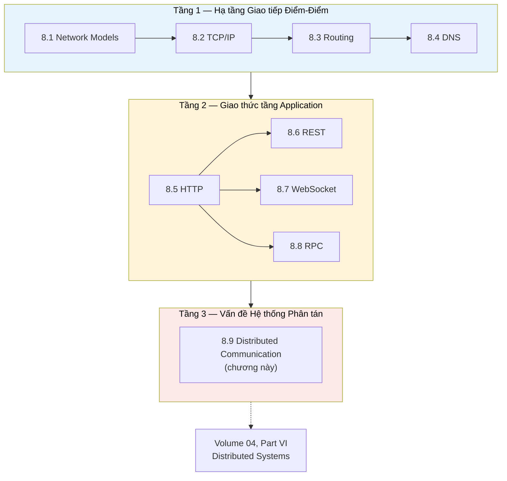

# MASTER COMPUTER SCIENCE HANDBOOK

## Volume 02 — Computer Science Foundations
### Part VIII — Computer Networks
## Chương 8.9 — Giao tiếp trong Hệ thống Phân tán
### (Distributed Communication)

---

### Thông tin chương

| Trường | Giá trị |
|---|---|
| Chương | 8.9 |
| Thuộc Part | VIII — Computer Networks (Chương cuối cùng) |
| Thuộc Volume | 02 — Computer Science Foundations |
| Thời gian đọc ước tính | 45–55 phút |
| Độ khó | ★★★★☆ |
| Kiến thức tiên quyết | Toàn bộ Chương 8.1 — 8.8 |
| Chương liên quan | Volume 04, Part VI — Distributed Systems (mở rộng đầy đủ Consensus, Replication, CAP Theorem chỉ được giới thiệu ở đây) |
| Từ khóa | partial failure, network partition, Fallacies of Distributed Computing, CAP Theorem, consensus, replication, eventual consistency |

---

### Mục tiêu học tập

Sau khi hoàn thành chương này, người đọc có thể:

- Tổng hợp và so sánh toàn diện ba mô hình giao tiếp tầng Application đã học: REST, WebSocket, và RPC.
- Lựa chọn đúng mô hình giao tiếp cho một bài toán thiết kế hệ thống cụ thể, dựa trên các tiêu chí đã học xuyên suốt Part VIII.
- Liệt kê và giải thích "Tám Ngộ nhận về Hệ thống Phân tán" (Fallacies of Distributed Computing).
- Phân biệt khái niệm Partial Failure và Network Partition, giải thích vì sao chúng là những vấn đề không thể giải quyết chỉ bằng giao thức mạng đơn thuần.
- Phát biểu chính xác định lý CAP và giải thích ý nghĩa của nó ở mức khái niệm.
- Nhận diện được ranh giới giữa kiến thức Computer Networks (Part VIII) và kiến thức Distributed Systems (Volume 04) — biết chính xác "mình đang đứng ở đâu" trong hành trình học tập.

---

### Câu hỏi khơi gợi

> *Trong suốt Part VIII, mỗi chương đều giải quyết trọn vẹn một vấn đề cụ thể: TCP đảm bảo tin cậy, DNS giải quyết định danh, REST/WebSocket/RPC giải quyết giao tiếp. Nhưng khi hàng trăm service, chạy trên hàng nghìn máy chủ khác nhau, cùng giao tiếp với nhau để hoàn thành một tác vụ duy nhất (ví dụ xử lý một đơn hàng thương mại điện tử), liệu việc mỗi giao thức riêng lẻ hoạt động đúng có đủ để đảm bảo toàn bộ hệ thống hoạt động đúng?*

---

## 1. Tổng quan chương

Đây là chương cuối cùng của Part VIII — không giới thiệu một giao thức mới, mà **tổng hợp** toàn bộ hành trình từ Chương 8.1 đến 8.8 thành một bức tranh thống nhất, đồng thời **mở ra** những câu hỏi mà Part VIII cố tình chưa trả lời, dành cho Volume 04.

Hành trình của Part VIII có thể tóm gọn thành ba tầng câu hỏi đã lần lượt được giải quyết:

```text
Tầng 1 — Hạ tầng: Làm sao hai máy giao tiếp tin cậy? (8.1 – 8.4)
Tầng 2 — Giao thức Application: Giao tiếp theo phong cách nào? (8.5 – 8.8)
Tầng 3 — Hệ thống: Nhiều máy, nhiều giao thức, phối hợp thế nào? (8.9 — chương này)
```

Điều quan trọng cần nhận thức rõ ràng khi khép lại Part VIII: **mọi kiến thức từ 8.1 đến 8.8 đều giả định một lời gọi mạng đơn lẻ, giữa đúng hai bên**. Chương này chỉ ra rằng khi số lượng bên tham gia tăng lên (nhiều service, nhiều server, nhiều bản sao dữ liệu), những vấn đề hoàn toàn mới xuất hiện — những vấn đề mà không một giao thức nào đã học có thể tự giải quyết. Đây chính là ranh giới tự nhiên giữa **Computer Networks** (Part VIII) và **Distributed Systems** (Volume 04).

> **💡 Insight**
> Nếu Chương 8.1 đến 8.8 dạy bạn cách xây dựng và sử dụng "đường dây điện thoại" một cách hoàn hảo — âm thanh rõ, không rớt cuộc gọi, nhiều kiểu gọi khác nhau (video call, tin nhắn, gọi hội nghị) — thì Chương 8.9 đặt ra câu hỏi tiếp theo: nếu một công ty có 1.000 nhân viên, mỗi người có một đường dây điện thoại hoàn hảo, làm sao đảm bảo họ luôn có **thông tin nhất quán** với nhau khi liên tục gọi điện qua lại, và điều gì xảy ra nếu một vài người đột nhiên mất liên lạc?

---

## 2. Bối cảnh lịch sử

| Thời điểm | Sự kiện | Ý nghĩa |
|---|---|---|
| Khoảng 1994 | L. Peter Deutsch (Sun Microsystems) đề xuất **bảy ngộ nhận** phổ biến của lập trình viên khi mới tiếp cận hệ thống phân tán | Đúc kết từ kinh nghiệm thực tế quan sát các lỗi thiết kế lặp đi lặp lại trong ngành công nghiệp |
| Khoảng 1997 | James Gosling (cha đẻ ngôn ngữ Java) bổ sung ngộ nhận thứ tám | Hoàn thiện danh sách **"Tám Ngộ nhận về Hệ thống Phân tán" (Fallacies of Distributed Computing)** — vẫn được trích dẫn rộng rãi trong ngành đến ngày nay (Mục 6) |
| Năm 2000 | Eric Brewer trình bày phỏng đoán (conjecture) sau này được biết đến rộng rãi với tên gọi **CAP Theorem**, tại một bài phát biểu ở hội nghị PODC (Symposium on Principles of Distributed Computing) | Đặt ra một giới hạn lý thuyết cơ bản cho mọi hệ thống lưu trữ dữ liệu phân tán (Mục 7) |
| Năm 2002 | Seth Gilbert và Nancy Lynch công bố chứng minh hình thức đầy đủ cho CAP Theorem | Chuyển phỏng đoán của Brewer thành một định lý được chứng minh chặt chẽ, củng cố vị trí của nó như một nguyên lý nền tảng trong thiết kế hệ phân tán |

Điều đáng chú ý: cả hai cột mốc quan trọng nhất của chương này — Fallacies of Distributed Computing và CAP Theorem — đều **không phải là những giao thức hay công cụ kỹ thuật cụ thể**, mà là những **quan sát và giới hạn lý thuyết mang tính nền tảng**. Đây là dấu hiệu rõ ràng cho thấy Chương 8.9 đã bước sang một loại kiến thức khác — không còn là "công cụ để dùng" (như TCP, HTTP), mà là "giới hạn cần thấu hiểu" trước khi bước vào Volume 04.

---

## 3. Động lực

Hãy hình dung bạn đã thành thạo toàn bộ Chương 8.1–8.8: bạn biết thiết kế REST API sạch sẽ (8.6), biết dùng WebSocket cho tính năng chat (8.7), biết dùng gRPC cho giao tiếp nội bộ hiệu năng cao (8.8). Bạn triển khai một hệ thống thương mại điện tử gồm `OrderService`, `InventoryService`, `PaymentService` — mỗi service giao tiếp bằng đúng giao thức phù hợp đã học.

Rồi một buổi tối, `OrderService` gọi RPC đến `PaymentService` để xác nhận thanh toán. Request được gửi đi thành công (Chương 8.2 xác nhận: TCP đã gửi đúng). Nhưng ngay sau khi `PaymentService` xử lý xong và trước khi gửi response về, **kết nối mạng giữa hai service bị gián đoạn** trong đúng nửa giây.

Câu hỏi đặt ra: **`OrderService` có nên coi giao dịch này là thất bại và thử lại (retry) hay không?**

- Nếu `PaymentService` **đã thực sự trừ tiền** trước khi mất kết nối, và `OrderService` retry, khách hàng bị trừ tiền **hai lần**.
- Nếu `PaymentService` **chưa kịp trừ tiền** khi mất kết nối, và `OrderService` không retry, đơn hàng bị **mất** dù khách hàng không hề bị trừ tiền.

Không một giao thức nào trong Chương 8.1–8.8 — dù được cài đặt hoàn hảo — có thể tự giải quyết vấn đề này, vì bản chất của vấn đề nằm ở **sự không chắc chắn cố hữu khi giao tiếp qua một mạng không hoàn hảo với nhiều bên tham gia**, không nằm ở lỗi cài đặt giao thức. Đây chính là lý do Part VIII phải khép lại bằng một chương thừa nhận rõ ràng: **còn rất nhiều vấn đề nữa, và chúng thuộc về một lĩnh vực khác — Distributed Systems.**

---

## 4. Trực giác

**Mô hình tinh thần (Mental Model) của chương này:**

> Nếu Chương 8.1–8.8 giống như học cách **lái một chiếc xe hoàn hảo** — động cơ tốt, phanh tốt, hệ thống định vị chính xác — thì Chương 8.9 giống như nhận ra rằng khi có **hàng nghìn chiếc xe hoàn hảo cùng lưu thông trên đường**, vấn đề không còn nằm ở chất lượng của từng chiếc xe nữa, mà nằm ở **luật giao thông, ùn tắc, tai nạn dây chuyền** — những vấn đề chỉ xuất hiện ở quy mô hệ thống, không thể giải quyết bằng cách cải thiện một chiếc xe đơn lẻ.

| Trực giác kỹ thuật bạn đã có | Khái niệm Distributed Communication tương ứng |
|---|---|
| Try-catch không phân biệt được "lỗi chắc chắn" và "không rõ đã xảy ra hay chưa" | Partial Failure — không có cách nào phân biệt "request chưa đến" và "request đã xử lý nhưng response bị mất" (Mục 3) |
| Retry logic mà không kiểm tra idempotency có thể gây tác dụng phụ (side effect) trùng lặp | Chính xác vấn đề đã nêu ở Chương 8.8, Mục 12, giờ được đặt vào bối cảnh hệ thống lớn hơn |
| Trade-off giữa tính nhất quán dữ liệu (strong consistency) và tốc độ phản hồi trong một cache phân tán | CAP Theorem (Mục 7) — sự đánh đổi này không phải một lựa chọn thiết kế tùy ý, mà là một **giới hạn toán học không thể vượt qua** |
| Distributed lock hoặc leader election trong một cluster (nếu đã từng nghe qua) | Consensus — bài toán làm sao nhiều máy đồng thuận về một giá trị chung, sẽ học đầy đủ ở Volume 04 |

---

## 5. Trực quan hóa khái niệm

**Hình 8.9.1 — Bản đồ Tổng hợp Part VIII: Ba Tầng Kiến thức**



| Trường thông tin | Nội dung |
|---|---|
| Mục đích | Trực quan hóa toàn bộ cấu trúc Part VIII như một hành trình leo thang trừu tượng — từ "hai máy nói chuyện được với nhau" (Tầng 1–2) đến "nhiều máy phối hợp đúng đắn" (Tầng 3) |
| Điểm mấu chốt | Mũi tên nét đứt từ Tầng 3 sang Volume 04 không phải ngẫu nhiên — nó thể hiện chính xác rằng chương này **kết thúc bằng câu hỏi mở**, không phải bằng lời giải, đúng tinh thần "giới thiệu khái niệm, chưa giải quyết" đã nêu trong mục tiêu chương |

---

**Hình 8.9.2 — Partial Failure: Vấn đề Cốt lõi không có Giao thức nào Giải quyết Triệt để**

```text
OrderService                                    PaymentService
     │                                                 │
     │────── RPC: charge($50) ─────────────────────▶  │
     │                                                 │  (xử lý: trừ tiền THÀNH CÔNG)
     │                                          ✂── mạng bị gián đoạn ──✂
     │◀───────────────── (không có response) ─────────│
     │
     │   OrderService KHÔNG THỂ biết:
     │   (A) PaymentService chưa nhận được request, HAY
     │   (B) PaymentService đã xử lý xong nhưng response bị mất
     │
     │   → Retry có thể gây trừ tiền HAI LẦN (nếu B)
     │   → Không retry có thể làm MẤT đơn hàng (nếu A)
```

*Mục đích:* Minh họa bằng đúng kịch bản đã nêu ở Mục 3 — điểm mấu chốt của toàn chương. *Điểm mấu chốt:* đây không phải lỗi cài đặt của TCP (Chương 8.2) hay RPC (Chương 8.8) — cả hai giao thức đều hoạt động "đúng như thiết kế". Vấn đề nằm ở **bản chất không thể tránh khỏi của giao tiếp qua mạng không hoàn hảo**, một giới hạn không giao thức nào có thể xóa bỏ hoàn toàn, chỉ có thể *quản lý* bằng các kỹ thuật ở tầng hệ thống (Volume 04).

---

## 6. Định nghĩa hình thức

> **📌 Remember — Tám Ngộ nhận về Hệ thống Phân tán (Fallacies of Distributed Computing)**
>
> Danh sách tám giả định sai lầm mà lập trình viên mới tiếp cận hệ phân tán thường vô tình mắc phải:

| # | Ngộ nhận | Thực tế |
|---|---|---|
| 1 | Mạng luôn đáng tin cậy | Gói tin có thể mất, hỏng, hoặc không bao giờ đến (Chương 8.2) |
| 2 | Độ trễ bằng không | RTT luôn tồn tại, và có thể biến động lớn (Chương 8.2, Mục 7) |
| 3 | Băng thông vô hạn | Băng thông luôn có giới hạn thực tế |
| 4 | Mạng luôn an toàn (bảo mật) | Cần cơ chế xác thực, mã hóa tường minh (TLS, Chương 8.5) |
| 5 | Cấu trúc mạng không đổi | Router, server có thể thêm/bớt/hỏng bất cứ lúc nào (Chương 8.3) |
| 6 | Chỉ có một quản trị viên | Hệ thống phân tán thực tế thường thuộc nhiều tổ chức khác nhau (như BGP giữa các AS, Chương 8.3) |
| 7 | Chi phí truyền tải bằng không | Mỗi byte truyền qua mạng đều có chi phí thực (băng thông, hạ tầng, Chương 8.1, Mục 7) |
| 8 | Mạng đồng nhất | Các phần khác nhau của hệ thống có thể dùng công nghệ, băng thông, độ trễ hoàn toàn khác nhau |

**Partial Failure (Lỗi cục bộ / Lỗi một phần)** — tình huống trong đó một phần của hệ thống phân tán gặp lỗi trong khi phần còn lại vẫn hoạt động bình thường, và **các bên khác không thể xác định chắc chắn phần nào đã lỗi, lỗi ở giai đoạn nào** (Hình 8.9.2).

**Network Partition (Phân mảnh mạng)** — tình huống mạng bị chia cắt thành hai hay nhiều nhóm máy không thể giao tiếp với nhau, dù mỗi nhóm vẫn hoạt động bình thường nội bộ.

---

## 7. Nền tảng toán học

Chương này khép lại bằng việc giới thiệu (không chứng minh đầy đủ) một trong những kết quả lý thuyết nền tảng và có ảnh hưởng nhất của hệ phân tán — nội dung sẽ được trình bày với đầy đủ chứng minh và hệ quả ở Volume 04.

> **📦 Formula Box — Định lý CAP (CAP Theorem)**
>
> $$\text{Một hệ thống lưu trữ dữ liệu phân tán chỉ có thể đảm bảo TỐI ĐA HAI trong BA tính chất sau, không thể đồng thời cả ba:}$$
>
> | Thành phần | Ý nghĩa |
> |---|---|
> | $C$ — Consistency (Tính nhất quán) | Mọi lượt đọc đều nhận được dữ liệu mới nhất đã ghi, hoặc một thông báo lỗi — không bao giờ trả về dữ liệu cũ |
> | $A$ — Availability (Tính sẵn sàng) | Mọi request đều nhận được một phản hồi (không phải lỗi), dù có thể không phải dữ liệu mới nhất |
> | $P$ — Partition Tolerance (Chịu lỗi phân mảnh) | Hệ thống tiếp tục hoạt động dù xảy ra Network Partition (Mục 6) giữa các node |
> | **Diễn giải kỹ thuật** | Vì mạng thực tế **luôn có khả năng** xảy ra Network Partition (Mục 6, Ngộ nhận số 1 và 5 ở Mục 6), Partition Tolerance gần như luôn là yêu cầu bắt buộc — do đó lựa chọn thực tế của kỹ sư hệ thống thường thu hẹp còn: **ưu tiên Consistency hay ưu tiên Availability** khi Partition thực sự xảy ra |
> | **Ứng dụng thường gặp** | Giải thích tại sao có những hệ cơ sở dữ liệu ưu tiên "CP" (như nhiều hệ thống cấu hình phân tán, chấp nhận từ chối phục vụ để đảm bảo dữ liệu luôn đúng), và những hệ khác ưu tiên "AP" (như nhiều hệ thống mạng xã hội quy mô lớn, chấp nhận hiển thị dữ liệu tạm thời chưa đồng bộ hoàn toàn để luôn phản hồi nhanh) |

**Điều quan trọng cần nhấn mạnh khi khép lại chương này:** CAP Theorem **không** nói rằng phải "chọn 2 trong 3 mãi mãi" theo nghĩa tĩnh — nó nói về hành vi của hệ thống **tại thời điểm xảy ra Partition**. Việc hiểu đúng, áp dụng đúng, và các mô hình nhất quán tinh vi hơn (như eventual consistency, được giới thiệu ngắn gọn ở Mục 12) là nội dung đầy đủ của Volume 04, Part VI — chương này chỉ có nhiệm vụ **đặt đúng câu hỏi**, chuẩn bị nền tảng khái niệm.

---

## 8. Thuật toán / Cơ chế

**Quy trình Lựa chọn Mô hình Giao tiếp** — tổng hợp toàn bộ kiến thức Chương 8.5–8.8 thành một quy trình quyết định thực dụng:

```text
Bước 1 — Đối tượng giao tiếp là ai?
        │
        ├─ Trình duyệt / bên thứ ba bên ngoài, cần API công khai, dễ đọc
        │  → Cân nhắc REST (Chương 8.6)
        │
        └─ Service nội bộ, cùng đội kỹ thuật kiểm soát cả hai đầu
           → Tiếp tục Bước 2
        ▼
Bước 2 — (Nếu nội bộ) Có cần hiệu năng cực cao, tần suất gọi lớn không?
        │
        ├─ Có → Cân nhắc RPC/gRPC (Chương 8.8)
        └─ Không đặc biệt quan trọng → REST vẫn là lựa chọn đơn giản, đủ dùng
        ▼
Bước 3 — Có cần Server chủ động đẩy dữ liệu, không chờ Client hỏi không?
        │
        ├─ Có, và cần hai chiều → WebSocket (Chương 8.7)
        ├─ Có, nhưng chỉ cần một chiều (Server → Client) → Server-Sent Events
        │  (Chương 8.7, Mục 15)
        └─ Không → REST hoặc RPC theo Bước 1–2 là đủ
        ▼
Bước 4 — Với MỌI lựa chọn ở trên: bổ sung xử lý cho
        │     Partial Failure và Fallacies of Distributed Computing (Mục 6)
        │     KHÔNG có giao thức nào tự động miễn nhiễm với những vấn đề này
```

> **⚠️ Common Mistake**
> Lỗi tư duy phổ biến nhất khi khép lại Part VIII là nghĩ rằng "chọn đúng giao thức" đồng nghĩa với "hệ thống sẽ hoạt động đúng". Trên thực tế, như Hình 8.9.2 đã minh họa, **Bước 4 luôn cần thiết cho mọi lựa chọn ở Bước 1–3** — dù dùng REST, WebSocket, hay RPC, hệ thống vẫn phải đối mặt với Partial Failure, Network Partition, và các ngộ nhận đã liệt kê ở Mục 6. Việc chọn đúng giao thức chỉ giải quyết "giao tiếp diễn ra như thế nào khi mọi thứ suôn sẻ" — không giải quyết "điều gì xảy ra khi có sự cố", vốn là nội dung của Volume 04.

---

## 9. Triển khai

```python
from enum import Enum


class CommunicationStyle(Enum):
    REST = "REST"
    WEBSOCKET = "WebSocket"
    RPC = "RPC (gRPC)"
    SSE = "Server-Sent Events"


def recommend_protocol(is_external: bool, needs_high_performance: bool,
                        needs_server_push: bool, needs_bidirectional: bool) -> CommunicationStyle:
    """Cài đặt trực tiếp quy trình quyết định ở Mục 8."""
    # Bước 3 — kiểm tra nhu cầu server push trước, vì nó có thể ghi đè
    # lựa chọn mặc định dù là API nội bộ hay bên ngoài
    if needs_server_push:
        return CommunicationStyle.WEBSOCKET if needs_bidirectional else CommunicationStyle.SSE

    # Bước 1 — đối tượng giao tiếp
    if is_external:
        return CommunicationStyle.REST

    # Bước 2 — nội bộ, xét đến hiệu năng
    return CommunicationStyle.RPC if needs_high_performance else CommunicationStyle.REST


class UnreliableRPCCall:
    """Mô phỏng chính xác vấn đề Partial Failure ở Hình 8.9.2:
    kết quả có thể là SUCCESS, FAILURE, hoặc UNKNOWN — và UNKNOWN
    là trường hợp nguy hiểm nhất vì không thể quyết định retry an toàn."""

    def __init__(self, outcome: str):
        assert outcome in ("SUCCESS", "FAILURE", "UNKNOWN")
        self.outcome = outcome

    def call(self, action: str) -> str:
        if self.outcome == "SUCCESS":
            return f"'{action}' đã hoàn tất, response nhận đầy đủ."
        elif self.outcome == "FAILURE":
            return f"'{action}' chắc chắn THẤT BẠI trước khi tới server — an toàn để retry."
        else:
            return (f"'{action}': KHÔNG RÕ đã xử lý ở server hay chưa "
                    f"(response bị mất trên đường về) — retry có thể gây trùng lặp!")
```

Chạy thử với cả ba kịch bản, minh họa trực tiếp vấn đề đã nêu ở Mục 3:

```python
# Kiểm chứng quy trình lựa chọn giao thức (Mục 8)
print(recommend_protocol(is_external=True, needs_high_performance=False,
                          needs_server_push=False, needs_bidirectional=False))
print(recommend_protocol(is_external=False, needs_high_performance=True,
                          needs_server_push=False, needs_bidirectional=False))
print(recommend_protocol(is_external=False, needs_high_performance=False,
                          needs_server_push=True, needs_bidirectional=True))
print(recommend_protocol(is_external=False, needs_high_performance=False,
                          needs_server_push=True, needs_bidirectional=False))
print("---")

# Minh họa ba khả năng của một lời gọi RPC không may mắn (Hình 8.9.2)
for outcome in ("SUCCESS", "FAILURE", "UNKNOWN"):
    call = UnreliableRPCCall(outcome)
    print(call.call("charge($50)"))
```

---

## 10. Trực quan hóa quá trình thực thi

**Kết quả chạy thực tế** của đoạn code Mục 9:

```text
CommunicationStyle.REST
CommunicationStyle.RPC (gRPC)
CommunicationStyle.WEBSOCKET
CommunicationStyle.SSE
---
'charge($50)' đã hoàn tất, response nhận đầy đủ.
'charge($50)' chắc chắn THẤT BẠI trước khi tới server — an toàn để retry.
'charge($50)': KHÔNG RÕ đã xử lý ở server hay chưa (response bị mất trên đường về) — retry có thể gây trùng lặp!
```

**Bảng tổng hợp xác suất các kịch bản Partial Failure**, minh họa bằng số tại sao đây là vấn đề không thể "code cho hết":

| Kịch bản | Client biết chắc chắn? | Hành động an toàn |
|---|---|---|
| Request thất bại trước khi rời client | Có | Retry tự do |
| Request đến server, xử lý thành công, response về đầy đủ | Có | Không cần retry |
| Request đến server, xử lý thành công, **response bị mất** | **Không** | Cần cơ chế idempotency (Chương 8.6, Mục 6) hoặc giao thức xác nhận bổ sung — không thể chỉ dựa vào retry đơn thuần |
| Request chưa từng đến server (mất trên đường đi) | Không (từ góc nhìn client, giống hệt dòng trên) | Giống dòng trên — client **không phân biệt được** hai trường hợp cuối |

Dòng thứ ba và thứ tư trong bảng trên — nhìn giống hệt nhau từ phía client — chính là bản chất toán học của vấn đề Partial Failure: **hai nguyên nhân hoàn toàn khác nhau tạo ra cùng một triệu chứng quan sát được** (không nhận được response), khiến không có cách nào để client tự phân biệt bằng logic cục bộ.

---

## 11. Ứng dụng công nghiệp

> **🛠 Engineering Practice**
> Các hệ thống backend quy mô lớn trong thực tế hầu như luôn kết hợp nhiều mô hình giao tiếp đã học trong Part VIII, thay vì chỉ dùng một mô hình duy nhất cho toàn bộ hệ thống.

| Bối cảnh công nghiệp | Sự kết hợp các mô hình giao tiếp |
|---|---|
| Ứng dụng thương mại điện tử điển hình | REST (Chương 8.6) cho API công khai (danh sách sản phẩm, giỏ hàng) + WebSocket (Chương 8.7) cho thông báo đơn hàng thời gian thực + gRPC (Chương 8.8) cho giao tiếp nội bộ giữa `OrderService`, `InventoryService`, `PaymentService` |
| Cơ chế Idempotency Key trong API thanh toán thực tế | Giải pháp thực dụng cho chính vấn đề Partial Failure ở Mục 3: client tự sinh một khóa định danh duy nhất cho mỗi giao dịch, gửi kèm mọi lần retry — server dùng khóa đó để nhận diện và bỏ qua các lần gọi trùng lặp, biến một thao tác vốn không idempotent (như tạo giao dịch) thành idempotent trên thực tế |
| Circuit Breaker Pattern | Một kỹ thuật kỹ thuật phần mềm phổ biến để "ngắt mạch" tạm thời khi một service liên tục gặp Partial Failure, tránh làm quá tải service đang gặp sự cố — sẽ được trình bày đầy đủ hơn ở Volume 04 |
| Message Queue (RabbitMQ, Kafka) | Một mô hình giao tiếp **thứ tư**, chưa được Part VIII trình bày chi tiết — giao tiếp bất đồng bộ, qua trung gian, giúp giảm thiểu (nhưng không loại bỏ hoàn toàn) một số vấn đề Partial Failure bằng cách đảm bảo thông điệp được lưu trữ bền vững cho đến khi được xử lý — chủ đề này thuộc phạm vi Volume 04 |

---

## 12. Góc nhìn nghiên cứu

> **🔬 Research Connection**
> Chương này chỉ mở cửa, không bước vào — nhưng cánh cửa đó dẫn đến một trong những lĩnh vực nghiên cứu sôi động và quan trọng nhất của Computer Science hiện đại: **Distributed Systems**.

**Consensus (Đồng thuận):** làm sao nhiều máy tính, một số trong đó có thể gặp lỗi hoặc mất kết nối bất cứ lúc nào, cùng đồng thuận về **một giá trị chung duy nhất** (ví dụ: ai là leader, giao dịch nào xảy ra trước)? Đây là bài toán nền tảng của mọi hệ thống phân tán đáng tin cậy, với các thuật toán kinh điển như **Paxos** (Leslie Lamport, đã đề cập ở SCIENTISTS.md) và **Raft** (thiết kế sau này, hướng tới dễ hiểu hơn Paxos) — được trình bày đầy đủ ở Volume 04, Part VI.

**Replication (Nhân bản dữ liệu):** làm sao lưu trữ nhiều bản sao của cùng một dữ liệu trên nhiều máy khác nhau (để tăng độ sẵn sàng và hiệu năng đọc), trong khi vẫn xử lý đúng đắn vấn đề Consistency đã nêu ở CAP Theorem (Mục 7)?

**Eventual Consistency (Nhất quán cuối cùng):** một mô hình nhất quán "yếu hơn" Consistency chặt chẽ của CAP Theorem — chấp nhận rằng các bản sao dữ liệu có thể tạm thời không khớp nhau, nhưng đảm bảo chúng sẽ **hội tụ về cùng một giá trị** nếu không có thêm cập nhật mới. Đây là lựa chọn thực tế phổ biến của nhiều hệ thống ưu tiên Availability (nhánh "AP" của CAP Theorem, Mục 7).

**Câu hỏi mở** để suy ngẫm, khép lại toàn bộ Part VIII: nếu Tám Ngộ nhận về Hệ thống Phân tân (Mục 6) đã được biết đến từ giữa thập niên 1990, và CAP Theorem đã được chứng minh từ năm 2002, tại sao các hệ thống phân tán hiện đại — dù có nhiều công cụ, framework, và kinh nghiệm tích lũy hơn bao giờ hết — vẫn thường xuyên gặp sự cố liên quan đến chính những vấn đề đã được cảnh báo từ hàng chục năm trước? Đây là câu hỏi sẽ đồng hành cùng người đọc trong suốt Volume 04.

---

## 13. Ưu điểm

- **Nhận thức đúng về giới hạn** là bước đầu tiên và quan trọng nhất để thiết kế hệ thống phân tán an toàn — biết trước một vấn đề luôn tốt hơn phát hiện nó qua sự cố thực tế trong production.
- **Các mẫu thiết kế thực dụng** (Idempotency Key, Circuit Breaker, Mục 11) đã được ngành công nghiệp phát triển để *quản lý* (không xóa bỏ hoàn toàn được) các vấn đề đã nêu.
- **CAP Theorem cung cấp một khung tư duy rõ ràng** để đưa ra quyết định kiến trúc có ý thức (ưu tiên Consistency hay Availability), thay vì "đoán mò" hoặc không nhận ra mình đang đánh đổi điều gì.

---

## 14. Hạn chế

- **Không có giải pháp "hoàn hảo":** như CAP Theorem chỉ ra, đây là những giới hạn toán học, không phải vấn đề kỹ thuật có thể giải quyết triệt để bằng cách viết code tốt hơn.
- **Độ phức tạp tăng vọt** khi hệ thống chuyển từ "hai máy giao tiếp" sang "hệ thống phân tán quy mô lớn" — nhiều đội kỹ thuật đánh giá thấp độ phức tạp này cho đến khi gặp sự cố thực tế.
- **Kiến thức Part VIII, dù đầy đủ cho giao tiếp điểm-điểm, là không đủ** để tự thiết kế một hệ thống phân tán đáng tin cậy — đây là lý do Volume 04 tồn tại như một volume riêng biệt, không chỉ là phần mở rộng của Part VIII.

---

## 15. So sánh

**Bảng 8.9.1 — Tổng hợp Toàn diện: REST vs WebSocket vs RPC**

| Tiêu chí | REST (8.6) | WebSocket (8.7) | RPC / gRPC (8.8) |
|---|---|---|---|
| Mô hình giao tiếp | Request-Response | Full-duplex liên tục | Request-Response (hoặc streaming với gRPC) |
| Ai chủ động | Chỉ Client | Cả hai bên | Chỉ Client (caller) |
| Đơn vị thiết kế | Tài nguyên (resource) | Kênh dữ liệu (channel) | Hành động (procedure) |
| Định dạng dữ liệu | Thường JSON (văn bản) | Tùy ứng dụng (thường JSON hoặc binary) | Thường nhị phân (Protocol Buffers) |
| Khả năng cache HTTP | Tốt | Không áp dụng | Kém |
| Độ trễ | Trung bình (mỗi request là một giao dịch riêng) | Thấp (kết nối luôn mở) | Thấp (đặc biệt với HTTP/2) |
| Phù hợp nhất | API công khai, CRUD | Chat, thông báo, dashboard thời gian thực | Giao tiếp nội bộ hiệu năng cao |
| Đối tượng sử dụng chính | Con người + máy | Máy (qua giao diện người dùng) | Máy với máy |
| **Vẫn cần xử lý Partial Failure?** | **Có** | **Có** | **Có** |

**Phân tích:** Dòng cuối cùng của bảng trên là thông điệp cốt lõi của toàn bộ chương: **không có lựa chọn nào trong ba mô hình được miễn trừ khỏi những vấn đề đã nêu ở Mục 3–7**. Sự khác biệt giữa ba mô hình nằm ở *cách chúng phù hợp với các yêu cầu chức năng khác nhau* (Mục 8) — không nằm ở việc mô hình nào "an toàn hơn" trước Partial Failure hay Network Partition. Đây là lý do Volume 04 áp dụng cho cả ba mô hình như nhau, không phải một chủ đề gắn riêng với một giao thức cụ thể.

---

## 16. Tóm tắt

- Part VIII đã xây dựng kiến thức theo ba tầng: **hạ tầng giao tiếp điểm-điểm** (8.1–8.4) → **giao thức tầng Application** (8.5–8.8) → **vấn đề hệ thống phân tán** (8.9, chương này).
- **Tám Ngộ nhận về Hệ thống Phân tán** (Deutsch 1994, Gosling 1997) liệt kê những giả định sai lầm phổ biến khi thiết kế hệ thống nhiều máy giao tiếp qua mạng.
- **Partial Failure** — sự không chắc chắn cố hữu khi không thể phân biệt "request chưa đến" và "response bị mất sau khi xử lý thành công" — là vấn đề không thể giải quyết triệt để bằng bất kỳ giao thức đơn lẻ nào.
- **CAP Theorem** (Brewer 2000, chứng minh bởi Gilbert & Lynch 2002) khẳng định một hệ thống phân tán không thể đồng thời đảm bảo cả Consistency, Availability, và Partition Tolerance.
- REST, WebSocket, và RPC — dù phục vụ các mục đích khác nhau — **đều bình đẳng trước những giới hạn này**, không mô hình nào miễn nhiễm.
- Đây là ranh giới tự nhiên giữa Computer Networks (Part VIII, khép lại ở đây) và Distributed Systems (Volume 04, nơi Consensus, Replication, và Eventual Consistency được trình bày đầy đủ).

Với Chương 8.9, Part VIII — Computer Networks chính thức khép lại. Người đọc đã có đầy đủ nền tảng để tiếp tục với Part IX — Theory of Computation, đồng thời đã được trang bị đúng những câu hỏi (dù chưa có lời giải đầy đủ) để bước vào Volume 04 khi thời điểm thích hợp.

---

## 17. Bài tập

### Mức Cơ bản (Basic)

1. Liệt kê lại từ trí nhớ ít nhất năm trong Tám Ngộ nhận về Hệ thống Phân tán (Mục 6), kèm ví dụ thực tế minh họa cho mỗi ngộ nhận.
2. Giải thích bằng lời sự khác biệt giữa Partial Failure và một lỗi thông thường (như lỗi logic trong code) mà một lập trình viên gặp hằng ngày.
3. Phát biểu lại định lý CAP bằng ngôn ngữ của riêng bạn, không cần dùng ký hiệu toán học.

### Mức Trung bình (Intermediate)

4. Dùng quy trình quyết định ở Mục 8, xác định mô hình giao tiếp phù hợp nhất cho: (a) API cho ứng dụng di động xem menu nhà hàng; (b) đồng bộ vị trí con trỏ chuột giữa nhiều người dùng trong một công cụ thiết kế cộng tác; (c) giao tiếp giữa `AuthService` và `UserService` nội bộ với tần suất 50.000 request/giây.
5. Giải thích bằng ví dụ cụ thể (không cần code) cách Idempotency Key (Mục 11) giải quyết vấn đề Partial Failure đã nêu ở Mục 3, dù bản thân thao tác "tạo giao dịch" vốn không idempotent.

### Mức Nâng cao (Advanced)

6. Mở rộng `UnreliableRPCCall` ở Mục 9 để cài đặt cơ chế Idempotency Key: một lớp `IdempotentPaymentService` lưu lại các giao dịch đã xử lý theo khóa, và nếu nhận request với khóa đã tồn tại, trả về kết quả cũ thay vì xử lý lại — mô phỏng chính giải pháp đã nêu ở Mục 11.
7. Với hệ thống ở Câu 4(c) (giao tiếp nội bộ 50.000 request/giây), thảo luận: nếu `UserService` cần đảm bảo tính nhất quán tuyệt đối (Strong Consistency) của dữ liệu người dùng trên nhiều bản sao, điều gì sẽ xảy ra với Availability của hệ thống khi có Network Partition, theo đúng phát biểu của CAP Theorem?

### Mức Nghiên cứu (Research)

8. Đọc thêm về sự khác biệt giữa Paxos và Raft (Mục 12) và trình bày bằng lời: tại sao Raft được thiết kế với mục tiêu ưu tiên "dễ hiểu" (understandability) như một tiêu chí thiết kế chính thức, ngang hàng với tính đúng đắn — một cách tiếp cận khác thường so với phần lớn thuật toán phân tán trước đó. Đây là câu hỏi mở-kết-thúc, chuẩn bị kiến thức nền trực tiếp cho Volume 04, Part VI.

---

## 18. Dự án tích hợp toàn Part VIII

**Dự án: Hệ thống Chat Đơn giản — Kết hợp REST và WebSocket**

Đây là dự án tích hợp, tổng hợp kiến thức từ toàn bộ Part VIII, tương ứng với "Integrated Mini Project" theo `PART_TEMPLATE.md`.

- **Mục tiêu:** Xây dựng một ứng dụng chat tối giản, sử dụng đúng hai mô hình giao tiếp phù hợp nhất cho từng phần chức năng — REST cho phần quản lý dữ liệu bền vững, WebSocket cho phần giao tiếp thời gian thực.
- **Yêu cầu:**
  - **Phần REST** (Chương 8.5–8.6): API quản lý `rooms` và `users` — tạo phòng chat mới (`POST /rooms`), lấy lịch sử tin nhắn (`GET /rooms/{id}/messages`), đúng nguyên tắc thiết kế URI và status code đã học.
  - **Phần WebSocket** (Chương 8.7): kênh giao tiếp thời gian thực để gửi/nhận tin nhắn mới trong một phòng chat cụ thể, tận dụng cơ chế broadcast đã xây dựng ở Chương 8.7, Mục 18.
  - **Xử lý Partial Failure cơ bản** (Chương 8.9): mỗi tin nhắn gửi qua WebSocket cần kèm một ID duy nhất (tương tự Idempotency Key, Mục 11) để tránh hiển thị trùng lặp nếu client gửi lại do nghi ngờ mất kết nối.
  - Tích hợp toàn bộ các lớp mô phỏng đã xây dựng xuyên suốt Part VIII: `HTTPServer` (8.5), `RESTResource` (8.6), `WebSocketConnection`/`ChatRoom` (8.7).
- **Công nghệ đề xuất:** Python thuần, kết hợp các lớp mô phỏng đã xây dựng ở các chương trước — không bắt buộc dùng thư viện mạng thực sự, mục tiêu là củng cố đúng kiến trúc và luồng dữ liệu.
- **Mở rộng (tùy chọn):** Mô phỏng một trường hợp Network Partition (Mục 6) — client mất kết nối WebSocket giữa chừng, và khi kết nối lại, cần gọi REST API (`GET /rooms/{id}/messages`) để đồng bộ lại các tin nhắn đã bị bỏ lỡ trong lúc mất kết nối — một minh họa thực tế sinh động cho cách hai mô hình giao tiếp bổ trợ lẫn nhau khi xử lý sự cố.

---

## 19. Tự đánh giá

- [ ] Tôi có thể liệt kê đầy đủ Tám Ngộ nhận về Hệ thống Phân tán và giải thích từng ngộ nhận bằng ví dụ riêng.
- [ ] Tôi hiểu rõ và có thể giải thích chính xác vấn đề Partial Failure, phân biệt được với lỗi logic thông thường.
- [ ] Tôi có thể phát biểu chính xác định lý CAP và giải thích ý nghĩa thực tế của việc "chọn 2 trong 3".
- [ ] Tôi có thể tự tổng hợp và so sánh REST, WebSocket, RPC trên nhiều tiêu chí khác nhau mà không cần xem lại tài liệu.
- [ ] Tôi hiểu rõ ranh giới giữa kiến thức Computer Networks (Part VIII, đã hoàn thành) và Distributed Systems (Volume 04, phía trước) — biết chính xác những gì mình đã học và những gì còn đang chờ được học.

Nếu bạn đã hoàn thành đầy đủ checklist tự đánh giá của cả chín chương trong Part VIII (8.1–8.9), bạn đã sẵn sàng để tiếp tục hành trình sang **Part IX — Theory of Computation**, đồng thời đã có đủ nền tảng khái niệm cần thiết để, ở giai đoạn phù hợp của hành trình học tập, tiếp cận **Volume 04 — Data Engineering and Computer Systems**.

---

## 20. Đọc thêm

- **Bài viết gốc:** Rotem-Gal-Oz, A. *Fallacies of Distributed Computing Explained* — một bài viết phổ biến, giải thích chi tiết từng ngộ nhận trong danh sách gốc của Deutsch và Gosling (Mục 2, Mục 6).
- **Bài báo nền tảng:** Gilbert, S., Lynch, N. (2002). *Brewer's Conjecture and the Feasibility of Consistent, Available, Partition-Tolerant Web Services* — chứng minh hình thức đầy đủ của CAP Theorem.
- **Sách:** Kleppmann, M., *Designing Data-Intensive Applications* — tài liệu tham khảo toàn diện nhất cho các chủ đề được giới thiệu (nhưng chưa đi sâu) ở chương này: Consensus, Replication, Consistency Models. *(Xem BOOKS.md — liên quan trực tiếp Volume 04, Volume 07.)*
- **Chương/Volume tiếp theo:** Volume 02, Part IX — Theory of Computation; và (ở giai đoạn phù hợp) Volume 04, Part VI — Distributed Systems.

---

### Liên kết chương (Cross References)

- **Chương trước:** 8.8 — RPC (mô hình giao tiếp cuối cùng được tổng hợp vào bức tranh chung ở chương này).
- **Chương/Part tiếp theo:** Volume 02, Part IX — Theory of Computation (Part tiếp theo của Volume 02); Volume 04, Part VI — Distributed Systems (nơi Consensus, Replication, CAP Theorem được trình bày đầy đủ).
- **Chương liên quan xa hơn:** Toàn bộ Chương 8.1–8.8 (chương này là điểm tổng hợp trực tiếp của cả Part VIII).
- **Vị trí trong Knowledge Graph:** Nút cuối cùng và là nút tổng hợp (synthesis node) của Part VIII — không giới thiệu khái niệm hoàn toàn mới thuộc phạm vi Volume 02, mà kết nối toàn bộ Part VIII với Volume 04, đúng vai trò một "cầu nối liên-volume" hiếm có trong cấu trúc Handbook.

---

*Hết Chương 8.9 — chương cuối cùng của Part VIII. Chương này tuân thủ đầy đủ cấu trúc 20 mục của `OUTPUT.md` và chuẩn Presentation Layer, khớp với outline Part VIII đã được duyệt, bao gồm Dự án tích hợp toàn Part theo đúng `PART_TEMPLATE.md`. Mọi kết quả mô phỏng ở Mục 9–10 đều được kiểm chứng bằng code Python chạy thực tế. Part VIII — Computer Networks chính thức hoàn thành, sẵn sàng cho bước rà soát tổng thể trước khi chuyển sang Part IX.*
