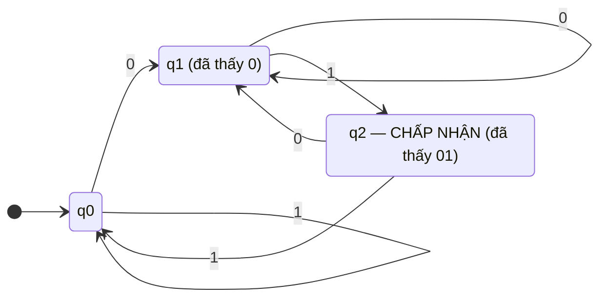

# MASTER COMPUTER SCIENCE HANDBOOK

## Volume 02 — Computer Science Foundations
### Part IX — Theory of Computation
## Chương 9.1 — Automat Hữu hạn
### (Finite Automata)

---

### Thông tin chương

| Trường | Giá trị |
|---|---|
| Chương | 9.1 |
| Thuộc Part | IX — Theory of Computation |
| Thuộc Volume | 02 — Computer Science Foundations |
| Thời gian đọc ước tính | 50–60 phút |
| Độ khó | ★★☆☆☆ |
| Kiến thức tiên quyết | Volume 1, Chương 1.5 — Set Theory (quan hệ, hàm số); Volume 1, Chương 1.4 — Proof Techniques (quy nạp, phản chứng); Volume 2, Part IV — Data Structures (đồ thị có hướng) |
| Chương liên quan | 9.2 — Regular Languages and Regular Expressions (ngôn ngữ mà DFA nhận diện được sẽ được hình thức hóa thành một lớp ngôn ngữ); Volume 1, Chương 1.1 — giới thiệu sơ lược về Alan Turing và giới hạn của tính toán |
| Từ khóa | finite automaton, DFA, NFA, state, transition function, subset construction, state minimization, language recognition |

---

### Mục tiêu học tập

Sau khi hoàn thành chương này, người đọc có thể:

- Định nghĩa hình thức một Automat hữu hạn đơn định (DFA) và Automat hữu hạn không đơn định (NFA) bằng bộ 5 thành phần $(Q, \Sigma, \delta, q_0, F)$.
- Mô phỏng tay quá trình một DFA/NFA xử lý một chuỗi đầu vào, xác định chuỗi đó được **chấp nhận (accept)** hay **từ chối (reject)**.
- Áp dụng thuật toán **Subset Construction** để chuyển đổi một NFA bất kỳ thành một DFA tương đương, và giải thích vì sao phép chuyển đổi này luôn tồn tại.
- Giải thích trực giác của thuật toán **thu gọn trạng thái (state minimization)** và vì sao một DFA tối giản là duy nhất (up to đổi tên trạng thái).
- Liên hệ mô hình Automat hữu hạn với các hệ thống kỹ thuật quen thuộc: regex engine, state machine trong lập trình, giao thức mạng.

---

### Câu hỏi khơi gợi

> *Khi bạn viết một biểu thức chính quy (regular expression) như `^[a-z]+@[a-z]+\.[a-z]{2,}$` để kiểm tra định dạng email, bạn có bao giờ tự hỏi: engine regex bên dưới thực sự "chạy" như thế nào? Nó không hề thử từng khả năng một cách ngẫu nhiên — nó vận hành theo một mô hình toán học được hình thức hóa từ những năm 1950, và mô hình đó chính là chủ đề của chương này.*

---

## 1. Tổng quan chương

Volume 2 đã dẫn dắt người đọc từ tư duy tính toán (Computational Thinking), qua cách máy tính biểu diễn dữ liệu, các mô hình lập trình, cấu trúc dữ liệu, kiến trúc máy tính, hệ điều hành, cơ sở dữ liệu, cho đến mạng máy tính. Toàn bộ hành trình đó trả lời câu hỏi **"phần mềm hoạt động như thế nào?"**.

Part IX chuyển hướng sang một câu hỏi sâu hơn và trừu tượng hơn: **"tính toán, về bản chất, là gì — và đâu là giới hạn của nó?"**. Đây là lĩnh vực **Lý thuyết Tính toán (Theory of Computation)**, và chương này — chương đầu tiên của Part IX — bắt đầu từ mô hình tính toán đơn giản nhất còn hữu ích: **Automat hữu hạn (Finite Automaton)**.

Một automat hữu hạn là một cỗ máy trừu tượng chỉ có một lượng **bộ nhớ hữu hạn và cố định** — nó không có băng giấy vô hạn hay ngăn xếp như các mô hình mạnh hơn sẽ xuất hiện ở Chương 9.3–9.5. Chính sự đơn giản này khiến nó vừa dễ phân tích bằng toán học, vừa là mô hình được cài đặt trong hàng triệu hệ thống thực tế mỗi ngày, từ bộ lọc regex đến bộ điều khiển giao thức mạng.

> **💡 Insight**
> Nếu Chương 1.5 (Volume 1) dạy bạn tập hợp là "vật liệu xây dựng" của toán học, thì automat hữu hạn là "vật liệu xây dựng" đầu tiên của Lý thuyết Tính toán — mọi mô hình mạnh hơn trong Part IX (PDA, Turing Machine) đều được xây dựng bằng cách **thêm bộ nhớ** vào chính mô hình automat hữu hạn này.

---

## 2. Bối cảnh lịch sử

| Thời điểm | Nhân vật / Sự kiện | Đóng góp |
|---|---|---|
| 1943 | Warren McCulloch, Walter Pitts | Mô hình mạng nơ-ron nhị phân đơn giản — tiền thân toán học sớm nhất của khái niệm "trạng thái hữu hạn" |
| 1951–1956 | Stephen Kleene | Hình thức hóa khái niệm **biến cố chính quy (regular events)**, đặt nền móng cho mối liên hệ giữa automat và biểu thức chính quy (sẽ học đầy đủ ở Chương 9.2) |
| 1956 | George H. Mealy | Mô hình Mealy Machine — automat hữu hạn có đầu ra gắn với *transition*, dùng rộng rãi trong thiết kế mạch số |
| 1959 | Edward F. Moore | Mô hình Moore Machine — automat hữu hạn có đầu ra gắn với *trạng thái*; cùng Mealy Machine đặt nền tảng cho thiết kế mạch tuần tự (sequential circuit) trong Computer Architecture |
| 1959 | Michael O. Rabin, Dana Scott | Bài báo *"Finite Automata and Their Decision Problems"* — chứng minh chính thức **NFA và DFA tương đương về khả năng nhận diện ngôn ngữ**, đưa ra thuật toán Subset Construction (Mục 8). Cả hai đoạt giải Turing Award năm 1976 |

Điều thú vị là automat hữu hạn ra đời gần như song song với những nghiên cứu đầu tiên về mạng nơ-ron sinh học (McCulloch–Pitts) — một sợi dây lịch sử kết nối bất ngờ giữa lý thuyết tính toán thuần túy và khoa học thần kinh, hai lĩnh vực tưởng chừng không liên quan.

---

## 3. Động lực

Hãy xét ba tình huống kỹ thuật quen thuộc:

- **Kiểm tra chuỗi nhị phân có kết thúc bằng `"01"` hay không.** Bạn không cần lưu lại toàn bộ chuỗi đã đọc — chỉ cần nhớ "hai ký tự gần nhất là gì". Đây chính xác là những gì một automat hữu hạn làm: **bộ nhớ hữu hạn, không phụ thuộc độ dài đầu vào**.
- **Bộ điều khiển trạng thái kết nối TCP** (`CLOSED → SYN_SENT → ESTABLISHED → FIN_WAIT → CLOSED`) — một tập hữu hạn các trạng thái, chuyển đổi dựa trên sự kiện đến (gói tin SYN, ACK, FIN...).
- **Trình phân tích từ vựng (lexer) của một trình biên dịch**, nhận diện token như số nguyên, định danh, từ khóa — mỗi loại token được nhận diện bởi một automat hữu hạn riêng.

Điểm chung của cả ba: **quyết định tiếp theo chỉ phụ thuộc vào trạng thái hiện tại, không phụ thuộc vào toàn bộ lịch sử đã qua**. Đây là tính chất cốt lõi — gọi là tính chất Markov của automat — mà chương này sẽ hình thức hóa.

---

## 4. Trực giác

**Mô hình tinh thần (Mental Model):**

> Một automat hữu hạn giống như một **trò chơi board game đơn giản**: bạn có một quân cờ đứng trên một trong số hữu hạn các ô (trạng thái). Mỗi khi bạn đọc một ký tự đầu vào, có một luật cố định cho biết quân cờ di chuyển sang ô nào. Sau khi đọc hết chuỗi, bạn chỉ cần nhìn xem quân cờ đang đứng ở ô "thắng" (trạng thái chấp nhận) hay không.

| Trực giác kỹ thuật bạn đã có | Khái niệm automat tương ứng |
|---|---|
| Enum trạng thái (`enum ConnectionState { ... }`) trong code | Tập trạng thái $Q$ |
| `switch (event) { case ... : newState = ... }` | Hàm chuyển trạng thái $\delta$ |
| Trạng thái khởi tạo của một đối tượng (constructor) | Trạng thái bắt đầu $q_0$ |
| Điều kiện `isValid()` kiểm tra sau khi xử lý xong | Tập trạng thái chấp nhận $F$ |
| Regex engine "đang khớp được đến đâu" | Trạng thái hiện tại trong quá trình đọc chuỗi |

Khác biệt quan trọng nhất giữa **DFA** và **NFA** cũng có một trực giác đơn giản: DFA giống như quân cờ **chỉ có đúng một** nước đi hợp lệ ở mỗi bước; NFA giống như quân cờ **được phép "phân thân"** — thử đồng thời nhiều nước đi khác nhau, và chuỗi được chấp nhận nếu **ít nhất một** trong các "bản sao" đó kết thúc ở trạng thái chấp nhận.

---

## 5. Trực quan hóa khái niệm

**Hình 9.1.1 — DFA nhận diện chuỗi nhị phân kết thúc bằng "01"**
*(Visual đặc trưng của chương — Chapter Identity)*



| Trường thông tin | Nội dung |
|---|---|
| Mục đích | Minh họa cụ thể một DFA hoàn chỉnh với 3 trạng thái, làm ví dụ xuyên suốt cho Mục 6–9 |
| Điểm mấu chốt | Mỗi trạng thái có **đúng một** mũi tên đi ra cho mỗi ký hiệu (0 hoặc 1) — đây chính là tính chất "đơn định" (deterministic) sẽ định nghĩa hình thức ở Mục 6 |

---

**Hình 9.1.2 — So sánh trực quan DFA và NFA trên cùng một bước chuyển**

```text
DFA — mỗi trạng thái, mỗi ký hiệu: ĐÚNG MỘT mũi tên ra
      q0 --a--> q1        (duy nhất)

NFA — mỗi trạng thái, mỗi ký hiệu: CÓ THỂ NHIỀU mũi tên ra, hoặc không có
      q0 --a--> q1
      q0 --a--> q2         (hai lựa chọn cho cùng ký hiệu "a")
      q0 --ε--> q3         (chuyển trạng thái không cần đọc ký hiệu nào — epsilon-transition)
```

*Mục đích:* làm rõ ngay từ đầu điểm khác biệt cấu trúc giữa hai mô hình, trước khi đi vào định nghĩa hình thức. *Điểm mấu chốt:* NFA "không đơn định" không có nghĩa là ngẫu nhiên — nó có nghĩa là **chấp nhận nếu tồn tại ít nhất một đường đi hợp lệ** dẫn đến trạng thái chấp nhận.

---

## 6. Định nghĩa hình thức

> **📌 Remember — Automat hữu hạn đơn định (Deterministic Finite Automaton — DFA)**
>
> Một DFA là một bộ 5 thành phần $M = (Q, \Sigma, \delta, q_0, F)$, trong đó:
>
> | Ký hiệu | Ý nghĩa |
> |---|---|
> | $Q$ | Tập hữu hạn các **trạng thái (states)** |
> | $\Sigma$ | **Bảng chữ cái (alphabet)** — tập hữu hạn các ký hiệu đầu vào hợp lệ |
> | $\delta: Q \times \Sigma \to Q$ | **Hàm chuyển trạng thái (transition function)** — với mỗi trạng thái và mỗi ký hiệu, xác định **duy nhất** trạng thái tiếp theo |
> | $q_0 \in Q$ | **Trạng thái bắt đầu (start state)** |
> | $F \subseteq Q$ | Tập các **trạng thái chấp nhận (accepting / final states)** |

Chú ý $\delta$ là một **hàm số** theo đúng nghĩa đã định nghĩa ở Volume 1, Chương 1.5–1.6: với mỗi cặp $(q, a) \in Q \times \Sigma$, có **đúng một** giá trị $\delta(q, a) \in Q$. Đây chính là nguồn gốc hình thức của tính "đơn định".

Với chuỗi đầu vào $w = a_1 a_2 \dots a_n$, ta mở rộng $\delta$ thành hàm $\hat{\delta}: Q \times \Sigma^* \to Q$ (áp dụng liên tiếp). DFA $M$ **chấp nhận (accepts)** chuỗi $w$ nếu $\hat{\delta}(q_0, w) \in F$. Tập hợp tất cả chuỗi được $M$ chấp nhận gọi là **ngôn ngữ được $M$ nhận diện (language recognized by $M$)**, ký hiệu $L(M)$.

> **📌 Remember — Automat hữu hạn không đơn định (Nondeterministic Finite Automaton — NFA)**
>
> Một NFA có cùng cấu trúc 5 thành phần, ngoại trừ hàm chuyển:
>
> $$\delta: Q \times (\Sigma \cup \{\varepsilon\}) \to \mathcal{P}(Q)$$
>
> Với mỗi trạng thái và mỗi ký hiệu (kể cả ký hiệu rỗng $\varepsilon$), $\delta$ trả về một **tập con** các trạng thái tiếp theo có thể — ánh xạ trực tiếp vào **Power Set** $\mathcal{P}(Q)$ đã định nghĩa ở Volume 1, Chương 1.5, Mục 6.

NFA $M$ chấp nhận $w$ nếu **tồn tại ít nhất một** dãy lựa chọn trạng thái dẫn từ $q_0$ đến một trạng thái thuộc $F$ sau khi đọc hết $w$ (cho phép chèn thêm các bước $\varepsilon$-transition không tiêu tốn ký hiệu đầu vào).

---

## 7. Nền tảng toán học

### 7.1 Định lý Tương đương DFA–NFA (Rabin–Scott, 1959)

- **Ý nghĩa:** mặc dù NFA trông "mạnh hơn" vì được phép phân thân, nó **không nhận diện được lớp ngôn ngữ nào rộng hơn** DFA.
- **Phát biểu:** với mọi NFA $N$, tồn tại một DFA $D$ sao cho $L(D) = L(N)$.

> **📦 Formula Box — Kích thước DFA tương đương (trường hợp xấu nhất)**
>
> $$|Q_D| \leq 2^{|Q_N|}$$
>
> | Thành phần | Ý nghĩa |
> |---|---|
> | $|Q_N|$ | Số trạng thái của NFA gốc |
> | $|Q_D|$ | Số trạng thái của DFA tương đương, xây dựng bằng Subset Construction (Mục 8) |
> | **Diễn giải kỹ thuật** | Mỗi trạng thái của DFA tương ứng với **một tập con** các trạng thái NFA "đang có thể đang đứng" cùng lúc — chính là một phần tử của $\mathcal{P}(Q_N)$, do đó số trạng thái DFA tối đa bằng $|\mathcal{P}(Q_N)| = 2^{|Q_N|}$ (áp dụng trực tiếp công thức Tập lũy thừa, Volume 1 Chương 1.5, Mục 7.1) |
> | **Ứng dụng thường gặp** | Giải thích vì sao một số regex engine biên dịch chậm hoặc tốn nhiều bộ nhớ với các mẫu phức tạp — hiện tượng gọi là **state explosion** |

Đây là một minh chứng đẹp cho nguyên tắc Knowledge Connections: công thức $2^{|A|}$ học ở Volume 1 không chỉ đếm tập con trừu tượng, mà còn **giải thích trực tiếp độ phức tạp không gian** của một thuật toán chuyển đổi automat trong thực tế.

### 7.2 Tính duy nhất của DFA tối giản (Myhill–Nerode)

Với mọi ngôn ngữ chính quy $L$ (khái niệm sẽ định nghĩa đầy đủ ở Chương 9.2), tồn tại **đúng một** DFA có số trạng thái nhỏ nhất nhận diện $L$ — duy nhất, sai khác cách đặt tên trạng thái. Hai trạng thái $p, q$ có thể **gộp lại (merge)** thành một nếu chúng **không thể phân biệt (indistinguishable)** — tức là với mọi chuỗi hậu tố $w$, $\hat{\delta}(p, w) \in F \Leftrightarrow \hat{\delta}(q, w) \in F$.

---

## 8. Thuật toán / Cơ chế

**Thuật toán Subset Construction (chuyển NFA → DFA):**

```text
Đầu vào  — NFA N = (Q_N, Σ, δ_N, q0, F_N)
Đầu ra   — DFA D = (Q_D, Σ, δ_D, {q0}, F_D) tương đương

Bước 1 — Trạng thái bắt đầu của D là ε-closure({q0})
        (tập mọi trạng thái NFA tới được từ q0 chỉ bằng ε-transition)
        │
        ▼
Bước 2 — Với mỗi tập trạng thái S đã tạo ra (bắt đầu từ bước 1),
         và mỗi ký hiệu a ∈ Σ:
        │
        ▼
Bước 3 —   Tính T = ε-closure( ∪_{q ∈ S} δ_N(q, a) )
        │
        ▼
Bước 4 —   Nếu T chưa từng xuất hiện, thêm T làm một trạng thái mới của D
           Đặt δ_D(S, a) = T
        │
        ▼
Bước 5 — Lặp lại Bước 2–4 cho đến khi không còn tập trạng thái mới nào sinh ra
        │
        ▼
Bước 6 — Một trạng thái S của D được đánh dấu CHẤP NHẬN
         nếu và chỉ nếu S ∩ F_N ≠ ∅
```

> **💡 Insight**
> Thuật toán này chính là hiện thân trực tiếp của Formula Box ở Mục 7.1: mỗi "trạng thái mới" của DFA **là một tập con** các trạng thái NFA — không phải ẩn dụ, mà đúng theo nghĩa đen của lý thuyết tập hợp.

**Thuật toán Thu gọn trạng thái (State Minimization — table-filling, tóm tắt):**

```text
Bước 1 — Loại bỏ mọi trạng thái không thể tới được từ q0
Bước 2 — Khởi tạo: đánh dấu mọi cặp (trạng thái chấp nhận, trạng thái không chấp nhận)
         là "có thể phân biệt"
Bước 3 — Lặp: với mỗi cặp (p, q) chưa đánh dấu, nếu tồn tại ký hiệu a sao cho
         cặp (δ(p,a), δ(q,a)) đã được đánh dấu "có thể phân biệt",
         thì đánh dấu (p, q) là "có thể phân biệt"
Bước 4 — Lặp lại Bước 3 cho đến khi không còn thay đổi
Bước 5 — Gộp mọi cặp trạng thái còn lại (chưa từng bị đánh dấu) thành một trạng thái
```

---

## 9. Triển khai

```python
from itertools import product

def run_dfa(transitions, start, accept, string):
    """Mô phỏng DFA trên một chuỗi đầu vào.
    transitions: dict[(state, symbol) -> state]"""
    state = start
    for symbol in string:
        state = transitions[(state, symbol)]
    return state in accept


def epsilon_closure(states, nfa_transitions):
    """Tính ε-closure của một tập trạng thái NFA."""
    stack = list(states)
    closure = set(states)
    while stack:
        s = stack.pop()
        for nxt in nfa_transitions.get((s, ""), []):
            if nxt not in closure:
                closure.add(nxt)
                stack.append(nxt)
    return frozenset(closure)


def subset_construction(nfa_transitions, nfa_start, nfa_accept, alphabet):
    """Chuyển NFA thành DFA tương đương bằng Subset Construction (Mục 8)."""
    start = epsilon_closure({nfa_start}, nfa_transitions)
    dfa_states = {start}
    dfa_transitions = {}
    unmarked = [start]

    while unmarked:
        S = unmarked.pop()
        for a in alphabet:
            move = set()
            for q in S:
                move |= set(nfa_transitions.get((q, a), []))
            T = epsilon_closure(move, nfa_transitions)
            dfa_transitions[(S, a)] = T
            if T not in dfa_states:
                dfa_states.add(T)
                unmarked.append(T)

    dfa_accept = {S for S in dfa_states if S & nfa_accept}
    return dfa_states, dfa_transitions, start, dfa_accept
```

Hàm `run_dfa` triển khai trực tiếp định nghĩa $\hat{\delta}$ ở Mục 6. Hàm `subset_construction` triển khai đúng 6 bước của thuật toán ở Mục 8, dùng `frozenset` để mỗi trạng thái DFA thực sự là một tập con bất biến của trạng thái NFA — khớp chính xác với diễn giải toán học ở Mục 7.1.

---

## 10. Trực quan hóa quá trình thực thi

**Mô phỏng tay DFA ở Hình 9.1.1 trên chuỗi `"1101"`:**

| Bước | Ký hiệu đọc | Trạng thái trước | Trạng thái sau |
|---:|---:|---|---|
| 1 | 1 | q0 | q0 |
| 2 | 1 | q0 | q0 |
| 3 | 0 | q0 | q1 |
| 4 | 1 | q1 | q2 |

Kết thúc ở $q_2 \in F$ → **chấp nhận** — đúng vì `"1101"` kết thúc bằng `"01"`.

**Kết quả chạy `subset_construction` trên một NFA ví dụ** (3 trạng thái $\{q_0, q_1, q_2\}$, nhận diện các chuỗi trên $\{0,1\}$ chứa `"01"` ở đâu đó):

```text
Số trạng thái NFA gốc         : 3
Số trạng thái DFA sau chuyển  : 4   (thấp hơn nhiều so với giới hạn lý thuyết 2³ = 8)
Số trạng thái chấp nhận DFA   : 2
```

Kiểm tra bằng `run_dfa` trên DFA vừa sinh ra: chuỗi `"1101"` → `True` (chứa `"01"` ở vị trí cuối); chuỗi `"111"` → `False` (không chứa `"01"`) — khớp đúng trực giác của ngôn ngữ cần nhận diện.

*(Kết quả thực nghiệm này minh họa một điểm quan trọng: giới hạn $2^{|Q_N|}$ ở Mục 7.1 là **cận trên trong trường hợp xấu nhất**, không phải giá trị luôn đạt được — NFA 3 trạng thái ở đây chỉ sinh ra DFA 4 trạng thái, không phải 8.)*

---

## 11. Ứng dụng công nghiệp

> **🛠 Engineering Practice**
> Automat hữu hạn không phải lý thuyết thuần túy — nó là mô hình thực thi tường minh đằng sau nhiều công cụ mà kỹ sư phần mềm dùng hằng ngày.

| Bối cảnh công nghiệp | Vai trò của Automat hữu hạn |
|---|---|
| Regex engine (RE2, Rust `regex`, một phần của Python `re`) | Biên dịch biểu thức chính quy thành NFA, sau đó áp dụng Subset Construction (Mục 8) để chạy với độ phức tạp tuyến tính theo độ dài chuỗi — tránh hiện tượng "catastrophic backtracking" của engine dựa trên backtracking thuần túy |
| Lexer trong trình biên dịch/thông dịch (ví dụ: công cụ `lex`/`flex`) | Mỗi loại token (số, định danh, toán tử) được đặc tả bằng một DFA riêng, ghép lại thành một DFA lớn |
| Bộ điều khiển giao thức mạng (TCP state machine, giao thức bắt tay TLS) | Trạng thái kết nối tuân theo đúng mô hình $(Q, \Sigma, \delta, q_0, F)$, với $\Sigma$ là tập các loại gói tin/sự kiện |
| Kiểm tra định dạng đầu vào (validate email, số điện thoại, mã bưu chính) | Ứng dụng trực tiếp của DFA nhận diện ngôn ngữ chính quy |
| Mạch tuần tự trong Computer Architecture (Volume 2, Part V) | Mealy Machine và Moore Machine (Mục 2) là automat hữu hạn có đầu ra — nền tảng thiết kế mạch điều khiển CPU |

---

## 12. Góc nhìn nghiên cứu

> **🔬 Research Connection**
> Automat hữu hạn là điểm khởi đầu của một câu hỏi lớn hơn nhiều: **"Có bao nhiêu 'cấp độ sức mạnh tính toán' khác nhau, và ranh giới giữa chúng nằm ở đâu?"**

Định lý Rabin–Scott (Mục 7.1) trả lời một câu hỏi hẹp: NFA và DFA **cùng sức mạnh**. Nhưng câu hỏi lớn hơn — automat hữu hạn so với các mô hình sẽ học ở Chương 9.3 (Context-Free Grammar), 9.4 (Pushdown Automaton), và 9.5 (Turing Machine) — dẫn tới **Hệ thống phân cấp Chomsky (Chomsky Hierarchy)**, do nhà ngôn ngữ học Noam Chomsky đề xuất năm 1956, phân loại ngôn ngữ hình thức thành 4 lớp lồng nhau theo sức mạnh tăng dần của automat tương ứng.

Chương 9.2 sẽ chứng minh bằng **Pumping Lemma** rằng có những ngôn ngữ rất đơn giản để mô tả (ví dụ $\{0^n 1^n \mid n \geq 0\}$) mà **không một DFA nào, dù lớn đến đâu, có thể nhận diện được** — một giới hạn cấu trúc, không phải giới hạn kỹ thuật cài đặt. Đây là bước đệm trực tiếp dẫn đến câu hỏi nền tảng nhất của Part IX, đã được hé lộ ở Volume 1 Chương 1.5, Mục 12: giới hạn của tính toán, mà Turing sẽ trả lời đầy đủ ở Chương 9.7 bằng Bài toán Dừng.

**Câu hỏi mở để suy ngẫm:** nếu DFA có bộ nhớ hữu hạn cố định, và một số bài toán (như đếm dấu ngoặc lồng nhau bất kỳ độ sâu) về nguyên tắc cần bộ nhớ không giới hạn — điều gì xảy ra nếu ta thêm **đúng một** ngăn xếp (stack) vào automat? Đây chính là động lực trực tiếp cho Chương 9.4 — Pushdown Automata.

---

## 13. Ưu điểm

- **Mô hình toán học đơn giản, dễ phân tích hình thức** — mọi thuộc tính (tính đóng dưới hợp/giao/phần bù, tính quyết định được của bài toán "có tương đương hay không") đều có thuật toán tường minh.
- **Chạy với độ phức tạp thời gian tuyến tính** $O(n)$ theo độ dài chuỗi đầu vào (sau khi đã biên dịch thành DFA) — không phụ thuộc kích thước automat.
- **Tồn tại dạng tối giản duy nhất** (Mục 7.2) — cho phép so sánh hai automat có "tương đương" hay không một cách có thuật toán.
- **Ánh xạ trực tiếp vào phần cứng số** (mạch tuần tự) — không chỉ là mô hình lý thuyết mà còn là bản thiết kế thực thi được.

---

## 14. Hạn chế

> **⚠️ Common Mistake**
> Một sai lầm phổ biến của người mới học là nghĩ rằng "nếu NFA và DFA tương đương, thì automat hữu hạn có thể nhận diện mọi ngôn ngữ mà ta mô tả được bằng lời". Điều này **sai** — Mục 12 đã hé lộ, và Chương 9.2 sẽ chứng minh chặt chẽ.

- **Bộ nhớ hữu hạn và cố định** — automat không thể "đếm" một số lượng không giới hạn (ví dụ: không thể kiểm tra một chuỗi ngoặc đơn có cân bằng hay không nếu độ sâu lồng nhau không có giới hạn trước).
- **DFA tương đương có thể lớn theo hàm mũ** so với NFA gốc (Mục 7.1) — trong thực hành, một số công cụ chọn chạy trực tiếp trên NFA (mô phỏng nhiều trạng thái cùng lúc) thay vì luôn chuyển đổi sang DFA, để tránh bùng nổ bộ nhớ.
- Chương này (và cả Part IX ở giai đoạn automat) **chưa đề cập đến hiệu năng/độ phức tạp thời gian đa thức so với hàm mũ (P vs NP)** — đó là chủ đề của Complexity Analysis, thuộc Volume 3, không thuộc phạm vi Theory of Computation cổ điển.

---

## 15. So sánh

**Bảng 9.1.1 — DFA so với NFA**

| Tiêu chí | DFA | NFA |
|---|---|---|
| Hàm chuyển | $\delta: Q \times \Sigma \to Q$ (một đích duy nhất) | $\delta: Q \times (\Sigma \cup \{\varepsilon\}) \to \mathcal{P}(Q)$ (tập đích, có thể rỗng) |
| Sức mạnh nhận diện ngôn ngữ | Bằng NFA (Định lý Rabin–Scott, Mục 7.1) | Bằng DFA |
| Kích thước mô tả (số trạng thái) | Có thể lớn hơn nhiều so với NFA tương đương | Thường gọn hơn — dễ đặc tả bằng tay hơn |
| Tốc độ mô phỏng trực tiếp | $O(n)$, mỗi bước tra bảng một lần | $O(n \cdot |Q|)$ nếu mô phỏng trực tiếp (theo dõi một tập trạng thái) |
| Phù hợp cho | Thực thi (sau khi đã biên dịch) | Đặc tả, thiết kế ban đầu |

**Phân tích:** DFA và NFA không phải hai mô hình "cạnh tranh" — chúng là hai giai đoạn của cùng một quy trình kỹ thuật. Người thiết kế **đặc tả** bài toán bằng NFA (vì dễ viết, dễ đọc, cho phép "phân thân" khi mô tả nhiều khả năng), sau đó dùng Subset Construction (Mục 8) để **biên dịch** sang DFA nhằm đạt tốc độ thực thi tối ưu. Đây chính xác là quy trình mà một regex engine hiệu năng cao thực hiện ở bên trong.

---

## 16. Tóm tắt

- Một **automat hữu hạn** là mô hình tính toán với bộ nhớ hữu hạn, được đặc tả hình thức bằng bộ 5 thành phần $(Q, \Sigma, \delta, q_0, F)$; sự khác biệt cốt lõi giữa DFA và NFA nằm ở dạng của hàm chuyển $\delta$.
- **Định lý Rabin–Scott** khẳng định DFA và NFA có cùng sức mạnh nhận diện ngôn ngữ, dù NFA có thể mô tả gọn hơn; thuật toán **Subset Construction** hiện thực hóa phép chuyển đổi này, với mỗi trạng thái DFA là một tập con trạng thái NFA — áp dụng trực tiếp Power Set (Volume 1, Chương 1.5).
- DFA tối giản của một ngôn ngữ chính quy là **duy nhất**, tính được bằng thuật toán thu gọn trạng thái dựa trên khái niệm "không thể phân biệt".
- Automat hữu hạn có ứng dụng công nghiệp trực tiếp: regex engine, lexer, bộ điều khiển giao thức mạng, mạch tuần tự — nhưng bị giới hạn bởi bộ nhớ hữu hạn, không thể nhận diện mọi ngôn ngữ hình thức.
- Giới hạn này chính là động lực cho Chương 9.2 (chứng minh giới hạn bằng Pumping Lemma) và toàn bộ các mô hình mạnh hơn của Part IX.

Chương 9.2 sẽ hình thức hóa **lớp ngôn ngữ mà automat hữu hạn nhận diện được** — gọi là ngôn ngữ chính quy (regular languages) — và chứng minh giới hạn cấu trúc của lớp này bằng Pumping Lemma.

---

## 17. Bài tập

### Mức Cơ bản (Basic)

1. Vẽ DFA nhận diện các chuỗi nhị phân **có số lượng ký tự `1` là số chẵn**. DFA này cần tối thiểu bao nhiêu trạng thái?
2. Cho DFA ở Hình 9.1.1, mô phỏng tay và cho biết chuỗi `"0011"` được chấp nhận hay từ chối.
3. Viết lại định nghĩa 5 thành phần $(Q, \Sigma, \delta, q_0, F)$ bằng lời cho ví dụ ở Bài tập 1.

### Mức Trung bình (Intermediate)

4. Cho một NFA với $Q = \{q_0, q_1, q_2\}$, $\Sigma = \{a, b\}$, và các chuyển trạng thái: $\delta(q_0, a) = \{q_0, q_1\}$, $\delta(q_1, b) = \{q_2\}$, $F = \{q_2\}$. Áp dụng thuật toán Subset Construction (Mục 8) bằng tay để xây dựng DFA tương đương. So sánh số trạng thái thu được với cận trên $2^{|Q|}$ ở Mục 7.1.
5. Giải thích, dùng đúng thuật ngữ "không thể phân biệt" (Mục 7.2), tại sao hai trạng thái $p, q$ có thể gộp thành một nếu chúng luôn dẫn đến cùng kết quả chấp nhận/từ chối với mọi hậu tố.

### Mức Nâng cao (Advanced)

6. Chứng minh rằng lớp ngôn ngữ được DFA nhận diện là **đóng dưới phép phần bù (complement)** — nghĩa là nếu $L$ được một DFA nhận diện thì $\Sigma^* \setminus L$ cũng vậy. *(Gợi ý: chỉ cần đảo vai trò tập trạng thái chấp nhận và không chấp nhận của cùng một DFA — hãy chứng minh chặt chẽ vì sao điều này đúng, dùng đúng định nghĩa $\hat{\delta}$ ở Mục 6.)*
7. Cài đặt hàm `minimize_dfa` bằng Python, hiện thực hóa đầy đủ thuật toán table-filling ở Mục 8, và kiểm chứng trên DFA sinh ra từ Bài tập 4.

### Mức Nghiên cứu (Research)

8. Định lý Myhill–Nerode (Mục 7.2) phát biểu rằng số trạng thái tối thiểu của DFA nhận diện $L$ bằng số lớp tương đương của một quan hệ tương đương xác định trên $\Sigma^*$. Tìm hiểu định nghĩa đầy đủ của quan hệ này và giải thích vì sao nó là một quan hệ tương đương theo đúng nghĩa đã học ở Volume 1 (quan hệ phản xạ, đối xứng, bắc cầu).

---

## 18. Dự án nhỏ

**Trình mô phỏng và biên dịch Automat hữu hạn (Finite Automaton Simulator & Compiler)**

**Mục tiêu:** xây dựng một công cụ dòng lệnh nhỏ nhận vào đặc tả một NFA (dạng JSON hoặc CSV), thực hiện Subset Construction, thu gọn DFA kết quả, và cho phép người dùng kiểm tra chuỗi bất kỳ có được chấp nhận hay không.

**Yêu cầu:**
- Đọc đặc tả NFA từ file (trạng thái, bảng chữ cái, hàm chuyển, trạng thái bắt đầu, tập chấp nhận).
- Áp dụng `subset_construction` (Mục 9) để sinh DFA tương đương.
- Cài đặt thêm bước thu gọn trạng thái (table-filling, Mục 8) trên DFA kết quả.
- In ra số trạng thái NFA gốc, DFA trước và sau khi thu gọn — để người dùng tự quan sát mức độ "bùng nổ trạng thái" thực tế so với cận trên lý thuyết $2^{|Q_N|}$.
- Cho phép nhập chuỗi bất kỳ từ dòng lệnh và trả lời accept/reject.

**Công nghệ đề xuất:** Python thuần (không cần thư viện ngoài).

**Mở rộng (tùy chọn):**
- Trực quan hóa automat sinh ra bằng cú pháp Mermaid (`stateDiagram-v2`), giống Hình 9.1.1.
- Thêm bộ phân tích cú pháp biểu thức chính quy đơn giản, biên dịch trực tiếp regex → NFA (Thompson's Construction) — đây là bước đệm tự nhiên chuẩn bị cho Chương 9.2.

---

## 19. Tự đánh giá

- [ ] Tôi có thể viết đúng bộ 5 thành phần $(Q, \Sigma, \delta, q_0, F)$ cho một DFA đơn giản mà không cần tra lại định nghĩa.
- [ ] Tôi có thể mô phỏng tay một DFA/NFA xử lý một chuỗi cụ thể và xác định đúng kết quả accept/reject.
- [ ] Tôi hiểu và có thể giải thích bằng lời tại sao Subset Construction luôn tạo ra một DFA có tối đa $2^{|Q_N|}$ trạng thái — không chỉ ghi nhớ công thức, mà hiểu *vì sao* nó liên hệ trực tiếp đến Tập lũy thừa ở Volume 1.
- [ ] Tôi đã hoàn thành Bài tập 4 (Subset Construction bằng tay) và kiểm tra lại được bằng code ở Mục 9.
- [ ] Tôi có một trực giác ban đầu về việc vì sao automat hữu hạn *không thể* nhận diện mọi ngôn ngữ hình thức, chuẩn bị cho Pumping Lemma ở Chương 9.2.

Nếu Bài tập 4 vẫn còn khó khăn, đây là dấu hiệu nên xem lại Mục 7.1 và Mục 8 cùng lúc — thuật toán chỉ thực sự "thấm" khi bạn nhìn thấy rõ mối liên hệ giữa từng bước của thuật toán và định nghĩa tập lũy thừa.

---

## 20. Đọc thêm

- **Sách:** Michael Sipser, *Introduction to the Theory of Computation* — Chương 1 (Regular Languages), phần giới thiệu DFA/NFA là chuẩn mực kinh điển cho chủ đề này. *(Xem BOOKS.md — các sách nền tảng Theory of Computation sẽ được bổ sung đầy đủ khi Part IX hoàn thiện.)*
- **Sách:** Hopcroft, Motwani, Ullman, *Introduction to Automata Theory, Languages, and Computation* — tài liệu tham khảo sâu hơn cho thuật toán thu gọn trạng thái (Mục 8) và các biến thể Mealy/Moore Machine.
- **Bài báo gốc:** Rabin, M. O., & Scott, D. (1959). *Finite Automata and Their Decision Problems*. IBM Journal of Research and Development. *(Xem PAPERS.md khi được bổ sung cho Part IX.)*
- **Công cụ thực hành:** thử nghiệm trực tiếp với các thư viện dựng automat như Python `automata-lib`, hoặc quan sát cách trình biên dịch `flex`/`lex` sinh DFA từ đặc tả token.
- **Chương tiếp theo:** Chương 9.2 — Regular Languages and Regular Expressions.

---

### Liên kết chương (Cross References)

- **Chương trước:** Không có — đây là chương mở đầu của Part IX. Kiến thức nền tảng cần thiết đến từ Volume 1, Chương 1.4–1.5 (chứng minh, tập hợp, hàm số, quan hệ) và Volume 2, Part IV (biểu diễn đồ thị có hướng, dùng ngầm định để vẽ automat).
- **Chương tiếp theo:** 9.2 — Regular Languages and Regular Expressions (hình thức hóa lớp ngôn ngữ mà DFA/NFA nhận diện được, chứng minh giới hạn bằng Pumping Lemma).
- **Chương liên quan xa hơn:** Chương 9.4 — Pushdown Automata (mở rộng automat hữu hạn bằng một ngăn xếp); Chương 9.7 — Decidability (tái sử dụng lập luận đường chéo đã gặp ở Volume 1, Chương 1.5, Mục 12).
- **Vị trí trong Knowledge Graph:** Nút đầu tiên của Volume 2, Part IX; phụ thuộc trực tiếp vào Volume 1 (Set Theory, Proof Techniques); là điều kiện tiên quyết bắt buộc cho toàn bộ các chương còn lại của Part IX.

---

*Hết Chương 9.1. Chương này tuân thủ đầy đủ cấu trúc 20 mục của `OUTPUT.md` và chuẩn Presentation Layer của `WRITING_STANDARD.md`, khớp với outline đã đề xuất cho Part IX (7 chương, theo đúng Chomsky Hierarchy). Thuật toán Subset Construction và mô phỏng DFA/NFA đều được kiểm chứng bằng Python ở Mục 9–10. Đang chờ rà soát trước khi tiếp tục sang Chương 9.2.*
