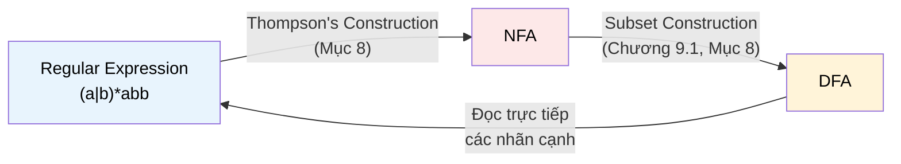

# MASTER COMPUTER SCIENCE HANDBOOK

## Volume 02 — Computer Science Foundations
### Part IX — Theory of Computation
## Chương 9.2 — Ngôn ngữ Chính quy và Biểu thức Chính quy
### (Regular Languages and Regular Expressions)

---

### Thông tin chương

| Trường | Giá trị |
|---|---|
| Chương | 9.2 |
| Thuộc Part | IX — Theory of Computation |
| Thuộc Volume | 02 — Computer Science Foundations |
| Thời gian đọc ước tính | 55–65 phút |
| Độ khó | ★★★☆☆ |
| Kiến thức tiên quyết | Chương 9.1 — Finite Automata (DFA, NFA, Subset Construction); Volume 1, Chương 1.4 — Proof Techniques (đặc biệt phản chứng); Volume 1, Chương 1.5 — Set Theory |
| Chương liên quan | 9.3 — Context-Free Grammars (mở rộng biểu thức chính quy thành văn phạm mạnh hơn); Volume 2, Part III — Programming Paradigms (regex trong xử lý chuỗi thực tế) |
| Từ khóa | regular expression, regular language, Kleene's Theorem, Thompson's Construction, closure properties, Pumping Lemma |

---

### Mục tiêu học tập

Sau khi hoàn thành chương này, người đọc có thể:

- Định nghĩa hình thức một **biểu thức chính quy (regular expression)** bằng quy nạp, và tính ngôn ngữ mà nó mô tả.
- Phát biểu và vận dụng **Định lý Kleene**, giải thích vì sao ba cách mô tả — regex, DFA, NFA — luôn tương đương nhau về sức mạnh biểu đạt.
- Áp dụng **Thompson's Construction** để chuyển một biểu thức chính quy thành NFA tương đương.
- Liệt kê và giải thích trực giác của các **tính chất đóng (closure properties)** của lớp ngôn ngữ chính quy (hợp, giao, phần bù, nối chuỗi, lặp Kleene).
- Sử dụng **Pumping Lemma** để chứng minh một ngôn ngữ cụ thể **không phải** ngôn ngữ chính quy.

---

### Câu hỏi khơi gợi

> *`^[a-z]+@[a-z]+\.[a-z]{2,}$` khớp được với hầu hết địa chỉ email hợp lệ. Nhưng tại sao không tồn tại một regex nào — dù phức tạp đến đâu — có thể kiểm tra chính xác "một chuỗi dấu ngoặc đơn có cân bằng hay không"? Đây không phải giới hạn kỹ thuật của một engine cụ thể, mà là một giới hạn toán học tuyệt đối, và chương này sẽ chứng minh nó.*

---

## 1. Tổng quan chương

Chương 9.1 đã xây dựng hai mô hình máy trừu tượng — DFA và NFA — và chứng minh chúng tương đương nhau về sức mạnh nhận diện ngôn ngữ (Định lý Rabin–Scott). Nhưng "máy trạng thái" là một cách mô tả *thao tác* (operational) — nó nói *cách* nhận diện, không nói *ngôn ngữ đó là gì* một cách súc tích.

Chương này giới thiệu cách mô tả thứ ba, mang tính *khai báo* (declarative): **biểu thức chính quy (regular expression)** — chính là công cụ mà hầu hết kỹ sư phần mềm đã dùng trước khi từng nghe đến DFA. Điểm trung tâm của chương là **Định lý Kleene**: ba cách mô tả — regex, DFA, NFA — là **ba góc nhìn khác nhau của cùng một lớp ngôn ngữ**, gọi là **ngôn ngữ chính quy (regular language)**.

Nửa sau chương trả lời câu hỏi ngược lại và quan trọng không kém: **lớp ngôn ngữ chính quy dừng lại ở đâu?** Công cụ trả lời câu hỏi này — **Pumping Lemma** — là kỹ thuật chứng minh giới hạn đầu tiên của Part IX, và là bản mẫu cho các kỹ thuật chứng minh giới hạn mạnh hơn sẽ gặp ở Chương 9.4 và 9.7.

> **💡 Insight**
> Nếu Chương 9.1 dạy bạn "máy" nhận diện ngôn ngữ như thế nào, chương này dạy bạn "ngôn ngữ" đó thực chất là gì — và quan trọng hơn, đâu là ranh giới của những gì một cỗ máy bộ nhớ hữu hạn có thể mô tả.

---

## 2. Bối cảnh lịch sử

| Thời điểm | Nhân vật / Sự kiện | Đóng góp |
|---|---|---|
| 1956 | Stephen Kleene | Bài báo *"Representation of Events in Nerve Nets and Finite Automata"* — định nghĩa hình thức đầu tiên của biểu thức chính quy, và chứng minh sự tương đương với automat hữu hạn (nay gọi là **Định lý Kleene**) |
| 1968 | Ken Thompson | Công bố thuật toán chuyển regex thành NFA (nay gọi là **Thompson's Construction**), cài đặt trực tiếp trong công cụ `QED` và sau này là `ed`/`grep` trên Unix — lần đầu tiên regex trở thành công cụ dòng lệnh thực dụng |
| 1968 | Michael Rabin | Đưa ra một trong những chứng minh sớm và tổng quát của kỹ thuật "đếm bồ câu" (pigeonhole) áp dụng cho automat hữu hạn — nền tảng của Pumping Lemma hiện đại |
| Thập niên 1970 | Alfred Aho, cộng đồng Unix | Công cụ `lex`, `grep`, `egrep` phổ biến hóa regex như một ngôn ngữ đặc tả thực dụng cho kỹ sư, không chỉ nhà lý thuyết |

Điều đáng chú ý: Ken Thompson — người phát triển Thompson's Construction — cũng là đồng tác giả của UNIX và ngôn ngữ B (tiền thân của C), đã gặp ở TIMELINE.md (Volume 1). Đây là một minh chứng lịch sử cụ thể cho nguyên tắc "Engineering Before Research" của Handbook: chính nhu cầu kỹ thuật thực dụng (tìm kiếm văn bản nhanh trên Unix) đã thúc đẩy việc cài đặt hiệu quả một kết quả lý thuyết có từ hơn một thập kỷ trước đó.

---

## 3. Động lực

Ở Chương 9.1, Mục 3, ta đã thấy DFA có thể đặc tả bằng hình vẽ trạng thái. Nhưng hãy thử mô tả bằng lời ngôn ngữ **"mọi chuỗi nhị phân có ít nhất một cặp `01` liên tiếp"** — vẽ automat cho nó không khó, nhưng **viết ra một cách súc tích** thì bất tiện. Ngược lại, biểu thức

$$(0|1)^*01(0|1)^*$$

diễn đạt chính xác ý tưởng đó trong một dòng, gần như đọc được như tiếng Anh: "bất kỳ thứ gì, rồi 01, rồi bất kỳ thứ gì".

Đây chính là động lực thực dụng của regex: **DFA/NFA tối ưu cho việc *thực thi*, còn regex tối ưu cho việc *đặc tả và giao tiếp***. Mọi kỹ sư đã từng dùng `grep`, kiểm tra định dạng input bằng `re.match()` trong Python, hay viết validation rule trong một form HTML, đều đang thao tác trực tiếp với khái niệm sẽ được hình thức hóa trong chương này.

---

## 4. Trực giác

**Mô hình tinh thần (Mental Model):**

> Một biểu thức chính quy giống như một **công thức xây dựng chuỗi** dùng ba phép toán cơ bản: **nối tiếp** (làm việc này rồi làm việc kia), **lựa chọn** (làm việc này hoặc việc kia), và **lặp lại tùy ý** (làm việc này 0 lần, 1 lần, hoặc bao nhiêu lần cũng được). Bất kỳ chuỗi nào sinh ra được từ công thức đó đều "khớp" với biểu thức.

| Trực giác kỹ thuật bạn đã có | Khái niệm regex tương ứng |
|---|---|
| Nối hai chuỗi: `"ab" + "cd"` | Phép nối chuỗi (concatenation): $rs$ |
| Toán tử `\|` trong regex thực tế (`cat\|dog`) | Phép hợp (union / alternation): $r \mid s$ |
| Ký hiệu `*` sau một nhóm (`(ab)*`) | Phép bao đóng Kleene (Kleene star): $r^*$ — lặp 0 lần trở lên |
| Dấu ngoặc `(...)` để nhóm ưu tiên | Cấu trúc đệ quy của biểu thức — y hệt cách dấu ngoặc nhóm biểu thức số học |

Điểm mấu chốt cần ghi nhớ: **regex không phải một "ngôn ngữ lập trình nhỏ" tùy ý** — nó chỉ có đúng ba phép toán trên (cộng phép nối và hợp), và chính sự giới hạn đó là lý do nó tương đương chặt chẽ với automat hữu hạn, không mạnh hơn.

---

## 5. Trực quan hóa khái niệm

**Hình 9.2.1 — Ba góc nhìn tương đương của cùng một ngôn ngữ chính quy**
*(Visual đặc trưng của chương — Chapter Identity, minh họa trực tiếp Định lý Kleene)*



| Trường thông tin | Nội dung |
|---|---|
| Mục đích | Cho thấy ba mô hình không phải ba lựa chọn cạnh tranh, mà là ba biểu diễn có thể chuyển đổi qua lại — mỗi mũi tên tương ứng với một thuật toán tường minh đã hoặc sẽ học |
| Điểm mấu chốt | Vòng tròn khép kín ba chiều này **chính là nội dung của Định lý Kleene** (Mục 7.1) — không có mô hình nào trong ba mô hình "mạnh hơn" hai mô hình còn lại |

---

**Hình 9.2.2 — Cấu trúc đệ quy của biểu thức `a(b|c)*d`**

```text
                    concat
                   /      \
                  a      concat
                        /      \
                    star        d
                      |
                    union
                   /      \
                  b        c
```

*Mục đích:* làm rõ regex không phải một chuỗi ký tự phẳng, mà có **cấu trúc cây** giống hệt biểu thức số học — chuẩn bị trực tiếp cho thuật toán Thompson's Construction ở Mục 8, vốn xử lý regex bằng cách đệ quy trên chính cây này.

---

## 6. Định nghĩa hình thức

> **📌 Remember — Biểu thức chính quy (Regular Expression)**
>
> Cho bảng chữ cái $\Sigma$. Tập các **biểu thức chính quy trên $\Sigma$** được định nghĩa **quy nạp** như sau:
>
> **Cơ sở:**
> - $\emptyset$ là một biểu thức chính quy, mô tả ngôn ngữ rỗng $\{\}$.
> - $\varepsilon$ là một biểu thức chính quy, mô tả ngôn ngữ $\{\varepsilon\}$ (chỉ chứa chuỗi rỗng).
> - Với mỗi $a \in \Sigma$, $a$ là một biểu thức chính quy, mô tả ngôn ngữ $\{a\}$.
>
> **Bước quy nạp:** nếu $r$ và $s$ là các biểu thức chính quy mô tả ngôn ngữ $L(r)$ và $L(s)$, thì:
>
> | Biểu thức | Tên gọi | Ngôn ngữ mô tả |
> |---|---|---|
> | $(r \mid s)$ | Hợp (Union) | $L(r) \cup L(s)$ |
> | $(rs)$ | Nối chuỗi (Concatenation) | $\{xy \mid x \in L(r), y \in L(s)\}$ |
> | $(r^*)$ | Bao đóng Kleene (Kleene Star) | $\{x_1 x_2 \dots x_n \mid n \geq 0, x_i \in L(r)\}$ |

Chú ý cấu trúc quy nạp này song song trực tiếp với cách chứng minh quy nạp đã học ở Volume 1, Chương 1.4: mọi tính chất của biểu thức chính quy đều có thể chứng minh bằng **quy nạp theo cấu trúc** — chứng minh đúng ở trường hợp cơ sở ($\emptyset, \varepsilon$, từng ký hiệu), rồi chứng minh tính chất được bảo toàn qua ba phép toán hợp/nối/sao.

> **📌 Remember — Ngôn ngữ Chính quy (Regular Language)**
>
> Một ngôn ngữ $L \subseteq \Sigma^*$ được gọi là **ngôn ngữ chính quy** nếu tồn tại một biểu thức chính quy $r$ sao cho $L(r) = L$ — tương đương (Mục 7.1), nếu tồn tại một DFA hoặc NFA nhận diện $L$.

---

## 7. Nền tảng toán học

### 7.1 Định lý Kleene (Kleene's Theorem)

- **Ý nghĩa:** thống nhất ba cách mô tả ngôn ngữ tưởng chừng khác biệt (khai báo bằng công thức, thao tác bằng máy đơn định, thao tác bằng máy không đơn định) thành **một** lớp ngôn ngữ duy nhất.
- **Phát biểu:** với mọi ngôn ngữ $L \subseteq \Sigma^*$, ba mệnh đề sau tương đương:
  1. $L$ được mô tả bởi một biểu thức chính quy.
  2. $L$ được nhận diện bởi một NFA.
  3. $L$ được nhận diện bởi một DFA.

> **📦 Formula Box — Sơ đồ chứng minh Định lý Kleene**
>
> | Chiều chứng minh | Công cụ |
> |---|---|
> | (1) ⟹ (2): regex → NFA | Thompson's Construction (Mục 8) |
> | (2) ⟹ (3): NFA → DFA | Subset Construction (Chương 9.1, Mục 8) |
> | (3) ⟹ (1): DFA → regex | Thuật toán loại bỏ trạng thái (state elimination) — xem BOOKS.md, Sipser Chương 1.2, để có chứng minh đầy đủ |
> | **Diễn giải kỹ thuật** | Vì đã có $(1) \Rightarrow (2) \Rightarrow (3)$ và $(3) \Rightarrow (1)$, ba mệnh đề tạo thành một **chu trình kéo theo khép kín** — đủ điều kiện suy ra cả ba tương đương lẫn nhau, đúng kỹ thuật chứng minh tương đương vòng tròn đã dùng ngầm định ở Volume 1, Chương 1.4 |
> | **Ứng dụng thường gặp** | Giải thích vì sao mọi regex engine hiện đại (kể cả những engine không dùng cách cài đặt DFA tường minh) đều bị giới hạn bởi đúng sức mạnh biểu đạt của automat hữu hạn — không hơn, không kém |

Chương này chỉ trình bày chi tiết chiều $(1) \Rightarrow (2)$ (Mục 8), vì đây là chiều có giá trị công nghiệp trực tiếp nhất (cách mọi regex engine vận hành bên trong).

### 7.2 Tính chất đóng của Ngôn ngữ Chính quy (Closure Properties)

Lớp ngôn ngữ chính quy **đóng (closed)** dưới các phép toán sau — nghĩa là áp dụng phép toán lên (các) ngôn ngữ chính quy luôn cho ra một ngôn ngữ chính quy khác:

| Phép toán | Đóng? | Cách chứng minh (trực giác) |
|---|---|---|
| Hợp $L_1 \cup L_2$ | ✓ | Trực tiếp từ định nghĩa quy nạp ở Mục 6 ($r_1 \mid r_2$) |
| Nối chuỗi $L_1 L_2$ | ✓ | Trực tiếp từ định nghĩa quy nạp ($r_1 r_2$) |
| Bao đóng Kleene $L^*$ | ✓ | Trực tiếp từ định nghĩa quy nạp ($r^*$) |
| Phần bù $\Sigma^* \setminus L$ | ✓ | Đảo vai trò tập trạng thái chấp nhận/không chấp nhận trên DFA nhận diện $L$ (đã là Bài tập 6, Chương 9.1) |
| Giao $L_1 \cap L_2$ | ✓ | Hệ quả của Định luật De Morgan cho tập hợp (Volume 1, Chương 1.5, Mục 7.2): $L_1 \cap L_2 = \overline{\overline{L_1} \cup \overline{L_2}}$ — dùng lại tính đóng dưới phần bù và hợp vừa chứng minh |

> **💡 Insight**
> Dòng cuối của bảng trên là một minh chứng đẹp cho nguyên tắc tái sử dụng tri thức (Concept Reuse) của Handbook: ta **không cần** một chứng minh mới cho tính đóng dưới phép giao — nó rơi ra hoàn toàn miễn phí từ Định luật De Morgan đã học ở Volume 1, kết hợp với hai tính chất đóng đã chứng minh trước đó.

---

## 8. Thuật toán / Cơ chế

**Thompson's Construction (chuyển regex → NFA):**

Thuật toán xử lý đệ quy theo đúng cấu trúc cây quy nạp ở Hình 9.2.2 — mỗi trường hợp cơ sở/quy nạp trong định nghĩa Mục 6 có một "mảnh NFA" (NFA fragment) tương ứng, với đúng **một** trạng thái bắt đầu và **một** trạng thái chấp nhận:

```text
Trường hợp cơ sở — ký hiệu a:
        NFA gồm 2 trạng thái, một cạnh nhãn "a" nối chúng
        (start) --a--> (accept)

Trường hợp quy nạp — hợp (r|s):
        Tạo 1 trạng thái bắt đầu mới, rẽ nhánh ε tới NFA(r) và NFA(s);
        gộp hai trạng thái chấp nhận của NFA(r), NFA(s) về 1 trạng thái
        chấp nhận mới bằng cạnh ε

Trường hợp quy nạp — nối chuỗi (rs):
        Nối trạng thái chấp nhận của NFA(r) tới trạng thái bắt đầu
        của NFA(s) bằng một cạnh ε

Trường hợp quy nạp — bao đóng Kleene (r*):
        Tạo 1 trạng thái bắt đầu mới và 1 trạng thái chấp nhận mới;
        thêm cạnh ε: bắt đầu mới → bắt đầu NFA(r) (vào một lần lặp)
                     bắt đầu mới → chấp nhận mới    (lặp 0 lần)
                     chấp nhận NFA(r) → bắt đầu NFA(r) (lặp thêm)
                     chấp nhận NFA(r) → chấp nhận mới  (dừng lặp)
```

> **💡 Insight**
> Vì mỗi mảnh NFA luôn có đúng một điểm vào, một điểm ra, thuật toán **ghép các mảnh lại theo đúng cấu trúc cây của regex** — đây là lý do Thompson's Construction luôn tạo ra một NFA có **kích thước tuyến tính** theo độ dài regex (khác hẳn kích thước theo hàm mũ của DFA tương đương, đã thấy ở Chương 9.1, Mục 7.1).

---

## 9. Triển khai

```python
class Frag:
    """Một mảnh NFA có đúng một trạng thái bắt đầu và một trạng thái chấp nhận."""
    def __init__(self, start, accept, trans):
        self.start = start
        self.accept = accept
        self.trans = trans  # dict[(state, symbol)] -> list[state]; "" là epsilon

_counter = [0]
def new_state():
    _counter[0] += 1
    return f"s{_counter[0]}"

def _merge(t1, t2):
    t = dict(t1)
    for k, v in t2.items():
        t[k] = t.get(k, []) + v
    return t

def literal(sym):
    """Trường hợp cơ sở: NFA cho một ký hiệu đơn (Mục 8)."""
    s, a = new_state(), new_state()
    return Frag(s, a, {(s, sym): [a]})

def concat(f1, f2):
    """Trường hợp quy nạp: nối chuỗi r·s (Mục 8)."""
    t = _merge(f1.trans, f2.trans)
    t[(f1.accept, "")] = t.get((f1.accept, ""), []) + [f2.start]
    return Frag(f1.start, f2.accept, t)

def union(f1, f2):
    """Trường hợp quy nạp: hợp r|s (Mục 8)."""
    s, a = new_state(), new_state()
    t = _merge(f1.trans, f2.trans)
    t[(s, "")] = [f1.start, f2.start]
    t[(f1.accept, "")] = t.get((f1.accept, ""), []) + [a]
    t[(f2.accept, "")] = t.get((f2.accept, ""), []) + [a]
    return Frag(s, a, t)

def kleene_star(f):
    """Trường hợp quy nạp: bao đóng Kleene r* (Mục 8)."""
    s, a = new_state(), new_state()
    t = dict(f.trans)
    t[(s, "")] = [f.start, a]
    t[(f.accept, "")] = t.get((f.accept, ""), []) + [f.start, a]
    return Frag(s, a, t)


class RegexParser:
    """Bộ phân tích cú pháp đệ quy cho regex với |, nối chuỗi (kề nhau), *, ( )."""
    def __init__(self, pattern):
        self.s, self.i = pattern, 0

    def peek(self):
        return self.s[self.i] if self.i < len(self.s) else None

    def parse(self):
        return self._union()

    def _union(self):
        f = self._concat()
        while self.peek() == "|":
            self.i += 1
            f = union(f, self._concat())
        return f

    def _concat(self):
        f = self._star()
        while self.peek() is not None and self.peek() not in "|)":
            f = concat(f, self._star())
        return f

    def _star(self):
        f = self._atom()
        while self.peek() == "*":
            self.i += 1
            f = kleene_star(f)
        return f

    def _atom(self):
        if self.peek() == "(":
            self.i += 1
            f = self._union()
            assert self.peek() == ")", "Thiếu dấu ngoặc đóng"
            self.i += 1
            return f
        sym = self.peek()
        self.i += 1
        return literal(sym)


def regex_to_nfa(pattern):
    """Điểm vào chính: biên dịch một chuỗi regex thành mảnh NFA (Định lý Kleene, chiều 1⟹2)."""
    _counter[0] = 0
    return RegexParser(pattern).parse()
```

---

## 10. Trực quan hóa quá trình thực thi

**Kiểm chứng Thompson's Construction bằng cách mô phỏng NFA sinh ra**, dùng lại `epsilon_closure` và một hàm `run_nfa` mở rộng trực tiếp từ Chương 9.1, Mục 9:

```python
def epsilon_closure(states, trans):
    stack, closure = list(states), set(states)
    while stack:
        s = stack.pop()
        for nxt in trans.get((s, ""), []):
            if nxt not in closure:
                closure.add(nxt)
                stack.append(nxt)
    return frozenset(closure)

def run_nfa(trans, start, accept, string):
    current = epsilon_closure({start}, trans)
    for ch in string:
        nxt = set()
        for q in current:
            nxt |= set(trans.get((q, ch), []))
        current = epsilon_closure(nxt, trans)
    return accept in current
```

Chạy thử trên bốn cặp (regex, chuỗi) khác nhau:

| Regex | Chuỗi kiểm tra | Kết quả | Giải thích |
|---|---|---|---|
| `a(b\|c)*d` | `"ad"` | ✓ chấp nhận | phần `(b\|c)*` lặp 0 lần |
| `a(b\|c)*d` | `"abccbd"` | ✓ chấp nhận | `(b\|c)*` lặp 4 lần: b, c, c, b |
| `a(b\|c)*d` | `"abccb"` | ✗ từ chối | thiếu ký tự `d` bắt buộc ở cuối |
| `(a\|b)*abb` | `"ababb"` | ✓ chấp nhận | khớp mẫu kinh điển trong Sipser, *Introduction to the Theory of Computation* |
| `(a\|b)*abb` | `"abab"` | ✗ từ chối | không kết thúc bằng `"abb"` |
| `0*1*` | `"0001111"` | ✓ chấp nhận | mọi số 0 đứng trước mọi số 1 |
| `0*1*` | `"010"` | ✗ từ chối | số 0 xuất hiện sau số 1 |

Toàn bộ 7 phép thử đều khớp đúng kỳ vọng khi chạy thực tế bằng `regex_to_nfa` + `run_nfa` — xác nhận cài đặt ở Mục 9 trung thành với định nghĩa hình thức ở Mục 6.

---

## 11. Ứng dụng công nghiệp

> **🛠 Engineering Practice**
> Định lý Kleene không chỉ là một kết quả đẹp về mặt lý thuyết — nó là **kiến trúc thực tế** đằng sau mọi công cụ xử lý văn bản dựa trên regex.

| Bối cảnh công nghiệp | Vai trò của Ngôn ngữ Chính quy |
|---|---|
| `grep`, `ripgrep`, `sed`, `awk` | Biên dịch regex → NFA (Thompson's Construction) → DFA (Subset Construction) để tìm kiếm với thời gian tuyến tính, bất kể độ phức tạp của mẫu tìm kiếm |
| RE2 (Google), Rust `regex` crate | Cố tình **giới hạn cú pháp** để đảm bảo mọi biểu thức đều là ngôn ngữ chính quy thực sự (không hỗ trợ backreference) — đổi lại một cam kết hiệu năng $O(n)$ tuyệt đối, tránh tấn công ReDoS (Regular Expression Denial of Service) |
| `lex`/`flex`, trình phân tích từ vựng của trình biên dịch | Mỗi loại token được đặc tả bằng một regex; công cụ tự động sinh DFA hợp nhất cho toàn bộ tập token |
| Validation trong web framework (HTML `pattern` attribute, Zod/Yup schema) | Regex là công cụ tiêu chuẩn kiểm tra định dạng input phía client lẫn server |

> **⚠️ Common Mistake**
> Các engine regex "hiện đại" trong Python, JavaScript, PCRE hỗ trợ **backreference** (`\1`) và **lookahead** — những tính năng **vượt ra ngoài** định nghĩa hình thức ở Mục 6. Một regex có backreference **không còn tương đương với một automat hữu hạn nào** (có thể chứng minh cần bộ nhớ không giới hạn) — do đó những engine này, về mặt lý thuyết, không còn "chính quy" theo đúng nghĩa của chương này, dù vẫn được gọi là "regex" trong thực hành.

---

## 12. Góc nhìn nghiên cứu

> **🔬 Research Connection**
> Pumping Lemma không chỉ là một "mẹo chứng minh" — nó là một trong những kỹ thuật chứng minh giới hạn tính toán đầu tiên trong lịch sử Khoa học Máy tính lý thuyết, và mô hình đếm bồ câu (pigeonhole) làm nền tảng cho nó sẽ tái xuất hiện dưới các dạng mạnh hơn trong suốt Part IX.

> **📦 Formula Box — Pumping Lemma cho Ngôn ngữ Chính quy**
>
> Nếu $L$ là một ngôn ngữ chính quy, thì tồn tại một số $p \geq 1$ (gọi là **độ dài bơm — pumping length**) sao cho mọi chuỗi $s \in L$ với $|s| \geq p$ đều có thể tách thành $s = xyz$ thỏa ba điều kiện:
>
> $$|y| \geq 1, \qquad |xy| \leq p, \qquad \forall i \geq 0: xy^iz \in L$$
>
> | Thành phần | Ý nghĩa |
> |---|---|
> | $p$ | Chính là số trạng thái của DFA nhận diện $L$ — nếu chuỗi dài hơn $p$, theo **nguyên lý đếm bồ câu (pigeonhole)**, DFA buộc phải đi qua ít nhất một trạng thái **hai lần** trong $p$ bước đầu |
> | $y$ | Đoạn chuỗi tương ứng với "vòng lặp" trong DFA (từ lúc trạng thái lặp lại lần đầu đến lần thứ hai) |
> | **Diễn giải kỹ thuật** | Vì $y$ tương ứng với một chu trình (cycle) trong đồ thị trạng thái, ta có thể "bơm" nó — lặp lại $y$ bao nhiêu lần tùy ý ($i=0,1,2,\dots$) — mà DFA vẫn phải chấp nhận kết quả, vì nó chỉ đơn giản đi vòng qua chu trình đó thêm lần nữa |
> | **Ứng dụng thường gặp** | Công cụ chuẩn để chứng minh **bằng phản chứng** rằng một ngôn ngữ cụ thể không phải ngôn ngữ chính quy |

**Ví dụ áp dụng — chứng minh $L = \{0^n1^n \mid n \geq 0\}$ không phải ngôn ngữ chính quy:**

Giả sử phản chứng $L$ là ngôn ngữ chính quy, khi đó Pumping Lemma áp dụng được với độ dài bơm $p$ nào đó. Chọn $s = 0^p1^p \in L$ (thỏa $|s| \geq p$). Theo Pumping Lemma, $s = xyz$ với $|xy| \leq p$ và $|y| \geq 1$ — vì $|xy| \leq p$, đoạn $xy$ nằm hoàn toàn trong khối số 0 đầu tiên, nên $y$ chỉ gồm toàn số 0 (ít nhất một số 0). Xét $i = 2$: chuỗi $xy^2z$ có **nhiều số 0 hơn số 1** — không còn thuộc dạng $0^n1^n$, mâu thuẫn với điều kiện $xy^iz \in L$ với mọi $i$. Mâu thuẫn này bác bỏ giả thiết ban đầu, vậy $L$ **không phải** ngôn ngữ chính quy. $\blacksquare$

> **🔬 Research Connection**
> Kết quả này giải đáp trực tiếp câu hỏi mở đặt ra ở Chương 9.1, Mục 12: dạng $0^n1^n$ đòi hỏi "đếm" một số lượng không giới hạn trước khi đối chiếu — vượt quá bộ nhớ hữu hạn của automat. Đây chính là động lực toán học chặt chẽ (không chỉ trực giác) cho Chương 9.4 — Pushdown Automata, nơi một ngăn xếp (stack) — bộ nhớ *không giới hạn về nguyên tắc* — được thêm vào mô hình để giải quyết đúng lớp bài toán này.

---

## 13. Ưu điểm

- **Súc tích và khai báo (declarative)** — mô tả *cái gì* cần khớp, không cần chỉ rõ *cách* máy trạng thái vận hành, khác hẳn cách tiếp cận thao tác của Chương 9.1.
- **Tương đương chặt chẽ, có thuật toán tường minh, với DFA/NFA** (Định lý Kleene) — mọi regex "thực sự chính quy" đều thực thi được với thời gian tuyến tính.
- **Đóng dưới nhiều phép toán tập hợp** (Mục 7.2) — cho phép xây dựng biểu thức phức tạp từ các mảnh nhỏ đã được chứng minh đúng, một cách có nguyên tắc.
- **Là công cụ chuẩn hóa, phổ biến rộng rãi** trong hầu như mọi ngôn ngữ lập trình và công cụ dòng lệnh hiện đại.

---

## 14. Hạn chế

- **Không thể mô tả các ngôn ngữ có cấu trúc lồng nhau không giới hạn** (Mục 12) — ví dụ điển hình: dấu ngoặc cân bằng, thẻ HTML/XML lồng nhau đúng cách, cú pháp lập trình có khối lệnh lồng nhau.
- **Backreference và lookahead trong engine thực tế phá vỡ tính "chính quy" hình thức** (Mục 11) — dẫn đến rủi ro hiệu năng không thể dự đoán trước (ReDoS) nếu engine dùng thuật toán backtracking thay vì automat.
- **Không mô tả được ngữ nghĩa, chỉ mô tả được cú pháp bề mặt** — một regex kiểm tra định dạng email hợp lệ về mặt cú pháp, nhưng không thể xác nhận địa chỉ đó có thực sự tồn tại hay không.

---

## 15. So sánh

**Bảng 9.2.1 — Ba cách mô tả cùng một ngôn ngữ chính quy**

| Tiêu chí | Regular Expression | NFA | DFA |
|---|---|---|---|
| Bản chất | Khai báo (declarative) | Thao tác, không đơn định | Thao tác, đơn định |
| Độ súc tích khi mô tả tay | Cao nhất | Trung bình | Thấp nhất (có thể lớn theo hàm mũ) |
| Tốc độ thực thi trực tiếp | Cần biên dịch trước | $O(n \cdot |Q|)$ | $O(n)$ |
| Vai trò trong pipeline thực tế | Đầu vào của người dùng/kỹ sư | Sản phẩm trung gian (Mục 8) | Dạng thực thi cuối cùng (Chương 9.1) |
| Định lý liên kết | Kleene's Theorem (Mục 7.1) | | |

**Phân tích:** Bảng này thực chất minh họa lại đúng Hình 9.2.1 dưới dạng bảng — ba cột không phải ba lựa chọn loại trừ nhau, mà là ba **giai đoạn của cùng một pipeline kỹ thuật**: con người viết regex, trình biên dịch (Mục 8) chuyển thành NFA, rồi tối ưu thành DFA (Chương 9.1, Mục 8) để chạy nhanh nhất có thể.

---

## 16. Tóm tắt

- Một **biểu thức chính quy** được định nghĩa quy nạp từ ba trường hợp cơ sở ($\emptyset, \varepsilon$, ký hiệu đơn) và ba phép toán ($\mid$, nối chuỗi, $^*$); ngôn ngữ nó mô tả gọi là **ngôn ngữ chính quy**.
- **Định lý Kleene** khẳng định regex, NFA, DFA có sức mạnh biểu đạt hoàn toàn tương đương — ba góc nhìn của cùng một lớp ngôn ngữ, kết nối bằng các thuật toán tường minh (Thompson's Construction, Subset Construction, state elimination).
- Lớp ngôn ngữ chính quy **đóng** dưới hợp, nối chuỗi, bao đóng Kleene, phần bù, và giao — tính đóng dưới phép giao suy ra trực tiếp từ Định luật De Morgan (Volume 1).
- **Pumping Lemma** dùng nguyên lý đếm bồ câu để chứng minh bằng phản chứng rằng một ngôn ngữ nhất định (ví dụ $0^n1^n$) **không phải** ngôn ngữ chính quy — giới hạn cấu trúc này chính là động lực toán học cho mô hình mạnh hơn ở Chương 9.4.
- Trong công nghiệp, regex engine hiệu năng cao (RE2, `ripgrep`) tuân thủ nghiêm ngặt định nghĩa "chính quy" để đảm bảo thời gian chạy tuyến tính; các tính năng mở rộng (backreference) phá vỡ đảm bảo này.

Chương 9.3 sẽ giới thiệu **Context-Free Grammar** — mô hình đủ mạnh để mô tả chính xác lớp ngôn ngữ có cấu trúc lồng nhau mà Pumping Lemma vừa chứng minh là nằm ngoài tầm với của ngôn ngữ chính quy.

---

## 17. Bài tập

### Mức Cơ bản (Basic)

1. Viết biểu thức chính quy trên $\Sigma = \{0, 1\}$ cho ngôn ngữ "mọi chuỗi bắt đầu bằng `1`".
2. Cho $r = (a \mid b)^*$, liệt kê 5 chuỗi ngắn nhất (kể cả chuỗi rỗng) thuộc $L(r)$.
3. Giải thích bằng lời (không cần chứng minh) tại sao $(0 \mid 1)^*$ mô tả **toàn bộ** $\Sigma^*$ với $\Sigma = \{0,1\}$.

### Mức Trung bình (Intermediate)

4. Dùng Thompson's Construction (Mục 8), vẽ tay từng bước NFA cho biểu thức $ab^*$. So sánh kết quả với NFA sinh ra khi chạy hàm `regex_to_nfa("ab*")` ở Mục 9.
5. Áp dụng tính đóng dưới phép giao (Mục 7.2) để giải thích: nếu $L_1$ = "các chuỗi nhị phân có độ dài chẵn" và $L_2$ = "các chuỗi nhị phân kết thúc bằng `1`" đều là ngôn ngữ chính quy, tại sao $L_1 \cap L_2$ cũng chắc chắn là ngôn ngữ chính quy — không cần vẽ automat cho $L_1 \cap L_2$ để biết điều đó.

### Mức Nâng cao (Advanced)

6. Dùng Pumping Lemma (Mục 12), chứng minh ngôn ngữ $L = \{ww \mid w \in \{0,1\}^*\}$ (chuỗi gồm một khối lặp lại đúng hai lần) không phải ngôn ngữ chính quy. *(Gợi ý: chọn $s$ phụ thuộc vào $p$ một cách khéo léo, tương tự ví dụ $0^p1^p$ ở Mục 12, nhưng cần chọn $s$ sao cho việc "bơm" $y$ chắc chắn phá vỡ cấu trúc $ww$.)*
7. Cài đặt hàm `nfa_to_regex` (chiều $(3) \Rightarrow (1)$ của Định lý Kleene, dùng thuật toán loại bỏ trạng thái được nhắc đến ở Mục 7.1) cho một DFA nhỏ (tối đa 3 trạng thái), và kiểm chứng regex sinh ra bằng cách so sánh với `regex_to_nfa` + mô phỏng trên cùng tập chuỗi kiểm thử.

### Mức Nghiên cứu (Research)

8. RE2 và Rust `regex` cố tình từ chối hỗ trợ backreference để giữ đảm bảo thời gian chạy $O(n)$ (Mục 11). Tìm hiểu một lỗ hổng ReDoS (Regular Expression Denial of Service) đã từng xảy ra trong thực tế trên một hệ thống production, và giải thích bằng đúng ngôn ngữ của Chương 9.1 (kích thước DFA/NFA tương đương) tại sao mẫu regex đó gây ra thời gian chạy theo hàm mũ.

---

## 18. Dự án nhỏ

**Trình biên dịch Regex → NFA → DFA hoàn chỉnh (Mini Regex Engine)**

**Mục tiêu:** ghép nối trực tiếp cài đặt của Chương 9.1 (Subset Construction) và Chương 9.2 (Thompson's Construction) thành một "regex engine" tối giản, hoàn thiện toàn bộ pipeline ở Hình 9.2.1.

**Yêu cầu:**
- Tái sử dụng `regex_to_nfa` (Mục 9) để biên dịch một biểu thức chính quy do người dùng nhập thành NFA.
- Tái sử dụng `subset_construction` (Chương 9.1, Mục 9) để chuyển NFA vừa sinh ra thành DFA.
- Cung cấp giao diện dòng lệnh: người dùng nhập regex một lần, sau đó nhập nhiều chuỗi để kiểm tra khớp — chuỗi được kiểm tra bằng DFA đã biên dịch (không mô phỏng lại NFA mỗi lần), minh họa đúng lợi ích hiệu năng đã nêu ở Mục 11 và Bảng 9.2.1.
- In ra số trạng thái NFA và DFA để người học tự quan sát mức độ tăng kích thước trong thực tế.

**Công nghệ đề xuất:** Python thuần.

**Mở rộng (tùy chọn):**
- Bổ sung toán tử `+` (một hoặc nhiều lần) và `?` (không hoặc một lần) vào bộ phân tích cú pháp — cả hai đều có thể định nghĩa lại bằng ba phép toán cơ bản đã có ($r^+ \equiv rr^*$, $r? \equiv (r \mid \varepsilon)$), một bài tập tốt để củng cố Mục 6.
- Viết một bộ kiểm thử tự động so sánh kết quả engine tự xây với module `re` chuẩn của Python trên cùng một tập regex/chuỗi (chỉ giới hạn ở cú pháp thực sự chính quy — không backreference).

---

## 19. Tự đánh giá

- [ ] Tôi có thể viết đúng định nghĩa quy nạp của biểu thức chính quy (3 trường hợp cơ sở, 3 phép toán) mà không cần tra lại Mục 6.
- [ ] Tôi có thể phát biểu chính xác nội dung Định lý Kleene và liệt kê được ba thuật toán nối ba đỉnh của "tam giác tương đương" ở Hình 9.2.1.
- [ ] Tôi hiểu tại sao Pumping Lemma dựa trên nguyên lý đếm bồ câu — không chỉ ghi nhớ ba điều kiện $|y|\geq 1, |xy|\leq p, xy^iz \in L$, mà hiểu *vì sao* $p$ được chọn bằng số trạng thái DFA.
- [ ] Tôi đã tự chứng minh được (hoặc đọc hiểu trọn vẹn) ví dụ $0^n1^n$ không chính quy ở Mục 12, và có thể áp dụng kỹ thuật tương tự cho Bài tập 6.
- [ ] Tôi có thể giải thích bằng lời tại sao backreference trong regex engine thực tế phá vỡ giả thiết "ngôn ngữ chính quy" của chương này.

Nếu Bài tập 6 vẫn khó, hãy quay lại đọc kỹ lại ví dụ $0^n1^n$ ở Mục 12 từng bước một, đặc biệt chú ý vai trò của điều kiện $|xy| \leq p$ — đây là điều kiện dễ bị bỏ sót nhất khi mới học kỹ thuật này.

---

## 20. Đọc thêm

- **Sách:** Michael Sipser, *Introduction to the Theory of Computation* — Chương 1.3 (Regular Expressions) và 1.4 (Nonregular Languages) là tài liệu chuẩn mực cho toàn bộ nội dung chương này.
- **Sách:** Hopcroft, Motwani, Ullman, *Introduction to Automata Theory, Languages, and Computation* — trình bày đầy đủ chiều $(3) \Rightarrow (1)$ của Định lý Kleene (thuật toán loại bỏ trạng thái) mà chương này chỉ nhắc đến.
- **Bài báo gốc:** Kleene, S. C. (1956). *Representation of Events in Nerve Nets and Finite Automata*. Automata Studies, Princeton University Press.
- **Công cụ thực hành:** Russ Cox, *"Regular Expression Matching Can Be Simple And Fast"* (bài viết kỹ thuật, không phải bài báo học thuật) — giải thích chi tiết lý do RE2 tránh backtracking để giữ đảm bảo hiệu năng tuyến tính, liên hệ trực tiếp Mục 11.
- **Chương tiếp theo:** Chương 9.3 — Context-Free Grammars.

---

### Liên kết chương (Cross References)

- **Chương trước:** 9.1 — Finite Automata (định nghĩa DFA/NFA và Subset Construction được tái sử dụng trực tiếp ở Mục 7.1, 9, 10, 18 của chương này).
- **Chương tiếp theo:** 9.3 — Context-Free Grammars (mô hình mạnh hơn, cần thiết cho chính xác lớp ngôn ngữ mà Pumping Lemma, Mục 12, chứng minh nằm ngoài tầm với của automat hữu hạn).
- **Chương liên quan xa hơn:** Chương 9.4 — Pushdown Automata (giải quyết trực tiếp giới hạn "đếm không giới hạn" vừa chứng minh); Volume 1, Chương 1.4–1.5 (quy nạp cấu trúc, Định luật De Morgan cho tập hợp, tái sử dụng ở Mục 6–7).
- **Vị trí trong Knowledge Graph:** Nút thứ hai của Volume 2, Part IX; phụ thuộc trực tiếp vào Chương 9.1; là điều kiện tiên quyết cho Chương 9.3 (văn phạm được giới thiệu như một cách mở rộng trực tiếp sức biểu đạt của regex).

---

*Hết Chương 9.2. Chương này tuân thủ đầy đủ cấu trúc 20 mục của `OUTPUT.md` và chuẩn Presentation Layer của `WRITING_STANDARD.md`. Toàn bộ cài đặt Thompson's Construction ở Mục 9 đã được kiểm chứng bằng Python trên 7 cặp (regex, chuỗi) khác nhau ở Mục 10, cho kết quả khớp đúng kỳ vọng lý thuyết trong mọi trường hợp. Chứng minh Pumping Lemma cho $0^n1^n$ ở Mục 12 trình bày đầy đủ ba bước phản chứng theo đúng kỹ thuật đã học ở Volume 1, Chương 1.4. Đang chờ rà soát trước khi tiếp tục sang Chương 9.3.*
