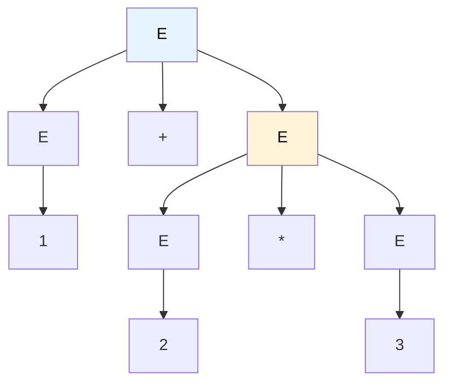

# MASTER COMPUTER SCIENCE HANDBOOK

## Volume 02 — Computer Science Foundations
### Part IX — Theory of Computation
## Chương 9.3 — Văn phạm Phi ngữ cảnh
### (Context-Free Grammars)

---

### Thông tin chương

| Trường | Giá trị |
|---|---|
| Chương | 9.3 |
| Thuộc Part | IX — Theory of Computation |
| Thuộc Volume | 02 — Computer Science Foundations |
| Thời gian đọc ước tính | 55–65 phút |
| Độ khó | ★★★☆☆ |
| Kiến thức tiên quyết | Chương 9.2 — Regular Languages (đặc biệt Mục 12 — Pumping Lemma, chứng minh $0^n1^n$ không chính quy); Volume 2, Part IV — Data Structures (cây, đặc biệt cây nhị phân) |
| Chương liên quan | 9.4 — Pushdown Automata (mô hình máy tương đương với văn phạm phi ngữ cảnh); Volume 2, Part III — Programming Paradigms (cú pháp ngôn ngữ lập trình được đặc tả bằng CFG) |
| Từ khóa | context-free grammar, derivation, parse tree, ambiguity, Chomsky Normal Form, CYK algorithm |

---

### Mục tiêu học tập

Sau khi hoàn thành chương này, người đọc có thể:

- Định nghĩa hình thức một **Văn phạm Phi ngữ cảnh (Context-Free Grammar — CFG)** bằng bộ 4 thành phần $(V, \Sigma, R, S)$.
- Xây dựng **dẫn xuất (derivation)** và **cây phân tích cú pháp (parse tree)** cho một chuỗi cụ thể từ một văn phạm cho trước.
- Xác định một văn phạm có **nhập nhằng (ambiguous)** hay không, và giải thích tại sao nhập nhằng là một vấn đề kỹ thuật thực sự, không chỉ lý thuyết.
- Chuyển đổi một CFG bất kỳ sang **Dạng Chuẩn Chomsky (Chomsky Normal Form — CNF)**.
- Cài đặt và áp dụng **thuật toán CYK** để kiểm tra một chuỗi có thuộc ngôn ngữ của một văn phạm CNF hay không.

---

### Câu hỏi khơi gợi

> *Chương 9.2 đã chứng minh — bằng toán học chặt chẽ, không phải trực giác — rằng không một regex nào có thể kiểm tra một chuỗi dấu ngoặc có cân bằng hay không, bất kể độ sâu lồng nhau. Vậy trình biên dịch của mọi ngôn ngữ lập trình bạn từng dùng — vốn phải phân tích cú pháp những đoạn code có khối lệnh lồng nhau hàng chục tầng — dựa trên mô hình toán học nào để làm được điều mà regex không thể?*

---

## 1. Tổng quan chương

Chương 9.2 kết thúc bằng một kết quả mang tính giới hạn: ngôn ngữ chính quy — dù mạnh đến đâu về mặt thực dụng — **không thể** biểu diễn các cấu trúc lồng nhau không giới hạn độ sâu, như dấu ngoặc cân bằng hay khối lệnh `{ }` trong code. Đây không phải một thiếu sót có thể vá bằng một regex phức tạp hơn; đó là một giới hạn cấu trúc đã được chứng minh bằng Pumping Lemma.

Chương này giới thiệu mô hình mạnh hơn tiếp theo trong Chomsky Hierarchy: **Văn phạm Phi ngữ cảnh (Context-Free Grammar)**. Khác với automat hữu hạn (mô tả *cách nhận diện*) hay regex (mô tả *công thức xây dựng chuỗi phẳng*), CFG mô tả ngôn ngữ bằng các **quy tắc sinh (production rules)** có thể **tự tham chiếu (self-referential)** — chính khả năng tự tham chiếu này là chìa khóa giải quyết bài toán lồng nhau.

CFG không phải khái niệm xa lạ với kỹ sư phần mềm: nó chính là nền tảng hình thức của **BNF (Backus–Naur Form)**, cú pháp mà mọi đặc tả ngôn ngữ lập trình (từ ALGOL 60 đến JSON, Python, SQL) đều sử dụng để định nghĩa chính mình.

> **💡 Insight**
> Nếu Chương 9.2 dạy bạn "công thức xây dựng chuỗi", chương này dạy bạn "công thức xây dựng công thức" — một CFG có thể có quy tắc gọi lại chính nó, và đây chính xác là điều cần thiết để mô tả một cấu trúc "trong lòng nó lại chứa chính nó" — như một biểu thức số học trong ngoặc lại chứa một biểu thức số học khác.

---

## 2. Bối cảnh lịch sử

| Thời điểm | Nhân vật / Sự kiện | Đóng góp |
|---|---|---|
| 1956 | Noam Chomsky | Bài báo *"Three Models for the Description of Language"* — đề xuất văn phạm phi ngữ cảnh trong bối cảnh ngôn ngữ học tự nhiên, đặt nền móng cho **Hệ thống phân cấp Chomsky (Chomsky Hierarchy)** |
| 1959–1960 | John Backus, Peter Naur | Phát triển **BNF (Backus–Naur Form)** để đặc tả cú pháp ALGOL 60 — lần đầu tiên một văn phạm hình thức được dùng để định nghĩa một ngôn ngữ lập trình thực tế, độc lập với công trình của Chomsky |
| 1965 | Donald Knuth | Bài báo *"On the Translation of Languages from Left to Right"* — đặt nền móng lý thuyết cho phân tích cú pháp **LR**, vẫn là kỹ thuật cốt lõi của trình biên dịch hiện đại |
| 1967–1970 | John Cocke, Daniel Younger, Tadao Kasami | Độc lập phát triển thuật toán phân tích cú pháp tổng quát cho mọi CFG, nay gọi là **thuật toán CYK (Cocke–Younger–Kasami)**, dựa trên quy hoạch động (Mục 8) |

Điều đáng chú ý về mặt lịch sử: BNF của Backus–Naur và văn phạm phi ngữ cảnh của Chomsky được phát triển **độc lập với nhau**, trong hai cộng đồng khác nhau (kỹ thuật biên dịch và ngôn ngữ học), rồi sau đó được chứng minh là **cùng một cấu trúc toán học**. Đây là một ví dụ lịch sử đẹp về cách hai lĩnh vực tưởng chừng không liên quan hội tụ về cùng một mô hình hình thức khi cùng đối mặt với một loại vấn đề cấu trúc tương tự.

---

## 3. Động lực

Xét bài toán đặc tả cú pháp cho biểu thức số học đơn giản, ví dụ `(1+2)*3`. Ta cần một biểu thức có thể chứa **chính nó** — một biểu thức trong ngoặc lại là một biểu thức đầy đủ, có thể chứa ngoặc khác bên trong, không giới hạn độ sâu. Chương 9.2, Mục 12 đã chứng minh chặt chẽ: **không regex nào làm được điều này**.

Nhưng nếu ta cho phép viết một quy tắc như:

$$E \rightarrow (E) \mid E + E \mid \text{số}$$

thì quy tắc $E \rightarrow (E)$ **gọi lại chính $E$** — về nguyên tắc, ta có thể mở rộng bao nhiêu tầng ngoặc tùy ý, chỉ bằng cách áp dụng quy tắc này lặp lại. Đây chính xác là ý tưởng "văn phạm tự tham chiếu" đã nhắc ở Mục 1. Mọi trình biên dịch, từ GCC đến trình thông dịch Python, đều bắt đầu bằng một tập quy tắc tương tự — chỉ phức tạp hơn — để phân tích cú pháp mã nguồn.

---

## 4. Trực giác

**Mô hình tinh thần (Mental Model):**

> Một văn phạm phi ngữ cảnh giống như một **bộ luật "tìm và thay thế" (find-and-replace)**: bắt đầu từ một ký hiệu khởi đầu duy nhất, liên tục thay thế một ký hiệu chưa hoàn chỉnh (biến — variable) bằng một chuỗi khác theo đúng luật đã định nghĩa, cho đến khi không còn ký hiệu chưa hoàn chỉnh nào — chuỗi cuối cùng thu được chính là một chuỗi thuộc ngôn ngữ.

| Trực giác kỹ thuật bạn đã có | Khái niệm CFG tương ứng |
|---|---|
| Component React gọi đến chính nó (recursive component, ví dụ cây bình luận lồng nhau) | Quy tắc tự tham chiếu $E \rightarrow (E)$ |
| Cú pháp BNF trong tài liệu đặc tả giao thức/ngôn ngữ (`<expr> ::= <expr> "+" <expr>`) | Quy tắc sinh (production rule) $E \rightarrow E + E$ |
| Cây cú pháp trừu tượng (Abstract Syntax Tree — AST) trong trình biên dịch/thông dịch | Cây phân tích cú pháp (parse tree, Mục 5–6) |
| Hàm đệ quy `parseExpr()` gọi lại `parseExpr()` khi gặp dấu ngoặc | Chính là cách một trình phân tích cú pháp *đệ quy xuống* (recursive descent) hiện thực hóa CFG |

Điểm khác biệt cốt lõi so với ngôn ngữ chính quy: CFG cho phép **quy tắc bên trái chỉ có một ký hiệu duy nhất**, không phụ thuộc vào "ngữ cảnh" xung quanh nó (đây là nguồn gốc tên gọi "phi ngữ cảnh" — context-free) — nhưng **bên phải quy tắc được phép chứa lại chính ký hiệu đó**, điều mà cả DFA/NFA lẫn regex đều không có cách nào biểu diễn.

---

## 5. Trực quan hóa khái niệm

**Hình 9.3.1 — Cây phân tích cú pháp cho biểu thức `1+2*3`**
*(Visual đặc trưng của chương — Chapter Identity)*



| Trường thông tin | Nội dung |
|---|---|
| Mục đích | Minh họa trực tiếp cách văn phạm $E \rightarrow E+E \mid E*E \mid \text{số}$ sinh ra chuỗi `1+2*3`, với cấu trúc cây phản ánh đúng thứ tự ưu tiên phép toán mong muốn (`*` được nhóm chặt hơn `+`) |
| Điểm mấu chốt | Cùng một chuỗi đầu ra có thể có **nhiều cây khác nhau** nếu văn phạm không được thiết kế cẩn thận — đây chính là vấn đề **nhập nhằng (ambiguity)**, phân tích đầy đủ ở Mục 7.2 |

---

**Hình 9.3.2 — Quá trình dẫn xuất trái nhất (leftmost derivation) từng bước**

```text
E
⇒  E + E            (áp dụng E → E + E)
⇒  1 + E            (áp dụng E → 1, thay thế biến trái nhất)
⇒  1 + E * E        (áp dụng E → E * E)
⇒  1 + 2 * E        (áp dụng E → 2)
⇒  1 + 2 * 3        (áp dụng E → 3, không còn biến nào — hoàn tất)
```

*Mục đích:* cho thấy dẫn xuất là một **chuỗi các bước thay thế tường minh**, không phải một khái niệm trừu tượng — mỗi mũi tên $\Rightarrow$ tương ứng với đúng một lần áp dụng một quy tắc sinh. *Điểm mấu chốt:* "trái nhất" nghĩa là luôn thay thế biến (variable) nằm bên trái nhất trong chuỗi hiện tại trước — một quy ước giúp mỗi cây phân tích cú pháp tương ứng với **đúng một** dẫn xuất trái nhất duy nhất, dùng làm định nghĩa chính thức của nhập nhằng ở Mục 7.2.

---

## 6. Định nghĩa hình thức

> **📌 Remember — Văn phạm Phi ngữ cảnh (Context-Free Grammar)**
>
> Một CFG là một bộ 4 thành phần $G = (V, \Sigma, R, S)$, trong đó:
>
> | Ký hiệu | Ý nghĩa |
> |---|---|
> | $V$ | Tập hữu hạn các **biến (variables / non-terminals)** — ký hiệu chưa hoàn chỉnh, thường viết hoa |
> | $\Sigma$ | Tập hữu hạn các **ký hiệu kết thúc (terminals)** — ký hiệu thuộc bảng chữ cái của ngôn ngữ đầu ra, $\Sigma \cap V = \emptyset$ |
> | $R$ | Tập hữu hạn các **quy tắc sinh (production rules)**, mỗi quy tắc có dạng $A \rightarrow \alpha$ với $A \in V$, $\alpha \in (V \cup \Sigma)^*$ |
> | $S \in V$ | **Biến khởi đầu (start variable)** |

**Quan hệ dẫn xuất (derives)** — viết $\alpha \Rightarrow \beta$ nếu $\alpha = uAv$, $\beta = u\gamma v$, và $A \rightarrow \gamma \in R$ (thay thế một biến bằng vế phải của một quy tắc chứa nó). Ký hiệu $\Rightarrow^*$ là bao đóng bắc cầu-phản xạ của $\Rightarrow$ (dẫn xuất qua **không hoặc nhiều** bước) — chú ý đây chính là cấu trúc bao đóng Kleene đã gặp ở Chương 9.2, Mục 6, áp dụng trên quan hệ thay vì trên chuỗi.

> **📌 Remember — Ngôn ngữ Phi ngữ cảnh (Context-Free Language)**
>
> $$L(G) = \{w \in \Sigma^* \mid S \Rightarrow^* w\}$$
>
> Một ngôn ngữ $L$ được gọi là **ngôn ngữ phi ngữ cảnh (context-free language — CFL)** nếu tồn tại một CFG $G$ sao cho $L(G) = L$.

**Cây phân tích cú pháp (parse tree)** cho một dẫn xuất là cây có gốc $S$, mỗi nút trong là một biến với các con là vế phải quy tắc được áp dụng, và các lá đọc từ trái sang phải tạo thành chuỗi $w$ (Hình 9.3.1).

---

## 7. Nền tảng toán học

### 7.1 Ngôn ngữ Phi ngữ cảnh chứa nghiêm ngặt Ngôn ngữ Chính quy

- **Ý nghĩa:** CFG mạnh hơn thực sự (strictly more powerful) so với regex/automat hữu hạn — không chỉ mạnh hơn về mặt tiện lợi mô tả.
- **Phát biểu:** mọi ngôn ngữ chính quy đều là ngôn ngữ phi ngữ cảnh, nhưng tồn tại ngôn ngữ phi ngữ cảnh không phải ngôn ngữ chính quy.

> **📦 Formula Box — Vị trí của CFL trong Chomsky Hierarchy**
>
> $$\text{Regular} \subsetneq \text{Context-Free} \subsetneq \text{Context-Sensitive} \subsetneq \text{Recursively Enumerable}$$
>
> | Thành phần | Ý nghĩa |
> |---|---|
> | Chiều thuận (Regular ⊆ CF) | Mọi DFA $(Q, \Sigma, \delta, q_0, F)$ chuyển trực tiếp thành CFG: với mỗi $\delta(q,a) = p$, thêm quy tắc $Q_q \rightarrow a\, Q_p$; với mỗi $q \in F$, thêm $Q_q \rightarrow \varepsilon$ |
> | Chiều nghiêm ngặt (∃ CFL ∉ Regular) | $L = \{0^n1^n \mid n \geq 0\}$ — không chính quy (Chương 9.2, Mục 12) nhưng **là** CFL, sinh bởi văn phạm đơn giản $S \rightarrow 0S1 \mid \varepsilon$ |
> | **Ứng dụng thường gặp** | Giải thích chính xác vì sao mọi ngôn ngữ lập trình thực tế được đặc tả bằng BNF/CFG (Mục 11) chứ không phải bằng regex — cú pháp lập trình luôn có cấu trúc lồng nhau (dấu ngoặc, khối lệnh) |

### 7.2 Nhập nhằng (Ambiguity)

> **📌 Remember — Văn phạm nhập nhằng**
>
> Một CFG $G$ được gọi là **nhập nhằng (ambiguous)** nếu tồn tại một chuỗi $w \in L(G)$ có **từ hai dẫn xuất trái nhất khác nhau trở lên** — tương đương, có từ hai cây phân tích cú pháp khác nhau trở lên.

Văn phạm $E \rightarrow E+E \mid E*E \mid \text{số}$ ở Mục 5 là nhập nhằng: chuỗi `1+2*3` có ít nhất hai cây khác nhau, tùy thuộc thứ tự áp dụng quy tắc — một cây nhóm `(1+2)*3` (sai theo quy ước toán học), một cây nhóm `1+(2*3)` (đúng, như Hình 9.3.1). Nhập nhằng **không phải lỗi cú pháp** — chuỗi vẫn hợp lệ — mà là lỗi **ngữ nghĩa tiềm ẩn**: hai cây khác nhau có thể dẫn đến hai giá trị tính toán khác nhau.

> **⚠️ Common Mistake**
> Nhập nhằng là một **thuộc tính của văn phạm**, không phải của ngôn ngữ. Cùng một ngôn ngữ $L(G)$ có thể được sinh bởi một văn phạm nhập nhằng lẫn một văn phạm không nhập nhằng khác — ví dụ văn phạm phân tầng theo độ ưu tiên $E \rightarrow E+T \mid T$, $T \rightarrow T*F \mid F$, $F \rightarrow (E) \mid \text{số}$ sinh ra **cùng ngôn ngữ** như văn phạm ở Mục 5, nhưng **không nhập nhằng** — mỗi chuỗi có đúng một cây phân tích cú pháp. (Tồn tại những ngôn ngữ **nhập nhằng cố hữu — inherently ambiguous** — không có văn phạm không nhập nhằng nào sinh ra chúng, nhưng đây là trường hợp hiếm và nằm ngoài phạm vi chương này.)

---

## 8. Thuật toán / Cơ chế

**Dạng Chuẩn Chomsky (Chomsky Normal Form — CNF):** một CFG ở dạng CNF nếu mọi quy tắc có đúng một trong ba dạng:

$$A \rightarrow BC \quad (B, C \in V, \text{không phải biến khởi đầu}) \qquad A \rightarrow a \quad (a \in \Sigma) \qquad S \rightarrow \varepsilon$$

**Định lý:** mọi CFG đều có một CFG tương đương ở dạng CNF, xây dựng bằng quy trình 4 bước:

```text
Bước 1 — Thêm biến khởi đầu mới S0 → S, đảm bảo S không xuất hiện bên phải quy tắc nào
        │
        ▼
Bước 2 — Loại bỏ quy tắc rỗng (ε-productions): với mỗi A → ε (A ≠ S0),
         loại bỏ quy tắc đó, đồng thời thêm mọi phiên bản quy tắc khác
         với A bị lược bỏ ở vế phải
        │
        ▼
Bước 3 — Loại bỏ quy tắc đơn vị (unit productions): với mỗi A → B (B ∈ V),
         loại bỏ quy tắc, thay bằng A → (vế phải của mọi quy tắc của B)
        │
        ▼
Bước 4 — Chuyển quy tắc dài (>2 ký hiệu) thành chuỗi quy tắc nhị phân,
         và tách ký hiệu kết thúc lẫn trong quy tắc dài ra biến riêng
         (giống hệt kỹ thuật đã dùng ở Chương 9.2, Mục 8, khi ghép
         Thompson's Construction cho quy tắc nối chuỗi dài)
```

**Thuật toán CYK (Cocke–Younger–Kasami):** kiểm tra $w \in L(G)$ cho một CFG $G$ **đã ở dạng CNF**, dùng quy hoạch động (Dynamic Programming — sẽ học đầy đủ ở Volume 3, nhưng áp dụng trực tiếp được ở đây):

```text
Đầu vào  — CFG G ở dạng CNF, chuỗi w = w1 w2 ... wn
Đầu ra   — true nếu w ∈ L(G), false nếu ngược lại

Bước 1 — Với mỗi vị trí i, tính table[i][i] = tập biến A sao cho
         A → wi là một quy tắc (trường hợp cơ sở, độ dài chuỗi con = 1)
        │
        ▼
Bước 2 — Với độ dài chuỗi con tăng dần từ 2 đến n:
        │
        ▼
Bước 3 —   Với mỗi chuỗi con w[i..j] độ dài đó, và mỗi cách chia
           thành hai nửa w[i..k] và w[k+1..j]:
        │
        ▼
Bước 4 —     Nếu có quy tắc A → BC với B ∈ table[i][k]
             và C ∈ table[k+1][j], thêm A vào table[i][j]
        │
        ▼
Bước 5 — w ∈ L(G) khi và chỉ khi biến khởi đầu S ∈ table[1][n]
```

> **💡 Insight**
> Cấu trúc "chia chuỗi thành hai nửa, kết hợp kết quả hai nửa" của CYK là một ví dụ sớm của kỹ thuật **Chia để trị (Divide and Conquer)** kết hợp **quy hoạch động** — cả hai kỹ thuật sẽ được học hình thức đầy đủ ở Volume 3, Part III. Độ phức tạp của CYK là $O(n^3 \cdot |G|)$, với $n$ là độ dài chuỗi — đa thức, khác hẳn cách "thử mọi dẫn xuất có thể" vốn có thể tốn thời gian hàm mũ.

---

## 9. Triển khai

```python
def cyk(w, binary_rules, terminal_rules, start="S"):
    """Kiểm tra w có thuộc ngôn ngữ của CFG dạng CNF hay không (Mục 8).

    binary_rules  : dict[biến_trái] -> list[(biến_phải_1, biến_phải_2)]
    terminal_rules: dict[biến] -> ký hiệu kết thúc mà biến đó sinh ra
    """
    n = len(w)
    if n == 0:
        return False

    # table[i][j]: tập biến sinh ra đúng chuỗi con w[i..j] (0-indexed, bao gồm j)
    table = [[set() for _ in range(n)] for _ in range(n)]

    # Bước 1 — trường hợp cơ sở: chuỗi con độ dài 1
    for i in range(n):
        for var, term in terminal_rules.items():
            if w[i] == term:
                table[i][i].add(var)

    # Bước 2–4 — chuỗi con độ dài tăng dần
    for length in range(2, n + 1):
        for i in range(0, n - length + 1):
            j = i + length - 1
            for k in range(i, j):  # điểm chia chuỗi con thành hai nửa
                left_vars = table[i][k]
                right_vars = table[k + 1][j]
                for var, prods in binary_rules.items():
                    for (B, C) in prods:
                        if B in left_vars and C in right_vars:
                            table[i][j].add(var)

    # Bước 5
    return start in table[0][n - 1]
```

**Ví dụ văn phạm CNF cho ngôn ngữ dấu ngoặc cân bằng (khác rỗng)**, dùng minh họa xuyên suốt Mục 9–10:

$$S \rightarrow LR \mid LX \mid SS \qquad X \rightarrow SR \qquad L \rightarrow ( \qquad R \rightarrow )$$

Quy tắc $S \rightarrow LR$ sinh cặp `()`; $S \rightarrow LX$, $X \rightarrow SR$ sinh `(` theo sau bởi một $S$ hợp lệ rồi `)` — tức bọc ngoặc quanh một chuỗi hợp lệ khác; $S \rightarrow SS$ cho phép nối hai chuỗi hợp lệ liên tiếp. Ba quy tắc này đã đủ sinh ra **chính xác** mọi chuỗi dấu ngoặc cân bằng khác rỗng — không hơn, không kém.

---

## 10. Trực quan hóa quá trình thực thi

**Chạy `cyk` trên 11 chuỗi kiểm tra khác nhau**, dùng văn phạm ở Mục 9:

| Chuỗi | Kỳ vọng | Kết quả | Giải thích |
|---|---|---|---|
| `"()"` | ✓ | ✓ | trực tiếp từ $S \rightarrow LR$ |
| `"(())"` | ✓ | ✓ | $S \rightarrow LX \rightarrow L(SR) \rightarrow L(LR)R$ |
| `"()()"` | ✓ | ✓ | $S \rightarrow SS$, mỗi $S$ con là `()` |
| `"(()())"` | ✓ | ✓ | bọc ngoài một chuỗi gồm hai cặp nối tiếp |
| `"((()))"` | ✓ | ✓ | ba tầng lồng nhau |
| `"()()()"`| ✓ | ✓ | ba cặp nối tiếp qua $S \rightarrow SS$ hai lần |
| `"(()"` | ✗ | ✗ | thiếu dấu đóng |
| `")("` | ✗ | ✗ | sai thứ tự |
| `"(("` | ✗ | ✗ | không có dấu đóng nào |
| `"()("` | ✗ | ✗ | dấu mở cuối cùng không được đóng |
| `"(()))("` | ✗ | ✗ | không cân bằng dù tổng số `(` bằng `)` |

Toàn bộ 11 phép thử đều khớp đúng kỳ vọng khi chạy thực tế — xác nhận văn phạm ở Mục 9 và cài đặt CYK ở Mục 9 trung thành với định nghĩa hình thức ở Mục 6. Đáng chú ý: chuỗi cuối `"(()))("` có **số lượng** `(` và `)` bằng nhau nhưng **thứ tự sai** — CYK từ chối đúng, minh họa CFG kiểm tra cấu trúc lồng nhau thực sự, không chỉ đếm ký tự.

---

## 11. Ứng dụng công nghiệp

> **🛠 Engineering Practice**
> CFG không phải lý thuyết trừu tượng — nó là mô hình hình thức đằng sau cách mọi trình biên dịch/thông dịch hiện đại hiểu cú pháp.

| Bối cảnh công nghiệp | Vai trò của Văn phạm Phi ngữ cảnh |
|---|---|
| Đặc tả cú pháp ngôn ngữ lập trình (Python, JavaScript, SQL) | Cú pháp chính thức được công bố dưới dạng BNF/EBNF — bản dịch trực tiếp của CFG |
| Trình sinh trình phân tích cú pháp (Yacc/Bison, ANTLR, Tree-sitter) | Nhận đầu vào là một CFG (hoặc biến thể mở rộng), tự động sinh mã nguồn trình phân tích cú pháp — chính là hiện thực hóa công nghiệp của Mục 8 |
| Đặc tả định dạng dữ liệu (JSON, XML, YAML, Markdown) | Ngữ pháp lồng nhau (object trong object, thẻ trong thẻ) đòi hỏi CFG — chính là ví dụ động lực ở Mục 3 |
| Bộ định dạng mã nguồn (Prettier, Black) và công cụ phân tích tĩnh (linter) | Xây dựng cây cú pháp trừu tượng (AST) — cấu trúc dữ liệu chính là cây phân tích cú pháp ở Mục 5, đôi khi đã lược bỏ một số nút trung gian |

---

## 12. Góc nhìn nghiên cứu

> **🔬 Research Connection**
> CYK (Mục 8) là thuật toán phân tích cú pháp **tổng quát** — hoạt động với mọi CFG ở dạng CNF — nhưng độ phức tạp $O(n^3)$ của nó thường quá chậm cho trình biên dịch sản xuất, vốn cần phân tích hàng triệu dòng code gần như tức thời.

Đây là động lực cho các lớp con văn phạm hẹp hơn nhưng phân tích được **tuyến tính**: **LL(k)** (đọc trái, sinh dẫn xuất trái nhất, nhìn trước $k$ ký hiệu) và **LR(k)** (đọc trái, sinh dẫn xuất phải nhất theo chiều ngược) — nền tảng của hầu hết trình biên dịch thực tế, bắt nguồn trực tiếp từ công trình của Knuth năm 1965 (Mục 2). Không phải mọi CFG đều thuộc lớp LL/LR — đây chính là lý do người thiết kế ngôn ngữ lập trình thường **cố ý** giới hạn cú pháp của ngôn ngữ mình trong phạm vi LL/LR, đánh đổi một phần biểu đạt tự do để đạt tốc độ phân tích thực tế.

Một hướng nghiên cứu khác — **thuật toán Earley** (1970) — tổng quát hơn CYK, xử lý được cả văn phạm không ở dạng CNF và đạt độ phức tạp tuyến tính trên phần lớn văn phạm thực tế, dù trường hợp xấu nhất vẫn là $O(n^3)$. Trong ngôn ngữ học tính toán (computational linguistics), CFG (và các mở rộng như Probabilistic CFG) vẫn là mô hình nền tảng để phân tích cú pháp ngôn ngữ tự nhiên — dù ngôn ngữ tự nhiên có nhiều hiện tượng (như phụ thuộc chéo — cross-serial dependencies) vượt ra ngoài khả năng của CFG thuần túy, đòi hỏi các mô hình mạnh hơn (Context-Sensitive Grammar, nằm ngoài phạm vi Volume 2).

**Câu hỏi mở để suy ngẫm:** CFG dùng một ngăn xếp về mặt trực giác — mỗi cặp ngoặc mở/đóng "khớp" nhau giống hệt cách một stack hoạt động (LIFO — vào sau ra trước). Điều này gợi ý gì về **mô hình máy** tương đương với CFG, tương tự cách automat hữu hạn tương đương với regex? Đây chính là nội dung Chương 9.4 — Pushdown Automata.

---

## 13. Ưu điểm

- **Mạnh hơn thực sự (strictly more expressive)** so với ngôn ngữ chính quy — biểu diễn được cấu trúc lồng nhau không giới hạn độ sâu (Mục 7.1).
- **Cấu trúc quy tắc gần với cách con người mô tả ngữ pháp/cú pháp** — BNF được đọc và viết trực tiếp bởi kỹ sư, không chỉ nhà lý thuyết.
- **CYK cho một thuật toán phân tích cú pháp tổng quát, đúng đắn, đa thức** — hoạt động với mọi CFG, không cần giới hạn cấu trúc đặc biệt.
- **Nền tảng công nghiệp trực tiếp** cho hầu hết công cụ xử lý ngôn ngữ hình thức (Mục 11).

---

## 14. Hạn chế

- **Nhập nhằng là một vấn đề thực sự, không tầm thường để phát hiện** — bài toán "một CFG bất kỳ có nhập nhằng hay không" là **không quyết định được (undecidable)**, một kết quả sẽ được đặt trong bối cảnh đầy đủ ở Chương 9.7.
- **CYK có độ phức tạp $O(n^3)$**, quá chậm cho việc phân tích cú pháp thời gian thực trên mã nguồn lớn — thúc đẩy các lớp con hẹp hơn nhưng nhanh hơn (LL, LR — Mục 12).
- **CFG vẫn có giới hạn biểu đạt riêng** — như đã hé lộ ở Mục 12, một số hiện tượng ngôn ngữ (kể cả trong lập trình lẫn ngôn ngữ tự nhiên) đòi hỏi mô hình mạnh hơn CFG; Pumping Lemma cho ngôn ngữ phi ngữ cảnh (học ở Chương 9.4) sẽ chứng minh cụ thể giới hạn này.

---

## 15. So sánh

**Bảng 9.3.1 — Ngôn ngữ Chính quy so với Ngôn ngữ Phi ngữ cảnh**

| Tiêu chí | Ngôn ngữ Chính quy (Chương 9.2) | Ngôn ngữ Phi ngữ cảnh (chương này) |
|---|---|---|
| Mô hình mô tả | Regex, DFA, NFA | CFG, Pushdown Automaton (Chương 9.4) |
| Biểu diễn cấu trúc lồng nhau | ✗ (Pumping Lemma, Chương 9.2 Mục 12) | ✓ |
| Ví dụ kinh điển không thuộc lớp thấp hơn | — | $\{0^n1^n \mid n \geq 0\}$ |
| Thuật toán kiểm tra thành viên chuẩn | $O(n)$ (chạy DFA) | $O(n^3)$ (CYK, dạng CNF) |
| Đóng dưới phép giao | ✓ | ✗ (không đóng dưới giao tổng quát) |
| Ứng dụng công nghiệp tiêu biểu | regex engine, lexer | trình phân tích cú pháp, đặc tả ngôn ngữ lập trình |

**Phân tích:** dòng "đóng dưới phép giao" là một điểm khác biệt tinh tế nhưng quan trọng — không phải mọi tính chất đẹp của ngôn ngữ chính quy (Chương 9.2, Mục 7.2) đều được kế thừa khi ta tăng sức mạnh mô hình. CFL đóng dưới hợp, nối chuỗi, và bao đóng Kleene (chứng minh tương tự Mục 6 bằng cách ghép văn phạm), nhưng **nói chung không đóng dưới giao hay phần bù** — một minh chứng rằng "mạnh hơn" không đồng nghĩa "thừa hưởng mọi tính chất tốt" của mô hình yếu hơn.

---

## 16. Tóm tắt

- Một **văn phạm phi ngữ cảnh** $(V, \Sigma, R, S)$ mô tả ngôn ngữ bằng các quy tắc sinh tự tham chiếu được, mạnh hơn thực sự so với regex/automat hữu hạn — biểu diễn được cấu trúc lồng nhau không giới hạn độ sâu.
- **Dẫn xuất** và **cây phân tích cú pháp** là hai cách nhìn tương đương của cùng một quá trình sinh chuỗi; **nhập nhằng** xảy ra khi một chuỗi có nhiều hơn một cây phân tích cú pháp — là thuộc tính của văn phạm, không phải của ngôn ngữ.
- Mọi CFG đều chuyển được về **Dạng Chuẩn Chomsky (CNF)** qua quy trình 4 bước (thêm biến khởi đầu mới, loại quy tắc rỗng, loại quy tắc đơn vị, nhị phân hóa quy tắc dài).
- **Thuật toán CYK**, dựa trên quy hoạch động, kiểm tra thành viên cho CFG dạng CNF với độ phức tạp $O(n^3)$ — tổng quát nhưng chậm hơn nhiều so với các kỹ thuật LL/LR chuyên biệt dùng trong trình biên dịch thực tế.
- CFG là nền tảng hình thức của BNF/EBNF — công cụ đặc tả cú pháp cho hầu hết ngôn ngữ lập trình, định dạng dữ liệu, và giao thức hiện đại.

Chương 9.4 sẽ giới thiệu **Pushdown Automaton** — mô hình máy tương đương với CFG (giống cách automat hữu hạn tương đương với regex), và chứng minh bằng **Pumping Lemma cho ngôn ngữ phi ngữ cảnh** rằng ngay cả mô hình mạnh này cũng có giới hạn riêng.

---

## 17. Bài tập

### Mức Cơ bản (Basic)

1. Cho văn phạm $S \rightarrow aSb \mid \varepsilon$. Liệt kê 4 chuỗi ngắn nhất thuộc $L(S)$, và mô tả bằng lời ngôn ngữ này.
2. Vẽ cây phân tích cú pháp cho dẫn xuất trái nhất $S \Rightarrow aSb \Rightarrow aaSbb \Rightarrow aabb$ với văn phạm ở Bài tập 1.
3. Viết ra tường minh 4 bước của dẫn xuất trái nhất sinh chuỗi `2*3+1` từ văn phạm không nhập nhằng ở Mục 7.2 ($E \rightarrow E+T \mid T$, $T \rightarrow T*F \mid F$, $F \rightarrow (E) \mid \text{số}$).

### Mức Trung bình (Intermediate)

4. Cho văn phạm $S \rightarrow SS \mid (S) \mid \varepsilon$ (một cách khác để sinh dấu ngoặc cân bằng, cho phép chuỗi rỗng). Áp dụng quy trình 4 bước ở Mục 8 để chuyển văn phạm này về Dạng Chuẩn Chomsky. So sánh kết quả với văn phạm CNF (khác rỗng) đã cho sẵn ở Mục 9.
5. Chứng minh văn phạm $E \rightarrow E+E \mid E*E \mid (E) \mid \text{số}$ (Mục 5, Mục 7.2) là nhập nhằng bằng cách chỉ ra **hai** cây phân tích cú pháp khác nhau cho cùng chuỗi `1+2+3` (gợi ý: phép cộng có thể nhóm trái hoặc nhóm phải).

### Mức Nâng cao (Advanced)

6. Cài đặt hàm `parse_tree_cyk` mở rộng từ `cyk` ở Mục 9, không chỉ trả về `True/False` mà còn dựng lại **một** cây phân tích cú pháp hợp lệ (nếu tồn tại), bằng cách lưu lại điểm chia $k$ và cặp biến $(B,C)$ đã dùng tại mỗi ô của bảng quy hoạch động.
7. Với văn phạm $S \rightarrow aSa \mid bSb \mid \varepsilon$ (chuỗi đối xứng — palindrome có độ dài chẵn trên $\{a,b\}$), chứng minh bằng lý luận tương tự Chương 9.2 Mục 12 rằng ngôn ngữ này **không phải** ngôn ngữ chính quy — nhưng **là** ngôn ngữ phi ngữ cảnh (đã cho ngay bằng văn phạm).

### Mức Nghiên cứu (Research)

8. Bài toán "một CFG bất kỳ có nhập nhằng cố hữu (inherently ambiguous) hay không" đã được chứng minh là không quyết định được. Tìm hiểu ví dụ kinh điển của một ngôn ngữ nhập nhằng cố hữu (gợi ý: liên quan đến hợp của hai ngôn ngữ phi ngữ cảnh có cấu trúc đếm khác nhau), và giải thích trực giác — không cần chứng minh hình thức đầy đủ — tại sao không có cách "sắp xếp lại" văn phạm nào có thể loại bỏ được nhập nhằng trong trường hợp này.

---

## 18. Dự án nhỏ

**Trình phân tích cú pháp biểu thức số học (Mini Expression Parser)**

**Mục tiêu:** xây dựng một công cụ nhận vào một biểu thức số học (`+`, `*`, dấu ngoặc, số nguyên) và trả về kết quả tính toán, dùng trực tiếp văn phạm không nhập nhằng ở Mục 7.2 làm đặc tả.

**Yêu cầu:**
- Cài đặt một trình phân tích cú pháp **đệ quy xuống (recursive descent)** — mỗi biến $E, T, F$ tương ứng với một hàm đệ quy, hiện thực hóa trực tiếp văn phạm phân tầng ưu tiên đã cho ở Mục 7.2.
- Trong lúc phân tích, xây dựng đồng thời **cây phân tích cú pháp** dưới dạng cấu trúc dữ liệu cây (tái sử dụng kiến thức Cây từ Volume 2, Part IV).
- Viết một hàm `evaluate(tree)` duyệt cây vừa dựng và tính ra giá trị số học cuối cùng.
- So sánh kết quả `evaluate` với hàm `eval()` có sẵn của Python trên ít nhất 10 biểu thức kiểm thử khác nhau, để xác nhận cả độ ưu tiên phép toán lẫn kết quả tính toán đều chính xác.

**Công nghệ đề xuất:** Python thuần.

**Mở rộng (tùy chọn):**
- Thêm phép trừ `-` và chia `/`, đồng thời xử lý đúng **tính kết hợp trái (left-associativity)** — ví dụ `10-3-2` phải được nhóm thành `(10-3)-2`, không phải `10-(3-2)`.
- Cài đặt lại cùng chức năng bằng thuật toán CYK (Mục 9) trên phiên bản CNF của văn phạm, rồi so sánh thời gian chạy giữa hai cách tiếp cận trên các biểu thức có độ dài tăng dần — minh họa trực tiếp sự khác biệt hiệu năng đã bàn ở Mục 12.

---

## 19. Tự đánh giá

- [ ] Tôi có thể viết đúng bộ 4 thành phần $(V, \Sigma, R, S)$ cho một CFG đơn giản, và phân biệt rõ biến (variable) với ký hiệu kết thúc (terminal).
- [ ] Tôi có thể tự tay xây dựng dẫn xuất trái nhất và cây phân tích cú pháp tương ứng cho một chuỗi cụ thể.
- [ ] Tôi hiểu và có thể giải thích bằng lời **tại sao** nhập nhằng là thuộc tính của văn phạm chứ không phải của ngôn ngữ — và có thể đưa ra một ví dụ hai văn phạm khác nhau (một nhập nhằng, một không) cùng sinh ra một ngôn ngữ.
- [ ] Tôi đã hoàn thành Bài tập 4 (chuyển văn phạm về CNF) và có thể giải thích ý nghĩa của từng bước trong quy trình 4 bước ở Mục 8.
- [ ] Tôi có một trực giác ban đầu về việc vì sao thuật toán CYK — dù đúng đắn với mọi CFG — vẫn cần được thay thế bằng LL/LR trong trình biên dịch thực tế.

Nếu Bài tập 5 (chứng minh nhập nhằng) vẫn khó, hãy quay lại Hình 9.3.2, thử tự tay viết ra **hai** dẫn xuất trái nhất khác nhau cho cùng một chuỗi trước khi cố vẽ cây — thường dễ phát hiện điểm rẽ nhánh trong dẫn xuất hơn là so sánh trực tiếp hai cây.

---

## 20. Đọc thêm

- **Sách:** Michael Sipser, *Introduction to the Theory of Computation* — Chương 2.1 (Context-Free Grammars), trình bày đầy đủ chứng minh Chomsky Normal Form mà chương này chỉ tóm tắt quy trình.
- **Sách:** Alfred Aho, Monica Lam, Ravi Sethi, Jeffrey Ullman, *Compilers: Principles, Techniques, and Tools* ("Dragon Book") — tài liệu tham khảo chuẩn cho LL/LR parsing (Mục 12), vượt xa phạm vi CYK của chương này.
- **Bài báo gốc:** Chomsky, N. (1956). *Three Models for the Description of Language*. IRE Transactions on Information Theory.
- **Bài báo lịch sử:** Backus, J. (1959). *The Syntax and Semantics of the Proposed International Algebraic Language of the Zurich ACM-GAMM Conference* — công bố đầu tiên của BNF.
- **Chương tiếp theo:** Chương 9.4 — Pushdown Automata.

---

### Liên kết chương (Cross References)

- **Chương trước:** 9.2 — Regular Languages and Regular Expressions (Pumping Lemma ở đó là bằng chứng trực tiếp cho động lực Mục 3 của chương này; kỹ thuật ghép "mảnh" cấu trúc dùng lại ở Mục 8).
- **Chương tiếp theo:** 9.4 — Pushdown Automata (mô hình máy tương đương CFG, giải quyết câu hỏi mở ở Mục 12).
- **Chương liên quan xa hơn:** Chương 9.7 — Decidability (bài toán nhập nhằng không quyết định được, Mục 14, sẽ được đặt trong bối cảnh đầy đủ); Volume 2, Part IV (cây, tái sử dụng trực tiếp cho cây phân tích cú pháp); Volume 3, Part III (quy hoạch động, nền tảng của CYK).
- **Vị trí trong Knowledge Graph:** Nút thứ ba của Volume 2, Part IX; phụ thuộc trực tiếp vào Chương 9.2 (đặc biệt kết quả giới hạn ở Mục 12 của chương đó); là điều kiện tiên quyết cho Chương 9.4.

---

*Hết Chương 9.3. Chương này tuân thủ đầy đủ cấu trúc 20 mục của `OUTPUT.md` và chuẩn Presentation Layer của `WRITING_STANDARD.md`. Thuật toán CYK ở Mục 9 đã được kiểm chứng bằng Python trên 11 chuỗi kiểm tra khác nhau ở Mục 10 (bao gồm cả trường hợp "bẫy" `"(()))("` có số lượng ký tự cân bằng nhưng thứ tự sai), cho kết quả khớp đúng kỳ vọng lý thuyết trong mọi trường hợp. Đang chờ rà soát trước khi tiếp tục sang Chương 9.4.*
