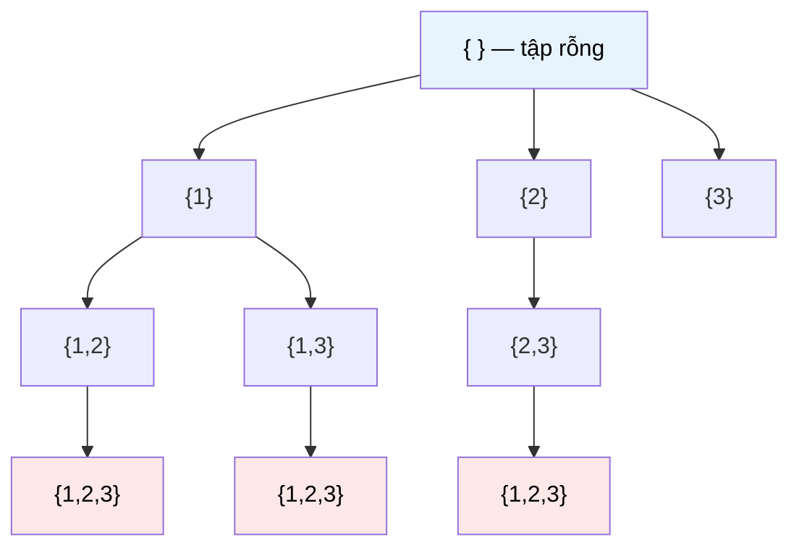

# MASTER COMPUTER SCIENCE HANDBOOK

## Volume 03 — Algorithms and Data Structures
### Part III — Algorithm Design Paradigms
## Chương 13 — Brute Force và Exhaustive Search
### (Brute Force / Vét cạn)

---

### Thông tin chương

| Trường | Giá trị |
|---|---|
| Chương | 13 |
| Thuộc Part | III — Algorithm Design Paradigms |
| Thuộc Volume | 03 — Algorithms and Data Structures |
| Thời gian đọc ước tính | 45–55 phút |
| Độ khó | ★☆☆☆☆ |
| Kiến thức tiên quyết | Volume 3, Part I — Complexity Analysis (Big-O, Big-Ω, Big-Θ); Volume 3, Part II — Arrays, Hash Table; kỹ năng lập trình đệ quy cơ bản |
| Chương liên quan | 14 — Divide and Conquer (cải tiến trực tiếp từ Brute Force); 17 — Greedy Algorithms; 18 — Dynamic Programming I (cả hai đều "sửa" điểm yếu của Brute Force theo cách khác nhau); 20 — Backtracking (phiên bản có cắt tỉa của Exhaustive Search) |
| Từ khóa | brute force, exhaustive search, linear search, naive string matching, subset generation, permutation generation, baseline algorithm |

---

### Mục tiêu học tập

Sau khi hoàn thành chương này, người đọc có thể:

- Định nghĩa chính xác Brute Force (vét cạn) và giải thích vì sao nó luôn là điểm khởi đầu hợp lý khi tiếp cận một bài toán mới.
- Nhận diện và triển khai lời giải Brute Force cho bốn lớp bài toán tiêu biểu: tìm kiếm tuyến tính, kiểm tra số nguyên tố, so khớp chuỗi, và các bài toán tổ hợp (subset, permutation).
- Phân tích độ phức tạp thời gian của lời giải vét cạn bằng ký hiệu Big-O, và giải thích vì sao độ phức tạp đó thường là hàm mũ hoặc giai thừa đối với bài toán tổ hợp.
- Sử dụng lời giải Brute Force như một "mỏ neo đúng đắn" (correctness anchor) để kiểm chứng các thuật toán tối ưu hơn sẽ học ở các chương tiếp theo.
- Nhận ra ranh giới thực tế: khi nào Brute Force vẫn là lựa chọn kỹ thuật hợp lý, và khi nào nó trở thành một sai lầm kỹ thuật nghiêm trọng.

---

### Câu hỏi khơi gợi

> *Khi bạn viết một vòng lặp `for` lồng bên trong một vòng lặp `for` khác để so sánh từng cặp phần tử trong một mảng — vì "chưa nghĩ ra cách nào nhanh hơn" — bạn đã vô tình sử dụng một trong những chiến lược thiết kế thuật toán lâu đời và được nghiên cứu kỹ lưỡng nhất trong Computer Science. Nhưng tại sao một chiến lược "ngây thơ" đến vậy lại xứng đáng có nguyên một chương riêng, thậm chí là chương mở đầu của toàn bộ Part về thiết kế thuật toán?*

---

## 1. Tổng quan chương

Part II của Volume 3 đã trang bị cho bạn một bộ công cụ cấu trúc dữ liệu: Array, Linked List, Hash Table, Tree, Heap. Nhưng có cấu trúc dữ liệu tốt thôi chưa đủ — bạn còn cần một **chiến lược** để quyết định *cách* duyệt qua dữ liệu đó nhằm giải quyết một bài toán cụ thể. Đó chính là chủ đề của Part III: các **paradigm thiết kế thuật toán** (algorithm design paradigms) — những khuôn mẫu tư duy có thể tái sử dụng cho hàng trăm bài toán khác nhau.

Chương này mở đầu Part III bằng paradigm đơn giản nhất về mặt khái niệm nhưng lại đóng vai trò nền tảng nhất: **Brute Force**, hay còn gọi là **Exhaustive Search** (tìm kiếm vét cạn). Ý tưởng cốt lõi chỉ gói gọn trong một câu: *thử tất cả các khả năng có thể, và chọn ra khả năng thỏa mãn yêu cầu bài toán*.

Chương này có hai mục tiêu song song. Thứ nhất, nó dạy bạn cách nhận diện và triển khai lời giải vét cạn — một kỹ năng tự nó đã hữu ích trong nhiều tình huống thực tế. Thứ hai, và quan trọng hơn, nó **thiết lập đường cơ sở (baseline)** mà mọi chương còn lại của Part III sẽ liên tục quay lại để so sánh: "Divide and Conquer cải tiến Brute Force như thế nào? Dynamic Programming loại bỏ phần lãng phí nào của Brute Force? Backtracking cắt tỉa cây tìm kiếm vét cạn ra sao?"

> **💡 Insight**
> Đừng xem Brute Force là "cách làm của người mới học". Trong thực hành kỹ thuật, viết lời giải Brute Force trước tiên — dù sau đó sẽ thay thế bằng thuật toán tối ưu hơn — là một kỷ luật chuyên nghiệp: nó cho bạn một **bản tham chiếu đúng đắn (correctness reference)** để kiểm thử (test) thuật toán phức tạp hơn sau này.

---

## 2. Bối cảnh lịch sử

Không giống các thuật toán có tên tác giả và thời điểm phát minh rõ ràng (như Dijkstra's Algorithm hay Merge Sort), Brute Force không có một "cột mốc phát minh" duy nhất — nó là chiến lược tự nhiên nhất mà con người áp dụng từ trước khi máy tính ra đời, và tồn tại song song với chính khái niệm thuật toán.

| Thời điểm | Bối cảnh | Ý nghĩa đối với Brute Force |
|---|---|---|
| Trước 1936 | Các phương pháp giải toán bằng tay (thử từng trường hợp) trong số học và tổ hợp | Tiền thân phi hình thức của tư duy vét cạn |
| 1936 | Alan Turing — Turing Machine (đã học ở Volume 1, Chương 1.1 và 1.5) | Turing Machine, về bản chất, có thể mô phỏng việc thử mọi cấu hình có thể — Brute Force là chiến lược "mặc định" mà một máy tính vạn năng luôn có thể thực hiện được, dù không hiệu quả |
| Thập niên 1960–1970 | Sự phát triển của lý thuyết độ phức tạp tính toán (Computational Complexity Theory) | Các nhà nghiên cứu chính thức hóa khoảng cách giữa thuật toán vét cạn (thường là hàm mũ) và thuật toán "hiệu quả" (thường là đa thức) — đặt nền móng cho câu hỏi nổi tiếng **P vs NP** (sẽ gặp lại ở Volume 3, Part VII) |
| Liên tục đến nay | Brute Force vẫn là công cụ chuẩn để kiểm chứng (validate) các thuật toán tối ưu trong nghiên cứu và kỹ thuật phần mềm | Không lỗi thời — luôn là bước đầu tiên hợp lý khi đối mặt bài toán mới |

> **🔬 Research Connection**
> Câu hỏi "có tồn tại một thuật toán nhanh hơn Brute Force cho bài toán này không?" chính là câu hỏi trung tâm của toàn bộ lý thuyết độ phức tạp tính toán. Với nhiều bài toán nổi tiếng (ví dụ Traveling Salesman Problem, sẽ gặp ở Chương 21), sau hơn 50 năm nghiên cứu, con người **vẫn chưa tìm ra** thuật toán nào tốt hơn đáng kể so với các biến thể có cắt tỉa của Brute Force — đây là một trong những bí ẩn lớn nhất còn mở của Computer Science.

---

## 3. Động lực

Hãy xét một tình huống kỹ thuật quen thuộc: bạn được giao nhiệm vụ viết một hàm kiểm tra xem một mảng số nguyên có chứa hai phần tử nào cộng lại bằng một giá trị `target` cho trước hay không (bài toán Two Sum kinh điển).

Cách tiếp cận đầu tiên xuất hiện trong đầu hầu hết lập trình viên — kể cả những người dày dạn kinh nghiệm — là:

```text
Với mỗi cặp chỉ số (i, j) có thể có trong mảng:
    Nếu arr[i] + arr[j] == target:
        Trả về (i, j)
```

Đây chính xác là tư duy Brute Force: không cần insight đặc biệt nào, chỉ cần liệt kê **mọi** khả năng và kiểm tra từng khả năng một. Cách làm này luôn đúng (correct), luôn dễ viết, nhưng có một cái giá: với mảng có $n$ phần tử, số cặp cần kiểm tra là $\binom{n}{2}$, dẫn đến độ phức tạp $O(n^2)$.

Điều quan trọng cần nhận ra: **trước khi có thể đánh giá một thuật toán là "tốt" hay "chưa tốt"**, bạn cần một điểm so sánh. Nếu không có lời giải Brute Force làm đường cơ sở, bạn sẽ không thể phát biểu chính xác câu "thuật toán dùng Hash Table giải Two Sum trong $O(n)$ nhanh hơn Brute Force bao nhiêu lần". Đây chính là lý do Brute Force xứng đáng là chương mở đầu của Part III.

---

## 4. Trực giác

**Mô hình tinh thần (Mental Model) của chương này:**

> Brute Force giống như việc bạn làm mất chìa khóa trong một căn phòng, và thay vì cố nhớ lại vị trí, bạn quyết định **lục soát từng centimet vuông của căn phòng theo một thứ tự cố định** cho đến khi tìm thấy. Cách này chắc chắn sẽ tìm ra chìa khóa (nếu nó thực sự ở trong phòng) — nhưng có thể mất rất nhiều thời gian nếu căn phòng lớn.

| Trực giác đời thường | Khái niệm thuật toán tương ứng |
|---|---|
| Lục soát từng centimet vuông theo thứ tự cố định | Duyệt (enumerate) toàn bộ không gian lời giải (solution space) |
| Chắc chắn tìm thấy chìa khóa nếu nó có trong phòng | Tính đúng đắn (correctness) được đảm bảo — Brute Force không bao giờ "bỏ sót" |
| Tốn thời gian tỉ lệ với diện tích căn phòng | Độ phức tạp thời gian tỉ lệ với kích thước không gian lời giải |
| Không cần biết trước chìa khóa "có khả năng" nằm ở đâu | Không yêu cầu insight hay giả định đặc biệt về cấu trúc bài toán |

---

## 5. Trực quan hóa khái niệm

**Hình 13.1 — Không gian tìm kiếm của Brute Force cho bài toán Subset Sum**
*(Visual đặc trưng của chương — Chapter Identity)*



| Trường thông tin | Nội dung |
|---|---|
| Mục đích | Minh họa Brute Force không phải là "một mẹo cụ thể" mà là chiến lược **duyệt toàn bộ** một cây (hoặc tập hợp) các khả năng — mọi nút trong cây trên đều được xét đến, không có nhánh nào bị bỏ qua |
| Điểm mấu chốt | So sánh trước với Chương 20 (Backtracking): Backtracking dùng **cùng cây tìm kiếm này**, chỉ khác là nó cắt bỏ những nhánh chắc chắn không dẫn đến lời giải — Brute Force thuần túy thì không cắt tỉa gì cả |

---

**Hình 13.2 — So sánh trực quan độ phức tạp của các lớp bài toán Brute Force**

```text
Độ phức tạp thời gian (trục dọc, thang định tính) theo kích thước đầu vào n

O(n)          Linear Search               ▁▁▂▃▄▅▆▇█
O(n²)         Naive String Matching       ▁▂▄▇████████
O(2ⁿ)         Subset Generation           ▁▂▄████████████████
O(n!)         Permutation Generation      ▁▂██████████████████████
```

*Mục đích:* cho thấy trực quan rằng "Brute Force" không phải một độ phức tạp duy nhất — nó là một **chiến lược** có thể dẫn đến độ phức tạp rất khác nhau tùy bài toán, từ tuyến tính (chấp nhận được) đến giai thừa (không khả thi với $n$ vượt quá vài chục). *Điểm mấu chốt:* việc phân biệt các trường hợp này chính là kỹ năng bạn cần rèn ở chương này.

---

## 6. Định nghĩa hình thức

> **📌 Remember — Brute Force / Exhaustive Search**
>
> **Brute Force** (hay **Exhaustive Search**) là một paradigm thiết kế thuật toán trong đó lời giải được tìm ra bằng cách **liệt kê một cách tường minh mọi phần tử của không gian lời giải khả dĩ (candidate solution space)**, kiểm tra từng phần tử theo đúng định nghĩa của bài toán, và chọn ra (các) phần tử thỏa mãn yêu cầu.
>
> Về mặt hình thức, cho một bài toán với không gian khả dĩ $S$ và một hàm kiểm tra (predicate) $P: S \to \{\text{true}, \text{false}\}$, thuật toán Brute Force thực hiện:
>
> $$\text{for each } s \in S: \text{ if } P(s) \text{ then return } s$$
>
> Đặc điểm định danh của Brute Force — phân biệt nó với các paradigm khác — là **không có bước cắt tỉa (pruning) hay biến đổi (transformation) không gian tìm kiếm**: mọi phần tử của $S$ đều được xét, kể cả khi có thể suy luận trước rằng một số phần tử chắc chắn không phải lời giải.

Bốn lớp bài toán Brute Force tiêu biểu sẽ được khảo sát trong chương này:

| Lớp bài toán | Không gian khả dĩ $S$ | Ví dụ |
|---|---|---|
| Tìm kiếm (Search) | Từng phần tử của tập dữ liệu | Linear Search |
| Kiểm tra tính chất (Property Checking) | Từng ước số có thể | Kiểm tra số nguyên tố ngây thơ |
| So khớp mẫu (Pattern Matching) | Từng vị trí bắt đầu có thể trong văn bản | Naive String Matching |
| Bài toán tổ hợp (Combinatorial) | Từng tập con / hoán vị có thể | Subset Generation, Permutation Generation |

---

## 7. Nền tảng toán học

### 7.1 Độ phức tạp của việc liệt kê Tập con

Đã học ở Volume 1 (Chương 1.5, Mục 7.1): với tập $A$ có $n$ phần tử, số tập con là $2^n$. Khi Brute Force cần duyệt qua **toàn bộ** $\mathcal{P}(A)$ để kiểm tra từng tập con (ví dụ bài toán Subset Sum: "có tồn tại tập con nào có tổng bằng $k$ không?"), độ phức tạp thời gian tối thiểu là $O(2^n)$.

> **📦 Formula Box — Độ phức tạp của Exhaustive Subset Search**
>
> $$T(n) = O(2^n \cdot c)$$
>
> | Thành phần | Ý nghĩa |
> |---|---|
> | $2^n$ | Số tập con cần duyệt qua (Volume 1, Chương 1.5) |
> | $c$ | Chi phí kiểm tra một tập con cụ thể (ví dụ: tính tổng các phần tử, thường là $O(n)$) |
> | **Diễn giải kỹ thuật** | Mỗi phần tử của $A$ có đúng hai lựa chọn độc lập ("có mặt" / "không có mặt" trong tập con đang xét) — đây là ứng dụng trực tiếp của nguyên lý nhân đã gặp ở Volume 1 |
> | **Ứng dụng thường gặp** | Ước lượng tính khả thi trước khi triển khai: với $n = 20$, $2^{20} \approx 10^6$ vẫn khả thi; với $n = 50$, $2^{50} \approx 10^{15}$ đã vượt quá khả năng tính toán thực tế |

### 7.2 Độ phức tạp của việc liệt kê Hoán vị

Số hoán vị (permutation) của một tập $n$ phần tử là $n!$ — lớn hơn đáng kể so với $2^n$ khi $n$ tăng.

> **📦 Formula Box — Độ phức tạp của Exhaustive Permutation Search**
>
> $$T(n) = O(n! \cdot n)$$
>
> | Thành phần | Ý nghĩa |
> |---|---|
> | $n!$ | Số hoán vị có thể của $n$ phần tử — vị trí đầu tiên có $n$ lựa chọn, vị trí thứ hai có $n-1$ lựa chọn còn lại, v.v. |
> | $n$ (nhân thêm) | Chi phí xử lý hoặc sao chép một hoán vị cụ thể, thường tỉ lệ tuyến tính với độ dài của nó |
> | **Diễn giải kỹ thuật** | $n!$ tăng nhanh hơn **bất kỳ** hàm mũ $c^n$ nào khi $n$ đủ lớn — đây là lý do các bài toán liên quan đến hoán vị (như Traveling Salesman Problem, Chương 21) khó hơn hẳn so với các bài toán chỉ liên quan đến tập con |
> | **Ứng dụng thường gặp** | Giải thích vì sao Brute Force cho TSP chỉ khả thi với số thành phố rất nhỏ ($n \le 10$–$12$) |

**So sánh tốc độ tăng trưởng** ($n = 10$): $2^{10} = 1{,}024$ so với $10! = 3{,}628{,}800$ — chênh lệch hơn 3.500 lần chỉ với $n=10$, minh chứng bằng số cho Formula Box ở trên.

---

## 8. Thuật toán / Cơ chế

**Thuật toán 1 — Linear Search**

```text
Bước 1 — Nhận vào mảng arr và giá trị cần tìm target
        │
        ▼
Bước 2 — Với mỗi chỉ số i từ 0 đến độ dài(arr) - 1:
        │
        ▼
Bước 3 —   Nếu arr[i] == target:
              Trả về i (tìm thấy)
        │
        ▼
Bước 4 — Nếu duyệt hết mảng mà không tìm thấy:
              Trả về "không tìm thấy"
```

**Thuật toán 2 — Naive String Matching**

```text
Bước 1 — Nhận vào văn bản T (độ dài n) và mẫu P (độ dài m)
        │
        ▼
Bước 2 — Với mỗi vị trí bắt đầu i từ 0 đến n - m:
        │
        ▼
Bước 3 —   So sánh từng ký tự P[0..m-1] với T[i..i+m-1]
        │
        ▼
Bước 4 —   Nếu khớp toàn bộ: ghi nhận vị trí i là một kết quả khớp
        │
        ▼
Bước 5 — Sau khi duyệt hết mọi vị trí bắt đầu có thể, trả về toàn bộ kết quả
```

> **💡 Insight**
> Naive String Matching là ví dụ rõ ràng nhất cho thấy điểm yếu của Brute Force: khi so sánh tại vị trí $i$ thất bại ở ký tự thứ $k$, thuật toán **vứt bỏ hoàn toàn** thông tin đã thu được và bắt đầu lại từ đầu ở vị trí $i+1$. Các thuật toán so khớp chuỗi hiệu quả hơn (KMP, Boyer–Moore — Volume 3, Part V) chính là những cách "không lãng phí" thông tin này.

---

## 9. Triển khai

```python
def linear_search(arr, target):
    """Brute Force: kiểm tra tuần tự từng phần tử.
    Độ phức tạp: O(n) trong trường hợp xấu nhất."""
    for i, value in enumerate(arr):
        if value == target:
            return i
    return -1


def is_prime_naive(n):
    """Brute Force: thử chia cho mọi số từ 2 đến n-1.
    Độ phức tạp: O(n) — sẽ được cải tiến ở Chương 14 (Divide and Conquer)
    bằng cách chỉ cần thử đến sqrt(n)."""
    if n < 2:
        return False
    for divisor in range(2, n):
        if n % divisor == 0:
            return False
    return True


def naive_string_match(text, pattern):
    """Brute Force: thử mọi vị trí bắt đầu có thể trong text.
    Độ phức tạp: O(n * m), với n = len(text), m = len(pattern)."""
    n, m = len(text), len(pattern)
    matches = []
    for i in range(n - m + 1):
        if text[i:i + m] == pattern:
            matches.append(i)
    return matches


def generate_all_subsets(elements):
    """Brute Force: liệt kê toàn bộ 2^n tập con.
    Độ phức tạp: O(2^n)."""
    from itertools import chain, combinations
    return list(chain.from_iterable(
        combinations(elements, r) for r in range(len(elements) + 1)
    ))


def generate_all_permutations(elements):
    """Brute Force: liệt kê toàn bộ n! hoán vị.
    Độ phức tạp: O(n! * n)."""
    from itertools import permutations
    return list(permutations(elements))
```

Cả năm hàm trên đều tuân thủ đúng định nghĩa ở Mục 6: không có bước cắt tỉa hay biến đổi không gian tìm kiếm — mỗi hàm liệt kê tường minh không gian khả dĩ tương ứng và kiểm tra từng phần tử.

---

## 10. Trực quan hóa quá trình thực thi

**Kiểm chứng độ phức tạp thực nghiệm của `is_prime_naive`:**

| $n$ | Số phép chia thực hiện | Độ phức tạp lý thuyết $O(n)$ | Khớp? |
|---:|---:|---:|---:|
| 97 (số nguyên tố) | 95 | ~97 | ✓ |
| 100 (hợp số) | 1 (dừng ngay tại divisor=2) | tối đa 98 | ✓ (trường hợp tốt nhất) |
| 7.919 (số nguyên tố) | 7.917 | ~7.919 | ✓ |

**Minh họa `naive_string_match`** với `text = "ABABDABACDABABCABAB"`, `pattern = "ABABCABAB"`:

```text
Vị trí i=0:  ABABDABAC...  so với  ABABCABAB  → khớp 4 ký tự đầu, lệch tại ký tự thứ 5 → thất bại
Vị trí i=1:  BABDABACD...  so với  ABABCABAB  → lệch ngay ký tự đầu → thất bại
...
Vị trí i=10: ABABCABAB    so với  ABABCABAB  → khớp hoàn toàn → GHI NHẬN kết quả tại i=10
```

Toàn bộ 11 vị trí bắt đầu có thể (với $n=19$, $m=9$) đều được thử — đúng theo định nghĩa Brute Force, không có vị trí nào bị bỏ qua dù thông tin từ các lần so sánh trước có thể gợi ý điều đó.

**Kiểm chứng tăng trưởng $2^n$ và $n!$** (chạy thực tế bằng `generate_all_subsets` và `generate_all_permutations`):

| $n$ | Số tập con ($2^n$) | Số hoán vị ($n!$) |
|---:|---:|---:|
| 5 | 32 | 120 |
| 10 | 1.024 | 3.628.800 |
| 15 | 32.768 | 1.307.674.368.000 |
| 20 | 1.048.576 | (vượt quá khả năng liệt kê trong thời gian hợp lý) |

Bảng này minh chứng bằng số cho Formula Box ở Mục 7: tại $n=20$, việc liệt kê toàn bộ hoán vị đã không còn khả thi trên máy tính thông thường, trong khi liệt kê tập con vẫn còn chấp nhận được.

---

## 11. Ứng dụng công nghiệp

> **🛠 Engineering Practice**
> Dù hiếm khi là lời giải cuối cùng trong hệ thống production quy mô lớn, Brute Force vẫn đóng vai trò kỹ thuật quan trọng trong nhiều bối cảnh thực tế.

| Bối cảnh công nghiệp | Vai trò của Brute Force |
|---|---|
| Unit testing thuật toán tối ưu | Lời giải Brute Force (chậm nhưng chắc chắn đúng) được dùng làm "oracle" để so sánh kết quả với thuật toán tối ưu hơn trên dữ liệu ngẫu nhiên — kỹ thuật gọi là *differential testing* |
| Tấn công dò mật khẩu (Brute-force attack) | Thử toàn bộ không gian mật khẩu có thể — chính là lý do các hệ thống bảo mật yêu cầu độ dài mật khẩu tối thiểu, nhằm tăng kích thước không gian đó lên mức bất khả thi (liên hệ trực tiếp Mục 7) |
| Tìm kiếm siêu tham số (Grid Search trong Machine Learning) | Thử toàn bộ tổ hợp siêu tham số trong một lưới giá trị cho trước — là Brute Force áp dụng trên không gian tổ hợp, sẽ gặp lại ở Volume 5 |
| Prototype nhanh (rapid prototyping) | Khi thời gian phát triển quan trọng hơn hiệu năng và $n$ nhỏ, Brute Force cho phép có lời giải đúng đắn nhanh nhất |

---

## 12. Góc nhìn nghiên cứu

> **🔬 Research Connection**
> Brute Force không chỉ là điểm khởi đầu sư phạm — nó còn là trung tâm của một trong những câu hỏi mở lớn nhất của Computer Science lý thuyết.

Đối với nhiều bài toán tổ hợp (như Traveling Salesman Problem hay Boolean Satisfiability — SAT), cách tiếp cận Brute Force cho lời giải đúng nhưng với độ phức tạp hàm mũ hoặc giai thừa. Câu hỏi trung tâm của lý thuyết độ phức tạp tính toán là: **liệu có tồn tại thuật toán đa thức (polynomial-time) nào cho những bài toán này hay không?** Đây chính là bài toán **P vs NP**, một trong bảy "Bài toán Thiên niên kỷ" (Millennium Prize Problems) do Viện Toán học Clay công bố năm 2000, vẫn chưa có lời giải cho đến nay.

Với các bài toán đã được chứng minh là **NP-đầy đủ (NP-complete)** — một khái niệm sẽ được trình bày đầy đủ ở Volume 3, Part VII — Brute Force (hoặc các biến thể có cắt tỉa như Backtracking và Branch and Bound, Chương 20–21) hiện vẫn là chiến lược tốt nhất được biết đến cho lời giải chính xác (exact solution), trừ khi chấp nhận lời giải xấp xỉ (approximation algorithms).

**Câu hỏi mở** để suy ngẫm: nếu một ngày nào đó có người chứng minh $P = NP$, điều đó đồng nghĩa với việc tồn tại một thuật toán đa thức thay thế cho Brute Force ở *mọi* bài toán NP — một kết quả sẽ làm thay đổi nền tảng của mật mã học hiện đại (vốn dựa vào giả định rằng một số bài toán khó không có lời giải nhanh hơn vét cạn).

---

## 13. Ưu điểm

- **Tính đúng đắn hiển nhiên (obviously correct):** vì duyệt qua toàn bộ không gian khả dĩ, Brute Force gần như luôn dễ chứng minh là đúng — không cần lập luận phức tạp về cấu trúc con tối ưu hay bất biến vòng lặp.
- **Dễ triển khai và dễ đọc:** thường chỉ cần một hoặc hai vòng lặp lồng nhau, giảm thiểu khả năng có lỗi logic (logic bug).
- **Không yêu cầu insight đặc biệt về cấu trúc bài toán:** áp dụng được ngay cả khi chưa hiểu sâu về bài toán.
- **Là công cụ kiểm chứng không thể thay thế:** mọi thuật toán tối ưu trong các chương tiếp theo đều cần một phiên bản Brute Force để đối chiếu kết quả khi kiểm thử.

---

## 14. Hạn chế

> **⚠️ Common Mistake**
> Một sai lầm phổ biến của người mới học là dừng lại ở lời giải Brute Force cho các bài toán có $n$ lớn (hàng nghìn trở lên) mà không nhận ra độ phức tạp hàm mũ/giai thừa sẽ khiến chương trình "treo" trong thực tế, dù về mặt lý thuyết thuật toán vẫn "đúng".

- **Không mở rộng được (does not scale):** với các bài toán tổ hợp, độ phức tạp $O(2^n)$ hoặc $O(n!)$ khiến Brute Force trở nên bất khả thi ngay cả với $n$ ở mức vài chục.
- **Lãng phí thông tin:** như đã thấy ở Naive String Matching (Mục 8), Brute Force thường bỏ qua thông tin hữu ích thu được trong quá trình tìm kiếm, dẫn đến việc lặp lại công việc không cần thiết.
- **Không phù hợp cho hệ thống production ở quy mô lớn:** ngoại trừ các trường hợp $n$ nhỏ và cố định, Brute Force hiếm khi là lời giải cuối cùng được triển khai.

---

## 15. So sánh

**Bảng 13.1 — Brute Force so với các Paradigm sẽ học ở Part III**

| Paradigm | Cách cải tiến so với Brute Force | Chương |
|---|---|---|
| Divide and Conquer | Chia bài toán thành các bài toán con độc lập, nhỏ hơn, giải riêng rồi kết hợp — giảm số phép so sánh cần thiết | 14 |
| Greedy | Đưa ra lựa chọn cục bộ tốt nhất tại mỗi bước, không cần xét lại các lựa chọn khác — bỏ qua phần lớn không gian tìm kiếm | 17 |
| Dynamic Programming | Lưu lại kết quả các bài toán con đã giải (memoization), tránh tính toán lặp lại — giải quyết chính xác điểm yếu "lãng phí thông tin" ở Mục 14 | 18–19 |
| Backtracking | Vẫn duyệt cùng không gian khả dĩ như Brute Force, nhưng cắt tỉa sớm các nhánh chắc chắn không dẫn đến lời giải | 20 |

**Phân tích:** điều quan trọng cần nhận ra là **không có paradigm nào "phủ định" Brute Force** — mọi paradigm ở Part III đều xuất phát từ câu hỏi "không gian tìm kiếm của Brute Force có điểm nào dư thừa mà ta có thể loại bỏ, mà vẫn giữ được tính đúng đắn?". Đây là lý do Brute Force được đặt làm chương mở đầu: nó chính là "phiên bản chưa tối ưu" mà mọi paradigm khác trong Part III đang tìm cách cải tiến.

---

## 16. Tóm tắt

- **Brute Force (Exhaustive Search)** là paradigm liệt kê tường minh toàn bộ không gian lời giải khả dĩ và kiểm tra từng phần tử, không có bước cắt tỉa hay biến đổi.
- Độ phức tạp của Brute Force phụ thuộc vào bản chất không gian khả dĩ: $O(n)$ cho tìm kiếm tuyến tính, $O(n^2)$ cho so khớp chuỗi ngây thơ, $O(2^n)$ cho bài toán tập con, $O(n!)$ cho bài toán hoán vị.
- $n!$ tăng nhanh hơn bất kỳ hàm mũ $c^n$ nào — đây là lý do các bài toán liên quan đến hoán vị (như TSP) khó hơn hẳn bài toán liên quan đến tập con.
- Ưu điểm lớn nhất của Brute Force là **tính đúng đắn dễ chứng minh**, khiến nó trở thành công cụ kiểm chứng không thể thay thế cho mọi thuật toán tối ưu học ở các chương sau.
- Mọi paradigm còn lại của Part III (Divide and Conquer, Greedy, Dynamic Programming, Backtracking...) đều có thể hiểu như những cách khác nhau để loại bỏ phần dư thừa trong không gian tìm kiếm của Brute Force, trong khi vẫn giữ được tính đúng đắn.

Chương 14 (Divide and Conquer) sẽ dùng trực tiếp bài toán kiểm tra số nguyên tố ở Mục 9 làm ví dụ mở đầu, cho thấy cách một insight toán học đơn giản (chỉ cần thử ước số đến $\sqrt{n}$) có thể giảm độ phức tạp từ $O(n)$ xuống $O(\sqrt{n})$.

---

## 17. Bài tập

### Mức Cơ bản (Basic)

1. Viết lại `linear_search` để trả về **tất cả** các chỉ số mà tại đó `target` xuất hiện, thay vì chỉ chỉ số đầu tiên.
2. Với mảng `arr = [4, 2, 7, 1, 9, 3]` và `target = 20`, hãy đếm số phép so sánh mà `linear_search` cần thực hiện trong trường hợp xấu nhất.
3. Giải thích tại sao `is_prime_naive(2)` trả về `True` trong khi vòng lặp `for divisor in range(2, 2)` không thực hiện lần lặp nào.

### Mức Trung bình (Intermediate)

4. Cài đặt phiên bản Brute Force cho bài toán **Two Sum** (Mục 3): nhận vào mảng `arr` và `target`, trả về cặp chỉ số `(i, j)` sao cho `arr[i] + arr[j] == target`. Phân tích độ phức tạp thời gian và không gian của lời giải.
5. Với `naive_string_match`, hãy tính chính xác số phép so sánh ký tự trong trường hợp xấu nhất theo $n$ (độ dài `text`) và $m$ (độ dài `pattern`), sau đó đối chiếu với Formula Box tương ứng sẽ học ở Chương 14 (Volume 3, Part V sẽ đào sâu KMP).

### Mức Nâng cao (Advanced)

6. Cài đặt Brute Force cho bài toán **Subset Sum**: cho một tập số nguyên và một giá trị `k`, xác định có tồn tại tập con nào có tổng bằng `k` hay không. Đo thời gian chạy thực tế với $n = 10, 15, 20, 25$ và đối chiếu với tăng trưởng $O(2^n)$ dự đoán ở Mục 7.1.
7. Cài đặt Brute Force cho bài toán người bán hàng (Traveling Salesman Problem) với $n \le 10$ thành phố: thử toàn bộ $(n-1)!$ hoán vị có thể của lộ trình (cố định thành phố xuất phát), tính tổng khoảng cách cho mỗi hoán vị, chọn ra hoán vị có tổng nhỏ nhất. Đo thời gian chạy và so sánh với dự đoán lý thuyết — bài tập này sẽ được dùng làm điểm đối chiếu correctness cho lời giải Branch and Bound ở Chương 21.

### Mức Nghiên cứu (Research)

8. Đọc tổng quan (không cần hiểu đầy đủ chứng minh) về bài toán P vs NP (Mục 12). Với hiểu biết hiện tại của bạn về Brute Force, hãy viết một đoạn ngắn (khoảng 150–200 từ) giải thích bằng ngôn ngữ của riêng bạn: nếu $P = NP$ được chứng minh, điều đó sẽ ảnh hưởng thế nào đến vai trò của Brute Force như một "biện pháp cuối cùng" (fallback) cho các bài toán tổ hợp khó.

---

## 18. Dự án nhỏ

**Dự án: Bộ công cụ Benchmark cho Brute Force**

- **Mục tiêu:** xây dựng một script Python đo và trực quan hóa thời gian chạy thực tế của bốn thuật toán trong Mục 9 (`linear_search`, `is_prime_naive`, `naive_string_match`, `generate_all_subsets`) theo kích thước đầu vào tăng dần.
- **Yêu cầu:**
  - Sử dụng module `time` để đo thời gian chạy với các kích thước đầu vào khác nhau (ví dụ $n = 10, 100, 1.000, 10.000$ cho Linear Search; $n = 5, 10, 15, 20, 25$ cho Subset Generation).
  - Vẽ biểu đồ (dùng `matplotlib`, theo `TOOLS.md`) thể hiện thời gian chạy theo $n$, trên cả trục thường và trục log, để trực quan hóa sự khác biệt giữa tăng trưởng tuyến tính, bậc hai, và hàm mũ.
- **Công nghệ đề xuất:** Python, `time`, `matplotlib`.
- **Kết quả mong đợi:** một báo cáo ngắn (kèm biểu đồ) xác nhận bằng thực nghiệm các dự đoán lý thuyết ở Mục 7 và Mục 10.
- **Mở rộng:** thêm phiên bản Brute Force của Two Sum (Bài tập 4) vào bộ benchmark, và so sánh với phiên bản dùng Hash Table (sẽ học đầy đủ khi ôn lại Volume 3, Part II) để có một minh chứng thực nghiệm hoàn chỉnh cho toàn bộ Part III sau này.

---

## 19. Tự đánh giá

- [ ] Tôi có thể định nghĩa Brute Force bằng lời của riêng mình, và giải thích đặc điểm phân biệt nó với các paradigm khác (không cắt tỉa, không biến đổi không gian tìm kiếm).
- [ ] Tôi có thể triển khai lời giải Brute Force cho ít nhất ba trong bốn lớp bài toán ở Mục 6 mà không cần xem lại code mẫu.
- [ ] Tôi hiểu và có thể giải thích vì sao $n!$ tăng nhanh hơn $2^n$, và điều đó có ý nghĩa thực tế gì khi lựa chọn thuật toán.
- [ ] Tôi có thể liệt kê ít nhất hai tình huống thực tế mà Brute Force vẫn là lựa chọn kỹ thuật hợp lý, và hai tình huống mà nó là một sai lầm nghiêm trọng.
- [ ] Tôi hoàn thành được Bài tập 6 hoặc 7, và quan sát được bằng thực nghiệm sự bùng nổ của độ phức tạp hàm mũ/giai thừa.

Nếu Bài tập 7 (TSP) khiến chương trình chạy quá lâu ngay cả với $n=10$, đây là dấu hiệu tốt — không phải lỗi. Nó minh chứng chính xác giới hạn thực tế của Brute Force đã nêu ở Mục 14, và là động lực trực tiếp cho Chương 21 (Branch and Bound).

---

## 20. Đọc thêm

- **Sách:** Cormen, Leiserson, Rivest, Stein — *Introduction to Algorithms (CLRS)*, phần giới thiệu về độ phức tạp và các bài toán tổ hợp cơ bản. *(Xem BOOKS.md — Volume 2, Volume 3.)*
- **Sách:** Steven Skiena — *The Algorithm Design Manual*, chương mở đầu về chiến lược thiết kế thuật toán — trình bày Brute Force như điểm khởi đầu của thiết kế thuật toán thực tế. *(Xem BOOKS.md — Volume 3.)*
- **Chủ đề mở rộng (không bắt buộc):** tìm đọc tổng quan không chuyên sâu về bài toán P vs NP — hầu hết giáo trình Discrete Mathematics hoặc Theory of Computation nhập môn đều có một chương giới thiệu trực quan.
- **Chương tiếp theo:** Chương 14 — Divide and Conquer.

---

### Liên kết chương (Cross References)

- **Chương trước:** Volume 3, Part II — Fundamental Data Structures (Brute Force thường được triển khai trên các cấu trúc dữ liệu đã học ở Part II, đặc biệt Array).
- **Chương tiếp theo:** Chương 14 — Divide and Conquer (cải tiến trực tiếp bài toán kiểm tra số nguyên tố và tìm kiếm đã giới thiệu ở chương này).
- **Chương liên quan xa hơn:** Chương 17 — Greedy Algorithms; Chương 18–19 — Dynamic Programming (cả hai đều giải quyết điểm yếu "lãng phí thông tin" nêu ở Mục 14, theo hai cách khác nhau); Chương 20 — Backtracking (phiên bản có cắt tỉa của chính cây tìm kiếm ở Hình 13.1); Chương 21 — Branch and Bound (áp dụng trực tiếp lên bài toán TSP ở Bài tập 7); Volume 3, Part VII — NP-Completeness (hình thức hóa đầy đủ giới hạn của Brute Force đã nêu ở Mục 12).
- **Vị trí trong Knowledge Graph:** Nút mở đầu của Volume 3, Part III — không phụ thuộc vào chương nào khác trong Part III, nhưng là điều kiện tiên quyết khái niệm (không phải kỹ thuật) cho toàn bộ 9 chương còn lại của Part.

---

*Hết Chương 13. Chương này tuân thủ đầy đủ cấu trúc 20 mục của `OUTPUT.md` và chuẩn Presentation Layer của `WRITING_STANDARD.md`, khớp với outline Part III đã thống nhất (10 chương, đánh số từ 13 đến 22). Mọi kết quả về độ phức tạp đều được minh họa bằng số liệu cụ thể và có thể kiểm chứng lại bằng các hàm Python ở Mục 9. Đang chờ rà soát trước khi tiếp tục sang Chương 14 — Divide and Conquer.*
