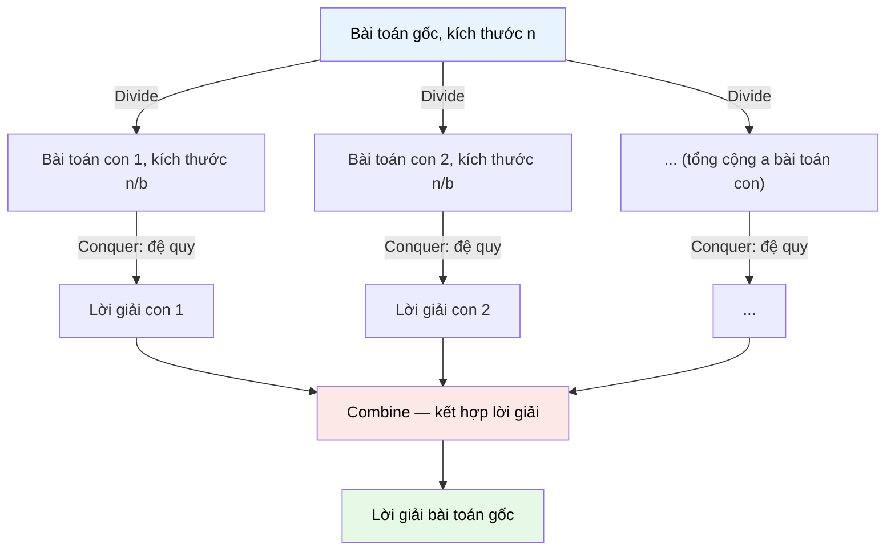

# MASTER COMPUTER SCIENCE HANDBOOK

## Volume 03 — Algorithms and Data Structures
### Part III — Algorithm Design Paradigms
## Chương 14 — Chia để trị
### (Divide and Conquer)

---

### Thông tin chương

| Trường | Giá trị |
|---|---|
| Chương | 14 |
| Thuộc Part | III — Algorithm Design Paradigms |
| Thuộc Volume | 03 — Algorithms and Data Structures |
| Thời gian đọc ước tính | 55–65 phút |
| Độ khó | ★★☆☆☆ |
| Kiến thức tiên quyết | Chương 13 — Brute Force và Exhaustive Search; Volume 3, Part I — Recurrence Relations, Master Theorem; Đệ quy cơ bản |
| Chương liên quan | 15 — Decrease and Conquer (phân biệt "chia thành nhiều bài toán con" với "giảm kích thước theo một hằng số"); 16 — Transform and Conquer; Volume 3, Part IV — Graph Algorithms (nhiều thuật toán đồ thị dùng lại tư duy Divide and Conquer) |
| Từ khóa | divide and conquer, recurrence relation, master theorem, merge sort, quick sort, binary search, closest pair, correctness proof by induction |

---

### Mục tiêu học tập

Sau khi hoàn thành chương này, người đọc có thể:

- Giải thích ba bước Divide → Conquer → Combine và nhận diện được cấu trúc này trong một thuật toán cho trước.
- Thiết lập và áp dụng Master Theorem để phân tích độ phức tạp của thuật toán Divide and Conquer mà không cần khai triển truy hồi từ đầu.
- Triển khai và phân tích ba thuật toán kinh điển: Merge Sort, Quick Sort, và Binary Search dưới góc nhìn Divide and Conquer thống nhất.
- Chứng minh tính đúng đắn (correctness) của một thuật toán Divide and Conquer bằng quy nạp trên kích thước bài toán.
- So sánh Divide and Conquer với Brute Force (Chương 13) để định lượng chính xác mức độ cải thiện về độ phức tạp.
- Nhận diện được ranh giới: khi nào một bài toán "chia tách được" và khi nào Divide and Conquer không mang lại lợi ích.

---

### Câu hỏi khơi gợi

> *Tại sao khi tìm một từ trong cuốn từ điển giấy dày hàng nghìn trang, bạn không bao giờ lật từng trang từ đầu — mà luôn mở ra một trang bất kỳ ở giữa, so sánh, rồi quyết định lật về phía trước hay phía sau? Và tại sao chiến lược "chia đôi" tưởng chừng đơn giản này lại là nền tảng của một trong những định lý phân tích thuật toán mạnh mẽ nhất mà bạn sẽ dùng lại xuyên suốt phần còn lại của Handbook?*

---

## 1. Tổng quan chương

Chương 13 đã thiết lập Brute Force như đường cơ sở: một chiến lược luôn đúng nhưng thường chậm, đặc biệt trên bài toán tổ hợp. Chương này giới thiệu paradigm cải tiến đầu tiên và có lẽ nổi tiếng nhất trong toàn bộ Computer Science: **Divide and Conquer (Chia để trị)**.

Ý tưởng cốt lõi khác biệt căn bản so với Brute Force: thay vì xét toàn bộ không gian khả dĩ một cách "phẳng" (flat), Divide and Conquer **chia bài toán gốc thành các bài toán con nhỏ hơn, có cùng bản chất với bài toán gốc, giải từng bài toán con một cách độc lập (thường bằng đệ quy), rồi kết hợp các lời giải con lại thành lời giải cho bài toán gốc**.

Chương này có bốn mục tiêu chính. Thứ nhất, hình thức hóa cấu trúc ba bước Divide → Conquer → Combine. Thứ hai, trang bị công cụ toán học quan trọng nhất để phân tích độ phức tạp của paradigm này: **Master Theorem**. Thứ ba, minh họa qua ba thuật toán kinh điển — Merge Sort, Quick Sort, Binary Search — mà bạn có thể đã dùng nhưng chưa từng nhìn dưới góc độ thống nhất. Thứ tư, xây dựng kỹ năng chứng minh tính đúng đắn bằng quy nạp, một kỹ năng sẽ tái sử dụng ở hầu hết các chương còn lại của Part III.

> **💡 Insight**
> Divide and Conquer trả lời trực tiếp câu hỏi kết ở Chương 13, Mục 12: *"paradigm này khai thác đặc điểm cấu trúc nào của bài toán để tránh phải xét toàn bộ không gian khả dĩ như Brute Force?"* Câu trả lời: nó khai thác tính chất **bài toán có thể chia tách thành các bài toán con độc lập, nhỏ hơn, cùng bản chất** — một tính chất mà không phải bài toán nào cũng có, nhưng khi có, mang lại cải thiện độ phức tạp rất lớn.

---

## 2. Bối cảnh lịch sử

| Thời điểm | Nhân vật / Sự kiện | Đóng góp |
|---|---|---|
| ~1805 | Carl Friedrich Gauss | Phát triển một kỹ thuật tính tích đa thức phức nhanh hơn cách nhân trực tiếp — về sau được công nhận là một trong những ứng dụng Divide and Conquer sớm nhất được ghi nhận, dù chưa được đặt tên chính thức |
| 1945 | John von Neumann | Mô tả **Merge Sort** trong một báo cáo kỹ thuật — một trong những thuật toán Divide and Conquer được hình thức hóa sớm nhất trên máy tính điện tử |
| 1959–1962 | Tony Hoare | Phát minh **Quick Sort** — một thuật toán Divide and Conquer khác, với chiến lược chia không đối xứng dựa trên phần tử chốt (pivot) |
| 1971 | Volker Strassen | Công bố thuật toán nhân ma trận nhanh hơn phương pháp cổ điển bằng cách chia ma trận thành các khối nhỏ hơn — ví dụ nổi tiếng cho thấy Divide and Conquer có thể cải thiện độ phức tạp *bậc đa thức*, không chỉ hằng số |
| Thập niên 1970 | Jon Bentley và cộng sự | Hình thức hóa **Master Theorem** như công cụ tổng quát để phân tích độ phức tạp của các thuật toán đệ quy dạng Divide and Conquer |

> **🔬 Research Connection**
> Thuật toán nhân ma trận của Strassen (1971) là minh chứng đầu tiên cho thấy Divide and Conquer không chỉ là một "mẹo lập trình" mà có thể mang lại đột phá lý thuyết thực sự — giảm độ phức tạp nhân hai ma trận $n \times n$ từ $O(n^3)$ (cách cổ điển) xuống còn khoảng $O(n^{2.807})$. Nghiên cứu tìm thuật toán nhân ma trận nhanh hơn nữa vẫn tiếp diễn đến ngày nay (thuật toán Coppersmith–Winograd và các biến thể sau này).

---

## 3. Động lực

Quay lại bài toán Sắp xếp (Sorting) — một trong những bài toán nền tảng nhất của Computer Science. Ở Chương 13, nếu áp dụng tư duy Brute Force cho sắp xếp (thử tất cả các hoán vị có thể và chọn hoán vị đã sắp xếp đúng thứ tự), độ phức tạp sẽ là $O(n!)$ — hoàn toàn không khả thi ngay cả với $n = 15$.

Nhưng trực giác con người khi sắp xếp một chồng bài lại khác hẳn: bạn hiếm khi thử "mọi cách xếp có thể". Thay vào đó, bạn có xu hướng **chia chồng bài thành hai nửa nhỏ hơn, sắp xếp riêng từng nửa (có thể bằng cách chia tiếp), rồi trộn hai nửa đã sắp xếp lại với nhau**. Đây chính xác là tư duy Divide and Conquer, và nó dẫn trực tiếp đến thuật toán Merge Sort — với độ phức tạp chỉ $O(n \log n)$, một cải thiện đáng kinh ngạc so với $O(n!)$ của Brute Force.

Động lực cốt lõi của chương này: **nhiều bài toán có một cấu trúc ẩn cho phép chia nhỏ mà Brute Force hoàn toàn bỏ qua**. Divide and Conquer là paradigm đầu tiên dạy bạn cách chủ động tìm kiếm và khai thác cấu trúc đó.

---

## 4. Trực giác

**Mô hình tinh thần (Mental Model) của chương này:**

> Divide and Conquer giống như việc bạn quản lý một đội ngũ lớn để hoàn thành một dự án khổng lồ: thay vì tự mình làm mọi việc, bạn **chia dự án thành các phần việc nhỏ hơn, giao cho các nhóm nhỏ độc lập xử lý song song (mỗi nhóm nhỏ tự áp dụng lại chiến lược "chia nhỏ" này nếu phần việc vẫn còn lớn), rồi tổng hợp kết quả từ các nhóm lại thành sản phẩm cuối cùng**.

| Trực giác đời thường | Khái niệm thuật toán tương ứng |
|---|---|
| Chia dự án lớn thành các phần việc nhỏ hơn | **Divide** — chia bài toán kích thước $n$ thành $a$ bài toán con kích thước $n/b$ |
| Giao mỗi phần việc cho một nhóm nhỏ xử lý độc lập | **Conquer** — giải từng bài toán con, thường bằng cách gọi đệ quy chính thuật toán đó |
| Trường hợp phần việc đã đủ nhỏ, một người có thể tự làm ngay | **Base case** — khi kích thước bài toán đủ nhỏ, giải trực tiếp không cần chia thêm |
| Tổng hợp kết quả các nhóm thành sản phẩm hoàn chỉnh | **Combine** — kết hợp lời giải của các bài toán con thành lời giải bài toán gốc |

---

## 5. Trực quan hóa khái niệm

**Hình 14.1 — Cấu trúc ba bước của Divide and Conquer**
*(Visual đặc trưng của chương — Chapter Identity)*



| Trường thông tin | Nội dung |
|---|---|
| Mục đích | Minh họa rằng Divide and Conquer không phải một thuật toán cụ thể, mà là một **khuôn mẫu (template)** áp dụng được cho nhiều bài toán khác nhau, miễn là bài toán đó có thể chia thành $a$ bài toán con kích thước $n/b$ |
| Điểm mấu chốt | So sánh với Hình 13.1 (Chương 13): Brute Force duyệt toàn bộ cây khả dĩ ở "một tầng phẳng"; Divide and Conquer tổ chức việc giải quyết theo **cấu trúc cây đệ quy có tầng**, và tại mỗi tầng chỉ cần xử lý phần Combine chứ không cần xét lại toàn bộ không gian khả dĩ |

---

**Hình 14.2 — Cây đệ quy của Merge Sort minh họa trực quan $T(n) = 2T(n/2) + O(n)$**

```text
                    [8, 3, 5, 1, 9, 2, 7, 4]              — tầng 0, chi phí Combine: O(8)
                  /                          \
        [8, 3, 5, 1]                    [9, 2, 7, 4]      — tầng 1, chi phí Combine: O(4) + O(4)
        /        \                      /        \
    [8, 3]      [5, 1]              [9, 2]      [7, 4]    — tầng 2, chi phí Combine: O(2) × 4
    /    \      /    \              /    \      /    \
  [8]   [3]  [5]    [1]          [9]    [2]  [7]    [4]   — tầng 3 (base case), chi phí O(1) × 8
```

*Mục đích:* cho thấy trực quan rằng cây đệ quy có $\log_2 n$ tầng (ở đây $n = 8$, nên có 4 tầng), và **tổng chi phí Combine ở mỗi tầng luôn xấp xỉ $O(n)$** — dẫn trực tiếp đến độ phức tạp tổng $O(n \log n)$ mà Master Theorem (Mục 7) sẽ chứng minh một cách tổng quát.

---

## 6. Định nghĩa hình thức

> **📌 Remember — Divide and Conquer**
>
> **Divide and Conquer** là một paradigm thiết kế thuật toán trong đó lời giải cho một bài toán kích thước $n$ được xây dựng qua ba bước:
>
> 1. **Divide:** chia bài toán gốc thành $a$ bài toán con, mỗi bài toán con có kích thước $n/b$ và có **cùng bản chất** với bài toán gốc (nghĩa là có thể áp dụng lại chính thuật toán đó một cách đệ quy).
> 2. **Conquer:** giải từng bài toán con một cách độc lập — thường bằng cách gọi đệ quy, cho đến khi đạt **base case** (bài toán đủ nhỏ để giải trực tiếp, không cần chia thêm).
> 3. **Combine:** kết hợp lời giải của các bài toán con thành lời giải cho bài toán gốc.
>
> Điều kiện tiên quyết để một bài toán áp dụng được Divide and Conquer: các bài toán con phải **độc lập** với nhau (lời giải của bài toán con này không phụ thuộc vào lời giải của bài toán con khác) — đây là điểm phân biệt quan trọng với Dynamic Programming (Chương 18), nơi các bài toán con **chồng lấp (overlapping)** và không độc lập.

---

## 7. Nền tảng toán học

### 7.1 Thiết lập Hệ thức truy hồi (Recurrence Relation)

Với một thuật toán Divide and Conquer chia bài toán kích thước $n$ thành $a$ bài toán con kích thước $n/b$, và chi phí kết hợp (Combine) là $f(n)$, thời gian chạy tổng quát được biểu diễn bằng hệ thức truy hồi:

$$T(n) = a \cdot T(n/b) + f(n)$$

Đây chính là dạng tổng quát của công thức đã được nhắc đến ở Volume 3, Part I khi học Recurrence Relations — chương này là nơi công thức đó được **áp dụng thực chiến** lần đầu tiên.

### 7.2 Master Theorem

> **📦 Formula Box — Master Theorem**
>
> Cho hệ thức truy hồi $T(n) = a \cdot T(n/b) + f(n)$ với $a \geq 1$, $b > 1$, và $f(n)$ là hàm dương. Đặt $n^{\log_b a}$ làm mốc so sánh. Khi đó:
>
> $$
> T(n) =
> \begin{cases}
> O(n^{\log_b a}) & \text{nếu } f(n) = O(n^{\log_b a - \epsilon}) \text{ với } \epsilon > 0 \\
> O(n^{\log_b a} \log n) & \text{nếu } f(n) = \Theta(n^{\log_b a}) \\
> O(f(n)) & \text{nếu } f(n) = \Omega(n^{\log_b a + \epsilon}) \text{ với } \epsilon > 0 \text{, và điều kiện chính quy thỏa mãn}
> \end{cases}
> $$
>
> | Thành phần | Ý nghĩa |
> |---|---|
> | $a$ | Số bài toán con được tạo ra ở mỗi lần chia |
> | $b$ | Hệ số chia kích thước (mỗi bài toán con có kích thước $n/b$) |
> | $f(n)$ | Chi phí của bước Divide + Combine tại mỗi tầng đệ quy (không tính phần đệ quy) |
> | $n^{\log_b a}$ | "Mốc so sánh" — đại diện cho chi phí nếu toàn bộ công việc dồn vào việc tạo và giải các bài toán con, không phải vào Combine |
> | **Diễn giải kỹ thuật** | Ba trường hợp tương ứng với ba tình huống: (1) chi phí Combine không đáng kể so với việc chia bài toán con → độ phức tạp do số lượng bài toán con quyết định; (2) chi phí Combine cân bằng với việc chia bài toán con → xuất hiện thêm hệ số $\log n$; (3) chi phí Combine áp đảo → độ phức tạp do chính $f(n)$ quyết định |
> | **Ứng dụng thường gặp** | Tránh phải khai triển thủ công cây đệ quy (như Hình 14.2) mỗi khi phân tích một thuật toán Divide and Conquer mới |

**Áp dụng cho Merge Sort:** $T(n) = 2T(n/2) + O(n)$, nên $a = 2$, $b = 2$, $f(n) = O(n)$. Ta có $n^{\log_b a} = n^{\log_2 2} = n^1 = n$. Vì $f(n) = \Theta(n) = \Theta(n^{\log_b a})$, rơi vào **Trường hợp 2** của Master Theorem: $T(n) = O(n \log n)$ — khớp chính xác với trực quan ở Hình 14.2 (số tầng là $\log n$, mỗi tầng tốn $O(n)$).

**Áp dụng cho Binary Search:** $T(n) = T(n/2) + O(1)$, nên $a = 1$, $b = 2$, $f(n) = O(1)$. Ta có $n^{\log_b a} = n^{\log_2 1} = n^0 = 1$. Vì $f(n) = \Theta(1) = \Theta(n^{\log_b a})$, cũng rơi vào **Trường hợp 2**: $T(n) = O(\log n)$.

---

## 8. Thuật toán / Cơ chế

### 8.1 Merge Sort

```text
Bước 1 — Nếu mảng A có 0 hoặc 1 phần tử: trả về A ngay (base case)
        │
        ▼
Bước 2 — Divide: chia A thành hai nửa trái (L) và phải (R)
        │
        ▼
Bước 3 — Conquer: gọi đệ quy Merge Sort trên L và trên R
        │
        ▼
Bước 4 — Combine: trộn (merge) hai mảng L và R đã sắp xếp
           thành một mảng kết quả duy nhất, đã sắp xếp
        │
        ▼
Bước 5 — Trả về mảng kết quả
```

- **Input:** mảng $A$ gồm $n$ phần tử có thể so sánh được.
- **Output:** mảng đã sắp xếp tăng dần.
- **Độ phức tạp thời gian:** $O(n \log n)$ trong mọi trường hợp (best, average, worst) — một ưu điểm quan trọng so với Quick Sort (Mục 8.2).
- **Độ phức tạp không gian:** $O(n)$ — cần bộ nhớ phụ để trộn mảng, khác với Quick Sort thường sắp xếp tại chỗ (in-place).

### 8.2 Quick Sort

```text
Bước 1 — Nếu mảng A có 0 hoặc 1 phần tử: trả về A ngay (base case)
        │
        ▼
Bước 2 — Divide: chọn một phần tử làm chốt (pivot); phân hoạch
           (partition) mảng thành hai phần: phần nhỏ hơn pivot,
           phần lớn hơn hoặc bằng pivot
        │
        ▼
Bước 3 — Conquer: gọi đệ quy Quick Sort trên từng phần
        │
        ▼
Bước 4 — Combine: ghép trực tiếp (không cần trộn phức tạp,
           vì hai phần đã ở đúng vị trí tương đối nhờ Bước 2)
```

- **Độ phức tạp thời gian:** trung bình $O(n \log n)$, nhưng **trường hợp xấu nhất là $O(n^2)$** — xảy ra khi việc chọn pivot liên tục tạo ra phân hoạch mất cân bằng (ví dụ mảng đã sắp xếp sẵn và luôn chọn phần tử đầu làm pivot).

> **⚠️ Common Mistake**
> Một hiểu lầm phổ biến là "Quick Sort luôn nhanh hơn Merge Sort vì tên gọi có chữ Quick". Trên thực tế, Merge Sort có độ phức tạp **đảm bảo** $O(n \log n)$ trong mọi trường hợp, trong khi Quick Sort chỉ đạt điều này *trung bình* — trường hợp xấu nhất của Quick Sort tệ hơn hẳn. Lựa chọn giữa hai thuật toán phụ thuộc vào ràng buộc thực tế: cần đảm bảo trường hợp xấu nhất (chọn Merge Sort) hay chấp nhận rủi ro đổi lấy hiệu năng trung bình tốt hơn và không cần bộ nhớ phụ (chọn Quick Sort).

### 8.3 Binary Search

```text
Bước 1 — Nếu khoảng tìm kiếm rỗng: trả về "không tìm thấy"
        │
        ▼
Bước 2 — Divide: xét phần tử ở giữa (mid) khoảng tìm kiếm hiện tại
        │
        ▼
Bước 3 — Nếu A[mid] == target: trả về mid (tìm thấy)
        │
        ▼
Bước 4 — Nếu A[mid] > target: Conquer — tìm kiếm đệ quy ở nửa trái
        │
        ▼
Bước 5 — Nếu A[mid] < target: Conquer — tìm kiếm đệ quy ở nửa phải
```

- **Điều kiện tiên quyết quan trọng:** mảng $A$ phải **đã được sắp xếp** — khác với Linear Search (Chương 13) không yêu cầu điều kiện này.
- **Độ phức tạp:** $O(\log n)$ — cải thiện vượt trội so với $O(n)$ của Linear Search, đổi lại yêu cầu dữ liệu có cấu trúc (đã sắp xếp).
- Bước Combine ở đây gần như "tầm thường" (trivial) — không cần kết hợp gì thêm, vì chỉ một trong hai bài toán con được giải (nửa còn lại bị loại bỏ hoàn toàn).

---

## 9. Triển khai

```python
def merge_sort(arr):
    """Sắp xếp mảng bằng Merge Sort — minh họa đầy đủ ba bước
    Divide, Conquer, Combine."""
    if len(arr) <= 1:                      # Base case
        return arr

    mid = len(arr) // 2                    # Divide
    left = merge_sort(arr[:mid])           # Conquer (đệ quy)
    right = merge_sort(arr[mid:])          # Conquer (đệ quy)

    return _merge(left, right)             # Combine


def _merge(left, right):
    """Trộn hai mảng đã sắp xếp thành một mảng duy nhất đã sắp xếp."""
    result = []
    i = j = 0
    while i < len(left) and j < len(right):
        if left[i] <= right[j]:
            result.append(left[i])
            i += 1
        else:
            result.append(right[j])
            j += 1
    result.extend(left[i:])
    result.extend(right[j:])
    return result


def quick_sort(arr):
    """Sắp xếp mảng bằng Quick Sort — phiên bản đơn giản, dễ đọc
    (chưa tối ưu bộ nhớ, chọn pivot ngây thơ là phần tử giữa)."""
    if len(arr) <= 1:                      # Base case
        return arr

    pivot = arr[len(arr) // 2]             # Divide: chọn pivot
    smaller = [x for x in arr if x < pivot]
    equal = [x for x in arr if x == pivot]
    larger = [x for x in arr if x > pivot]

    # Conquer + Combine
    return quick_sort(smaller) + equal + quick_sort(larger)


def binary_search(arr, target, low=0, high=None):
    """Tìm kiếm nhị phân trên mảng ĐÃ SẮP XẾP.
    Trả về chỉ số của target, hoặc -1 nếu không tìm thấy."""
    if high is None:
        high = len(arr) - 1
    if low > high:                         # Base case: không tìm thấy
        return -1

    mid = (low + high) // 2                # Divide
    if arr[mid] == target:
        return mid
    elif arr[mid] > target:
        return binary_search(arr, target, low, mid - 1)   # Conquer trái
    else:
        return binary_search(arr, target, mid + 1, high)  # Conquer phải
```

Cả ba hàm đều tuân theo đúng khuôn mẫu ba bước ở Mục 6: mỗi hàm có một **base case** rõ ràng, một bước **chia** tường minh, và một bước **kết hợp** (đối với `binary_search`, bước kết hợp gần như không tồn tại vì chỉ một nhánh được theo đuổi).

---

## 10. Trực quan hóa quá trình thực thi

**Vết thực thi của `merge_sort([8, 3, 5, 1])`:**

| Bước | Hành động | Trạng thái |
|---|---|---|
| 1 | Chia `[8, 3, 5, 1]` thành `[8, 3]` và `[5, 1]` | Divide |
| 2 | Chia `[8, 3]` thành `[8]` và `[3]` (base case) | Divide |
| 3 | Trộn `[8]` và `[3]` → `[3, 8]` | Combine |
| 4 | Chia `[5, 1]` thành `[5]` và `[1]` (base case) | Divide |
| 5 | Trộn `[5]` và `[1]` → `[1, 5]` | Combine |
| 6 | Trộn `[3, 8]` và `[1, 5]` → `[1, 3, 5, 8]` | Combine (kết quả cuối) |

Kết quả khớp chính xác với cây đệ quy ở Hình 14.2.

**So sánh thực nghiệm giữa Brute Force sắp xếp (thử mọi hoán vị, Chương 13) và Merge Sort:**

| $n$ | Brute Force ($O(n!)$) | Merge Sort ($O(n \log n)$) |
|---:|---|---|
| 5 | 120 phép thử | ~12 phép so sánh |
| 10 | 3.628.800 phép thử | ~33 phép so sánh |
| 20 | ~2,43 × 10¹⁸ phép thử (bất khả thi) | ~86 phép so sánh |

Bảng này định lượng chính xác điều đã hứa hẹn ở Mục 3: Divide and Conquer biến một bài toán *bất khả thi* bằng Brute Force ($n = 20$) thành một bài toán *tức thời* trên bất kỳ máy tính hiện đại nào.

---

## 11. Ứng dụng công nghiệp

> **🛠 Engineering Practice**
> Divide and Conquer là một trong những paradigm được triển khai thực tế nhiều nhất trong các thư viện chuẩn (standard library) của hầu hết ngôn ngữ lập trình.

| Bối cảnh công nghiệp | Vai trò của Divide and Conquer |
|---|---|
| Hàm sắp xếp mặc định của ngôn ngữ (Python `sorted()`, Java `Collections.sort()`) | Thường dùng biến thể lai (hybrid) giữa Merge Sort và Insertion Sort (ví dụ thuật toán **Timsort** trong Python) — kết hợp Divide and Conquer với tối ưu cho dữ liệu gần như đã sắp xếp |
| Tìm kiếm trong cơ sở dữ liệu có chỉ mục (B-Tree Index) | Cấu trúc B-Tree (sẽ gặp lại ở Volume 4) tận dụng nguyên lý tương tự Binary Search để giảm số lần truy cập đĩa từ $O(n)$ xuống $O(\log n)$ |
| Xử lý dữ liệu song song quy mô lớn (MapReduce) | Mô hình lập trình MapReduce (Volume 4) có cấu trúc tương tự Divide and Conquer: "Map" tương ứng với Divide + Conquer phân tán trên nhiều máy, "Reduce" tương ứng với Combine |
| Xử lý ảnh và đồ họa máy tính (Quadtree, KD-Tree) | Các cấu trúc dữ liệu không gian chia không gian 2D/3D thành các vùng nhỏ hơn đệ quy — ứng dụng trực tiếp tư duy Divide and Conquer cho dữ liệu hình học |

---

## 12. Góc nhìn nghiên cứu

> **🔬 Research Connection**
> Việc tìm ra thuật toán nhân ma trận nhanh nhất bằng Divide and Conquer vẫn là một hướng nghiên cứu tích cực cho đến ngày nay.

Sau đột phá của Strassen (1971, giảm từ $O(n^3)$ xuống $O(n^{2.807})$, Mục 2), nhiều nhà nghiên cứu tiếp tục cải thiện số mũ này bằng các kỹ thuật Divide and Conquer ngày càng tinh vi hơn — số mũ lý thuyết tốt nhất hiện nay đã giảm xuống dưới 2.4, dù các thuật toán đó thường không thực tế để triển khai do hằng số ẩn (constant factor) quá lớn. Câu hỏi mở nổi tiếng trong lý thuyết độ phức tạp: *số mũ tối ưu về mặt lý thuyết cho nhân ma trận là bao nhiêu — liệu có thể đạt tới 2 (tức là gần với độ phức tạp đọc dữ liệu đầu vào) hay không?* Đây vẫn là một bài toán mở của Computer Science lý thuyết.

**Câu hỏi mở** để suy ngẫm: Master Theorem (Mục 7.2) chỉ áp dụng khi các bài toán con có **cùng kích thước** ($n/b$). Điều gì xảy ra nếu các bài toán con có kích thước khác nhau (ví dụ Quick Sort với phân hoạch mất cân bằng)? Đây chính là hạn chế của Master Theorem cổ điển — các biến thể tổng quát hơn (Akra–Bazzi method) được phát triển để xử lý trường hợp này, và là một chủ đề bạn có thể tìm hiểu thêm khi phân tích Quick Sort trường hợp xấu nhất ở Bài tập 6.

---

## 13. Ưu điểm

- **Cải thiện độ phức tạp đáng kể so với Brute Force** khi bài toán có cấu trúc chia tách được — từ hàm mũ/giai thừa xuống còn $O(n \log n)$ hoặc thậm chí $O(\log n)$.
- **Tự nhiên song song hóa (parallelizable)** — vì các bài toán con độc lập với nhau, chúng có thể được giải đồng thời trên nhiều lõi xử lý hoặc nhiều máy tính (nền tảng của MapReduce, Mục 11).
- **Cấu trúc đệ quy rõ ràng, dễ chứng minh đúng đắn bằng quy nạp** — vì mỗi bài toán con có cùng bản chất với bài toán gốc, chứng minh correctness thường tự nhiên theo cấu trúc quy nạp trên kích thước.
- **Có công cụ phân tích độ phức tạp tổng quát (Master Theorem)** — không cần khai triển thủ công từng trường hợp cụ thể.

---

## 14. Hạn chế

> **⚠️ Common Mistake**
> Một sai lầm phổ biến là áp dụng Divide and Conquer cho mọi bài toán đệ quy, kể cả khi các bài toán con **không độc lập** (chồng lấp lẫn nhau) — dẫn đến việc tính toán lại cùng một bài toán con nhiều lần một cách lãng phí. Đây chính xác là vấn đề mà Dynamic Programming (Chương 18) được thiết kế để giải quyết.

- **Không phải bài toán nào cũng chia tách được** — nhiều bài toán không có cấu trúc con độc lập rõ ràng, khiến Divide and Conquer không áp dụng được trực tiếp.
- **Chi phí Combine có thể trở thành nút thắt cổ chai (bottleneck)** — nếu bước kết hợp tốn kém hơn dự kiến, lợi ích từ việc chia nhỏ có thể bị triệt tiêu (Master Theorem, Trường hợp 3).
- **Đệ quy có chi phí phụ trội (overhead)** — mỗi lệnh gọi hàm đệ quy tốn thêm bộ nhớ ngăn xếp (call stack); với $n$ rất lớn, có nguy cơ tràn ngăn xếp (stack overflow) nếu không cẩn thận.
- **Không đảm bảo hiệu năng nếu việc chia không cân bằng** — như đã thấy với Quick Sort (Mục 8.2), nếu phân hoạch liên tục mất cân bằng, độ phức tạp có thể suy biến về gần với Brute Force.

---

## 15. So sánh

**Bảng 14.1 — Ba thuật toán Divide and Conquer kinh điển**

| Thuật toán | $a$ (số bài toán con) | $b$ (hệ số chia) | $f(n)$ | Độ phức tạp (Master Theorem) | Yêu cầu dữ liệu |
|---|---:|---:|---|---|---|
| Merge Sort | 2 | 2 | $O(n)$ | $O(n \log n)$ | Không yêu cầu đã sắp xếp |
| Quick Sort (trung bình) | 2 | 2 | $O(n)$ | $O(n \log n)$ | Không yêu cầu đã sắp xếp |
| Binary Search | 1 | 2 | $O(1)$ | $O(\log n)$ | **Bắt buộc** đã sắp xếp |

**Bảng 14.2 — Divide and Conquer so với Brute Force (Chương 13)**

| Tiêu chí | Brute Force | Divide and Conquer |
|---|---|---|
| Cách tổ chức tìm kiếm | Duyệt phẳng toàn bộ không gian khả dĩ | Chia đệ quy thành các bài toán con nhỏ hơn |
| Yêu cầu về cấu trúc bài toán | Không yêu cầu gì đặc biệt | Yêu cầu bài toán chia tách được thành bài toán con độc lập, cùng bản chất |
| Độ phức tạp điển hình | $O(n)$ đến $O(n!)$ tùy bài toán | Thường $O(n \log n)$ hoặc $O(\log n)$ |
| Khả năng song song hóa | Hạn chế | Tự nhiên, vì bài toán con độc lập |

**Phân tích:** Bảng 14.1 cho thấy Master Theorem là một công cụ thống nhất, áp dụng được cho các thuật toán tưởng chừng rất khác nhau. Bảng 14.2 định lượng lại đúng thông điệp đã nêu ở Chương 13, Mục 15: Divide and Conquer là paradigm đầu tiên "trả giá" bằng một yêu cầu cấu trúc (bài toán phải chia tách được) để đổi lấy cải thiện độ phức tạp — một sự đánh đổi sẽ lặp lại dưới các hình thức khác ở mọi paradigm còn lại của Part III.

---

## 16. Tóm tắt

- **Divide and Conquer** giải một bài toán bằng ba bước: **Divide** (chia thành $a$ bài toán con kích thước $n/b$, độc lập, cùng bản chất với bài toán gốc), **Conquer** (giải đệ quy từng bài toán con), và **Combine** (kết hợp lời giải con thành lời giải gốc).
- **Master Theorem** là công cụ tổng quát để phân tích độ phức tạp của hệ thức truy hồi $T(n) = a \cdot T(n/b) + f(n)$, dựa trên việc so sánh $f(n)$ với $n^{\log_b a}$.
- **Merge Sort** ($O(n \log n)$ mọi trường hợp) và **Quick Sort** ($O(n \log n)$ trung bình, $O(n^2)$ xấu nhất) là hai thuật toán sắp xếp Divide and Conquer kinh điển, với đánh đổi khác nhau giữa đảm bảo hiệu năng và chi phí bộ nhớ.
- **Binary Search** ($O(\log n)$) minh họa trường hợp đặc biệt nơi chỉ một bài toán con được theo đuổi (nửa còn lại bị loại bỏ hoàn toàn), với điều kiện tiên quyết dữ liệu phải đã sắp xếp.
- So với Brute Force (Chương 13), Divide and Conquer đánh đổi một yêu cầu cấu trúc (bài toán phải chia tách được thành các phần độc lập) để đổi lấy cải thiện độ phức tạp đáng kể.

Chương 15 (Decrease and Conquer) sẽ giới thiệu một biến thể gần gũi nhưng khác biệt quan trọng: thay vì chia thành **nhiều** bài toán con, ta **giảm** kích thước bài toán theo một hằng số hoặc tỉ lệ cố định — và sẽ đối chiếu trực tiếp với Binary Search vừa học ở chương này để làm rõ ranh giới giữa hai paradigm.

---

## 17. Bài tập

### Mức Cơ bản (Basic)

1. Cho mảng `[6, 2, 9, 1, 5, 8]`, vẽ lại cây đệ quy đầy đủ của Merge Sort (giống Hình 14.2) và ghi rõ kết quả trộn tại mỗi bước Combine.
2. Với hệ thức truy hồi $T(n) = 4T(n/2) + O(n)$, áp dụng Master Theorem để xác định $T(n)$ là bao nhiêu. Chỉ rõ bạn đang ở trường hợp nào trong ba trường hợp của Master Theorem.
3. Giải thích bằng lời (không cần chứng minh hình thức) vì sao Binary Search yêu cầu mảng phải đã sắp xếp, trong khi Linear Search (Chương 13) thì không.

### Mức Trung bình (Intermediate)

4. Dùng kỹ thuật quy nạp trên kích thước bài toán (tương tự cách chứng minh đẳng thức tập hợp ở Volume 1, Chương 1.5, Mục 17) để chứng minh tính đúng đắn của hàm `merge_sort`: nếu `_merge` luôn trộn đúng hai mảng đã sắp xếp thành một mảng đã sắp xếp, thì `merge_sort` luôn trả về mảng đã sắp xếp đúng, với mọi $n \geq 0$.
5. Cài đặt thuật toán **Tìm phần tử lớn nhất và nhỏ nhất đồng thời (Simultaneous Min-Max)** bằng Divide and Conquer: chia mảng thành hai nửa, tìm (min, max) của từng nửa đệ quy, rồi kết hợp bằng cách so sánh hai cặp kết quả. So sánh số phép so sánh cần dùng với cách Brute Force duyệt tuyến tính thông thường.

### Mức Nâng cao (Advanced)

6. Phân tích trường hợp xấu nhất của Quick Sort: xây dựng một mảng đầu vào cụ thể (với chiến lược chọn pivot là phần tử đầu tiên) khiến Quick Sort đạt đúng độ phức tạp $O(n^2)$. Giải thích tại sao Master Theorem *không* áp dụng trực tiếp được cho trường hợp này (gợi ý: xem lại yêu cầu "các bài toán con có cùng kích thước" ở Mục 12).
7. Bài toán **Closest Pair of Points** (tìm cặp điểm gần nhau nhất trong mặt phẳng 2D) có lời giải Brute Force $O(n^2)$ (so sánh mọi cặp điểm) và lời giải Divide and Conquer $O(n \log n)$. Tìm hiểu (không cần cài đặt đầy đủ) ý tưởng chính của lời giải Divide and Conquer: bài toán được chia theo trục nào, và bước Combine cần xử lý thêm điều gì mà không thể bỏ qua đơn giản?

### Mức Nghiên cứu (Research)

8. Thuật toán nhân ma trận của Strassen (Mục 2, Mục 12) giảm số phép nhân từ 8 xuống 7 trong mỗi bước chia đôi ma trận, đổi lại tăng số phép cộng/trừ. Hãy tìm đọc tổng quan (không cần chứng minh) về ý tưởng cốt lõi của Strassen, và viết một đoạn ngắn (150–250 từ) giải thích: tại sao việc "giảm một phép nhân" trong mỗi bước đệ quy lại dẫn đến cải thiện số mũ từ 3 xuống khoảng 2.807 khi áp dụng Master Theorem, thay vì chỉ cải thiện một hằng số nhỏ?

---

## 18. Dự án nhỏ

**Dự án: Trình so sánh hiệu năng Sorting bằng Divide and Conquer**

- **Mục tiêu:** xây dựng một chương trình Python triển khai Merge Sort, Quick Sort, và (để đối chiếu) một thuật toán sắp xếp $O(n^2)$ đơn giản như Insertion Sort, sau đó đo và trực quan hóa hiệu năng của cả ba trên nhiều loại dữ liệu đầu vào khác nhau.
- **Yêu cầu:**
  - Cài đặt `merge_sort` và `quick_sort` theo đúng đặc tả ở Mục 9.
  - Sinh ba loại dữ liệu thử nghiệm: mảng ngẫu nhiên, mảng đã sắp xếp sẵn (trường hợp xấu nhất tiềm ẩn cho Quick Sort), và mảng sắp xếp ngược.
  - Đo thời gian chạy của cả ba thuật toán trên cả ba loại dữ liệu, với $n$ tăng dần (ví dụ 100, 1.000, 10.000).
  - Vẽ biểu đồ so sánh, làm nổi bật trường hợp Quick Sort suy biến gần $O(n^2)$ trên mảng đã sắp xếp sẵn.
- **Công nghệ đề xuất:** Python, `time`, `random`, `matplotlib`.
- **Kết quả mong đợi:** một báo cáo ngắn cho thấy bằng thực nghiệm sự khác biệt giữa "đảm bảo hiệu năng trong mọi trường hợp" (Merge Sort) và "hiệu năng tốt trung bình nhưng có thể suy biến" (Quick Sort).
- **Hướng mở rộng:** cải tiến chiến lược chọn pivot của Quick Sort (ví dụ chọn ngẫu nhiên, hoặc median-of-three) và đo xem điều này giảm thiểu rủi ro trường hợp xấu nhất như thế nào.

---

## 19. Tự đánh giá

- [ ] Tôi có thể giải thích rõ ràng ba bước Divide, Conquer, Combine và chỉ ra chính xác từng bước trong cả ba thuật toán ở Mục 8.
- [ ] Tôi có thể thiết lập hệ thức truy hồi $T(n) = aT(n/b) + f(n)$ cho một thuật toán Divide and Conquer mới (chưa từng gặp), và áp dụng Master Theorem để suy ra độ phức tạp mà không cần vẽ cây đệ quy đầy đủ.
- [ ] Tôi hiểu vì sao Merge Sort đảm bảo $O(n \log n)$ trong mọi trường hợp trong khi Quick Sort có thể suy biến thành $O(n^2)$, và có thể nêu ví dụ cụ thể gây ra trường hợp xấu nhất.
- [ ] Tôi đã hoàn thành phần chứng minh quy nạp ở Bài tập 4, áp dụng đúng kỹ thuật đã học từ Volume 1.
- [ ] Tôi có thể phân biệt rõ ràng Divide and Conquer với Brute Force (Chương 13): cụ thể là loại cấu trúc bài toán nào Divide and Conquer khai thác được mà Brute Force bỏ qua.

Nếu việc áp dụng Master Theorem ở Bài tập 2 vẫn còn lúng túng, hãy quay lại Mục 7.2 và thử áp dụng lại cho cả ba ví dụ ở Mục 7.2 và Bảng 14.1 trước khi tiếp tục — kỹ năng này sẽ được dùng lại thường xuyên ở Chương 15 và Chương 16.

---

## 20. Đọc thêm

- **Sách:** Thomas H. Cormen, Charles E. Leiserson, Ronald L. Rivest, Clifford Stein, *Introduction to Algorithms* (CLRS) — Chương về Divide and Conquer và chứng minh chi tiết Master Theorem. *(Xem BOOKS.md — Volume 3.)*
- **Sách:** Steven Skiena, *The Algorithm Design Manual* — phần catalog thuật toán sắp xếp, kèm phân tích thực nghiệm. *(Xem BOOKS.md — Volume 3.)*
- **Chủ đề mở rộng (không bắt buộc):** tìm đọc tổng quan không kỹ thuật về thuật toán nhân ma trận của Strassen và các cải tiến sau này, để mở rộng trực giác về giới hạn lý thuyết của Divide and Conquer.
- **Chương tiếp theo:** Chương 15 — Decrease and Conquer.

---

### Liên kết chương (Cross References)

- **Chương trước:** Chương 13 — Brute Force và Exhaustive Search (Divide and Conquer là cải tiến trực tiếp đầu tiên, khai thác cấu trúc chia tách được của bài toán).
- **Chương tiếp theo:** Chương 15 — Decrease and Conquer (phân biệt "chia thành nhiều bài toán con" với "giảm kích thước theo hằng số/tỉ lệ" — đối chiếu trực tiếp với Binary Search vừa học).
- **Chương liên quan xa hơn:** Chương 16 — Transform and Conquer; Chương 18–19 — Dynamic Programming (áp dụng cho trường hợp các bài toán con **không độc lập**, khác với điều kiện tiên quyết của chương này); Volume 3, Part IV — Graph Algorithms (nhiều thuật toán dùng lại tư duy chia để trị trên cấu trúc đồ thị).
- **Vị trí trong Knowledge Graph:** Nút thứ hai của Volume 3, Part III, phụ thuộc trực tiếp vào Chương 13 (đường cơ sở so sánh) và Recurrence Relations (Part I); là điều kiện tiên quyết khái niệm cho Chương 15 và Chương 16.

---

*Hết Chương 14. Chương này tuân thủ đầy đủ cấu trúc 20 mục của `OUTPUT.md` và chuẩn Presentation Layer của `WRITING_STANDARD.md`, khớp với outline đã thống nhất cho Volume 3, Part III. Master Theorem được trình bày đầy đủ ba trường hợp kèm ví dụ áp dụng cụ thể cho cả ba thuật toán kinh điển của chương. Đang chờ rà soát trước khi tiếp tục sang Chương 15 — Decrease and Conquer.*
