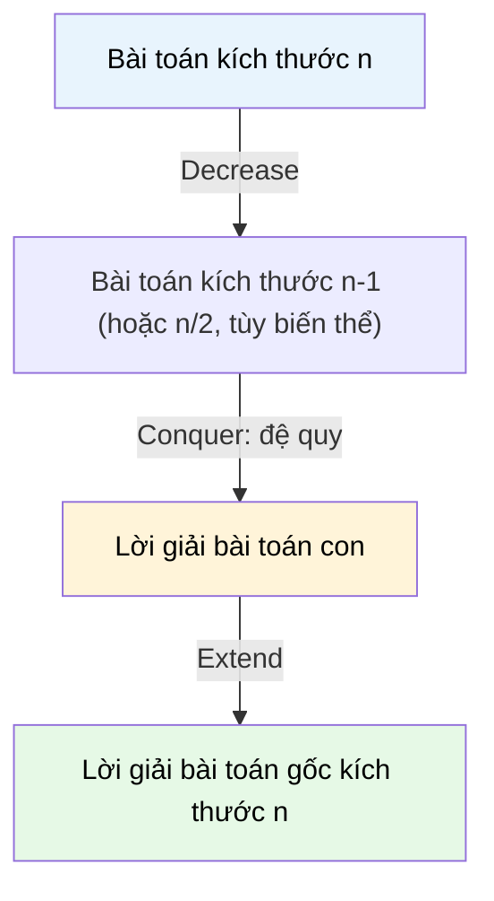

# MASTER COMPUTER SCIENCE HANDBOOK

## Volume 03 — Algorithms and Data Structures
### Part III — Algorithm Design Paradigms
## Chương 15 — Giảm để trị
### (Decrease and Conquer)

---

### Thông tin chương

| Trường | Giá trị |
|---|---|
| Chương | 15 |
| Thuộc Part | III — Algorithm Design Paradigms |
| Thuộc Volume | 03 — Algorithms and Data Structures |
| Thời gian đọc ước tính | 50–60 phút |
| Độ khó | ★★☆☆☆ |
| Kiến thức tiên quyết | Chương 13 — Brute Force và Exhaustive Search; Chương 14 — Divide and Conquer; Volume 3, Part I — Recurrence Relations |
| Chương liên quan | 14 — Divide and Conquer (đối chiếu trực tiếp: "chia thành nhiều bài toán con" so với "giảm kích thước theo một hằng số/tỉ lệ"); 16 — Transform and Conquer; Volume 3, Part IV — Graph Algorithms (Topological Sort được giới thiệu ở chương này sẽ dùng lại đầy đủ) |
| Từ khóa | decrease and conquer, decrease by constant, decrease by constant factor, variable-size decrease, insertion sort, euclid's algorithm, topological sort |

---

### Mục tiêu học tập

Sau khi hoàn thành chương này, người đọc có thể:

- Định nghĩa Decrease and Conquer và phân biệt chính xác nó với Divide and Conquer (Chương 14) — cụ thể là số lượng bài toán con được tạo ra ở mỗi bước.
- Nhận diện ba biến thể của Decrease and Conquer: giảm theo hằng số (decrease by constant), giảm theo hệ số hằng (decrease by constant factor), và giảm theo kích thước biến đổi (variable-size decrease).
- Triển khai và phân tích ba thuật toán tiêu biểu: Insertion Sort, Thuật toán Euclid, và Topological Sort dưới góc nhìn Decrease and Conquer thống nhất.
- Đối chiếu lại Binary Search (đã học ở Chương 14) để làm rõ ranh giới mờ giữa Divide and Conquer và Decrease and Conquer trong tài liệu học thuật.
- Lựa chọn đúng biến thể Decrease and Conquer phù hợp với đặc điểm cấu trúc của một bài toán cho trước.

---

### Câu hỏi khơi gợi

> *Bạn có để ý rằng khi sắp xếp một cỗ bài trên tay theo thói quen tự nhiên, bạn thường cầm từng lá bài mới rút được và chèn nó vào đúng vị trí giữa các lá đã được sắp xếp trước đó — chứ không chia cỗ bài thành hai nửa như ở Chương 14? Và tại sao thuật toán Euclid tìm ước chung lớn nhất, được phát biểu từ hơn 2.300 năm trước, lại chia sẻ chung một cấu trúc tư duy với chính thói quen sắp xếp bài đó?*

---

## 1. Tổng quan chương

Chương 14 đã giới thiệu Divide and Conquer: chia bài toán kích thước $n$ thành **nhiều** ($a \geq 2$) bài toán con độc lập, giải từng bài toán con, rồi kết hợp lại. Chương này giới thiệu một paradigm gần gũi nhưng có một khác biệt cấu trúc quan trọng: **Decrease and Conquer (Giảm để trị)**.

Ý tưởng cốt lõi: thay vì chia bài toán thành nhiều bài toán con độc lập, Decrease and Conquer **giảm kích thước bài toán xuống một bài toán con duy nhất, nhỏ hơn**, giải bài toán con đó (thường bằng đệ quy), rồi **mở rộng** lời giải đó thành lời giải cho bài toán gốc. Sự khác biệt tưởng chừng nhỏ này — một bài toán con thay vì nhiều bài toán con — dẫn đến những đặc điểm phân tích và cài đặt khác biệt đáng kể.

Chương này có bốn mục tiêu. Thứ nhất, hình thức hóa định nghĩa Decrease and Conquer và làm rõ ranh giới với Divide and Conquer — một điểm mà nhiều tài liệu học thuật trình bày không nhất quán. Thứ hai, giới thiệu ba biến thể cụ thể của paradigm này. Thứ ba, minh họa qua ba thuật toán kinh điển thuộc ba biến thể khác nhau: Insertion Sort, Thuật toán Euclid, Topological Sort. Thứ tư, quay lại đối chiếu Binary Search (Chương 14) để giải quyết một câu hỏi thường gây nhầm lẫn: Binary Search thuộc paradigm nào?

> **💡 Insight**
> Nếu Divide and Conquer trả lời câu hỏi "làm sao chia bài toán thành nhiều mảnh độc lập để xử lý song song", thì Decrease and Conquer trả lời một câu hỏi khác: "làm sao dùng lời giải của một bài toán *nhỏ hơn một chút* để xây dựng lời giải cho bài toán hiện tại, mà không cần chia thành nhiều nhánh song song". Đây là hai chiến lược giảm độ phức tạp khác nhau, và việc phân biệt chúng giúp bạn chọn đúng công cụ tư duy khi đối mặt bài toán mới.

---

## 2. Bối cảnh lịch sử

| Thời điểm | Nhân vật / Sự kiện | Đóng góp |
|---|---|---|
| ~300 TCN | Euclid, trong bộ *Elements* | Mô tả **Thuật toán Euclid** tìm ước chung lớn nhất (Greatest Common Divisor — GCD) — một trong những thuật toán lâu đời nhất còn được sử dụng nguyên vẹn cho đến ngày nay, và là ví dụ kinh điển nhất của Decrease and Conquer dạng "giảm theo kích thước biến đổi" |
| Thời kỳ tiền máy tính | Các phương pháp sắp xếp thủ công (bài, hồ sơ giấy tờ) | Tiền thân trực giác của Insertion Sort — con người có xu hướng tự nhiên chèn từng phần tử mới vào đúng vị trí, thay vì chia để trị |
| 1958 | Robert Tarjan (sau này, cùng nhiều nhà nghiên cứu khác) | Hình thức hóa và phân tích độ phức tạp của **Topological Sort** trên đồ thị có hướng không chu trình (DAG) — ứng dụng dạng "giảm theo hằng số" của Decrease and Conquer trên cấu trúc đồ thị |
| Thập niên 1970 | Anany Levitin và các nhà nghiên cứu sư phạm thuật toán | Hệ thống hóa thuật ngữ "Decrease and Conquer" như một paradigm riêng biệt, tách bạch rõ với Divide and Conquer, phổ biến trong các giáo trình thuật toán hiện đại |

> **🔬 Research Connection**
> Thuật toán Euclid không chỉ là một thuật toán số học cổ điển — độ phức tạp của nó ($O(\log(\min(a,b)))$) liên quan mật thiết đến dãy số Fibonacci: trường hợp xấu nhất của thuật toán Euclid xảy ra chính xác khi hai số đầu vào là hai số Fibonacci liên tiếp. Đây là một trong những kết nối đẹp và bất ngờ nhất giữa lý thuyết số và phân tích độ phức tạp thuật toán.

---

## 3. Động lực

Hãy xét lại bài toán Sắp xếp đã dùng ở Chương 14, nhưng từ một góc nhìn khác. Giả sử bạn đã có một mảng gồm $n - 1$ phần tử **đã được sắp xếp sẵn**, và bạn nhận thêm một phần tử mới. Câu hỏi tự nhiên nhất không phải là "làm sao chia lại toàn bộ $n$ phần tử thành hai nửa" (tư duy Chương 14), mà là: **"tôi đã có lời giải cho bài toán $n-1$ phần tử — làm sao tận dụng nó để giải bài toán $n$ phần tử?"**

Đây chính xác là tình huống khi bạn chèn từng lá bài mới vào một cỗ bài đã sắp xếp trên tay: bạn không chia lại toàn bộ cỗ bài, mà chỉ tìm đúng vị trí để chèn lá bài mới vào phần đã sắp xếp. Tư duy này dẫn trực tiếp đến **Insertion Sort**.

Một tình huống khác: giả sử bạn cần tìm ước chung lớn nhất của hai số rất lớn. Thay vì liệt kê mọi ước số của cả hai số (Brute Force, Chương 13), bạn có thể nhận ra một tính chất toán học: $\gcd(a, b) = \gcd(b, a \bmod b)$ — bài toán gốc được **giảm** thành một bài toán tương tự nhưng với hai số nhỏ hơn, không cần chia thành nhiều nhánh song song.

Động lực cốt lõi của chương này: có những bài toán mà việc **tận dụng trực tiếp lời giải của phiên bản nhỏ hơn một chút** hiệu quả hơn (hoặc tự nhiên hơn) so với việc chia thành nhiều bài toán con độc lập.

---

## 4. Trực giác

**Mô hình tinh thần (Mental Model) của chương này:**

> Decrease and Conquer giống như việc leo một cầu thang: bạn không "chia" cầu thang thành nhiều đoạn để nhiều người trèo song song (đó là tư duy Chương 14) — bạn chỉ đơn giản **giả định rằng mình đã biết cách lên đến bậc thứ $n-1$, và tập trung suy nghĩ duy nhất một câu hỏi: làm sao từ bậc $n-1$ bước thêm một bước để lên bậc $n$**.

| Trực giác đời thường | Khái niệm thuật toán tương ứng |
|---|---|
| Giả định đã biết cách lên đến bậc $n - 1$ | Giả thiết quy nạp — lời giải cho bài toán con kích thước nhỏ hơn đã có sẵn (thường qua đệ quy) |
| Chỉ cần suy nghĩ về bước cuối cùng (từ $n-1$ lên $n$) | Bước "Extend" — mở rộng lời giải bài toán con thành lời giải bài toán gốc |
| Không cần chia cầu thang thành nhiều đoạn song song | Khác biệt cốt lõi với Divide and Conquer: chỉ có **một** bài toán con được giải, không phải nhiều |
| Chèn lá bài mới vào đúng vị trí trong cỗ bài đã sắp xếp | Insertion Sort — ví dụ cụ thể nhất của mô hình tinh thần này |

---

## 5. Trực quan hóa khái niệm

**Hình 15.1 — Cấu trúc "một nhánh duy nhất" của Decrease and Conquer, đối chiếu với Hình 14.1**
*(Visual đặc trưng của chương — Chapter Identity)*



| Trường thông tin | Nội dung |
|---|---|
| Mục đích | Nhấn mạnh khác biệt cấu trúc cốt lõi so với Hình 14.1: ở đây chỉ có **một nhánh** duy nhất được tạo ra ở mỗi bước, không phải $a \geq 2$ nhánh song song |
| Điểm mấu chốt | Bước "Combine" của Divide and Conquer (kết hợp nhiều lời giải con) được thay bằng bước **"Extend"** — mở rộng một lời giải con duy nhất; đây là lý do một số tài liệu gọi bước này là "Adjoin" thay vì "Combine" |

---

**Hình 15.2 — Ba biến thể của Decrease and Conquer**

```text
┌─────────────────────────────┬──────────────────────┬─────────────────────────┐
│ Decrease by Constant         │ Decrease by Constant  │ Variable-Size Decrease  │
│ (giảm theo hằng số, thường=1)│ Factor (giảm theo tỉ lệ)│ (giảm theo kích thước   │
│                               │                        │  thay đổi mỗi bước)     │
├─────────────────────────────┼──────────────────────┼─────────────────────────┤
│ n → n-1 → n-2 → ... → 1      │ n → n/2 → n/4 → ... → 1│ n → (kích thước tùy      │
│                               │                        │  thuộc dữ liệu cụ thể)  │
│ Ví dụ: Insertion Sort        │ Ví dụ: Binary Search   │ Ví dụ: Thuật toán Euclid│
│         Topological Sort     │        (đối chiếu C.14)│         (a,b)→(b,a mod b)│
└─────────────────────────────┴──────────────────────┴─────────────────────────┘
```

*Mục đích:* phân loại rõ ràng ba biến thể — điều này quan trọng vì mỗi biến thể có đặc điểm phân tích độ phức tạp khác nhau (tuyến tính, logarit, hoặc phụ thuộc dữ liệu). *Điểm mấu chốt:* Binary Search xuất hiện lại ở đây — một điểm sẽ được làm rõ ở Mục 15.

---

## 6. Định nghĩa hình thức

> **📌 Remember — Decrease and Conquer**
>
> **Decrease and Conquer** là một paradigm thiết kế thuật toán trong đó lời giải cho một bài toán kích thước $n$ được xây dựng qua ba bước:
>
> 1. **Decrease:** giảm bài toán kích thước $n$ thành **một** bài toán con duy nhất, có cùng bản chất, với kích thước nhỏ hơn.
> 2. **Conquer:** giải bài toán con đó — thường bằng đệ quy, cho đến khi đạt base case.
> 3. **Extend (hoặc Adjoin):** mở rộng lời giải của bài toán con thành lời giải cho bài toán gốc.
>
> Khác biệt định danh so với Divide and Conquer (Chương 14): ở mỗi bước, Decrease and Conquer chỉ tạo ra **đúng một** bài toán con, trong khi Divide and Conquer tạo ra $a \geq 2$ bài toán con độc lập.

Ba biến thể chính thức:

| Biến thể | Kích thước bài toán con | Ví dụ tiêu biểu |
|---|---|---|
| **Decrease by a Constant** | $n - c$ (thường $c = 1$) | Insertion Sort, Topological Sort |
| **Decrease by a Constant Factor** | $n / b$ (thường $b = 2$) | Binary Search |
| **Variable-Size Decrease** | Kích thước giảm một lượng phụ thuộc vào dữ liệu cụ thể, không cố định | Thuật toán Euclid |

---

## 7. Nền tảng toán học

### 7.1 Độ phức tạp của Decrease by a Constant

Khi bài toán giảm theo hằng số $c$ (thường là 1) ở mỗi bước, hệ thức truy hồi có dạng:

$$T(n) = T(n - 1) + f(n)$$

> **📦 Formula Box — Decrease by Constant: trường hợp $f(n) = O(n)$**
>
> $$T(n) = T(n-1) + O(n) \implies T(n) = O(n^2)$$
>
> | Thành phần | Ý nghĩa |
> |---|---|
> | $T(n-1)$ | Chi phí giải bài toán con kích thước $n-1$ |
> | $f(n) = O(n)$ | Chi phí của bước Decrease + Extend tại kích thước $n$ (ví dụ: tìm vị trí chèn trong Insertion Sort) |
> | **Diễn giải kỹ thuật** | Khai triển: $T(n) = f(n) + f(n-1) + \dots + f(1) = O(n) + O(n-1) + \dots + O(1) = O(n^2)$ — đây là tổng của một cấp số cộng, không phải cấp số nhân như Divide and Conquer |
> | **Ứng dụng thường gặp** | Giải thích trực tiếp vì sao Insertion Sort có độ phức tạp $O(n^2)$ — chậm hơn Merge Sort ($O(n \log n)$, Chương 14) về mặt lý thuyết, nhưng đơn giản hơn và thực sự nhanh hơn trên dữ liệu nhỏ hoặc gần như đã sắp xếp |

### 7.2 Độ phức tạp của Decrease by a Constant Factor

Khi bài toán giảm theo hệ số $b$ (thường là 2) ở mỗi bước:

$$T(n) = T(n/b) + f(n)$$

Đây thực chất là trường hợp đặc biệt của Master Theorem (Chương 14, Mục 7.2) với $a = 1$. Với Binary Search, $f(n) = O(1)$, dẫn đến $T(n) = O(\log n)$ — đã chứng minh ở Chương 14.

### 7.3 Độ phức tạp của Thuật toán Euclid (Variable-Size Decrease)

> **📦 Formula Box — Thuật toán Euclid**
>
> $$\gcd(a, b) = \gcd(b, a \bmod b), \quad \text{với } \gcd(a, 0) = a$$
>
> | Thành phần | Ý nghĩa |
> |---|---|
> | $a, b$ | Hai số nguyên dương cần tìm ước chung lớn nhất |
> | $a \bmod b$ | Phần dư của phép chia $a$ cho $b$ |
> | **Diễn giải kỹ thuật** | Mọi ước chung của $a$ và $b$ cũng là ước chung của $b$ và $a \bmod b$ — vì $a = qb + (a \bmod b)$ với $q$ nguyên, nên bất kỳ số nào chia hết cả $a$ và $b$ cũng chia hết $(a \bmod b)$ |
> | **Độ phức tạp** | $O(\log(\min(a, b)))$ — có thể chứng minh bằng cách chỉ ra rằng sau mỗi hai bước, cặp số giảm ít nhất một nửa; trường hợp xấu nhất xảy ra khi $a, b$ là hai số Fibonacci liên tiếp (Mục 2) |
> | **Ứng dụng thường gặp** | Rút gọn phân số, thuật toán mật mã RSA (Volume 3, Part VII và Volume 1), kiểm tra hai số nguyên tố cùng nhau |

**Kiểm chứng bằng tay** với $\gcd(48, 18)$: $\gcd(48, 18) = \gcd(18, 48 \bmod 18) = \gcd(18, 12) = \gcd(12, 6) = \gcd(6, 0) = 6$. Kích thước bài toán giảm từ $(48, 18) \to (18, 12) \to (12, 6) \to (6, 0)$ — mỗi bước giảm một lượng khác nhau, không cố định, đúng như tên gọi "variable-size decrease".

---

## 8. Thuật toán / Cơ chế

### 8.1 Insertion Sort (Decrease by a Constant)

```text
Bước 1 — Nếu mảng A chỉ có 1 phần tử: đã sắp xếp, dừng (base case)
        │
        ▼
Bước 2 — Decrease: giả sử A[0..n-2] (n-1 phần tử đầu) đã được sắp xếp
           (Conquer, thường bằng đệ quy hoặc vòng lặp)
        │
        ▼
Bước 3 — Extend: lấy phần tử cuối A[n-1], tìm đúng vị trí của nó
           trong phần đã sắp xếp A[0..n-2], và chèn vào đúng vị trí đó
        │
        ▼
Bước 4 — Kết quả: toàn bộ A[0..n-1] đã được sắp xếp
```

- **Độ phức tạp:** $O(n^2)$ trường hợp xấu nhất và trung bình, nhưng **$O(n)$ trường hợp tốt nhất** (khi mảng đã gần như sắp xếp sẵn) — một ưu điểm thực tế quan trọng so với Merge Sort/Quick Sort.

### 8.2 Thuật toán Euclid (Variable-Size Decrease)

```text
Bước 1 — Nhận vào hai số nguyên dương a, b
        │
        ▼
Bước 2 — Nếu b == 0: trả về a (base case, đây chính là gcd)
        │
        ▼
Bước 3 — Decrease + Conquer: gọi đệ quy euclid(b, a mod b)
```

Thuật toán này đặc biệt vì bước "Extend" gần như không tồn tại — lời giải của bài toán con **chính là** lời giải của bài toán gốc, không cần biến đổi thêm. Đây là biến thể đơn giản nhất về mặt cài đặt của Decrease and Conquer.

### 8.3 Topological Sort (Decrease by a Constant, trên đồ thị)

```text
Bước 1 — Nếu đồ thị không còn đỉnh nào: trả về danh sách rỗng (base case)
        │
        ▼
Bước 2 — Tìm một đỉnh v không có cạnh đi vào (in-degree = 0)
        │
        ▼
Bước 3 — Decrease: loại bỏ v và mọi cạnh đi ra từ v khỏi đồ thị,
           thu được đồ thị con với n-1 đỉnh
        │
        ▼
Bước 4 — Conquer: giải đệ quy Topological Sort trên đồ thị con
        │
        ▼
Bước 5 — Extend: đặt v ở đầu danh sách kết quả, trước kết quả đệ quy
```

> **💡 Insight**
> Topological Sort sẽ được trình bày đầy đủ và chi tiết hơn ở Volume 3, Part IV (Graph Algorithms), bao gồm cả cài đặt hiệu quả bằng Depth-First Search. Ở chương này, nó chỉ được giới thiệu như một ví dụ cho biến thể "Decrease by a Constant" trên cấu trúc dữ liệu đồ thị (Volume 3, Part II), minh họa rằng Decrease and Conquer không giới hạn ở dữ liệu tuyến tính như mảng hay số nguyên.

---

## 9. Triển khai

```python
def insertion_sort(arr):
    """Sắp xếp bằng Insertion Sort — minh họa Decrease by a Constant.
    Phiên bản lặp (iterative), tương đương về bản chất với đệ quy."""
    result = arr[:1]                        # Base case: 1 phần tử đã "sắp xếp"
    for i in range(1, len(arr)):
        key = arr[i]
        # Extend: tìm đúng vị trí chèn 'key' vào 'result' đã sắp xếp
        pos = len(result)
        while pos > 0 and result[pos - 1] > key:
            pos -= 1
        result.insert(pos, key)
    return result


def gcd_euclid(a, b):
    """Thuật toán Euclid — minh họa Variable-Size Decrease.
    Trả về ước chung lớn nhất của a và b."""
    if b == 0:                              # Base case
        return a
    return gcd_euclid(b, a % b)             # Decrease + Conquer


def topological_sort(graph):
    """Topological Sort ngây thơ theo tư duy Decrease by a Constant.
    graph: dict, key là đỉnh, value là danh sách đỉnh mà nó trỏ tới.
    Đây là phiên bản minh họa; phiên bản hiệu quả dùng DFS
    sẽ trình bày ở Volume 3, Part IV."""
    graph = {v: list(neighbors) for v, neighbors in graph.items()}
    result = []

    while graph:
        # Tìm đỉnh không có cạnh đi vào (in-degree = 0)
        all_targets = {t for neighbors in graph.values() for t in neighbors}
        candidates = [v for v in graph if v not in all_targets]
        if not candidates:
            raise ValueError("Đồ thị có chu trình — không thể Topological Sort")

        v = candidates[0]
        result.append(v)                    # Extend
        del graph[v]                        # Decrease

    return result
```

Ba hàm trên minh họa đúng ba biến thể ở Mục 6: `insertion_sort` (Decrease by a Constant), `gcd_euclid` (Variable-Size Decrease), `topological_sort` (Decrease by a Constant trên đồ thị).

---

## 10. Trực quan hóa quá trình thực thi

**Vết thực thi của `insertion_sort([5, 2, 4, 1])`:**

| Bước ($i$) | `key` | `result` trước khi chèn | `result` sau khi chèn |
|---:|---:|---|---|
| 1 | 2 | `[5]` | `[2, 5]` |
| 2 | 4 | `[2, 5]` | `[2, 4, 5]` |
| 3 | 1 | `[2, 4, 5]` | `[1, 2, 4, 5]` |

**Vết thực thi của `gcd_euclid(48, 18)`:**

| Lệnh gọi | $a$ | $b$ | $a \bmod b$ |
|---|---:|---:|---:|
| `gcd_euclid(48, 18)` | 48 | 18 | 12 |
| `gcd_euclid(18, 12)` | 18 | 12 | 6 |
| `gcd_euclid(12, 6)` | 12 | 6 | 0 |
| `gcd_euclid(6, 0)` | 6 | 0 | — (base case, trả về 6) |

**So sánh thực nghiệm giữa Insertion Sort ($O(n^2)$) và Merge Sort ($O(n \log n)$, Chương 14):**

| $n$ | Insertion Sort (số phép so sánh, xấp xỉ) | Merge Sort (số phép so sánh, xấp xỉ) |
|---:|---:|---:|
| 10 | ~45 | ~33 |
| 100 | ~4.950 | ~664 |
| 10.000 | ~49.995.000 | ~132.877 |

Bảng này cho thấy rõ: với $n$ nhỏ, khoảng cách giữa hai thuật toán không lớn — nhưng khi $n$ tăng, khoảng cách này giãn ra rất nhanh, minh họa cụ thể tại sao lựa chọn giữa Decrease and Conquer và Divide and Conquer phụ thuộc vào kích thước dữ liệu thực tế.

---

## 11. Ứng dụng công nghiệp

> **🛠 Engineering Practice**
> Dù có độ phức tạp lý thuyết kém hơn Divide and Conquer, các thuật toán Decrease and Conquer vẫn được dùng rộng rãi trong thực hành nhờ tính đơn giản và hiệu quả thực tế trên các trường hợp đặc biệt.

| Bối cảnh công nghiệp | Vai trò của Decrease and Conquer |
|---|---|
| Thư viện sắp xếp lai (Timsort trong Python, Java) | Dùng Insertion Sort cho các đoạn mảng nhỏ (thường dưới 64 phần tử) vì hiệu năng thực tế tốt hơn Merge Sort/Quick Sort ở kích thước nhỏ do chi phí phụ trội đệ quy thấp hơn |
| Mật mã học (RSA, trao đổi khóa) | Thuật toán Euclid mở rộng (Extended Euclidean Algorithm) là thành phần cốt lõi để tính nghịch đảo modulo — nền tảng của thuật toán RSA |
| Trình quản lý phụ thuộc gói phần mềm (npm, pip, Maven) | Topological Sort được dùng để xác định thứ tự cài đặt các gói phụ thuộc lẫn nhau, đảm bảo một gói luôn được cài sau các gói mà nó phụ thuộc |
| Hệ thống build (Makefile, Bazel, CI/CD pipeline) | Thứ tự thực thi các bước build phụ thuộc lẫn nhau cũng được xác định bằng Topological Sort trên đồ thị phụ thuộc (dependency graph) |

---

## 12. Góc nhìn nghiên cứu

> **🔬 Research Connection**
> Thuật toán Euclid, dù đã hơn 2.300 năm tuổi, vẫn là chủ đề nghiên cứu tích cực trong lý thuyết số tính toán (computational number theory) hiện đại.

Các biến thể mở rộng của thuật toán Euclid — như Extended Euclidean Algorithm (tính đồng thời hệ số Bézout) và Binary GCD Algorithm (thay phép chia bằng phép dịch bit, hiệu quả hơn trên phần cứng) — vẫn đang được nghiên cứu và tối ưu cho các ứng dụng mật mã học hiện đại, nơi tốc độ tính GCD trên các số nguyên cực lớn (hàng nghìn bit) ảnh hưởng trực tiếp đến hiệu năng của hệ thống mã hóa.

**Câu hỏi mở** để suy ngẫm: ở Mục 7.3, độ phức tạp $O(\log(\min(a,b)))$ của thuật toán Euclid liên hệ với dãy Fibonacci. Hãy thử tự đặt câu hỏi — nếu một thuật toán Decrease and Conquer khác cũng có kích thước bài toán con giảm theo một "tỉ lệ không cố định nhưng có cận dưới", liệu ta có thể luôn chứng minh được một cận trên logarit cho độ phức tạp hay không? Đây là câu hỏi kỹ thuật thường gặp khi phân tích các biến thể variable-size decrease mới.

---

## 13. Ưu điểm

- **Cài đặt đơn giản, thường không cần bước Combine phức tạp** — vì chỉ có một bài toán con, bước Extend thường đơn giản hơn nhiều so với bước Combine của Divide and Conquer.
- **Hiệu quả thực tế trên dữ liệu có cấu trúc đặc biệt** — Insertion Sort nhanh hơn Merge Sort trên mảng nhỏ hoặc gần như đã sắp xếp; đây là lý do các thư viện sắp xếp hiện đại kết hợp cả hai (Mục 11).
- **Tự nhiên phù hợp với bài toán có tính chất "xây dựng tuần tự"** — như Topological Sort, nơi mỗi bước thêm đúng một phần tử vào lời giải đang xây dựng.
- **Thuật toán Euclid minh họa rằng đôi khi bước Extend gần như "miễn phí"** — lời giải bài toán con chính là lời giải bài toán gốc, không cần biến đổi gì thêm.

---

## 14. Hạn chế

> **⚠️ Common Mistake**
> Một nhầm lẫn phổ biến là cho rằng "Decrease and Conquer luôn kém hơn Divide and Conquer vì độ phức tạp lý thuyết thường cao hơn". Điều này bỏ qua thực tế rằng hằng số ẩn (constant factor) và chi phí thực tế trên dữ liệu nhỏ có thể khiến Decrease and Conquer *nhanh hơn* trong thực hành, dù độ phức tạp tiệm cận kém hơn.

- **Độ phức tạp thường kém hơn Divide and Conquer trên dữ liệu lớn** — như Bảng ở Mục 10 cho thấy, $O(n^2)$ của Insertion Sort tệ hơn nhiều so với $O(n \log n)$ khi $n$ lớn.
- **Không tận dụng được khả năng song song hóa** — vì chỉ có một bài toán con được giải ở mỗi bước, không có gì để chạy song song, khác hẳn với Divide and Conquer (Chương 14, Mục 13).
- **Biến thể "Variable-Size Decrease" khó phân tích tổng quát** — không có một công cụ thống nhất như Master Theorem cho biến thể này; mỗi bài toán (như thuật toán Euclid) thường cần một lập luận riêng để chứng minh cận độ phức tạp.
- **Ranh giới với Divide and Conquer đôi khi không rõ ràng** — như sẽ thấy ở Mục 15, việc phân loại một thuật toán vào đúng paradigm đôi khi mang tính quy ước hơn là một quy tắc tuyệt đối.

---

## 15. So sánh

**Bảng 15.1 — Decrease and Conquer so với Divide and Conquer (Chương 14)**

| Tiêu chí | Decrease and Conquer | Divide and Conquer |
|---|---|---|
| Số bài toán con ở mỗi bước | Đúng 1 | $a \geq 2$ |
| Khả năng song song hóa | Không (chỉ một nhánh) | Có (nhiều nhánh độc lập) |
| Công cụ phân tích độ phức tạp | Không có công cụ thống nhất; Master Theorem áp dụng được cho trường hợp $a=1$ | Master Theorem (tổng quát cho $a \geq 1$) |
| Bước kết hợp | Extend/Adjoin (thường đơn giản) | Combine (có thể phức tạp, ví dụ trộn mảng) |
| Ví dụ | Insertion Sort, Euclid, Topological Sort | Merge Sort, Quick Sort |

**Trường hợp gây tranh cãi: Binary Search thuộc paradigm nào?**

Ở Chương 14, Binary Search được trình bày như một ví dụ Divide and Conquer với $a = 1$ (chỉ một trong hai nửa được theo đuổi). Tuy nhiên, chính vì $a = 1$, nhiều tài liệu (bao gồm cách phân loại của Levitin, Mục 2) xếp Binary Search vào nhóm **Decrease by a Constant Factor** — một biến thể của Decrease and Conquer, không phải Divide and Conquer.

> **⚠️ Common Mistake**
> Đừng cố gắng ghi nhớ một "câu trả lời đúng duy nhất" cho việc Binary Search thuộc paradigm nào — đây là một điểm mà chính cộng đồng học thuật không thống nhất hoàn toàn. Điều quan trọng hơn việc phân loại đúng tên gọi là **hiểu bản chất cấu trúc**: Binary Search tạo ra bao nhiêu bài toán con ở mỗi bước (câu trả lời: về mặt khái niệm có thể xét hai nửa, nhưng chỉ một nửa được thực sự giải), và điều đó ảnh hưởng thế nào đến độ phức tạp. Việc phân loại chỉ là công cụ hỗ trợ tư duy, không phải mục đích cuối cùng.

**Phân tích:** Ranh giới mờ giữa hai paradigm này thực ra minh họa một bài học quan trọng hơn cả bảng phân loại: Divide and Conquer và Decrease and Conquer nằm trên một **phổ liên tục** (spectrum), với tham số $a$ (số bài toán con) là trục phân biệt chính — $a = 1$ nghiêng về Decrease and Conquer, $a \geq 2$ nghiêng về Divide and Conquer.

---

## 16. Tóm tắt

- **Decrease and Conquer** giải một bài toán bằng cách giảm nó thành **một** bài toán con duy nhất (khác Divide and Conquer tạo ra nhiều bài toán con), giải bài toán con đó, rồi **Extend** lời giải thành lời giải bài toán gốc.
- Ba biến thể: **Decrease by a Constant** (Insertion Sort, Topological Sort, độ phức tạp thường $O(n^2)$ hoặc $O(n)$), **Decrease by a Constant Factor** (Binary Search, độ phức tạp $O(\log n)$), và **Variable-Size Decrease** (Thuật toán Euclid, độ phức tạp $O(\log(\min(a,b)))$).
- **Insertion Sort** có độ phức tạp $O(n^2)$ trung bình/xấu nhất nhưng $O(n)$ tốt nhất, khiến nó hiệu quả thực tế trên dữ liệu nhỏ hoặc gần đã sắp xếp — lý do nó vẫn được dùng trong các thư viện sắp xếp lai hiện đại.
- **Thuật toán Euclid** minh họa biến thể Variable-Size Decrease, với bước Extend gần như "miễn phí" — lời giải bài toán con chính là lời giải bài toán gốc.
- Ranh giới giữa Decrease and Conquer và Divide and Conquer không phải lúc nào cũng tuyệt đối (ví dụ Binary Search) — điều quan trọng là hiểu cấu trúc số lượng bài toán con, không phải ghi nhớ một cách phân loại cứng nhắc.

Chương 16 (Transform and Conquer) sẽ giới thiệu paradigm thứ ba của nhóm "biến đổi bài toán": thay vì chia (Chương 14) hay giảm (chương này), ta sẽ **biến đổi** bài toán hoặc dữ liệu sang một dạng biểu diễn khác dễ giải hơn — mở rộng thêm bộ công cụ tư duy cho Part III.

---

## 17. Bài tập

### Mức Cơ bản (Basic)

1. Mô phỏng từng bước của `insertion_sort([9, 3, 7, 1, 5])` theo đúng định dạng bảng vết thực thi ở Mục 10.
2. Tính $\gcd(105, 45)$ bằng tay, theo từng bước của thuật toán Euclid, và trình bày kết quả theo định dạng bảng ở Mục 10.
3. Giải thích bằng lời sự khác biệt cấu trúc cốt lõi giữa Decrease and Conquer và Divide and Conquer — cụ thể là số lượng bài toán con được tạo ra ở mỗi bước.

### Mức Trung bình (Intermediate)

4. Cài đặt phiên bản **đệ quy** (thay vì lặp) của `insertion_sort`, tuân theo đúng ba bước Decrease/Conquer/Extend ở Mục 8.1 (gợi ý: hàm đệ quy sắp xếp `arr[:-1]` trước, rồi chèn phần tử cuối vào).
5. Với đồ thị có hướng $\{A \to C, B \to C, C \to D\}$ (nghĩa là A và B đều trỏ tới C, C trỏ tới D), hãy mô phỏng từng bước của `topological_sort` ở Mục 9 và liệt kê thứ tự đỉnh được thêm vào kết quả.

### Mức Nâng cao (Advanced)

6. Chứng minh bằng quy nạp rằng `insertion_sort` (phiên bản đệ quy ở Bài tập 4) luôn trả về mảng đã sắp xếp đúng, với mọi $n \geq 0$ (gợi ý: dùng cùng kỹ thuật quy nạp đã áp dụng cho Merge Sort ở Chương 14, Bài tập 4, nhưng giả thiết quy nạp bây giờ chỉ cần đúng cho $n - 1$ thay vì cả hai nửa).
7. Bài toán tìm $\gcd(a,b)$ bằng Brute Force (Chương 13, kiểu duyệt mọi ước số từ $\min(a,b)$ trở xuống) có độ phức tạp $O(\min(a,b))$. Với $a, b$ là hai số Fibonacci liên tiếp lớn (ví dụ số Fibonacci thứ 40 và 41), so sánh số bước cần thiết giữa Brute Force và thuật toán Euclid, và giải thích bằng số liệu cụ thể tại sao khoảng cách này lớn đến vậy dù cả hai đều là "thuật toán đơn giản".

### Mức Nghiên cứu (Research)

8. Tìm hiểu (không cần chứng minh chi tiết) về **Extended Euclidean Algorithm** — biến thể mở rộng của thuật toán Euclid, tính đồng thời các hệ số $x, y$ sao cho $ax + by = \gcd(a,b)$ (đẳng thức Bézout). Viết một đoạn ngắn (150–250 từ) giải thích: thuật toán này vẫn tuân theo cấu trúc Decrease and Conquer như thế nào, và tại sao nó lại quan trọng đối với thuật toán mã hóa RSA (gợi ý: liên hệ đến khái niệm nghịch đảo modulo).

---

## 18. Dự án nhỏ

**Dự án: Bộ công cụ quản lý phụ thuộc gói phần mềm đơn giản**

- **Mục tiêu:** xây dựng một chương trình Python mô phỏng việc xác định thứ tự cài đặt các gói phần mềm có phụ thuộc lẫn nhau, sử dụng Topological Sort.
- **Yêu cầu:**
  - Biểu diễn các gói và quan hệ phụ thuộc dưới dạng đồ thị có hướng (dict, giống định dạng ở Mục 9).
  - Cài đặt `topological_sort` theo đúng đặc tả ở Mục 8.3 và 9.
  - Xử lý trường hợp phát hiện chu trình phụ thuộc (circular dependency) — in ra thông báo lỗi rõ ràng thay vì để chương trình chạy vô hạn.
  - Viết ít nhất năm bộ dữ liệu thử nghiệm khác nhau, bao gồm cả trường hợp có chu trình.
- **Công nghệ đề xuất:** Python, cấu trúc dữ liệu `dict`/`set` (Volume 3, Part II).
- **Kết quả mong đợi:** chương trình in ra đúng thứ tự cài đặt hợp lệ cho mỗi bộ dữ liệu không có chu trình, và phát hiện chính xác các trường hợp có chu trình.
- **Hướng mở rộng:** so sánh với phiên bản Topological Sort dùng Depth-First Search (sẽ học đầy đủ ở Volume 3, Part IV) về độ phức tạp thời gian trên đồ thị lớn.

---

## 19. Tự đánh giá

- [ ] Tôi có thể giải thích chính xác sự khác biệt cấu trúc giữa Decrease and Conquer và Divide and Conquer bằng một câu duy nhất (số lượng bài toán con ở mỗi bước).
- [ ] Tôi có thể phân loại đúng một thuật toán mới (chưa từng gặp) vào một trong ba biến thể: Decrease by Constant, Decrease by Constant Factor, hay Variable-Size Decrease.
- [ ] Tôi có thể tự tay tính $\gcd(a, b)$ bằng thuật toán Euclid cho hai số bất kỳ, và giải thích vì sao thuật toán này luôn dừng và luôn đúng.
- [ ] Tôi hiểu lý do thực tế (không chỉ lý thuyết) vì sao các thư viện sắp xếp hiện đại vẫn dùng Insertion Sort cho các đoạn mảng nhỏ, dù độ phức tạp tiệm cận kém hơn Merge Sort.
- [ ] Tôi đã hoàn thành chứng minh quy nạp ở Bài tập 6, áp dụng đúng kỹ thuật đã học từ Chương 14.

Nếu câu hỏi về việc phân loại Binary Search ở Mục 15 vẫn khiến bạn băn khoăn, đây là dấu hiệu tốt — nó cho thấy bạn đang chú ý đến bản chất cấu trúc thay vì chỉ ghi nhớ tên gọi, đúng như tinh thần của toàn bộ Part III.

---

## 20. Đọc thêm

- **Sách:** Anany Levitin, *Introduction to the Design and Analysis of Algorithms* — nguồn tham khảo chính thức cho cách phân loại ba biến thể Decrease and Conquer trình bày trong chương này. *(Bổ sung tham chiếu vào BOOKS.md — Volume 3, nếu chưa có.)*
- **Sách:** Thomas H. Cormen, Charles E. Leiserson, Ronald L. Rivest, Clifford Stein, *Introduction to Algorithms* (CLRS) — Chương về thuật toán Euclid và ứng dụng trong lý thuyết số. *(Xem BOOKS.md — Volume 3.)*
- **Chủ đề mở rộng (không bắt buộc):** tìm đọc về Binary GCD Algorithm — biến thể của thuật toán Euclid dùng phép dịch bit thay vì phép chia, hiệu quả hơn trên phần cứng hiện đại.
- **Chương tiếp theo:** Chương 16 — Transform and Conquer.

---

### Liên kết chương (Cross References)

- **Chương trước:** Chương 14 — Divide and Conquer (Decrease and Conquer là paradigm anh em gần gũi, khác biệt ở số lượng bài toán con được tạo ra ở mỗi bước — xem Bảng 15.1).
- **Chương tiếp theo:** Chương 16 — Transform and Conquer (paradigm thứ ba trong nhóm "biến đổi bài toán", tập trung vào biến đổi biểu diễn dữ liệu thay vì chia hay giảm kích thước).
- **Chương liên quan xa hơn:** Chương 17 — Greedy Algorithms (Topological Sort đôi khi được kết hợp với tư duy tham lam trong một số bài toán lập lịch); Volume 3, Part IV — Graph Algorithms (Topological Sort được trình bày đầy đủ với cài đặt DFS hiệu quả); Volume 1 — nền tảng lý thuyết số cho thuật toán Euclid và ứng dụng mật mã học.
- **Vị trí trong Knowledge Graph:** Nút thứ ba của Volume 3, Part III, phụ thuộc trực tiếp vào Chương 14 (đối chiếu cấu trúc); là điều kiện tiên quyết khái niệm cho Chương 16, và chuẩn bị nền tảng trực giác cho Topological Sort sẽ mở rộng ở Part IV.

---

*Hết Chương 15. Chương này tuân thủ đầy đủ cấu trúc 20 mục của `OUTPUT.md` và chuẩn Presentation Layer của `WRITING_STANDARD.md`, khớp với outline đã thống nhất cho Volume 3, Part III. Ranh giới mờ giữa Decrease and Conquer và Divide and Conquer (trường hợp Binary Search) được trình bày trung thực, không áp đặt một câu trả lời duy nhất, đúng nguyên tắc "phân biệt sự thật với ý kiến" khi tài liệu học thuật chưa thống nhất. Đang chờ rà soát trước khi tiếp tục sang Chương 16 — Transform and Conquer.*
