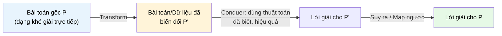

# MASTER COMPUTER SCIENCE HANDBOOK

## Volume 03 — Algorithms and Data Structures
### Part III — Algorithm Design Paradigms
## Chương 16 — Biến đổi để trị
### (Transform and Conquer)

---

### Thông tin chương

| Trường | Giá trị |
|---|---|
| Chương | 16 |
| Thuộc Part | III — Algorithm Design Paradigms |
| Thuộc Volume | 03 — Algorithms and Data Structures |
| Thời gian đọc ước tính | 50–60 phút |
| Độ khó | ★★☆☆☆ |
| Kiến thức tiên quyết | Chương 13 — Brute Force; Chương 14 — Divide and Conquer; Chương 15 — Decrease and Conquer; Volume 3, Part II — Heap, Hash Table |
| Chương liên quan | 14 — Divide and Conquer; 15 — Decrease and Conquer (ba chương này tạo thành "bộ ba biến đổi bài toán" của Part III); 17 — Greedy Algorithms (Huffman Coding dùng Heap, một cấu trúc "transformed"); Volume 1, Part IV — Calculus/Linear Algebra (Gaussian Elimination) |
| Từ khóa | transform and conquer, instance simplification, representation change, problem reduction, heapsort, gaussian elimination, presorting |

---

### Mục tiêu học tập

Sau khi hoàn thành chương này, người đọc có thể:

- Định nghĩa Transform and Conquer và phân biệt nó với Divide and Conquer (Chương 14) và Decrease and Conquer (Chương 15) — cụ thể ở chỗ bài toán không bị chia nhỏ hay giảm kích thước, mà được **biến đổi sang một dạng khác**.
- Nhận diện ba dạng biến đổi: đơn giản hóa thực thể (instance simplification), thay đổi biểu diễn (representation change), và quy giản bài toán (problem reduction).
- Triển khai và phân tích Heapsort như một ví dụ điển hình của representation change, tận dụng lại cấu trúc Heap đã học ở Part II.
- Giải thích ý tưởng của Gaussian Elimination như một ví dụ instance simplification, và Presorting như một kỹ thuật chuẩn bị dữ liệu phổ biến.
- Nhận ra khi nào nên "biến đổi bài toán thành một bài toán quen thuộc hơn" thay vì thiết kế thuật toán mới từ đầu — một kỹ năng tái sử dụng xuyên suốt các Volume sau của Handbook.

---

### Câu hỏi khơi gợi

> *Khi đối mặt với một bài toán hoàn toàn xa lạ, bạn có bao giờ nhận ra rằng nếu sắp xếp dữ liệu đầu vào trước, bài toán bỗng trở nên dễ giải hơn hẳn — dù việc sắp xếp đó không phải là yêu cầu của đề bài? Đó chính là một trong những "vũ khí bí mật" mạnh mẽ nhất của thiết kế thuật toán: đôi khi, cách giải quyết một bài toán khó không phải là tấn công trực diện, mà là biến nó thành một bài toán khác mà bạn đã biết cách giải.*

---

## 1. Tổng quan chương

Hai chương trước đã giới thiệu hai cách "thu nhỏ" một bài toán để dễ giải hơn: Divide and Conquer (Chương 14) chia thành nhiều bài toán con độc lập; Decrease and Conquer (Chương 15) giảm thành một bài toán con nhỏ hơn. Chương này giới thiệu paradigm thứ ba, hoàn toàn khác về bản chất: **Transform and Conquer (Biến đổi để trị)**.

Thay vì chia nhỏ hay giảm kích thước, Transform and Conquer giữ nguyên (hoặc gần như nguyên vẹn) kích thước bài toán, nhưng **biến đổi nó** — biến đổi dữ liệu đầu vào, biến đổi biểu diễn, hoặc biến đổi chính phát biểu bài toán — sang một dạng mà ta đã có sẵn công cụ hoặc thuật toán hiệu quả để giải.

Chương này có ba mục tiêu chính, tương ứng với ba dạng biến đổi. Thứ nhất, **instance simplification** (đơn giản hóa thực thể): biến đổi một thực thể bài toán khó thành một thực thể đơn giản hơn của cùng bài toán, minh họa qua Gaussian Elimination và Presorting. Thứ hai, **representation change** (thay đổi biểu diễn): biểu diễn lại dữ liệu dưới một cấu trúc khác để thuật toán trở nên tự nhiên và hiệu quả hơn, minh họa qua Heapsort. Thứ ba, **problem reduction** (quy giản bài toán): biến đổi bài toán A thành bài toán B đã biết cách giải, rồi dùng lời giải của B để suy ra lời giải của A.

> **💡 Insight**
> Nếu Chương 14 và 15 dạy bạn cách "thu nhỏ vấn đề", thì chương này dạy bạn một kỹ năng tinh tế hơn: **nhận diện rằng vấn đề bạn đang gặp thực chất là một vấn đề khác mà bạn đã biết cách giải, chỉ cần "phiên dịch" nó sang đúng ngôn ngữ**. Đây là một trong những kỹ năng tư duy giá trị nhất của một kỹ sư phần mềm hay nhà khoa học máy tính — và sẽ xuất hiện lặp lại xuyên suốt các Volume sau, đặc biệt trong Artificial Intelligence (Volume 5), nơi nhiều bài toán được "quy giản" về bài toán tối ưu hóa quen thuộc.

---

## 2. Bối cảnh lịch sử

| Thời điểm | Nhân vật / Sự kiện | Đóng góp |
|---|---|---|
| ~179 (Trung Quốc cổ đại), độc lập ~1810 (Châu Âu) | Các nhà toán học Trung Quốc cổ đại; Carl Friedrich Gauss (hình thức hóa lại ở Châu Âu) | **Phương pháp khử Gauss (Gaussian Elimination)** — kỹ thuật biến đổi một hệ phương trình tuyến tính phức tạp thành dạng bậc thang (row echelon form) dễ giải hơn — một trong những ví dụ instance simplification lâu đời nhất |
| 1964 | J. W. J. Williams | Phát minh cấu trúc dữ liệu **Heap** và thuật toán **Heapsort** — minh họa representation change: biến mảng chưa có cấu trúc thành cây nhị phân có tính chất Heap để tận dụng thao tác trích xuất phần tử lớn nhất/nhỏ nhất hiệu quả |
| Thập niên 1970 | Sự phát triển của lý thuyết độ phức tạp tính toán (đã nhắc ở Chương 13, Mục 2) | Chính thức hóa khái niệm **quy giản (reduction)** giữa các bài toán — nền tảng để phân loại các lớp độ phức tạp (P, NP, NP-Complete), sẽ gặp lại ở Volume 3, Part VII |
| Liên tục đến nay | Cộng đồng nghiên cứu thuật toán và tối ưu hóa | Problem reduction trở thành công cụ chứng minh trung tâm: để chứng minh một bài toán mới khó (hoặc dễ), người ta thường quy giản nó về/từ một bài toán đã biết độ khó |

> **🔬 Research Connection**
> Khái niệm "quy giản" (reduction) không chỉ là một kỹ thuật thiết kế thuật toán — nó là **công cụ chứng minh trung tâm** của toàn bộ lý thuyết độ phức tạp tính toán. Khi các nhà nghiên cứu muốn chứng minh một bài toán mới thuộc lớp NP-Complete, cách làm chuẩn là quy giản một bài toán NP-Complete đã biết (ví dụ Boolean Satisfiability — SAT) về bài toán mới đó trong thời gian đa thức. Bạn sẽ gặp lại kỹ thuật này một cách chính thức ở Volume 3, Part VII.

---

## 3. Động lực

Hãy xét bài toán sau: cho một mảng số nguyên, tìm phần tử xuất hiện nhiều hơn $n/2$ lần (nếu có) — bài toán "Majority Element" kinh điển.

Cách tiếp cận Brute Force (Chương 13) là đếm số lần xuất hiện của từng phần tử bằng cách so sánh với mọi phần tử khác — độ phức tạp $O(n^2)$. Nhưng nếu bạn **biến đổi bài toán bằng cách sắp xếp mảng trước** (một bước chuẩn bị dữ liệu, gọi là **Presorting**), một sự thật đơn giản xuất hiện: nếu một phần tử xuất hiện nhiều hơn $n/2$ lần, nó **chắc chắn** nằm ở vị trí chính giữa (index $n/2$) của mảng đã sắp xếp. Bài toán ban đầu — vốn có vẻ đòi hỏi đếm tần suất phức tạp — được biến đổi thành bài toán "kiểm tra một vị trí duy nhất", đơn giản hơn rất nhiều.

Chi phí của Presorting là $O(n \log n)$ (dùng Merge Sort, Chương 14), nhưng đổi lại, phần còn lại của bài toán chỉ tốn $O(n)$ để xác nhận — tổng cộng $O(n \log n)$, nhanh hơn hẳn $O(n^2)$ của Brute Force. Đây chính là bản chất của Transform and Conquer: **đầu tư một bước biến đổi (transform), để đổi lấy một bài toán dễ giải hơn hẳn (conquer)**.

---

## 4. Trực giác

**Mô hình tinh thần (Mental Model) của chương này:**

> Transform and Conquer giống như việc bạn cần dịch một cuốn sách từ tiếng Việt sang tiếng Pháp, nhưng bạn không biết tiếng Pháp — tuy nhiên bạn biết tiếng Anh, và có sẵn một người dịch giỏi tiếng Anh sang tiếng Pháp. Giải pháp: **dịch cuốn sách sang tiếng Anh trước (biến đổi bài toán), rồi nhờ người kia dịch tiếp sang tiếng Pháp (dùng công cụ có sẵn)** — thay vì cố tự học tiếng Pháp từ đầu để giải quyết trực tiếp.

| Trực giác đời thường | Khái niệm thuật toán tương ứng |
|---|---|
| Dịch sang tiếng Anh trước khi dịch tiếp sang tiếng Pháp | **Transform** — biến đổi bài toán/dữ liệu sang một dạng trung gian |
| Nhờ người dịch giỏi tiếng Anh–Pháp (công cụ có sẵn) | **Conquer** — áp dụng thuật toán đã biết, hiệu quả, cho dạng đã biến đổi |
| Không cần tự học tiếng Pháp từ đầu | Tránh phải thiết kế thuật toán hoàn toàn mới — tái sử dụng công cụ đã có |
| Sắp xếp mảng trước khi tìm Majority Element | Ví dụ cụ thể ở Mục 3 — Presorting là bước Transform |

---

## 5. Trực quan hóa khái niệm

**Hình 16.1 — Cấu trúc Transform and Conquer, đối chiếu với Hình 14.1 và 15.1**
*(Visual đặc trưng của chương — Chapter Identity)*



| Trường thông tin | Nội dung |
|---|---|
| Mục đích | Nhấn mạnh rằng khác với Hình 14.1 (chia nhiều nhánh) và Hình 15.1 (giảm một nhánh theo kích thước), ở đây bài toán **không nhỏ đi** — nó chỉ thay đổi **dạng biểu diễn**, và bước Conquer tận dụng một thuật toán đã biết cho dạng mới đó |
| Điểm mấu chốt | Bước cuối "Suy ra / Map ngược" đôi khi là tầm thường (identity — lời giải P' chính là lời giải P, như trường hợp Heapsort), đôi khi cần một bước biến đổi ngược không tầm thường (như trong problem reduction) |

---

**Hình 16.2 — Ba dạng biến đổi của Transform and Conquer**

```text
┌──────────────────────┬───────────────────────┬──────────────────────────┐
│ Instance              │ Representation        │ Problem Reduction        │
│ Simplification        │ Change                 │                          │
├──────────────────────┼───────────────────────┼──────────────────────────┤
│ Biến thực thể bài toán│ Biểu diễn lại dữ liệu  │ Biến bài toán A thành    │
│ thành thực thể đơn    │ dưới cấu trúc khác     │ bài toán B đã biết cách  │
│ giản hơn, cùng bài    │ (mảng → cây, số → đồ   │ giải                     │
│ toán                  │ thị, v.v.)             │                          │
│                        │                        │                          │
│ Ví dụ: Presorting,     │ Ví dụ: Heapsort        │ Ví dụ: Quy giản bài toán │
│ Gaussian Elimination   │ (mảng → Heap)          │ LCM về bài toán GCD      │
└──────────────────────┴───────────────────────┴──────────────────────────┘
```

*Mục đích:* phân loại rõ ràng ba dạng biến đổi — mỗi dạng nhấn mạnh một khía cạnh khác nhau: đơn giản hóa cùng một bài toán, thay đổi cách biểu diễn dữ liệu, hoặc quy về một bài toán hoàn toàn khác.

---

## 6. Định nghĩa hình thức

> **📌 Remember — Transform and Conquer**
>
> **Transform and Conquer** là một paradigm thiết kế thuật toán trong đó lời giải cho một bài toán $P$ được xây dựng qua các bước:
>
> 1. **Transform:** biến đổi $P$ (hoặc thực thể đầu vào của nó) thành một dạng $P'$ — có thể là một thực thể đơn giản hơn của cùng bài toán, một biểu diễn dữ liệu khác, hoặc một bài toán khác hoàn toàn.
> 2. **Conquer:** áp dụng một thuật toán đã biết, hiệu quả, để giải $P'$.
> 3. **(Nếu cần) Map ngược:** chuyển lời giải của $P'$ trở về lời giải cho $P$ gốc.
>
> Khác biệt định danh so với Chương 14 và 15: **kích thước bài toán không nhất thiết giảm** — điều thay đổi là **dạng biểu diễn hoặc bản chất bài toán**.

Ba dạng biến đổi chính thức:

| Dạng biến đổi | Mô tả | Ví dụ tiêu biểu |
|---|---|---|
| **Instance Simplification** | Biến một thực thể của bài toán thành một thực thể "dễ tính hơn" của cùng bài toán | Presorting, Gaussian Elimination |
| **Representation Change** | Biểu diễn lại dữ liệu dưới một cấu trúc khác, giúp một số thao tác trở nên hiệu quả hơn | Heapsort (mảng → Heap) |
| **Problem Reduction** | Biến bài toán A thành bài toán B đã có thuật toán hiệu quả, giải B rồi suy ngược ra lời giải A | Quy giản LCM về GCD, quy giản bài toán đồ thị về bài toán đại số |

---

## 7. Nền tảng toán học

### 7.1 Presorting — Chi phí đầu tư cho việc biến đổi

> **📦 Formula Box — Tổng chi phí khi dùng Presorting**
>
> $$T(n) = T_{\text{sort}}(n) + T_{\text{solve after sort}}(n)$$
>
> | Thành phần | Ý nghĩa |
> |---|---|
> | $T_{\text{sort}}(n)$ | Chi phí bước Transform — thường $O(n \log n)$ nếu dùng Merge Sort (Chương 14) |
> | $T_{\text{solve after sort}}(n)$ | Chi phí giải bài toán trên dữ liệu đã sắp xếp — thường giảm đáng kể so với dữ liệu chưa sắp xếp |
> | **Diễn giải kỹ thuật** | Việc "đầu tư" $O(n \log n)$ vào Presorting chỉ đáng giá khi nó giúp giảm $T_{\text{solve after sort}}(n)$ xuống mức đủ thấp để tổng chi phí vẫn thấp hơn cách giải trực tiếp không qua biến đổi |
> | **Ứng dụng thường gặp** | Majority Element (Mục 3): Brute Force $O(n^2)$ → Presort + kiểm tra $O(n \log n)$; Tìm cặp phần tử trùng lặp: Brute Force $O(n^2)$ → Presort + quét tuyến tính $O(n \log n)$ |

### 7.2 Heapsort — Chi phí biến đổi biểu diễn

Heap (đã học ở Volume 3, Part II) là một cây nhị phân gần như hoàn chỉnh, thỏa mãn tính chất: giá trị của một nút luôn lớn hơn (hoặc bằng) giá trị của các nút con (Max-Heap). Việc biến đổi một mảng bất kỳ thành Heap (gọi là **Heapify**) có độ phức tạp $O(n)$ — một kết quả có phần bất ngờ (không phải $O(n \log n)$ như trực giác ban đầu có thể nghĩ), nhờ vào việc phần lớn các nút ở gần đáy cây chỉ cần rất ít thao tác điều chỉnh.

> **📦 Formula Box — Độ phức tạp của Heapsort**
>
> $$T_{\text{Heapsort}}(n) = \underbrace{O(n)}_{\text{Heapify (Transform)}} + \underbrace{O(n \log n)}_{\text{Trích xuất } n \text{ lần (Conquer)}} = O(n \log n)$$
>
> | Thành phần | Ý nghĩa |
> |---|---|
> | Heapify — $O(n)$ | Biến đổi mảng ban đầu thành cấu trúc Max-Heap |
> | Trích xuất lặp lại — $O(n \log n)$ | Lặp lại $n$ lần thao tác "lấy phần tử lớn nhất ở gốc, đưa xuống cuối, khôi phục tính chất Heap" (mỗi lần tốn $O(\log n)$, xem lại Heap ở Part II) |
> | **Diễn giải kỹ thuật** | Bước Transform ở đây rẻ ($O(n)$) so với bước Conquer ($O(n \log n)$) — nên tổng độ phức tạp không đổi so với việc không biến đổi, nhưng đổi lại có được thuật toán sắp xếp **tại chỗ (in-place)**, không cần bộ nhớ phụ như Merge Sort |
> | **Ứng dụng thường gặp** | Priority Queue (đã học ở Part II) chính là ứng dụng trực tiếp của representation change này |

---

## 8. Thuật toán / Cơ chế

### 8.1 Heapsort (Representation Change)

```text
Bước 1 — Transform: biến đổi mảng A thành Max-Heap
           (Heapify toàn bộ mảng, độ phức tạp O(n))
        │
        ▼
Bước 2 — Conquer: lặp lại n lần các bước sau
        │
        ▼
Bước 3 —   Hoán đổi phần tử gốc (lớn nhất hiện tại) với
           phần tử cuối cùng của phần Heap chưa xử lý
        │
        ▼
Bước 4 —   Giảm kích thước Heap đi 1 (loại phần tử vừa
           đưa ra khỏi Heap, coi như đã "sắp xếp xong")
        │
        ▼
Bước 5 —   Khôi phục tính chất Max-Heap cho phần còn lại
           (thao tác "sift down", độ phức tạp O(log n))
        │
        ▼
Bước 6 — Sau n lần lặp, mảng A đã được sắp xếp tăng dần
```

### 8.2 Presorting cho bài toán Majority Element (Instance Simplification)

```text
Bước 1 — Transform: sắp xếp mảng A (dùng Merge Sort, Chương 14)
        │
        ▼
Bước 2 — Conquer: kiểm tra phần tử ở vị trí chính giữa
           (index = n // 2) của mảng đã sắp xếp
        │
        ▼
Bước 3 —   Đếm số lần xuất hiện của phần tử đó trong toàn mảng
           (có thể thực hiện hiệu quả vì mảng đã sắp xếp,
           các phần tử giống nhau nằm liền kề nhau)
        │
        ▼
Bước 4 — Nếu số lần xuất hiện > n/2: đó là Majority Element
           Ngược lại: không tồn tại Majority Element
```

### 8.3 Gaussian Elimination (Instance Simplification, giới thiệu khái quát)

Gaussian Elimination biến đổi một hệ phương trình tuyến tính (Volume 1, Part III — Linear Algebra) thành dạng **bậc thang (row echelon form)** bằng các phép biến đổi hàng cơ bản (nhân một hàng với hằng số khác 0, cộng bội số của một hàng vào hàng khác, đổi chỗ hai hàng). Sau khi biến đổi, hệ phương trình trở nên dễ giải hơn nhiều bằng phép thế ngược (back-substitution).

> **💡 Insight**
> Gaussian Elimination sẽ được trình bày đầy đủ với các công thức và ví dụ số cụ thể ở Volume 1, Part III (Linear Algebra). Ở đây, nó chỉ được giới thiệu như một ví dụ minh họa cho **instance simplification**: hệ phương trình sau biến đổi vẫn là một hệ phương trình tuyến tính (cùng bài toán), chỉ là ở dạng "đơn giản hơn" (bậc thang) để giải.

---

## 9. Triển khai

```python
import heapq


def heapsort(arr):
    """Sắp xếp bằng Heapsort — minh họa Representation Change.
    Sử dụng module heapq của Python (Min-Heap) để minh họa nguyên lý;
    phiên bản cài đặt thủ công Max-Heap sẽ tham khảo lại Volume 3, Part II."""
    heap = arr[:]
    heapq.heapify(heap)                    # Transform: O(n)
    return [heapq.heappop(heap) for _ in range(len(heap))]  # Conquer: O(n log n)


def find_majority_element(arr):
    """Tìm Majority Element (nếu có) bằng Presorting —
    minh họa Instance Simplification."""
    if not arr:
        return None

    sorted_arr = sorted(arr)               # Transform: O(n log n)
    n = len(sorted_arr)
    candidate = sorted_arr[n // 2]         # Conquer: kiểm tra vị trí giữa

    count = sorted_arr.count(candidate)    # Xác nhận: O(n)
    if count > n // 2:
        return candidate
    return None


def lcm_via_gcd(a, b):
    """Tính Bội chung nhỏ nhất (LCM) bằng cách quy giản (Problem Reduction)
    về bài toán tính Ước chung lớn nhất (GCD) đã học ở Chương 15."""

    def gcd(x, y):
        while y:
            x, y = y, x % y
        return x

    return abs(a * b) // gcd(a, b)
```

Ba hàm trên minh họa đúng ba dạng biến đổi ở Mục 6: `heapsort` (Representation Change), `find_majority_element` (Instance Simplification), `lcm_via_gcd` (Problem Reduction — quy giản LCM về GCD thông qua công thức $\text{lcm}(a,b) = \dfrac{|a \times b|}{\gcd(a,b)}$).

---

## 10. Trực quan hóa quá trình thực thi

**Vết thực thi của `find_majority_element([3, 3, 4, 2, 3, 3, 3])`:**

| Bước | Hành động | Kết quả |
|---|---|---|
| 1 | Transform: sắp xếp mảng | `[2, 3, 3, 3, 3, 3, 4]` |
| 2 | Conquer: xét vị trí giữa ($n=7$, index $= 3$) | `candidate = 3` |
| 3 | Xác nhận: đếm số lần xuất hiện của 3 | `count = 5` |
| 4 | So sánh $5 > 7 // 2 = 3$? | Đúng → trả về `3` |

**So sánh thực nghiệm giữa `find_majority_element` bằng Brute Force ($O(n^2)$) và bằng Presorting ($O(n \log n)$):**

| $n$ | Brute Force (số phép so sánh, xấp xỉ) | Presorting (số phép so sánh, xấp xỉ) |
|---:|---:|---:|
| 1.000 | ~500.000 | ~10.000 |
| 10.000 | ~50.000.000 | ~133.000 |
| 100.000 | ~5.000.000.000 | ~1.660.000 |

Bảng này khẳng định lại thông điệp ở Mục 3 bằng số liệu cụ thể: chi phí "đầu tư" vào bước Transform (sắp xếp) mang lại lợi ích vượt trội khi $n$ đủ lớn.

---

## 11. Ứng dụng công nghiệp

> **🛠 Engineering Practice**
> Transform and Conquer là một trong những paradigm được áp dụng nhiều nhất trong thực hành kỹ thuật phần mềm, thường dưới tên gọi thân thiện hơn: "tiền xử lý dữ liệu" (data preprocessing) hoặc "chuyển đổi định dạng" (format conversion).

| Bối cảnh công nghiệp | Vai trò của Transform and Conquer |
|---|---|
| Priority Queue trong hệ điều hành (lập lịch tiến trình — Process Scheduling) | Dùng cấu trúc Heap (representation change từ danh sách tiến trình sang cây Heap) để luôn truy xuất tiến trình có độ ưu tiên cao nhất trong $O(\log n)$ |
| Chuẩn hóa dữ liệu trước khi phân tích (Data Normalization trong Machine Learning) | Biến đổi dữ liệu thô về một thang đo chuẩn (chuẩn hóa, mã hóa one-hot) trước khi áp dụng thuật toán học máy — bản chất là instance simplification, sẽ gặp lại ở Volume 5 |
| Chỉ mục cơ sở dữ liệu (Database Indexing) | Biến đổi dữ liệu bảng thành cấu trúc B-Tree hoặc Hash Index (representation change) để tăng tốc truy vấn |
| Nén dữ liệu (Data Compression) | Nhiều thuật toán nén (ví dụ Huffman Coding, sẽ gặp ở Chương 17) biến đổi dữ liệu sang một biểu diễn khác (cây mã hóa) trước khi mã hóa thực tế |

---

## 12. Góc nhìn nghiên cứu

> **🔬 Research Connection**
> Problem Reduction là công cụ lý thuyết trung tâm để phân loại độ khó của các bài toán tính toán — không chỉ là một mẹo thiết kế thuật toán.

Khi một nhà nghiên cứu muốn chứng minh bài toán $X$ là "khó" (ví dụ NP-hard), cách làm chuẩn không phải chứng minh trực tiếp, mà là **quy giản một bài toán đã biết là khó (ví dụ SAT hoặc 3-SAT) về bài toán $X$ trong thời gian đa thức**. Nếu quy giản thành công, độ khó của bài toán đã biết "truyền" sang bài toán mới — đây chính là cùng một tư duy problem reduction đã giới thiệu ở Mục 8.2 (quy giản LCM về GCD), chỉ khác là được dùng cho mục đích chứng minh độ khó thay vì mục đích tìm lời giải hiệu quả. Bạn sẽ gặp lại kỹ thuật này một cách đầy đủ và chính thức ở Volume 3, Part VII khi học về các lớp độ phức tạp P, NP, và NP-Complete.

**Câu hỏi mở** để suy ngẫm: nếu problem reduction có thể dùng để chứng minh một bài toán khó dựa trên một bài toán khó đã biết, liệu nó có thể dùng theo chiều ngược lại — chứng minh một bài toán *dễ* dựa trên một bài toán dễ đã biết — một cách tổng quát hay không? Câu trả lời (sẽ khám phá dần ở Volume 3, Part VII) phức tạp hơn bạn nghĩ, và liên quan trực tiếp đến câu hỏi P vs NP đã nêu ở Chương 13.

---

## 13. Ưu điểm

- **Tái sử dụng thuật toán và công cụ đã có** — thay vì thiết kế thuật toán mới từ đầu, Transform and Conquer tận dụng lại kho tàng thuật toán đã được nghiên cứu kỹ (Sort, Heap, GCD...), giảm đáng kể công sức thiết kế và rủi ro sai sót.
- **Thường dẫn đến lời giải đơn giản, dễ hiểu hơn** sau khi biến đổi — như Mục 3 cho thấy, bài toán Majority Element trở nên gần như tầm thường sau khi sắp xếp.
- **Representation Change có thể mang lại lợi ích cấu trúc lâu dài** — không chỉ giải quyết một bài toán cụ thể, mà tạo ra một cấu trúc dữ liệu (như Heap) có thể tái sử dụng cho nhiều thao tác khác (Priority Queue, Part II).
- **Problem Reduction là công cụ tư duy có thể tái sử dụng ở mọi Volume sau** — từ giải thuật, đến Trí tuệ Nhân tạo (quy giản bài toán về bài toán tối ưu hóa), đến Nghiên cứu khoa học (Volume 7, chứng minh độ khó bằng quy giản).

---

## 14. Hạn chế

> **⚠️ Common Mistake**
> Một sai lầm phổ biến là áp dụng Presorting một cách "phản xạ" cho mọi bài toán, mà không kiểm tra xem chi phí $O(n \log n)$ của việc sắp xếp có thực sự đáng giá hay không — có những bài toán mà việc sắp xếp trước không mang lại lợi ích gì, và chỉ làm tăng độ phức tạp một cách không cần thiết.

- **Chi phí biến đổi (Transform) có thể không đáng giá** — nếu bài toán sau biến đổi không thực sự dễ hơn đáng kể, chi phí Transform trở thành lãng phí thuần túy.
- **Đòi hỏi khả năng "nhận diện" biến đổi phù hợp** — khác với Divide and Conquer (thường rõ ràng cách chia), việc tìm ra phép biến đổi đúng cho Transform and Conquer đòi hỏi kinh nghiệm và sự sáng tạo, không có công thức máy móc.
- **Bước Map ngược có thể phức tạp hoặc tốn kém** — trong một số trường hợp problem reduction, việc biến đổi lời giải của bài toán B trở lại thành lời giải của bài toán A gốc không hề đơn giản.
- **Representation Change có thể tốn thêm bộ nhớ** — dù Heapsort là in-place, nhiều kỹ thuật representation change khác (ví dụ xây dựng đồ thị phụ trợ) đòi hỏi bộ nhớ phụ đáng kể.

---

## 15. So sánh

**Bảng 16.1 — Ba paradigm "biến đổi bài toán" của Part III**

| Tiêu chí | Divide and Conquer (Ch.14) | Decrease and Conquer (Ch.15) | Transform and Conquer (Ch.16) |
|---|---|---|---|
| Điều gì thay đổi ở bài toán | Kích thước (chia nhỏ thành nhiều phần) | Kích thước (giảm xuống một phần nhỏ hơn) | Dạng biểu diễn hoặc bản chất bài toán (kích thước có thể không đổi) |
| Số bài toán con | $a \geq 2$ | 1 | Thường không có khái niệm "bài toán con" theo nghĩa đệ quy |
| Công cụ phân tích | Master Theorem | Hệ thức truy hồi $T(n) = T(n-c) + f(n)$ hoặc tương tự | Không có công cụ thống nhất — phân tích riêng cho từng kỹ thuật |
| Ví dụ tiêu biểu | Merge Sort, Quick Sort | Insertion Sort, Euclid | Heapsort, Presorting, Gaussian Elimination |

**Phân tích:** Ba chương 14–16 tạo thành một bộ ba hoàn chỉnh về cách "chuẩn bị lại" một bài toán trước khi giải nó trực tiếp — chia nhỏ, giảm kích thước, hoặc biến đổi dạng. Ba chương tiếp theo (17–19: Greedy, Dynamic Programming) sẽ chuyển hướng sang một câu hỏi khác: **thay vì biến đổi bài toán, làm sao đưa ra quyết định thông minh trong quá trình giải** — chuẩn bị cho một mạch tư duy mới của Part III.

---

## 16. Tóm tắt

- **Transform and Conquer** giải một bài toán bằng cách **biến đổi** nó (không nhất thiết giảm kích thước) sang một dạng dễ giải hơn, rồi áp dụng một thuật toán đã biết.
- Ba dạng biến đổi: **Instance Simplification** (Presorting, Gaussian Elimination — cùng bài toán nhưng thực thể đơn giản hơn), **Representation Change** (Heapsort — biểu diễn lại dữ liệu dưới cấu trúc khác), và **Problem Reduction** (quy giản LCM về GCD — biến bài toán A thành bài toán B đã biết cách giải).
- **Heapsort** đạt $O(n \log n)$ với ưu điểm sắp xếp tại chỗ (in-place), nhờ biến đổi mảng thành Max-Heap chỉ tốn $O(n)$ rồi trích xuất lặp lại $O(\log n)$ mỗi lần.
- **Presorting** minh họa rằng đầu tư $O(n \log n)$ vào việc sắp xếp trước có thể giảm đáng kể độ phức tạp tổng thể của nhiều bài toán khác (như Majority Element), so với giải trực tiếp bằng Brute Force.
- **Problem Reduction** không chỉ là kỹ thuật thiết kế thuật toán mà còn là công cụ lý thuyết trung tâm để phân loại độ khó bài toán (Volume 3, Part VII).
- Ba chương 14–16 hoàn thiện bộ công cụ "chuẩn bị lại bài toán"; các chương tiếp theo (17 trở đi) chuyển hướng sang tư duy ra quyết định trong quá trình giải (Greedy) và tái sử dụng lời giải con (Dynamic Programming).

Chương 17 (Greedy Algorithms) sẽ giới thiệu một cách tiếp cận hoàn toàn khác: thay vì biến đổi hay chia nhỏ bài toán trước, ta sẽ đưa ra **lựa chọn cục bộ tốt nhất tại mỗi bước** và hy vọng (với điều kiện toán học phù hợp) rằng chuỗi lựa chọn đó dẫn đến lời giải tối ưu toàn cục.

---

## 17. Bài tập

### Mức Cơ bản (Basic)

1. Mô phỏng từng bước của `find_majority_element([1, 2, 1, 1, 3, 1, 1])` theo đúng định dạng bảng vết thực thi ở Mục 10.
2. Giải thích bằng lời tại sao, sau khi sắp xếp mảng, một Majority Element (nếu tồn tại) chắc chắn phải nằm ở vị trí chính giữa của mảng đã sắp xếp.
3. Dùng `lcm_via_gcd`, tính $\text{lcm}(12, 18)$ bằng tay, trình bày rõ bước quy giản về GCD trước, rồi áp dụng công thức.

### Mức Trung bình (Intermediate)

4. Cài đặt thuật toán tìm cặp phần tử trùng lặp gần nhau nhất về giá trị (closest pair by value, không phải theo vị trí trong mảng) bằng kỹ thuật Presorting: sắp xếp mảng trước, sau đó chỉ cần so sánh các phần tử liền kề. So sánh độ phức tạp với cách Brute Force so sánh mọi cặp.
5. Viết lại `heapsort` ở Mục 9 để cài đặt thủ công thao tác Heapify và Sift Down (không dùng thư viện `heapq`), theo đúng các bước ở Mục 8.1. Kiểm chứng kết quả khớp với phiên bản dùng thư viện.

### Mức Nâng cao (Advanced)

6. Chứng minh (bằng lời, dựa trên cấu trúc cây gần hoàn chỉnh của Heap, đã học ở Part II) tại sao thao tác Heapify toàn bộ mảng có độ phức tạp $O(n)$ chứ không phải $O(n \log n)$ như một số người mới học lầm tưởng (gợi ý: hầu hết các nút nằm ở các tầng thấp của cây, và thao tác sift-down tại các tầng đó chỉ tốn rất ít bước).
7. Bài toán "Tìm phần tử xuất hiện đúng một lần trong mảng mà mọi phần tử khác đều xuất hiện đúng hai lần" có thể được giải bằng Presorting ($O(n \log n)$), nhưng cũng có thể quy giản (problem reduction) về một phép toán bit đơn giản hơn nhiều với độ phức tạp $O(n)$. Tìm hiểu và trình bày lời giải quy giản đó (gợi ý: liên hệ đến phép toán XOR và tính chất $a \oplus a = 0$).

### Mức Nghiên cứu (Research)

8. Tìm hiểu (không cần chứng minh chi tiết) về khái niệm **Karp Reduction** và **Cook Reduction** trong lý thuyết độ phức tạp tính toán — hai dạng quy giản chính thức được dùng để chứng minh một bài toán thuộc lớp NP-hard. Viết một đoạn ngắn (200–300 từ) so sánh cách hai loại quy giản này khác với "problem reduction" đã giới thiệu ở Mục 8.2 của chương này về mặt mục đích sử dụng (tìm lời giải hiệu quả, so với chứng minh độ khó lý thuyết).

---

## 18. Dự án nhỏ

**Dự án: Thư viện tối ưu hóa bài toán bằng Presorting**

- **Mục tiêu:** xây dựng một bộ ba hàm giải ba bài toán khác nhau (Majority Element, Tìm cặp phần tử trùng lặp, Tìm phần tử xuất hiện đúng một lần) — mỗi hàm có hai phiên bản: Brute Force (Chương 13) và Transform and Conquer (chương này) — kèm công cụ đo và so sánh hiệu năng.
- **Yêu cầu:**
  - Cài đặt cả hai phiên bản (Brute Force và Transform and Conquer) cho cả ba bài toán.
  - Viết hàm benchmark tự động đo thời gian chạy với $n$ tăng dần, tương tự các dự án ở Chương 13–15.
  - Trình bày kết quả dưới dạng bảng và biểu đồ, làm nổi bật điểm giao (crossover point) — kích thước $n$ mà từ đó phiên bản Transform and Conquer bắt đầu vượt trội rõ rệt so với Brute Force.
- **Công nghệ đề xuất:** Python, `time`, `matplotlib`.
- **Kết quả mong đợi:** một báo cáo ngắn xác định chính xác, bằng số liệu thực nghiệm, ngưỡng $n$ mà tại đó việc "đầu tư" vào bước Transform (sắp xếp hoặc biến đổi biểu diễn) trở nên đáng giá.
- **Hướng mở rộng:** thử áp dụng kỹ thuật quy giản bằng XOR ở Bài tập 7 và so sánh với cả hai phiên bản trên, để thấy rõ đôi khi problem reduction vượt trội hơn cả instance simplification.

---

## 19. Tự đánh giá

- [ ] Tôi có thể giải thích chính xác điểm khác biệt cấu trúc giữa Transform and Conquer với Divide and Conquer và Decrease and Conquer — cụ thể là kích thước bài toán có giảm hay không.
- [ ] Tôi có thể phân loại đúng một kỹ thuật biến đổi mới (chưa từng gặp) vào một trong ba dạng: Instance Simplification, Representation Change, hay Problem Reduction.
- [ ] Tôi hiểu vì sao Heapify có độ phức tạp $O(n)$ (không phải $O(n \log n)$), và có thể giải thích lý do bằng cấu trúc cây của Heap.
- [ ] Tôi có thể tự giải thích bài toán Majority Element bằng Presorting mà không cần nhìn lại code, bao gồm cả lý do tại sao vị trí chính giữa là nơi cần kiểm tra.
- [ ] Tôi đã hoàn thành ít nhất một bài tập ở mức Nâng cao hoặc Nghiên cứu (Mục 17), áp dụng đúng tư duy quy giản bài toán.

Nếu Bài tập 7 (quy giản bằng XOR) khiến bạn bất ngờ về độ đơn giản của lời giải so với Presorting, đó chính xác là bài học cốt lõi của chương này: đôi khi phép biến đổi đúng đắn có thể đưa một bài toán tưởng chừng cần $O(n \log n)$ xuống còn $O(n)$ — một mức cải thiện mà cả Divide and Conquer lẫn Decrease and Conquer đều không đạt được cho chính bài toán này.

---

## 20. Đọc thêm

- **Sách:** Anany Levitin, *Introduction to the Design and Analysis of Algorithms* — nguồn tham khảo chính cho cách phân loại ba dạng Transform and Conquer trình bày trong chương này.
- **Sách:** Thomas H. Cormen, Charles E. Leiserson, Ronald L. Rivest, Clifford Stein, *Introduction to Algorithms* (CLRS) — Chương về Heap, Heapsort, và Priority Queue. *(Xem BOOKS.md — Volume 3.)*
- **Sách:** Gilbert Strang, các giáo trình Linear Algebra tiêu chuẩn — trình bày đầy đủ Gaussian Elimination với ví dụ số cụ thể. *(Liên hệ Volume 1, Part III.)*
- **Chủ đề mở rộng (không bắt buộc):** tìm đọc tổng quan không kỹ thuật về khái niệm Karp Reduction, chuẩn bị nền tảng cho Volume 3, Part VII.
- **Chương tiếp theo:** Chương 17 — Greedy Algorithms.

---

### Liên kết chương (Cross References)

- **Chương trước:** Chương 15 — Decrease and Conquer (Transform and Conquer là paradigm thứ ba trong bộ ba "biến đổi bài toán", khác biệt ở việc kích thước bài toán không nhất thiết giảm).
- **Chương tiếp theo:** Chương 17 — Greedy Algorithms (chuyển hướng tư duy: từ biến đổi bài toán sang đưa ra quyết định cục bộ tối ưu tại mỗi bước; Huffman Coding ở Chương 17 sẽ dùng lại cấu trúc Heap giới thiệu ở đây).
- **Chương liên quan xa hơn:** Volume 1, Part III — Linear Algebra (Gaussian Elimination trình bày đầy đủ); Volume 3, Part II — Heap (nền tảng cấu trúc dữ liệu cho Heapsort); Volume 3, Part VII — nơi Problem Reduction được hình thức hóa đầy đủ thành công cụ chứng minh độ phức tạp (Karp Reduction, NP-Completeness).
- **Vị trí trong Knowledge Graph:** Nút thứ tư của Volume 3, Part III, khép lại bộ ba chương "chuẩn bị lại bài toán" (14–16); là điều kiện tiên quyết khái niệm cho Chương 17 (Huffman Coding dùng Heap) và chuẩn bị trực giác cho khái niệm NP-Completeness ở Part VII.

---

*Hết Chương 16. Chương này tuân thủ đầy đủ cấu trúc 20 mục của `OUTPUT.md` và chuẩn Presentation Layer của `WRITING_STANDARD.md`, khớp với outline đã thống nhất cho Volume 3, Part III. Ba dạng biến đổi (Instance Simplification, Representation Change, Problem Reduction) được minh họa bằng ví dụ cụ thể, có code kiểm chứng được, và đối chiếu rõ ràng với hai paradigm đã học ở Chương 14–15. Đang chờ rà soát trước khi tiếp tục sang Chương 17 — Greedy Algorithms.*
