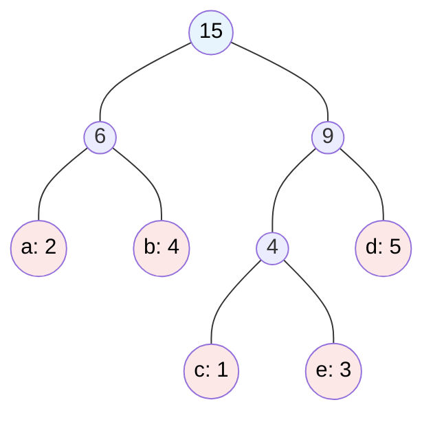

# MASTER COMPUTER SCIENCE HANDBOOK

## Volume 03 — Algorithms and Data Structures
### Part III — Algorithm Design Paradigms
## Chương 17 — Thuật toán Tham lam
### (Greedy Algorithms)

---

### Thông tin chương

| Trường | Giá trị |
|---|---|
| Chương | 17 |
| Thuộc Part | III — Algorithm Design Paradigms |
| Thuộc Volume | 03 — Algorithms and Data Structures |
| Thời gian đọc ước tính | 55–65 phút |
| Độ khó | ★★★☆☆ |
| Kiến thức tiên quyết | Chương 13–16 (Brute Force, Divide/Decrease/Transform and Conquer); Volume 3, Part II — Heap; Volume 1, Part VI — Information Theory (Entropy, cho phần Huffman Coding) |
| Chương liên quan | 18–19 — Dynamic Programming (đối chiếu trực tiếp: khi nào Greedy đúng, khi nào cần DP); Volume 3, Part IV — Kruskal/Prim (Minimum Spanning Tree), Dijkstra (Shortest Path) đều là thuật toán Greedy trên đồ thị |
| Từ khóa | greedy algorithm, greedy-choice property, optimal substructure, activity selection, fractional knapsack, huffman coding, exchange argument |

---

### Mục tiêu học tập

Sau khi hoàn thành chương này, người đọc có thể:

- Định nghĩa thuật toán Tham lam (Greedy) và hai điều kiện toán học cần thiết để nó cho lời giải tối ưu: **greedy-choice property** và **optimal substructure**.
- Triển khai và phân tích ba bài toán Greedy kinh điển: Activity Selection, Fractional Knapsack, và Huffman Coding.
- Sử dụng kỹ thuật **exchange argument (lập luận trao đổi)** để chứng minh tính đúng đắn của một thuật toán Greedy.
- Nhận diện chính xác khi nào Greedy **không** cho lời giải tối ưu — đặc biệt qua phản ví dụ 0/1 Knapsack — và giải thích lý do toán học đằng sau sự thất bại đó.
- Phân biệt rõ ràng Greedy với Dynamic Programming (sẽ học ở Chương 18) như hai chiến lược xử lý bài toán tối ưu hóa có cấu trúc con tối ưu, nhưng khác nhau về cách xử lý các lựa chọn.

---

### Câu hỏi khơi gợi

> *Khi bạn cần đưa ra một quyết định, bạn có bao giờ chọn phương án tốt nhất ngay trước mắt, mà không cân nhắc đến toàn bộ hệ quả về sau — và niềm tin ngầm rằng "hãy cứ chọn cái tốt nhất bây giờ, mọi thứ rồi sẽ ổn"? Chiến lược này đôi khi dẫn đến kết quả tối ưu một cách đáng kinh ngạc, nhưng đôi khi lại dẫn ta vào ngõ cụt tồi tệ. Vậy làm sao để biết trước khi nào nên tin tưởng trực giác "tham lam" đó?*

---

## 1. Tổng quan chương

Ba chương vừa qua (14–16) đã trang bị cho bạn các cách "chuẩn bị lại" một bài toán trước khi giải: chia nhỏ, giảm kích thước, hoặc biến đổi biểu diễn. Chương này đánh dấu một bước ngoặt trong Part III: thay vì tập trung vào cách tổ chức lại bài toán, **Greedy Algorithms (Thuật toán Tham lam)** tập trung vào **cách đưa ra quyết định trong quá trình giải** — cụ thể là luôn chọn lựa chọn tốt nhất *tại thời điểm hiện tại*, mà không bao giờ xem xét lại quyết định đó.

Điều khiến Greedy trở nên đặc biệt thú vị về mặt lý thuyết là: chiến lược đơn giản đến mức "ngây thơ" này — chỉ nhìn về phía trước một bước, không bao giờ quay lại — lại cho ra **lời giải tối ưu tuyệt đối** đối với một số bài toán, nhưng lại cho ra lời giải **sai lệch nghiêm trọng** đối với những bài toán khác trông có vẻ tương tự. Ranh giới giữa hai trường hợp này chính là nội dung cốt lõi của chương.

Chương này có bốn mục tiêu. Thứ nhất, hình thức hóa hai điều kiện toán học — greedy-choice property và optimal substructure — quyết định khi nào Greedy đúng. Thứ hai, minh họa qua ba bài toán kinh điển thuộc ba lĩnh vực khác nhau: lập lịch (Activity Selection), tối ưu tổ hợp liên tục (Fractional Knapsack), và nén dữ liệu (Huffman Coding). Thứ ba, trang bị kỹ thuật chứng minh chuẩn — exchange argument — để xác nhận một thuật toán Greedy thực sự đúng, chứ không chỉ "có vẻ hợp lý". Thứ tư, và quan trọng không kém, trình bày rõ ràng một phản ví dụ nổi tiếng (0/1 Knapsack) nơi Greedy thất bại — chuẩn bị trực tiếp cho Dynamic Programming ở Chương 18.

> **💡 Insight**
> Greedy Algorithms là paradigm đầu tiên trong Part III mà tính đúng đắn **không tự động đảm bảo** chỉ vì thuật toán "có vẻ hợp lý". Khác với Divide and Conquer (Chương 14) — nơi tính đúng đắn gần như luôn được đảm bảo bằng quy nạp cấu trúc — với Greedy, bạn **buộc phải chứng minh** rằng lựa chọn cục bộ tốt nhất thực sự dẫn đến lời giải toàn cục tốt nhất. Đây là lý do chương này dành hẳn một mục riêng cho kỹ thuật chứng minh exchange argument.

---

## 2. Bối cảnh lịch sử

| Thời điểm | Nhân vật / Sự kiện | Đóng góp |
|---|---|---|
| 1930s | Lý thuyết Ma trận (Matroid Theory), Hassler Whitney | Đặt nền móng toán học trừu tượng (matroid) sau này được chứng minh là điều kiện đủ tổng quát để Greedy luôn cho lời giải tối ưu |
| 1956 | Joseph Kruskal | Công bố thuật toán Kruskal tìm Cây khung nhỏ nhất (Minimum Spanning Tree) — một trong những ứng dụng Greedy nổi tiếng nhất trên đồ thị (sẽ học đầy đủ ở Volume 3, Part IV) |
| 1959 | Edsger Dijkstra | Công bố thuật toán Dijkstra tìm đường đi ngắn nhất — một thuật toán Greedy khác trên đồ thị có trọng số không âm |
| 1952 | David A. Huffman | Phát minh **Huffman Coding** khi còn là sinh viên, giải bài toán mã hóa tối ưu bằng một thuật toán Greedy dựa trên cấu trúc cây nhị phân và Heap (Chương 16) |
| 1971 | Jack Edmonds và cộng sự | Hình thức hóa lý thuyết Matroid như điều kiện tổng quát để chứng minh tính đúng đắn của các thuật toán Greedy trên một lớp rộng các bài toán tổ hợp |

> **🔬 Research Connection**
> Câu chuyện về Huffman Coding là một trong những giai thoại nổi tiếng nhất của Computer Science: năm 1951, giáo sư Robert Fano tại MIT giao cho lớp học một bài tập lớn (term paper) là tìm thuật toán mã hóa tối ưu, thay vì phải làm bài thi cuối kỳ. David Huffman, khi đó là sinh viên cao học, gần như đã bỏ cuộc sau nhiều tuần không tìm ra lời giải — cho đến khi ông nhận ra rằng nên xây dựng cây mã hóa **từ dưới lên** (bottom-up), gộp hai phần tử có tần suất thấp nhất lại với nhau trước, thay vì xây dựng từ trên xuống như thầy giáo của ông (và nhiều nhà nghiên cứu khác cùng thời) đã thử và thất bại.

---

## 3. Động lực

Hãy xét một bài toán lập lịch quen thuộc: bạn có một phòng họp duy nhất, và một danh sách các cuộc họp được đề xuất, mỗi cuộc họp có thời gian bắt đầu và kết thúc cố định. Mục tiêu: chọn ra **số lượng cuộc họp tối đa** có thể diễn ra trong phòng đó, sao cho không có hai cuộc họp nào chồng chéo thời gian (bài toán Activity Selection).

Trực giác đầu tiên có thể là: ưu tiên cuộc họp có **thời gian ngắn nhất** trước, để "tiết kiệm" thời gian cho các cuộc họp khác. Nhưng trực giác này, dù nghe hợp lý, thực ra **sai** — một cuộc họp ngắn nhưng nằm ở vị trí "chen ngang" giữa hai cuộc họp dài có thể chặn mất khả năng xếp được nhiều cuộc họp khác.

Trực giác đúng, khá bất ngờ, là: **ưu tiên cuộc họp kết thúc sớm nhất** (không quan tâm đến thời lượng của nó). Bằng cách chọn cuộc họp kết thúc sớm nhất tại mỗi bước, bạn luôn để lại **nhiều không gian trống nhất có thể** cho các cuộc họp còn lại — một lựa chọn cục bộ (local) hóa ra lại tối ưu toàn cục (global). Đây chính là bản chất của Greedy: tìm ra đúng "tiêu chí lựa chọn cục bộ" khiến mọi quyết định tại chỗ luôn dẫn đến kết quả tốt nhất có thể về sau, không cần phải xem xét lại.

Động lực cốt lõi của chương: khi một bài toán có cấu trúc phù hợp, ta có thể **tránh hoàn toàn việc phải xét lại các lựa chọn đã đưa ra** — một cải thiện triệt để so với Backtracking (Chương 20) hay Dynamic Programming (Chương 18–19), vốn phải xem xét nhiều khả năng hoặc lưu lại kết quả trung gian.

---

## 4. Trực giác

**Mô hình tinh thần (Mental Model) của chương này:**

> Thuật toán Tham lam giống như việc bạn leo lên một ngọn núi trong sương mù dày đặc, chỉ nhìn thấy được vài mét xung quanh: tại mỗi bước, bạn luôn chọn hướng đi **dốc lên nhiều nhất ngay trước mắt**, mà không bao giờ quay lại kiểm tra xem có con đường nào khác tốt hơn về lâu dài hay không. Với một số ngọn núi có hình dạng đặc biệt (chỉ có duy nhất một đỉnh, không có "đỉnh giả" — local maximum), chiến lược này chắc chắn đưa bạn đến đỉnh cao nhất. Nhưng với một ngọn núi có nhiều đỉnh giả, bạn có thể bị "mắc kẹt" ở một đỉnh không phải cao nhất.

| Trực giác đời thường | Khái niệm thuật toán tương ứng |
|---|---|
| Luôn chọn hướng dốc lên nhiều nhất ngay trước mắt | **Greedy choice** — lựa chọn cục bộ tốt nhất tại mỗi bước |
| Không bao giờ quay lại xem xét lựa chọn đã đưa ra | Đặc điểm định danh của Greedy: quyết định là **vĩnh viễn (irrevocable)** |
| Núi chỉ có một đỉnh duy nhất → luôn lên đến đỉnh cao nhất | **Greedy-choice property** thỏa mãn → Greedy cho lời giải tối ưu |
| Núi có nhiều đỉnh giả → có thể mắc kẹt | Greedy-choice property **không** thỏa mãn → Greedy có thể cho lời giải sai (như trường hợp 0/1 Knapsack, Mục 14) |

---

## 5. Trực quan hóa khái niệm

**Hình 17.1 — Activity Selection: tại sao "kết thúc sớm nhất" thắng "ngắn nhất"**
*(Visual đặc trưng của chương — Chapter Identity)*

```text
Trục thời gian  →

Cuộc họp A: ▓▓▓▓▓▓▓▓▓▓▓▓▓▓▓▓▓▓▓▓  (dài, 0h–10h)
Cuộc họp B:        ▓▓▓ (ngắn, 4h–5h — "chen ngang")
Cuộc họp C:                      ▓▓▓▓▓▓▓▓▓ (6h–10h)
Cuộc họp D: ▓▓▓ (0h–2h)
Cuộc họp E:            ▓▓▓▓▓ (3h–6h)

Chọn theo "ngắn nhất trước" → chọn B (1h) → chặn mất khả năng ghép D + E + C (3 cuộc họp)
Chọn theo "kết thúc sớm nhất trước" → chọn D (kết thúc 2h) → E (kết thúc 6h) → C (kết thúc 10h)
                                    → tổng cộng 3 cuộc họp, kết quả tối ưu
```

| Trường thông tin | Nội dung |
|---|---|
| Mục đích | Minh họa bằng phản ví dụ cụ thể rằng trực giác "hợp lý" (chọn cuộc họp ngắn nhất) không phải lúc nào cũng đúng — cần chứng minh toán học (Mục 7) chứ không thể chỉ dựa vào cảm giác |
| Điểm mấu chốt | Tiêu chí Greedy đúng đắn (kết thúc sớm nhất) không phải điều "hiển nhiên" — nó là kết quả của một lập luận toán học chặt chẽ, sẽ trình bày đầy đủ ở Mục 7 |

---

**Hình 17.2 — Cây Huffman Coding được xây dựng bằng Greedy + Heap**



*Mục đích:* minh họa cây Huffman được xây dựng **từ dưới lên** — tại mỗi bước, Greedy luôn gộp hai nút có tần suất thấp nhất hiện có (tận dụng lại cấu trúc Min-Heap từ Chương 16) — một minh chứng trực quan cho câu chuyện lịch sử ở Mục 2.

---

## 6. Định nghĩa hình thức

> **📌 Remember — Greedy Algorithm**
>
> **Thuật toán Tham lam (Greedy Algorithm)** giải một bài toán tối ưu hóa bằng cách xây dựng lời giải theo từng bước, và tại mỗi bước, **chọn lựa chọn tốt nhất theo một tiêu chí cục bộ (local criterion)**, không bao giờ xem xét lại lựa chọn đã đưa ra trước đó.
>
> Một thuật toán Greedy cho lời giải **tối ưu toàn cục** khi và chỉ khi bài toán thỏa mãn đồng thời hai điều kiện:
>
> 1. **Greedy-choice property (Tính chất lựa chọn tham lam):** luôn tồn tại một lời giải tối ưu toàn cục có thể đạt được bằng cách thực hiện lựa chọn tham lam (cục bộ tốt nhất) đầu tiên.
> 2. **Optimal substructure (Cấu trúc con tối ưu):** lời giải tối ưu của bài toán chứa trong nó lời giải tối ưu của các bài toán con (sau khi đã thực hiện lựa chọn tham lam đầu tiên).
>
> Nếu chỉ có Optimal Substructure mà không có Greedy-choice Property, thuật toán Greedy có thể cho lời giải **không tối ưu** — đây chính xác là điểm khác biệt cốt lõi với Dynamic Programming (Chương 18), vốn chỉ cần Optimal Substructure (kèm thêm Overlapping Subproblems) mà không cần Greedy-choice Property.

---

## 7. Nền tảng toán học

### 7.1 Chứng minh Activity Selection bằng Exchange Argument

> **📦 Formula Box — Exchange Argument (Lập luận Trao đổi)**
>
> **Ý tưởng:** giả sử tồn tại một lời giải tối ưu $O$ không bắt đầu bằng lựa chọn tham lam $g$. Ta chứng minh có thể **"trao đổi"** — thay thế lựa chọn đầu tiên của $O$ bằng $g$ — để thu được một lời giải mới $O'$, sao cho $O'$ **cũng tối ưu** (không tệ hơn $O$). Điều này chứng tỏ luôn tồn tại một lời giải tối ưu bắt đầu bằng lựa chọn tham lam.
>
> **Áp dụng cho Activity Selection:** gọi $g$ là hoạt động kết thúc sớm nhất. Giả sử lời giải tối ưu $O$ không chọn $g$ đầu tiên, mà chọn hoạt động $k$ khác. Vì $g$ kết thúc sớm nhất, thời gian kết thúc của $g$ luôn $\leq$ thời gian kết thúc của $k$. Do đó, ta có thể **thay $k$ bằng $g$** trong $O$: mọi hoạt động khác trong $O$ vẫn tương thích (không chồng chéo) với $g$, vì $g$ kết thúc không muộn hơn $k$. Lời giải mới $O'$ (đã thay $k$ bằng $g$) có cùng số lượng hoạt động như $O$ — nghĩa là $O'$ cũng tối ưu, và $O'$ bắt đầu bằng lựa chọn tham lam $g$. $\blacksquare$
>
> | Thành phần | Ý nghĩa |
> |---|---|
> | Lời giải tối ưu $O$ | Giả định tồn tại (phản chứng nếu cần) — không nhất thiết là lời giải do Greedy tạo ra |
> | Lựa chọn tham lam $g$ | Lựa chọn theo tiêu chí cục bộ (ở đây: kết thúc sớm nhất) |
> | Phép "trao đổi" | Thay thế một phần tử trong $O$ bằng $g$ mà không làm giảm chất lượng lời giải |
> | **Ứng dụng thường gặp** | Đây là khuôn mẫu chứng minh chuẩn cho hầu hết thuật toán Greedy — bao gồm cả Kruskal, Dijkstra sẽ gặp ở Part IV |

### 7.2 Fractional Knapsack — Tỉ lệ giá trị/trọng lượng

> **📦 Formula Box — Tiêu chí Greedy cho Fractional Knapsack**
>
> $$\text{ratio}_i = \frac{v_i}{w_i}$$
>
> | Thành phần | Ý nghĩa |
> |---|---|
> | $v_i$ | Giá trị (value) của vật phẩm $i$ |
> | $w_i$ | Trọng lượng (weight) của vật phẩm $i$ |
> | $\text{ratio}_i$ | Giá trị trên một đơn vị trọng lượng — tiêu chí để sắp xếp và chọn tham lam |
> | **Diễn giải kỹ thuật** | Vì được phép lấy **một phần** của vật phẩm (fractional — khác 0/1 Knapsack), luôn ưu tiên vật phẩm có tỉ lệ giá trị/trọng lượng cao nhất, lấy càng nhiều càng tốt cho đến khi hết vật phẩm đó hoặc hết sức chứa |
> | **Ứng dụng thường gặp** | Bài toán phân bổ tài nguyên liên tục (continuous resource allocation), nơi việc "chia nhỏ" tài nguyên là khả thi về mặt vật lý (ví dụ: vàng, dầu, thời gian máy chủ) |

---

## 8. Thuật toán / Cơ chế

### 8.1 Activity Selection

```text
Bước 1 — Sắp xếp danh sách hoạt động theo thời gian kết thúc tăng dần
           (áp dụng lại Merge Sort/Presorting — Chương 14, 16)
        │
        ▼
Bước 2 — Chọn hoạt động đầu tiên (kết thúc sớm nhất), đưa vào kết quả
        │
        ▼
Bước 3 — Với mỗi hoạt động tiếp theo (theo thứ tự đã sắp xếp):
        │
        ▼
Bước 4 —   Nếu thời gian bắt đầu của hoạt động này ≥ thời gian
           kết thúc của hoạt động vừa chọn gần nhất:
               Chọn hoạt động này, đưa vào kết quả
        │
        ▼
Bước 5 — Sau khi xét hết danh sách, trả về tập hoạt động đã chọn
```

- **Độ phức tạp:** $O(n \log n)$ — chi phí chủ yếu nằm ở bước sắp xếp (Chương 14/16); phần Greedy chỉ tốn $O(n)$ sau khi đã sắp xếp.

### 8.2 Fractional Knapsack

```text
Bước 1 — Tính tỉ lệ giá trị/trọng lượng cho mọi vật phẩm
        │
        ▼
Bước 2 — Sắp xếp vật phẩm theo tỉ lệ giảm dần
        │
        ▼
Bước 3 — Với mỗi vật phẩm (theo thứ tự đã sắp xếp):
        │
        ▼
Bước 4 —   Nếu còn đủ sức chứa: lấy toàn bộ vật phẩm
           Nếu không đủ: lấy một phần vừa đủ sức chứa còn lại, dừng lại
        │
        ▼
Bước 5 — Trả về tổng giá trị đã tích lũy
```

### 8.3 Huffman Coding

```text
Bước 1 — Tạo một nút lá cho mỗi ký tự, gán trọng số bằng tần suất
           xuất hiện của ký tự đó; đưa tất cả vào một Min-Heap
           (tận dụng lại Heap — Chương 16)
        │
        ▼
Bước 2 — Lặp lại cho đến khi Heap chỉ còn một nút:
        │
        ▼
Bước 3 —   Lấy ra hai nút có trọng số nhỏ nhất từ Heap
        │
        ▼
Bước 4 —   Tạo một nút cha mới, trọng số bằng tổng hai nút con,
           đưa nút cha trở lại Heap
        │
        ▼
Bước 5 — Nút còn lại trong Heap chính là gốc của cây mã hóa Huffman;
           mã nhị phân của mỗi ký tự = đường đi từ gốc đến lá tương ứng
```

> **💡 Insight**
> Huffman Coding là một ví dụ đẹp cho thấy Greedy và Transform and Conquer (Chương 16) không loại trừ lẫn nhau — thuật toán này **là** Greedy (luôn gộp hai nút nhỏ nhất trước) nhưng đồng thời tận dụng triệt để cấu trúc Heap đã giới thiệu ở chương trước như một representation change giúp thao tác "lấy hai phần tử nhỏ nhất" trở nên hiệu quả ($O(\log n)$ mỗi lần thay vì $O(n)$).

---

## 9. Triển khai

```python
import heapq


def activity_selection(activities):
    """activities: danh sách các tuple (start, end).
    Trả về danh sách các hoạt động được chọn (tối đa số lượng)."""
    sorted_acts = sorted(activities, key=lambda a: a[1])   # Sắp xếp theo end
    selected = [sorted_acts[0]]
    last_end = sorted_acts[0][1]

    for start, end in sorted_acts[1:]:
        if start >= last_end:               # Greedy choice: không chồng chéo
            selected.append((start, end))
            last_end = end

    return selected


def fractional_knapsack(items, capacity):
    """items: danh sách các tuple (value, weight).
    Trả về tổng giá trị tối đa có thể lấy với sức chứa capacity."""
    sorted_items = sorted(items, key=lambda x: x[0] / x[1], reverse=True)
    total_value = 0.0
    remaining = capacity

    for value, weight in sorted_items:
        if remaining <= 0:
            break
        take = min(weight, remaining)       # Lấy toàn bộ hoặc một phần
        total_value += value * (take / weight)
        remaining -= take

    return total_value


def huffman_coding(frequencies):
    """frequencies: dict {ký tự: tần suất}.
    Trả về dict {ký tự: mã nhị phân dạng chuỗi}."""
    heap = [[freq, [char, ""]] for char, freq in frequencies.items()]
    heapq.heapify(heap)                     # Transform (Chương 16)

    if len(heap) == 1:                      # Trường hợp đặc biệt: 1 ký tự
        char = heap[0][1][0]
        return {char: "0"}

    while len(heap) > 1:                    # Greedy: gộp 2 nút nhỏ nhất
        lo = heapq.heappop(heap)
        hi = heapq.heappop(heap)
        for pair in lo[1:]:
            pair[1] = "0" + pair[1]
        for pair in hi[1:]:
            pair[1] = "1" + pair[1]
        merged = [lo[0] + hi[0]] + lo[1:] + hi[1:]
        heapq.heappush(heap, merged)

    result = heap[0]
    return {char: code for char, code in result[1:]}
```

Ba hàm trên triển khai đúng ba bài toán ở Mục 8, đều dùng chung khuôn mẫu Greedy: sắp xếp/tổ chức theo tiêu chí cục bộ, rồi duyệt một lần và quyết định dứt khoát tại mỗi bước, không bao giờ quay lại.

---

## 10. Trực quan hóa quá trình thực thi

**Vết thực thi của `activity_selection([(1,4),(3,5),(0,6),(5,7),(8,9),(5,9)])`:**

| Bước | Hoạt động xét (sau khi sắp xếp theo end) | Quyết định | `last_end` |
|---|---|---|---|
| 1 | (1,4) | Chọn (kết thúc sớm nhất) | 4 |
| 2 | (3,5) | Loại (3 < 4, chồng chéo) | 4 |
| 3 | (0,6) | Loại (0 < 4, chồng chéo) | 4 |
| 4 | (5,7) | Chọn (5 ≥ 4) | 7 |
| 5 | (5,9) | Loại (5 < 7, chồng chéo) | 7 |
| 6 | (8,9) | Chọn (8 ≥ 7) | 9 |

Kết quả: `[(1,4), (5,7), (8,9)]` — 3 hoạt động, kết quả tối ưu (có thể kiểm chứng bằng cách liệt kê thủ công các phương án khác).

**Kiểm chứng `huffman_coding` với tần suất `{'a':2,'b':4,'c':1,'d':5,'e':3}`:**

Cây kết quả khớp với Hình 17.2. Mã nhị phân thu được (một khả năng hợp lệ, có thể khác tùy thứ tự phá vỡ hòa — tie-breaking): `a: 001, b: 01, c: 000, d: 11, e: 10` — độ dài mã tỉ lệ nghịch với tần suất, đúng nguyên tắc nén tối ưu: ký tự xuất hiện nhiều (d, tần suất 5) được mã hóa ngắn nhất.

---

## 11. Ứng dụng công nghiệp

> **🛠 Engineering Practice**
> Greedy Algorithms là nền tảng của nhiều hệ thống lập lịch và tối ưu hóa thời gian thực, nơi việc tính toán lời giải tối ưu bằng các phương pháp phức tạp hơn (Dynamic Programming, Chương 18) là không khả thi về mặt thời gian.

| Bối cảnh công nghiệp | Vai trò của Greedy |
|---|---|
| Bộ lập lịch hệ điều hành (CPU Scheduling — Shortest Job First) | Áp dụng trực tiếp tư duy tương tự Activity Selection để tối đa hóa số tiến trình hoàn thành trong một khung thời gian |
| Nén dữ liệu (ZIP, GZIP, JPEG, MP3) | Huffman Coding (hoặc biến thể của nó) là một thành phần tiêu chuẩn trong hầu hết các định dạng nén dữ liệu phổ biến |
| Định tuyến mạng (Network Routing) | Thuật toán Dijkstra (Greedy trên đồ thị, Volume 3 Part IV) là nền tảng của nhiều giao thức định tuyến (OSPF) |
| Hệ thống phân bổ tài nguyên đám mây (Cloud Resource Allocation) | Các bài toán phân bổ CPU/RAM theo tỉ lệ giá trị/chi phí thường dùng biến thể của Fractional Knapsack để tối ưu hóa nhanh, chấp nhận đánh đổi độ chính xác tuyệt đối lấy tốc độ tính toán |

---

## 12. Góc nhìn nghiên cứu

> **🔬 Research Connection**
> Câu hỏi "khi nào Greedy đúng?" đã được tổng quát hóa hoàn toàn bằng **Lý thuyết Matroid (Matroid Theory)** — một nhánh của toán học tổ hợp.

Matroid là một cấu trúc toán học trừu tượng hóa khái niệm "độc lập tuyến tính" (từ Đại số Tuyến tính, Volume 1) sang các hệ tổ hợp tổng quát hơn. Một kết quả đẹp và sâu sắc của lý thuyết này: **một bài toán tối ưu hóa tổ hợp có thể giải đúng bằng Greedy khi và chỉ khi cấu trúc tổ hợp của nó tạo thành một Matroid**. Kết quả này giải thích một cách thống nhất tại sao Activity Selection, Kruskal's Algorithm (Minimum Spanning Tree, Part IV), và nhiều bài toán Greedy khác đều đúng — chúng đều có cấu trúc Matroid ẩn bên dưới, dù thoạt nhìn có vẻ không liên quan gì đến đại số tuyến tính.

**Câu hỏi mở** để suy ngẫm khi bước sang Chương 18: nếu Matroid Theory cho một điều kiện *đủ* (và trong nhiều trường hợp là *cần*) để Greedy đúng, vậy với những bài toán **không** có cấu trúc Matroid (như 0/1 Knapsack, Mục 14) — liệu có một cấu trúc toán học tổng quát khác giải thích tại sao Dynamic Programming lại hoạt động đúng ở đó? Câu trả lời sẽ dần được khám phá ở Chương 18–19.

---

## 13. Ưu điểm

- **Hiệu quả vượt trội về thời gian chạy** — thường chỉ cần một lần sắp xếp ($O(n \log n)$) và một lần duyệt tuyến tính ($O(n)$), nhanh hơn nhiều so với Dynamic Programming hay Backtracking cho cùng lớp bài toán (khi Greedy áp dụng được).
- **Cài đặt đơn giản, ít mã nguồn** — không cần bảng ghi nhớ (memoization table) hay cấu trúc dữ liệu phức tạp để lưu trạng thái trung gian.
- **Không cần bộ nhớ phụ đáng kể** — vì không phải lưu lại lời giải của các bài toán con như Dynamic Programming.
- **Có công cụ chứng minh chuẩn hóa (exchange argument, matroid theory)** — không phải "may rủi", mà có phương pháp toán học rõ ràng để xác nhận tính đúng đắn.

---

## 14. Hạn chế

> **⚠️ Common Mistake**
> Sai lầm nghiêm trọng và phổ biến nhất khi học Greedy là **áp dụng nó cho một bài toán mà chưa chứng minh Greedy-choice Property** — chỉ vì thuật toán "chạy được" và "cho ra một kết quả" không có nghĩa là kết quả đó tối ưu.

**Phản ví dụ kinh điển: 0/1 Knapsack.** Xét bài toán Knapsack, nhưng với ràng buộc **chỉ được lấy toàn bộ hoặc không lấy** mỗi vật phẩm (khác Fractional Knapsack ở Mục 8.2, không được lấy một phần). Giả sử sức chứa là 10, có ba vật phẩm: $(v=60, w=10)$, $(v=100, w=20)$, $(v=120, w=30)$ — với các tỉ lệ giá trị/trọng lượng lần lượt là 6, 5, 4.

Nếu áp dụng Greedy theo tỉ lệ giá trị/trọng lượng (như Fractional Knapsack), ta sẽ chọn vật phẩm đầu tiên (tỉ lệ 6, trọng lượng 10) — vừa đủ sức chứa, giá trị thu được: 60. Nhưng lời giải tối ưu thực sự (kiểm tra bằng cách xét mọi tổ hợp — chỉ khả thi với Brute Force hoặc Dynamic Programming, Chương 18) trong nhiều biến thể của bài toán này lại có thể kết hợp các vật phẩm khác cho tổng giá trị cao hơn. Nguyên nhân gốc rễ: khi bị ràng buộc "toàn bộ hoặc không", **greedy-choice property bị phá vỡ** — chọn vật phẩm có tỉ lệ tốt nhất trước có thể "lãng phí" sức chứa còn lại một cách không tối ưu, điều không thể xảy ra ở phiên bản Fractional (nơi luôn có thể lấy phần dư thừa một cách chính xác).

- **Không có cách "tổng quát" để biết Greedy có đúng hay không** mà không qua chứng minh cụ thể (exchange argument hoặc matroid theory) cho từng bài toán.
- **Một khi đã đưa ra quyết định, không thể sửa lại** — nếu tiêu chí lựa chọn sai, toàn bộ lời giải có thể sai mà không có cơ chế "quay lui" như Backtracking (Chương 20).
- **Dễ nhầm lẫn giữa "một lời giải hợp lệ" và "lời giải tối ưu"** — Greedy luôn cho ra một lời giải khả thi (feasible), nhưng khả thi không đồng nghĩa với tối ưu.

---

## 15. So sánh

**Bảng 17.1 — Greedy so với Dynamic Programming (xem trước Chương 18)**

| Tiêu chí | Greedy | Dynamic Programming |
|---|---|---|
| Cách xử lý lựa chọn | Quyết định dứt khoát tại mỗi bước, không xem lại | Xem xét (hoặc lưu lại kết quả của) nhiều lựa chọn có thể |
| Điều kiện cần | Greedy-choice Property + Optimal Substructure | Chỉ cần Optimal Substructure + Overlapping Subproblems |
| Độ phức tạp điển hình | Thường $O(n \log n)$ | Thường $O(n^2)$ hoặc cao hơn |
| Ví dụ | Activity Selection, Fractional Knapsack, Huffman Coding | 0/1 Knapsack, Longest Common Subsequence (Chương 18) |
| Rủi ro | Có thể cho lời giải sai nếu áp dụng nhầm bài toán | Luôn đúng nếu có Optimal Substructure, nhưng chậm hơn |

**Phân tích:** Bảng trên là bảng so sánh quan trọng nhất của toàn Part III — nó trả lời trực tiếp câu hỏi mà nhiều người học thuật toán gặp khó khăn nhất: *"bài toán này nên giải bằng Greedy hay Dynamic Programming?"* Câu trả lời ngắn gọn: nếu bạn có thể chứng minh Greedy-choice Property (thường bằng exchange argument), dùng Greedy vì nó nhanh hơn; nếu không thể (hoặc đã tìm ra phản ví dụ như 0/1 Knapsack), chuyển sang Dynamic Programming — chủ đề của hai chương tiếp theo.

---

## 16. Tóm tắt

- **Greedy Algorithm** xây dựng lời giải bằng cách chọn lựa chọn tốt nhất theo tiêu chí cục bộ tại mỗi bước, không bao giờ xem xét lại.
- Greedy cho lời giải **tối ưu toàn cục** khi và chỉ khi bài toán có cả **Greedy-choice Property** và **Optimal Substructure**.
- **Exchange Argument** là kỹ thuật chứng minh chuẩn: giả sử một lời giải tối ưu không bắt đầu bằng lựa chọn tham lam, chứng minh có thể "trao đổi" để thu được lời giải tối ưu khác mà có bắt đầu bằng lựa chọn tham lam.
- Ba ví dụ kinh điển: **Activity Selection** (chọn theo thời gian kết thúc sớm nhất, $O(n \log n)$), **Fractional Knapsack** (chọn theo tỉ lệ giá trị/trọng lượng), **Huffman Coding** (gộp hai nút tần suất thấp nhất, dùng lại Heap từ Chương 16).
- **0/1 Knapsack** là phản ví dụ quan trọng: cùng bản chất bài toán tối ưu hóa như Fractional Knapsack, nhưng ràng buộc "toàn bộ hoặc không" phá vỡ Greedy-choice Property, khiến Greedy không còn cho lời giải tối ưu.
- **Lý thuyết Matroid** cung cấp một điều kiện toán học tổng quát để xác định khi nào một bài toán tổ hợp có thể giải đúng bằng Greedy.

Chương 18 (Dynamic Programming I) sẽ giải quyết chính xác lớp bài toán mà Greedy thất bại — bắt đầu bằng việc quay lại phân tích kỹ 0/1 Knapsack, lần này bằng một chiến lược mới: lưu lại và tái sử dụng kết quả của các bài toán con, thay vì đưa ra quyết định dứt khoát ngay lập tức.

---

## 17. Bài tập

### Mức Cơ bản (Basic)

1. Mô phỏng từng bước của `activity_selection` với danh sách hoạt động `[(1,3),(2,4),(3,5),(0,7)]` theo đúng định dạng bảng vết thực thi ở Mục 10.
2. Với ba vật phẩm $(v=10, w=2)$, $(v=20, w=4)$, $(v=30, w=6)$ và sức chứa 10, tính tổng giá trị tối đa bằng Fractional Knapsack, trình bày rõ từng bước chọn.
3. Giải thích bằng lời tại sao tiêu chí "chọn hoạt động ngắn nhất trước" không đảm bảo tối ưu cho Activity Selection, dựa trên phản ví dụ ở Hình 17.1.

### Mức Trung bình (Intermediate)

4. Áp dụng đầy đủ kỹ thuật Exchange Argument (theo khuôn mẫu ở Mục 7.1) để tự viết lại chứng minh tính đúng đắn của Fractional Knapsack: giả sử lời giải tối ưu không chọn vật phẩm có tỉ lệ giá trị/trọng lượng cao nhất trước, chứng minh có thể "trao đổi" để thu được lời giải tốt hơn hoặc bằng.
5. Với tần suất ký tự `{'x':10,'y':15,'z':30,'w':5}`, xây dựng cây Huffman theo đúng các bước ở Mục 8.3 (vẽ tay hoặc mô phỏng bằng code), và tính độ dài trung bình của mã (weighted average code length). So sánh với mã hóa cố định (fixed-length, ví dụ 2 bit cho mỗi ký tự trong 4 ký tự).

### Mức Nâng cao (Advanced)

6. Chứng minh bằng phản ví dụ cụ thể (khác với ví dụ ở Mục 14) rằng áp dụng Greedy theo tỉ lệ giá trị/trọng lượng cho 0/1 Knapsack có thể cho kết quả tệ hơn lời giải tối ưu ít nhất 20%. Xây dựng bộ dữ liệu cụ thể (giá trị, trọng lượng, sức chứa) và tính toán chính xác cả hai kết quả (Greedy và tối ưu thực sự, tìm bằng cách liệt kê mọi tổ hợp khả dĩ).
7. Bài toán **Coin Change** (đổi tiền với số lượng đồng xu tối thiểu) có thể giải đúng bằng Greedy với hệ thống tiền tệ tiêu chuẩn (ví dụ: 1, 5, 10, 25 cent của Mỹ), nhưng **sai** với một số hệ thống tiền tệ khác (ví dụ mệnh giá 1, 3, 4). Tìm một bộ mệnh giá cụ thể và một số tiền cụ thể mà Greedy (luôn chọn đồng xu mệnh giá lớn nhất có thể) cho kết quả không tối ưu, và chỉ ra lời giải tối ưu thực sự.

### Mức Nghiên cứu (Research)

8. Tìm hiểu (không cần chứng minh chi tiết) khái niệm **Matroid** trong toán học tổ hợp (gợi ý: định nghĩa qua "hệ độc lập" thỏa mãn tính chất trao đổi — exchange property tương tự nhưng ở cấp độ tổng quát hơn Mục 7.1). Viết một đoạn ngắn (200–300 từ) giải thích bằng ngôn ngữ của riêng bạn: tại sao Activity Selection có thể được mô hình hóa như một Matroid, trong khi 0/1 Knapsack thì không (gợi ý: xem xét tính chất "tính kế thừa" — hereditary property — của các tập con khả thi trong mỗi bài toán).

---

## 18. Dự án nhỏ

**Dự án: Công cụ nén văn bản bằng Huffman Coding**

- **Mục tiêu:** xây dựng một chương trình Python hoàn chỉnh nén và giải nén một tệp văn bản bằng thuật toán Huffman Coding.
- **Yêu cầu:**
  - Đọc một tệp văn bản, tính tần suất xuất hiện của từng ký tự.
  - Xây dựng cây Huffman và bảng mã theo đúng đặc tả ở Mục 8.3 và 9.
  - Mã hóa toàn bộ văn bản thành một chuỗi bit, và tính tỉ lệ nén (compression ratio) so với mã hóa cố định (8 bit/ký tự, ASCII chuẩn).
  - Viết hàm giải nén (decode), khôi phục lại chính xác văn bản gốc từ chuỗi bit đã mã hóa và cây Huffman.
- **Công nghệ đề xuất:** Python, module `heapq`.
- **Kết quả mong đợi:** một báo cáo ngắn cho biết tỉ lệ nén đạt được trên ít nhất ba văn bản mẫu có đặc điểm tần suất ký tự khác nhau (ví dụ: văn bản tiếng Anh thông thường, văn bản có nhiều ký tự lặp lại, văn bản với phân bố tần suất gần như đồng đều).
- **Hướng mở rộng:** so sánh tỉ lệ nén của Huffman Coding với các thuật toán nén phổ biến khác (ví dụ Run-Length Encoding) trên cùng bộ dữ liệu, và giải thích khi nào Huffman Coding vượt trội hơn.

---

## 19. Tự đánh giá

- [ ] Tôi có thể phát biểu chính xác hai điều kiện (Greedy-choice Property và Optimal Substructure) cần thiết để Greedy cho lời giải tối ưu.
- [ ] Tôi có thể tự viết lại một chứng minh Exchange Argument đơn giản (ví dụ cho Activity Selection hoặc Fractional Knapsack) mà không cần nhìn lại Mục 7.
- [ ] Tôi có thể giải thích chính xác tại sao Greedy thất bại trên 0/1 Knapsack, và chỉ rõ điều kiện toán học nào bị phá vỡ.
- [ ] Tôi có thể tự tay xây dựng một cây Huffman cho một bộ tần suất ký tự cho trước, và giải thích tại sao ký tự tần suất cao nhận mã ngắn nhất.
- [ ] Tôi hiểu sự khác biệt cốt lõi giữa Greedy và Dynamic Programming (Bảng 17.1), và có thể dự đoán (dù chưa chắc chắn 100%) một bài toán mới nên thử Greedy hay chuẩn bị sẵn tinh thần cần Dynamic Programming.

Nếu Bài tập 7 (Coin Change phản ví dụ) khiến bạn ngạc nhiên — vì trực giác "luôn dùng đồng xu mệnh giá lớn nhất trước" quá tự nhiên đến mức khó tin là sai — đây chính xác là bài học cốt lõi của chương này: **trực giác không thay thế được chứng minh**. Đây là sự chuẩn bị tinh thần tốt nhất trước khi bước vào Chương 18, nơi Dynamic Programming sẽ giải đúng cả những bài toán mà Greedy thất bại.

---

## 20. Đọc thêm

- **Sách:** Thomas H. Cormen, Charles E. Leiserson, Ronald L. Rivest, Clifford Stein, *Introduction to Algorithms* (CLRS) — Chương về Greedy Algorithms, chứng minh chi tiết Activity Selection và Huffman Coding bằng Exchange Argument và Matroid Theory. *(Xem BOOKS.md — Volume 3.)*
- **Sách:** Jon Kleinberg, Éva Tardos, *Algorithm Design* — trình bày trực quan về Greedy với nhiều ví dụ ứng dụng thực tế.
- **Chủ đề mở rộng (không bắt buộc):** tìm đọc bài báo gốc của David Huffman (1952), "A Method for the Construction of Minimum-Redundancy Codes" — một trong những bài báo ngắn gọn và có ảnh hưởng lớn nhất lịch sử Computer Science.
- **Chương tiếp theo:** Chương 18 — Dynamic Programming I: Nền tảng và Bài toán Kinh điển.

---

### Liên kết chương (Cross References)

- **Chương trước:** Chương 16 — Transform and Conquer (Huffman Coding tận dụng trực tiếp cấu trúc Heap giới thiệu ở đó).
- **Chương tiếp theo:** Chương 18 — Dynamic Programming I (giải quyết chính xác lớp bài toán mà Greedy thất bại, bắt đầu bằng việc phân tích lại 0/1 Knapsack).
- **Chương liên quan xa hơn:** Chương 19 — Dynamic Programming II; Volume 3, Part IV — Kruskal's Algorithm và Prim's Algorithm (Minimum Spanning Tree), Dijkstra's Algorithm (Shortest Path) — đều là các thuật toán Greedy trên đồ thị, dùng lại chính kỹ thuật Exchange Argument học ở đây; Volume 1, Part VI — Information Theory (nền tảng Entropy giải thích tại sao Huffman Coding đạt gần độ dài mã hóa lý thuyết tối ưu).
- **Vị trí trong Knowledge Graph:** Nút thứ năm của Volume 3, Part III — điểm bản lề quan trọng, mở đầu nhóm "thuật toán ra quyết định" (Greedy, Dynamic Programming, Backtracking, Branch and Bound) sau khi đã hoàn thành nhóm "biến đổi bài toán" (Chương 14–16); là điều kiện tiên quyết trực tiếp và cần thiết cho Chương 18.

---

*Hết Chương 17. Chương này tuân thủ đầy đủ cấu trúc 20 mục của `OUTPUT.md` và chuẩn Presentation Layer của `WRITING_STANDARD.md`, khớp với outline đã thống nhất cho Volume 3, Part III. Chương đặc biệt chú trọng trình bày trung thực cả điều kiện Greedy đúng (Exchange Argument, Matroid Theory) lẫn phản ví dụ Greedy sai (0/1 Knapsack, Coin Change phi chuẩn) để tránh gieo cấy ngộ nhận rằng Greedy luôn đáng tin cậy. Đang chờ rà soát trước khi tiếp tục sang Chương 18 — Dynamic Programming I.*
